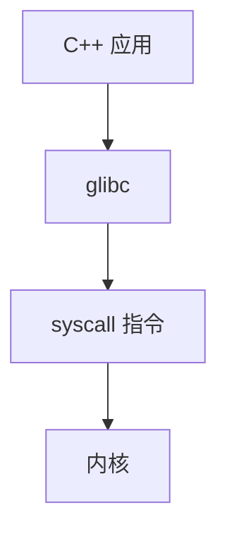

# 操作系统原理深入学习

> **文件编码**：UTF-8。  
> **定位**：比 [53 章 OS 面试](53-操作系统面试八股与口述模板.md) 更 **原理化**——进程/线程、调度、虚拟内存、文件系统、IPC 的推导与图示。  
> **环境**：示例以 **Linux** 为主（与 [11 章](11-Linux与系统编程入门.md) 衔接）。

## §0 读前导读

### §0.1 用一句话弄懂本章

**OS 在硬件之上提供抽象**：进程隔离地址空间、线程共享内存、调度分配 CPU、虚拟内存用页表换容量、文件系统用 inode 组织持久化——C++ 服务端每一行 `new`/`mutex`/`open` 都落在这些机制上。

### §0.2 你需要提前知道什么

- [53 章](53-操作系统面试八股与口述模板.md) 口述模板（可对照）
- [11 章](11-Linux与系统编程入门.md) 系统调用入门
- [08 章](08-多线程与并发编程.md) C++ 线程
- [02 章](02-指针引用与内存管理.md) 地址空间直觉

### §0.3 本章知识地图（☐→☑）

- [ ] 进程 vs 线程资源表
- [ ] CFS 调度与 vruntime
- [ ] 虚拟地址到物理页转换
- [ ] 缺页中断与换页算法
- [ ] inode 与目录项
- [ ] pipe/shared memory/message queue
- [ ] fork/exec 与 C++ 注意点
- [ ] 闭卷自测 ≥8/10

### §0.4 建议学习时长

**7～9 天**

### §0.5 学完你能做什么

读 `/proc` 理解进程；解释 mmap 与堆；设计多进程 worker；排查 swap 抖动；与 72 章加载衔接。

### §0.6 交叉阅读

- [53 章 OS 面试](53-操作系统面试八股与口述模板.md)
- [11 章 Linux 入门](11-Linux与系统编程入门.md)
- [23 章 高性能 Server](23-IO多路复用与高性能Server.md)
- [72 章 链接与 ELF](72-链接器加载器与可执行文件格式.md)

---

## 本章与上一章的关系

[70 章](70-计算机体系结构深入学习.md) 为本章铺垫；本章在其基础上 **原理化、教材化** 展开，与面试速记章互补而非重复。

---

## 1. 操作系统接口与系统调用


用户态 C++ 通过 **libc 包装的系统调用** 请求内核服务：



```cpp
#include <unistd.h>
#include <fcntl.h>
// open/read/write 最终 syscall
```

**上下文切换** 代价：保存寄存器、切换页表、cache 冷（与 70 章 NUMA/cache 联动）。


## 2. 进程模型


进程 = **资源容器**：独立虚拟地址空间、文件描述符表、信号处理、PID。

```cpp
#include <unistd.h>
#include <iostream>
pid_t pid = fork();
if (pid == 0) {
    std::cout << "child\n";
    _exit(0);
} else {
    wait(nullptr);
}
```

**C++ 注意**：`fork` 后仅 **async-signal-safe** 函数安全；子进程若继续用已存在的 `std::mutex` 可能死锁——多线程程序 `fork` 后应 **`exec`** 新程序而非跑复杂 C++。


## 3. 线程模型


Linux **轻量级进程 LWP** 与 pthread 1:1；线程共享地址空间与 fd，独立栈与寄存器。

| 资源 | 进程 | 线程 |
|------|------|------|
| 地址空间 | 独立 | 共享 |
| 栈 | 独立 | 独立 |
| fd | 独立（可 CLONE） | 共享 |

[08 章](08-多线程与并发编程.md) `std::thread` 映射到 pthread；`thread_local` 对应 TLS 段（72 章 ELF）。


## 4. CPU 调度算法


**时间片轮转 RR**：就绪队列，每进程 quantum。

**CFS（Completely Fair Scheduler）**：Linux 默认，**vruntime** 红黑树选最小者：

```text
vruntime += delta_exec * (NICE_0_LOAD / weight)
```

**实时调度** SCHED_FIFO/RR；**绑核** `sched_setaffinity` 减少迁移（70 章 NUMA）。

服务端：**worker 数 ≈ 物理核** 用于 CPU bound；IO bound 可更多线程 + epoll（23 章）。


## 5. 虚拟内存：页表


虚拟地址分割（x86-64 Linux 典型）：

```text
用户空间: 0x0000 ... 0x7FFF...
内核空间: 0xFFFF ... 
```

**多级页表** 节省内存：64 位仅映射用到的 L1 项。

```cpp
// 每次指针解引用硬件 walk 页表；TLB 缓存（70 章）
int* p = new int(42);
```

**大页**：`mmap` 大区域可申请 hugetlbfs 减 TLB miss。


## 6. 缺页中断与换页


| 缺页类型 | 处理 |
|----------|------|
|  major fault | 读盘/分配页框 |
|  minor fault | 已在内核，仅建映射 |

**页面置换**：LRU 近似（active/inactive list）、**swap** 换出冷页。

```bash
free -h
vmstat 1
```

C++ **分配器**（24 章）频繁 `mmap`/`munmap` 触发缺页——池化降低 syscall 与 fault。


## 7. 文件系统 inode 与 ext4


**inode** 存元数据（权限、大小、块指针）；**目录项** 映射文件名→inode。

```bash
ls -i file.txt    # inode 号
stat file.txt
```

**ext4** 特性：extent 树、journal、延迟分配。

```cpp
#include <fstream>
std::fstream f("data.bin", std::ios::binary | std::ios::app);
```

**硬链接 vs 软链接**：硬链接同 inode 计数；软链接新 inode 存路径。

与 [49 章 IO](49-IO流与文件操作完全指南.md) 对照：流缓冲在用户态，最终 `write()` syscall。


## 8. 进程间通信 IPC


| 机制 | 特点 | C++ 场景 |
|------|------|----------|
| pipe | 单向、亲缘 | shell 管道 |
| Unix domain socket | 双向、本机 | 本地 RPC |
| shared memory | 最快、需同步 | 大吞吐日志、SHM 队列 |
| message queue | 内核缓冲 | 较少在新项目 |

```cpp
// POSIX shm 示意
#include <sys/mman.h>
#include <fcntl.h>
void* addr = mmap(nullptr, size, PROT_READ|PROT_WRITE,
                  MAP_SHARED, fd, 0);
```

同步仍用 **mutex/semaphore**（08 章）；无锁 ring buffer 见 25/23 章。


## 9. 加载可执行文件（衔接 72 章）


`execve` 读 ELF **Program Header**，`mmap` 映射 PT_LOAD，重定位 **GOT/PLT**，跳转 `_start` → `main`。


[72 章](72-链接器加载器与可执行文件格式.md) 详述格式；[69 章](69-编译原理入门与C++编译流程.md) 产出 ELF 的上游。


## 10. C++ 运行期与 OS 交互清单


| C++ 特性 | OS 机制 |
|----------|---------|
| `new/delete` | brk/mmap 堆 |
| `std::thread` | clone/pthread |
| `std::mutex` | futex |
| 静态局部初始化 | 首次调用 guard |
| 异常展开 | unwind + `.eh_frame` |

**容器内存**：`vector` 增长可能 `mremap` 或新 mmap+拷贝（实现定义）。


## 11.1 场景推演：服务器内存压力 #1


#### 11.1.1 场景

C++ HTTP 服务 RSS 持续增长，swap 使用上升，P99 延迟恶化。

#### 11.1.2 诊断链

```bash
ps aux | grep server
pmap -x <pid>
cat /proc/<pid>/smaps_rollup
```

区分 **堆泄漏**（12 章 Valgrind）vs **cache 合法增长** vs **mmap 未归还**。

#### 11.1.3 原理

内核 **overcommit** 策略影响 OOM killer；swap 换出导致 **major fault** 毫秒级（70 章）。

#### 11.1.4 缓解

- 限制容器 memory（62 章 K8s limits）
- jemalloc/tcmalloc 统计（24 章）
- `MADV_DONTNEED` 归还冷页（高级）

#### 11.1.5 与 61 章

[61 章 线上故障排查](61-线上故障排查与性能诊断实战.md) 提供 STAR 模板；本章提供 **机制层** 解释。


## 11.2 场景推演：服务器内存压力 #2


#### 11.2.1 场景

C++ HTTP 服务 RSS 持续增长，swap 使用上升，P99 延迟恶化。

#### 11.2.2 诊断链

```bash
ps aux | grep server
pmap -x <pid>
cat /proc/<pid>/smaps_rollup
```

区分 **堆泄漏**（12 章 Valgrind）vs **cache 合法增长** vs **mmap 未归还**。

#### 11.2.3 原理

内核 **overcommit** 策略影响 OOM killer；swap 换出导致 **major fault** 毫秒级（70 章）。

#### 11.2.4 缓解

- 限制容器 memory（62 章 K8s limits）
- jemalloc/tcmalloc 统计（24 章）
- `MADV_DONTNEED` 归还冷页（高级）

#### 11.2.5 与 61 章

[61 章 线上故障排查](61-线上故障排查与性能诊断实战.md) 提供 STAR 模板；本章提供 **机制层** 解释。


## 11.3 场景推演：服务器内存压力 #3


#### 11.3.1 场景

C++ HTTP 服务 RSS 持续增长，swap 使用上升，P99 延迟恶化。

#### 11.3.2 诊断链

```bash
ps aux | grep server
pmap -x <pid>
cat /proc/<pid>/smaps_rollup
```

区分 **堆泄漏**（12 章 Valgrind）vs **cache 合法增长** vs **mmap 未归还**。

#### 11.3.3 原理

内核 **overcommit** 策略影响 OOM killer；swap 换出导致 **major fault** 毫秒级（70 章）。

#### 11.3.4 缓解

- 限制容器 memory（62 章 K8s limits）
- jemalloc/tcmalloc 统计（24 章）
- `MADV_DONTNEED` 归还冷页（高级）

#### 11.3.5 与 61 章

[61 章 线上故障排查](61-线上故障排查与性能诊断实战.md) 提供 STAR 模板；本章提供 **机制层** 解释。


## 11.4 场景推演：服务器内存压力 #4


#### 11.4.1 场景

C++ HTTP 服务 RSS 持续增长，swap 使用上升，P99 延迟恶化。

#### 11.4.2 诊断链

```bash
ps aux | grep server
pmap -x <pid>
cat /proc/<pid>/smaps_rollup
```

区分 **堆泄漏**（12 章 Valgrind）vs **cache 合法增长** vs **mmap 未归还**。

#### 11.4.3 原理

内核 **overcommit** 策略影响 OOM killer；swap 换出导致 **major fault** 毫秒级（70 章）。

#### 11.4.4 缓解

- 限制容器 memory（62 章 K8s limits）
- jemalloc/tcmalloc 统计（24 章）
- `MADV_DONTNEED` 归还冷页（高级）

#### 11.4.5 与 61 章

[61 章 线上故障排查](61-线上故障排查与性能诊断实战.md) 提供 STAR 模板；本章提供 **机制层** 解释。


## 11.5 场景推演：服务器内存压力 #5


#### 11.5.1 场景

C++ HTTP 服务 RSS 持续增长，swap 使用上升，P99 延迟恶化。

#### 11.5.2 诊断链

```bash
ps aux | grep server
pmap -x <pid>
cat /proc/<pid>/smaps_rollup
```

区分 **堆泄漏**（12 章 Valgrind）vs **cache 合法增长** vs **mmap 未归还**。

#### 11.5.3 原理

内核 **overcommit** 策略影响 OOM killer；swap 换出导致 **major fault** 毫秒级（70 章）。

#### 11.5.4 缓解

- 限制容器 memory（62 章 K8s limits）
- jemalloc/tcmalloc 统计（24 章）
- `MADV_DONTNEED` 归还冷页（高级）

#### 11.5.5 与 61 章

[61 章 线上故障排查](61-线上故障排查与性能诊断实战.md) 提供 STAR 模板；本章提供 **机制层** 解释。


## 11.6 场景推演：服务器内存压力 #6


#### 11.6.1 场景

C++ HTTP 服务 RSS 持续增长，swap 使用上升，P99 延迟恶化。

#### 11.6.2 诊断链

```bash
ps aux | grep server
pmap -x <pid>
cat /proc/<pid>/smaps_rollup
```

区分 **堆泄漏**（12 章 Valgrind）vs **cache 合法增长** vs **mmap 未归还**。

#### 11.6.3 原理

内核 **overcommit** 策略影响 OOM killer；swap 换出导致 **major fault** 毫秒级（70 章）。

#### 11.6.4 缓解

- 限制容器 memory（62 章 K8s limits）
- jemalloc/tcmalloc 统计（24 章）
- `MADV_DONTNEED` 归还冷页（高级）

#### 11.6.5 与 61 章

[61 章 线上故障排查](61-线上故障排查与性能诊断实战.md) 提供 STAR 模板；本章提供 **机制层** 解释。


## 11.7 场景推演：服务器内存压力 #7


#### 11.7.1 场景

C++ HTTP 服务 RSS 持续增长，swap 使用上升，P99 延迟恶化。

#### 11.7.2 诊断链

```bash
ps aux | grep server
pmap -x <pid>
cat /proc/<pid>/smaps_rollup
```

区分 **堆泄漏**（12 章 Valgrind）vs **cache 合法增长** vs **mmap 未归还**。

#### 11.7.3 原理

内核 **overcommit** 策略影响 OOM killer；swap 换出导致 **major fault** 毫秒级（70 章）。

#### 11.7.4 缓解

- 限制容器 memory（62 章 K8s limits）
- jemalloc/tcmalloc 统计（24 章）
- `MADV_DONTNEED` 归还冷页（高级）

#### 11.7.5 与 61 章

[61 章 线上故障排查](61-线上故障排查与性能诊断实战.md) 提供 STAR 模板；本章提供 **机制层** 解释。


## 11.8 场景推演：服务器内存压力 #8


#### 11.8.1 场景

C++ HTTP 服务 RSS 持续增长，swap 使用上升，P99 延迟恶化。

#### 11.8.2 诊断链

```bash
ps aux | grep server
pmap -x <pid>
cat /proc/<pid>/smaps_rollup
```

区分 **堆泄漏**（12 章 Valgrind）vs **cache 合法增长** vs **mmap 未归还**。

#### 11.8.3 原理

内核 **overcommit** 策略影响 OOM killer；swap 换出导致 **major fault** 毫秒级（70 章）。

#### 11.8.4 缓解

- 限制容器 memory（62 章 K8s limits）
- jemalloc/tcmalloc 统计（24 章）
- `MADV_DONTNEED` 归还冷页（高级）

#### 11.8.5 与 61 章

[61 章 线上故障排查](61-线上故障排查与性能诊断实战.md) 提供 STAR 模板；本章提供 **机制层** 解释。


## 11.9 场景推演：服务器内存压力 #9


#### 11.9.1 场景

C++ HTTP 服务 RSS 持续增长，swap 使用上升，P99 延迟恶化。

#### 11.9.2 诊断链

```bash
ps aux | grep server
pmap -x <pid>
cat /proc/<pid>/smaps_rollup
```

区分 **堆泄漏**（12 章 Valgrind）vs **cache 合法增长** vs **mmap 未归还**。

#### 11.9.3 原理

内核 **overcommit** 策略影响 OOM killer；swap 换出导致 **major fault** 毫秒级（70 章）。

#### 11.9.4 缓解

- 限制容器 memory（62 章 K8s limits）
- jemalloc/tcmalloc 统计（24 章）
- `MADV_DONTNEED` 归还冷页（高级）

#### 11.9.5 与 61 章

[61 章 线上故障排查](61-线上故障排查与性能诊断实战.md) 提供 STAR 模板；本章提供 **机制层** 解释。


## 11.10 场景推演：服务器内存压力 #10


#### 11.10.1 场景

C++ HTTP 服务 RSS 持续增长，swap 使用上升，P99 延迟恶化。

#### 11.10.2 诊断链

```bash
ps aux | grep server
pmap -x <pid>
cat /proc/<pid>/smaps_rollup
```

区分 **堆泄漏**（12 章 Valgrind）vs **cache 合法增长** vs **mmap 未归还**。

#### 11.10.3 原理

内核 **overcommit** 策略影响 OOM killer；swap 换出导致 **major fault** 毫秒级（70 章）。

#### 11.10.4 缓解

- 限制容器 memory（62 章 K8s limits）
- jemalloc/tcmalloc 统计（24 章）
- `MADV_DONTNEED` 归还冷页（高级）

#### 11.10.5 与 61 章

[61 章 线上故障排查](61-线上故障排查与性能诊断实战.md) 提供 STAR 模板；本章提供 **机制层** 解释。


## 11.11 场景推演：服务器内存压力 #11


#### 11.11.1 场景

C++ HTTP 服务 RSS 持续增长，swap 使用上升，P99 延迟恶化。

#### 11.11.2 诊断链

```bash
ps aux | grep server
pmap -x <pid>
cat /proc/<pid>/smaps_rollup
```

区分 **堆泄漏**（12 章 Valgrind）vs **cache 合法增长** vs **mmap 未归还**。

#### 11.11.3 原理

内核 **overcommit** 策略影响 OOM killer；swap 换出导致 **major fault** 毫秒级（70 章）。

#### 11.11.4 缓解

- 限制容器 memory（62 章 K8s limits）
- jemalloc/tcmalloc 统计（24 章）
- `MADV_DONTNEED` 归还冷页（高级）

#### 11.11.5 与 61 章

[61 章 线上故障排查](61-线上故障排查与性能诊断实战.md) 提供 STAR 模板；本章提供 **机制层** 解释。


## 11.12 场景推演：服务器内存压力 #12


#### 11.12.1 场景

C++ HTTP 服务 RSS 持续增长，swap 使用上升，P99 延迟恶化。

#### 11.12.2 诊断链

```bash
ps aux | grep server
pmap -x <pid>
cat /proc/<pid>/smaps_rollup
```

区分 **堆泄漏**（12 章 Valgrind）vs **cache 合法增长** vs **mmap 未归还**。

#### 11.12.3 原理

内核 **overcommit** 策略影响 OOM killer；swap 换出导致 **major fault** 毫秒级（70 章）。

#### 11.12.4 缓解

- 限制容器 memory（62 章 K8s limits）
- jemalloc/tcmalloc 统计（24 章）
- `MADV_DONTNEED` 归还冷页（高级）

#### 11.12.5 与 61 章

[61 章 线上故障排查](61-线上故障排查与性能诊断实战.md) 提供 STAR 模板；本章提供 **机制层** 解释。


## 11.13 场景推演：服务器内存压力 #13


#### 11.13.1 场景

C++ HTTP 服务 RSS 持续增长，swap 使用上升，P99 延迟恶化。

#### 11.13.2 诊断链

```bash
ps aux | grep server
pmap -x <pid>
cat /proc/<pid>/smaps_rollup
```

区分 **堆泄漏**（12 章 Valgrind）vs **cache 合法增长** vs **mmap 未归还**。

#### 11.13.3 原理

内核 **overcommit** 策略影响 OOM killer；swap 换出导致 **major fault** 毫秒级（70 章）。

#### 11.13.4 缓解

- 限制容器 memory（62 章 K8s limits）
- jemalloc/tcmalloc 统计（24 章）
- `MADV_DONTNEED` 归还冷页（高级）

#### 11.13.5 与 61 章

[61 章 线上故障排查](61-线上故障排查与性能诊断实战.md) 提供 STAR 模板；本章提供 **机制层** 解释。


## 11.14 场景推演：服务器内存压力 #14


#### 11.14.1 场景

C++ HTTP 服务 RSS 持续增长，swap 使用上升，P99 延迟恶化。

#### 11.14.2 诊断链

```bash
ps aux | grep server
pmap -x <pid>
cat /proc/<pid>/smaps_rollup
```

区分 **堆泄漏**（12 章 Valgrind）vs **cache 合法增长** vs **mmap 未归还**。

#### 11.14.3 原理

内核 **overcommit** 策略影响 OOM killer；swap 换出导致 **major fault** 毫秒级（70 章）。

#### 11.14.4 缓解

- 限制容器 memory（62 章 K8s limits）
- jemalloc/tcmalloc 统计（24 章）
- `MADV_DONTNEED` 归还冷页（高级）

#### 11.14.5 与 61 章

[61 章 线上故障排查](61-线上故障排查与性能诊断实战.md) 提供 STAR 模板；本章提供 **机制层** 解释。


## 11.15 场景推演：服务器内存压力 #15


#### 11.15.1 场景

C++ HTTP 服务 RSS 持续增长，swap 使用上升，P99 延迟恶化。

#### 11.15.2 诊断链

```bash
ps aux | grep server
pmap -x <pid>
cat /proc/<pid>/smaps_rollup
```

区分 **堆泄漏**（12 章 Valgrind）vs **cache 合法增长** vs **mmap 未归还**。

#### 11.15.3 原理

内核 **overcommit** 策略影响 OOM killer；swap 换出导致 **major fault** 毫秒级（70 章）。

#### 11.15.4 缓解

- 限制容器 memory（62 章 K8s limits）
- jemalloc/tcmalloc 统计（24 章）
- `MADV_DONTNEED` 归还冷页（高级）

#### 11.15.5 与 61 章

[61 章 线上故障排查](61-线上故障排查与性能诊断实战.md) 提供 STAR 模板；本章提供 **机制层** 解释。


## 11.16 场景推演：服务器内存压力 #16


#### 11.16.1 场景

C++ HTTP 服务 RSS 持续增长，swap 使用上升，P99 延迟恶化。

#### 11.16.2 诊断链

```bash
ps aux | grep server
pmap -x <pid>
cat /proc/<pid>/smaps_rollup
```

区分 **堆泄漏**（12 章 Valgrind）vs **cache 合法增长** vs **mmap 未归还**。

#### 11.16.3 原理

内核 **overcommit** 策略影响 OOM killer；swap 换出导致 **major fault** 毫秒级（70 章）。

#### 11.16.4 缓解

- 限制容器 memory（62 章 K8s limits）
- jemalloc/tcmalloc 统计（24 章）
- `MADV_DONTNEED` 归还冷页（高级）

#### 11.16.5 与 61 章

[61 章 线上故障排查](61-线上故障排查与性能诊断实战.md) 提供 STAR 模板；本章提供 **机制层** 解释。


## 11.17 场景推演：服务器内存压力 #17


#### 11.17.1 场景

C++ HTTP 服务 RSS 持续增长，swap 使用上升，P99 延迟恶化。

#### 11.17.2 诊断链

```bash
ps aux | grep server
pmap -x <pid>
cat /proc/<pid>/smaps_rollup
```

区分 **堆泄漏**（12 章 Valgrind）vs **cache 合法增长** vs **mmap 未归还**。

#### 11.17.3 原理

内核 **overcommit** 策略影响 OOM killer；swap 换出导致 **major fault** 毫秒级（70 章）。

#### 11.17.4 缓解

- 限制容器 memory（62 章 K8s limits）
- jemalloc/tcmalloc 统计（24 章）
- `MADV_DONTNEED` 归还冷页（高级）

#### 11.17.5 与 61 章

[61 章 线上故障排查](61-线上故障排查与性能诊断实战.md) 提供 STAR 模板；本章提供 **机制层** 解释。


## 11.18 场景推演：服务器内存压力 #18


#### 11.18.1 场景

C++ HTTP 服务 RSS 持续增长，swap 使用上升，P99 延迟恶化。

#### 11.18.2 诊断链

```bash
ps aux | grep server
pmap -x <pid>
cat /proc/<pid>/smaps_rollup
```

区分 **堆泄漏**（12 章 Valgrind）vs **cache 合法增长** vs **mmap 未归还**。

#### 11.18.3 原理

内核 **overcommit** 策略影响 OOM killer；swap 换出导致 **major fault** 毫秒级（70 章）。

#### 11.18.4 缓解

- 限制容器 memory（62 章 K8s limits）
- jemalloc/tcmalloc 统计（24 章）
- `MADV_DONTNEED` 归还冷页（高级）

#### 11.18.5 与 61 章

[61 章 线上故障排查](61-线上故障排查与性能诊断实战.md) 提供 STAR 模板；本章提供 **机制层** 解释。


## 11.19 场景推演：服务器内存压力 #19


#### 11.19.1 场景

C++ HTTP 服务 RSS 持续增长，swap 使用上升，P99 延迟恶化。

#### 11.19.2 诊断链

```bash
ps aux | grep server
pmap -x <pid>
cat /proc/<pid>/smaps_rollup
```

区分 **堆泄漏**（12 章 Valgrind）vs **cache 合法增长** vs **mmap 未归还**。

#### 11.19.3 原理

内核 **overcommit** 策略影响 OOM killer；swap 换出导致 **major fault** 毫秒级（70 章）。

#### 11.19.4 缓解

- 限制容器 memory（62 章 K8s limits）
- jemalloc/tcmalloc 统计（24 章）
- `MADV_DONTNEED` 归还冷页（高级）

#### 11.19.5 与 61 章

[61 章 线上故障排查](61-线上故障排查与性能诊断实战.md) 提供 STAR 模板；本章提供 **机制层** 解释。


## 11.20 场景推演：服务器内存压力 #20


#### 11.20.1 场景

C++ HTTP 服务 RSS 持续增长，swap 使用上升，P99 延迟恶化。

#### 11.20.2 诊断链

```bash
ps aux | grep server
pmap -x <pid>
cat /proc/<pid>/smaps_rollup
```

区分 **堆泄漏**（12 章 Valgrind）vs **cache 合法增长** vs **mmap 未归还**。

#### 11.20.3 原理

内核 **overcommit** 策略影响 OOM killer；swap 换出导致 **major fault** 毫秒级（70 章）。

#### 11.20.4 缓解

- 限制容器 memory（62 章 K8s limits）
- jemalloc/tcmalloc 统计（24 章）
- `MADV_DONTNEED` 归还冷页（高级）

#### 11.20.5 与 61 章

[61 章 线上故障排查](61-线上故障排查与性能诊断实战.md) 提供 STAR 模板；本章提供 **机制层** 解释。


## 11.21 场景推演：服务器内存压力 #21


#### 11.21.1 场景

C++ HTTP 服务 RSS 持续增长，swap 使用上升，P99 延迟恶化。

#### 11.21.2 诊断链

```bash
ps aux | grep server
pmap -x <pid>
cat /proc/<pid>/smaps_rollup
```

区分 **堆泄漏**（12 章 Valgrind）vs **cache 合法增长** vs **mmap 未归还**。

#### 11.21.3 原理

内核 **overcommit** 策略影响 OOM killer；swap 换出导致 **major fault** 毫秒级（70 章）。

#### 11.21.4 缓解

- 限制容器 memory（62 章 K8s limits）
- jemalloc/tcmalloc 统计（24 章）
- `MADV_DONTNEED` 归还冷页（高级）

#### 11.21.5 与 61 章

[61 章 线上故障排查](61-线上故障排查与性能诊断实战.md) 提供 STAR 模板；本章提供 **机制层** 解释。


## 11.22 场景推演：服务器内存压力 #22


#### 11.22.1 场景

C++ HTTP 服务 RSS 持续增长，swap 使用上升，P99 延迟恶化。

#### 11.22.2 诊断链

```bash
ps aux | grep server
pmap -x <pid>
cat /proc/<pid>/smaps_rollup
```

区分 **堆泄漏**（12 章 Valgrind）vs **cache 合法增长** vs **mmap 未归还**。

#### 11.22.3 原理

内核 **overcommit** 策略影响 OOM killer；swap 换出导致 **major fault** 毫秒级（70 章）。

#### 11.22.4 缓解

- 限制容器 memory（62 章 K8s limits）
- jemalloc/tcmalloc 统计（24 章）
- `MADV_DONTNEED` 归还冷页（高级）

#### 11.22.5 与 61 章

[61 章 线上故障排查](61-线上故障排查与性能诊断实战.md) 提供 STAR 模板；本章提供 **机制层** 解释。


## 11.23 场景推演：服务器内存压力 #23


#### 11.23.1 场景

C++ HTTP 服务 RSS 持续增长，swap 使用上升，P99 延迟恶化。

#### 11.23.2 诊断链

```bash
ps aux | grep server
pmap -x <pid>
cat /proc/<pid>/smaps_rollup
```

区分 **堆泄漏**（12 章 Valgrind）vs **cache 合法增长** vs **mmap 未归还**。

#### 11.23.3 原理

内核 **overcommit** 策略影响 OOM killer；swap 换出导致 **major fault** 毫秒级（70 章）。

#### 11.23.4 缓解

- 限制容器 memory（62 章 K8s limits）
- jemalloc/tcmalloc 统计（24 章）
- `MADV_DONTNEED` 归还冷页（高级）

#### 11.23.5 与 61 章

[61 章 线上故障排查](61-线上故障排查与性能诊断实战.md) 提供 STAR 模板；本章提供 **机制层** 解释。


## 11.24 场景推演：服务器内存压力 #24


#### 11.24.1 场景

C++ HTTP 服务 RSS 持续增长，swap 使用上升，P99 延迟恶化。

#### 11.24.2 诊断链

```bash
ps aux | grep server
pmap -x <pid>
cat /proc/<pid>/smaps_rollup
```

区分 **堆泄漏**（12 章 Valgrind）vs **cache 合法增长** vs **mmap 未归还**。

#### 11.24.3 原理

内核 **overcommit** 策略影响 OOM killer；swap 换出导致 **major fault** 毫秒级（70 章）。

#### 11.24.4 缓解

- 限制容器 memory（62 章 K8s limits）
- jemalloc/tcmalloc 统计（24 章）
- `MADV_DONTNEED` 归还冷页（高级）

#### 11.24.5 与 61 章

[61 章 线上故障排查](61-线上故障排查与性能诊断实战.md) 提供 STAR 模板；本章提供 **机制层** 解释。


## 11.25 场景推演：服务器内存压力 #25


#### 11.25.1 场景

C++ HTTP 服务 RSS 持续增长，swap 使用上升，P99 延迟恶化。

#### 11.25.2 诊断链

```bash
ps aux | grep server
pmap -x <pid>
cat /proc/<pid>/smaps_rollup
```

区分 **堆泄漏**（12 章 Valgrind）vs **cache 合法增长** vs **mmap 未归还**。

#### 11.25.3 原理

内核 **overcommit** 策略影响 OOM killer；swap 换出导致 **major fault** 毫秒级（70 章）。

#### 11.25.4 缓解

- 限制容器 memory（62 章 K8s limits）
- jemalloc/tcmalloc 统计（24 章）
- `MADV_DONTNEED` 归还冷页（高级）

#### 11.25.5 与 61 章

[61 章 线上故障排查](61-线上故障排查与性能诊断实战.md) 提供 STAR 模板；本章提供 **机制层** 解释。


## 练习题

### 练习 A（概念推导）

1. 用费曼技巧向同学解释本章核心概念之一（≤3 分钟口述）。
2. 画出本章主流程图（纸笔或 mermaid），标注至少 5 个关键术语。
3. 对照正文，找出一个「容易误解」的点并写 100 字澄清。

### 练习 B（动手验证）

4. 按正文示例在 Linux/WSL 或 MSYS2 复现一次实验/命令，记录输出。
5. 修改示例代码中的一个参数，预测结果后再编译/运行验证。
6. 用 `man`/官方文档核对正文中的一个数量级或术语定义。

### 练习 C（与 C++ 结合）

7. 写一段 ≤30 行的 C++17 小程序，体现本章至少 2 个概念。
8. 用 GDB/perf/readelf/objdump 之一观察该程序的相关现象。
9. 将观察结果与 [48 章](48-编译预处理与链接原理.md) 或 [12 章](12-性能分析与调试.md) 的工具链对照。

<details>
<summary>练习提示（非唯一解）</summary>

- 原理章重在「预测—验证—修正」闭环；答案不唯一，关键是能自圆其说。
- 若环境缺失（如 Linux 专属工具），可用 WSL 或正文给出的替代方案。

</details>

---

## FAQ

**Q：线程切换比进程切换快多少？**

数量级约 **同量级常数差**（μs 级以下），因共享页表；但 cache 冷仍贵。

**Q：CFS 公平吗？**

对 CPU 时间公平；IO wait 不计入 vruntime，IO 线程不「饿死」CPU 线程。

**Q：malloc 走 brk 还是 mmap？**

glibc：小对象 brk 堆，大对象 mmap；可用 `mallinfo`/`malloc_info` 观察。

**Q：ext4 还用在生产吗？**

广泛；高吞吐场景或有 XFS/Btrfs 选型，原理仍 inode+块。

**Q：71 与 53 章区别？**

53 速记面试；71 推导+图示+实验，适合系统学习。

---

## 闭卷自测

1. 进程与线程三项资源差异？
2. CFS 选下一个线程依据？
3. major page fault 触发？
4. inode 存什么？
5. pipe 是否跨机器？
6. fork 后 C++ mutex 风险？
7. vruntime 作用？
8. swap 对延迟影响？
9. exec 与 fork 分工？
10. 71 与 72 衔接点？

<details>
<summary>参考答案</summary>

1. 地址空间/fd/信号等；线程共享地址空间
2. vruntime 最小
3. 页不在内存需分配/读盘
4. 元数据非文件名
5. 否，仅亲缘进程
6. 子进程锁状态未定义可能死锁
7. 衡量已用 CPU 时间用于公平
8. major fault 到磁盘极慢
9. fork 复制地址空间；exec 替换映像
10. execve 加载 ELF

</details>

---

## 下一章预告

[72 章](72-链接器加载器与可执行文件格式.md) 将继续本系列 **原理链** 的下一环。

---

*下一章：72 链接器加载器与可执行文件格式*
