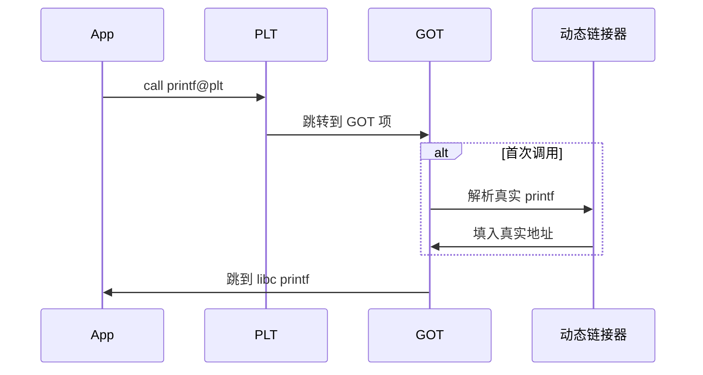

# 链接器加载器与可执行文件格式

> **文件编码**：UTF-8。  
> **定位**：ELF/PE 结构、符号解析、静态/动态链接、PLT/GOT、延迟绑定、`dlopen`——与 [48 章](48-编译预处理与链接原理.md) **互补**（48 偏工程实践，72 偏格式与加载原理）。

## §0 读前导读

### §0.1 用一句话弄懂本章

**链接器** 把 `.o` 的 **重定位条目** 解析为最终虚拟地址；**动态链接器** 在启动时解析共享库符号；**加载器** 按 Program Header 映射段——读懂 ELF 才能 debug `undefined symbol` 与 GOT 劫持。

### §0.2 你需要提前知道什么

- [48 章](48-编译预处理与链接原理.md) ODR、静态库
- [69 章](69-编译原理入门与C++编译流程.md) 目标文件来源
- [29 章](29-对象模型与虚函数表深入.md) vtable 符号
- `readelf`/`objdump` 基本用法

### §0.3 本章知识地图（☐→☑）

- [ ] ELF Header/Section/Program Header 区别
- [ ] `.symtab` 与 `.dynsym`
- [ ] 静态链接 vs 动态链接
- [ ] PLT/GOT 延迟绑定流程
- [ ] `dlopen`/`dlsym` 运行时加载
- [ ] Windows PE 对照概念
- [ ] 与 48 章符号错误对照排查
- [ ] 闭卷自测 ≥8/10

### §0.4 建议学习时长

**6～8 天**

### §0.5 学完你能做什么

用 readelf 读自己的 C++ 程序；解释 PIE 与 ASLR；写插件式 `dlopen`；排查 ABI 不匹配。

### §0.6 交叉阅读

- [48 章 编译链接](48-编译预处理与链接原理.md)
- [69 章 编译流程](69-编译原理入门与C++编译流程.md)
- [73 章 汇编对应](73-汇编语言入门与C++对应.md)
- [09 章 CMake](09-CMake与项目工程化.md)

---

## 本章与上一章的关系

[71 章](71-操作系统原理深入学习.md) 为本章铺垫；本章在其基础上 **原理化、教材化** 展开，与面试速记章互补而非重复。

---

## 1. 目标文件里有什么


```bash
g++ -c foo.cpp -o foo.o
readelf -h foo.o
objdump -dr foo.o
```

| 段/节 | 内容 |
|-------|------|
| `.text` | 机器码 |
| `.data` | 已初始化全局/静态 |
| `.bss` | 未初始化（不占文件空间） |
| `.rodata` | 只读常量 |
| `.symtab` | 符号表 |
| `.rela.text` | 重定位项 |

**重定位**：编译器不知最终地址，留 **占位 + 重定位类型**（R_X86_64_PC32 等）。


## 2. ELF 文件结构


```text
┌──────────────────┐
│ ELF Header       │
├──────────────────┤
│ Program Headers  │  ← 加载时用（exec）
├──────────────────┤
│ Section Headers  │  ← 链接/debug 用
├──────────────────┤
│ .text .data ...  │
└──────────────────┘
```

```bash
readelf -l a.out    # Program Headers
readelf -S a.out    # Sections
```

**PIE**：`-fPIE -pie` 产生位置无关可执行文件，配合 **ASLR**。


## 3. 符号解析


```cpp
// a.cpp
extern int g;
void use() { g++; }

// b.cpp
int g = 0;
```

链接器合并 **GLOBAL** 符号；**WEAK** 可被强符号覆盖。

**C++ name mangling**：

```bash
nm foo.o | c++filt
```

`undefined reference to foo(int)` → 缺定义或链接顺序/库缺失（48 章）。


## 4. 静态链接


```bash
ar rcs libmath.a add.o mul.o
g++ main.o -L. -lmath -o app
```

**抽取规则**：从 archive **仅拉** 被 undefined 符号引用的 `.o` 成员——顺序错误可导致符号未解析（`-lmath` 放 `main.o` 之后）。

**静态链接 libc**：体积大、无共享库更新，嵌入式/common。


## 5. 动态链接与共享库


```bash
g++ -shared -fPIC -o libfoo.so foo.cpp
g++ main.cpp -L. -lfoo -Wl,-rpath,'$ORIGIN'
```

**PIC**：代码段地址无关，数据访问经 **GOT**。

| 文件 | 作用 |
|------|------|
| `.so` | 共享库 |
| `.dynamic` | 依赖库名、PLT/GOT 信息 |
| `.dynsym` | 动态符号 |

**NEEDED** 记录 `libc.so.6` 等。


## 6. PLT 与 GOT 延迟绑定




**延迟绑定** `-lazy`：启动快，首次调用慢。**`LD_BIND_NOW`** 启动时全解析。

```bash
objdump -d -j .plt a.out
readelf -r a.out
```


## 7. 加载过程（Linux）


内核 `execve` → 动态链接器 `/lib64/ld-linux-x86-64.so.2` → 加载 NEEDED `.so` → 重定位 → 初始化 `.init_array`（全局 C++ 构造）→ `_start` → `__libc_start_main` → `main`。

[71 章](71-操作系统原理深入学习.md) 进程视角；本章文件格式视角。


## 8. dlopen 运行时链接


```cpp
#include <dlfcn.h>
void* h = dlopen("./plugin.so", RTLD_NOW);
auto fn = (int(*)())dlsym(h, "plugin_entry");
fn();
dlclose(h);
```

插件 ABI： **`extern "C"`** 导出稳定符号；C++ 类跨 `.so` 需同一编译器/ABI（29 章 vtable/layout）。

**RTLD_GLOBAL** 符号进入全局命名空间。


## 9. Windows PE 对照


| ELF | PE |
|-----|-----|
| `.text` | `.text` |
| GOT/PLT | IAT + 导入表 |
| `.so` | `.dll` |
| `readelf` | `dumpbin /headers` |

MSVC `/MD` 动态 CRT；MinGW 与 Linux 工具链更接近 ELF 生态。


## 10. 常见链接问题原理表


| 现象 | 根因 |
|------|------|
| undefined reference | 缺 .o/库或顺序 |
| multiple definition | 违反 ODR |
| symbol versioning | glibc 新旧符号 |
| ABI mismatch | 不同编译器/STL |
| text reloc | 非 PIC 共享库 |

[48 章](48-编译预处理与链接原理.md) 排查步骤；本章理解 **为何**。


## 11.1 动手：readelf 练习 #1


#### 11.1.1 任务

编译含模板、虚函数、全局对象的 C++ 程序，完成：

```bash
g++ -std=c++17 -O2 -g demo_1.cpp -o demo_1
readelf -h demo_1
readelf -l demo_1 | head
readelf -d demo_1
nm -C demo_1 | head -30
```

#### 11.1.2 观察点

- **ENTRY** 是否为 `_start`
- **INTERP** 动态链接器路径
- **INIT_ARRAY** C++ 静态初始化
- mangled 构造函数符号

#### 11.1.3 与 29 章

虚表符号 `_ZTV...` 位于 **`.data.rel.ro`**（只读 after rel）。

#### 11.1.4 记录

在实验笔记画 **从磁盘 ELF 到进程 maps** 的映射关系（对照 `/proc/self/maps`）。


## 11.2 动手：readelf 练习 #2


#### 11.2.1 任务

编译含模板、虚函数、全局对象的 C++ 程序，完成：

```bash
g++ -std=c++17 -O2 -g demo_2.cpp -o demo_2
readelf -h demo_2
readelf -l demo_2 | head
readelf -d demo_2
nm -C demo_2 | head -30
```

#### 11.2.2 观察点

- **ENTRY** 是否为 `_start`
- **INTERP** 动态链接器路径
- **INIT_ARRAY** C++ 静态初始化
- mangled 构造函数符号

#### 11.2.3 与 29 章

虚表符号 `_ZTV...` 位于 **`.data.rel.ro`**（只读 after rel）。

#### 11.2.4 记录

在实验笔记画 **从磁盘 ELF 到进程 maps** 的映射关系（对照 `/proc/self/maps`）。


## 11.3 动手：readelf 练习 #3


#### 11.3.1 任务

编译含模板、虚函数、全局对象的 C++ 程序，完成：

```bash
g++ -std=c++17 -O2 -g demo_3.cpp -o demo_3
readelf -h demo_3
readelf -l demo_3 | head
readelf -d demo_3
nm -C demo_3 | head -30
```

#### 11.3.2 观察点

- **ENTRY** 是否为 `_start`
- **INTERP** 动态链接器路径
- **INIT_ARRAY** C++ 静态初始化
- mangled 构造函数符号

#### 11.3.3 与 29 章

虚表符号 `_ZTV...` 位于 **`.data.rel.ro`**（只读 after rel）。

#### 11.3.4 记录

在实验笔记画 **从磁盘 ELF 到进程 maps** 的映射关系（对照 `/proc/self/maps`）。


## 11.4 动手：readelf 练习 #4


#### 11.4.1 任务

编译含模板、虚函数、全局对象的 C++ 程序，完成：

```bash
g++ -std=c++17 -O2 -g demo_4.cpp -o demo_4
readelf -h demo_4
readelf -l demo_4 | head
readelf -d demo_4
nm -C demo_4 | head -30
```

#### 11.4.2 观察点

- **ENTRY** 是否为 `_start`
- **INTERP** 动态链接器路径
- **INIT_ARRAY** C++ 静态初始化
- mangled 构造函数符号

#### 11.4.3 与 29 章

虚表符号 `_ZTV...` 位于 **`.data.rel.ro`**（只读 after rel）。

#### 11.4.4 记录

在实验笔记画 **从磁盘 ELF 到进程 maps** 的映射关系（对照 `/proc/self/maps`）。


## 11.5 动手：readelf 练习 #5


#### 11.5.1 任务

编译含模板、虚函数、全局对象的 C++ 程序，完成：

```bash
g++ -std=c++17 -O2 -g demo_5.cpp -o demo_5
readelf -h demo_5
readelf -l demo_5 | head
readelf -d demo_5
nm -C demo_5 | head -30
```

#### 11.5.2 观察点

- **ENTRY** 是否为 `_start`
- **INTERP** 动态链接器路径
- **INIT_ARRAY** C++ 静态初始化
- mangled 构造函数符号

#### 11.5.3 与 29 章

虚表符号 `_ZTV...` 位于 **`.data.rel.ro`**（只读 after rel）。

#### 11.5.4 记录

在实验笔记画 **从磁盘 ELF 到进程 maps** 的映射关系（对照 `/proc/self/maps`）。


## 11.6 动手：readelf 练习 #6


#### 11.6.1 任务

编译含模板、虚函数、全局对象的 C++ 程序，完成：

```bash
g++ -std=c++17 -O2 -g demo_6.cpp -o demo_6
readelf -h demo_6
readelf -l demo_6 | head
readelf -d demo_6
nm -C demo_6 | head -30
```

#### 11.6.2 观察点

- **ENTRY** 是否为 `_start`
- **INTERP** 动态链接器路径
- **INIT_ARRAY** C++ 静态初始化
- mangled 构造函数符号

#### 11.6.3 与 29 章

虚表符号 `_ZTV...` 位于 **`.data.rel.ro`**（只读 after rel）。

#### 11.6.4 记录

在实验笔记画 **从磁盘 ELF 到进程 maps** 的映射关系（对照 `/proc/self/maps`）。


## 11.7 动手：readelf 练习 #7


#### 11.7.1 任务

编译含模板、虚函数、全局对象的 C++ 程序，完成：

```bash
g++ -std=c++17 -O2 -g demo_7.cpp -o demo_7
readelf -h demo_7
readelf -l demo_7 | head
readelf -d demo_7
nm -C demo_7 | head -30
```

#### 11.7.2 观察点

- **ENTRY** 是否为 `_start`
- **INTERP** 动态链接器路径
- **INIT_ARRAY** C++ 静态初始化
- mangled 构造函数符号

#### 11.7.3 与 29 章

虚表符号 `_ZTV...` 位于 **`.data.rel.ro`**（只读 after rel）。

#### 11.7.4 记录

在实验笔记画 **从磁盘 ELF 到进程 maps** 的映射关系（对照 `/proc/self/maps`）。


## 11.8 动手：readelf 练习 #8


#### 11.8.1 任务

编译含模板、虚函数、全局对象的 C++ 程序，完成：

```bash
g++ -std=c++17 -O2 -g demo_8.cpp -o demo_8
readelf -h demo_8
readelf -l demo_8 | head
readelf -d demo_8
nm -C demo_8 | head -30
```

#### 11.8.2 观察点

- **ENTRY** 是否为 `_start`
- **INTERP** 动态链接器路径
- **INIT_ARRAY** C++ 静态初始化
- mangled 构造函数符号

#### 11.8.3 与 29 章

虚表符号 `_ZTV...` 位于 **`.data.rel.ro`**（只读 after rel）。

#### 11.8.4 记录

在实验笔记画 **从磁盘 ELF 到进程 maps** 的映射关系（对照 `/proc/self/maps`）。


## 11.9 动手：readelf 练习 #9


#### 11.9.1 任务

编译含模板、虚函数、全局对象的 C++ 程序，完成：

```bash
g++ -std=c++17 -O2 -g demo_9.cpp -o demo_9
readelf -h demo_9
readelf -l demo_9 | head
readelf -d demo_9
nm -C demo_9 | head -30
```

#### 11.9.2 观察点

- **ENTRY** 是否为 `_start`
- **INTERP** 动态链接器路径
- **INIT_ARRAY** C++ 静态初始化
- mangled 构造函数符号

#### 11.9.3 与 29 章

虚表符号 `_ZTV...` 位于 **`.data.rel.ro`**（只读 after rel）。

#### 11.9.4 记录

在实验笔记画 **从磁盘 ELF 到进程 maps** 的映射关系（对照 `/proc/self/maps`）。


## 11.10 动手：readelf 练习 #10


#### 11.10.1 任务

编译含模板、虚函数、全局对象的 C++ 程序，完成：

```bash
g++ -std=c++17 -O2 -g demo_10.cpp -o demo_10
readelf -h demo_10
readelf -l demo_10 | head
readelf -d demo_10
nm -C demo_10 | head -30
```

#### 11.10.2 观察点

- **ENTRY** 是否为 `_start`
- **INTERP** 动态链接器路径
- **INIT_ARRAY** C++ 静态初始化
- mangled 构造函数符号

#### 11.10.3 与 29 章

虚表符号 `_ZTV...` 位于 **`.data.rel.ro`**（只读 after rel）。

#### 11.10.4 记录

在实验笔记画 **从磁盘 ELF 到进程 maps** 的映射关系（对照 `/proc/self/maps`）。


## 11.11 动手：readelf 练习 #11


#### 11.11.1 任务

编译含模板、虚函数、全局对象的 C++ 程序，完成：

```bash
g++ -std=c++17 -O2 -g demo_11.cpp -o demo_11
readelf -h demo_11
readelf -l demo_11 | head
readelf -d demo_11
nm -C demo_11 | head -30
```

#### 11.11.2 观察点

- **ENTRY** 是否为 `_start`
- **INTERP** 动态链接器路径
- **INIT_ARRAY** C++ 静态初始化
- mangled 构造函数符号

#### 11.11.3 与 29 章

虚表符号 `_ZTV...` 位于 **`.data.rel.ro`**（只读 after rel）。

#### 11.11.4 记录

在实验笔记画 **从磁盘 ELF 到进程 maps** 的映射关系（对照 `/proc/self/maps`）。


## 11.12 动手：readelf 练习 #12


#### 11.12.1 任务

编译含模板、虚函数、全局对象的 C++ 程序，完成：

```bash
g++ -std=c++17 -O2 -g demo_12.cpp -o demo_12
readelf -h demo_12
readelf -l demo_12 | head
readelf -d demo_12
nm -C demo_12 | head -30
```

#### 11.12.2 观察点

- **ENTRY** 是否为 `_start`
- **INTERP** 动态链接器路径
- **INIT_ARRAY** C++ 静态初始化
- mangled 构造函数符号

#### 11.12.3 与 29 章

虚表符号 `_ZTV...` 位于 **`.data.rel.ro`**（只读 after rel）。

#### 11.12.4 记录

在实验笔记画 **从磁盘 ELF 到进程 maps** 的映射关系（对照 `/proc/self/maps`）。


## 11.13 动手：readelf 练习 #13


#### 11.13.1 任务

编译含模板、虚函数、全局对象的 C++ 程序，完成：

```bash
g++ -std=c++17 -O2 -g demo_13.cpp -o demo_13
readelf -h demo_13
readelf -l demo_13 | head
readelf -d demo_13
nm -C demo_13 | head -30
```

#### 11.13.2 观察点

- **ENTRY** 是否为 `_start`
- **INTERP** 动态链接器路径
- **INIT_ARRAY** C++ 静态初始化
- mangled 构造函数符号

#### 11.13.3 与 29 章

虚表符号 `_ZTV...` 位于 **`.data.rel.ro`**（只读 after rel）。

#### 11.13.4 记录

在实验笔记画 **从磁盘 ELF 到进程 maps** 的映射关系（对照 `/proc/self/maps`）。


## 11.14 动手：readelf 练习 #14


#### 11.14.1 任务

编译含模板、虚函数、全局对象的 C++ 程序，完成：

```bash
g++ -std=c++17 -O2 -g demo_14.cpp -o demo_14
readelf -h demo_14
readelf -l demo_14 | head
readelf -d demo_14
nm -C demo_14 | head -30
```

#### 11.14.2 观察点

- **ENTRY** 是否为 `_start`
- **INTERP** 动态链接器路径
- **INIT_ARRAY** C++ 静态初始化
- mangled 构造函数符号

#### 11.14.3 与 29 章

虚表符号 `_ZTV...` 位于 **`.data.rel.ro`**（只读 after rel）。

#### 11.14.4 记录

在实验笔记画 **从磁盘 ELF 到进程 maps** 的映射关系（对照 `/proc/self/maps`）。


## 11.15 动手：readelf 练习 #15


#### 11.15.1 任务

编译含模板、虚函数、全局对象的 C++ 程序，完成：

```bash
g++ -std=c++17 -O2 -g demo_15.cpp -o demo_15
readelf -h demo_15
readelf -l demo_15 | head
readelf -d demo_15
nm -C demo_15 | head -30
```

#### 11.15.2 观察点

- **ENTRY** 是否为 `_start`
- **INTERP** 动态链接器路径
- **INIT_ARRAY** C++ 静态初始化
- mangled 构造函数符号

#### 11.15.3 与 29 章

虚表符号 `_ZTV...` 位于 **`.data.rel.ro`**（只读 after rel）。

#### 11.15.4 记录

在实验笔记画 **从磁盘 ELF 到进程 maps** 的映射关系（对照 `/proc/self/maps`）。


## 11.16 动手：readelf 练习 #16


#### 11.16.1 任务

编译含模板、虚函数、全局对象的 C++ 程序，完成：

```bash
g++ -std=c++17 -O2 -g demo_16.cpp -o demo_16
readelf -h demo_16
readelf -l demo_16 | head
readelf -d demo_16
nm -C demo_16 | head -30
```

#### 11.16.2 观察点

- **ENTRY** 是否为 `_start`
- **INTERP** 动态链接器路径
- **INIT_ARRAY** C++ 静态初始化
- mangled 构造函数符号

#### 11.16.3 与 29 章

虚表符号 `_ZTV...` 位于 **`.data.rel.ro`**（只读 after rel）。

#### 11.16.4 记录

在实验笔记画 **从磁盘 ELF 到进程 maps** 的映射关系（对照 `/proc/self/maps`）。


## 11.17 动手：readelf 练习 #17


#### 11.17.1 任务

编译含模板、虚函数、全局对象的 C++ 程序，完成：

```bash
g++ -std=c++17 -O2 -g demo_17.cpp -o demo_17
readelf -h demo_17
readelf -l demo_17 | head
readelf -d demo_17
nm -C demo_17 | head -30
```

#### 11.17.2 观察点

- **ENTRY** 是否为 `_start`
- **INTERP** 动态链接器路径
- **INIT_ARRAY** C++ 静态初始化
- mangled 构造函数符号

#### 11.17.3 与 29 章

虚表符号 `_ZTV...` 位于 **`.data.rel.ro`**（只读 after rel）。

#### 11.17.4 记录

在实验笔记画 **从磁盘 ELF 到进程 maps** 的映射关系（对照 `/proc/self/maps`）。


## 11.18 动手：readelf 练习 #18


#### 11.18.1 任务

编译含模板、虚函数、全局对象的 C++ 程序，完成：

```bash
g++ -std=c++17 -O2 -g demo_18.cpp -o demo_18
readelf -h demo_18
readelf -l demo_18 | head
readelf -d demo_18
nm -C demo_18 | head -30
```

#### 11.18.2 观察点

- **ENTRY** 是否为 `_start`
- **INTERP** 动态链接器路径
- **INIT_ARRAY** C++ 静态初始化
- mangled 构造函数符号

#### 11.18.3 与 29 章

虚表符号 `_ZTV...` 位于 **`.data.rel.ro`**（只读 after rel）。

#### 11.18.4 记录

在实验笔记画 **从磁盘 ELF 到进程 maps** 的映射关系（对照 `/proc/self/maps`）。


## 11.19 动手：readelf 练习 #19


#### 11.19.1 任务

编译含模板、虚函数、全局对象的 C++ 程序，完成：

```bash
g++ -std=c++17 -O2 -g demo_19.cpp -o demo_19
readelf -h demo_19
readelf -l demo_19 | head
readelf -d demo_19
nm -C demo_19 | head -30
```

#### 11.19.2 观察点

- **ENTRY** 是否为 `_start`
- **INTERP** 动态链接器路径
- **INIT_ARRAY** C++ 静态初始化
- mangled 构造函数符号

#### 11.19.3 与 29 章

虚表符号 `_ZTV...` 位于 **`.data.rel.ro`**（只读 after rel）。

#### 11.19.4 记录

在实验笔记画 **从磁盘 ELF 到进程 maps** 的映射关系（对照 `/proc/self/maps`）。


## 11.20 动手：readelf 练习 #20


#### 11.20.1 任务

编译含模板、虚函数、全局对象的 C++ 程序，完成：

```bash
g++ -std=c++17 -O2 -g demo_20.cpp -o demo_20
readelf -h demo_20
readelf -l demo_20 | head
readelf -d demo_20
nm -C demo_20 | head -30
```

#### 11.20.2 观察点

- **ENTRY** 是否为 `_start`
- **INTERP** 动态链接器路径
- **INIT_ARRAY** C++ 静态初始化
- mangled 构造函数符号

#### 11.20.3 与 29 章

虚表符号 `_ZTV...` 位于 **`.data.rel.ro`**（只读 after rel）。

#### 11.20.4 记录

在实验笔记画 **从磁盘 ELF 到进程 maps** 的映射关系（对照 `/proc/self/maps`）。


## 11.21 动手：readelf 练习 #21


#### 11.21.1 任务

编译含模板、虚函数、全局对象的 C++ 程序，完成：

```bash
g++ -std=c++17 -O2 -g demo_21.cpp -o demo_21
readelf -h demo_21
readelf -l demo_21 | head
readelf -d demo_21
nm -C demo_21 | head -30
```

#### 11.21.2 观察点

- **ENTRY** 是否为 `_start`
- **INTERP** 动态链接器路径
- **INIT_ARRAY** C++ 静态初始化
- mangled 构造函数符号

#### 11.21.3 与 29 章

虚表符号 `_ZTV...` 位于 **`.data.rel.ro`**（只读 after rel）。

#### 11.21.4 记录

在实验笔记画 **从磁盘 ELF 到进程 maps** 的映射关系（对照 `/proc/self/maps`）。


## 11.22 动手：readelf 练习 #22


#### 11.22.1 任务

编译含模板、虚函数、全局对象的 C++ 程序，完成：

```bash
g++ -std=c++17 -O2 -g demo_22.cpp -o demo_22
readelf -h demo_22
readelf -l demo_22 | head
readelf -d demo_22
nm -C demo_22 | head -30
```

#### 11.22.2 观察点

- **ENTRY** 是否为 `_start`
- **INTERP** 动态链接器路径
- **INIT_ARRAY** C++ 静态初始化
- mangled 构造函数符号

#### 11.22.3 与 29 章

虚表符号 `_ZTV...` 位于 **`.data.rel.ro`**（只读 after rel）。

#### 11.22.4 记录

在实验笔记画 **从磁盘 ELF 到进程 maps** 的映射关系（对照 `/proc/self/maps`）。


## 11.23 动手：readelf 练习 #23


#### 11.23.1 任务

编译含模板、虚函数、全局对象的 C++ 程序，完成：

```bash
g++ -std=c++17 -O2 -g demo_23.cpp -o demo_23
readelf -h demo_23
readelf -l demo_23 | head
readelf -d demo_23
nm -C demo_23 | head -30
```

#### 11.23.2 观察点

- **ENTRY** 是否为 `_start`
- **INTERP** 动态链接器路径
- **INIT_ARRAY** C++ 静态初始化
- mangled 构造函数符号

#### 11.23.3 与 29 章

虚表符号 `_ZTV...` 位于 **`.data.rel.ro`**（只读 after rel）。

#### 11.23.4 记录

在实验笔记画 **从磁盘 ELF 到进程 maps** 的映射关系（对照 `/proc/self/maps`）。


## 11.24 动手：readelf 练习 #24


#### 11.24.1 任务

编译含模板、虚函数、全局对象的 C++ 程序，完成：

```bash
g++ -std=c++17 -O2 -g demo_24.cpp -o demo_24
readelf -h demo_24
readelf -l demo_24 | head
readelf -d demo_24
nm -C demo_24 | head -30
```

#### 11.24.2 观察点

- **ENTRY** 是否为 `_start`
- **INTERP** 动态链接器路径
- **INIT_ARRAY** C++ 静态初始化
- mangled 构造函数符号

#### 11.24.3 与 29 章

虚表符号 `_ZTV...` 位于 **`.data.rel.ro`**（只读 after rel）。

#### 11.24.4 记录

在实验笔记画 **从磁盘 ELF 到进程 maps** 的映射关系（对照 `/proc/self/maps`）。


## 11.25 动手：readelf 练习 #25


#### 11.25.1 任务

编译含模板、虚函数、全局对象的 C++ 程序，完成：

```bash
g++ -std=c++17 -O2 -g demo_25.cpp -o demo_25
readelf -h demo_25
readelf -l demo_25 | head
readelf -d demo_25
nm -C demo_25 | head -30
```

#### 11.25.2 观察点

- **ENTRY** 是否为 `_start`
- **INTERP** 动态链接器路径
- **INIT_ARRAY** C++ 静态初始化
- mangled 构造函数符号

#### 11.25.3 与 29 章

虚表符号 `_ZTV...` 位于 **`.data.rel.ro`**（只读 after rel）。

#### 11.25.4 记录

在实验笔记画 **从磁盘 ELF 到进程 maps** 的映射关系（对照 `/proc/self/maps`）。


## 练习题

### 练习 A（概念推导）

1. 用费曼技巧向同学解释本章核心概念之一（≤3 分钟口述）。
2. 画出本章主流程图（纸笔或 mermaid），标注至少 5 个关键术语。
3. 对照正文，找出一个「容易误解」的点并写 100 字澄清。

### 练习 B（动手验证）

4. 按正文示例在 Linux/WSL 或 MSYS2 复现一次实验/命令，记录输出。
5. 修改示例代码中的一个参数，预测结果后再编译/运行验证。
6. 用 `man`/官方文档核对正文中的一个数量级或术语定义。

### 练习 C（与 C++ 结合）

7. 写一段 ≤30 行的 C++17 小程序，体现本章至少 2 个概念。
8. 用 GDB/perf/readelf/objdump 之一观察该程序的相关现象。
9. 将观察结果与 [48 章](48-编译预处理与链接原理.md) 或 [12 章](12-性能分析与调试.md) 的工具链对照。

<details>
<summary>练习提示（非唯一解）</summary>

- 原理章重在「预测—验证—修正」闭环；答案不唯一，关键是能自圆其说。
- 若环境缺失（如 Linux 专属工具），可用 WSL 或正文给出的替代方案。

</details>

---

## FAQ

**Q：Section 和 Segment 区别？**

Section 给链接器；Segment 给加载器，多个 section 可合并入一 segment。

**Q：为何需要 GOT？**

PIC 代码不能写死绝对地址；GOT 存运行时确定的地址。

**Q：`-rpath` 安全吗？**

硬编码搜索路径可能劫持；生产常用 LD_LIBRARY_PATH 谨慎或 $ORIGIN 相对路径。

**Q：LTO 改变 ELF 吗？**

是，`.llvm.lto` 等；需 linker 插件支持。

**Q：72 与 48 如何配合？**

48 练 CMake/ODR；72 读 ELF/PLT 原理。

---

## 闭卷自测

1. `.bss` 在文件中占空间吗？
2. PLT 第一次调用走哪？
3. `-fPIC` 目的？
4. `.dynsym` vs `.symtab`？
5. 静态库抽取规则？
6. PIE 与 ASLR？
7. dlopen RTLD_NOW？
8. 重定位解决什么？
9. C++ mangling 原因？
10. 72 与 69 关系？

<details>
<summary>参考答案</summary>

1. 否，仅占用虚拟内存
2. 动态链接器解析
3. 共享库地址无关
4. 动态导出 vs 全符号
5. 仅拉含 undefined 符号的成员
6. PIE 使 exec 可随机基址
7. 立即解析符号
8. 编译时未知最终地址
9. 重载/命名空间
10. 69 生成 .o；72 链接加载

</details>

---

## 下一章预告

[73 章](73-汇编语言入门与C++对应.md) 将继续本系列 **原理链** 的下一环。

---

*下一章：73 汇编语言入门与C++对应*
