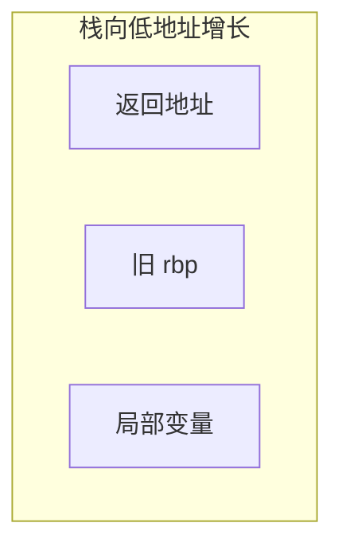

# 汇编语言入门与 C++ 对应

> **文件编码**：UTF-8。  
> **定位**：x86-64 寄存器、指令、栈帧、与 C++ 函数/局部变量/虚函数的 **一一对应**；学会 **GDB disassemble** 读代码。  
> **前置**：[69 章](69-编译原理入门与C++编译流程.md) 代码生成、[29 章](29-对象模型与虚函数表深入.md) vtable。

## §0 读前导读

### §0.1 用一句话弄懂本章

**汇编是 ISA 的人类可读形式**——每条 C++ 语句在 `-O0` 下几乎可逐行对应机器指令；理解 **栈帧、调用约定、虚表调用** 后，GDB 单步不再神秘。

### §0.2 你需要提前知道什么

- [38 章 函数机制](38-函数机制完全指南.md) 调用约定
- [29 章 虚函数表](29-对象模型与虚函数表深入.md)
- [72 章 ELF](72-链接器加载器与可执行文件格式.md) `.text`
- GDB 基本：`break`, `run`, `disassemble`

### §0.3 本章知识地图（☐→☑）

- [ ] 列举 callee-saved vs caller-saved 寄存器
- [ ] 画函数栈帧图
- [ ] 解释 `call/ret` 与返回地址
- [ ] 局部变量在栈或寄存器
- [ ] 虚函数 `call [rax+offset]`
- [ ] 看懂 `-O0` 与 `-O2 disasm` 差异
- [ ] GDB `disassemble /s`
- [ ] 闭卷自测 ≥8/10

### §0.4 建议学习时长

**5～7 天**

### §0.5 学完你能做什么

对任意 C++ 函数 `disassemble /s`；解释 crash 栈；读编译器生成的 ctor/dtor；与 74 章 profiling 结合。

### §0.6 交叉阅读

- [29 章 对象模型](29-对象模型与虚函数表深入.md)
- [38 章 函数](38-函数机制完全指南.md)
- [12 章 GDB](12-性能分析与调试.md)
- [69 章 代码生成](69-编译原理入门与C++编译流程.md)

---

## 本章与上一章的关系

[72 章](72-链接器加载器与可执行文件格式.md) 为本章铺垫；本章在其基础上 **原理化、教材化** 展开，与面试速记章互补而非重复。

---

## 1. x86-64 寄存器概览


| 寄存器 | 用途（SysV ABI） |
|--------|------------------|
| rax | 返回值 |
| rdi, rsi, rdx, rcx, r8, r9 | 整型参数 1～6 |
| rbx, rbp, r12-r15 | callee-saved |
| rsp | 栈指针 |
| rip | 指令指针 |

```cpp
int add(int a, int b) { return a + b; }
// a→edi, b→esi, ret eax
```

**RFLAGS**：条件码 ZF/SF/CF 供 `je`, `jg` 等。


## 2. 常用指令


```asm
mov     eax, DWORD PTR [rbp-4]   ; load 局部变量
add     eax, ebx
cmp     eax, 0
jle     .Lelse
call    _Z3foov
ret
```

| 指令 | 含义 |
|------|------|
| mov | 复制 |
| add/sub | 算术 |
| cmp/test | 比较不设结果寄存器 |
| jmp/je/jne | 控制流 |
| call/ret | 调用/返回 |
| push/pop | 栈 |


## 3. 函数调用与栈帧


```cpp
int callee(int x) {
    int y = x + 1;
    return y;
}
```

```asm
; 序言 prologue
push    rbp
mov     rbp, rsp
sub     rsp, 16
; 局部 y 在 [rbp-4]
; 尾声 epilogue
mov     rsp, rbp
pop     rbp
ret
```



**栈对齐**：System V 要求 `call` 前 rsp 16 字节对齐。


## 4. C++ 局部变量与优化


```cpp
void f() {
    int a = 1, b = 2;
    volatile int c = a + b;  // 防优化掉
}
```

- **`-O0`**：变量多在 `[rbp-offset]`
- **`-O2`**：寄存器分配，可能无栈槽；变量 **被优化消失**

GDB 读优化代码需 **`-Og`** 或 `volatile`/禁用优化。


## 5. 类成员与 this 指针


```cpp
struct S { int x; void inc() { ++x; } };
```

`this` 在 **rdi**（第一个隐式参数）。`inc`: `mov eax, [rdi]` / `add eax,1` / `mov [rdi], eax`。

**静态成员** 无 `this`；**成员函数** 本质普通函数 + this。


## 6. 虚函数与 vtable


```cpp
struct Base { virtual void foo(); };
struct Der : Base { void foo() override; };
Base* p = new Der();
p->foo();
```

典型汇编：

```asm
mov     rax, QWORD PTR [rdi]      ; vptr
mov     rax, QWORD PTR [rax+8]    ; Der::foo 槽
call    rax
```

[29 章](29-对象模型与虚函数表深入.md) 布局；**devirtualization** 在 `-O2` 同 TU 可能直接 `call Der::foo`。


## 7. 构造与析构


```cpp
struct T { T(); ~T(); };
void g() { T t; }
```

汇编含 **call T::T()** 与离开作用域 **call T::~T()**；异常路径 **landing pad**（与 unwind 表 72 章 `.eh_frame`）。

**Rule of Five** 合成函数同样为普通函数，可能内联。


## 8. GDB disassemble 实战


```bash
g++ -g -O0 demo.cpp -o demo
gdb demo
(gdb) break main
(gdb) run
(gdb) disassemble /s
(gdb) info registers
(gdb) x/4gx $rsp
```

**`/s` 混源码**；**`si`/`ni`** 步入/步过；**`bt`** 看栈帧链。

[12 章](12-性能分析与调试.md) 调试流程；本章读 **汇编层**。


## 9. 内联与 LTO 下的阅读


```cpp
inline int sq(int n) { return n*n; }
```

`-O2` 可能无 `sq` 符号；`disassemble main` 见 `imul` 直接出现。

**LTO** 跨 TU 内联后栈更深——profile 比肉眼 disasm 更高效（74 章）。


## 10. ARM64 简注（扩展）


| x86-64 | ARM64 |
|--------|-------|
| rdi..r9 参数 | x0-x7 |
| rax 返回 | x0 |
| rbp/rsp 栈 | x29/x30 FP/LR |

跨平台 C++ 靠 **ABI 稳定**；手写 asm 少，读 disasm 多。


## 11.1 对照实验：C++ → 汇编 #1


#### 11.1.1 源码模板

```cpp
// lab_1.cpp
#include <iostream>
int fib(int n) {
    if (n <= 1) return n;
    return fib(n-1) + fib(n-2);
}
int main() { std::cout << fib(1) << '\n'; }
```

#### 11.1.2 命令

```bash
g++ -std=c++17 -O0 -S -fverbose-asm lab_1.cpp -o lab_1.s
g++ -std=c++17 -O2 -S lab_1.cpp -o lab_1_O2.s
diff -u lab_1.s lab_1_O2.s | head
```

#### 11.1.3 观察清单

- 分支指令与 **递归 call**
- `-O2` 是否 **尾调用优化**（未必，斐波那那通常不 TCO）
- 栈深度与 **栈溢出** 风险（对比迭代版）

#### 11.1.4 GDB

对 `fib` 设断点，`bt` 数栈帧层数 = 递归深度。


## 11.2 对照实验：C++ → 汇编 #2


#### 11.2.1 源码模板

```cpp
// lab_2.cpp
#include <iostream>
int fib(int n) {
    if (n <= 1) return n;
    return fib(n-1) + fib(n-2);
}
int main() { std::cout << fib(2) << '\n'; }
```

#### 11.2.2 命令

```bash
g++ -std=c++17 -O0 -S -fverbose-asm lab_2.cpp -o lab_2.s
g++ -std=c++17 -O2 -S lab_2.cpp -o lab_2_O2.s
diff -u lab_2.s lab_2_O2.s | head
```

#### 11.2.3 观察清单

- 分支指令与 **递归 call**
- `-O2` 是否 **尾调用优化**（未必，斐波那那通常不 TCO）
- 栈深度与 **栈溢出** 风险（对比迭代版）

#### 11.2.4 GDB

对 `fib` 设断点，`bt` 数栈帧层数 = 递归深度。


## 11.3 对照实验：C++ → 汇编 #3


#### 11.3.1 源码模板

```cpp
// lab_3.cpp
#include <iostream>
int fib(int n) {
    if (n <= 1) return n;
    return fib(n-1) + fib(n-2);
}
int main() { std::cout << fib(3) << '\n'; }
```

#### 11.3.2 命令

```bash
g++ -std=c++17 -O0 -S -fverbose-asm lab_3.cpp -o lab_3.s
g++ -std=c++17 -O2 -S lab_3.cpp -o lab_3_O2.s
diff -u lab_3.s lab_3_O2.s | head
```

#### 11.3.3 观察清单

- 分支指令与 **递归 call**
- `-O2` 是否 **尾调用优化**（未必，斐波那那通常不 TCO）
- 栈深度与 **栈溢出** 风险（对比迭代版）

#### 11.3.4 GDB

对 `fib` 设断点，`bt` 数栈帧层数 = 递归深度。


## 11.4 对照实验：C++ → 汇编 #4


#### 11.4.1 源码模板

```cpp
// lab_4.cpp
#include <iostream>
int fib(int n) {
    if (n <= 1) return n;
    return fib(n-1) + fib(n-2);
}
int main() { std::cout << fib(4) << '\n'; }
```

#### 11.4.2 命令

```bash
g++ -std=c++17 -O0 -S -fverbose-asm lab_4.cpp -o lab_4.s
g++ -std=c++17 -O2 -S lab_4.cpp -o lab_4_O2.s
diff -u lab_4.s lab_4_O2.s | head
```

#### 11.4.3 观察清单

- 分支指令与 **递归 call**
- `-O2` 是否 **尾调用优化**（未必，斐波那那通常不 TCO）
- 栈深度与 **栈溢出** 风险（对比迭代版）

#### 11.4.4 GDB

对 `fib` 设断点，`bt` 数栈帧层数 = 递归深度。


## 11.5 对照实验：C++ → 汇编 #5


#### 11.5.1 源码模板

```cpp
// lab_5.cpp
#include <iostream>
int fib(int n) {
    if (n <= 1) return n;
    return fib(n-1) + fib(n-2);
}
int main() { std::cout << fib(5) << '\n'; }
```

#### 11.5.2 命令

```bash
g++ -std=c++17 -O0 -S -fverbose-asm lab_5.cpp -o lab_5.s
g++ -std=c++17 -O2 -S lab_5.cpp -o lab_5_O2.s
diff -u lab_5.s lab_5_O2.s | head
```

#### 11.5.3 观察清单

- 分支指令与 **递归 call**
- `-O2` 是否 **尾调用优化**（未必，斐波那那通常不 TCO）
- 栈深度与 **栈溢出** 风险（对比迭代版）

#### 11.5.4 GDB

对 `fib` 设断点，`bt` 数栈帧层数 = 递归深度。


## 11.6 对照实验：C++ → 汇编 #6


#### 11.6.1 源码模板

```cpp
// lab_6.cpp
#include <iostream>
int fib(int n) {
    if (n <= 1) return n;
    return fib(n-1) + fib(n-2);
}
int main() { std::cout << fib(6) << '\n'; }
```

#### 11.6.2 命令

```bash
g++ -std=c++17 -O0 -S -fverbose-asm lab_6.cpp -o lab_6.s
g++ -std=c++17 -O2 -S lab_6.cpp -o lab_6_O2.s
diff -u lab_6.s lab_6_O2.s | head
```

#### 11.6.3 观察清单

- 分支指令与 **递归 call**
- `-O2` 是否 **尾调用优化**（未必，斐波那那通常不 TCO）
- 栈深度与 **栈溢出** 风险（对比迭代版）

#### 11.6.4 GDB

对 `fib` 设断点，`bt` 数栈帧层数 = 递归深度。


## 11.7 对照实验：C++ → 汇编 #7


#### 11.7.1 源码模板

```cpp
// lab_7.cpp
#include <iostream>
int fib(int n) {
    if (n <= 1) return n;
    return fib(n-1) + fib(n-2);
}
int main() { std::cout << fib(7) << '\n'; }
```

#### 11.7.2 命令

```bash
g++ -std=c++17 -O0 -S -fverbose-asm lab_7.cpp -o lab_7.s
g++ -std=c++17 -O2 -S lab_7.cpp -o lab_7_O2.s
diff -u lab_7.s lab_7_O2.s | head
```

#### 11.7.3 观察清单

- 分支指令与 **递归 call**
- `-O2` 是否 **尾调用优化**（未必，斐波那那通常不 TCO）
- 栈深度与 **栈溢出** 风险（对比迭代版）

#### 11.7.4 GDB

对 `fib` 设断点，`bt` 数栈帧层数 = 递归深度。


## 11.8 对照实验：C++ → 汇编 #8


#### 11.8.1 源码模板

```cpp
// lab_8.cpp
#include <iostream>
int fib(int n) {
    if (n <= 1) return n;
    return fib(n-1) + fib(n-2);
}
int main() { std::cout << fib(8) << '\n'; }
```

#### 11.8.2 命令

```bash
g++ -std=c++17 -O0 -S -fverbose-asm lab_8.cpp -o lab_8.s
g++ -std=c++17 -O2 -S lab_8.cpp -o lab_8_O2.s
diff -u lab_8.s lab_8_O2.s | head
```

#### 11.8.3 观察清单

- 分支指令与 **递归 call**
- `-O2` 是否 **尾调用优化**（未必，斐波那那通常不 TCO）
- 栈深度与 **栈溢出** 风险（对比迭代版）

#### 11.8.4 GDB

对 `fib` 设断点，`bt` 数栈帧层数 = 递归深度。


## 11.9 对照实验：C++ → 汇编 #9


#### 11.9.1 源码模板

```cpp
// lab_9.cpp
#include <iostream>
int fib(int n) {
    if (n <= 1) return n;
    return fib(n-1) + fib(n-2);
}
int main() { std::cout << fib(9) << '\n'; }
```

#### 11.9.2 命令

```bash
g++ -std=c++17 -O0 -S -fverbose-asm lab_9.cpp -o lab_9.s
g++ -std=c++17 -O2 -S lab_9.cpp -o lab_9_O2.s
diff -u lab_9.s lab_9_O2.s | head
```

#### 11.9.3 观察清单

- 分支指令与 **递归 call**
- `-O2` 是否 **尾调用优化**（未必，斐波那那通常不 TCO）
- 栈深度与 **栈溢出** 风险（对比迭代版）

#### 11.9.4 GDB

对 `fib` 设断点，`bt` 数栈帧层数 = 递归深度。


## 11.10 对照实验：C++ → 汇编 #10


#### 11.10.1 源码模板

```cpp
// lab_10.cpp
#include <iostream>
int fib(int n) {
    if (n <= 1) return n;
    return fib(n-1) + fib(n-2);
}
int main() { std::cout << fib(10) << '\n'; }
```

#### 11.10.2 命令

```bash
g++ -std=c++17 -O0 -S -fverbose-asm lab_10.cpp -o lab_10.s
g++ -std=c++17 -O2 -S lab_10.cpp -o lab_10_O2.s
diff -u lab_10.s lab_10_O2.s | head
```

#### 11.10.3 观察清单

- 分支指令与 **递归 call**
- `-O2` 是否 **尾调用优化**（未必，斐波那那通常不 TCO）
- 栈深度与 **栈溢出** 风险（对比迭代版）

#### 11.10.4 GDB

对 `fib` 设断点，`bt` 数栈帧层数 = 递归深度。


## 11.11 对照实验：C++ → 汇编 #11


#### 11.11.1 源码模板

```cpp
// lab_11.cpp
#include <iostream>
int fib(int n) {
    if (n <= 1) return n;
    return fib(n-1) + fib(n-2);
}
int main() { std::cout << fib(11) << '\n'; }
```

#### 11.11.2 命令

```bash
g++ -std=c++17 -O0 -S -fverbose-asm lab_11.cpp -o lab_11.s
g++ -std=c++17 -O2 -S lab_11.cpp -o lab_11_O2.s
diff -u lab_11.s lab_11_O2.s | head
```

#### 11.11.3 观察清单

- 分支指令与 **递归 call**
- `-O2` 是否 **尾调用优化**（未必，斐波那那通常不 TCO）
- 栈深度与 **栈溢出** 风险（对比迭代版）

#### 11.11.4 GDB

对 `fib` 设断点，`bt` 数栈帧层数 = 递归深度。


## 11.12 对照实验：C++ → 汇编 #12


#### 11.12.1 源码模板

```cpp
// lab_12.cpp
#include <iostream>
int fib(int n) {
    if (n <= 1) return n;
    return fib(n-1) + fib(n-2);
}
int main() { std::cout << fib(0) << '\n'; }
```

#### 11.12.2 命令

```bash
g++ -std=c++17 -O0 -S -fverbose-asm lab_12.cpp -o lab_12.s
g++ -std=c++17 -O2 -S lab_12.cpp -o lab_12_O2.s
diff -u lab_12.s lab_12_O2.s | head
```

#### 11.12.3 观察清单

- 分支指令与 **递归 call**
- `-O2` 是否 **尾调用优化**（未必，斐波那那通常不 TCO）
- 栈深度与 **栈溢出** 风险（对比迭代版）

#### 11.12.4 GDB

对 `fib` 设断点，`bt` 数栈帧层数 = 递归深度。


## 11.13 对照实验：C++ → 汇编 #13


#### 11.13.1 源码模板

```cpp
// lab_13.cpp
#include <iostream>
int fib(int n) {
    if (n <= 1) return n;
    return fib(n-1) + fib(n-2);
}
int main() { std::cout << fib(1) << '\n'; }
```

#### 11.13.2 命令

```bash
g++ -std=c++17 -O0 -S -fverbose-asm lab_13.cpp -o lab_13.s
g++ -std=c++17 -O2 -S lab_13.cpp -o lab_13_O2.s
diff -u lab_13.s lab_13_O2.s | head
```

#### 11.13.3 观察清单

- 分支指令与 **递归 call**
- `-O2` 是否 **尾调用优化**（未必，斐波那那通常不 TCO）
- 栈深度与 **栈溢出** 风险（对比迭代版）

#### 11.13.4 GDB

对 `fib` 设断点，`bt` 数栈帧层数 = 递归深度。


## 11.14 对照实验：C++ → 汇编 #14


#### 11.14.1 源码模板

```cpp
// lab_14.cpp
#include <iostream>
int fib(int n) {
    if (n <= 1) return n;
    return fib(n-1) + fib(n-2);
}
int main() { std::cout << fib(2) << '\n'; }
```

#### 11.14.2 命令

```bash
g++ -std=c++17 -O0 -S -fverbose-asm lab_14.cpp -o lab_14.s
g++ -std=c++17 -O2 -S lab_14.cpp -o lab_14_O2.s
diff -u lab_14.s lab_14_O2.s | head
```

#### 11.14.3 观察清单

- 分支指令与 **递归 call**
- `-O2` 是否 **尾调用优化**（未必，斐波那那通常不 TCO）
- 栈深度与 **栈溢出** 风险（对比迭代版）

#### 11.14.4 GDB

对 `fib` 设断点，`bt` 数栈帧层数 = 递归深度。


## 11.15 对照实验：C++ → 汇编 #15


#### 11.15.1 源码模板

```cpp
// lab_15.cpp
#include <iostream>
int fib(int n) {
    if (n <= 1) return n;
    return fib(n-1) + fib(n-2);
}
int main() { std::cout << fib(3) << '\n'; }
```

#### 11.15.2 命令

```bash
g++ -std=c++17 -O0 -S -fverbose-asm lab_15.cpp -o lab_15.s
g++ -std=c++17 -O2 -S lab_15.cpp -o lab_15_O2.s
diff -u lab_15.s lab_15_O2.s | head
```

#### 11.15.3 观察清单

- 分支指令与 **递归 call**
- `-O2` 是否 **尾调用优化**（未必，斐波那那通常不 TCO）
- 栈深度与 **栈溢出** 风险（对比迭代版）

#### 11.15.4 GDB

对 `fib` 设断点，`bt` 数栈帧层数 = 递归深度。


## 11.16 对照实验：C++ → 汇编 #16


#### 11.16.1 源码模板

```cpp
// lab_16.cpp
#include <iostream>
int fib(int n) {
    if (n <= 1) return n;
    return fib(n-1) + fib(n-2);
}
int main() { std::cout << fib(4) << '\n'; }
```

#### 11.16.2 命令

```bash
g++ -std=c++17 -O0 -S -fverbose-asm lab_16.cpp -o lab_16.s
g++ -std=c++17 -O2 -S lab_16.cpp -o lab_16_O2.s
diff -u lab_16.s lab_16_O2.s | head
```

#### 11.16.3 观察清单

- 分支指令与 **递归 call**
- `-O2` 是否 **尾调用优化**（未必，斐波那那通常不 TCO）
- 栈深度与 **栈溢出** 风险（对比迭代版）

#### 11.16.4 GDB

对 `fib` 设断点，`bt` 数栈帧层数 = 递归深度。


## 11.17 对照实验：C++ → 汇编 #17


#### 11.17.1 源码模板

```cpp
// lab_17.cpp
#include <iostream>
int fib(int n) {
    if (n <= 1) return n;
    return fib(n-1) + fib(n-2);
}
int main() { std::cout << fib(5) << '\n'; }
```

#### 11.17.2 命令

```bash
g++ -std=c++17 -O0 -S -fverbose-asm lab_17.cpp -o lab_17.s
g++ -std=c++17 -O2 -S lab_17.cpp -o lab_17_O2.s
diff -u lab_17.s lab_17_O2.s | head
```

#### 11.17.3 观察清单

- 分支指令与 **递归 call**
- `-O2` 是否 **尾调用优化**（未必，斐波那那通常不 TCO）
- 栈深度与 **栈溢出** 风险（对比迭代版）

#### 11.17.4 GDB

对 `fib` 设断点，`bt` 数栈帧层数 = 递归深度。


## 11.18 对照实验：C++ → 汇编 #18


#### 11.18.1 源码模板

```cpp
// lab_18.cpp
#include <iostream>
int fib(int n) {
    if (n <= 1) return n;
    return fib(n-1) + fib(n-2);
}
int main() { std::cout << fib(6) << '\n'; }
```

#### 11.18.2 命令

```bash
g++ -std=c++17 -O0 -S -fverbose-asm lab_18.cpp -o lab_18.s
g++ -std=c++17 -O2 -S lab_18.cpp -o lab_18_O2.s
diff -u lab_18.s lab_18_O2.s | head
```

#### 11.18.3 观察清单

- 分支指令与 **递归 call**
- `-O2` 是否 **尾调用优化**（未必，斐波那那通常不 TCO）
- 栈深度与 **栈溢出** 风险（对比迭代版）

#### 11.18.4 GDB

对 `fib` 设断点，`bt` 数栈帧层数 = 递归深度。


## 11.19 对照实验：C++ → 汇编 #19


#### 11.19.1 源码模板

```cpp
// lab_19.cpp
#include <iostream>
int fib(int n) {
    if (n <= 1) return n;
    return fib(n-1) + fib(n-2);
}
int main() { std::cout << fib(7) << '\n'; }
```

#### 11.19.2 命令

```bash
g++ -std=c++17 -O0 -S -fverbose-asm lab_19.cpp -o lab_19.s
g++ -std=c++17 -O2 -S lab_19.cpp -o lab_19_O2.s
diff -u lab_19.s lab_19_O2.s | head
```

#### 11.19.3 观察清单

- 分支指令与 **递归 call**
- `-O2` 是否 **尾调用优化**（未必，斐波那那通常不 TCO）
- 栈深度与 **栈溢出** 风险（对比迭代版）

#### 11.19.4 GDB

对 `fib` 设断点，`bt` 数栈帧层数 = 递归深度。


## 11.20 对照实验：C++ → 汇编 #20


#### 11.20.1 源码模板

```cpp
// lab_20.cpp
#include <iostream>
int fib(int n) {
    if (n <= 1) return n;
    return fib(n-1) + fib(n-2);
}
int main() { std::cout << fib(8) << '\n'; }
```

#### 11.20.2 命令

```bash
g++ -std=c++17 -O0 -S -fverbose-asm lab_20.cpp -o lab_20.s
g++ -std=c++17 -O2 -S lab_20.cpp -o lab_20_O2.s
diff -u lab_20.s lab_20_O2.s | head
```

#### 11.20.3 观察清单

- 分支指令与 **递归 call**
- `-O2` 是否 **尾调用优化**（未必，斐波那那通常不 TCO）
- 栈深度与 **栈溢出** 风险（对比迭代版）

#### 11.20.4 GDB

对 `fib` 设断点，`bt` 数栈帧层数 = 递归深度。


## 11.21 对照实验：C++ → 汇编 #21


#### 11.21.1 源码模板

```cpp
// lab_21.cpp
#include <iostream>
int fib(int n) {
    if (n <= 1) return n;
    return fib(n-1) + fib(n-2);
}
int main() { std::cout << fib(9) << '\n'; }
```

#### 11.21.2 命令

```bash
g++ -std=c++17 -O0 -S -fverbose-asm lab_21.cpp -o lab_21.s
g++ -std=c++17 -O2 -S lab_21.cpp -o lab_21_O2.s
diff -u lab_21.s lab_21_O2.s | head
```

#### 11.21.3 观察清单

- 分支指令与 **递归 call**
- `-O2` 是否 **尾调用优化**（未必，斐波那那通常不 TCO）
- 栈深度与 **栈溢出** 风险（对比迭代版）

#### 11.21.4 GDB

对 `fib` 设断点，`bt` 数栈帧层数 = 递归深度。


## 11.22 对照实验：C++ → 汇编 #22


#### 11.22.1 源码模板

```cpp
// lab_22.cpp
#include <iostream>
int fib(int n) {
    if (n <= 1) return n;
    return fib(n-1) + fib(n-2);
}
int main() { std::cout << fib(10) << '\n'; }
```

#### 11.22.2 命令

```bash
g++ -std=c++17 -O0 -S -fverbose-asm lab_22.cpp -o lab_22.s
g++ -std=c++17 -O2 -S lab_22.cpp -o lab_22_O2.s
diff -u lab_22.s lab_22_O2.s | head
```

#### 11.22.3 观察清单

- 分支指令与 **递归 call**
- `-O2` 是否 **尾调用优化**（未必，斐波那那通常不 TCO）
- 栈深度与 **栈溢出** 风险（对比迭代版）

#### 11.22.4 GDB

对 `fib` 设断点，`bt` 数栈帧层数 = 递归深度。


## 11.23 对照实验：C++ → 汇编 #23


#### 11.23.1 源码模板

```cpp
// lab_23.cpp
#include <iostream>
int fib(int n) {
    if (n <= 1) return n;
    return fib(n-1) + fib(n-2);
}
int main() { std::cout << fib(11) << '\n'; }
```

#### 11.23.2 命令

```bash
g++ -std=c++17 -O0 -S -fverbose-asm lab_23.cpp -o lab_23.s
g++ -std=c++17 -O2 -S lab_23.cpp -o lab_23_O2.s
diff -u lab_23.s lab_23_O2.s | head
```

#### 11.23.3 观察清单

- 分支指令与 **递归 call**
- `-O2` 是否 **尾调用优化**（未必，斐波那那通常不 TCO）
- 栈深度与 **栈溢出** 风险（对比迭代版）

#### 11.23.4 GDB

对 `fib` 设断点，`bt` 数栈帧层数 = 递归深度。


## 11.24 对照实验：C++ → 汇编 #24


#### 11.24.1 源码模板

```cpp
// lab_24.cpp
#include <iostream>
int fib(int n) {
    if (n <= 1) return n;
    return fib(n-1) + fib(n-2);
}
int main() { std::cout << fib(0) << '\n'; }
```

#### 11.24.2 命令

```bash
g++ -std=c++17 -O0 -S -fverbose-asm lab_24.cpp -o lab_24.s
g++ -std=c++17 -O2 -S lab_24.cpp -o lab_24_O2.s
diff -u lab_24.s lab_24_O2.s | head
```

#### 11.24.3 观察清单

- 分支指令与 **递归 call**
- `-O2` 是否 **尾调用优化**（未必，斐波那那通常不 TCO）
- 栈深度与 **栈溢出** 风险（对比迭代版）

#### 11.24.4 GDB

对 `fib` 设断点，`bt` 数栈帧层数 = 递归深度。


## 11.25 对照实验：C++ → 汇编 #25


#### 11.25.1 源码模板

```cpp
// lab_25.cpp
#include <iostream>
int fib(int n) {
    if (n <= 1) return n;
    return fib(n-1) + fib(n-2);
}
int main() { std::cout << fib(1) << '\n'; }
```

#### 11.25.2 命令

```bash
g++ -std=c++17 -O0 -S -fverbose-asm lab_25.cpp -o lab_25.s
g++ -std=c++17 -O2 -S lab_25.cpp -o lab_25_O2.s
diff -u lab_25.s lab_25_O2.s | head
```

#### 11.25.3 观察清单

- 分支指令与 **递归 call**
- `-O2` 是否 **尾调用优化**（未必，斐波那那通常不 TCO）
- 栈深度与 **栈溢出** 风险（对比迭代版）

#### 11.25.4 GDB

对 `fib` 设断点，`bt` 数栈帧层数 = 递归深度。


## 练习题

### 练习 A（概念推导）

1. 用费曼技巧向同学解释本章核心概念之一（≤3 分钟口述）。
2. 画出本章主流程图（纸笔或 mermaid），标注至少 5 个关键术语。
3. 对照正文，找出一个「容易误解」的点并写 100 字澄清。

### 练习 B（动手验证）

4. 按正文示例在 Linux/WSL 或 MSYS2 复现一次实验/命令，记录输出。
5. 修改示例代码中的一个参数，预测结果后再编译/运行验证。
6. 用 `man`/官方文档核对正文中的一个数量级或术语定义。

### 练习 C（与 C++ 结合）

7. 写一段 ≤30 行的 C++17 小程序，体现本章至少 2 个概念。
8. 用 GDB/perf/readelf/objdump 之一观察该程序的相关现象。
9. 将观察结果与 [48 章](48-编译预处理与链接原理.md) 或 [12 章](12-性能分析与调试.md) 的工具链对照。

<details>
<summary>练习提示（非唯一解）</summary>

- 原理章重在「预测—验证—修正」闭环；答案不唯一，关键是能自圆其说。
- 若环境缺失（如 Linux 专属工具），可用 WSL 或正文给出的替代方案。

</details>

---

## FAQ

**Q：必须学汇编才能写 C++？**

不必写，但 **读 disasm** 对性能/崩溃极有帮助。

**Q：Red zone 是什么？**

x86-64 SysV 在 rsp 下方 128B 内核不碰，叶子函数可免调栈。

**Q：name mangling 在 asm 里？**

符号 `_Z3foov` 用 `c++filt` 解码。

**Q：volatile 与 atomic？**

volatile 不保证原子；atomic 映射 `lock cmpxchg` 等。

**Q：73 与 29 章？**

29 讲 C++ 对象布局；73 讲 CPU 如何执行虚调用。

---

## 闭卷自测

1. x86-64 前 6 个整参寄存器？
2. callee-saved 举例？
3. 栈向哪增长？
4. 虚调用典型两条 load？
5. ret 前恢复什么？
6. `-O2` 对局部变量？
7. GDB 混源 disasm 命令？
8. this 在哪？
9. 栈 16 字节对齐原因？
10. 73 与 12 章？

<details>
<summary>参考答案</summary>

1. rdi,rsi,rdx,rcx,r8,r9
2. rbx,rbp,r12-r15
3. 低地址
4. vptr; vtable[slot]
5. rsp/rbp
6. 可能只在寄存器或消失
7. disassemble /s
8. rdi（SysV）
9. SSE/ABI 要求
10. 12 调试流程；73 读汇编

</details>

---

## 下一章预告

[74 章](74-性能工程方法论与基准测试.md) 将继续本系列 **原理链** 的下一环。

---

*下一章：74 性能工程方法论与基准测试*
