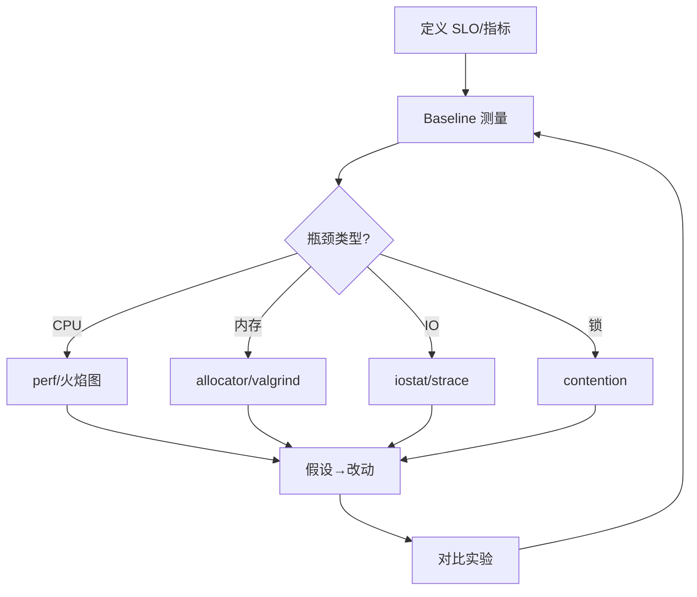

# 性能工程方法论与基准测试

> **文件编码**：UTF-8。  
> **定位**：Benchmark 设计、Google Benchmark、火焰图、Roofline、Amdahl/Gustafson——**方法论** 串联 [12 章](12-性能分析与调试.md) 工具与 [70 章](70-计算机体系结构深入学习.md) 硬件模型。  
> **原则**：先测量，再优化；可重复，可解释。

## §0 读前导读

### §0.1 用一句话弄懂本章

**性能工程** = 定义指标 → 设计可重复实验 → 定位瓶颈类型（CPU/内存/IO/锁）→ 用模型（Roofline、Amdahl）指导优化 → 回归验证；乱优化不如不优化。

### §0.2 你需要提前知道什么

- [12 章](12-性能分析与调试.md) perf/Valgrind/GDB
- [70 章](70-计算机体系结构深入学习.md) cache/NUMA
- [18 章](18-高性能C++与内存对齐.md) 对齐
- [08 章](08-多线程与并发编程.md) 并发

### §0.3 本章知识地图（☐→☑）

- [ ] 写出合法 microbenchmark 检查清单
- [ ] 使用 Google Benchmark 框架
- [ ] 读 perf 火焰图
- [ ] 画 Roofline 点
- [ ] Amdahl 定律算加速上限
- [ ] Gustafson 与 weak scaling
- [ ] 区分测量噪声与真回归
- [ ] 闭卷自测 ≥8/10

### §0.4 建议学习时长

**6～8 天**

### §0.5 学完你能做什么

为 mini-http/KV 建 baseline；用 GB 对比两种实现；perf record 火焰图找热点；写 STAR 优化故事（61 章）。

### §0.6 交叉阅读

- [12 章 性能分析](12-性能分析与调试.md)
- [61 章 线上排查](61-线上故障排查与性能诊断实战.md)
- [70 章 体系结构](70-计算机体系结构深入学习.md)
- [69 章 PGO/LTO](69-编译原理入门与C++编译流程.md)

---

## 本章与上一章的关系

[73 章](73-汇编语言入门与C++对应.md) 为本章铺垫；本章在其基础上 **原理化、教材化** 展开，与面试速记章互补而非重复。

---

## 1. 性能工程方法论




**Knuth**：过早优化是万恶之源——但 **过早放弃测量** 同样危险。


## 2. Benchmark 设计原则


| 原则 | 说明 |
|------|------|
| 可重复 | 固定 seed、CPU 频率、绑核 |
| 代表性 | workload 像生产 |
| 隔离 | 测 A 不要连改 B |
| 统计 | 多次运行，报 median/P99 |
| 防死码消除 | 消费结果 |

```cpp
// 错误：编译器删除未使用计算
for (int i = 0; i < N; ++i) sum += heavy(i);
// 正确：google benchmark 或 volatile/DoNotOptimize
```


## 3. Google Benchmark 入门


```cpp
#include <benchmark/benchmark.h>
static void BM_VectorPush(benchmark::State& state) {
    for (auto _ : state) {
        std::vector<int> v;
        for (int i = 0; i < state.range(0); ++i)
            v.push_back(i);
    }
}
BENCHMARK(BM_VectorPush)->Range(8, 1<<20);
BENCHMARK_MAIN();
```

```cmake
find_package(benchmark REQUIRED)
target_link_libraries(bench PRIVATE benchmark::benchmark)
```

**Counter**：`state.SetBytesProcessed`；**Fixture** 共享昂贵 setup。


## 4. 微基准陷阱


1. **CPU 频率缩放** → `cpufreq-set performance`
2. **编译器优化穿越 benchmark** → DoNotOptimize
3. **cache 状态** → 冷/热 cache 不同
4. **协同线程** → 关 SMT 或绑核
5. **过小 N** → 纳秒级噪声淹没

[70 章](70-计算机体系结构深入学习.md) 解释 cache 为何导致 **双峰分布**。


## 5. 火焰图（Flame Graph）


```bash
perf record -F 99 -g ./app --workload
perf script | stackcollapse-perf.pl | flamegraph.pl > fg.svg
```

**读图**：横宽 = 采样占比；纵轴 = 栈深度。**平顶** = 热点函数。

与 [12 章](12-性能分析与调试.md) `perf top` 互补；火焰图适合 **汇报**。


## 6. Roofline 模型


```text
Performance (GFLOP/s)
    ^     |     \  计算 roof (peak FLOPS)
    |     |      \
    |     |       \____ 带宽 roof (peak BW × AI)
    |     |____________\________
    +-----+------------+--------> Arithmetic Intensity (FLOP/Byte)
```

**AI** = 计算量/访存量。点落在 **带宽脊** → 优化内存；落在 **计算脊** → 优化指令/向量化。

LLM GEMM 高 AI；指针 chasing 低 AI（22/70 章）。


## 7. Amdahl 定律


\[
S = \frac{1}{(1-p) + \frac{p}{s}}
\]

$p$ = 可并行比例，$s$ = 并行部分加速倍数。

**启示**：优化 **串行热点** 往往比盲目加核有效；10% 串行限制最大 10× 加速。


## 8. Gustafson 定律


固定时间、扩大问题规模时：

\[
S = s + p(1-s)
\]

**Weak scaling** 适合 HPC；Web 服务常关注 **强 scaling** 与 **P99**（61 章）。


## 9. 瓶颈定位 checklist


| 症状 | 可能瓶颈 | 工具 |
|------|----------|------|
| CPU 100% 单核 | 热点循环 | perf |
| CPU 低 QPS | 锁/IO | perf lock, strace |
| RSS 涨 | 泄漏/容器 | massif/heaptrack |
| P99 尖刺 | GC/swap/NUMA | vmstat, numastat |
| 编译慢 | 模板/头文件 | time, modules |

[69 章 LTO/PGO](69-编译原理入门与C++编译流程.md) 需 **代表性 profile**（本章设计）。


## 10. 回归与 CI 中的性能


```yaml
# 示意：性能回归 job
- run: ./bench --benchmark_min_time=1s
- run: python compare_baseline.py results.json
```

**阈值**：>5% 回归告警；考虑 **环境漂移**（云主机 noisy neighbor）。

与 [27 章 GTest](27-Google-Test与单元测试工程.md) 功能测试并列；性能为 **非功能需求**。


## 11.1 案例：优化迭代日志 #1


#### 11.1.1 Baseline

记录 QPS、P50/P99、CPU%、`perf top` 前三函数（[12 章](12-性能分析与调试.md) 模板）。

#### 11.1.2 假设 #1

例如：#预分配 buffer。

#### 11.1.3 改动与 GB 微基准

```cpp
static void BM_Path1(benchmark::State& st) {
    for (auto _ : st) {
        // 被测路径
        benchmark::DoNotOptimize(work());
    }
}
```

#### 11.1.4 验证

- 功能测试仍过（27 章）
- 端到端 ab/wrk（12 章）
- 火焰图对比 **热点是否转移**

#### 11.1.5 STAR 叙述（36/61 章）

Situation/Task/Action/Result 各一句，量化 **P99 或 QPS** 变化。


## 11.2 案例：优化迭代日志 #2


#### 11.2.1 Baseline

记录 QPS、P50/P99、CPU%、`perf top` 前三函数（[12 章](12-性能分析与调试.md) 模板）。

#### 11.2.2 假设 #2

例如：#SIMD 解析。

#### 11.2.3 改动与 GB 微基准

```cpp
static void BM_Path2(benchmark::State& st) {
    for (auto _ : st) {
        // 被测路径
        benchmark::DoNotOptimize(work());
    }
}
```

#### 11.2.4 验证

- 功能测试仍过（27 章）
- 端到端 ab/wrk（12 章）
- 火焰图对比 **热点是否转移**

#### 11.2.5 STAR 叙述（36/61 章）

Situation/Task/Action/Result 各一句，量化 **P99 或 QPS** 变化。


## 11.3 案例：优化迭代日志 #3


#### 11.3.1 Baseline

记录 QPS、P50/P99、CPU%、`perf top` 前三函数（[12 章](12-性能分析与调试.md) 模板）。

#### 11.3.2 假设 #3

例如：#减少锁粒度。

#### 11.3.3 改动与 GB 微基准

```cpp
static void BM_Path3(benchmark::State& st) {
    for (auto _ : st) {
        // 被测路径
        benchmark::DoNotOptimize(work());
    }
}
```

#### 11.3.4 验证

- 功能测试仍过（27 章）
- 端到端 ab/wrk（12 章）
- 火焰图对比 **热点是否转移**

#### 11.3.5 STAR 叙述（36/61 章）

Situation/Task/Action/Result 各一句，量化 **P99 或 QPS** 变化。


## 11.4 案例：优化迭代日志 #4


#### 11.4.1 Baseline

记录 QPS、P50/P99、CPU%、`perf top` 前三函数（[12 章](12-性能分析与调试.md) 模板）。

#### 11.4.2 假设 #4

例如：#预分配 buffer。

#### 11.4.3 改动与 GB 微基准

```cpp
static void BM_Path4(benchmark::State& st) {
    for (auto _ : st) {
        // 被测路径
        benchmark::DoNotOptimize(work());
    }
}
```

#### 11.4.4 验证

- 功能测试仍过（27 章）
- 端到端 ab/wrk（12 章）
- 火焰图对比 **热点是否转移**

#### 11.4.5 STAR 叙述（36/61 章）

Situation/Task/Action/Result 各一句，量化 **P99 或 QPS** 变化。


## 11.5 案例：优化迭代日志 #5


#### 11.5.1 Baseline

记录 QPS、P50/P99、CPU%、`perf top` 前三函数（[12 章](12-性能分析与调试.md) 模板）。

#### 11.5.2 假设 #5

例如：#SIMD 解析。

#### 11.5.3 改动与 GB 微基准

```cpp
static void BM_Path5(benchmark::State& st) {
    for (auto _ : st) {
        // 被测路径
        benchmark::DoNotOptimize(work());
    }
}
```

#### 11.5.4 验证

- 功能测试仍过（27 章）
- 端到端 ab/wrk（12 章）
- 火焰图对比 **热点是否转移**

#### 11.5.5 STAR 叙述（36/61 章）

Situation/Task/Action/Result 各一句，量化 **P99 或 QPS** 变化。


## 11.6 案例：优化迭代日志 #6


#### 11.6.1 Baseline

记录 QPS、P50/P99、CPU%、`perf top` 前三函数（[12 章](12-性能分析与调试.md) 模板）。

#### 11.6.2 假设 #6

例如：#减少锁粒度。

#### 11.6.3 改动与 GB 微基准

```cpp
static void BM_Path6(benchmark::State& st) {
    for (auto _ : st) {
        // 被测路径
        benchmark::DoNotOptimize(work());
    }
}
```

#### 11.6.4 验证

- 功能测试仍过（27 章）
- 端到端 ab/wrk（12 章）
- 火焰图对比 **热点是否转移**

#### 11.6.5 STAR 叙述（36/61 章）

Situation/Task/Action/Result 各一句，量化 **P99 或 QPS** 变化。


## 11.7 案例：优化迭代日志 #7


#### 11.7.1 Baseline

记录 QPS、P50/P99、CPU%、`perf top` 前三函数（[12 章](12-性能分析与调试.md) 模板）。

#### 11.7.2 假设 #7

例如：#预分配 buffer。

#### 11.7.3 改动与 GB 微基准

```cpp
static void BM_Path7(benchmark::State& st) {
    for (auto _ : st) {
        // 被测路径
        benchmark::DoNotOptimize(work());
    }
}
```

#### 11.7.4 验证

- 功能测试仍过（27 章）
- 端到端 ab/wrk（12 章）
- 火焰图对比 **热点是否转移**

#### 11.7.5 STAR 叙述（36/61 章）

Situation/Task/Action/Result 各一句，量化 **P99 或 QPS** 变化。


## 11.8 案例：优化迭代日志 #8


#### 11.8.1 Baseline

记录 QPS、P50/P99、CPU%、`perf top` 前三函数（[12 章](12-性能分析与调试.md) 模板）。

#### 11.8.2 假设 #8

例如：#SIMD 解析。

#### 11.8.3 改动与 GB 微基准

```cpp
static void BM_Path8(benchmark::State& st) {
    for (auto _ : st) {
        // 被测路径
        benchmark::DoNotOptimize(work());
    }
}
```

#### 11.8.4 验证

- 功能测试仍过（27 章）
- 端到端 ab/wrk（12 章）
- 火焰图对比 **热点是否转移**

#### 11.8.5 STAR 叙述（36/61 章）

Situation/Task/Action/Result 各一句，量化 **P99 或 QPS** 变化。


## 11.9 案例：优化迭代日志 #9


#### 11.9.1 Baseline

记录 QPS、P50/P99、CPU%、`perf top` 前三函数（[12 章](12-性能分析与调试.md) 模板）。

#### 11.9.2 假设 #9

例如：#减少锁粒度。

#### 11.9.3 改动与 GB 微基准

```cpp
static void BM_Path9(benchmark::State& st) {
    for (auto _ : st) {
        // 被测路径
        benchmark::DoNotOptimize(work());
    }
}
```

#### 11.9.4 验证

- 功能测试仍过（27 章）
- 端到端 ab/wrk（12 章）
- 火焰图对比 **热点是否转移**

#### 11.9.5 STAR 叙述（36/61 章）

Situation/Task/Action/Result 各一句，量化 **P99 或 QPS** 变化。


## 11.10 案例：优化迭代日志 #10


#### 11.10.1 Baseline

记录 QPS、P50/P99、CPU%、`perf top` 前三函数（[12 章](12-性能分析与调试.md) 模板）。

#### 11.10.2 假设 #10

例如：#预分配 buffer。

#### 11.10.3 改动与 GB 微基准

```cpp
static void BM_Path10(benchmark::State& st) {
    for (auto _ : st) {
        // 被测路径
        benchmark::DoNotOptimize(work());
    }
}
```

#### 11.10.4 验证

- 功能测试仍过（27 章）
- 端到端 ab/wrk（12 章）
- 火焰图对比 **热点是否转移**

#### 11.10.5 STAR 叙述（36/61 章）

Situation/Task/Action/Result 各一句，量化 **P99 或 QPS** 变化。


## 11.11 案例：优化迭代日志 #11


#### 11.11.1 Baseline

记录 QPS、P50/P99、CPU%、`perf top` 前三函数（[12 章](12-性能分析与调试.md) 模板）。

#### 11.11.2 假设 #11

例如：#SIMD 解析。

#### 11.11.3 改动与 GB 微基准

```cpp
static void BM_Path11(benchmark::State& st) {
    for (auto _ : st) {
        // 被测路径
        benchmark::DoNotOptimize(work());
    }
}
```

#### 11.11.4 验证

- 功能测试仍过（27 章）
- 端到端 ab/wrk（12 章）
- 火焰图对比 **热点是否转移**

#### 11.11.5 STAR 叙述（36/61 章）

Situation/Task/Action/Result 各一句，量化 **P99 或 QPS** 变化。


## 11.12 案例：优化迭代日志 #12


#### 11.12.1 Baseline

记录 QPS、P50/P99、CPU%、`perf top` 前三函数（[12 章](12-性能分析与调试.md) 模板）。

#### 11.12.2 假设 #12

例如：#减少锁粒度。

#### 11.12.3 改动与 GB 微基准

```cpp
static void BM_Path12(benchmark::State& st) {
    for (auto _ : st) {
        // 被测路径
        benchmark::DoNotOptimize(work());
    }
}
```

#### 11.12.4 验证

- 功能测试仍过（27 章）
- 端到端 ab/wrk（12 章）
- 火焰图对比 **热点是否转移**

#### 11.12.5 STAR 叙述（36/61 章）

Situation/Task/Action/Result 各一句，量化 **P99 或 QPS** 变化。


## 11.13 案例：优化迭代日志 #13


#### 11.13.1 Baseline

记录 QPS、P50/P99、CPU%、`perf top` 前三函数（[12 章](12-性能分析与调试.md) 模板）。

#### 11.13.2 假设 #13

例如：#预分配 buffer。

#### 11.13.3 改动与 GB 微基准

```cpp
static void BM_Path13(benchmark::State& st) {
    for (auto _ : st) {
        // 被测路径
        benchmark::DoNotOptimize(work());
    }
}
```

#### 11.13.4 验证

- 功能测试仍过（27 章）
- 端到端 ab/wrk（12 章）
- 火焰图对比 **热点是否转移**

#### 11.13.5 STAR 叙述（36/61 章）

Situation/Task/Action/Result 各一句，量化 **P99 或 QPS** 变化。


## 11.14 案例：优化迭代日志 #14


#### 11.14.1 Baseline

记录 QPS、P50/P99、CPU%、`perf top` 前三函数（[12 章](12-性能分析与调试.md) 模板）。

#### 11.14.2 假设 #14

例如：#SIMD 解析。

#### 11.14.3 改动与 GB 微基准

```cpp
static void BM_Path14(benchmark::State& st) {
    for (auto _ : st) {
        // 被测路径
        benchmark::DoNotOptimize(work());
    }
}
```

#### 11.14.4 验证

- 功能测试仍过（27 章）
- 端到端 ab/wrk（12 章）
- 火焰图对比 **热点是否转移**

#### 11.14.5 STAR 叙述（36/61 章）

Situation/Task/Action/Result 各一句，量化 **P99 或 QPS** 变化。


## 11.15 案例：优化迭代日志 #15


#### 11.15.1 Baseline

记录 QPS、P50/P99、CPU%、`perf top` 前三函数（[12 章](12-性能分析与调试.md) 模板）。

#### 11.15.2 假设 #15

例如：#减少锁粒度。

#### 11.15.3 改动与 GB 微基准

```cpp
static void BM_Path15(benchmark::State& st) {
    for (auto _ : st) {
        // 被测路径
        benchmark::DoNotOptimize(work());
    }
}
```

#### 11.15.4 验证

- 功能测试仍过（27 章）
- 端到端 ab/wrk（12 章）
- 火焰图对比 **热点是否转移**

#### 11.15.5 STAR 叙述（36/61 章）

Situation/Task/Action/Result 各一句，量化 **P99 或 QPS** 变化。


## 11.16 案例：优化迭代日志 #16


#### 11.16.1 Baseline

记录 QPS、P50/P99、CPU%、`perf top` 前三函数（[12 章](12-性能分析与调试.md) 模板）。

#### 11.16.2 假设 #16

例如：#预分配 buffer。

#### 11.16.3 改动与 GB 微基准

```cpp
static void BM_Path16(benchmark::State& st) {
    for (auto _ : st) {
        // 被测路径
        benchmark::DoNotOptimize(work());
    }
}
```

#### 11.16.4 验证

- 功能测试仍过（27 章）
- 端到端 ab/wrk（12 章）
- 火焰图对比 **热点是否转移**

#### 11.16.5 STAR 叙述（36/61 章）

Situation/Task/Action/Result 各一句，量化 **P99 或 QPS** 变化。


## 11.17 案例：优化迭代日志 #17


#### 11.17.1 Baseline

记录 QPS、P50/P99、CPU%、`perf top` 前三函数（[12 章](12-性能分析与调试.md) 模板）。

#### 11.17.2 假设 #17

例如：#SIMD 解析。

#### 11.17.3 改动与 GB 微基准

```cpp
static void BM_Path17(benchmark::State& st) {
    for (auto _ : st) {
        // 被测路径
        benchmark::DoNotOptimize(work());
    }
}
```

#### 11.17.4 验证

- 功能测试仍过（27 章）
- 端到端 ab/wrk（12 章）
- 火焰图对比 **热点是否转移**

#### 11.17.5 STAR 叙述（36/61 章）

Situation/Task/Action/Result 各一句，量化 **P99 或 QPS** 变化。


## 11.18 案例：优化迭代日志 #18


#### 11.18.1 Baseline

记录 QPS、P50/P99、CPU%、`perf top` 前三函数（[12 章](12-性能分析与调试.md) 模板）。

#### 11.18.2 假设 #18

例如：#减少锁粒度。

#### 11.18.3 改动与 GB 微基准

```cpp
static void BM_Path18(benchmark::State& st) {
    for (auto _ : st) {
        // 被测路径
        benchmark::DoNotOptimize(work());
    }
}
```

#### 11.18.4 验证

- 功能测试仍过（27 章）
- 端到端 ab/wrk（12 章）
- 火焰图对比 **热点是否转移**

#### 11.18.5 STAR 叙述（36/61 章）

Situation/Task/Action/Result 各一句，量化 **P99 或 QPS** 变化。


## 11.19 案例：优化迭代日志 #19


#### 11.19.1 Baseline

记录 QPS、P50/P99、CPU%、`perf top` 前三函数（[12 章](12-性能分析与调试.md) 模板）。

#### 11.19.2 假设 #19

例如：#预分配 buffer。

#### 11.19.3 改动与 GB 微基准

```cpp
static void BM_Path19(benchmark::State& st) {
    for (auto _ : st) {
        // 被测路径
        benchmark::DoNotOptimize(work());
    }
}
```

#### 11.19.4 验证

- 功能测试仍过（27 章）
- 端到端 ab/wrk（12 章）
- 火焰图对比 **热点是否转移**

#### 11.19.5 STAR 叙述（36/61 章）

Situation/Task/Action/Result 各一句，量化 **P99 或 QPS** 变化。


## 11.20 案例：优化迭代日志 #20


#### 11.20.1 Baseline

记录 QPS、P50/P99、CPU%、`perf top` 前三函数（[12 章](12-性能分析与调试.md) 模板）。

#### 11.20.2 假设 #20

例如：#SIMD 解析。

#### 11.20.3 改动与 GB 微基准

```cpp
static void BM_Path20(benchmark::State& st) {
    for (auto _ : st) {
        // 被测路径
        benchmark::DoNotOptimize(work());
    }
}
```

#### 11.20.4 验证

- 功能测试仍过（27 章）
- 端到端 ab/wrk（12 章）
- 火焰图对比 **热点是否转移**

#### 11.20.5 STAR 叙述（36/61 章）

Situation/Task/Action/Result 各一句，量化 **P99 或 QPS** 变化。


## 11.21 案例：优化迭代日志 #21


#### 11.21.1 Baseline

记录 QPS、P50/P99、CPU%、`perf top` 前三函数（[12 章](12-性能分析与调试.md) 模板）。

#### 11.21.2 假设 #21

例如：#减少锁粒度。

#### 11.21.3 改动与 GB 微基准

```cpp
static void BM_Path21(benchmark::State& st) {
    for (auto _ : st) {
        // 被测路径
        benchmark::DoNotOptimize(work());
    }
}
```

#### 11.21.4 验证

- 功能测试仍过（27 章）
- 端到端 ab/wrk（12 章）
- 火焰图对比 **热点是否转移**

#### 11.21.5 STAR 叙述（36/61 章）

Situation/Task/Action/Result 各一句，量化 **P99 或 QPS** 变化。


## 11.22 案例：优化迭代日志 #22


#### 11.22.1 Baseline

记录 QPS、P50/P99、CPU%、`perf top` 前三函数（[12 章](12-性能分析与调试.md) 模板）。

#### 11.22.2 假设 #22

例如：#预分配 buffer。

#### 11.22.3 改动与 GB 微基准

```cpp
static void BM_Path22(benchmark::State& st) {
    for (auto _ : st) {
        // 被测路径
        benchmark::DoNotOptimize(work());
    }
}
```

#### 11.22.4 验证

- 功能测试仍过（27 章）
- 端到端 ab/wrk（12 章）
- 火焰图对比 **热点是否转移**

#### 11.22.5 STAR 叙述（36/61 章）

Situation/Task/Action/Result 各一句，量化 **P99 或 QPS** 变化。


## 11.23 案例：优化迭代日志 #23


#### 11.23.1 Baseline

记录 QPS、P50/P99、CPU%、`perf top` 前三函数（[12 章](12-性能分析与调试.md) 模板）。

#### 11.23.2 假设 #23

例如：#SIMD 解析。

#### 11.23.3 改动与 GB 微基准

```cpp
static void BM_Path23(benchmark::State& st) {
    for (auto _ : st) {
        // 被测路径
        benchmark::DoNotOptimize(work());
    }
}
```

#### 11.23.4 验证

- 功能测试仍过（27 章）
- 端到端 ab/wrk（12 章）
- 火焰图对比 **热点是否转移**

#### 11.23.5 STAR 叙述（36/61 章）

Situation/Task/Action/Result 各一句，量化 **P99 或 QPS** 变化。


## 11.24 案例：优化迭代日志 #24


#### 11.24.1 Baseline

记录 QPS、P50/P99、CPU%、`perf top` 前三函数（[12 章](12-性能分析与调试.md) 模板）。

#### 11.24.2 假设 #24

例如：#减少锁粒度。

#### 11.24.3 改动与 GB 微基准

```cpp
static void BM_Path24(benchmark::State& st) {
    for (auto _ : st) {
        // 被测路径
        benchmark::DoNotOptimize(work());
    }
}
```

#### 11.24.4 验证

- 功能测试仍过（27 章）
- 端到端 ab/wrk（12 章）
- 火焰图对比 **热点是否转移**

#### 11.24.5 STAR 叙述（36/61 章）

Situation/Task/Action/Result 各一句，量化 **P99 或 QPS** 变化。


## 11.25 案例：优化迭代日志 #25


#### 11.25.1 Baseline

记录 QPS、P50/P99、CPU%、`perf top` 前三函数（[12 章](12-性能分析与调试.md) 模板）。

#### 11.25.2 假设 #25

例如：#预分配 buffer。

#### 11.25.3 改动与 GB 微基准

```cpp
static void BM_Path25(benchmark::State& st) {
    for (auto _ : st) {
        // 被测路径
        benchmark::DoNotOptimize(work());
    }
}
```

#### 11.25.4 验证

- 功能测试仍过（27 章）
- 端到端 ab/wrk（12 章）
- 火焰图对比 **热点是否转移**

#### 11.25.5 STAR 叙述（36/61 章）

Situation/Task/Action/Result 各一句，量化 **P99 或 QPS** 变化。


## 练习题

### 练习 A（概念推导）

1. 用费曼技巧向同学解释本章核心概念之一（≤3 分钟口述）。
2. 画出本章主流程图（纸笔或 mermaid），标注至少 5 个关键术语。
3. 对照正文，找出一个「容易误解」的点并写 100 字澄清。

### 练习 B（动手验证）

4. 按正文示例在 Linux/WSL 或 MSYS2 复现一次实验/命令，记录输出。
5. 修改示例代码中的一个参数，预测结果后再编译/运行验证。
6. 用 `man`/官方文档核对正文中的一个数量级或术语定义。

### 练习 C（与 C++ 结合）

7. 写一段 ≤30 行的 C++17 小程序，体现本章至少 2 个概念。
8. 用 GDB/perf/readelf/objdump 之一观察该程序的相关现象。
9. 将观察结果与 [48 章](48-编译预处理与链接原理.md) 或 [12 章](12-性能分析与调试.md) 的工具链对照。

<details>
<summary>练习提示（非唯一解）</summary>

- 原理章重在「预测—验证—修正」闭环；答案不唯一，关键是能自圆其说。
- 若环境缺失（如 Linux 专属工具），可用 WSL 或正文给出的替代方案。

</details>

---

## FAQ

**Q：microbenchmark 能代表生产吗？**

不能全自动等同；需 **component + 端到端** 双层验证。

**Q：Google Benchmark vs perf？**

GB 测 **函数级**；perf 测 **整进程**；互补。

**Q：Roofline 要峰值 FLOPS 怎么取？**

数据手册 peak AVX512 或 `lscpu`/厂商工具；保守取 sustained。

**Q：优化后变慢？**

检查 **算法复杂度**、false sharing、分支 miss；回滚 baseline 对比。

**Q：74 与 12 章？**

12 教工具入门；74 教 **实验设计与模型**。

---

## 闭卷自测

1. Benchmark 四条设计原则？
2. DoNotOptimize 目的？
3. 火焰图横轴含义？
4. Roofline 两脊？
5. Amdahl 中 p 含义？
6. Gustafson 适用场景？
7. perf record 采样？
8. P99 为何重要？
9. microbenchmark 两大陷阱？
10. 74 与 69 PGO？

<details>
<summary>参考答案</summary>

1. 可重复/代表性/隔离/统计等
2. 防编译器删除被测代码
3. 栈上采样占比（非时间轴）
4. 计算屋顶与带宽屋顶
5. 可并行比例
6. 大问题 weak scaling
7. 99Hz 等采样 callchain
8. 尾延迟用户体验
9. 频率缩放/死码消除等
10. PGO 需本章代表性 workload

</details>

---

## 下一章预告

本系列 **69→74 原理链** 完结；可回到 [00 路线图](00-学习路线图与说明.md) 或深入 [61 章 线上排查](61-线上故障排查与性能诊断实战.md) 综合实战。

---

*系列完结；建议：61 章线上实战 · 00 章路线图*
