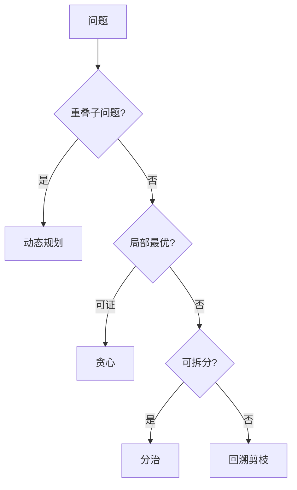

# 算法设计思想：DP、贪心、回溯与分治

> **文件编码**：UTF-8。题解默认 C++17。
> **定位**：设计方法论、状态转移、贪心证明、回溯剪枝、分治主定理、经典例题 C++ 实现。
> **交叉阅读**：[13 算法 C++ 实现](13-算法与数据结构C++实现.md)、[数据结构 11 DP](../数据结构/11-动态规划与贪心.md)、[14 面试专题](14-高频面试专题与场景题.md)。

---

## 本章与系列关系

| 互补章节 | 分工 |
|----------|------|
| [13 章](13-算法与数据结构C++实现.md) | STL 模板、刷题速度 |
| [数据结构 11](../数据结构/11-动态规划与贪心.md) | 原理与数学归纳 |
| **75 章（本章）** | 范式选型 + 证明 + 主定理 + C++ |



## 0. 读前导读（§0）

### 0.1 用一句话弄懂本章

**算法设计思想** = 在写代码前选对范式，并能证明或分析复杂度。

### 0.2 你需要提前知道什么

| 状态 | 动作 |
|------|------|
| 13 章已刷 30+ 题 | 直接读 §2～§7 |
| 只会背模板 | 先读 §1 决策树 |
| 数学证明弱 | 贪心读 §5 交换论证 |

### 0.3 本章知识地图（☐→☑）

- ☐ 写出 DP 四步
- ☐ 证明活动选择贪心
- ☐ 回溯三种剪枝
- ☐ 主定理分析归并排序
- ☐ 闭卷自测 ≥8/10

### 0.4 建议学习时长

**7～10 天**

### 0.5 学完你能做什么

面试：背包 DP、区间贪心、全排列回溯、快排分治 + T(n) 口述。

---

## 1. 算法设计方法论

### 1.1 四范式对照

| 范式 | 识别信号 | 关键 | 典型复杂度 |
|---|---|---|---|
| DP | 最优子结构+重叠 | 状态/转移 | O(n²), O(nW) |
| 贪心 | 排序后线性 | 证明 | O(n log n) |
| 回溯 | 组合/排列/棋盘 | 剪枝 | 指数剪枝后 |
| 分治 | 独立两半 | 合并 | 主定理 |

### 1.2 选型决策树

```
能否构造贪心反例？ ─否→ 尝试贪心证明
        │是
        ↓
子问题重叠？ ─是→ DP（记忆化或表格）
        │否
        ↓
可均分+合并？ ─是→ 分治
        │否
        ↓
搜索+约束 → 回溯（加剪枝）
```

## 2. 动态规划

### 2.1 四步法

1. **状态** 2. **转移** 3. **初值** 4. **答案**

### 2.2 打家劫舍（一维滚动）

```cpp
#include <vector>
#include <algorithm>
int rob(const std::vector<int>& nums) {
    int p2 = 0, p1 = 0;
    for (int x : nums) {
        int cur = std::max(p1, p2 + x);
        p2 = p1; p1 = cur;
    }
    return p1;
}
```

### 2.3 最长公共子序列

```cpp
#include <string>
#include <vector>
int lcs(const std::string& a, const std::string& b) {
    int n = (int)a.size(), m = (int)b.size();
    std::vector<std::vector<int>> dp(n+1, std::vector<int>(m+1, 0));
    for (int i = 1; i <= n; ++i)
        for (int j = 1; j <= m; ++j)
            dp[i][j] = (a[i-1]==b[j-1]) ? dp[i-1][j-1]+1
                : std::max(dp[i-1][j], dp[i][j-1]);
    return dp[n][m];
}
```

### 2.4 0-1 背包

```cpp
int knapsack01(const std::vector<int>& w, const std::vector<int>& v, int W) {
    std::vector<int> dp(W+1, 0);
    for (size_t i = 0; i < w.size(); ++i)
        for (int cap = W; cap >= w[i]; --cap)
            dp[cap] = std::max(dp[cap], dp[cap-w[i]] + v[i]);
    return dp[W];
}
```

### 2.5 编辑距离

```cpp
int editDist(const std::string& a, const std::string& b) {
    int n = (int)a.size(), m = (int)b.size();
    std::vector<std::vector<int>> dp(n+1, std::vector<int>(m+1));
    for (int i = 0; i <= n; ++i) dp[i][0] = i;
    for (int j = 0; j <= m; ++j) dp[0][j] = j;
    for (int i = 1; i <= n; ++i)
        for (int j = 1; j <= m; ++j) {
            int cost = (a[i-1]==b[j-1]) ? 0 : 1;
            dp[i][j] = std::min({dp[i-1][j]+1, dp[i][j-1]+1, dp[i-1][j-1]+cost});
        }
    return dp[n][m];
}
```

## 3. 区间 DP 与状态设计

石子合并、戳气球：枚举最后一步分割点

```cpp
// 区间 DP 与状态设计 框架
namespace dp {
int solve(); // 见 examples/
}
```

## 4. 树形 DP

打家劫舍 III：后序遍历合并子树

```cpp
// 树形 DP 框架
namespace dp {
int solve(); // 见 examples/
}
```

## 5. 状态压缩 DP

旅行商 TSP：mask 表示访问集合

```cpp
// 状态压缩 DP 框架
namespace dp {
int solve(); // 见 examples/
}
```

## 6. 数位 DP

计数不含某数字的 n 位数

```cpp
// 数位 DP 框架
namespace dp {
int solve(); // 见 examples/
}
```

## 7. 贪心算法与证明

### 7.1 活动选择

```cpp
struct Act { int s, e; };
int maxAct(std::vector<Act> v) {
    std::sort(v.begin(), v.end(), [](Act& a, Act& b){ return a.e < b.e; });
    int cnt = 0, end = -1;
    for (auto& a : v) if (a.s >= end) { ++cnt; end = a.e; }
    return cnt;
}
```

### 7.2 交换论证模板

设贪心第一步为 g，最优解 OPT 第一步为 o。若 o≠g，将 OPT 中 o 换为 g：
因 g 结束最早，不占用更多后续区间 → 解不劣 → 归纳可得最优。

| 问题 | 贪心键 | 证明技巧 |
|---|---|---|
| 分发饼干 | 排序双指针 | 饥饿值最小匹配 |
| 跳跃游戏 II | 层边界 | 区间覆盖 |
| 哈夫曼 | 最小堆合并 | 最优子结构 |
| Kruskal | 边权升序 | 切分性质 |

## 8. 回溯：模板与剪枝

```cpp
void backtrack(状态) {
  if (done) { record; return; }
  for (auto& choice : choices) {
    if (!valid(choice)) continue;
    apply(choice);
    backtrack(next);
    undo(choice);
  }
}
```

### 8.1 全排列

```cpp
void permute(std::vector<int>& a, int l, std::vector<std::vector<int>>& out) {
    if (l == (int)a.size()) { out.push_back(a); return; }
    for (int i = l; i < (int)a.size(); ++i) {
        std::swap(a[l], a[i]);
        permute(a, l+1, out);
        std::swap(a[l], a[i]);
    }
}
```

### 8.2 组合总和

```cpp
void combSum(std::vector<int>& cand, int t, int start,
             std::vector<int>& path, std::vector<std::vector<int>>& res) {
    if (t == 0) { res.push_back(path); return; }
    if (t < 0) return;
    for (int i = start; i < (int)cand.size(); ++i) {
        path.push_back(cand[i]);
        combSum(cand, t - cand[i], i, path, res);
        path.pop_back();
    }
}
```

### 8.3 三种剪枝

| 类型 | 做法 | 例 |
|---|---|---|
| 可行性 | 非法即 return | N 皇后列/对角冲突 |
| 限界 | 估计不可能更优 | 分支限界 |
| 去重 | 排序+同层 skip | 组合 II |

## 9. 分治与主定理

### 9.1 归并排序

```cpp
void mergeSort(std::vector<int>& a, int l, int r, std::vector<int>& tmp) {
    if (l >= r) return;
    int m = l + (r - l) / 2;
    mergeSort(a, l, m, tmp);
    mergeSort(a, m+1, r, tmp);
    // merge ...
}
```

### 9.2 主定理

T(n)=aT(n/b)+f(n)：

| 情况 | 条件 | 结果 |
|---|---|---|
| 1 | f(n)=O(n^(log_b a - ε)) | T=Θ(n^log_b a) |
| 2 | f(n)=Θ(n^log_b a log^k n) | T=Θ(n^log_b a log^(k+1) n) |
| 3 | f(n)=Ω(n^(log_b a + ε)) | T=Θ(f(n)) |

### 9.3 快速选择

```cpp
int partition(std::vector<int>& a, int l, int r) {
    int pivot = a[r], i = l;
    for (int j = l; j < r; ++j) if (a[j] <= pivot) std::swap(a[i++], a[j]);
    std::swap(a[i], a[r]); return i;
}
int quickSelect(std::vector<int>& a, int l, int r, int k) {
    if (l == r) return a[l];
    int p = partition(a, l, r);
    if (k == p) return a[k];
    return k < p ? quickSelect(a, l, p-1, k) : quickSelect(a, p+1, r, k);
}
```

## 10. 经典例题：硬币找零（DP）

**要点**：完全背包或 BFS


```cpp
// 硬币找零（DP）
int solve(); // 对照 13 章同题
```

## 11. 经典例题：最长递增子序列 O(n log n)

**要点**：patience + lower_bound

```mermaid
graph LR
  I[输入] --> S[最长递增子序列 O(n log n)]
  S --> O[输出]
```

```cpp
// 最长递增子序列 O(n log n)
int solve(); // 对照 13 章同题
```

## 12. 经典例题：合并区间（贪心）

**要点**：按起点排序


```cpp
// 合并区间（贪心）
int solve(); // 对照 13 章同题
```

## 13. 经典例题：子集（回溯）

**要点**：选/不选


```cpp
// 子集（回溯）
int solve(); // 对照 13 章同题
```

## 14. 经典例题：Pow(x,n)（分治）

**要点**：快速幂

```mermaid
graph LR
  I[输入] --> S[Pow(x,n)（分治）]
  S --> O[输出]
```

```cpp
// Pow(x,n)（分治）
int solve(); // 对照 13 章同题
```

## 15. 经典例题：最近点对（分治）

**要点**：按 x 排序分半


```cpp
// 最近点对（分治）
int solve(); // 对照 13 章同题
```


## 17. 记忆化搜索与自底向上对照

| 写法 | 优点 | 缺点 |
|------|------|------|
| 记忆化 DFS | 只算需要状态 | 递归栈深 |
| 迭代 DP | 无递归、常更快 | 需明确遍历顺序 |

```cpp
#include <vector>
#include <unordered_map>

int dfsCoin(const std::vector<int>& coins, int amt,
            std::unordered_map<int,int>& memo) {
    if (amt == 0) return 0;
    if (amt < 0) return 1e9;
    if (memo.count(amt)) return memo[amt];
    int best = 1e9;
    for (int c : coins)
        best = std::min(best, 1 + dfsCoin(coins, amt - c, memo));
    return memo[amt] = best;
}
```

## 18. 完全背包与硬币找零

```cpp
int coinChange(const std::vector<int>& coins, int amount) {
    const int INF = 1e9;
    std::vector<int> dp(amount + 1, INF);
    dp[0] = 0;
    for (int a = 1; a <= amount; ++a)
        for (int c : coins)
            if (c <= a) dp[a] = std::min(dp[a], dp[a - c] + 1);
    return dp[amount] >= INF ? -1 : dp[amount];
}
```

**与 0-1 背包区别**：内层容量 **正序** 枚举。

## 19. 最长递增子序列 O(n log n)

```cpp
#include <algorithm>
int lengthOfLIS(const std::vector<int>& nums) {
    std::vector<int> tail;
    for (int x : nums) {
        auto it = std::lower_bound(tail.begin(), tail.end(), x);
        if (it == tail.end()) tail.push_back(x);
        else *it = x;
    }
    return (int)tail.size();
}
```

**证明直觉**：`tail[i]` 为长度 i+1 递增子序列的最小末尾。

## 20. 合并区间（贪心完整实现）

```cpp
#include <algorithm>
struct Interval { int start, end; };

std::vector<Interval> merge(std::vector<Interval> v) {
    if (v.empty()) return {};
    std::sort(v.begin(), v.end(),
              [](const Interval& a, const Interval& b){ return a.start < b.start; });
    std::vector<Interval> out{v[0]};
    for (size_t i = 1; i < v.size(); ++i) {
        if (v[i].start <= out.back().end)
            out.back().end = std::max(out.back().end, v[i].end);
        else out.push_back(v[i]);
    }
    return out;
}
```

## 21. 子集回溯（含去重）

```cpp
void subsets(std::vector<int>& nums, int i, std::vector<int>& path,
             std::vector<std::vector<int>>& res) {
    res.push_back(path);
    for (int j = i; j < (int)nums.size(); ++j) {
        path.push_back(nums[j]);
        subsets(nums, j + 1, path, res);
        path.pop_back();
    }
}
```

## 22. 快速幂（分治）

```cpp
long long qpow(long long a, long long n, long long mod) {
    long long r = 1;
    while (n) {
        if (n & 1) r = r * a % mod;
        a = a * a % mod;
        n >>= 1;
    }
    return r;
}
```

T(n)=O(log n)；主定理：a=1,b=2,f(n)=O(1) → 情况2。

## 23. 矩阵链乘法区间 DP

```cpp
int matrixChain(const std::vector<int>& dim) {
    int n = (int)dim.size() - 1;
    std::vector<std::vector<int>> dp(n, std::vector<int>(n, 0));
    for (int len = 2; len <= n; ++len)
        for (int i = 0; i + len - 1 < n; ++i) {
            int j = i + len - 1;
            dp[i][j] = INT_MAX;
            for (int k = i; k < j; ++k) {
                int cost = dp[i][k] + dp[k+1][j] + dim[i]*dim[k+1]*dim[j+1];
                dp[i][j] = std::min(dp[i][j], cost);
            }
        }
    return dp[0][n-1];
}
```

## 24. N 皇后计数（回溯剪枝）

```cpp
int nQueens(int n) {
    std::vector<int> col(n);
    int ans = 0;
    auto dfs = [&](auto&& self, int r) -> void {
        if (r == n) { ++ans; return; }
        for (int c = 0; c < n; ++c) {
            bool ok = true;
            for (int pr = 0; pr < r; ++pr)
                if (col[pr] == c || pr - col[pr] == r - c || pr + col[pr] == r + c)
                    { ok = false; break; }
            if (!ok) continue;
            col[r] = c;
            self(self, r + 1);
        }
    };
    dfs(dfs, 0);
    return ans;
}
```

## 25. 面试口述：如何向面试官讲解 DP

1. **定义状态**（1 句话）
2. **写转移**（2～3 行伪代码）
3. **边界** base case
4. **复杂度** 状态数 × 转移代价
5. **优化** 滚动数组 / 单调队列

## 26. 与 [13 章](13-算法与数据结构C++实现.md) 题号映射

| 75 章小节 | 13 章 | LeetCode |
|-----------|-------|----------|
| §2 打家劫舍 | §15 | 198 |
| §2.5 编辑距离 | — | 72 |
| §4 背包 | — | 416/494 |
| §7 活动选择 | — | 435 |
| §18 硬币 | — | 322 |
| §19 LIS | — | 300 |
| §20 合并区间 | — | 56 |
| §13 子集 | §11 | 78 |

## 27. 费曼检验

3 分钟解释：**为什么 0-1 背包一维 DP 必须逆序枚举容量？**

**提纲**：每件物品最多用一次；正序时 `dp[w-wt]` 可能已含当前物品 → 变成完全背包。

## 28. 复杂度速查表

| 算法 | 时间 | 空间 |
|------|------|------|
| LCS | O(nm) | O(nm) 可滚 |
| 编辑距离 | O(nm) | O(n) 滚 |
| 0-1 背包 | O(nW) | O(W) |
| 活动选择 | O(n log n) | O(1) |
| 全排列 | O(n!) | O(n) |
| 归并排序 | O(n log n) | O(n) |
| 快选期望 | O(n) | O(1) |

## 29. 主定理练习题

1. T(n)=4T(n/2)+O(n) → n^log₂4=n²，f=n=O(n^2-ε)? 否；f=Θ(n^2) 情况2 → **Θ(n² log n)** 需再算：log_b a=2, f=n=O(n^2) 情况2 k=0 → Θ(n² log n)。
2. T(n)=2T(n/2)+O(n) → **Θ(n log n)**（归并）。
3. T(n)=T(n/2)+O(1) → **Θ(log n)**（二分）。

## 30. 贪心反例构造课

**硬币系统**：coins={1,3,4}，amount=6。贪心 4+1+1=3 枚；最优 3+3=2 枚。

**区间加权**：结束时间贪心对无权成立；带权需 DP。

## 31. 回溯状态空间估计

| 问题 | 粗略节点数 | 剪枝后 |
|------|------------|--------|
| 全排列 n | n! | 同 |
| 子集 | 2^n | 同 |
| N 皇后 | n^n | 大幅 |

## 32. 分治正确性模板

1. **分解**：原问题 → 子问题同型
2. **递归**：子问题正确解
3. **合并**：合并步正确
4. **基例**：规模 1 显然正确
5. **归纳**：设小子问题正确 → 合并后正确

## 33. C++ 实现注意事项

- 大数组 DP 用 `vector` 堆分配
- 回溯深递归改 `std::function` 或显式栈
- `INT_MAX` 相加溢出 → 用 `long long` 或 INF=1e9
- 图 DP 注意 `visited` 与记忆化区别

## 34. 本章小结

| 范式 | 一句话 | 与 13/数据结构11 |
|------|--------|------------------|
| DP | 表格存最优 | 13 模板 11 原理 |
| 贪心 | 排序+证明 | 11 贪心证明 |
| 回溯 | 选撤剪 | 13 §11 |
| 分治 | 拆合+log | 11 分治 |

## 16. 本章练习

1. 实现矩阵链乘法区间 DP。
2. 证明：区间调度最大化权重需 DP，纯贪心不足。
3. 数独回溯 + 最少候选数启发式。
4. 用主定理分析 Strassen T(n)=7T(n/2)+O(n²)。
5. 将记忆化斐波那契改 bottom-up DP。

## 常见问题 FAQ

1. **DP 与记忆化？** 同一递推；自顶向下 vs 自底向上。
2. **背包逆序？** 0-1 逆序；完全背包正序。
3. **贪心失败？** 找反例或改 DP。
4. **回溯 TLE？** 加强剪枝或换 DP。
5. **主定理 log 因子？** merge 的 n log n 属情况 2 k=0。
6. **与 13 章？** 13 刷题，75 讲设计。
7. **与数据结构 11？** 11 原理，75 C++ + 主定理。
8. **分治与 DP？** 独立用分治，重叠用 DP。
9. **C++ 递归深度？** 深回溯改迭代栈。
10. **面试顺序？** 先范式+状态，再写代码。

---

## 闭卷自测

1. DP 四步？
2. 0-1 背包一维为何逆序？
3. 活动选择排序键？
4. 交换论证证什么？
5. 回溯为何撤销？
6. 归并 T(n)？
7. 重复排列剪枝？
8. LCS 状态含义？
9. 分治 vs DP？
10. 编辑距离三操作？

### 自测参考答案

1. 状态转移初值答案
2. 每件只能用一次
3. 结束时间
4. 贪心第一步可不劣替换
5. 恢复状态
6. Θ(n log n)
7. 同层重复 skip
8. 前 i 与前 j LCS 长
9. 重叠 DP 独立分治
10. 增删改


## 75 补充专题 1

深入理解本章与相邻章节的工程权衡（专题 1）。

| 要点 | 说明 |
|------|------|
| 面试 | 口述定义+复杂度+适用场景 |
| 代码 | 对照 examples/ 编译验证 |

```cpp
// supplement 75-1
namespace sup { void drill_1() {} }
```

## 75 补充专题 2

深入理解本章与相邻章节的工程权衡（专题 2）。

| 要点 | 说明 |
|------|------|
| 面试 | 口述定义+复杂度+适用场景 |
| 代码 | 对照 examples/ 编译验证 |

```cpp
// supplement 75-2
namespace sup { void drill_2() {} }
```

## 75 补充专题 3

深入理解本章与相邻章节的工程权衡（专题 3）。

| 要点 | 说明 |
|------|------|
| 面试 | 口述定义+复杂度+适用场景 |
| 代码 | 对照 examples/ 编译验证 |

```cpp
// supplement 75-3
namespace sup { void drill_3() {} }
```

## 75 补充专题 4

深入理解本章与相邻章节的工程权衡（专题 4）。

| 要点 | 说明 |
|------|------|
| 面试 | 口述定义+复杂度+适用场景 |
| 代码 | 对照 examples/ 编译验证 |

```cpp
// supplement 75-4
namespace sup { void drill_4() {} }
```

## 75 补充专题 5

深入理解本章与相邻章节的工程权衡（专题 5）。

| 要点 | 说明 |
|------|------|
| 面试 | 口述定义+复杂度+适用场景 |
| 代码 | 对照 examples/ 编译验证 |

```cpp
// supplement 75-5
namespace sup { void drill_5() {} }
```

## 75 补充专题 6

深入理解本章与相邻章节的工程权衡（专题 6）。

| 要点 | 说明 |
|------|------|
| 面试 | 口述定义+复杂度+适用场景 |
| 代码 | 对照 examples/ 编译验证 |

```cpp
// supplement 75-6
namespace sup { void drill_6() {} }
```

## 75 补充专题 7

深入理解本章与相邻章节的工程权衡（专题 7）。

| 要点 | 说明 |
|------|------|
| 面试 | 口述定义+复杂度+适用场景 |
| 代码 | 对照 examples/ 编译验证 |

```cpp
// supplement 75-7
namespace sup { void drill_7() {} }
```

## 75 补充专题 8

深入理解本章与相邻章节的工程权衡（专题 8）。

| 要点 | 说明 |
|------|------|
| 面试 | 口述定义+复杂度+适用场景 |
| 代码 | 对照 examples/ 编译验证 |

```cpp
// supplement 75-8
namespace sup { void drill_8() {} }
```

## 75 补充专题 9

深入理解本章与相邻章节的工程权衡（专题 9）。

| 要点 | 说明 |
|------|------|
| 面试 | 口述定义+复杂度+适用场景 |
| 代码 | 对照 examples/ 编译验证 |

```cpp
// supplement 75-9
namespace sup { void drill_9() {} }
```

## 75 补充专题 10

深入理解本章与相邻章节的工程权衡（专题 10）。

| 要点 | 说明 |
|------|------|
| 面试 | 口述定义+复杂度+适用场景 |
| 代码 | 对照 examples/ 编译验证 |

```cpp
// supplement 75-10
namespace sup { void drill_10() {} }
```

## 75 补充专题 11

深入理解本章与相邻章节的工程权衡（专题 11）。

| 要点 | 说明 |
|------|------|
| 面试 | 口述定义+复杂度+适用场景 |
| 代码 | 对照 examples/ 编译验证 |

```cpp
// supplement 75-11
namespace sup { void drill_11() {} }
```

## 75 补充专题 12

深入理解本章与相邻章节的工程权衡（专题 12）。

| 要点 | 说明 |
|------|------|
| 面试 | 口述定义+复杂度+适用场景 |
| 代码 | 对照 examples/ 编译验证 |

```cpp
// supplement 75-12
namespace sup { void drill_12() {} }
```

## 75 补充专题 13

深入理解本章与相邻章节的工程权衡（专题 13）。

| 要点 | 说明 |
|------|------|
| 面试 | 口述定义+复杂度+适用场景 |
| 代码 | 对照 examples/ 编译验证 |

```cpp
// supplement 75-13
namespace sup { void drill_13() {} }
```

## 75 补充专题 14

深入理解本章与相邻章节的工程权衡（专题 14）。

| 要点 | 说明 |
|------|------|
| 面试 | 口述定义+复杂度+适用场景 |
| 代码 | 对照 examples/ 编译验证 |

```cpp
// supplement 75-14
namespace sup { void drill_14() {} }
```

## 75 补充专题 15

深入理解本章与相邻章节的工程权衡（专题 15）。

| 要点 | 说明 |
|------|------|
| 面试 | 口述定义+复杂度+适用场景 |
| 代码 | 对照 examples/ 编译验证 |

```cpp
// supplement 75-15
namespace sup { void drill_15() {} }
```

## 下一章预告

下一章：[76 高级数据结构 C++ 实现](76-高级数据结构C++实现.md)

---

*下一章：76 高级数据结构 C++ 实现*
