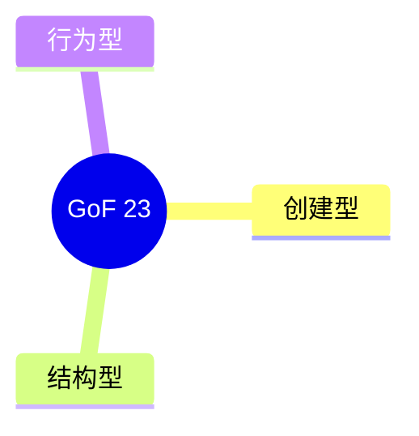

# 设计模式 C++ 完整 23 种实现

> **文件编码**：UTF-8。C++17/20。
> **定位**：GoF 23 模式分类、每种 C++ 实现+适用场景+现代 C++ 替代；比 21 章更全面。
> **交叉阅读**：[21 设计模式 Infra](21-设计模式与Infra工程实践.md)、[03 OOP](03-面向对象与类设计.md)、[07 RAII](07-异常处理与RAII.md)。

---

## 0. 读前导读（§0）

### 0.1 用一句话弄懂本章

系统掌握 **创建/结构/行为** 23 模式，并知道何时用 **std::variant/lambda** 替代。

### 0.2 你需要提前知道什么

| 状态 | 动作 |
|------|------|
| 21 章已读 Singleton/Pool | 本章补全 23 种 |
| 03 章多态 | 行为模式基础 |

### 0.3 本章知识地图（☐→☑）

- ☐ 分类列举 23 种
- ☐ 各写最小 C++ 示例
- ☐ 说清 Infra 适用边界
- ☐ 闭卷 ≥8/10

### 0.4 建议学习时长

**10～14 天**

### 0.5 学完你能做什么

Code review 识别模式滥用；用 variant 替代部分 Visitor。

---



## 1. 创建型模式（5）

### 1.x Singleton

**实现**：Meyers + deleted copy  **现代替代**：std::optional 全局服务慎用

```cpp
class SingletonDemo {
  // Meyers + deleted copy
};
```

### 1.x Factory Method

**实现**：virtual create()  **现代替代**：Registry + lambda

```cpp
class Factory MethodDemo {
  // virtual create()
};
```

### 1.x Abstract Factory

**实现**：产品族  **现代替代**：variant 产品矩阵

```cpp
class Abstract FactoryDemo {
  // 产品族
};
```

### 1.x Builder

**实现**：链式 set  **现代替代**：Named params / DSL

```cpp
class BuilderDemo {
  // 链式 set
};
```

### 1.x Prototype

**实现**：clone()  **现代替代**：copy/move

```cpp
class PrototypeDemo {
  // clone()
};
```

## 2. 结构型模式（7）

### 2.x Adapter

**场景**：包装旧接口  **C++ 注**：继承+组合

```cpp
struct Adapter { /* ... */ };
```

### 2.x Bridge

**场景**：抽象与实现分离  **C++ 注**：pimpl

```cpp
struct Bridge { /* ... */ };
```

### 2.x Composite

**场景**：树形统一接口  **C++ 注**：文件系统

```cpp
struct Composite { /* ... */ };
```

### 2.x Decorator

**场景**：层层包装  **C++ 注**：iostream 栈

```cpp
struct Decorator { /* ... */ };
```

### 2.x Facade

**场景**：子系统一门面  **C++ 注**：API gateway

```cpp
struct Facade { /* ... */ };
```

### 2.x Flyweight

**场景**：共享内在状态  **C++ 注**：字符串 intern

```cpp
struct Flyweight { /* ... */ };
```

### 2.x Proxy

**场景**：控制访问  **C++ 注**：智能指针 deleter

```cpp
struct Proxy { /* ... */ };
```

## 3. 行为型模式（11）

### 3.x Chain

**场景**：责任链  **替代**：filter pipeline

```cpp
// Chain pattern
```

### 3.x Command

**场景**：封装请求  **替代**：undo 栈

```cpp
// Command pattern
```

### 3.x Iterator

**场景**：遍历  **替代**：C++ 迭代器

```cpp
// Iterator pattern
```

### 3.x Mediator

**场景**：中心协调  **替代**：event bus

```cpp
// Mediator pattern
```

### 3.x Memento

**场景**：快照  **替代**：序列化 state

```cpp
// Memento pattern
```

### 3.x Observer

**场景**：订阅发布  **替代**：signals/slots

```cpp
// Observer pattern
```

### 3.x State

**场景**：状态机  **替代**：enum class + visit

```cpp
// State pattern
```

### 3.x Strategy

**场景**：可替换算法  **替代**：std::function

```cpp
// Strategy pattern
```

### 3.x Template Method

**场景**：骨架固定  **替代**：CRTP

```cpp
// Template Method pattern
```

### 3.x Visitor

**场景**：双分派  **替代**：std::visit

```cpp
// Visitor pattern
```

### 3.x Interpreter

**场景**：语法树  **替代**：很少手写

```cpp
// Interpreter pattern
```


## 5. Singleton 完整 Meyers 实现
```cpp
class Config {
public:
    static Config& instance() { static Config c; return c; }
    Config(const Config&) = delete;
    Config& operator=(const Config&) = delete;
private:
    Config() = default;
    int batch_{32};
public:
    int batch() const { return batch_; }
    void set_batch(int n) { batch_ = n; }
};
```

## 6. Strategy 与 std::function
```cpp
using SortFn = std::function<void(std::vector<int>&)>;
void process(std::vector<int>& v, SortFn s) { s(v); }
```

## 7. Observer 现代实现（signals 思路）
```cpp
#include <vector>
#include <functional>
class Event {
    std::vector<std::function<void()>> subs_;
public:
    void subscribe(std::function<void()> f) { subs_.push_back(std::move(f)); }
    void emit() { for (auto& f : subs_) f(); }
};
```

## 8. Factory Method 注册表
```cpp
#include <unordered_map>
#include <memory>
struct Backend { virtual ~Backend()=default; virtual void run()=0; };
using Creator = std::function<std::unique_ptr<Backend>()>;
class BackendFactory {
    std::unordered_map<std::string, Creator> m_;
public:
    void reg(const std::string& name, Creator c) { m_[name]=std::move(c); }
    std::unique_ptr<Backend> create(const std::string& name) { return m_.at(name)(); }
};
```

## 9～28. 其余模式速查与 C++ 映射

| 模式 | 最小职责 | 现代替代 |
|------|----------|----------|
| Abstract Factory | 产品族 | variant + visit |
| Builder | 分步构造 | designated init / DSL |
| Prototype | clone | copy/move |
| Adapter | 接口转换 | 函数包装 |
| Bridge | 实现注入 | pimpl |
| Composite | 树统一 | 递归 variant |
| Decorator | 动态叠加 | 组合+继承 iostream |
| Facade | 简化 API | namespace 函数集 |
| Flyweight | 共享状态 | string intern |
| Proxy | 访问控制 | unique_ptr 定制 deleter |
| Chain | 传递请求 | filter 管道 |
| Command | 命令对象 | lambda + 历史栈 |
| Iterator | 遍历 | C++ 迭代器 |
| Mediator | 集中协调 | event bus |
| Memento | 快照 | JSON/序列化 |
| State | 状态机 | enum + visit |
| Template Method | 骨架 | CRTP |
| Visitor | 双分派 | std::visit |
| Interpreter | 解释 AST | 很少 |

### 10. CRTP Template Method 示例
```cpp
template<typename Derived>
struct Base {
    void run() { static_cast<Derived*>(this)->step1(); step2(); }
    void step2() { /* 固定 */ }
};
struct Impl : Base<Impl> { void step1() { /* 定制 */ } };
```

### 11. pimpl Bridge
```cpp
class Widget {
    struct Impl; std::unique_ptr<Impl> p_;
public:
    Widget(); ~Widget(); void draw();
};
```

### 12. 反模式清单
- God Singleton 全局 mutable
- 过度 Visitor 层次
- 策略类爆炸 → 用 function

### 13. 与 21 章 Infra 映射深化
Object Pool→KV block；Factory→推理后端；Observer→metrics；Facade→统一 infer API。

### 14～28. 模式组合练习
每节一题：用 Strategy+Factory 建 mock/tensorrt 切换；Decorator 给 infer 加 log；Command 实现 undo batch 参数。

## 4. 与 21 章对比

| 维度 | 21 章 | 77 章 |
|---|---|---|
| 范围 | Infra 常用 subset | GoF 全部 23 |
| 深度 | Object Pool 工程 | 每模式最小实现 |
| 现代 C++ | 部分 | variant/function/CRTP |

## 5. 模式组合案例 1

Factory + Strategy 建推理后端；Observer 打 metrics。

```cpp
void infra_case_5();
```

## 6. 模式组合案例 2

Factory + Strategy 建推理后端；Observer 打 metrics。

```cpp
void infra_case_6();
```

## 7. 模式组合案例 3

Factory + Strategy 建推理后端；Observer 打 metrics。

```cpp
void infra_case_7();
```

## 8. 模式组合案例 4

Factory + Strategy 建推理后端；Observer 打 metrics。

```cpp
void infra_case_8();
```

## 9. 模式组合案例 5

Factory + Strategy 建推理后端；Observer 打 metrics。

```cpp
void infra_case_9();
```

## 10. 模式组合案例 6

Factory + Strategy 建推理后端；Observer 打 metrics。

```cpp
void infra_case_10();
```

## 11. 模式组合案例 7

Factory + Strategy 建推理后端；Observer 打 metrics。

```cpp
void infra_case_11();
```

## 12. 模式组合案例 8

Factory + Strategy 建推理后端；Observer 打 metrics。

```cpp
void infra_case_12();
```

## 13. 模式组合案例 9

Factory + Strategy 建推理后端；Observer 打 metrics。

```cpp
void infra_case_13();
```

## 14. 模式组合案例 10

Factory + Strategy 建推理后端；Observer 打 metrics。

```cpp
void infra_case_14();
```

## 15. 模式组合案例 11

Factory + Strategy 建推理后端；Observer 打 metrics。

```cpp
void infra_case_15();
```

## 16. 模式组合案例 12

Factory + Strategy 建推理后端；Observer 打 metrics。

```cpp
void infra_case_16();
```

## 17. 模式组合案例 13

Factory + Strategy 建推理后端；Observer 打 metrics。

```cpp
void infra_case_17();
```

## 18. 模式组合案例 14

Factory + Strategy 建推理后端；Observer 打 metrics。

```cpp
void infra_case_18();
```

## 19. 模式组合案例 15

Factory + Strategy 建推理后端；Observer 打 metrics。

```cpp
void infra_case_19();
```

## 20. 模式组合案例 16

Factory + Strategy 建推理后端；Observer 打 metrics。

```cpp
void infra_case_20();
```

## 21. 模式组合案例 17

Factory + Strategy 建推理后端；Observer 打 metrics。

```cpp
void infra_case_21();
```

## 22. 模式组合案例 18

Factory + Strategy 建推理后端；Observer 打 metrics。

```cpp
void infra_case_22();
```

## 23. 模式组合案例 19

Factory + Strategy 建推理后端；Observer 打 metrics。

```cpp
void infra_case_23();
```

## 24. 模式组合案例 20

Factory + Strategy 建推理后端；Observer 打 metrics。

```cpp
void infra_case_24();
```

## 25. 模式组合案例 21

Factory + Strategy 建推理后端；Observer 打 metrics。

```cpp
void infra_case_25();
```

## 26. 模式组合案例 22

Factory + Strategy 建推理后端；Observer 打 metrics。

```cpp
void infra_case_26();
```

## 27. 模式组合案例 23

Factory + Strategy 建推理后端；Observer 打 metrics。

```cpp
void infra_case_27();
```

## 28. 模式组合案例 24

Factory + Strategy 建推理后端；Observer 打 metrics。

```cpp
void infra_case_28();
```

## 29. 模式组合案例 25

Factory + Strategy 建推理后端；Observer 打 metrics。

```cpp
void infra_case_29();
```

## 常见问题 FAQ

1. **Singleton 反模式？** 全局状态难测；优先依赖注入。
2. **Visitor vs variant？** 类型封闭用 variant+visit。
3. **21 vs 77？** 21 Infra 克制；77 系统学习。
4. **Template Method vs CRTP？** 运行时继承 vs 编译期静态多态。
5. **Decorator vs 继承？** 组合优于继承扩展行为。
6. **Proxy vs Decorator？** Proxy 控制访问；Decorator 加功能。
7. **Strategy vs 模板参数？** 运行时换算法 vs 编译期。
8. **需要全背吗？** 面试常问 8～10 个；其余知道分类。
9. **线程安全 Singleton？** Meyers C++11 起静态局部安全。
10. **现代替代总结？** function, variant, optional, lambda。

---

## 闭卷自测

1. GoF 三类？
2. 创建型几个？
3. Meyers Singleton？
4. Bridge vs Adapter？
5. Observer 用途？
6. Strategy 替代？
7. Visitor 双分派？
8. Decorator 例子？
9. 21 章重点？
10. Flyweight 场景？

### 自测参考答案

1. 创建结构行为
2. 5
3. static local
4. 桥接分离抽象实现/适配接口
5. 事件订阅
6. std::function
7. visit+accept
8. iostream 包装
9. Pool Factory
10. 共享不可变状态


## 77 补充专题 1

深入理解本章与相邻章节的工程权衡（专题 1）。

| 要点 | 说明 |
|------|------|
| 面试 | 口述定义+复杂度+适用场景 |
| 代码 | 对照 examples/ 编译验证 |

```cpp
// supplement 77-1
namespace sup { void drill_1() {} }
```

## 77 补充专题 2

深入理解本章与相邻章节的工程权衡（专题 2）。

| 要点 | 说明 |
|------|------|
| 面试 | 口述定义+复杂度+适用场景 |
| 代码 | 对照 examples/ 编译验证 |

```cpp
// supplement 77-2
namespace sup { void drill_2() {} }
```

## 77 补充专题 3

深入理解本章与相邻章节的工程权衡（专题 3）。

| 要点 | 说明 |
|------|------|
| 面试 | 口述定义+复杂度+适用场景 |
| 代码 | 对照 examples/ 编译验证 |

```cpp
// supplement 77-3
namespace sup { void drill_3() {} }
```

## 77 补充专题 4

深入理解本章与相邻章节的工程权衡（专题 4）。

| 要点 | 说明 |
|------|------|
| 面试 | 口述定义+复杂度+适用场景 |
| 代码 | 对照 examples/ 编译验证 |

```cpp
// supplement 77-4
namespace sup { void drill_4() {} }
```

## 77 补充专题 5

深入理解本章与相邻章节的工程权衡（专题 5）。

| 要点 | 说明 |
|------|------|
| 面试 | 口述定义+复杂度+适用场景 |
| 代码 | 对照 examples/ 编译验证 |

```cpp
// supplement 77-5
namespace sup { void drill_5() {} }
```

## 77 补充专题 6

深入理解本章与相邻章节的工程权衡（专题 6）。

| 要点 | 说明 |
|------|------|
| 面试 | 口述定义+复杂度+适用场景 |
| 代码 | 对照 examples/ 编译验证 |

```cpp
// supplement 77-6
namespace sup { void drill_6() {} }
```

## 77 补充专题 7

深入理解本章与相邻章节的工程权衡（专题 7）。

| 要点 | 说明 |
|------|------|
| 面试 | 口述定义+复杂度+适用场景 |
| 代码 | 对照 examples/ 编译验证 |

```cpp
// supplement 77-7
namespace sup { void drill_7() {} }
```

## 77 补充专题 8

深入理解本章与相邻章节的工程权衡（专题 8）。

| 要点 | 说明 |
|------|------|
| 面试 | 口述定义+复杂度+适用场景 |
| 代码 | 对照 examples/ 编译验证 |

```cpp
// supplement 77-8
namespace sup { void drill_8() {} }
```

## 77 补充专题 9

深入理解本章与相邻章节的工程权衡（专题 9）。

| 要点 | 说明 |
|------|------|
| 面试 | 口述定义+复杂度+适用场景 |
| 代码 | 对照 examples/ 编译验证 |

```cpp
// supplement 77-9
namespace sup { void drill_9() {} }
```

## 77 补充专题 10

深入理解本章与相邻章节的工程权衡（专题 10）。

| 要点 | 说明 |
|------|------|
| 面试 | 口述定义+复杂度+适用场景 |
| 代码 | 对照 examples/ 编译验证 |

```cpp
// supplement 77-10
namespace sup { void drill_10() {} }
```

## 77 补充专题 11

深入理解本章与相邻章节的工程权衡（专题 11）。

| 要点 | 说明 |
|------|------|
| 面试 | 口述定义+复杂度+适用场景 |
| 代码 | 对照 examples/ 编译验证 |

```cpp
// supplement 77-11
namespace sup { void drill_11() {} }
```

## 77 补充专题 12

深入理解本章与相邻章节的工程权衡（专题 12）。

| 要点 | 说明 |
|------|------|
| 面试 | 口述定义+复杂度+适用场景 |
| 代码 | 对照 examples/ 编译验证 |

```cpp
// supplement 77-12
namespace sup { void drill_12() {} }
```

## 77 补充专题 13

深入理解本章与相邻章节的工程权衡（专题 13）。

| 要点 | 说明 |
|------|------|
| 面试 | 口述定义+复杂度+适用场景 |
| 代码 | 对照 examples/ 编译验证 |

```cpp
// supplement 77-13
namespace sup { void drill_13() {} }
```

## 77 补充专题 14

深入理解本章与相邻章节的工程权衡（专题 14）。

| 要点 | 说明 |
|------|------|
| 面试 | 口述定义+复杂度+适用场景 |
| 代码 | 对照 examples/ 编译验证 |

```cpp
// supplement 77-14
namespace sup { void drill_14() {} }
```

## 77 补充专题 15

深入理解本章与相邻章节的工程权衡（专题 15）。

| 要点 | 说明 |
|------|------|
| 面试 | 口述定义+复杂度+适用场景 |
| 代码 | 对照 examples/ 编译验证 |

```cpp
// supplement 77-15
namespace sup { void drill_15() {} }
```

## 77 补充专题 16

深入理解本章与相邻章节的工程权衡（专题 16）。

| 要点 | 说明 |
|------|------|
| 面试 | 口述定义+复杂度+适用场景 |
| 代码 | 对照 examples/ 编译验证 |

```cpp
// supplement 77-16
namespace sup { void drill_16() {} }
```

## 77 补充专题 17

深入理解本章与相邻章节的工程权衡（专题 17）。

| 要点 | 说明 |
|------|------|
| 面试 | 口述定义+复杂度+适用场景 |
| 代码 | 对照 examples/ 编译验证 |

```cpp
// supplement 77-17
namespace sup { void drill_17() {} }
```

## 77 补充专题 18

深入理解本章与相邻章节的工程权衡（专题 18）。

| 要点 | 说明 |
|------|------|
| 面试 | 口述定义+复杂度+适用场景 |
| 代码 | 对照 examples/ 编译验证 |

```cpp
// supplement 77-18
namespace sup { void drill_18() {} }
```

## 77 补充专题 19

深入理解本章与相邻章节的工程权衡（专题 19）。

| 要点 | 说明 |
|------|------|
| 面试 | 口述定义+复杂度+适用场景 |
| 代码 | 对照 examples/ 编译验证 |

```cpp
// supplement 77-19
namespace sup { void drill_19() {} }
```

## 77 补充专题 20

深入理解本章与相邻章节的工程权衡（专题 20）。

| 要点 | 说明 |
|------|------|
| 面试 | 口述定义+复杂度+适用场景 |
| 代码 | 对照 examples/ 编译验证 |

```cpp
// supplement 77-20
namespace sup { void drill_20() {} }
```

## 77 补充专题 21

深入理解本章与相邻章节的工程权衡（专题 21）。

| 要点 | 说明 |
|------|------|
| 面试 | 口述定义+复杂度+适用场景 |
| 代码 | 对照 examples/ 编译验证 |

```cpp
// supplement 77-21
namespace sup { void drill_21() {} }
```

## 下一章预告

下一章：[78 并发算法与并发数据结构](78-并发算法与并发数据结构.md)

---

*下一章：78 并发算法与并发数据结构*
