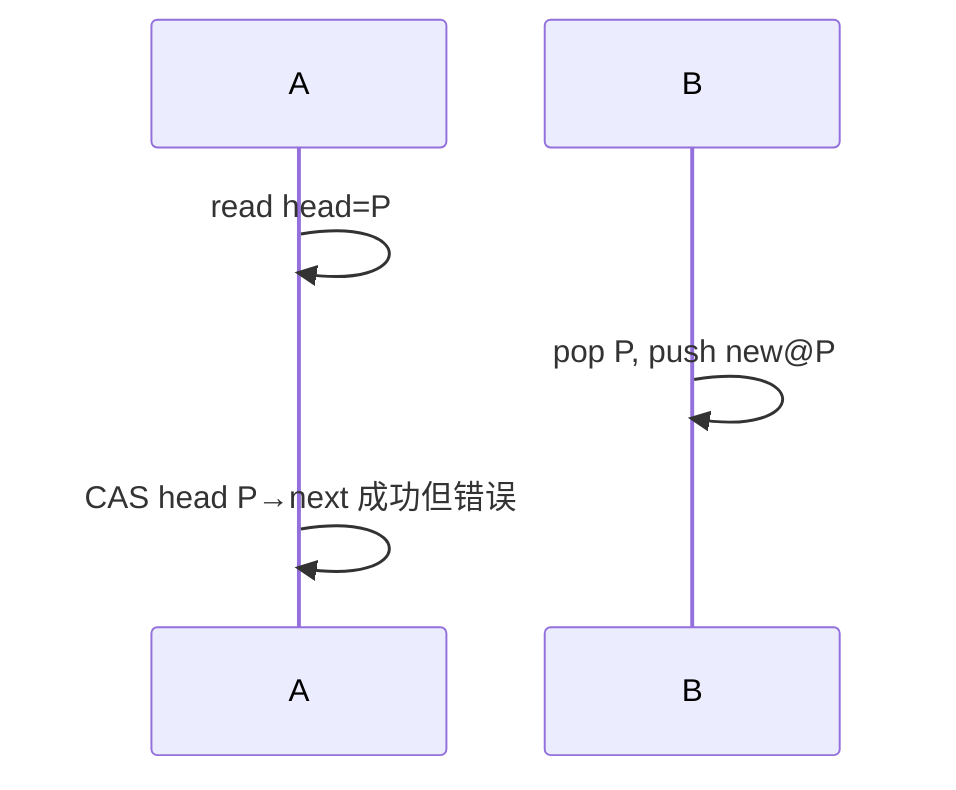

# 并发算法与并发数据结构

> **文件编码**：UTF-8。C++17/20。
> **定位**：并发队列(锁/无锁)、并发哈希(分桶锁)、并发链表、SkipList、ABA；与 25 章互补。
> **交叉阅读**：[25 无锁编程](25-无锁编程与内存序.md)、[08 多线程](08-多线程与并发编程.md)、[21 SPSC](21-设计模式与Infra工程实践.md)。

---

## 0. 读前导读（§0）

### 0.1 用一句话弄懂本章

在 mutex 之上，用 **分桶锁 / CAS / epoch** 构建可扩展并发容器。

### 0.2 你需要提前知道什么

| 状态 | 动作 |
|------|------|
| 08 章 mutex | 本章并发容器 |
| 25 章 memory_order | 本章无锁队列 |

### 0.3 本章知识地图（☐→☑）

- ☐ 实现 mutex 并发队列
- ☐ 分桶锁 hash
- ☐ 说清 ABA
- ☐ 对比 25 章 SPSC

### 0.4 建议学习时长

**7～10 天**

### 0.5 学完你能做什么

为线程池选型队列；读 Folly ConcurrentHashMap 思路。

---

## 1. 并发队列

### 1.1 锁版本

```cpp
#include <queue>
#include <mutex>
template<typename T>
class LockedQueue {
    std::queue<T> q_;
    mutable std::mutex mu_;
    std::condition_variable cv_;
public:
    void push(T v) {
        { std::lock_guard lk(mu_); q_.push(std::move(v)); }
        cv_.notify_one();
    }
    bool pop(T& out) {
        std::unique_lock lk(mu_);
        cv_.wait(lk, [&]{ return !q_.empty(); });
        out = std::move(q_.front()); q_.pop(); return true;
    }
};
```

### 1.2 无锁 SPSC 环形缓冲（与 25 章衔接）

```cpp
template<typename T, size_t N>
class SPSCQueue {
    std::array<T, N> buf_;
    alignas(64) std::atomic<size_t> head_{0}, tail_{0};
public:
    bool push(const T& v) {
        auto t = tail_.load(std::memory_order_relaxed);
        auto next = (t + 1) % N;
        if (next == head_.load(std::memory_order_acquire)) return false;
        buf_[t] = v;
        tail_.store(next, std::memory_order_release);
        return true;
    }
};
```

## 2. 并发哈希表（分桶锁）

```cpp
template<typename K, typename V>
class ConcurrentHashMap {
    static constexpr size_t B = 64;
    struct Bucket { std::mutex mu; std::unordered_map<K,V> map; };
    std::array<Bucket, B> buckets_;
    size_t idx(const K& k) { return std::hash<K>{}(k) % B; }
public:
    void insert(K k, V v) {
        auto& b = buckets_[idx(k)];
        std::lock_guard lk(b.mu);
        b.map[std::move(k)] = std::move(v);
    }
};
```

## 3. ABA 问题

线程 A 读 ptr=P，被挂起；B 删 P 并分配新节点仍地址 P；A CAS 成功但结构已变。

**缓解**： tagged pointer（版本号）、 hazard pointer、epoch GC。



## 4. 并发专题 1

| 结构 | 同步 | 扩展 |
|---|---|---|
| 队列 | mutex/CAS | MPMC |
| 哈希 | 分桶锁 | lock-free 进阶 |
| 链表 | CAS 栈 | ABA |

```cpp
void concurrent_drill_4();
```

## 5. 并发专题 2

| 结构 | 同步 | 扩展 |
|---|---|---|
| 队列 | mutex/CAS | MPMC |
| 哈希 | 分桶锁 | lock-free 进阶 |
| 链表 | CAS 栈 | ABA |

```cpp
void concurrent_drill_5();
```

## 6. 并发专题 3

| 结构 | 同步 | 扩展 |
|---|---|---|
| 队列 | mutex/CAS | MPMC |
| 哈希 | 分桶锁 | lock-free 进阶 |
| 链表 | CAS 栈 | ABA |

```cpp
void concurrent_drill_6();
```

## 7. 并发专题 4

| 结构 | 同步 | 扩展 |
|---|---|---|
| 队列 | mutex/CAS | MPMC |
| 哈希 | 分桶锁 | lock-free 进阶 |
| 链表 | CAS 栈 | ABA |

```cpp
void concurrent_drill_7();
```

## 8. 并发专题 5

| 结构 | 同步 | 扩展 |
|---|---|---|
| 队列 | mutex/CAS | MPMC |
| 哈希 | 分桶锁 | lock-free 进阶 |
| 链表 | CAS 栈 | ABA |

```cpp
void concurrent_drill_8();
```

## 9. 并发专题 6

| 结构 | 同步 | 扩展 |
|---|---|---|
| 队列 | mutex/CAS | MPMC |
| 哈希 | 分桶锁 | lock-free 进阶 |
| 链表 | CAS 栈 | ABA |

```cpp
void concurrent_drill_9();
```

## 10. 并发专题 7

| 结构 | 同步 | 扩展 |
|---|---|---|
| 队列 | mutex/CAS | MPMC |
| 哈希 | 分桶锁 | lock-free 进阶 |
| 链表 | CAS 栈 | ABA |

```cpp
void concurrent_drill_10();
```

## 11. 并发专题 8

| 结构 | 同步 | 扩展 |
|---|---|---|
| 队列 | mutex/CAS | MPMC |
| 哈希 | 分桶锁 | lock-free 进阶 |
| 链表 | CAS 栈 | ABA |

```cpp
void concurrent_drill_11();
```

## 12. 并发专题 9

| 结构 | 同步 | 扩展 |
|---|---|---|
| 队列 | mutex/CAS | MPMC |
| 哈希 | 分桶锁 | lock-free 进阶 |
| 链表 | CAS 栈 | ABA |

```cpp
void concurrent_drill_12();
```

## 13. 并发专题 10

| 结构 | 同步 | 扩展 |
|---|---|---|
| 队列 | mutex/CAS | MPMC |
| 哈希 | 分桶锁 | lock-free 进阶 |
| 链表 | CAS 栈 | ABA |

```cpp
void concurrent_drill_13();
```

## 14. 并发专题 11

| 结构 | 同步 | 扩展 |
|---|---|---|
| 队列 | mutex/CAS | MPMC |
| 哈希 | 分桶锁 | lock-free 进阶 |
| 链表 | CAS 栈 | ABA |

```cpp
void concurrent_drill_14();
```

## 15. 并发专题 12

| 结构 | 同步 | 扩展 |
|---|---|---|
| 队列 | mutex/CAS | MPMC |
| 哈希 | 分桶锁 | lock-free 进阶 |
| 链表 | CAS 栈 | ABA |

```cpp
void concurrent_drill_15();
```

## 16. 并发专题 13

| 结构 | 同步 | 扩展 |
|---|---|---|
| 队列 | mutex/CAS | MPMC |
| 哈希 | 分桶锁 | lock-free 进阶 |
| 链表 | CAS 栈 | ABA |

```cpp
void concurrent_drill_16();
```

## 17. 并发专题 14

| 结构 | 同步 | 扩展 |
|---|---|---|
| 队列 | mutex/CAS | MPMC |
| 哈希 | 分桶锁 | lock-free 进阶 |
| 链表 | CAS 栈 | ABA |

```cpp
void concurrent_drill_17();
```

## 18. 并发专题 15

| 结构 | 同步 | 扩展 |
|---|---|---|
| 队列 | mutex/CAS | MPMC |
| 哈希 | 分桶锁 | lock-free 进阶 |
| 链表 | CAS 栈 | ABA |

```cpp
void concurrent_drill_18();
```

## 19. 并发专题 16

| 结构 | 同步 | 扩展 |
|---|---|---|
| 队列 | mutex/CAS | MPMC |
| 哈希 | 分桶锁 | lock-free 进阶 |
| 链表 | CAS 栈 | ABA |

```cpp
void concurrent_drill_19();
```

## 20. 并发专题 17

| 结构 | 同步 | 扩展 |
|---|---|---|
| 队列 | mutex/CAS | MPMC |
| 哈希 | 分桶锁 | lock-free 进阶 |
| 链表 | CAS 栈 | ABA |

```cpp
void concurrent_drill_20();
```

## 21. 并发专题 18

| 结构 | 同步 | 扩展 |
|---|---|---|
| 队列 | mutex/CAS | MPMC |
| 哈希 | 分桶锁 | lock-free 进阶 |
| 链表 | CAS 栈 | ABA |

```cpp
void concurrent_drill_21();
```

## 22. 并发专题 19

| 结构 | 同步 | 扩展 |
|---|---|---|
| 队列 | mutex/CAS | MPMC |
| 哈希 | 分桶锁 | lock-free 进阶 |
| 链表 | CAS 栈 | ABA |

```cpp
void concurrent_drill_22();
```

## 23. 并发专题 20

| 结构 | 同步 | 扩展 |
|---|---|---|
| 队列 | mutex/CAS | MPMC |
| 哈希 | 分桶锁 | lock-free 进阶 |
| 链表 | CAS 栈 | ABA |

```cpp
void concurrent_drill_23();
```

## 24. 并发专题 21

| 结构 | 同步 | 扩展 |
|---|---|---|
| 队列 | mutex/CAS | MPMC |
| 哈希 | 分桶锁 | lock-free 进阶 |
| 链表 | CAS 栈 | ABA |

```cpp
void concurrent_drill_24();
```

## 25. 并发专题 22

| 结构 | 同步 | 扩展 |
|---|---|---|
| 队列 | mutex/CAS | MPMC |
| 哈希 | 分桶锁 | lock-free 进阶 |
| 链表 | CAS 栈 | ABA |

```cpp
void concurrent_drill_25();
```

## 26. 并发专题 23

| 结构 | 同步 | 扩展 |
|---|---|---|
| 队列 | mutex/CAS | MPMC |
| 哈希 | 分桶锁 | lock-free 进阶 |
| 链表 | CAS 栈 | ABA |

```cpp
void concurrent_drill_26();
```

## 27. 并发专题 24

| 结构 | 同步 | 扩展 |
|---|---|---|
| 队列 | mutex/CAS | MPMC |
| 哈希 | 分桶锁 | lock-free 进阶 |
| 链表 | CAS 栈 | ABA |

```cpp
void concurrent_drill_27();
```


## 5. MPSC 队列概览（mutex 版）
```cpp
class MPSCQueue {
    std::queue<std::function<void()>> q_;
    std::mutex mu_;
public:
    void push(std::function<void()> t) {
        std::lock_guard lk(mu_); q_.push(std::move(t));
    }
    bool tryPop(std::function<void()>& out) {
        std::lock_guard lk(mu_);
        if (q_.empty()) return false;
        out = std::move(q_.front()); q_.pop(); return true;
    }
};
```

## 6. 并发链表（CAS 栈）
```cpp
struct Node { int v; Node* next; };
class ConcurrentStack {
    std::atomic<Node*> head_{nullptr};
public:
    void push(int x) {
        Node* n = new Node{x, nullptr};
        n->next = head_.load(std::memory_order_relaxed);
        while (!head_.compare_exchange_weak(n->next, n,
               std::memory_order_release, std::memory_order_relaxed)) {}
    }
};
```

## 7. 并发 SkipList（粗粒度锁简化）
每层或全局 mutex 保护 insert/erase；生产环境用 Java ConcurrentSkipList 或专用库。

## 8. Epoch 回收缓解 ABA
读者进入 epoch；删除节点推迟到无读者；类似 RCU/quiescent period。

## 9～25. 专题
- 对比 [25 章](25-无锁编程与内存序.md) SPSC 与 MPSC
- 分桶锁 vs striped lock
- `shared_mutex` 读写 map
- ThreadSanitizer 用法
- Folly CPUThreadPoolExecutor 队列
- 无锁 vs lock 性能 benchmark 方法
- hazard pointer 三步骤
- seq_cst 默认值何时降级
- 并发 size() 近似计数
- 与 08 章 condition_variable 配合

## 常见问题 FAQ

1. **无锁一定更快？** 否；低争用 mutex 可能更简单。
2. **ABA 在无锁栈？** 典型场景；加 tag。
3. **与 25 章？** 25 内存序理论；78 容器实践。
4. **分桶锁粒度？** 桶越多争用越小，内存越大。
5. **MPMC 队列？** 难度高；常用 bounded lock-free 或 Disruptor。
6. **并发 SkipList？** 细粒度锁或 CAS 层指针。
7. **LinkedList 并发？** 通常锁或 RCU。
8. **false sharing？** head/tail alignas(64)。
9. **21 章 SPSC？** 同 78 无锁队列一节。
10. **TSan？** 必开 ThreadSanitizer 验证。

---

## 闭卷自测

1. SPSC 适用？
2. 分桶锁优点？
3. ABA 定义？
4. 缓解 ABA？
5. acquire/release 在队列？
6. 与 25 互补？
7. MPMC 难点？
8. false sharing？
9. 并发 map 读？
10. hazard pointer 思路？

### 自测参考答案

1. 单生产者单消费者
2. 降低锁争用
3. 地址复用 CAS 误判
4. tag/epoch/hazard
5. publish/consume 同步
6. 25 理论 78 结构
7. 多生产者协调
8. 缓存行乒乓
9. shared_lock 或 RCU
10. 声明使用中节点


## 78 补充专题 1

深入理解本章与相邻章节的工程权衡（专题 1）。

| 要点 | 说明 |
|------|------|
| 面试 | 口述定义+复杂度+适用场景 |
| 代码 | 对照 examples/ 编译验证 |

```cpp
// supplement 78-1
namespace sup { void drill_1() {} }
```

## 78 补充专题 2

深入理解本章与相邻章节的工程权衡（专题 2）。

| 要点 | 说明 |
|------|------|
| 面试 | 口述定义+复杂度+适用场景 |
| 代码 | 对照 examples/ 编译验证 |

```cpp
// supplement 78-2
namespace sup { void drill_2() {} }
```

## 78 补充专题 3

深入理解本章与相邻章节的工程权衡（专题 3）。

| 要点 | 说明 |
|------|------|
| 面试 | 口述定义+复杂度+适用场景 |
| 代码 | 对照 examples/ 编译验证 |

```cpp
// supplement 78-3
namespace sup { void drill_3() {} }
```

## 78 补充专题 4

深入理解本章与相邻章节的工程权衡（专题 4）。

| 要点 | 说明 |
|------|------|
| 面试 | 口述定义+复杂度+适用场景 |
| 代码 | 对照 examples/ 编译验证 |

```cpp
// supplement 78-4
namespace sup { void drill_4() {} }
```

## 78 补充专题 5

深入理解本章与相邻章节的工程权衡（专题 5）。

| 要点 | 说明 |
|------|------|
| 面试 | 口述定义+复杂度+适用场景 |
| 代码 | 对照 examples/ 编译验证 |

```cpp
// supplement 78-5
namespace sup { void drill_5() {} }
```

## 78 补充专题 6

深入理解本章与相邻章节的工程权衡（专题 6）。

| 要点 | 说明 |
|------|------|
| 面试 | 口述定义+复杂度+适用场景 |
| 代码 | 对照 examples/ 编译验证 |

```cpp
// supplement 78-6
namespace sup { void drill_6() {} }
```

## 78 补充专题 7

深入理解本章与相邻章节的工程权衡（专题 7）。

| 要点 | 说明 |
|------|------|
| 面试 | 口述定义+复杂度+适用场景 |
| 代码 | 对照 examples/ 编译验证 |

```cpp
// supplement 78-7
namespace sup { void drill_7() {} }
```

## 78 补充专题 8

深入理解本章与相邻章节的工程权衡（专题 8）。

| 要点 | 说明 |
|------|------|
| 面试 | 口述定义+复杂度+适用场景 |
| 代码 | 对照 examples/ 编译验证 |

```cpp
// supplement 78-8
namespace sup { void drill_8() {} }
```

## 78 补充专题 9

深入理解本章与相邻章节的工程权衡（专题 9）。

| 要点 | 说明 |
|------|------|
| 面试 | 口述定义+复杂度+适用场景 |
| 代码 | 对照 examples/ 编译验证 |

```cpp
// supplement 78-9
namespace sup { void drill_9() {} }
```

## 78 补充专题 10

深入理解本章与相邻章节的工程权衡（专题 10）。

| 要点 | 说明 |
|------|------|
| 面试 | 口述定义+复杂度+适用场景 |
| 代码 | 对照 examples/ 编译验证 |

```cpp
// supplement 78-10
namespace sup { void drill_10() {} }
```

## 78 补充专题 11

深入理解本章与相邻章节的工程权衡（专题 11）。

| 要点 | 说明 |
|------|------|
| 面试 | 口述定义+复杂度+适用场景 |
| 代码 | 对照 examples/ 编译验证 |

```cpp
// supplement 78-11
namespace sup { void drill_11() {} }
```

## 78 补充专题 12

深入理解本章与相邻章节的工程权衡（专题 12）。

| 要点 | 说明 |
|------|------|
| 面试 | 口述定义+复杂度+适用场景 |
| 代码 | 对照 examples/ 编译验证 |

```cpp
// supplement 78-12
namespace sup { void drill_12() {} }
```

## 78 补充专题 13

深入理解本章与相邻章节的工程权衡（专题 13）。

| 要点 | 说明 |
|------|------|
| 面试 | 口述定义+复杂度+适用场景 |
| 代码 | 对照 examples/ 编译验证 |

```cpp
// supplement 78-13
namespace sup { void drill_13() {} }
```

## 78 补充专题 14

深入理解本章与相邻章节的工程权衡（专题 14）。

| 要点 | 说明 |
|------|------|
| 面试 | 口述定义+复杂度+适用场景 |
| 代码 | 对照 examples/ 编译验证 |

```cpp
// supplement 78-14
namespace sup { void drill_14() {} }
```

## 78 补充专题 15

深入理解本章与相邻章节的工程权衡（专题 15）。

| 要点 | 说明 |
|------|------|
| 面试 | 口述定义+复杂度+适用场景 |
| 代码 | 对照 examples/ 编译验证 |

```cpp
// supplement 78-15
namespace sup { void drill_15() {} }
```

## 78 补充专题 16

深入理解本章与相邻章节的工程权衡（专题 16）。

| 要点 | 说明 |
|------|------|
| 面试 | 口述定义+复杂度+适用场景 |
| 代码 | 对照 examples/ 编译验证 |

```cpp
// supplement 78-16
namespace sup { void drill_16() {} }
```

## 78 补充专题 17

深入理解本章与相邻章节的工程权衡（专题 17）。

| 要点 | 说明 |
|------|------|
| 面试 | 口述定义+复杂度+适用场景 |
| 代码 | 对照 examples/ 编译验证 |

```cpp
// supplement 78-17
namespace sup { void drill_17() {} }
```

## 78 补充专题 18

深入理解本章与相邻章节的工程权衡（专题 18）。

| 要点 | 说明 |
|------|------|
| 面试 | 口述定义+复杂度+适用场景 |
| 代码 | 对照 examples/ 编译验证 |

```cpp
// supplement 78-18
namespace sup { void drill_18() {} }
```

## 78 补充专题 19

深入理解本章与相邻章节的工程权衡（专题 19）。

| 要点 | 说明 |
|------|------|
| 面试 | 口述定义+复杂度+适用场景 |
| 代码 | 对照 examples/ 编译验证 |

```cpp
// supplement 78-19
namespace sup { void drill_19() {} }
```

## 78 补充专题 20

深入理解本章与相邻章节的工程权衡（专题 20）。

| 要点 | 说明 |
|------|------|
| 面试 | 口述定义+复杂度+适用场景 |
| 代码 | 对照 examples/ 编译验证 |

```cpp
// supplement 78-20
namespace sup { void drill_20() {} }
```

## 78 补充专题 21

深入理解本章与相邻章节的工程权衡（专题 21）。

| 要点 | 说明 |
|------|------|
| 面试 | 口述定义+复杂度+适用场景 |
| 代码 | 对照 examples/ 编译验证 |

```cpp
// supplement 78-21
namespace sup { void drill_21() {} }
```

## 78 补充专题 22

深入理解本章与相邻章节的工程权衡（专题 22）。

| 要点 | 说明 |
|------|------|
| 面试 | 口述定义+复杂度+适用场景 |
| 代码 | 对照 examples/ 编译验证 |

```cpp
// supplement 78-22
namespace sup { void drill_22() {} }
```

## 78 补充专题 23

深入理解本章与相邻章节的工程权衡（专题 23）。

| 要点 | 说明 |
|------|------|
| 面试 | 口述定义+复杂度+适用场景 |
| 代码 | 对照 examples/ 编译验证 |

```cpp
// supplement 78-23
namespace sup { void drill_23() {} }
```

## 78 补充专题 24

深入理解本章与相邻章节的工程权衡（专题 24）。

| 要点 | 说明 |
|------|------|
| 面试 | 口述定义+复杂度+适用场景 |
| 代码 | 对照 examples/ 编译验证 |

```cpp
// supplement 78-24
namespace sup { void drill_24() {} }
```

## 78 补充专题 25

深入理解本章与相邻章节的工程权衡（专题 25）。

| 要点 | 说明 |
|------|------|
| 面试 | 口述定义+复杂度+适用场景 |
| 代码 | 对照 examples/ 编译验证 |

```cpp
// supplement 78-25
namespace sup { void drill_25() {} }
```

## 78 补充专题 26

深入理解本章与相邻章节的工程权衡（专题 26）。

| 要点 | 说明 |
|------|------|
| 面试 | 口述定义+复杂度+适用场景 |
| 代码 | 对照 examples/ 编译验证 |

```cpp
// supplement 78-26
namespace sup { void drill_26() {} }
```

## 78 补充专题 27

深入理解本章与相邻章节的工程权衡（专题 27）。

| 要点 | 说明 |
|------|------|
| 面试 | 口述定义+复杂度+适用场景 |
| 代码 | 对照 examples/ 编译验证 |

```cpp
// supplement 78-27
namespace sup { void drill_27() {} }
```

## 78 补充专题 28

深入理解本章与相邻章节的工程权衡（专题 28）。

| 要点 | 说明 |
|------|------|
| 面试 | 口述定义+复杂度+适用场景 |
| 代码 | 对照 examples/ 编译验证 |

```cpp
// supplement 78-28
namespace sup { void drill_28() {} }
```

## 78 补充专题 29

深入理解本章与相邻章节的工程权衡（专题 29）。

| 要点 | 说明 |
|------|------|
| 面试 | 口述定义+复杂度+适用场景 |
| 代码 | 对照 examples/ 编译验证 |

```cpp
// supplement 78-29
namespace sup { void drill_29() {} }
```

## 下一章预告

下一章：[79 C++ 元编程与编译期计算深入](79-C++元编程与编译期计算深入.md)

---

*下一章：79 C++ 元编程与编译期计算深入*
