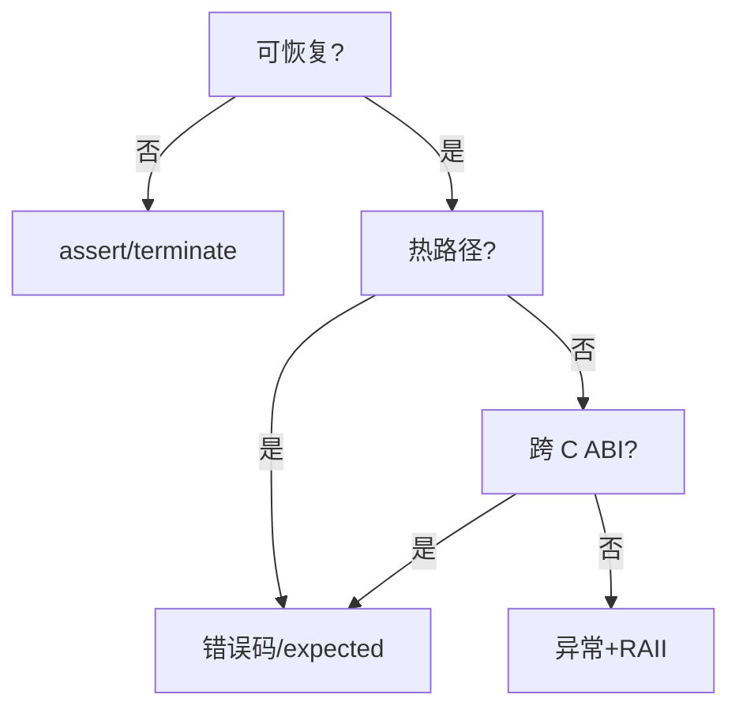

# C++ 错误处理哲学与方案抉择

> **文件编码**：UTF-8。
> **定位**：在 [07 异常](07-异常处理与RAII.md) 之上做工程选型——异常 vs 错误码 vs expected。
> **交叉阅读**：[07](07-异常处理与RAII.md)、[30 C++20](30-C++20与23新特性深潜.md)、[81 UB](81-未定义行为UB与语言陷阱大全.md)、[86 标准库](86-C++20-26标准库组件全景.md)。
> **上一章**：[82 ABI](82-ABI与二进制兼容性.md) | **下一章**：[84 内存模型](84-C++内存模型与原子操作深入.md)

---

## §0 读前导读

### §0.1 一句话
错误处理是 API 契约设计，不是语法偏好。

### §0.2 与 07 章互补
| 07 | 本章 |
|----|------|
| try/catch/RAII | 何时用哪种 |
| 异常安全三级 | expected 模式 |

---

## 本章在 81→86 链中的位置

**上一章**：[82 ABI](82-ABI与二进制兼容性.md)
**下一章**：[84 内存模型](84-C++内存模型与原子操作深入.md)


## 1. 四种错误处理范式

| 范式 | 代表 | 优点 | 缺点 |
|------|------|------|------|
| 异常 | throw/catch | 自动展开、构造失败 | throw 慢、部分禁用 |
| 错误码 | errno, `error_code` | 可预测、嵌入式 | 易忽略 |
| expected | C++23 | 显式、无异常开销 | 语法稍繁 |
| 契约 | assert, contract | 程序员错误 | 非恢复 |

与 [07 章](07-异常处理与RAII.md)：**07 教机制，本章教选型**。


## 2. 异常：零开销与代价

**零开销**指无 throw 时无 try 块额外成本（table-based）。

throw 路径：分配异常对象、栈展开、查 catch 表——昂贵。

```cpp
void load(const std::string& path) {
    std::ifstream f(path);
    if (!f) throw std::runtime_error("open: " + path);
}
```

适用：构造失败、无法局部恢复、深层调用栈。见 [07 §24 unwinding](07-异常处理与RAII.md)。


## 3. 错误码与 system_error

```cpp
#include <system_error>
#include <fstream>

std::error_code open_file(const char* p, std::fstream& out) {
    out.open(p);
    if (!out) return std::make_error_code(std::errc::no_such_file_or_directory);
    return {};
}
```

C API、驱动、实时循环常用。须**强制检查**——`[[nodiscard]]`。


## 4. std::expected（C++23）

```cpp
#include <expected>
#include <string>

enum class ParseErr { Empty, Invalid };

std::expected<int, ParseErr> parse(std::string_view s) {
    if (s.empty()) return std::unexpected(ParseErr::Empty);
    // ...
    return 42;
}

auto run() {
    auto v = parse("42");
    if (!v) { /* handle */ return; }
    use(*v);
}
```

见 [30 章](30-C++20与23新特性深潜.md)、[86 章](86-C++20-26标准库组件全景.md)、[83 与 07 互补](07-异常处理与RAII.md)。


## 5. 决策树




## 6. noexcept 契约

```cpp
class Buffer {
public:
    Buffer(Buffer&&) noexcept;
    Buffer& operator=(Buffer&&) noexcept;
};
```

`vector::reserve` 在移动 `noexcept` 时移动元素，否则拷贝保强保证（[07 §26](07-异常处理与RAII.md)）。

违反 `noexcept` → `std::terminate`。


## 7. 反模式

1. 用异常做流控
2. 吞错误码
3. 析构抛异常
4. 跨 DLL 抛 C++ 异常
5. `catch(...)` 掩盖 [81 UB](81-未定义行为UB与语言陷阱大全.md)


## 8. 场景：文件 IO 分层

分析 **文件 IO 分层** 选型：

- 实时/纳秒：错误码
- 初始化/框架：异常或 expected
- 跨模块 C：错误码 + 不透明句柄

```cpp
auto handle_8() -> std::expected<void, ErrorCode>;
```


## 9. 场景：RPC 超时

分析 **RPC 超时** 选型：

- 实时/纳秒：错误码
- 初始化/框架：异常或 expected
- 跨模块 C：错误码 + 不透明句柄

```cpp
auto handle_9() -> std::expected<void, ErrorCode>;
```


## 10. 场景：配置解析

分析 **配置解析** 选型：

- 实时/纳秒：错误码
- 初始化/框架：异常或 expected
- 跨模块 C：错误码 + 不透明句柄

```cpp
auto handle_10() -> std::expected<void, ErrorCode>;
```


## 11. 场景：GPU 启动

分析 **GPU 启动** 选型：

- 实时/纳秒：错误码
- 初始化/框架：异常或 expected
- 跨模块 C：错误码 + 不透明句柄

```cpp
auto handle_11() -> std::expected<void, ErrorCode>;
```


## 12. 场景：游戏主循环

分析 **游戏主循环** 选型：

- 实时/纳秒：错误码
- 初始化/框架：异常或 expected
- 跨模块 C：错误码 + 不透明句柄

```cpp
auto handle_12() -> std::expected<void, ErrorCode>;
```


## 13. 场景：嵌入式

分析 **嵌入式** 选型：

- 实时/纳秒：错误码
- 初始化/框架：异常或 expected
- 跨模块 C：错误码 + 不透明句柄

```cpp
auto handle_13() -> std::expected<void, ErrorCode>;
```


## 14. 场景：插件 C API

分析 **插件 C API** 选型：

- 实时/纳秒：错误码
- 初始化/框架：异常或 expected
- 跨模块 C：错误码 + 不透明句柄

```cpp
auto handle_14() -> std::expected<void, ErrorCode>;
```


## 15. 场景：协程 co_await

分析 **协程 co_await** 选型：

- 实时/纳秒：错误码
- 初始化/框架：异常或 expected
- 跨模块 C：错误码 + 不透明句柄

```cpp
auto handle_15() -> std::expected<void, ErrorCode>;
```


## 16. 场景：解析器

分析 **解析器** 选型：

- 实时/纳秒：错误码
- 初始化/框架：异常或 expected
- 跨模块 C：错误码 + 不透明句柄

```cpp
auto handle_16() -> std::expected<void, ErrorCode>;
```


## 17. 场景：权限拒绝

分析 **权限拒绝** 选型：

- 实时/纳秒：错误码
- 初始化/框架：异常或 expected
- 跨模块 C：错误码 + 不透明句柄

```cpp
auto handle_17() -> std::expected<void, ErrorCode>;
```


## 18. 场景：限流

分析 **限流** 选型：

- 实时/纳秒：错误码
- 初始化/框架：异常或 expected
- 跨模块 C：错误码 + 不透明句柄

```cpp
auto handle_18() -> std::expected<void, ErrorCode>;
```


## 19. 场景：事务回滚

分析 **事务回滚** 选型：

- 实时/纳秒：错误码
- 初始化/框架：异常或 expected
- 跨模块 C：错误码 + 不透明句柄

```cpp
auto handle_19() -> std::expected<void, ErrorCode>;
```


## 20. 场景：OOM

分析 **OOM** 选型：

- 实时/纳秒：错误码
- 初始化/框架：异常或 expected
- 跨模块 C：错误码 + 不透明句柄

```cpp
auto handle_20() -> std::expected<void, ErrorCode>;
```


## 21. 场景：批处理

分析 **批处理** 选型：

- 实时/纳秒：错误码
- 初始化/框架：异常或 expected
- 跨模块 C：错误码 + 不透明句柄

```cpp
auto handle_21() -> std::expected<void, ErrorCode>;
```


## 22. 场景：expected monadic

分析 **expected monadic** 选型：

- 实时/纳秒：错误码
- 初始化/框架：异常或 expected
- 跨模块 C：错误码 + 不透明句柄

```cpp
auto handle_22() -> std::expected<void, ErrorCode>;
```


## 23. 场景：HFT 路径

分析 **HFT 路径** 选型：

- 实时/纳秒：错误码
- 初始化/框架：异常或 expected
- 跨模块 C：错误码 + 不透明句柄

```cpp
auto handle_23() -> std::expected<void, ErrorCode>;
```


## 24. 场景：JSON schema

分析 **JSON schema** 选型：

- 实时/纳秒：错误码
- 初始化/框架：异常或 expected
- 跨模块 C：错误码 + 不透明句柄

```cpp
auto handle_24() -> std::expected<void, ErrorCode>;
```


## 25. 场景：日志格式化

分析 **日志格式化** 选型：

- 实时/纳秒：错误码
- 初始化/框架：异常或 expected
- 跨模块 C：错误码 + 不透明句柄

```cpp
auto handle_25() -> std::expected<void, ErrorCode>;
```


## 26. 场景：构造失败

分析 **构造失败** 选型：

- 实时/纳秒：错误码
- 初始化/框架：异常或 expected
- 跨模块 C：错误码 + 不透明句柄

```cpp
auto handle_26() -> std::expected<void, ErrorCode>;
```


## 27. 场景：线程池

分析 **线程池** 选型：

- 实时/纳秒：错误码
- 初始化/框架：异常或 expected
- 跨模块 C：错误码 + 不透明句柄

```cpp
auto handle_27() -> std::expected<void, ErrorCode>;
```


## 28. 场景：网络重试

分析 **网络重试** 选型：

- 实时/纳秒：错误码
- 初始化/框架：异常或 expected
- 跨模块 C：错误码 + 不透明句柄

```cpp
auto handle_28() -> std::expected<void, ErrorCode>;
```


## 29. 场景：数据库连接

分析 **数据库连接** 选型：

- 实时/纳秒：错误码
- 初始化/框架：异常或 expected
- 跨模块 C：错误码 + 不透明句柄

```cpp
auto handle_29() -> std::expected<void, ErrorCode>;
```


## 30. 场景：权限模型

分析 **权限模型** 选型：

- 实时/纳秒：错误码
- 初始化/框架：异常或 expected
- 跨模块 C：错误码 + 不透明句柄

```cpp
auto handle_30() -> std::expected<void, ErrorCode>;
```


## 31. 场景：缓存穿透

分析 **缓存穿透** 选型：

- 实时/纳秒：错误码
- 初始化/框架：异常或 expected
- 跨模块 C：错误码 + 不透明句柄

```cpp
auto handle_31() -> std::expected<void, ErrorCode>;
```


## 32. 场景：文件 IO 分层

分析 **文件 IO 分层** 选型：

- 实时/纳秒：错误码
- 初始化/框架：异常或 expected
- 跨模块 C：错误码 + 不透明句柄

```cpp
auto handle_32() -> std::expected<void, ErrorCode>;
```


## 33. 场景：RPC 超时

分析 **RPC 超时** 选型：

- 实时/纳秒：错误码
- 初始化/框架：异常或 expected
- 跨模块 C：错误码 + 不透明句柄

```cpp
auto handle_33() -> std::expected<void, ErrorCode>;
```


## 34. 场景：配置解析

分析 **配置解析** 选型：

- 实时/纳秒：错误码
- 初始化/框架：异常或 expected
- 跨模块 C：错误码 + 不透明句柄

```cpp
auto handle_34() -> std::expected<void, ErrorCode>;
```


## 35. 场景：GPU 启动

分析 **GPU 启动** 选型：

- 实时/纳秒：错误码
- 初始化/框架：异常或 expected
- 跨模块 C：错误码 + 不透明句柄

```cpp
auto handle_35() -> std::expected<void, ErrorCode>;
```


## 36. 场景：游戏主循环

分析 **游戏主循环** 选型：

- 实时/纳秒：错误码
- 初始化/框架：异常或 expected
- 跨模块 C：错误码 + 不透明句柄

```cpp
auto handle_36() -> std::expected<void, ErrorCode>;
```


## 37. 场景：嵌入式

分析 **嵌入式** 选型：

- 实时/纳秒：错误码
- 初始化/框架：异常或 expected
- 跨模块 C：错误码 + 不透明句柄

```cpp
auto handle_37() -> std::expected<void, ErrorCode>;
```


## 38. 场景：插件 C API

分析 **插件 C API** 选型：

- 实时/纳秒：错误码
- 初始化/框架：异常或 expected
- 跨模块 C：错误码 + 不透明句柄

```cpp
auto handle_38() -> std::expected<void, ErrorCode>;
```


## 39. 场景：协程 co_await

分析 **协程 co_await** 选型：

- 实时/纳秒：错误码
- 初始化/框架：异常或 expected
- 跨模块 C：错误码 + 不透明句柄

```cpp
auto handle_39() -> std::expected<void, ErrorCode>;
```


## 40. 场景：解析器

分析 **解析器** 选型：

- 实时/纳秒：错误码
- 初始化/框架：异常或 expected
- 跨模块 C：错误码 + 不透明句柄

```cpp
auto handle_40() -> std::expected<void, ErrorCode>;
```


## 41. 场景：权限拒绝

分析 **权限拒绝** 选型：

- 实时/纳秒：错误码
- 初始化/框架：异常或 expected
- 跨模块 C：错误码 + 不透明句柄

```cpp
auto handle_41() -> std::expected<void, ErrorCode>;
```


## 42. 场景：限流

分析 **限流** 选型：

- 实时/纳秒：错误码
- 初始化/框架：异常或 expected
- 跨模块 C：错误码 + 不透明句柄

```cpp
auto handle_42() -> std::expected<void, ErrorCode>;
```


## 43. 场景：事务回滚

分析 **事务回滚** 选型：

- 实时/纳秒：错误码
- 初始化/框架：异常或 expected
- 跨模块 C：错误码 + 不透明句柄

```cpp
auto handle_43() -> std::expected<void, ErrorCode>;
```


## 44. 场景：OOM

分析 **OOM** 选型：

- 实时/纳秒：错误码
- 初始化/框架：异常或 expected
- 跨模块 C：错误码 + 不透明句柄

```cpp
auto handle_44() -> std::expected<void, ErrorCode>;
```


## 45. 场景：批处理

分析 **批处理** 选型：

- 实时/纳秒：错误码
- 初始化/框架：异常或 expected
- 跨模块 C：错误码 + 不透明句柄

```cpp
auto handle_45() -> std::expected<void, ErrorCode>;
```


## 46. 场景：expected monadic

分析 **expected monadic** 选型：

- 实时/纳秒：错误码
- 初始化/框架：异常或 expected
- 跨模块 C：错误码 + 不透明句柄

```cpp
auto handle_46() -> std::expected<void, ErrorCode>;
```


## 47. 场景：HFT 路径

分析 **HFT 路径** 选型：

- 实时/纳秒：错误码
- 初始化/框架：异常或 expected
- 跨模块 C：错误码 + 不透明句柄

```cpp
auto handle_47() -> std::expected<void, ErrorCode>;
```


## 48. 场景：JSON schema

分析 **JSON schema** 选型：

- 实时/纳秒：错误码
- 初始化/框架：异常或 expected
- 跨模块 C：错误码 + 不透明句柄

```cpp
auto handle_48() -> std::expected<void, ErrorCode>;
```


## 49. 场景：日志格式化

分析 **日志格式化** 选型：

- 实时/纳秒：错误码
- 初始化/框架：异常或 expected
- 跨模块 C：错误码 + 不透明句柄

```cpp
auto handle_49() -> std::expected<void, ErrorCode>;
```


## 50. 场景：构造失败

分析 **构造失败** 选型：

- 实时/纳秒：错误码
- 初始化/框架：异常或 expected
- 跨模块 C：错误码 + 不透明句柄

```cpp
auto handle_50() -> std::expected<void, ErrorCode>;
```


## 51. 场景：线程池

分析 **线程池** 选型：

- 实时/纳秒：错误码
- 初始化/框架：异常或 expected
- 跨模块 C：错误码 + 不透明句柄

```cpp
auto handle_51() -> std::expected<void, ErrorCode>;
```


## 52. 场景：网络重试

分析 **网络重试** 选型：

- 实时/纳秒：错误码
- 初始化/框架：异常或 expected
- 跨模块 C：错误码 + 不透明句柄

```cpp
auto handle_52() -> std::expected<void, ErrorCode>;
```


## 53. 场景：数据库连接

分析 **数据库连接** 选型：

- 实时/纳秒：错误码
- 初始化/框架：异常或 expected
- 跨模块 C：错误码 + 不透明句柄

```cpp
auto handle_53() -> std::expected<void, ErrorCode>;
```


## 54. 场景：权限模型

分析 **权限模型** 选型：

- 实时/纳秒：错误码
- 初始化/框架：异常或 expected
- 跨模块 C：错误码 + 不透明句柄

```cpp
auto handle_54() -> std::expected<void, ErrorCode>;
```


## 55. 场景：缓存穿透

分析 **缓存穿透** 选型：

- 实时/纳秒：错误码
- 初始化/框架：异常或 expected
- 跨模块 C：错误码 + 不透明句柄

```cpp
auto handle_55() -> std::expected<void, ErrorCode>;
```


## 56. 场景：文件 IO 分层

分析 **文件 IO 分层** 选型：

- 实时/纳秒：错误码
- 初始化/框架：异常或 expected
- 跨模块 C：错误码 + 不透明句柄

```cpp
auto handle_56() -> std::expected<void, ErrorCode>;
```


## 57. 场景：RPC 超时

分析 **RPC 超时** 选型：

- 实时/纳秒：错误码
- 初始化/框架：异常或 expected
- 跨模块 C：错误码 + 不透明句柄

```cpp
auto handle_57() -> std::expected<void, ErrorCode>;
```


## 58. 场景：配置解析

分析 **配置解析** 选型：

- 实时/纳秒：错误码
- 初始化/框架：异常或 expected
- 跨模块 C：错误码 + 不透明句柄

```cpp
auto handle_58() -> std::expected<void, ErrorCode>;
```


## 59. 场景：GPU 启动

分析 **GPU 启动** 选型：

- 实时/纳秒：错误码
- 初始化/框架：异常或 expected
- 跨模块 C：错误码 + 不透明句柄

```cpp
auto handle_59() -> std::expected<void, ErrorCode>;
```


## 60. 场景：游戏主循环

分析 **游戏主循环** 选型：

- 实时/纳秒：错误码
- 初始化/框架：异常或 expected
- 跨模块 C：错误码 + 不透明句柄

```cpp
auto handle_60() -> std::expected<void, ErrorCode>;
```


## 61. 场景：嵌入式

分析 **嵌入式** 选型：

- 实时/纳秒：错误码
- 初始化/框架：异常或 expected
- 跨模块 C：错误码 + 不透明句柄

```cpp
auto handle_61() -> std::expected<void, ErrorCode>;
```


## 62. 场景：插件 C API

分析 **插件 C API** 选型：

- 实时/纳秒：错误码
- 初始化/框架：异常或 expected
- 跨模块 C：错误码 + 不透明句柄

```cpp
auto handle_62() -> std::expected<void, ErrorCode>;
```


## 63. 场景：协程 co_await

分析 **协程 co_await** 选型：

- 实时/纳秒：错误码
- 初始化/框架：异常或 expected
- 跨模块 C：错误码 + 不透明句柄

```cpp
auto handle_63() -> std::expected<void, ErrorCode>;
```


## 64. 场景：解析器

分析 **解析器** 选型：

- 实时/纳秒：错误码
- 初始化/框架：异常或 expected
- 跨模块 C：错误码 + 不透明句柄

```cpp
auto handle_64() -> std::expected<void, ErrorCode>;
```


## 65. 场景：权限拒绝

分析 **权限拒绝** 选型：

- 实时/纳秒：错误码
- 初始化/框架：异常或 expected
- 跨模块 C：错误码 + 不透明句柄

```cpp
auto handle_65() -> std::expected<void, ErrorCode>;
```


## 66. 场景：限流

分析 **限流** 选型：

- 实时/纳秒：错误码
- 初始化/框架：异常或 expected
- 跨模块 C：错误码 + 不透明句柄

```cpp
auto handle_66() -> std::expected<void, ErrorCode>;
```


## 67. 场景：事务回滚

分析 **事务回滚** 选型：

- 实时/纳秒：错误码
- 初始化/框架：异常或 expected
- 跨模块 C：错误码 + 不透明句柄

```cpp
auto handle_67() -> std::expected<void, ErrorCode>;
```


## 68. 场景：OOM

分析 **OOM** 选型：

- 实时/纳秒：错误码
- 初始化/框架：异常或 expected
- 跨模块 C：错误码 + 不透明句柄

```cpp
auto handle_68() -> std::expected<void, ErrorCode>;
```


## 69. 场景：批处理

分析 **批处理** 选型：

- 实时/纳秒：错误码
- 初始化/框架：异常或 expected
- 跨模块 C：错误码 + 不透明句柄

```cpp
auto handle_69() -> std::expected<void, ErrorCode>;
```


## 70. 场景：expected monadic

分析 **expected monadic** 选型：

- 实时/纳秒：错误码
- 初始化/框架：异常或 expected
- 跨模块 C：错误码 + 不透明句柄

```cpp
auto handle_70() -> std::expected<void, ErrorCode>;
```


## 71. 场景：HFT 路径

分析 **HFT 路径** 选型：

- 实时/纳秒：错误码
- 初始化/框架：异常或 expected
- 跨模块 C：错误码 + 不透明句柄

```cpp
auto handle_71() -> std::expected<void, ErrorCode>;
```


## 练习

1. 对照正文完成最小可编译 demo。
2. 与交叉链接章节各读一节并做笔记。
3. 闭卷自测前先合上书复述知识地图。
4. 将本章术语填入 [15 补充总表](15-补充知识点总表.md) 个人区。
5. 与同学互相出题白板 10 分钟。

## FAQ

**Q：Google 禁用异常还要学吗？**
要；STL 与许多库仍抛。

**Q：expected 替代异常？**
构造失败、展开场景异常更合适。

## 闭卷自测

1. 零开销异常指什么？
2. 热路径推荐？
3. expected vs optional？
4. 析构为何 noexcept？
5. 与 07 关系？
6. 跨 C ABI？
7. error_code 优势？
8. assert 适用？
9. 违反 noexcept？
10. Rust Result 对照？

<details>
<summary>自测参考答案</summary>

1. 无 throw 无 try 成本。
2. 错误码/expected。
3. optional 无错误原因。
4. unwinding 再抛 terminate。
5. 07 机制本章选型。
6. 错误码。
7. 与 system_error 集成。
8. 不可恢复编程错误。
9. terminate。
10. 类似 expected。

</details>


---

## 下一章预告

[84 内存模型](84-C++内存模型与原子操作深入.md)

*下一章：84 内存模型*
