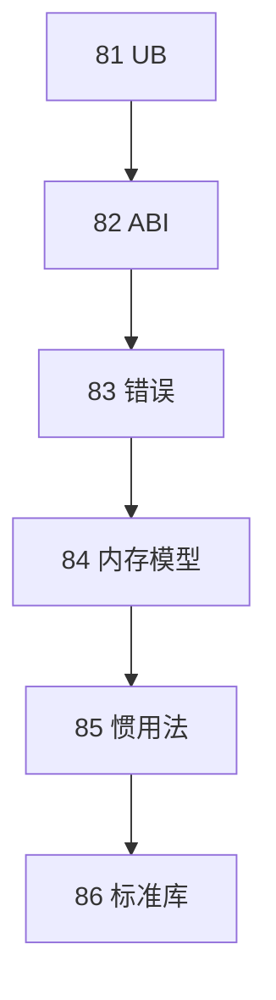

# C++20-26 标准库组件全景

> **文件编码**：UTF-8。
> **定位**：ranges、format、coroutines、modules、jthread、expected、mdspan——在 [05](05-现代C++新特性.md)、[30](30-C++20与23新特性深潜.md) 之上全景索引。
> **交叉阅读**：[05](05-现代C++新特性.md)、[30](30-C++20与23新特性深潜.md)、[31 协程](31-协程C++20-coroutine.md)、[83 expected](83-C++错误处理哲学与方案抉择.md)。
> **上一章**：[85 惯用法](85-现代C++惯用法idiom集.md) | **链终点**：81→86

---

## §0 读前导读

### §0.1 一句话
优先掌握 format / expected / span / ranges / jthread。

### §0.2 与 30/31/32 分工
- 30：深潜
- 31：协程
- 32：format 工程
- 本章：全景收束

---

## 本章在 81→86 链中的位置

**上一章**：[85 惯用法](85-现代C++惯用法idiom集.md)
**下一章**：链终点；建议续 [12 调试](12-性能分析与调试.md)、[68 面试索引](68-大厂面试总索引与冲刺复习计划.md)


## 1. std::ranges

```cpp
#include <ranges>
#include <vector>
auto evens = std::views::iota(0, 100)
    | std::views::filter([](int x){ return x % 2 == 0; });
```
见 [04 STL](04-STL标准库容器与算法.md)、[30 C++20](30-C++20与23新特性深潜.md)。


## 2. std::format

```cpp
#include <format>
auto s = std::format("{} {}", 42, "ok");
```
见 [32 fmt/spdlog](32-fmt-spdlog与可观测性工程.md)。


## 3. Coroutines

`co_await`/`co_yield`；深潜 [31 章](31-协程C++20-coroutine.md)。

```cpp
task<int> work();
auto v = co_await work();
```


## 4. Modules

`import std;` 减编译；工具链渐进。对比 [48 #include](48-编译预处理与链接原理.md)。


## 5. std::jthread

```cpp
std::jthread t([](std::stop_token st) {
    while (!st.stop_requested()) { /* ... */ }
});
```


## 6. latch / barrier

```cpp
std::latch latch{N};
latch.arrive_and_wait();
std::barrier bar{N};
```


## 7. source_location

```cpp
void log(std::string_view msg,
    std::source_location loc = std::source_location::current());
```


## 8. std::expected

见 [83 章](83-C++错误处理哲学与方案抉择.md)。

```cpp
std::expected<int, Err> parse(std::string_view);
```


## 9. mdspan

```cpp
std::mdspan<double, std::extents<size_t, 3, 4>> m(ptr);
```


## 10. span

```cpp
void f(std::span<const int> s);
```
衔接 [05 章](05-现代C++新特性.md)。


## 11. generator

```cpp
std::generator<int> iota(int n) {
    for (int i = 0; i < n; ++i) co_yield i;
}
```


## 12. 选型矩阵

| 组件 | 替代 | 标准 |
|------|------|------|
| ranges | 手写 for | C++20 |
| format | printf | C++20 |
| expected | 异常/码 | C++23 |
| jthread | thread+join | C++20 |
| mdspan | 裸指针多维 | C++23 |


## 13. 补遗：print

**print** 在 C++20～26 时间线中的位置。

```cpp
// stdlib: print
#include <...>
```

交叉 [05](05-现代C++新特性.md)、[30](30-C++20与23新特性深潜.md)、[04 STL](04-STL标准库容器与算法.md)。


## 14. 补遗：flat_map

**flat_map** 在 C++20～26 时间线中的位置。

```cpp
// stdlib: flat_map
#include <...>
```

交叉 [05](05-现代C++新特性.md)、[30](30-C++20与23新特性深潜.md)、[04 STL](04-STL标准库容器与算法.md)。


## 15. 补遗：contains

**contains** 在 C++20～26 时间线中的位置。

```cpp
// stdlib: contains
#include <...>
```

交叉 [05](05-现代C++新特性.md)、[30](30-C++20与23新特性深潜.md)、[04 STL](04-STL标准库容器与算法.md)。


## 16. 补遗：starts_with

**starts_with** 在 C++20～26 时间线中的位置。

```cpp
// stdlib: starts_with
#include <...>
```

交叉 [05](05-现代C++新特性.md)、[30](30-C++20与23新特性深潜.md)、[04 STL](04-STL标准库容器与算法.md)。


## 17. 补遗：to_array

**to_array** 在 C++20～26 时间线中的位置。

```cpp
// stdlib: to_array
#include <...>
```

交叉 [05](05-现代C++新特性.md)、[30](30-C++20与23新特性深潜.md)、[04 STL](04-STL标准库容器与算法.md)。


## 18. 补遗：bind_front

**bind_front** 在 C++20～26 时间线中的位置。

```cpp
// stdlib: bind_front
#include <...>
```

交叉 [05](05-现代C++新特性.md)、[30](30-C++20与23新特性深潜.md)、[04 STL](04-STL标准库容器与算法.md)。


## 19. 补遗：chrono tz

**chrono tz** 在 C++20～26 时间线中的位置。

```cpp
// stdlib: chrono tz
#include <...>
```

交叉 [05](05-现代C++新特性.md)、[30](30-C++20与23新特性深潜.md)、[04 STL](04-STL标准库容器与算法.md)。


## 20. 补遗：atomic shared_ptr

**atomic shared_ptr** 在 C++20～26 时间线中的位置。

```cpp
// stdlib: atomic shared_ptr
#include <...>
```

交叉 [05](05-现代C++新特性.md)、[30](30-C++20与23新特性深潜.md)、[04 STL](04-STL标准库容器与算法.md)。


## 21. 补遗：semaphore

**semaphore** 在 C++20～26 时间线中的位置。

```cpp
// stdlib: semaphore
#include <...>
```

交叉 [05](05-现代C++新特性.md)、[30](30-C++20与23新特性深潜.md)、[04 STL](04-STL标准库容器与算法.md)。


## 22. 补遗：erase_if

**erase_if** 在 C++20～26 时间线中的位置。

```cpp
// stdlib: erase_if
#include <...>
```

交叉 [05](05-现代C++新特性.md)、[30](30-C++20与23新特性深潜.md)、[04 STL](04-STL标准库容器与算法.md)。


## 23. 补遗：shift_left

**shift_left** 在 C++20～26 时间线中的位置。

```cpp
// stdlib: shift_left
#include <...>
```

交叉 [05](05-现代C++新特性.md)、[30](30-C++20与23新特性深潜.md)、[04 STL](04-STL标准库容器与算法.md)。


## 24. 补遗：byteswap

**byteswap** 在 C++20～26 时间线中的位置。

```cpp
// stdlib: byteswap
#include <...>
```

交叉 [05](05-现代C++新特性.md)、[30](30-C++20与23新特性深潜.md)、[04 STL](04-STL标准库容器与算法.md)。


## 25. 补遗：consteval

**consteval** 在 C++20～26 时间线中的位置。

```cpp
// stdlib: consteval
#include <...>
```

交叉 [05](05-现代C++新特性.md)、[30](30-C++20与23新特性深潜.md)、[04 STL](04-STL标准库容器与算法.md)。


## 26. 补遗：constinit

**constinit** 在 C++20～26 时间线中的位置。

```cpp
// stdlib: constinit
#include <...>
```

交叉 [05](05-现代C++新特性.md)、[30](30-C++20与23新特性深潜.md)、[04 STL](04-STL标准库容器与算法.md)。


## 27. 补遗：deducing this

**deducing this** 在 C++20～26 时间线中的位置。

```cpp
// stdlib: deducing this
#include <...>
```

交叉 [05](05-现代C++新特性.md)、[30](30-C++20与23新特性深潜.md)、[04 STL](04-STL标准库容器与算法.md)。


## 28. 补遗：if consteval

**if consteval** 在 C++20～26 时间线中的位置。

```cpp
// stdlib: if consteval
#include <...>
```

交叉 [05](05-现代C++新特性.md)、[30](30-C++20与23新特性深潜.md)、[04 STL](04-STL标准库容器与算法.md)。


## 29. 补遗：out_ptr

**out_ptr** 在 C++20～26 时间线中的位置。

```cpp
// stdlib: out_ptr
#include <...>
```

交叉 [05](05-现代C++新特性.md)、[30](30-C++20与23新特性深潜.md)、[04 STL](04-STL标准库容器与算法.md)。


## 30. 补遗：allocate_shared array

**allocate_shared array** 在 C++20～26 时间线中的位置。

```cpp
// stdlib: allocate_shared array
#include <...>
```

交叉 [05](05-现代C++新特性.md)、[30](30-C++20与23新特性深潜.md)、[04 STL](04-STL标准库容器与算法.md)。


## 31. 补遗：stacktrace

**stacktrace** 在 C++20～26 时间线中的位置。

```cpp
// stdlib: stacktrace
#include <...>
```

交叉 [05](05-现代C++新特性.md)、[30](30-C++20与23新特性深潜.md)、[04 STL](04-STL标准库容器与算法.md)。


## 32. 补遗：hive

**hive** 在 C++20～26 时间线中的位置。

```cpp
// stdlib: hive
#include <...>
```

交叉 [05](05-现代C++新特性.md)、[30](30-C++20与23新特性深潜.md)、[04 STL](04-STL标准库容器与算法.md)。


## 33. 补遗：inplace_vector

**inplace_vector** 在 C++20～26 时间线中的位置。

```cpp
// stdlib: inplace_vector
#include <...>
```

交叉 [05](05-现代C++新特性.md)、[30](30-C++20与23新特性深潜.md)、[04 STL](04-STL标准库容器与算法.md)。


## 34. 补遗：text encoding

**text encoding** 在 C++20～26 时间线中的位置。

```cpp
// stdlib: text encoding
#include <...>
```

交叉 [05](05-现代C++新特性.md)、[30](30-C++20与23新特性深潜.md)、[04 STL](04-STL标准库容器与算法.md)。


## 35. 补遗：rcu 无标准

**rcu 无标准** 在 C++20～26 时间线中的位置。

```cpp
// stdlib: rcu 无标准
#include <...>
```

交叉 [05](05-现代C++新特性.md)、[30](30-C++20与23新特性深潜.md)、[04 STL](04-STL标准库容器与算法.md)。


## 36. 补遗：simd 并行

**simd 并行** 在 C++20～26 时间线中的位置。

```cpp
// stdlib: simd 并行
#include <...>
```

交叉 [05](05-现代C++新特性.md)、[30](30-C++20与23新特性深潜.md)、[04 STL](04-STL标准库容器与算法.md)。


## 37. 补遗：execution par

**execution par** 在 C++20～26 时间线中的位置。

```cpp
// stdlib: execution par
#include <...>
```

交叉 [05](05-现代C++新特性.md)、[30](30-C++20与23新特性深潜.md)、[04 STL](04-STL标准库容器与算法.md)。


## 38. 补遗：contract

**contract** 在 C++20～26 时间线中的位置。

```cpp
// stdlib: contract
#include <...>
```

交叉 [05](05-现代C++新特性.md)、[30](30-C++20与23新特性深潜.md)、[04 STL](04-STL标准库容器与算法.md)。


## 39. 补遗：reflection 未来

**reflection 未来** 在 C++20～26 时间线中的位置。

```cpp
// stdlib: reflection 未来
#include <...>
```

交叉 [05](05-现代C++新特性.md)、[30](30-C++20与23新特性深潜.md)、[04 STL](04-STL标准库容器与算法.md)。


## 40. 补遗：pack indexing

**pack indexing** 在 C++20～26 时间线中的位置。

```cpp
// stdlib: pack indexing
#include <...>
```

交叉 [05](05-现代C++新特性.md)、[30](30-C++20与23新特性深潜.md)、[04 STL](04-STL标准库容器与算法.md)。


## 41. 补遗：submdspan

**submdspan** 在 C++20～26 时间线中的位置。

```cpp
// stdlib: submdspan
#include <...>
```

交叉 [05](05-现代C++新特性.md)、[30](30-C++20与23新特性深潜.md)、[04 STL](04-STL标准库容器与算法.md)。


## 42. 补遗：formatted ranges

**formatted ranges** 在 C++20～26 时间线中的位置。

```cpp
// stdlib: formatted ranges
#include <...>
```

交叉 [05](05-现代C++新特性.md)、[30](30-C++20与23新特性深潜.md)、[04 STL](04-STL标准库容器与算法.md)。


## 43. 补遗：print

**print** 在 C++20～26 时间线中的位置。

```cpp
// stdlib: print
#include <...>
```

交叉 [05](05-现代C++新特性.md)、[30](30-C++20与23新特性深潜.md)、[04 STL](04-STL标准库容器与算法.md)。


## 44. 补遗：flat_map

**flat_map** 在 C++20～26 时间线中的位置。

```cpp
// stdlib: flat_map
#include <...>
```

交叉 [05](05-现代C++新特性.md)、[30](30-C++20与23新特性深潜.md)、[04 STL](04-STL标准库容器与算法.md)。


## 45. 补遗：contains

**contains** 在 C++20～26 时间线中的位置。

```cpp
// stdlib: contains
#include <...>
```

交叉 [05](05-现代C++新特性.md)、[30](30-C++20与23新特性深潜.md)、[04 STL](04-STL标准库容器与算法.md)。


## 46. 补遗：starts_with

**starts_with** 在 C++20～26 时间线中的位置。

```cpp
// stdlib: starts_with
#include <...>
```

交叉 [05](05-现代C++新特性.md)、[30](30-C++20与23新特性深潜.md)、[04 STL](04-STL标准库容器与算法.md)。


## 47. 补遗：to_array

**to_array** 在 C++20～26 时间线中的位置。

```cpp
// stdlib: to_array
#include <...>
```

交叉 [05](05-现代C++新特性.md)、[30](30-C++20与23新特性深潜.md)、[04 STL](04-STL标准库容器与算法.md)。


## 48. 补遗：bind_front

**bind_front** 在 C++20～26 时间线中的位置。

```cpp
// stdlib: bind_front
#include <...>
```

交叉 [05](05-现代C++新特性.md)、[30](30-C++20与23新特性深潜.md)、[04 STL](04-STL标准库容器与算法.md)。


## 49. 补遗：chrono tz

**chrono tz** 在 C++20～26 时间线中的位置。

```cpp
// stdlib: chrono tz
#include <...>
```

交叉 [05](05-现代C++新特性.md)、[30](30-C++20与23新特性深潜.md)、[04 STL](04-STL标准库容器与算法.md)。


## 50. 补遗：atomic shared_ptr

**atomic shared_ptr** 在 C++20～26 时间线中的位置。

```cpp
// stdlib: atomic shared_ptr
#include <...>
```

交叉 [05](05-现代C++新特性.md)、[30](30-C++20与23新特性深潜.md)、[04 STL](04-STL标准库容器与算法.md)。


## 51. 补遗：semaphore

**semaphore** 在 C++20～26 时间线中的位置。

```cpp
// stdlib: semaphore
#include <...>
```

交叉 [05](05-现代C++新特性.md)、[30](30-C++20与23新特性深潜.md)、[04 STL](04-STL标准库容器与算法.md)。


## 52. 补遗：erase_if

**erase_if** 在 C++20～26 时间线中的位置。

```cpp
// stdlib: erase_if
#include <...>
```

交叉 [05](05-现代C++新特性.md)、[30](30-C++20与23新特性深潜.md)、[04 STL](04-STL标准库容器与算法.md)。


## 53. 补遗：shift_left

**shift_left** 在 C++20～26 时间线中的位置。

```cpp
// stdlib: shift_left
#include <...>
```

交叉 [05](05-现代C++新特性.md)、[30](30-C++20与23新特性深潜.md)、[04 STL](04-STL标准库容器与算法.md)。


## 54. 补遗：byteswap

**byteswap** 在 C++20～26 时间线中的位置。

```cpp
// stdlib: byteswap
#include <...>
```

交叉 [05](05-现代C++新特性.md)、[30](30-C++20与23新特性深潜.md)、[04 STL](04-STL标准库容器与算法.md)。


## 55. 补遗：consteval

**consteval** 在 C++20～26 时间线中的位置。

```cpp
// stdlib: consteval
#include <...>
```

交叉 [05](05-现代C++新特性.md)、[30](30-C++20与23新特性深潜.md)、[04 STL](04-STL标准库容器与算法.md)。


## 56. 补遗：constinit

**constinit** 在 C++20～26 时间线中的位置。

```cpp
// stdlib: constinit
#include <...>
```

交叉 [05](05-现代C++新特性.md)、[30](30-C++20与23新特性深潜.md)、[04 STL](04-STL标准库容器与算法.md)。


## 57. 补遗：deducing this

**deducing this** 在 C++20～26 时间线中的位置。

```cpp
// stdlib: deducing this
#include <...>
```

交叉 [05](05-现代C++新特性.md)、[30](30-C++20与23新特性深潜.md)、[04 STL](04-STL标准库容器与算法.md)。


## 58. 补遗：if consteval

**if consteval** 在 C++20～26 时间线中的位置。

```cpp
// stdlib: if consteval
#include <...>
```

交叉 [05](05-现代C++新特性.md)、[30](30-C++20与23新特性深潜.md)、[04 STL](04-STL标准库容器与算法.md)。


## 59. 补遗：out_ptr

**out_ptr** 在 C++20～26 时间线中的位置。

```cpp
// stdlib: out_ptr
#include <...>
```

交叉 [05](05-现代C++新特性.md)、[30](30-C++20与23新特性深潜.md)、[04 STL](04-STL标准库容器与算法.md)。


## 60. 补遗：allocate_shared array

**allocate_shared array** 在 C++20～26 时间线中的位置。

```cpp
// stdlib: allocate_shared array
#include <...>
```

交叉 [05](05-现代C++新特性.md)、[30](30-C++20与23新特性深潜.md)、[04 STL](04-STL标准库容器与算法.md)。


## 61. 补遗：stacktrace

**stacktrace** 在 C++20～26 时间线中的位置。

```cpp
// stdlib: stacktrace
#include <...>
```

交叉 [05](05-现代C++新特性.md)、[30](30-C++20与23新特性深潜.md)、[04 STL](04-STL标准库容器与算法.md)。


## 62. 补遗：hive

**hive** 在 C++20～26 时间线中的位置。

```cpp
// stdlib: hive
#include <...>
```

交叉 [05](05-现代C++新特性.md)、[30](30-C++20与23新特性深潜.md)、[04 STL](04-STL标准库容器与算法.md)。


## 63. 补遗：inplace_vector

**inplace_vector** 在 C++20～26 时间线中的位置。

```cpp
// stdlib: inplace_vector
#include <...>
```

交叉 [05](05-现代C++新特性.md)、[30](30-C++20与23新特性深潜.md)、[04 STL](04-STL标准库容器与算法.md)。


## 64. 补遗：text encoding

**text encoding** 在 C++20～26 时间线中的位置。

```cpp
// stdlib: text encoding
#include <...>
```

交叉 [05](05-现代C++新特性.md)、[30](30-C++20与23新特性深潜.md)、[04 STL](04-STL标准库容器与算法.md)。


## 65. 补遗：rcu 无标准

**rcu 无标准** 在 C++20～26 时间线中的位置。

```cpp
// stdlib: rcu 无标准
#include <...>
```

交叉 [05](05-现代C++新特性.md)、[30](30-C++20与23新特性深潜.md)、[04 STL](04-STL标准库容器与算法.md)。


## 66. 补遗：simd 并行

**simd 并行** 在 C++20～26 时间线中的位置。

```cpp
// stdlib: simd 并行
#include <...>
```

交叉 [05](05-现代C++新特性.md)、[30](30-C++20与23新特性深潜.md)、[04 STL](04-STL标准库容器与算法.md)。


## 67. 补遗：execution par

**execution par** 在 C++20～26 时间线中的位置。

```cpp
// stdlib: execution par
#include <...>
```

交叉 [05](05-现代C++新特性.md)、[30](30-C++20与23新特性深潜.md)、[04 STL](04-STL标准库容器与算法.md)。


## 68. 补遗：contract

**contract** 在 C++20～26 时间线中的位置。

```cpp
// stdlib: contract
#include <...>
```

交叉 [05](05-现代C++新特性.md)、[30](30-C++20与23新特性深潜.md)、[04 STL](04-STL标准库容器与算法.md)。


## 69. 补遗：reflection 未来

**reflection 未来** 在 C++20～26 时间线中的位置。

```cpp
// stdlib: reflection 未来
#include <...>
```

交叉 [05](05-现代C++新特性.md)、[30](30-C++20与23新特性深潜.md)、[04 STL](04-STL标准库容器与算法.md)。


## 70. 补遗：pack indexing

**pack indexing** 在 C++20～26 时间线中的位置。

```cpp
// stdlib: pack indexing
#include <...>
```

交叉 [05](05-现代C++新特性.md)、[30](30-C++20与23新特性深潜.md)、[04 STL](04-STL标准库容器与算法.md)。


## 71. 补遗：submdspan

**submdspan** 在 C++20～26 时间线中的位置。

```cpp
// stdlib: submdspan
#include <...>
```

交叉 [05](05-现代C++新特性.md)、[30](30-C++20与23新特性深潜.md)、[04 STL](04-STL标准库容器与算法.md)。


## 练习

1. 对照正文完成最小可编译 demo。
2. 与交叉链接章节各读一节并做笔记。
3. 闭卷自测前先合上书复述知识地图。
4. 将本章术语填入 [15 补充总表](15-补充知识点总表.md) 个人区。
5. 与同学互相出题白板 10 分钟。

## FAQ

**Q：先学 modules 还是 ranges？**
ranges/format 立竿见影。

**Q：与 [05 章](05-现代C++新特性.md)？**
05 覆盖 C++11～17 基线；本章补 20～26 库组件。

## 闭卷自测

1. ranges 管道符号？
2. format vs printf？
3. jthread 析构？
4. latch vs barrier？
5. expected 头文件？
6. span vs mdspan？
7. generator 关键字？
8. source_location？
9. 与 05/30？
10. 86 在链中角色？

<details>
<summary>自测参考答案</summary>

1. `|` 连接 view。
2. 类型安全。
3. request_stop 并 join。
4. latch 一次；barrier 多阶段。
5. `<expected>` C++23。
6. 一维 vs 多维。
7. co_yield。
8. 默认调用位置。
9. 05/30 深潜本章索引。
10. 标准库全景收束。

</details>


---

## 下一章预告

链终点；建议续 [12 调试](12-性能分析与调试.md)、[68 面试索引](68-大厂面试总索引与冲刺复习计划.md)


---

## 81→86 深水区链回顾



建议下一步：[12 性能分析与调试](12-性能分析与调试.md)、[14 高频面试](14-高频面试专题与场景题.md)、[68 大厂面试总索引](68-大厂面试总索引与冲刺复习计划.md)。

*本章为 81～86 链终点。*
