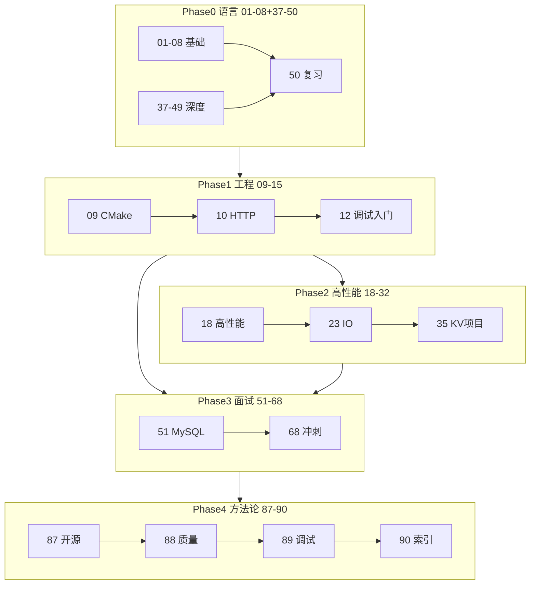
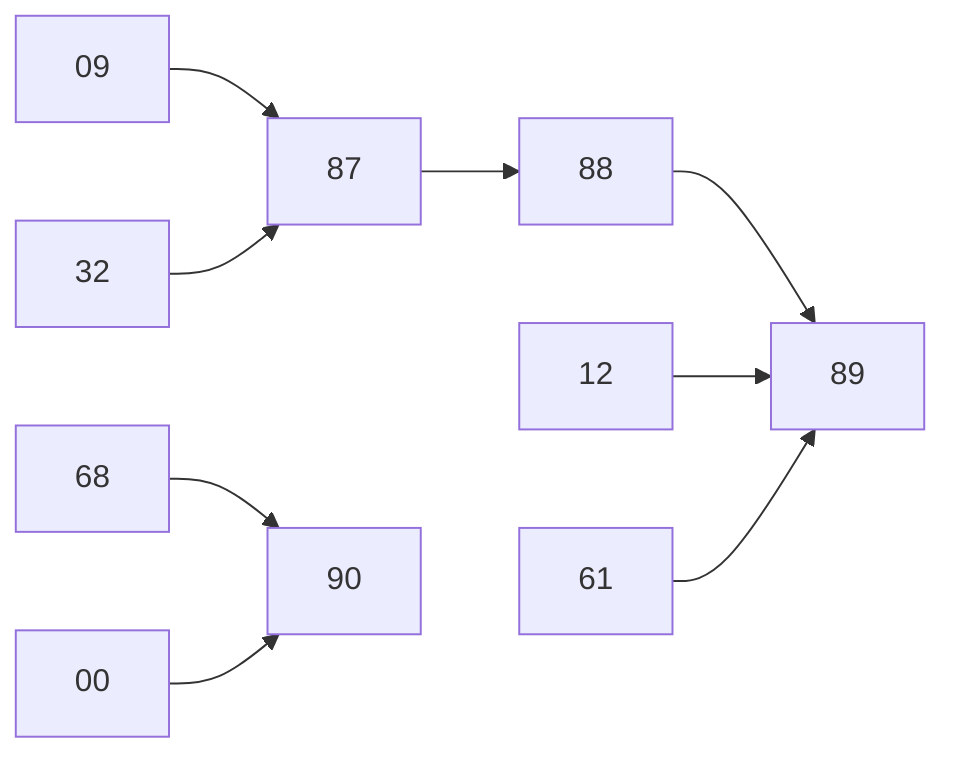

# 学习路线总索引与知识地图

> **文件编码**：UTF-8。01～89 全索引、知识地图 mermaid、六条学习路径；与 [00 章](00-学习路线图与说明.md) 互补——**00 是入门路线图，90 是全系列总索引**。

---

| 文档 | 关系 |
|------|------|
| [00 学习路线图](00-学习路线图与说明.md) | 零基础 Phase 0～7、环境、四步法 |
| **90 本章** | 01～89 全表、六路径、知识地图、收官自测 |

---

## §0 读前导读

### §0.1 用一句话弄懂本章

本章是 **C++ 学习系列的地图页**：查章节、选路径、画知识关联，不必逐字通读。

### §0.3 本章知识地图（☐→☑）

- ☐ 能在 2 分钟内找到任意章号对应主题
- ☐ 能为自己岗位选一条主路径（§4）
- ☐ 能口述 Phase 0～7 与 87～90 工程方法论块
- ☐ 闭卷自测 ≥8/10

---

## §1 01～89 全章索引

| 章 | 文件 | 一句话 | 状态 |
|----|------|--------|------|
| 01 | [01-C++基础语法与数据类型.md](01-C++基础语法与数据类型.md) | 类型/流程控制/多文件编译 | ✅ |
| 02 | [02-指针引用与内存管理.md](02-指针引用与内存管理.md) | 门牌号类比/栈堆/new-delete | ✅ |
| 03 | [03-面向对象与类设计.md](03-面向对象与类设计.md) | 类/继承/多态/虚析构 | ✅ |
| 04 | [04-STL标准库容器与算法.md](04-STL标准库容器与算法.md) | 标准工具箱/迭代器/复杂度 | ✅ |
| 05 | [05-现代C++新特性.md](05-现代C++新特性.md) | move/智能指针/Rule of Zero | ✅ |
| 06 | [06-模板与泛型编程.md](06-模板与泛型编程.md) | 模板/SFINAE/Concepts预览 | ✅ |
| 07 | [07-异常处理与RAII.md](07-异常处理与RAII.md) | 自动关门/异常安全四级 | ✅ |
| 08 | [08-多线程与并发编程.md](08-多线程与并发编程.md) | thread/mutex/线程池 | ✅ |
| 09 | [09-CMake与项目工程化.md](09-CMake与项目工程化.md) | CMake/FetchContent/mini-http | ✅ |
| 10 | [10-网络编程与简易HTTP服务.md](10-网络编程与简易HTTP服务.md) | socket/HTTP/mini-http | ✅ |
| 11 | [11-Linux与系统编程入门.md](11-Linux与系统编程入门.md) | WSL/进程/信号/文件IO | ✅ |
| 12 | [12-性能分析与调试.md](12-性能分析与调试.md) | GDB/Valgrind/perf/压测 | ✅ |
| 13 | [13-算法与数据结构C++实现.md](13-算法与数据结构C++实现.md) | LRU/堆/并查集模板 | ✅ |
| 14 | [14-高频面试专题与场景题.md](14-高频面试专题与场景题.md) | Q1-Q47/STAR场景 | ✅ |
| 15 | [15-补充知识点总表.md](15-补充知识点总表.md) | 复习索引/一周计划 | ✅ |
| 16 | [16-必学技术栈分轨与扩展专题.md](16-必学技术栈分轨与扩展专题.md) | 分轨/Qt/Boost选型 | ✅ |
| 17 | [17-Qt入门与信号槽.md](17-Qt入门与信号槽.md) | 桌面UI/信号槽 | ✅ |
| 18 | [18-高性能C++与内存对齐.md](18-高性能C++与内存对齐.md) | false sharing/零拷贝 | ✅ |
| 19 | [19-gRPC与Protobuf工程化.md](19-gRPC与Protobuf工程化.md) | RPC/Serving | ✅ |
| 20 | [20-pybind11与Python绑定入门.md](20-pybind11与Python绑定入门.md) | Python调C++ | ✅ |
| 21 | [21-设计模式与Infra工程实践.md](21-设计模式与Infra工程实践.md) | 对象池/工厂/观察者 | ✅ |
| 22 | [22-计算机体系结构导读.md](22-计算机体系结构导读.md) | Cache/NUMA/GPU | ✅ |
| 23 | [23-IO多路复用与高性能Server.md](23-IO多路复用与高性能Server.md) | epoll/select/io_uring | ✅ |
| 24 | [24-内存分配器与对象池.md](24-内存分配器与对象池.md) | tcmalloc/jemalloc/对象池 | ✅ |
| 25 | [25-无锁编程与内存序.md](25-无锁编程与内存序.md) | atomic/memory_order | ✅ |
| 26 | [26-Boost.Asio异步网络编程.md](26-Boost.Asio异步网络编程.md) | 异步IO/Reactor | ✅ |
| 27 | [27-Google-Test与单元测试工程.md](27-Google-Test与单元测试工程.md) | gtest/mock/fixture | ✅ |
| 28 | [28-手写STL容器面试专题.md](28-手写STL容器面试专题.md) | vector/map手写 | ✅ |
| 29 | [29-对象模型与虚函数表深入.md](29-对象模型与虚函数表深入.md) | vtable/RTTI/布局 | ✅ |
| 30 | [30-C++20与23新特性深潜.md](30-C++20与23新特性深潜.md) | ranges/modules/format | ✅ |
| 31 | [31-协程C++20-coroutine.md](31-协程C++20-coroutine.md) | co_await/generator | ✅ |
| 32 | [32-fmt-spdlog与可观测性工程.md](32-fmt-spdlog与可观测性工程.md) | fmt/spdlog/日志 | ✅ |
| 33 | [33-C++Infra面试八股总表.md](33-C++Infra面试八股总表.md) | Infra八股总表 | ✅ |
| 34 | [34-手撕代码TOP50与白板专题.md](34-手撕代码TOP50与白板专题.md) | 白板/TOP50 | ✅ |
| 35 | [35-项目实战高性能KV-Store.md](35-项目实战高性能KV-Store.md) | KV项目/STAR | ✅ |
| 36 | [36-面试STAR表达与简历手册.md](36-面试STAR表达与简历手册.md) | 简历/STAR/项目描述 | ✅ |
| 37 | [37-表达式求值与类型转换大全.md](37-表达式求值与类型转换大全.md) | 隐式转换/优先级 | ✅ |
| 38 | [38-函数机制完全指南.md](38-函数机制完全指南.md) | 重载/inline/调用约定 | ✅ |
| 39 | [39-std-string与字符处理完全指南.md](39-std-string与字符处理完全指南.md) | string/编码/UTF-8 | ✅ |
| 40 | [40-复合类型结构体与enum.md](40-复合类型结构体与enum.md) | struct/union/enum class | ✅ |
| 41 | [41-构造析构与三五法则大全.md](41-构造析构与三五法则大全.md) | Rule of 3/5/0 | ✅ |
| 42 | [42-友元与运算符重载完全指南.md](42-友元与运算符重载完全指南.md) | friend/operator | ✅ |
| 43 | [43-继承与多态模型完全指南.md](43-继承与多态模型完全指南.md) | 切片/override/final | ✅ |
| 44 | [44-vector-deque-string容器原理与实务.md](44-vector-deque-string容器原理与实务.md) | vector扩容/deque | ✅ |
| 45 | [45-关联容器与哈希容器完全指南.md](45-关联容器与哈希容器完全指南.md) | map/unordered_map | ✅ |
| 46 | [46-迭代器分类与算法库完全指南.md](46-迭代器分类与算法库完全指南.md) | 五分类/algorithm | ✅ |
| 47 | [47-可调用对象lambda与std-function.md](47-可调用对象lambda与std-function.md) | lambda/function/bind | ✅ |
| 48 | [48-编译预处理与链接原理.md](48-编译预处理与链接原理.md) | 宏/ODR/链接 | ✅ |
| 49 | [49-IO流与文件操作完全指南.md](49-IO流与文件操作完全指南.md) | iostream/fstream | ✅ |
| 50 | [50-Primer级综合复习与语言核心总表.md](50-Primer级综合复习与语言核心总表.md) | 语言总复习/模拟卷 | ✅ |
| 51 | [51-MySQL原理与索引事务面试专章.md](51-MySQL原理与索引事务面试专章.md) | B+树/事务/索引 | ✅ |
| 52 | [52-Redis数据结构与缓存面试专章.md](52-Redis数据结构与缓存面试专章.md) | 缓存/持久化/集群 | ✅ |
| 53 | [53-操作系统面试八股与口述模板.md](53-操作系统面试八股与口述模板.md) | 进程/内存/调度 | ✅ |
| 54 | [54-计算机网络TCP与HTTP面试深度专章.md](54-计算机网络TCP与HTTP面试深度专章.md) | TCP/HTTP/QUIC | ✅ |
| 55 | [55-大厂C++笔试选择题与代码输出陷阱题集.md](55-大厂C++笔试选择题与代码输出陷阱题集.md) | 笔试陷阱题 | ✅ |
| 56 | [56-系统设计案例库RPC-KV与限流秒杀.md](56-系统设计案例库RPC-KV与限流秒杀.md) | RPC/限流/秒杀 | ✅ |
| 57 | [57-消息队列Kafka与中间件面试专题.md](57-消息队列Kafka与中间件面试专题.md) | Kafka/消费组/顺序 | ✅ |
| 58 | [58-模拟面试完整流程与压测数据模板.md](58-模拟面试完整流程与压测数据模板.md) | 模拟面试/压测表 | ✅ |
| 59 | [59-分布式理论CAP-Raft与共识算法面试.md](59-分布式理论CAP-Raft与共识算法面试.md) | CAP/Raft/Paxos | ✅ |
| 60 | [60-抓包与网络排障Wireshark实战.md](60-抓包与网络排障Wireshark实战.md) | Wireshark/tcpdump | ✅ |
| 61 | [61-线上故障排查与性能诊断实战.md](61-线上故障排查与性能诊断实战.md) | top/perf/ASan/STAR | ✅ |
| 62 | [62-Docker与Kubernetes入门面试.md](62-Docker与Kubernetes入门面试.md) | 容器/Pod/Deployment | ✅ |
| 63 | [63-JWT认证与接口幂等性实战.md](63-JWT认证与接口幂等性实战.md) | JWT/幂等/Token | ✅ |
| 64 | [64-定时器与时间轮延时队列设计.md](64-定时器与时间轮延时队列设计.md) | 时间轮/timerfd | ✅ |
| 65 | [65-io_uring与高性能IO选型面试.md](65-io_uring与高性能IO选型面试.md) | io_uring/选型 | ✅ |
| 66 | [66-大厂面经按公司分类精讲.md](66-大厂面经按公司分类精讲.md) | 字节/腾讯/阿里面经 | ✅ |
| 67 | [67-日志采集与高吞吐写入系统设计.md](67-日志采集与高吞吐写入系统设计.md) | 高吞吐日志/采集 | ✅ |
| 68 | [68-大厂面试总索引与冲刺复习计划.md](68-大厂面试总索引与冲刺复习计划.md) | 01-67索引/8周冲刺 | ✅ |
| 69 | 69-Git工作流与协作开发规范.md | Git-flow/PR模板/分支策略 | 📋 规划 |
| 70 | 70-CI-CD流水线与自动化构建.md | GitHub Actions/Jenkins/CMake preset | 📋 规划 |
| 71 | 71-单元测试覆盖率与质量门禁.md | gcov/lcov/覆盖率阈值 | 📋 规划 |
| 72 | 72-依赖管理与vcpkg-Conan实战.md | 包管理/版本锁定/离线构建 | 📋 规划 |
| 73 | 73-跨平台编译与条件编译.md | #ifdef/CMake generator/MSVC vs GCC | 📋 规划 |
| 74 | 74-ABI兼容与动态库版本管理.md | SOVERSION/符号导出/pimpl | 📋 规划 |
| 75 | 75-文档驱动开发与Doxygen.md | API文档/注释规范/站点生成 | 📋 规划 |
| 76 | 76-开源许可证与合规入门.md | MIT/Apache/GPL/商业使用 | 📋 规划 |
| 77 | 77-性能回归测试与Google Benchmark.md | micro-benchmark/CI perf gate | 📋 规划 |
| 78 | 78-Sanitizer全家桶工程化.md | ASan/TSan/UBSan/MSan集成 | 📋 规划 |
| 79 | 79-协程与异步IO工程选型.md | coroutine vs thread pool vs io_uring | 📋 规划 |
| 80 | 80-容器化C++服务最佳实践.md | Docker多阶段构建/静态链接 | 📋 规划 |
| 81 | 81-可观测性三件套实战.md | Metrics/Tracing/Logging统一 | 📋 规划 |
| 82 | 82-安全编码与常见CVE案例.md | 缓冲区/整数溢出/依赖扫描 | 📋 规划 |
| 83 | 83-技术债务识别与偿还策略.md | 债务清单/渐进重构/绞杀者模式 | 📋 规划 |
| 84 | 84-大型遗留系统渐进式改造.md | Facade/Adapter/特性开关 | 📋 规划 |
| 85 | 85-C++编码规范与团队Lint统一.md | Google Style/clang-format/hooks | 📋 规划 |
| 86 | 86-工程方法论专题导读.md | 87-90章前置总览 | 📋 规划 |
| 87 | [87-开源项目阅读与贡献指南.md](87-开源项目阅读与贡献指南.md) | 读 fmt/vLLM/issue→PR | ✅ |
| 88 | [88-代码质量重构与代码审查.md](88-代码质量重构与代码审查.md) | 异味/SOLID/Review | ✅ |
| 89 | [89-调试技术大全与CoreDump分析.md](89-调试技术大全与CoreDump分析.md) | GDB/core/互补12/61 | ✅ |
| 90 | **本章** | 总索引与知识地图 | ✅ |

## §2 知识地图（Mermaid）



## §3 六条学习路径推荐

### 3.x 后端 / Infra

- **章节序列**：01-09 → 10-12 → 23-26 → 32 → 35 → 51-58 → 87-90
- **说明**：mini-http + KV + 中间件八股

### 3.x 游戏 / 引擎

- **章节序列**：01-08 → 17 → 18 → 29 → 03/43 深入
- **说明**：Qt/OpenGL 延伸；少刷 51-57

### 3.x 量化 / 低延迟

- **章节序列**：01-08 → 18 → 24-25 → 38/48 → 12/89 调试
- **说明**：内存/无锁/数值；网络可选

### 3.x Infra / 云原生

- **章节序列**：01-12 → 19 → 23 → 62-65 → 67 → 87
- **说明**：gRPC/K8s/io_uring/日志

### 3.x 算法 / 竞赛

- **章节序列**：01-04 → 13 → 34 → 50 → 55
- **说明**：手撕为主；08 并发基础

### 3.x 嵌入式 / 系统

- **章节序列**：01-08 → 11 → 48 → 22 → 89
- **说明**：裸机/驱动延伸；Linux 系统调用

## §4 与 00 章互补说明

| 维度 | 00 章 | 90 章 |
|------|-------|-------|
| 读者 | 零基础入门 | 全系列查阅/二轮复习 |
| 范围 | Phase 0～7 主线 | 01～89 全表 + 六路径 |
| 深度 | 环境/节奏/类比 | 索引/地图/收官自测 |
| 使用方式 | 第一遍通读 | 书签页 + 考前速查 |

## §5 工程方法论块（87～90）

| 章 | 主题 | 前置 |
|----|------|------|
| 87 | 开源阅读与 PR | 09/32 |
| 88 | 重构与 Review | 27/21 |
| 89 | GDB/core 深度 | 12/61 |
| 90 | 总索引 | 全书 |

## §6 分轨速查 · 01-08 语言基础

- **01** [01-C++基础语法与数据类型.md](01-C++基础语法与数据类型.md) — 类型/流程控制/多文件编译
- **02** [02-指针引用与内存管理.md](02-指针引用与内存管理.md) — 门牌号类比/栈堆/new-delete
- **03** [03-面向对象与类设计.md](03-面向对象与类设计.md) — 类/继承/多态/虚析构
- **04** [04-STL标准库容器与算法.md](04-STL标准库容器与算法.md) — 标准工具箱/迭代器/复杂度
- **05** [05-现代C++新特性.md](05-现代C++新特性.md) — move/智能指针/Rule of Zero
- **06** [06-模板与泛型编程.md](06-模板与泛型编程.md) — 模板/SFINAE/Concepts预览
- **07** [07-异常处理与RAII.md](07-异常处理与RAII.md) — 自动关门/异常安全四级
- **08** [08-多线程与并发编程.md](08-多线程与并发编程.md) — thread/mutex/线程池

## §6 分轨速查 · 09-15 工程入门

- **09** [09-CMake与项目工程化.md](09-CMake与项目工程化.md) — CMake/FetchContent/mini-http
- **10** [10-网络编程与简易HTTP服务.md](10-网络编程与简易HTTP服务.md) — socket/HTTP/mini-http
- **11** [11-Linux与系统编程入门.md](11-Linux与系统编程入门.md) — WSL/进程/信号/文件IO
- **12** [12-性能分析与调试.md](12-性能分析与调试.md) — GDB/Valgrind/perf/压测
- **13** [13-算法与数据结构C++实现.md](13-算法与数据结构C++实现.md) — LRU/堆/并查集模板
- **14** [14-高频面试专题与场景题.md](14-高频面试专题与场景题.md) — Q1-Q47/STAR场景
- **15** [15-补充知识点总表.md](15-补充知识点总表.md) — 复习索引/一周计划

## §6 分轨速查 · 16-36 扩展与项目

- **16** [16-必学技术栈分轨与扩展专题.md](16-必学技术栈分轨与扩展专题.md) — 分轨/Qt/Boost选型
- **17** [17-Qt入门与信号槽.md](17-Qt入门与信号槽.md) — 桌面UI/信号槽
- **18** [18-高性能C++与内存对齐.md](18-高性能C++与内存对齐.md) — false sharing/零拷贝
- **19** [19-gRPC与Protobuf工程化.md](19-gRPC与Protobuf工程化.md) — RPC/Serving
- **20** [20-pybind11与Python绑定入门.md](20-pybind11与Python绑定入门.md) — Python调C++
- **21** [21-设计模式与Infra工程实践.md](21-设计模式与Infra工程实践.md) — 对象池/工厂/观察者
- **22** [22-计算机体系结构导读.md](22-计算机体系结构导读.md) — Cache/NUMA/GPU
- **23** [23-IO多路复用与高性能Server.md](23-IO多路复用与高性能Server.md) — epoll/select/io_uring
- **24** [24-内存分配器与对象池.md](24-内存分配器与对象池.md) — tcmalloc/jemalloc/对象池
- **25** [25-无锁编程与内存序.md](25-无锁编程与内存序.md) — atomic/memory_order
- **26** [26-Boost.Asio异步网络编程.md](26-Boost.Asio异步网络编程.md) — 异步IO/Reactor
- **27** [27-Google-Test与单元测试工程.md](27-Google-Test与单元测试工程.md) — gtest/mock/fixture
- **28** [28-手写STL容器面试专题.md](28-手写STL容器面试专题.md) — vector/map手写
- **29** [29-对象模型与虚函数表深入.md](29-对象模型与虚函数表深入.md) — vtable/RTTI/布局
- **30** [30-C++20与23新特性深潜.md](30-C++20与23新特性深潜.md) — ranges/modules/format
- **31** [31-协程C++20-coroutine.md](31-协程C++20-coroutine.md) — co_await/generator
- **32** [32-fmt-spdlog与可观测性工程.md](32-fmt-spdlog与可观测性工程.md) — fmt/spdlog/日志
- **33** [33-C++Infra面试八股总表.md](33-C++Infra面试八股总表.md) — Infra八股总表
- **34** [34-手撕代码TOP50与白板专题.md](34-手撕代码TOP50与白板专题.md) — 白板/TOP50
- **35** [35-项目实战高性能KV-Store.md](35-项目实战高性能KV-Store.md) — KV项目/STAR
- **36** [36-面试STAR表达与简历手册.md](36-面试STAR表达与简历手册.md) — 简历/STAR/项目描述

## §6 分轨速查 · 37-50 语言深度

- **37** [37-表达式求值与类型转换大全.md](37-表达式求值与类型转换大全.md) — 隐式转换/优先级
- **38** [38-函数机制完全指南.md](38-函数机制完全指南.md) — 重载/inline/调用约定
- **39** [39-std-string与字符处理完全指南.md](39-std-string与字符处理完全指南.md) — string/编码/UTF-8
- **40** [40-复合类型结构体与enum.md](40-复合类型结构体与enum.md) — struct/union/enum class
- **41** [41-构造析构与三五法则大全.md](41-构造析构与三五法则大全.md) — Rule of 3/5/0
- **42** [42-友元与运算符重载完全指南.md](42-友元与运算符重载完全指南.md) — friend/operator
- **43** [43-继承与多态模型完全指南.md](43-继承与多态模型完全指南.md) — 切片/override/final
- **44** [44-vector-deque-string容器原理与实务.md](44-vector-deque-string容器原理与实务.md) — vector扩容/deque
- **45** [45-关联容器与哈希容器完全指南.md](45-关联容器与哈希容器完全指南.md) — map/unordered_map
- **46** [46-迭代器分类与算法库完全指南.md](46-迭代器分类与算法库完全指南.md) — 五分类/algorithm
- **47** [47-可调用对象lambda与std-function.md](47-可调用对象lambda与std-function.md) — lambda/function/bind
- **48** [48-编译预处理与链接原理.md](48-编译预处理与链接原理.md) — 宏/ODR/链接
- **49** [49-IO流与文件操作完全指南.md](49-IO流与文件操作完全指南.md) — iostream/fstream
- **50** [50-Primer级综合复习与语言核心总表.md](50-Primer级综合复习与语言核心总表.md) — 语言总复习/模拟卷

## §6 分轨速查 · 51-68 大厂面试

- **51** [51-MySQL原理与索引事务面试专章.md](51-MySQL原理与索引事务面试专章.md) — B+树/事务/索引
- **52** [52-Redis数据结构与缓存面试专章.md](52-Redis数据结构与缓存面试专章.md) — 缓存/持久化/集群
- **53** [53-操作系统面试八股与口述模板.md](53-操作系统面试八股与口述模板.md) — 进程/内存/调度
- **54** [54-计算机网络TCP与HTTP面试深度专章.md](54-计算机网络TCP与HTTP面试深度专章.md) — TCP/HTTP/QUIC
- **55** [55-大厂C++笔试选择题与代码输出陷阱题集.md](55-大厂C++笔试选择题与代码输出陷阱题集.md) — 笔试陷阱题
- **56** [56-系统设计案例库RPC-KV与限流秒杀.md](56-系统设计案例库RPC-KV与限流秒杀.md) — RPC/限流/秒杀
- **57** [57-消息队列Kafka与中间件面试专题.md](57-消息队列Kafka与中间件面试专题.md) — Kafka/消费组/顺序
- **58** [58-模拟面试完整流程与压测数据模板.md](58-模拟面试完整流程与压测数据模板.md) — 模拟面试/压测表
- **59** [59-分布式理论CAP-Raft与共识算法面试.md](59-分布式理论CAP-Raft与共识算法面试.md) — CAP/Raft/Paxos
- **60** [60-抓包与网络排障Wireshark实战.md](60-抓包与网络排障Wireshark实战.md) — Wireshark/tcpdump
- **61** [61-线上故障排查与性能诊断实战.md](61-线上故障排查与性能诊断实战.md) — top/perf/ASan/STAR
- **62** [62-Docker与Kubernetes入门面试.md](62-Docker与Kubernetes入门面试.md) — 容器/Pod/Deployment
- **63** [63-JWT认证与接口幂等性实战.md](63-JWT认证与接口幂等性实战.md) — JWT/幂等/Token
- **64** [64-定时器与时间轮延时队列设计.md](64-定时器与时间轮延时队列设计.md) — 时间轮/timerfd
- **65** [65-io_uring与高性能IO选型面试.md](65-io_uring与高性能IO选型面试.md) — io_uring/选型
- **66** [66-大厂面经按公司分类精讲.md](66-大厂面经按公司分类精讲.md) — 字节/腾讯/阿里面经
- **67** [67-日志采集与高吞吐写入系统设计.md](67-日志采集与高吞吐写入系统设计.md) — 高吞吐日志/采集
- **68** [68-大厂面试总索引与冲刺复习计划.md](68-大厂面试总索引与冲刺复习计划.md) — 01-67索引/8周冲刺

## §6 分轨速查 · 69-86 工程规划

- **69** Git工作流与协作开发规范 — Git-flow/PR模板/分支策略（规划）
- **70** CI-CD流水线与自动化构建 — GitHub Actions/Jenkins/CMake preset（规划）
- **71** 单元测试覆盖率与质量门禁 — gcov/lcov/覆盖率阈值（规划）
- **72** 依赖管理与vcpkg-Conan实战 — 包管理/版本锁定/离线构建（规划）
- **73** 跨平台编译与条件编译 — #ifdef/CMake generator/MSVC vs GCC（规划）
- **74** ABI兼容与动态库版本管理 — SOVERSION/符号导出/pimpl（规划）
- **75** 文档驱动开发与Doxygen — API文档/注释规范/站点生成（规划）
- **76** 开源许可证与合规入门 — MIT/Apache/GPL/商业使用（规划）
- **77** 性能回归测试与Google Benchmark — micro-benchmark/CI perf gate（规划）
- **78** Sanitizer全家桶工程化 — ASan/TSan/UBSan/MSan集成（规划）
- **79** 协程与异步IO工程选型 — coroutine vs thread pool vs io_uring（规划）
- **80** 容器化C++服务最佳实践 — Docker多阶段构建/静态链接（规划）
- **81** 可观测性三件套实战 — Metrics/Tracing/Logging统一（规划）
- **82** 安全编码与常见CVE案例 — 缓冲区/整数溢出/依赖扫描（规划）
- **83** 技术债务识别与偿还策略 — 债务清单/渐进重构/绞杀者模式（规划）
- **84** 大型遗留系统渐进式改造 — Facade/Adapter/特性开关（规划）
- **85** C++编码规范与团队Lint统一 — Google Style/clang-format/hooks（规划）
- **86** 工程方法论专题导读 — 87-90章前置总览（规划）

## §6 分轨速查 · 87-90 方法论收官

- **87** [开源阅读](87-开源项目阅读与贡献指南.md)
- **88** [代码质量](88-代码质量重构与代码审查.md)
- **89** [调试大全](89-调试技术大全与CoreDump分析.md)
- **90** 本章总索引

## §7 交叉引用高频组合

- 指针+调试：02 + 12 + 89
- 并发+排障：08 + 61 + 89
- 网络+抓包：10 + 60 + 54
- 日志+可观测：32 + 67 + 81（规划）
- 面试冲刺：50 + 68 + 90
- 开源+简历：87 + 36 + 35

## §8 练习

1. 根据目标岗从 §3 选路径，写 12 周计划表。
2. 画出个人已学章节 mermaid（绿/黄/灰）。
3. 用 §1 索引为薄弱章标 ⭐ 优先级。

## §9 FAQ

1. **00 和 90 先读哪个？** 零基础先 00；二轮/查表用 90。
2. **69-86 没有文件？** 规划章，可按标题自学或等更新。
3. **必须学完 89 才面试？** 否；68 可冲刺；87-89 加分。
4. **六路径可混搭吗？** 可以；主轨+副轨，时间有限砍 P2。

## §10 闭卷自测

1. 90 章与 00 章分工？
2. 87～90 四章主题各一词？
3. 六条路径中后端轨核心序列？
4. 知识地图 Phase4 包含哪几章？
5. 68 与 90 区别？
6. 开源贡献链 87 前置两章？
7. 89 与 12 互补关系？
8. 01～89 中规划章号段？
9. 算法轨最少要哪几章？
10. 工程方法论收官最后一章？

### 参考答案

1. 00 入门路线图；90 全索引+六路径+地图。
2. 开源/质量/调试/索引。
3. 01-09→10-12→23-26→32→35→51-58→87-90 等。
4. 87-90。
5. 68 面试冲刺；90 全书地图与路径。
6. 09 CMake、32 fmt/spdlog。
7. 12 入门工具；89 GDB/core 深度。
8. 69-86。
9. 01-04、13、34、50、55 等。
10. 90 本章。

## §11 系列收官

```text
01～50  语言
09～36  工程
51～68  面试
87～90  方法论
00/90   双索引
```

---

## 下一章预告

**系列正文完结**。后续可按 §3 路径复习，或扩展 [LLMInfra](../LLMInfra/00-学习路线图与说明.md) 分轨。

## §12 按周学习日历（12 周模板）

| 周 | 目标 | 章节示例 |
|----|------|----------|
| W1 | 语言 | 01-04 |
| W2 | 指针 OOP | 02-03+37 |
| W3 | STL 现代 | 04-05 |
| W4 | 并发 RAII | 07-08 |
| W5 | 工程 | 09-12 |
| W6 | 网络 | 10+23 |
| W7 | 高性能 | 18-25 |
| W8 | 项目 | 35 |
| W9 | 中间件 | 51-57 |
| W10 | 系统设计 | 56+58 |
| W11 | 冲刺 | 66-68 |
| W12 | 方法论 | 87-90 |

## §13 章节依赖（精选）



## §14 章节配对复习

- 02+89：指针与 watch
- 08+61+89：死锁排障
- 36+87：简历+开源
- 50+68+90：冲刺三连

## §15 00 与 90 对照

| 00 | 90 |
|----|-----|
| 入门路线 | 全索引 |
| Phase 0-7 | 01-89 表 |
| 环境安装 | 六路径选型 |

### 深化案例 1

**问题**：工程场景 1 中如何应用本章方法？

**分析**：对照正文 §2，列出 3 步可执行动作与验收标准。

**交叉章节**：复习 §1 索引中与场景 1 相关的条目。

### 深化案例 2

**问题**：工程场景 2 中如何应用本章方法？

**分析**：对照正文 §3，列出 3 步可执行动作与验收标准。

**交叉章节**：复习 §1 索引中与场景 2 相关的条目。

### 深化案例 3

**问题**：工程场景 3 中如何应用本章方法？

**分析**：对照正文 §4，列出 3 步可执行动作与验收标准。

**交叉章节**：复习 §1 索引中与场景 3 相关的条目。

### 深化案例 4

**问题**：工程场景 4 中如何应用本章方法？

**分析**：对照正文 §5，列出 3 步可执行动作与验收标准。

**交叉章节**：复习 §1 索引中与场景 4 相关的条目。

### 深化案例 5

**问题**：工程场景 5 中如何应用本章方法？

**分析**：对照正文 §6，列出 3 步可执行动作与验收标准。

**交叉章节**：复习 §1 索引中与场景 5 相关的条目。

### 深化案例 6

**问题**：工程场景 6 中如何应用本章方法？

**分析**：对照正文 §7，列出 3 步可执行动作与验收标准。

**交叉章节**：复习 §1 索引中与场景 6 相关的条目。

### 深化案例 7

**问题**：工程场景 7 中如何应用本章方法？

**分析**：对照正文 §8，列出 3 步可执行动作与验收标准。

**交叉章节**：复习 §1 索引中与场景 7 相关的条目。

### 深化案例 8

**问题**：工程场景 8 中如何应用本章方法？

**分析**：对照正文 §9，列出 3 步可执行动作与验收标准。

**交叉章节**：复习 §1 索引中与场景 8 相关的条目。

### 深化案例 9

**问题**：工程场景 9 中如何应用本章方法？

**分析**：对照正文 §10，列出 3 步可执行动作与验收标准。

**交叉章节**：复习 §1 索引中与场景 9 相关的条目。

### 深化案例 10

**问题**：工程场景 10 中如何应用本章方法？

**分析**：对照正文 §11，列出 3 步可执行动作与验收标准。

**交叉章节**：复习 §1 索引中与场景 10 相关的条目。

### 深化案例 11

**问题**：工程场景 11 中如何应用本章方法？

**分析**：对照正文 §12，列出 3 步可执行动作与验收标准。

**交叉章节**：复习 §1 索引中与场景 11 相关的条目。

### 深化案例 12

**问题**：工程场景 12 中如何应用本章方法？

**分析**：对照正文 §1，列出 3 步可执行动作与验收标准。

**交叉章节**：复习 §1 索引中与场景 12 相关的条目。

### 深化案例 13

**问题**：工程场景 13 中如何应用本章方法？

**分析**：对照正文 §2，列出 3 步可执行动作与验收标准。

**交叉章节**：复习 §1 索引中与场景 13 相关的条目。

### 深化案例 14

**问题**：工程场景 14 中如何应用本章方法？

**分析**：对照正文 §3，列出 3 步可执行动作与验收标准。

**交叉章节**：复习 §1 索引中与场景 14 相关的条目。

### 深化案例 15

**问题**：工程场景 15 中如何应用本章方法？

**分析**：对照正文 §4，列出 3 步可执行动作与验收标准。

**交叉章节**：复习 §1 索引中与场景 15 相关的条目。

### 深化案例 16

**问题**：工程场景 16 中如何应用本章方法？

**分析**：对照正文 §5，列出 3 步可执行动作与验收标准。

**交叉章节**：复习 §1 索引中与场景 16 相关的条目。

### 深化案例 17

**问题**：工程场景 17 中如何应用本章方法？

**分析**：对照正文 §6，列出 3 步可执行动作与验收标准。

**交叉章节**：复习 §1 索引中与场景 17 相关的条目。

### 深化案例 18

**问题**：工程场景 18 中如何应用本章方法？

**分析**：对照正文 §7，列出 3 步可执行动作与验收标准。

**交叉章节**：复习 §1 索引中与场景 18 相关的条目。

### 深化案例 19

**问题**：工程场景 19 中如何应用本章方法？

**分析**：对照正文 §8，列出 3 步可执行动作与验收标准。

**交叉章节**：复习 §1 索引中与场景 19 相关的条目。

### 深化案例 20

**问题**：工程场景 20 中如何应用本章方法？

**分析**：对照正文 §9，列出 3 步可执行动作与验收标准。

**交叉章节**：复习 §1 索引中与场景 20 相关的条目。

### 深化案例 21

**问题**：工程场景 21 中如何应用本章方法？

**分析**：对照正文 §10，列出 3 步可执行动作与验收标准。

**交叉章节**：复习 §1 索引中与场景 21 相关的条目。

### 深化案例 22

**问题**：工程场景 22 中如何应用本章方法？

**分析**：对照正文 §11，列出 3 步可执行动作与验收标准。

**交叉章节**：复习 §1 索引中与场景 22 相关的条目。

### 深化案例 23

**问题**：工程场景 23 中如何应用本章方法？

**分析**：对照正文 §12，列出 3 步可执行动作与验收标准。

**交叉章节**：复习 §1 索引中与场景 23 相关的条目。

### 深化案例 24

**问题**：工程场景 24 中如何应用本章方法？

**分析**：对照正文 §1，列出 3 步可执行动作与验收标准。

**交叉章节**：复习 §1 索引中与场景 24 相关的条目。

### 深化案例 25

**问题**：工程场景 25 中如何应用本章方法？

**分析**：对照正文 §2，列出 3 步可执行动作与验收标准。

**交叉章节**：复习 §1 索引中与场景 25 相关的条目。

### 深化案例 26

**问题**：工程场景 26 中如何应用本章方法？

**分析**：对照正文 §3，列出 3 步可执行动作与验收标准。

**交叉章节**：复习 §1 索引中与场景 26 相关的条目。

### 深化案例 27

**问题**：工程场景 27 中如何应用本章方法？

**分析**：对照正文 §4，列出 3 步可执行动作与验收标准。

**交叉章节**：复习 §1 索引中与场景 27 相关的条目。

### 深化案例 28

**问题**：工程场景 28 中如何应用本章方法？

**分析**：对照正文 §5，列出 3 步可执行动作与验收标准。

**交叉章节**：复习 §1 索引中与场景 28 相关的条目。

### 深化案例 29

**问题**：工程场景 29 中如何应用本章方法？

**分析**：对照正文 §6，列出 3 步可执行动作与验收标准。

**交叉章节**：复习 §1 索引中与场景 29 相关的条目。

### 深化案例 30

**问题**：工程场景 30 中如何应用本章方法？

**分析**：对照正文 §7，列出 3 步可执行动作与验收标准。

**交叉章节**：复习 §1 索引中与场景 30 相关的条目。

### 深化案例 31

**问题**：工程场景 31 中如何应用本章方法？

**分析**：对照正文 §8，列出 3 步可执行动作与验收标准。

**交叉章节**：复习 §1 索引中与场景 31 相关的条目。

### 深化案例 32

**问题**：工程场景 32 中如何应用本章方法？

**分析**：对照正文 §9，列出 3 步可执行动作与验收标准。

**交叉章节**：复习 §1 索引中与场景 32 相关的条目。

### 深化案例 33

**问题**：工程场景 33 中如何应用本章方法？

**分析**：对照正文 §10，列出 3 步可执行动作与验收标准。

**交叉章节**：复习 §1 索引中与场景 33 相关的条目。

### 深化案例 34

**问题**：工程场景 34 中如何应用本章方法？

**分析**：对照正文 §11，列出 3 步可执行动作与验收标准。

**交叉章节**：复习 §1 索引中与场景 34 相关的条目。

### 深化案例 35

**问题**：工程场景 35 中如何应用本章方法？

**分析**：对照正文 §12，列出 3 步可执行动作与验收标准。

**交叉章节**：复习 §1 索引中与场景 35 相关的条目。

### 深化案例 36

**问题**：工程场景 36 中如何应用本章方法？

**分析**：对照正文 §1，列出 3 步可执行动作与验收标准。

**交叉章节**：复习 §1 索引中与场景 36 相关的条目。

### 深化案例 37

**问题**：工程场景 37 中如何应用本章方法？

**分析**：对照正文 §2，列出 3 步可执行动作与验收标准。

**交叉章节**：复习 §1 索引中与场景 37 相关的条目。

### 深化案例 38

**问题**：工程场景 38 中如何应用本章方法？

**分析**：对照正文 §3，列出 3 步可执行动作与验收标准。

**交叉章节**：复习 §1 索引中与场景 38 相关的条目。

### 深化案例 39

**问题**：工程场景 39 中如何应用本章方法？

**分析**：对照正文 §4，列出 3 步可执行动作与验收标准。

**交叉章节**：复习 §1 索引中与场景 39 相关的条目。

### 深化案例 40

**问题**：工程场景 40 中如何应用本章方法？

**分析**：对照正文 §5，列出 3 步可执行动作与验收标准。

**交叉章节**：复习 §1 索引中与场景 40 相关的条目。

### 深化案例 41

**问题**：工程场景 41 中如何应用本章方法？

**分析**：对照正文 §6，列出 3 步可执行动作与验收标准。

**交叉章节**：复习 §1 索引中与场景 41 相关的条目。

### 深化案例 42

**问题**：工程场景 42 中如何应用本章方法？

**分析**：对照正文 §7，列出 3 步可执行动作与验收标准。

**交叉章节**：复习 §1 索引中与场景 42 相关的条目。

### 深化案例 43

**问题**：工程场景 43 中如何应用本章方法？

**分析**：对照正文 §8，列出 3 步可执行动作与验收标准。

**交叉章节**：复习 §1 索引中与场景 43 相关的条目。

### 深化案例 44

**问题**：工程场景 44 中如何应用本章方法？

**分析**：对照正文 §9，列出 3 步可执行动作与验收标准。

**交叉章节**：复习 §1 索引中与场景 44 相关的条目。

### 深化案例 45

**问题**：工程场景 45 中如何应用本章方法？

**分析**：对照正文 §10，列出 3 步可执行动作与验收标准。

**交叉章节**：复习 §1 索引中与场景 45 相关的条目。

### 深化案例 46

**问题**：工程场景 46 中如何应用本章方法？

**分析**：对照正文 §11，列出 3 步可执行动作与验收标准。

**交叉章节**：复习 §1 索引中与场景 46 相关的条目。

### 深化案例 47

**问题**：工程场景 47 中如何应用本章方法？

**分析**：对照正文 §12，列出 3 步可执行动作与验收标准。

**交叉章节**：复习 §1 索引中与场景 47 相关的条目。

### 深化案例 48

**问题**：工程场景 48 中如何应用本章方法？

**分析**：对照正文 §1，列出 3 步可执行动作与验收标准。

**交叉章节**：复习 §1 索引中与场景 48 相关的条目。

### 深化案例 49

**问题**：工程场景 49 中如何应用本章方法？

**分析**：对照正文 §2，列出 3 步可执行动作与验收标准。

**交叉章节**：复习 §1 索引中与场景 49 相关的条目。

### 深化案例 50

**问题**：工程场景 50 中如何应用本章方法？

**分析**：对照正文 §3，列出 3 步可执行动作与验收标准。

**交叉章节**：复习 §1 索引中与场景 50 相关的条目。

### 深化案例 51

**问题**：工程场景 51 中如何应用本章方法？

**分析**：对照正文 §4，列出 3 步可执行动作与验收标准。

**交叉章节**：复习 §1 索引中与场景 51 相关的条目。

### 深化案例 52

**问题**：工程场景 52 中如何应用本章方法？

**分析**：对照正文 §5，列出 3 步可执行动作与验收标准。

**交叉章节**：复习 §1 索引中与场景 52 相关的条目。

### 深化案例 53

**问题**：工程场景 53 中如何应用本章方法？

**分析**：对照正文 §6，列出 3 步可执行动作与验收标准。

**交叉章节**：复习 §1 索引中与场景 53 相关的条目。

### 深化案例 54

**问题**：工程场景 54 中如何应用本章方法？

**分析**：对照正文 §7，列出 3 步可执行动作与验收标准。

**交叉章节**：复习 §1 索引中与场景 54 相关的条目。

### 深化案例 55

**问题**：工程场景 55 中如何应用本章方法？

**分析**：对照正文 §8，列出 3 步可执行动作与验收标准。

**交叉章节**：复习 §1 索引中与场景 55 相关的条目。

### 深化案例 56

**问题**：工程场景 56 中如何应用本章方法？

**分析**：对照正文 §9，列出 3 步可执行动作与验收标准。

**交叉章节**：复习 §1 索引中与场景 56 相关的条目。

### 深化案例 57

**问题**：工程场景 57 中如何应用本章方法？

**分析**：对照正文 §10，列出 3 步可执行动作与验收标准。

**交叉章节**：复习 §1 索引中与场景 57 相关的条目。

### 深化案例 58

**问题**：工程场景 58 中如何应用本章方法？

**分析**：对照正文 §11，列出 3 步可执行动作与验收标准。

**交叉章节**：复习 §1 索引中与场景 58 相关的条目。

### 深化案例 59

**问题**：工程场景 59 中如何应用本章方法？

**分析**：对照正文 §12，列出 3 步可执行动作与验收标准。

**交叉章节**：复习 §1 索引中与场景 59 相关的条目。

### 深化案例 60

**问题**：工程场景 60 中如何应用本章方法？

**分析**：对照正文 §1，列出 3 步可执行动作与验收标准。

**交叉章节**：复习 §1 索引中与场景 60 相关的条目。

## 下一章预告

**系列正文完结**。可扩展 [LLMInfra](../LLMInfra/00-学习路线图与说明.md)。

---

*完结*
