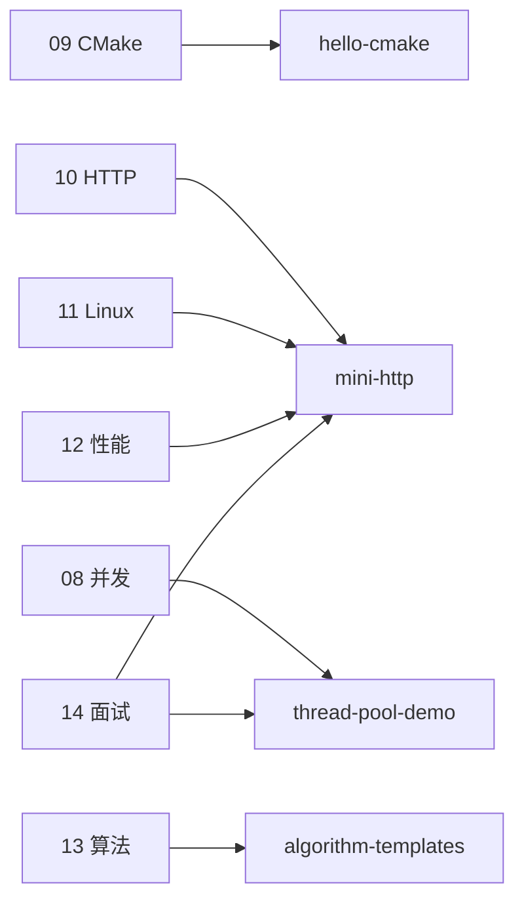

# C++ 学习示例工程说明

> **文件编码**：UTF-8。本目录存放与课程文档配套的 **可编译示例**；详细讲解见上级目录各章 Markdown。  
> 建议路径：`f:\study\后端学习\C++\examples\`（WSL 内常为 `/mnt/f/study/后端学习/C++/examples/`）。

---

## 1. 目录总览

| 子目录 / 工程 | 对应章节 | 学习目标 | 状态 |
|---------------|----------|----------|------|
| `hello-cmake/` | [09 CMake 与项目工程化](../09-CMake与项目工程化.md) | 多文件、静态库、include 路径 | ✅ 可编译 |
| `mini-http/` | [10 网络](../10-网络编程与简易HTTP服务.md)、[11 Linux](../11-Linux与系统编程入门.md)、[12 性能](../12-性能分析与调试.md) | TCP + HTTP 200、日志配置、压测优化 | ✅ 可编译 v2 |
| `thread-pool-demo/` | [08 多线程](../08-多线程与并发编程.md)、[14 面试](../14-高频面试专题与场景题.md) | 任务队列、条件变量、可选接入 mini-http | 文档内完整代码 |
| `algorithm-templates/` | [13 算法](../13-算法与数据结构C++实现.md) | LRU、堆、并查集等模板可单文件编译 | ✅ lru + union_find |

若本地尚未 clone 具体源码，请按 **09～12 章「手把手」** 在对应子目录创建工程；结构与下文一致即可。

---

## 2. hello-cmake（09 章）

**关联知识点**：`CMakeLists.txt`、`add_library`、`target_include_directories`、`CMAKE_CXX_STANDARD 17`。

**推荐结构**：

```text
hello-cmake/
├── CMakeLists.txt
├── include/
│   └── math_utils.h
├── lib/
│   └── math_utils.cpp
└── src/
    └── main.cpp
```

**构建与运行**：

```bash
cd hello-cmake
cmake -S . -B build -DCMAKE_BUILD_TYPE=Debug
cmake --build build
./build/hello_cmake        # Linux/WSL
# build\Debug\hello_cmake.exe   # MSVC
```

**验收**：终端打印 factorial 等示例输出；能在 IDE 中对 `main.cpp` 下断点。

**延伸阅读**：09 章 §2.1 完整步骤、§8 常见 CMake 报错表。

---

## 3. mini-http（10～12 章）

**演进路线**（与 15 章里程碑一致）：

| 版本 | 章节 | 能力 |
|------|------|------|
| v0 空壳 | 09 挑战 | 打印 `mini-http ready` |
| v1 echo | 10 阶段 A | accept + recv/send |
| v2 HTTP 200 | 10 阶段 B/C | 返回固定 HTML，`curl` 可访问 |
| v3 日志配置 | 11 | `access.log`、`server.conf` 端口 |
| v4 性能 | 12 | 静态响应、RAII fd、ab/wrk 压测 |

**推荐结构**：

```text
mini-http/
├── CMakeLists.txt
├── include/
│   └── http_response.h
├── src/
│   ├── main.cpp
│   └── http_response.cpp
├── config/
│   └── server.conf
├── logs/                 # 运行时生成
└── .gitignore            # build/ logs/*.log
```

**构建**：

```bash
cd mini-http
cmake -S . -B build -DCMAKE_BUILD_TYPE=Release
cmake --build build
./build/mini_http &
curl -v http://127.0.0.1:8080/
```

**12 章压测**（服务已启动）：

```bash
ab -n 1000 -c 10 http://127.0.0.1:8080/
wrk -t2 -c50 -d10s --latency http://127.0.0.1:8080/
valgrind --leak-check=full ./build/mini_http
```

**平台说明**：

- **Windows**：可用 Winsock 版（10 章）；压测与 Valgrind 建议 **WSL**
- **Linux/WSL**：POSIX socket，与 11～12 章命令一致

---

## 4. thread-pool-demo（08 / 14 章）

**用途**：演示 [08 章](../08-多线程与并发编程.md) 线程池 + [14 章 Q41](../14-高频面试专题与场景题.md) 线程安全队列，**不必**先完成 mini-http。

**核心文件建议**：

```text
thread-pool-demo/
├── CMakeLists.txt
├── include/
│   ├── thread_safe_queue.h
│   └── thread_pool.h
└── src/
    └── main.cpp          # 投递打印任务验证
```

**与 mini-http 结合（进阶）**：accept 后将 `client_fd` 封装为任务 `push` 进池，对比 12 章单线程 RPS——理解锁开销。

**验收**：多任务并发执行无数据竞争；`TSan` 构建无报错（12 章 §7.6）。

---

## 5. algorithm-templates（13 章）

**用途**：集中存放 [13 章](../13-算法与数据结构C++实现.md) **手撕模板**，便于本地编译自测，不依赖 LeetCode 环境。

**建议文件**：

```text
algorithm-templates/
├── lru_cache.cpp         # §13 LRU（146）
├── heap_topk.cpp         # §12 TopK / 215
├── merge_k_lists.cpp     # §12.3（23）
├── union_find.cpp        # §14 并查集 + 200
└── README-snippet.md     # 各文件对应题号（可选）
```

**单文件编译示例**：

```bash
cd algorithm-templates
g++ -std=c++17 -O2 -Wall lru_cache.cpp -o lru_test
./lru_test
```

**对应题号**：146 LRU、347/215 堆、23 K 路归并、200 岛屿、207 课程表、53 最大子数组。

**面试**：闭卷默写 `LRUCache::get/put` 与 `UnionFind::find/unite`。

---

## 6. 章节 ↔ 示例对照速查



| 章 | 必读示例 | 建议命令/动作 |
|----|----------|---------------|
| 09 | hello-cmake | `cmake --build build` |
| 10 | mini-http v2 | `curl -v localhost:8080` |
| 11 | mini-http v3 | `tail -f logs/access.log` |
| 12 | mini-http v4 | `ab` / `valgrind` / `perf` |
| 08 | thread-pool-demo | 多线程 main 无竞态 |
| 13 | algorithm-templates | `g++` 单文件编译 |
| 14 | mini-http + 队列 | STAR 项目故事 |

---

## 7. 与 Java / Python 系列对照

| 系列 | 项目示例位置 | C++ 等价 |
|------|--------------|----------|
| Java 10 项目实战 | Spring Boot 业务 | mini-http（偏底层） |
| Python 09 部署 | Docker compose | 11 章 Linux 部署 + 日志 |
| 三系 13 算法 | 题单一致 | algorithm-templates |

---

## 8. 常见问题

| 问题 | 处理 |
|------|------|
| 路径含中文编译失败 | 工程放英文路径或 WSL `/home/user/` |
| mini-http 端口占用 | 改 `server.conf` 或 `ss -tlnp` 查占用 |
| Valgrind 太慢 | 短场景 + `--leak-check=summary` |
| 没有 examples 子文件夹 | 按本章结构自建，对照 09～13 章手把手 |
| Windows 无法 perf | 用 WSL 或 12 章 VS Profiler |

---

## 9. 建议学习顺序

1. `hello-cmake` — 确认 CMake  toolchain  
2. `mini-http` v1→v4 — 贯穿 10～12 章  
3. `algorithm-templates` — 并行刷 13 章题单  
4. `thread-pool-demo` — 08/14 并发深化  

完成 2 后可在简历写：**「C++17 实现简易 HTTP 服务，ab 压测 RPS xxx，Valgrind 零泄漏」**（数字用 12 章实测表填写）。

---

*返回：[00 学习路线图](../00-学习路线图与说明.md) | [15 补充知识点总表](../15-补充知识点总表.md)*
