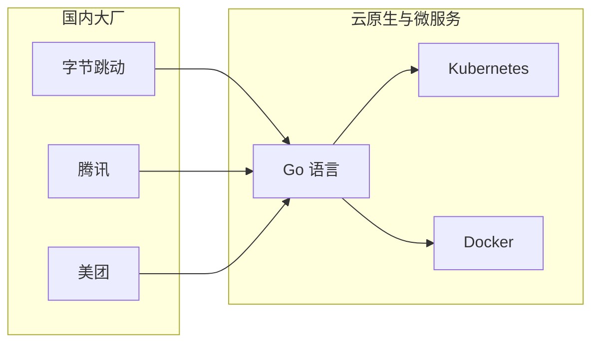
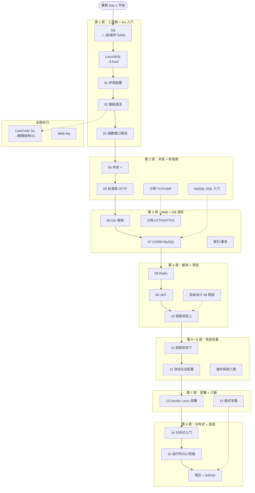
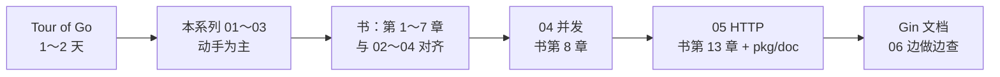

# Go 后端学习路线图与说明

> **文件编码**：UTF-8。  
> **定位**：2026 暑假 **Go 后端主线** 总导航——双非 + ACM 背景，8 周全职冲刺字节/腾讯 Go 实习。  
> **总计划对照**：[go-backend-learning-plan.md](../../go-backend-learning-plan.md)（56 天 Day-by-Day 日程）。  
> **修改说明**：2026-07-10 补充知识深挖：01～16 索引，并新增运行时、内存、GC 与性能分析章节。

---

## 0. 读前导读（零基础也能跟上）

### 0.1 用一句话弄懂本章

**一句话**：本 00 章不教 Go 语法，而是告诉你 **2026 暑假为什么选 Go 当主武器、01～16 章按什么顺序学、每天怎么分配时间、哪些已有笔记可以直接复用**。

**生活类比**：Go 后端学习像 **开餐馆**——00 章是「选址 + 菜单 + 进货清单」；01～05 是「刀工火候」；06～10 是「上菜流程」；11～13 是「正式开业」；14～15 是「应对食评与扩张」；16 是「检查厨房为什么慢、为什么占内存」。

**为什么重要**：你有 CCPC/ICPC 底，时间有限。没有路线图会在 Git、Linux、Go、MySQL、Redis、项目之间来回跳，暑假结束可能「每样都碰一点、没有能写进简历的完整项目」。

---

### 0.2 你需要提前知道什么

| 你现在的水平 | 建议 |
|--------------|------|
| 完全零基础 | 先完成 [Git 入门](../../前端学习/Git/00-学习路线图与说明.md) 前 3 天 + 本系列 **01 章** 环境配置 |
| 会 C++/Java 没写过 Go | 从 **01** 开始，语法 3～5 天可过；重点放 **04 并发** |
| **ACM/CCPC 背景（你的情况）** | 01～03 可 1.5 倍速；**04 并发 + 06 Gin + 短链项目** 是面试分水岭；算法用 Go 写 LeetCode，不重修数据结构课 |
| 已有 Java 后端基础 | MySQL/Redis 直接读 [Java 06](../Java/06-MySQL基础索引与事务.md)、[Java 07](../Java/07-Redis核心原理与缓存实战.md)；Go 语法 01～05 + 06 Gin 即可切项目 |

**最低门槛**：能安装软件、会用终端、知道「变量、函数、循环」概念（竞赛背景已远超此线）。

---

### 0.3 本章知识地图（学完后应能勾选全部 ☐→☑）

- [ ] 说出 **01～16** 各章一句话职责
- [ ] 将每章映射到 [暑假 8 周计划](../../go-backend-learning-plan.md#17-暑假-8-周逐周计划) 的具体周次
- [ ] 列出至少 **5 条** 跨目录交叉引用（数据结构/Linux/Java/系统设计/计网/Git）
- [ ] 解释 **为什么 2026 暑假主线是 Go 而不是 C++/Java**
- [ ] 制定个人 **每日 6～8h** 时间块（理论/编码/算法/复习/日志）
- [ ] 完成本章 **闭卷自测 ≥ 8/10**
- [ ] 向同学 **3 分钟** 讲完「Go 后端 8 周路径」（见 §0.7 费曼提纲）

---

### 0.4 建议学习时长与节奏

| 阶段 | 日历 | 章节 | 有效学时/周 |
|------|------|------|-------------|
| W1 工具链 + Go 入门 | Day 1～7 | Git/Linux + **01～03** | 40～50h |
| W2 Go 并发 + 标准库 | Day 8～14 | **04～05** + MySQL 入门 + 计网 TCP | 45～55h |
| W3 框架 + 数据库进阶 | Day 15～21 | **06～07** + 计网 HTTP + 索引事务 | 45～55h |
| W4 缓存 + 项目启动 | Day 22～28 | **08～10** + shorturl MVP | 45～55h |
| W5～W6 项目完善 | Day 29～42 | **10～12** + OS 八股 | 40～50h |
| W7 部署 + 八股 | Day 43～49 | **13** + 面试卡片 | 35～45h |
| W8 分布式 + 运行时 + 投递 | Day 50～56 | **14～16** + 简历 | 30～40h |

**每日节奏模板**（与总计划 §3 一致）：

| 时段 | 时长 | 内容 |
|------|------|------|
| 块 1 | 2h | 理论：Tour / 书 / 本系列笔记 |
| 块 2 | 2h | 编码：go-daily / 项目 / SQL |
| 块 3 | 1.5h | 算法：LeetCode **2～3 题（Go 写）** |
| 块 4 | 1h | 复习：昨日笔记 + 八股卡片 |
| 块 5 | 0.5h | `logs/daily-log.md` + Git commit |

---

### 0.5 学完本章你能做什么（可验证的具体动作）

1. 打开 [go-backend-learning-plan.md](../../go-backend-learning-plan.md)，在 Day 1 行填上你的实际开始日期。
2. 创建 `F:\study\code\go-daily` 与 `F:\study\logs\daily-log.md`，写第一条学习记录。
3. 向面试官（或同学）**3 分钟** 讲完：为什么选 Go、暑假结束要交付什么（短链项目 + 80 题 + 八股）。
4. 闭卷画出 §2 全路径 Mermaid 的 **6 个主阶段**（工具链→语法→并发→Web→项目→面试）。
5. 列出你 **不需要重复学** 的模块（竞赛算法、复杂 DP 等）以节省时间。

---

### 0.6 闭卷自测（路线图专版）

1. 2026 暑假 Go 后端主线的 **最终交付物** 是什么？（至少 3 项）
2. 01～05 章与 06～10 章的分工各是什么？
3. W1 周末应达到什么里程碑？W8 呢？
4. MySQL 八股为什么要读 Java 06 而不是等 Go 专属笔记？
5. 短链项目设计应优先看哪份系统设计文档？
6. ACM 背景下，算法模块应如何定位？（题量/难度/语言）
7. 每日 5 个时间块各做什么？块 3 用什么语言写题？
8. Gin 学习前置章节是哪两章？
9. 计网 TCP/HTTP 笔记在仓库哪个目录？
10. 「教程收藏夹吃灰」如何避免？本路线推荐的几套核心资源是什么？

<details>
<summary>自测参考答案（先自己做再点开）</summary>

1. 可演示的 **shorturl 项目**（Docker 可跑）、LeetCode Go **80+**、能讲 GMP/slice/channel/Redis/MySQL/计网八股、一页简历。
2. 01～05：**语言与标准库**；06～10：**Web 框架、存储、鉴权、项目实战上**。
3. W1：Git+Linux+Go 环境+基础语法；W8：分布式入门+简历+GitHub 整理+投递准备。
4. MySQL/Redis/事务/索引是 **语言无关** 的后端核心；Java 06/07 已覆盖，Go 岗同样考。
5. [系统设计 08-短链服务设计](../系统设计/08-短链服务设计.md)。
6. 不冲 ACM 难度；**热题 100 + 中等为主**；**必须用 Go 写** 以熟悉语法与标准库；竞赛成绩写进简历。
7. 理论 2h / 编码 2h / **算法 1.5h（Go）** / 复习 1h / 日志 0.5h。
8. **05**（net/http 基础）+ **03**（接口与错误处理）；07 还需 MySQL。
9. `F:\study\前端学习\计算机网络\`。
10. 只选 **Tour + 《Go 程序设计语言》+ Gin 官方文档** 各一套；以 **项目驱动** 反查文档；每天 daily-log。

</details>

---

## 1. 为什么 2026 暑假主线是 Go（不是 C++/Java）

### 1.1 决策背景

| 因素 | 说明 |
|------|------|
| **目标** | 大二下/暑假 **字节、腾讯、美团** 等 Go 后端实习 |
| **现有底** | CCPC 省金 + ICPC 省银 → 算法笔试有优势 |
| **学校** | 双非 → 更需要 **完整可演示项目 + 清晰技术栈** |
| **时间** | 暑假 8 周全职，不可能 C++/Java/Go 三条线并重 |

### 1.2 Go vs C++ vs Java（2026 暑假视角）

| 维度 | Go ⭐ 主线 | C++ | Java |
|------|-----------|-----|------|
| 实习 JD 匹配 | 字节/腾讯 Go 岗多 | 游戏/基础架构/竞赛向 | 传统后端仍多，但与你「已定 Go」冲突 |
| 学习曲线到「能写 API」 | **2～3 周** | 长（内存/模板/构建） | 3～4 周（Spring 生态大） |
| 并发模型 | **goroutine 面试高频** | 自己管线程 | 线程池为主 |
| 你的竞赛优势 | 算法用 Go 写即可 | 语言熟但岗位面窄 | 需额外学 Spring |
| 本仓库资料 | **本文件夹 01～16 完整** | [C++ 00](../C++/00-学习路线图与说明.md) 并行参考 | [Java 06/07](../Java/06-MySQL基础索引与事务.md) **交叉读** |

**结论**：C++ 保留在简历「竞赛语言」；Java 笔记 **只读存储/中间件章节**；**编码与项目 100% Go**。

### 1.3 Go 在 2026 后端生态的位置



- **Docker、Kubernetes、Prometheus、etcd** 均为 Go 实现 → 读源码、写 Operator 均受益。
- **Gin / Go-Zero / Kratos** 是国内 Go Web 主流框架 → 本路线选 **Gin**（资料最多、面试最高频）。

---

## 2. 全路径 Mermaid（01～16 + 外部模块）



---

## 3. 章节索引 01～16（职责 + 周次 + 验收）

> 详细 Day-by-Day 见 [go-backend-learning-plan.md §18](../../go-backend-learning-plan.md#18-暑假-56-天日程表day-by-day)。

| 章 | 文件 | 一句话 | 建议周次 | Day 参考 | 学完验收 |
|----|------|--------|----------|----------|----------|
| **01** | [01-Go入门与环境配置](./01-Go入门与环境配置.md) | Windows 装当前稳定版 Go、go mod、Hello World、项目布局 | W1 | D5 | `go version` + `go run` 成功 |
| **02** | [02-Go基础语法与复合类型](./02-Go基础语法与复合类型.md) | 类型、slice 深入、map、struct、指针、defer 入门 | W1 | D5～D6 | 词频统计小程序 |
| **03** | [03-Go函数接口与错误处理](./03-Go函数接口与错误处理.md) | 函数、方法、interface、error、panic/recover | W1 | D7 | Shape 接口多态 demo |
| **04** | [04-Go并发编程goroutine与channel](./04-Go并发编程goroutine与channel.md) | goroutine、channel、select、sync、context、GMP ⭐ | W2 | D8～D10 | worker pool + `-race` |
| **05** | [05-Go标准库与HTTP基础](./05-Go标准库与HTTP基础.md) | net/http、json、testing、中间件模式 | W2 | D11 | 原生 HTTP API 无 Gin |
| **06** | [06-Gin框架核心与中间件](./06-Gin框架核心与中间件.md) | Gin 路由、绑定、中间件链、分层 | W3 | D18～D19 | Hello API + Logger |
| **07** | [07-GORM与MySQL实战](./07-GORM与MySQL实战.md) | GORM CRUD、事务、短链表设计 | W3～W4 | D22+ | 连 MySQL 跑 CRUD |
| **08** | [08-Redis与go-redis缓存实战](./08-Redis与go-redis缓存实战.md) | go-redis、缓存设计、穿透击穿雪崩 | W4 | D25～D26 | 短码缓存读写 |
| **09** | [09-JWT认证与用户体系](./09-JWT认证与用户体系.md) | JWT 签发校验、bcrypt、鉴权中间件 | W3 | D20 | 登录 demo |
| **10** | [10-短链服务项目实战上](./10-短链服务项目实战上.md) | 项目脚手架、创建短链、302 跳转 | W4 | D22～D26 | MVP 核心 API |
| **11** | [11-短链服务项目实战下](./11-短链服务项目实战下.md) | 分页、限流、click_log、压测 | W5～W6 | D29～D39 | README + 压测数据 |
| **12** | [12-单元测试日志与配置工程化](./12-单元测试日志与配置工程化.md) | zap、viper、Table-Driven Test | W5～W6 | D31、D38 | service 单测 |
| **13** | [13-Docker与Linux部署Go服务](./13-Docker与Linux部署Go服务.md) | Dockerfile、compose、WSL 部署 | W7 | D43～D45 | 一键 docker-compose up |
| **14** | [14-分布式入门与高并发场景](./14-分布式入门与高并发场景.md) | 分布式 ID/锁、MQ 概念、限流 | W8 | D50～D51 | 能讲 CAP + Redis 锁 |
| **15** | [15-Go面试专题与知识点总表](./15-Go面试专题与知识点总表.md) | Go/MySQL/Redis/计网/OS 速查 | W7～W8 | D46～D49 | 自测 80% 覆盖 |
| **16** | [16-Go运行时内存GC与性能分析](./16-Go运行时内存GC与性能分析.md) | 逃逸分析、内存分配、GC、benchmark、pprof/trace | W8 / 项目压测时 | D50+ | 独立完成一次 profile 定位 |

---

## 4. 与 go-backend-learning-plan.md 的周次对照表

| 总计划周 | 总计划主题 | 本文件夹章节 | 其他模块 |
|----------|------------|--------------|----------|
| **W1** | Git + Linux + Go 入门 | **01～03** | [Git](../../前端学习/Git/)、[Linux 00](../Linux/00-学习路线图与说明.md) |
| **W2** | Go 并发 + 算法 | **04～05** | MySQL SQL、计网 TCP、[数据结构 11](../数据结构/09-综合复习/README.md) |
| **W3** | 计网 + MySQL 进阶 + Gin | **06～07、09** | [计网](../../前端学习/计算机网络/)、[Java 06](../Java/06-MySQL基础索引与事务.md) |
| **W4** | 项目 + Redis | **08、10** | [Java 07](../Java/07-Redis核心原理与缓存实战.md)、[系统设计 08](../系统设计/08-短链服务设计.md) |
| **W5** | 项目完善 + OS | **11～12** | OS 八股（总计划 §13） |
| **W6** | 压测 + 文档 | **11** | wrk/ab |
| **W7** | Docker + 八股 | **13、15** | [Linux 12 Docker](../Linux/12-Docker容器基础.md) |
| **W8** | 分布式 + 运行时 + 投递 | **14～16** | [Java 12 高并发](../Java/12-高并发与分布式系统基础.md) |

---

## 5. 交叉引用地图（不重复造轮子）

| 本 Go 路线模块 | 仓库内已有资料 | 用法 |
|----------------|----------------|------|
| 数据结构 / 算法 | [数据结构 00](../数据结构/README.md)、[11 题单](../数据结构/09-综合复习/README.md) | 原理速览 + **Go 刷题** |
| Linux | [Linux 00](../Linux/00-学习路线图与说明.md) | W1 必学，W7 部署 |
| Git | [Git 00](../../前端学习/Git/00-学习路线图与说明.md) | Day 1～2 |
| 计网 / HTTP | [计算机网络](../../前端学习/计算机网络/) | W2～W3，配合 05/06 |
| MySQL | [Java 06](../Java/06-MySQL基础索引与事务.md) | 索引/事务八股 |
| Redis | [Java 07](../Java/07-Redis核心原理与缓存实战.md) | 穿透击穿雪崩 |
| 短链设计 | [系统设计 08](../系统设计/08-短链服务设计.md) ⭐ | 项目架构必读 |
| 系统设计方法 | [系统设计 01](../系统设计/01-系统设计方法论与面试框架.md) | 面试场景题 |
| 高并发 / 分布式 | [Java 12](../Java/12-高并发与分布式系统基础.md) | W8 进阶 |
| 后端总览 | [后端 00](../00-后端路线总览.md) | 全局定位 |

---

## 6. 推荐学习顺序（严格按编号）

```text
00 学习路线图（你现在在这里）
 ↓
01 环境配置（Day 5）
 ↓
02 基础语法与复合类型（Day 5～6）
 ↓
03 函数、接口与错误处理（Day 7）
 ↓
04 并发编程 ⭐（Day 8～10，不可跳过）
 ↓
05 标准库与 HTTP（Day 11，Gin 前置）
 ↓
06 Gin 框架（Day 18）
 ↓
07 GORM + MySQL（Day 22，配合 Java 06）
 ↓
08 Redis（Day 25，配合 Java 07）
 ↓
09 JWT 鉴权（Day 20，可与 06 并行）
 ↓
10～11 短链项目（Day 22～39，配合系统设计 08）
 ↓
12 工程化（测试/日志/配置）
 ↓
13 Docker 部署
 ↓
14 分布式入门
 ↓
15 面试总表（持续复习）
 ↓
16 运行时 / GC / 性能分析（项目压测时重点学）
```

**不可跳章警告**：

| 若想跳 | 风险 |
|--------|------|
| 04 并发 | Go 面试 **必问** GMP/channel，项目也会用 context |
| 05 net/http | 06 Gin 中间件原理听不懂 |
| 07 直接写项目 | SQL/GORM 错误处理全线崩溃 |

---

## 7. 资源策略：B站 / 书 / 官方文档

### 7.1 只选一套，做完再换

| 类型 | 推荐 | 用途 | 对应章节 |
|------|------|------|----------|
| **官方交互** | [Tour of Go](https://go.dev/tour/) | 语法速览 1～2 天 | 01～03 补充 |
| **主教材** | 《Go 程序设计语言》(The Go Programming Language) | 系统阅读 | 01～05 |
| **Web 框架** | [Gin 官方文档](https://gin-gonic.com/docs/) | 做项目时查 | 06 |
| **ORM** | [GORM 文档](https://gorm.io/docs/) | 做项目时查 | 07 |
| **B站** | 任选 **1 套** Go 入门（不必 Go-Zero 全学） | 视频辅助 | 01～04 |

### 7.2 阅读顺序建议



### 7.3 不推荐暑假做的事

- 同时开 C++ 系统学习 + Java Spring 全栈
- 看完 5 套 Go 视频零项目
- 泛刷 500 题 LeetCode（竞赛底 **精刷 80** 足够）
- 深挖 reflect / 汇编 / 编译器（W3 前）

---

## 8. ACM / 竞赛背景优化策略

### 8.1 你可以省的时间

| 模块 | 竞赛生策略 |
|------|------------|
| [数据结构 01～06](../数据结构/README.md) | 速览 **面试口述版**，不重写线段树/平衡树 |
| 算法难度 | **热题 100 + 中等**；Hard 选做 |
| 01～03 Go 语法 | 1.5 倍速；重点 **slice/map/interface** 与 C++ 差异 |
| 复杂度分析 | 笔试直接写；面试 **口头讲清** 即可 |

### 8.2 你必须多投的时间

| 模块 | 原因 |
|------|------|
| **04 并发** | 竞赛很少写 goroutine/channel；**字节腾讯必问** |
| **05～06 HTTP/Web** | ACM 无 Web 经验；项目与实习核心 |
| **07～08 存储** | 后端八股与 shorturl 必备 |
| **10～11 项目** | 双非 **最硬简历筹码** |
| **费曼口述** | 竞赛习惯「直接写代码」→ 面试要先讲思路 |

### 8.3 LeetCode 用 Go 写

| 周 | 题量/天 | 目标 |
|----|---------|------|
| W1 | 1 | 熟悉 Go 语法（切片、map API） |
| W2～W8 | 2～3 | 累计 **80+**，热题 100 完成 **60+** |

**推荐起步题**（用 Go）：1、20、21、53、70、121、141、226、704、347。

代码存放：`F:\study\code\leetcode-go\`

---

## 9. 本地目录与代码仓库

与 [总计划 §2](../../go-backend-learning-plan.md#2-本地目录结构建议) 一致：

```
F:\study\
├── go-backend-learning-plan.md
├── 后端学习\Go\              ← 本文件夹 00～16
├── code\
│   ├── go-daily\             ← 每日小练习
│   ├── leetcode-go\
│   └── projects\shorturl\    ← 主项目
└── logs\daily-log.md
```

**Git 习惯**：`go-daily` 与 `shorturl` 从 Day 1 起 **每天至少 1 commit**。

---

## 10. 里程碑与自检（暑假版）

| 时间 | 里程碑 | 对应章节 |
|------|--------|----------|
| 第 1 周末 | Git/Linux OK，Go 环境跑通，03 完成 | 01～03 |
| 第 2 周末 | 04～05 完成，worker pool，LC 20 题 | 04～05 |
| 第 3 周末 | 06 Gin Hello，07 连 MySQL，计网 HTTP | 06～07 |
| 第 4 周末 | 10 MVP：注册/登录/短链/跳转 | 08～10 |
| 第 6 周末 | 11 功能完整 + 压测数据 | 11～12 |
| 第 8 周末 | 13 Docker + 15 八股一轮 + 16 profile 实战 + 简历 | 13～16 |

**暑假结束前总检查**（摘自总计划 §22）：

- [ ] GitHub 有 shorturl，`docker-compose up` 可跑
- [ ] 能 **闭卷** 讲 GMP、slice 扩容、channel 关闭行为
- [ ] LeetCode Go 80+；热题 60+
- [ ] 能 5 分钟讲「URL 到页面」+ Redis 穿透击穿雪崩

---

## 11. 常见问题 FAQ（≥10）

### Q1：双非没实习，Go 够吗？

够 **入门实习**。关键是 **完整项目 + 竞赛成绩 + 八股**。大厂日常实习也招大二，早投早面。

### Q2：C++ 竞赛还要不要继续写？

**简历保留**，暑假 **主写 Go**。笔试若允许语言选 C++ 也可，但面试手撕建议 **Go 写熟**。

### Q3：Java 文件夹还要学吗？

**06 MySQL、07 Redis、12 高并发** 必读；Spring 章节省略。

### Q4：Go 和 Java 后端面试差别大吗？

语言题换 Go；**MySQL/Redis/计网/OS** 高度重叠。见 [15 章](./15-Go面试专题与知识点总表.md)。

### Q5：学习时用哪个 Go 版本？

本机已安装 **Go 1.26.5**，学习直接使用当前稳定版。进入公司后以项目 `go.mod`、CI 和部署镜像为准；同时知道 1.22 的循环变量、ServeMux 等版本边界。

### Q6：Windows 开发还是 Linux？

**开发 Windows + WSL 部署**。面试说会 Linux 要在 WSL **真实部署过** shorturl。

### Q7：Gin 和 Go-Zero 选哪个？

暑假 **Gin**；Go-Zero 大二再了解。JD 里 Gin 出现频率更高。

### Q8：项目做几个？

**1 个做精**（shorturl）> 3 个半成品。大二上再加第二个。

### Q9：八股什么时候开始背？

**W7 集中** + W3 起每天 30min 卡片。Go 语言题见 04、15 章。

### Q10：每天学不动 8 小时怎么办？

保 **块 2 编码 + 块 3 算法**；理论可压缩到 1.5h，但 **不可零编码**。

### Q11：需要学 Kubernetes 吗？

暑假 **不需要**。Docker + compose 足够；K8s 大二进阶。

### Q12：GORM 还是 sqlx？

**GORM** 为主（实习项目常见）；sqlx 了解即可。

---

## 12. 报错与卡点速查（路线图级）

| 现象 | 可能原因 | 处理 |
|------|----------|------|
| 不知道从哪章开始 | 未读 00 章 | 按 §6 顺序，Day 5 从 01 开始 |
| Concurrent 章看不懂 | 03 interface 不牢 | 回读 03，重做 Shape 接口题 |
| Gin 中间件晕 | 05 net/http 跳过 | 回读 05 Handler 链 |
| 项目不知道表结构 | 未读系统设计 08 | 打开 [08-短链](../系统设计/08-短链服务设计.md) |
| MySQL 连接失败 | 服务未启/端口错 | 查 WSL `ss -tlnp`；DSN 用户名密码 |
| Redis 连不上 | Docker 未映射端口 | `docker ps` 看 6379 |
| LeetCode Go TLE | 用错 API 复杂度 | 查 slice 操作是否 O(n²) |
| 八股背了忘 | 无项目锚点 | 结合 shorturl 场景记（如跳转用 Redis） |
| 教程太多学不动 | 收藏夹策略 | §7 只保留 Tour+书+Gin 文档 |
| daily-log 断更 | 没固定块 5 | 设闹钟，只写 3 行也行 |
| Git 不敢 push | 怕代码丑 | 私有仓库即可，commit 小步提交 |
| 面试慌 | 无模拟 | W7 Day 49 录音自问 30min |

---

## 13. 练习建议

1. **Day 1～4**：Git/Linux 跟总计划走，Go 只读 00+01 预览。
2. **Day 5～7**：按 01→02→03 顺序，每天在 `go-daily` 提交至少 1 个 `.go` 文件。
3. **Day 8 起**：04 章每个 demo 自己 **手写一遍**，跑 `go run -race`。
4. **每周日**：对照 §10 里程碑做 **周复盘**，更新 daily-log。
5. **与交叉引用联动**：学 07 时打开 Java 06 对照索引章节；学 08 时打开 Java 07。

---

## 14. 学完标准（00 章）

- [ ] 能 **不看资料** 画出 §2 全路径图 6 阶段
- [ ] 能说出 01～16 每章 **一句话**
- [ ] 能解释 **为何 Go 是暑假主线**
- [ ] 已创建 `go-daily`、`daily-log`、计划开始日期
- [ ] FAQ 能口头答 **8/12**
- [ ] 闭卷自测 **≥ 8/10**

---

## 15. 费曼检验：3 分钟讲给室友

**对照提纲**（讲完自检是否覆盖）：

1. **目标**：暑假用 Go 做出 **短链项目**，投字节腾讯实习；竞赛成绩写简历。
2. **路径**：工具链 3 天 → Go 语法 1 周 → **并发必学** → Gin+MySQL+Redis → 项目 3 周 → Docker+八股。
3. **不重复学**：MySQL/Redis 读 Java 笔记；算法用 Go 刷 80 题，不重修数据结构课。

---

## 16. 章节衔接

| 上一模块 | 本章（00） | 下一章 |
|----------|------------|--------|
| [后端 00 总览](../00-后端路线总览.md) | Go 路线导航 | [01 环境配置](./01-Go入门与环境配置.md) |
| [总计划](../../go-backend-learning-plan.md) | 章节↔周次映射 | Day 5 开始 **01** |

**下一步**：打开 [01-Go入门与环境配置.md](./01-Go入门与环境配置.md)，确认 Go 1.26.5 工具链并完成第一个 `Hello, World`。

---

*文档版本：v1.0 · 2026-07-08 · 路径：`F:\study\后端学习\Go\00-学习路线图与说明.md`*
