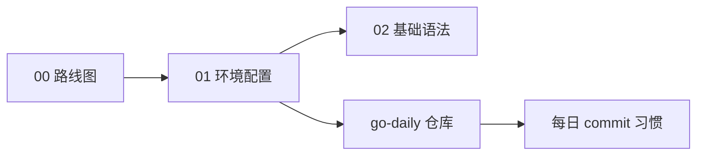
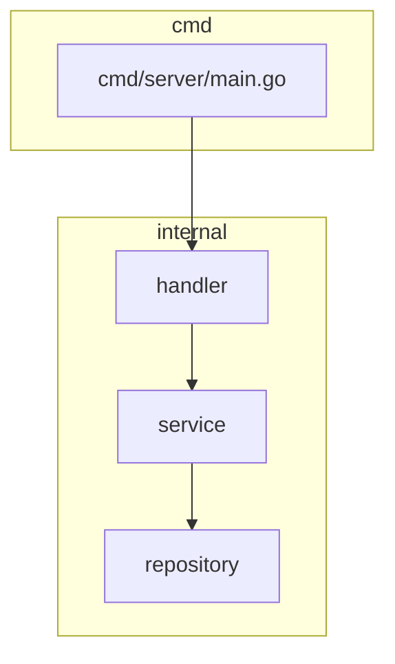

# Go 入门与环境配置

> **文件编码**：UTF-8。  
> **定位**：Go 后端路线 **第 1 步**——在 Windows 上安装当前稳定版 Go（本机为 1.26.5）、配置 GOPROXY、理解 go mod、跑通 Hello World 与标准项目布局。
> **前置**：[00 学习路线图](./00-学习路线图与说明.md) · Git/Linux 建议在 Day 1～4 并行。  
> **下一章**：[02 Go 基础语法与复合类型](./02-Go基础语法与复合类型.md)

---

## 0. 读前导读（零基础也能跟上）

### 0.1 用一句话弄懂本章

**一句话**：把 **Go 工具链装对、代理配好、第一个程序跑起来**，并理解 `go mod` 如何管理依赖——后面所有章节都建立在「能 `go run` / `go build`」之上。

**生活类比**：装 Go 像 **买厨房设备**——刀（编译器）、菜谱（标准库）、进货渠道（GOPROXY/module）；本章确保厨房能开火，下一章才开始切菜（语法）。

**为什么重要**：环境配错（版本过旧、GOPROXY 未设、GOPATH 混乱）会在 Day 8 并发章浪费半天排查，Summer 8 周经不起这种损耗。

---

### 0.2 你需要提前知道什么

| 水平 | 建议 |
|------|------|
| 完全零基础 | 先会打开 PowerShell、会 `cd`/`mkdir`；Git 可 Day 1 并行 |
| 有 C++/Java | 重点看 **go mod vs Maven/npm**、**无分号、导出靠大写** |
| ACM 背景 | 0.5～1 天过完本章，重点 **项目布局** 与 `go test` 习惯 |

**最低门槛**：Windows 10/11，能下载安装包，有 ~500MB 磁盘空间。

---

### 0.3 本章知识地图（学完后应能勾选全部 ☐→☑）

- [ ] `go version` 显示 **go1.26.5 windows/amd64**（或更新稳定版）
- [ ] 设置 `GOPROXY=https://goproxy.cn,direct` 并成功 `go mod init`
- [ ] VS Code 或 GoLand 中 **gopls** 无报错
- [ ] 独立编写、运行 Hello World 与带 `flag` 的小程序
- [ ] 解释 **GOROOT / GOPATH / go mod** 三者关系
- [ ] 使用 **Standard Go Project Layout** 创建 `cmd/` + `go.mod` 项目
- [ ] 闭卷自测 ≥ 8/10

---

### 0.4 建议学习时长与节奏

| 阶段 | 时间 | 内容 |
|------|------|------|
| 安装与验证 | 1～2 h | §1～§2 |
| 编辑器配置 | 1 h | §3 |
| go mod 与布局 | 2 h | §4～§5 |
| Hello + 小练习 | 2 h | §6～§7 |
| 自测 | 0.5 h | FAQ + 闭卷 |

**对应总计划**：W1 Day 5（[go-backend-learning-plan.md D5](../../go-backend-learning-plan.md)）。

---

### 0.5 学完本章你能做什么（可验证的具体动作）

1. 在 PowerShell 执行 `go version`，看到 `go1.26.5 windows/amd64`（当前本机结果）。
2. 创建 `F:\study\code\go-daily\hello\`，`go run .` 输出 `Hello, Go!`。
3. 执行 `go mod init github.com/你的用户名/go-daily`，生成 `go.mod`。
4. 在 VS Code 中打开 `.go` 文件，保存时自动 `go fmt`。
5. 向同学解释：**为什么 Go 1.11+ 推荐 go mod 而不是 GOPATH 放所有代码**。

---

### 0.6 手把手总览：30 分钟跑通环境

| 步骤 | 你的动作 | 预期看到什么 | 若不对 |
|------|----------|--------------|--------|
| 1 | 下载安装当前稳定版 Go MSI | 安装向导完成 | 见 §8 报错表 #1 |
| 2 | 新开 PowerShell，`go version` | `go version go1.26.5 windows/amd64` | 见 #2 PATH |
| 3 | `go env GOPROXY` | 若空则设置代理 | 见 #3 |
| 4 | `mkdir F:\study\code\go-daily\hello` | 目录存在 | 权限问题换盘符 |
| 5 | 写 `main.go`（§6.1） | 文件保存 UTF-8 | BOM 问题见 #8 |
| 6 | `go run .` | `Hello, Go!` | 见 #4 |
| 7 | VS Code 装 Go 插件 | gopls 就绪 | 见 #5 |

---

## 本章与上一章的关系

[00 学习路线图](./00-学习路线图与说明.md) 定了 **8 周目标与章节顺序**；本章是 **第一次写 Go 代码** 的前置。没有可用工具链，02 章 slice、04 章 goroutine 都无法动手。



| 上一章（00） | 本章（01） | 下一章（02） |
|--------------|------------|--------------|
| 学什么、学多久 | 工具链 + Hello | 类型、slice、map |

---

## 1. 安装当前稳定版 Go（Windows）

### 1.1 下载与安装

**术语（Go toolchain）**：Go 官方提供的编译器、标准库与工具（`go`、`gofmt`、`go test`）的集合。

1. 打开 https://go.dev/dl/
2. 下载 **Windows amd64 MSI**（当前本机使用 `go1.26.5.windows-amd64.msi`）
3. 默认安装路径：`C:\Program Files\Go`
4. 安装程序会自动把 `C:\Program Files\Go\bin` 加入 **PATH**

### 1.2 验证安装

```powershell
go version
go env GOROOT GOPATH GO111MODULE GOPROXY
```

**预期输出**：

```text
go version go1.26.5 windows/amd64
```

| 变量 | 含义 | 典型值 |
|------|------|--------|
| **GOROOT** | Go 安装目录 | `C:\Program Files\Go` |
| **GOPATH** | 旧模式工作区；mod 时代 mainly 放 `pkg/mod` 缓存 | `C:\Users\你\go` |
| **GO111MODULE** | 模块模式 | `on` |
| **GOPROXY** | 模块下载代理 | 建议设国内镜像 |

---

## 2. 配置 GOPROXY 与环境变量

### 2.1 为什么需要 GOPROXY

**术语（GOPROXY）**：Go module 的 **HTTP 代理**，加速从 `proxy.golang.org` 拉取依赖；国内直连常超时。

**生活类比**：npm 用淘宝镜像；Go 用 `goproxy.cn`。

### 2.2 永久设置（PowerShell）

```powershell
go env -w GOPROXY=https://goproxy.cn,direct
go env -w GOSUMDB=sum.golang.google.cn
```

`direct` 表示代理找不到时直连源站。

### 2.3 可选：私有模块

```powershell
go env -w GOPRIVATE=github.com/你的私有组织/*
```

---

## 3. VS Code / GoLand 配置

### 3.1 VS Code（推荐轻量）

| 步骤 | 动作 | 预期 |
|------|------|------|
| 1 | 安装扩展 **Go**（Google） | 提示安装 gopls |
| 2 | 允许安装 **gopls、dlv** | 右下角无报错 |
| 3 | 设置 `editor.formatOnSave: true` | 保存自动 gofmt |
| 4 | 打开 `go-daily` 文件夹 | Import 可跳转 |

### 3.2 GoLand

- 新建项目选 **Go Modules**
- `Settings → Go → GOPATH` 一般默认即可
- 内置 gopls，调试配置一键生成

### 3.3 常用命令行工具

```powershell
go install golang.org/x/tools/gopls@latest
go install github.com/golangci/golangci-lint/cmd/golangci-lint@latest
```

---

## 4. go mod 依赖管理

### 4.1 核心概念

**术语（Go Module）**：以 **`go.mod`** 为根的依赖单元，类似 `package.json` / `pom.xml`。

```powershell
cd F:\study\code\go-daily\hello
go mod init github.com/yourname/go-daily
```

生成 `go.mod`：

```go
module github.com/yourname/go-daily

go 1.26.5
```

### 4.2 常用命令

| 命令 | 作用 |
|------|------|
| `go mod init <module路径>` | 初始化模块 |
| `go get pkg@version` | 添加/升级依赖 |
| `go mod tidy` | 增删 `go.mod` 中 unused 依赖 |
| `go mod download` | 下载依赖到缓存 |
| `go list -m all` | 列出所有模块版本 |

### 4.3 go.sum 是什么

**go.sum** 记录依赖模块的 **加密校验和**，保证可重复构建；**应提交 Git**，不是垃圾文件。

---

## 5. 项目目录布局

### 5.1 小练习：单文件

```
hello/
├── go.mod
└── main.go
```

### 5.2 标准工程布局（shorturl 预告）

**术语（Standard Go Project Layout）**：社区惯例（非官方强制），便于协作与面试讲解。

```
shorturl/
├── cmd/
│   └── server/
│       └── main.go       # 程序入口
├── internal/             # 私有代码，外部项目不可 import
│   ├── handler/
│   ├── service/
│   └── repository/
├── pkg/                  # 可被外部引用的库
├── go.mod
└── go.sum
```



**为什么 `internal/`**：Go 编译器 **禁止** 外部模块 import `.../internal/...`，防止耦合。

---

## 6. Hello World 与 go run / go build

### 6.1 最小 main.go

```go
package main

import "fmt"

func main() {
	fmt.Println("Hello, Go!")
}
```

| 行 | 含义 | 改错会怎样 |
|----|------|------------|
| `package main` | 可执行程序必须是 main 包 | 改成 `package hello` 无法生成 exe |
| `import "fmt"` | 导入格式化 I/O 包 | 漏 import 编译失败 |
| `func main()` | 入口函数 | 无 main 链接失败 |

### 6.2 运行与编译

```powershell
go run .              # 编译+运行（临时）
go build -o hello.exe .   # 生成可执行文件
.\hello.exe
```

**预期**：

```text
Hello, Go!
```

### 6.3 带命令行参数

```go
package main

import (
	"fmt"
	"os"
)

func main() {
	if len(os.Args) < 2 {
		fmt.Println("usage: greet <name>")
		return
	}
	fmt.Printf("Hello, %s!\n", os.Args[1])
}
```

```powershell
go run . World
# Hello, World!
```

---

## 7. 动手练习：wc-lite 预热

为 02 章文件 IO 预热，统计文件行数：

```go
package main

import (
	"bufio"
	"fmt"
	"os"
)

func main() {
	if len(os.Args) != 2 {
		fmt.Fprintln(os.Stderr, "usage: wc-lite <file>")
		os.Exit(1)
	}
	f, err := os.Open(os.Args[1])
	if err != nil {
		fmt.Fprintln(os.Stderr, err)
		os.Exit(1)
	}
	defer f.Close()

	sc := bufio.NewScanner(f)
	lines := 0
	for sc.Scan() {
		lines++
	}
	if err := sc.Err(); err != nil {
		fmt.Fprintln(os.Stderr, err)
		os.Exit(1)
	}
	fmt.Printf("%d %s\n", lines, os.Args[1])
}
```

对 `main.go` 自身运行：

```powershell
go run . main.go
# 预期：约 30+ 行（随你编辑变化）
```

---

## 8. 常见报错与排查（≥8 条）

| # | 现象 | 原因 | 解决 |
|---|------|------|------|
| 1 | 安装后 `go` 不是内部命令 | PATH 未生效 | 重开终端；手动加 `Go\bin` 到 PATH |
| 2 | `go version` 显示 1.20 | 旧版本未卸载干净 | 卸载旧 MSI，重装 1.22+ |
| 3 | `go get` 超时 | GOPROXY 未配 | `go env -w GOPROXY=https://goproxy.cn,direct` |
| 4 | `go run` 报 `cannot find package` | 未在 module 根目录 | 确认有 `go.mod`；路径含 module 名 |
| 5 | VS Code 报 gopls 失败 | 未装 gopls | `go install golang.org/x/tools/gopls@latest` |
| 6 | `main redeclared` | 同目录多个 main | 每目录一个 main 或分 cmd 子目录 |
| 7 | 中文乱码 | 终端编码非 UTF-8 | `chcp 65001`；源文件 UTF-8 |
| 8 | go.mod 中 module 路径乱写 | 随便起名 | 用 `github.com/用户名/项目名` 惯例 |
| 9 | `Access is denied` build | exe 正在运行 | 关进程再 build |
| 10 | 杀毒软件删 exe | 误报 | 加白名单或换输出目录 |

---

## 9. 常见问题 FAQ（≥10）

### Q1：GOROOT 和 GOPATH 还要手动设吗？

一般 **不用**。MSI 装好 GOROOT 自动；GOPATH 默认 `~/go`。

### Q2：必须使用 Go 1.26 吗？

学习建议用当前稳定版；公司项目可能仍使用较旧版本，必须以 `go.mod`、CI 和构建镜像为准。新版本工具链可以构建声明较低 Go 版本的模块，但不能在代码中随意使用项目语言版本不支持的语法/API。

### Q3：必须用 VS Code 吗？

不必；GoLand 或纯终端均可，但需 **gopls** 或等价体验。

### Q4：module 名必须和 GitHub 一致吗？

不必须，但 **推荐一致**，方便以后 `go get`。

### Q5：`go get -u` 和 `go mod tidy` 区别？

`-u` 升级依赖；`tidy` 根据 import 清理 go.mod。

### Q6：vendor 目录要学吗？

暑假 **了解即可**；`go mod vendor` 离线构建用。

### Q7：Windows 和 WSL 各装一个 Go？

可以；WSL 内单独 `apt install golang` 或装官方 tar.gz。部署练习在 WSL。

### Q8：Hello World 为什么要 package main？

Go 规定：**可执行程序入口必须在 main 包的 main 函数**。

### Q9：fmt.Println 和 log.Println？

本章用 fmt；项目里用 **zap/log**（见 12 章）。

### Q10：需要配 GOBIN 吗？

可选；`go install` 二进制默认进 `GOPATH/bin`，加入 PATH 即可。

### Q11：CGO 是什么？

Go 调 C 的桥梁；短链项目通常 **CGO_ENABLED=0** 静态编译。

### Q12：如何卸载 Go？

Windows「应用和功能」卸载 Go MSI，并清理 PATH。

---

## 10. 闭卷自测（≥10）

1. Go 在 Windows 上如何验证安装成功？当前本机版本是什么？
2. GOPROXY 推荐设什么？为什么？
3. `go mod init` 生成哪两个关键文件？各作用？
4. `go run` 和 `go build` 区别？
5. 为什么工程代码放 `internal/`？
6. `package main` 和 `func main()` 各是什么要求？
7. GOROOT 与 GOPATH 分别指什么？
8. go.sum 要不要提交 Git？为什么？
9. 命令行读参数用哪个包？
10. 下一章 02 主要学什么类型？

<details>
<summary>自测参考答案</summary>

1. 新开终端执行 `go version`；当前本机显示 `go1.26.5 windows/amd64`。
2. `https://goproxy.cn,direct`；国内加速 module 下载。
3. `go.mod` 声明模块与依赖；`go.sum` 校验和保证可重复构建。
4. `run` 临时编译运行；`build` 生成可执行文件。
5. 编译器禁止外部 import internal，封装实现细节。
6. 可执行程序必须 main 包 + main 函数入口。
7. GOROOT=安装目录；GOPATH=工作区/模块缓存（默认 ~/go）。
8. 要提交；保证团队构建一致、防篡改。
9. `os.Args` 或 flag 包。
10. 基础类型、slice、map、struct、指针、defer 入门。

</details>

---

## 11. 费曼检验

**请 3 分钟向没学过编程的朋友解释：Go 环境配置在干什么。**

**对照提纲**：

1. **装编译器**：让电脑认识 `.go` 文件并变成可运行程序。
2. **配下载镜像**：像网盘加速，拉第三方库不慢。
3. **go mod**：每个项目一本「依赖清单」，不用把所有代码堆一个文件夹。

---

## 12. 练习建议

1. 初始化 `F:\study\code\go-daily`，**今天开始每天 1 commit**。
2. 把 §6、§7 代码 **手打一遍**（不要只复制）。
3. 用 Tour of Go 前 3 节对照 **变量与函数**（为 02 预习）。
4. 在 VS Code 试 **断点调试** Hello World（F5）。

---

## 13. 学完标准

- [ ] Go 1.26.5（或更新稳定版）、`GOPROXY` 已配置
- [ ] 能独立 `go mod init` + `go run` + `go build`
- [ ] 理解 cmd/internal 布局，能画出 shorturl 目录树
- [ ] 报错表 **8/10** 能对号入座
- [ ] 闭卷自测 **≥ 8/10**

---

## 14. 章节衔接

| 上一章 | 本章 | 下一章 |
|--------|------|--------|
| [00 路线图](./00-学习路线图与说明.md) | 环境 + Hello | [02 基础语法](./02-Go基础语法与复合类型.md) |

**下一章预告**：**变量类型、slice 底层、map、struct**——Go 与 C++ 差异最大的部分，面试必问 slice 扩容。

---

*文档版本：v1.0 · 2026-07-08 · 路径：`F:\study\后端学习\Go\01-Go入门与环境配置.md`*
