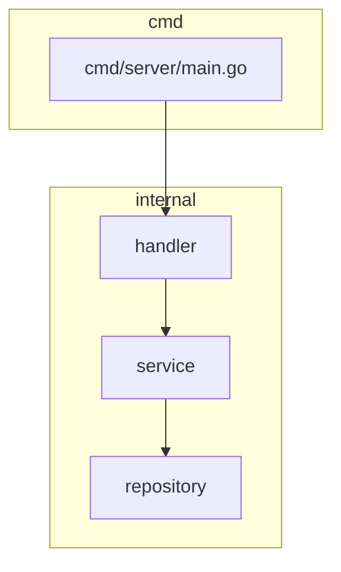

# Go 入门与环境配置

> **文件编码**：UTF-8。  
> **定位**：Go 后端路线 **第 1 步**——在 Windows 上安装当前稳定版 Go（本机为 1.26.5）、配置 GOPROXY、理解 go mod、跑通 Hello World 与标准项目布局。
> **前置**：[00 学习路线图](./00-学习路线图与说明.md) · Git/Linux 建议在 Day 1～4 并行。  
> **下一章**：[02 Go 基础语法与复合类型](./02-Go基础语法与复合类型.md)

---

## 1. 前置要求与快速总览

### 1.1 你需要提前知道什么

| 水平 | 建议 |
|------|------|
| 完全零基础 | 先会打开 PowerShell、会 `cd`/`mkdir`；Git 可 Day 1 并行 |
| 有 C++/Java | 重点看 **go mod vs Maven/npm**、**无分号、导出靠大写** |
| ACM 背景 | 0.5～1 天过完本章，重点 **项目布局** 与 `go test` 习惯 |

**最低门槛**：Windows 10/11，能下载安装包，有 ~500MB 磁盘空间。

### 1.2 手把手总览：30 分钟跑通环境

| 步骤 | 你的动作 | 预期看到什么 | 若不对 |
|------|----------|--------------|--------|
| 1 | 下载安装当前稳定版 Go MSI | 安装向导完成 | 重新下载官方 MSI |
| 2 | 新开 PowerShell，`go version` | `go version go1.26.5 windows/amd64` | 命令不存在见 §9 报错表 #1；版本旧见 #2 |
| 3 | `go env GOPROXY` | 若空则设置代理（§3.2） | 见 #3 |
| 4 | `mkdir F:\study\code\go-daily\hello` | 目录存在 | 权限问题换盘符 |
| 5 | 写 `main.go`（§7.1） | 文件保存为 UTF-8 | 中文乱码见 #7 |
| 6 | `go run .` | `Hello, Go!` | 见 #4 |
| 7 | VS Code 装 Go 插件（§4.1） | gopls 就绪 | 见 #5 |

---

## 2. 安装当前稳定版 Go（Windows）

### 2.1 下载与安装

**术语（Go toolchain）**：Go 官方提供的编译器、标准库与工具（`go`、`gofmt`、`go test`）的集合。

1. 打开 https://go.dev/dl/
2. 下载 **Windows amd64 MSI**（当前本机使用 `go1.26.5.windows-amd64.msi`）
3. 默认安装路径：`C:\Program Files\Go`
4. 安装程序会自动把 `C:\Program Files\Go\bin` 加入 **PATH**

**版本选择注意**：学习用当前稳定版即可；公司项目可能仍使用较旧版本，必须以项目的 `go.mod`、CI 和构建镜像为准。新版本工具链可以构建声明较低 Go 版本的模块，但不能在代码中随意使用该模块语言版本不支持的语法/API。

**Windows + WSL 并存**：可以各装一份、互不影响——WSL 内单独 `apt install golang` 或安装官方 tar.gz；部署类练习建议放在 WSL 做。

### 2.2 验证安装

```powershell
go version
go env GOROOT GOPATH GO111MODULE GOPROXY
```

**预期输出**：

```text
go version go1.26.5 windows/amd64
```

| 变量 | 含义 | 典型值 |
|------|------|--------|
| **GOROOT** | Go 安装目录 | `C:\Program Files\Go` |
| **GOPATH** | 旧模式工作区；mod 时代主要放 `pkg/mod` 缓存 | `C:\Users\你\go` |
| **GO111MODULE** | 模块模式 | `on` |
| **GOPROXY** | 模块下载代理 | 建议设国内镜像 |

**注意**：GOROOT 和 GOPATH 一般**不用手动设置**——MSI 装好后 GOROOT 自动指向安装目录，GOPATH 默认 `C:\Users\你\go`。

---

## 3. 配置 GOPROXY 与环境变量

### 3.1 为什么需要 GOPROXY

**术语（GOPROXY）**：Go module 的 **HTTP 代理**，加速从 `proxy.golang.org` 拉取依赖；国内直连常超时。

**生活类比**：npm 用淘宝镜像；Go 用 `goproxy.cn`。

### 3.2 永久设置（PowerShell）

```powershell
go env -w GOPROXY=https://goproxy.cn,direct
go env -w GOSUMDB=sum.golang.google.cn
```

`direct` 表示代理找不到时直连源站。

### 3.3 可选：私有模块

```powershell
go env -w GOPRIVATE=github.com/你的私有组织/*
```

---

## 4. VS Code / GoLand 配置

编辑器不限：VS Code、GoLand 或纯终端均可，但都需要 **gopls**（或等价的补全/诊断体验）。

### 4.1 VS Code（推荐轻量）

| 步骤 | 动作 | 预期 |
|------|------|------|
| 1 | 安装扩展 **Go**（Google） | 提示安装 gopls |
| 2 | 允许安装 **gopls、dlv** | 右下角无报错 |
| 3 | 设置 `editor.formatOnSave: true` | 保存自动 gofmt |
| 4 | 打开 `go-daily` 文件夹 | Import 可跳转 |

### 4.2 GoLand

- 新建项目选 **Go Modules**
- `Settings → Go → GOPATH` 一般默认即可
- 内置 gopls，调试配置一键生成

### 4.3 常用命令行工具

```powershell
go install golang.org/x/tools/gopls@latest
go install github.com/golangci/golangci-lint/cmd/golangci-lint@latest
```

**注意**：`go install` 的二进制默认放进 `GOPATH\bin`（若设置了可选变量 **GOBIN** 则放 GOBIN）；把该目录加入 PATH，上面装的 `gopls`、`golangci-lint` 才能在任意终端直接调用。

---

## 5. go mod 依赖管理

### 5.1 核心概念

**术语（Go Module）**：以 **`go.mod`** 为根的依赖单元，类似 `package.json` / `pom.xml`。

**为什么不再用 GOPATH 放代码**：Go 1.11 之前所有项目必须放在 `GOPATH/src` 的固定目录结构下，依赖没有版本概念、全局共享一份；go mod 让每个项目自带一份「依赖清单」（`go.mod`），项目可放任意目录，依赖有精确版本与校验和——这就是 Go 1.11+ 官方推荐 go mod 的原因。

```powershell
cd F:\study\code\go-daily\hello
go mod init github.com/yourname/go-daily
```

生成 `go.mod`：

```go
module github.com/yourname/go-daily

go 1.26.5
```

**module 命名**：module 路径不强制与 GitHub 仓库一致，但**推荐一致**（`github.com/用户名/项目名`），以后发布后别人 `go get` 时路径才对得上。

### 5.2 常用命令

| 命令 | 作用 |
|------|------|
| `go mod init <module路径>` | 初始化模块 |
| `go get pkg@version` | 添加/升级依赖 |
| `go mod tidy` | 增删 `go.mod` 中 unused 依赖 |
| `go mod download` | 下载依赖到缓存 |
| `go list -m all` | 列出所有模块版本 |

**区分 `go get -u` 与 `go mod tidy`**：`go get -u`（如 `go get -u ./...`）会把依赖**升级**到较新版本；`go mod tidy` 只根据代码中的 import **增删** `go.mod`/`go.sum` 记录，不升级版本。日常整理用 tidy，主动升级依赖才用 `-u`。

另有 `go mod vendor`：把依赖复制进 `vendor/` 目录用于离线构建，本阶段了解即可。

### 5.3 go.sum 是什么

**go.sum** 记录依赖模块的 **加密校验和**，保证可重复构建；**应提交 Git**，不是垃圾文件。

---

## 6. 项目目录布局

### 6.1 小练习：单文件

```
hello/
├── go.mod
└── main.go
```

### 6.2 标准工程布局（shorturl 预告）

**术语（Standard Go Project Layout）**：社区惯例（非官方强制），便于协作与面试讲解。

```
shorturl/
├── cmd/
│   └── server/
│       └── main.go       # 程序入口
├── internal/             # 私有代码，外部项目不可 import
│   ├── handler/
│   ├── service/
│   └── repository/
├── pkg/                  # 可被外部引用的库
├── go.mod
└── go.sum
```


```mermaid
flowchart TB
    subgraph cmd
        MAIN[cmd/server/main.go]
    end
    subgraph internal
        H[handler]
        S[service]
        R[repository]
    end
    MAIN --> H --> S --> R
```

**为什么 `internal/`**：Go 编译器 **禁止** 外部模块 import `.../internal/...`，防止耦合。

---

## 7. Hello World 与 go run / go build

### 7.1 最小 main.go

```go
package main

import "fmt"

func main() {
	fmt.Println("Hello, Go!")
}
```

| 行 | 含义 | 改错会怎样 |
|----|------|------------|
| `package main` | 可执行程序必须是 main 包 | 改成 `package hello` 无法生成 exe |
| `import "fmt"` | 导入格式化 I/O 包 | 漏 import 编译失败 |
| `func main()` | 入口函数 | 无 main 链接失败 |

### 7.2 运行与编译

```powershell
go run .              # 编译+运行（临时）
go build -o hello.exe .   # 生成可执行文件
.\hello.exe
```

**预期**：

```text
Hello, Go!
```

**静态编译提示**：CGO 是 Go 调用 C 代码的桥梁；部署到 Linux 服务器时常用 `CGO_ENABLED=0` 关闭 CGO 做纯静态编译，得到不依赖系统 C 库的单文件可执行程序（短链项目会用到）。

### 7.3 带命令行参数

```go
package main

import (
	"fmt"
	"os"
)

func main() {
	if len(os.Args) < 2 {
		fmt.Println("usage: greet <name>")
		return
	}
	fmt.Printf("Hello, %s!\n", os.Args[1])
}
```

```powershell
go run . World
# Hello, World!
```

**注意**：参数一多，`os.Args` 手工解析就不够用了——标准库 `flag` 包可解析 `-name=value` 形式的参数。另外练习里用 `fmt.Println` 输出即可；真实项目的日志会换成 `log` 或结构化日志库（zap，后续日志章节引入）。

---

## 8. 动手练习：wc-lite 预热

为 02 章文件 IO 预热，统计文件行数：

```go
package main

import (
	"bufio"
	"fmt"
	"os"
)

func main() {
	if len(os.Args) != 2 {
		fmt.Fprintln(os.Stderr, "usage: wc-lite <file>")
		os.Exit(1)
	}
	f, err := os.Open(os.Args[1])
	if err != nil {
		fmt.Fprintln(os.Stderr, err)
		os.Exit(1)
	}
	defer f.Close()

	sc := bufio.NewScanner(f)
	lines := 0
	for sc.Scan() {
		lines++
	}
	if err := sc.Err(); err != nil {
		fmt.Fprintln(os.Stderr, err)
		os.Exit(1)
	}
	fmt.Printf("%d %s\n", lines, os.Args[1])
}
```

对 `main.go` 自身运行：

```powershell
go run . main.go
# 预期：约 30+ 行（随你编辑变化）
```

---

## 9. 常见报错与排查

| # | 现象 | 原因 | 解决 |
|---|------|------|------|
| 1 | 安装后 `go` 不是内部命令 | PATH 未生效 | 重开终端；手动加 `Go\bin` 到 PATH |
| 2 | `go version` 显示旧版本 | 旧版本未卸载干净 | 在「应用和功能」卸载旧 Go MSI 并清理 PATH 残留，重装当前稳定版 |
| 3 | `go get` 超时 | GOPROXY 未配 | `go env -w GOPROXY=https://goproxy.cn,direct` |
| 4 | `go run` 报 `cannot find package` | 未在 module 根目录 | 确认有 `go.mod`；路径含 module 名 |
| 5 | VS Code 报 gopls 失败 | 未装 gopls | `go install golang.org/x/tools/gopls@latest` |
| 6 | `main redeclared` | 同目录多个 main | 每目录一个 main 或分 cmd 子目录 |
| 7 | 中文乱码 | 终端编码非 UTF-8 | `chcp 65001`；源文件 UTF-8 |
| 8 | go.mod 中 module 路径乱写 | 随便起名 | 用 `github.com/用户名/项目名` 惯例 |
| 9 | `Access is denied` build | exe 正在运行 | 关进程再 build |
| 10 | 杀毒软件删 exe | 误报 | 加白名单或换输出目录 |

---

## 10. 练习建议

1. 初始化 `F:\study\code\go-daily`，**今天开始每天 1 commit**。
2. 把 §7、§8 代码 **手打一遍**（不要只复制）。
3. 用 Tour of Go 前 3 节对照 **变量与函数**（为 02 预习）。
4. 在 VS Code 试 **断点调试** Hello World（F5）。

**下一章预告**：**变量类型、slice 底层、map、struct**，以及指针与 defer 入门——Go 与 C++ 差异最大的部分，面试必问 slice 扩容。

---

*文档版本：v1.1 · 2026-07-26 去模板化精简（删除知识地图/时长表/闭卷自测/费曼检验/学完标准/章节衔接等板块，FAQ 技术点并入正文；原 v1.0 · 2026-07-08） · 路径：`F:\study\后端学习\Go\01-Go入门与环境配置.md`*
