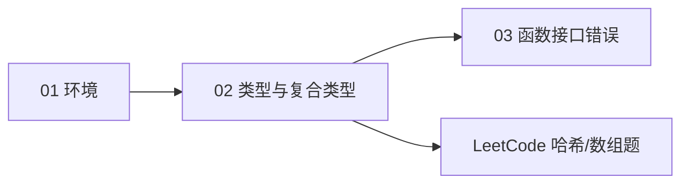
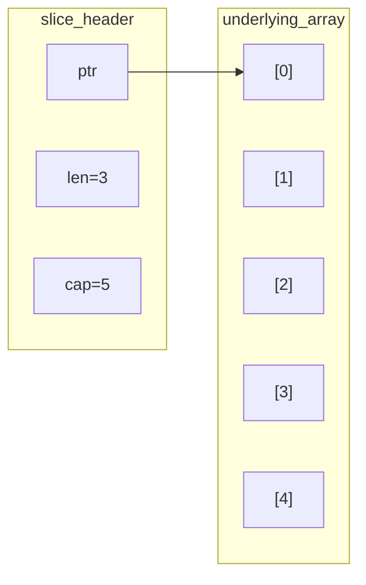

# Go 基础语法与复合类型

> **文件编码**：UTF-8。  
> **定位**：掌握 Go **基础类型、slice 底层、map、struct、指针与 defer 入门**——后端日常编码与面试八股的基础。  
> **前置**：[01 Go 入门与环境配置](./01-Go入门与环境配置.md)  
> **下一章**：[03 Go 函数接口与错误处理](./03-Go函数接口与错误处理.md)

---

## 0. 读前导读（零基础也能跟上）

### 0.1 用一句话弄懂本章

**一句话**：学会 Go 的 **「盒子怎么摆」**——值类型与引用类型的区别、slice 如何扩容、map 为何线程不安全、struct 如何组织数据。

**生活类比**：

| 概念 | 类比 |
|------|------|
| **array** | 固定长度停车场，20 个车位不能扩 |
| **slice** | 可伸缩车队，头车地址 + 当前长度 + 最大容量 |
| **map** | 带标签的储物柜，按 key 开柜 |
| **struct** | 一张表格的一行：用户名、年龄、余额 |
| **pointer** | 储物柜号码，不是柜里东西本身 |

**为什么重要**：slice/map 是 **面试最高频**；GORM 模型、JSON 序列化、Redis 缓存结构都建立在 struct + tag 之上。

---

### 0.2 你需要提前知道什么

| 水平 | 建议 |
|------|------|
| 学完 01 章 | 正常跟做 |
| C++/ACM | 重点 slice vs vector、无指针运算、map 无序 |
| Java | 对比 ArrayList/HashMap；Go 无泛型集合（1.18+ 有泛型但 slice/map 仍主流） |

---

### 0.3 本章知识地图（学完后应能勾选全部 ☐→☑）

- [ ] 声明变量：`var`、`:=`、`const`、`iota`
- [ ] 解释 **array vs slice** 与 slice 三字段底层
- [ ] 熟练使用 `append`、`copy`、切片表达式 `[low:high:max]`
- [ ] 创建/遍历 map，理解 **零值与 ok-idiom**
- [ ] 定义 struct、嵌入字段、json tag
- [ ] 使用 `*` 与 `&`，理解 **值拷贝 vs 指针**
- [ ] 写出 `for`/`range` 常见坑（map 无序、slice 值拷贝）
- [ ] 理解 **defer 入门**（详细见 03 章）
- [ ] 完成词频统计练习
- [ ] 闭卷自测 ≥ 8/10

---

### 0.4 建议学习时长与节奏

| 天 | 内容 | 练习 |
|----|------|------|
| D5 下午 | §1～§2 类型与变量 | Tour 基础 |
| D6 上午 | §3 slice 深入 | append 扩容实验 |
| D6 下午 | §4～§5 map/struct | 词频统计 |
| D6 晚上 | §6～§7 指针/for/defer | LeetCode 1 题 Go |

**对应总计划**：W1 Day 5～6。

---

### 0.5 学完本章你能做什么

1. 不用查资料写 **词频统计**（map + slice 排序可选）。
2. 白板画出 **slice 底层 `{ptr,len,cap}`**。
3. 解释 **为什么 map 并发写会 panic**。
4. 定义带 `json:"username"` tag 的 User struct。

---

### 0.6 手把手：词频统计 15 分钟

| 步骤 | 动作 | 预期 | 若不对 |
|------|------|------|--------|
| 1 | 新建 `wordcount/main.go` | 目录存在 | 01 章 go mod |
| 2 | 粘贴 §9 完整代码 | 编译无错 | 见 §10 报错表 |
| 3 | 准备 `test.txt` 两行重复词 | 文件 UTF-8 | 乱码见 #7 |
| 4 | `go run . test.txt` | 打印各词计数 | 路径错见 #2 |

---

## 本章与上一章的关系

[01 章](./01-Go入门与环境配置.md) 配好工具链；本章开始 **写真正的 Go 程序逻辑**。03 章会在 struct 上挂 **方法、interface、error**。



---

## 1. 基础类型与变量

### 1.1 预声明类型

| 类别 | 类型 | 零值 | 备注 |
|------|------|------|------|
| 布尔 | `bool` | `false` | |
| 字符串 | `string` | `""` | **不可变** UTF-8 |
| 整型 | `int`, `int8`…`int64`, `uint`… | `0` | `int` 随平台 32/64 位 |
| 浮点 | `float32`, `float64` | `0` | |
| 字节/符文 | `byte`(=uint8), `rune`(=int32) | `0` | 处理 Unicode |

**术语（rune）**：Go 中表示 **一个 Unicode 码点**；遍历 string 用 `range` 得到 rune。

### 1.2 变量声明

```go
var age int = 20
var name = "alice"      // 推断 string
country := "CN"         // 短声明，函数内常用

const Pi = 3.14159
const (
	Sunday = iota // 0
	Monday        // 1
)
```

| 方式 | 场景 |
|------|------|
| `var x T` | 包级、需零值 |
| `:=` | 函数内短声明 |
| `const` / `iota` | 枚举常量 |

### 1.3 流程控制

Go **只有 `for`**，无 while：

```go
for i := 0; i < 10; i++ { /* ... */ }

sum := 0
for sum < 1000 {
	sum += sum
}

for k, v := range m { /* map/slice/string */ }

switch day {
case Sunday, Saturday:
	// 自动 break
default:
}
```

---

## 2. array 与 slice

### 2.1 array：值类型、定长

```go
var a [3]int = [3]int{1, 2, 3}
b := [...]int{4, 5, 6} // 编译器数长度
```

**array 赋值 = 整块拷贝**，很少直接使用；多用 **slice**。

### 2.2 slice 底层结构 ⭐

**术语（slice）**：对底层 **array 的引用视图**，含指针、长度、容量。

```text
type slice struct {
    ptr *T    // 指向底层数组某元素
    len int   // 当前元素个数
    cap int   // 从 ptr 起底层数组可用容量
}
```



### 2.3 创建与切片

```go
s := make([]int, 0, 10) // len=0 cap=10
s = append(s, 1, 2, 3)
sub := s[1:3]   // [2 3], len=2
sub2 := s[1:3:3] // cap 也被截断
copy(dst, src)
```

### 2.4 扩容规则（面试必背）

当 `len+新增 > cap` 时：

1. 若旧 cap < 256，新 cap ≈ **2 倍**
2. 否则按 **1.25 倍** 增长（Go 1.18+ 有微调，口述「倍数 + 内存对齐」即可）
3. **扩容可能触发新数组分配 + 拷贝**，旧 slice 仍可能指向旧数组

**动手验证**：

```go
s := make([]int, 0, 2)
addr := func(x []int) uintptr {
	return uintptr(unsafe.Pointer(&x[0]))
}
// 多次 append 观察 cap 与底层地址变化（需 import "unsafe"，仅实验用）
```

### 2.5 常见坑

| 坑 | 示例 | 后果 |
|----|------|------|
| 共享底层 | `sub := s[:2]` 后改 `sub[0]` | `s[0]` 也变 |
| append 误判 | `append(sub, 99)` cap 够 | 可能改原 slice |
| nil slice | `var s []int` | `len=0 cap=0`，可 append |

---

## 3. map

### 3.1 创建与使用

```go
m := make(map[string]int)
m["go"] = 1
m["rust"] = 2

v, ok := m["java"]
if !ok {
	// 不存在
}
delete(m, "go")

for k, v := range m {
	_ = k
	_ = v
}
```

**术语（map）**：哈希表实现，**遍历顺序随机**，**非线程安全**。

### 3.2 零值与 make

| 状态 | 读 | 写 |
|------|----|----|
| `var m map[K]V` nil | 返回零值 | **panic** |
| `make(map[K]V)` | 正常 | 正常 |

### 3.3 并发安全

并发写 map **直接 panic**；用 `sync.Mutex` 或 `sync.Map`（见 04 章）。

---

## 4. struct

### 4.1 定义与字面量

```go
type User struct {
	ID       int64  `json:"id"`
	Username string `json:"username"`
	Active   bool   `json:"-"`
}

u := User{ID: 1, Username: "alice"}
p := &User{Username: "bob"} // 指针字面量
```

**术语（struct tag）**：字段后的反引号字符串，供 `encoding/json`、`gorm` 等反射读取。

### 4.2 嵌入（组合）

```go
type Account struct {
	User
	Balance float64
}

a := Account{User: User{Username: "alice"}, Balance: 100}
fmt.Println(a.Username) //  promoted field
```

Go **无 class 继承**，用 **嵌入实现组合**。

---

## 5. 指针基础

```go
x := 42
p := &x   // 取地址
fmt.Println(*p) // 解引用
*p = 100
```

| 对比 C++ | Go |
|----------|-----|
| 指针运算 | **禁止** |
| 默认传参 | **值拷贝** |
| 大 struct 修改 | 用 **指针接收者**（03 章） |

```go
func increment(n int) {
	n++ // 不影响外部
}
func incrementPtr(n *int) {
	*n++
}
```

---

## 6. for 与 range

```go
nums := []int{10, 20, 30}
for i, v := range nums {
	_ = i
	_ = v
}

// 只要值
for _, v := range nums { _ = v }

// string → rune
for i, r := range "Go语言" {
	_, _ = i, r
}
```

**注意**：`range` 的 `v` 是 **拷贝**；改 `v` 不改 slice 元素，需 `nums[i] = x`。

---

## 7. defer 入门

**术语（defer）**：函数 return 前 **LIFO** 执行延迟调用；常用于关文件、解锁。

```go
f, err := os.Open("a.txt")
if err != nil { return err }
defer f.Close()
// 使用 f...
```

详细执行顺序（与 return、命名返回值）见 [03 章](./03-Go函数接口与错误处理.md) §5。

---

## 8. 零值与可见性

| 概念 | 规则 |
|------|------|
| 零值 | 未初始化变量可用，数值 0、引用 nil |
| 导出 | **首字母大写** 包外可见 |
| 小写 | 包内私有 |

---

## 9. 动手：词频统计（完整）

```go
package main

import (
	"bufio"
	"fmt"
	"os"
	"strings"
)

func main() {
	if len(os.Args) != 2 {
		fmt.Fprintln(os.Stderr, "usage: wordcount <file>")
		os.Exit(1)
	}
	f, err := os.Open(os.Args[1])
	if err != nil {
		fmt.Fprintln(os.Stderr, err)
		os.Exit(1)
	}
	defer f.Close()

	freq := make(map[string]int)
	sc := bufio.NewScanner(f)
	for sc.Scan() {
		line := sc.Text()
		for _, w := range strings.Fields(line) {
			w = strings.ToLower(strings.Trim(w, ".,!?\"'"))
			if w == "" {
				continue
			}
			freq[w]++
		}
	}
	if err := sc.Err(); err != nil {
		fmt.Fprintln(os.Stderr, err)
		os.Exit(1)
	}
	for word, count := range freq {
		fmt.Printf("%s: %d\n", word, count)
	}
}
```

**test.txt**：

```text
Go is great
go is fun
```

**预期输出**（顺序不定）：

```text
go: 2
is: 2
great: 1
fun: 1
```

---

## 10. 常见报错与排查（≥8 条）

| # | 现象 | 原因 | 解决 |
|---|------|------|------|
| 1 | `index out of range` | slice 下标 ≥ len | 检查 len；循环 `< len` |
| 2 | `assignment to entry in nil map` | 未 make 就写 | `m := make(map[...]...)` |
| 3 | `concurrent map writes` | 多 goroutine 写 map | Mutex 或 04 章 sync.Map |
| 4 | append 后原 slice 变了 | 共享底层数组 | 用 `copy` 或 `append([]T(nil), s...)` |
| 5 | struct tag 不生效 | 字段未导出 | JSON 需 **大写字段** 或自定义 Marshal |
| 6 | `invalid argument: index` | 对 string 改字节 | string 不可变，转 []byte/rune |
| 7 | 中文按字节截断 | len(string) 是字节数 | 用 `utf8.RuneCountInString` |
| 8 | `:` 短声明报错 | 包级不能用 := | 包级用 var |
| 9 | range 修改无效 | 改的是拷贝 v | 用索引 `s[i]` |
| 10 | defer 闭包陷阱 | 循环 defer 捕获变量 | 传参 `defer func(x T){}(v)` |

---

## 11. FAQ（≥10）

### Q1：slice 和 array 面试怎么说？

array 定长值类型；slice 是描述符 `{ptr,len,cap}` 引用底层数组，动态扩容。

### Q2：make 和 new 区别？

`make` 用于 **slice、map、chan**，返回已初始化引用；`new(T)` 分配零值，返回 `*T`。

### Q3：map  key 能是 slice 吗？

不能；key 必须 **可比较**（无 slice/map/func）。

### Q4：struct 能比较吗？

字段都可比较时才能 `==`；含 slice/map 不可。

### Q5：string 底层？

只读字节序列；改 string 需转 `[]byte` 或拼接。

### Q6：为什么 Go 无 while？

语法极简，`for` 三种形式覆盖 while。

### Q7：iota 干什么用？

const 块内自增枚举，常用于状态码、位掩码。

### Q8：json tag 里 omitempty？

零值字段序列化时 **省略**。

### Q9：指针 nil 解引用？

panic；使用前判 nil。

### Q10：词频题 map 遍历无序怎么办？

要排序：把 key 放进 slice，`sort.Strings` 再输出。

### Q11：和 [数据结构 02](../数据结构/02-数组与字符串.md) 关系？

理论看数据结构；本章是 **Go API 与底层**。

### Q12：LeetCode 用 Go 注意什么？

`append` 预分配 cap；map 存在 O(1)；注意 **slice 共享底层** 陷阱。

---

## 12. 闭卷自测（≥10）

1. slice 底层三个字段是什么？
2. append 触发扩容时会发生什么？
3. nil map 和空 map（make）写入区别？
4. struct tag 给谁用？举例。
5. Go 指针与 C++ 指针两大不同？
6. range slice 时改 v 为何无效？
7. string 为什么不可变？
8. 嵌入 struct 字段如何访问？
9. defer 在函数何时执行（入门版）？
10. 词频统计为什么用 map？

<details>
<summary>自测参考答案</summary>

1. ptr、len、cap。
2. 分配更大底层数组（或首次分配），拷贝旧元素，更新 slice 头。
3. nil map 写 panic；make 的可写。
4. 反射库如 encoding/json；`json:"name"`。
5. 无指针运算；无指针算术。
6. v 是元素拷贝，应改 s[i]。
7. 安全、共享、哈希；底层只读 byte sequence。
8.  promoted，直接 `.Field`。
9. 函数 return 之前，LIFO。
10. 单词 → 计数，O(1) 更新。

</details>

---

## 13. 费曼检验

**3 分钟解释 slice 和 map 给非程序员。**

**提纲**：

1. slice = **动态数组视图**，能变长，多个 slice 可能共用一块数组。
2. map = **字典**，查单词快，但 **不能多人同时改**（要加锁）。
3. struct = **一条记录**，字段可贴标签给 JSON 用。

---

## 14. 练习建议

1. 手写 **银行账户 struct**（余额增减，先用值接收者）。
2. 实验：两个 slice `append` 观察 **共享底层**（§2.5 坑表）。
3. LeetCode **1. 两数之和**、**49. 字母异位词分组** 用 Go。
4. 阅读 [数据结构 05 哈希表](../数据结构/05-哈希表.md) 对照 map。

---

## 15. 学完标准

- [ ] 白板画 slice 底层 + 口述扩容
- [ ] 独立完成词频程序
- [ ] 解释 map 线程不安全
- [ ] 闭卷自测 ≥ 8/10

---

## 16. 章节衔接

| 上一章 | 本章 | 下一章 |
|--------|------|--------|
| [01 环境](./01-Go入门与环境配置.md) | 类型与复合类型 | [03 函数接口错误](./03-Go函数接口与错误处理.md) |

**下一章**：为 struct 添加 **方法、interface 隐式实现、error 处理**——Go 没有 exception，靠 `if err != nil`。

---

*文档版本：v1.0 · 2026-07-08 · 路径：`F:\study\后端学习\Go\02-Go基础语法与复合类型.md`*
