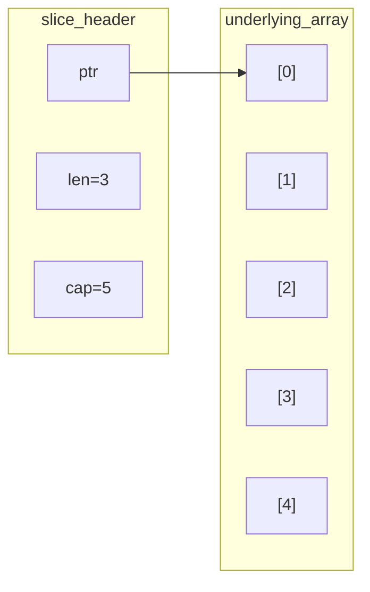

# Go 基础语法与复合类型

> **文件编码**：UTF-8。  
> **定位**：掌握 Go **基础类型、slice 底层、map、struct、指针与 defer 入门**——后端日常编码与面试八股的基础。  
> **前置**：[01 Go 入门与环境配置](./01-Go入门与环境配置.md)  
> **下一章**：[03 Go 函数接口与错误处理](./03-Go函数接口与错误处理.md)

---

## 0. 读前导读

### 0.1 用一句话弄懂本章

**一句话**：学会 Go 的 **「盒子怎么摆」**——值类型与引用类型的区别、slice 如何扩容、map 为何线程不安全、struct 如何组织数据。

**生活类比**：


| 概念          | 类比                       |
| ----------- | ------------------------ |
| **array**   | 固定长度停车场，20 个车位不能扩        |
| **slice**   | 可伸缩车队，头车地址 + 当前长度 + 最大容量 |
| **map**     | 带标签的储物柜，按 key 开柜         |
| **struct**  | 一张表格的一行：用户名、年龄、余额        |
| **pointer** | 储物柜号码，不是柜里东西本身           |


**为什么重要**：slice/map 是 **面试最高频**；GORM 模型、JSON 序列化、Redis 缓存结构都建立在 struct + tag 之上。

### 0.2 你需要提前知道什么


| 水平      | 建议                                                      |
| ------- | ------------------------------------------------------- |
| 学完 01 章 | 正常跟做                                                    |
| C++/ACM | 重点 slice vs vector、无指针运算、map 无序                         |
| Java    | 对比 ArrayList/HashMap；Go 无泛型集合（1.18+ 有泛型但 slice/map 仍主流） |


---


## 1. 基础类型与变量


### 1.1 预声明类型


| 类别    | 类型                             | 零值      | 备注                |
| ----- | ------------------------------ | ------- | ----------------- |
| 布尔    | `bool`                         | `false` |                   |
| 字符串   | `string`                       | `""`    | **不可变** UTF-8     |
| 整型    | `int`, `int8`…`int64`, `uint`… | `0`     | `int` 随平台 32/64 位 |
| 浮点    | `float32`, `float64`           | `0`     |                   |
| 字节/符文 | `byte`(=uint8), `rune`(=int32) | `0`     | 处理 Unicode        |


**术语（rune）**：Go 中表示 **一个 Unicode 码点**；遍历 string 用 `range` 得到 rune。

### 1.2 变量声明

```go
var age int = 20
var name = "alice"      // 推断 string
country := "CN"         // 短声明，函数内常用

const Pi = 3.14159
const (
	Sunday = iota // 0
	Monday        // 1
)
```


| 方式               | 场景     |
| ---------------- | ------ |
| `var x T`        | 包级、需零值 |
| `:=`             | 函数内短声明 |
| `const` / `iota` | 枚举常量   |


**iota**：在 `const` 块内从 0 起逐行自增，适合定义枚举常量与位掩码（如 `1 << iota` 依次生成 1、2、4、8），常见于状态码、权限位。


### 1.3 流程控制

Go **只有** `for`，无 while：

```go
for i := 0; i < 10; i++ { /* ... */ }

sum := 0
for sum < 1000 {
	sum += sum
}

for k, v := range m { /* map/slice/string */ }

switch day {
case Sunday, Saturday:
	// 自动 break
default:
}
```


### 1.4 `string`、`byte` 与 `rune`：长度为什么不等于字符数 ⭐

Go 的 `string` 是一段**只读字节序列**，通常装 UTF-8 文本，但语言本身不保证内容一定是合法 UTF-8。

**为什么设计成不可变**：不可变让多个变量与子串可以安全共享同一块底层字节数组而无需拷贝（如 `s[1:4]` 不复制数据）；跨 goroutine 只读访问天然并发安全；内容固定也保证哈希值稳定，string 才能可靠地作 map 的 key。需要修改内容时转 `[]byte`（发生一次拷贝）改完再转回，或用 `strings.Builder` 拼接。

```go
s := "Go语言"

fmt.Println(len(s))                    // 8：字节数，不是字符数
fmt.Println(utf8.RuneCountInString(s)) // 4：Unicode 码点数

fmt.Println([]byte(s))       // UTF-8 字节数值
fmt.Printf("%c\n", []rune(s)) // [G o 语 言]，%c 按码点显示
```


| 写法                    | 得到什么                 | 典型用途                  |
| --------------------- | -------------------- | --------------------- |
| `len(s)`              | 字节数                  | 网络协议长度、存储大小           |
| `s[i]`                | 第 `i` 个字节，类型为 `byte` | ASCII、二进制协议           |
| `for _, r := range s` | 逐个解码出的 `rune`        | 中文、Emoji 等 Unicode 文本 |
| `[]byte(s)`           | 可修改的字节切片，会发生转换/拷贝    | IO、哈希、协议处理            |
| `[]rune(s)`           | 码点切片                 | 按“字符”反转或截取            |


`range` 返回的索引仍是**该 rune 在原字符串中的字节偏移**：

```go
for i, r := range "A中B" {
	fmt.Printf("i=%d r=%c\n", i, r)
}
// i=0 A；i=1 中；i=4 B
```

注意：“一个用户看到的字符”不一定等于一个 rune，例如某些 Emoji 由多个码点组合。普通后端业务掌握 UTF-8、byte、rune 的区别即可；需要严格处理用户可见字符时再使用 Unicode 文本库。

---


## 2. array 与 slice


### 2.1 array：值类型、定长

```go
var a [3]int = [3]int{1, 2, 3}
b := [...]int{4, 5, 6} // 编译器数长度
```

**array 赋值 = 整块拷贝**，很少直接使用；多用 **slice**。

### 2.2 slice 底层结构 ⭐

**术语（slice）**：对底层 **array 的引用视图**，含指针、长度、容量。

```text
type slice struct {
    ptr *T    // 指向底层数组某元素
    len int   // 当前元素个数
    cap int   // 从 ptr 起底层数组可用容量
}
```


```mermaid
flowchart LR
    subgraph slice_header
        PTR[ptr]
        LEN[len=3]
        CAP[cap=5]
    end
    subgraph underlying_array
        A0["[0]"]
        A1["[1]"]
        A2["[2]"]
        A3["[3]"]
        A4["[4]"]
    end
    PTR --> A0
```


### 2.3 创建与切片

```go
s := make([]int, 0, 10) // len=0 cap=10
s = append(s, 1, 2, 3)
sub := s[1:3]   // [2 3], len=2
sub2 := s[1:3:3] // cap 也被截断
copy(dst, src)
```

**make 与 new 的区别**（面试常问）：`make` 只用于 slice、map、chan，完成内部结构初始化后返回**类型本身**；`new(T)` 可用于任意类型，分配一块零值内存并返回 `*T`。日常几乎总是用 `make` 或字面量，`new` 很少出现。

```go
p := new(int)       // *int，指向值 0
s2 := make([]int, 3) // 已初始化、len=3 的 []int
_ = p
_ = s2
```


### 2.4 扩容规则（面试必背）

当 `len+新增 > cap` 时：

1. 如果一次 `append` 所需容量已经超过旧容量的 2 倍，运行时会优先以“至少装得下”为目标，而不是机械翻倍。
2. 对较小 slice，容量通常接近 **2 倍增长**；旧容量达到约 256 后，公式会平滑过渡，增长率逐渐趋近 **1.25 倍**。
3. 运行时还会按元素大小和内存分配器的 size class **向上取整**，因此最终 `cap` 不保证正好是 2 倍或 1.25 倍。
4. 扩容会分配新数组并复制旧元素；扩容前后两个 slice 之后可能指向不同数组。

因此，面试不要把某个固定阈值和倍率说成语言规范。更准确的表述是：**具体策略属于 runtime 实现细节，核心语义是容量不足时分配更大的底层数组并复制；可预估规模时应提前分配容量。**

**动手验证**：

```go
s := make([]int, 0, 1)
for i := 0; i < 20; i++ {
	oldCap := cap(s)
	s = append(s, i)
	if cap(s) != oldCap {
		fmt.Printf("len=%d cap: %d -> %d\n", len(s), oldCap, cap(s))
	}
}
```

预估写入 10 万个元素时优先：`make([]T, 0, 100_000)`，可以减少扩容次数、内存复制和 GC 压力。

### 2.5 常见坑


| 坑         | 示例                         | 后果                     |
| --------- | -------------------------- | ---------------------- |
| 共享底层      | `sub := s[:2]` 后改 `sub[0]` | `s[0]` 也变              |
| append 误判 | `append(sub, 99)` cap 够    | 可能改原 slice             |
| nil slice | `var s []int`              | `len=0 cap=0`，可 append |


### 2.6 小切片引用大数组：隐蔽的内存保留

slice 只保存指针、长度、容量。即使只留下很小的一段，只要它仍引用原数组，整个大数组通常都不能被 GC 回收。

```go
func firstKB(data []byte) []byte {
	return data[:1024] // 若 data 是 100MB，返回值仍可能让 100MB 数组存活
}

func firstKBCopy(data []byte) []byte {
	out := make([]byte, 1024)
	copy(out, data[:1024])
	return out // 只保留新的 1KB 数组
}
```

Go 1.21+ 也可以写 `out := slices.Clone(data[:1024])`。这类问题常见于读取大文件、解析大 HTTP body 后把很小字段长期缓存。

---


## 3. map


### 3.1 创建与使用

```go
m := make(map[string]int)
m["go"] = 1
m["rust"] = 2

v, ok := m["java"]
if !ok {
	// 不存在
}
delete(m, "go")

for k, v := range m {
	_ = k
	_ = v
}
```

**术语（map）**：哈希表实现，**遍历顺序随机**，**非线程安全**。

### 3.2 零值与 make


| 状态                  | 读    | 写         |
| ------------------- | ---- | --------- |
| `var m map[K]V` nil | 返回零值 | **panic** |
| `make(map[K]V)`     | 正常   | 正常        |


### 3.3 并发安全

并发写 map **直接 panic**；用 `sync.Mutex` 或 `sync.Map`（见 04 章）。

### 3.4 map 的底层思路与扩容边界 ⭐

可以把 map 理解为“哈希值定位桶，再在桶内寻找 key”。当前 runtime 的具体字段和桶组织可能随版本变化，面试重点应放在稳定结论：

1. key 先经过哈希函数得到位置；冲突时需要在同一组候选位置继续比较。
2. 元素增多或冲突严重时，map 会渐进式迁移到更大的存储结构；一次写操作可能顺带搬迁一部分旧数据。
3. 因为扩容和元素移动，**map 元素不可取地址**：`&m[k]` 不合法。
4. 遍历顺序不稳定，不能把 map range 顺序用于业务排序或测试断言。
5. 删除元素不意味着进程内存立即下降；runtime 可能保留已申请的桶供后续复用。

```go
type User struct{ Age int }
m := map[string]User{"alice": {Age: 18}}

// m["alice"].Age++ // 编译错误：map 索引结果不可寻址
u := m["alice"]
u.Age++
m["alice"] = u
```

**哪些类型能做 key？** 必须可比较：整数、字符串、指针、channel、interface（动态值也必须可比较）、仅含可比较字段的 array/struct 可以；slice、map、func 不可以。浮点数虽然可比较，但 `NaN != NaN`，通常不适合作 key。

**预分配**：已知大概元素数时使用 `make(map[K]V, n)`，hint 不是硬容量上限，但能减少扩容成本。

---


## 4. struct


### 4.1 定义与字面量

```go
type User struct {
	ID       int64  `json:"id"`
	Username string `json:"username"`
	Email    string `json:"email,omitempty"` // 零值时序列化省略该字段
	Active   bool   `json:"-"`               // 永不序列化
}

u := User{ID: 1, Username: "alice"}
p := &User{Username: "bob"} // 指针字面量
```

**术语（struct tag）**：字段后的反引号字符串，供 `encoding/json`、`gorm` 等反射读取。常用 json tag 选项：`json:"name"` 重命名；`json:"name,omitempty"` 在字段为**零值**时省略输出；`json:"-"` 完全忽略该字段。

**struct 的可比较性**：所有字段都可比较时，struct 可直接用 `==`（逐字段比较），也因此能作 map 的 key；只要含 slice、map 或 func 字段，`==` 直接编译报错。

### 4.2 嵌入（组合）

```go
type Account struct {
	User
	Balance float64
}

a := Account{User: User{Username: "alice"}, Balance: 100}
fmt.Println(a.Username) //  promoted field
```

Go **无 class 继承**，用 **嵌入实现组合**。

### 4.3 struct 内存对齐：字段顺序为什么会影响大小

CPU 通常更高效地访问按自然边界对齐的数据，因此编译器可能在字段之间插入 padding（填充字节）。

```go
type A struct {
	Flag bool  // 1 byte + padding
	ID   int64 // 8 bytes
	Code int32 // 4 bytes + tail padding
}

type B struct {
	ID   int64
	Code int32
	Flag bool
}

fmt.Println(unsafe.Sizeof(A{}), unsafe.Sizeof(B{}))
```

在常见 64 位平台上，`B` 往往比 `A` 更紧凑。实际大小应以目标平台的 `unsafe.Sizeof` 为准。

工程原则：

- 普通业务 struct 优先可读性，不要为了省几个字节打乱领域含义。
- 数百万对象、缓存条目或性能敏感结构才值得测量并调整字段顺序。
- `unsafe.Sizeof` 不包含指针指向的数据，例如 string 内容、slice 底层数组和 map 元素。

---


## 5. 指针基础

```go
x := 42
p := &x   // 取地址
fmt.Println(*p) // 解引用
*p = 100
```


| 对比 C++      | Go                |
| ----------- | ----------------- |
| 指针运算        | **禁止**            |
| 默认传参        | **值拷贝**           |
| 大 struct 修改 | 用 **指针接收者**（03 章） |


```go
func increment(n int) {
	n++ // 不影响外部
}
func incrementPtr(n *int) {
	*n++
}
```

**注意**：解引用 `nil` 指针会 panic（`runtime error: invalid memory address or nil pointer dereference`）。对可能为 nil 的指针（如查询未命中时返回的 `*User`），使用前先 `if p != nil` 判断。

---


## 6. for 与 range

```go
nums := []int{10, 20, 30}
for i, v := range nums {
	_ = i
	_ = v
}

// 只要值
for _, v := range nums { _ = v }

// string → rune
for i, r := range "Go语言" {
	_, _ = i, r
}
```

**注意**：`range` 的 `v` 是 **拷贝**；改 `v` 不改 slice 元素，需 `nums[i] = x`。

---


## 7. defer 入门

**术语（defer）**：函数 return 前 **LIFO** 执行延迟调用；常用于关文件、解锁。

```go
f, err := os.Open("a.txt")
if err != nil { return err }
defer f.Close()
// 使用 f...
```

详细执行顺序（与 return、命名返回值）见 [03 章](./03-Go函数接口与错误处理.md) §6。

---


## 8. 零值与可见性


| 概念  | 规则                   |
| --- | -------------------- |
| 零值  | 未初始化变量可用，数值 0、引用 nil |
| 导出  | **首字母大写** 包外可见       |
| 小写  | 包内私有                 |


---


## 9. 动手：词频统计（完整）

**跑通步骤（约 15 分钟）**：


| 步骤  | 动作                     | 预期       | 若不对          |
| --- | ---------------------- | -------- | ------------ |
| 1   | 新建 `wordcount/main.go` | 目录存在     | 见 01 章 go mod |
| 2   | 粘贴下方完整代码               | 编译无错     | 见 §10 报错表    |
| 3   | 准备 `test.txt` 两行重复词    | 文件 UTF-8 | 乱码见 §10 #7   |
| 4   | `go run . test.txt`    | 打印各词计数   | 检查文件路径与参数    |


```go
package main

import (
	"bufio"
	"fmt"
	"os"
	"strings"
)

func main() {
	if len(os.Args) != 2 {
		fmt.Fprintln(os.Stderr, "usage: wordcount <file>")
		os.Exit(1)
	}
	f, err := os.Open(os.Args[1])
	if err != nil {
		fmt.Fprintln(os.Stderr, err)
		os.Exit(1)
	}
	defer f.Close()

	freq := make(map[string]int)
	sc := bufio.NewScanner(f)
	for sc.Scan() {
		line := sc.Text()
		for _, w := range strings.Fields(line) {
			w = strings.ToLower(strings.Trim(w, ".,!?\"'"))
			if w == "" {
			    continue
			}
			freq[w]++
		}
	}
	if err := sc.Err(); err != nil {
		fmt.Fprintln(os.Stderr, err)
		os.Exit(1)
	}
	for word, count := range freq {
		fmt.Printf("%s: %d\n", word, count)
	}
}
```

**test.txt**：

```text
Go is great
go is fun
```

**预期输出**（顺序不定）：

```text
go: 2
is: 2
great: 1
fun: 1
```

**需要按序输出怎么办**：map 遍历无序，若要求稳定输出，把 key 收集进 slice 排序后再打印（需 `import "sort"`）：

```go
words := make([]string, 0, len(freq))
for w := range freq {
	words = append(words, w)
}
sort.Strings(words)
for _, w := range words {
	fmt.Printf("%s: %d\n", w, freq[w])
}
```

---


## 10. 常见报错与排查（≥8 条）


| #   | 现象                               | 原因                | 解决                                  |
| --- | -------------------------------- | ----------------- | ----------------------------------- |
| 1   | `index out of range`             | slice 下标 ≥ len    | 检查 len；循环 `< len`                   |
| 2   | `assignment to entry in nil map` | 未 make 就写         | `m := make(map[...]...)`            |
| 3   | `concurrent map writes`          | 多 goroutine 写 map | Mutex 或 04 章 sync.Map               |
| 4   | append 后原 slice 变了               | 共享底层数组            | 用 `copy` 或 `append([]T(nil), s...)` |
| 5   | struct tag 不生效                   | 字段未导出             | JSON 需 **大写字段** 或自定义 Marshal        |
| 6   | `invalid argument: index`        | 对 string 改字节      | string 不可变，转 []byte/rune            |
| 7   | 中文按字节截断                          | len(string) 是字节数  | 用 `utf8.RuneCountInString`          |
| 8   | `:` 短声明报错                        | 包级不能用 :=          | 包级用 var                             |
| 9   | range 修改无效                       | 改的是拷贝 v           | 用索引 `s[i]`                          |
| 10  | defer 闭包陷阱                       | 循环 defer 捕获变量     | 传参 `defer func(x T){}(v)`           |


---


## 11. 练习建议

1. 手写 **银行账户 struct**（余额增减，先用值接收者）。
2. 实验：两个 slice `append` 观察 **共享底层**（§2.5 坑表）。
3. LeetCode **1. 两数之和**、**49. 字母异位词分组** 用 Go。
4. 阅读 [数据结构 05 哈希表](../数据结构/03-哈希表/README.md) 对照 map。

---

**下一章**：[03 Go 函数接口与错误处理](./03-Go函数接口与错误处理.md)——为 struct 添加 **方法、interface 隐式实现、error 处理**；Go 没有 exception，靠 `if err != nil`。

*文档版本：v1.1 · 2026-07-26（精简：删除知识地图/自测/费曼等模板板块，FAQ 技术要点并入正文）· 路径：*`F:\study\后端学习\Go\02-Go基础语法与复合类型.md`
