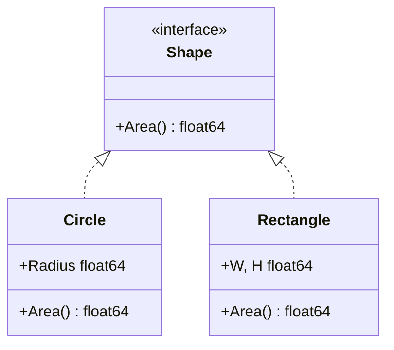

# Go 函数、接口与错误处理

> **文件编码**：UTF-8。  
> **定位**：掌握 **函数、方法、interface 隐式实现、error 惯用法、defer/panic/recover**——Go 抽象与健壮性的核心。  
> **前置**：[02 Go 基础语法与复合类型](./02-Go基础语法与复合类型.md)  
> **下一章**：[04 Go 并发编程](./04-Go并发编程goroutine与channel.md)

---

## 0. 读前导读（零基础也能跟上）

### 0.1 用一句话弄懂本章

**一句话**：Go 用 **函数 + 方法** 组织逻辑，用 **interface 隐式多态** 解耦，用 **`error` 返回值** 代替 try/catch 处理失败。

**生活类比**：

| 概念 | 类比 |
|------|------|
| **多返回值** | 办事回执：结果 + 是否成功 |
| **interface** | 插座标准：只要两脚圆头就能插，不用登记「我实现了插座协议」 |
| **error** | 快递异常单：正常货签收，异常走 if err |
| **defer** | 离开房间前关灯锁门（最后做的几件固定事） |
| **panic/recover** | 火灾报警 vs 常备灭火器（极少业务用 panic） |

---

### 0.2 你需要提前知道什么

| 水平 | 建议 |
|------|------|
| 学完 02 章 | 正常跟做 |
| Java | interface 需 `implements`；Go **隐式** |
| C++ | 无异常为主；对比 RAII 与 defer |

---

### 0.3 本章知识地图（学完后应能勾选全部 ☐→☑）

- [ ] 编写多返回值、命名返回值函数
- [ ] 为 struct 定义 **值/指针接收者** 方法
- [ ] 定义 interface 并实现 **Shape 面积** 多态
- [ ] 使用 `if err != nil`、`fmt.Errorf`、`errors.Is/As`
- [ ] 解释 **defer LIFO** 与 return 顺序
- [ ] 说明 **panic 何时用、何时禁用**
- [ ] 完成简易 **银行账户** 或 **Shape** demo
- [ ] 闭卷自测 ≥ 8/10

---

### 0.4 建议学习时长与节奏

| 时段 | 内容 |
|------|------|
| D7 上午 | §1～§3 函数与方法 |
| D7 下午 | §4 interface |
| D7 晚上 | §5～§7 error/defer/panic |
| 复盘 | Shape demo + LC 20 有效括号 |

**对应总计划**：W1 Day 7。

---

### 0.5 学完本章你能做什么

1. 写 `func Divide(a, b int) (int, error)` 并正确处理 b=0。
2. 用 interface 让 `Circle`、`Rectangle` 统一求 `Area()`。
3. 向面试官解释 **值接收者 vs 指针接收者** 选型。

---

### 0.6 手把手：Shape 接口 10 分钟

| 步骤 | 动作 | 预期 |
|------|------|------|
| 1 | 新建 `shapes/main.go` | go mod init |
| 2 | 粘贴 §8 代码 | 编译通过 |
| 3 | `go run .` | 打印各图形面积 |
| 4 | 新增 Triangle 实现 Shape | 不改 PrintArea 函数 |

---

## 本章与上一章的关系

[02 章](./02-Go基础语法与复合类型.md) 的 struct 本章加上 **行为（方法）** 与 **契约（interface）**；错误处理贯穿之后所有 HTTP/DB 代码。



---

## 1. 函数

### 1.1 基本语法

```go
func Add(a, b int) int {
	return a + b
}

func Div(a, b int) (q int, err error) {
	if b == 0 {
		return 0, fmt.Errorf("divide by zero")
	}
	return a / b, nil
}
```

**术语（命名返回值）**：`(q int, err error)` 在函数开头已声明，return 时可 **裸 return**（慎用，降低可读性）。

### 1.2 可变参数

```go
func Sum(nums ...int) int {
	total := 0
	for _, n := range nums {
		total += n
	}
	return total
}
```

### 1.3 函数作为值

```go
var op func(int, int) int = Add
result := op(3, 4)
```

---

## 2. 方法

### 2.1 值接收者 vs 指针接收者 ⭐

```go
type Counter struct{ n int }

func (c Counter) Value() int { return c.n }      // 值：拷贝
func (c *Counter) Inc()     { c.n++ }            // 指针：改原对象

func (c Counter) BadInc() { c.n++ } // 对外部无 effect！
```

| 选型 | 何时 |
|------|------|
| **指针接收者** | 要修改接收者；struct 大避免拷贝；一致性（一个方法用指针则全系指针） |
| **值接收者** | 小不可变对象；如 `time.Time` |

### 2.2 方法与接口

只有 **导出方法**（大写开头）才能被包外 interface 满足。

---

## 3. 包与可见性

```go
// mathutil/add.go
package mathutil

func Add(a, b int) int { return a + b }   // 导出
func helper() {}                          // 包内私有
```

---

## 4. interface 隐式实现 ⭐

**术语（interface）**：**方法集合**；类型无需声明 `implements`，只要实现了全部方法即满足。

```go
type Shape interface {
	Area() float64
}

type Circle struct{ R float64 }

func (c Circle) Area() float64 {
	return 3.1415926 * c.R * c.R
}

func PrintArea(s Shape) {
	fmt.Println(s.Area())
}
```

### 4.1 空接口 any

```go
var x any = 42
v, ok := x.(int) // 类型断言
```

JSON `Unmarshal` 到 `map[string]any` 常用。

### 4.2 接口底层（面试了解）

- **iface**：带方法的 interface → `{type, data}`
- **eface**：空 interface `any` → `{type, data}`

---

## 5. error 处理 ⭐

### 5.1 惯用法

```go
f, err := os.Open(path)
if err != nil {
	return err
}
defer f.Close()
```

**不要**：

```go
// 反模式：吞错误
_ = doSomething()
```

### 5.2 创建与包装

```go
err := errors.New("not found")
err = fmt.Errorf("open %s: %w", path, err)
```

### 5.3 errors.Is 与 errors.As

```go
if errors.Is(err, os.ErrNotExist) { /* ... */ }

var pe *os.PathError
if errors.As(err, &pe) { /* ... */ }
```

Go 1.13+ **错误链** `%w` 包装。

### 5.4 自定义 error

```go
type ValidationError struct {
	Field string
	Msg   string
}

func (e *ValidationError) Error() string {
	return e.Field + ": " + e.Msg
}
```

---

## 6. defer

### 6.1 LIFO 顺序

```go
defer fmt.Println("1")
defer fmt.Println("2")
// 输出 2 然后 1
```

### 6.2 与 return 顺序 ⭐

```go
func f() (r int) {
	defer func() { r++ }()
	return 1 // 实际返回 2
}
```

执行顺序：**return 设值 → defer → 真正返回**。

### 6.3 资源释放

文件、锁、HTTP body：`defer close()` 是标准模式。

---

## 7. panic 与 recover

```go
func safeCall(fn func()) (err error) {
	defer func() {
		if r := recover(); r != nil {
			err = fmt.Errorf("panic: %v", r)
		}
	}()
	fn()
	return nil
}
```

| 场景 | 建议 |
|------|------|
| 业务错误 | 返回 **error** |
| 编程错误/不可恢复 | **panic**（框架 Recovery 中间件会 recover） |
| 库代码 | **禁止 panic** 作为正常控制流 |

Gin **Recovery** 中间件即 recover HTTP handler panic。

---

## 8. 完整示例：Shape + 错误

```go
package main

import (
	"errors"
	"fmt"
	"math"
)

type Shape interface {
	Area() float64
}

type Circle struct{ R float64 }
type Rectangle struct{ W, H float64 }

func (c Circle) Area() float64 {
	if c.R < 0 {
		return 0
	}
	return math.Pi * c.R * c.R
}

func (r Rectangle) Area() float64 {
	return r.W * r.H
}

func TotalArea(shapes ...Shape) (float64, error) {
	if len(shapes) == 0 {
		return 0, errors.New("no shapes")
	}
	var sum float64
	for _, s := range shapes {
		sum += s.Area()
	}
	return sum, nil
}

func main() {
	shapes := []Shape{
		Circle{R: 2},
		Rectangle{W: 3, H: 4},
	}
	total, err := TotalArea(shapes...)
	if err != nil {
		fmt.Println("error:", err)
		return
	}
	fmt.Printf("total area: %.2f\n", total)
}
```

**预期**：

```text
total area: 24.57
```

---

## 9. 银行账户练习（简要）

```go
type Account struct {
	Owner   string
	balance float64
}

func (a *Account) Deposit(amount float64) error {
	if amount <= 0 {
		return fmt.Errorf("invalid amount")
	}
	a.balance += amount
	return nil
}

func (a *Account) Withdraw(amount float64) error {
	if amount > a.balance {
		return fmt.Errorf("insufficient funds")
	}
	a.balance -= amount
	return nil
}

func (a Account) Balance() float64 { return a.balance }
```

---

## 10. 常见报错与排查（≥8 条）

| # | 现象 | 原因 | 解决 |
|---|------|------|------|
| 1 | `cannot use x (type T) as type I` | 未实现全部方法 | 补方法；检查大小写导出 |
| 2 | 改 struct 无效 | 值接收者 | 改指针接收者 |
| 3 | nil pointer dereference |  nil 接口/指针 | 判 nil |
| 4 | error 永远 nil | 未 return err | 每条错误路径 return |
| 5 | `%w` 包装丢失 | 用 `%v` | 改用 `%w` 供 Is/As |
| 6 | defer 文件未关 | 早 return 前未 defer | Open 成功后立刻 defer |
| 7 | panic 程序退出 | 未 recover | HTTP 用 Recovery 中间件 |
| 8 | 接口 nil 陷阱 | `var p *T; var i P = p` i 非 nil | 理解 iface 动态类型 |
| 9 | 循环 defer 泄漏 | 循环里 defer | defer 移出循环或闭包传参 |
| 10 | 命名返回值混乱 | 裸 return 过多 | 显式 return 值 |

---

## 11. FAQ（≥10）

### Q1：Go 有 try/catch 吗？

无；用 **error 返回值** + 少量 panic/recover。

### Q2：interface 何时定义？

**消费方**定义小接口（如 `io.Reader`），便于 mock。

### Q3：大接口 vs 小接口？

倾向 **小接口** 1～3 方法；大接口难 mock。

### Q4：error 字符串要大写吗？

Error() 返回消息一般 **小写开头**（log 会加前缀）。

### Q5：何时 fmt.Errorf vs errors.New？

简单静态用 New；需格式化用 Errorf。

### Q6：defer 性能？

正常可忽略；热点循环内避免大量 defer。

### Q7：方法和函数区别？

方法有 **接收者** `(T)`，可挂 struct 上。

### Q8：如何实现多态？

interface + 不同 struct 实现同一方法集。

### Q9：init 函数？

包加载时自动执行；多个 init 按文件顺序（了解即可）。

### Q10：与 Java 异常对比？

Go 显式 err；Java checked/unchecked；Go 更 **显式路径**。

### Q11：HTTP handler 怎么返回错误？

05/06 章：`c.JSON(400, ...)` 或统一 middleware。

### Q12：errors.Unwrap 干什么？

取 `%w` 包装的内层 error。

---

## 12. 闭卷自测（≥10）

1. Go interface 是隐式还是显式实现？
2. 值接收者改字段为何无效？
3. `if err != nil` 后为什么要 return？
4. defer 执行顺序？
5. `%w` 和 `%v` 在 Errorf 中区别？
6. panic 适合什么场景？
7. 空接口 any 用途？
8. 类型断言 `v, ok := x.(T)` 中 ok  false 表示什么？
9. 命名返回值 + defer 修改 return 经典题答案模式？
10. Shape 接口为何定义在消费方函数 PrintArea 参数？

<details>
<summary>自测参考答案</summary>

1. 隐式；实现所有方法即可。
2. 接收者是拷贝，改拷贝不影响原 struct。
3. 防止继续用错误结果，避免级联故障。
4. LIFO，后进先出。
5. `%w` 可 unwrap/Is/As；`%v` 只当字符串。
6. 不可恢复/编程错误；业务用 error。
7. 任意类型容器；JSON 动态结构。
8. 动态类型不是 T 或 x 为 nil interface。
9. return 先赋值 → defer 改命名返回值 → 最终返回修改后值。
10. 解耦；Circle 无需 import Shape 定义包（若同包则简化）。

</details>

---

## 13. 费曼检验

**3 分钟解释 Go 不用异常。**

**提纲**：

1. 每个可能失败的操作 **返回 error**，调用者 **必须处理**。
2. 好处：错误路径 **显式**，不会 hidden jump。
3. panic 像 **核按钮**，Web 框架用 recover 防止进程挂掉。

---

## 14. 练习建议

1. 完成 §8 Shape，加 **Triangle**（海伦公式）。
2. 银行账户加 **转账** 与 error 类型区分。
3. LeetCode **20. 有效括号** 用 Go + 多返回值辅助函数。
4. 读 `io.Reader` / `io.Writer` 接口源码（05 章铺垫）。

---

## 15. 学完标准

- [ ] 独立实现 interface 多态 demo
- [ ] 正确包装 error 并用 errors.Is
- [ ] 口述 defer 与 return 顺序
- [ ] 闭卷自测 ≥ 8/10

---

## 16. 章节衔接

| 上一章 | 本章 | 下一章 |
|--------|------|--------|
| [02 复合类型](./02-Go基础语法与复合类型.md) | 函数/接口/error | [04 并发](./04-Go并发编程goroutine与channel.md) |

**下一章**：**goroutine 与 channel**——Go 区别于 Java/C++ 的杀手锏，字节腾讯 **必问**。

---

*文档版本：v1.0 · 2026-07-08 · 路径：`F:\study\后端学习\Go\03-Go函数接口与错误处理.md`*
