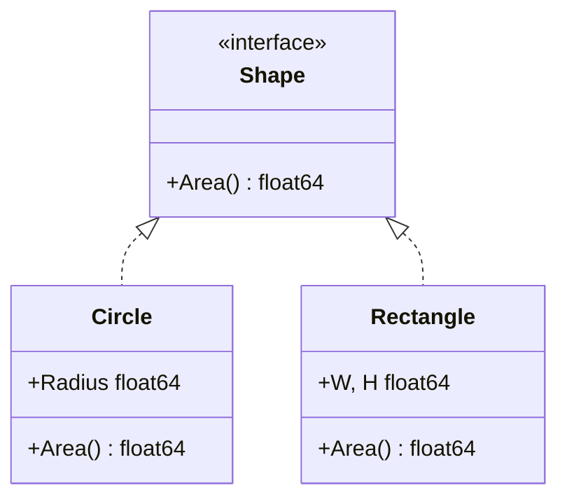

# Go 函数、接口与错误处理

> **文件编码**：UTF-8。  
> **定位**：掌握 **函数、方法、interface 隐式实现、error 惯用法、defer/panic/recover**——Go 抽象与健壮性的核心。  
> **前置**：[02 Go 基础语法与复合类型](./02-Go基础语法与复合类型.md)  
> **下一章**：[04 Go 并发编程](./04-Go并发编程goroutine与channel.md)

---

## 0. 读前导读（零基础也能跟上）

### 0.1 用一句话弄懂本章

**一句话**：Go 用 **函数 + 方法** 组织逻辑，用 **interface 隐式多态** 解耦，用 **error 返回值** 代替 try/catch 处理失败。

**生活类比**：


| 概念                | 类比                            |
| ----------------- | ----------------------------- |
| **多返回值**          | 办事回执：结果 + 是否成功                |
| **interface**     | 插座标准：只要两脚圆头就能插，不用登记「我实现了插座协议」 |
| **error**         | 快递异常单：正常货签收，异常走 if err        |
| **defer**         | 离开房间前关灯锁门（最后做的几件固定事）          |
| **panic/recover** | 火灾报警 vs 常备灭火器（极少业务用 panic）    |


---

### 0.2 你需要提前知道什么


| 水平      | 建议                                 |
| ------- | ---------------------------------- |
| 学完 02 章 | 正常跟做                               |
| Java    | interface 需 `implements`；Go **隐式** |
| C++     | 无异常为主；对比 RAII 与 defer              |


---

### 0.3 手把手：Shape 接口 10 分钟


| 步骤  | 动作                   | 预期              |
| --- | -------------------- | --------------- |
| 1   | 新建 `shapes/main.go`  | go mod init     |
| 2   | 粘贴 §8 代码             | 编译通过            |
| 3   | `go run .`           | 打印各图形面积         |
| 4   | 新增 Triangle 实现 Shape | 不改 PrintArea 函数 |


---

## 1. 函数

### 1.1 基本语法

```go
func Add(a, b int) int {
	return a + b
}

func Div(a, b int) (q int, err error) {
	if b == 0 {
		return 0, fmt.Errorf("divide by zero")
	}
	return a / b, nil
}
```

**术语（命名返回值）**：`(q int, err error)` 在函数开头已声明，return 时可 **裸 return**（慎用，降低可读性）。

### 1.2 可变参数

```go
func Sum(nums ...int) int {
	total := 0
	for _, n := range nums {
		total += n
	}
	return total
}
```

### 1.3 函数作为值

```go
var op func(int, int) int = Add
result := op(3, 4)
```

### 1.4 闭包：函数为什么能“记住”外部变量

闭包（closure）是“函数值 + 它引用的外部变量环境”。被捕获的变量可能在外层函数返回后继续存活，因此编译器可能让它逃逸到堆上。

```go
func NewCounter() func() int {
	n := 0
	return func() int {
		n++
		return n
	}
}
```

```go
c1 := NewCounter()
fmt.Println(c1(), c1()) // 1 2

c2 := NewCounter()
fmt.Println(c2())       // 1；c1、c2 各有独立状态
```

闭包适合中间件、回调和少量状态封装，但不要无意捕获很大的对象；只要闭包仍存活，被捕获对象也可能无法回收。

### 1.5 泛型函数：什么时候使用类型参数 ⭐

Go 1.18+ 支持泛型。类型参数解决的是“算法相同、参与类型不同”的重复代码，而不是把所有代码都抽象化。

```go
func Contains[T comparable] (items []T, target T) bool {
	for _, item := range items {
		if item == target {
			return true
		}
	}
	return false
}

fmt.Println(Contains([]int{1, 2, 3}, 2))
fmt.Println(Contains([]string{"go", "java"}, "go"))
```


| 术语           | 含义                     |
| ------------ | ---------------------- |
| `T`          | 类型参数，在调用时由实参推断或显式指定    |
| `any`        | 任意类型，等价于 `interface{}` |
| `comparable` | 支持 `==`、`!=` 的类型       |
| `~int`       | 底层类型为 `int` 的定义类型也满足约束 |


自定义数值约束（注意换行处必须以 `|` 结尾，两行才是一个联合；否则两行会被当作两个约束求交集）：

```go
type Integer interface {
	~int | ~int8 | ~int16 | ~int32 | ~int64 |
		~uint | ~uint8 | ~uint16 | ~uint32 | ~uint64
}

func Sum[T Integer] (items []T) T {
	var total T
	for _, item := range items {
		total += item
	}
	return total
}
```

使用判断：容器/算法库、通用数据转换适合泛型；只有一两个调用点、不同类型行为并不一致时，普通函数或接口更清晰。泛型表达“同一算法适配多种类型”，接口表达“多种实现提供同一行为”。

---

## 2. 方法

方法与函数的区别：方法带 **接收者** `(c Counter)`，挂在具体类型上，才能参与接口实现；函数是独立的。

### 2.1 值接收者 vs 指针接收者 ⭐

```go
type Counter struct{ n int }

func (c Counter) Value() int { return c.n }      // 值：拷贝
func (c *Counter) Inc()     { c.n++ }            // 指针：改原对象

func (c Counter) BadInc() { c.n++ } // 对外部无 effect！
```


| 选型        | 何时                                    |
| --------- | ------------------------------------- |
| **指针接收者** | 要修改接收者；struct 大避免拷贝；一致性（一个方法用指针则全系指针） |
| **值接收者**  | 小不可变对象；如 `time.Time`                  |


### 2.2 方法与接口

方法是否导出不影响“同包内”满足接口；但其他包无法声明与你包内未导出方法同一身份的方法。因此，带未导出方法的接口通常只能由当前包控制实现，标准库也会用这种方式限制扩展。

### 2.3 方法集（method set）决定谁实现接口 ⭐

稳定规则：


| 类型   | 方法集包含               |
| ---- | ------------------- |
| `T`  | 接收者为 `T` 的方法        |
| `*T` | 接收者为 `T` 和 `*T` 的方法 |


```go
type Writer interface {
	Write([]byte) error
}

type File struct{}

func (f *File) Write(p []byte) error { return nil }

var _ Writer = (*File)(nil) // 编译期断言：*File 实现 Writer
// var _ Writer = File{}    // 编译失败：File 的方法集没有 Write
```

你可能见过 `v.Inc()` 在 `v` 是值时也能调用指针接收者方法，这是编译器在 `v` **可寻址**时帮你改写为 `(&v).Inc()`；接口赋值不会做这一步，所以 `T` 与 `*T` 是否实现接口必须按方法集判断。

嵌入也会提升方法，但值嵌入 `T` 与指针嵌入 `*T` 提升到外层类型的方法集不同。拿不准时用编译期断言：

```go
var _ io.Reader = (*MyReader)(nil)
```

---

## 3. 包与可见性

```go
// mathutil/add.go
package mathutil

func Add(a, b int) int { return a + b }   // 导出
func helper() {}                          // 包内私有
```

包内还可以定义 `init()` 函数：它不能被显式调用，在包被导入、包级变量初始化完成后自动执行；同一包有多个 init 时按文件顺序依次运行。典型用途是注册类工作（如 `database/sql` 的驱动注册）；复杂初始化逻辑更推荐写成显式函数由调用方主动调用。

---

## 4. interface 隐式实现 ⭐

**术语（interface）**：**方法集合**；类型无需声明 `implements`，只要实现了全部方法即满足。

```go
type Shape interface {
	Area() float64
}

type Circle struct{ R float64 }

func (c Circle) Area() float64 {
	return 3.1415926 * c.R * c.R
}

func PrintArea(s Shape) {
	fmt.Println(s.Area())
}
```

多个类型可以同时满足同一接口，`PrintArea` 对它们一视同仁——这就是 §0.3 手把手里「新增 Triangle 不改 PrintArea」的原理：


```mermaid
classDiagram
    class Shape {
        <<interface>>
        +Area() float64
    }
    class Circle {
        +Radius float64
        +Area() float64
    }
    class Rectangle {
        +W, H float64
        +Area() float64
    }
    Shape <|.. Circle
    Shape <|.. Rectangle
```

**接口定义在哪、定多大**：Go 惯例由**消费方**（使用接口的一侧）定义接口，而不是实现方——`PrintArea` 只需要「能算面积」，于是自己声明 `Shape`；`Circle` 所在的包甚至不必知道 `Shape` 存在，这正是隐式实现带来的解耦，测试时也方便针对接口写 mock。接口倾向**小**（1～3 个方法，如 `io.Reader` 只有一个 `Read`）：小接口容易被更多类型满足、容易 mock；大而全的接口既难实现也难测试。

### 4.1 空接口 any

```go
var x any = 42
v, ok := x.(int) // 类型断言
```

JSON `Unmarshal` 到 `map[string]any` 常用。

**注意**：`v, ok := x.(int)` 中 `ok` 为 false 表示 `x` 的动态类型不是 `int`（或 `x` 本身是 nil 接口），此时 `v` 取 `int` 的零值、不会 panic；不带 ok 的单返回值形式 `v := x.(int)` 断言失败会直接 panic，业务代码优先用带 ok 的形式。

### 4.2 接口底层（面试了解）

- **iface**：带方法的 interface → `{type, data}`
- **eface**：空 interface `any` → `{type, data}`

这是便于理解的概念模型，不应依赖 runtime 私有结构体字段写业务代码。接口调用需要根据动态类型找到对应方法；把具体值装入接口还可能触发复制或逃逸，性能敏感代码要以 benchmark 和逃逸分析结果为准。

### 4.3 typed nil：为什么“里面是 nil，接口却不等于 nil” ⭐

接口只有在“动态类型”和“动态值”都为空时才等于 nil。

```go
type MyError struct{}

func (*MyError) Error() string { return "failed" }

func do() error {
	var e *MyError = nil
	return e // 返回的 error 含动态类型 *MyError，因此不等于 nil
}

err := do()
fmt.Println(err == nil) // false
```

正确写法是在没有错误时直接 `return nil`：

```go
func do() error {
	var e *MyError
	if e == nil {
		return nil
	}
	return e
}
```

口述模板：**interface 可以看作** `(dynamic type, dynamic value)`**；**`(*MyError, nil)` **不等于** `(nil, nil)`**。**

### 4.4 类型断言、type switch 与反射怎么选

已知少量候选类型时优先类型断言或 type switch：

```go
func PrintValue(v any) {
	switch x := v.(type) {
	case int:
		fmt.Println("int", x)
	case string:
		fmt.Println("string", x)
	default:
		fmt.Printf("unknown %T\n", x)
	}
}
```

只有运行时才知道字段、tag 或方法时才用 `reflect`，例如 JSON、ORM、校验器框架：

```go
func ExportedFields(v any) []string {
	t := reflect.TypeOf(v)
	if t == nil {
		return nil
	}
	if t.Kind() == reflect.Pointer {
		t = t.Elem()
	}
	if t.Kind() != reflect.Struct {
		return nil
	}

	fields := make([]string, 0, t.NumField())
	for i := 0; i < t.NumField(); i++ {
		f := t.Field(i)
		if f.IsExported() {
			fields = append(fields, f.Name)
		}
	}
	return fields
}
```

反射的主要风险不是“绝对很慢”，而是类型安全推迟到运行期、代码更难读，并可能 panic。使用前检查 `Kind`、nil 和 `CanSet`；业务层能用接口或泛型表达时，通常不先选反射。

---

## 5. error 处理 ⭐

### 5.1 惯用法

```go
f, err := os.Open(path)
if err != nil {
	return err
}
defer f.Close()
```

**不要**：

```go
// 反模式：吞错误
_ = doSomething()
```

`err != nil` 分支要么处理、要么立即 `return`：出错后返回值往往是零值或半成品，带着它继续执行，会把一次失败放大成后续一串难排查的级联故障。

**对比 Java 异常**：Go 没有 try/catch，也没有 checked exception；可能失败的调用都把 error 作为返回值显式交给调用者，错误路径在代码里清晰可见，不存在异常那种隐藏跳转，代价是 `if err != nil` 样板较多。panic/recover 只留给不可恢复的编程错误（见 §7），不用作业务错误通道。

### 5.2 创建与包装

```go
err := errors.New("not found")
err = fmt.Errorf("open %s: %w", path, err)
```

选择：消息是固定字符串时用 `errors.New`；需要格式化参数、或要用 `%w` 包装底层错误时用 `fmt.Errorf`。

### 5.3 errors.Is、errors.As 与 errors.Unwrap

```go
if errors.Is(err, os.ErrNotExist) { /* ... */ }

var pe *os.PathError
if errors.As(err, &pe) { /* ... */ }
```

Go 1.13+ 用 `%w` 形成**错误链**。`errors.Unwrap(err)` 返回被 `%w` 包装的内层 error（没有包装则返回 nil）；`errors.Is`/`errors.As` 内部就是沿错误链逐层展开比对，所以业务代码一般直接用 Is/As，很少手动 Unwrap。

### 5.4 自定义 error

```go
type ValidationError struct {
	Field string
	Msg   string
}

func (e *ValidationError) Error() string {
	return e.Field + ": " + e.Msg
}
```

### 5.5 错误设计：sentinel、类型错误与上下文


| 方式             | 示例                                          | 适合场景                |
| -------------- | ------------------------------------------- | ------------------- |
| sentinel error | `var ErrNotFound = errors.New("not found")` | 调用方只关心某个稳定类别        |
| 自定义类型          | `*ValidationError`                          | 调用方还要读取字段、错误码等结构化信息 |
| 包装上下文          | `fmt.Errorf("find user %d: %w", id, err)`   | 保留根因，同时说明哪一步失败      |


错误字符串写“发生了什么”，习惯上**小写开头**、结尾不加标点（日志和上层包装会自动加前缀），也不要重复 `error:` 前缀；每层只补本层上下文。判断类别使用 `errors.Is/As`，不要依赖字符串比较。

Go 1.20+ 的 `errors.Join` 可组合多个错误：

```go
err := errors.Join(closeDB(), closeRedis())
if err != nil {
	return fmt.Errorf("shutdown resources: %w", err)
}
```

`errors.Is` 会遍历组合后的错误树。它适合停机清理等“多个动作都要尝试”的场景，不适合用来隐藏主次不清的业务失败。

---

## 6. defer

### 6.1 LIFO 顺序

```go
defer fmt.Println("1")
defer fmt.Println("2")
// 输出 2 然后 1
```

### 6.2 与 return 顺序 ⭐

```go
func f() (r int) {
	defer func() { r++ }()
	return 1 // 实际返回 2
}
```

执行顺序：**return 设值 → defer → 真正返回**。

### 6.3 资源释放与性能

文件、锁、HTTP body：`defer close()` 是标准模式。

**性能与循环**：defer 的开销在常规代码里可以忽略，不必为省它牺牲可读性；但 defer 要到**函数返回**时才执行，热点循环里逐次 defer 会积累开销并推迟资源释放（见 §10 排错表第 9 条），应把「打开—处理—关闭」提取成独立函数，让每轮循环结束就触发 defer。

---

## 7. panic 与 recover

```go
func safeCall(fn func()) (err error) {
	defer func() {
		if r := recover(); r != nil {
			err = fmt.Errorf("panic: %v", r)
		}
	}()
	fn()
	return nil
}
```


| 场景        | 建议                                  |
| --------- | ----------------------------------- |
| 业务错误      | 返回 **error**                        |
| 编程错误/不可恢复 | **panic**（框架 Recovery 中间件会 recover） |
| 库代码       | **禁止 panic** 作为正常控制流                |


Gin **Recovery** 中间件即 recover HTTP handler panic。它只是最后一道保险：HTTP handler 里的业务错误不应走 panic，而是把 error 转成响应返回给客户端（如 Gin 的 `c.JSON(400, ...)`），或交给统一的错误处理 middleware——05/06 章展开。

---

## 8. 完整示例：Shape + 错误

```go
package main

import (
	"errors"
	"fmt"
	"math"
)

type Shape interface {
	Area() float64
}

type Circle struct{ R float64 }
type Rectangle struct{ W, H float64 }

func (c Circle) Area() float64 {
	if c.R < 0 {
		return 0
	}
	return math.Pi * c.R * c.R
}

func (r Rectangle) Area() float64 {
	return r.W * r.H
}

func TotalArea(shapes ...Shape) (float64, error) {
	if len(shapes) == 0 {
		return 0, errors.New("no shapes")
	}
	var sum float64
	for _, s := range shapes {
		sum += s.Area()
	}
	return sum, nil
}

func main() {
	shapes := []Shape{
		Circle{R: 2},
		Rectangle{W: 3, H: 4},
	}
	total, err := TotalArea(shapes...)
	if err != nil {
		fmt.Println("error:", err)
		return
	}
	fmt.Printf("total area: %.2f\n", total)
}
```

**预期**：

```text
total area: 24.57
```

---

## 9. 银行账户练习（简要）

```go
type Account struct {
	Owner   string
	balance float64
}

func (a *Account) Deposit(amount float64) error {
	if amount <= 0 {
		return fmt.Errorf("invalid amount")
	}
	a.balance += amount
	return nil
}

func (a *Account) Withdraw(amount float64) error {
	if amount > a.balance {
		return fmt.Errorf("insufficient funds")
	}
	a.balance -= amount
	return nil
}

func (a Account) Balance() float64 { return a.balance }
```

---

## 10. 常见报错与排查


| #   | 现象                                | 原因                              | 解决                  |
| --- | --------------------------------- | ------------------------------- | ------------------- |
| 1   | `cannot use x (type T) as type I` | 未实现全部方法                         | 补方法；检查大小写导出         |
| 2   | 改 struct 无效                       | 值接收者                            | 改指针接收者              |
| 3   | nil pointer dereference           | nil 接口/指针                       | 判 nil               |
| 4   | error 永远 nil                      | 未 return err                    | 每条错误路径 return       |
| 5   | `%w` 包装丢失                         | 用 `%v`                          | 改用 `%w` 供 Is/As     |
| 6   | defer 文件未关                        | 早 return 前未 defer               | Open 成功后立刻 defer    |
| 7   | panic 程序退出                        | 未 recover                       | HTTP 用 Recovery 中间件 |
| 8   | 接口 nil 陷阱                         | `var p *T; var i P = p` i 非 nil | 理解 iface 动态类型       |
| 9   | 循环 defer 泄漏                       | 循环里 defer                       | defer 移出循环或闭包传参     |
| 10  | 命名返回值混乱                           | 裸 return 过多                     | 显式 return 值         |


---

## 11. 练习建议

1. 完成 §8 Shape，加 **Triangle**（海伦公式）。
2. 银行账户加 **转账** 与 error 类型区分。
3. LeetCode **20. 有效括号** 用 Go + 多返回值辅助函数。
4. 读 `io.Reader` / `io.Writer` 接口源码（05 章铺垫）。

---

*文档版本：v1.2 · 2026-07-27（删除「本章与上一章的关系」导航块，接口 UML 图并入 §4；此前 v1.1 2026-07-26 精简：删除知识地图/自测/费曼检验等仪式板块，FAQ 与自测答案中的技术要点并入正文，重排小节编号） · 路径：*`F:\study\后端学习\Go\03-Go函数接口与错误处理.md`
