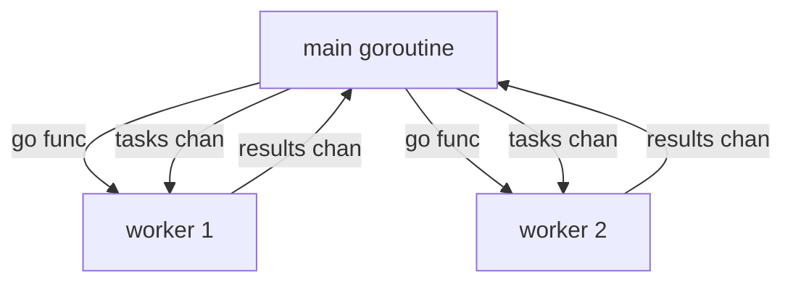
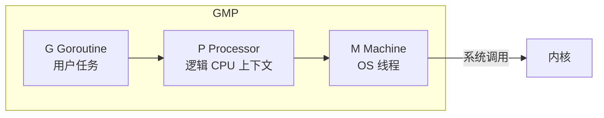

# Go 并发编程：goroutine 与 channel

> **文件编码**：UTF-8。  
> **定位**：⭐ **面试最高频**——goroutine、channel、select、sync、context、worker pool、GMP、竞态检测。  
> **前置**：[03 Go 函数接口与错误处理](./03-Go函数接口与错误处理.md)  
> **下一章**：[05 Go 标准库与 HTTP 基础](./05-Go标准库与HTTP基础.md)

---

## 0. 读前导读（零基础也能跟上）

### 0.1 用一句话弄懂本章

**一句话**：Go 用 **goroutine** 轻量并发，用 **channel** 在 goroutine 间 **安全传数据**，用 **select/sync/context** 协调与取消——这是 Go 后端区别于 Java 线程池的核心武器。

**生活类比**：

| 概念 | 类比 |
|------|------|
| **goroutine** | 餐厅服务员：开一个成本低，可同时很多个 |
| **channel** | 传菜窗口：做好菜放窗口，另一头取（同步） |
| **buffered channel** | 保温柜：可暂存多份菜再取 |
| **select** | 前台同时听电话+对讲机，谁先响接谁 |
| **Mutex** | 卫生间门锁：一次只能一人 |
| **context** | 全场广播「下班了停止接单」 |

**为什么重要**：字节/腾讯 Go 岗 **几乎必问** GMP、channel 关闭、泄漏排查；shorturl 限流、异步日志、超时 HTTP 都依赖本章。

---

### 0.2 你需要提前知道什么

| 水平 | 建议 |
|------|------|
| 学完 03 章 | 正常跟做；先理解 **map 不能并发写** |
| Java | 对比 Thread/Executor；Go **不要共享内存，要通信** |
| ACM | 重点 **正确性**（-race）而非极致压常数 |

---

### 0.3 本章知识地图（学完后应能勾选全部 ☐→☑）

- [ ] 启动 goroutine，理解 **与 OS 线程区别**
- [ ] 使用无缓冲/有缓冲 channel、**close 与 range**
- [ ] 写 **select** 多路复用 + default 非阻塞
- [ ] 使用 **Mutex、WaitGroup、Once**
- [ ] 用 **context** 取消与超时
- [ ] 实现 **worker pool** 与简易并发爬虫
- [ ] 运行 **`go run -race`** 检测竞态
- [ ] 白板简述 **GMP 模型**
- [ ] 识别 **goroutine 泄漏** 场景
- [ ] 闭卷自测 ≥ 8/10

---

### 0.4 建议学习时长与节奏

| 天 | 内容 | 产出 |
|----|------|------|
| D8 | §1～§3 goroutine/channel | 并发 Hello |
| D9 | §4～§5 select/sync | worker pool v1 |
| D10 | §6～§8 context/GMP/泄漏 | 带超时 HTTP + 爬虫 demo |

**对应总计划**：W2 Day 8～10。

---

### 0.5 学完本章你能做什么

1. 实现 **N worker 消费 M 任务** 的 pool，主 goroutine 等待全部完成。
2. 用 `context.WithTimeout` 限制 HTTP 请求 **3 秒** 超时。
3. 面试 **5 分钟** 讲 GMP + channel 有缓冲/无缓冲区别。

---

### 0.6 手把手：Worker Pool 20 分钟

| 步骤 | 动作 | 预期 |
|------|------|------|
| 1 | 新建 `pool/main.go` | go mod init |
| 2 | 粘贴 §9 完整代码 | 编译通过 |
| 3 | `go run .` | 打印 10 个任务处理结果 |
| 4 | `go run -race .` | 无 DATA RACE 报告 |

---

## 本章与上一章的关系

[03 章](./03-Go函数接口与错误处理.md) 的 error/defer 在并发中用于 **goroutine 内 panic 恢复** 与 **关闭资源**；02 章 map 并发写 panic 本章用 **channel 或 Mutex** 解决。



---

## 1. goroutine

### 1.1 启动

```go
go func() {
	fmt.Println("async")
}()

time.Sleep(time.Millisecond) // demo 仅；生产用 WaitGroup/channel
```

**术语（goroutine）**：用户态轻量线程，初始栈 **~2KB**，由 Go runtime 调度。

### 1.2 vs OS 线程

| 维度 | goroutine | OS 线程 |
|------|-----------|---------|
| 创建成本 | 低 | 高（MB 级栈） |
| 调度 | Go runtime **M:N** | 内核调度 |
| 数量 | 可成千上万 | 通常较少 |
| 通信 | **channel 优先** | 共享内存+锁 |

### 1.3 注意

- main 退出 → **全部 goroutine 被终止**
- 必须用 **WaitGroup / channel** 等待完成

---

## 2. channel

### 2.1 创建

```go
ch := make(chan int)      // 无缓冲：同步
buf := make(chan int, 10) // 有缓冲：异步至满
```

**术语（channel）**：类型化的 FIFO 队列，用于 **goroutine 间通信**。

### 2.2 发送与接收

```go
ch <- 42    // send
v := <-ch   // receive
v, ok := <-ch // ok false 表示 closed
```

### 2.3 无缓冲 vs 有缓冲 ⭐

| 类型 | 行为 |
|------|------|
| **无缓冲** | send 阻塞直到有人 recv；**同步握手** |
| **有缓冲** | buffer 未满 send 不阻塞；满则阻塞 |

### 2.4 关闭 channel ⭐

```go
close(ch)
```

| 操作 | 结果 |
|------|------|
| 向 closed send | **panic** |
| 从 closed recv | 立即得零值，`ok=false` |
| range closed | 读完自然结束 |

**规则**：**只有发送方 close**；接收方用 range 或 `ok`。

```go
for v := range ch {
	fmt.Println(v)
}
```

### 2.5 单向 channel

```go
func producer(out chan<- int) { out <- 1 }
func consumer(in <-chan int)   { <-in }
```

### 2.6 nil channel、关闭语义与内部结构 ⭐

先记操作矩阵：

| channel 状态 | 接收 | 发送 | 关闭 |
|--------------|------|------|------|
| `nil` | 永久阻塞 | 永久阻塞 | panic |
| 非 nil、未关闭 | 无数据时阻塞 | 无接收者/缓冲满时阻塞 | 成功 |
| 已关闭 | 缓冲读完后立刻返回零值，`ok=false` | panic | 再次关闭 panic |

nil channel 在 `select` 中对应 case 永远不会就绪，因此可以用“把 channel 设为 nil”动态禁用某个分支：

```go
for left != nil || right != nil {
	select {
	case v, ok := <-left:
		if !ok {
			left = nil // 禁用该 case，避免反复读零值
			continue
		}
		_ = v
	case v, ok := <-right:
		if !ok {
			right = nil
			continue
		}
		_ = v
	}
}
```

从实现思路看，runtime 中的 channel（常称 `hchan`）大致需要维护：环形缓冲区、当前元素数、发送/接收位置、关闭标志、一把互斥锁，以及等待发送和等待接收的 goroutine 队列。等待节点常称 `sudog`，它把 goroutine 与本次等待关联起来。

发送时通常按以下路径处理：

1. 已有等待接收者：直接把值交给对方并唤醒。
2. 没有接收者但缓冲未满：写入环形缓冲区。
3. 缓冲已满或无缓冲：当前 goroutine 进入发送等待队列并被挂起。

接收过程对称。`close` 会设置关闭标志并唤醒相关等待者；等待发送者醒来后会因“向已关闭 channel 发送”而 panic。

这些字段是 runtime 实现细节，可能随 Go 版本变化；业务代码应依赖语言语义，不应通过 `unsafe` 读取 `hchan`。

---

## 3. select

```go
select {
case v := <-ch1:
	fmt.Println("ch1", v)
case ch2 <- x:
	fmt.Println("sent")
case <-time.After(time.Second):
	fmt.Println("timeout")
default:
	fmt.Println("non-blocking")
}
```

**术语（select）**：多 channel **多路复用**；多个 case 就绪时 **随机** 选一个。

循环中不要反复 `time.After` 创建新 timer：

```go
timer := time.NewTimer(time.Second)
defer timer.Stop()

select {
case v := <-ch:
	fmt.Println(v)
case <-timer.C:
	return context.DeadlineExceeded
}
```

一次性超时用 `time.After` 很方便；高频循环里应复用 `Timer` 或 `Ticker`，避免持续分配 timer、增加 GC 和调度压力。Go 1.23+ 改进了未引用 timer/ticker 的回收，但“可回收”不等于“零成本”。

---

## 4. sync 包

### 4.1 Mutex / RWMutex

```go
var mu sync.Mutex
var count int

func inc() {
	mu.Lock()
	defer mu.Unlock()
	count++
}
```

读多写少用 **RWMutex**。

### 4.2 WaitGroup

```go
var wg sync.WaitGroup
for i := 0; i < 3; i++ {
	wg.Add(1)
	go func(id int) {
		defer wg.Done()
		work(id)
	}(i)
}
wg.Wait()
```

**注意**：传统写法必须在启动 goroutine **之前**调用 `Add`，否则 `Wait` 可能先看到计数为 0 并提前返回；goroutine 内只负责 `defer Done()`。**Done 必须与 Add 配对**。

Go 1.25+ 还提供 `WaitGroup.Go`：

```go
var wg sync.WaitGroup
for i := 0; i < 3; i++ {
	id := i
	wg.Go(func() {
		work(id)
	})
}
wg.Wait()
```

阅读公司旧项目时仍会大量看到 `Add/Done`，两种写法都要会。

`WaitGroup.Go` 要求传入函数不能 panic；可能 panic 的任务应在任务内部按业务语义恢复、转为 error，或继续使用能显式收集错误的并发组织方式。

### 4.3 sync.Once

```go
var once sync.Once
once.Do(func() { /* init singleton */ })
```

### 4.4 sync.Map

并发 map；**读多写少** 或 key 稳定时考虑，否则 **Mutex + map** 更清晰。

### 4.5 atomic：只适合单变量状态

```go
var requests atomic.Int64
requests.Add(1)
fmt.Println(requests.Load())
```

原子操作适合计数器、状态位、指针替换；如果一次业务更新涉及多个字段并要求整体不变量，使用 Mutex 更容易证明正确。不要把一组“各自原子”的字段误认为整体事务。

### 4.6 sync.Cond：等待“条件成立”

`sync.Cond` 适合多个 goroutine 等待某个共享状态改变。调用 `Wait` 前必须持锁；`Wait` 会原子地释放锁并休眠，醒来后重新加锁。条件必须用 `for` 重查：

```go
mu := sync.Mutex{}
cond := sync.NewCond(&mu)
ready := false

go func() {
	mu.Lock()
	for !ready {
		cond.Wait()
	}
	mu.Unlock()
	work(1)
}()

mu.Lock()
ready = true
mu.Unlock()
cond.Broadcast()
```

很多队列场景用 channel 更自然；当条件不是“一次消息”，而是复杂共享状态时 `Cond` 才更合适。

---

## 5. context ⭐

```go
ctx, cancel := context.WithCancel(context.Background())
defer cancel()

ctx, cancel = context.WithTimeout(ctx, 3*time.Second)
defer cancel()

select {
case <-ctx.Done():
	return ctx.Err()
case result := <-work():
	return result
}
```

| 函数 | 用途 |
|------|------|
| `WithCancel` | 手动取消 |
| `WithTimeout` / `WithDeadline` | 超时 |
| `WithValue` | 传 request-scoped 值（trace id）；**勿滥用** |

HTTP 服务器：`r.Context()` 传递取消信号。

### 5.1 context 的传播规则与常见误用

context 形成父子树：父 context 被取消，所有子 context 都会收到取消；取消子节点不会影响父节点和兄弟节点。

```go
func Handle(ctx context.Context, id int64) error {
	ctx, cancel := context.WithTimeout(ctx, 500*time.Millisecond)
	defer cancel()

	user, err := repo.FindByID(ctx, id)
	if err != nil {
		return fmt.Errorf("find user: %w", err)
	}
	return cache.Set(ctx, user)
}
```

规范：

- 作为函数第一个参数传递，通常命名为 `ctx`；不要塞进 struct 作为长期字段。
- 不传 `nil`；不知道用什么时用 `context.Background()`，测试可用 `context.TODO()` 暂占。
- `WithValue` 只放跨 API 边界的 request-scoped 元数据，如 trace ID；业务参数仍应显式传参。
- 派生了 cancel 函数就尽早 `defer cancel()`，用于释放 timer 和父子关联资源。
- 下游必须真的接收并检查 ctx；只在 handler 创建 context、DAO 却不用它，取消链不会生效。

---

## 6. 常见并发模式

### 6.1 Worker Pool

见 §9 完整代码。

### 6.2 Pipeline

```go
// stage1 -> stage2 -> stage3，channel 串联
```

### 6.3 Fan-in / Fan-out

多个 producer fan-in 到一个 channel；一个 producer fan-out 多个 worker。

### 6.4 并发爬虫（练习）

- 10 URL，**最大 3 并发**
- `sem := make(chan struct{}, 3)` 信号量
- 结果汇总 channel

---

## 7. 竞态检测 go run -race

```powershell
go run -race .
go test -race ./...
```

**DATA RACE**：两个 goroutine 并发访问同一内存位置，至少一个是写，并且访问之间没有建立同步关系。出现竞态后程序结果不可靠，也可能被编译器和 CPU 重排影响；除少数底层原语外，应把 race detector 报告视为必须修复的问题。

修复：Mutex、channel、atomic。

### 7.1 happens-before：同步为什么能让另一个 goroutine“看见”写入 ⭐

“没有同时执行”还不够；并发正确性依赖 Go 内存模型规定的 happens-before（先行发生）关系。常用保证：

- goroutine 启动语句先行发生于新 goroutine 开始执行。
- channel 的一次发送先行发生于对应接收完成。
- 关闭 channel 先行发生于接收方因关闭而返回零值。
- `Mutex.Unlock` 先行发生于之后成功取得同一锁的 `Lock`。
- `Once.Do(f)` 中 `f` 返回，先行发生于任意一次 `Do` 返回。
- `sync/atomic` 原子操作提供明确的同步语义；不要与普通无锁读写混用来“碰运气”。

```go
var msg string
done := make(chan struct{})

go func() {
	msg = "ready"
	close(done)
}()

<-done
fmt.Println(msg) // close/receive 建立同步，因此能观察到 ready
```

反例：用 `time.Sleep` 等待另一个 goroutine 写变量，不建立同步关系；机器快慢一变就可能失败，并且仍会被 `-race` 报告。

---

## 8. GMP 模型（面试必背）⭐



| 组件 | 说明 |
|------|------|
| **G** | goroutine 结构体与栈 |
| **M** | 绑定 OS 线程，执行 G 的机器码 |
| **P** | 本地 G 队列；**GOMAXPROCS** 决定 P 数量 |
| 调度 | M 必须持 P 才能跑 G；IO 阻塞时 G 与 M 分离，M 可找别的 G |

**口述模板**：Go 是 **M:N 调度**；`GOMAXPROCS` 默认 CPU 核数；网络 IO 用 **netpoller**  epoll/kqueue 避免线程阻塞（关联 [Linux epoll](../Linux/) 与 OS 八股）。

### 8.1 调度器如何找到工作

可以按以下顺序理解，不必死背 runtime 私有函数名：

1. 每个 P 有本地运行队列，优先从本地取 G，减少全局锁竞争。
2. 本地没有任务时，会检查全局队列、网络轮询器和定时器。
3. 仍无任务时可能从其他 P 的本地队列“偷”一部分 G（work stealing）。
4. goroutine 做可轮询网络 IO 时，runtime 把等待交给 netpoller，M 可以继续运行别的 G。
5. goroutine 进入阻塞系统调用时，runtime 可让 P 与该 M 分离，交给其他 M 继续执行可运行 G。

Go 支持异步抢占，长时间运行的 goroutine 通常也能被调度器打断；但没有函数调用、包含 cgo 或处在某些 runtime 临界区时，调度与停顿表现仍可能不同。业务上不要写永不退出的纯忙等循环，应使用阻塞原语或显式检查取消信号。

### 8.2 GOMAXPROCS 不等于 goroutine 数

`GOMAXPROCS` 控制同时执行 Go 代码所需的 P 数量，不限制 goroutine 总数。CPU 密集任务增加 goroutine 超过 P 数量不会凭空增加算力；IO 密集任务可以有更多 goroutine，因为大量任务处在等待状态。

---

## 9. Worker Pool 完整代码

```go
package main

import (
	"fmt"
	"sync"
	"time"
)

func worker(id int, jobs <-chan int, results chan<- string, wg *sync.WaitGroup) {
	defer wg.Done()
	for j := range jobs {
		time.Sleep(50 * time.Millisecond)
		results <- fmt.Sprintf("worker %d done job %d", id, j)
	}
}

func main() {
	const numJobs = 10
	const numWorkers = 3

	jobs := make(chan int, numJobs)
	results := make(chan string, numJobs)

	var wg sync.WaitGroup
	for w := 1; w <= numWorkers; w++ {
		wg.Add(1)
		go worker(w, jobs, results, &wg)
	}

	for j := 1; j <= numJobs; j++ {
		jobs <- j
	}
	close(jobs)

	go func() {
		wg.Wait()
		close(results)
	}()

	for r := range results {
		fmt.Println(r)
	}
}
```

**预期**：10 行 `worker X done job Y`，无死锁。

---

## 10. goroutine 泄漏场景

| 场景 | 原因 | 避免 |
|------|------|------|
| channel send 无人收 | 阻塞 forever | 确保 consumer；用 context 取消 |
| channel recv 无人发 | 阻塞 | 关闭 channel；超时 |
| WaitGroup 少 Done | 永久 Wait | defer Done；配对 Add |
| 高频循环反复建 timer | 分配和调度压力 | 复用 `time.NewTimer/Ticker` 并 Stop |
| HTTP body 未关 | 连接泄漏/无法复用 | `defer Body.Close()`；按需读完 |

排查：**pprof goroutine**（进阶）。

---

## 11. 常见报错与排查（≥8 条）

| # | 现象 | 原因 | 解决 |
|---|------|------|------|
| 1 | fatal error: all goroutines asleep | deadlock | 检查 channel 收发配对 |
| 2 | send on closed channel | 向已关闭 send | 只由发送方 close；别重复 close |
| 3 | close of closed channel | 重复 close | sync.Once 或状态标志 |
| 4 | DATA RACE | 无同步共享变量 | Mutex/channel/-race 修 |
| 5 | 程序提前退出 | main 结束 | WaitGroup 等待 |
| 6 | WaitGroup 负数 | Done 过多 | Add/Done 配对 |
| 7 | 泄漏 goroutine 增多 | 阻塞 channel | context 超时退出 |
| 8 | select 饥饿 | 某 case 总就绪 | 拆分逻辑；公平性通常可接受 |
| 9 | 循环变量捕获与版本差异 | Go 1.22+ 的新式 `for/range` 每轮变量独立；旧模块或循环外声明变量仍可能踩坑 | 显式传参最清晰：`go func(i int){}(i)` |
| 10 | ctx 未 cancel | 资源泄漏 | defer cancel() |

---

## 12. FAQ（≥10）

### Q1：channel 和 Mutex 怎么选？

**传递所有权/任务** 用 channel；**保护共享状态** 用 Mutex；简单计数可用 atomic。

### Q2：buffer size 设多少？

看 **背压**；不知道先 0（同步）或小常数，压测再调。

### Q3：谁 close channel？

**发送方**；多个发送方用 **单独 done channel** 或 sync 协调。

### Q4：goroutine 越多越好吗？

否；过多增加调度开销；用 **pool 限并发**。

### Q5：GOMAXPROCS 要改吗？

CPU 密集可默认；IO 密集一般也默认；特殊场景再调。

### Q6：context.WithValue 存什么？

request id、user id；**不要**传大对象或可选参数滥用。

### Q7：select 和 epoll 关系？

select 是 **Go 语言级** channel 多路复用；epoll 是 **OS IO 多路复用**；netpoller 底层用 epoll。

### Q8：sync.Pool 用途？

临时对象复用，减 GC；**对象可能被回收**，不能当缓存。

### Q9：原子操作 atomic？

简单计数、flag；复杂结构仍用 Mutex。

### Q10：面试：无缓冲 channel 应用场景？

**同步点**、确保 **handoff**、信号通知（如 done）。

### Q11：Java 线程池 vs Go？

Go 倾向 **goroutine + channel**；项目里可自封装 pool（本章 §9）。

### Q12：短链项目哪里用并发？

异步写 click_log、批量预热缓存、超时 upstream 检查（可选）。

---

## 13. 闭卷自测（≥10）

1. goroutine 和线程创建成本差异？
2. 无缓冲 channel send 何时阻塞？
3. close 后 recv 行为？
4. select 多个 case 同时就绪？
5. WaitGroup 使用三步骤？
6. context.WithTimeout 典型场景？
7. GMP 中 P 是什么？
8. 如何检测竞态？
9. goroutine 泄漏一种场景？
10. 「不要通过共享内存通信」下半句？

<details>
<summary>自测参考答案</summary>

1. goroutine 栈小、用户态调度；线程内核调度、栈 MB 级。
2. 直到另一 goroutine recv（握手同步）。
3. 立即返回零值，ok=false；range 结束。
4. 伪随机选一个执行。
5. Add(n)；goroutine 里 defer Done；Wait 阻塞至计数 0。
6. HTTP/DB 调用超时、取消长任务。
7. Processor，本地运行队列，GOMAXPROCS 控制数量。
8. `go run/test -race`。
9. 如 send 无接收者永久阻塞。
10. 「而通过通信共享内存」（C.A.R. Hoare / Go 哲学）。

</details>

---

## 14. 费曼检验

**3 分钟讲 goroutine 和 channel。**

**提纲**：

1. goroutine = **便宜的小工**，Go 自动调度到 CPU。
2. channel = **传送带**，避免多人改同一数据打架。
3. 结束用 **WaitGroup** 或 **close channel**；超时用 **context**。

---

## 15. 练习建议

1. **并发爬虫**：3 并发抓 10 URL（可用 `http.Get`）。
2. **带超时 HTTP**：`context.WithTimeout` + `http.NewRequestWithContext`。
3. 故意制造 DATA RACE，用 `-race` 修。
4. 画 GMP 图 **3 遍**，对照 [15 面试章](./15-Go面试专题与知识点总表.md)。

---

## 16. 学完标准

- [ ] 独立写 worker pool + `-race` 通过
- [ ] 口述 GMP、channel 关闭、有缓冲区别
- [ ] 完成爬虫或超时 HTTP demo
- [ ] 闭卷自测 ≥ 8/10

---

## 17. 章节衔接

| 上一章 | 本章 | 下一章 |
|--------|------|--------|
| [03 函数接口](./03-Go函数接口与错误处理.md) | 并发 ⭐ | [05 HTTP 标准库](./05-Go标准库与HTTP基础.md) |

**下一章**：用 **net/http** 写原生 Web 服务，理解 Handler 链——06 Gin 的底层。

---

*文档版本：v1.0 · 2026-07-08 · 路径：`F:\study\后端学习\Go\04-Go并发编程goroutine与channel.md`*
