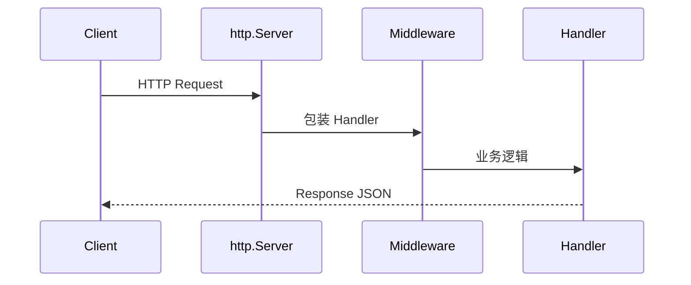
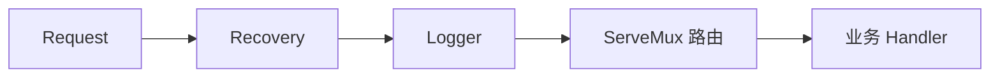

# Go 标准库与 HTTP 基础

> **文件编码**：UTF-8。  
> **定位**：掌握 **net/http、encoding/json、io、testing** 与 **中间件模式**——Gin 之前的原生 HTTP 基础。  
> **前置**：[04 Go 并发编程](./04-Go并发编程goroutine与channel.md)  
> **下一章**：[06 Gin 框架核心与中间件](./06-Gin框架核心与中间件.md)

---

## 0. 读前导读（零基础也能跟上）

### 0.1 用一句话弄懂本章

**一句话**：用标准库 **net/http** 搭 Web 服务与客户端，用 **json** 序列化，用 **testing** 写表驱动测试，并理解 **中间件链**——这是 Gin 的底层原理。

**生活类比**：

| 概念 | 类比 |
|------|------|
| **http.Server** | 餐厅总店：监听门口、分配请求 |
| **Handler** | 每道菜的厨师：收到订单做菜 |
| **Middleware** | 安检→刷卡→上菜：每层包一层 |
| **json.Marshal** | 把菜装标准盒（JSON）外卖 |
| **http.Client** | 顾客打电话点外卖 |

**为什么重要**：面试问 Gin 中间件、Graceful Shutdown 都回到 **net/http**；计网 [HTTP 章节](../../前端学习/计算机网络/) 理论在此落地。

---

### 0.2 你需要提前知道什么

| 水平 | 建议 |
|------|------|
| 学完 04 章 | 正常跟做；HTTP 用 context 超时 |
| 学过计网 | 对照 GET/POST、状态码、Header |
| 直接跳 Gin | **不推荐**；05 至少完成 §2～§5 |

---

### 0.3 本章知识地图（学完后应能勾选全部 ☐→☑）

- [ ] 写 **http.HandleFunc / ServeMux** 服务
- [ ] 使用 **http.Client** 发 GET/POST，设 Timeout
- [ ] **json.Marshal/Unmarshal** 与 struct tag
- [ ] 读 **io.Reader/Writer**、ioutil 替代 API
- [ ] 手写 **Logger + Recovery** 中间件
- [ ] 写 **Table-Driven Test** + `go test`
- [ ] 理解 **Request/Response** 生命周期
- [ ] 闭卷自测 ≥ 8/10

---

### 0.4 建议学习时长与节奏

| 时段 | 内容 |
|------|------|
| D11 上午 | §1～§3 Server/Handler |
| D11 下午 | §4 json + §5 Client |
| D11 晚上 | §6 中间件 + §7 testing |

**对应总计划**：W2 Day 11。

---

### 0.5 学完本章你能做什么

1. 不用 Gin 实现 `GET /health` 与 `POST /api/echo` JSON API。
2. 用 `http.Client` + `context.WithTimeout` 调外部 API。
3. 为业务函数写 **表驱动单元测试** 并通过 `go test -v`。

---

### 0.6 手把手：原生 API 15 分钟

| 步骤 | 动作 | 预期 |
|------|------|------|
| 1 | 新建 `httpserver/main.go` | go mod init |
| 2 | 粘贴 §2.2 代码 | 编译通过 |
| 3 | `go run .` | `Listening on :8080` |
| 4 | `curl localhost:8080/health` | `{"status":"ok"}` |

---

## 本章与上一章的关系

[04 章](./04-Go并发编程goroutine与channel.md) 的 **context** 用于 HTTP 超时与取消；每个请求 Go 用 **一个 goroutine** 处理（net/http 默认）。



| 上一章（04） | 本章（05） | 下一章（06） |
|--------------|------------|--------------|
| 并发/超时 | 原生 HTTP | Gin 封装 |

---

## 1. net/http 服务端

### 1.1 最简 Server

```go
package main

import (
	"fmt"
	"net/http"
)

func main() {
	http.HandleFunc("/", func(w http.ResponseWriter, r *http.Request) {
		fmt.Fprintln(w, "Hello, HTTP!")
	})
	fmt.Println("Listening on :8080")
	http.ListenAndServe(":8080", nil)
}
```

**术语（Handler）**：实现 `ServeHTTP(ResponseWriter, *Request)` 的类型。

### 1.2 HandlerFunc 与 ServeMux

```go
mux := http.NewServeMux()
mux.HandleFunc("/health", healthHandler)
mux.Handle("/api/", apiMiddleware(apiHandler))

http.ListenAndServe(":8080", mux)
```

默认 `DefaultServeMux` 即 `http.HandleFunc` 注册的全局 mux。

Go 1.22+ 的 `ServeMux` 支持“方法 + 路径参数”模式：

```go
mux := http.NewServeMux()

mux.HandleFunc("GET /health", healthHandler)
mux.HandleFunc("GET /users/{id}", func(w http.ResponseWriter, r *http.Request) {
	id := r.PathValue("id")
	fmt.Fprintln(w, id)
})
```

这让小型服务不依赖第三方路由也能表达 405 和路径参数；Gin 仍提供更完整的绑定、校验、中间件和生态。

### 1.3 ResponseWriter 与 Request

```go
func healthHandler(w http.ResponseWriter, r *http.Request) {
	if r.Method != http.MethodGet {
		http.Error(w, "method not allowed", http.StatusMethodNotAllowed)
		return
	}
	w.Header().Set("Content-Type", "application/json")
	w.WriteHeader(http.StatusOK)
	fmt.Fprint(w, `{"status":"ok"}`)
}
```

| 字段/方法 | 作用 |
|-----------|------|
| `r.Method` | GET/POST/... |
| `r.URL.Path` | 路径 |
| `r.Header` | 请求头 |
| `r.Body` | 请求体 io.ReadCloser |
| `w.Header().Set` | 响应头 |
| `w.WriteHeader` | 状态码（只能一次） |
| `w.Write` | 响应体 |

### 1.4 生产级 `http.Server`：超时必须显式配置 ⭐

直接调用 `http.ListenAndServe` 使用的默认 Server 几乎没有业务超时限制。公网服务应显式创建：

```go
srv := &http.Server{
	Addr:              ":8080",
	Handler:           mux,
	ReadHeaderTimeout: 3 * time.Second,
	ReadTimeout:       10 * time.Second,
	WriteTimeout:      15 * time.Second,
	IdleTimeout:       60 * time.Second,
	MaxHeaderBytes:    1 << 20, // 1 MiB
}

if err := srv.ListenAndServe(); err != nil && !errors.Is(err, http.ErrServerClosed) {
	log.Fatal(err)
}
```

| 配置 | 防什么 | 注意 |
|------|--------|------|
| `ReadHeaderTimeout` | 客户端慢慢发送 header 占连接（Slowloris） | 通常最应设置 |
| `ReadTimeout` | 整个请求读取过慢 | 大文件上传需单独设计 |
| `WriteTimeout` | handler/响应长期不结束 | SSE/流式响应不能照搬短超时 |
| `IdleTimeout` | Keep-Alive 空闲连接长期占用 | 应大于普通请求耗时 |
| `MaxHeaderBytes` | 超大 header | 仍需限制业务字段和 body |

超时没有万能数值，应按接口类型区分：普通 JSON API、文件上传、SSE 的合理配置不同。超时触发后还要让下游 DB/Redis/HTTP 调用使用 `r.Context()`，否则 handler 返回了，下游工作仍可能继续。

---

## 2. JSON API 示例

### 2.1 请求/响应 struct

```go
type EchoRequest struct {
	Message string `json:"message"`
}

type EchoResponse struct {
	Code int    `json:"code"`
	Data string `json:"data"`
}
```

### 2.2 完整 echo 服务

```go
func echoHandler(w http.ResponseWriter, r *http.Request) {
	if r.Method != http.MethodPost {
		http.Error(w, "method not allowed", http.StatusMethodNotAllowed)
		return
	}
	// 服务端会在请求结束后关闭 Body；这里重点限制读取大小。
	r.Body = http.MaxBytesReader(w, r.Body, 1<<20) // 最大 1 MiB

	var req EchoRequest
	dec := json.NewDecoder(r.Body)
	dec.DisallowUnknownFields()
	if err := dec.Decode(&req); err != nil {
		http.Error(w, "bad json", http.StatusBadRequest)
		return
	}
	if err := dec.Decode(&struct{}{}); !errors.Is(err, io.EOF) {
		http.Error(w, "body must contain one JSON value", http.StatusBadRequest)
		return
	}
	resp := EchoResponse{Code: 0, Data: req.Message}
	w.Header().Set("Content-Type", "application/json")
	if err := json.NewEncoder(w).Encode(resp); err != nil {
		log.Printf("encode response: %v", err)
	}
}

func main() {
	mux := http.NewServeMux()
	mux.HandleFunc("/health", healthHandler)
	mux.HandleFunc("/api/echo", echoHandler)
	log.Println("Listening on :8080")
	log.Fatal(http.ListenAndServe(":8080", mux))
}
```

**curl 验证**：

```powershell
curl -X POST http://localhost:8080/api/echo -H "Content-Type: application/json" -d "{\"message\":\"hi\"}"
```

**预期**：

```json
{"code":0,"data":"hi"}
```

---

## 3. encoding/json

```go
type User struct {
	ID   int64  `json:"id"`
	Name string `json:"name"`
	Secret string `json:"-"`
}

data, err := json.Marshal(u)
err = json.Unmarshal(data, &u)
```

| 要点 | 说明 |
|------|------|
| 导出字段 | **大写** 才序列化 |
| tag | `json:"name,omitempty"` |
| 流式 | `NewEncoder(w).Encode` 适合 HTTP |
| 数字到 interface{} | 默认 **float64** |

---

## 4. http.Client

```go
transport := &http.Transport{
	MaxIdleConns:          100,
	MaxIdleConnsPerHost:   20,
	IdleConnTimeout:       90 * time.Second,
	TLSHandshakeTimeout:   5 * time.Second,
	ResponseHeaderTimeout: 5 * time.Second,
}

client := &http.Client{
	Transport: transport,
	Timeout:   10 * time.Second, // 包括连接、重定向和读取响应体
}

ctx, cancel := context.WithTimeout(context.Background(), 3*time.Second)
defer cancel()

req, err := http.NewRequestWithContext(ctx, http.MethodGet, url, nil)
resp, err := client.Do(req)
if err != nil {
	return err
}
defer resp.Body.Close()

body, err := io.ReadAll(io.LimitReader(resp.Body, 2<<20)) // 最多读取 2 MiB
```

### 4.1 Client/Transport 必须复用

`http.Client` 和 `http.Transport` 可以安全并发使用，应作为长期对象复用。每个请求都 `&http.Client{}` 会浪费连接池，导致重复 TCP/TLS 握手和端口压力。

响应体需要关闭。若希望连接复用，通常还要把 body 读到 EOF；对于不可信的大响应，应先设置读取上限或主动放弃复用，不能为了复用无限制 `io.Copy`。

### 4.2 状态码不是网络错误

`client.Do` 在收到 HTTP 404/500 时通常 `err == nil`，因为网络交互本身成功；业务必须检查状态码：

```go
if resp.StatusCode < 200 || resp.StatusCode >= 300 {
	msg, _ := io.ReadAll(io.LimitReader(resp.Body, 8<<10))
	return fmt.Errorf("upstream status=%d body=%q", resp.StatusCode, msg)
}
```

日志中不要原样记录可能含密钥、Cookie 或个人信息的响应体。

### 4.3 SSRF：后端不能盲目请求用户给的 URL ⭐

如果短链项目增加“抓取网页标题/预览图”，服务端会主动请求用户 URL，必须防 SSRF：攻击者可能让服务访问 `127.0.0.1`、云元数据地址、内网 MySQL/Redis 或通过重定向绕过首次检查。

最低防线：

1. 只允许 `http/https`，拒绝 `file://`、`gopher://` 等协议。
2. 解析主机并检查所有解析出的 IP，拒绝 loopback、private、link-local、multicast、unspecified。
3. 自定义 `DialContext` 在真正连接前再次校验解析结果，防 DNS rebinding。
4. `CheckRedirect` 对每次重定向后的目标重复校验，并限制跳转次数。
5. 设置连接、响应头、总超时和响应体大小上限。
6. 生产环境配合出站网络策略；应用层校验不能替代网络隔离。

仅校验字符串是否以 `http` 开头完全不够；`http://127.0.0.1` 本身就是合法 HTTP URL。

**关联计网**：[计算机网络](../../前端学习/计算机网络/) — Keep-Alive、TLS、DNS。

---

## 5. io 与 bufio

```go
// 读文件到字符串
b, err := os.ReadFile("config.json")

// 流式拷贝
io.Copy(dstWriter, srcReader)

// 带缓冲读
scanner := bufio.NewScanner(f)
for scanner.Scan() {
	line := scanner.Text()
}
```

Go 1.16+：`ioutil.ReadFile` → `os.ReadFile`；`ioutil.ReadAll` → `io.ReadAll`。

---

## 6. 中间件模式（Gin 前置）⭐

```go
type Middleware func(http.Handler) http.Handler

func Logger(next http.Handler) http.Handler {
	return http.HandlerFunc(func(w http.ResponseWriter, r *http.Request) {
		start := time.Now()
		next.ServeHTTP(w, r)
		log.Printf("%s %s %v", r.Method, r.URL.Path, time.Since(start))
	})
}

func Recovery(next http.Handler) http.Handler {
	return http.HandlerFunc(func(w http.ResponseWriter, r *http.Request) {
		defer func() {
			if rec := recover(); rec != nil {
				log.Printf("panic: %v", rec)
				http.Error(w, "internal error", http.StatusInternalServerError)
			}
		}()
		next.ServeHTTP(w, r)
	})
}

// 链式包装
handler := Recovery(Logger(mux))
http.ListenAndServe(":8080", handler)
```



Gin 的 `router.Use()` 即类似 **洋葱模型**。

---

## 7. testing 入门

### 7.1 Table-Driven Test

```go
// math/add_test.go
package math

import "testing"

func Add(a, b int) int { return a + b }

func TestAdd(t *testing.T) {
	tests := []struct {
		name string
		a, b int
		want int
	}{
		{"pos", 1, 2, 3},
		{"zero", 0, 0, 0},
		{"neg", -1, 1, 0},
	}
	for _, tt := range tests {
		t.Run(tt.name, func(t *testing.T) {
			if got := Add(tt.a, tt.b); got != tt.want {
				t.Errorf("Add() = %v, want %v", got, tt.want)
			}
		})
	}
}
```

```powershell
go test -v ./...
go test -cover ./...
```

### 7.2 httptest（可选）

```go
req := httptest.NewRequest(http.MethodGet, "/health", nil)
rec := httptest.NewRecorder()
healthHandler(rec, req)
// 断言 rec.Code, rec.Body
```

---

## 8. 其他常用标准库（速查）

| 包 | 用途 |
|----|------|
| `strconv` | 字符串 ↔ 数字 |
| `strings` | 分割、Contains、Builder |
| `time` | 格式化 `2006-01-02 15:04:05` |
| `os` / `path/filepath` | 文件与环境 |
| `flag` | 命令行参数 |
| `log` | 简单日志（项目用 zap，见 12 章） |

---

## 9. 常见报错与排查（≥8 条）

| # | 现象 | 原因 | 解决 |
|---|------|------|------|
| 1 | `bind: address already in use` | 8080 占用 | 换端口；`ss -tlnp` 查杀 |
| 2 | 404 | 路由未注册 | 检查路径、尾斜杠 |
| 3 | 405 | Method 不匹配 | 检查 r.Method |
| 4 | JSON 字段 always 空 | 字段小写未导出 | 改大写 + tag |
| 5 | `WriteHeader not sent` 混乱 | 多次 WriteHeader | 只调一次；Error 已含 |
| 6 | Client 永久 hang | 无 Timeout | Client.Timeout 或 context |
| 7 | EOF decoding | Body 空或已读 | 检查 Content-Type 与 Body |
| 8 | CORS 浏览器报错 | 未配跨域 | 06 章 CORS 中间件 |
| 9 | panic 进程退出 | 无 Recovery | 加 middleware |
| 10 | test 找不到包 | 模块路径错 | go mod init；包名一致 |

---

## 10. FAQ（≥10）

### Q1：ListenAndServe 和 Server 结构？

`Server` 可配 **ReadTimeout、IdleTimeout、Graceful Shutdown**（项目必备）。

### Q2：DefaultServeMux 并发安全吗？

注册在 **启动前** 完成；运行中动态注册需小心。

### Q3：Handler 和 HandlerFunc？

`HandlerFunc` 是适配器，让函数实现 Handler。

### Q4：为什么要 defer Body.Close？

连接复用 Keep-Alive；不 Close 泄漏连接。

### Q5：json 和 sonic/gjson 区别？

标准库够用；高性能第三方大二再学。

### Q6：GET 能有 Body 吗？

规范不推荐；用 Query 或 POST。

### Q7：中间件顺序？

Recovery 最外；Logger 其次；Auth 在业务前。

### Q8：和 Gin 性能差多少？

Gin 基于 httprouter 更快；学习阶段差异可忽略。

### Q9：如何优雅关机？

`server.Shutdown(ctx)` 停止新请求、等存量（10～11 章项目）。

### Q10：单元测试和集成测试？

单元测纯函数；HTTP 用 httptest 或启动 test server。

### Q11：Content-Type application/json 必须吗？

REST 惯例必须；否则客户端可能 mis-parse。

### Q12：计网哪里补？

[前端学习/计算机网络](../../前端学习/计算机网络/) HTTP/TCP 章。

---

## 11. 闭卷自测（≥10）

1. Handler 接口方法签名？
2. 设置 JSON 响应头用什么？
3. json tag `omitempty` 作用？
4. http.Client 为何设 Timeout？
5. 中间件类型签名（函数高阶形式）？
6. Table-Driven Test 好处？
7. r.Body 为什么要 Close？
8. WriteHeader 调用次数限制？
9. context 在 HTTP 客户端怎么用？
10. 下一章 Gin 解决 net/http 什么痛点？

<details>
<summary>自测参考答案</summary>

1. `ServeHTTP(ResponseWriter, *Request)`
2. `w.Header().Set("Content-Type", "application/json")`
3. 零值字段省略不输出。
4. 防 hang；配合 context 取消。
5. `func(http.Handler) http.Handler`
6. 多 case 清晰、易加边界、子测试名。
7. 释放连接；Keep-Alive 复用。
8. 只能一次；之前 Write 隐含 200。
9. `NewRequestWithContext` + Client.Do。
10. 路由分组、绑定校验、Context 封装、更高性能路由树。

</details>

---

## 12. 费曼检验

**3 分钟讲 HTTP 服务怎么工作。**

**提纲**：

1. Server **监听端口**，每个请求 **一个 goroutine**。
2. **Handler** 读 Request、写 Response；JSON 用 **Encoder**。
3. **中间件** 像套娃，Recovery 防 panic，Logger 记日志。

---

## 13. 练习建议

1. 给 echo API 加 **Query 参数版** `GET /hello?name=`。
2. 写 **Logger 中间件** 记录 status code（需 ResponseWriter wrapper）。
3. 用 **context 3s 超时** 请求 `https://httpbin.org/delay/5` 应失败。
4. 为 Add 函数写 **benchmark**：`go test -bench=.`

---

## 14. 学完标准

- [ ] curl 调通 health + echo
- [ ] 手写 Middleware 链
- [ ] 表驱动测试通过
- [ ] 闭卷自测 ≥ 8/10

---

## 15. 章节衔接

| 上一章 | 本章 | 下一章 |
|--------|------|--------|
| [04 并发](./04-Go并发编程goroutine与channel.md) | net/http + json + test | [06 Gin](./06-Gin框架核心与中间件.md) |

**下一章**：[06-Gin框架核心与中间件.md](./06-Gin框架核心与中间件.md) — 路由分组、ShouldBindJSON、JWT 前置 Web 能力。

**交叉引用**：

- 计网理论：[计算机网络](../../前端学习/计算机网络/)
- MySQL 将在 [07 GORM](./07-GORM与MySQL实战.md) 接入；原理见 [Java 06](../Java/06-MySQL基础索引与事务.md)
- 短链 API 设计：[系统设计 08](../系统设计/08-短链服务设计.md)

---

*文档版本：v1.0 · 2026-07-08 · 路径：`F:\study\后端学习\Go\05-Go标准库与HTTP基础.md`*
