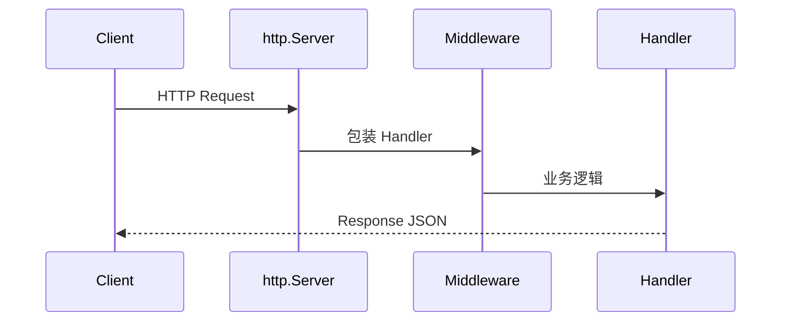

# Go 标准库与 HTTP 基础

> **文件编码**：UTF-8。  
> **定位**：掌握 **net/http、encoding/json、io、testing** 与 **中间件模式**——Gin 之前的原生 HTTP 基础。  
> **前置**：[04 Go 并发编程](./04-Go并发编程goroutine与channel.md)  
> **下一章**：[06 Gin 框架核心与中间件](./06-Gin框架核心与中间件.md)  
> **修订**：2026-07-26 —— 按审查报告修复全部 15 个问题（客户端 err 检查、panic 行为纠正、PowerShell 命令修正等）；新增优雅关机、查询参数/表单/文件上传、静态文件、context 传请求级数据、log/slog、JSON 进阶坑、Benchmark 与 httptest 进阶等小节；每个核心示例都补成"完整可编译清单"，可直接 `go run`。同日二次审校：对照报告逐条复核 15 个问题与 9 个缺失知识点均已落实；全部完整清单在 go 1.26.5 (windows/amd64) 下 `go vet`/`go test` 通过，jsonadv 输出与注释一致，§7.2 的 PowerShell `-bench` 坑经实测确认。

<!-- 修改说明
2026-07-27 去模板化精简：删除知识地图、学习时长、学完你能做什么、闭卷自测、费曼检验、学完标准、章节衔接等仪式性板块；FAQ 中有技术含量的条目（ServeMux 注册纪律、HandlerFunc 适配器、中间件顺序、GET body、Content-Type 惯例、Gin 差异等）已并入正文对应小节后删除问答壳；0.6 手把手迁入 §2.2；"本章与上一章的关系"中的并发模型与时序图并入 §1 开头。正文讲解与全部代码清单原样保留，未改动任何代码。
-->

---

## 0. 读前导读（零基础也能跟上）

### 0.1 用一句话弄懂本章

**一句话**：用标准库 **net/http** 搭 Web 服务与客户端，用 **json** 序列化，用 **testing** 写表驱动测试，并理解 **中间件链**——这是 Gin 的底层原理。

**生活类比**：

| 概念 | 类比 |
|------|------|
| **http.Server** | 餐厅总店：监听门口、分配请求 |
| **Handler** | 每道菜的厨师：收到订单做菜 |
| **Middleware** | 安检→刷卡→上菜：每层包一层 |
| **json.Marshal** | 把菜装标准盒（JSON）外卖 |
| **http.Client** | 顾客打电话点外卖 |

**为什么重要**：面试问 Gin 中间件、Graceful Shutdown 都回到 **net/http**；计网 [HTTP 章节](../../前端学习/计算机网络/) 理论在此落地。

---

### 0.2 你需要提前知道什么

| 水平 | 建议 |
|------|------|
| 学完 04 章 | 正常跟做；HTTP 用 context 超时 |
| 学过计网 | 对照 GET/POST、状态码、Header |
| 直接跳 Gin | **不推荐**；05 至少完成 §2～§5 |

---

## 1. net/http 服务端

先交代 net/http 的并发模型：**每个请求由一个 goroutine 处理**（net/http 默认行为）——所以 [04 章](./04-Go并发编程goroutine与channel.md) 的并发规则在 handler 里全部适用：共享状态要防竞态，超时与取消用 **context**（§1.4、§4 会大量用到）。一条请求的完整旅程：


```mermaid
sequenceDiagram
    participant C as Client
    participant S as http.Server
    participant M as Middleware
    participant H as Handler

    C->>S: HTTP Request
    S->>M: 包装 Handler
    M->>H: 业务逻辑
    H-->>C: Response JSON
```

### 1.1 最简 Server

```go
package main

import (
	"fmt"
	"net/http"
)

func main() {
	http.HandleFunc("/", func(w http.ResponseWriter, r *http.Request) {
		fmt.Fprintln(w, "Hello, HTTP!")
	})
	fmt.Println("Listening on :8080")
	http.ListenAndServe(":8080", nil)
}
```

**术语（Handler）**：实现 `ServeHTTP(ResponseWriter, *Request)` 的类型。

### 1.2 HandlerFunc 与 ServeMux

先说 `http.HandlerFunc`：它是一个**适配器类型**（`type HandlerFunc func(ResponseWriter, *Request)`），自带的 `ServeHTTP` 方法就是"调用自己"——于是任何签名匹配的普通函数，经它一转就实现了 `Handler` 接口。`mux.HandleFunc` 内部做的正是这层转换；§6 中间件里的 `http.HandlerFunc(func(w, r) {...})` 也是同一招。

`ServeMux` 是标准库的**路由器**（multiplexer 的缩写）：它记住"哪个路径交给哪个 handler"，请求进来时负责分发。

```go
// 片段：展示注册方式，属于概念演示；完整可运行版见 §2.2
mux := http.NewServeMux()
mux.HandleFunc("/health", healthHandler)   // healthHandler 的定义见 §1.3
mux.Handle("/api/", someMiddleware(apiHandler)) // 用中间件包住 handler，写法见 §6

http.ListenAndServe(":8080", mux)
```

默认 `DefaultServeMux` 即 `http.HandleFunc` 注册的全局 mux（§1.1 用的就是它）。自己 `NewServeMux()` 的好处：不污染全局状态、可测试、可以同一进程跑多个 mux。

> **ServeMux 的三条注册纪律**：① 注册本身是**并发安全**的（内部有互斥锁），运行中注册不会产生数据竞争；② 但**重复注册同一 pattern 会直接 panic**；③ 注册后**无法注销**。所以惯例是：启动前把路由全部注册完毕，运行中不再动它。

#### Go 1.22+：方法 + 路径参数模式 ⭐

Go 1.22 起 `ServeMux` 的模式串支持"HTTP 方法前缀"和 `{名字}` 路径参数：

```go
// 片段：属于 §2.2 完整清单同款写法
mux := http.NewServeMux()

mux.HandleFunc("GET /health", healthHandler) // 非 GET 请求自动返回 405
mux.HandleFunc("GET /users/{id}", func(w http.ResponseWriter, r *http.Request) {
	id := r.PathValue("id") // 取出路径参数，如 /users/42 → "42"
	fmt.Fprintln(w, id)
})
```

这让小型服务不依赖第三方路由也能表达 405 和路径参数；Gin 仍提供更完整的绑定、校验、中间件和生态。

#### Go 1.22 模式的补充规则（面试与踩坑高频）

除了 `{id}`，还有几条规则需要知道：

```go
// 片段：各条规则示例（可加进 §1.6 完整清单里验证）

// 1. {$}：只匹配 “/” 本身。
//    直接注册 "GET /" 会匹配所有未命中的路径（子树匹配）；
//    加 {$} 后只有根路径命中，其余路径返回 404。
mux.HandleFunc("GET /{$}", homeHandler)

// 2. {path...}：通配剩余多段路径（类似 Gin 的 *filepath）。
//    /files/a/b/c → r.PathValue("path") == "a/b/c"
mux.HandleFunc("GET /files/{path...}", filesHandler)
```

| 规则 | 行为 |
|------|------|
| 优先级 | **更具体的模式获胜**：`GET /users/list` 比 `GET /users/{id}` 优先；与注册顺序无关 |
| 冲突 | 两个模式都可能匹配同一请求且无法比较具体度时，**注册时直接 panic**（启动即暴露，不是运行时才炸） |
| 尾斜杠 | 注册了 `/api/`（以 `/` 结尾 = 匹配整个子树），请求 `/api` 会被 **301 重定向** 到 `/api/`；若你同时注册了 `/api`，则各自精确匹配 |
| 方法不匹配 | 路径命中但方法不匹配时，自动返回 405 并带 `Allow` 响应头 |

### 1.3 ResponseWriter 与 Request

```go
// 片段：healthHandler 的“手工检查方法”版；完整可运行版在 §2.2 清单里
func healthHandler(w http.ResponseWriter, r *http.Request) {
	if r.Method != http.MethodGet { // 手工检查请求方法
		http.Error(w, "method not allowed", http.StatusMethodNotAllowed)
		return
	}
	w.Header().Set("Content-Type", "application/json")
	w.WriteHeader(http.StatusOK)
	fmt.Fprint(w, `{"status":"ok"}`)
}
```

> **两种写法怎么选**：上面的 `if r.Method != ...` 是 Go 1.21 及以前的通用写法。**Go 1.22+ 推荐直接把方法写进注册模式**：`mux.HandleFunc("GET /health", healthHandler)`，mux 会自动替你返回 405，handler 里就不用再写这段检查了。本章后面的完整清单统一用 1.22 写法。

| 字段/方法 | 作用 |
|-----------|------|
| `r.Method` | GET/POST/... |
| `r.URL.Path` | 路径 |
| `r.URL.Query()` | 查询参数（`?name=Tom` 里的部分），详见 §1.6 |
| `r.Header` | 请求头 |
| `r.Body` | 请求体 io.ReadCloser |
| `w.Header().Set` | 响应头 |
| `w.WriteHeader` | 状态码（只能一次） |
| `w.Write` | 响应体 |

先看一眼查询参数最常用的一行（详细讲解在 §1.6）：

```go
// 片段：GET /hello?name=Tom → name == "Tom"；参数不存在时返回 ""
name := r.URL.Query().Get("name")
```

### 1.4 生产级 `http.Server`：超时必须显式配置 ⭐

直接调用 `http.ListenAndServe` 使用的默认 Server 几乎没有业务超时限制。公网服务应显式创建：

```go
// 片段：需要 import "errors"、"log"、"net/http"、"time"；
// 完整可运行版见 §1.5 的优雅关机清单（其中就用了显式 Server）
srv := &http.Server{
	Addr:              ":8080",
	Handler:           mux,
	ReadHeaderTimeout: 3 * time.Second,
	ReadTimeout:       10 * time.Second,
	WriteTimeout:      15 * time.Second,
	IdleTimeout:       60 * time.Second,
	MaxHeaderBytes:    1 << 20, // 1 MiB
}

if err := srv.ListenAndServe(); err != nil && !errors.Is(err, http.ErrServerClosed) {
	log.Fatal(err)
}
```

| 配置 | 防什么 | 注意 |
|------|--------|------|
| `ReadHeaderTimeout` | 客户端慢慢发送 header 占连接（Slowloris） | 通常最应设置 |
| `ReadTimeout` | 整个请求读取过慢 | 大文件上传需单独设计 |
| `WriteTimeout` | handler/响应长期不结束 | SSE/流式响应不能照搬短超时 |
| `IdleTimeout` | Keep-Alive 空闲连接长期占用 | 应大于普通请求耗时 |
| `MaxHeaderBytes` | 超大 header | 仍需限制业务字段和 body |

超时没有万能数值，应按接口类型区分：普通 JSON API、文件上传、SSE 的合理配置不同。超时触发后还要让下游 DB/Redis/HTTP 调用使用 `r.Context()`，否则 handler 返回了，下游工作仍可能继续。

### 1.5 优雅关机（Graceful Shutdown）⭐ 完整可编译清单

**为什么需要**：直接 Ctrl+C 或 `kill` 杀进程时，正在处理一半的请求会被硬生生掐断——用户看到连接错误，写了一半的数据可能不一致。**优雅关机**指：收到退出信号后，① 停止接收新请求；② 给存量请求一段时间做完；③ 再退出进程。这是生产部署（尤其容器滚动更新）的必备能力，也是后端面试高频题。

先认识两个新面孔：

- **信号（signal）**：操作系统通知进程的机制。按 Ctrl+C 会给进程发 `SIGINT`；Docker/K8s 停止容器时先发 `SIGTERM`。
- **`signal.NotifyContext`**：把"收到某个信号"转换成"一个会被取消的 context"——这样就能用第 4 章学过的 `<-ctx.Done()` 来等信号。

**文件**：`gracefulserver/main.go`（新建目录后 `go mod init gracefulserver`）。**运行**：`go run .`

```go
// gracefulserver/main.go —— 优雅关机完整示例
package main

import (
	"context"
	"errors"
	"log"
	"net/http"
	"os/signal"
	"syscall"
	"time"
)

func main() {
	mux := http.NewServeMux()
	mux.HandleFunc("GET /slow", func(w http.ResponseWriter, r *http.Request) {
		time.Sleep(3 * time.Second) // 模拟慢请求，方便观察“等存量请求”
		w.Write([]byte("done\n"))
	})

	srv := &http.Server{
		Addr:              ":8080",
		Handler:           mux,
		ReadHeaderTimeout: 3 * time.Second, // §1.4 讲过的生产级配置
	}

	// 1. 把“收到退出信号”转成一个会被取消的 context。
	ctx, stop := signal.NotifyContext(context.Background(),
		syscall.SIGINT, syscall.SIGTERM)
	defer stop()

	// 2. 服务放到单独的 goroutine 里跑，主 goroutine 留下来等信号。
	go func() {
		log.Println("Listening on :8080")
		if err := srv.ListenAndServe(); err != nil && !errors.Is(err, http.ErrServerClosed) {
			log.Fatalf("listen: %v", err)
		}
	}()

	// 3. 阻塞在这里，直到用户按 Ctrl+C 或容器发来 SIGTERM。
	<-ctx.Done()
	log.Println("shutting down ...")

	// 4. 给存量请求最多 5 秒收尾时间。
	shutdownCtx, cancel := context.WithTimeout(context.Background(), 5*time.Second)
	defer cancel()
	if err := srv.Shutdown(shutdownCtx); err != nil {
		log.Printf("shutdown: %v", err) // 超过 5 秒仍没做完 → 返回 DeadlineExceeded
	}
	log.Println("bye")
}
```

**逐段讲解**：

1. **为什么服务要放进 goroutine**：`ListenAndServe` 是阻塞的。要"边跑服务边等信号"，必须让它俩在不同 goroutine 里。`Shutdown` 被调用后，`ListenAndServe` 会立刻返回 `http.ErrServerClosed`——这是**正常关机的标志**，不是错误，所以要用 `errors.Is` 排除它。
2. **`srv.Shutdown(ctx)` 做了什么**：先关监听端口（新连接进不来），再等所有活跃请求处理完；若传入的 ctx 先超时，则不再等、直接返回错误。
3. **验证方法**（开两个 PowerShell 窗口）：窗口 A `go run .`；窗口 B 执行 `curl.exe http://localhost:8080/slow`，趁它还没返回（3 秒内）回到窗口 A 按 **Ctrl+C**——你会看到窗口 A 打印 `shutting down ...` 但**等窗口 B 拿到 `done` 之后**才打印 `bye`。这就是"等存量请求"。

> **Windows 说明**：Windows 上按 Ctrl+C 触发的就是 `SIGINT`（Go 运行时做了转换）；`SIGTERM` 在 Windows 本地开发中不会被发送，但写上它不影响编译，部署到 Linux 容器（`docker stop` 发的就是 SIGTERM）时正好生效。

短链项目（10～11 章）会直接复用这套关机代码。

### 1.6 查询参数、表单与文件上传 ⭐ 完整可编译清单

CRUD 后端每天都在做三件事：读 **查询参数**（URL 里 `?` 后面的部分）、读 **表单**（HTML `<form>` 提交的键值对）、收 **上传文件**。三者的 API 不同，容易混，下面一个程序全演示。

**文件**：`formserver/main.go`（`go mod init formserver`）。**运行**：`go run .`

```go
// formserver/main.go —— 查询参数 / 表单 / 文件上传完整示例
package main

import (
	"fmt"
	"io"
	"log"
	"net/http"
	"os"
	"path/filepath"
)

// GET /hello?name=Tom&tags=a&tags=b
func helloHandler(w http.ResponseWriter, r *http.Request) {
	q := r.URL.Query() // 类型是 url.Values，本质是 map[string][]string
	name := q.Get("name") // 取第一个值；参数不存在返回 ""
	if name == "" {
		name = "world"
	}
	tags := q["tags"] // 同名参数出现多次时，用下标取全部值
	fmt.Fprintf(w, "hello %s, tags=%v\n", name, tags)
}

// POST /login （Content-Type: application/x-www-form-urlencoded）
func loginHandler(w http.ResponseWriter, r *http.Request) {
	if err := r.ParseForm(); err != nil { // 必须先 Parse 才能取值
		http.Error(w, "bad form", http.StatusBadRequest)
		return
	}
	user := r.PostFormValue("user") // 只取请求体里的表单字段
	pass := r.PostFormValue("pass") // （r.FormValue 会把 URL 查询参数也混进来）
	if user == "admin" && pass == "123456" {
		fmt.Fprintln(w, "login ok")
		return
	}
	http.Error(w, "wrong user or pass", http.StatusUnauthorized)
}

// POST /upload （Content-Type: multipart/form-data）
func uploadHandler(w http.ResponseWriter, r *http.Request) {
	// 32 MiB 内存上限；超出的部分自动落到临时文件，不会爆内存
	if err := r.ParseMultipartForm(32 << 20); err != nil {
		http.Error(w, "bad multipart form", http.StatusBadRequest)
		return
	}
	file, header, err := r.FormFile("file") // "file" 是表单字段名
	if err != nil {
		http.Error(w, "missing form field: file", http.StatusBadRequest)
		return
	}
	defer file.Close()

	if err := os.MkdirAll("uploads", 0o755); err != nil {
		http.Error(w, "server error", http.StatusInternalServerError)
		return
	}
	// filepath.Base 去掉路径部分：防止 "..\..\evil.exe" 这类文件名逃出目录
	safeName := filepath.Base(header.Filename)
	dst, err := os.Create(filepath.Join("uploads", safeName))
	if err != nil {
		http.Error(w, "save failed", http.StatusInternalServerError)
		return
	}
	defer dst.Close()

	if _, err := io.Copy(dst, file); err != nil {
		http.Error(w, "save failed", http.StatusInternalServerError)
		return
	}
	fmt.Fprintf(w, "saved %s (%d bytes)\n", safeName, header.Size)
}

func main() {
	mux := http.NewServeMux()
	mux.HandleFunc("GET /hello", helloHandler)
	mux.HandleFunc("POST /login", loginHandler)
	mux.HandleFunc("POST /upload", uploadHandler)

	// —— 静态文件路由，讲解见 §1.7 ——
	mux.Handle("GET /static/", http.StripPrefix("/static/",
		http.FileServer(http.Dir("./public"))))
	mux.HandleFunc("GET /download", func(w http.ResponseWriter, r *http.Request) {
		http.ServeFile(w, r, "./public/report.txt")
	})

	log.Println("Listening on :8080")
	log.Fatal(http.ListenAndServe(":8080", mux))
}
```

**PowerShell 验证**（另开窗口）：

```powershell
# 查询参数
curl.exe "http://localhost:8080/hello?name=Tom&tags=a&tags=b"
# → hello Tom, tags=[a b]

# 表单登录（Invoke-RestMethod 会自动把哈希表编码成表单）
Invoke-RestMethod -Uri http://localhost:8080/login -Method Post -Body @{user='admin'; pass='123456'}
# → login ok

# 文件上传（curl.exe 的 -F 自动构造 multipart/form-data）
"hello upload" | Out-File -Encoding utf8 test.txt
curl.exe -F "file=@test.txt" http://localhost:8080/upload
# → saved test.txt (...bytes)
```

**三个易混 API 对比**：

| API | 数据来源 | 适用 Content-Type |
|-----|----------|--------------------|
| `r.URL.Query().Get("k")` | 只看 URL `?k=v` | 任意（GET 常用） |
| `r.ParseForm()` + `r.PostFormValue("k")` | 只看请求体表单 | `application/x-www-form-urlencoded` |
| `r.ParseMultipartForm(n)` + `r.FormFile("k")` | multipart 请求体 | `multipart/form-data`（带文件时） |

> **和 JSON 的关系**：JSON API（§2）读的是 `r.Body` 原始字节流，跟表单 API 是两条路，**不要混用**——JSON 请求体调 `ParseForm` 拿不到任何字段。
>
> **GET 能带请求体吗**：HTTP 规范不推荐（部分代理和服务端会忽略甚至拒绝 GET 的 body）。GET 传参就用查询参数；要传结构化数据，改用 POST + JSON。

### 1.7 静态文件服务

§1.6 清单里已经包含两条静态文件路由，这里解释它们：

```go
// 片段：完整版在 §1.6 清单的 main 里

// 目录托管：请求 /static/app.css → 返回 ./public/app.css 文件内容
mux.Handle("GET /static/", http.StripPrefix("/static/",
	http.FileServer(http.Dir("./public"))))

// 单文件：任何路径都返回这一个文件（常用于下载接口、SPA 的 index.html）
mux.HandleFunc("GET /download", func(w http.ResponseWriter, r *http.Request) {
	http.ServeFile(w, r, "./public/report.txt")
})
```

- **`http.FileServer(http.Dir("./public"))`**：返回一个"文件服务 handler"，把请求路径映射为目录下的文件。
- **为什么要 `StripPrefix`**：请求路径是 `/static/app.css`，但文件在 `./public/app.css`——需要先把 `/static/` 前缀剥掉，剩下 `app.css` 再去目录里找。不剥的话它会去找 `./public/static/app.css`，404。
- **目录穿越风险**：`FileServer` 和 `ServeFile` 内部会清理 `..`，直接用是安全的。危险的是**自己拼路径**：`http.ServeFile(w, r, "./files/"+r.URL.Query().Get("name"))` 这种写法，攻击者传 `name=..\..\go.mod` 就能读到目录外的文件。规则：凡是用户输入参与文件路径，必须 `filepath.Base()` 或白名单校验（§1.6 上传代码里的 `safeName` 就是这么做的）。

---

## 2. JSON API 示例

### 2.1 请求/响应 struct

```go
// 片段：属于 §2.2 完整清单
type EchoRequest struct {
	Message string `json:"message"`
}

type EchoResponse struct {
	Code int    `json:"code"`
	Data string `json:"data"`
}
```

反引号里的 `json:"message"` 是 **struct tag**：告诉 json 包"这个字段在 JSON 里叫 message"。详见 §3。

### 2.2 完整 echo 服务 ⭐ 完整可编译清单（15 分钟手把手）

**动手步骤**：① 建目录并初始化模块（命令见下）；② 新建 `main.go`，**整份粘贴下面的清单**（带 `package main` 和全部 import），保存后无红线；③ `go run .`，打印 `Listening on :8080` 即成功；④ 另开一个 PowerShell 窗口执行清单后面的验证命令。

第 ① 步的确切命令（PowerShell）：

```powershell
mkdir httpserver
cd httpserver
go mod init httpserver
```

**文件**：`httpserver/main.go`。**运行**：`go run .`

```go
// httpserver/main.go —— 本章第一个完整可运行的 JSON API 服务
package main

import (
	"encoding/json"
	"errors"
	"fmt"
	"io"
	"log"
	"net/http"
)

// EchoRequest 请求体：{"message":"hi"}
type EchoRequest struct {
	Message string `json:"message"`
}

// EchoResponse 响应体：{"code":0,"data":"hi"}
type EchoResponse struct {
	Code int    `json:"code"`
	Data string `json:"data"`
}

// errorResponse 统一的 JSON 错误格式（设计理由见 §2.3）
type errorResponse struct {
	Code int    `json:"code"`
	Msg  string `json:"msg"`
}

// writeJSONError 把错误按统一 JSON 格式写回客户端（讲解见 §2.3）
func writeJSONError(w http.ResponseWriter, status int, msg string) {
	w.Header().Set("Content-Type", "application/json")
	w.WriteHeader(status)
	if err := json.NewEncoder(w).Encode(errorResponse{Code: status, Msg: msg}); err != nil {
		log.Printf("encode error response: %v", err)
	}
}

func healthHandler(w http.ResponseWriter, r *http.Request) {
	// 注册用的是 "GET /health"，非 GET 已被 mux 拦下（405），无需手工检查
	w.Header().Set("Content-Type", "application/json")
	fmt.Fprint(w, `{"status":"ok"}`)
}

func echoHandler(w http.ResponseWriter, r *http.Request) {
	// 服务端会在请求结束后关闭 Body；这里重点是限制读取大小：
	// 恶意客户端可能发几个 GB 的 body，不限制就会被打爆内存。
	r.Body = http.MaxBytesReader(w, r.Body, 1<<20) // 最大 1 MiB

	var req EchoRequest
	dec := json.NewDecoder(r.Body)
	dec.DisallowUnknownFields() // 出现未知字段直接报错，尽早暴露客户端拼写错误
	if err := dec.Decode(&req); err != nil {
		// 先区分“body 超限”（应答 413）和“JSON 写错”（应答 400）
		var mbe *http.MaxBytesError // Go 1.19+，MaxBytesReader 超限时返回的错误类型
		if errors.As(err, &mbe) {
			writeJSONError(w, http.StatusRequestEntityTooLarge, "request body too large")
			return
		}
		writeJSONError(w, http.StatusBadRequest, "bad json")
		return
	}
	// 再 Decode 一次应读到 EOF；否则说明 body 里塞了不止一个 JSON 值
	if err := dec.Decode(&struct{}{}); !errors.Is(err, io.EOF) {
		writeJSONError(w, http.StatusBadRequest, "body must contain one JSON value")
		return
	}

	resp := EchoResponse{Code: 0, Data: req.Message}
	w.Header().Set("Content-Type", "application/json")
	if err := json.NewEncoder(w).Encode(resp); err != nil {
		// 走到这里响应头已发出，只能记日志，没法再改状态码
		log.Printf("encode response: %v", err)
	}
}

func main() {
	mux := http.NewServeMux()
	// Go 1.22 方法路由：方法不匹配自动 405（§1.2）
	mux.HandleFunc("GET /health", healthHandler)
	mux.HandleFunc("POST /api/echo", echoHandler)

	log.Println("Listening on :8080")
	log.Fatal(http.ListenAndServe(":8080", mux))
}
```

**逐段讲解**（按代码顺序）：

1. **`MaxBytesReader`**：把 `r.Body` 包一层"限流阀"，读满 1 MiB 就报错。任何接收 body 的公网接口都应该有这层。
2. **`DisallowUnknownFields`**：默认情况下 JSON 里多出来的字段会被静默忽略——客户端把 `message` 拼成 `mesage` 也不报错，排查半天。打开这个开关能尽早暴露问题。
3. **错误分流**：body 超限时 `Decode` 返回的是 `*http.MaxBytesError`（Go 1.19+ 专门的错误类型），用 `errors.As` 识别后返回 **413**；其余解码错误才是客户端 JSON 写错，返回 **400**。区分这两种情况是常见的后端细节考点。
4. **二次 `Decode` 校验**：确保 body 里只有一个 JSON 值，拒绝 `{"message":"a"}{"message":"b"}` 这种流。
5. **注册用 `"POST /api/echo"`**：§1.2 讲过的 1.22 方法路由，非 POST 自动 405，handler 里不再需要 `if r.Method != ...`（老写法与它等价，1.22+ 推荐新写法）。

**PowerShell 验证**（另开窗口；⚠️ 命令里的坑见 §2.3）：

```powershell
# 先打 health 接口（注意必须写 curl.exe 而不是 curl，原因见 §2.3）
curl.exe http://localhost:8080/health
# → {"status":"ok"}
# 或用 PowerShell 原生命令：
Invoke-RestMethod -Uri http://localhost:8080/health

# 再打 echo 接口——
# 方式一：curl.exe + --%（停止解析符，让后面的参数原样传给 curl，不被 PowerShell 加工）
curl.exe --% -X POST http://localhost:8080/api/echo -H "Content-Type: application/json" -d "{\"message\":\"hi\"}"

# 方式二：PowerShell 原生（推荐，无转义烦恼）
Invoke-RestMethod -Uri http://localhost:8080/api/echo -Method Post -ContentType 'application/json' -Body '{"message":"hi"}'
```

**预期**：

```json
{"code":0,"data":"hi"}
```

顺手验证防御逻辑是否生效：

```powershell
# 未知字段 → 400 bad json（DisallowUnknownFields 起作用）
# 注意：Invoke-RestMethod 遇到 4xx/5xx 会抛红字异常，异常信息里能看到 (400)——这正是预期结果，不是命令写错
Invoke-RestMethod -Uri http://localhost:8080/api/echo -Method Post -ContentType 'application/json' -Body '{"mesage":"typo"}'

# GET 打 POST 接口 → 405（方法路由起作用）
curl.exe -i http://localhost:8080/api/echo
```

### 2.3 两个必须知道的细节：PowerShell 的 curl 坑 + 统一 JSON 错误响应

**坑 1：PowerShell 里的 `curl` 不是 curl**。Windows PowerShell 5.1 中 `curl` 是 `Invoke-WebRequest` 的**别名**，不认识 `-X`、`-d`、`-H`，直接照抄 Linux 教程的 curl 命令会报参数错误。另外 `\"` 是 cmd.exe 的转义风格，PowerShell 会先按自己的规则拆解字符串，JSON 常被拆坏。解决办法（本章统一采用）：

| 写法 | 说明 |
|------|------|
| `curl.exe --% ...` | 显式调用真 curl（Win10/11 自带）；`--%` 是"停止解析符"，其后参数原样透传 |
| `Invoke-RestMethod ...` | PowerShell 原生，自动解析 JSON 响应，单引号包 JSON 无转义问题 |

**坑 2：`http.Error` 返回的是纯文本**。它的响应头是 `Content-Type: text/plain`，而我们的 API 成功时返回 JSON——客户端就得写两套解析逻辑。实际项目的惯例是**成功和失败都返回同一种 JSON 结构**（和 `EchoResponse{Code, Data}` 风格衔接）：

```go
// 片段：完整版在 §2.2 清单里
func writeJSONError(w http.ResponseWriter, status int, msg string) {
	w.Header().Set("Content-Type", "application/json") // 必须在 WriteHeader 之前设
	w.WriteHeader(status)                              // 状态码只能发一次（§1.3）
	if err := json.NewEncoder(w).Encode(errorResponse{Code: status, Msg: msg}); err != nil {
		log.Printf("encode error response: %v", err)
	}
}
```

注意顺序：**先设 Header、再 WriteHeader、最后写 body**——`WriteHeader` 一旦调用，响应头就定格了，之后再 `Header().Set` 无效。下一章会看到 Gin 的 `c.JSON(code, obj)` 就是这套逻辑的封装。

顺带回答"每个 JSON 响应都设 `Content-Type: application/json` 是不是必须"：是 REST 的硬性惯例——客户端、浏览器和各类 SDK 靠它决定怎么解析响应体，漏设时响应可能被当成纯文本处理，表现为"数据明明是对的、客户端就是解析不出来"。

---

## 3. encoding/json

### 3.1 基础用法

```go
// 片段：Marshal/Unmarshal 基本形态
type User struct {
	ID     int64  `json:"id"`
	Name   string `json:"name"`
	Secret string `json:"-"` // "-" 表示永不序列化（密码、内部字段）
}

u := User{ID: 1, Name: "Tom", Secret: "x"}
data, err := json.Marshal(u)   // struct → []byte：{"id":1,"name":"Tom"}
err = json.Unmarshal(data, &u) // []byte → struct（注意传指针）
```

| 要点 | 说明 |
|------|------|
| 导出字段 | **大写** 才序列化（小写字段 json 包看不见） |
| tag | `json:"name,omitempty"`（omitempty 的坑见 §3.2） |
| 流式 | `NewEncoder(w).Encode` 适合 HTTP（省一次中间 []byte） |
| 数字到 any | 默认 **float64**（大整数会丢精度，见 §3.3） |

### 3.2 omitempty 的坑与"指针字段"技巧 ⭐

`omitempty` 的规则：字段为**零值**（false、0、空字符串、nil、空 map/slice）时不输出。两个高频坑：

**坑 1：合法的 0 也会被省略**。字段 `Age int` 配上 tag `json:"age,omitempty"` 后，用户年龄真的是 0 岁时字段直接消失，客户端以为"没传"。

**坑 2：`time.Time` 等 struct 类型的 omitempty 不生效**。omitempty 只认基本类型的零值，struct 永远会被编码——零值时间会输出成 `"0001-01-01T00:00:00Z"`。

**解决方案：指针字段**。指针的零值是 `nil`，omitempty 认得它；同时还能区分"客户端没传这个字段"和"客户端传了零值"——这在做 PATCH 局部更新接口时是刚需：

```go
// jsonadv/main.go 的核心部分（完整可运行清单见 §3.3）
type Profile struct {
	Age       int       `json:"age,omitempty"`        // 坑 1：Age=0 时字段消失
	CreatedAt time.Time `json:"created_at,omitempty"` // 坑 2：omitempty 无效
	Nickname  *string   `json:"nickname"`             // 指针：nil = 没传，指向"" = 传了空串
}

p := Profile{}
b, _ := json.Marshal(p)
fmt.Println(string(b))
// 输出：{"created_at":"0001-01-01T00:00:00Z","nickname":null}
// 注意：age 消失了；created_at 的 omitempty 没拦住零值时间

var in Profile
json.Unmarshal([]byte(`{"nickname":""}`), &in)
fmt.Println(in.Nickname != nil) // true：客户端传了空字符串

var in2 Profile
json.Unmarshal([]byte(`{}`), &in2)
fmt.Println(in2.Nickname == nil) // true：客户端根本没传
```

### 3.3 json.RawMessage 与 Decoder.UseNumber ⭐ 完整可编译清单

再补两个实战工具，然后给出本节全部示例的可运行清单。

**`json.RawMessage`（延迟解析）**：消息类系统常见"信封"结构——外层有个 `type` 字段，`data` 的具体结构要看 `type` 才知道。把 `data` 声明为 `json.RawMessage`，第一遍解析时它保持原始字节不动，看完 `type` 再二次解析。

**`Decoder.UseNumber`（防大整数精度丢失）**：JSON 数字解析到 `any` 时默认变 `float64`，而 float64 只能精确表示到 2^53——雪花算法生成的 64 位 ID（第 10 章短链项目会用）会被悄悄改值。`UseNumber()` 让数字先保存为字符串形态的 `json.Number`，需要时再 `Int64()`。

**文件**：`jsonadv/main.go`（`go mod init jsonadv`）。**运行**：`go run .`

```go
// jsonadv/main.go —— encoding/json 进阶示例（含 §3.2 的坑演示）
package main

import (
	"encoding/json"
	"fmt"
	"strings"
	"time"
)

type Profile struct {
	Age       int       `json:"age,omitempty"`
	CreatedAt time.Time `json:"created_at,omitempty"`
	Nickname  *string   `json:"nickname"`
}

type Envelope struct {
	Type string          `json:"type"`
	Data json.RawMessage `json:"data"` // 先按原始字节存着，不解析
}

type TextData struct {
	Content string `json:"content"`
}

func main() {
	// —— §3.2：omitempty 的坑 ——
	p := Profile{}
	b, _ := json.Marshal(p)
	fmt.Println(string(b)) // {"created_at":"0001-01-01T00:00:00Z","nickname":null}

	// —— §3.2：指针字段区分“没传”与“零值” ——
	var in Profile
	json.Unmarshal([]byte(`{"nickname":""}`), &in)
	fmt.Println(in.Nickname != nil) // true

	var in2 Profile
	json.Unmarshal([]byte(`{}`), &in2)
	fmt.Println(in2.Nickname == nil) // true

	// —— RawMessage 延迟解析 ——
	var env Envelope
	json.Unmarshal([]byte(`{"type":"text","data":{"content":"hi"}}`), &env)
	if env.Type == "text" { // 看完 type 再决定 data 怎么解析
		var td TextData
		json.Unmarshal(env.Data, &td)
		fmt.Println(td.Content) // hi
	}

	// —— UseNumber 避免大整数精度丢失 ——
	dec := json.NewDecoder(strings.NewReader(`{"id": 9007199254740993}`))
	dec.UseNumber()
	var m map[string]any
	dec.Decode(&m)
	n := m["id"].(json.Number)
	id, err := n.Int64()
	fmt.Println(id, err) // 9007199254740993 <nil> —— 精度完好

	// 对比：默认 float64 会丢精度
	var m2 map[string]any
	json.Unmarshal([]byte(`{"id": 9007199254740993}`), &m2)
	fmt.Printf("%.0f\n", m2["id"].(float64)) // 9007199254740992 —— 错了！
}
```

> **展望**：Go 1.25 起标准库有实验性的 `encoding/json/v2`（需设置 `GOEXPERIMENT=jsonv2`），修正了 v1 的诸多历史设计（omitempty 语义、性能等）。目前学习和求职仍以 v1 为准，知道有这个方向即可。至于 sonic、gjson 等高性能第三方 JSON 库：标准库对绝大多数业务完全够用，等性能分析证明 JSON 确实是瓶颈时再引入。

---

## 4. http.Client

### 4.0 生产级客户端 ⭐ 完整可编译清单

**文件**：`httpclient/main.go`（`go mod init httpclient`）。**运行**：`go run .`（需要联网；请求的 httpbin.org 是一个免费的 HTTP 测试服务）

```go
// httpclient/main.go —— 生产级 http.Client 完整示例
package main

import (
	"context"
	"encoding/json"
	"fmt"
	"io"
	"log"
	"net/http"
	"time"
)

// 全局复用：Client/Transport 并发安全，整个程序只建一次（原因见 §4.1）。
var apiClient = newAPIClient()

func newAPIClient() *http.Client {
	// 基于 DefaultTransport 克隆：保留 Proxy（读 HTTP_PROXY 环境变量）、
	// 带 30s 超时的 DialContext 等默认行为，只改我们关心的字段。
	// 若从零 &http.Transport{} 手写，这些默认能力会全部丢失——
	// 公司内网走代理时请求会莫名失败，拨号也没有超时兜底。
	t := http.DefaultTransport.(*http.Transport).Clone()
	t.MaxIdleConnsPerHost = 20                  // 每个目标主机的空闲连接数上限
	t.ResponseHeaderTimeout = 5 * time.Second   // 等响应头的超时

	return &http.Client{
		Transport: t,
		Timeout:   10 * time.Second, // 总超时：连接 + 重定向 + 读完响应体
	}
}

// fetchJSON 请求 rawURL 并把响应 JSON 解析进 out。
func fetchJSON(ctx context.Context, rawURL string, out any) error {
	// 单次调用再套一层更短的超时（总开关 Client.Timeout 是兜底）
	ctx, cancel := context.WithTimeout(ctx, 3*time.Second)
	defer cancel()

	req, err := http.NewRequestWithContext(ctx, http.MethodGet, rawURL, nil)
	if err != nil { // ⚠️ 必须立即检查！见下方“坏习惯警告”
		return fmt.Errorf("new request: %w", err)
	}
	resp, err := apiClient.Do(req)
	if err != nil {
		return fmt.Errorf("do request: %w", err)
	}
	defer resp.Body.Close()

	// 状态码不是网络错误，要自己检查（§4.2）
	if resp.StatusCode < 200 || resp.StatusCode >= 300 {
		msg, _ := io.ReadAll(io.LimitReader(resp.Body, 8<<10))
		return fmt.Errorf("upstream status=%d body=%q", resp.StatusCode, msg)
	}

	// LimitReader 限制最多读 2 MiB，防对方返回超大 body
	body, err := io.ReadAll(io.LimitReader(resp.Body, 2<<20))
	if err != nil {
		return fmt.Errorf("read body: %w", err)
	}
	if err := json.Unmarshal(body, out); err != nil {
		return fmt.Errorf("unmarshal: %w", err)
	}
	return nil
}

func main() {
	var out map[string]any
	if err := fetchJSON(context.Background(), "https://httpbin.org/json", &out); err != nil {
		log.Fatal(err)
	}
	fmt.Println(out)
}
```

> **坏习惯警告（真实线上事故模式）**：`NewRequestWithContext` 之后如果不检查 err，直接写下一行 `resp, err := client.Do(req)`，第二个 `:=` 会把上一个 err **悄悄覆盖掉**。当 URL 非法（含控制字符、畸形 scheme）时 `NewRequestWithContext` 返回 `(nil, err)`，`client.Do(nil)` 会在内部解引用 nil 直接 **panic**。规则：**每一个返回 error 的调用都必须立即检查**，绝不允许让下一个 `:=` 覆盖上一个还没看过的 err。

> **`fmt.Errorf` 里的 `%w`**：包装错误——外层加上下文信息，内层原始错误还能被 `errors.Is/As` 识别（§4.4 判定超时时就靠它）。第 3 章讲过，这里是它在 HTTP 客户端的典型应用。

### 4.1 Client/Transport 必须复用

`http.Client` 和 `http.Transport` 可以安全并发使用，应作为长期对象复用。每个请求都 `&http.Client{}` 会浪费连接池，导致重复 TCP/TLS 握手和端口压力。

响应体需要关闭。若希望连接复用，通常还要把 body 读到 EOF；对于不可信的大响应，应先设置读取上限或主动放弃复用，不能为了复用无限制 `io.Copy`。

### 4.2 状态码不是网络错误

`client.Do` 在收到 HTTP 404/500 时通常 `err == nil`，因为网络交互本身成功；业务必须检查状态码：

```go
// 片段：§4.0 清单中已包含这段逻辑
if resp.StatusCode < 200 || resp.StatusCode >= 300 {
	msg, _ := io.ReadAll(io.LimitReader(resp.Body, 8<<10))
	return fmt.Errorf("upstream status=%d body=%q", resp.StatusCode, msg)
}
```

日志中不要原样记录可能含密钥、Cookie 或个人信息的响应体。

### 4.3 SSRF：后端不能盲目请求用户给的 URL ⭐

如果短链项目增加“抓取网页标题/预览图”，服务端会主动请求用户 URL，必须防 SSRF：攻击者可能让服务访问 `127.0.0.1`、云元数据地址、内网 MySQL/Redis 或通过重定向绕过首次检查。

最低防线：

1. 只允许 `http/https`，拒绝 `file://`、`gopher://` 等协议。
2. 解析主机并检查所有解析出的 IP，拒绝 loopback、private、link-local、multicast、unspecified。
3. 自定义 `DialContext` 在真正连接前再次校验解析结果，防 DNS rebinding。
4. `CheckRedirect` 对每次重定向后的目标重复校验，并限制跳转次数。
5. 设置连接、响应头、总超时和响应体大小上限。
6. 生产环境配合出站网络策略；应用层校验不能替代网络隔离。

仅校验字符串是否以 `http` 开头完全不够；`http://127.0.0.1` 本身就是合法 HTTP URL。

### 4.4 超时错误的判定与重试 ⭐

调第三方 API 时，"失败了怎么办"和"怎么发请求"同样重要。两件事：**判定错误类型**、**带退避的重试**。

**判定**：`client.Do` 失败时返回的是 `*url.Error`（包着操作名、URL 和底层错误）。超时（无论是 `Client.Timeout` 到期还是 ctx 超时，Go 1.16+ 二者统一）都能用 `errors.Is(err, context.DeadlineExceeded)` 识别：

```go
// 片段：错误分类函数，可直接加进 §4.0 的 httpclient/main.go
// 需要额外 import "errors"、"net/url"
func classify(err error) string {
	if errors.Is(err, context.DeadlineExceeded) {
		return "timeout" // 超时：通常值得重试
	}
	var ue *url.Error
	if errors.As(err, &ue) { // 解包看细节：哪个操作、哪个 URL、是否超时类
		return fmt.Sprintf("op=%s url=%s timeout=%v", ue.Op, ue.URL, ue.Timeout())
	}
	return "other"
}
```

**重试**：网络抖动是常态，第三方 API 调用的标配是"失败后等一会儿再试，且每次等待时间翻倍"（**指数退避**，exponential backoff），避免把已经不堪重负的对方打得更死：

```go
// 片段：指数退避重试，依赖 §4.0 的 fetchJSON；
// 需要额外 import "errors"
func fetchWithRetry(ctx context.Context, rawURL string, maxRetries int) (map[string]any, error) {
	var lastErr error
	for attempt := 0; attempt <= maxRetries; attempt++ {
		if attempt > 0 {
			// 第 1 次重试等 500ms，第 2 次 1s，第 3 次 2s……（1<<n 即 2 的 n 次方）
			backoff := time.Duration(1<<(attempt-1)) * 500 * time.Millisecond
			select {
			case <-ctx.Done(): // 等待期间上层取消了就立刻退出，别傻等
				return nil, ctx.Err()
			case <-time.After(backoff):
			}
		}
		var out map[string]any
		err := fetchJSON(ctx, rawURL, &out)
		if err == nil {
			return out, nil
		}
		lastErr = err
		if errors.Is(err, context.Canceled) {
			return nil, err // 上层主动取消，重试没有意义
		}
	}
	return nil, fmt.Errorf("after %d retries: %w", maxRetries, lastErr)
}
```

**两条纪律**：

1. **只重试幂等请求**。GET 重试安全；POST"创建订单"这类接口盲目重试会造成重复下单，需要幂等键（idempotency key）配合，第 14 章展开。
2. **重试要有上限和总时间预算**，且通常只对超时/5xx 重试，4xx（参数错、没权限）重试一万次也不会变对。

**关联计网**：[计算机网络](../../前端学习/计算机网络/) — Keep-Alive、TLS、DNS。

---

## 5. io 与 bufio

```go
// 片段：三种常用读取方式（需要 import "bufio"、"io"、"log"、"os"；
// 其中 f 是 os.Open 打开的 *os.File，dstWriter/srcReader 泛指任意 Writer/Reader）

// 一次性读整个文件到 []byte（不是字符串；要字符串再 string(b) 转换）
b, err := os.ReadFile("config.json")
if err != nil {
	log.Fatal(err)
}

// 流式拷贝：边读边写，内存占用恒定，适合大文件
if _, err := io.Copy(dstWriter, srcReader); err != nil {
	log.Fatal(err)
}

// 按行扫描（读日志、逐行处理大文件）
scanner := bufio.NewScanner(f)
// 默认单行上限约 64KB，超长行会报 bufio.ErrTooLong；
// 处理日志这类可能有超长行的文件时，先扩大缓冲：
scanner.Buffer(make([]byte, 0, 1024*1024), 1024*1024) // 上限提到 1 MiB
for scanner.Scan() {
	line := scanner.Text()
	_ = line // 处理这一行
}
// ⚠️ 循环结束 ≠ 读完了：可能是中途出错。必须检查 Err()，否则错误被静默吞掉
if err := scanner.Err(); err != nil {
	log.Fatalf("scan: %v", err)
}
```

Go 1.16+：`ioutil.ReadFile` → `os.ReadFile`；`ioutil.ReadAll` → `io.ReadAll`（`ioutil` 包已整体废弃，新代码不要再 import 它）。

---

## 6. 中间件模式（Gin 前置）⭐

### 6.1 什么是中间件

**中间件（middleware）**是"包住 handler 的函数"：拿到一个 `http.Handler`，返回一个新的 `http.Handler`，新 handler 可以在调用原 handler **之前/之后**插入自己的逻辑（记日志、鉴权、兜 panic……）。类型签名是理解一切的钥匙：

```go
// 片段：中间件的类型签名（完整版见 §6.3 清单）
type Middleware func(http.Handler) http.Handler
```

多个中间件层层包裹，就形成 **洋葱模型**——请求从外往里穿，响应从里往外出：


```mermaid
flowchart LR
    REQ[Request] --> R[Recovery]
    R --> RID[RequestID]
    RID --> L[Logger]
    L --> M[ServeMux 路由]
    M --> H[业务 Handler]
```

Gin 的 `router.Use()` 就是这个模型的封装（下一章）。Gin 与原生的差别不只是写法糖：它基于 httprouter 的基数树路由，匹配比 `ServeMux` 更快（学习阶段这点性能差异可忽略），真正的价值在于路由分组、参数绑定与校验、统一的 Context 封装这些工程能力——这正是 06 章要解决的 net/http 痛点。

### 6.2 用 context 传递请求级数据（RequestID）⭐

**场景**：一条请求进来，Logger 要打日志、业务 handler 要打日志、出错时还要能把同一请求的所有日志串起来——需要一个**请求级唯一 ID** 贯穿整条处理链。这类"跟着单个请求走的数据"（请求 ID、认证后的用户信息等）标准做法是放进 **`r.Context()`**：

```go
// 片段：属于 §6.3 完整清单
type ctxKey int // 自定义未导出类型做 key，避免与其他包的 key 冲突

const requestIDKey ctxKey = 0

func RequestID(next http.Handler) http.Handler {
	return http.HandlerFunc(func(w http.ResponseWriter, r *http.Request) {
		id := newRequestID() // 生成随机 ID，函数定义见 §6.3 清单
		// context 不可变：WithValue 生成带新数据的“子 context”，
		// 再用 r.WithContext 生成携带它的新 *Request 传给下一层
		ctx := context.WithValue(r.Context(), requestIDKey, id)
		w.Header().Set("X-Request-ID", id) // 也回给客户端，方便对账排障
		next.ServeHTTP(w, r.WithContext(ctx))
	})
}

// RequestIDFrom 从 context 取回请求 ID；handler 和更深的下游函数都能调用
func RequestIDFrom(ctx context.Context) string {
	id, _ := ctx.Value(requestIDKey).(string) // 类型断言失败时得到 ""，不 panic
	return id
}
```

三个要点：

1. **key 用自定义类型**（`type ctxKey int`）而不是字符串——不同包各自定义的 `"requestID"` 字符串会互相覆盖，未导出的自定义类型天然隔离。
2. **`r.WithContext(ctx)` 返回新的 Request**，必须把这个新的传给 `next.ServeHTTP`，改原来的 `r` 没用。
3. **只放请求级元数据**（ID、用户身份），不要把业务参数当"全局变量"塞 context——那会让函数依赖变得不可见。

这正是下一章 Gin `c.Set("user", u)` / `c.Get("user")` 的底层原理。

### 6.3 Logger + Recovery + RequestID ⭐ 完整可编译清单

Logger 这里直接用 **log/slog**（Go 1.21+ 标准库的结构化日志）：`slog.Info("消息", "键1", 值1, "键2", 值2)`，键值对形式输出，方便日志系统检索。它是 2026 年新项目的默认选择，zap 到第 12 章再对比。

**文件**：`middleware/main.go`（`go mod init middleware`）。**运行**：`go run .`

```go
// middleware/main.go —— Logger + Recovery + RequestID 中间件完整示例
package main

import (
	"context"
	"crypto/rand"
	"encoding/hex"
	"fmt"
	"log"
	"log/slog"
	"net/http"
	"runtime/debug"
	"time"
)

type Middleware func(http.Handler) http.Handler

// ---- RequestID：用 context 传递请求级数据（讲解见 §6.2） ----

type ctxKey int

const requestIDKey ctxKey = 0

func newRequestID() string {
	b := make([]byte, 8)
	rand.Read(b) // crypto/rand 随机字节；Go 1.24+ 保证不失败
	return hex.EncodeToString(b)
}

func RequestID(next http.Handler) http.Handler {
	return http.HandlerFunc(func(w http.ResponseWriter, r *http.Request) {
		id := newRequestID()
		ctx := context.WithValue(r.Context(), requestIDKey, id)
		w.Header().Set("X-Request-ID", id)
		next.ServeHTTP(w, r.WithContext(ctx))
	})
}

func RequestIDFrom(ctx context.Context) string {
	id, _ := ctx.Value(requestIDKey).(string)
	return id
}

// ---- Logger：slog 结构化日志 ----

func Logger(next http.Handler) http.Handler {
	return http.HandlerFunc(func(w http.ResponseWriter, r *http.Request) {
		start := time.Now()
		next.ServeHTTP(w, r) // 先放行到里层
		slog.Info("request done", // 回程时记录（所以能算出耗时）
			"request_id", RequestIDFrom(r.Context()),
			"method", r.Method,
			"path", r.URL.Path,
			"cost", time.Since(start))
	})
}

// ---- Recovery：兜住 handler 里的 panic ----

func Recovery(next http.Handler) http.Handler {
	return http.HandlerFunc(func(w http.ResponseWriter, r *http.Request) {
		defer func() {
			if rec := recover(); rec != nil {
				// debug.Stack() 打出完整调用栈——没有栈的 panic 日志等于没记
				log.Printf("panic: %v\n%s", rec, debug.Stack())
				// 注意：若 panic 前 handler 已写过响应头，这行会触发
				// “superfluous WriteHeader”日志且改不了已发出的状态码，
				// 只能尽力而为
				http.Error(w, "internal error", http.StatusInternalServerError)
			}
		}()
		next.ServeHTTP(w, r)
	})
}

func main() {
	mux := http.NewServeMux()
	mux.HandleFunc("GET /hello", func(w http.ResponseWriter, r *http.Request) {
		fmt.Fprintf(w, "hello, request_id=%s\n", RequestIDFrom(r.Context()))
	})
	mux.HandleFunc("GET /boom", func(w http.ResponseWriter, r *http.Request) {
		panic("something broke") // 用来验证 Recovery
	})

	// 链式包装：最外层 Recovery（连 RequestID/Logger 自己的 panic 也能兜住）
	handler := Recovery(RequestID(Logger(mux)))
	log.Println("Listening on :8080")
	log.Fatal(http.ListenAndServe(":8080", handler))
}
```

**PowerShell 验证**：

```powershell
curl.exe -i http://localhost:8080/hello
# 响应头里有 X-Request-ID，body 里的 request_id 与之一致；服务端打出一条 slog 日志

curl.exe -i http://localhost:8080/boom
# 客户端收到 500 internal error；服务端日志有 panic 信息 + 完整堆栈，进程仍在运行
```

**中间件顺序为什么是 `Recovery(RequestID(Logger(mux)))`**：Recovery 放最外层，谁 panic 都兜得住（包括 RequestID/Logger 自身的 panic）；RequestID 包在 Logger 外面，因为 Logger 要从 context 里取 request_id——必须先有人把 ID 放进去；鉴权类中间件（06 章的 Auth/JWT）则放在日志之后、业务 handler 之前。

### 6.4 panic 到底会不会打挂进程？（面试高频）⭐

先纠正一个常见误解：**handler 里 panic 并不会让 Go 服务进程退出**。`net/http` 为每个连接的处理 goroutine 自带了 recover——handler panic 时，标准库打一条 `http: panic serving ...` 日志、断开该连接（客户端表现为连接被重置），**进程继续服务其他请求**。

那自定义 Recovery 中间件图什么？三个字：**体验和排障**——

| 没有 Recovery | 有 Recovery |
|----------------|--------------|
| 客户端：连接被重置，什么响应都没有 | 客户端：收到规整的 500（可返回统一 JSON 错误） |
| 日志：只有标准库一条简单记录 | 日志：自定义格式 + `debug.Stack()` 完整堆栈 + request_id |

**真正会打挂进程的是**：handler 里自己 `go` 出去的子 goroutine 发生 panic——它不在任何 HTTP 层 recover 的保护范围内，会直接终止整个进程。规则：**每个自己启动的 goroutine，都要在函数体第一行自行 `defer recover`**（或者根本不在 handler 里裸起 goroutine）：

```go
// 片段：handler 内起 goroutine 的安全写法
go func() {
	defer func() {
		if rec := recover(); rec != nil {
			log.Printf("async panic: %v\n%s", rec, debug.Stack())
		}
	}()
	doAsyncWork() // 这里 panic 不会再打挂进程
}()
```

---

## 7. testing 入门

### 7.1 Table-Driven Test ⭐ 完整可编译清单

Go 的测试规则：测试代码放在以 `_test.go` 结尾的文件里，测试函数形如 `func TestXxx(t *testing.T)`，用 `go test` 运行。**`_test.go` 文件只在测试构建时编译，不会进入正常构建产物**——所以被测代码绝不要写在 `_test.go` 里（写进去虽然能跑，但真实项目里这是错误的工程习惯）。正确布局是两个文件：

**目录**：`mathx/`（在任意已 `go mod init` 的模块下新建；包名用 `mathx` 避免与标准库 `math` 混淆）

```go
// mathx/add.go —— 被测代码（正常构建会包含它）
package mathx

func Add(a, b int) int { return a + b }
```

```go
// mathx/add_test.go —— 测试代码（只在 go test 时编译）
package mathx

import "testing"

func TestAdd(t *testing.T) {
	// “表驱动”：把用例摆成一张表，加边界 case 只需加一行
	tests := []struct {
		name string
		a, b int
		want int
	}{
		{"pos", 1, 2, 3},
		{"zero", 0, 0, 0},
		{"neg", -1, 1, 0},
	}
	for _, tt := range tests {
		t.Run(tt.name, func(t *testing.T) { // 子测试：失败时报告里带用例名
			if got := Add(tt.a, tt.b); got != tt.want {
				t.Errorf("Add(%d, %d) = %d, want %d", tt.a, tt.b, got, tt.want)
			}
		})
	}
}
```

**运行**（PowerShell，在模块根目录）：

```powershell
go test -v ./...      # -v 显示每个用例；./... 表示所有子目录的包
go test -cover ./...  # 顺带看覆盖率
go test -run TestAdd/neg ./mathx   # 只跑某个子测试（/ 前是函数名，后是用例名）
```

### 7.2 Benchmark（基准测试）⭐

Benchmark 衡量一段代码的**每次操作耗时**，函数形如 `func BenchmarkXxx(b *testing.B)`，与测试放同一个 `_test.go` 文件即可：

```go
// 片段：追加到 mathx/add_test.go 末尾
func BenchmarkAdd(b *testing.B) {
	for b.Loop() { // Go 1.24+ 推荐写法：框架自动决定循环次数
		Add(1, 2)
	}
}

func BenchmarkAddOld(b *testing.B) {
	for i := 0; i < b.N; i++ { // Go 1.23 及更早的经典写法，老代码里最常见
		Add(1, 2)
	}
}
```

`b.Loop()`（Go 1.24 引入）比旧的 `b.N` 写法更不容易踩"编译器把空循环优化掉"的坑；两种都要认识，面试可能问到。

**运行**：

```powershell
go test -bench . ./mathx
# 输出形如：BenchmarkAdd-14   1000000000   0.25 ns/op
#           ns/op = 每次操作耗时；-14 是 GOMAXPROCS
```

> **PowerShell 小坑**：写成 `go test -bench=. ./mathx` 时，PowerShell 5.1 可能把 `-bench=.` 拆成两个参数导致报 `no Go files` 错。用空格形式 `-bench .`，或给整个参数加引号 `"-bench=."`。

### 7.3 httptest：测 HTTP handler ⭐ 完整可编译清单

`net/http/httptest` 提供两个层次：

- **`NewRecorder`（单元级）**：伪造一个 Request 和一个"录音机" ResponseWriter，直接调用 handler 函数，不走网络，快。
- **`NewServer`（集成级）**：真的在随机端口起一个 HTTP 服务，用真实的 `http.Client` 去打，连路由注册、中间件一起测。

**目录**：`web/`（同一模块下）

```go
// web/handler.go —— 被测 handler
package web

import (
	"fmt"
	"net/http"
)

func HealthHandler(w http.ResponseWriter, r *http.Request) {
	w.Header().Set("Content-Type", "application/json")
	fmt.Fprint(w, `{"status":"ok"}`)
}
```

```go
// web/handler_test.go
package web

import (
	"io"
	"net/http"
	"net/http/httptest"
	"strings"
	"testing"
)

// 单元级：不走网络，直接调 handler
func TestHealthHandler(t *testing.T) {
	req := httptest.NewRequest(http.MethodGet, "/health", nil)
	rec := httptest.NewRecorder()

	HealthHandler(rec, req)

	if rec.Code != http.StatusOK {
		t.Fatalf("status = %d, want %d", rec.Code, http.StatusOK)
	}
	if got := rec.Body.String(); !strings.Contains(got, `"ok"`) {
		t.Errorf("body = %q, want contains %q", got, `"ok"`)
	}
}

// 集成级：起一个真实监听随机端口的服务，连路由一起测
func TestHealthIntegration(t *testing.T) {
	mux := http.NewServeMux()
	mux.HandleFunc("GET /health", HealthHandler)

	srv := httptest.NewServer(mux)
	defer srv.Close() // 测试结束关掉服务

	resp, err := srv.Client().Get(srv.URL + "/health") // srv.URL 形如 http://127.0.0.1:54321
	if err != nil {
		t.Fatalf("GET /health: %v", err)
	}
	defer resp.Body.Close()

	if resp.StatusCode != http.StatusOK {
		t.Fatalf("status = %d, want 200", resp.StatusCode)
	}
	body, err := io.ReadAll(resp.Body)
	if err != nil {
		t.Fatalf("read body: %v", err)
	}
	if !strings.Contains(string(body), `"ok"`) {
		t.Errorf("body = %q", body)
	}
}
```

> **`t.Errorf` vs `t.Fatalf`**：Errorf 标记失败但继续跑后面的断言；Fatalf 立即终止当前测试——后续断言依赖前面结果时（如先拿到 resp 才能读 body）用 Fatalf。

### 7.4 测试进阶三件套

```go
// 片段：追加到 mathx/add_test.go 演示 t.Helper 与 t.Parallel
func assertAdd(t *testing.T, a, b, want int) {
	t.Helper() // 断言失败时报告“调用者”的行号，而不是本函数内部的行号
	if got := Add(a, b); got != want {
		t.Errorf("Add(%d, %d) = %d, want %d", a, b, got, want)
	}
}

func TestAddWithHelper(t *testing.T) {
	t.Parallel() // 声明本测试可与其他 Parallel 测试并发跑，加速整套测试
	assertAdd(t, 2, 3, 5)
	assertAdd(t, -1, -2, -3)
}
```

| 工具 | 作用 |
|------|------|
| `t.Helper()` | 写公共断言函数必备：失败定位到调用处 |
| `t.Parallel()` | 无共享状态的测试并发执行；有共享状态就别加 |
| `go test -race ./...` | 带竞态检测跑测试——第 4 章讲过的 data race，在测试阶段就抓出来；**并发代码的测试必须带它跑一遍** |

---

## 8. 其他常用标准库（速查）

| 包 | 用途 |
|----|------|
| `strconv` | 字符串 ↔ 数字 |
| `strings` | 分割、Contains、Builder |
| `time` | 格式化 `2006-01-02 15:04:05` |
| `os` / `path/filepath` | 文件与环境 |
| `flag` | 命令行参数 |
| `log/slog` | **结构化日志（Go 1.21+ 标准库，优先掌握）**；§6.3 的 Logger 中间件已在用 |
| `log` | 最简单的打印式日志（临时调试用） |

`slog` 一行示例（键值对形式，可切换 JSON 输出，无第三方依赖）：

```go
// 片段：slog 基本用法；JSON 输出与 zap 对比见第 12 章
slog.Info("request done", "method", r.Method, "path", r.URL.Path, "cost", time.Since(start))
```

---

## 9. 常见报错与排查

| # | 现象 | 原因 | 解决 |
|---|------|------|------|
| 1 | `bind: address already in use`（Windows 上是 `bind: Only one usage of each socket address...`） | 8080 被占用 | Windows：`netstat -ano \| findstr :8080` 找 PID，再 `taskkill /PID <pid> /F`；或 `Get-NetTCPConnection -LocalPort 8080`。Linux 服务器上用 `ss -tlnp` |
| 2 | 404 | 路由未注册 | 检查路径、尾斜杠（`/api/` 是子树匹配，规则见 §1.2） |
| 3 | 405 | Method 不匹配 | 用了 `"GET /x"` 模式时检查请求方法；老写法检查 r.Method |
| 4 | JSON 字段 always 空 | 字段小写未导出 | 改大写 + tag |
| 5 | 日志出现 `http: superfluous response.WriteHeader call` | WriteHeader 被调了不止一次 | 只调一次；`http.Error` 内部已调用；首次 `Write` 会隐式发 200 |
| 6 | Client 永久 hang | 无 Timeout | Client.Timeout 或 context（§4.0） |
| 7 | EOF decoding | Body 空或已被读过 | 检查 Content-Type 与 Body（Body 是流，只能读一遍） |
| 8 | CORS 浏览器报错 | 未配跨域 | 06 章 CORS 中间件 |
| 9 | handler panic 后客户端连接被重置 | net/http 自带 recover：**进程不会退出**，但该请求拿不到正常响应 | 加 Recovery 中间件统一返回 500 + 记堆栈（§6.3/§6.4）。⚠️ handler 里自己 `go` 出的 goroutine panic 才会真的打挂进程 |
| 10 | test 找不到包 | 模块路径错 | go mod init；包名一致 |

---

## 10. 练习建议

1. 给 echo API 加 **Query 参数版** `GET /hello?name=`（用 §1.6 教过的 `r.URL.Query().Get`；§1.6 清单里已有雏形，试着不看书重写一遍）。
2. 写 **Logger 中间件** 记录 status code。需要一个 ResponseWriter 包装器，结构提示如下（§6.3 的 Logger 拿不到状态码，因为 `w.WriteHeader` 是 handler 调的——包一层把它记下来）：

   ```go
   // 片段：练习 2 的脚手架，填空 WriteHeader 并在 Logger 里使用它
   type statusRecorder struct {
   	http.ResponseWriter        // 内嵌：未覆写的方法自动透传
   	status              int
   }

   func (sr *statusRecorder) WriteHeader(code int) {
   	sr.status = code                  // 记下状态码
   	sr.ResponseWriter.WriteHeader(code) // 再交给真正的 ResponseWriter
   }
   // 在 Logger 中：sr := &statusRecorder{ResponseWriter: w, status: 200}
   // 然后 next.ServeHTTP(sr, r)，结束后读 sr.status
   ```

3. 用 **context 3s 超时** 请求 `https://httpbin.org/delay/5`（该接口故意延迟 5 秒返回），应得到超时错误；再用 §4.4 的 `errors.Is(err, context.DeadlineExceeded)` 验证错误类型判定。
4. 为 Add 函数写 **benchmark**（§7.2 教过 `b.Loop()` 与 `b.N` 两种写法），运行 `go test -bench . ./mathx`。
5. （进阶）把 §1.5 优雅关机接到 §2.2 的 echo 服务上，并给 `/api/echo` 写一个 §7.3 风格的 `httptest.NewServer` 集成测试。

---

## 11. 交叉引用

- MySQL 将在 [07 GORM](./07-GORM与MySQL实战.md) 接入；原理见 [Java 06](../Java/06-MySQL基础索引与事务.md)
- 短链 API 设计：[系统设计 08](../系统设计/08-短链服务设计.md)

---

*文档版本：v1.2 · 2026-07-27（去模板化精简：删除知识地图/自测/费曼/学完标准等仪式板块，FAQ 技术要点并入正文，正文讲解与全部代码清单未删减）· v1.1.1 · 2026-07-26（依据审查报告全面修订：修复 15 个问题，新增 §1.5～§1.7、§2.3、§3.2～§3.3、§4.4、§6.2～§6.4、§7.2～§7.4 等小节；同日二次审校逐条复核通过，所有"完整可编译清单"经 go 1.26.5 实际编译与测试验证）· 初版 v1.0 · 2026-07-08 · 路径：`F:\study\后端学习\Go\05-Go标准库与HTTP基础.md`*
