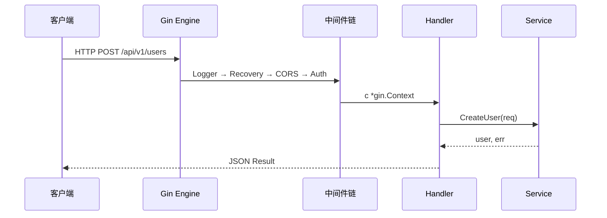
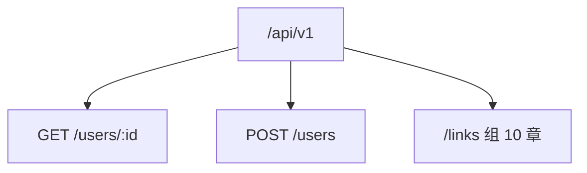
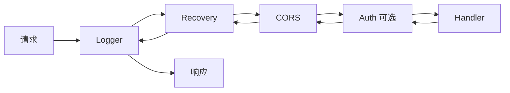

# Gin 框架核心与中间件

<!-- 修改说明: 2026-07-08 按 EXPANSION-STANDARD 新建 §0 读前导读、FAQ≥10、闭卷自测、费曼检验；2026-07-14 补充生产级 HTTP Server、探针、统一错误与 OpenAPI -->

> **文件编码**：UTF-8。  
> **定位**：Go 后端路线「Web 框架层」——从 [05 Go 标准库与 HTTP 基础](./05-Go标准库与HTTP基础.md) 的 `net/http` 升级到 **Gin** 路由、绑定、中间件链与工程化分层。  
> **前置**：[05 Go 标准库与 HTTP](./05-Go标准库与HTTP基础.md)、[Java 04 Spring Boot](../Java/04-SpringBoot核心开发.md)（对照学更快）。

---

## 0. 读前导读（零基础也能跟上）

### 0.1 用一句话弄懂本章

**一句话**：**Gin = Go 生态的 Spring Boot 轻量版**——帮你注册路由、解析 JSON、串中间件、统一返回，让你专注写 Handler / Service 业务。

**生活类比**：

| Gin 概念 | Spring Boot 对照 | 生活类比 |
|----------|------------------|----------|
| `router.GET` | `@GetMapping` | 菜单上的「宫保鸡丁」 |
| `router.Group("/api")` | `@RequestMapping("/api")` | 分窗口：收银台、后厨 |
| `c.ShouldBindJSON` | `@RequestBody` + `@Valid` | 验单：格式不对拒收 |
| `gin.HandlerFunc` 链 | `Filter` / `Interceptor` | 进门安检→刷卡→入座 |
| `c.JSON` | `Result<T>` | 统一餐盘装菜 |

**为什么重要**：05 章用原生 `net/http` 写通了 HTTP；真实项目需要路由分组、参数绑定、中间件——Gin 是 Go 实习/校招面试最高频 Web 框架。

---

### 0.2 你需要提前知道什么

| 水平 | 建议 |
|------|------|
| 学完 05 章 | 正常跟做，重点中间件链 |
| 学过 Java 04 Spring Boot | 对照表速读，重点 Binding 与 Context |
| 有 ACM 背景 | 重点路由树（Radix Tree）与中间件执行顺序 |

**最低门槛**：会 `go mod init`、结构体、接口；知道 HTTP 方法 GET/POST 与 JSON。

---

### 0.3 本章知识地图（学完后应能勾选全部 ☐→☑）

- [ ] 独立创建 `shortlink-api` 并用 Gin 启动
- [ ] 写 Handler + Service + Model 三层目录
- [ ] 用 `ShouldBindJSON` / `ShouldBindQuery` 做参数绑定
- [ ] 手写 Logger、Recovery、CORS 中间件并理解执行顺序
- [ ] 实现 `Result` 统一返回 + 全局错误处理
- [ ] 配置 `http.Server` 超时、请求体上限与可信代理
- [ ] 实现 liveness/readiness 与优雅停机
- [ ] 用 OpenAPI 固化请求、响应和错误契约
- [ ] 对照 Spring Boot 说出 4 个对应概念
- [ ] 闭卷自测 ≥ 8/10

---

### 0.4 建议学习时长与节奏

| 阶段 | 时间 | 内容 |
|------|------|------|
| 项目搭建 | 0.5 天 | §1～§2，跑通 Hello |
| 路由与绑定 | 1 天 | §3～§4 |
| 中间件 | 1 天 | §5～§6 |
| 工程化 | 0.5 天 | §7 分层 + CORS + Result |
| 自测 | 0.5 天 | FAQ + 闭卷 + 费曼 |

---

### 0.5 学完本章你能做什么（可验证的具体动作）

1. 启动 `shortlink-api`，`curl http://localhost:8080/health` 返回 JSON。
2. 新增 `POST /api/v1/users` 带 JSON 绑定与校验错误 400。
3. 配置 CORS，本地前端能跨域调 API。
4. 收到 `SIGTERM` 后停止接收新请求，并等待在途请求退出。
5. 向面试官解释 **Gin 中间件链 vs Spring Filter 链**。

---

### 0.6 手把手总览：5 分钟跑通 Gin

| 步骤 | 你的动作 | 预期看到什么 | 若不对 |
|------|----------|--------------|--------|
| 1 | `mkdir shortlink-api && cd shortlink-api` | 空目录 | 路径权限 |
| 2 | `go mod init github.com/you/shortlink-api` | 生成 `go.mod` | 未装 Go 1.21+ |
| 3 | `go get github.com/gin-gonic/gin@v1.10.0` | go.sum 更新 | 代理：`GOPROXY=https://goproxy.cn,direct` |
| 4 | 创建 `cmd/server/main.go`（§2） | 文件存在 | package main |
| 5 | `go run ./cmd/server` | `Listening on :8080` | 端口占用改 `:8081` |
| 6 | `curl localhost:8080/health` | `{"code":0,"msg":"ok"}` | 查路由注册 |

---

## 本章与上一章的关系

[05 Go 标准库与 HTTP 基础](./05-Go标准库与HTTP基础.md) 你用 `http.HandleFunc` 写了最简 HTTP 服务——能跑，但路由一多就乱：没有分组、没有统一错误、没有中间件。Gin 在 `net/http` 之上封装 **Radix Tree 路由** 和 **Context 上下文**，写法接近 [Java 04 Spring Boot](../Java/04-SpringBoot核心开发.md) 的 Controller 模式。



| 上一章（05） | 本章（06） | 下一章（07） |
|--------------|------------|--------------|
| net/http 原生 | Gin 路由 + 中间件 | GORM 接 MySQL |
| 单文件 Handler | 分层工程结构 | 持久化 CRUD |

---

## 1. Gin 是什么

Gin 是 Go 最流行的 Web 框架之一（GitHub 80k+ stars），特点：

- **高性能**：基于 httprouter 的 Radix Tree，路由匹配 O(长度)
- **中间件链**：`Use()` 注册，洋葱模型
- **绑定校验**：JSON/Query/URI/Form 一键绑定到 struct + `binding` tag
- **Context 封装**：`gin.Context` 贯穿请求生命周期

对比 Spring Boot：

| 概念 | Spring Boot | Gin |
|------|-------------|-----|
| 入口 | `@SpringBootApplication` | `gin.Default()` / `gin.New()` |
| 路由 | `@GetMapping` | `router.GET(path, handler)` |
| 路径参数 | `@PathVariable` | `c.Param("id")` 或 `uri` tag |
| 请求体 | `@RequestBody` | `c.ShouldBindJSON(&req)` |
| 中间件 | `Filter` | `router.Use(middleware)` |
| 统一返回 | `Result<T>` | 自定义 `Result` struct |

---

## 2. 最小应用与项目结构

### 2.1 最小 main.go

```go
package main

import (
	"log"
	"net/http"

	"github.com/gin-gonic/gin"
)

func main() {
	r := gin.Default() // 自带 Logger + Recovery
	r.GET("/health", func(c *gin.Context) {
		c.JSON(http.StatusOK, gin.H{"code": 0, "msg": "ok"})
	})
	if err := r.Run(":8080"); err != nil {
		log.Fatal(err)
	}
}
```

| 行 | 含义 | 改错会怎样 |
|----|------|------------|
| `gin.Default()` | 带 Logger/Recovery 的 Engine | `gin.New()` 需手动 `Use(Recovery)` |
| `c.JSON` | 写响应头 + JSON body | status 错 → 前端解析异常 |
| `r.Run` | 监听 `:8080` | 缺冒号 → 非法地址 |

### 2.2 推荐目录（shortlink-api）

```
shortlink-api/
├── cmd/server/main.go      # 入口：组装路由、依赖
├── api/openapi.yaml        # HTTP 契约，供文档/生成/CI 校验
├── internal/
│   ├── handler/            # HTTP 层（≈ Controller）
│   ├── service/            # 业务层
│   ├── model/              # 实体 / DTO
│   ├── middleware/         # 中间件
│   ├── pkg/apperr/         # 稳定业务错误，不暴露底层错误
│   └── pkg/response/       # 统一 Result
├── config/                 # 配置（07 章接 Viper）
└── go.mod
```

**原则**：`internal/` 外不可 import——Go 官方推荐的「模块边界」。

### 2.3 生产级启动：超时 + 优雅停机

`r.Run(":8080")` 适合第一遍跑通，但它把 `http.Server` 隐藏起来，不方便设置超时和优雅停机。项目版入口应显式创建 Server：

```go
package main

import (
	"context"
	"errors"
	"fmt"
	"log"
	"net/http"
	"os"
	"os/signal"
	"syscall"
	"time"
)

func run() error {
	r := SetupRouter(userH) // 示例省略 userH 等依赖的组装过程

	// 服务若直接暴露，不信任任何代理；若在 Nginx/网关后，只填真实代理 CIDR。
	if err := r.SetTrustedProxies(nil); err != nil {
		return fmt.Errorf("set trusted proxies: %w", err)
	}

	srv := &http.Server{
		Addr:              ":8080",
		Handler:           r,
		ReadHeaderTimeout: 5 * time.Second,
		ReadTimeout:       10 * time.Second,
		WriteTimeout:      15 * time.Second,
		IdleTimeout:       60 * time.Second,
		MaxHeaderBytes:    1 << 20, // 1 MiB
	}

	errCh := make(chan error, 1)
	go func() { errCh <- srv.ListenAndServe() }()

	stopCtx, stop := signal.NotifyContext(context.Background(), os.Interrupt, syscall.SIGTERM)
	defer stop()

	select {
		case err := <-errCh:
			if errors.Is(err, http.ErrServerClosed) {
				return nil
			}
			return fmt.Errorf("serve http: %w", err)
		case <-stopCtx.Done():
	}

	shutdownCtx, cancel := context.WithTimeout(context.Background(), 10*time.Second)
	defer cancel()
	if err := srv.Shutdown(shutdownCtx); err != nil {
		_ = srv.Close() // 超时后强制收尾
		return fmt.Errorf("shutdown http server: %w", err)
	}
	return nil
}

func main() {
	if err := run(); err != nil {
		log.Fatal(err)
	}
}
```

| 配置 | 防什么 | 注意 |
|------|--------|------|
| `ReadHeaderTimeout` | 慢速发送 Header 占连接 | HTTP 服务至少应配置它 |
| `ReadTimeout` | 请求体长期读不完 | 上传接口需单独评估，不能机械照抄 |
| `WriteTimeout` | Handler 长时间不返回 | SSE/流式响应不适合较短全局值 |
| `IdleTimeout` | Keep-Alive 空闲连接长期占用 | 通常比单请求超时长 |
| `Shutdown` | 发布时粗暴掐断在途请求 | Kubernetes/Docker 的终止宽限期要大于这里的 10 秒 |

**可信代理是安全配置**：`ClientIP()` 会根据可信代理决定是否采信 `X-Forwarded-For`。不要把 `0.0.0.0/0` 当省事配置，否则客户端可伪造 IP，连带污染日志与 IP 限流。部署到 Nginx 后，改为精确的内网 IP/CIDR，例如 `[]string{"10.0.0.10/32"}`。

部署平台中还应在收到 `SIGTERM` 后先把实例标记为 draining（readiness 返回 503），给负载均衡一点摘流量时间，再执行 `Shutdown`；HTTP 停稳后再关闭统计 worker、数据库和 Redis。`Shutdown` 只等待 HTTP 在途请求，不会自动等待你另开的后台 goroutine。

---

## 3. 路由与路由组

```go
func SetupRouter(userH *handler.UserHandler) *gin.Engine {
	r := gin.Default()
	v1 := r.Group("/api/v1")
	{
		v1.GET("/users/:id", userH.GetByID)
		v1.POST("/users", userH.Create)
	}
	return r
}
```

- **路由组** `Group`：统一前缀 `/api/v1`，可挂组级中间件（如 JWT）。
- **路径参数** `:id` → `c.Param("id")`。
- **RESTful**：资源名复数 `users`，动词靠 HTTP Method。



---

## 4. 参数绑定与校验

```go
type CreateUserReq struct {
	Username string `json:"username" binding:"required,min=3,max=32"`
	Email    string `json:"email" binding:"required,email"`
}

func (h *UserHandler) Create(c *gin.Context) {
	var req CreateUserReq
	if err := c.ShouldBindJSON(&req); err != nil {
		var maxErr *http.MaxBytesError
		if errors.As(err, &maxErr) {
			response.WriteError(c, apperr.ErrPayloadTooLarge)
		} else {
			response.WriteError(c, fmt.Errorf("bind create user: %v: %w", err, apperr.ErrInvalidArgument))
		}
		return
	}
	user, err := h.svc.Create(c.Request.Context(), req)
	if err != nil {
		response.WriteError(c, err)
		return
	}
	response.OK(c, user)
}
```

| 绑定方法 | 场景 |
|----------|------|
| `ShouldBindJSON` | POST JSON body |
| `ShouldBindQuery` | `?page=1&size=10` |
| `ShouldBindUri` | 路径 `:id` |
| `ShouldBindHeader` | Header 鉴权 |

**ShouldBind vs Bind**：`ShouldBind` 失败返回 error 由你处理；`Bind` 失败自动 400 并 abort——生产推荐 `ShouldBind` + 统一 `Result`。

### 4.1 请求体大小必须在解析前限制

校验字段长度不能代替限制整个 body。攻击者可以发送超大 JSON，让服务在绑定前就消耗内存和带宽：

```go
func MaxBodyBytes(n int64) gin.HandlerFunc {
	return func(c *gin.Context) {
		if c.Request.ContentLength > n {
			response.Fail(c, http.StatusRequestEntityTooLarge, "请求体过大")
			c.Abort()
			return
		}
		c.Request.Body = http.MaxBytesReader(c.Writer, c.Request.Body, n)
		c.Next()
	}
}

// JSON API 先从 1 MiB 起步；文件上传走单独路由和单独上限。
v1.Use(MaxBodyBytes(1 << 20))
```

`Content-Length` 可能缺失或不可信，所以仍要使用 `http.MaxBytesReader`。`ShouldBindJSON` 返回错误后，可用 `var maxErr *http.MaxBytesError; errors.As(err, &maxErr)` 映射为 413；格式/字段校验失败映射为 400，不能全部拼接 `err.Error()` 返回给客户端。

---

## 5. 中间件链（核心）

### 5.1 洋葱模型



```go
func Logger() gin.HandlerFunc {
	return func(c *gin.Context) {
		start := time.Now()
		c.Next() // 执行后续链
		log.Printf("%s %s %v", c.Request.Method, c.Request.URL.Path, time.Since(start))
	}
}
```

- `c.Next()`：进入下一层；返回后继续执行当前中间件 **后半段**。
- `c.Abort()`：中断链，不再调 Handler。
- `c.Set("userID", uid)` / `c.Get("userID")`：中间件向 Handler 传值（09 章 JWT 用）。

### 5.2 Recovery 统一处理 Handler panic

```go
func Recovery() gin.HandlerFunc {
	return func(c *gin.Context) {
		defer func() {
			if r := recover(); r != nil {
				log.Printf("panic: %v", r)
				response.Fail(c, 500, "服务器内部错误")
				c.Abort()
			}
		}()
		c.Next()
	}
}
```

---

## 6. CORS 跨域

前端 `http://localhost:5173` 调 `http://localhost:8080` 会被浏览器拦截，需后端声明：

```go
import "github.com/gin-contrib/cors"

func SetupCORS(r *gin.Engine) {
	r.Use(cors.New(cors.Config{
		AllowOrigins:     []string{"http://localhost:5173", "http://127.0.0.1:5173"},
		AllowMethods:     []string{"GET", "POST", "PUT", "DELETE", "OPTIONS"},
		AllowHeaders:     []string{"Origin", "Content-Type", "Authorization"},
		ExposeHeaders:    []string{"Content-Length"},
		AllowCredentials: true,
		MaxAge:           12 * time.Hour,
	}))
}
```

| 现象 | 原因 | 处理 |
|------|------|------|
| 浏览器报 CORS | 未配 AllowOrigins | 加入前端 origin |
| 预检 OPTIONS 404 | 未 AllowMethods | 加 OPTIONS |
| 带 Cookie 失败 | AllowCredentials false | 设为 true 且 origin 不能 `*` |

---

## 7. 统一响应 Result

```go
// internal/pkg/response/result.go
type Result struct {
	Code int         `json:"code"`
	Msg  string      `json:"msg"`
	Data interface{} `json:"data,omitempty"`
}

func OK(c *gin.Context, data interface{}) {
	c.JSON(http.StatusOK, Result{Code: 0, Msg: "ok", Data: data})
}

func Fail(c *gin.Context, httpStatus int, msg string) {
	c.JSON(httpStatus, Result{Code: httpStatus, Msg: msg})
}
```

与 [Java 04 Result](../Java/04-SpringBoot核心开发.md) 保持一致：`code=0` 成功，业务错误用 400/401/404。

### 7.1 统一错误映射：稳定契约，不泄漏内部细节

Handler 不应自行猜测“这个 error 是 400 还是 500”，更不应把 SQL、Redis 地址或堆栈通过 `err.Error()` 返回。可以在 `internal/pkg/apperr` 定义跨层稳定错误，再由 response 层统一映射：

```go
// internal/pkg/apperr/errors.go
var (
	ErrInvalidArgument = errors.New("invalid argument")
	ErrUnauthorized    = errors.New("unauthorized")
	ErrForbidden       = errors.New("forbidden")
	ErrNotFound        = errors.New("not found")
	ErrConflict        = errors.New("conflict")
	ErrPayloadTooLarge = errors.New("payload too large")
	ErrUnavailable     = errors.New("dependency unavailable")
)

// internal/pkg/response/error.go
func WriteError(c *gin.Context, err error) {
	status, code, msg := http.StatusInternalServerError, 10500, "服务器内部错误"
	switch {
	case errors.Is(err, apperr.ErrInvalidArgument):
		status, code, msg = http.StatusBadRequest, 10001, "参数错误"
	case errors.Is(err, apperr.ErrUnauthorized):
		status, code, msg = http.StatusUnauthorized, 10002, "未登录或凭证无效"
	case errors.Is(err, apperr.ErrForbidden):
		status, code, msg = http.StatusForbidden, 10003, "无权限"
	case errors.Is(err, apperr.ErrNotFound):
		status, code, msg = http.StatusNotFound, 10004, "资源不存在"
	case errors.Is(err, apperr.ErrConflict):
		status, code, msg = http.StatusConflict, 10005, "资源冲突"
	case errors.Is(err, apperr.ErrPayloadTooLarge):
		status, code, msg = http.StatusRequestEntityTooLarge, 10007, "请求体过大"
	case errors.Is(err, apperr.ErrUnavailable):
		status, code, msg = http.StatusServiceUnavailable, 10006, "服务暂时不可用"
	}
	if status >= 500 {
		log.Printf("request_id=%s internal_error=%v", c.GetString("requestID"), err)
	}
	c.AbortWithStatusJSON(status, Result{Code: code, Msg: msg})
}
```

Go 的 `net/http` 通常会恢复当前请求 goroutine 的 panic 并断开该连接；Gin Recovery 的价值是记录统一日志、尽量返回标准 500，并让中间件链按项目约定收尾。它**捕获不到你另开 goroutine 中的 panic**，后台任务仍需自行 `recover` 或由可靠 worker 管理；响应头已写出后也无法再改成完整 JSON 错误。

底层仍用 `%w` 保留原因，例如 `fmt.Errorf("query link: %w: %w", apperr.ErrUnavailable, dbErr)`；Go 1.20+ 的多重包装让 `errors.Is` 能识别类别，同时日志保留底层原因。客户端只看到稳定 code/message。`409 Conflict` 适合用户名、短码唯一约束冲突；不存在的资源用 404；依赖故障才是 503。

### 7.2 Liveness 与 Readiness 不是同一个接口

```go
func RegisterProbes(r *gin.Engine, ready func(context.Context) error) {
	r.GET("/livez", func(c *gin.Context) {
		c.JSON(http.StatusOK, gin.H{"status": "ok"})
	})
	r.GET("/readyz", func(c *gin.Context) {
		ctx, cancel := context.WithTimeout(c.Request.Context(), 500*time.Millisecond)
		defer cancel()
		if err := ready(ctx); err != nil {
			c.JSON(http.StatusServiceUnavailable, gin.H{"status": "not_ready"})
			return
		}
		c.JSON(http.StatusOK, gin.H{"status": "ready"})
	})
}
```

- **liveness** 只回答“进程是否活着”，不要因为 Redis 短暂失败就重启整个服务。
- **readiness** 回答“现在能否安全接流量”，检查启动必需依赖（短链项目至少 MySQL）。
- 若 Redis 被设计成可降级依赖，Redis 故障可以在 readiness body/指标中标为 degraded，但不必让实例退出流量池；前提是 08 章的 DB 回源和保护措施已实现。
- 探针不鉴权，但只返回状态，不暴露 DSN、版本、错误堆栈等敏感信息。

### 7.3 用 OpenAPI 把接口约定固定下来

简历级项目不能只靠 README 里的几条 curl。建议维护 `api/openapi.yaml`：

1. 写清路径、HTTP 方法、请求 DTO、响应 DTO、分页 cursor 与所有错误码。
2. 在 `components/securitySchemes` 声明 Bearer JWT，在受保护接口引用它。
3. 用 `oapi-codegen` 生成类型/接口，或至少用 OpenAPI linter 在 CI 校验规范，防止文档与代码漂移。
4. Swagger UI 只在开发环境开放；生产若开放应鉴权，不能把内部管理接口全部公开。
5. API 行为变更先改契约，再改 Handler 和测试；破坏兼容时升级 `/api/v2`。

OpenAPI 不是“好看的网页”，而是前后端联调、自动测试和兼容性治理的唯一 HTTP 契约。

---

## 8. 常见错误对照表

| 错误现象 | 可能原因 | 排查 |
|----------|----------|------|
| `404 page not found` | 路由未注册或 Method 错 | 对照 Group 前缀 |
| `415 Unsupported Media Type` | 未设 `Content-Type: application/json` | curl 加 `-H` |
| `EOF` bind 失败 | body 为空 | 检查 POST body |
| 中间件不生效 | 注册在路由之后 | `Use` 须在 `GET/POST` 前 |
| panic 后连接断开/响应不统一 | 未挂 Gin Recovery | `gin.Default()` 或手动 Recovery |
| 端口 bind 失败 | 8080 占用 | `netstat` / 换端口 |
| 413 未生效 | 只检查了字段 tag | 在绑定前挂 `MaxBytesReader` |
| IP 限流可绕过 | 信任了任意代理 Header | 精确配置 `SetTrustedProxies` |
| 发布时请求被断开 | 直接退出进程 | `signal.NotifyContext` + `Shutdown` |

---

## 9. FAQ

**Q1：Gin 和 Echo/Fiber 选哪个？**  
本路线 **Gin**：资料最多、面试最高频；学会 Gin 迁移 Echo 成本很低。

**Q2：gin.Default 和 gin.New 区别？**  
Default 自带 Logger+Recovery；New 空白，适合自定义中间件栈。

**Q3：Context 是并发安全的吗？**  
每个请求独立 `*gin.Context`，不要在 goroutine 里长期持有；跨 goroutine 用 `c.Request.Context()`。

**Q4：binding:"required" 对零值有效吗？**  
string 空串、int 0 会失败；指针字段可区分「未传」与零值。

**Q5：中间件顺序重要吗？**  
重要：Logger 放最外；Recovery 紧贴业务；Auth 在 Handler 前。

**Q6：为什么要 internal 目录？**  
防止其他模块误 import 内部包，编译器强制边界。

**Q7：Handler 里能写 SQL 吗？**  
不要。Handler → Service → Repository（07 GORM），与 Spring 分层一致。

**Q8：生产环境 gin 模式？**  
`gin.SetMode(gin.ReleaseMode)` 减少日志噪音。

**Q9：如何做 API 版本？**  
路由组 `/api/v1`、`/api/v2`，旧版保留兼容期。

**Q10：和 05 章 net/http 还要学吗？**  
要。Gin 底层仍是 `net/http`；05 理解 Server、Header、StatusCode。

**Q11：统一返回 HTTP 200 还是 4xx？**  
两种风格：REST 派 4xx；国内很多项目 HTTP 200 + body.code——团队统一即可。

**Q12：热重载怎么搞？**  
开发用 `air` 或 `gin` + 手动重启；生产编译二进制部署。

**Q13：为什么同时需要 Server 超时和请求 Context 超时？**
Server 超时保护连接生命周期；数据库/Redis/外部 HTTP 仍应使用更短的业务 Context，二者职责不同。

**Q14：readiness 失败后进程会被重启吗？**
通常只会摘流量；liveness 连续失败才触发重启，具体由部署平台配置。

**Q15：可信代理配错有什么风险？**
客户端可伪造源 IP，导致审计、风控和限流失真。

---

## 10. 练习建议

### 基础

1. 给 shortlink-api 加 `GET /api/v1/users` 列表（内存 slice）
2. 用户名重复返回 400 + 统一 Result

### 进阶

3. 手写 RequestID 中间件：`X-Request-ID` 透传日志
4. 路由组 `/api/v1` 挂「耗时 >500ms 打 Warn」中间件

### 挑战

5. 用 `validator/v10` 自定义 `username` 正则校验
6. 对照 Java 04 同一 CRUD 各写一版，REST 路径一致
7. 启动一个 3 秒 Handler，发送 `SIGTERM`，验证优雅停机仍让请求完成
8. 给 `api/openapi.yaml` 加统一错误 schema，并在 CI 执行规范校验

---

## 11. 学完标准

- [ ] 独立创建 shortlink-api 并 `go run` 启动
- [ ] 能写 Handler + Service 分层
- [ ] 会用 binding tag 校验 JSON
- [ ] 配置 CORS + Logger + Recovery
- [ ] 实现统一 Result 返回
- [ ] 显式配置 `http.Server` 超时并完成优雅停机
- [ ] 请求体上限、可信代理、live/ready 探针行为正确
- [ ] OpenAPI 覆盖公开 API 与稳定错误码
- [ ] 能画中间件洋葱模型图

---

## 12. 闭卷自测

1. **概念**：为什么说 Gin ≈ Go 的 Spring Boot 轻量版？
2. **概念**：`c.Next()` 和 `c.Abort()` 各做什么？
3. **概念**：`ShouldBindJSON` 失败应返回什么 HTTP 状态？
4. **概念**：路由组 `Group` 解决什么问题？
5. **概念**：CORS 预检请求是什么 Method？
6. **动手**：写出注册 `GET /api/v1/users/:id` 的代码片段。
7. **动手**：struct 如何声明 username 必填且 3～32 字符？
8. **综合**：对照 Spring，列出 Gin 侧 3 个等价写法。
9. **综合**：为何业务逻辑不应全堆在 Handler？
10. **综合**：Recovery 中间件不放会怎样？

### 自测参考答案

1. 提供路由、绑定、中间件、JSON 响应，快速构建 REST API。
2. Next 继续链；Abort 中断后续 Handler。
3. 通常 400 + 统一错误 body。
4. 统一 URL 前缀与组级中间件。
5. OPTIONS。
6. `v1.GET("/users/:id", h.GetByID)`。
7. `` `json:"username" binding:"required,min=3,max=32"` ``。
8. 如 `@GetMapping`→`router.GET`，`@PathVariable`→`c.Param`，`@RequestBody`→`ShouldBindJSON`。
9. 难测试、难复用；违反分层。
10. `net/http` 可能只中断当前请求，但响应和日志不统一；Gin Recovery 可标准化处理。另开 goroutine 的 panic 不在其捕获范围内。

---

## 13. 费曼检验

3 分钟解释：**「Gin 请求从进入到返回经历什么？」**

**对照提纲**：

1. TCP 进 `net/http`，Gin Engine 匹配 Radix 路由。
2. 按注册顺序走中间件：Logger 记时 → Recovery 防 panic → CORS →（Auth）。
3. Handler 里 `ShouldBind` 参数，调 Service， `response.OK/Fail`。
4. 中间件后半段打日志；连接关闭。

---

## 14. 章节衔接

| 模块 | 链接 |
|------|------|
| 上一章 HTTP 基础 | [05 Go 标准库与 HTTP 基础](./05-Go标准库与HTTP基础.md) |
| 下一章持久化 | [07 GORM 与 MySQL 实战](./07-GORM与MySQL实战.md) |
| Spring 对照 | [Java 04 Spring Boot](../Java/04-SpringBoot核心开发.md) |
| 短链设计 | [系统设计 08 短链](../系统设计/08-短链服务设计.md) |

**下一章预告**：06 章用户存在内存 map——重启就丢。07 章接 **GORM + MySQL**：Model、CRUD、事务、迁移，shortlink-api 第一次真正持久化。理论细节（索引、ACID）请对照 [Java 06 MySQL](../Java/06-MySQL基础索引与事务.md)。

---

*下一章：[07-GORM与MySQL实战](./07-GORM与MySQL实战.md)*
