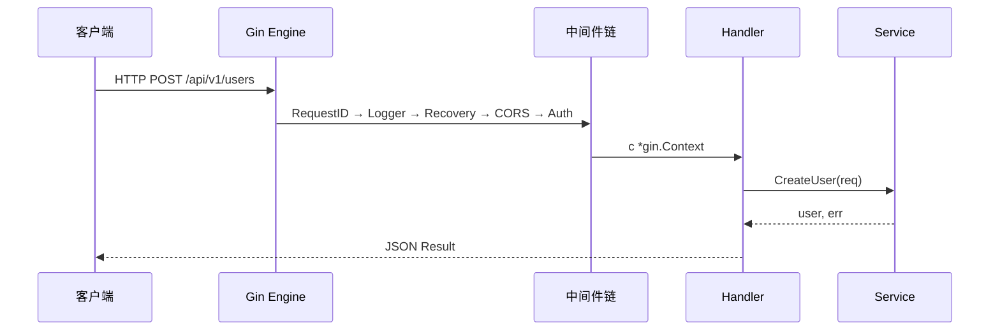
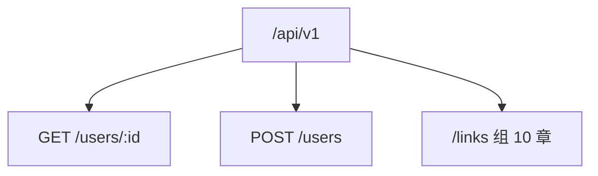
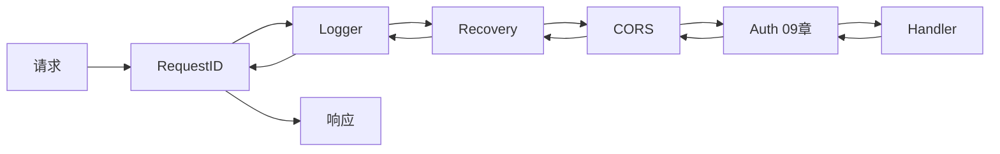

# Gin 框架核心与中间件

<!-- 修改说明: 2026-07-08 按 EXPANSION-STANDARD 新建 §0 读前导读、FAQ≥10、闭卷自测、费曼检验；2026-07-14 补充生产级 HTTP Server、探针、统一错误与 OpenAPI；2026-07-26 按审查报告修订：修复 415/CORS 预检/FAQ Q3 等 13 处误导表述，统一双错误码体系，消除前向引用；新增 form/uri 绑定、自定义校验、文件上传、RequestID/超时/限流中间件、Context 复用与 c.Copy、NoRoute/NoMethod、Handler 单元测试与 §7.4 完整组装工程；命令行示例改为 Windows PowerShell 可直接执行；2026-07-26 复核轮：逐条核对审查报告 13 项问题与 9 项缺失知识点确认均已落实，全部代码在 Go 1.26 / gin v1.12.0 下重新通过 go build、go vet、go test 与实际请求验证，并实测修正 §3.3/§4.5 的预期输出（gin.H 是 map、序列化后键按字母序；PS 5.1 utf8 含 BOM 导致上传文件为 17 字节）；2026-07-27 去水化精简：删除知识地图/学习时长/学完标准/闭卷自测/费曼检验/章节衔接等模板板块，FAQ 中正文未覆盖的要点（Echo/Fiber 选型、required 零值语义、ReleaseMode、internal 编译器强制、Handler 不写 SQL、gin.Default 中间件顺序、200-vs-4xx 风格、readiness/liveness 失败后果、air 热重载、API 版本兼容期）逐条并入对应小节后删壳，§0 收敛为跟做导引两节并重排文末编号（练习建议 §11→§10），全部代码清单原样未动 -->

> **文件编码**：UTF-8。  
> **定位**：Go 后端路线「Web 框架层」——从 [05 Go 标准库与 HTTP 基础](./05-Go标准库与HTTP基础.md) 的 `net/http` 升级到 **Gin** 路由、绑定、中间件链与工程化分层。  
> **前置**：[05 Go 标准库与 HTTP](./05-Go标准库与HTTP基础.md)、[Java 04 Spring Boot](../Java/04-SpringBoot核心开发.md)（对照学更快）。  
> **配套设计**：[系统设计 08 短链](../系统设计/08-短链服务设计.md)（本章开工的 shortlink-api 对应的设计篇）。  
> **版本基线**：Go 1.22+（`log/slog`、`context.WithoutCancel` 需 Go 1.21+），Gin v1.10+（写作时最新为 v1.12.x，本章代码在 v1.12.0 上验证通过）。

---

## 0. 读前导读（跟做前必读）

### 0.1 手把手总览：5 分钟跑通 Gin

以下命令都在 **Windows PowerShell** 里执行：

| 步骤 | 你的动作 | 预期看到什么 | 若不对 |
|------|----------|--------------|--------|
| 1 | `mkdir shortlink-api; cd shortlink-api` | 空目录（PowerShell 用 `;` 分隔命令，没有 `&&`） | 路径权限 |
| 2 | `go mod init github.com/you/shortlink-api` | 生成 `go.mod` | `go version` 应 ≥ 1.22 |
| 3 | `go get github.com/gin-gonic/gin@latest` | `go.sum` 更新；本章以 gin v1.10+ 为准 | 拉不动加代理：`$env:GOPROXY = "https://goproxy.cn,direct"`（只对当前窗口生效） |
| 4 | 创建 `cmd/server/main.go`（内容见 §2.1） | 文件存在 | 首行必须是 `package main` |
| 5 | `go run ./cmd/server` | 末行 `[GIN-debug] Listening and serving HTTP on :8080`（前面几行 `[WARNING]` 属正常，见 §2.1） | 端口占用就改 `:8081` |
| 6 | **另开一个** PowerShell 窗口：`Invoke-RestMethod http://localhost:8080/health` | 表格输出一行 `code=0, msg=ok` | 查路由是否注册、端口是否一致 |

---

### 0.2 本章代码怎么跟做（先读这节，后面不迷路）

本章代码分两个模块，建议在同一个学习目录下并排放：

1. **`gin-demos`**：练习场。每个知识点一个子目录（`minimal/`、`binddemo/`、`querydemo/`……），每个子目录一个独立 `main.go`，可以单独 `go run`。初始化一次即可：

   ```powershell
   mkdir gin-demos; cd gin-demos
   go mod init gin-demos
   $env:GOPROXY = "https://goproxy.cn,direct"   # 仅当前窗口生效，可选
   go get github.com/gin-gonic/gin@latest
   ```

2. **`shortlink-api`**：正式项目，§7.4 把全章零件组装成完整工程，07～11 章持续在它上面迭代。

**代码块的两种标注**（全章统一约定）：

- 标了**文件路径 + 运行命令**的，是「完整可编译清单」，复制整个文件即可跑；
- 标了**「片段」**的，只是某文件的节选，会注明它属于哪个文件、完整版在哪一节——不要单独复制运行。

**PowerShell 两个坑**（后面所有命令示例都已避开）：

- PowerShell 5.1 里 `curl` 是 `Invoke-WebRequest` 的别名，参数完全不同——本章一律写 **`curl.exe`**（Windows 10+ 自带真 curl）。`curl.exe --%` 后面的参数会原样传给 curl，不被 PowerShell 二次解析，发 JSON 时最省心。
- `Invoke-RestMethod` 遇到 4xx/5xx 会直接抛红色异常而**看不到响应 body**——想观察错误响应（400/404/413……）时用 `curl.exe -i`。

**热重载**：开发阶段改一次代码就要手动重启 `go run`，可以用 `air` 之类的工具监听文件变化自动重启；生产环境一律编译成二进制部署，不依赖热重载。

---

## 1. Gin 是什么

**一句话**：**Gin = Go 生态的 Spring Boot 轻量版**——帮你注册路由、解析 JSON、串中间件、统一返回，让你专注写 Handler / Service 业务。

[05 章](./05-Go标准库与HTTP基础.md)用 `http.HandleFunc` 写通了最简 HTTP 服务——能跑，但路由一多就乱：没有分组、没有统一错误、没有中间件。Gin 是 Go 最流行的 Web 框架之一（GitHub 80k+ stars），在 `net/http` 之上封装 **Radix Tree 路由** 和 **Context 上下文**，写法接近 [Java 04 Spring Boot](../Java/04-SpringBoot核心开发.md) 的 Controller 模式。特点：

- **高性能**：基于 httprouter 思路的 Radix Tree，路由匹配 O(路径长度)
- **中间件链**：`Use()` 注册，洋葱模型
- **绑定校验**：JSON/Query/URI/Form 一键绑定到 struct + `binding` tag
- **Context 封装**：`gin.Context` 贯穿请求生命周期

**选型与定位**：Go 生态还有 Echo、Fiber 等框架，本路线选 Gin——资料最多、Go 实习/校招面试最高频；学会 Gin 后迁移 Echo 成本很低。另外 Gin 底层仍是 `net/http`，05 章学的 Server、Header、StatusCode 一点不浪费——本章 §2.3 的超时配置全是 `net/http` 的知识。

对比 Spring Boot（最后一列是帮助初次理解的生活类比）：

| 概念 | Spring Boot | Gin | 生活类比 |
|------|-------------|-----|----------|
| 入口 | `@SpringBootApplication` | `gin.Default()` / `gin.New()` | — |
| 路由 | `@GetMapping` | `router.GET(path, handler)` | 菜单上的「宫保鸡丁」 |
| 路由分组 | `@RequestMapping("/api")` | `router.Group("/api")` | 分窗口：收银台、后厨 |
| 路径参数 | `@PathVariable` | `c.Param("id")` 或 `uri` tag | — |
| 请求体 | `@RequestBody` + `@Valid` | `c.ShouldBindJSON(&req)` | 验单：格式不对拒收 |
| 中间件 | `Filter` / `Interceptor` | `router.Use(middleware)` | 进门安检→刷卡→入座 |
| 统一返回 | `Result<T>` | 自定义 `Result` struct | 统一餐盘装菜 |

一条请求在 Gin 里的完整旅程（本章逐节拆开每一环）：


```mermaid
sequenceDiagram
    participant Client as 客户端
    participant Gin as Gin Engine
    participant MW as 中间件链
    participant H as Handler
    participant S as Service

    Client->>Gin: HTTP POST /api/v1/users
    Gin->>MW: RequestID → Logger → Recovery → CORS → Auth
    MW->>H: c *gin.Context
    H->>S: CreateUser(req)
    S-->>H: user, err
    H-->>Client: JSON Result
```

---

## 2. 最小应用与项目结构

### 2.1 最小 main.go

**文件**：`shortlink-api/cmd/server/main.go`（完整可编译清单）  
**运行**：`go run ./cmd/server`

```go
package main

import (
	"log"
	"net/http"

	"github.com/gin-gonic/gin"
)

func main() {
	r := gin.Default() // 自带 Logger + Recovery
	r.GET("/health", func(c *gin.Context) {
		c.JSON(http.StatusOK, gin.H{"code": 0, "msg": "ok"})
	})
	if err := r.Run(":8080"); err != nil {
		log.Fatal(err)
	}
}
```

| 行 | 含义 | 改错会怎样 |
|----|------|------------|
| `gin.Default()` | 带 Logger/Recovery 的 Engine | `gin.New()` 需手动 `Use(Recovery)` |
| `gin.H{...}` | 就是 `map[string]any` 的别名，拼临时 JSON 用 | — |
| `c.JSON` | 写响应头 + JSON body | status 错 → 前端解析异常 |
| `r.Run` | 监听 `:8080` | 缺冒号 → 非法地址 |

启动时控制台会先打印几行 `[GIN-debug] [WARNING]`（提示你在 debug 模式、还没配可信代理），**这是正常的**，§2.3 和 §7.4 会逐一处理掉；看到末行 `Listening and serving HTTP on :8080` 就是启动成功。

验证（另开一个 PowerShell 窗口）：

```powershell
Invoke-RestMethod http://localhost:8080/health
# 输出：
# code msg
# ---- ---
#    0 ok
```

### 2.2 推荐目录（shortlink-api）

```
shortlink-api/
├── cmd/server/main.go      # 入口：组装路由、依赖（§2.3 生产版）
├── api/openapi.yaml        # HTTP 契约，供文档/生成/CI 校验（§7.3）
├── internal/
│   ├── handler/            # HTTP 层（≈ Controller）
│   ├── service/            # 业务层
│   ├── model/              # 实体 / DTO
│   ├── middleware/         # 中间件
│   ├── router/             # 路由组装（§7.4）
│   ├── pkg/apperr/         # 稳定业务错误，不暴露底层错误（§7.1）
│   └── pkg/response/       # 统一 Result（§7）
├── config/                 # 配置（07 章接 Viper）
└── go.mod
```

两条分层原则：

- **`internal/` 外不可 import**：`internal/` 下的包其他模块无法引用，这不是团队约定而是 **Go 编译器强制**的模块边界——防止内部实现被外部误依赖。
- **Handler 里不写 SQL**：HTTP 层只做绑定、鉴权、转调；业务进 Service，数据访问进 Repository（07 章 GORM）——与 Spring 的 Controller/Service/Repository 分层一致。业务堆在 Handler 里难测试、难复用。

每个文件的完整内容会在对应小节给出，§7.4 有一张「文件 ↔ 小节」对照表。

### 2.3 生产级启动：超时 + 优雅停机

`r.Run(":8080")` 适合第一遍跑通，但它把 `http.Server` 隐藏起来，不方便设置超时和优雅停机。项目版入口应显式创建 Server。

**文件**：`shortlink-api/cmd/server/main.go`（完整清单，**替换** §2.1 的极简版；其中 `router.SetupRouter` 等三个包在 §7.4 给出——先通读理解，§7.4 组装完再一起运行）

```go
package main

import (
	"context"
	"errors"
	"fmt"
	"log"
	"net/http"
	"os"
	"os/signal"
	"syscall"
	"time"

	"github.com/you/shortlink-api/internal/handler"
	"github.com/you/shortlink-api/internal/router"
	"github.com/you/shortlink-api/internal/service"
)

func run() error {
	// ① 先注册信号监听，再启动服务：避免启动瞬间收到信号却按默认行为直接退出
	stopCtx, stop := signal.NotifyContext(context.Background(), os.Interrupt, syscall.SIGTERM)
	defer stop()

	// ② 组装依赖：Service → Handler → Router（07 章会在这里接入 DB）
	userH := handler.NewUserHandler(service.NewUserService())
	r := router.SetupRouter(userH)

	// ③ 服务若直接暴露，不信任任何代理；若在 Nginx/网关后，只填真实代理 CIDR
	if err := r.SetTrustedProxies(nil); err != nil {
		return fmt.Errorf("set trusted proxies: %w", err)
	}

	// ④ 显式 http.Server：四类超时 + 头部大小上限
	srv := &http.Server{
		Addr:              ":8080",
		Handler:           r,
		ReadHeaderTimeout: 5 * time.Second,
		ReadTimeout:       10 * time.Second,
		WriteTimeout:      15 * time.Second,
		IdleTimeout:       60 * time.Second,
		MaxHeaderBytes:    1 << 20, // 1 MiB
	}

	// ⑤ 服务放 goroutine 跑，错误送进 channel
	errCh := make(chan error, 1)
	go func() { errCh <- srv.ListenAndServe() }()

	// ⑥ 同时等两件事：服务自己挂了 / 收到停机信号
	select {
	case err := <-errCh:
		if errors.Is(err, http.ErrServerClosed) {
			return nil
		}
		return fmt.Errorf("serve http: %w", err)
	case <-stopCtx.Done():
		stop() // 恢复信号默认行为：Shutdown 卡住时再按一次 Ctrl+C 可强制退出
	}

	// ⑦ 限时优雅停机：不再收新请求，等在途请求最多 10 秒
	shutdownCtx, cancel := context.WithTimeout(context.Background(), 10*time.Second)
	defer cancel()
	if err := srv.Shutdown(shutdownCtx); err != nil {
		_ = srv.Close() // 超时后强制收尾
		return fmt.Errorf("shutdown http server: %w", err)
	}
	return nil
}

func main() {
	if err := run(); err != nil {
		log.Fatal(err)
	}
}
```

逐段说明（为什么这么写）：

- **① 信号监听放最前**：`signal.NotifyContext` 生效前进程收到信号会按默认行为直接退出。先注册再启动，才没有「刚启动就被 kill 却不优雅停机」的窗口。
- **⑤⑥ 为什么用 channel + select**：`ListenAndServe` 是阻塞调用。把它放 goroutine，主流程才能同时等「服务出错」和「收到信号」两件事。正常 `Shutdown` 时它返回 `http.ErrServerClosed`，这不是故障，要用 `errors.Is` 放行。
- **⑥ 里再调一次 `stop()`**：注销信号监听、恢复默认行为——如果 `Shutdown` 因为长请求卡住，你再按一次 Ctrl+C 还能强杀，不至于进程「杀不死」。
- **Windows 提示**：本机开发按 **Ctrl+C**（对应 `os.Interrupt`）验证优雅停机；`SIGTERM` 是 Linux/容器信号（`kill` 命令、K8s 终止 Pod 时发送），代码里两个都监听即可两端通用。注意 `Stop-Process` 是强杀，**不会**触发优雅停机。
- **生产模式**：上线前设置 `gin.SetMode(gin.ReleaseMode)`（或环境变量 `GIN_MODE=release`），去掉 debug 日志噪音；单元测试里用 `gin.TestMode`（§8 就是这么做的）。

| 配置 | 防什么 | 注意 |
|------|--------|------|
| `ReadHeaderTimeout` | 慢速发送 Header 占连接 | HTTP 服务至少应配置它 |
| `ReadTimeout` | 请求体长期读不完 | 上传接口需单独评估，不能机械照抄 |
| `WriteTimeout` | Handler 长时间不返回 | SSE/流式响应不适合较短全局值 |
| `IdleTimeout` | Keep-Alive 空闲连接长期占用 | 通常比单请求超时长 |
| `Shutdown` | 发布时粗暴掐断在途请求 | Kubernetes/Docker 的终止宽限期要大于这里的 10 秒 |

**可信代理是安全配置**：`ClientIP()` 会根据可信代理决定是否采信 `X-Forwarded-For`。不要把 `0.0.0.0/0` 当省事配置，否则客户端可伪造 IP，连带污染日志与 IP 限流（§5.7）。部署到 Nginx 后，改为精确的内网 IP/CIDR，例如 `[]string{"10.0.0.10/32"}`。

部署平台中还应在收到 `SIGTERM` 后先把实例标记为 draining（readiness 返回 503），给负载均衡一点摘流量时间，再执行 `Shutdown`；HTTP 停稳后再关闭统计 worker、数据库和 Redis。`Shutdown` 只等待 HTTP 在途请求，不会自动等待你另开的后台 goroutine。

---

## 3. 路由与路由组

### 3.1 路由组与路径参数

```go
// 片段 · internal/router/router.go 的骨架（完整版见 §7.4，那里还会挂中间件与探针）
func SetupRouter(userH *handler.UserHandler) *gin.Engine {
	r := gin.Default()
	v1 := r.Group("/api/v1")
	{
		v1.GET("/users/:id", userH.GetByID)
		v1.POST("/users", userH.Create)
	}
	return r
}
```

- **路由组** `Group`：统一前缀 `/api/v1`，可挂组级中间件（如 09 章 JWT）。
- **路径参数** `:id` → `c.Param("id")` 取值；`*filepath` 是贪婪匹配（静态文件用）。
- **RESTful**：资源名复数 `users`，动词靠 HTTP Method。
- 大括号 `{}` 只是视觉分组，没有语法作用——Go 允许任意块。


```mermaid
flowchart TD
    A["/api/v1"] --> B["GET /users/:id"]
    A --> C["POST /users"]
    A --> D["/links 组 10 章"]
```

### 3.2 快速拿单个参数

不想定义 struct 时，可以直接从 Context 取单个值：

```go
// 片段 · 任意 Handler 内
id := c.Param("id")                  // 路径参数 :id，string 类型
kw := c.Query("kw")                  // ?kw=xxx，没传返回 ""
sec := c.DefaultQuery("sec", "3")    // 没传时用默认值 "3"
```

注意取到的都是 **string**，数字要自己 `strconv.Atoi` / `strconv.ParseInt` 转换并处理错误。字段一多就该换 §4 的 struct 绑定——集中校验、少写样板。

### 3.3 NoRoute 与 NoMethod：把 404/405 也收进统一契约

默认情况下，访问不存在的路径 Gin 返回**纯文本** `404 page not found`——前端统一按 JSON 解析响应时会直接报错，破坏契约。`NoRoute`（未匹配任何路由）和 `NoMethod`（路径存在但方法不对，需显式开启）可以兜住这两种情况。

**文件**：`gin-demos/routedemo/main.go`（完整可编译清单）  
**运行**：`go run ./routedemo`

```go
package main

import (
	"log"
	"net/http"

	"github.com/gin-gonic/gin"
)

func main() {
	r := gin.Default()

	// 未匹配任何路由 → 统一 JSON 404（默认是纯文本 "404 page not found"）
	r.NoRoute(func(c *gin.Context) {
		c.JSON(http.StatusNotFound, gin.H{"code": 10004, "msg": "资源不存在"})
	})
	// 路径存在但方法不对 → 405（默认关闭，需显式打开）
	r.HandleMethodNotAllowed = true
	r.NoMethod(func(c *gin.Context) {
		c.JSON(http.StatusMethodNotAllowed, gin.H{"code": 10010, "msg": "HTTP 方法不允许"})
	})

	v1 := r.Group("/api/v1")
	{
		v1.GET("/users/:id", func(c *gin.Context) {
			c.JSON(http.StatusOK, gin.H{"code": 0, "msg": "ok", "data": gin.H{"id": c.Param("id")}})
		})
		v1.POST("/users", func(c *gin.Context) {
			c.JSON(http.StatusOK, gin.H{"code": 0, "msg": "ok"})
		})
	}
	if err := r.Run(":8080"); err != nil {
		log.Fatal(err)
	}
}
```

验证（另开窗口）：

```powershell
curl.exe -s http://localhost:8080/api/v1/users/42     # {"code":0,"data":{"id":"42"},"msg":"ok"}
curl.exe -s http://localhost:8080/nope                # {"code":10004,"msg":"资源不存在"}
curl.exe -s -X PUT http://localhost:8080/api/v1/users # {"code":10010,"msg":"HTTP 方法不允许"}
```

不开 `HandleMethodNotAllowed` 时，PUT 一个只注册了 GET/POST 的路径会落进 NoRoute 变成 404；开了才能正确区分 405。§7.4 的正式版会把这两个兜底换成统一的 `response.WriteError` / `response.Fail`。

顺带一个观察：第一条响应里键的顺序是 `code→data→msg`（字母序），不是代码里写的 `code→msg→data`——`gin.H` 本质是 map，`encoding/json` 序列化 map 时按键名字母序输出；§7 的 `Result` 是 struct，才按字段声明顺序输出。对比响应时别被顺序差异吓到。

---

## 4. 参数绑定与校验

### 4.1 JSON 绑定：ShouldBindJSON + binding tag

先看一个**自包含**的最小例子，感受「绑定 + 校验」一步完成：

**文件**：`gin-demos/binddemo/main.go`（完整可编译清单）  
**运行**：`go run ./binddemo`

```go
package main

import (
	"log"
	"net/http"

	"github.com/gin-gonic/gin"
)

type CreateUserReq struct {
	Username string `json:"username" binding:"required,min=3,max=32"`
	Email    string `json:"email" binding:"required,email"`
}

func main() {
	r := gin.Default()
	r.POST("/users", func(c *gin.Context) {
		var req CreateUserReq
		if err := c.ShouldBindJSON(&req); err != nil {
			// detail 仅本地演示用；生产不要把 err.Error() 原样返回（见 §7.1）
			c.JSON(http.StatusBadRequest, gin.H{"code": 10001, "msg": "参数错误", "detail": err.Error()})
			return
		}
		c.JSON(http.StatusOK, gin.H{"code": 0, "msg": "ok", "data": req})
	})
	if err := r.Run(":8080"); err != nil {
		log.Fatal(err)
	}
}
```

验证（`--%` 让 PowerShell 不再解析后面的引号，JSON 里的 `\"` 由 curl 处理）：

```powershell
# 成功
curl.exe --% -s -X POST http://localhost:8080/users -H "Content-Type: application/json" -d "{\"username\":\"tom\",\"email\":\"tom@example.com\"}"
# 失败：username 太短 + 缺 email → 400
curl.exe --% -i -s -X POST http://localhost:8080/users -H "Content-Type: application/json" -d "{\"username\":\"ab\"}"
```

`binding` tag 是声明式校验（背后是 validator/v10 库）：`required` 必填、`min/max` 长度或数值范围、`email` 格式。绑定失败时 `ShouldBindJSON` 返回 error，**由你决定**怎么响应。

**注意 `required` 与零值**：`required` 判定的是「是否为零值」——string 的空串、int 的 0 都会被当成「没传」而校验失败。业务上需要区分「未传」和「显式传了零值」时（比如允许把数量改成 0），把字段声明成指针（如 `*int`）：nil 才是「未传」，指向 0 的指针能通过 `required`。

**ShouldBind vs Bind**：`ShouldBind` 系列失败只返回 error；`Bind` 系列失败会自动写 400 并 Abort，响应格式不受你控制——生产推荐 `ShouldBind` + 统一错误出口。

项目版 Handler 把错误交给统一出口，长这样（**片段** · `internal/handler/user.go`，完整文件见 §7.4；`response.WriteError` 与 `apperr` 哨兵错误的定义见 §7.1，先记住意图：**绑定失败 → 包一层 ErrInvalidArgument → 丢给统一出口**）：

```go
func (h *UserHandler) Create(c *gin.Context) {
	var req CreateUserReq
	if err := c.ShouldBindJSON(&req); err != nil {
		var maxErr *http.MaxBytesError
		if errors.As(err, &maxErr) { // 请求体超限（§4.3）→ 413
			response.WriteError(c, apperr.ErrPayloadTooLarge)
			return
		}
		// %v 把原始原因留在错误链里进日志，%w 挂上稳定类别供 errors.Is 识别
		response.WriteError(c, fmt.Errorf("bind create user: %v: %w", err, apperr.ErrInvalidArgument))
		return
	}
	user, err := h.svc.Create(c.Request.Context(), req.Username, req.Email)
	if err != nil {
		response.WriteError(c, err)
		return
	}
	response.OK(c, user)
}
```

四种绑定方法与 **tag 对照**（重点看第三列，新手最高频的坑就在这里）：

| 绑定方法 | 数据来源 | 用什么 tag |
|----------|----------|------------|
| `ShouldBindJSON` | POST/PUT 的 JSON body | `json` |
| `ShouldBindQuery` | `?page=1&size=10` | **`form`（不是 json！）** |
| `ShouldBindUri` | 路径 `:id` | `uri` |
| `ShouldBindHeader` | 请求头 | `header` |

**tag 规则**（务必记住）：

1. `json` tag 只对 JSON body 绑定（以及序列化输出）生效；
2. query 和表单一律用 `form` tag——struct 只写 `json:"page"` 然后 `ShouldBindQuery`，`?page=1` **永远绑不上**（无 tag 时按导出字段名精确匹配，大小写敏感，等于基本绑不上）；
3. 同一 struct 上 `json`、`form`、`uri` tag 可以共存，各管各的来源；
4. `form` tag 支持默认值：`form:"page,default=1"`。

### 4.2 Query 与路径参数绑定：form tag 与 uri tag

**文件**：`gin-demos/querydemo/main.go`（完整可编译清单）  
**运行**：`go run ./querydemo`

```go
package main

import (
	"log"
	"net/http"

	"github.com/gin-gonic/gin"
)

// query 参数一律用 form tag；json tag 对 ShouldBindQuery 无效。
// json 与 form tag 共存：form 管「怎么读进来」，json 管「怎么序列化出去」。
type ListReq struct {
	Page int    `form:"page,default=1" json:"page" binding:"min=1"`
	Size int    `form:"size,default=10" json:"size" binding:"min=1,max=100"`
	Kw   string `form:"kw" json:"kw"`
}

// 路径参数用 uri tag
type UserURI struct {
	ID int64 `uri:"id" binding:"required,min=1"`
}

func main() {
	r := gin.Default()

	r.GET("/users", func(c *gin.Context) {
		var req ListReq
		if err := c.ShouldBindQuery(&req); err != nil {
			c.JSON(http.StatusBadRequest, gin.H{"code": 10001, "msg": "参数错误"})
			return
		}
		c.JSON(http.StatusOK, gin.H{"code": 0, "msg": "ok", "data": req})
	})

	r.GET("/users/:id", func(c *gin.Context) {
		var u UserURI
		if err := c.ShouldBindUri(&u); err != nil {
			c.JSON(http.StatusBadRequest, gin.H{"code": 10001, "msg": "id 必须是正整数"})
			return
		}
		c.JSON(http.StatusOK, gin.H{"code": 0, "msg": "ok", "data": gin.H{"id": u.ID}})
	})

	if err := r.Run(":8080"); err != nil {
		log.Fatal(err)
	}
}
```

验证（URL 里有 `&` 时 PowerShell 必须加引号，否则 `&` 被当成命令分隔符）：

```powershell
curl.exe -s "http://localhost:8080/users"
# {"code":0,"data":{"page":1,"size":10,"kw":""},"msg":"ok"}   ← 默认值生效
curl.exe -s "http://localhost:8080/users?page=2&size=5&kw=go"
# {"code":0,"data":{"page":2,"size":5,"kw":"go"},"msg":"ok"}
curl.exe -i -s "http://localhost:8080/users?page=0"           # min=1 校验失败 → 400
curl.exe -s "http://localhost:8080/users/42"
# {"code":0,"data":{"id":42},"msg":"ok"}                      ← id 是 int64，不再是字符串
curl.exe -i -s "http://localhost:8080/users/abc"              # uri 绑定失败 → 400
```

`ShouldBindUri` 相比 `c.Param` 的优势：直接得到目标类型（int64）并顺带完成校验，省去手写 `strconv` + 错误处理。

### 4.3 请求体大小必须在解析前限制

校验字段长度不能代替限制整个 body。攻击者可以发送超大 JSON，让服务在绑定前就消耗内存和带宽：

```go
// 片段 · internal/middleware/middleware.go（完整文件见 §7.4）
// response.WriteError 与 apperr 定义见 §7.1；WriteError 内部已 Abort，中间件里 return 即可
func MaxBodyBytes(n int64) gin.HandlerFunc {
	return func(c *gin.Context) {
		if c.Request.ContentLength > n {
			response.WriteError(c, apperr.ErrPayloadTooLarge)
			return
		}
		// Content-Length 可能缺失或说谎，MaxBytesReader 才是硬保障
		c.Request.Body = http.MaxBytesReader(c.Writer, c.Request.Body, n)
		c.Next()
	}
}
```

```go
// 片段 · internal/router/router.go（完整版见 §7.4）
// JSON API 先从 1 MiB 起步；文件上传走单独路由和单独上限（§4.5）
v1.Use(middleware.MaxBodyBytes(1 << 20))
```

`Content-Length` 可能缺失或不可信，所以仍要使用 `http.MaxBytesReader`。`ShouldBindJSON` 返回错误后，用 `var maxErr *http.MaxBytesError; errors.As(err, &maxErr)` 识别「被截断」并映射为 413（§4.1 片段就是这么写的）；格式/字段校验失败映射为 400。不管哪种，都**不要**把 `err.Error()` 拼给客户端。

> 早期版本的教程在这里直接返回 `{code:413}`，和 §7.1 的业务码体系（10007）冲突——同一个错误绝不能有两个 code。现在统一收口到 `WriteError`，全站只有一套错误码。

### 4.4 自定义校验与中文错误提示（validator/v10）

内置规则不够用时（比如用户名必须「字母开头，只含字母数字下划线」），可以向 Gin 内部的 validator 注册自定义规则；同时把 `validator.ValidationErrors` 翻译成字段级中文提示，比一句笼统的「参数错误」对前端友好得多。

先安装依赖（validator 本来就是 Gin 的依赖，这一步只是把它记为直接依赖）：

```powershell
cd gin-demos
go get github.com/go-playground/validator/v10
```

**文件**：`gin-demos/validdemo/main.go`（完整可编译清单）  
**运行**：`go run ./validdemo`

```go
package main

import (
	"errors"
	"log"
	"net/http"
	"reflect"
	"regexp"
	"strings"

	"github.com/gin-gonic/gin"
	"github.com/gin-gonic/gin/binding"
	"github.com/go-playground/validator/v10"
)

var usernameRe = regexp.MustCompile(`^[a-zA-Z][a-zA-Z0-9_]{2,31}$`)

type RegisterReq struct {
	Username string `json:"username" binding:"required,username"`
	Email    string `json:"email" binding:"required,email"`
}

// setupValidator 拿到 Gin 内部的 validator 实例，注册自定义规则
func setupValidator() error {
	v, ok := binding.Validator.Engine().(*validator.Validate)
	if !ok {
		return errors.New("unexpected validator engine")
	}
	// 让错误信息里显示 json 字段名（username），而不是 Go 字段名（Username）
	v.RegisterTagNameFunc(func(fld reflect.StructField) string {
		name := strings.SplitN(fld.Tag.Get("json"), ",", 2)[0]
		if name == "-" {
			return ""
		}
		if name == "" {
			return fld.Name
		}
		return name
	})
	// 注册名为 username 的自定义校验，之后 binding tag 里就能写 username
	return v.RegisterValidation("username", func(fl validator.FieldLevel) bool {
		return usernameRe.MatchString(fl.Field().String())
	})
}

// zhMessage 把单条校验错误翻译成中文
func zhMessage(fe validator.FieldError) string {
	switch fe.Tag() {
	case "required":
		return fe.Field() + " 为必填字段"
	case "email":
		return fe.Field() + " 不是合法邮箱"
	case "username":
		return fe.Field() + " 需以字母开头，3~32 位字母/数字/下划线"
	case "min":
		return fe.Field() + " 长度或数值不能小于 " + fe.Param()
	case "max":
		return fe.Field() + " 长度或数值不能大于 " + fe.Param()
	default:
		return fe.Field() + " 校验失败(" + fe.Tag() + ")"
	}
}

func main() {
	if err := setupValidator(); err != nil {
		log.Fatal(err)
	}
	r := gin.Default()
	r.POST("/register", func(c *gin.Context) {
		var req RegisterReq
		if err := c.ShouldBindJSON(&req); err != nil {
			var verrs validator.ValidationErrors
			if errors.As(err, &verrs) { // 校验类错误 → 逐条翻译
				msgs := make([]string, 0, len(verrs))
				for _, fe := range verrs {
					msgs = append(msgs, zhMessage(fe))
				}
				c.JSON(http.StatusBadRequest, gin.H{"code": 10001, "msg": "参数错误", "errors": msgs})
				return
			}
			// JSON 语法错误、类型不匹配等非校验错误
			c.JSON(http.StatusBadRequest, gin.H{"code": 10001, "msg": "参数错误"})
			return
		}
		c.JSON(http.StatusOK, gin.H{"code": 0, "msg": "ok", "data": req})
	})
	if err := r.Run(":8080"); err != nil {
		log.Fatal(err)
	}
}
```

验证：

```powershell
curl.exe --% -s -X POST http://localhost:8080/register -H "Content-Type: application/json" -d "{\"username\":\"1bad\",\"email\":\"x\"}"
# {"code":10001,"errors":["username 需以字母开头，3~32 位字母/数字/下划线","email 不是合法邮箱"],"msg":"参数错误"}
curl.exe --% -s -X POST http://localhost:8080/register -H "Content-Type: application/json" -d "{\"username\":\"tom_01\",\"email\":\"tom@example.com\"}"
# {"code":0,"data":{"username":"tom_01","email":"tom@example.com"},"msg":"ok"}
```

三个关键点：

1. **`binding.Validator.Engine()`**：Gin 把 validator 实例藏在 `binding` 包里，断言成 `*validator.Validate` 后就能注册自定义规则。注册要在**路由启动前**做一次。
2. **`RegisterTagNameFunc`**：默认错误里的字段名是 Go 字段名（`Username`），注册后换成 json tag 名（`username`），前端能直接对应到表单项。
3. **`errors.As(err, &verrs)`**：绑定错误分两类——JSON 本身坏了（语法/类型错误）和字段校验失败，只有后者能拆出逐字段信息。

### 4.5 文件上传：FormFile 与两级大小限制

上传走 `multipart/form-data`，不是 JSON。两个大小概念别混：

- `r.MaxMultipartMemory`：解析表单时**内存里最多缓冲多少**，超出的部分落磁盘临时文件——它**不是**总大小限制；
- 总大小限制仍靠 `http.MaxBytesReader`（§4.3），上传路由用**单独的、更大的**上限，不要和 JSON API 共用 1 MiB。

**文件**：`gin-demos/uploaddemo/main.go`（完整可编译清单）  
**运行**：`go run ./uploaddemo`

```go
package main

import (
	"log"
	"net/http"
	"os"
	"path/filepath"

	"github.com/gin-gonic/gin"
)

func maxBodyBytes(n int64) gin.HandlerFunc {
	return func(c *gin.Context) {
		c.Request.Body = http.MaxBytesReader(c.Writer, c.Request.Body, n)
		c.Next()
	}
}

func main() {
	if err := os.MkdirAll("uploads", 0o755); err != nil {
		log.Fatal(err)
	}
	r := gin.Default()
	// 表单解析在内存里最多缓冲 8 MiB，超出部分落临时文件——它不是总大小限制
	r.MaxMultipartMemory = 8 << 20

	upload := r.Group("/upload")
	upload.Use(maxBodyBytes(20 << 20)) // 上传路由单独的总大小上限：20 MiB
	upload.POST("/avatar", func(c *gin.Context) {
		file, err := c.FormFile("file")
		if err != nil {
			c.JSON(http.StatusBadRequest, gin.H{"code": 10001, "msg": "缺少 file 字段或表单解析失败"})
			return
		}
		// filepath.Base 丢弃客户端传来的目录部分，防止 ../../ 路径穿越
		dst := filepath.Join("uploads", filepath.Base(file.Filename))
		if err := c.SaveUploadedFile(file, dst); err != nil {
			c.JSON(http.StatusInternalServerError, gin.H{"code": 10500, "msg": "保存文件失败"})
			return
		}
		c.JSON(http.StatusOK, gin.H{"code": 0, "msg": "ok", "data": gin.H{"saved": dst, "size": file.Size}})
	})
	if err := r.Run(":8080"); err != nil {
		log.Fatal(err)
	}
}
```

验证（先造一个测试文件再上传；`-F` 就是 multipart 表单）：

```powershell
Set-Content -Path test.txt -Value "hello upload" -Encoding utf8
curl.exe -s -F "file=@test.txt" http://localhost:8080/upload/avatar
# {"code":0,"data":{"saved":"uploads\\test.txt","size":17},"msg":"ok"}
# size=17：内容 12 字节 + PowerShell 5.1 的 utf8 自动写入的 BOM 3 字节 + 行尾 CRLF 2 字节
```

安全三件套：**Base 防路径穿越**（客户端传 `..\..\evil.exe` 也只取文件名）、**单独大小上限**、生产上还应校验扩展名/Content-Type 白名单并重命名存储（避免同名覆盖），10 章短链项目会用到。

---

## 5. 中间件链（核心）

### 5.1 洋葱模型与访问日志

中间件（middleware）是「包在 Handler 外面的函数」：请求进来先穿过每一层的**前半段**，到达 Handler；返回时再按**相反顺序**走每一层的**后半段**——像洋葱。


```mermaid
flowchart LR
    Req[请求] --> RID[RequestID]
    RID --> L[Logger]
    L --> R[Recovery]
    R --> C[CORS]
    C --> A[Auth 09章]
    A --> H[Handler]
    H --> A
    A --> C
    C --> R
    R --> L
    L --> RID
    RID --> Res[响应]
```

三个核心 API：

- `c.Next()`：放行，进入下一层；`Next()` 返回后继续执行当前中间件**后半段**——此时响应已生成，能拿到最终状态码。
- `c.Abort()`：中断链，后面的中间件和 Handler 不再执行（当前函数剩余代码仍会跑完，通常 `Abort` 后紧跟 `return`）。`AbortWithStatusJSON` = 写响应 + Abort 二合一。
- `c.Set("userID", uid)` / `c.GetString("userID")`：链内传值，中间件向 Handler 传数据（09 章 JWT 把解析出的用户 ID 就放这里）。

访问日志是最直观的中间件。这里直接用**结构化日志**（`log/slog`，Go 1.21+ 标准库）：`log.Printf` 拼出来的字符串日志系统没法按字段检索，`slog` 输出 key=value，生产和面试（slog/zap 是常问点）都用得上：

```go
// 片段 · internal/middleware/middleware.go（完整文件见 §7.4；可独立运行的组合演示见 §5.4）
func Logger() gin.HandlerFunc {
	return func(c *gin.Context) {
		start := time.Now()
		c.Next() // 先放行，返回后才拿得到最终状态码
		slog.Info("http_request",
			"method", c.Request.Method,
			"path", c.Request.URL.Path,
			"status", c.Writer.Status(),
			"latency_ms", time.Since(start).Milliseconds(),
			"client_ip", c.ClientIP(),
			"request_id", c.GetString("requestID"), // §5.3 的 RequestID 中间件写入
			"error", c.Errors.String(),             // Handler 里 c.Error(err) 记录的错误
		)
	}
}
```

访问日志的标准字段（面试可以直接背）：

| 字段 | 为什么要记 |
|------|------------|
| `status` | 4xx/5xx 统计与告警的基础 |
| `latency_ms` | 定位慢请求 |
| `client_ip` | 审计、风控（前提：§2.3 可信代理配置正确） |
| `request_id` | 把一条请求的所有日志串成一条链 |
| `error` | Handler 通过 `c.Error(err)` 附加的错误汇总 |

### 5.2 Recovery：统一处理 Handler panic

```go
// 片段 · 教学版 Recovery，演示原理用（生产直接用 gin.Recovery()，见下方说明）
func Recovery() gin.HandlerFunc {
	return func(c *gin.Context) {
		defer func() {
			if r := recover(); r != nil {
				slog.Error("panic_recovered", "err", r, "path", c.Request.URL.Path)
				c.AbortWithStatusJSON(http.StatusInternalServerError,
					gin.H{"code": 10500, "msg": "服务器内部错误"})
			}
		}()
		c.Next()
	}
}
```

原理：`defer + recover` 兜住 `c.Next()` 里（后续中间件 + Handler）发生的 panic，记日志并返回标准 500，而不是让连接被掐断。

**教学版 ≠ 生产版**，官方 `gin.Recovery()` 还多做了两件事，自写版没处理就别直接上生产：

1. **broken pipe / connection reset**：客户端已断开时再写 500 没有意义，官方版检测到网络类 panic 只 Abort、不写响应；
2. **`http.ErrAbortHandler`**：`net/http` 约定用 `panic(http.ErrAbortHandler)` 静默中止请求，官方版不把它当普通 panic 记录堆栈。

所以 §7.4 的完整工程用的是 `gin.Recovery()`；需要自定义 panic 后的响应格式时用 `gin.CustomRecovery(handler)`。

### 5.3 RequestID：给每条请求发身份证

排查线上问题的第一句话永远是「请求 ID 多少？」。约定用 `X-Request-ID` 头：网关传了就透传，没传就自己生成；同时写进 Context（给日志用）和响应头（给调用方排查用）：

```go
// 片段 · internal/middleware/middleware.go（完整文件见 §7.4）
func RequestID() gin.HandlerFunc {
	return func(c *gin.Context) {
		rid := c.GetHeader("X-Request-ID")
		if rid == "" {
			rid = newRequestID()
		}
		c.Set("requestID", rid)
		c.Writer.Header().Set("X-Request-ID", rid)
		c.Next()
	}
}

func newRequestID() string {
	var b [16]byte
	if _, err := rand.Read(b[:]); err != nil { // crypto/rand
		return "unknown"
	}
	return hex.EncodeToString(b[:])
}
```

它必须注册在 **Logger 之前**——RequestID 的前半段先执行 `c.Set`，Logger 的后半段才能 `c.GetString("requestID")` 取到值。§7.1 的 `WriteError` 记 5xx 日志时也依赖它。

### 5.4 组合演示：RequestID + Logger + Recovery 跑起来

**文件**：`gin-demos/mwdemo/main.go`（完整可编译清单，把 §5.1～§5.3 三个中间件拼在一起）  
**运行**：`go run ./mwdemo`

```go
package main

import (
	"crypto/rand"
	"encoding/hex"
	"log"
	"log/slog"
	"net/http"
	"time"

	"github.com/gin-gonic/gin"
)

// RequestID：透传或生成 X-Request-ID，写入 Context 与响应头
func RequestID() gin.HandlerFunc {
	return func(c *gin.Context) {
		rid := c.GetHeader("X-Request-ID")
		if rid == "" {
			rid = newRequestID()
		}
		c.Set("requestID", rid)
		c.Writer.Header().Set("X-Request-ID", rid)
		c.Next()
	}
}

func newRequestID() string {
	var b [16]byte
	if _, err := rand.Read(b[:]); err != nil {
		return "unknown"
	}
	return hex.EncodeToString(b[:])
}

// Logger：结构化访问日志，记录 status/latency/client_ip/request_id/error
func Logger() gin.HandlerFunc {
	return func(c *gin.Context) {
		start := time.Now()
		c.Next()
		slog.Info("http_request",
			"method", c.Request.Method,
			"path", c.Request.URL.Path,
			"status", c.Writer.Status(),
			"latency_ms", time.Since(start).Milliseconds(),
			"client_ip", c.ClientIP(),
			"request_id", c.GetString("requestID"),
			"error", c.Errors.String(),
		)
	}
}

// Recovery：教学版。生产直接用 gin.Recovery()，见 §5.2
func Recovery() gin.HandlerFunc {
	return func(c *gin.Context) {
		defer func() {
			if r := recover(); r != nil {
				slog.Error("panic_recovered", "err", r, "path", c.Request.URL.Path)
				c.AbortWithStatusJSON(http.StatusInternalServerError,
					gin.H{"code": 10500, "msg": "服务器内部错误"})
			}
		}()
		c.Next()
	}
}

func main() {
	r := gin.New() // 用 New 而非 Default：中间件全部自己挂
	r.Use(RequestID(), Logger(), Recovery())

	r.GET("/ok", func(c *gin.Context) {
		c.JSON(http.StatusOK, gin.H{"code": 0, "msg": "ok"})
	})
	r.GET("/panic", func(c *gin.Context) {
		panic("boom") // 演示 Recovery
	})

	if err := r.Run(":8080"); err != nil {
		log.Fatal(err)
	}
}
```

验证：

```powershell
curl.exe -i -s http://localhost:8080/ok      # 响应头里有 X-Request-ID
curl.exe -i -s http://localhost:8080/panic   # 500 + {"code":10500,...}，进程不死
```

服务端控制台能看到 slog 输出（一行一条，key=value）：

```
2026/07/26 10:00:00 INFO http_request method=GET path=/ok status=200 latency_ms=0 client_ip=::1 request_id=3a0f... error=""
2026/07/26 10:00:05 ERROR panic_recovered err=boom path=/panic
```

### 5.5 gin.Context 的复用与跨 goroutine：c.Copy 与 WithoutCancel

**面试高频**。Gin 为了性能，用 `sync.Pool`（对象池）复用 `gin.Context`：Handler 返回后，这个 Context 对象会被**重置并分给下一条请求**。因此：

- **绝不能**把 `c` 直接传给还在跑的 goroutine——等 goroutine 用它时，里面可能已经是**别人的请求数据**（数据串号，且难复现）；
- goroutine 里需要读请求数据时，用 **`c.Copy()`**（Gin 官方推荐）：生成一份只读快照，路径、Header、`c.Set` 过的键值都在；
- 还有一个独立的坑：`c.Request.Context()` 在 Handler 返回或客户端断开时**就会被取消**。异步任务（发邮件、统计）如果直接拿它去调 DB/Redis，会立刻收到 `context canceled`。响应之后还要继续跑的任务，用 `context.WithoutCancel(c.Request.Context())`（Go 1.21+，保留链路值、去掉取消信号）或干脆 `context.Background()`。

**文件**：`gin-demos/copydemo/main.go`（完整可编译清单）  
**运行**：`go run ./copydemo`

```go
package main

import (
	"log"
	"net/http"
	"time"

	"github.com/gin-gonic/gin"
)

func main() {
	r := gin.Default()
	r.POST("/orders", func(c *gin.Context) {
		cp := c.Copy() // 只读副本：路径、Header、c.Set 的键值都在
		go func() {
			time.Sleep(2 * time.Second) // 模拟发邮件/异步统计
			log.Printf("async job done, path=%s request_id=%s",
				cp.Request.URL.Path, cp.GetHeader("X-Request-ID"))
		}()
		c.JSON(http.StatusOK, gin.H{"code": 0, "msg": "accepted"}) // 立即返回
	})
	if err := r.Run(":8080"); err != nil {
		log.Fatal(err)
	}
}
```

```powershell
Invoke-RestMethod -Method Post -Headers @{ "X-Request-ID" = "demo-123" } http://localhost:8080/orders
# 立即返回 accepted；约 2 秒后服务端控制台打印：
# async job done, path=/orders request_id=demo-123   ← 副本里 Header 还在，证明 Copy 生效
```

一张表总结：

| 场景 | 正确做法 |
|------|----------|
| goroutine 里读请求数据（路径/Header/Set 值） | `cp := c.Copy()`，用 `cp` |
| 响应返回后继续跑的任务里调 DB/Redis | `context.WithoutCancel(c.Request.Context())` 或独立 context |
| Handler 内同步调用下游 | 直接传 `c.Request.Context()`（正确且应该，超时能传播） |
| 跨请求缓存/持有 `*gin.Context` | 永远禁止（sync.Pool 复用） |

### 5.6 每请求超时中间件：给业务一个截止时间

§2.3 的 Server 超时管的是**连接层**（读头、读体、写响应）；业务上还需要「这个请求最多处理 N 秒」的**逻辑层超时**，并让它顺着 `context` 传播给 DB/Redis/下游 HTTP。两层超时职责不同、缺一不可，这个中间件补的是第二层：

```go
// 片段 · internal/middleware/middleware.go（完整文件见 §7.4）
func Timeout(d time.Duration) gin.HandlerFunc {
	return func(c *gin.Context) {
		ctx, cancel := context.WithTimeout(c.Request.Context(), d)
		defer cancel()
		c.Request = c.Request.WithContext(ctx) // 替换请求的 context，下游全部继承
		c.Next()
	}
}
```

配合 §7.1 的 `WriteError`：下游调用因超时返回 `context.DeadlineExceeded` 时，统一映射成 **504 + code 10009**。

**诚实的局限**：Go 没有办法强杀 goroutine。如果 Handler 是纯 CPU 死循环、从不看 ctx，超时**不会**打断它——这个中间件保护的是「所有接受 ctx 的下游调用」（database/sql、go-redis、http.Client 都接受）。这也是为什么 §7.4 的演示 Handler 用 `select` 监听 `c.Request.Context().Done()`。

### 5.7 按 IP 限流中间件：令牌桶

面试手写题常客。**令牌桶**一句话：桶里最多 `burst` 个令牌，每秒匀速补 `rps` 个；请求来了取一个令牌，取不到就拒绝——既限平均速率，又允许短促突发。标准库扩展 `golang.org/x/time/rate` 直接提供实现：

```powershell
# 在 shortlink-api 目录执行
go get golang.org/x/time@latest
```

```go
// 片段 · internal/middleware/middleware.go（完整文件见 §7.4）
type ipLimiters struct {
	mu       sync.Mutex
	limiters map[string]*rate.Limiter
	r        rate.Limit
	b        int
}

func (l *ipLimiters) get(ip string) *rate.Limiter {
	l.mu.Lock()
	defer l.mu.Unlock()
	lim, ok := l.limiters[ip]
	if !ok {
		lim = rate.NewLimiter(l.r, l.b)
		l.limiters[ip] = lim
	}
	return lim
}

// RateLimitByIP 每个 IP 一个令牌桶：每秒补 rps 个令牌，桶容量 burst
func RateLimitByIP(rps float64, burst int) gin.HandlerFunc {
	l := &ipLimiters{limiters: make(map[string]*rate.Limiter), r: rate.Limit(rps), b: burst}
	return func(c *gin.Context) {
		if !l.get(c.ClientIP()).Allow() {
			response.WriteError(c, apperr.ErrTooManyRequests) // 429，内部已 Abort
			return
		}
		c.Next()
	}
}
```

三个必须说清楚的点：

1. **`c.ClientIP()` 依赖可信代理配置**（§2.3）：信任了任意代理头，攻击者改一个 `X-Forwarded-For` 就换了个「IP」，限流形同虚设；
2. **map 只增不减**：每个新 IP 建一个 limiter，长期跑会内存膨胀。生产要么记录最近活跃时间、定期清理（练习 8），要么换 **Redis 集中限流**（08 章，多实例部署时也只有 Redis 方案是全局准确的）；
3. 单机限流适合「保护自己不被打挂」，配额类需求（每用户每天 N 次）必须用集中式存储。

---

## 6. CORS 跨域

前端 `http://localhost:5173` 调 `http://localhost:8080` 会被浏览器拦截（同源策略），需要后端声明允许的来源。用现成中间件 `gin-contrib/cors`：

```powershell
# 在 shortlink-api 目录执行
go get github.com/gin-contrib/cors@latest
```

```go
// 片段 · internal/router/router.go（完整版见 §7.4）
// 必须在所有路由注册之前 Use，否则预检请求（OPTIONS）落不到中间件手里
r.Use(cors.New(cors.Config{
	AllowOrigins:     []string{"http://localhost:5173", "http://127.0.0.1:5173"},
	AllowMethods:     []string{"GET", "POST", "PUT", "DELETE"},
	AllowHeaders:     []string{"Origin", "Content-Type", "Authorization"},
	ExposeHeaders:    []string{"Content-Length", "X-Request-ID"},
	AllowCredentials: true,
	MaxAge:           12 * time.Hour,
}))
```

**预检（preflight）是怎么回事**：浏览器发跨域的「非简单请求」（如带 `Authorization` 头的 POST JSON）前，会先发一个 `OPTIONS` 请求探路。cors 中间件在**进入路由匹配之前**拦截并直接回 204——所以你**不需要**注册任何 OPTIONS 路由；`AllowMethods` 里列的是**业务方法**（PUT/DELETE 等），OPTIONS 写不写都行（预检校验的是 `Access-Control-Request-Method` 是否在列表里）。

| 现象 | 真实原因 | 处理 |
|------|----------|------|
| 浏览器控制台报 CORS 错 | 前端 origin 不在 AllowOrigins | 加入完整 origin（协议+域名+端口都要一致） |
| 预检 OPTIONS 返回 404 | **CORS 中间件没生效**：`Use` 写在路由注册之后、挂错了 Group、或该路径没被覆盖 | 把 `r.Use(cors.New(...))` 移到所有路由注册之前 |
| 带 Cookie 请求失败 | `AllowCredentials: false`，或 origin 用了 `*` | 设为 true 且 origin 必须精确列出，不能是 `*` |

---

## 7. 统一响应 Result

**文件**：`shortlink-api/internal/pkg/response/result.go`（完整文件，属于 §7.4 工程）

```go
package response

import (
	"net/http"

	"github.com/gin-gonic/gin"
)

// Result 统一响应壳：code=0 成功，非 0 为业务错误码
type Result struct {
	Code int    `json:"code"`
	Msg  string `json:"msg"`
	Data any    `json:"data,omitempty"`
}

func OK(c *gin.Context, data any) {
	c.JSON(http.StatusOK, Result{Code: 0, Msg: "ok", Data: data})
}

// Fail 显式指定 HTTP 状态与业务码。
// 业务代码优先走 WriteError（§7.1）；Fail 只留给 NoMethod 等手头没有 error 值的场景。
func Fail(c *gin.Context, httpStatus, code int, msg string) {
	c.JSON(httpStatus, Result{Code: code, Msg: msg})
}
```

- `any` 是 Go 1.18 起 `interface{}` 的官方别名，新代码一律写 `any`。
- 与 [Java 04 Result](../Java/04-SpringBoot核心开发.md) 保持一致：`code=0` 成功。
- **注意 `Fail` 的签名**：HTTP 状态和业务 code 是两个参数、两套体系——把 HTTP 状态直接当业务 code 用（早期教程写过 `Code: httpStatus`）会导致同一个错误在不同路径下 code 不一致，违背下一节的「稳定契约」。

### 7.1 统一错误映射：稳定契约，不泄漏内部细节

Handler 不应自行猜测「这个 error 是 400 还是 500」，更不应把 SQL、Redis 地址或堆栈通过 `err.Error()` 返回。做法：`internal/pkg/apperr` 定义跨层**哨兵错误**（sentinel error，当「错误类别标签」用的固定 error 值），Service 只返回这些类别；response 层统一映射成 HTTP 状态 + 业务码。

**文件**：`shortlink-api/internal/pkg/apperr/errors.go`（完整文件）

```go
package apperr

import "errors"

// 跨层稳定错误：Service 只返回这些「类别」，HTTP 层统一映射成状态码。
var (
	ErrInvalidArgument = errors.New("invalid argument")
	ErrUnauthorized    = errors.New("unauthorized")
	ErrForbidden       = errors.New("forbidden")
	ErrNotFound        = errors.New("not found")
	ErrConflict        = errors.New("conflict")
	ErrPayloadTooLarge = errors.New("payload too large")
	ErrTooManyRequests = errors.New("too many requests")
	ErrUnavailable     = errors.New("dependency unavailable")
)
```

**文件**：`shortlink-api/internal/pkg/response/error.go`（完整文件）

```go
package response

import (
	"context"
	"errors"
	"log/slog"
	"net/http"

	"github.com/gin-gonic/gin"

	"github.com/you/shortlink-api/internal/pkg/apperr"
)

// WriteError 全站唯一的错误出口：error 类别 → HTTP 状态 + 业务码 + 安全文案。
// 客户端永远只看到稳定 code/msg；底层原因只进日志。
func WriteError(c *gin.Context, err error) {
	status, code, msg := http.StatusInternalServerError, 10500, "服务器内部错误"
	switch {
	case errors.Is(err, apperr.ErrInvalidArgument):
		status, code, msg = http.StatusBadRequest, 10001, "参数错误"
	case errors.Is(err, apperr.ErrUnauthorized):
		status, code, msg = http.StatusUnauthorized, 10002, "未登录或凭证无效"
	case errors.Is(err, apperr.ErrForbidden):
		status, code, msg = http.StatusForbidden, 10003, "无权限"
	case errors.Is(err, apperr.ErrNotFound):
		status, code, msg = http.StatusNotFound, 10004, "资源不存在"
	case errors.Is(err, apperr.ErrConflict):
		status, code, msg = http.StatusConflict, 10005, "资源冲突"
	case errors.Is(err, apperr.ErrUnavailable):
		status, code, msg = http.StatusServiceUnavailable, 10006, "服务暂时不可用"
	case errors.Is(err, apperr.ErrPayloadTooLarge):
		status, code, msg = http.StatusRequestEntityTooLarge, 10007, "请求体过大"
	case errors.Is(err, apperr.ErrTooManyRequests):
		status, code, msg = http.StatusTooManyRequests, 10008, "请求过于频繁"
	case errors.Is(err, context.DeadlineExceeded):
		status, code, msg = http.StatusGatewayTimeout, 10009, "请求处理超时"
	}
	if status >= 500 {
		// requestID 由 §5.3 的 RequestID 中间件写入
		slog.Error("internal_error", "request_id", c.GetString("requestID"), "err", err)
	}
	c.AbortWithStatusJSON(status, Result{Code: code, Msg: msg})
}
```

全站错误码总表（OpenAPI/前端联调都以它为准）：

| code | HTTP | 含义 | 典型来源 |
|------|------|------|----------|
| 0 | 200 | 成功 | `response.OK` |
| 10001 | 400 | 参数错误 | 绑定/校验失败 |
| 10002 | 401 | 未登录或凭证无效 | 09 章 JWT |
| 10003 | 403 | 无权限 | 09 章 |
| 10004 | 404 | 资源不存在 | 查无此记录、NoRoute |
| 10005 | 409 | 资源冲突 | 用户名/短码唯一约束冲突 |
| 10006 | 503 | 依赖不可用 | DB/Redis 故障 |
| 10007 | 413 | 请求体过大 | §4.3 |
| 10008 | 429 | 请求过于频繁 | §5.7 限流 |
| 10009 | 504 | 处理超时 | §5.6 超时中间件 |
| 10010 | 405 | 方法不允许 | NoMethod（走 `Fail`，因为没有 error 值） |
| 10500 | 500 | 内部错误（兜底） | 未识别的 error |

三个补充认识：

- Go 的 `net/http` 通常会恢复当前请求 goroutine 的 panic 并断开该连接；Gin Recovery 的价值是记录统一日志、尽量返回标准 500，并让中间件链按项目约定收尾。它**捕获不到你另开 goroutine 中的 panic**（后台任务自行 `recover` 或交给可靠 worker 管理）；响应头已写出后也无法再改成完整 JSON 错误。
- 底层仍用 `%w` 保留原因，例如 `fmt.Errorf("query link: %w: %w", apperr.ErrUnavailable, dbErr)`；Go 1.20+ 的多重包装让 `errors.Is` 能识别类别，同时日志保留底层原因。客户端只看到稳定 code/message。`409 Conflict` 适合用户名、短码唯一约束冲突；不存在的资源用 404；依赖故障才是 503。
- 错误响应该用 HTTP 4xx/5xx 还是统一返回 200？业界两种风格并存：REST 派用真实 HTTP 状态码 + 业务 code 双轨（本章采用）；国内也有项目全部返回 200、只靠 body 里的 code 区分。没有绝对对错，团队统一即可——但同一个项目里绝不能混用。

### 7.2 Liveness 与 Readiness 不是同一个接口

```go
// 片段 · internal/router/router.go（完整版见 §7.4）
func RegisterProbes(r *gin.Engine, ready func(context.Context) error) {
	r.GET("/livez", func(c *gin.Context) {
		c.JSON(http.StatusOK, gin.H{"status": "ok"})
	})
	r.GET("/readyz", func(c *gin.Context) {
		ctx, cancel := context.WithTimeout(c.Request.Context(), 500*time.Millisecond)
		defer cancel()
		if err := ready(ctx); err != nil {
			c.JSON(http.StatusServiceUnavailable, gin.H{"status": "not_ready"})
			return
		}
		c.JSON(http.StatusOK, gin.H{"status": "ready"})
	})
}
```

- **liveness** 只回答“进程是否活着”，不要因为 Redis 短暂失败就重启整个服务。
- **readiness** 回答“现在能否安全接流量”，检查启动必需依赖（短链项目至少 MySQL）。
- 探针失败的后果由部署平台配置决定：**readiness 失败通常只把实例摘出流量池**（不再分配新请求）；**liveness 连续失败到阈值才会触发重启**——这也是二者必须分开的原因。
- 若 Redis 被设计成可降级依赖，Redis 故障可以在 readiness body/指标中标为 degraded，但不必让实例退出流量池；前提是 08 章的 DB 回源和保护措施已实现。
- 探针不鉴权，但只返回状态，不暴露 DSN、版本、错误堆栈等敏感信息。
- 探针注册在业务组**外**（见 §7.4）：不能被限流/超时中间件误伤，否则平台会因为探针被限流而错误重启实例。

### 7.3 用 OpenAPI 把接口约定固定下来

简历级项目不能只靠 README 里的几条 curl。建议维护 `api/openapi.yaml`：

1. 写清路径、HTTP 方法、请求 DTO、响应 DTO、分页 cursor 与所有错误码（就是 §7.1 那张表）。
2. 在 `components/securitySchemes` 声明 Bearer JWT，在受保护接口引用它。
3. 用 `oapi-codegen` 生成类型/接口，或至少用 OpenAPI linter 在 CI 校验规范，防止文档与代码漂移。
4. Swagger UI 只在开发环境开放；生产若开放应鉴权，不能把内部管理接口全部公开。
5. API 行为变更先改契约，再改 Handler 和测试；破坏兼容时用路由组升级 `/api/v2`，旧版本保留一段兼容期再下线。

OpenAPI 不是“好看的网页”，而是前后端联调、自动测试和兼容性治理的唯一 HTTP 契约。

### 7.4 完整组装：把全章零件拼成能跑的工程

前面各节的代码分属不同文件，这一节把它们**按正确顺序**组装起来。先对照这张「文件 ↔ 小节」表，已经给出完整内容的文件不再重复：

| 文件 | 内容 | 完整清单在 |
|------|------|------------|
| `cmd/server/main.go` | 生产级启动 + 优雅停机 | §2.3 |
| `internal/pkg/apperr/errors.go` | 哨兵错误 | §7.1 |
| `internal/pkg/response/result.go` | Result / OK / Fail | §7 |
| `internal/pkg/response/error.go` | WriteError | §7.1 |
| `internal/model/user.go` | User 实体 | ↓ 本节 |
| `internal/service/user.go` | 业务逻辑（内存版） | ↓ 本节 |
| `internal/handler/user.go` | HTTP Handler | ↓ 本节 |
| `internal/middleware/middleware.go` | 五个中间件合体 | ↓ 本节 |
| `internal/router/router.go` | 路由组装（含 CORS、探针） | ↓ 本节 |

依赖安装（在 `shortlink-api` 目录，§0.1 已装过 gin 的跳过第一条）：

```powershell
go get github.com/gin-gonic/gin@latest
go get github.com/gin-contrib/cors@latest
go get golang.org/x/time@latest
go mod tidy
```

**文件**：`internal/model/user.go`

```go
package model

// User 实体：07 章接 GORM 后会加 gorm tag 与时间字段
type User struct {
	ID       int64  `json:"id"`
	Username string `json:"username"`
	Email    string `json:"email"`
}
```

**文件**：`internal/service/user.go`（内存存储，07 章换 GORM 时只改这一层）

```go
package service

import (
	"context"
	"fmt"
	"sync"

	"github.com/you/shortlink-api/internal/model"
	"github.com/you/shortlink-api/internal/pkg/apperr"
)

// UserService 本章先用内存存储（重启即丢），07 章换成 GORM + MySQL。
// ctx 参数现在用不上，但签名先按最终形态设计，07 章无需改调用方。
type UserService struct {
	mu     sync.Mutex
	seq    int64
	users  []*model.User
	byName map[string]bool
}

func NewUserService() *UserService {
	return &UserService{byName: make(map[string]bool)}
}

func (s *UserService) Create(ctx context.Context, username, email string) (*model.User, error) {
	s.mu.Lock()
	defer s.mu.Unlock()
	if s.byName[username] {
		return nil, fmt.Errorf("username %q taken: %w", username, apperr.ErrConflict)
	}
	s.seq++
	u := &model.User{ID: s.seq, Username: username, Email: email}
	s.users = append(s.users, u)
	s.byName[username] = true
	return u, nil
}

func (s *UserService) GetByID(ctx context.Context, id int64) (*model.User, error) {
	s.mu.Lock()
	defer s.mu.Unlock()
	for _, u := range s.users {
		if u.ID == id {
			return u, nil
		}
	}
	return nil, fmt.Errorf("user id %d: %w", id, apperr.ErrNotFound)
}

func (s *UserService) List(ctx context.Context, page, size int) ([]*model.User, int, error) {
	s.mu.Lock()
	defer s.mu.Unlock()
	total := len(s.users)
	start := (page - 1) * size
	if start >= total {
		return []*model.User{}, total, nil
	}
	end := start + size
	if end > total {
		end = total
	}
	return s.users[start:end], total, nil
}
```

要点：并发安全靠 `sync.Mutex`（多个请求同时进来会并发调用 Service）；错误一律 `%w` 挂上 `apperr` 类别，Handler 原样上抛即可。

**文件**：`internal/handler/user.go`（§4.1 片段的完整版）

```go
package handler

import (
	"errors"
	"fmt"
	"net/http"
	"strconv"

	"github.com/gin-gonic/gin"

	"github.com/you/shortlink-api/internal/pkg/apperr"
	"github.com/you/shortlink-api/internal/pkg/response"
	"github.com/you/shortlink-api/internal/service"
)

type UserHandler struct {
	svc *service.UserService
}

func NewUserHandler(svc *service.UserService) *UserHandler {
	return &UserHandler{svc: svc}
}

// CreateUserReq JSON body → json tag
type CreateUserReq struct {
	Username string `json:"username" binding:"required,min=3,max=32"`
	Email    string `json:"email" binding:"required,email"`
}

// ListUsersReq query 参数 → form tag（带默认值），见 §4.2
type ListUsersReq struct {
	Page int `form:"page,default=1" binding:"min=1"`
	Size int `form:"size,default=10" binding:"min=1,max=100"`
}

func (h *UserHandler) Create(c *gin.Context) {
	var req CreateUserReq
	if err := c.ShouldBindJSON(&req); err != nil {
		var maxErr *http.MaxBytesError
		if errors.As(err, &maxErr) { // 被 MaxBytesReader 截断 → 413
			response.WriteError(c, apperr.ErrPayloadTooLarge)
			return
		}
		response.WriteError(c, fmt.Errorf("bind create user: %v: %w", err, apperr.ErrInvalidArgument))
		return
	}
	user, err := h.svc.Create(c.Request.Context(), req.Username, req.Email)
	if err != nil {
		response.WriteError(c, err)
		return
	}
	response.OK(c, user)
}

func (h *UserHandler) GetByID(c *gin.Context) {
	id, err := strconv.ParseInt(c.Param("id"), 10, 64)
	if err != nil {
		response.WriteError(c, fmt.Errorf("parse id: %w", apperr.ErrInvalidArgument))
		return
	}
	user, err := h.svc.GetByID(c.Request.Context(), id)
	if err != nil {
		response.WriteError(c, err)
		return
	}
	response.OK(c, user)
}

func (h *UserHandler) List(c *gin.Context) {
	var req ListUsersReq
	if err := c.ShouldBindQuery(&req); err != nil {
		response.WriteError(c, fmt.Errorf("bind list users: %v: %w", err, apperr.ErrInvalidArgument))
		return
	}
	users, total, err := h.svc.List(c.Request.Context(), req.Page, req.Size)
	if err != nil {
		response.WriteError(c, err)
		return
	}
	response.OK(c, gin.H{"list": users, "total": total, "page": req.Page, "size": req.Size})
}
```

**文件**：`internal/middleware/middleware.go`（§4.3、§5.1、§5.3、§5.6、§5.7 五个片段的合体）

```go
package middleware

import (
	"context"
	"crypto/rand"
	"encoding/hex"
	"log/slog"
	"net/http"
	"sync"
	"time"

	"github.com/gin-gonic/gin"
	"golang.org/x/time/rate"

	"github.com/you/shortlink-api/internal/pkg/apperr"
	"github.com/you/shortlink-api/internal/pkg/response"
)

// RequestID 透传或生成 X-Request-ID：写入 Context 供日志使用，写入响应头供排查
func RequestID() gin.HandlerFunc {
	return func(c *gin.Context) {
		rid := c.GetHeader("X-Request-ID")
		if rid == "" {
			rid = newRequestID()
		}
		c.Set("requestID", rid)
		c.Writer.Header().Set("X-Request-ID", rid)
		c.Next()
	}
}

func newRequestID() string {
	var b [16]byte
	if _, err := rand.Read(b[:]); err != nil {
		return "unknown"
	}
	return hex.EncodeToString(b[:])
}

// Logger 结构化访问日志（log/slog，Go 1.21+ 标准库）
func Logger() gin.HandlerFunc {
	return func(c *gin.Context) {
		start := time.Now()
		c.Next()
		slog.Info("http_request",
			"method", c.Request.Method,
			"path", c.Request.URL.Path,
			"status", c.Writer.Status(),
			"latency_ms", time.Since(start).Milliseconds(),
			"client_ip", c.ClientIP(),
			"request_id", c.GetString("requestID"),
			"error", c.Errors.String(),
		)
	}
}

// MaxBodyBytes 在绑定之前限制请求体总大小
func MaxBodyBytes(n int64) gin.HandlerFunc {
	return func(c *gin.Context) {
		if c.Request.ContentLength > n {
			response.WriteError(c, apperr.ErrPayloadTooLarge) // 内部已 Abort
			return
		}
		// Content-Length 可能缺失或说谎，MaxBytesReader 才是硬保障
		c.Request.Body = http.MaxBytesReader(c.Writer, c.Request.Body, n)
		c.Next()
	}
}

// Timeout 每请求业务超时：给下游（DB/Redis/HTTP）一个统一的截止时间
func Timeout(d time.Duration) gin.HandlerFunc {
	return func(c *gin.Context) {
		ctx, cancel := context.WithTimeout(c.Request.Context(), d)
		defer cancel()
		c.Request = c.Request.WithContext(ctx)
		c.Next()
	}
}

// ---- 按 IP 令牌桶限流 ----

type ipLimiters struct {
	mu       sync.Mutex
	limiters map[string]*rate.Limiter
	r        rate.Limit
	b        int
}

func (l *ipLimiters) get(ip string) *rate.Limiter {
	l.mu.Lock()
	defer l.mu.Unlock()
	lim, ok := l.limiters[ip]
	if !ok {
		lim = rate.NewLimiter(l.r, l.b)
		l.limiters[ip] = lim
	}
	return lim
}

// RateLimitByIP 每个 IP 一个令牌桶：每秒补 rps 个令牌，桶容量 burst。
// 注意：map 只增不减，生产要加过期清理（练习 8）或换 Redis 限流（08 章）。
func RateLimitByIP(rps float64, burst int) gin.HandlerFunc {
	l := &ipLimiters{limiters: make(map[string]*rate.Limiter), r: rate.Limit(rps), b: burst}
	return func(c *gin.Context) {
		if !l.get(c.ClientIP()).Allow() {
			response.WriteError(c, apperr.ErrTooManyRequests) // 内部已 Abort
			return
		}
		c.Next()
	}
}
```

**文件**：`internal/router/router.go`（组装核心——注意注释里的顺序说明）

```go
package router

import (
	"context"
	"net/http"
	"strconv"
	"time"

	"github.com/gin-contrib/cors"
	"github.com/gin-gonic/gin"

	"github.com/you/shortlink-api/internal/handler"
	"github.com/you/shortlink-api/internal/middleware"
	"github.com/you/shortlink-api/internal/pkg/apperr"
	"github.com/you/shortlink-api/internal/pkg/response"
)

// SetupRouter 组装顺序：全局中间件 → NoRoute/NoMethod → 探针 → 业务路由组。
// 所有 Use 都在路由注册之前——否则中间件对已注册路由不生效（§9 经典错误）。
func SetupRouter(userH *handler.UserHandler) *gin.Engine {
	r := gin.New() // 不用 Default：中间件栈完全自己掌控

	// 1) 全局中间件，注册顺序 = 执行顺序
	r.Use(middleware.RequestID()) // 最先：后面的日志都能拿到 request_id
	r.Use(middleware.Logger())
	r.Use(gin.Recovery()) // 生产用官方 Recovery，见 §5.2
	r.Use(cors.New(cors.Config{
		AllowOrigins:     []string{"http://localhost:5173", "http://127.0.0.1:5173"},
		AllowMethods:     []string{"GET", "POST", "PUT", "DELETE"},
		AllowHeaders:     []string{"Origin", "Content-Type", "Authorization"},
		ExposeHeaders:    []string{"Content-Length", "X-Request-ID"},
		AllowCredentials: true,
		MaxAge:           12 * time.Hour,
	}))

	// 2) 未匹配路由/方法 → 统一 JSON（默认是纯文本，破坏契约）
	r.NoRoute(func(c *gin.Context) {
		response.WriteError(c, apperr.ErrNotFound)
	})
	r.HandleMethodNotAllowed = true
	r.NoMethod(func(c *gin.Context) {
		response.Fail(c, http.StatusMethodNotAllowed, 10010, "HTTP 方法不允许")
	})

	// 3) 探针：不进业务组 → 不被限流/超时影响
	RegisterProbes(r, func(ctx context.Context) error {
		return nil // 07 章接入 MySQL 后替换为真实 Ping
	})

	// 4) 业务路由组
	v1 := r.Group("/api/v1")
	v1.Use(middleware.MaxBodyBytes(1 << 20))    // JSON API 1 MiB 上限
	v1.Use(middleware.Timeout(5 * time.Second)) // 每请求业务超时
	v1.Use(middleware.RateLimitByIP(5, 10))     // 演示值：每 IP 5 QPS 突发 10；生产按压测调
	{
		v1.GET("/users", userH.List)
		v1.GET("/users/:id", userH.GetByID)
		v1.POST("/users", userH.Create)
		v1.GET("/slow", slowHandler) // 演示超时与优雅停机用
	}
	return r
}

// slowHandler 睡 sec 秒再返回；超过 Timeout 中间件的 5 秒会得到 504
func slowHandler(c *gin.Context) {
	sec, _ := strconv.Atoi(c.DefaultQuery("sec", "3")) // 演示路由，转换错误忽略并回落默认值
	select {
	case <-time.After(time.Duration(sec) * time.Second):
		response.OK(c, gin.H{"slept_seconds": sec})
	case <-c.Request.Context().Done(): // 超时或客户端断开
		response.WriteError(c, c.Request.Context().Err())
	}
}

// RegisterProbes liveness 只报进程存活；readiness 检查启动必需依赖
func RegisterProbes(r *gin.Engine, ready func(context.Context) error) {
	r.GET("/livez", func(c *gin.Context) {
		c.JSON(http.StatusOK, gin.H{"status": "ok"})
	})
	r.GET("/readyz", func(c *gin.Context) {
		ctx, cancel := context.WithTimeout(c.Request.Context(), 500*time.Millisecond)
		defer cancel()
		if err := ready(ctx); err != nil {
			c.JSON(http.StatusServiceUnavailable, gin.H{"status": "not_ready"})
			return
		}
		c.JSON(http.StatusOK, gin.H{"status": "ready"})
	})
}
```

中间件顺序为什么是这样（面试可以直接讲）：

| 顺序 | 中间件 | 理由 |
|------|--------|------|
| 1 | RequestID | 最先生成 ID，后面所有日志（含 Recovery、WriteError）都能带上它 |
| 2 | Logger | 尽量靠外，才能记到后面每一层产生的最终状态码 |
| 3 | Recovery | 靠外（仅次于日志类），兜住后续所有中间件与 Handler 的 panic |
| 4 | CORS | 在路由匹配前拦预检；放 Auth 之前，预检不需要登录态 |
| 组内 | MaxBody/Timeout/限流 | 只保护业务路由，探针不受影响 |
| 组内（09 章加） | Auth | 在业务 Handler 前校验身份 |

官方 `gin.Default()` 内置的顺序也是同一逻辑：Logger 之后立刻挂 Recovery。

注意：组装后的路由里**没有** §2.1 的临时 `/health`——健康检查已由 §7.2 的 `/livez`、`/readyz` 探针接管（所以下表第一条验收命令请求的是 `/livez`，返回的是 `status=ok` 而不是 §2.1 的 `code=0`）。

**运行与验收**（第一列命令，第二列是实测预期输出）：

```powershell
go run ./cmd/server
```

| 验收命令（另开窗口） | 预期 |
|----------------------|------|
| `curl.exe -s http://localhost:8080/livez` | `{"status":"ok"}` |
| `curl.exe --% -s -X POST http://localhost:8080/api/v1/users -H "Content-Type: application/json" -d "{\"username\":\"tom\",\"email\":\"tom@example.com\"}"` | `{"code":0,"msg":"ok","data":{"id":1,...}}` |
| 再执行一次上一条 | 409：`{"code":10005,"msg":"资源冲突"}` |
| `curl.exe -s "http://localhost:8080/api/v1/users"` | `{"code":0,...,"page":1,"size":10,"total":1}`（默认值生效） |
| `curl.exe -s http://localhost:8080/nope` | `{"code":10004,"msg":"资源不存在"}` |
| `curl.exe -s -X PUT http://localhost:8080/api/v1/users` | `{"code":10010,"msg":"HTTP 方法不允许"}` |
| `curl.exe -s "http://localhost:8080/api/v1/slow?sec=8"` | 约 5 秒后 `{"code":10009,"msg":"请求处理超时"}`（504） |
| `1..30 \| ForEach-Object { curl.exe -s -o NUL -w "%{http_code}\n" http://localhost:8080/api/v1/users }` | 前面一串 200，随后出现 429（限流生效） |
| `curl.exe -s "http://localhost:8080/api/v1/slow?sec=3"` 未返回时，回服务端窗口按 Ctrl+C | 请求正常拿到 200 后进程才退出（优雅停机） |

全部对上，本章的工程部分就完成了。

---

## 8. 用 httptest 给 Handler 写单元测试

求职项目**必须有测试**。好消息：测 HTTP 接口不需要启动端口——`gin.Engine` 实现了 `http.Handler` 接口，把「假请求 + 录音机」直接喂给 `ServeHTTP`，整条中间件链在内存里走一遍，毫秒级、可进 CI。

两个标准库工具（05 章见过 `net/http/httptest`）：

- `httptest.NewRequest(method, target, body)`：构造 `*http.Request`；
- `httptest.NewRecorder()`：实现了 `http.ResponseWriter` 的「录音机」，事后从 `w.Code` / `w.Body` 读结果。

### 8.1 方式一：走完整路由链（推荐，覆盖中间件）

**文件**：`shortlink-api/internal/router/router_test.go`（完整可编译清单）  
**运行**：`go test ./internal/router/`

```go
package router

import (
	"encoding/json"
	"net/http"
	"net/http/httptest"
	"strings"
	"testing"

	"github.com/gin-gonic/gin"

	"github.com/you/shortlink-api/internal/handler"
	"github.com/you/shortlink-api/internal/service"
)

func newTestRouter() *gin.Engine {
	gin.SetMode(gin.TestMode) // 关掉 debug 日志噪音
	return SetupRouter(handler.NewUserHandler(service.NewUserService()))
}

func TestLivez(t *testing.T) {
	r := newTestRouter()
	w := httptest.NewRecorder()
	req := httptest.NewRequest(http.MethodGet, "/livez", nil)
	r.ServeHTTP(w, req) // 不监听端口，直接在内存里走一遍完整链路
	if w.Code != http.StatusOK {
		t.Fatalf("want 200, got %d", w.Code)
	}
}

func TestCreateUser(t *testing.T) {
	r := newTestRouter() // 三个子用例共享同一路由器：第 3 个用例依赖第 1 个创建的 tom

	do := func(body string) *httptest.ResponseRecorder {
		w := httptest.NewRecorder()
		req := httptest.NewRequest(http.MethodPost, "/api/v1/users", strings.NewReader(body))
		req.Header.Set("Content-Type", "application/json")
		r.ServeHTTP(w, req)
		return w
	}

	cases := []struct {
		name       string
		body       string
		wantStatus int
		wantCode   float64 // JSON 数字解到 map[string]any 里是 float64
	}{
		{"成功", `{"username":"tom","email":"tom@example.com"}`, http.StatusOK, 0},
		{"邮箱非法", `{"username":"jerry","email":"not-an-email"}`, http.StatusBadRequest, 10001},
		{"用户名重复", `{"username":"tom","email":"tom2@example.com"}`, http.StatusConflict, 10005},
	}
	for _, tc := range cases {
		t.Run(tc.name, func(t *testing.T) {
			w := do(tc.body)
			if w.Code != tc.wantStatus {
				t.Fatalf("status: want %d, got %d, body=%s", tc.wantStatus, w.Code, w.Body.String())
			}
			var body map[string]any
			if err := json.Unmarshal(w.Body.Bytes(), &body); err != nil {
				t.Fatalf("unmarshal: %v", err)
			}
			if got := body["code"].(float64); got != tc.wantCode {
				t.Fatalf("code: want %v, got %v", tc.wantCode, got)
			}
		})
	}
}
```

说明：

- **表驱动测试**（05 章的写法搬过来了）：用例 = 数据行，加场景只加一行；
- `wantCode` 是 `float64`：`encoding/json` 把数字解到 `any` 时统一用 float64，新手常在这里断言失败；
- 三个子用例**故意**共享路由器（第 3 个依赖第 1 个的数据）；正式项目更推荐每个用例独立准备数据，避免顺序耦合。

### 8.2 方式二：单测一个 Handler 函数（gin.CreateTestContext）

不想组装整个路由时，可以直接造一个测试 Context，精准测某个 Handler 的分支：

**文件**：`shortlink-api/internal/handler/user_test.go`（完整可编译清单）  
**运行**：`go test ./internal/handler/`

```go
package handler

import (
	"encoding/json"
	"net/http"
	"net/http/httptest"
	"testing"

	"github.com/gin-gonic/gin"

	"github.com/you/shortlink-api/internal/service"
)

// 用 gin.CreateTestContext 单测一个 Handler 函数：不组装路由，直接喂 Context
func TestGetByIDInvalidParam(t *testing.T) {
	gin.SetMode(gin.TestMode)
	w := httptest.NewRecorder()
	c, _ := gin.CreateTestContext(w)
	c.Request = httptest.NewRequest(http.MethodGet, "/api/v1/users/abc", nil)
	c.Params = gin.Params{{Key: "id", Value: "abc"}} // 手动放入路径参数

	h := NewUserHandler(service.NewUserService())
	h.GetByID(c)

	if w.Code != http.StatusBadRequest {
		t.Fatalf("want 400, got %d", w.Code)
	}
	var body map[string]any
	if err := json.Unmarshal(w.Body.Bytes(), &body); err != nil {
		t.Fatal(err)
	}
	if body["code"].(float64) != 10001 {
		t.Fatalf("want code 10001, got %v", body["code"])
	}
}
```

注意 `c.Params` 要手动塞——没有路由参与，`:id` 不会自动解析。两种方式怎么选：**方式一**验证「整个接口对外的行为」（含中间件、404/405）；**方式二**适合枚举单个 Handler 的错误分支。

全部一起跑：

```powershell
go test ./...
# ok  github.com/you/shortlink-api/internal/handler
# ok  github.com/you/shortlink-api/internal/router
# 其余包显示 [no test files] 属正常
```

---

## 9. 常见错误对照表

| 错误现象 | 可能原因 | 排查 |
|----------|----------|------|
| `404 page not found`（纯文本） | 路由未注册或 Method 错 | 对照 Group 前缀；用 NoRoute 统一成 JSON（§3.3） |
| `c.Bind()` 后 400 或字段全空 | Content-Type 不是 `application/json`，`Bind` 回退按 form 解析 | `ShouldBindJSON` 不看 Content-Type、强制按 JSON 解析；想严格返回 415 需自写中间件检查 Content-Type（Gin 自己不会发 415） |
| `EOF` bind 失败 | body 为空 | 检查 POST body 是否真的发出去了 |
| query 参数永远绑不上 | struct 只写了 `json` tag | query 绑定用 `form` tag（§4.2） |
| 中间件不生效 | `Use` 写在路由注册之后 | 所有 `Use` 放 `GET/POST` 之前（§7.4 的顺序） |
| 预检 OPTIONS 404 | CORS 中间件未生效（同上一行原因） | `r.Use(cors.New(...))` 移到所有路由之前（§6） |
| panic 后连接断开/响应不统一 | 未挂 Recovery | `gin.Default()` 或 `gin.Recovery()`（§5.2） |
| 端口 bind 失败 | 8080 被占用 | `Get-NetTCPConnection -LocalPort 8080`（或 `netstat -ano` 找 PID）；或换端口 |
| 413 未生效 | 只写了字段校验 tag | 绑定前挂 `MaxBytesReader`（§4.3） |
| IP 限流可绕过 | 信任了任意代理 Header | 精确配置 `SetTrustedProxies`（§2.3） |
| 发布时请求被断开 | 直接退出进程 | `signal.NotifyContext` + `Shutdown`（§2.3） |
| `Invoke-RestMethod` 对 4xx/5xx 抛红色异常 | PowerShell 客户端行为，不是服务挂了 | 用 `curl.exe -i` 看原始状态码和 body（§0.2） |

---

## 10. 练习建议

### 基础

1. 给 `GET /api/v1/users` 增加 `kw` 查询参数，按用户名子串过滤（form tag 用法见 §4.2，改 `ListUsersReq` 和 Service）。
2. 新增 `DELETE /api/v1/users/:id`：不存在返回 404 + `{code:10004}`，成功返回 `OK`（错误映射见 §7.1）。

### 进阶

3. 不看正文，重新手写 RequestID 中间件，写完对照 §5.3 检查：透传、生成、Set、响应头四件事齐不齐。
4. 写一个「耗时 >500ms 打 Warn」中间件（§5.1 Logger 的变体，用 `slog.Warn`），挂到 `/api/v1` 组。

### 挑战

5. 参照 §4.4，给 `CreateUserReq.Username` 换成自定义 `username` 校验规则，并让 400 响应携带中文字段错误列表。
6. 对照 Java 04 同一 CRUD 各写一版，REST 路径保持一致。
7. 优雅停机验证：`curl.exe -s "http://localhost:8080/api/v1/slow?sec=3"` 未返回时，回服务端窗口按 Ctrl+C（服务器上对进程发 `SIGTERM`），确认该请求拿到 200 后进程才退出（§2.3）。
8. 给 §5.7 的限流器加过期清理：记录每个 IP 的最后活跃时间，用后台 goroutine 每分钟删除 10 分钟不活跃的条目（注意加锁；回顾 §5.5——后台 goroutine 别用 gin.Context）。
9. 给 `api/openapi.yaml` 补上 §7.1 错误码总表对应的统一错误 schema，并在 CI 执行规范校验（§7.3）。
10. 为 `POST /api/v1/users` 补一个测试用例：请求体超过 1 MiB 时应返回 413 + `{code:10007}`（提示：`strings.Repeat` 造大 body；写法见 §8.1）。

---

*下一章：[07-GORM与MySQL实战](./07-GORM与MySQL实战.md)*（06 章用户存在内存里、重启就丢；07 章接 **GORM + MySQL** 完成持久化——只需替换 §7.4 的 Service 层实现，这正是分层的价值。理论细节对照 [Java 06 MySQL](../Java/06-MySQL基础索引与事务.md)。）
