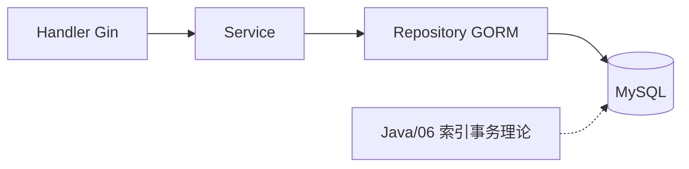
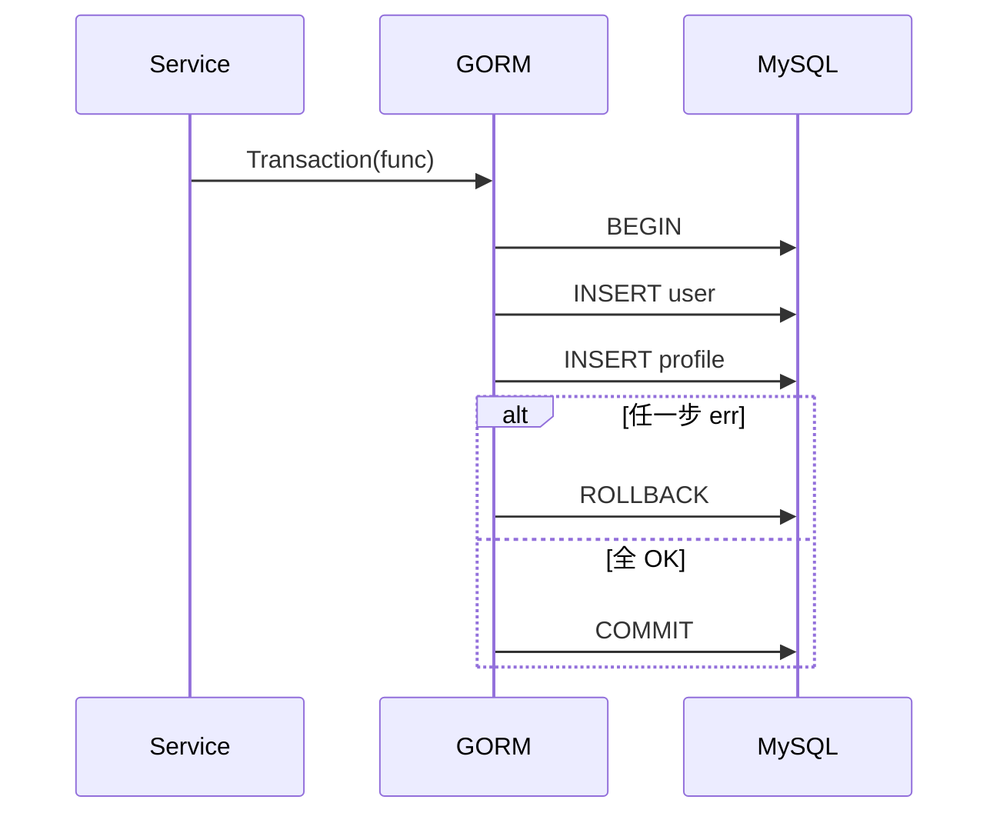

# GORM 与 MySQL 实战

<!-- 修改说明: 2026-07-08 按 EXPANSION-STANDARD 新建 §0、FAQ≥10、闭卷自测、费曼检验；理论交叉引用 Java/06 -->

> **文件编码**：UTF-8。  
> **定位**：Go 后端「持久化层」——GORM ORM 接 MySQL，完成 Model、CRUD、事务、迁移。  
> **理论前置**：[Java 06 MySQL 基础索引与事务](../Java/06-MySQL基础索引与事务.md)（索引、ACID、EXPLAIN 在本章不重复展开，以交叉引用为主）。  
> **代码前置**：[06 Gin 框架核心与中间件](./06-Gin框架核心与中间件.md)。

---

## 0. 读前导读（零基础也能跟上）

### 0.1 用一句话弄懂本章

**一句话**：**GORM = Go 的 MyBatis-Plus**——用 struct 映射表行，用链式 API 写 CRUD，Service 不再碰裸 SQL（复杂查询仍可 Raw）。

**生活类比**：

| GORM 概念 | MyBatis / Java 对照 | 含义 |
|-----------|---------------------|------|
| `model.User` | Entity / PO | 一行记录的形状 |
| `db.Create(&u)` | `insert` | 插入 |
| `db.First(&u, id)` | `selectById` | 按主键查 |
| `db.Transaction` | `@Transactional` | 多步绑一起 |
| `AutoMigrate` | Flyway 简化版 | 自动建表/加列 |

**为什么重要**：06 章内存 map 无法持久化；GORM 是 Go 实习项目标配 ORM。

---

### 0.2 你需要提前知道什么

| 水平 | 建议 |
|------|------|
| 学完 06 Gin | 正常跟做 |
| 学过 Java 05 MyBatis + 06 MySQL | 重点 GORM API 差异 |
| 不懂索引/事务 | 先读 [Java 06](../Java/06-MySQL基础索引与事务.md) §0～§15 |

---

### 0.3 本章知识地图（学完后应能勾选全部 ☐→☑）

- [ ] Docker 启动 MySQL 8.0 并连接 GORM
- [ ] 定义 User / ShortLink Model 与 AutoMigrate
- [ ] 实现 CRUD + 分页 + 条件查询
- [ ] 用 `db.Transaction` 完成转账式双表写入
- [ ] 知道 N+1 问题与 `Preload`
- [ ] 说出与 [Java 06](../Java/06-MySQL基础索引与事务.md) 对应的索引设计原则
- [ ] 闭卷自测 ≥ 8/10

---

### 0.4 建议学习时长与节奏

| 阶段 | 时间 | 内容 |
|------|------|------|
| 环境 | 0.5 天 | Docker MySQL + GORM 连接 |
| Model/CRUD | 1 天 | §2～§5 |
| 事务/迁移 | 1 天 | §6～§7 |
| 联调 Gin | 0.5 天 | Repository 注入 Service |
| 自测 | 0.5 天 | FAQ + 闭卷 |

---

### 0.5 学完本章你能做什么

1. `docker ps` 见 study-mysql，`go run` 后 AutoMigrate 建表成功。
2. `POST /api/v1/users` 写入 MySQL，重启服务数据仍在。
3. 用事务创建用户 + 默认配置两条记录，失败全回滚。
4. 对 `short_code` 字段加唯一索引，解释为何需要（见 [系统设计 08](../系统设计/08-短链服务设计.md)）。

---

### 0.6 Docker 起 MySQL 手把手

| 步骤 | 命令/动作 | 预期 | 若不对 |
|------|-----------|------|--------|
| 1 | `docker run -d --name study-mysql -e MYSQL_ROOT_PASSWORD=root123 -e MYSQL_DATABASE=shortlink -p 3306:3306 mysql:8.0` | Up | 3306 占用改 3307 |
| 2 | `docker exec -it study-mysql mysql -uroot -proot123 -e "SHOW DATABASES;"` | 见 shortlink | 密码一致 |
| 3 | `go get gorm.io/gorm gorm.io/driver/mysql` | go.mod 更新 | GOPROXY |
| 4 | 运行 §2 连接代码 | 日志 `database connected` | DSN 格式 |

---

## 本章与上一章的关系

06 章 Handler 调 Service，数据在 `map` 里。07 章在 Service 与 MySQL 之间加 **Repository 层**（可选但推荐），GORM 负责 SQL 生成与映射。



**理论分工**：B+ 树、最左前缀、ACID、隔离级别 → [Java 06](../Java/06-MySQL基础索引与事务.md)；本章专注 **Go 代码怎么写对**。

| 上一章（06） | 本章（07） | 下一章（08） |
|--------------|------------|--------------|
| 内存 User | MySQL 持久化 | Redis 缓存热点 |
| Gin Handler | + Repository | Cache Aside |

---

## 1. 连接与配置

```go
// internal/repository/db.go
import (
	"fmt"
	"gorm.io/driver/mysql"
	"gorm.io/gorm"
	"gorm.io/gorm/logger"
)

func NewDB(cfg Config) (*gorm.DB, error) {
	dsn := fmt.Sprintf("%s:%s@tcp(%s:%d)/%s?charset=utf8mb4&parseTime=True&loc=Local",
		cfg.User, cfg.Password, cfg.Host, cfg.Port, cfg.DBName)
	db, err := gorm.Open(mysql.Open(dsn), &gorm.Config{
		Logger: logger.Default.LogMode(logger.Info), // 开发看 SQL
	})
	if err != nil {
		return nil, err
	}
	sqlDB, _ := db.DB()
	sqlDB.SetMaxOpenConns(50)
	sqlDB.SetMaxIdleConns(10)
	return db, nil
}
```

**DSN 要点**：`utf8mb4` 支持 emoji；`parseTime=True` 映射 `time.Time`；生产密码走环境变量。

---

## 2. Model 定义

```go
// internal/model/user.go
type User struct {
	ID        int64          `gorm:"primaryKey;autoIncrement" json:"id"`
	Username  string         `gorm:"size:32;uniqueIndex;not null" json:"username"`
	Password  string         `gorm:"size:128;not null" json:"-"` // 09 章 bcrypt，JSON 不返回
	Email     string         `gorm:"size:128" json:"email"`
	CreatedAt time.Time      `json:"created_at"`
	UpdatedAt time.Time      `json:"updated_at"`
	DeletedAt gorm.DeletedAt `gorm:"index" json:"-"` // 软删除
}

// internal/model/short_link.go — 10 章会用
type ShortLink struct {
	ID          int64     `gorm:"primaryKey" json:"id"`
	ShortCode   string    `gorm:"size:16;uniqueIndex;not null" json:"short_code"`
	OriginalURL string    `gorm:"size:2048;not null" json:"original_url"`
	UserID      int64     `gorm:"index;not null" json:"user_id"`
	ClickCount  int64     `gorm:"default:0" json:"click_count"`
	CreatedAt   time.Time `json:"created_at"`
}
```

**对照 [Java 06](../Java/06-MySQL基础索引与事务.md)**：`short_code` **唯一索引**防重复；`user_id` 普通索引加速「某用户的链接列表」。

---

## 3. 迁移 AutoMigrate

```go
func AutoMigrate(db *gorm.DB) error {
	return db.AutoMigrate(&model.User{}, &model.ShortLink{})
}
```

| 能力 | AutoMigrate | 生产 Flyway |
|------|-------------|-------------|
| 建表/加列 | ✅ | ✅ |
| 删列/改类型 | ❌ 不安全 | ✅ 版本脚本 |
| 实习项目 | 够用 | 加分项 |

---

## 4. CRUD 与 Repository

```go
type UserRepository struct {
	db *gorm.DB
}

func (r *UserRepository) Create(ctx context.Context, u *model.User) error {
	return r.db.WithContext(ctx).Create(u).Error
}

func (r *UserRepository) GetByID(ctx context.Context, id int64) (*model.User, error) {
	var u model.User
	err := r.db.WithContext(ctx).First(&u, id).Error
	if errors.Is(err, gorm.ErrRecordNotFound) {
		return nil, nil
	}
	return &u, err
}

func (r *UserRepository) GetByUsername(ctx context.Context, name string) (*model.User, error) {
	var u model.User
	err := r.db.WithContext(ctx).Where("username = ?", name).First(&u).Error
	if errors.Is(err, gorm.ErrRecordNotFound) {
		return nil, nil
	}
	return &u, err
}
```

### 4.1 分页

```go
func (r *UserRepository) List(ctx context.Context, page, size int) ([]model.User, int64, error) {
	var users []model.User
	var total int64
	q := r.db.WithContext(ctx).Model(&model.User{})
	q.Count(&total)
	err := q.Offset((page - 1) * size).Limit(size).Order("id DESC").Find(&users).Error
	return users, total, err
}
```

---

## 5. 更新与软删除

```go
// 更新非零字段
db.Model(&user).Updates(map[string]interface{}{"email": "new@x.com"})

// 软删除 — DeletedAt 有值
db.Delete(&user, id)

// 物理删除（慎用）
db.Unscoped().Delete(&user, id)
```

**Updates vs Save**：`Updates` 忽略零值；`Save` 全量更新。

---

## 6. 事务

```go
func (r *UserRepository) CreateWithProfile(ctx context.Context, u *model.User, bio string) error {
	return r.db.WithContext(ctx).Transaction(func(tx *gorm.DB) error {
		if err := tx.Create(u).Error; err != nil {
			return err // 自动 Rollback
		}
		profile := model.UserProfile{UserID: u.ID, Bio: bio}
		if err := tx.Create(&profile).Error; err != nil {
			return err
		}
		return nil // Commit
	})
}
```

对照 [Java 06 事务](../Java/06-MySQL基础索引与事务.md)：**要么全成功要么全撤销**；Go 里 return error 即回滚。



---

## 7. 常见错误对照表

| 错误 | 原因 | 处理 |
|------|------|------|
| `Error 1062 Duplicate entry` | 唯一索引冲突 | 业务层转「用户名已存在」 |
| `record not found` | First 无行 | 判 `gorm.ErrRecordNotFound` |
| 时间差 8 小时 | DSN 缺 loc | `loc=Local` 或 UTC 统一 |
| 中文乱码 | charset 非 utf8mb4 | DSN + 表 utf8mb4 |
| 连接耗尽 | 未 SetMaxOpenConns | 配连接池 |
| 慢查询 | 缺索引 | EXPLAIN，见 Java 06 |

---

## 8. 与 Gin 集成

```go
// cmd/server/main.go
func main() {
	db, _ := repository.NewDB(loadConfig())
	repository.AutoMigrate(db)
	userRepo := repository.NewUserRepository(db)
	userSvc := service.NewUserService(userRepo)
	userH := handler.NewUserHandler(userSvc)

	r := router.Setup(userH)
	r.Run(":8080")
}
```

**依赖方向**：Handler → Service → Repository → GORM，禁止 Handler 直接 `db.Create`。

---

## 9. FAQ

**Q1：GORM 和 sqlx 选哪个？**  
业务 CRUD 用 GORM；极致性能或复杂 SQL 可 sqlx/GORM Raw。

**Q2：AutoMigrate 能上线吗？**  
小项目/实习可以；大公司用版本化迁移（golang-migrate）。

**Q3：为什么 password 用 `json:"-"`？**  
防止序列化泄漏；09 章存 bcrypt hash。

**Q4：软删除查询会带上 DeletedAt 吗？**  
默认过滤已删行；`Unscoped()` 可查全部。

**Q5：事务里能开 goroutine 吗？**  
不要。tx 不能跨 goroutine。

**Q6：金额字段用什么类型？**  
`decimal(10,2)` + shopspring/decimal 或字符串；见 [Java 06](../Java/06-MySQL基础索引与事务.md) 金额章节。

**Q7：GORM 会防 SQL 注入吗？**  
占位符 `?` 安全；`fmt.Sprintf` 拼 SQL 危险。

**Q8：First 和 Take 区别？**  
First 按主键排序取第一条；Take 无排序。

**Q9：如何打 SQL 日志？**  
`Logger: logger.Info`；生产 Warn/Error。

**Q10：N+1 怎么避免？**  
列表 + 循环查关联 → 改 `Preload` 或 JOIN 一次查齐。

**Q11：连接池 MaxOpenConns 设多少？**  
起步 50，压测调整；过大打爆 MySQL。

**Q12：Context 传 GORM 有什么用？**  
超时取消、链路 trace；`WithContext(ctx)` 必写。

---

## 11. 练习建议

### 基础

1. 完成 User CRUD API，数据落 MySQL
2. 用户名唯一冲突返回 400

### 进阶

3. 实现 ShortLink 表 + `Create`/`GetByShortCode`
4. 分页 `GET /api/v1/links?page=1&size=10`

### 挑战

5. 事务：注册用户 + 插入欢迎短链占位
6. 对 `ListByUserID` 做 EXPLAIN，对照 Java 06 加联合索引

---

## 12. 学完标准

- [ ] Docker MySQL + GORM 连接成功
- [ ] AutoMigrate User/ShortLink
- [ ] CRUD + 分页 + 唯一约束处理
- [ ] 会写 Transaction
- [ ] Handler 不直连 GORM
- [ ] 能口述与 Java 06 对应的索引场景

---

## 13. 闭卷自测

1. GORM 在本项目分层里处于哪一层？
2. `gorm.ErrRecordNotFound` 应如何处理？
3. 软删除字段是什么类型？
4. Transaction 中 return error 会发生什么？
5. DSN 为什么要 `utf8mb4`？
6. 写出按 username 查询的 Where 片段。
7. short_code 为什么要 uniqueIndex？
8. N+1 是什么？怎么避免？
9. AutoMigrate 与 Flyway 各适合什么阶段？
10. 连接池两个核心参数叫什么？

### 参考答案

1. Repository 层，Service 调用 Repository。
2. 转为业务「不存在」，勿当 500。
3. `gorm.DeletedAt`。
4. GORM 自动 Rollback。
5. 完整 Unicode（含 emoji）。
6. `` Where("username = ?", name) ``。
7. 短码全局唯一，防碰撞跳转错误。
8. 1 次列表 + N 次关联查；用 Preload/JOIN。
9. 实习/原型 AutoMigrate；生产版本脚本。
10. MaxOpenConns、MaxIdleConns。

---

## 14. 费曼检验

3 分钟：**「GORM 在你项目里怎么替代 MyBatis？」**

1. struct = Entity，tag = 列定义。
2. `Create/First/Where` = Mapper 方法。
3. `Transaction` = `@Transactional`。
4. 索引/事务理论仍看 [Java 06](../Java/06-MySQL基础索引与事务.md)，Go 侧负责写对 API。

---

## 15. 章节衔接

| 模块 | 链接 |
|------|------|
| 上一章 Gin | [06 Gin 框架](./06-Gin框架核心与中间件.md) |
| MySQL 理论 | [Java 06 MySQL](../Java/06-MySQL基础索引与事务.md) |
| 下一章缓存 | [08 Redis 与 go-redis](./08-Redis与go-redis缓存实战.md) |
| 短链表设计 | [系统设计 08 短链](../系统设计/08-短链服务设计.md) |

**下一章预告**：07 章每次跳转都查 MySQL——高 QPS 扛不住。08 章用 **go-redis** 做 Cache Aside，理论对照 [Java 07 Redis](../Java/07-Redis核心原理与缓存实战.md)。

---

*下一章：[08-Redis与go-redis缓存实战](./08-Redis与go-redis缓存实战.md)*
