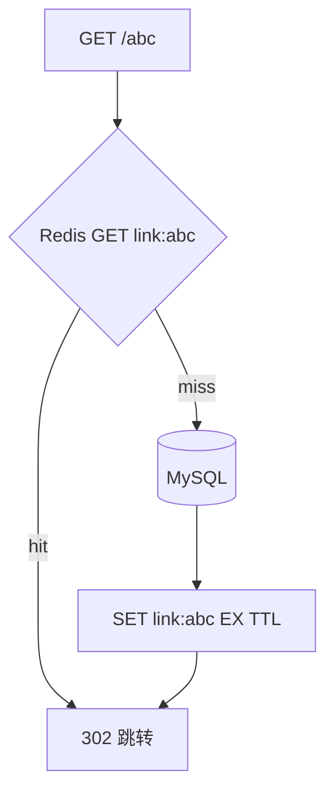
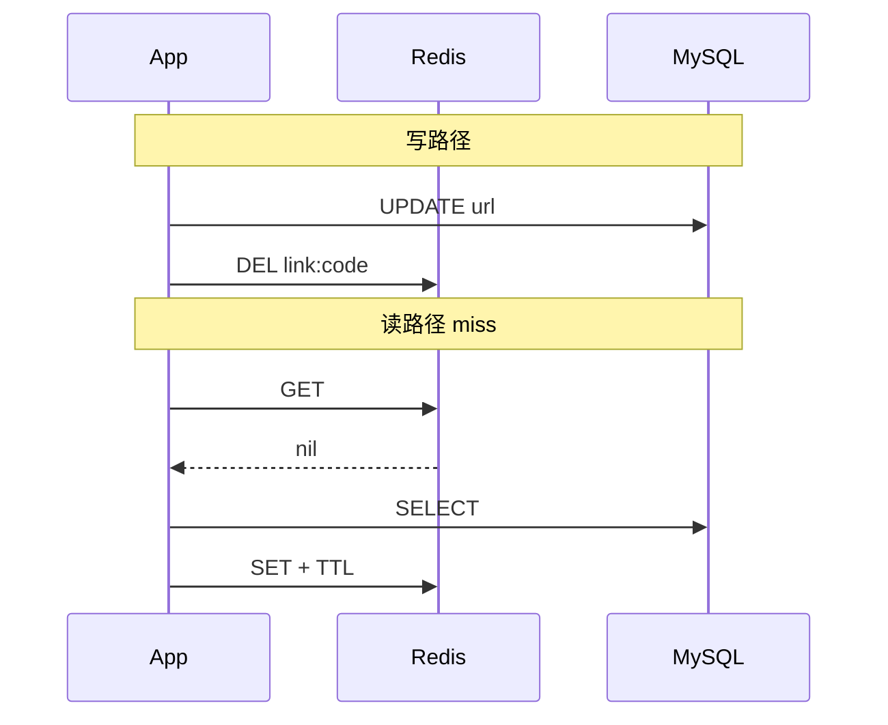

# Redis 与 go-redis 缓存实战

<!-- 修改说明: 2026-07-08 按 EXPANSION-STANDARD 新建 §0、FAQ≥10、闭卷自测；理论交叉引用 Java/07 -->

> **文件编码**：UTF-8。  
> **定位**：Go 后端「缓存层」——`github.com/redis/go-redis/v9` 接 Redis，实现 Cache Aside 与三大经典问题对策。  
> **理论前置**：[Java 07 Redis 核心原理与缓存实战](../Java/07-Redis核心原理与缓存实战.md)（穿透/击穿/雪崩、数据结构、持久化在本章以交叉引用 + Go 代码为主）。  
> **代码前置**：[07 GORM 与 MySQL 实战](./07-GORM与MySQL实战.md)。

---

## 0. 读前导读（零基础也能跟上）

### 0.1 用一句话弄懂本章

**一句话**：把热点数据放 **Redis 抽屉**，读先 Redis 后 MySQL，写先 MySQL 再 **删** Redis——应用自己管缓存叫 **Cache Aside**。

**生活类比**（与 [Java 07](../Java/07-Redis核心原理与缓存实战.md) 一致）：

| 对比 | Redis | MySQL |
|------|-------|-------|
| 速度 | 微秒级 | 毫秒级 |
| 容量 | 小 | 大 |
| 断电 | 可丢（可 AOF） | 可靠落盘 |
| 场景 | 短链映射、Session、限流 | 订单、用户主数据 |

---

### 0.2 你需要提前知道什么

| 水平 | 建议 |
|------|------|
| 学完 07 GORM | 跟做 Cache Aside |
| 学过 Java 07 | 重点 go-redis API |
| 不懂穿透/击穿/雪崩 | 先读 Java 07 §9 |

---

### 0.3 本章知识地图（学完后应能勾选全部 ☐→☑）

- [ ] Docker 启动 Redis 7 并用 redis-cli 验证
- [ ] go-redis 连接池配置与 `Ping`
- [ ] 实现短链 `short_code → original_url` Cache Aside
- [ ] 写路径：UPDATE/INSERT MySQL 后 DEL 缓存
- [ ] 口述穿透/击穿/雪崩及一种 Go 侧对策
- [ ] 用 SETNX 实现简易分布式锁（知道局限）
- [ ] 闭卷自测 ≥ 8/10

---

### 0.4 建议学习时长与节奏

| 阶段 | 时间 | 内容 |
|------|------|------|
| 环境 | 2 h | Docker + redis-cli |
| go-redis | 3 h | §2～§4 |
| Cache Aside | 3 h | §5 短链缓存 |
| 三大问题 | 2 h | §6 |
| 自测 | 1 h | FAQ + 闭卷 |

---

### 0.5 学完本章你能做什么

1. `redis-cli PING` → `PONG`；Go 程序 `client.Ping` 成功。
2. 第二次 `GET /{code}` 跳转路径命中 Redis（日志或断点）。
3. 更新长链后旧缓存失效，再查得到新 URL。
4. 白板画 Cache Aside 读/写路径（面试 3 分钟）。

---

### 0.6 redis-cli 手把手

| 步骤 | 命令 | 预期 |
|------|------|------|
| 1 | `docker run -d --name study-redis -p 6379:6379 redis:7` | Up |
| 2 | `docker exec -it study-redis redis-cli` | `127.0.0.1:6379>` |
| 3 | `SET link:abc https://example.com EX 3600` | OK |
| 4 | `GET link:abc` | URL 字符串 |
| 5 | `INCR stats:abc:clicks` | 整数自增 |

---

## 本章与上一章的关系

07 章短链查 MySQL；08 章在 Repository 之上加 **CacheService**，跳转读路径优先 Redis。



| 上一章（07） | 本章（08） | 下一章（09） |
|--------------|------------|--------------|
| MySQL 持久化 | Redis 热点缓存 | JWT 登录态 |
| GORM | go-redis/v9 | Token 存 Redis 可选 |

---

## 1. go-redis 连接

```go
import "github.com/redis/go-redis/v9"

func NewRedis(cfg Config) *redis.Client {
	return redis.NewClient(&redis.Options{
		Addr:         fmt.Sprintf("%s:%d", cfg.Host, cfg.Port),
		Password:     cfg.Password,
		DB:           0,
		PoolSize:     20,
		MinIdleConns: 5,
	})
}

func main() {
	rdb := NewRedis(cfg)
	ctx := context.Background()
	if err := rdb.Ping(ctx).Err(); err != nil {
		log.Fatal(err)
	}
}
```

**v9 要点**：所有命令第一个参数 `context.Context`，支持超时与取消。

---

## 2. Key 命名规范

```
link:{short_code}     → 原 URL 字符串
user:{id}             → 用户 JSON
lock:create_link:{uid}→ 分布式锁
rl:ip:{ip}            → 限流计数（11 章）
```

规则：业务前缀 + 冒号 +  id；**必须设 TTL**（除计数器类可长期）。

---

## 3. Cache Aside 读路径

```go
const linkKeyPrefix = "link:"
const linkTTL = 24 * time.Hour

type LinkCache struct {
	rdb *redis.Client
	repo *repository.LinkRepository
}

func (c *LinkCache) GetOriginalURL(ctx context.Context, code string) (string, error) {
	key := linkKeyPrefix + code
	val, err := c.rdb.Get(ctx, key).Result()
	if err == nil {
		return val, nil // cache hit
	}
	if !errors.Is(err, redis.Nil) {
		return "", err // Redis 故障
	}
	// cache miss → DB
	link, err := c.repo.GetByShortCode(ctx, code)
	if err != nil || link == nil {
		return "", err
	}
	// 回填缓存，忽略 SET 失败（降级仍可用 DB）
	_ = c.rdb.Set(ctx, key, link.OriginalURL, linkTTL).Err()
	return link.OriginalURL, nil
}
```

---

## 4. 写路径：先 DB 后删缓存

```go
func (s *LinkService) UpdateURL(ctx context.Context, code, newURL string) error {
	if err := s.repo.UpdateOriginalURL(ctx, code, newURL); err != nil {
		return err
	}
	key := linkKeyPrefix + code
	return s.rdb.Del(ctx, key).Err() // 删而非改
}
```

**为何 DEL 不是 SET？** 避免并发下旧值覆盖新值；与 [Java 07 Cache Aside](../Java/07-Redis核心原理与缓存实战.md) 一致。



---

## 5. 序列化：String vs JSON

短链映射用 **纯 String**（值即 URL）最快。用户对象可用 JSON：

```go
data, _ := json.Marshal(user)
rdb.Set(ctx, "user:1", data, time.Hour)
```

---

## 6. 穿透 / 击穿 / 雪崩

| 问题 | 含义 | Go 侧对策 |
|------|------|-----------|
| **穿透** | 查不存在 key，打穿 DB | 空值缓存短 TTL；布隆过滤器（[系统设计 08](../系统设计/08-短链服务设计.md)） |
| **击穿** | 热点 key 过期瞬间并发打 DB | 互斥锁 `SetNX` 只有一个回源；逻辑过期 |
| **雪崩** | 大量 key 同时过期 | TTL 加随机 jitter；多级缓存 |

### 6.1 空值防穿透

```go
if link == nil {
	_ = c.rdb.Set(ctx, key, "", 5*time.Minute).Err() // 空串表示不存在
	return "", ErrNotFound
}
// 读时
if val == "" {
	return "", ErrNotFound
}
```

### 6.2 互斥回源（击穿）

```go
lockKey := "lock:reload:" + code
ok, _ := c.rdb.SetNX(ctx, lockKey, "1", 10*time.Second).Result()
if ok {
	defer c.rdb.Del(ctx, lockKey)
	// 查 DB + SET
} else {
	time.Sleep(50 * time.Millisecond)
	return c.GetOriginalURL(ctx, code) // 重试
}
```

---

## 7. 简易分布式锁

```go
func WithLock(ctx context.Context, rdb *redis.Client, key string, ttl time.Duration, fn func() error) error {
	token := uuid.NewString()
	ok, err := rdb.SetNX(ctx, key, token, ttl).Result()
	if err != nil || !ok {
		return errors.New("lock busy")
	}
	defer func() {
		// Lua：只删自己的 token
		script := `if redis.call("get",KEYS[1])==ARGV[1] then return redis.call("del",KEYS[1]) else return 0 end`
		rdb.Eval(ctx, script, []string{key}, token)
	}()
	return fn()
}
```

生产可用 [redsync](https://github.com/go-redsync/redsync)；面试说清 SETNX + 唯一 value + Lua 释放即可。

---

## 8. 常见错误对照表

| 现象 | 原因 | 处理 |
|------|------|------|
| `context deadline exceeded` | 无超时 | `context.WithTimeout` |
| 缓存不一致 | 先删缓存后写 DB | 先 DB 后 DEL |
| 内存暴涨 | 无 TTL | 所有 key EX |
| `MOVED` 错误 | Cluster 模式 | 用 ClusterClient |
| 热 key | 单 key QPS 过高 | 本地缓存 + Redis；11 章 CDN |

---

## 9. 与 Gin 集成

```go
type LinkHandler struct {
	cache *service.LinkCache
}

func (h *LinkHandler) Redirect(c *gin.Context) {
	code := c.Param("code")
	url, err := h.cache.GetOriginalURL(c.Request.Context(), code)
	if err != nil || url == "" {
		c.JSON(404, response.Result{Code: 404, Msg: "not found"})
		return
	}
	c.Redirect(http.StatusFound, url) // 302，11 章详述
}
```

---

## 10. FAQ

**Q1：go-redis v8 和 v9？**  
新项目 **v9**，Context 一等公民。

**Q2：Redis 和 Memcached？**  
Redis 数据结构丰富、持久化；Go 后端几乎全 Redis。

**Q3：缓存和 DB 强一致？**  
Cache Aside 是 **最终一致**；强一致用分布式事务（过重，短链不需要）。

**Q4：TTL 设多长？**  
短链映射 24h～7d + jitter；热点可永不过期+主动失效。

**Q5：Pipeline 有什么用？**  
批量命令减 RTT；统计写入可 Pipeline。

**Q6：Redis 单线程为何快？**  
内存 + IO 多路复用；无磁盘随机读。

**Q7：持久化 RDB/AOF？**  
实习认知即可；详见 [Java 07](../Java/07-Redis核心原理与缓存实战.md)。

**Q8：Token 放 Redis？**  
09 章 JWT 可无状态；黑名单/Refresh 可用 Redis。

**Q9：布隆过滤器 Go 库？**  
`bits-and-blooms/bloom/v3`；设计见 [系统设计 08](../系统设计/08-短链服务设计.md)。

**Q10：缓存 null 占内存吗？**  
占，但远小于 DB 压力；TTL 要短。

**Q11：Connection PoolSize？**  
默认 10×GOMAXPROCS；压测调。

**Q12：Redis 挂了怎么办？**  
降级直查 MySQL + 限流；08/11 章短链读路径必谈。

---

## 11. 练习建议

### 基础

1. 实现 `LinkCache.GetOriginalURL` 完整 Cache Aside
2. redis-cli 观察第二次 GET 命中

### 进阶

3. 更新 URL 后验证缓存失效
4. 空值缓存防穿透 demo

### 挑战

5. SETNX 互斥回源 + 单元测试（miniredis）
6. 对照 Java 07 写同流程时序图

---

## 12. 学完标准

- [ ] Docker Redis + go-redis Ping
- [ ] Cache Aside 读写正确
- [ ] 能解释穿透/击穿/雪崩
- [ ] key 命名 + TTL 规范
- [ ] 知道与 Java 07 理论对应关系

---

## 13. 闭卷自测

1. Cache Aside 读路径三步？
2. 写路径为何 DEL 不是 SET？
3. `redis.Nil` 表示什么？
4. 穿透与击穿区别？
5. 雪崩 TTL jitter 怎么加？（口述）
6. go-redis v9 命令签名特点？
7. 短链 key 如何命名？
8. SETNX 锁为何要唯一 token？
9. Redis 挂了短链怎么办？
10. 布隆过滤器解决什么问题？

### 参考答案

1. GET Redis → miss 查 MySQL → SET TTL。
2. 避免并发写乱序；以 DB 为准。
3. key 不存在（非网络错误）。
4. 穿透不存在；击穿热点过期。
5. `baseTTL + rand(0, 300s)`。
6. 第一个参数 `context.Context`。
7. `link:{short_code}`。
8. 防误删他人锁。
9. 降级 MySQL + 限流/熔断。
10. 快速判「一定不存在」，减穿透。

---

## 14. 费曼检验

3 分钟：**「抽屉（Redis）和仓库（MySQL）怎么配合？」**

用 Cache Aside 读/写时序 + 一个穿透例子；细节引用 [Java 07](../Java/07-Redis核心原理与缓存实战.md)。

---

## 15. 章节衔接

| 模块 | 链接 |
|------|------|
| 上一章 GORM | [07 GORM 与 MySQL](./07-GORM与MySQL实战.md) |
| Redis 理论 | [Java 07 Redis](../Java/07-Redis核心原理与缓存实战.md) |
| 下一章认证 | [09 JWT 认证与用户体系](./09-JWT认证与用户体系.md) |
| 短链设计 | [系统设计 08](../系统设计/08-短链服务设计.md) |
| 限流 | [系统设计 02 限流](../系统设计/02-限流熔断与降级.md) |

**下一章预告**：08 章解决了「读快」；09 章解决「谁有权创建短链」——**bcrypt + JWT + 鉴权中间件**。

---

*下一章：[09-JWT认证与用户体系](./09-JWT认证与用户体系.md)*
