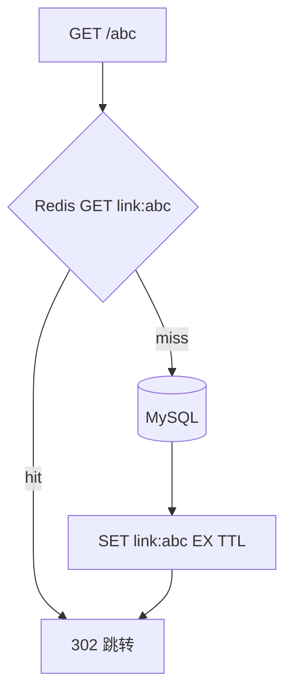
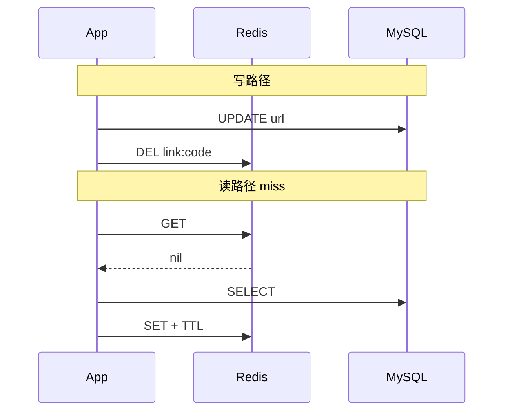

# Redis 与 go-redis 缓存实战

<!-- 修改说明: 2026-07-08 按 EXPANSION-STANDARD 新建 §0、FAQ≥10、闭卷自测；理论交叉引用 Java/07；2026-07-14 补充可验证降级、TTL 抖动、singleflight、原子限流与故障测试；2026-07-26 按审查报告修订：开启 ContextTimeoutEnabled 并新增三层超时/重试讲解（§1.2）、核心示例全部补完整可编译清单（redis-demo 模块，§0.7），新增 SCAN 遍历（§2.1）、Hook 指标埋点（§3.4）、outbox 最小实现（§4.3）、Hash/ZSet/Set/List 与序列化取舍（§5，List 定长列表与简易队列为本轮核对补充）、逻辑过期与布隆过滤器落地（§6.5/§6.6）、miniredis 单测清单（§7.4）、Sentinel/Cluster 连接（§8.1）；修正 Lua 限流 PTTL==-1 防御、math/rand/v2、Redis 单线程表述与 §7.3 延迟断言；2026-07-27 去水化精简：删除知识地图/学习时长/学完你能做什么/本章与上一章的关系/FAQ/学完标准/闭卷自测（含参考答案）/费曼检验/章节衔接等模板板块；FAQ 16 条中 9 条有效条目并入正文对应小节（v9 选型→§1、Memcached 对比→§0.1、最终一致→§4.1、TTL 起步值→§3.2、单线程准确表述→§2.1、空值内存→§6.1、PoolSize 默认值→§1.1、singleflight 故障面→§6.3、Token 存 Redis→§2），其余 7 条正文已有同等深度表述故直接删；§0.6/§0.7 重排为 §0.3/§0.4、原 §11 练习建议重排为 §10；修正交叉引用：§6.3 与 §6.4 清单注释中的 §0.7→§0.4（仅注释，不影响编译）、§7.2 的「练习 7」实指练习 9；原章节衔接表中 09 章与系统设计 02 链接分别内联进 §2、§7.2；代码清单逻辑与正文技术讲解未删减 -->

> **文件编码**：UTF-8。  
> **定位**：Go 后端「缓存层」——`github.com/redis/go-redis/v9` 接 Redis，实现 Cache Aside 与三大经典问题对策。  
> **理论前置**：[Java 07 Redis 核心原理与缓存实战](../Java/07-Redis核心原理与缓存实战.md)（穿透/击穿/雪崩、数据结构、持久化在本章以交叉引用 + Go 代码为主）。  
> **代码前置**：[07 GORM 与 MySQL 实战](./07-GORM与MySQL实战.md)。  
> **环境约定**：命令默认在 **Windows 11 + PowerShell** 直接执行（需已启动 Docker Desktop）；标注「服务器上」的命令在 Linux/WSL 执行。技术基线 Go 1.22+（本章代码在 Go 1.26 实测编译运行通过）。

---

## 0. 读前导读（零基础也能跟上）

### 0.1 用一句话弄懂本章

**一句话**：把热点数据放 **Redis 抽屉**，读先 Redis 后 MySQL，写先 MySQL 再 **删** Redis——应用自己管缓存叫 **Cache Aside**。

**生活类比**（与 [Java 07](../Java/07-Redis核心原理与缓存实战.md) 一致）：

| 对比 | Redis | MySQL |
|------|-------|-------|
| 速度 | 微秒级 | 毫秒级 |
| 容量 | 小 | 大 |
| 断电 | 可丢（可 AOF） | 可靠落盘 |
| 场景 | 短链映射、Session、限流 | 订单、用户主数据 |

**为什么是 Redis 而不是 Memcached**：Redis 数据结构丰富（String/Hash/ZSet/Set/List，§5）、支持持久化与主从/集群；Memcached 只有简单 KV。Go 后端生态几乎默认 Redis。

---

### 0.2 你需要提前知道什么

| 水平 | 建议 |
|------|------|
| 学完 07 GORM | 跟做 Cache Aside |
| 学过 Java 07 | 重点 go-redis API |
| 不懂穿透/击穿/雪崩 | 先读 Java 07 §9 |

---

### 0.3 redis-cli 手把手

以下命令在 **PowerShell 直接执行**（前提：Docker Desktop 已启动；Linux 服务器上命令完全相同）：

| 步骤 | 命令 | 预期 |
|------|------|------|
| 1 | `docker run -d --name study-redis -p 6379:6379 redis:7` | 输出容器 ID |
| 2 | `docker exec -it study-redis redis-cli` | `127.0.0.1:6379>` |
| 3 | `SET link:abc https://example.com EX 3600` | OK |
| 4 | `GET link:abc` | URL 字符串 |
| 5 | `INCR stats:abc:clicks` | 整数自增 |
| 6 | `exit` | 退出 redis-cli |

> **版本说明**：`redis:7` 稳定可用；Redis 8.x 已于 2025 年发布成为当前主版本，新环境也可以直接用 `redis:8`，本章所有命令两者通用。

**连不上时的排查顺序**（PowerShell）：

```powershell
docker ps                                  # 容器是否在跑？STATUS 应为 Up
docker start study-redis                   # 没在跑就启动（重启电脑后容器不会自动启动）
Get-NetTCPConnection -LocalPort 6379       # 6379 端口是否有进程监听
```

Linux 服务器上最后一条等价命令是 `ss -lntp | grep 6379`。

---

### 0.4 本章练习模块与符号清单（先做这一步，后面所有清单才能跑）

本章所有「完整可编译清单」都放在同一个练习模块 `redis-demo` 里，**先照做这几条命令**（PowerShell）：

```powershell
New-Item -ItemType Directory -Force -Path F:\study\code\redis-demo | Out-Null
cd F:\study\code\redis-demo
go mod init redis-demo

# 国内网络建议设置模块代理（只影响当前 PowerShell 窗口，不改全局配置）
$env:GOPROXY = "https://goproxy.cn,direct"

# 固定版本，保证你和正文使用同一套 API；go-redis 必须是 v9 系列
go get github.com/redis/go-redis/v9@v9.21.0
go get golang.org/x/sync@v0.16.0
go get github.com/google/uuid@v1.6.0
go get github.com/alicebob/miniredis/v2@v2.38.0
go get github.com/bits-and-blooms/bloom/v3@v3.7.1
```

> **固定版本与 Go 工具链的关系**：以上都是本章实测验证的版本，但注意它们的 go.mod 对 Go 版本有要求——go-redis v9.21.0 声明 `go 1.24`，`x/sync` v0.16.0 声明 `go 1.23`（§3.4 选装的 prometheus v1.24.1 声明 `go 1.25`）。本机 `go version` 低于这些数字也不用慌：Go 1.21 起默认 `GOTOOLCHAIN=auto`，`go` 命令发现依赖要求更高版本时会**自动下载匹配的工具链**（需联网），照抄上面的命令即可跑通。若必须锁死旧工具链（如离线环境），可改用旧版依赖：`golang.org/x/sync@v0.10.0` 与 `github.com/redis/go-redis/v9@v9.7.3` 都只要求 `go 1.18`，本章用到的 API 完全相同。完成跟做后再统一执行 `go get -u`，不要一边抄代码一边随意漂移版本。

```text
redis-demo/
├── go.mod
├── cmd/
│   ├── ping/main.go          §1.1 连接 + Ping + 连接池观测
│   ├── datatypes/main.go     §5.4 Hash / ZSet / Set 实操
│   ├── cacheaside/
│   │   ├── main.go           §6.4 Cache Aside + singleflight + 降级演示
│   │   └── main_test.go      §7.4 miniredis 单元测试
│   ├── lockdemo/main.go      §7   分布式锁演示
│   ├── ratelimit/main.go     §7.2 Lua 原子限流
│   └── bloomdemo/main.go     §6.6 布隆过滤器
└── internal/
    └── metrics/redis_hook.go §3.4 指标埋点（可选，需另装 prometheus）
```

**代码块约定**：标注「**片段**」的代码块不能单独编译——正文会注明它属于哪个文件、完整版在哪一节；标注「**完整可编译清单**」的可以直接 `go run` / `go test`。

**符号对照表**：本章不少片段沿用了前几章项目里的符号。为了让 demo 不依赖 MySQL 也能跑，完整清单里用了简化替身，对应关系如下：

| 项目符号（来源章节） | 含义 | 本章 demo 里的替身 |
|----------------------|------|--------------------|
| `apperr.ErrNotFound`（07 章统一错误层） | 「资源不存在」哨兵错误 | 本地 `var ErrNotFound`（§6.4） |
| `apperr.ErrInvalidArgument`（07 章） | 参数非法 | 本地 `var ErrInvalidArgument`（§7.2） |
| `model.Link` / `model.LinkStatusActive`（07 章） | 短链模型与状态常量 | 精简 `Link` 结构体（§6.4） |
| `repository.LinkRepository`（07 章） | GORM 数据访问层 | `fakeRepo` 内存 map（§6.4） |
| `response.WriteError`（06 章统一响应） | 错误转 HTTP 状态码 | §9 仅示意，不参与编译 |
| `uuid.NewString`（google/uuid） | 生成唯一字符串 | 直接 `go get` 使用 |
| `singleflight.Group`（x/sync） | 合并重复调用 | 直接 `go get` 使用 |

---

## 1. go-redis 连接

go-redis 新项目一律用 **v9**（v8 及更早版本 API 有差异，本章全部基于 v9）。v9 的所有命令第一个参数都是 `context.Context`，支持超时与取消——**但有一个几乎所有人都会踩的坑**：默认配置下，你传进去的 ctx 的 deadline **管不到网络读写**，必须显式打开 `ContextTimeoutEnabled`（§1.2 详解）。下面的清单已经把它配好了。

### 1.1 完整可编译清单：连接 + Ping + 连接池观测

**文件**：`redis-demo/cmd/ping/main.go`

```go
package main

import (
	"context"
	"fmt"
	"log"
	"time"

	"github.com/redis/go-redis/v9"
)

// Config 集中存放 Redis 连接参数。项目版通常从 yaml/env 读取（12 章讲配置工程化），
// 这里为了单文件可运行，直接用带默认值的结构体。
type Config struct {
	Host     string
	Port     int
	Password string // 本地 Docker 启动的 Redis 默认无密码，留空即可
}

// NewRedis 创建带连接池与超时配置的客户端。
func NewRedis(cfg Config) *redis.Client {
	return redis.NewClient(&redis.Options{
		Addr:     fmt.Sprintf("%s:%d", cfg.Host, cfg.Port),
		Password: cfg.Password,
		DB:       0, // Redis 默认有 16 个逻辑库（0~15），学习期用 0 号即可

		// —— 连接池 ——
		PoolSize:     20,                     // 最多同时 20 条连接
		MinIdleConns: 5,                      // 保持 5 条空闲连接，省掉临时建连的延迟
		PoolTimeout:  200 * time.Millisecond, // 池满时等待空闲连接的上限

		// —— 超时三防线（详见 §1.2）——
		DialTimeout:  500 * time.Millisecond,
		ReadTimeout:  100 * time.Millisecond,
		WriteTimeout: 100 * time.Millisecond,
		// 关键开关：让每条命令的网络等待尊重 caller 传入的 context 截止时间。
		// 默认是 false——不开它，你给命令传的 child context 管不住 socket 读写，
		// 实际超时只由上面的 ReadTimeout/WriteTimeout 决定（§1.2 详解）。
		ContextTimeoutEnabled: true,

		// —— 重试 ——
		// 注意取值语义：0 = 用默认值(重试 3 次)；-1 = 禁用重试；1 = 最多重试 1 次。
		MaxRetries: 1,
	})
}

func main() {
	rdb := NewRedis(Config{Host: "127.0.0.1", Port: 6379})
	defer rdb.Close() // 进程退出前关闭连接池（§1.3）

	ctx, cancel := context.WithTimeout(context.Background(), time.Second)
	defer cancel()

	if err := rdb.Ping(ctx).Err(); err != nil {
		// 本项目把 Redis 定义成可降级依赖：记录告警后仍可启动，读路径回源 MySQL。
		// 若你的业务把 Redis 当唯一 Session/队列存储，则应改成启动失败或 readiness=false。
		log.Printf("redis unavailable, start in degraded mode: %v", err)
		return
	}
	fmt.Println("PING -> PONG，Redis 连接正常")

	stats := rdb.PoolStats()
	fmt.Printf("连接池: hits=%d misses=%d timeouts=%d total=%d idle=%d\n",
		stats.Hits, stats.Misses, stats.Timeouts, stats.TotalConns, stats.IdleConns)
}
```

**运行**（PowerShell）：

```powershell
cd F:\study\code\redis-demo
go run ./cmd/ping
```

Redis 在跑时输出：

```text
PING -> PONG，Redis 连接正常
连接池: hits=0 misses=1 timeouts=0 total=5 idle=5
```

（连接池各数字与建连时机有关，略有出入正常；重点是 `timeouts=0`。）

把容器停掉（`docker stop study-redis`）再跑一次，会打印 `redis unavailable, start in degraded mode: ...` 然后正常退出——这正是本章的降级思路：**Redis 挂了记录告警，程序不崩**。别忘了 `docker start study-redis` 再启回来。

**逐段讲解**：

- `redis.NewClient` 返回的 `*redis.Client` 内部自带**连接池**，是并发安全的：整个进程创建**一个**共享使用即可，不要每个请求 new 一个。
- `PoolSize` 不设时默认为 `10 × GOMAXPROCS`；本章设 20 只是演示值，生产按压测结果调整，观测依据见 §1.3 的 PoolStats。
- `Ping` 返回的不是裸 error，而是一个 `*StatusCmd` 命令对象，`.Err()` 取错误、`.Result()` 取值加错误——go-redis 所有命令都是这个模式。
- 客户端级超时（ReadTimeout 等）是防线，请求内仍应给单次缓存操作更短的 child context（§3.2 会这么做）；否则 Redis 故障会先耗尽整个 HTTP deadline，根本来不及回源 MySQL。

### 1.2 三层超时与重试：`ContextTimeoutEnabled` 必须自己打开

排查线上「Redis 慢」问题，必须能分清三层机制。**从外到内**：

**第一层：ctx deadline（业务视角的总预算）。**
你调用 `rdb.Get(cacheCtx, key)` 时传的 context。**注意**：`ContextTimeoutEnabled` 默认是 `false`，此时 go-redis 在做 socket 读写时**不看你的 ctx**——ctx 只在「等连接池空闲连接」「重试之间的退避 sleep」这些环节被检查。设为 `true` 后，socket 的读写 deadline 取 `min(ctx 剩余时间, ReadTimeout)`，你的 80ms child ctx 才真正能在 80ms 截断一次慢查询。

**第二层：ReadTimeout / WriteTimeout / DialTimeout（每次网络操作的兜底防线）。**
单次 socket 读 / 写 / 建连的上限，不管 ctx 开不开都生效。v9 默认 ReadTimeout 3 秒、DialTimeout 5 秒——对「缓存必须快」的场景太宽松，所以本章压到 100ms/500ms。（阻塞命令如 `BLPOP` 有单独的超时规则，本章用不到。）

**第三层：MaxRetries + 退避（失败后的重试放大器）。**
超时/网络错误默认会重试，重试之间还有随机退避 sleep（默认 8ms～512ms）。**取值语义是面试暗坑**：`0` 表示「用默认值 3 次」，想禁用必须写 `-1`。重试会把总耗时成倍放大，这就是「设了 100ms 超时却量到 300ms+」的常见原因。

三层叠加后，同一个故障（比如 Redis 网络延迟 300ms）在不同配置下的表现完全不同：

| 配置组合 | 单次 GET 实际耗时 |
|----------|-------------------|
| `ContextTimeoutEnabled: true` + 80ms child ctx | **≈ 80ms**：socket deadline 取 min(80ms, 100ms)=80ms；超时后 ctx 已过期，不再重试 |
| 默认 `false` + 80ms child ctx | **≈ 100ms**：socket 只认 ReadTimeout=100ms；之后检查 ctx 发现已过期，不再重试 |
| 默认 `false` + 不传带超时的 ctx | **≈ 210ms+**：100ms 超时 → 退避 sleep → 重试再等 100ms（MaxRetries=1） |

结论：**本章「80ms 转 DB」的降级叙事，成立的前提就是 §1.1 里那行 `ContextTimeoutEnabled: true`**。§7.3 的故障测试会验证这一点。

### 1.3 客户端生命周期：Close 与 PoolStats

**Close**：`*redis.Client` 全进程只建一个，服务优雅退出时（HTTP server `Shutdown` 之后）调用一次 `rdb.Close()` 关闭连接池；平时的业务代码里**永远不要**调它。

**PoolStats**：连接池的健康快照，字段含义：

| 字段 | 含义 | 异常信号 |
|------|------|----------|
| `Hits` | 从池里直接拿到空闲连接的次数 | — |
| `Misses` | 池里没有空闲连接、现场新建的次数 | 持续升高 → MinIdleConns 偏小 |
| `Timeouts` | 等不到连接超时（PoolTimeout）的次数 | **> 0 就该报警**：池被打满 |
| `TotalConns` / `IdleConns` | 当前总连接 / 空闲连接数 | Total 常年顶着 PoolSize → 需扩池或查慢命令 |
| `StaleConns` | 被回收的过期连接数 | — |

项目里通常起一个 goroutine 每 30s 把这些值送进指标系统（§3.4 的 Prometheus 就能接）；学习期用 §1.1 清单里那行 `fmt.Printf` 观察即可。

---

## 2. Key 命名规范

```text
link:{short_code}     → 原 URL 字符串
user:{id}             → 用户 JSON
lock:create_link:{uid}→ 分布式锁
rl:ip:{ip}            → 限流计数（11 章）
```

规则：业务前缀 + 冒号 + id。**缓存类 key 默认应有 TTL**；确实代表持久状态的集合、配置或幂等记录要单独设计生命周期，不能机械给所有 key 同一个过期时间。

09 章登录态还会在这套命名下新增 token 类 key：JWT 本身可以无状态，但「主动踢下线」的黑名单和 Refresh Token 需要落 Redis（详见 [09 JWT 认证与用户体系](./09-JWT认证与用户体系.md)）。

### 2.1 生产禁用 KEYS，用 SCAN 遍历

想看「现在有哪些 `link:*` key」，新手第一反应是 `KEYS link:*`——**这条命令生产环境是事故级禁令**：`KEYS` 一次性遍历全部 key（O(N)），而 Redis 的**命令执行是单线程**的，几百万 key 时它会阻塞所有请求几百毫秒甚至数秒，线上表现就是「Redis 突然卡死一下」。

替代方案是 **SCAN**：基于游标（cursor）分批返回，每次只扫一小段，扫描期间其他命令正常执行。go-redis 提供了迭代器封装，不用自己管游标：

```go
// 片段：安全遍历所有 link:* key。放进任意 main 函数即可运行（ctx、rdb 同 §1.1）。
// Scan 参数：起始游标 0、匹配模式、每批扫描数量提示（不是精确值）
iter := rdb.Scan(ctx, 0, "link:*", 100).Iterator()
for iter.Next(ctx) {
	fmt.Println(iter.Val()) // 每次返回一个 key
}
if err := iter.Err(); err != nil {
	log.Printf("scan: %v", err)
}
```

redis-cli 里也有对应封装（PowerShell 直接执行）：

```powershell
docker exec study-redis redis-cli --scan --pattern "link:*"
```

两个注意点：SCAN 保证「扫描开始前就存在且一直存在的 key 一定会被返回」，但**可能重复返回**（消费方要幂等）；SCAN 是运维/巡检工具，业务读路径永远应该直接 GET 具体 key，而不是遍历。

**顺带把「Redis 单线程」说准确**（面试高频）：Redis 快在内存操作 + IO 多路复用、无磁盘随机读，且**命令执行**是单线程、天然无锁竞争；但 Redis 6+ 的网络 I/O 与协议解析可以多线程（`io-threads` 配置），持久化、异步删除（`UNLINK`）也由后台线程完成。只答「Redis 是单线程」容易被追问打断——单线程指的是命令执行这一环。

---

## 3. Cache Aside 读路径

07 章短链直接查 MySQL；本章在 Repository 之上加一层 `LinkCache`，跳转读路径优先 Redis，整条链路如下：


```mermaid
flowchart TD
    Req[GET /abc] --> C{Redis GET link:abc}
    C -->|hit| R302[302 跳转]
    C -->|miss| DB[(MySQL)]
    DB --> SET[SET link:abc EX TTL]
    SET --> R302
```

### 3.1 先看骨架：三个函数的调用链

读路径由三个函数组成，先记住骨架再看代码：

```text
GetOriginalURL(ctx, code)          ① 对外入口：先查 Redis，命中直接返回
   └── loadFromDB(...)             ② 用 singleflight 合并并发回源（定义见 §6.3）
         └── loadOneAndMaybeFill   ③ 真正查 MySQL，按结果回填缓存或写空值标记（本节）
```

为什么拆三层？①负责「查缓存 + 区分 miss 与故障」；②负责「100 个并发 miss 只查一次 DB」；③负责「查 DB + 回填」。每层只做一件事，§7.4 的单元测试也按这个边界写。

### 3.2 入口与回源（片段）

> **片段**：属于 `cmd/cacheaside/main.go`，这里保留项目版符号（`apperr`、`model`、`repository`，对照 §0.4 表）；完整可编译版见 **§6.4**。

```go
const linkKeyPrefix = "link:"
const linkTTL = 24 * time.Hour
const notFoundValue = "\x00" // 合法 URL 不会是单个 NUL 字节

type LinkCache struct {
	rdb  *redis.Client
	repo *repository.LinkRepository
	load singleflight.Group
}

func (c *LinkCache) GetOriginalURL(ctx context.Context, code string) (string, error) {
	key := linkKeyPrefix + code
	cacheCtx, cancel := context.WithTimeout(ctx, 80*time.Millisecond)
	val, err := c.rdb.Get(cacheCtx, key).Result()
	cancel()
	if err == nil {
		if val == notFoundValue {
			return "", apperr.ErrNotFound
		}
		return val, nil // cache hit
	}
	fillCache := errors.Is(err, redis.Nil)
	if !fillCache {
		// Redis 是加速层，不是短链映射的 source of truth。
		// 记录 redis_degraded_total / 延迟并做采样日志（埋点见 §3.4），继续查 DB；不能在这里直接返回 500。
		log.Printf("redis get degraded key=%q: %v", key, err)
	}

	// loadFromDB：用 singleflight 合并并发回源，定义见 §6.3
	return c.loadFromDB(ctx, key, code, fillCache)
}

func (c *LinkCache) loadOneAndMaybeFill(ctx context.Context, key, code string, fillCache bool) (string, error) {
	link, err := c.repo.GetByShortCode(ctx, code)
	if err != nil {
		return "", fmt.Errorf("load link from mysql: %w", err)
	}
	now := time.Now()
	if link == nil || link.Status != model.LinkStatusActive ||
		(link.ExpiresAt != nil && !link.ExpiresAt.After(now)) {
		if fillCache {
			fillCtx, cancel := context.WithTimeout(context.WithoutCancel(ctx), 80*time.Millisecond)
			defer cancel()
			if err := c.rdb.Set(fillCtx, key, notFoundValue, ttlWithJitter(3*time.Minute, time.Minute)).Err(); err != nil {
				log.Printf("redis negative fill degraded key=%q: %v", key, err)
			}
		}
		return "", apperr.ErrNotFound
	}

	if fillCache {
		cacheTTL := ttlWithJitter(linkTTL, 2*time.Hour)
		if link.ExpiresAt != nil {
			// 缓存绝不能比业务链接活得更久，否则 DB 已过期但 Redis 仍会继续跳转。
			remaining := link.ExpiresAt.Sub(now)
			if remaining < cacheTTL {
				cacheTTL = remaining
			}
		}
		fillCtx, cancel := context.WithTimeout(context.WithoutCancel(ctx), 80*time.Millisecond)
		defer cancel()
		if err := c.rdb.Set(fillCtx, key, link.OriginalURL, cacheTTL).Err(); err != nil {
			log.Printf("redis fill degraded key=%q: %v", key, err)
		}
	}
	return link.OriginalURL, nil
}
```

**逐段讲解**（新概念第一次出现都在这里解释）：

- **`redis.Nil`**：go-redis 用这个哨兵错误表示「key 不存在」——它是**正常业务结果**（缓存 miss），不是故障。所以用 `errors.Is(err, redis.Nil)` 把它和网络错误、超时**分开**：miss 要回源并回填（`fillCache=true`）；真故障也回源但**不回填**（Redis 都连不上，回填只会再吃一次超时），并记录降级指标。
- **80ms child ctx**：给单次缓存查询一个远小于 HTTP 总预算的上限，Redis 卡死时 80ms 内放弃、转查 MySQL。前提是 §1.1 开了 `ContextTimeoutEnabled: true`（§1.2）。
- **`notFoundValue = "\x00"`**：空值标记（防穿透，§6.1）。要选一个**合法数据绝不可能等于**的值，单个 NUL 字节满足；若用空字符串，将无法与「有 key 但值为空」区分。
- **`context.WithoutCancel(ctx)`**（Go 1.21+ 标准库）：返回一个保留父 ctx 的 value、但**不随父 ctx 取消**的 context。回填发生在「已经拿到 DB 结果之后」，就算用户断开连接导致请求 ctx 取消，这次回填也应完成（下次请求就能命中）；但必须再包一个 80ms 硬超时，防止它变成不受控的后台操作。
- **TTL 取 min**：链接 1 小时后业务过期，缓存却存 24h——用户会在业务过期后仍被跳转。所以缓存 TTL 取「策略 TTL」与「距 `expires_at` 剩余时间」的较小者。策略 TTL 的经验起步值：短链这类映射从 24h～7d + jitter 起步；只有没有业务过期时间的热点数据，才考虑长期缓存 + 主动失效。

这里才是真正的“Redis 故障降级”：**缓存 miss 与缓存 error 分开观测，但二者都可进入受保护的 DB 回源**。若 MySQL 也失败，统一错误层返回 503；不能把“数据库故障”伪装成 404。

降级不是无限放行。Redis 全挂时所有请求都会压到 MySQL，因此还要配合 §6.3 `singleflight`、数据库连接池上限、短超时、熔断/本地应急限流和告警。目标是保住核心流量，不是承诺依赖全挂仍维持原 QPS。

### 3.3 TTL 抖动：math/rand/v2

> **片段**：属于 `cmd/cacheaside/main.go`，完整版见 §6.4。

```go
// math/rand/v2（Go 1.22+ 标准库）：无需手动播种，并发安全；
// 旧包 math/rand 的 Int63n 在 v2 里更名为 Int64N。仅用于错峰，不是安全随机。
func ttlWithJitter(base, jitter time.Duration) time.Duration {
	if jitter <= 0 {
		return base
	}
	return base + time.Duration(rand.Int64N(int64(jitter)))
}
```

作用：一批 key 若在同一秒过期会集体 miss、同时打 DB（雪崩，§6）。加上 `[0, jitter)` 的随机量，过期时间就被摊开了。import 写 `"math/rand/v2"`；如果你在旧代码里见到 `rand.Int63n`，那是 v1 的 API，Go 1.20+ 里功能没错，但新代码直接用 v2。

### 3.4 降级要可观测：`redis_degraded_total` 怎么埋

前面注释里反复出现「记录 `redis_degraded_total`」，它不是凭空存在的——需要你定义指标并挂到 go-redis 的 **Hook** 上。Hook 是 go-redis 的拦截器机制：每条命令执行前后都会经过它，天然适合统一记录耗时与失败，业务代码就不用到处手写 `log.Printf`。

> **片段**：文件 `redis-demo/internal/metrics/redis_hook.go`（可选跟做；需先 `go get github.com/prometheus/client_golang`，验证版本 v1.24.1。本片段已实际编译验证）。

```go
package metrics

import (
	"context"
	"errors"
	"time"

	"github.com/prometheus/client_golang/prometheus"
	"github.com/prometheus/client_golang/prometheus/promauto"
	"github.com/redis/go-redis/v9"
)

var (
	// redis_degraded_total{op="get"}：非 miss 的 Redis 命令失败次数
	redisDegradedTotal = promauto.NewCounterVec(prometheus.CounterOpts{
		Name: "redis_degraded_total",
		Help: "redis command failures (cache miss excluded)",
	}, []string{"op"})

	// redis_cmd_duration_seconds{op="get"}：每条命令耗时分布
	redisCmdDuration = promauto.NewHistogramVec(prometheus.HistogramOpts{
		Name:    "redis_cmd_duration_seconds",
		Help:    "redis command latency",
		Buckets: []float64{.001, .005, .01, .025, .05, .1, .25},
	}, []string{"op"})
)

// Hook 实现 redis.Hook 接口：三个方法分别拦截建连、单条命令、pipeline。
type Hook struct{}

func (Hook) DialHook(next redis.DialHook) redis.DialHook { return next }

func (Hook) ProcessHook(next redis.ProcessHook) redis.ProcessHook {
	return func(ctx context.Context, cmd redis.Cmder) error {
		start := time.Now()
		err := next(ctx, cmd) // 真正执行命令
		redisCmdDuration.WithLabelValues(cmd.Name()).Observe(time.Since(start).Seconds())
		if err != nil && !errors.Is(err, redis.Nil) { // miss 是正常业务，不算故障
			redisDegradedTotal.WithLabelValues(cmd.Name()).Inc()
		}
		return err
	}
}

func (Hook) ProcessPipelineHook(next redis.ProcessPipelineHook) redis.ProcessPipelineHook {
	return next
}
```

挂载只要一行（创建客户端后）：`rdb.AddHook(metrics.Hook{})`。指标通过 `promhttp.Handler()` 暴露在 `/metrics` 路由上，完整接法在 12 章工程化里讲；生产上也可以直接用官方扩展 `github.com/redis/go-redis/extra/redisotel/v9` 一行接入 OpenTelemetry 的指标 + 链路追踪。**有了这个 Hook，§7.3 故障测试里「断言 `redis_degraded_total` 增加」才有可操作性。**

---

## 4. 写路径：先 DB 后删缓存

> **片段**：属于项目 service 层（`internal/service/link.go`），符号对照见 §0.4。

```go
func (s *LinkService) UpdateURL(ctx context.Context, code, newURL string) error {
	if err := s.repo.UpdateOriginalURL(ctx, code, newURL); err != nil {
		return err
	}
	key := linkKeyPrefix + code
	invalidateCtx, cancel := context.WithTimeout(context.WithoutCancel(ctx), 100*time.Millisecond)
	defer cancel()
	if err := s.rdb.Del(invalidateCtx, key).Err(); err != nil {
		// DB 已成功，不能简单告诉客户端“整个更新失败”并诱导盲目重试。
		// 记录指标/日志，并把失效任务写入可靠重试队列或 outbox（最小实现见 §4.3）。
		log.Printf("invalidate link cache code=%s: %v", code, err) // 项目中换成结构化日志
	}
	return nil
}
```

**为何 DEL 不是 SET？** 避免并发下旧值覆盖新值；与 [Java 07 Cache Aside](../Java/07-Redis核心原理与缓存实战.md) 一致。

### 4.1 Cache Aside 仍可能出现短暂旧值

典型竞态：

1. 请求 A 缓存 miss，读到 DB 旧值。
2. 请求 B 更新 DB，并删除缓存。
3. 请求 A 最后把旧值写回缓存。

对策按业务成本选择：

- 短链映射尽量设计为**创建后不可修改**，修改时生成新短码，直接消除最难的一致性路径。
- 回填缓存前携带版本号，Lua 比较版本，只允许新版本覆盖旧版本。
- 更新后做延迟二次删除，用于降低上述窗口，但它仍不是数学意义的强一致。
- 对一致性要求更高的场景使用消息/outbox 驱动失效，或直接绕过缓存读取主库。

后两条各给一个最小落地示例。**延迟二次删除**——第一次 DEL 后过几百毫秒再删一次，覆盖「并发读把旧值写回」的窗口：

```go
// 片段：接在 UpdateURL 的 DEL 之后。注意：进程重启会丢掉未执行的延迟任务，
// 需要可靠性时应换成 §4.3 的 outbox；两者可叠加。
time.AfterFunc(500*time.Millisecond, func() {
	ctx, cancel := context.WithTimeout(context.Background(), 100*time.Millisecond)
	defer cancel()
	if err := s.rdb.Del(ctx, key).Err(); err != nil { // s、key 均沿用 UpdateURL 的作用域
		log.Printf("delayed del %s: %v", key, err)
	}
})
```

**版本号回填**——把值和版本号放进一个 Hash，Lua 里比较版本，只允许更新的版本覆盖（版本可用 DB 行的 `updated_at` 毫秒时间戳）：

```lua
-- 片段：KEYS[1]=数据 key  ARGV[1]=新值  ARGV[2]=新版本号  ARGV[3]=TTL 毫秒
local cur = redis.call('HGET', KEYS[1], 'ver')
if cur == false or tonumber(ARGV[2]) > tonumber(cur) then
  redis.call('HSET', KEYS[1], 'val', ARGV[1], 'ver', ARGV[2])
  redis.call('PEXPIRE', KEYS[1], ARGV[3])
  return 1
end
return 0
```

缓存是副本，数据库才是 source of truth；Cache Aside 提供的本来就是**最终一致**，真要强一致只能引入分布式事务，对短链这类场景过重也不必要。要先明确业务能容忍多久的旧值，再选择方案。

### 4.2 哪些写操作必须失效缓存

| MySQL 操作 | 成功后动作 | 原因 |
|------------|------------|------|
| 创建短链 | `DEL link:{code}` | 清除之前可能缓存的“不存在”标记 |
| 修改 URL/过期时间 | `DEL link:{code}` | 下次按新数据回填 |
| 禁用/删除 | `DEL link:{code}` | 避免旧 URL 继续跳转 |
| 恢复启用 | `DEL link:{code}` | 清除禁用期间的空值缓存 |

`DEL` 失败时 DB 已提交，不能盲目回滚 HTTP 结果。项目版至少记录结构化日志和指标，并通过 outbox/可靠任务重试失效；重试操作天然幂等。测试必须覆盖“创建新短码前曾被缓存为空”的场景，否则用户会在数分钟内错误地看到 404。

### 4.3 DEL 失败怎么补救：最小 outbox 实现

**outbox（发件箱）模式**一句话：把「要做但可能失败的副作用」（这里是删缓存）作为一行任务记录，**和业务更新写进同一个 DB 事务**——事务保证「短链更新成功 ⇔ 失效任务一定存在」，之后由后台循环把任务执行掉，失败下一轮重试。DEL 是幂等的（重复删同一个 key 无害），所以重试安全。

表结构（MySQL，07 章的库里直接建）：

```sql
CREATE TABLE cache_outboxes (
  id         BIGINT UNSIGNED AUTO_INCREMENT PRIMARY KEY,
  cache_key  VARCHAR(128) NOT NULL,
  done       TINYINT(1)   NOT NULL DEFAULT 0,
  created_at DATETIME     NOT NULL DEFAULT CURRENT_TIMESTAMP,
  KEY idx_done_created (done, created_at)
);
```

写路径改造 + 后台重试循环（示意片段，依赖 07 章的 GORM）：

```go
// 片段（示意）：GORM 模型，表名默认复数 cache_outboxes，与上面 DDL 一致
type CacheOutbox struct {
	ID        uint64 `gorm:"primaryKey"`
	CacheKey  string `gorm:"size:128"`
	Done      bool
	CreatedAt time.Time
}

// 写路径：短链更新和 outbox 行在同一个事务里提交
err := db.WithContext(ctx).Transaction(func(tx *gorm.DB) error {
	if err := tx.Model(&model.Link{}).
		Where("short_code = ?", code).
		Update("original_url", newURL).Error; err != nil {
		return err
	}
	return tx.Create(&CacheOutbox{CacheKey: linkKeyPrefix + code}).Error
})
// 事务提交后先尝试立即 DEL（成功就把该行标记 done）；失败留给后台循环。

// 后台重试循环：随 main 启动一个 goroutine 运行
func retryInvalidateLoop(ctx context.Context, db *gorm.DB, rdb *redis.Client) {
	ticker := time.NewTicker(2 * time.Second)
	defer ticker.Stop()
	for {
		select {
		case <-ctx.Done():
			return
		case <-ticker.C:
		}
		var rows []CacheOutbox
		if err := db.WithContext(ctx).Where("done = ?", false).Limit(100).Find(&rows).Error; err != nil {
			continue // 查失败下一轮再来
		}
		for _, row := range rows {
			if err := rdb.Del(ctx, row.CacheKey).Err(); err != nil {
				continue // DEL 幂等，失败留给下一轮
			}
			db.WithContext(ctx).Model(&CacheOutbox{}).Where("id = ?", row.ID).Update("done", true)
		}
	}
}
```

学习期理解到这个粒度即可：**事务保证任务不丢，幂等保证重试安全，后台循环保证最终执行**。生产系统会再加：定期清理 done 行、失败次数上限 + 死信告警、多实例抢占（`SELECT ... FOR UPDATE SKIP LOCKED`）。


```mermaid
sequenceDiagram
    participant App
    participant Redis
    participant MySQL

    Note over App,MySQL: 写路径
    App->>MySQL: UPDATE url
    App->>Redis: DEL link:code

    Note over App,MySQL: 读路径 miss
    App->>Redis: GET
    Redis-->>App: nil
    App->>MySQL: SELECT
    App->>Redis: SET + TTL
```

---

## 5. 序列化与常用数据结构

### 5.1 String 与 JSON

短链映射用 **纯 String**（值即 URL）最快。用户对象可用 JSON：

```go
// 片段：ctx、rdb 同 §1.1；user 是任意可 json.Marshal 的结构体
data, err := json.Marshal(user)
if err != nil {
	return fmt.Errorf("marshal cached user: %w", err)
}
if err := rdb.Set(ctx, "user:1", data, time.Hour).Err(); err != nil {
	return fmt.Errorf("cache user: %w", err)
}
```

### 5.2 JSON 之外的选择与大 value 治理

序列化格式是空间/速度/可维护性的三角取舍：

| 格式 | 体积 | 速度 | 可读性 | 适用 |
|------|------|------|--------|------|
| JSON（标准库） | 大 | 一般（反射） | 人类可读，redis-cli 直接看 | 学习期与多数业务的默认选择 |
| msgpack | 比 JSON 小 30%~50% | 快 | 二进制不可读 | 缓存量大、想省内存时的低成本升级 |
| protobuf | 最小 | 最快 | 需 .proto schema | 跨服务契约、极致性能；单独引入维护成本 |

msgpack 的 API 和 `encoding/json` 几乎一样，替换成本极低：

```go
// 片段：go get github.com/vmihailenco/msgpack/v5
data, err := msgpack.Marshal(user)
err = msgpack.Unmarshal(data, &user)
```

**大 value 治理**（大 key 是缓存事故高发区）：经验阈值是 String 值超过 10KB 就要警惕。大 value 的危害：单次读写占满网卡与 Redis 处理时间，还会放大主从复制延迟。对策按优先级：

1. **别存**：正文、图片等大内容放对象存储/CDN，Redis 只存元数据和指针。
2. **拆字段**：整对象 JSON 改为 Hash（§5.3），按需读单个字段。
3. **压缩**：写入前 gzip/snappy，牺牲 CPU 换网络与内存。
4. **拆 key**：超大集合按范围拆成多个 key（如 `uv:abc:2026-07-26:0`、`:1`）。

### 5.3 Hash / ZSet / Set / List：什么时候用

到目前为止只用了 String 和 INCR。另外四个高频结构（也是缓存方向面试编码题的主战场）：

| 结构 | 一句话 | 典型场景 | 本节用到的命令 |
|------|--------|----------|----------------|
| Hash | 一个 key 下的「字段 → 值」小字典 | 对象缓存（可只读/只改某字段） | HSET / HGETALL |
| ZSet | 每个成员带分数、按分数排序的集合 | 排行榜、延迟队列 | ZADD / ZINCRBY / ZREVRANGE |
| Set | 无序、自动去重的集合 | UV 统计、抽奖去重、标签 | SADD / SCARD / SISMEMBER |
| List | 两端可进出的有序列表 | 最新 N 条记录、简易队列 | LPUSH / LTRIM / LRANGE |

选择口诀：整存整取用 String+JSON；字段级读写用 Hash；要排序用 ZSet；只关心「在不在、有几个」用 Set；要「最新 N 条 / 先进先出」用 List。

List 的高频用法是**定长「最新 N 条」列表**——`LPUSH` 压入新记录后立刻 `LTRIM` 截断，列表永远不会膨胀成大 key（§5.2）：

```go
// 片段：用 List 记录短链最近 10 次访问时间（ctx、rdb 同 §1.1）
if err := rdb.LPush(ctx, "recent:abc", time.Now().Format(time.RFC3339)).Err(); err != nil {
	log.Printf("lpush: %v", err)
}
// 只保留下标 0~9 的最新 10 条：LPUSH + LTRIM 是配套动作，缺了 LTRIM 列表会无限增长
if err := rdb.LTrim(ctx, "recent:abc", 0, 9).Err(); err != nil {
	log.Printf("ltrim: %v", err)
}
recent, err := rdb.LRange(ctx, "recent:abc", 0, -1).Result() // 0 到 -1 表示取全部元素
if err != nil {
	log.Printf("lrange: %v", err)
}
fmt.Println("最近 10 次访问:", recent)
```

List 也常被拿来当简易消息队列（`LPUSH` 生产 + `BRPOP` 阻塞消费，注意阻塞命令的超时规则与普通命令不同，§1.2），但它没有消费确认和重投：消费者取走消息后崩溃，这条消息就丢了。需要 ack/重试/多消费组语义时用 Redis Streams 或专门的消息队列中间件，不要硬用 List。

### 5.4 完整可编译清单：对象缓存 + 排行榜 + UV 去重

**文件**：`redis-demo/cmd/datatypes/main.go`（需要本地 Redis 在跑）

```go
package main

import (
	"context"
	"fmt"
	"log"
	"time"

	"github.com/redis/go-redis/v9"
)

func main() {
	rdb := redis.NewClient(&redis.Options{Addr: "127.0.0.1:6379"})
	defer rdb.Close()

	ctx, cancel := context.WithTimeout(context.Background(), 3*time.Second)
	defer cancel()
	if err := rdb.Ping(ctx).Err(); err != nil {
		log.Fatalf("本清单需要本地 Redis（docker start study-redis）：%v", err)
	}

	// ---------- Hash：一个 key 存一个对象的多个字段 ----------
	// 相比整对象 JSON，Hash 可以只读/只改某个字段（HGET/HSET），不用整体反序列化。
	if err := rdb.HSet(ctx, "user:1", "name", "tom", "age", 18).Err(); err != nil {
		log.Fatal(err)
	}
	fields, err := rdb.HGetAll(ctx, "user:1").Result() // 返回 map[string]string
	if err != nil {
		log.Fatal(err)
	}
	fmt.Println("HGETALL user:1 =", fields)

	// HGetAll 的结果还能直接扫描进结构体：字段用 `redis` tag 对应
	var u struct {
		Name string `redis:"name"`
		Age  int    `redis:"age"`
	}
	if err := rdb.HGetAll(ctx, "user:1").Scan(&u); err != nil {
		log.Fatal(err)
	}
	fmt.Printf("Scan 进结构体 = %+v\n", u)

	// ---------- ZSet：按分数排序的集合，天然适合排行榜 ----------
	err = rdb.ZAdd(ctx, "rank:clicks",
		redis.Z{Score: 300, Member: "abc"},
		redis.Z{Score: 120, Member: "def"},
		redis.Z{Score: 500, Member: "ghi"},
	).Err()
	if err != nil {
		log.Fatal(err)
	}
	// abc 又被点击了一次：分数原子 +1
	if err := rdb.ZIncrBy(ctx, "rank:clicks", 1, "abc").Err(); err != nil {
		log.Fatal(err)
	}
	// 取分数最高的前 3 名（Rev = 从高到低）
	top, err := rdb.ZRevRangeWithScores(ctx, "rank:clicks", 0, 2).Result()
	if err != nil {
		log.Fatal(err)
	}
	for i, z := range top {
		fmt.Printf("Top%d: %v（%.0f 次点击）\n", i+1, z.Member, z.Score)
	}

	// ---------- Set：无序去重集合，适合 UV 统计 / 抽奖去重 ----------
	// 同一个 IP 加两次，集合里只有一份
	if err := rdb.SAdd(ctx, "uv:abc:2026-07-26", "1.2.3.4", "5.6.7.8", "1.2.3.4").Err(); err != nil {
		log.Fatal(err)
	}
	uv, err := rdb.SCard(ctx, "uv:abc:2026-07-26").Result() // 集合大小
	if err != nil {
		log.Fatal(err)
	}
	seen, err := rdb.SIsMember(ctx, "uv:abc:2026-07-26", "1.2.3.4").Result()
	if err != nil {
		log.Fatal(err)
	}
	fmt.Printf("今日 UV=%d，1.2.3.4 是否来过=%v\n", uv, seen)

	// 演示数据别忘了 TTL，遵守 §2 的规范，不给 Redis 留垃圾 key
	for _, k := range []string{"user:1", "rank:clicks", "uv:abc:2026-07-26"} {
		rdb.Expire(ctx, k, 10*time.Minute)
	}
}
```

**运行**：

```powershell
cd F:\study\code\redis-demo
go run ./cmd/datatypes
```

预期输出：

```text
HGETALL user:1 = map[age:18 name:tom]
Scan 进结构体 = {Name:tom Age:18}
Top1: ghi（500 次点击）
Top2: abc（301 次点击）
Top3: def（120 次点击）
今日 UV=2，1.2.3.4 是否来过=true
```

注意 ZSet 一段：`ZIncrBy` 之后 abc 变成 301 分，但仍排在 ghi（500）后面——排行榜的排序是 Redis 在服务端维护的，客户端每次只管 `ZRevRangeWithScores` 取前 N 名，这就是它比「DB 里 ORDER BY」便宜的原因。

---

## 6. 穿透 / 击穿 / 雪崩

| 问题 | 含义 | Go 侧对策 |
|------|------|-----------|
| **穿透** | 查不存在 key，打穿 DB | 空值缓存短 TTL（§6.1）；布隆过滤器（§6.6，设计见[系统设计 08](../系统设计/08-短链服务设计.md)） |
| **击穿** | 热点 key 过期瞬间并发打 DB | 互斥锁 `SetNX` 只有一个回源（§6.2）；逻辑过期（§6.5） |
| **雪崩** | 大量 key 同时过期 | TTL 加随机 jitter（§3.3）；多级缓存 |

### 6.1 空值防穿透

> **片段**：这是 §3.2 `loadOneAndMaybeFill` 里空值分支的重点回放，完整上下文见 §3.2/§6.4。

```go
if link == nil {
	if err := c.rdb.Set(ctx, key, notFoundValue, ttlWithJitter(3*time.Minute, time.Minute)).Err(); err != nil {
		log.Printf("cache not-found marker: %v", err) // 项目中改为采样日志 + 指标（§3.4）
	}
	return "", apperr.ErrNotFound
}
// 读时
if val == notFoundValue {
	return "", apperr.ErrNotFound
}
```

**空值标记本身占内存吗？** 占，但每条只是「key + 1 字节 value」，代价远小于放任穿透流量打 DB。前提是 TTL 必须短——本章用 3 分钟 + 抖动，而正常数据是 24 小时——让这些垃圾 key 快速自清理。它挡的是「同一个不存在的 key 被反复查」；对付「每次换随机短码」的恶意穿透，空值缓存会被持续撑大，要靠 §6.6 的布隆过滤器配合。

### 6.2 多实例必要时再做互斥回源（击穿）

普通短链先使用 §6.3 的 `singleflight`。若压测证明多实例同时回源仍会打爆数据库，再复用 §7 的 `WithLock`（完整定义见 §7）：拿锁后必须 **再次 GET 缓存**，仍 miss 才查 DB；未拿到锁的请求做有上限、带抖动的等待，不能递归无限重试。锁 value 必须是唯一 token，释放必须用 Lua 比较后删除，绝不能使用 `SETNX "1"` + 直接 `DEL` 的写法。

### 6.3 单机先用 `singleflight` 合并重复回源

同一个 Go 实例内，`golang.org/x/sync/singleflight` 可以让相同 key 的并发 miss 只执行一次查询（依赖已在 §0.4 装好）。这就是 §3.1 调用链里的第②层 `loadFromDB`：

> **片段**：属于 `cmd/cacheaside/main.go`，完整版见 §6.4。

```go
func (c *LinkCache) loadFromDB(ctx context.Context, key, code string, fillCache bool) (string, error) {
	resultCh := c.load.DoChan(code, func() (any, error) {
		// 不让“最先进入的请求取消”连带取消所有等待者；但共享回源必须有硬上限。
		loadCtx, cancel := context.WithTimeout(context.WithoutCancel(ctx), 500*time.Millisecond)
		defer cancel()
		return c.loadOneAndMaybeFill(loadCtx, key, code, fillCache) // §3.2 的 DB 查询与可选回填
	})

	select {
	case result := <-resultCh:
		if result.Err != nil {
			return "", result.Err
		}
		return result.Val.(string), nil
	case <-ctx.Done():
		return "", ctx.Err()
	}
}
```

它只合并**当前进程**的请求，多实例仍可能同时回源。`DoChan` 让每个调用者可独立响应自己的取消；共享加载使用 `WithoutCancel + 硬超时`，避免首个调用者取消造成整组失败，也避免后台任务无限运行。很多业务先用 singleflight + 随机 TTL 就足够——每个实例各回源一次通常可以接受，而 singleflight 是纯进程内机制、不新增外部依赖，没有分布式锁的 TTL 提前失效、误删他人锁、网络分区这些故障面；不要一上来就为普通缓存 miss 引入复杂分布式锁。

### 6.4 完整可编译清单：Cache Aside + singleflight + 降级演示

前面 §3.2、§3.3、§6.3 三个片段拼在一起，加上一个能跑的 `main`，就是下面这份文件。它用 `fakeRepo`（内存 map，模拟 20ms SQL 耗时并统计查询次数）代替 MySQL，所以**只需要 Redis 就能跑通全部读路径逻辑；连 Redis 都没有也能跑（演示降级）**。

**文件**：`redis-demo/cmd/cacheaside/main.go`

```go
package main

import (
	"context"
	"errors"
	"fmt"
	"log"
	"math/rand/v2"
	"sync"
	"sync/atomic"
	"time"

	"github.com/redis/go-redis/v9"
	"golang.org/x/sync/singleflight"
)

// ========== 第一部分：本清单自带的简化依赖（对应关系见 §0.4 符号清单） ==========

// ErrNotFound 对应项目里的 apperr.ErrNotFound（07 章统一错误层）。
var ErrNotFound = errors.New("link not found")

// LinkStatusActive 对应项目里的 model.LinkStatusActive。
const LinkStatusActive = 1

// Link 是 07 章 model.Link 的精简版，只保留本章用到的字段。
type Link struct {
	ShortCode   string
	OriginalURL string
	Status      int
	ExpiresAt   *time.Time // nil 表示永不过期
}

// fakeRepo 用内存 map 冒充 07 章的 repository.LinkRepository，
// 让本清单不依赖 MySQL 也能运行；Queries 统计「回源 DB」的次数，
// 用来直观验证缓存命中和 singleflight 合并的效果。
type fakeRepo struct {
	mu      sync.RWMutex
	data    map[string]*Link
	Queries atomic.Int64
}

func newFakeRepo() *fakeRepo {
	return &fakeRepo{data: map[string]*Link{}}
}

func (r *fakeRepo) Save(link *Link) {
	r.mu.Lock()
	defer r.mu.Unlock()
	r.data[link.ShortCode] = link
}

// GetByShortCode 模拟一次 20ms 的 SQL 查询；查不到返回 (nil, nil)，与 07 章约定一致。
func (r *fakeRepo) GetByShortCode(ctx context.Context, code string) (*Link, error) {
	r.Queries.Add(1)
	select {
	case <-time.After(20 * time.Millisecond): // 模拟 SQL 耗时
	case <-ctx.Done():
		return nil, ctx.Err()
	}
	r.mu.RLock()
	defer r.mu.RUnlock()
	if l, ok := r.data[code]; ok {
		cp := *l
		return &cp, nil
	}
	return nil, nil
}

// ========== 第二部分：Cache Aside 核心（与 §3.2、§3.3、§6.3 的片段逐行对应） ==========

const (
	linkKeyPrefix = "link:"
	linkTTL       = 24 * time.Hour
	notFoundValue = "\x00" // 空值标记：合法 URL 不会是单个 NUL 字节
)

type LinkCache struct {
	rdb  *redis.Client
	repo *fakeRepo // 项目版换成 *repository.LinkRepository
	load singleflight.Group
}

// GetOriginalURL：对外入口。先查 Redis，miss 或 Redis 故障时走受控回源。
func (c *LinkCache) GetOriginalURL(ctx context.Context, code string) (string, error) {
	key := linkKeyPrefix + code
	cacheCtx, cancel := context.WithTimeout(ctx, 80*time.Millisecond)
	val, err := c.rdb.Get(cacheCtx, key).Result()
	cancel()
	if err == nil {
		if val == notFoundValue {
			return "", ErrNotFound
		}
		return val, nil // cache hit
	}
	fillCache := errors.Is(err, redis.Nil)
	if !fillCache {
		// Redis 是加速层，不是短链映射的 source of truth。
		// 记录 redis_degraded_total / 延迟并做采样日志（§3.4），继续查 DB；不能在这里直接返回 500。
		log.Printf("redis get degraded key=%q: %v", key, err)
	}

	return c.loadFromDB(ctx, key, code, fillCache)
}

// loadFromDB：用 singleflight 把同一 code 的并发 miss 合并成一次 DB 查询（讲解见 §6.3）。
func (c *LinkCache) loadFromDB(ctx context.Context, key, code string, fillCache bool) (string, error) {
	resultCh := c.load.DoChan(code, func() (any, error) {
		// 不让「最先进入的请求取消」连带取消所有等待者；但共享回源必须有硬上限。
		loadCtx, cancel := context.WithTimeout(context.WithoutCancel(ctx), 500*time.Millisecond)
		defer cancel()
		return c.loadOneAndMaybeFill(loadCtx, key, code, fillCache)
	})

	select {
	case result := <-resultCh:
		if result.Err != nil {
			return "", result.Err
		}
		return result.Val.(string), nil
	case <-ctx.Done():
		return "", ctx.Err()
	}
}

// loadOneAndMaybeFill：真正查 DB；查到就回填缓存，查不到就写空值标记（讲解见 §3.2）。
func (c *LinkCache) loadOneAndMaybeFill(ctx context.Context, key, code string, fillCache bool) (string, error) {
	link, err := c.repo.GetByShortCode(ctx, code)
	if err != nil {
		return "", fmt.Errorf("load link from mysql: %w", err)
	}
	now := time.Now()
	if link == nil || link.Status != LinkStatusActive ||
		(link.ExpiresAt != nil && !link.ExpiresAt.After(now)) {
		if fillCache {
			fillCtx, cancel := context.WithTimeout(context.WithoutCancel(ctx), 80*time.Millisecond)
			defer cancel()
			if err := c.rdb.Set(fillCtx, key, notFoundValue, ttlWithJitter(3*time.Minute, time.Minute)).Err(); err != nil {
				log.Printf("redis negative fill degraded key=%q: %v", key, err)
			}
		}
		return "", ErrNotFound
	}

	if fillCache {
		cacheTTL := ttlWithJitter(linkTTL, 2*time.Hour)
		if link.ExpiresAt != nil {
			// 缓存绝不能比业务链接活得更久，否则 DB 已过期但 Redis 仍会继续跳转。
			remaining := link.ExpiresAt.Sub(now)
			if remaining < cacheTTL {
				cacheTTL = remaining
			}
		}
		fillCtx, cancel := context.WithTimeout(context.WithoutCancel(ctx), 80*time.Millisecond)
		defer cancel()
		if err := c.rdb.Set(fillCtx, key, link.OriginalURL, cacheTTL).Err(); err != nil {
			log.Printf("redis fill degraded key=%q: %v", key, err)
		}
	}
	return link.OriginalURL, nil
}

// ttlWithJitter：给 TTL 加随机抖动防雪崩（讲解见 §3.3）。
// math/rand/v2（Go 1.22+）：无需手动播种，并发安全；仅用于错峰，不是安全随机。
func ttlWithJitter(base, jitter time.Duration) time.Duration {
	if jitter <= 0 {
		return base
	}
	return base + time.Duration(rand.Int64N(int64(jitter)))
}

// ========== 第三部分：可运行的演示 ==========

func main() {
	rdb := redis.NewClient(&redis.Options{
		Addr:                  "127.0.0.1:6379",
		DialTimeout:           500 * time.Millisecond,
		ReadTimeout:           100 * time.Millisecond,
		WriteTimeout:          100 * time.Millisecond,
		PoolTimeout:           200 * time.Millisecond,
		MaxRetries:            1,
		ContextTimeoutEnabled: true, // §1.2：让 80ms 的 child ctx 真正管住网络等待
	})
	defer rdb.Close()

	repo := newFakeRepo()
	repo.Save(&Link{ShortCode: "abc", OriginalURL: "https://example.com/landing", Status: LinkStatusActive})
	cache := &LinkCache{rdb: rdb, repo: repo}

	ctx := context.Background()
	rdb.Del(ctx, linkKeyPrefix+"abc", linkKeyPrefix+"nope") // 清掉上次运行的残留，保证从 miss 开始

	// 第一次：缓存 miss → 回源 DB → 回填 Redis
	url, err := cache.GetOriginalURL(ctx, "abc")
	fmt.Printf("第 1 次 GET abc: url=%q err=%v（DB 查询数=%d）\n", url, err, repo.Queries.Load())

	// 第二次：命中 Redis，DB 查询数不变（若 Redis 没启动会降级再查一次 DB，属预期行为）
	url, err = cache.GetOriginalURL(ctx, "abc")
	fmt.Printf("第 2 次 GET abc: url=%q err=%v（DB 查询数=%d）\n", url, err, repo.Queries.Load())

	// 不存在的短码：第一次回源并写入空值标记，之后由 Redis 直接挡住（防穿透，§6.1）
	_, err = cache.GetOriginalURL(ctx, "nope")
	fmt.Printf("第 1 次 GET nope: err=%v（DB 查询数=%d）\n", err, repo.Queries.Load())
	_, err = cache.GetOriginalURL(ctx, "nope")
	fmt.Printf("第 2 次 GET nope: err=%v（DB 查询数=%d，应与上一行相同）\n", err, repo.Queries.Load())

	// 并发 100 个相同 miss：singleflight 合并回源（§6.3）
	// Go 1.22+ 语法：for range 100 表示循环 100 次
	rdb.Del(ctx, linkKeyPrefix+"abc")
	before := repo.Queries.Load()
	var wg sync.WaitGroup
	for range 100 {
		wg.Add(1)
		go func() {
			defer wg.Done()
			_, _ = cache.GetOriginalURL(ctx, "abc")
		}()
	}
	wg.Wait()
	fmt.Printf("100 并发 miss 新增 DB 查询数=%d（预期 1，偶尔 2）\n", repo.Queries.Load()-before)
}
```

**运行**：

```powershell
cd F:\study\code\redis-demo
go run ./cmd/cacheaside
```

Redis 在跑时的预期输出：

```text
第 1 次 GET abc: url="https://example.com/landing" err=<nil>（DB 查询数=1）
第 2 次 GET abc: url="https://example.com/landing" err=<nil>（DB 查询数=1）
第 1 次 GET nope: err=link not found（DB 查询数=2）
第 2 次 GET nope: err=link not found（DB 查询数=2，应与上一行相同）
100 并发 miss 新增 DB 查询数=1（预期 1，偶尔 2）
```

第 2 次 GET abc 与第 2 次 GET nope 的查询数**不再增长**——分别验证了缓存命中与空值标记。「偶尔 2」的原因：100 个 goroutine 里如果有个别在第一次回填完成后才发起，它会直接命中缓存或触发第二轮 singleflight，属正常现象。

再做一次降级实验：`docker stop study-redis` 后重跑，输出变为每次 GET 都伴随 `redis get degraded ...` 日志、DB 查询数逐次 +1（缓存层失效、每次都回源），**但每个请求仍然返回正确结果，且 100 并发 miss 依然只新增 1 次 DB 查询**——singleflight 在 Redis 全挂时仍在保护数据库。实验完 `docker start study-redis`。

### 6.5 逻辑过期：热点 key 常驻 + 异步重建

击穿的另一条路线：**让热点 key 在 Redis 层面永不过期**（不设 TTL），把「过期时间」作为字段藏进 value 里——读到「逻辑上已过期」的值时，先把旧值返回给用户（保住延迟），同时异步抢锁重建。代价是可能短暂读到旧数据，换来的是热点 key 永远不会出现「过期瞬间全部 miss」。

> **片段**：可放 `cmd/cacheaside/logical.go`（与 §6.4 同包，另需把 §7 的 `WithLock` 复制进该包；本片段已实际编译验证）。选学内容，短链项目用 §6.3 已足够。

```go
// logicalValue：逻辑过期的值结构。key 不设 Redis TTL（常驻），
// 新不新鲜由 value 里的 ExpireAt 字段说了算。
type logicalValue struct {
	Value    string    `json:"value"`
	ExpireAt time.Time `json:"expire_at"`
}

func (c *LinkCache) getWithLogicalExpire(ctx context.Context, code string) (string, error) {
	key := linkKeyPrefix + code
	raw, err := c.rdb.Get(ctx, key).Result()
	if errors.Is(err, redis.Nil) {
		// 热点 key 应在上线前预热写入；真 miss 降级为直接回源。
		// 注意 fillCache 传 false：§3 的普通回填写入的是纯 URL 字符串，
		// 与本函数期待的 JSON 结构不同格式，混写同一个 key 会让下一次读 json.Unmarshal 失败。
		return c.loadFromDB(ctx, key, code, false)
	}
	if err != nil {
		return c.loadFromDB(ctx, key, code, false) // Redis 故障降级，同 §3
	}
	var lv logicalValue
	if err := json.Unmarshal([]byte(raw), &lv); err != nil {
		return "", fmt.Errorf("decode logical value: %w", err)
	}
	if time.Now().Before(lv.ExpireAt) {
		return lv.Value, nil // 没到逻辑过期时间，直接返回
	}
	// 已逻辑过期：先返回旧值保住响应延迟，同时异步抢锁重建
	go c.rebuildAsync(code)
	return lv.Value, nil
}

func (c *LinkCache) rebuildAsync(code string) {
	ctx, cancel := context.WithTimeout(context.Background(), 2*time.Second)
	defer cancel()
	// SETNX 锁保证同一时刻只有一个协程/实例在重建（WithLock 定义见 §7）
	err := WithLock(ctx, c.rdb, "lock:rebuild:"+code, 5*time.Second, func() error {
		link, err := c.repo.GetByShortCode(ctx, code)
		if err != nil || link == nil {
			return err
		}
		data, err := json.Marshal(logicalValue{
			Value:    link.OriginalURL,
			ExpireAt: time.Now().Add(10 * time.Minute), // 下一个逻辑过期时间
		})
		if err != nil {
			return err
		}
		// 第三个参数 0 = 不设 Redis TTL，key 常驻
		return c.rdb.Set(ctx, linkKeyPrefix+code, data, 0).Err()
	})
	if err != nil && !errors.Is(err, ErrLockBusy) {
		log.Printf("rebuild %s: %v", code, err)
	}
}
```

四个使用边界：热点 key 需要**预热**（上线前主动写入，否则第一波流量还是 miss）；逻辑过期 key 里存的是 `{value, expire_at}` JSON，**只能由预热/重建路径写入**，不要和 §3 普通字符串缓存混用同一个 key（这也是上面 miss 分支传 `fillCache=false` 的原因）；key 常驻内存，必须配合容量规划与主动清理，不能滥用；它天然接受「返回旧值」，一致性要求高的数据不适用。

### 6.6 布隆过滤器：进程内先挡一刀

空值缓存（§6.1）挡的是「同一个不存在的 key 被反复查」；如果攻击者每次换一个随机短码，空值缓存会被无限撑大。**布隆过滤器**用极小内存（100 万元素约 1.2MB）回答「这个元素**一定不存在**，或**可能存在**」——一定不存在的直接 404，连 Redis 都不用查。

**文件**：`redis-demo/cmd/bloomdemo/main.go`（完整可编译清单，不需要 Redis）

```go
package main

import (
	"fmt"

	"github.com/bits-and-blooms/bloom/v3"
)

func main() {
	// 预计放 100 万个短码，期望误判率 1%（库会自动算出需要的位数与哈希函数个数）
	filter := bloom.NewWithEstimates(1_000_000, 0.01)

	// 服务启动时：从 MySQL 全量加载已存在的短码（这里用演示数据代替）
	for _, code := range []string{"abc", "def", "ghi"} {
		filter.AddString(code)
	}

	for _, code := range []string{"abc", "zzz"} {
		if filter.TestString(code) {
			fmt.Printf("%s 可能存在 → 继续查缓存/DB\n", code)
		} else {
			fmt.Printf("%s 一定不存在 → 直接返回 404，连 Redis 都不用查\n", code)
		}
	}
}
```

**运行**：`go run ./cmd/bloomdemo`，输出：

```text
abc 可能存在 → 继续查缓存/DB
zzz 一定不存在 → 直接返回 404，连 Redis 都不用查
```

接入位置：放在 `GetOriginalURL` 最前面（进程内内存操作，纳秒级）。两个工程约束：**只增不删**（标准布隆过滤器不支持删除，短链「创建后不可修改」的设计恰好契合；新建短链时同步 `AddString`）；**多实例各自维护**，重启时从 DB 重建。误判率 1% 意味着 1% 的不存在请求仍会漏到空值缓存那层——两层配合，而不是二选一。整体设计见[系统设计 08](../系统设计/08-短链服务设计.md)。

---

## 7. 简易分布式锁

**文件**：`redis-demo/cmd/lockdemo/main.go`（完整可编译清单，需要本地 Redis）

```go
package main

import (
	"context"
	"errors"
	"fmt"
	"log"
	"time"

	"github.com/google/uuid"
	"github.com/redis/go-redis/v9"
)

var ErrLockBusy = errors.New("lock busy")

// WithLock：SETNX 抢锁 → 执行 fn → Lua 比较 token 后释放。
// 边界与局限见本节下方的 5 条清单。
func WithLock(ctx context.Context, rdb *redis.Client, key string, ttl time.Duration, fn func() error) error {
	token := uuid.NewString() // 唯一 token：释放时证明「这把锁是我加的」
	ok, err := rdb.SetNX(ctx, key, token, ttl).Result()
	if err != nil {
		return fmt.Errorf("acquire redis lock: %w", err)
	}
	if !ok {
		return ErrLockBusy
	}
	defer func() {
		// Lua：只删自己的 token，绝不能直接 DEL（可能删掉别人续上的锁）
		script := `if redis.call("get",KEYS[1])==ARGV[1] then return redis.call("del",KEYS[1]) else return 0 end`
		releaseCtx, cancel := context.WithTimeout(context.Background(), time.Second)
		defer cancel()
		if err := rdb.Eval(releaseCtx, script, []string{key}, token).Err(); err != nil {
			log.Printf("release redis lock key=%q: %v", key, err)
		}
	}()
	return fn()
}

func main() {
	rdb := redis.NewClient(&redis.Options{Addr: "127.0.0.1:6379"})
	defer rdb.Close()
	ctx := context.Background()
	if err := rdb.Ping(ctx).Err(); err != nil {
		log.Fatalf("本清单需要本地 Redis（docker start study-redis）：%v", err)
	}

	done := make(chan struct{})
	go func() { // 协程 A：先抢到锁，持有 2 秒
		defer close(done)
		err := WithLock(ctx, rdb, "lock:demo", 10*time.Second, func() error {
			fmt.Println("A 拿到锁，工作 2s ...")
			time.Sleep(2 * time.Second)
			return nil
		})
		fmt.Println("A 结束:", err)
	}()

	time.Sleep(200 * time.Millisecond) // 确保 A 已抢到锁
	err := WithLock(ctx, rdb, "lock:demo", 10*time.Second, func() error {
		fmt.Println("B 不应该进入这里")
		return nil
	})
	fmt.Println("B 第一次结果:", err) // 预期打印 lock busy

	<-done // 等 A 释放锁
	err = WithLock(ctx, rdb, "lock:demo", 10*time.Second, func() error {
		fmt.Println("B 第二次拿到锁")
		return nil
	})
	fmt.Println("B 第二次结果:", err) // 预期 <nil>
}
```

**运行**：`go run ./cmd/lockdemo`，预期输出：

```text
A 拿到锁，工作 2s ...
B 第一次结果: lock busy
A 结束: <nil>
B 第二次拿到锁
B 第二次结果: <nil>
```

面试至少说清以下边界：

1. `SET key token NX PX ttl` 必须一次完成；`SetNX(..., ttl)` 已表达该语义。
2. value 必须唯一，释放时 Lua“比较 token 后删除”，不能直接 `DEL` 别人的锁。
3. 临界区执行时间超过 TTL 时锁会提前失效；需要合理上限、续期，或让任务天然幂等。
4. Redis 故障转移和网络分区下，普通锁不能自动变成严格一致的分布式互斥。
5. 对扣款、库存等正确性敏感场景，应使用数据库约束/事务、幂等键或 fencing token，不能只靠“拿到 Redis 锁”。

库可以减少实现错误，但不能替你定义故障语义。

### 7.1 Pipeline、事务与 Lua 的区别

```go
// 片段：ctx、rdb 同 §1.1
pipe := rdb.Pipeline()
pipe.Incr(ctx, "stats:clicks")
pipe.Expire(ctx, "stats:clicks", 24*time.Hour)
_, err := pipe.Exec(ctx)
```

| 工具 | 核心能力 | 是否原子 |
|------|----------|----------|
| Pipeline | 批量发送，减少网络 RTT | 否，其他命令可穿插 |
| `TxPipeline` / MULTI EXEC | 一组命令顺序执行，中间不被其他客户端命令插入 | 是，但不支持读取结果后再决定后续命令 |
| Lua | 在 Redis 内执行“读 → 判断 → 写” | 脚本执行期间原子 |

不要把 Pipeline 当事务。另一个面试高频追问：**Redis 事务没有回滚**——MULTI/EXEC 只保证不被其他客户端命令穿插；如果事务内某条命令发生运行时错误（比如对 String 执行 `LPUSH`），**其余命令照常执行并生效，不会整体撤销**，这和 RDBMS 的事务完全不同。这也是「检查后修改」类逻辑要用 Lua 的原因之一。释放锁、限流等依赖“检查后修改”的逻辑通常用 Lua。

### 7.2 Lua 原子限流：计数与首次过期必须一起做

若把 `INCR` 和 `EXPIRE` 分两次发送，应用可能在中间崩溃，留下永不过期的限流 key。固定窗口先用 Lua 原子实现。

**文件**：`redis-demo/cmd/ratelimit/main.go`（完整可编译清单，需要本地 Redis）

```go
package main

import (
	"context"
	"errors"
	"fmt"
	"log"
	"time"

	"github.com/redis/go-redis/v9"
)

// ErrInvalidArgument 对应项目里的 apperr.ErrInvalidArgument（07 章统一错误层）。
var ErrInvalidArgument = errors.New("invalid argument")

// fixedWindow：固定窗口限流。INCR 计数 + 首次（或发现无 TTL 时）设置过期，
// 全部在一个 Lua 脚本里原子完成。ttl == -1 的防御见下方讲解。
var fixedWindow = redis.NewScript(`
local current = redis.call('INCR', KEYS[1])
local ttl = redis.call('PTTL', KEYS[1])
if current == 1 or ttl == -1 then
  redis.call('PEXPIRE', KEYS[1], ARGV[1])
  ttl = tonumber(ARGV[1])
end
if current > tonumber(ARGV[2]) then
  return {0, current, ttl}
end
return {1, current, ttl}
`)

// Allow 返回本次请求是否放行。window 是窗口长度，limit 是窗口内的最大次数。
func Allow(ctx context.Context, rdb *redis.Client, key string, window time.Duration, limit int64) (bool, error) {
	if window <= 0 || limit <= 0 {
		return false, ErrInvalidArgument
	}
	result, err := fixedWindow.Run(ctx, rdb, []string{key}, window.Milliseconds(), limit).Int64Slice()
	if err != nil {
		return false, fmt.Errorf("run rate limiter: %w", err)
	}
	if len(result) != 3 {
		return false, fmt.Errorf("unexpected limiter result length: %d", len(result))
	}
	return result[0] == 1, nil
}

func main() {
	rdb := redis.NewClient(&redis.Options{Addr: "127.0.0.1:6379"})
	defer rdb.Close()
	ctx := context.Background()
	if err := rdb.Ping(ctx).Err(); err != nil {
		log.Fatalf("本清单需要本地 Redis（docker start study-redis）：%v", err)
	}

	key := "rl:ip:1.2.3.4"
	rdb.Del(ctx, key) // 清理上次演示残留

	allowed, denied := 0, 0
	for range 70 {
		ok, err := Allow(ctx, rdb, key, time.Minute, 60)
		if err != nil {
			log.Fatal(err)
		}
		if ok {
			allowed++
		} else {
			denied++
		}
	}
	fmt.Printf("70 次请求：放行 %d 次，拒绝 %d 次（预期 60/10）\n", allowed, denied)

	ttl, err := rdb.PTTL(ctx, key).Result()
	if err != nil {
		log.Fatal(err)
	}
	fmt.Println("限流 key 剩余 TTL:", ttl, "（必须 > 0，绝不能是 -1ms 即无过期）")
}
```

**运行**：`go run ./cmd/ratelimit`，预期输出：

```text
70 次请求：放行 60 次，拒绝 10 次（预期 60/10）
限流 key 剩余 TTL: 59.9xxs （必须 > 0，绝不能是 -1ms 即无过期）
```

**为什么脚本里要检查 `ttl == -1`？** 只在 `current == 1` 时 `PEXPIRE`，脚本自身确实不会留下无 TTL 的 key；但如果这个 key 曾被脚本之外的路径创建（运维手动 `INCR`、历史 bug 版本写入、RDB 恢复后 TTL 丢失），它就是「已存在且无 TTL」——`current` 永远大于 1，过期永远补不上，计数永不清零，**对应的 IP/用户会被永久限流**。`PTTL` 返回 `-1` 表示「key 存在但没有 TTL」，检查到就补设，这层防御正是练习 9「验证不会出现无 TTL key」要求你测的。

要说清四个边界：

1. 固定窗口在边界处允许瞬时双倍流量；更平滑可用滑动窗口或 token bucket（算法对比见[系统设计 02 限流熔断与降级](../系统设计/02-限流熔断与降级.md)）。
2. Lua 只保证 **Redis 内脚本** 原子，不能把“限流成功 + MySQL 写入”变成跨系统事务；限流只是准入控制。
3. Redis Cluster 多 key 脚本要求 key 在同一 slot，可用 `{userID}` hash tag；上例只有一个 key。
4. Redis 故障策略按接口选：公开跳转通常 **fail-open + 本地应急限流 + DB 保护**；登录/发短信等安全接口可 **fail-closed** 或使用更严格本地后备。策略必须有指标和测试，不能在代码里默默决定。

另外，`redis.NewScript` 会优先用 `EVALSHA`（按脚本哈希执行，省去每次传脚本体），遇到 `NOSCRIPT` 自动回退 `EVAL` 重新加载——这是 go-redis 帮你做好的，无需手写。

### 7.3 故障测试：证明“能降级”，不能只画图

| 场景 | 操作 | 应断言 |
|------|------|--------|
| Redis 断开 | `docker stop study-redis` 或 Toxiproxy reset | 缓存操作在短超时内失败，命中 MySQL 后仍 302；`redis_degraded_total` 增加（埋点见 §3.4） |
| Redis 高延迟 | Toxiproxy 注入 300ms latency | 请求约 80ms 转 DB（child ctx 截断，**前提是 §1 已开启 `ContextTimeoutEnabled: true`**；若关掉该选项对照实验，则要等满 ReadTimeout=100ms 才转，见 §1.2 表格） |
| Redis 断开 + MySQL miss | 请求不存在短码 | 返回 404，不 panic |
| Redis 断开 + MySQL 故障 | 同时停止两者 | 返回 503，DB 连接池不被无限请求打满 |
| 并发热点 miss | 100 goroutine 请求同一 code | 单实例 DB 查询接近 1 次，所有结果一致（§6.4 清单可直接观察） |
| 写后失效失败 | 让 `DEL` 报错 | DB 更新仍成功，重试任务最终删除旧缓存（§4.3） |
| TTL 抖动 | 生成大量 TTL | 都落在 `[base, base+jitter)`，不是同一秒过期（§7.4 有现成测试） |

`miniredis` 适合快速测命中、miss、TTL 和基本命令（§7.4）；网络超时、连接池、故障恢复必须用真实 Redis + Toxiproxy/容器故障集成测试。

**Toxiproxy 快速上手**（挑战级选做，PowerShell；它是一个「故意使坏的代理」，把流量转发到真 Redis 并按需注入延迟/断流）：

```powershell
# 启动 Toxiproxy（8474 是它的管理端口，26380 是我们要建的代理端口）
docker run -d --name toxiproxy -p 8474:8474 -p 26380:26380 ghcr.io/shopify/toxiproxy

# 建一条代理：容器内 26380 端口 → 宿主机的 Redis 6379
docker exec toxiproxy /toxiproxy-cli create -l 0.0.0.0:26380 -u host.docker.internal:6379 redis

# 注入 300ms 延迟
docker exec toxiproxy /toxiproxy-cli toxic add -t latency -a latency=300 redis

# 实验结束，移除延迟（默认 toxic 名是 latency_downstream）
docker exec toxiproxy /toxiproxy-cli toxic remove -n latency_downstream redis
```

把程序里的 `Addr` 改成 `127.0.0.1:26380` 再跑 §6.4 清单，就能亲眼看到「注入 300ms 延迟后，每次 GET 仍在 ~80ms 放弃并转 DB」。`host.docker.internal` 是 Docker Desktop（Windows/macOS）里容器访问宿主机的域名；Linux 服务器上把它换成宿主机内网 IP。

### 7.4 用 miniredis 写缓存单元测试（完整可编译清单）

`miniredis` 是一个纯 Go 实现的「进程内 Redis」：测试里 `RunT` 一行起一个，不需要 Docker、端口和网络，跑完自动销毁；它还有一个真 Redis 没有的超能力——**时间是虚拟的**，`FastForward` 可以瞬间「快进 27 小时」来测 TTL 过期。

**文件**：`redis-demo/cmd/cacheaside/main_test.go`（与 §6.4 的 main.go 同目录同包）

```go
package main

import (
	"context"
	"errors"
	"sync"
	"testing"
	"time"

	"github.com/alicebob/miniredis/v2"
	"github.com/redis/go-redis/v9"
)

// newTestCache 在进程内起一个 miniredis（纯 Go 实现的 Redis，测试专用），
// 返回待测的 LinkCache、miniredis 句柄和 fakeRepo。
func newTestCache(t *testing.T) (*LinkCache, *miniredis.Miniredis, *fakeRepo) {
	t.Helper()
	mr := miniredis.RunT(t) // 测试结束自动关闭，无需手动 Close
	rdb := redis.NewClient(&redis.Options{Addr: mr.Addr()})
	t.Cleanup(func() { rdb.Close() })
	repo := newFakeRepo()
	return &LinkCache{rdb: rdb, repo: repo}, mr, repo
}

// 第一次 miss 回源，第二次命中缓存、不再查 DB。
func TestGetOriginalURL_MissThenHit(t *testing.T) {
	cache, _, repo := newTestCache(t)
	repo.Save(&Link{ShortCode: "abc", OriginalURL: "https://example.com", Status: LinkStatusActive})
	ctx := context.Background()

	url, err := cache.GetOriginalURL(ctx, "abc")
	if err != nil || url != "https://example.com" {
		t.Fatalf("first get: url=%q err=%v", url, err)
	}
	if got := repo.Queries.Load(); got != 1 {
		t.Fatalf("first get should query db once, got %d", got)
	}

	url, err = cache.GetOriginalURL(ctx, "abc")
	if err != nil || url != "https://example.com" {
		t.Fatalf("second get: url=%q err=%v", url, err)
	}
	if got := repo.Queries.Load(); got != 1 {
		t.Fatalf("second get should hit cache, db queries=%d", got)
	}
}

// 不存在的 code：写入空值标记，第二次不再回源（防穿透）。
func TestGetOriginalURL_NegativeCache(t *testing.T) {
	cache, mr, repo := newTestCache(t)
	ctx := context.Background()

	if _, err := cache.GetOriginalURL(ctx, "nope"); !errors.Is(err, ErrNotFound) {
		t.Fatalf("want ErrNotFound, got %v", err)
	}
	// Redis 里应已写入空值标记
	val, err := mr.Get(linkKeyPrefix + "nope")
	if err != nil || val != notFoundValue {
		t.Fatalf("negative marker not cached: val=%q err=%v", val, err)
	}
	// 第二次直接被空值标记挡住，不再查 DB
	if _, err := cache.GetOriginalURL(ctx, "nope"); !errors.Is(err, ErrNotFound) {
		t.Fatalf("want ErrNotFound, got %v", err)
	}
	if got := repo.Queries.Load(); got != 1 {
		t.Fatalf("negative cache should block second query, db queries=%d", got)
	}
}

// 缓存过期后重新回源。miniredis 的时钟是虚拟的，FastForward 可以「快进时间」。
func TestGetOriginalURL_TTLExpire(t *testing.T) {
	cache, mr, repo := newTestCache(t)
	repo.Save(&Link{ShortCode: "abc", OriginalURL: "https://example.com", Status: LinkStatusActive})
	ctx := context.Background()

	if _, err := cache.GetOriginalURL(ctx, "abc"); err != nil {
		t.Fatal(err)
	}
	// 快进超过最大可能 TTL（linkTTL + 2h jitter），模拟缓存过期
	mr.FastForward(linkTTL + 3*time.Hour)

	if _, err := cache.GetOriginalURL(ctx, "abc"); err != nil {
		t.Fatal(err)
	}
	if got := repo.Queries.Load(); got != 2 {
		t.Fatalf("expired key should trigger reload, db queries=%d", got)
	}
}

// 50 个并发 miss 被 singleflight 合并，DB 查询接近 1 次。
func TestSingleflight_MergesConcurrentMiss(t *testing.T) {
	cache, _, repo := newTestCache(t)
	repo.Save(&Link{ShortCode: "hot", OriginalURL: "https://example.com/hot", Status: LinkStatusActive})
	ctx := context.Background()

	var wg sync.WaitGroup
	for range 50 {
		wg.Add(1)
		go func() {
			defer wg.Done()
			if _, err := cache.GetOriginalURL(ctx, "hot"); err != nil {
				t.Errorf("get: %v", err)
			}
		}()
	}
	wg.Wait()
	if got := repo.Queries.Load(); got > 2 {
		t.Fatalf("singleflight should merge concurrent misses, db queries=%d", got)
	}
}

// jitter 后的 TTL 必须落在 [base, base+jitter)，且不会小于 base。
func TestTTLWithJitter_Range(t *testing.T) {
	base, jitter := time.Hour, 10*time.Minute
	for range 10000 {
		got := ttlWithJitter(base, jitter)
		if got < base || got >= base+jitter {
			t.Fatalf("ttl %v out of [base, base+jitter)", got)
		}
	}
}
```

**运行**（不需要 Docker/Redis）：

```powershell
cd F:\study\code\redis-demo
go test ./cmd/cacheaside/ -v
```

预期输出（5 个测试全部 PASS，实测约 0.4s）：

```text
=== RUN   TestGetOriginalURL_MissThenHit
--- PASS: TestGetOriginalURL_MissThenHit (0.03s)
=== RUN   TestGetOriginalURL_NegativeCache
--- PASS: TestGetOriginalURL_NegativeCache (0.03s)
=== RUN   TestGetOriginalURL_TTLExpire
--- PASS: TestGetOriginalURL_TTLExpire (0.05s)
=== RUN   TestSingleflight_MergesConcurrentMiss
--- PASS: TestSingleflight_MergesConcurrentMiss (0.03s)
=== RUN   TestTTLWithJitter_Range
--- PASS: TestTTLWithJitter_Range (0.00s)
PASS
ok      redis-demo/cmd/cacheaside       0.430s
```

**miniredis 的边界**：它模拟命令语义，但不模拟网络——超时、连接池耗尽、断连重连这些行为测不了，仍要靠 §7.3 的真实 Redis + Toxiproxy。单测管逻辑正确，故障测试管降级行为，两层各司其职。

---

## 8. 常见错误对照表

| 现象 | 原因 | 处理 |
|------|------|------|
| `context deadline exceeded` | 无超时 | `context.WithTimeout` |
| 设了带超时的 ctx 却不生效，总等满 ReadTimeout | `ContextTimeoutEnabled` 默认 false | Options 里设为 true（§1.2） |
| 缓存不一致 | 先删缓存后写 DB | 先 DB 后 DEL |
| 内存暴涨 | 缓存 key 无生命周期 | 缓存 key 默认 TTL；持久状态单独设计 |
| 线上执行 `KEYS *` 后 Redis 卡顿 | KEYS 全量扫描阻塞命令线程 | 用 SCAN 游标遍历（§2.1） |
| `MOVED` 错误 | Cluster 模式 | 用 ClusterClient（§8.1） |
| 热 key | 单 key QPS 过高 | 本地缓存 + Redis；11 章 CDN |
| Redis 挂后接口全 500 | 把非 `redis.Nil` 直接返回 | 短超时记录降级并受控回源 DB |
| 大量 key 同秒失效 | 固定 TTL 无抖动 | `baseTTL + jitter`（§3.3） |
| 某 IP/用户被永久限流 | 限流 key 曾被外部创建且无 TTL | Lua 内检查 `PTTL == -1` 补设（§7.2） |

### 8.1 Sentinel 与 Cluster：客户端怎么连

本章一直用单机 Redis（学习与小项目完全够）。生产上高可用有两条路线，go-redis 各有对应客户端：

**Sentinel（哨兵）**：一主多从 + 哨兵进程监督，主挂了自动把某个从提升为主。客户端不直连主节点，而是问哨兵「现在谁是主」：

```go
// 片段：MasterName 是哨兵配置里给主节点起的名字
rdb := redis.NewFailoverClient(&redis.FailoverOptions{
	MasterName:    "mymaster",
	SentinelAddrs: []string{"10.0.0.1:26379", "10.0.0.2:26379", "10.0.0.3:26379"},
})
```

**Cluster（集群）**：数据按 16384 个 slot 分片到多台主节点，容量与吞吐横向扩展。客户端需要知道 key 在哪个节点，收到 `MOVED` 重定向时自动跳转——这就是 §8 表里「`MOVED` 错误」的正解：

```go
// 片段：只需给出部分节点地址，客户端会自动发现整个集群拓扑
cdb := redis.NewClusterClient(&redis.ClusterOptions{
	Addrs: []string{"10.0.0.1:6379", "10.0.0.2:6379", "10.0.0.3:6379"},
})
```

两者返回的类型都实现了 `redis.UniversalClient` 接口（`*redis.Client` 也实现了）——业务代码依赖这个接口而不是具体类型，将来从单机切 Sentinel/Cluster 就只改初始化那一处。Cluster 下还要记住 §7.2 说过的约束：多 key 命令/脚本要求 key 落在同一 slot（用 `{hashtag}`）。

---

## 9. 与 Gin 集成

> **片段**：属于项目 handler 层（`internal/handler/link.go`）。`response.WriteError` 来自 06 章统一响应层，`LinkCache` 完整定义见 §6.4；路由装配与完整项目结构在 11 章。

```go
type LinkHandler struct {
	cache *service.LinkCache
}

func (h *LinkHandler) Redirect(c *gin.Context) {
	code := c.Param("code")
	url, err := h.cache.GetOriginalURL(c.Request.Context(), code)
	if err != nil {
		response.WriteError(c, err) // not found→404；MySQL/依赖故障→503/500
		return
	}
	c.Redirect(http.StatusFound, url) // 302，11 章详述
}
```

---

## 10. 练习建议

### 基础

1. 跑通 §1.1 与 §6.4 两份清单，对照输出确认「第二次 GET 不再回源」
2. redis-cli 观察第二次 GET 命中（`docker exec -it study-redis redis-cli` 后 `GET link:abc`、`TTL link:abc`）
3. 以 §5.4 清单为模板，把排行榜改成「取 Top10 并打印每名的分数」（提示：`ZRevRangeWithScores(ctx, key, 0, 9)`）

### 进阶

4. 更新 URL 后验证缓存失效（写路径见 §4；没接 MySQL 的话，可在 §6.4 清单里给 fakeRepo 加 Update 方法模拟）
5. 空值缓存防穿透 demo（§6.1/§6.4 已有基础，改造：统计空值标记挡住了多少次回源）
6. 给 §7.4 测试文件新增一个用例：更新数据并 `DEL` 缓存后，下一次 GET 拿到新值（覆盖 §4.2 表格第 2 行）

### 挑战

7. SETNX 互斥回源 + 单元测试（§6.2 思路 + §7 的 WithLock + §7.4 的 miniredis 手法）
8. 对照 Java 07 写同流程时序图
9. 用 §7.2 的 Lua 限流完成「每 IP 每分钟 60 次」并发测试，并构造一个「外部创建的无 TTL key」验证脚本会补设过期（提示：先 `redis-cli SET rl:ip:x 5` 再跑）
10. 用 §7.3 的 Toxiproxy 注入 Redis 延迟/断流，记录降级延迟与 DB 查询次数；对照关闭 `ContextTimeoutEnabled` 再测一次，体会 §1.2 表格的差异

*下一章：[09-JWT认证与用户体系](./09-JWT认证与用户体系.md)*
