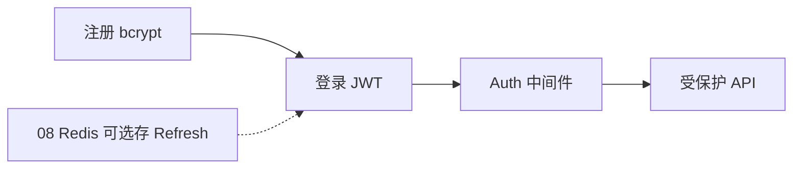
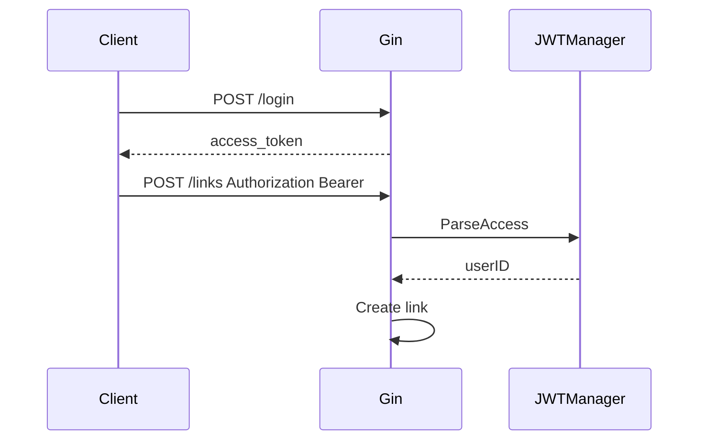

# JWT 认证与用户体系

<!-- 修改说明: 2026-07-08 按 EXPANSION-STANDARD 新建 §0、FAQ≥10、闭卷自测、费曼检验；2026-07-14 补充注册竞态、完整 Claims 校验、Refresh 会话安全与资源归属 -->

> **文件编码**：UTF-8。  
> **定位**：Go 后端「认证授权层」——bcrypt 存密码、JWT 签发/校验、Gin 鉴权中间件、Refresh Token 基础。  
> **前置**：[06 Gin](./06-Gin框架核心与中间件.md)、[07 GORM](./07-GORM与MySQL实战.md)、[08 Redis](./08-Redis与go-redis缓存实战.md)（Refresh 黑名单可选）。

---

## 0. 读前导读（零基础也能跟上）

### 0.1 用一句话弄懂本章

**一句话**：**注册时用 bcrypt 把密码变成不可逆哈希存库**；**登录成功签发 JWT**，后续请求带 `Authorization: Bearer <token>`，中间件验签后把 `userID` 放进 Context。

**生活类比**：

| 概念 | 类比 |
|------|------|
| bcrypt 哈希 | 保险箱——明文密码不进库 |
| JWT Access Token | 游乐园手环——有效期内免重复买票 |
| Refresh Token | 续费券——Access 快过期时用长的换新的 |
| 鉴权中间件 | 门口检票——没票 401 |

**为什么重要**：10～11 章短链「创建链接」必须登录；面试必问 Session vs JWT。

---

### 0.2 你需要提前知道什么

| 水平 | 建议 |
|------|------|
| 学完 06～07 | 跟做注册登录 API |
| 学过 Java Spring Security | 重点 Go 手动验 JWT |
| 有 ACM 背景 | 理解 HS256 签名 = 防篡改 |

---

### 0.3 本章知识地图（学完后应能勾选全部 ☐→☑）

- [ ] 注册：bcrypt hash 存 User.Password
- [ ] 登录：校验密码 + 签发 Access JWT
- [ ] `AuthMiddleware` 解析 Bearer Token
- [ ] 受保护路由 `POST /api/v1/links` 需登录
- [ ] 数据库错误不伪装成“用户名或密码错误”，注册并发由唯一约束裁决
- [ ] 校验 access token 的算法、类型、`iss/aud/sub/exp/nbf/iat/jti`
- [ ] 口述 Refresh Token 轮换、复用检测与会话撤销
- [ ] 所有短链管理 SQL 都带当前 `user_id` 资源归属条件
- [ ] 知道 JWT 不应存密码/银行卡
- [ ] 闭卷自测 ≥ 8/10

---

### 0.4 建议学习时长与节奏

| 阶段 | 时间 | 内容 |
|------|------|------|
| bcrypt + 注册 | 0.5 天 | §2～§3 |
| JWT 签发/校验 | 1 天 | §4～§5 |
| 中间件 | 0.5 天 | §6 |
| Refresh 基础 | 0.5 天 | §7 |
| 自测 | 0.5 天 | FAQ + 闭卷 |

---

### 0.5 学完本章你能做什么

1. `POST /api/v1/auth/register` 后 DB 里是 `$2a$` 开头 hash。
2. `POST /api/v1/auth/login` 返回 `access_token`。
3. 不带 Token 调 `POST /api/v1/links` → 401；带 Token → 200。
4. 3 分钟讲清 JWT 三段结构与 HS256。
5. 用户 A 无法读取、修改或删除用户 B 的短链，即使猜到其自增 ID。

---

### 0.6 依赖安装

```bash
go get golang.org/x/crypto/bcrypt
go get github.com/golang-jwt/jwt/v5
```

| 包 | 用途 |
|----|------|
| bcrypt | 密码哈希 |
| jwt/v5 | 签发与解析 JWT |

---

## 本章与上一章的关系

08 章缓存公开读路径（跳转可匿名）；09 章保护 **写路径**（创建短链、看「我的链接」）。



| 上一章（08） | 本章（09） | 下一章（10） |
|--------------|------------|--------------|
| 匿名读缓存 | 登录态写资源 | 短链项目上半 |

---

## 1. 密码：bcrypt

```go
import "golang.org/x/crypto/bcrypt"

const bcryptCost = 12 // 示例值；生产要在目标机器压测后决定

func HashPassword(plain string) (string, error) {
	bytes, err := bcrypt.GenerateFromPassword([]byte(plain), bcryptCost)
	return string(bytes), err
}

func CheckPassword(hash, plain string) bool {
	return bcrypt.CompareHashAndPassword([]byte(hash), []byte(plain)) == nil
}
```

**为何不用 MD5/SHA256？** 太快，彩虹表可破；bcrypt 自带 salt + 慢哈希。

bcrypt cost 每增加 1，计算成本大约翻倍。不要机械规定“生产必须 12”，而应在目标机器 benchmark，让单次校验达到团队可接受的延迟（例如约 100～300ms），同时评估登录并发和 CPU。升级 cost 时可在用户成功登录后检测旧 hash cost，重新计算并更新。

| 错误做法 | 后果 |
|----------|------|
| 明文存 password | 拖库全泄露 |
| 自己 salt + SHA256 | 不如 bcrypt 省心 |
| cost=4 | 暴力破解容易 |

---

## 2. 注册 Service

```go
func (s *AuthService) Register(ctx context.Context, username, password, email string) (*model.User, error) {
	if len(password) < 8 {
		return nil, fmt.Errorf("password too short: %w", apperr.ErrInvalidArgument)
	}

	// 预检查只用于尽早反馈，不能作为并发正确性保证。
	exist, err := s.userRepo.GetByUsername(ctx, username)
	if err != nil {
		return nil, fmt.Errorf("check username: %w", err)
	}
	if exist != nil {
		return nil, fmt.Errorf("username already exists: %w", apperr.ErrConflict)
	}
	hash, err := HashPassword(password)
	if err != nil {
		return nil, fmt.Errorf("hash password: %w", err)
	}
	u := &model.User{Username: username, Password: hash, Email: email}
	if err := s.userRepo.Create(ctx, u); err != nil {
		// 两个请求可能同时通过预检查；07 章数据库唯一索引仍会让一个 INSERT 冲突。
		if errors.Is(err, apperr.ErrConflict) {
			return nil, fmt.Errorf("username already exists: %w", apperr.ErrConflict)
		}
		return nil, fmt.Errorf("create registered user: %w", err)
	}
	return u, nil
}
```

Handler 返回用户时 **不含 Password**（model 已 `json:"-"`）。

不能写 `exist, _ := ...`：数据库超时会被误当成“不存在”，随后继续做昂贵 bcrypt 和 INSERT。也不能只做“先查后插”；唯一索引才是并发下的最终裁判，Service 负责把冲突稳定映射为 409。

---

## 3. JWT 结构与签发

JWT = `Header.Payload.Signature`（Base64URL）

```go
import (
	"errors"
	"fmt"
	"strconv"
	"time"

	"github.com/golang-jwt/jwt/v5"
	"github.com/google/uuid"
)

type Claims struct {
	UserID    int64  `json:"user_id"`
	Username  string `json:"username"`
	TokenType string `json:"token_type"` // 固定为 access，防 refresh/access 混用
	SessionID string `json:"sid"`        // 关联 Refresh 会话，支持按设备撤销
	jwt.RegisteredClaims
}

type JWTManager struct {
	secret     []byte
	issuer     string
	audience   string
	accessTTL  time.Duration // 常见 15～30min，按风险调整
	refreshTTL time.Duration // 如 7～30d
}

func NewJWTManager(secret, issuer, audience string, accessTTL, refreshTTL time.Duration) (*JWTManager, error) {
	if len([]byte(secret)) < 32 {
		return nil, errors.New("JWT secret must contain at least 32 bytes")
	}
	if issuer == "" || audience == "" || accessTTL <= 0 || refreshTTL <= accessTTL {
		return nil, errors.New("invalid JWT configuration")
	}
	return &JWTManager{
		secret:     []byte(secret),
		issuer:     issuer,
		audience:   audience,
		accessTTL:  accessTTL,
		refreshTTL: refreshTTL,
	}, nil
}

func (m *JWTManager) IssueAccess(user *model.User, sessionID string) (string, error) {
	if user.ID <= 0 || sessionID == "" {
		return "", errors.New("invalid access token subject")
	}
	now := time.Now()
	claims := Claims{
		UserID:    user.ID,
		Username:  user.Username,
		TokenType: "access",
		SessionID: sessionID,
		RegisteredClaims: jwt.RegisteredClaims{
			Issuer:    m.issuer,
			Audience:  jwt.ClaimStrings{m.audience},
			ExpiresAt: jwt.NewNumericDate(now.Add(m.accessTTL)),
			IssuedAt:  jwt.NewNumericDate(now),
			NotBefore: jwt.NewNumericDate(now),
			Subject:   fmt.Sprintf("%d", user.ID),
			ID:        uuid.NewString(), // jti，便于审计/撤销
		},
	}
	token := jwt.NewWithClaims(jwt.SigningMethodHS256, claims)
	return token.SignedString(m.secret)
}
```

**Payload 只放必要且非敏感的身份/会话元数据**；不放 password、手机号明文。`Username` 可能在 token 有效期内变旧，只用于展示/审计，授权始终使用稳定 `UserID`。

---

## 4. 登录与校验

```go
func (s *AuthService) Login(ctx context.Context, username, password string) (access string, err error) {
	u, err := s.userRepo.GetByUsername(ctx, username)
	if err != nil {
		// 依赖故障交给统一错误层映射为 503/500，不能伪装成凭证错误。
		return "", fmt.Errorf("lookup login user: %w", err)
	}
	if u == nil || !CheckPassword(u.Password, password) {
		return "", fmt.Errorf("invalid credentials: %w", apperr.ErrUnauthorized)
	}
	return s.jwt.IssueAccess(u, uuid.NewString()) // §7 接入 Refresh 后复用同一个 sessionID
}

func (m *JWTManager) ParseAccess(tokenStr string) (*Claims, error) {
	token, err := jwt.ParseWithClaims(tokenStr, &Claims{}, func(t *jwt.Token) (interface{}, error) {
		return m.secret, nil
	},
		jwt.WithValidMethods([]string{jwt.SigningMethodHS256.Alg()}),
		jwt.WithIssuer(m.issuer),
		jwt.WithAudience(m.audience),
		jwt.WithExpirationRequired(),
		jwt.WithIssuedAt(),
		jwt.WithLeeway(30*time.Second),
	)
	if err != nil {
		return nil, err
	}
	claims, ok := token.Claims.(*Claims)
	if !ok || !token.Valid {
		return nil, errors.New("invalid token")
	}
	if claims.TokenType != "access" || claims.UserID <= 0 || claims.SessionID == "" || claims.ID == "" {
		return nil, errors.New("invalid access claims")
	}
	if claims.Subject != strconv.FormatInt(claims.UserID, 10) {
		return nil, errors.New("subject does not match user_id")
	}
	if claims.IssuedAt == nil || claims.NotBefore == nil || claims.ExpiresAt == nil {
		return nil, errors.New("missing access token timestamps")
	}
	lifetime := claims.ExpiresAt.Time.Sub(claims.IssuedAt.Time)
	if lifetime <= 0 || lifetime > m.accessTTL+30*time.Second {
		return nil, errors.New("invalid access token lifetime")
	}
	return claims, nil
}
```

### 4.1 JWT 校验不能只验签名

严格校验至少包含：

| 项 | 原因 |
|----|------|
| 固定允许算法 | 防算法混淆，不能信任 token header 自己声明的任意算法 |
| `exp` | 限制凭证生命周期 |
| `nbf` / `iat` | 处理尚未生效和签发时间异常 |
| `iss` | 确认由哪个认证服务签发 |
| `aud` | 确认 token 是发给当前服务的 |
| `sub` | 稳定的用户主体 ID |
| `jti` | 唯一 token ID，用于审计、轮换或撤销 |
| `token_type` | 明确只接受 access，避免把 refresh token 拿来调用业务 API |
| `sid` | 标识登录会话/设备，可做单设备登出和 Refresh family 撤销 |

JWT payload 只是 Base64URL 编码，**不是加密**。任何拿到 token 的人都能读取 claims，所以不要放密码、身份证号、密钥或不必要的隐私数据。

---

## 5. Gin 鉴权中间件

```go
func AuthMiddleware(jwt *JWTManager) gin.HandlerFunc {
	return func(c *gin.Context) {
		auth := c.GetHeader("Authorization")
		parts := strings.Fields(auth)
		if len(parts) != 2 || !strings.EqualFold(parts[0], "Bearer") {
			response.Fail(c, http.StatusUnauthorized, "未登录")
			c.Abort()
			return
		}
		tokenStr := parts[1]
		claims, err := jwt.ParseAccess(tokenStr)
		if err != nil {
			response.Fail(c, http.StatusUnauthorized, "token 无效或过期")
			c.Abort()
			return
		}
		c.Set("userID", claims.UserID)
		c.Set("username", claims.Username)
		c.Set("sessionID", claims.SessionID)
		c.Next()
	}
}
```

### 5.1 路由挂载

```go
auth := v1.Group("/auth")
{
	auth.POST("/register", authH.Register)
	auth.POST("/login", authH.Login)
}
protected := v1.Group("")
protected.Use(middleware.AuthMiddleware(jwtMgr))
{
	protected.POST("/links", linkH.Create)
	protected.GET("/links/mine", linkH.ListMine)
}
```



---

## 6. Handler 取当前用户

```go
func GetUserID(c *gin.Context) (int64, bool) {
	v, ok := c.Get("userID")
	if !ok {
		return 0, false
	}
	id, ok := v.(int64)
	return id, ok
}

func (h *LinkHandler) Create(c *gin.Context) {
	uid, ok := GetUserID(c)
	if !ok {
		response.Fail(c, 401, "未登录")
		return
	}
	// ... 创建时写入 UserID: uid
}
```

返回文案统一还不代表时序完全一致：用户不存在时上例不会执行 bcrypt。更严格的实现可在启动时准备一个同 cost 的 dummy hash，查无用户时也做一次 `CompareHashAndPassword`，降低通过响应时间枚举账号的信号；同时仍需 08 章的 IP + 账号维度登录限流。

### 6.1 短链资源归属：鉴权通过不等于有权操作任意 ID

JWT 只证明“你是谁”。修改、删除、查看详情还必须证明“资源属于你”。`user_id` 永远取 Context，不能相信 body/query 里的用户 ID：

```go
func (r *LinkRepository) GetOwnedByID(ctx context.Context, id, userID int64) (*model.ShortLink, error) {
	var link model.ShortLink
	err := r.db.WithContext(ctx).
		Where("id = ? AND user_id = ?", id, userID).
		First(&link).Error
	if errors.Is(err, gorm.ErrRecordNotFound) {
		return nil, apperr.ErrNotFound
	}
	if err != nil {
		return nil, fmt.Errorf("get owned link: %w", err)
	}
	return &link, nil
}

func (r *LinkRepository) DisableOwned(ctx context.Context, id, userID int64) error {
	res := r.db.WithContext(ctx).Model(&model.ShortLink{}).
		Where("id = ? AND user_id = ?", id, userID).
		Updates(map[string]any{
			"status":  model.LinkStatusDisabled,
			"version": gorm.Expr("version + 1"),
		})
	if res.Error != nil {
		return fmt.Errorf("disable owned link: %w", res.Error)
	}
	if res.RowsAffected != 1 {
		return apperr.ErrNotFound
	}
	return nil
}
```

- 查询、更新、删除都在 **同一条 SQL** 中带 `user_id`，不要先查 ID 再在 Go 里判断后执行第二条无 owner 条件的 UPDATE。
- 对“不存在”和“不属于当前用户”统一返回 404，可减少资源 ID 枚举；管理员接口另走显式权限模型。
- 公开跳转 `GET /:code` 不要求 owner，但必须检查 `status`、`expires_at`、软删除状态；管理接口与公开读路径不要共用一条缺少语义的 Repository 方法。
- `GET /links/mine` 的 userID 也来自 Context，并使用 07 章 keyset 分页。
- 禁用/更新成功后，Service 还必须执行 08 章的 `DEL link:{code}` 与可靠失效重试；鉴权正确不能替代缓存一致性。

---

## 7. Refresh Token 与轮换 ⭐

Access Token 生命周期短，用于访问 API；Refresh Token 生命周期长，只发送给刷新接口。安全重点不是“再签一个更长 JWT”，而是**可撤销、可轮换、泄漏可检测**。

推荐流程：

1. 登录成功生成 Access Token 和高熵随机 Refresh Token。
2. 只把 Refresh Token 的 SHA-256 摘要作为 key/记录存入 Redis 或数据库，保存 userID、sessionID、过期时间。
3. 客户端刷新时，用原 token 计算摘要并原子取出旧记录。
4. 旧 Refresh Token 立即失效，同时签发新 Access + 新 Refresh（rotation）。
5. 如果一个已使用过的 Refresh Token 再次出现，可能已泄漏，应撤销整个 session/token family 并要求重新登录。

生成 opaque token：

```go
func NewRefreshToken() (raw string, digest string, err error) {
	b := make([]byte, 32) // 256 bit 随机数
	if _, err = rand.Read(b); err != nil {
		return "", "", err
	}
	raw = base64.RawURLEncoding.EncodeToString(b)
	sum := sha256.Sum256([]byte(raw))
	digest = hex.EncodeToString(sum[:])
	return raw, digest, nil
}
```

Redis 6.2+ 可用 `GETDEL` 实现“一次读取并删除”，再写入新 token；需要同时操作多条 session 信息时用 Lua 保证原子性。

Refresh Token 也可以使用 JWT，但仍应保存 `jti`/session 状态以支持撤销和轮换；否则它只是一个更长寿、泄漏后危害更大的 bearer token。

### 7.1 Refresh Session 至少保存什么

```text
refresh:active:<digest> -> {
  user_id, session_id, family_id, expires_at, created_at, last_used_at
}
refresh:used:<digest>   -> family_id       # 保留到 family 最长过期时间，用于复用检测
refresh:family:<family_id>:revoked -> 1    # 撤销整条 token family
```

- Redis/数据库只存 SHA-256 digest，不存可直接使用的 raw token；raw token 只在签发响应中出现一次。
- 同一浏览器/设备对应一个 `session_id`，一次轮换前后的 token 共享 `family_id`。
- Session 可记录设备名称、创建/最近使用时间；IP/UA 更适合异常告警，不宜硬绑定，否则移动网络切换会误伤。
- 限制每个用户的活跃 session 数，支持“退出当前设备”和“退出全部设备”。

### 7.2 轮换必须原子，且要识别旧 Token 复用

只做 `GETDEL(old)` 再 `SET(new)` 有安全但可用性边界：进程在两步中间崩溃时，会话会失效（fail-closed）。项目版可用一段 Lua 原子完成：

1. 若 family 已 revoked，拒绝。
2. 若 old active 存在：删除 old active，写 old used tombstone，写 new active，并设置各自 TTL。
3. 若 old active 不存在但 old used 存在：判定复用，写 family revoked，删除/拒绝该 family 的活动 token。
4. 若两者都不存在：统一返回 refresh 无效，不泄露更多状态。

Redis Cluster 下，可让 raw token 带一个不敏感的 family selector，并把相关 key 命名为 `refresh:{familyID}:...`，确保多 key Lua 落在同一 slot；另一种做法是将一个 family 的状态收进同一 Hash。任何刷新失败都不能继续签发 Access Token。`/auth/logout` 撤销当前 session；“退出全部设备”撤销用户所有 family，必要时再配合短期 Access `jti` 黑名单或用户 `token_version`。

若 Refresh 放 HttpOnly Cookie：设置 `Secure`、合适的 `SameSite`、窄 `Path=/api/v1/auth/refresh`，并做 CSRF/Origin 校验；Access Token 不应出现在 URL、日志或埋点中。

---

## 8. 安全清单

| 项 | 做法 |
|----|------|
| JWT Secret | 环境变量，≥32 字节随机 |
| HTTPS | 生产必须，防 Token 窃听 |
| 密码策略 | 长度 + 可选复杂度 |
| 错误信息 | 登录统一「用户名或密码错误」 |
| 退出 | 无状态 JWT 需黑名单或短 Access + Refresh |
| 登录防爆破 | IP + 账号维度限流；失败次数和告警 |
| Key 轮换 | token header 使用 `kid` 选择当前/旧 key，保留过渡期 |
| 日志 | 不记录完整 Authorization、密码、Refresh Token |
| 会话 | Refresh 只存摘要，rotation + reuse detection + 单设备/全设备撤销 |
| 资源授权 | 管理 SQL 必须带当前 user_id；越权资源统一 404 |

### 8.1 Header 与 Cookie 的取舍

- `Authorization: Bearer` 常用于移动端、服务间调用和前端内存态；如果页面发生 XSS，恶意脚本仍可能代替用户发请求。
- HttpOnly Cookie 可阻止 JavaScript 读取 token，但浏览器会自动携带 Cookie，因此必须考虑 SameSite、CSRF Token、Origin/Referer 校验。
- 不要把长期 token 放在可被任意脚本读取的 localStorage 后就宣称“已经安全”；认证安全必须与 XSS、CSRF、CORS、HTTPS 一起设计。

### 8.2 Key 轮换

签发时在 header 放 `kid`，验证方按 `kid` 查允许的 key；发布新 key 后，新 token 用新 key 签发，旧 key 保留到旧 token 最长 TTL 结束。绝不能在验证失败时随意尝试用户提供的 URL 或从不可信位置下载 key。

---

## 9. 常见错误对照表

| 现象 | 原因 | 处理 |
|------|------|------|
| 401 invalid signature | secret 不一致 | 配置统一 |
| 401 token expired | Access 过期 | Refresh 或重新登录 |
| bcrypt 太慢 | cost 超出目标机器能力 | benchmark 后按延迟与登录并发选取 |
| 中间件不生效 | 路由未 Use | protected 组挂载 |
| userID 为 0 | 类型断言失败 | Set 与 Get 类型一致 |
| DB 挂了却返回“密码错误” | 登录把查询 err 与 not found 合并 | 区分依赖错误和无此用户 |
| 并发注册出现 500 | 只做先查后插 | 捕获唯一约束并映射 409 |
| A 用户能改 B 的链接 | UPDATE 只带 link id | 同一 SQL 加 `user_id` 并检查 RowsAffected |
| Refresh 可重复使用 | 未轮换/未留 used tombstone | 原子 rotation + reuse detection |

---

## 10. FAQ

**Q1：JWT 和 Session 选哪个？**  
前后端分离、多实例无粘滞 → **JWT**；传统单体 Session 也行。

**Q2：JWT 能注销吗？**  
无状态本身不能；短 Access + Redis 黑名单/Refresh 撤销。

**Q3：HS256 和 RS256？**  
单体 HS256 够用；多服务 RS256 公钥验签。

**Q4：Token 放哪？**  
SPA：`Authorization` Header；浏览器可 HttpOnly Cookie 防 XSS 读。

**Q5：密码能放进 JWT 吗？**  
**绝对不行**。

**Q6：bcrypt 每次 hash 一样吗？**  
不一样，salt 随机。

**Q7：需要 RBAC 吗？**  
短链项目 user 一种角色够用；Claims 可加 `role`。

**Q8：jwt/v4 和 v5？**  
新项目 **v5**。

**Q9：中间件和 Handler 都验 token？**  
只中间件验；Handler 只取 userID。

**Q10： golang.org/x/crypto 要 vendor 吗？**  
go mod 自动管理。

**Q11：Refresh 存 DB 还是 Redis？**  
Redis 设 TTL 更方便；DB 可审计。

**Q12：和 Spring Security 比？**  
Go 常手写中间件，更显式；原理相同。

**Q13：验签成功是否就代表 Token 一定可用？**
不是，还要固定算法并校验 token type、iss、aud、sub、exp、nbf、iat、jti 与业务会话状态。

**Q14：为什么越权访问常返回 404 而不是 403？**
避免向攻击者确认该资源确实存在；团队也可选 403，但必须统一且 SQL 仍要带 owner 条件。

**Q15：Refresh Token 为什么要保留 used tombstone？**
旧 token 轮换后再次出现是泄漏信号；没有 tombstone 只能看到“不存在”，无法撤销整条 family。

---

## 11. 练习建议

### 基础

1. 完成 register/login API
2. 受保护 `GET /api/v1/users/me` 返回当前用户

### 进阶

3. Access 过期时间 15 分钟，手动测 401
4. Refresh 端点 + Redis 存 jti

### 挑战

5. 登录限流：同 IP 5 次/分（预告 11 章）
6. 对接前端 Axios 拦截器自动带 Bearer
7. 两个 goroutine 同时注册同一用户名，断言一个成功、一个稳定返回 409
8. 用户 A 猜测用户 B 的 link ID，覆盖详情/修改/删除越权集成测试
9. 并发使用同一个 Refresh Token，只允许一个轮换成功，另一个触发 family 撤销

---

## 12. 学完标准

- [ ] bcrypt 注册登录
- [ ] JWT 签发与 Parse
- [ ] AuthMiddleware + 路由组
- [ ] 受保护 API 401/200 正确
- [ ] Claims 完整校验且 access/refresh 不可混用
- [ ] 能口述 Refresh 轮换、复用检测与会话撤销
- [ ] 注册唯一冲突、DB 故障、资源越权均有集成测试
- [ ] 所有短链管理 Repository 方法都带 `user_id`
- [ ] Secret 不进 Git

---

## 13. 闭卷自测

1. bcrypt 和 MD5 存密码有何区别？
2. JWT 三段各是什么？
3. Bearer Token 放在哪个 Header？
4. 中间件 `c.Abort()` 何时调用？
5. Access 和 Refresh 寿命通常谁长？
6. 登录错误为何统一文案？
7. Claims 里应放什么、不放什么？
8. HS256 防的是什么？
9. 无状态 JWT 如何「登出」？
10. Handler 如何拿 userID？

### 参考答案

1. bcrypt 慢哈希+salt，抗彩虹表。
2. Header.Payload.Signature。
3. `Authorization: Bearer <token>`。
4. 未登录或 token 无效时。
5. Refresh 长。
6. 防枚举用户名。
7. 放 user_id；不放密码。
8. 防 payload 篡改。
9. 黑名单/删 Refresh/等过期。
10. `c.Get("userID")` 中间件 Set 的。

---

## 14. 费曼检验

3 分钟：**「用户从注册到创建短链，认证链怎么走？」**

注册 hash → 登录 JWT → 请求带 Bearer → 中间件验签 Set userID → Handler 写 link.user_id。

---

## 15. 章节衔接

| 模块 | 链接 |
|------|------|
| Gin | [06 Gin 框架](./06-Gin框架核心与中间件.md) |
| 用户表 | [07 GORM](./07-GORM与MySQL实战.md) |
| Redis 黑名单 | [08 Redis](./08-Redis与go-redis缓存实战.md) |
| 下一章项目 | [10 短链项目上](./10-短链服务项目实战上.md) |
| 短链设计 | [系统设计 08](../系统设计/08-短链服务设计.md) |

**下一章预告**：09 章 authentication 就绪；10 章 **shortlink-api 工程脚手架 + 用户模块 + Base62 生成短链**——设计对照 [系统设计 08](../系统设计/08-短链服务设计.md)。

---

*下一章：[10-短链服务项目实战上](./10-短链服务项目实战上.md)*
