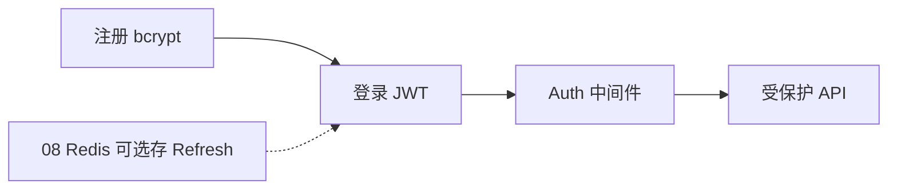
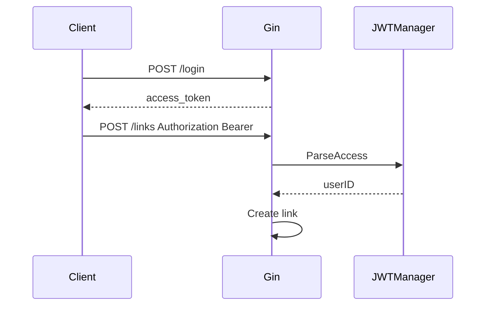

# JWT 认证与用户体系

<!-- 修改说明: 2026-07-08 按 EXPANSION-STANDARD 新建 §0、FAQ≥10、闭卷自测、费曼检验 -->

> **文件编码**：UTF-8。  
> **定位**：Go 后端「认证授权层」——bcrypt 存密码、JWT 签发/校验、Gin 鉴权中间件、Refresh Token 基础。  
> **前置**：[06 Gin](./06-Gin框架核心与中间件.md)、[07 GORM](./07-GORM与MySQL实战.md)、[08 Redis](./08-Redis与go-redis缓存实战.md)（Refresh 黑名单可选）。

---

## 0. 读前导读（零基础也能跟上）

### 0.1 用一句话弄懂本章

**一句话**：**注册时用 bcrypt 把密码变成不可逆哈希存库**；**登录成功签发 JWT**，后续请求带 `Authorization: Bearer <token>`，中间件验签后把 `userID` 放进 Context。

**生活类比**：

| 概念 | 类比 |
|------|------|
| bcrypt 哈希 | 保险箱——明文密码不进库 |
| JWT Access Token | 游乐园手环——有效期内免重复买票 |
| Refresh Token | 续费券——Access 快过期时用长的换新的 |
| 鉴权中间件 | 门口检票——没票 401 |

**为什么重要**：10～11 章短链「创建链接」必须登录；面试必问 Session vs JWT。

---

### 0.2 你需要提前知道什么

| 水平 | 建议 |
|------|------|
| 学完 06～07 | 跟做注册登录 API |
| 学过 Java Spring Security | 重点 Go 手动验 JWT |
| 有 ACM 背景 | 理解 HS256 签名 = 防篡改 |

---

### 0.3 本章知识地图（学完后应能勾选全部 ☐→☑）

- [ ] 注册：bcrypt hash 存 User.Password
- [ ] 登录：校验密码 + 签发 Access JWT
- [ ] `AuthMiddleware` 解析 Bearer Token
- [ ] 受保护路由 `POST /api/v1/links` 需登录
- [ ] 口述 Refresh Token 基本流程
- [ ] 知道 JWT 不应存密码/银行卡
- [ ] 闭卷自测 ≥ 8/10

---

### 0.4 建议学习时长与节奏

| 阶段 | 时间 | 内容 |
|------|------|------|
| bcrypt + 注册 | 0.5 天 | §2～§3 |
| JWT 签发/校验 | 1 天 | §4～§5 |
| 中间件 | 0.5 天 | §6 |
| Refresh 基础 | 0.5 天 | §7 |
| 自测 | 0.5 天 | FAQ + 闭卷 |

---

### 0.5 学完本章你能做什么

1. `POST /api/v1/auth/register` 后 DB 里是 `$2a$` 开头 hash。
2. `POST /api/v1/auth/login` 返回 `access_token`。
3. 不带 Token 调 `POST /api/v1/links` → 401；带 Token → 200。
4. 3 分钟讲清 JWT 三段结构与 HS256。

---

### 0.6 依赖安装

```bash
go get golang.org/x/crypto/bcrypt
go get github.com/golang-jwt/jwt/v5
```

| 包 | 用途 |
|----|------|
| bcrypt | 密码哈希 |
| jwt/v5 | 签发与解析 JWT |

---

## 本章与上一章的关系

08 章缓存公开读路径（跳转可匿名）；09 章保护 **写路径**（创建短链、看「我的链接」）。



| 上一章（08） | 本章（09） | 下一章（10） |
|--------------|------------|--------------|
| 匿名读缓存 | 登录态写资源 | 短链项目上半 |

---

## 1. 密码：bcrypt

```go
import "golang.org/x/crypto/bcrypt"

const bcryptCost = 12 // 生产 10～12；越高越慢越安全

func HashPassword(plain string) (string, error) {
	bytes, err := bcrypt.GenerateFromPassword([]byte(plain), bcryptCost)
	return string(bytes), err
}

func CheckPassword(hash, plain string) bool {
	return bcrypt.CompareHashAndPassword([]byte(hash), []byte(plain)) == nil
}
```

**为何不用 MD5/SHA256？** 太快，彩虹表可破；bcrypt 自带 salt + 慢哈希。

| 错误做法 | 后果 |
|----------|------|
| 明文存 password | 拖库全泄露 |
| 自己 salt + SHA256 | 不如 bcrypt 省心 |
| cost=4 | 暴力破解容易 |

---

## 2. 注册 Service

```go
func (s *AuthService) Register(ctx context.Context, username, password, email string) (*model.User, error) {
	if len(password) < 8 {
		return nil, errors.New("密码至少 8 位")
	}
	exist, _ := s.userRepo.GetByUsername(ctx, username)
	if exist != nil {
		return nil, errors.New("用户名已存在")
	}
	hash, err := HashPassword(password)
	if err != nil {
		return nil, err
	}
	u := &model.User{Username: username, Password: hash, Email: email}
	if err := s.userRepo.Create(ctx, u); err != nil {
		return nil, err
	}
	return u, nil
}
```

Handler 返回用户时 **不含 Password**（model 已 `json:"-"`）。

---

## 3. JWT 结构与签发

JWT = `Header.Payload.Signature`（Base64URL）

```go
import (
	"time"
	"github.com/golang-jwt/jwt/v5"
)

type Claims struct {
	UserID   int64  `json:"user_id"`
	Username string `json:"username"`
	jwt.RegisteredClaims
}

type JWTManager struct {
	secret     []byte
	accessTTL  time.Duration // 如 2h
	refreshTTL time.Duration // 如 7d
}

func (m *JWTManager) IssueAccess(user *model.User) (string, error) {
	claims := Claims{
		UserID:   user.ID,
		Username: user.Username,
		RegisteredClaims: jwt.RegisteredClaims{
			ExpiresAt: jwt.NewNumericDate(time.Now().Add(m.accessTTL)),
			IssuedAt:  jwt.NewNumericDate(time.Now()),
			Subject:   fmt.Sprintf("%d", user.ID),
		},
	}
	token := jwt.NewWithClaims(jwt.SigningMethodHS256, claims)
	return token.SignedString(m.secret)
}
```

**Payload 只放非敏感 id/name**；不放 password、手机号明文。

---

## 4. 登录与校验

```go
func (s *AuthService) Login(ctx context.Context, username, password string) (access string, err error) {
	u, err := s.userRepo.GetByUsername(ctx, username)
	if err != nil || u == nil {
		return "", errors.New("用户名或密码错误") // 不透露哪项错
	}
	if !CheckPassword(u.Password, password) {
		return "", errors.New("用户名或密码错误")
	}
	return s.jwt.IssueAccess(u)
}

func (m *JWTManager) ParseAccess(tokenStr string) (*Claims, error) {
	token, err := jwt.ParseWithClaims(tokenStr, &Claims{}, func(t *jwt.Token) (interface{}, error) {
		if t.Method != jwt.SigningMethodHS256 {
			return nil, fmt.Errorf("unexpected method")
		}
		return m.secret, nil
	})
	if err != nil {
		return nil, err
	}
	claims, ok := token.Claims.(*Claims)
	if !ok || !token.Valid {
		return nil, errors.New("invalid token")
	}
	return claims, nil
}
```

---

## 5. Gin 鉴权中间件

```go
func AuthMiddleware(jwt *JWTManager) gin.HandlerFunc {
	return func(c *gin.Context) {
		auth := c.GetHeader("Authorization")
		if auth == "" || !strings.HasPrefix(auth, "Bearer ") {
			response.Fail(c, http.StatusUnauthorized, "未登录")
			c.Abort()
			return
		}
		tokenStr := strings.TrimPrefix(auth, "Bearer ")
		claims, err := jwt.ParseAccess(tokenStr)
		if err != nil {
			response.Fail(c, http.StatusUnauthorized, "token 无效或过期")
			c.Abort()
			return
		}
		c.Set("userID", claims.UserID)
		c.Set("username", claims.Username)
		c.Next()
	}
}
```

### 5.1 路由挂载

```go
auth := v1.Group("/auth")
{
	auth.POST("/register", authH.Register)
	auth.POST("/login", authH.Login)
}
protected := v1.Group("")
protected.Use(middleware.AuthMiddleware(jwtMgr))
{
	protected.POST("/links", linkH.Create)
	protected.GET("/links/mine", linkH.ListMine)
}
```



---

## 6. Handler 取当前用户

```go
func GetUserID(c *gin.Context) (int64, bool) {
	v, ok := c.Get("userID")
	if !ok {
		return 0, false
	}
	id, ok := v.(int64)
	return id, ok
}

func (h *LinkHandler) Create(c *gin.Context) {
	uid, ok := GetUserID(c)
	if !ok {
		response.Fail(c, 401, "未登录")
		return
	}
	// ... 创建时写入 UserID: uid
}
```

---

## 7. Refresh Token 基础（口述即可）

Access 短（2h）、Refresh 长（7d）。登录返回双 token；Access 过期用 Refresh 换新；登出删 Redis 中 `refresh:{jti}`。实习实现 Access + 中间件即可，详见 [08 Redis](./08-Redis与go-redis缓存实战.md)。

---

## 8. 安全清单

| 项 | 做法 |
|----|------|
| JWT Secret | 环境变量，≥32 字节随机 |
| HTTPS | 生产必须，防 Token 窃听 |
| 密码策略 | 长度 + 可选复杂度 |
| 错误信息 | 登录统一「用户名或密码错误」 |
| 退出 | 无状态 JWT 需黑名单或短 Access + Refresh |

---

## 9. 常见错误对照表

| 现象 | 原因 | 处理 |
|------|------|------|
| 401 invalid signature | secret 不一致 | 配置统一 |
| 401 token expired | Access 过期 | Refresh 或重新登录 |
| bcrypt 太慢 | cost 过高 | 10～12 平衡 |
| 中间件不生效 | 路由未 Use | protected 组挂载 |
| userID 为 0 | 类型断言失败 | Set 与 Get 类型一致 |

---

## 10. FAQ

**Q1：JWT 和 Session 选哪个？**  
前后端分离、多实例无粘滞 → **JWT**；传统单体 Session 也行。

**Q2：JWT 能注销吗？**  
无状态本身不能；短 Access + Redis 黑名单/Refresh 撤销。

**Q3：HS256 和 RS256？**  
单体 HS256 够用；多服务 RS256 公钥验签。

**Q4：Token 放哪？**  
SPA：`Authorization` Header；浏览器可 HttpOnly Cookie 防 XSS 读。

**Q5：密码能放进 JWT 吗？**  
**绝对不行**。

**Q6：bcrypt 每次 hash 一样吗？**  
不一样，salt 随机。

**Q7：需要 RBAC 吗？**  
短链项目 user 一种角色够用；Claims 可加 `role`。

**Q8：jwt/v4 和 v5？**  
新项目 **v5**。

**Q9：中间件和 Handler 都验 token？**  
只中间件验；Handler 只取 userID。

**Q10： golang.org/x/crypto 要 vendor 吗？**  
go mod 自动管理。

**Q11：Refresh 存 DB 还是 Redis？**  
Redis 设 TTL 更方便；DB 可审计。

**Q12：和 Spring Security 比？**  
Go 常手写中间件，更显式；原理相同。

---

## 11. 练习建议

### 基础

1. 完成 register/login API
2. 受保护 `GET /api/v1/users/me` 返回当前用户

### 进阶

3. Access 过期时间 15 分钟，手动测 401
4. Refresh 端点 + Redis 存 jti

### 挑战

5. 登录限流：同 IP 5 次/分（预告 11 章）
6. 对接前端 Axios 拦截器自动带 Bearer

---

## 12. 学完标准

- [ ] bcrypt 注册登录
- [ ] JWT 签发与 Parse
- [ ] AuthMiddleware + 路由组
- [ ] 受保护 API 401/200 正确
- [ ] 能口述 Refresh 流程
- [ ] Secret 不进 Git

---

## 13. 闭卷自测

1. bcrypt 和 MD5 存密码有何区别？
2. JWT 三段各是什么？
3. Bearer Token 放在哪个 Header？
4. 中间件 `c.Abort()` 何时调用？
5. Access 和 Refresh 寿命通常谁长？
6. 登录错误为何统一文案？
7. Claims 里应放什么、不放什么？
8. HS256 防的是什么？
9. 无状态 JWT 如何「登出」？
10. Handler 如何拿 userID？

### 参考答案

1. bcrypt 慢哈希+salt，抗彩虹表。
2. Header.Payload.Signature。
3. `Authorization: Bearer <token>`。
4. 未登录或 token 无效时。
5. Refresh 长。
6. 防枚举用户名。
7. 放 user_id；不放密码。
8. 防 payload 篡改。
9. 黑名单/删 Refresh/等过期。
10. `c.Get("userID")` 中间件 Set 的。

---

## 14. 费曼检验

3 分钟：**「用户从注册到创建短链，认证链怎么走？」**

注册 hash → 登录 JWT → 请求带 Bearer → 中间件验签 Set userID → Handler 写 link.user_id。

---

## 15. 章节衔接

| 模块 | 链接 |
|------|------|
| Gin | [06 Gin 框架](./06-Gin框架核心与中间件.md) |
| 用户表 | [07 GORM](./07-GORM与MySQL实战.md) |
| Redis 黑名单 | [08 Redis](./08-Redis与go-redis缓存实战.md) |
| 下一章项目 | [10 短链项目上](./10-短链服务项目实战上.md) |
| 短链设计 | [系统设计 08](../系统设计/08-短链服务设计.md) |

**下一章预告**：09 章 authentication 就绪；10 章 **shortlink-api 工程脚手架 + 用户模块 + Base62 生成短链**——设计对照 [系统设计 08](../系统设计/08-短链服务设计.md)。

---

*下一章：[10-短链服务项目实战上](./10-短链服务项目实战上.md)*
