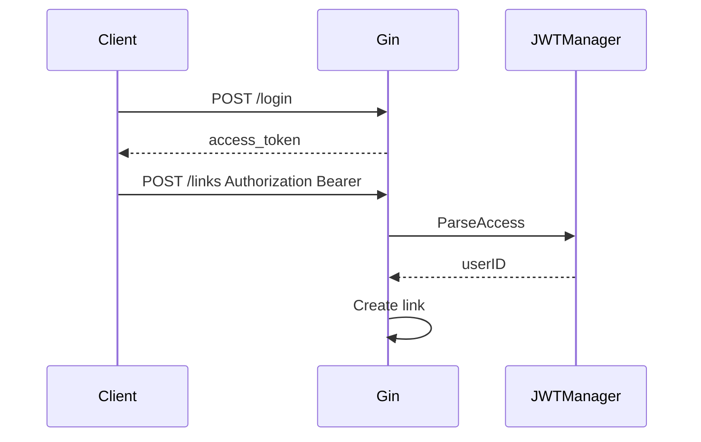
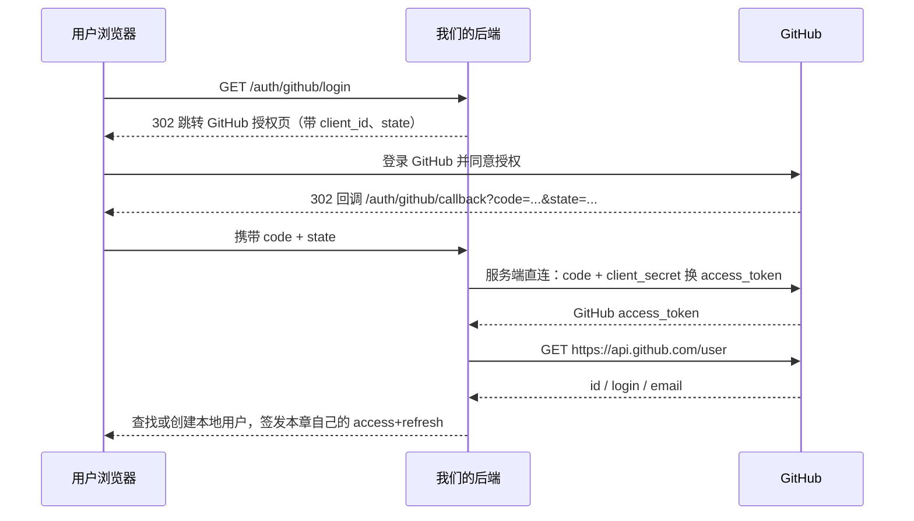

# JWT 认证与用户体系

<!-- 修改说明: 2026-07-08 按 EXPANSION-STANDARD 新建 §0、FAQ≥10、闭卷自测、费曼检验；2026-07-14 补充注册竞态、完整 Claims 校验、Refresh 会话安全与资源归属；2026-07-26 按审查报告修复：§0.6 补 uuid 依赖、§1 补 bcrypt 72 字节上限与 argon2id 对比、§2 显式声明 GetByUsername repo 契约（对齐 07 章 apperr.ErrNotFound 风格）并改按字符数校验密码、登录时序攻击段落从 §6 移回 §4 并补 dummy hash 示例、新增 §4.2 Handler 层 DTO 与参数校验、§5 中间件参数改名 jwtMgr 并补 WWW-Authenticate 与 401/403 语义、新增 §5.2 httptest 中间件测试、§6 改用统一错误出口、§7 补 NewRefreshToken import 与 crypto/rand 警告、新增 §7.3 Refresh 最小可运行实现（Login 双 token + Lua 轮换 + /auth/refresh + /auth/logout）、新增 §7.4 token_version 撤销全部会话、新增 §8.3 配置与密钥加载、§8.4 RS256 与 JWKS、§8.5 OAuth2 第三方登录概念、§3 去掉多余 []byte 转换、FAQ Q1 补集中式 Session 说明、FAQ Q3 与安全清单表格链接 §8.3/§8.4；同日复核：repo 契约由 (nil,nil) 改为与 07 章一致的 apperr.ErrNotFound 分支（§2/§4/§7.3/§7.4 同步）、§7.3 补 errors import 与 PS 5.1 4xx 异常说明；2026-07-27 去水化精简：删除 §0.2～0.5（知识地图/学习时长/学完你能做什么）、「本章与上一章的关系」导航块、§12 学完标准、§13 闭卷自测、§14 费曼检验、§15 章节衔接；FAQ 拆解——6 条有实质内容的条目并入正文（Q1 JWT vs 集中式 Session→§3、Q6 salt 随机与 $2a$ 前缀→§1、Q7 RBAC role→§6.1、Q8 v4/v5→§0.2、Q9 验签只在中间件→§6、Q11 Refresh 存 Redis/DB 取舍→§7.1），其余正文已覆盖或凑数的删除；§0.6 依赖安装改编号为 §0.2，原 §11 练习建议改为 §10；修正 §5.2 指向学完标准、§8.4 指向 FAQ Q3 的引用；正文讲解与全部代码原样保留；同日复核补回：§3 补 HS256 签名防篡改（完整性 vs 机密性）说明——原闭卷自测 Q8 与 §0.2 表格独有要点 -->

> **文件编码**：UTF-8。  
> **定位**：Go 后端「认证授权层」——bcrypt 存密码、JWT 签发/校验、Gin 鉴权中间件、Refresh Token 基础。  
> **前置**：[06 Gin](./06-Gin框架核心与中间件.md)、[07 GORM](./07-GORM与MySQL实战.md)、[08 Redis](./08-Redis与go-redis缓存实战.md)（Refresh 黑名单可选）。

---

## 0. 读前导读（零基础也能跟上）

### 0.1 用一句话弄懂本章

**一句话**：**注册时用 bcrypt 把密码变成不可逆哈希存库**；**登录成功签发 JWT**，后续请求带 `Authorization: Bearer <token>`，中间件验签后把 `userID` 放进 Context。

**生活类比**：

| 概念 | 类比 |
|------|------|
| bcrypt 哈希 | 保险箱——明文密码不进库 |
| JWT Access Token | 游乐园手环——有效期内免重复买票 |
| Refresh Token | 续费券——Access 快过期时用长的换新的 |
| 鉴权中间件 | 门口检票——没票 401 |

**为什么重要**：10～11 章短链「创建链接」必须登录；面试必问 Session vs JWT。

---

### 0.2 依赖安装

```bash
go get golang.org/x/crypto/bcrypt
go get github.com/golang-jwt/jwt/v5
go get github.com/google/uuid
```

| 包 | 用途 |
|----|------|
| bcrypt | 密码哈希 |
| jwt/v5 | 签发与解析 JWT（新项目一律选 v5；v4 只维护、不再加新特性） |
| uuid | 生成 `jti`（token 唯一 ID）与 `sessionID`（§3、§4） |

§7 的 Refresh 会话存储还会用到 08 章已安装的 `github.com/redis/go-redis/v9`，无需重复安装。

---

## 1. 密码：bcrypt

```go
import "golang.org/x/crypto/bcrypt"

const bcryptCost = 12 // 示例值；生产要在目标机器压测后决定

func HashPassword(plain string) (string, error) {
	bytes, err := bcrypt.GenerateFromPassword([]byte(plain), bcryptCost)
	return string(bytes), err
}

func CheckPassword(hash, plain string) bool {
	return bcrypt.CompareHashAndPassword([]byte(hash), []byte(plain)) == nil
}
```

**为何不用 MD5/SHA256？** 太快，彩虹表可破；bcrypt 自带 salt + 慢哈希。

**同一个密码每次 hash 结果都不一样**：salt 随机生成并直接编码进 hash 串，存进库的形如 `$2a$12$...`——前缀里带着算法版本与 cost，salt 也在其中。所以校验不能「再 hash 一次比字符串」，必须用 `CompareHashAndPassword`：它从存储的 hash 中解出 salt 和 cost，对输入做同样计算后再比较。

bcrypt cost 每增加 1，计算成本大约翻倍。不要机械规定“生产必须 12”，而应在目标机器 benchmark，让单次校验达到团队可接受的延迟（例如约 100～300ms），同时评估登录并发和 CPU。升级 cost 时可在用户成功登录后检测旧 hash cost，重新计算并更新。

**bcrypt 的 72 字节上限（常见面试/实战坑）**：bcrypt 算法只处理输入的前 72 字节。当前版本的 `golang.org/x/crypto/bcrypt` 对超过 72 字节的输入不会静默截断，而是让 `GenerateFromPassword` 直接返回 `bcrypt.ErrPasswordTooLong`。这带来两个工程要求：

1. **注册/改密码时必须做上限校验**（按字节，见 §2），否则这个错误会沿 `hash password: %w` 分支被映射成 500 内部错误——而它本质是 400 参数错误；
2. 注意 `len(密码字符串)` 是**字节数**：一个汉字占 3 字节，24 个汉字就到 72 字节了，长 passphrase 中文用户很容易触碰上限。

**bcrypt vs argon2id / scrypt（面试常问）**：bcrypt 只消耗 CPU 时间；argon2id（`golang.org/x/crypto/argon2` 的 `IDKey`）和 scrypt 还额外消耗**内存**，能显著抬高 GPU/ASIC 大规模并行破解的成本。OWASP Password Storage Cheat Sheet 当前的首选是 **argon2id**（推荐参数量级：内存 ≥19MiB、迭代 2 次、并行度 1），bcrypt（cost ≥10）是可接受的成熟备选。本章教学用 bcrypt：API 简单、自带 salt 与 cost 编码在 hash 里、生态验证充分；换 argon2id 时注意它不像 bcrypt 那样把参数编进固定格式，需自行按 [PHC 字符串格式](https://github.com/P-H-C/phc-string-format)存储 salt 和参数。无论哪种，**都不要自己拼 salt+SHA256**。

| 错误做法 | 后果 |
|----------|------|
| 明文存 password | 拖库全泄露 |
| 自己 salt + SHA256 | 不如 bcrypt 省心 |
| cost=4 | 暴力破解容易 |
| 不校验 72 字节上限 | 超长密码注册直接 500（ErrPasswordTooLong） |

---

## 2. 注册 Service

**先声明一条 repo 契约**（本章代码能成立的前提）：`GetByUsername` 沿用 **07 章 §4.1 已经写好的实现**——记录不存在时返回包了哨兵错误 `apperr.ErrNotFound` 的 error（repo 内部把 `gorm.ErrRecordNotFound` 翻译成业务语义），超时、连接失败等真实故障则原样包装上抛：

```go
// internal/repository/user_repo.go —— 07 章 §4.1 已有的实现，抄在这里当契约备忘
func (r *UserRepository) GetByUsername(ctx context.Context, name string) (*model.User, error) {
	var u model.User
	err := r.db.WithContext(ctx).Where("username = ?", name).First(&u).Error
	if errors.Is(err, gorm.ErrRecordNotFound) {
		return nil, fmt.Errorf("user username=%q: %w", name, apperr.ErrNotFound)
	}
	if err != nil {
		return nil, fmt.Errorf("get user username=%q: %w", name, err)
	}
	return &u, nil
}
```

于是 Service 层能用 `errors.Is(err, apperr.ErrNotFound)` 把「没有这个用户」（正常业务结果）和「数据库故障」（必须上抛的错误）清晰分开。有的教程会让 repo 在未找到时吞掉错误返回 `(nil, nil)`、调用方判 `u == nil`——07 章 §4.1 解释过为什么不这么做：`(nil, nil)` 要求每个调用方都记得判空，忘一次就是 nil 指针解引用 panic。**无论选哪种约定，都必须全项目统一并写清楚**。最糟的是不声明契约、放任 `gorm.ErrRecordNotFound` 一路裸奔到 Service：每一次正常注册都会进入 `check username` 错误分支变成 500，登录会把「无此用户」当成依赖故障而不是 401。

```go
import (
	"context"
	"errors"
	"fmt"
	"unicode/utf8"

	"github.com/you/shortlink-api/internal/model"
	"github.com/you/shortlink-api/internal/pkg/apperr"
)

func (s *AuthService) Register(ctx context.Context, username, password, email string) (*model.User, error) {
	// 按「字符数」而不是字节数校验下限：len("你好吗") == 9（字节），
	// 用 len 会让 3 个汉字通过「至少 8 位」。
	if utf8.RuneCountInString(password) < 8 {
		return nil, fmt.Errorf("password too short: %w", apperr.ErrInvalidArgument)
	}
	// 上限按「字节数」校验：bcrypt 只处理前 72 字节，超长输入
	// GenerateFromPassword 会返回 ErrPasswordTooLong（§1）。
	// 必须在这里拦下映射为 400，否则它会走 hash 错误分支变成 500。
	if len(password) > 72 {
		return nil, fmt.Errorf("password too long (max 72 bytes): %w", apperr.ErrInvalidArgument)
	}

	// 预检查只用于尽早反馈，不能作为并发正确性保证。
	// repo 契约（见上）：查到返回 (user, nil)；未找到返回 apperr.ErrNotFound；其余是真实故障。
	_, err := s.userRepo.GetByUsername(ctx, username)
	switch {
	case err == nil: // 查到了 → 用户名已被占用
		return nil, fmt.Errorf("username already exists: %w", apperr.ErrConflict)
	case errors.Is(err, apperr.ErrNotFound):
		// 用户名可用，继续注册
	default: // 超时/连接失败等依赖故障，绝不能当成「不存在」
		return nil, fmt.Errorf("check username: %w", err)
	}
	hash, err := HashPassword(password)
	if err != nil {
		return nil, fmt.Errorf("hash password: %w", err)
	}
	u := &model.User{Username: username, Password: hash, Email: email}
	if err := s.userRepo.Create(ctx, u); err != nil {
		// 两个请求可能同时通过预检查；07 章数据库唯一索引仍会让一个 INSERT 冲突。
		if errors.Is(err, apperr.ErrConflict) {
			return nil, fmt.Errorf("username already exists: %w", apperr.ErrConflict)
		}
		return nil, fmt.Errorf("create registered user: %w", err)
	}
	return u, nil
}
```

Handler 返回用户时 **不含 Password**（model 已 `json:"-"`）。

不能把预检查的 err 一律当成“不存在”（比如 `_` 丢掉错误，或漏写 `default` 分支）：数据库超时会被误当成“不存在”，随后继续做昂贵 bcrypt 和 INSERT。也不能只做“先查后插”；唯一索引才是并发下的最终裁判，Service 负责把冲突稳定映射为 409。

---

## 3. JWT 结构与签发

JWT = `Header.Payload.Signature`（Base64URL）。Signature 是用服务端密钥对前两段算出的 HMAC（HS256）：payload 改动任何一个字节，验签都会失败——签名提供的是**防篡改**（完整性），而不是加密（payload 任何人可读，见 §4.1）。

**先想清楚选型：JWT 还是 Session？** 前后端分离、多实例部署常被当成「必须 JWT」的理由，但「多实例」并不是只有 JWT 一条路——把 Session 集中存到 Redis 同样支持多实例、无粘滞，且天然可撤销，很多大厂实际用的就是「Redis 集中式 Session / opaque token」方案。JWT 的核心收益是**验签无需查存储、便于跨服务传递身份**；代价是**撤销困难**——所以本章后面才需要 Refresh 轮换（§7）与黑名单/token_version（§7.4）补偿。面试答「多实例只能 JWT」会被追问。

```go
import (
	"errors"
	"fmt"
	"strconv"
	"time"

	"github.com/golang-jwt/jwt/v5"
	"github.com/google/uuid"
)

type Claims struct {
	UserID    int64  `json:"user_id"`
	Username  string `json:"username"`
	TokenType string `json:"token_type"` // 固定为 access，防 refresh/access 混用
	SessionID string `json:"sid"`        // 关联 Refresh 会话，支持按设备撤销
	jwt.RegisteredClaims
}

type JWTManager struct {
	secret     []byte
	issuer     string
	audience   string
	accessTTL  time.Duration // 常见 15～30min，按风险调整
	refreshTTL time.Duration // 如 7～30d
}

func NewJWTManager(secret, issuer, audience string, accessTTL, refreshTTL time.Duration) (*JWTManager, error) {
	// len(string) 本身就是 UTF-8 字节数，无需 []byte(secret) 再转换一次（那只会多一次拷贝）
	if len(secret) < 32 {
		return nil, errors.New("JWT secret must contain at least 32 bytes")
	}
	if issuer == "" || audience == "" || accessTTL <= 0 || refreshTTL <= accessTTL {
		return nil, errors.New("invalid JWT configuration")
	}
	return &JWTManager{
		secret:     []byte(secret),
		issuer:     issuer,
		audience:   audience,
		accessTTL:  accessTTL,
		refreshTTL: refreshTTL,
	}, nil
}

func (m *JWTManager) IssueAccess(user *model.User, sessionID string) (string, error) {
	if user.ID <= 0 || sessionID == "" {
		return "", errors.New("invalid access token subject")
	}
	now := time.Now()
	claims := Claims{
		UserID:    user.ID,
		Username:  user.Username,
		TokenType: "access",
		SessionID: sessionID,
		RegisteredClaims: jwt.RegisteredClaims{
			Issuer:    m.issuer,
			Audience:  jwt.ClaimStrings{m.audience},
			ExpiresAt: jwt.NewNumericDate(now.Add(m.accessTTL)),
			IssuedAt:  jwt.NewNumericDate(now),
			NotBefore: jwt.NewNumericDate(now),
			Subject:   fmt.Sprintf("%d", user.ID),
			ID:        uuid.NewString(), // jti，便于审计/撤销
		},
	}
	token := jwt.NewWithClaims(jwt.SigningMethodHS256, claims)
	return token.SignedString(m.secret)
}
```

**Payload 只放必要且非敏感的身份/会话元数据**；不放 password、手机号明文。`Username` 可能在 token 有效期内变旧，只用于展示/审计，授权始终使用稳定 `UserID`。

---

## 4. 登录与校验

下面的 `errors.Is(err, apperr.ErrNotFound)` 分支依赖 §2 声明的 repo 契约：`GetByUsername` 未找到时返回包了 `apperr.ErrNotFound` 的错误。

```go
func (s *AuthService) Login(ctx context.Context, username, password string) (access string, err error) {
	u, err := s.userRepo.GetByUsername(ctx, username)
	if err != nil && !errors.Is(err, apperr.ErrNotFound) {
		// 依赖故障交给统一错误层映射为 503/500，不能伪装成凭证错误。
		return "", fmt.Errorf("lookup login user: %w", err)
	}
	// 「无此用户」与「密码错误」合并成同一句文案；短路求值保证 u 为 nil 时不会解引用
	if errors.Is(err, apperr.ErrNotFound) || !CheckPassword(u.Password, password) {
		return "", fmt.Errorf("invalid credentials: %w", apperr.ErrUnauthorized)
	}
	return s.jwt.IssueAccess(u, uuid.NewString()) // §7 接入 Refresh 后复用同一个 sessionID
}

func (m *JWTManager) ParseAccess(tokenStr string) (*Claims, error) {
	token, err := jwt.ParseWithClaims(tokenStr, &Claims{}, func(t *jwt.Token) (interface{}, error) {
		return m.secret, nil
	},
		jwt.WithValidMethods([]string{jwt.SigningMethodHS256.Alg()}),
		jwt.WithIssuer(m.issuer),
		jwt.WithAudience(m.audience),
		jwt.WithExpirationRequired(),
		jwt.WithIssuedAt(),
		jwt.WithLeeway(30*time.Second),
	)
	if err != nil {
		return nil, err
	}
	claims, ok := token.Claims.(*Claims)
	if !ok || !token.Valid {
		return nil, errors.New("invalid token")
	}
	if claims.TokenType != "access" || claims.UserID <= 0 || claims.SessionID == "" || claims.ID == "" {
		return nil, errors.New("invalid access claims")
	}
	if claims.Subject != strconv.FormatInt(claims.UserID, 10) {
		return nil, errors.New("subject does not match user_id")
	}
	if claims.IssuedAt == nil || claims.NotBefore == nil || claims.ExpiresAt == nil {
		return nil, errors.New("missing access token timestamps")
	}
	lifetime := claims.ExpiresAt.Time.Sub(claims.IssuedAt.Time)
	if lifetime <= 0 || lifetime > m.accessTTL+30*time.Second {
		return nil, errors.New("invalid access token lifetime")
	}
	return claims, nil
}
```

**统一文案之外，还有时序攻击**：`invalid credentials` 把「无此用户」和「密码错误」合并成一句话，防的是从**响应内容**枚举账号。但返回文案统一还不代表时序完全一致：用户不存在时上面的 `Login` 走短路求值，不会执行 bcrypt，响应会明显更快（bcrypt 单次约 100～300ms）。更严格的实现可在启动时准备一个同 cost 的 dummy hash，查无用户时也做一次 `CompareHashAndPassword`，拉平两条路径的耗时：

```go
// 进程启动时准备一次即可；失败直接 panic——这是初始化错误，应 fail-fast。
var dummyHash = func() string {
	h, err := HashPassword("timing-equalizer-not-a-real-password")
	if err != nil {
		panic(fmt.Sprintf("init dummy hash: %v", err))
	}
	return h
}()

// Login 中把合并的凭证判断拆成两个分支：
if errors.Is(err, apperr.ErrNotFound) {
	// 查无用户也烧一次同 cost 的 bcrypt，降低通过响应时间枚举账号的信号
	_ = CheckPassword(dummyHash, password)
	return "", fmt.Errorf("invalid credentials: %w", apperr.ErrUnauthorized)
}
if !CheckPassword(u.Password, password) {
	return "", fmt.Errorf("invalid credentials: %w", apperr.ErrUnauthorized)
}
```

时序均衡只是降噪，不是全部：仍需 08 章的 IP + 账号维度登录限流来限制枚举与爆破的尝试次数。

### 4.1 JWT 校验不能只验签名

严格校验至少包含：

| 项 | 原因 |
|----|------|
| 固定允许算法 | 防算法混淆，不能信任 token header 自己声明的任意算法 |
| `exp` | 限制凭证生命周期 |
| `nbf` / `iat` | 处理尚未生效和签发时间异常 |
| `iss` | 确认由哪个认证服务签发 |
| `aud` | 确认 token 是发给当前服务的 |
| `sub` | 稳定的用户主体 ID |
| `jti` | 唯一 token ID，用于审计、轮换或撤销 |
| `token_type` | 明确只接受 access，避免把 refresh token 拿来调用业务 API |
| `sid` | 标识登录会话/设备，可做单设备登出和 Refresh family 撤销 |

JWT payload 只是 Base64URL 编码，**不是加密**。任何拿到 token 的人都能读取 claims，所以不要放密码、身份证号、密钥或不必要的隐私数据。

### 4.2 Handler 层：DTO、参数绑定与统一响应

从路由到 Service 的链条还差 Handler 这一环。请求体先绑定到 **DTO**（Data Transfer Object，只描述 API 输入输出的结构体，与 GORM model 分离），用 06 章讲过的 `ShouldBindJSON` + validator tag 做第一道格式校验，错误统一走 06 章 §7.1 的 `response.WriteError`：

```go
// internal/handler/auth.go
package handler

import (
	"fmt"

	"github.com/gin-gonic/gin"

	"github.com/you/shortlink-api/internal/pkg/apperr"
	"github.com/you/shortlink-api/internal/pkg/response"
	"github.com/you/shortlink-api/internal/service"
)

// RegisterReq / LoginReq 是 DTO：只承载 API 输入，绝不复用 GORM model 接收请求体
type RegisterReq struct {
	Username string `json:"username" binding:"required,min=3,max=32,alphanum"`
	Password string `json:"password" binding:"required,min=8,max=72"`
	Email    string `json:"email"    binding:"required,email"`
}

type LoginReq struct {
	Username string `json:"username" binding:"required"`
	Password string `json:"password" binding:"required"`
}

type AuthHandler struct {
	svc *service.AuthService
}

func NewAuthHandler(svc *service.AuthService) *AuthHandler {
	return &AuthHandler{svc: svc}
}

func (h *AuthHandler) Register(c *gin.Context) {
	var req RegisterReq
	if err := c.ShouldBindJSON(&req); err != nil {
		// %v 保留原始原因进日志，%w 包 ErrInvalidArgument 让统一出口映射 400
		response.WriteError(c, fmt.Errorf("bind register: %v: %w", err, apperr.ErrInvalidArgument))
		return
	}
	u, err := h.svc.Register(c.Request.Context(), req.Username, req.Password, req.Email)
	if err != nil {
		// Service 已包好 apperr 哨兵：ErrConflict→409、ErrInvalidArgument→400、其余→500
		response.WriteError(c, err)
		return
	}
	response.OK(c, gin.H{"id": u.ID, "username": u.Username}) // 不回传 Password（model 已 json:"-"）
}

func (h *AuthHandler) Login(c *gin.Context) {
	var req LoginReq
	if err := c.ShouldBindJSON(&req); err != nil {
		response.WriteError(c, fmt.Errorf("bind login: %v: %w", err, apperr.ErrInvalidArgument))
		return
	}
	access, err := h.svc.Login(c.Request.Context(), req.Username, req.Password)
	if err != nil {
		response.WriteError(c, err) // ErrUnauthorized→401「未登录或凭证无效」
		return
	}
	response.OK(c, gin.H{"access_token": access, "token_type": "Bearer"})
}
```

三个容易忽略的点：

- **binding 的 `min`/`max` 对字符串按「字符数（rune）」计**，而 bcrypt 的 72 上限是「字节」。`max=72` 挡不住 30 个汉字（90 字节），所以 §2 Service 里的 `len(password) > 72` 字节校验必须保留——Handler 校验是用户体验，Service 校验才是兜底防线。
- `LoginReq` 故意**不**加 `min=8`：登录时对格式不合法的密码也应返回统一的 401 文案，加了 min 反而把「密码位数不够」这个信号泄露给枚举者。
- 绑定失败的原始 `err` 只进日志（`%v` 部分），客户端只看到统一的「参数错误」——validator 的英文报错会暴露字段与规则细节。

**PowerShell 里手动验证**（Windows PowerShell 5.1；`curl` 是 `Invoke-WebRequest` 的别名，要用真 curl 需写 `curl.exe` 并用 `--%` 停止 PowerShell 解析）：

```powershell
curl.exe --% -s -X POST http://localhost:8080/api/v1/auth/register -H "Content-Type: application/json" -d "{\"username\":\"alice\",\"password\":\"S3cret-pass\",\"email\":\"alice@example.com\"}"
curl.exe --% -s -X POST http://localhost:8080/api/v1/auth/login -H "Content-Type: application/json" -d "{\"username\":\"alice\",\"password\":\"S3cret-pass\"}"
```

等价的 `Invoke-RestMethod` 写法：

```powershell
Invoke-RestMethod -Method Post -Uri http://localhost:8080/api/v1/auth/login `
  -ContentType "application/json" `
  -Body '{"username":"alice","password":"S3cret-pass"}'
```

---

## 5. Gin 鉴权中间件

```go
// internal/middleware/auth.go
package middleware

import (
	"fmt"
	"strings"

	"github.com/gin-gonic/gin"

	"github.com/you/shortlink-api/internal/pkg/apperr"
	"github.com/you/shortlink-api/internal/pkg/response"
	"github.com/you/shortlink-api/internal/service"
)

// 参数名用 jwtMgr，与 §5.1 路由代码一致。
// 不要命名为 jwt——会遮蔽 github.com/golang-jwt/jwt/v5 的包名：本文件眼下能编译，
// 但一旦想在同文件调用 jwt.ParseWithClaims 等包级函数就会编译失败；
// 变量遮蔽（shadowing）本身也是 Go 初学者高频困惑点。
func AuthMiddleware(jwtMgr *service.JWTManager) gin.HandlerFunc {
	return func(c *gin.Context) {
		auth := c.GetHeader("Authorization")
		parts := strings.Fields(auth)
		if len(parts) != 2 || !strings.EqualFold(parts[0], "Bearer") {
			// RFC 6750：401 响应应携带 WWW-Authenticate 头声明认证方案
			c.Header("WWW-Authenticate", `Bearer realm="api"`)
			response.WriteError(c, fmt.Errorf("missing bearer token: %w", apperr.ErrUnauthorized))
			c.Abort()
			return
		}
		tokenStr := parts[1]
		claims, err := jwtMgr.ParseAccess(tokenStr)
		if err != nil {
			c.Header("WWW-Authenticate", `Bearer realm="api", error="invalid_token", error_description="access token is invalid or expired"`)
			response.WriteError(c, fmt.Errorf("parse access token: %v: %w", err, apperr.ErrUnauthorized))
			c.Abort()
			return
		}
		c.Set("userID", claims.UserID)
		c.Set("username", claims.Username)
		c.Set("sessionID", claims.SessionID)
		c.Next()
	}
}
```

**401 与 403 的规范语义（RFC 6750 / RFC 9110）**：

| 状态码 | 语义 | 何时用 |
|--------|------|--------|
| 401 Unauthorized | 「你还没证明你是谁」——缺 token、token 无效/过期 | 必须带 `WWW-Authenticate: Bearer ...` 头；`error="invalid_token"` 提示客户端应刷新或重新登录 |
| 403 Forbidden | 「知道你是谁，但你无权做这件事」——认证成功、授权失败 | 角色不足、访问他人资源（本章对资源归属选择统一 404 防枚举，见 §6.1，团队也可统一选 403） |

前端 Axios 拦截器通常按这个约定工作：收到 401 → 触发 refresh 或跳登录页；收到 403 → 提示无权限，不重试。语义混用会让客户端在「该刷新」和「该放弃」之间做错决定。

### 5.1 路由挂载

```go
auth := v1.Group("/auth")
{
	auth.POST("/register", authH.Register)
	auth.POST("/login", authH.Login)
}
protected := v1.Group("")
protected.Use(middleware.AuthMiddleware(jwtMgr))
{
	protected.POST("/links", linkH.Create)
	protected.GET("/links/mine", linkH.ListMine)
}
```


```mermaid
sequenceDiagram
    participant C as Client
    participant G as Gin
    participant J as JWTManager

    C->>G: POST /login
    G-->>C: access_token
    C->>G: POST /links Authorization Bearer
    G->>J: ParseAccess
    J-->>G: userID
    G->>G: Create link
```

### 5.2 中间件的自动化测试（httptest）

认证行为必须有自动化测试兜底，而鉴权中间件不需要起真实服务器：`net/http/httptest` 直接对 `gin.Engine` 发请求即可。四个必测场景：无 token、合法 token、篡改 token、过期 token。

```go
// internal/middleware/auth_test.go
package middleware_test

import (
	"net/http"
	"net/http/httptest"
	"testing"
	"time"

	"github.com/gin-gonic/gin"
	"github.com/golang-jwt/jwt/v5"

	"github.com/you/shortlink-api/internal/middleware"
	"github.com/you/shortlink-api/internal/model"
	"github.com/you/shortlink-api/internal/service"
)

const testSecret = "0123456789abcdef0123456789abcdef" // 32 字节，仅测试用

func newTestManager(t *testing.T) *service.JWTManager {
	t.Helper()
	m, err := service.NewJWTManager(testSecret, "shortlink-auth", "shortlink-api",
		30*time.Minute, 7*24*time.Hour)
	if err != nil {
		t.Fatalf("new jwt manager: %v", err)
	}
	return m
}

func newTestRouter(m *service.JWTManager) *gin.Engine {
	gin.SetMode(gin.TestMode)
	r := gin.New()
	r.GET("/protected", middleware.AuthMiddleware(m), func(c *gin.Context) {
		c.Status(http.StatusOK)
	})
	return r
}

func do(r *gin.Engine, authHeader string) *httptest.ResponseRecorder {
	w := httptest.NewRecorder()
	req := httptest.NewRequest(http.MethodGet, "/protected", nil)
	if authHeader != "" {
		req.Header.Set("Authorization", authHeader)
	}
	r.ServeHTTP(w, req)
	return w
}

func TestAuthMiddleware_NoToken(t *testing.T) {
	r := newTestRouter(newTestManager(t))
	if w := do(r, ""); w.Code != http.StatusUnauthorized {
		t.Fatalf("want 401, got %d", w.Code)
	}
}

func TestAuthMiddleware_ValidToken(t *testing.T) {
	m := newTestManager(t)
	r := newTestRouter(m)
	token, err := m.IssueAccess(&model.User{ID: 1, Username: "alice"}, "sid-1")
	if err != nil {
		t.Fatalf("issue access: %v", err)
	}
	if w := do(r, "Bearer "+token); w.Code != http.StatusOK {
		t.Fatalf("want 200, got %d", w.Code)
	}
}

func TestAuthMiddleware_TamperedToken(t *testing.T) {
	m := newTestManager(t)
	r := newTestRouter(m)
	token, err := m.IssueAccess(&model.User{ID: 1, Username: "alice"}, "sid-1")
	if err != nil {
		t.Fatalf("issue access: %v", err)
	}
	tampered := token + "x" // 破坏签名段：验签必须失败
	if w := do(r, "Bearer "+tampered); w.Code != http.StatusUnauthorized {
		t.Fatalf("want 401, got %d", w.Code)
	}
}

func TestAuthMiddleware_ExpiredToken(t *testing.T) {
	m := newTestManager(t)
	r := newTestRouter(m)
	// 用同一 secret 手工签一个早已过期的 token——比修改系统时钟可靠得多
	past := time.Now().Add(-3 * time.Hour)
	claims := service.Claims{
		UserID: 1, Username: "alice", TokenType: "access", SessionID: "sid-1",
		RegisteredClaims: jwt.RegisteredClaims{
			Issuer:    "shortlink-auth",
			Audience:  jwt.ClaimStrings{"shortlink-api"},
			ExpiresAt: jwt.NewNumericDate(past.Add(30 * time.Minute)), // 2.5 小时前已过期
			IssuedAt:  jwt.NewNumericDate(past),
			NotBefore: jwt.NewNumericDate(past),
			Subject:   "1",
			ID:        "test-jti",
		},
	}
	expired, err := jwt.NewWithClaims(jwt.SigningMethodHS256, claims).
		SignedString([]byte(testSecret))
	if err != nil {
		t.Fatalf("sign expired token: %v", err)
	}
	if w := do(r, "Bearer "+expired); w.Code != http.StatusUnauthorized {
		t.Fatalf("want 401, got %d", w.Code)
	}
}
```

运行：`go test ./internal/middleware/ -v`。

**测「时间」的另一条路——注入时钟**：上面的过期测试靠「手工签过期 token」，还有一种更通用的做法是把时间做成可注入依赖。jwt/v5 的 Parser 支持 `jwt.WithTimeFunc(func() time.Time { ... })` 选项，测试里传一个返回「未来时间」的函数，就能让一个刚签发的 token 在解析时表现为已过期；工程上也可以给 `JWTManager` 加一个 `now func() time.Time` 字段（默认 `time.Now`，测试替换），签发与校验都用它。任何「和时间赛跑」的测试（`time.Sleep` 等真过期）都是慢且脆弱的反模式。

---

## 6. Handler 取当前用户

```go
func GetUserID(c *gin.Context) (int64, bool) {
	v, ok := c.Get("userID")
	if !ok {
		return 0, false
	}
	id, ok := v.(int64)
	return id, ok
}

func (h *LinkHandler) Create(c *gin.Context) {
	uid, ok := GetUserID(c)
	if !ok {
		// 走中间件的路由理论上必有 userID；取不到说明路由挂载有误，仍按 401 兜底
		response.WriteError(c, fmt.Errorf("missing user in context: %w", apperr.ErrUnauthorized))
		return
	}
	// ... 创建时写入 UserID: uid
}
```

分层纪律：**验签只发生在中间件这一层**。Handler 一律不重新解析 token，只从 Context 取中间件放好的 `userID`——两处都验既多花一次解析开销，也容易演化出两套不一致的校验逻辑。

错误响应与 §5 一样走统一出口 `response.WriteError`，不要手写魔法数字 `401`；如果个别场景确实要直接调 `response.Fail`，也必须用 `http.StatusUnauthorized` 常量（06 章修订后的签名是 `Fail(c, httpStatus, code, msg)`），保证全项目状态码风格一致。

### 6.1 短链资源归属：鉴权通过不等于有权操作任意 ID

JWT 只证明“你是谁”。修改、删除、查看详情还必须证明“资源属于你”。`user_id` 永远取 Context，不能相信 body/query 里的用户 ID：

```go
func (r *LinkRepository) GetOwnedByID(ctx context.Context, id, userID int64) (*model.ShortLink, error) {
	var link model.ShortLink
	err := r.db.WithContext(ctx).
		Where("id = ? AND user_id = ?", id, userID).
		First(&link).Error
	if errors.Is(err, gorm.ErrRecordNotFound) {
		return nil, apperr.ErrNotFound
	}
	if err != nil {
		return nil, fmt.Errorf("get owned link: %w", err)
	}
	return &link, nil
}

func (r *LinkRepository) DisableOwned(ctx context.Context, id, userID int64) error {
	res := r.db.WithContext(ctx).Model(&model.ShortLink{}).
		Where("id = ? AND user_id = ?", id, userID).
		Updates(map[string]any{
			"status":  model.LinkStatusDisabled,
			"version": gorm.Expr("version + 1"),
		})
	if res.Error != nil {
		return fmt.Errorf("disable owned link: %w", res.Error)
	}
	if res.RowsAffected != 1 {
		return apperr.ErrNotFound
	}
	return nil
}
```

- 查询、更新、删除都在 **同一条 SQL** 中带 `user_id`，不要先查 ID 再在 Go 里判断后执行第二条无 owner 条件的 UPDATE。
- 对“不存在”和“不属于当前用户”统一返回 404，可减少资源 ID 枚举；管理员接口另走显式权限模型。
- 短链项目 user 一种角色就够用，暂不需要完整 RBAC；将来要区分管理员等角色，可在 Claims 加 `role` 字段、中间件按角色放行，权限不足时用 §5 的 403 语义响应。
- 公开跳转 `GET /:code` 不要求 owner，但必须检查 `status`、`expires_at`、软删除状态；管理接口与公开读路径不要共用一条缺少语义的 Repository 方法。
- `GET /links/mine` 的 userID 也来自 Context，并使用 07 章 keyset 分页。
- 禁用/更新成功后，Service 还必须执行 08 章的 `DEL link:{code}` 与可靠失效重试；鉴权正确不能替代缓存一致性。

---

## 7. Refresh Token 与轮换 ⭐

Access Token 生命周期短，用于访问 API；Refresh Token 生命周期长，只发送给刷新接口。安全重点不是“再签一个更长 JWT”，而是**可撤销、可轮换、泄漏可检测**。

推荐流程：

1. 登录成功生成 Access Token 和高熵随机 Refresh Token。
2. 只把 Refresh Token 的 SHA-256 摘要作为 key/记录存入 Redis 或数据库，保存 userID、sessionID、过期时间。
3. 客户端刷新时，用原 token 计算摘要并原子取出旧记录。
4. 旧 Refresh Token 立即失效，同时签发新 Access + 新 Refresh（rotation）。
5. 如果一个已使用过的 Refresh Token 再次出现，可能已泄漏，应撤销整个 session/token family 并要求重新登录。

生成 opaque token：

```go
import (
	"crypto/rand" // 必须是 crypto/rand！不能用 math/rand
	"crypto/sha256"
	"encoding/base64"
	"encoding/hex"
)

func NewRefreshToken() (raw string, digest string, err error) {
	b := make([]byte, 32) // 256 bit 随机数
	if _, err = rand.Read(b); err != nil {
		return "", "", err
	}
	raw = base64.RawURLEncoding.EncodeToString(b)
	sum := sha256.Sum256([]byte(raw))
	digest = hex.EncodeToString(sum[:])
	return raw, digest, nil
}
```

**警告**：`rand.Read` 在 `crypto/rand` 和 `math/rand`（v1）里都存在。如果被编辑器自动补全成 `math/rand`，代码照样编译运行，但生成的「高熵随机 Refresh Token」会变成**可预测序列**，攻击者可以离线推算出别人的 token——安全性完全归零。写安全相关代码时务必检查 import 块，这也是 code review 的必查项。

Redis 6.2+ 可用 `GETDEL` 实现“一次读取并删除”，再写入新 token；需要同时操作多条 session 信息时用 Lua 保证原子性。

Refresh Token 也可以使用 JWT，但仍应保存 `jti`/session 状态以支持撤销和轮换；否则它只是一个更长寿、泄漏后危害更大的 bearer token。

### 7.1 Refresh Session 至少保存什么

```text
refresh:active:<digest> -> {
  user_id, session_id, family_id, expires_at, created_at, last_used_at
}
refresh:used:<digest>   -> family_id       # 保留到 family 最长过期时间，用于复用检测
refresh:family:<family_id>:revoked -> 1    # 撤销整条 token family
```

- Redis/数据库只存 SHA-256 digest，不存可直接使用的 raw token；raw token 只在签发响应中出现一次。
- 同一浏览器/设备对应一个 `session_id`，一次轮换前后的 token 共享 `family_id`。
- Session 可记录设备名称、创建/最近使用时间；IP/UA 更适合异常告警，不宜硬绑定，否则移动网络切换会误伤。
- 限制每个用户的活跃 session 数，支持“退出当前设备”和“退出全部设备”。
- 会话存 Redis 还是数据库：Redis 的 TTL 天然贴合过期语义、实现省事（§7.3 就用 Redis）；数据库便于审计与复杂查询（如列出某用户全部设备会话）。也可以组合：数据库为权威存储，Redis 作加速缓存。

### 7.2 轮换必须原子，且要识别旧 Token 复用

只做 `GETDEL(old)` 再 `SET(new)` 有安全但可用性边界：进程在两步中间崩溃时，会话会失效（fail-closed）。项目版可用一段 Lua 原子完成：

1. 若 family 已 revoked，拒绝。
2. 若 old active 存在：删除 old active，写 old used tombstone，写 new active，并设置各自 TTL。
3. 若 old active 不存在但 old used 存在：判定复用，写 family revoked，删除/拒绝该 family 的活动 token。
4. 若两者都不存在：统一返回 refresh 无效，不泄露更多状态。

四步逻辑对应的 Lua 脚本（08 章讲过：整段脚本在 Redis 中单线程执行，天然原子）：

```lua
-- rotate_refresh.lua
-- KEYS[1] 旧 active：refresh:{fid}:active:<oldDigest>
-- KEYS[2] 旧 used ： refresh:{fid}:used:<oldDigest>
-- KEYS[3] 撤销标记：refresh:{fid}:revoked
-- KEYS[4] 新 active：refresh:{fid}:active:<newDigest>
-- ARGV[1] 新 active 的 TTL 秒
-- ARGV[2] used/revoked 的 TTL 秒（≥ family 最长剩余寿命，否则复用检测有盲区）
if redis.call("EXISTS", KEYS[3]) == 1 then
  return {"revoked", ""}
end
local sess = redis.call("GET", KEYS[1])
if sess then
  redis.call("DEL", KEYS[1])
  redis.call("SET", KEYS[2], "1", "EX", tonumber(ARGV[2]))
  -- 轮换不改变 user/session/family，直接把旧 session 内容搬给新 token
  redis.call("SET", KEYS[4], sess, "EX", tonumber(ARGV[1]))
  return {"ok", sess}
end
if redis.call("EXISTS", KEYS[2]) == 1 then
  -- 已用过的 token 再次出现：判定泄漏，撤销整条 family
  redis.call("SET", KEYS[3], "1", "EX", tonumber(ARGV[2]))
  return {"reused", ""}
end
return {"invalid", ""}
```

Redis Cluster 下，可让 raw token 带一个不敏感的 family selector，并把相关 key 命名为 `refresh:{familyID}:...`（如上，`{fid}` 是 hash tag），确保多 key Lua 落在同一 slot；另一种做法是将一个 family 的状态收进同一 Hash。任何刷新失败都不能继续签发 Access Token。`/auth/logout` 撤销当前 session；“退出全部设备”撤销用户所有 family，必要时再配合短期 Access `jti` 黑名单或用户 `token_version`。

若 Refresh 放 HttpOnly Cookie：设置 `Secure`、合适的 `SameSite`、窄 `Path=/api/v1/auth/refresh`，并做 CSRF/Origin 校验；Access Token 不应出现在 URL、日志或埋点中。

### 7.3 最小可运行实现：登录发双 token、/auth/refresh 与 /auth/logout

把 §7.1 的存储设计和 §7.2 的 Lua 串成能跑的代码。`AuthService` 先加一个 Redis 依赖（08 章的 go-redis v9 客户端）：

```go
// internal/service/auth.go 中的结构体扩展为：
type AuthService struct {
	userRepo *repository.UserRepository
	jwt      *JWTManager
	rdb      *redis.Client // 08 章初始化的客户端，Cluster 场景换 redis.UniversalClient
}
```

Service 层完整实现（与 §2/§4 同包）：

```go
// internal/service/auth_refresh.go
package service

import (
	"context"
	"crypto/sha256"
	"encoding/hex"
	"encoding/json"
	"errors"
	"fmt"
	"strings"
	"time"

	"github.com/google/uuid"
	"github.com/redis/go-redis/v9"

	"github.com/you/shortlink-api/internal/model"
	"github.com/you/shortlink-api/internal/pkg/apperr"
)

// TokenPair 是登录/刷新的统一返回体
type TokenPair struct {
	AccessToken  string `json:"access_token"`
	RefreshToken string `json:"refresh_token"`
	TokenType    string `json:"token_type"` // 固定 "Bearer"
	ExpiresIn    int64  `json:"expires_in"` // access 有效秒数，客户端据此提前刷新
}

// refreshSession 是存进 Redis 的会话内容（只随 digest key 存，raw token 不落地）
type refreshSession struct {
	UserID    int64  `json:"user_id"`
	Username  string `json:"username"`
	SessionID string `json:"session_id"`
	FamilyID  string `json:"family_id"`
}

// key 统一带 {fid} hash tag，保证 Cluster 下多 key Lua 同 slot（§7.2）
func refreshActiveKey(familyID, digest string) string {
	return fmt.Sprintf("refresh:{%s}:active:%s", familyID, digest)
}
func refreshUsedKey(familyID, digest string) string {
	return fmt.Sprintf("refresh:{%s}:used:%s", familyID, digest)
}
func refreshRevokedKey(familyID string) string {
	return fmt.Sprintf("refresh:{%s}:revoked", familyID)
}

// rotateScript 与 §7.2 的 rotate_refresh.lua 逻辑完全一致（内嵌便于展示，省去了注释行）
var rotateScript = redis.NewScript(`
if redis.call("EXISTS", KEYS[3]) == 1 then
  return {"revoked", ""}
end
local sess = redis.call("GET", KEYS[1])
if sess then
  redis.call("DEL", KEYS[1])
  redis.call("SET", KEYS[2], "1", "EX", tonumber(ARGV[2]))
  redis.call("SET", KEYS[4], sess, "EX", tonumber(ARGV[1]))
  return {"ok", sess}
end
if redis.call("EXISTS", KEYS[2]) == 1 then
  redis.call("SET", KEYS[3], "1", "EX", tonumber(ARGV[2]))
  return {"reused", ""}
end
return {"invalid", ""}
`)

// LoginWithRefresh 取代 §4 只发 access 的 Login：校验逻辑相同，成功后发一对 token。
func (s *AuthService) LoginWithRefresh(ctx context.Context, username, password string) (*TokenPair, error) {
	u, err := s.userRepo.GetByUsername(ctx, username)
	if err != nil && !errors.Is(err, apperr.ErrNotFound) {
		return nil, fmt.Errorf("lookup login user: %w", err)
	}
	if errors.Is(err, apperr.ErrNotFound) {
		_ = CheckPassword(dummyHash, password) // §4 的时序均衡
		return nil, fmt.Errorf("invalid credentials: %w", apperr.ErrUnauthorized)
	}
	if !CheckPassword(u.Password, password) {
		return nil, fmt.Errorf("invalid credentials: %w", apperr.ErrUnauthorized)
	}
	// 新登录 = 新 session + 新 family
	return s.issuePair(ctx, u, uuid.NewString(), uuid.NewString())
}

func (s *AuthService) issuePair(ctx context.Context, u *model.User, sessionID, familyID string) (*TokenPair, error) {
	access, err := s.jwt.IssueAccess(u, sessionID)
	if err != nil {
		return nil, fmt.Errorf("issue access: %w", err)
	}
	raw, digest, err := NewRefreshToken()
	if err != nil {
		return nil, fmt.Errorf("new refresh token: %w", err)
	}
	payload, err := json.Marshal(refreshSession{
		UserID: u.ID, Username: u.Username, SessionID: sessionID, FamilyID: familyID,
	})
	if err != nil {
		return nil, fmt.Errorf("marshal refresh session: %w", err)
	}
	key := refreshActiveKey(familyID, digest)
	if err := s.rdb.Set(ctx, key, payload, s.jwt.refreshTTL).Err(); err != nil {
		return nil, fmt.Errorf("store refresh session: %w", err)
	}
	return &TokenPair{
		AccessToken: access,
		// 客户端拿到的是 "<familyID>.<raw>"：familyID 是不敏感的 selector，
		// 让服务端不查库就能定位 family（§7.2 的 Cluster hash tag 也靠它）
		RefreshToken: familyID + "." + raw,
		TokenType:    "Bearer",
		ExpiresIn:    int64(s.jwt.accessTTL / time.Second),
	}, nil
}

// Refresh 原子轮换：旧 token 作废、新 token 生效、复用触发 family 撤销。
func (s *AuthService) Refresh(ctx context.Context, refreshToken string) (*TokenPair, error) {
	familyID, raw, ok := strings.Cut(refreshToken, ".")
	if !ok || familyID == "" || raw == "" {
		return nil, fmt.Errorf("malformed refresh token: %w", apperr.ErrUnauthorized)
	}
	sum := sha256.Sum256([]byte(raw))
	oldDigest := hex.EncodeToString(sum[:])

	newRaw, newDigest, err := NewRefreshToken()
	if err != nil {
		return nil, fmt.Errorf("new refresh token: %w", err)
	}
	ttlSec := int64(s.jwt.refreshTTL / time.Second)
	res, err := rotateScript.Run(ctx, s.rdb,
		[]string{
			refreshActiveKey(familyID, oldDigest),
			refreshUsedKey(familyID, oldDigest),
			refreshRevokedKey(familyID),
			refreshActiveKey(familyID, newDigest),
		},
		ttlSec, // ARGV[1] 新 active TTL
		ttlSec, // ARGV[2] used/revoked TTL：至少保到 family 最长过期，否则复用检测有盲区
	).Result()
	if err != nil {
		return nil, fmt.Errorf("rotate refresh token: %w", err) // Redis 故障→503，不能签发
	}
	arr, ok := res.([]interface{})
	if !ok || len(arr) != 2 {
		return nil, fmt.Errorf("unexpected rotate result: %#v", res)
	}
	status, _ := arr[0].(string)
	switch status {
	case "ok":
		// 继续签发
	case "reused":
		// 泄漏信号：family 已在脚本内整条撤销。生产在此打告警日志/风控事件。
		return nil, fmt.Errorf("refresh token reuse detected: %w", apperr.ErrUnauthorized)
	default: // "revoked" / "invalid" 统一对外表现，不泄露内部状态差异
		return nil, fmt.Errorf("refresh token invalid: %w", apperr.ErrUnauthorized)
	}
	var sess refreshSession
	if err := json.Unmarshal([]byte(arr[1].(string)), &sess); err != nil {
		return nil, fmt.Errorf("decode refresh session: %w", err)
	}
	access, err := s.jwt.IssueAccess(&model.User{ID: sess.UserID, Username: sess.Username}, sess.SessionID)
	if err != nil {
		return nil, fmt.Errorf("issue access: %w", err)
	}
	return &TokenPair{
		AccessToken:  access,
		RefreshToken: familyID + "." + newRaw,
		TokenType:    "Bearer",
		ExpiresIn:    int64(s.jwt.accessTTL / time.Second),
	}, nil
}

// Logout 撤销当前设备所在的整条 family；对已无效 token 幂等。
func (s *AuthService) Logout(ctx context.Context, refreshToken string) error {
	familyID, _, ok := strings.Cut(refreshToken, ".")
	if !ok || familyID == "" {
		return nil // 格式不对也返回成功：登出必须幂等，且不给探测信号
	}
	if err := s.rdb.Set(ctx, refreshRevokedKey(familyID), "1", s.jwt.refreshTTL).Err(); err != nil {
		return fmt.Errorf("revoke refresh family: %w", err)
	}
	return nil
}
```

两点设计说明：

- 本实现里轮换会把新 active 的 TTL 重置为完整 `refreshTTL`，意味着只要不停刷新，会话可以无限续命。生产通常再给 family 存一个**绝对过期时间**（登录时刻 + 上限，如 30 天），轮换时不延长——把它补进 Lua 是很好的练习。
- `case "ok"` 之后若 `IssueAccess` 失败，轮换已完成而响应是 500——客户端重试时用**新** refresh token 即可，旧的已按设计作废（fail-closed，宁可让用户重试也不留双活 token）。

Handler 与路由（接 §4.2 的 `AuthHandler`）：

```go
// internal/handler/auth.go 追加
type RefreshReq struct {
	RefreshToken string `json:"refresh_token" binding:"required"`
}

func (h *AuthHandler) Refresh(c *gin.Context) {
	var req RefreshReq
	if err := c.ShouldBindJSON(&req); err != nil {
		response.WriteError(c, fmt.Errorf("bind refresh: %v: %w", err, apperr.ErrInvalidArgument))
		return
	}
	pair, err := h.svc.Refresh(c.Request.Context(), req.RefreshToken)
	if err != nil {
		response.WriteError(c, err) // ErrUnauthorized→401：客户端应引导重新登录
		return
	}
	response.OK(c, pair)
}

func (h *AuthHandler) Logout(c *gin.Context) {
	var req RefreshReq
	if err := c.ShouldBindJSON(&req); err != nil {
		response.WriteError(c, fmt.Errorf("bind logout: %v: %w", err, apperr.ErrInvalidArgument))
		return
	}
	if err := h.svc.Logout(c.Request.Context(), req.RefreshToken); err != nil {
		response.WriteError(c, err)
		return
	}
	response.OK(c, gin.H{"message": "已退出登录"})
}
```

```go
// §5.1 的路由组扩展为：
auth := v1.Group("/auth")
{
	auth.POST("/register", authH.Register)
	auth.POST("/login", authH.Login) // Handler 内改调 LoginWithRefresh，返回 TokenPair
	auth.POST("/refresh", authH.Refresh)
	auth.POST("/logout", authH.Logout)
}
```

（§4.2 的 `Login` Handler 相应把 `h.svc.Login(...)` 换成 `h.svc.LoginWithRefresh(...)`，成功分支改为 `response.OK(c, pair)`。）

**PowerShell 里走一遍完整流程**（Windows PowerShell 5.1）：

```powershell
# 1) 登录拿到 access + refresh
$login = Invoke-RestMethod -Method Post -Uri http://localhost:8080/api/v1/auth/login `
  -ContentType "application/json" `
  -Body '{"username":"alice","password":"S3cret-pass"}'
$login.data

# 2) 用 refresh 换新一对 token（旧 refresh 立即作废）
$body = @{ refresh_token = $login.data.refresh_token } | ConvertTo-Json
$pair = Invoke-RestMethod -Method Post -Uri http://localhost:8080/api/v1/auth/refresh `
  -ContentType "application/json" -Body $body
$pair.data

# 3) 重放同一个旧 refresh：应返回 401，且整条 family 被撤销——
#    此时连第 2 步换出的新 refresh 也不能再用了（复用检测生效）。
#    注意：PS 5.1 的 Invoke-RestMethod 收到 4xx 会直接抛红色异常，这正是预期现象；
#    想看到响应体可改用 curl.exe，或 try/catch 后读 $_.Exception.Response
Invoke-RestMethod -Method Post -Uri http://localhost:8080/api/v1/auth/refresh `
  -ContentType "application/json" -Body $body
```

这套实现正是练习 9 的验收对象：两个并发请求带同一个 refresh token，Lua 的原子性保证只有一个拿到 `"ok"`，另一个命中 tombstone 触发 family 撤销。

### 7.4 修改密码后撤销全部会话：token_version

经典事故：「用户改了密码，攻击者手里的旧 access token 却还能用到自然过期」。无状态 JWT 自身无法撤销，防线是给用户挂一个**凭证版本号**：

1. **存在哪**：`users` 表加一列 `token_version BIGINT NOT NULL DEFAULT 0`（07 章迁移里 `ALTER TABLE users ADD COLUMN ...`），`model.User` 加字段 `TokenVersion int64`。
2. **怎么进 token**：`Claims` 增加 ``TokenVersion int64 `json:"ver"` `` 字段，`IssueAccess` 签发时写入 `user.TokenVersion`。
3. **怎么失效**：改密码/重置密码时，同一条 UPDATE 里把版本 +1，所有旧 token 携带的 `ver` 立即落后。
4. **在哪比对**：中间件在 `ParseAccess` 成功后多一步版本检查——这是「无状态」换「可撤销」的代价：每个请求多一次 Redis GET，用短 TTL 缓存摊薄。

```go
// internal/service/auth_password.go（与 §2/§4 同包；GetByID 同 07 章契约：未找到返回 apperr.ErrNotFound）
func (s *AuthService) ChangePassword(ctx context.Context, userID int64, oldPwd, newPwd string) error {
	u, err := s.userRepo.GetByID(ctx, userID)
	if err != nil && !errors.Is(err, apperr.ErrNotFound) {
		return fmt.Errorf("load user: %w", err)
	}
	if errors.Is(err, apperr.ErrNotFound) || !CheckPassword(u.Password, oldPwd) {
		return fmt.Errorf("wrong old password: %w", apperr.ErrUnauthorized)
	}
	if utf8.RuneCountInString(newPwd) < 8 || len(newPwd) > 72 { // §2 同款规则
		return fmt.Errorf("invalid new password: %w", apperr.ErrInvalidArgument)
	}
	hash, err := HashPassword(newPwd)
	if err != nil {
		return fmt.Errorf("hash password: %w", err)
	}
	// repo 内执行单条 SQL：
	// UPDATE users SET password = ?, token_version = token_version + 1 WHERE id = ?
	if err := s.userRepo.UpdatePasswordBumpVersion(ctx, userID, hash); err != nil {
		return fmt.Errorf("update password: %w", err)
	}
	// 删版本缓存：全部实例的下一次请求都会回源读到新版本，旧 access 立即失效
	if err := s.rdb.Del(ctx, tokenVerKey(userID)).Err(); err != nil {
		return fmt.Errorf("invalidate token version cache: %w", err)
	}
	// 别忘了 refresh 侧：撤销该用户所有 family（family 集合可存 user:families:<id> 的 Set），
	// 否则旧设备虽换不出可用 access（版本比对挡住），但会持续制造 401 噪音。
	return nil
}

func tokenVerKey(userID int64) string { return fmt.Sprintf("user:tokenver:%d", userID) }

// CheckTokenVersion 由中间件在 ParseAccess 成功后调用。
func (s *AuthService) CheckTokenVersion(ctx context.Context, claims *Claims) error {
	val, err := s.rdb.Get(ctx, tokenVerKey(claims.UserID)).Result()
	switch {
	case err == nil:
		// 缓存命中，直接比对
	case errors.Is(err, redis.Nil):
		u, dbErr := s.userRepo.GetByID(ctx, claims.UserID)
		if errors.Is(dbErr, apperr.ErrNotFound) {
			return fmt.Errorf("user gone: %w", apperr.ErrUnauthorized) // 用户已注销
		}
		if dbErr != nil {
			return fmt.Errorf("load token version: %w", dbErr) // 依赖故障→503，绝不放行
		}
		val = strconv.FormatInt(u.TokenVersion, 10)
		// 短 TTL 回填：版本变更靠上面的 DEL 主动失效，TTL 只是兜底
		if setErr := s.rdb.Set(ctx, tokenVerKey(claims.UserID), val, 5*time.Minute).Err(); setErr != nil {
			return fmt.Errorf("cache token version: %w", setErr)
		}
	default:
		return fmt.Errorf("get token version: %w", err)
	}
	cur, err := strconv.ParseInt(val, 10, 64)
	if err != nil {
		return fmt.Errorf("parse token version: %w", err)
	}
	if claims.TokenVersion != cur {
		return fmt.Errorf("token version stale: %w", apperr.ErrUnauthorized)
	}
	return nil
}
```

中间件在 `c.Set(...)` 之前插入：

```go
if err := authSvc.CheckTokenVersion(c.Request.Context(), claims); err != nil {
	c.Header("WWW-Authenticate", `Bearer realm="api", error="invalid_token"`)
	response.WriteError(c, err)
	c.Abort()
	return
}
```

权衡要点：主动 `DEL` + 缓存回填让撤销近乎实时；如果只依赖 TTL 自然过期，撤销最多延迟一个 TTL 窗口。安全敏感系统（支付、后台）应把 TTL 压得更短甚至跳过缓存直查 DB——延迟和安全永远在做交换。

---

## 8. 安全清单

| 项 | 做法 |
|----|------|
| JWT Secret | 环境变量，≥32 字节随机（加载与 fail-fast 见 §8.3） |
| HTTPS | 生产必须，防 Token 窃听 |
| 密码策略 | 长度 + 可选复杂度 |
| 错误信息 | 登录统一「用户名或密码错误」 |
| 退出 | 无状态 JWT 需黑名单或短 Access + Refresh |
| 登录防爆破 | IP + 账号维度限流；失败次数和告警 |
| Key 轮换 | token header 使用 `kid` 选择当前/旧 key，保留过渡期；多服务场景配合 JWKS 分发公钥（§8.4） |
| 日志 | 不记录完整 Authorization、密码、Refresh Token |
| 会话 | Refresh 只存摘要，rotation + reuse detection + 单设备/全设备撤销 |
| 资源授权 | 管理 SQL 必须带当前 user_id；越权资源统一 404 |

### 8.1 Header 与 Cookie 的取舍

- `Authorization: Bearer` 常用于移动端、服务间调用和前端内存态；如果页面发生 XSS，恶意脚本仍可能代替用户发请求。
- HttpOnly Cookie 可阻止 JavaScript 读取 token，但浏览器会自动携带 Cookie，因此必须考虑 SameSite、CSRF Token、Origin/Referer 校验。
- 不要把长期 token 放在可被任意脚本读取的 localStorage 后就宣称“已经安全”；认证安全必须与 XSS、CSRF、CORS、HTTPS 一起设计。

### 8.2 Key 轮换

签发时在 header 放 `kid`，验证方按 `kid` 查允许的 key；发布新 key 后，新 token 用新 key 签发，旧 key 保留到旧 token 最长 TTL 结束。绝不能在验证失败时随意尝试用户提供的 URL 或从不可信位置下载 key。

### 8.3 配置与密钥加载：环境变量 + 启动时 fail-fast

安全清单第一行「JWT Secret 环境变量」落到代码是三件事：**读取、校验、启动即失败**。密钥硬编码进源码等于提交进 Git 历史，永远洗不掉。

```go
// internal/config/config.go
package config

import (
	"fmt"
	"os"
	"time"
)

type Config struct {
	JWTSecret   string
	JWTIssuer   string
	JWTAudience string
	AccessTTL   time.Duration
	RefreshTTL  time.Duration
}

// Load 只在 main 启动时调用一次；任何一项不合法都返回错误，
// 绝不能用「默认密钥」兜底——那会让忘配密钥的生产实例带着弱密钥静默运行。
func Load() (*Config, error) {
	secret := os.Getenv("JWT_SECRET")
	if len(secret) < 32 { // len(string) 即字节数，与 §3 NewJWTManager 的校验口径一致
		return nil, fmt.Errorf("JWT_SECRET must be at least 32 bytes, got %d", len(secret))
	}
	cfg := &Config{
		JWTSecret:   secret,
		JWTIssuer:   getEnvDefault("JWT_ISSUER", "shortlink-auth"),
		JWTAudience: getEnvDefault("JWT_AUDIENCE", "shortlink-api"),
	}
	var err error
	if cfg.AccessTTL, err = parseTTL("JWT_ACCESS_TTL", 30*time.Minute); err != nil {
		return nil, err
	}
	if cfg.RefreshTTL, err = parseTTL("JWT_REFRESH_TTL", 7*24*time.Hour); err != nil {
		return nil, err
	}
	return cfg, nil
}

func getEnvDefault(key, def string) string {
	if v := os.Getenv(key); v != "" {
		return v
	}
	return def
}

func parseTTL(key string, def time.Duration) (time.Duration, error) {
	v := os.Getenv(key)
	if v == "" {
		return def, nil // TTL 有合理默认值；密钥没有
	}
	d, err := time.ParseDuration(v) // 如 "30m"、"168h"
	if err != nil || d <= 0 {
		return 0, fmt.Errorf("%s must be a positive duration like 30m, got %q", key, v)
	}
	return d, nil
}
```

`main` 里 **fail-fast**——配置错误宁可拒绝启动，也不要带病运行：

```go
cfg, err := config.Load()
if err != nil {
	log.Fatalf("load config: %v", err)
}
jwtMgr, err := service.NewJWTManager(cfg.JWTSecret, cfg.JWTIssuer, cfg.JWTAudience,
	cfg.AccessTTL, cfg.RefreshTTL)
if err != nil {
	log.Fatalf("init jwt manager: %v", err)
}
```

**生成高熵 secret**。Windows PowerShell 5.1：

```powershell
$bytes = New-Object byte[] 48
[Security.Cryptography.RandomNumberGenerator]::Create().GetBytes($bytes)
[Convert]::ToBase64String($bytes)
```

Linux 服务器上：

```bash
openssl rand -base64 48
```

本地开发把变量设进当前 PowerShell 会话再启动（只对本会话生效，不落盘）：

```powershell
$env:JWT_SECRET = "粘贴上面生成的值"
go run ./cmd/server
```

**.env 不进 Git**：本地开发常把变量集中到项目根目录的 `.env` 文件，用 `github.com/joho/godotenv` 在进程最早加载（main 文件加一行匿名导入 `_ "github.com/joho/godotenv/autoload"`，或在 `main()` 开头显式 `godotenv.Load()`）。两条纪律：`.env` 必须写进 `.gitignore`；仓库只提交一份**不含真实值**的 `.env.example` 说明需要哪些变量——10 章工程脚手架就采用这套约定。生产环境更进一步：由 CI/CD 或密钥管理服务（Vault、云厂商 KMS/Secrets Manager）注入环境变量，密钥同样不进镜像、不进日志。

### 8.4 RS256 与 JWKS：从「共享密钥」到「公钥分发」

「单体 HS256 够用，多服务换 RS256」是常见结论，这一节把它落地。先看 HS256 的结构性问题：**验证方必须持有签发密钥**。网关、订单服务、短链服务都要验 token，就都得拿同一把 secret——任何一个服务被攻破，攻击者就能**伪造**全站任意用户的 token。RS256 用非对称密钥拆开这两个角色：

| | HS256（对称） | RS256（非对称） |
|---|---------------|-----------------|
| 密钥 | 一把 secret，签发/验证共用 | 私钥签发，公钥验证 |
| 适用 | 单体，签发与验证是同一方 | 微服务/网关：只有认证中心持私钥 |
| 泄漏面 | 任何验证方泄漏 = 可伪造 token | 验证方只有公钥，泄漏不影响签发安全 |
| 性能 | 快 | 慢约一个数量级（通常不是瓶颈） |

**生成密钥对**（Linux 服务器上，或 Windows 的 Git Bash——Git 自带 openssl）：

```bash
openssl genrsa -out jwt_rs256.pem 2048
openssl rsa -in jwt_rs256.pem -pubout -out jwt_rs256.pub.pem
```

私钥 `jwt_rs256.pem` 只属于认证中心（与 §8.3 同款纪律：不进 Git，路径或内容走环境变量/密钥服务）；公钥 `jwt_rs256.pub.pem` 可以随意分发给所有验证方。

**签发与验证的最小可运行示例**（jwt/v5 的 `ParseRSAPrivateKeyFromPEM` 同时支持 PKCS#1/PKCS#8 两种 PEM）：

```go
// cmd/rs256demo/main.go —— 先用上面的 openssl 命令生成两个 PEM 文件再运行
package main

import (
	"fmt"
	"log"
	"os"
	"time"

	"github.com/golang-jwt/jwt/v5"
)

func main() {
	// ---- 签发方（认证中心）：唯一持有私钥的一方 ----
	privPEM, err := os.ReadFile("jwt_rs256.pem")
	if err != nil {
		log.Fatalf("read private key: %v", err)
	}
	priv, err := jwt.ParseRSAPrivateKeyFromPEM(privPEM)
	if err != nil {
		log.Fatalf("parse private key: %v", err)
	}
	now := time.Now()
	token := jwt.NewWithClaims(jwt.SigningMethodRS256, jwt.RegisteredClaims{
		Issuer:    "shortlink-auth",
		Audience:  jwt.ClaimStrings{"shortlink-api"},
		Subject:   "42",
		IssuedAt:  jwt.NewNumericDate(now),
		ExpiresAt: jwt.NewNumericDate(now.Add(30 * time.Minute)),
	})
	token.Header["kid"] = "2026-07-key1" // §8.2 的轮换：验证方按 kid 选公钥
	signed, err := token.SignedString(priv)
	if err != nil {
		log.Fatalf("sign: %v", err)
	}
	fmt.Println("RS256 token:", signed[:40], "...")

	// ---- 验证方（业务服务/网关）：只需要公钥 ----
	pubPEM, err := os.ReadFile("jwt_rs256.pub.pem")
	if err != nil {
		log.Fatalf("read public key: %v", err)
	}
	pub, err := jwt.ParseRSAPublicKeyFromPEM(pubPEM)
	if err != nil {
		log.Fatalf("parse public key: %v", err)
	}
	parsed, err := jwt.ParseWithClaims(signed, &jwt.RegisteredClaims{},
		func(t *jwt.Token) (interface{}, error) { return pub, nil },
		// 换了算法，§4.1 的规矩一条不少：固定算法防混淆尤其重要——
		// 经典攻击就是把 RS256 token 改标 HS256、拿公钥当 HMAC secret 伪造签名
		jwt.WithValidMethods([]string{jwt.SigningMethodRS256.Alg()}),
		jwt.WithIssuer("shortlink-auth"),
		jwt.WithAudience("shortlink-api"),
		jwt.WithExpirationRequired(),
	)
	if err != nil {
		log.Fatalf("verify: %v", err)
	}
	claims := parsed.Claims.(*jwt.RegisteredClaims)
	fmt.Println("verified subject:", claims.Subject)
}
```

**JWKS：把「分发公钥」也自动化**。手动拷贝 PEM 给每个服务，轮换一次就要全量重发。工程做法是认证中心把公钥集合按 JWK Set 格式挂在一个 HTTP 端点（惯例路径 `/.well-known/jwks.json`），每个 key 带 `kid`；验证方启动时拉取并缓存，按 token header 的 `kid` 匹配 key。轮换新 key 时只需更新该端点，消费方自动跟进——Auth0、Keycloak、各大开放平台都是这个套路。Go 侧消费用社区库 `github.com/MicahParks/keyfunc/v3`（`go get` 安装）：

```go
// internal/middleware/jwks.go —— 网关/业务服务侧：用 JWKS 端点验证 RS256 token
package middleware

import (
	"context"
	"fmt"

	"github.com/MicahParks/keyfunc/v3"
	"github.com/golang-jwt/jwt/v5"
)

// NewJWKSVerifier 在服务启动时调用一次；keyfunc 拉取并缓存 JWKS，
// 后台自动定期刷新，key 轮换无需重启验证方。
func NewJWKSVerifier(ctx context.Context, jwksURL string) (keyfunc.Keyfunc, error) {
	k, err := keyfunc.NewDefaultCtx(ctx, []string{jwksURL})
	if err != nil {
		return nil, fmt.Errorf("load jwks from %s: %w", jwksURL, err)
	}
	return k, nil
}

// VerifyRS256 供中间件调用：kid 匹配、验签、标准 claims 校验一步完成。
func VerifyRS256(k keyfunc.Keyfunc, tokenStr string) (*jwt.Token, error) {
	token, err := jwt.Parse(tokenStr, k.Keyfunc,
		jwt.WithValidMethods([]string{"RS256"}),
		jwt.WithIssuer("shortlink-auth"),
		jwt.WithAudience("shortlink-api"),
		jwt.WithExpirationRequired(),
	)
	if err != nil {
		return nil, fmt.Errorf("verify rs256 token: %w", err)
	}
	return token, nil
}
```

面试常考的对照记忆：**HS256 共享的是「伪造能力」，RS256/JWKS 分发的只是「验证能力」**；本章单体短链项目用 HS256 完全够用，拆微服务的第一件事就是把签发收归认证中心、验证换成公钥/JWKS。

### 8.5 OAuth2 与第三方登录（微信 / GitHub）

求职项目里「支持 GitHub/微信登录」是常见加分项。OAuth2 解决的核心问题：**让用户授权第三方证明身份或访问资源，而不把密码交出去**。四个角色：资源所有者（用户）、客户端（我们的应用）、授权服务器与资源服务器（GitHub/微信）。服务端 Web 应用的标准选择是**授权码模式**（authorization code flow）：


```mermaid
sequenceDiagram
    participant U as 用户浏览器
    participant A as 我们的后端
    participant G as GitHub

    U->>A: GET /auth/github/login
    A-->>U: 302 跳转 GitHub 授权页（带 client_id、state）
    U->>G: 登录 GitHub 并同意授权
    G-->>U: 302 回调 /auth/github/callback?code=...&state=...
    U->>A: 携带 code + state
    A->>G: 服务端直连：code + client_secret 换 access_token
    G-->>A: GitHub access_token
    A->>G: GET https://api.github.com/user
    G-->>A: id / login / email
    A-->>U: 查找或创建本地用户，签发本章自己的 access+refresh
```

两个关键安全点：`client_secret` 只存在服务端，换 token 的请求不经过浏览器；`state` 是一次性随机值，回调时必须与发起时一致，防 CSRF（把攻击者的授权结果安到受害者会话上）。曾经的「隐式模式」（token 直接回传浏览器 URL）已被 OAuth 2.1 草案废弃，公开客户端（SPA/移动端）现行标准是授权码 + PKCE。

GitHub 登录的最小实现（依赖 `go get golang.org/x/oauth2`；先在 GitHub Settings → Developer settings → OAuth Apps 创建应用拿到 client id/secret，回调地址填下面的 callback 路由）：

```go
// internal/handler/oauth_github.go —— 演示版：错误直接回文本；接入项目时换成统一 response 出口
package handler

import (
	"context"
	"crypto/rand"
	"encoding/base64"
	"encoding/json"
	"net/http"
	"os"
	"time"

	"github.com/gin-gonic/gin"
	"golang.org/x/oauth2"
	"golang.org/x/oauth2/github"
)

var githubOAuth = oauth2.Config{
	ClientID:     os.Getenv("GITHUB_CLIENT_ID"),     // §8.3 同款：环境变量，不硬编码
	ClientSecret: os.Getenv("GITHUB_CLIENT_SECRET"),
	RedirectURL:  "http://localhost:8080/api/v1/auth/github/callback",
	Scopes:       []string{"read:user", "user:email"},
	Endpoint:     github.Endpoint,
}

func GitHubLogin(c *gin.Context) {
	b := make([]byte, 16)
	if _, err := rand.Read(b); err != nil { // crypto/rand，理由同 §7
		c.String(http.StatusInternalServerError, "generate state: %v", err)
		return
	}
	state := base64.RawURLEncoding.EncodeToString(b)
	// state 存 HttpOnly Cookie，5 分钟有效；生产上 Secure 应为 true（HTTPS）
	c.SetCookie("oauth_state", state, 300, "/", "", false, true)
	c.Redirect(http.StatusFound, githubOAuth.AuthCodeURL(state))
}

func GitHubCallback(c *gin.Context) {
	saved, err := c.Cookie("oauth_state")
	if err != nil || saved == "" || c.Query("state") != saved {
		c.String(http.StatusBadRequest, "state mismatch")
		return
	}
	ctx, cancel := context.WithTimeout(c.Request.Context(), 10*time.Second)
	defer cancel()
	tok, err := githubOAuth.Exchange(ctx, c.Query("code"))
	if err != nil {
		c.String(http.StatusBadGateway, "exchange code: %v", err)
		return
	}
	resp, err := githubOAuth.Client(ctx, tok).Get("https://api.github.com/user")
	if err != nil {
		c.String(http.StatusBadGateway, "fetch github user: %v", err)
		return
	}
	defer resp.Body.Close()
	var ghUser struct {
		ID    int64  `json:"id"`
		Login string `json:"login"`
	}
	if err := json.NewDecoder(resp.Body).Decode(&ghUser); err != nil {
		c.String(http.StatusBadGateway, "decode github user: %v", err)
		return
	}
	// 认证完成。接入用户体系：按 (provider="github", provider_user_id=ghUser.ID)
	// 查找或创建本地 User（users 表加这两列并建唯一索引），
	// 然后调用 §7.3 的 issuePair 签发我们自己的 access+refresh。
	c.JSON(http.StatusOK, gin.H{"provider": "github", "github_id": ghUser.ID, "login": ghUser.Login})
}
```

路由挂在 §5.1 的 auth 组里（无需登录态）：

```go
auth.GET("/github/login", handler.GitHubLogin)
auth.GET("/github/callback", handler.GitHubCallback)
```

三个认知要点：

- **第三方登录只替代「注册/登录」这一步**。换回 GitHub 身份后，发给前端的仍是本章自己的 TokenPair；绝不能把 GitHub 的 access_token 直接当自家会话凭证下发——它的受众、生命周期、撤销都不归你管。
- **微信登录是同一思路、自有协议**：网页/扫码登录同样走「跳转授权 → code → 服务端换凭证」，但参数体系（appid/secret/code 换 openid/unionid）不完全兼容标准 OAuth2，通常按微信官方文档手写 HTTP 调用或用社区 SDK，而不是硬套 x/oauth2。
- 本地账号与第三方账号的**绑定/解绑**（同邮箱合并、防止解绑后账号失联）是加分项里的加分项，面试可主动提。

扩展阅读：

- RFC 6749 OAuth 2.0 核心规范：<https://datatracker.ietf.org/doc/html/rfc6749>
- OAuth 2.1 草案（整合最佳实践、废弃隐式模式、强制 PKCE）：<https://oauth.net/2.1/>
- `golang.org/x/oauth2` 文档：<https://pkg.go.dev/golang.org/x/oauth2>
- GitHub OAuth Apps 文档：<https://docs.github.com/en/apps/oauth-apps>
- 微信开放平台「网站应用微信登录」：<https://developers.weixin.qq.com/doc/oplatform/Website_App/WeChat_Login/Wechat_Login.html>

---

## 9. 常见错误对照表

| 现象 | 原因 | 处理 |
|------|------|------|
| 401 invalid signature | secret 不一致 | 配置统一 |
| 401 token expired | Access 过期 | Refresh 或重新登录 |
| bcrypt 太慢 | cost 超出目标机器能力 | benchmark 后按延迟与登录并发选取 |
| 中间件不生效 | 路由未 Use | protected 组挂载 |
| userID 为 0 | 类型断言失败 | Set 与 Get 类型一致 |
| DB 挂了却返回“密码错误” | 登录把查询 err 与 not found 合并 | 区分依赖错误和无此用户 |
| 并发注册出现 500 | 只做先查后插 | 捕获唯一约束并映射 409 |
| A 用户能改 B 的链接 | UPDATE 只带 link id | 同一 SQL 加 `user_id` 并检查 RowsAffected |
| Refresh 可重复使用 | 未轮换/未留 used tombstone | 原子 rotation + reuse detection |

---

## 10. 练习建议

### 基础

1. 完成 register/login API
2. 受保护 `GET /api/v1/users/me` 返回当前用户

### 进阶

3. Access 过期时间 15 分钟，手动测 401
4. Refresh 端点 + Redis 存 jti

### 挑战

5. 登录限流：同 IP 5 次/分（预告 11 章）
6. 对接前端 Axios 拦截器自动带 Bearer
7. 两个 goroutine 同时注册同一用户名，断言一个成功、一个稳定返回 409
8. 用户 A 猜测用户 B 的 link ID，覆盖详情/修改/删除越权集成测试
9. 并发使用同一个 Refresh Token，只允许一个轮换成功，另一个触发 family 撤销

---

*下一章：[10-短链服务项目实战上](./10-短链服务项目实战上.md)*
