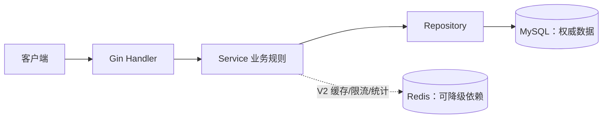

# 短链服务项目实战（上）：做出正确、完整的 V1

<!-- 2026-07-14：从教程级 MVP 重构为可执行的简历级 V1/V2/V3 路线；本章负责 V1 写路径与业务闭环。 -->

> **文件编码**：UTF-8。
> **定位**：Go 后端路线 Capstone 上篇。整合 Gin、GORM/MySQL、Redis、JWT，先完成一个“业务正确、边界清楚、可以测试”的短链服务 V1。
> **下一章**：[11 短链服务项目实战（下）](./11-短链服务项目实战下.md) 会在 V1 上增加缓存、限流、可靠统计、可观测性、部署和真实压测。
> **设计对照**：[系统设计 08 短链服务设计](../系统设计/08-短链服务设计.md)。

---

## 0. 先确定项目标准

### 0.1 这不是“把接口跑起来就算完成”

一个能写进简历的项目至少要同时具备：

1. **业务闭环**：创建、详情、列表、更新、禁用、启用、删除、过期、自定义短码都能工作。
2. **正确性**：鉴权、归属校验、唯一约束、并发幂等、数据库迁移和错误语义清楚。
3. **性能与故障设计**：Redis 只是加速器，不能悄悄变成单点；异步任务必须有容量和丢失边界。
4. **工程证据**：测试、CI、压测原始报告、监控截图和设计说明都能复现。

代码可以由你、Codex 或 Cursor 协作完成，但下面几条核心链路必须能独立讲清：

- 创建短链为什么不会因重试产生重复数据；
- 自动短码和自定义短码如何避免冲突；
- 用户为什么不能修改别人的链接；
- 禁用或更新后，旧缓存为什么不会长期继续跳转；
- 点击统计在哪些故障下可能少记或重复，项目如何处理。

### 0.2 三个版本的范围

| 版本 | 目标 | 必做成果 | 是否适合写简历 |
|------|------|----------|----------------|
| V1 | 正确可用 | 完整链接管理、JWT、过期/禁用、自定义短码、幂等、迁移、测试 | 只能说“完成项目”，亮点较少 |
| V2 | 简历级 | Cache Aside、`singleflight`、Redis 降级、原子限流、有界统计、CI、监控、Docker、基础故障演练和一份可复现压测报告 | 达到验收后可以描述已实现能力，但数字只能引用实测结果 |
| V3 | 强化亮点 | Redis Streams + 全局 `event_id` 幂等消费、pprof 优化前后对比、扩展故障演练 | 用于拉开差距；布隆过滤器等仍按证据选做 |

**本章只追求 V1 完整，不急着堆中间件。** V2、V3 在第 11 章完成。

### 0.3 学习节奏

| 阶段 | 建议时间 | 完成标志 |
|------|----------|----------|
| 工程与迁移 | 0.5～1 天 | 空数据库可一键迁移并启动 |
| 创建链路 | 1～2 天 | 自动码、自定义码、幂等、去重均有测试 |
| 管理接口 | 1～2 天 | 详情、列表、更新、禁用、启用、删除闭环 |
| 验收与复盘 | 0.5～1 天 | 测试通过，能画时序图并回答自测 |

---

## 1. 产品边界与架构

### 1.1 V1 的边界

V1 是一个 **模块化单体**，不是微服务：

- 一个 API 进程；
- 一个 MySQL，保存权威业务数据；
- 一个 Redis，V1 仅供开发环境和后续 V2 使用；
- 不引入 Kubernetes、gRPC、消息队列等与当前规模无关的复杂度。



**重要原则**：V1 的创建短码不依赖 Redis，因此 Redis 故障不会阻断核心写路径。第 4 节会解释为什么不再把 `Redis INCR` 作为唯一方案。

### 1.2 推荐目录

```text
shortlink-api/
├── cmd/
│   ├── api/main.go
│   └── worker/main.go                 # V2 需要独立统计 worker 时再启用
├── internal/
│   ├── app/                           # 依赖组装、路由、生命周期
│   ├── config/
│   ├── domain/
│   │   ├── link.go                    # 领域模型、状态、领域错误
│   │   └── user.go
│   ├── service/
│   │   ├── link_service.go
│   │   └── auth_service.go
│   ├── repository/
│   │   └── mysql/
│   ├── transport/http/
│   │   ├── handler/
│   │   ├── middleware/
│   │   └── response/
│   └── platform/
│       ├── database/
│       ├── redis/
│       └── observability/
├── migrations/
│   ├── 000001_init.up.sql
│   └── 000001_init.down.sql
├── tests/integration/
├── deploy/
│   ├── Dockerfile
│   └── compose.yaml
├── docs/                              # 架构图、ADR、压测报告
├── .env.example
├── Makefile
├── go.mod
└── README.md
```

分层判断规则：

- Handler 只做参数绑定、鉴权上下文读取和响应转换；
- Service 决定幂等、状态流转、权限和事务边界；
- Repository 只封装数据访问，不返回 HTTP 状态码；
- `main` 负责显式组装依赖和优雅关闭，不写业务逻辑。

---

## 2. 本地环境与迁移纪律

### 2.1 开发环境 compose

下面密码只用于本机开发，不得用于线上，也不得把真实 `.env` 提交到 Git。

```yaml
services:
  mysql:
    image: mysql:8.4
    command: ["--default-time-zone=+00:00"]
    environment:
      MYSQL_ROOT_PASSWORD: dev-root
      MYSQL_DATABASE: shortlink
      MYSQL_USER: shortlink
      MYSQL_PASSWORD: dev-password
    ports:
      - "3306:3306"
    healthcheck:
      test: ["CMD", "mysqladmin", "ping", "-h", "localhost", "-pdev-root"]
      interval: 5s
      timeout: 3s
      retries: 20
    volumes:
      - mysql-data:/var/lib/mysql

  redis:
    image: redis:7.4-alpine
    command: ["redis-server", "--appendonly", "yes"]
    ports:
      - "6379:6379"
    healthcheck:
      test: ["CMD", "redis-cli", "ping"]
      interval: 5s
      timeout: 3s
      retries: 20
    volumes:
      - redis-data:/data

volumes:
  mysql-data:
  redis-data:
```

`.env.example` 至少包含：

```dotenv
APP_ENV=local
HTTP_ADDR=:8080
MYSQL_DSN=shortlink:dev-password@tcp(127.0.0.1:3306)/shortlink?charset=utf8mb4&parseTime=true&loc=UTC&time_zone=%27%2B00%3A00%27
REDIS_ADDR=127.0.0.1:6379
JWT_SECRET=replace-with-at-least-32-random-bytes
PUBLIC_BASE_URL=http://127.0.0.1:8080/r
```

启动时必须校验：生产环境 JWT 密钥不能是默认值；`PUBLIC_BASE_URL` 必须是合法 `http/https` URL；数据库连接超时和连接池上限必须显式配置。

时间统一规则：API 解析 RFC3339 后转 UTC；Go 内部使用 `time.Now().UTC()`；DSN 使用 `loc=UTC` 并把 MySQL session `time_zone` 设为 `+00:00`；`DATETIME(3)` 一律按 UTC 写入和比较。这样 `NOW()`、`CURRENT_TIMESTAMP`、过期判断、幂等清理和 outbox 重试不会因开发机处于 Asia/Shanghai 而错位。

### 2.2 不把 `AutoMigrate` 当生产迁移

开发早期可以用 `AutoMigrate` 看模型，但正式项目改用 `goose` 或 `golang-migrate`：

- 所有表结构变更都进入 `migrations/`；
- CI 在空数据库执行全部 `up`；
- 已发布迁移不直接改写，错误用新迁移修复；
- 应用启动与迁移命令分开，避免多实例同时改表。

### 2.3 V1 完整数据模型

下面是核心迁移示例。状态约定：`1=active`、`2=disabled`。过期不是第三种持久状态，而是由 `expires_at <= NOW()` 计算出的有效状态。

```sql
CREATE TABLE users (
    id            BIGINT UNSIGNED NOT NULL AUTO_INCREMENT,
    username      VARCHAR(32) NOT NULL,
    email         VARCHAR(254) NOT NULL,
    password_hash VARCHAR(255) NOT NULL,
    status        TINYINT UNSIGNED NOT NULL DEFAULT 1,
    created_at    DATETIME(3) NOT NULL DEFAULT CURRENT_TIMESTAMP(3),
    updated_at    DATETIME(3) NOT NULL DEFAULT CURRENT_TIMESTAMP(3)
                                  ON UPDATE CURRENT_TIMESTAMP(3),
    PRIMARY KEY (id),
    UNIQUE KEY uk_users_username (username),
    UNIQUE KEY uk_users_email (email)
) ENGINE=InnoDB DEFAULT CHARSET=utf8mb4;

CREATE TABLE short_links (
    id             BIGINT UNSIGNED NOT NULL AUTO_INCREMENT,
    user_id        BIGINT UNSIGNED NOT NULL,
    short_code     VARCHAR(32) CHARACTER SET ascii COLLATE ascii_bin NOT NULL,
    original_url   VARCHAR(2048) NOT NULL,
    url_hash       BINARY(32) NOT NULL,
    status         TINYINT UNSIGNED NOT NULL DEFAULT 1,
    expires_at     DATETIME(3) NULL,
    click_count    BIGINT UNSIGNED NOT NULL DEFAULT 0,
    version        BIGINT UNSIGNED NOT NULL DEFAULT 1,
    created_at     DATETIME(3) NOT NULL DEFAULT CURRENT_TIMESTAMP(3),
    updated_at     DATETIME(3) NOT NULL DEFAULT CURRENT_TIMESTAMP(3)
                                   ON UPDATE CURRENT_TIMESTAMP(3),
    deleted_at     DATETIME(3) NULL,
    PRIMARY KEY (id),
    UNIQUE KEY uk_short_links_code (short_code),
    KEY idx_short_links_user_created (user_id, deleted_at, created_at, id),
    KEY idx_short_links_user_status_created (user_id, deleted_at, status, created_at, id),
    KEY idx_short_links_user_url_hash (user_id, url_hash),
    KEY idx_short_links_expires (expires_at),
    CONSTRAINT fk_short_links_user FOREIGN KEY (user_id) REFERENCES users(id)
) ENGINE=InnoDB DEFAULT CHARSET=utf8mb4;

-- 只有请求 reuse_existing=true 时才使用这张表。
-- 它指向“当前可复用”的链接，避免把普通创建强制去重。
CREATE TABLE link_dedup_keys (
    user_id     BIGINT UNSIGNED NOT NULL,
    url_hash    BINARY(32) NOT NULL,
    link_id     BIGINT UNSIGNED NULL,
    updated_at  DATETIME(3) NOT NULL DEFAULT CURRENT_TIMESTAMP(3)
                              ON UPDATE CURRENT_TIMESTAMP(3),
    PRIMARY KEY (user_id, url_hash),
    KEY idx_link_dedup_link (link_id),
    CONSTRAINT fk_link_dedup_user FOREIGN KEY (user_id) REFERENCES users(id),
    CONSTRAINT fk_link_dedup_link FOREIGN KEY (link_id) REFERENCES short_links(id)
) ENGINE=InnoDB DEFAULT CHARSET=utf8mb4;

-- 正确性数据放 MySQL，而不是只放可能被淘汰或故障的 Redis。
CREATE TABLE idempotency_records (
    id            BIGINT UNSIGNED NOT NULL AUTO_INCREMENT,
    user_id       BIGINT UNSIGNED NOT NULL,
    idem_key      VARCHAR(64) CHARACTER SET ascii COLLATE ascii_bin NOT NULL,
    request_hash  BINARY(32) NOT NULL,
    link_id       BIGINT UNSIGNED NULL,
    expires_at    DATETIME(3) NOT NULL,
    created_at    DATETIME(3) NOT NULL DEFAULT CURRENT_TIMESTAMP(3),
    updated_at    DATETIME(3) NOT NULL DEFAULT CURRENT_TIMESTAMP(3)
                                 ON UPDATE CURRENT_TIMESTAMP(3),
    PRIMARY KEY (id),
    UNIQUE KEY uk_idempotency_user_key (user_id, idem_key),
    KEY idx_idempotency_expires (expires_at),
    CONSTRAINT fk_idempotency_user FOREIGN KEY (user_id) REFERENCES users(id),
    CONSTRAINT fk_idempotency_link FOREIGN KEY (link_id) REFERENCES short_links(id)
) ENGINE=InnoDB DEFAULT CHARSET=utf8mb4;
```

`000001_init.down.sql` 按外键依赖的逆序删除：`idempotency_records` → `link_dedup_keys` → `short_links` → `users`。生产回滚优先使用新的前向修复迁移；`down` 主要用于本地和 CI 验证迁移是否成对可执行。

设计理由：

- `short_code` 使用 `ascii_bin`，因此 `Ab1` 和 `ab1` 是两个不同短码；应用层也必须保持大小写。
- `short_code` 即使软删除也**永不复用**，避免旧二维码或聊天记录后来跳到另一用户的地址。
- 管理接口使用不可猜业务含义的 `id`；公开跳转只使用 `short_code`。
- `version` 用于乐观锁，防止两个页面同时更新导致后提交者静默覆盖前者。
- `click_count` 是已落库的累计值；V2 尚未落库的增量需要在统计响应中说明。

---

## 3. 完整业务 API

### 3.1 路由清单

| Method | Path | 鉴权 | 成功状态 | 说明 |
|--------|------|------|----------|------|
| POST | `/api/v1/auth/register` | 否 | 201 | 注册 |
| POST | `/api/v1/auth/login` | 否 | 200 | 登录并返回 JWT |
| POST | `/api/v1/links` | 是 | 201/200 | 创建；支持自定义码、过期、幂等和可选去重 |
| GET | `/api/v1/links` | 是 | 200 | 当前用户链接列表、分页与筛选 |
| GET | `/api/v1/links/:id` | 是 | 200 | 当前用户的链接详情 |
| PATCH | `/api/v1/links/:id` | 是 | 200 | 更新目标 URL 或过期时间，不修改短码 |
| POST | `/api/v1/links/:id/disable` | 是 | 200 | 禁用，重复调用仍成功 |
| POST | `/api/v1/links/:id/enable` | 是 | 200 | 启用；已过期时需先更新过期时间 |
| DELETE | `/api/v1/links/:id` | 是 | 204 | 软删除，短码永久保留 |
| GET | `/api/v1/links/:id/stats` | 是 | 200 | V2 增加统计明细 |
| GET | `/r/:code` | 否 | 302/404 | V2 跳转；生产可用独立短域名 `s.example.com/:code` |

根路径 `/:code` 容易与 `/api`、`/livez`、`/readyz`、`/metrics` 混在一起。本地和单域名部署推荐 `/r/:code`；真正使用独立短域名时再把它映射到根路径。

### 3.2 创建请求

```http
POST /api/v1/links HTTP/1.1
Authorization: Bearer <token>
Idempotency-Key: 84d77273-7de8-4fe7-bf9b-2cad63f5d855
Content-Type: application/json

{
  "original_url": "https://www.example.com/docs?a=1",
  "custom_code": "go-notes",
  "expires_at": "2026-12-31T16:00:00Z",
  "reuse_existing": false
}
```

约束：

- `original_url` 必填，只接受 `http`、`https`，最大 2048 字符；
- `custom_code` 可选，4～32 个 URL 安全字符，需避开保留字；
- `expires_at` 可选，必须晚于当前时间；所有接口使用 UTC/RFC3339，展示层再转时区；
- `Idempotency-Key` 创建时必填，建议 UUID，最大 64 字符；
- `reuse_existing=false` 是默认值，因为同一个长链可能需要不同渠道短码；显式为 `true` 才做用户内业务去重。
- `custom_code` 与 `reuse_existing=true` 不允许同时使用：前者要求创建指定别名，后者要求优先返回已有资源，语义冲突时返回 `400 VALIDATION_ERROR`。

新建返回 `201 Created`；同一幂等请求重放或命中业务去重时返回已有资源和 `200 OK`。只有同一 `Idempotency-Key` 的真实重放才设置：

```http
Idempotency-Replayed: true
```

业务去重命中不使用这个响应头，而是在响应 `meta.reuse_reason` 中返回 `business_dedup`，避免把两个概念混为一谈。

响应示例：

```json
{
  "code": "OK",
  "message": "ok",
  "data": {
    "id": "123",
    "short_code": "go-notes",
    "short_url": "http://127.0.0.1:8080/r/go-notes",
    "original_url": "https://www.example.com/docs?a=1",
    "status": "active",
    "expires_at": "2026-12-31T16:00:00Z",
    "version": 1,
    "created_at": "2026-07-14T08:00:00Z"
  },
  "request_id": "01J2..."
}
```

### 3.3 列表、详情与状态

```http
GET /api/v1/links?cursor=<opaque>&page_size=20&status=active&keyword=docs
```

- 首次请求省略 `cursor`，后续原样传回响应中的 `next_cursor`；
- `1 <= page_size <= 100`；
- `status` 支持 `active`、`disabled`、`expired`；
- `keyword` 只做必要字段搜索，避免直接拼 SQL；
- 固定排序为 `created_at DESC, id DESC`，保证同一毫秒创建的数据顺序稳定；
- cursor 编码最后一行的 `created_at + id`，SQL 使用同样的复合条件和索引；
- 返回 `items`、`page_size`、`next_cursor`、`has_more`。若页面必须显示总数，单独执行可观测、可限时的 COUNT，不让深分页依赖 OFFSET。

详情和列表中的 `effective_status` 计算顺序：

1. `deleted_at != NULL`：管理查询视为不存在；
2. `status=disabled`：`disabled`；
3. `expires_at <= now`：`expired`；
4. 其他：`active`。

因此列表筛选不能直接写 `WHERE status = 'expired'`：`active` 对应 `status=1 AND (expires_at IS NULL OR expires_at>NOW())`，`expired` 对应 `status=1 AND expires_at<=NOW()`，`disabled` 对应 `status=2`；三者都附带 `deleted_at IS NULL`。

### 3.4 更新、禁用、启用、删除

更新使用乐观锁：客户端把上次读取到的版本放入 `If-Match`。

```http
PATCH /api/v1/links/123
If-Match: "7"
Content-Type: application/json

{
  "original_url": "https://www.example.com/new-path",
  "expires_at": null
}
```

Go 的更新请求类型必须区分“字段未提供”和“显式传 `null`”。例如清空 `expires_at` 时不能只用普通 `*time.Time` 猜测语义，可使用带 `Set bool` 的 optional wrapper 或 JSON Merge Patch。

SQL 更新必须同时限制所有者和版本：

```sql
UPDATE short_links
SET original_url = ?, url_hash = ?, expires_at = ?, version = version + 1
WHERE id = ? AND user_id = ? AND version = ? AND deleted_at IS NULL;
```

- 影响 0 行时，再区分资源不存在和版本冲突；版本冲突返回 `409 VERSION_CONFLICT`。
- `short_code` 创建后不可修改；要换短码就新建链接并禁用旧链接。
- 更新 URL 时，如果 `link_dedup_keys` 正指向该链接，事务应删除旧 hash 指针并尝试登记新 hash；若新 hash 已指向另一条有效链接，则现有指针优先，当前链接仍可用但不成为该 URL 的复用目标。
- 禁用和启用接口自身幂等：已经处于目标状态也返回当前资源。
- 已过期链接不能直接启用，先 PATCH 一个未来的 `expires_at`。
- 删除使用软删除并清理去重指针，但不释放 `short_code` 唯一约束。
- 更新、禁用、启用、删除都必须触发第 11 章的缓存失效流程。

### 3.5 权限规则

Repository 的管理查询直接带上用户条件：

```go
Where("id = ? AND user_id = ? AND deleted_at IS NULL", linkID, userID)
```

不要先按 `id` 查出记录，再在 Handler 临时比较 `user_id`。统一规则是：

- 未登录：`401 UNAUTHORIZED`；
- 已登录但资源不属于他：也返回 `404 LINK_NOT_FOUND`，避免泄露资源是否存在；
- 只有公开跳转接口按 `short_code` 查询，且不返回所有者信息。

至少写一条集成测试：用户 B 对用户 A 的详情、更新、禁用和删除全部得到 404，数据库内容不变。

---

## 4. 短码生成：先理解取舍，再选实现

### 4.1 三种方案

| 方案 | 优点 | 风险/代价 | 本项目定位 |
|------|------|-----------|------------|
| Redis `INCR` → Base62 | 无碰撞、实现直观、码较短 | Redis 成为创建依赖；序列可枚举；故障恢复和多环境序号要设计 | 学习对照方案 |
| DB 自增 ID → Base62 | 不依赖 Redis、无碰撞 | ID 与短码强相关且可枚举；先拿 ID 再更新短码 | 可用但不推荐展示 |
| `crypto/rand` 随机 Base62 + DB 唯一索引重试 | 不依赖 Redis、不连续、较难枚举 | 理论上会碰撞，必须由唯一索引兜底并重试 | **V1 推荐方案** |

`62^8` 是固定的编码空间，不是压测成绩。随机方案仍不能只相信概率，数据库唯一索引才是最终正确性保障。

### 4.2 随机 Base62 示例

下面使用拒绝采样，避免简单 `% 62` 带来的分布偏差：

```go
package shortcode

import (
	"crypto/rand"
	"fmt"
)

const alphabet = "0123456789abcdefghijklmnopqrstuvwxyzABCDEFGHIJKLMNOPQRSTUVWXYZ"
const maxRandomByte = byte(256 - 256%len(alphabet)) // 248

func Generate(length int) (string, error) {
	if length < 6 || length > 32 {
		return "", fmt.Errorf("invalid short code length: %d", length)
	}

	out := make([]byte, 0, length)
	buf := make([]byte, length*2)
	for len(out) < length {
		if _, err := rand.Read(buf); err != nil {
			return "", fmt.Errorf("read crypto random: %w", err)
		}
		for _, b := range buf {
			if b >= maxRandomByte {
				continue
			}
			out = append(out, alphabet[int(b)%len(alphabet)])
			if len(out) == length {
				break
			}
		}
	}
	return string(out), nil
}
```

自动码默认 8 位。插入遇到 `uk_short_links_code` 冲突时重新生成，最多重试 5 次；仍失败返回内部错误并记录告警。**不要**先 `SELECT` 判断自动码不存在再插入，因为并发下仍会发生检查后插入竞争。

### 4.3 自定义短码

自定义码先做格式校验，再直接尝试 INSERT，以唯一索引结果为准：

- 建议正则：`^[A-Za-z0-9][A-Za-z0-9_-]{3,31}$`；
- 保留 `api`、`r`、`livez`、`readyz`、`metrics`、`debug`、`admin` 等系统词；
- 冲突返回 `409 SHORT_CODE_CONFLICT`，不自动替用户改名；
- 大小写敏感规则必须在 API 文档中明确；
- 删除后也不能由其他人重新注册同一短码。

### 4.4 如果仍想实现 Counter + Base62

可以把它作为一个可切换的 `CodeGenerator` 实现来学习，但必须把取舍写进 ADR：

```go
type CodeGenerator interface {
	Next(ctx context.Context) (string, error)
}
```

Redis 故障时不要执行危险的 `DECR` 回滚，也不要在多个生成器之间无规则切换。可选策略只有两类：

1. **严格模式**：创建返回 `503 DEPENDENCY_UNAVAILABLE`，等 Redis 恢复；
2. **预先设计的降级模式**：不同生成器使用互不重叠的命名空间，且 DB 唯一索引仍兜底。

为了让 V1 在 Redis 下线时仍能创建，本项目默认采用随机 Base62，而不是临时发生故障才“现场切算法”。

---

## 5. URL 校验与规范化

### 5.1 校验不等于抓取

短链服务只保存并重定向，不主动请求目标 URL，因此本阶段没有典型服务端 SSRF 请求；但仍要防止危险协议和明显脏数据：

- 只允许 `http`、`https`；
- 必须有合法主机名；拒绝 URL 中的用户名密码；
- 保留 fragment：它不会发送给目标服务器，但会影响浏览器最终定位的页面锚点，擅自删除会改变用户语义；
- 限制总长度；可选地拒绝本机/内网地址，具体取决于产品是否允许内部短链；
- 生产环境还需要恶意域名检测、举报和封禁流程，不能声称仅靠正则就“防钓鱼”。

### 5.2 规范化边界

为了计算 `url_hash`，可以安全地：

- scheme 和 host 转小写；
- 删除默认端口 `:80`/`:443`；
- 空 path 统一为 `/`；
- 保留 fragment，并把它纳入业务去重 hash；`https://a/x#one` 与 `https://a/x#two` 可能是两个不同落点。

不要擅自排序或删除 query 参数，因为有些网站参数顺序、重复参数或跟踪参数有业务含义。规范化后的 URL 用 SHA-256 得到 `url_hash`。

---

## 6. 幂等与业务去重不是一回事

### 6.1 创建幂等

场景：客户端已提交成功，但响应途中断网，于是用相同 `Idempotency-Key` 重试。

事务内流程：

1. 对规范化请求体计算 `request_hash`；
2. 尝试插入 `(user_id, idem_key, request_hash)`；唯一冲突时读取旧记录；
3. 相同 key、相同 hash 且 `link_id` 已写入：返回原资源；若出现已提交但 `link_id` 为空，视为数据不变量破坏并告警；
4. 相同 key、不同 hash：返回 `409 IDEMPOTENCY_KEY_REUSED`；
5. 首次请求创建短链，将 `link_id` 写回幂等记录后一起提交。

幂等记录建议保留 24 小时并由定时清理任务删除。事务读取到已过期但尚未清理的记录时，应在锁内回收后再创建；清理只影响未来重放窗口，不删除业务链接。

### 6.2 业务去重

同一用户可能故意为同一 URL 建多个码用于渠道统计，所以不能默认全局去重。只有 `reuse_existing=true` 时：

1. 对 `(user_id, url_hash)` 执行 `INSERT ... ON DUPLICATE KEY UPDATE`，确保去重键存在；
2. `SELECT ... FOR UPDATE` 锁住 `link_dedup_keys`；
3. 指向的链接若仍 active、未删除、未过期，则直接返回；
4. 否则创建新链接并更新 `link_id` 指针；
5. 禁用或删除链接时清理指针；过期链接在下一次复用请求中被替换。

`link_id` 允许 NULL，是为了让第一次请求能在创建链接前先插入一行占位并取得该 `(user_id, url_hash)` 的事务锁；提交前必须更新为真实 link id。这样既能并发去重，也不会禁止用户显式创建多个营销短链。

---

## 7. 创建链路的事务算法

Handler 不应把所有错误都当 400。Service 的主要流程可以按下面实现：

```text
校验 JWT 用户
  → 绑定并校验请求
  → 规范化 URL，计算 url_hash 和 request_hash
  → 开启 MySQL 事务
      → 获取/创建幂等记录
      → 若为重放，读取原链接并返回
      → reuse_existing=true 时锁定去重键并尝试复用
      → 自定义码：直接插入，唯一冲突返回 409
      → 自动码：随机生成并 INSERT，唯一冲突最多重试 5 次
      → 更新去重指针和幂等记录
    提交事务
  → V2 中投递缓存预热/失效事件
  → 返回 201 或 200
```

需要特别测试的并发情况：

- 20 个并发请求使用同一幂等 key，只生成一条链接；
- 同一幂等 key 配不同请求体，只有第一个成功，其余 409；
- 两个用户同时抢同一个自定义码，只有一个成功；
- 同一用户并发 `reuse_existing=true`，只得到一个可复用链接；
- 自定义短码与 `reuse_existing=true` 同时出现时被明确拒绝；
- 随机码发生人为注入的冲突时会重试，而不是返回 400。

---

## 8. 统一错误与响应

### 8.1 应用错误

```go
type AppError struct {
	Code       string
	HTTPStatus int
	Message    string
	Err        error // 只进日志，不直接返回客户端
}
```

统一响应：

```json
{
  "code": "SHORT_CODE_CONFLICT",
  "message": "short code is already in use",
  "request_id": "01J2...",
  "details": null
}
```

| 业务码 | HTTP | 使用场景 |
|--------|------|----------|
| `VALIDATION_ERROR` | 400 | JSON、URL、分页或过期时间非法 |
| `UNAUTHORIZED` | 401 | Token 缺失、过期或无效 |
| `FORBIDDEN` | 403 | 已认证但账号状态禁止操作；链接越权仍伪装成 404 |
| `LINK_NOT_FOUND` | 404 | 不存在、已删除或不属于当前用户 |
| `SHORT_CODE_CONFLICT` | 409 | 自定义短码已占用 |
| `IDEMPOTENCY_KEY_REUSED` | 409 | 同一 key 对应不同请求体 |
| `VERSION_CONFLICT` | 409 | 乐观锁版本落后 |
| `LINK_EXPIRED` | 409 | 对过期链接执行不允许的状态操作 |
| `DEPENDENCY_UNAVAILABLE` | 503 | 必需依赖暂不可用 |
| `INTERNAL_ERROR` | 500 | 未预期错误 |

规则：

- 不能把 SQL、DSN、堆栈或 `err.Error()` 原样暴露给客户端；
- 每个请求生成/透传 `request_id`，错误响应和结构化日志都带上它；
- MySQL 重复键需识别具体索引，再映射成短码冲突或幂等重放，不能一律返回 500；
- `201` 只用于真正新建，DELETE 成功返回 `204` 且无 JSON body。

---

## 9. V1 测试与验收

### 9.1 测试金字塔

**单元测试**：

- 随机短码字符集、长度和错误分支；
- 自定义短码保留字与边界；
- URL 校验/规范化；
- 状态计算与过期边界；
- 应用错误到 HTTP 的映射。

**Repository 集成测试（真实 MySQL）**：

- 迁移能在空库执行；
- `short_code` 大小写与唯一约束符合预期；
- cursor 分页排序稳定，连续翻页不重复、不漏项；
- 乐观锁只允许一个并发更新成功；
- 软删除后短码仍不可复用。

**HTTP/Service 集成测试**：

- 注册、登录、创建、详情、列表、更新、禁用、启用、删除全链路；
- 过期链接状态正确；
- 幂等、去重、自定义码冲突；
- 用户 B 不能读取或修改用户 A 的链接；
- 非法 JSON、URL、分页和 Token 返回正确业务码。

可用 Testcontainers 启动 MySQL/Redis，避免用 SQLite 冒充 MySQL 行为。提交前至少执行：

```bash
gofmt -w .
go vet ./...
go test ./...
go test -race ./...
```

### 9.2 V1 验收清单

- [ ] 一条命令启动依赖，一条命令执行迁移，一条命令启动 API；
- [ ] 所有管理 API 已实现并写进 OpenAPI/README；
- [ ] 自动码不依赖 Redis，自定义码由 DB 唯一约束兜底；
- [ ] `Idempotency-Key` 并发重试只生成一个资源；
- [ ] `reuse_existing` 的语义和普通重复创建明确区分；
- [ ] 过期、禁用、删除的状态边界有测试；
- [ ] 所有管理查询都有 `user_id` 归属条件；
- [ ] 生产不使用 `AutoMigrate`；
- [ ] `go test ./...` 与 `go test -race ./...` 通过；
- [ ] 能画出创建短链事务时序图，并解释每个唯一索引的作用。

未满足这些条件时，不要在简历上写“高可用”“高并发”或“生产级”。

---

## 10. README 在 V1 就要留下的证据

README 至少包含：

1. 项目解决什么问题，以及 V1/V2/V3 范围；
2. 架构图和目录说明；
3. 环境要求、启动、迁移、测试命令；
4. 完整 API 表和示例；
5. 数据表与关键索引说明；
6. 三份 ADR：短码方案、幂等/去重方案、软删除后不复用短码；
7. 当前限制和下一步，不回避统计误差或 Redis 降级边界。

建议创建但不伪造内容：

```text
docs/
├── architecture.md
├── adr/
│   ├── 001-short-code-generation.md
│   ├── 002-idempotency-and-dedup.md
│   └── 003-short-code-never-reuse.md
└── api/openapi.yaml
```

---

## 11. 常见问题

**Q1：为什么不继续用 Redis INCR？**
它适合学习 Counter + Base62，但会让创建依赖 Redis且短码连续可枚举。随机 Base62 + DB 唯一索引更符合本项目“Redis 可降级”的目标。

**Q2：随机码会不会碰撞？**
理论上会，所以必须尝试 INSERT、识别唯一冲突并重试。概率不是正确性机制，唯一索引才是。

**Q3：为什么不能先查短码存在再插入？**
两个并发请求可能同时查到不存在，然后一起插入；最终仍要依靠唯一约束。

**Q4：幂等和去重有什么区别？**
幂等处理“同一次请求重试”；去重是产品选择，处理“是否复用相同目标 URL 的已有链接”。

**Q5：为什么管理接口用 id，不直接用 code？**
管理资源和公开跳转语义分离，归属查询、以后换域名或增加别名都更清晰。

**Q6：过期链接要不要立刻改数据库状态？**
不必。以 `expires_at` 动态判断最可靠，后台任务可做清理或统计，但不能依赖任务准时执行才阻止跳转。

**Q7：为什么删除后不释放短码？**
旧消息、二维码和日志可能长期存在；复用会把旧链接指向完全不同的内容，存在安全风险。

**Q8：URL 规范化为什么不能太激进？**
删除或重排 query 可能改变目标站业务含义，导致本不相同的 URL 被错误去重。

**Q9：为什么正确性数据不只放 Redis？**
Redis 可能故障、淘汰或清空。幂等和资源状态必须以 MySQL 为权威来源。

**Q10：项目代码多由 AI 写，还算自己的项目吗？**
只有当你能运行测试、解释关键取舍、定位故障并独立完成小改动时，才真正属于你。

---

## 12. 闭卷自测

1. 自动短码为什么选择随机 Base62，而不是把 Redis INCR 当唯一方案？
2. DB 中哪个约束最终保证短码不重复？
3. 为什么 `short_code` 使用二进制排序规则？
4. 同一幂等 key 搭配不同请求体应返回什么？
5. 为什么默认不对相同 URL 去重？
6. 用户 B 修改用户 A 链接时为什么返回 404 而不是 403？
7. 过期、禁用、删除三者有什么区别？
8. 乐观锁的 `version` 解决什么问题？
9. 为什么软删除后也不复用短码？
10. 哪些迁移和测试证据能说明 V1 确实可复现？

### 参考要点

1. 随机码不连续且不把 Redis 变成创建依赖；DB 唯一约束兜底碰撞。
2. `uk_short_links_code`。
3. 保持大小写敏感并与应用规则一致。
4. `409 IDEMPOTENCY_KEY_REUSED`。
5. 同一目标可能需要多个渠道短码，只有显式 `reuse_existing=true` 才去重。
6. 避免泄露资源是否存在。
7. 过期由时间计算；禁用可恢复；删除对管理接口不可见且短码永久保留。
8. 防止并发更新静默覆盖。
9. 防止旧二维码或聊天记录被劫持到新目标。
10. 空库迁移、完整 API 测试、并发幂等测试、越权测试和可复现命令。

---

## 13. 进入下一章前的费曼检验

用 5 分钟讲清：

> 登录用户带着同一个 `Idempotency-Key` 并发提交 20 次创建请求，系统怎样保证只生成一条短链？如果他改了请求体再复用这个 key，为什么会得到 409？

能从 HTTP 请求讲到 MySQL 事务、唯一索引、请求哈希和最终响应，才算真正完成本章。

下一章将完成：[302 跳转、Cache Aside、Redis 降级、原子限流、统计、监控、CI、部署和真实压测](./11-短链服务项目实战下.md)。
