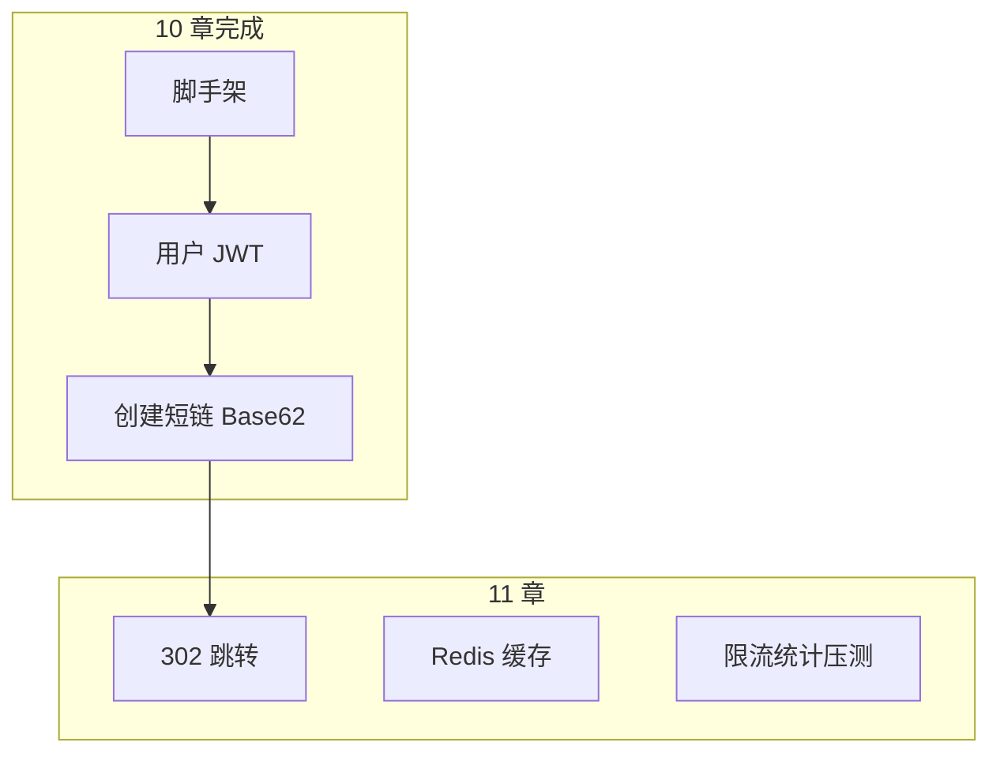

# 短链服务项目实战（上）

<!-- 修改说明: 2026-07-08 按 EXPANSION-STANDARD 新建 §0、FAQ≥10、项目脚手架、Base62 -->

> **文件编码**：UTF-8。  
> **定位**：Go 后端路线 **Capstone 上半**——整合 06～09，搭建 `shortlink-api`，完成用户模块与「创建短链 + Base62」。  
> **设计对照**：[系统设计 08 短链服务设计](../系统设计/08-短链服务设计.md)。  
> **前置**：[06 Gin](./06-Gin框架核心与中间件.md)～[09 JWT](./09-JWT认证与用户体系.md)。

---

## 0. 读前导读（零基础也能跟上）

### 0.1 用一句话弄懂本章

**一句话**：把前四章拼成 **可运行的短链后端上半**：工程脚手架 + 注册登录 + 登录后 `POST /links` 把长 URL 变成 **Base62 短码** 存 MySQL。

**生活类比**：前台（Gin）+ 档案室（MySQL）+ 会员卡（JWT）+ 取号机（Redis INCR 发号 → Base62 短号）。

---

### 0.2 你需要提前知道什么

| 水平 | 建议 |
|------|------|
| 完成 06～09 | 本章整合，跟做仓库 |
| 读过系统设计 08 | 理解 Counter + Base62 选型 |
| 有 ACM 背景 | Base62 = 62 进制转换 |

---

### 0.3 本章知识地图（学完后应能勾选全部 ☐→☑）

- [ ] `shortlink-api` 目录与 06 章一致并跑通
- [ ] docker-compose 起 MySQL + Redis
- [ ] 用户注册/登录/JWT 鉴权
- [ ] `POST /api/v1/links` 创建短链
- [ ] Redis INCR + Base62 生成唯一 short_code
- [ ] 返回完整短链 URL（配置 baseURL）
- [ ] 闭卷自测 ≥ 8/10

---

### 0.4 建议学习时长与节奏

| 阶段 | 时间 | 内容 |
|------|------|------|
| 脚手架 | 1 天 | §1～§2 |
| 用户模块 | 1 天 | §3（复用 09） |
| 短链创建 | 1.5 天 | §4～§6 Base62 |
| 联调 | 0.5 天 | curl/Postman |
| 自测 | 0.5 天 | FAQ + 闭卷 |

---

### 0.5 学完本章你能做什么

1. `docker compose up -d` 后 API 连 MySQL/Redis。
2. 注册 → 登录 → 带 Token 创建短链 → 得到 `http://localhost:8080/abc12X`。
3. MySQL `short_links` 表有记录；Redis `seq:link` 递增。
4. 白板讲清 **Counter + Base62** vs Hash（见 [系统设计 08](../系统设计/08-短链服务设计.md)）。

---

### 0.6 项目总览手把手

| 步骤 | 动作 | 预期 |
|------|------|------|
| 1 | clone/创建 `shortlink-api` | 目录结构 §1 |
| 2 | `docker compose up -d` | mysql+redis Up |
| 3 | 复制 `.env.example` → `.env` | 配置 DSN |
| 4 | `go run ./cmd/server` | 8080 监听 |
| 5 | 注册+登录+POST links | 201 + short_url |

---

## 本章与上一章的关系

09 章.authentication 是零件；10 章是 **第一辆整车（上半）**——能「造链」，还不能「跳转统计」（11 章）。



| 模块 | 链接 |
|------|------|
| 架构设计 | [系统设计 08](../系统设计/08-短链服务设计.md) |
| Gin 分层 | [06 Gin](./06-Gin框架核心与中间件.md) |
| 表结构 | [07 GORM](./07-GORM与MySQL实战.md) |
| JWT | [09 JWT](./09-JWT认证与用户体系.md) |

---

## 1. 工程脚手架

### 1.1 目录结构

```
shortlink-api/
├── cmd/server/main.go
├── internal/
│   ├── config/config.go
│   ├── handler/auth_handler.go
│   ├── handler/link_handler.go
│   ├── middleware/auth.go
│   ├── middleware/logger.go
│   ├── model/user.go
│   ├── model/short_link.go
│   ├── pkg/base62/base62.go
│   ├── pkg/response/result.go
│   ├── repository/user_repo.go
│   ├── repository/link_repo.go
│   ├── service/auth_service.go
│   └── service/link_service.go
├── docker-compose.yml
├── .env.example
└── go.mod
```

### 1.2 docker-compose.yml

```yaml
services:
  mysql:
    image: mysql:8.0
    environment:
      MYSQL_ROOT_PASSWORD: root123
      MYSQL_DATABASE: shortlink
    ports: ["3306:3306"]
  redis:
    image: redis:7
    ports: ["6379:6379"]
```

### 1.3 配置加载（简化）

```go
type Config struct {
	HTTPPort   string `env:"HTTP_PORT" envDefault:"8080"`
	MySQLDSN   string `env:"MYSQL_DSN"`
	RedisAddr  string `env:"REDIS_ADDR" envDefault:"localhost:6379"`
	JWTSecret  string `env:"JWT_SECRET"`
	BaseURL    string `env:"BASE_URL" envDefault:"http://localhost:8080"`
}
```

`.env.example`：

```
MYSQL_DSN=root:root123@tcp(localhost:3306)/shortlink?charset=utf8mb4&parseTime=True&loc=Local
REDIS_ADDR=localhost:6379
JWT_SECRET=change-me-to-32bytes-random-string!!
BASE_URL=http://localhost:8080
```

### 1.4 main 组装（示意）

`main` 中依次：`Load 配置` → `Open MySQL + AutoMigrate` → `Open Redis` → `New JWTManager` → 注入 `AuthService` / `LinkService` → `router.Register` → `r.Run`。依赖在 main **显式组装**，与 Spring 容器注入对照理解即可。

---

## 2. API 设计（创建阶段）

| Method | Path | 鉴权 | 说明 |
|--------|------|------|------|
| POST | `/api/v1/auth/register` | 否 | 注册 |
| POST | `/api/v1/auth/login` | 否 | 登录 |
| POST | `/api/v1/links` | 是 | 创建短链 |
| GET | `/api/v1/links/mine` | 是 | 我的短链列表 |

**创建请求/响应**：

```json
// POST /api/v1/links
{ "original_url": "https://www.example.com/path?q=1" }

// 201
{
  "code": 0,
  "msg": "ok",
  "data": {
    "short_code": "aZ9xB2",
    "short_url": "http://localhost:8080/aZ9xB2",
    "original_url": "https://www.example.com/path?q=1"
  }
}
```

对照 [系统设计 08 API](../系统设计/08-短链服务设计.md) 保持一致，便于面试对照讲。

---

## 3. 用户模块（整合 09）

复用 09 章：

- `AuthHandler.Register` / `Login`
- `AuthMiddleware` 保护 `/links`
- `model.User` GORM 定义

**验收**：不带 Token `POST /links` → 401。

---

## 4. 短码生成：Counter + Base62

[系统设计 08](../系统设计/08-短链服务设计.md) 推荐 **Redis INCR 全局序号 → Base62**：

- 无 Hash 碰撞
- 短码长度随量级增长
- 7 位 Base62 ≈ 62^7 ≈ 3.5 万亿


### 4.1 Base62 实现

```go
// internal/pkg/base62/base62.go
const alphabet = "0123456789abcdefghijklmnopqrstuvwxyzABCDEFGHIJKLMNOPQRSTUVWXYZ"

func Encode(n uint64) string {
	if n == 0 {
		return string(alphabet[0])
	}
	var buf [11]byte // 足够存 uint64
	i := len(buf)
	for n > 0 {
		i--
		buf[i] = alphabet[n%62]
		n /= 62
	}
	return string(buf[i:])
}

func Decode(s string) (uint64, error) {
	var n uint64
	for _, c := range s {
	 idx := strings.IndexRune(alphabet, c)
		if idx < 0 {
			return 0, fmt.Errorf("invalid char: %c", c)
		}
		n = n*62 + uint64(idx)
	}
	return n, nil
}
```

**逐行读**：`n%62` 取最低位字符；`n/=62` 右移一位；结果 **不含前导零**（0 特判为 `"0"`）。

---

## 5. LinkService.Create

```go
type LinkService struct {
	repo    *repository.LinkRepository
	rdb     *redis.Client
	baseURL string
}

func (s *LinkService) Create(ctx context.Context, userID int64, originalURL string) (*model.ShortLink, error) {
	if err := validateURL(originalURL); err != nil {
		return nil, err
	}
	seq, err := s.rdb.Incr(ctx, "seq:link").Result()
	if err != nil {
		return nil, err
	}
	code := base62.Encode(uint64(seq))
	// 可选：跳过易混淆字符 0/O/l/1

	link := &model.ShortLink{
		ShortCode:   code,
		OriginalURL: originalURL,
		UserID:      userID,
	}
	if err := s.repo.Create(ctx, link); err != nil {
		return nil, err
	}
	link.ShortURL = s.baseURL + "/" + code // 非 DB 字段，响应用
	return link, nil
}

func validateURL(raw string) error {
	u, err := url.ParseRequestURI(raw)
	if err != nil || u.Scheme == "" || u.Host == "" {
		return errors.New("无效的 URL")
	}
	if u.Scheme != "http" && u.Scheme != "https" {
		return errors.New("仅支持 http/https")
	}
	return nil
}
```

**幂等**：同一长链多次创建 → 多条短链（产品可后续做「同一用户同一 URL 返回已有」）。

---

## 6. LinkHandler

```go
type createLinkReq struct {
	OriginalURL string `json:"original_url" binding:"required,url"`
}

func (h *LinkHandler) Create(c *gin.Context) {
	uid, _ := GetUserID(c)
	var req createLinkReq
	if err := c.ShouldBindJSON(&req); err != nil {
		response.Fail(c, 400, err.Error())
		return
	}
	link, err := h.svc.Create(c.Request.Context(), uid, req.OriginalURL)
	if err != nil {
		response.Fail(c, 400, err.Error())
		return
	}
	response.OK(c, gin.H{
		"short_code":   link.ShortCode,
		"short_url":    h.svc.FullURL(link.ShortCode),
		"original_url": link.OriginalURL,
	})
}
```

---

## 7. 我的链接列表

```go
func (h *LinkHandler) ListMine(c *gin.Context) {
	uid, _ := GetUserID(c)
	page, _ := strconv.Atoi(c.DefaultQuery("page", "1"))
	size, _ := strconv.Atoi(c.DefaultQuery("size", "10"))
	items, total, err := h.svc.ListByUser(c.Request.Context(), uid, page, size)
	if err != nil {
		response.Fail(c, 500, err.Error())
		return
	}
	response.OK(c, gin.H{"items": items, "total": total, "page": page, "size": size})
}
```

Repository：`Where("user_id = ?", uid).Order("id DESC").Offset.Limit`。

---

## 8. 常见错误对照表

| 现象 | 原因 | 处理 |
|------|------|------|
| INCR 成功 INSERT 失败 | 缺事务 | 可接受极少空洞序号；或 DB 失败 DECR（复杂） |
| 短码重复 | 没用 INCR 或并发 bug | 应用 INCR；DB uniqueIndex 兜底 |
| URL 校验过松 | 缺 Scheme | `url.ParseRequestURI` |
| 401 创建 | Token 未带 | Authorization Bearer |
| compose 连不上 | 端口/密码 | 查 .env 与 DSN |

---

## 8. 常见错误对照表

**Q1：为何不用 Hash 短链？**  
MurMurHash 有碰撞需重试；Counter 确定性唯一，见 [系统设计 08](../系统设计/08-短链服务设计.md)。

**Q2：Base62 和 Base64？**  
Base64 含 `+/=` 不适合 URL；Base62 URL 友好。

**Q3：序号从 1 开始短码多短？**  
1→`1`，62→`10`；前几十万都是 1～3 字符。

**Q4：Redis 挂了还能创建吗？**  
可降级 DB `AUTO_INCREMENT` 或 Snowflake；实习说明降级策略即可。

**Q5：要支持自定义短码吗？**  
进阶：用户传 `custom_code`，查重后 INSERT。

**Q6：长 URL 长度限制？**  
2048 字符常见；GORM `size:2048`。

**Q7：需要审核 URL 吗？**  
生产要防钓鱼；MVP 可跳过，面试提一句。

**Q8：docker-compose 必须吗？**  
推荐；也可本机 MySQL/Redis。

**Q9：和 Java 项目对照？**  
REST 路径一致，方便前端切换后端栈。

**Q10：创建后何时写 Redis？**  
11 章跳转 Cache Aside；创建时可预热 `SET link:code`。

---

## 9. 练习建议

### 基础

1. 跑通 docker-compose + 创建短链全流程
2. 实现 `ListMine` 分页

### 进阶

3. 同一用户相同 URL 返回已有短链（查 DB）
4. 创建时 `SET link:{code}` 预热缓存

### 挑战

5. 单元测试 `base62.Encode/Decode` 往返
6. 写 README 架构图对照 [系统设计 08](../系统设计/08-短链服务设计.md)

---

## 12. 学完标准

- [ ] shortlink-api 可启动
- [ ] 注册登录 JWT 可用
- [ ] POST /links 返回 short_url
- [ ] Base62 + INCR 理解
- [ ] MySQL 有 short_links 记录
- [ ] 能画创建短链时序图

---

## 13. 闭卷自测

1. 本项目短码用 Counter 还是 Hash？为什么？
2. Base62 字符集有多少字符？
3. Redis key `seq:link` 作用？
4. 创建短链为何需要 JWT？
5. `validateURL` 要检查什么？
6. short_code 在 DB 上要什么索引？
7. BaseURL 配置用来做什么？
8. INCR 与 INSERT 非原子怎么办？
9. 7 位 Base62 大约多少空间？
10. 10 章和 11 章分工？

### 参考答案

1. Counter；无碰撞、递增短码。
2. 62。
3. 全局自增序号。
4. 绑定 user_id，防匿名刷链。
5. 合法 http/https URI。
6. uniqueIndex。
7. 拼完整短链给用户。
8. 接受空洞或 unique 约束重试；面试说即可。
9. 62^7 量级。
10. 上：创建；下：跳转缓存限流统计。

---

## 14. 费曼检验

3 分钟：**「登录用户如何得到一条短链？」**

JWT 鉴权 → 校验长 URL → Redis INCR → Base62 → INSERT MySQL → 返回 baseURL/code。

---

## 15. 章节衔接

| 模块 | 链接 |
|------|------|
| 设计 | [系统设计 08 短链](../系统设计/08-短链服务设计.md) |
| 缓存理论 | [08 Redis](./08-Redis与go-redis缓存实战.md) |
| 下一章 | [11 短链项目下](./11-短链服务项目实战下.md) |

**下一章预告**：10 章只能「造链」；11 章 **`GET /:code` 302 跳转、Redis Cache Aside、IP 限流、点击统计、wrk 压测**——读路径完整闭环。

---

*下一章：[11-短链服务项目实战下](./11-短链服务项目实战下.md)*
