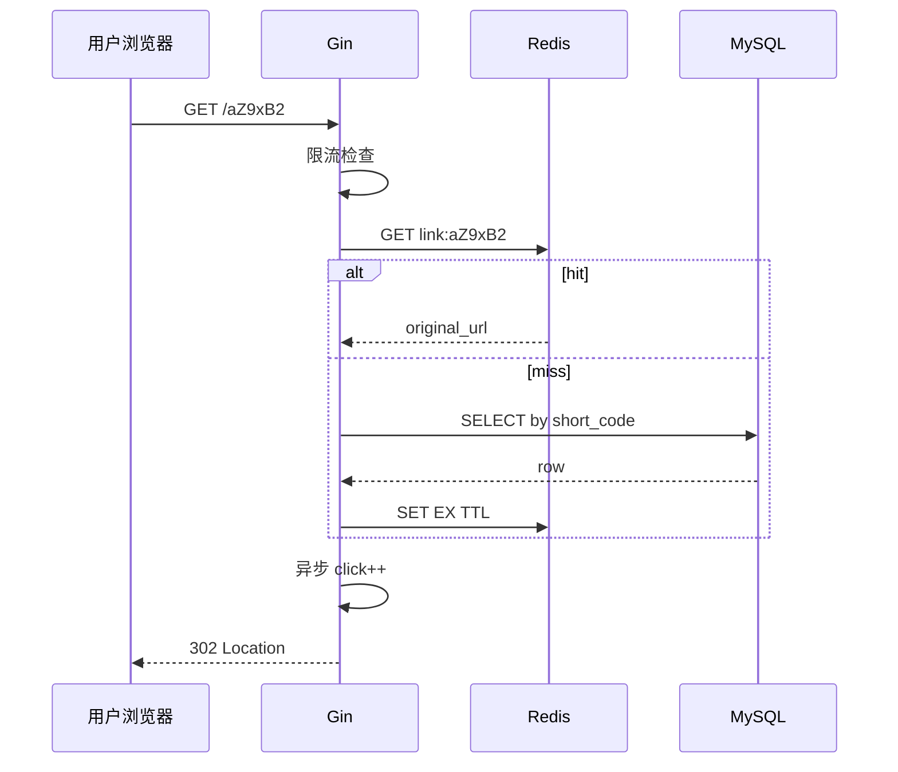

# 短链服务项目实战（下）

<!-- 修改说明: 2026-07-08 按 EXPANSION-STANDARD 新建 §0、跳转/限流/统计/wrk、FAQ≥10 -->

> **文件编码**：UTF-8。  
> **定位**：Go 后端路线 **Capstone 下半**——302 跳转、Redis Cache Aside、IP 限流、点击统计、wrk 压测，完成读路径闭环。  
> **设计对照**：[系统设计 08 短链服务设计](../系统设计/08-短链服务设计.md)、[02 限流熔断](../系统设计/02-限流熔断与降级.md)。  
> **前置**：[10 短链项目上](./10-短链服务项目实战上.md)、[08 Redis](./08-Redis与go-redis缓存实战.md)。

---

## 0. 读前导读（零基础也能跟上）

### 0.1 用一句话弄懂本章

**一句话**：用户点短链 → **302 跳转**到长链；读路径 **Redis 优先**；恶意刷接口 **限流**；点击数 **异步 +1**；最后用 **wrk** 看 QPS。

**生活类比**：短链是「总台登记处」（302 每次登记 PV）；Redis 是「门口缓存牌」；限流是「同一 IP 每分钟最多问 100 次路」。

---

### 0.2 你需要提前知道什么

| 水平 | 建议 |
|------|------|
| 完成 10 章 | 本章在已有项目上增量开发 |
| 读过系统设计 08 §7 | 理解 301 vs 302 |
| Linux 会装 wrk | §6 压测 |

---

### 0.3 本章知识地图（学完后应能勾选全部 ☐→☑）

- [ ] `GET /:code` 返回 302 Location
- [ ] Cache Aside 读路径（08 章实现落地）
- [ ] IP 滑动窗口/固定窗口限流
- [ ] 点击数 Redis INCR + 异步落库
- [ ] 能解释为何用 302 不用 301
- [ ] wrk 跑通并记录 QPS/latency
- [ ] 闭卷自测 ≥ 8/10

---

### 0.4 建议学习时长与节奏

| 阶段 | 时间 | 内容 |
|------|------|------|
| 302 跳转 | 0.5 天 | §1～§2 |
| Redis 缓存 | 1 天 | §3 |
| 限流 | 0.5 天 | §4 |
| 统计 | 1 天 | §5 |
| wrk 压测 | 0.5 天 | §6 |
| 自测 | 0.5 天 | FAQ + 闭卷 |

---

### 0.5 学完本章你能做什么

1. 浏览器访问 `http://localhost:8080/aZ9xB2` 跳到原站。
2. 第二次跳转 redis-cli `GET link:aZ9xB2` 命中。
3. 同一 IP 狂刷跳转触发 429。
4. `click_count` 增加；wrk 报告 QPS（本机参考值）。

---

### 0.6 读路径总览

| 步骤 | 动作 | 预期 |
|------|------|------|
| 1 | 创建短链（10 章） | 有 code |
| 2 | `curl -I localhost:8080/{code}` | `302` + `Location` |
| 3 | redis-cli `GET link:{code}` | 原 URL |
| 4 | 查 DB `click_count` 或 Redis 计数 | 递增 |

---

## 本章与上一章的关系

10 章 **写路径**（创建）；11 章 **读路径**（跳转）——短链服务 QPS 大头在读。



| 上一章（10） | 本章（11） | 后续 |
|--------------|------------|------|
| 创建短链 | 跳转+缓存+限流 | 部署 [Java 09 Linux](../Java/09-LinuxDockerNginx部署基础.md) |

---

## 1. 302 跳转 Handler

[系统设计 08](../系统设计/08-短链服务设计.md)：**商业短链选 302**——每次经服务端，PV 可统计；301 会被浏览器/CDN 缓存导致漏计。

```go
func (h *LinkHandler) Redirect(c *gin.Context) {
	code := c.Param("code")
	if len(code) == 0 || len(code) > 16 {
		c.JSON(404, response.Result{Code: 404, Msg: "not found"})
		return
	}

	ctx := c.Request.Context()
	url, err := h.cache.GetOriginalURL(ctx, code)
	if err != nil || url == "" {
		c.JSON(404, response.Result{Code: 404, Msg: "not found"})
		return
	}

	// 异步统计，不阻塞跳转
	go h.stats.RecordClick(context.Background(), code)

	c.Redirect(http.StatusFound, url) // 302
}
```

### 1.1 301 vs 302

| 码 | 行为 | 统计 | SEO |
|----|------|------|-----|
| 301 | 永久，客户端缓存 | 易漏 PV | 权重转目标 |
| 302 | 临时，常回源 | 利于统计 | 短链常用 |

### 1.2 路由注册

```go
// 注意：/:code 放最后，避免吞 /api/*
r.GET("/:code", linkH.Redirect)
```

**冲突**：`/health` 等固定路由须在 `/:code` 之前注册。

---

## 2. Cache Aside 落地（复习 08）

```go
// internal/service/link_cache.go — 与 08 章一致
func (c *LinkCache) GetOriginalURL(ctx context.Context, code string) (string, error) {
	key := "link:" + code
	val, err := c.rdb.Get(ctx, key).Result()
	if err == nil {
		if val == "" {
			return "", ErrNotFound // 空值防穿透
		}
		return val, nil
	}
	if !errors.Is(err, redis.Nil) {
		return "", err
	}
	link, err := c.repo.GetByShortCode(ctx, code)
	if err != nil {
		return "", err
	}
	if link == nil {
		_ = c.rdb.Set(ctx, key, "", 5*time.Minute).Err()
		return "", ErrNotFound
	}
	_ = c.rdb.Set(ctx, key, link.OriginalURL, 24*time.Hour).Err()
	return link.OriginalURL, nil
}
```

10 章创建时可 **预热**：`SET link:{code} {url}`，首次跳转即 hit。

---

## 3. IP 限流

对照 [系统设计 02 限流](../系统设计/02-限流熔断与降级.md)：跳转接口匿名、高 QPS，需防刷。

### 3.1 固定窗口计数（简单）

```go
func RateLimitByIP(rdb *redis.Client, limit int, window time.Duration) gin.HandlerFunc {
	return func(c *gin.Context) {
		ip := c.ClientIP()
		key := fmt.Sprintf("rl:ip:%s:%d", ip, time.Now().Unix()/int64(window.Seconds()))
		n, err := rdb.Incr(c.Request.Context(), key).Result()
		if err != nil {
			c.Next()
			return
		}
		if n == 1 {
			rdb.Expire(c.Request.Context(), key, window)
		}
		if n > int64(limit) {
			response.Fail(c, 429, "请求过于频繁")
			c.Abort()
			return
		}
		c.Next()
	}
}
```

挂载：

```go
r.GET("/:code", middleware.RateLimitByIP(rdb, 100, time.Minute), linkH.Redirect)
```

| 参数 | 建议 |
|------|------|
| 跳转 | 100 次/分钟/IP |
| 登录 | 10 次/分钟/IP |

**局限**：窗口边界突发；进阶用 **滑动窗口** 或 `github.com/ulule/limiter/v3`。

---

## 4. 点击统计

### 4.1 设计选择

| 方案 | 优点 | 缺点 |
|------|------|------|
| 同步 UPDATE | 精确 | 拖慢 302 |
| Redis INCR + 定时落库 | 快 | 最终一致 |
| MQ 异步 | 解耦 | 组件多 |

实习推荐：**Redis INCR + 定时批量写 MySQL**。

### 4.2 实现

```go
type StatsService struct {
	rdb  *redis.Client
	repo *repository.LinkRepository
}

func (s *StatsService) RecordClick(ctx context.Context, code string) {
	key := "stats:click:" + code
	_ = s.rdb.Incr(ctx, key).Err()
}

// 后台 goroutine 每分钟同步
func (s *StatsService) StartFlushLoop(ctx context.Context) {
	ticker := time.NewTicker(time.Minute)
	go func() {
		for {
			select {
			case <-ticker.C:
				s.flushAll(ctx)
			case <-ctx.Done():
				return
			}
		}
	}()
}

func (s *StatsService) flushAll(ctx context.Context) {
	// SCAN stats:click:* 或维护 code 集合
	// GET delta → UPDATE short_links SET click_count = click_count + ? 
}
```

**注意**：`go RecordClick` 用独立 `context.Background()`，避免请求结束 cancel；生产用 worker 池控制 goroutine 数。

### 4.3 查询统计

`GET /api/v1/links/mine` 返回 `click_count`；管理端可加 `GET /api/v1/links/:code/stats`（鉴权+归属校验）。

---

## 5. 布隆过滤器（可选）

恶意随机 code 打穿 DB → 见 [系统设计 08 §9](../系统设计/08-短链服务设计.md)。创建时 `bloom.Add`，跳转前 `Test` 为 false 则 404。实习空值缓存已够用。

---

## 6. wrk 压测

### 6.1 安装

```bash
# Ubuntu/Debian
sudo apt install wrk
# macOS
brew install wrk
# Windows 可用 WSL
```

### 6.2 压跳转路径

先创建短链得到 `abc12X`，再：

```bash
wrk -t4 -c100 -d30s --latency "http://127.0.0.1:8080/abc12X"
```

| 参数 | 含义 |
|------|------|
| -t4 | 4 线程 |
| -c100 | 100 并发 |
| -d30s | 30 秒 |
| --latency | 延迟分布 |

### 6.3 读结果

```
Requests/sec:  15234.56
Latency Distribution
  50%    3.21ms
  99%   28.45ms
```

**本机参考**：无缓存 vs 有 Redis 对比——Cache 应明显提升 QPS、降低 P99。

### 6.4 压测注意

| 项 | 说明 |
|----|------|
| 先预热 | 跑 10s 丢弃 |
| 限流 | 压测时临时调高或关限流 |
| MySQL | 热点全在 Redis 时 DB 不应成为瓶颈 |
| `--resolve` | 若走域名 |

```bash
# 对比：冷缓存（换一新 code）与热缓存
wrk -t4 -c50 -d20s "http://127.0.0.1:8080/{code}"
```

---

## 7. 完整读路径错误表

| 现象 | 原因 | 处理 |
|------|------|------|
| 404 全短链 | 路由顺序 /api 被吞 | 固定路由在前 |
| 302 但 Location 空 | cache 返回空串 | 查穿透逻辑 |
| 429 正常用户 | 限流过严 | 调 limit 或加白名单 |
| click 不准 | 异步丢 | 可接受近似；MQ 精确 |
| wrk QPS 极低 | 未命中 Redis | 预热 + 查连接池 |
| 301 误用 | 代码 StatusMovedPermanently | 改 302 |

---

## 8. 项目收尾清单

- [ ] README：架构图、启动步骤、API 表
- [ ] `.gitignore`：`.env`
- [ ] Makefile：`run` / `test` / `compose-up`
- [ ] 健康检查 `GET /health`；生产用 `srv.Shutdown` 优雅关闭

---

## 9. FAQ

**Q1：跳转要鉴权吗？**  
**不要**——短链分享就是要匿名点。

**Q2：302 影响 SEO？**  
短链本身不是 SEO 目标页；长链 SEO 不受影响。

**Q3：Redis 和 DB click 不一致？**  
最终一致；展示可 `max(redis, db)` 或定时对齐。

**Q4：限流 429 用什么 HTTP 码？**  
429 Too Many Requests。

**Q5：ClientIP 可信吗？**  
经 Nginx 需 `X-Real-IP`/`X-Forwarded-For`；Gin `TrustedProxies`。

**Q6：wrk 多少 QPS 算合格？**  
本机 5k～20k 看机器；**对比有/无缓存** 比绝对值重要。

**Q7：要用 CDN 吗？**  
读 QPS 极大时 CDN 缓存 302 会漏统计——商业方案复杂；面试提 [系统设计 08 CDN](../系统设计/08-短链服务设计.md)。

**Q8：短链过期？**  
Model 加 `expires_at`；跳转时校验。

**Q9：HTTPS 短链？**  
生产 Nginx TLS；`BASE_URL` 改 https。

**Q10：goroutine 泄漏？**  
RecordClick 用 pool 或 channel worker。

**Q11：和 Java 10 项目对比？**  
同一 [系统设计 08](../系统设计/08-短链服务设计.md)，栈不同，架构可画同一张图。

**Q12：实习简历怎么写？**  
「Go Gin 短链服务：GORM/MySQL、Redis Cache Aside、JWT、302 跳转、限流、wrk 压测 QPS xxx」。

---

## 10. 练习建议

### 基础

1. 实现 302 + Cache Aside 跳转
2. curl `-I` 验证 Location

### 进阶

3. IP 限流 + 429
4. Redis INCR 点击 + 分钟落库

### 挑战

5. wrk 出报告：冷/热缓存 QPS 对比表
6. 布隆过滤器接跳转路径
7. 写 Dockerfile 多阶段构建二进制

---

## 11. 学完标准

- [ ] GET /:code 302 正确
- [ ] Redis 缓存命中可验证
- [ ] 限流生效
- [ ] 点击统计递增
- [ ] wrk 跑通并解读结果
- [ ] 能画完整架构图（对照系统设计 08）
- [ ] 项目可写进简历

---

## 12. 闭卷自测

1. 为何短链跳转用 302 不用 301？
2. Cache Aside 读路径四步？
3. 限流 key 如何设计？
4. 点击统计为何异步？
5. wrk `-c` 参数含义？
6. 路由 `/:code` 为何要最后注册？
7. 空值缓存防什么？
8. 429 在什么场景返回？
9. 预热缓存何时做？
10. Go 后端路线 06～11 各章一句话？

### 参考答案

1. 302 不缓存，每次经服务端，PV 可统计。
2. GET Redis → miss 查 MySQL → SET TTL → 返回 URL。
3. `rl:ip:{ip}:{window}` INCR+EXPIRE。
4. 不拖慢 302 响应。
5. 并发连接数。
6. 避免吞掉 /api/v1 等前缀。
7. 缓存穿透。
8. 超过限流阈值。
9. 创建短链时或首次 miss 后。
10. 06 Gin；07 GORM；08 Redis；09 JWT；10 创建；11 跳转压测。

---

## 13. 费曼检验

5 分钟：**「用户点击短链到打开原站，后端发生了什么？」**

限流 → Redis GET → miss 则 MySQL → 回填 → 异步 click → 302 Location；对照 [系统设计 08](../系统设计/08-短链服务设计.md) 白板图。

---

## 14. 章节衔接

| 模块 | 链接 |
|------|------|
| 项目上半 | [10 短链项目上](./10-短链服务项目实战上.md) |
| 缓存 | [08 Redis](./08-Redis与go-redis缓存实战.md) |
| 短链设计 | [系统设计 08](../系统设计/08-短链服务设计.md) |
| 限流 | [系统设计 02](../系统设计/02-限流熔断与降级.md) |
| HTTP 基础 | [05 Go HTTP](./05-Go标准库与HTTP基础.md) |
| 部署 | [Java 09 Linux Docker](../Java/09-LinuxDockerNginx部署基础.md) |
| 面试 | [Java 14 场景面试](../Java/14-高频场景设计与面试专题.md) |

**路线收官**：06～11 构成 Go 实习向 **短链全栈后端 MVP**。建议与 [Java 10 项目实战](../Java/10-后端项目实战与面试准备.md) 对照复盘，用同一 [系统设计 08](../系统设计/08-短链服务设计.md) 画架构图，准备 15 分钟项目介绍。

---

*Go 后端路线（06～11）完结。复习入口：[05 Go HTTP 基础](./05-Go标准库与HTTP基础.md)*
