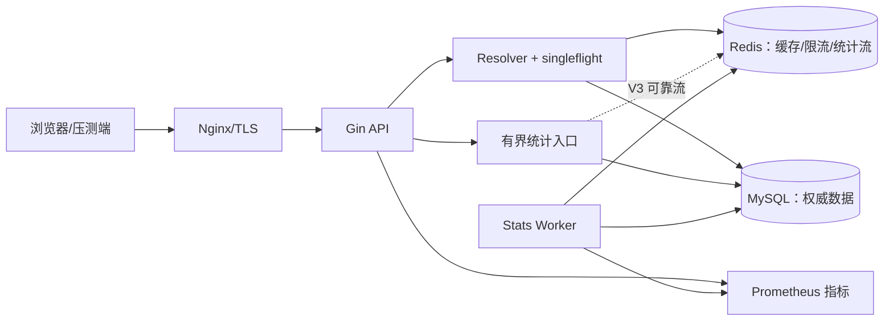
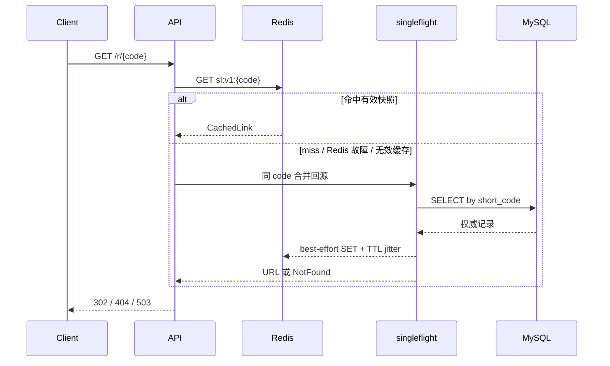
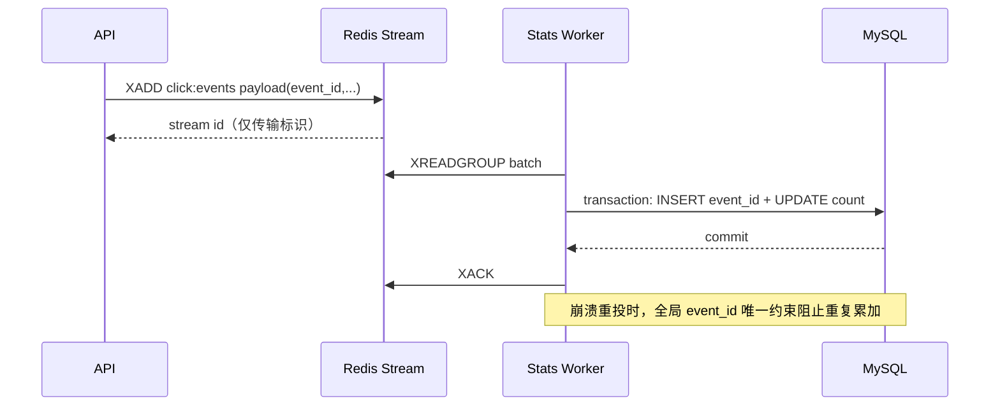

# 短链服务项目实战（下）：把 V1 升级成可证明的简历项目

<!-- 2026-07-14：重构读路径、缓存一致性、Redis 降级、原子限流、统计可靠性、可观测性与真实压测规范。 -->

> **文件编码**：UTF-8。
> **定位**：在 [10 短链服务项目实战（上）](./10-短链服务项目实战上.md) 的完整 V1 上，完成 V2 性能与可靠性闭环及基础实测，再用 V3 的 pprof 优化、可靠流式统计和扩展故障演练拉开差距。
> **设计对照**：[系统设计 08 短链服务设计](../系统设计/08-短链服务设计.md)、[系统设计 02 限流熔断与降级](../系统设计/02-限流熔断与降级.md)。

---

## 0. 本章完成后，项目应该变成什么样

### 0.1 V2 的目标

V1 已保证业务正确；V2 解决五个工程问题：

1. 热门短链不能每次都查 MySQL；
2. Redis 故障不能让所有跳转直接 500；
3. 匿名接口必须原子限流，不能被并发绕过；
4. 点击统计不能为每个请求创建一个无界 goroutine；
5. “性能很好”必须由可复现压测和监控数据证明。

### 0.2 完整架构



仍然保持“一个 API + 一个可选 worker”的小型架构。worker 可以先与 API 同进程运行，完成可靠流式统计后再拆成独立进程；这不等于拆微服务。

### 0.3 V2、V3 边界

| 阶段 | 必做 | 选做 |
|------|------|------|
| V2 | 302、Cache Aside、TTL 抖动、负缓存、`singleflight`、version + outbox 失效、Redis 降级、Lua 原子限流、有界批量统计、CI、Docker、指标、基础故障演练、一份可复现压测报告 | Grafana 看板可根据时间安排 |
| V3 | Redis Streams + 全局 `event_id` 幂等、pprof 优化前后对比、扩展故障演练 | 布隆过滤器、本地二级缓存、OpenTelemetry、热点隔离 |

要写“可靠统计”时必须完成 Redis Stream + 幂等消费；只完成内存队列时，应诚实写“近似点击统计”。

---

## 1. 302 跳转与状态语义

### 1.1 路由

单域名开发环境使用：

```http
GET /r/:code
```

生产使用独立短域名时，可以由 Nginx 把 `https://s.example.com/:code` 转发为应用内部 `/r/:code`。这样 API、健康检查、监控和短码空间不会互相抢路径。

### 1.2 为什么使用 302

| 状态 | 客户端缓存倾向 | 是否便于每次统计 | 本项目用途 |
|------|----------------|------------------|------------|
| 301 | 强，可能长期不再回源 | 否 | 不采用 |
| 302 | 临时跳转，通常回源 | 是 | 默认 |
| 307 | 与 302 类似，但严格保留原请求方法 | 本项目只有 GET，无额外收益 | 可了解 |

响应建议同时设置：

```http
Cache-Control: no-store
Referrer-Policy: no-referrer
Location: https://target.example/path
```

### 1.3 公开接口的状态规则

公开跳转只暴露“可跳转”或“不可跳转”：

- active 且未过期：302；
- 不存在、已删除、disabled、expired：统一 404；
- MySQL 暂时不可用且缓存也无法提供结果：503；
- 被限流：429，并带 `Retry-After`。

统一 404 可以减少短码枚举时的信息泄露。管理 API 仍会向所有者显示真实状态。

### 1.4 Handler 不再创建请求级 goroutine

```go
func (h *RedirectHandler) Redirect(c *gin.Context) {
	code := c.Param("code")
	if !shortcode.IsValid(code) {
		response.WriteError(c, apperror.LinkNotFound())
		return
	}

	target, err := h.resolver.Resolve(c.Request.Context(), code)
	if err != nil {
		response.WriteError(c, err)
		return
	}

	// 非阻塞写入有界入口；不执行 go h.stats.Record(...)
	if ok := h.stats.TryRecord(code, time.Now().UTC()); !ok {
		h.metrics.ClickEventsDropped.Inc()
	}

	c.Header("Cache-Control", "no-store")
	c.Header("Referrer-Policy", "no-referrer")
	c.Redirect(http.StatusFound, target)
}
```

`TryRecord` 的容量、丢失语义和可靠升级在第 4 节明确说明。

---

## 2. 可降级的 Cache Aside

### 2.1 Redis 缓存什么

不要只缓存一个 URL 字符串。缓存快照至少包括：

```go
type CachedLink struct {
	URL       string     `json:"url,omitempty"`
	Status    uint8      `json:"status"`
	ExpiresAt *time.Time `json:"expires_at,omitempty"`
	Version   uint64     `json:"version"`
	NotFound  bool       `json:"not_found,omitempty"`
}
```

Key 统一带 schema 版本：

```text
sl:v1:{short_code}
```

这样以后调整 JSON 格式时可以切换 `sl:v2:`，不必让新代码误读旧缓存。

### 2.2 标准读路径



关键规则：

1. Redis 命中后仍检查 status 和 `expires_at`；
2. Redis `Nil` 才是普通 miss，连接超时、协议错误等要计入 `cache_errors_total`；
3. **Redis 错误时直接回源 MySQL，不返回 500**；
4. MySQL 查询错误不能写负缓存，否则会把临时故障伪装成“不存在”；
5. 缓存 JSON 无法解析时删除坏 key、记录指标并回源；
6. 回填 Redis 失败不影响本次正确响应。

### 2.3 TTL、抖动与过期裁剪

| 数据 | 推荐起点 | 原因 |
|------|----------|------|
| 正缓存 | 6 小时 ± 20% 抖动 | 避免大量 key 同时过期；最终值需压测调整 |
| 负缓存 | 30～90 秒随机 | 防随机短码穿透，又不会长时间挡住刚创建的数据 |
| tombstone | 与正缓存同量级或更长 | 禁用/删除后快速拒绝旧请求 |

正缓存 TTL 必须裁剪到链接剩余寿命：

```text
actualTTL = min(baseTTL + jitter, expires_at - now)
```

若剩余寿命小于等于 0，直接返回 404，不写正缓存。TTL 数字只是初始配置，不是未经测量的“最佳值”。

### 2.4 用 `singleflight` 抑制热点回源

同一实例中，缓存刚失效时可能有数百个请求同时查 MySQL。使用 `golang.org/x/sync/singleflight` 按 code 合并：

```go
type Resolver struct {
	repo        LinkRepository
	cache       LinkCache
	metrics     *Metrics
	group       singleflight.Group
	loadTimeout time.Duration // 从配置注入，并小于 Redirect 总 deadline
}

func (r *Resolver) Resolve(ctx context.Context, code string) (string, error) {
	item, hit, cacheErr := r.cache.Get(ctx, code)
	if cacheErr == nil && hit {
		return resolveCached(item, time.Now())
	}
	if cacheErr != nil {
		r.metrics.CacheErrors.Inc()
	}

	resultCh := r.group.DoChan(code, func() (any, error) {
		// 双重检查：等待前一个请求期间，缓存可能已经被填充。
		cacheCtx, cacheCancel := context.WithTimeout(context.WithoutCancel(ctx), 30*time.Millisecond)
		item, hit, cacheErr := r.cache.Get(cacheCtx, code)
		cacheCancel()
		if cacheErr == nil && hit {
			return resolveCached(item, time.Now())
		}
		if cacheErr != nil {
			r.metrics.CacheErrors.Inc()
		}

		loadCtx, cancel := context.WithTimeout(context.WithoutCancel(ctx), r.loadTimeout)
		defer cancel()

		link, err := r.repo.FindByCode(loadCtx, code)
		if errors.Is(err, domain.ErrLinkNotFound) {
			r.cache.SetNegative(loadCtx, code) // best effort
			return "", domain.ErrLinkNotFound
		}
		if err != nil {
			return "", fmt.Errorf("load link: %w", err)
		}
		if !link.CanRedirect(time.Now()) {
			r.cache.SetSnapshot(loadCtx, link) // 写 disabled/expired 快照
			return "", domain.ErrLinkNotFound
		}

		r.cache.SetSnapshot(loadCtx, link) // best effort
		return link.OriginalURL, nil
	})

	select {
	case result := <-resultCh:
		if result.Err != nil {
			return "", result.Err
		}
		return result.Val.(string), nil
	case <-ctx.Done():
		return "", ctx.Err()
	}
}
```

示例省略了 JSON 编解码和日志细节；`cache.Get` 的三个返回值分别表达快照、是否命中和 Redis 故障。`context.WithoutCancel` 需要 Go 1.21；它避免第一个请求取消后连带终止所有等待者，再用短超时限制回源。`DoChan + select` 让已经取消的等待者立即返回，而共享加载仍可为其他请求完成；`loadTimeout` 必须在构造函数中校验为正数。

`singleflight` 只合并**单实例**请求。多实例仍可能各回源一次；V2 不急着上分布式锁，先依靠 TTL 抖动、正确索引和数据库容量。只有真实压测证明仍有问题，才增加更复杂方案。

### 2.5 写操作如何失效缓存

仅写一句“更新后 DEL”还不完整。存在竞态：

1. 读请求 miss，查到旧 DB 值；
2. 更新事务提交并 DEL；
3. 旧读请求随后把旧值 SET 回 Redis。

V2 推荐策略：

- 每次更新都令 DB `version + 1`；
- 创建/更新/禁用/删除事务同时写一条 `cache_outbox`；
- 提交后先 best-effort 发布最新快照或 tombstone；
- outbox worker 失败重试；
- Redis 通过 Lua 只接受 `incoming.version >= cached.version` 的快照，拒绝旧读回填覆盖新状态。

CAS 写入脚本的核心如下；负缓存使用 `version=0`，真实链接从 `version=1` 开始：

```lua
-- KEYS[1] = cache key, ARGV[1] = snapshot JSON, ARGV[2] = TTL milliseconds
local incoming = cjson.decode(ARGV[1])
local raw = redis.call("GET", KEYS[1])
if raw then
    local ok, current = pcall(cjson.decode, raw)
    if not ok then
        redis.call("DEL", KEYS[1])
        return -1
    elseif tonumber(current.version) > tonumber(incoming.version) then
        return 0
    end
end
redis.call("SET", KEYS[1], ARGV[1], "PX", ARGV[2])
return 1
```

返回值约定：`1` 已写入，`0` 被更高 version 拒绝，`-1` 发现并删除了损坏缓存。本次遇到 `-1` 时不要立刻用可能已经过时的读快照覆盖；读路径可直接返回刚从 DB 得到的正确结果但跳过回填，outbox 则保留事件并重试。这样“修复毒缓存”不会破坏 version 防旧值覆盖的目标。

新增迁移：

```sql
CREATE TABLE cache_outbox (
    id             BIGINT UNSIGNED NOT NULL AUTO_INCREMENT,
    aggregate_id   BIGINT UNSIGNED NOT NULL,
    short_code     VARCHAR(32) CHARACTER SET ascii COLLATE ascii_bin NOT NULL,
    aggregate_ver  BIGINT UNSIGNED NOT NULL,
    event_type     VARCHAR(32) CHARACTER SET ascii COLLATE ascii_bin NOT NULL,
    payload        JSON NOT NULL,
    attempts       INT UNSIGNED NOT NULL DEFAULT 0,
    next_retry_at  DATETIME(3) NOT NULL DEFAULT CURRENT_TIMESTAMP(3),
    claimed_by     VARCHAR(64) CHARACTER SET ascii COLLATE ascii_bin NULL,
    claimed_until  DATETIME(3) NULL,
    processed_at   DATETIME(3) NULL,
    created_at     DATETIME(3) NOT NULL DEFAULT CURRENT_TIMESTAMP(3),
    PRIMARY KEY (id),
    UNIQUE KEY uk_cache_outbox_version (aggregate_id, aggregate_ver),
    KEY idx_cache_outbox_pending (processed_at, next_retry_at, claimed_until, id)
) ENGINE=InnoDB DEFAULT CHARSET=utf8mb4;
```

多 worker 的领取分两步：短事务用 `SELECT ... FOR UPDATE SKIP LOCKED` 选出未处理且租约已过期的事件，写入 `claimed_by/claimed_until` 后立即提交；随后才调用 Redis，不能拿着 DB 行锁等待网络。CAS 成功或发现缓存已有更高 version 后，worker 用 `WHERE claimed_by=?` 标记 processed；失败则增加 `attempts`、计算有上限的指数退避、清除租约。worker 崩溃后其他实例可在 `claimed_until` 到期后重新领取，超过阈值必须告警。

| 业务操作 | DB 提交后的缓存动作 |
|----------|----------------------|
| 创建 | 写 active 快照，替换可能存在的负缓存 |
| 更新 URL/过期时间 | 写更高 version 的新快照 |
| 禁用 | 写更高 version 的 disabled tombstone |
| 启用 | 写更高 version 的 active 快照 |
| 删除 | 写更高 version 的 deleted tombstone；不释放 code |

**边界必须写进 README**：MySQL 已提交但 Redis 和 outbox worker 同时不可用时，旧缓存可能在 outbox 恢复或 TTL 到期前继续生效。当前项目选择“跳转可用性优先 + 最终失效”。如果业务要求封禁立即生效，就必须让跳转额外查询强一致的撤销信息或在控制面不可用时拒绝服务，代价是更高延迟/更低可用性。

### 2.6 Redis 故障矩阵

| 功能 | Redis 故障时的策略 | 用户可见结果 |
|------|--------------------|--------------|
| 创建/管理链接 | 正确性依赖 MySQL；缓存写进入 outbox 重试 | 正常或因 MySQL 故障失败 |
| 跳转读取 | 短超时后回源 MySQL | 通常仍 302，延迟和 DB 压力上升 |
| 负缓存/`singleflight` | `singleflight` 仍在本实例有效 | 随机 code 会增加 DB 查询 |
| 限流 | 按接口采用本地后备或 fail-open/fail-closed | 见第 3 节 |
| 近似统计 | 队列满或 Redis 不可用时丢弃并计数 | 跳转正常，统计少记 |
| Stream 统计 | XADD 失败时按可用性策略丢弃并告警 | 已入流事件可靠，未入流事件可能少记 |

Redis 客户端必须设置较短连接/命令超时，并对错误日志采样；否则 Redis 故障时，回源逻辑本身会被长时间等待拖垮。

---

## 3. 原子限流

### 3.1 为什么原来的 `INCR` + `EXPIRE` 不够

把两个命令分开发送时，进程可能在 `INCR` 后、`EXPIRE` 前退出，留下永不过期的限流 key。使用 Lua 让计数与首次设置 TTL 在 Redis 内原子执行。

### 3.2 V2：Lua 固定窗口

```lua
-- KEYS[1] = rate-limit base key
-- ARGV[1] = window milliseconds, ARGV[2] = limit
local window_ms = tonumber(ARGV[1])
local limit = tonumber(ARGV[2])
if not window_ms or not limit or window_ms <= 0 or limit <= 0 then
    return redis.error_reply("invalid limiter configuration")
end

-- 使用 Redis TIME，避免多个 App 实例因本机时钟偏差落入不同窗口。
local t = redis.call("TIME")
local now_ms = tonumber(t[1]) * 1000 + math.floor(tonumber(t[2]) / 1000)
local window_id = math.floor(now_ms / window_ms)
local state = redis.call("HMGET", KEYS[1], "window", "count")

local current
if tonumber(state[1]) ~= window_id then
    current = 1
    redis.call("HSET", KEYS[1], "window", window_id, "count", current)
else
    current = redis.call("HINCRBY", KEYS[1], "count", 1)
end

local retry_after_ms = (window_id + 1) * window_ms - now_ms
redis.call("PEXPIRE", KEYS[1], window_ms * 2)
return {current, retry_after_ms, limit}
```

应用用一次 `EVALSHA` 传入窗口长度和 limit，根据返回的 `current` 判断是否超限，并检查返回数组长度/类型。返回 429 时设置：

```http
Retry-After: <向上取整的剩余秒数>
X-RateLimit-Limit: 100
X-RateLimit-Remaining: 0
```

固定窗口仍有边界突发，但“算法局限”和“命令不原子”是两个问题。V2 先把原子性做对；V3 若压测或业务确实需要，再实现 Lua 令牌桶/滑动窗口。

### 3.3 Key 和真实客户端 IP

```text
rl:v1:{route}:{sha256(normalized_ip)}
```

- 不把完整 IP 长期写入业务日志和指标标签；
- Gin 只信任明确配置的 Nginx/负载均衡器地址，不能信任任意来源的 `X-Forwarded-For`；
- IPv4、IPv6 先规范化；
- route 标签必须是低基数模板，如 `redirect`、`login`，不能直接用短码。

### 3.4 Redis 故障时不能“一律放行”

| 接口 | 推荐降级策略 | 原因 |
|------|--------------|------|
| 公开跳转 | fail-open，并启用每实例本地令牌桶作为应急保护 | 优先保证链接可访问 |
| 登录/注册 | 本地更严格限流；风险场景可直接 503 | 防密码爆破和批量注册 |
| 创建短链 | 本地按用户 + IP 限流 | 已有 JWT，可限制滥用 |

本地限流只在单实例内有效，扩容后总额度会上升，所以它是 Redis 故障时的后备，不是分布式限流替代品。降级发生次数必须有指标和告警。

---

## 4. 点击统计：先消灭无界 goroutine，再选择一致性

### 4.1 禁止的实现

```go
// 不要这样做：每个请求创建一个 goroutine，数量无上限，关机也无法可靠等待。
go stats.RecordClick(context.Background(), code)
```

高并发时它可能导致 goroutine、Redis 连接、内存和调度压力一起上涨；请求结束后也没有统一的背压、重试和关闭语义。

### 4.2 V2 基础版：有界内存队列

```go
type ClickEvent struct {
	Code string
	At   time.Time
}

type ClickCollector struct {
	queue chan ClickEvent
	// metrics、MySQL repository、WaitGroup 等省略
}

func NewClickCollector(capacity int) *ClickCollector {
	return &ClickCollector{queue: make(chan ClickEvent, capacity)}
}

func (c *ClickCollector) TryRecord(code string, at time.Time) bool {
	select {
	case c.queue <- ClickEvent{Code: code, At: at}:
		return true
	default:
		return false
	}
}
```

应用启动时只创建固定数量 worker（初始 1～4 个，最终由压测决定），在内存中按 code 合并，再用一个 MySQL 事务批量执行 `click_count = click_count + delta`。为让“提交结果未知后的重试”不重复累计，每批先生成稳定的 `batch_id`：

```sql
CREATE TABLE processed_click_batches (
    batch_id      CHAR(36) CHARACTER SET ascii COLLATE ascii_bin NOT NULL,
    processed_at  DATETIME(3) NOT NULL DEFAULT CURRENT_TIMESTAMP(3),
    PRIMARY KEY (batch_id),
    KEY idx_processed_click_batch_time (processed_at)
) ENGINE=InnoDB DEFAULT CHARSET=utf8mb4;
```

worker 在同一事务中先普通 `INSERT processed_click_batches(batch_id)`；只有首次插入成功才按 code 批量更新 `short_links.click_count`。若明确命中 duplicate key，说明该 batch 已提交，可跳过累加；其他 SQL 错误必须回滚，不能用宽泛 `INSERT IGNORE` 吞掉数据问题。DB 超时或返回结果不确定时，用**同一个** batch id 重试；若第一次其实已提交，唯一键会让重试跳过累加。关闭顺序：

`processed_click_batches` 的清理周期必须长于 collector 的最大重试和故障恢复窗口；清得过早会让旧 batch 在人工重试时再次累计。清理任务本身要分批执行并监控表大小。

1. HTTP server 停止接收新请求；
2. 等待在途 Handler 完成；
3. collector 在限定时间内排空队列并 flush；
4. 超时后记录未处理数量，再关闭 MySQL。

必须明确这个版本的语义：

- 队列满：事件丢失，`click_events_dropped_total` 增加；
- 进程崩溃：尚未进入 MySQL 事务的内存事件丢失；
- 事务结果未知但进程仍存活：相同 batch id 可安全重试；
- 进程在未提交事务后崩溃：该内存 batch 无持久副本，仍可能少记；
- 因此它只能叫 **近似统计**，不能声称 exactly-once。

这种边界对于“跳转可用性优先、统计允许少量误差”的练习项目是可以接受的，前提是监控和 README 诚实说明。

### 4.3 V3 默认增强：Redis Streams + 全局 `event_id` 幂等消费

V3 与第 14 章默认采用 Redis Streams。每次真实点击在发布前生成全局 `event_id`（UUIDv7/ULID），同一事件的发布重试、pending 重领和 DLQ 重放都保持不变；Redis stream id 只用于传输层 ACK，不能充当业务幂等键。

```go
type ClickEvent struct {
	EventID      string    `json:"event_id"`
	SchemaVersion int      `json:"schema_version"`
	ShortCode    string    `json:"short_code"`
	OccurredAt   time.Time `json:"occurred_at"` // UTC
}
```

可靠链路如下：



新增表：

```sql
CREATE TABLE click_event_dedup (
    event_id     BINARY(16) NOT NULL,
    short_code   VARCHAR(32) CHARACTER SET ascii COLLATE ascii_bin NOT NULL,
    occurred_at  DATETIME(3) NOT NULL,
    processed_at DATETIME(3) NOT NULL DEFAULT CURRENT_TIMESTAMP(3),
    PRIMARY KEY (event_id),
    KEY idx_click_event_processed (processed_at),
    KEY idx_click_event_code_time (short_code, occurred_at)
) ENGINE=InnoDB DEFAULT CHARSET=utf8mb4;
```

`BINARY(16)` 要求应用把 UUIDv7/ULID 解析为固定 16 字节；若直接保存文本，应把字段明确改成 `CHAR(36)` UUID 或 `CHAR(26)` ULID。

worker 每批处理：

1. `XREADGROUP` 读取一批消息；
2. 开 MySQL 事务；
3. 对全局 `event_id` 执行普通 INSERT；duplicate key 视为已处理，其他错误回滚，只把首次插入成功的消息按 code 聚合；
4. `UPDATE short_links SET click_count = click_count + ?`；
5. 提交后 `XACK`；
6. worker 崩溃后用 `XAUTOCLAIM` 取回超时 pending 消息。

临时错误使用有最大次数、总 deadline 和 jitter 的指数退避；超过上限的 poison message 写入 `click:events:dlq`，只有 DLQ 写入成功后才 ACK 原消息。DLQ 必须有 lag/数量告警、查看方式和修复后重放命令，不能把“进入 DLQ”当作处理完成。

这实现的是：**消息成功进入 Stream 之后，消费可重试且不会因重投重复累加**。全局 `event_id` 在更换 stream key、切换 broker 或人工重放时仍有效。它仍有必须公开的边界：

- API 的 `XADD` 超时或 Redis 故障时，为保证 302 可用，本项目允许丢弃并计数；
- Redis AOF/复制配置决定主机级故障时可能丢多少已确认消息；
- `MAXLEN` 太小会裁掉未消费消息，必须根据最大可容忍 worker 停机时间计算并监控 consumer lag；
- `click_event_dedup` 只能在消息已不可能重投后清理。

本地 compose 已为 Redis `/data` 挂载持久卷；真正把 Stream 称为“可靠”之前，还要记录 AOF 策略、持久卷、复制/备份和恢复演练。开发环境可以与缓存共用 Redis；正式展示可靠统计时应使用独立实例，或至少使用不会淘汰 Stream 的 `noeviction` 策略和容量告警。容器内开启 AOF 但没有持久卷，重建容器仍会丢掉整个 Stream。

如果改为“先进入有界内存队列，再批量 XADD”，吞吐可能更高，但进程崩溃会丢掉尚未入流的数据。选择哪种模式要由真实压测和统计精度目标决定，并在 ADR 中写清。

第 1 节 Handler 展示的是 V2 有界队列模式。切换到 V3 Stream 模式时，把 recorder 实现替换为带短超时的同步 `XADD`；`event_id` 在第一次 publish 前生成，任何重试都复用它。成功则返回，超时/故障则尝试有界本地 fallback；fallback 满时增加 drop 指标并继续 302，仍然不能为请求单独启动 goroutine。

### 4.4 统计查询语义

`GET /api/v1/links/:id/stats` 必须做 JWT 和所有者校验。建议返回：

```json
{
  "code": "OK",
  "data": {
    "click_count": 1234,
    "as_of": "2026-07-14T08:30:00Z",
    "processing_lag_ms": 420
  }
}
```

`click_count` 表示 MySQL 已确认累计值，可能落后于刚发生的点击。不要用没有严格含义的 `max(redis, db)` 冒充精确值。

---

## 5. 可观测性与健康检查

### 5.1 结构化日志

每条请求日志至少包含：

- `request_id`、method、route template、status、latency；
- 认证后的 `user_id`（可哈希/脱敏）；
- 错误业务码和内部错误类型；
- cache result：hit/miss/degraded；
- 不记录 JWT、密码、完整原始 URL query 等敏感数据。

短码不能直接作为 Prometheus label，否则会制造高基数；排障时可进入采样日志。

### 5.2 Prometheus 指标

至少实现：

```text
http_requests_total{route,method,status}
http_request_duration_seconds{route,method}
link_cache_requests_total{result="hit|miss|negative|error"}
link_cache_fill_total{result}
link_singleflight_shared_total
rate_limit_decisions_total{route,result="allow|reject|degraded"}
click_events_total{result="accepted|dropped"}
click_queue_depth
click_stream_consumer_lag
click_flush_duration_seconds
db_query_duration_seconds{operation}
outbox_pending_events
```

### 5.3 健康检查

| Endpoint | 含义 | 判定 |
|----------|------|------|
| `/livez` | 进程是否存活 | 不访问外部依赖 |
| `/readyz` | 是否能承接核心流量 | MySQL 必须可用；Redis 故障返回 degraded 信息但可按部署策略保持 ready |
| `/metrics` | Prometheus 抓取 | 生产限制网络访问 |

Redis 是可降级依赖，因此“Redis ping 失败就让所有实例被负载均衡摘除”可能放大故障。readiness 策略要与降级设计一致。

### 5.4 pprof

只在内网或鉴权后开放 `/debug/pprof`。压测优化必须保存：

- 优化前后的 CPU、heap profile；
- 对应 Git commit 和配置；
- 你观察到的热点、修改内容和回归测试；
- 相同环境下的复测结果。

---

## 6. 测试与故障演练

### 6.1 V2 必测场景

**缓存**：

- 首次 miss 查 DB，第二次 hit；
- 不存在短码写负缓存；
- Redis 停止后仍能由 MySQL 完成 302；
- 100 个同 code 并发 miss 时，本实例 DB 查询被 `singleflight` 合并；
- TTL 在配置抖动范围内，且不超过链接剩余寿命；
- URL 更新、禁用、删除后，旧缓存最终被高 version 快照/tombstone 替换；
- 旧 version 的延迟回填不能覆盖新 version。

**限流**：

- 高并发下允许数不超过规则定义的窗口上限；
- 第一次计数一定带 TTL；
- 429 有 `Retry-After`；
- 伪造 `X-Forwarded-For` 不能绕过可信代理规则；
- Redis 故障时按不同接口走预定降级策略。

**统计**：

- 内存队列满会丢弃而不是阻塞 302，drop 指标增加；
- 优雅关闭会在 deadline 内排空；
- 不存在任何“每请求一个 goroutine”的路径。

采用 Redis Stream 增强版时再额外验证：

- Stream 消息在 DB commit 前崩溃会重投；
- DB commit 后、XACK 前崩溃不会重复累加；
- 两条不同 stream id 但相同全局 `event_id` 的消息只累计一次；
- poison message 有限重试后进入 DLQ，修复重放仍复用原 `event_id`；
- worker 停止时 lag 告警，恢复后可追平。

### 6.2 故障演练表

| 注入故障 | 期望行为 | 必留证据 |
|----------|----------|----------|
| 停 Redis 2 分钟 | 已有/新短链回源 MySQL；延迟和 DB QPS 上升；限流降级指标出现 | 时间线、指标截图、恢复时间 |
| 停 stats worker | 跳转不受影响；stream lag 上升并告警 | lag 曲线、恢复追平截图 |
| MySQL 只读/断连 | 缓存命中仍可跳转；cache miss 和管理接口 503 | 错误率、日志、恢复结果 |
| 制造旧缓存回填 | CAS 拒绝低 version，禁用状态不被覆盖 | 集成测试日志 |
| 队列灌满 | API 不无限阻塞；drop 指标按预期上升 | 指标和测试结果 |

演练不是手动“看起来没挂”就结束，要写出假设、步骤、实际结果、差异和修复。

---

## 7. CI、构建与部署

### 7.1 CI 最小门禁

每次提交至少执行：

```text
gofmt 检查
go vet ./...
go test ./...
go test -race ./...
空 MySQL 执行 migrations up
构建 API/worker 二进制
构建 Docker 镜像
```

集成测试可由 CI service container 或 Testcontainers 提供 MySQL/Redis。不要因为测试慢就长期跳过并发幂等、Redis 降级和迁移测试。

### 7.2 Docker 与运行身份

Dockerfile 使用多阶段构建：

- builder 固定 Go 大版本并下载依赖；
- `CGO_ENABLED=0`（依赖允许时）构建静态二进制；
- runtime 使用精简镜像和非 root 用户；
- 不把 `.env`、源码、Git 历史复制进运行镜像；
- API 与 worker 使用同一镜像、不同 command，避免两套构建产物漂移。

### 7.3 优雅关闭顺序

1. 收到 SIGTERM 后把实例标记为 not ready；
2. `http.Server.Shutdown` 停止接入并等待在途请求；
3. 停止 collector 接收，按 deadline 排空；
4. worker 完成当前事务，未 ACK 的 Stream 消息留给下次 reclaim；
5. 停止 outbox worker；
6. 最后关闭 Redis、MySQL 和日志 sink。

### 7.4 线上拓扑

简历项目部署一台云主机也可以，但要有：

- Nginx/云负载均衡终止 TLS；
- API 不直接暴露 MySQL/Redis 端口；
- 迁移作为独立发布步骤；
- 配置和密钥通过环境变量/secret 注入；
- 日志轮转、磁盘监控、备份和恢复说明；
- 域名、HTTPS 和可实际访问的演示地址（若成本允许）。

---

## 8. 真实压测：只能写测出来的数据

### 8.1 禁止把示例数字当成果

文档、教程或别人的 `Requests/sec` 都不能写进简历。即使同一台机器，不同 Go 版本、连接池、数据量、统计开关和压测端位置也会让结果完全不同。

正确表述必须能够回答：

- 哪个 commit？
- 什么机器和系统？
- 数据集多大？缓存命中率多少？
- 并发、持续时间、预热和重复次数？
- P95/P99、错误率、CPU、内存、GC、MySQL/Redis 指标是多少？
- 压测客户端是否先到瓶颈？

### 8.2 固定测试环境

每份报告记录：

```text
Date / Git commit:
CPU / cores / memory / OS:
Go version / GOMAXPROCS:
MySQL and Redis version/config:
API replicas and placement:
Load generator machine and network:
Dataset size / active-expired ratio:
DB pool / Redis pool / cache TTL:
Rate limit and stats mode:
```

发布构建，不用 IDE 的 debug 模式：

```bash
go build -trimpath -ldflags="-s -w" -o bin/shortlink-api ./cmd/api
```

### 8.3 测试矩阵

| 场景 | 目的 | 数据与配置 |
|------|------|------------|
| A：DB-only baseline | 建立无缓存基线 | Redis cache 关闭，统计模式固定 |
| B：单热点热缓存 | 测 Redis 命中上限与热点行为 | 一个有效 code，先预热 |
| C：混合流量 | 接近真实访问 | 至少数千 code，包含热点、长尾、404、expired |
| D：Redis 故障 | 验证降级 | 压测中途停止 Redis，观察恢复 |
| E：统计对比 | 衡量统计成本 | stats off / bounded queue / Stream，同条件 |
| F：管理写路径 | 验证幂等与 DB | 创建、更新、禁用混合，不能只压 302 |

每个稳定场景建议：预热至少 30 秒；正式持续至少 60 秒；重复至少 3 次，报告中位数并保留每次原始输出。最终时长应结合机器稳定性调整，而不是机械照抄。

### 8.4 工具命令

单热点 302（wrk 默认不会跟随 Location）：

```bash
wrk -t4 -c100 -d60s --latency http://127.0.0.1:8080/r/<real-code>
```

混合短码、阶段升压、阈值断言和错误率建议使用 k6；固定到项目脚本中，而不是临时手点。压测时可为专用环境配置独立限流额度，但报告必须写明，不能悄悄关闭所有保护后声称是线上能力。

### 8.5 报告模板

所有单元都写清，未测就保留“待实测”，不要填看起来漂亮的数字。

| 场景 | 并发 | QPS | P50 | P95 | P99 | 错误率 | CPU | RSS | Cache hit | DB QPS |
|------|------|-----|-----|-----|-----|--------|-----|-----|-----------|--------|
| DB-only | 待实测 | 待实测 | 待实测 | 待实测 | 待实测 | 待实测 | 待实测 | 待实测 | 0% | 待实测 |
| Hot cache | 待实测 | 待实测 | 待实测 | 待实测 | 待实测 | 待实测 | 待实测 | 待实测 | 待实测 | 待实测 |
| Mixed | 待实测 | 待实测 | 待实测 | 待实测 | 待实测 | 待实测 | 待实测 | 待实测 | 待实测 | 待实测 |
| Redis outage | 待实测 | 待实测 | 待实测 | 待实测 | 待实测 | 待实测 | 待实测 | 待实测 | N/A | 待实测 |

原始文件建议保存：

```text
docs/benchmarks/2026-xx-xx/
├── environment.md
├── wrk-hot-cache.txt
├── k6-mixed.json
├── prometheus-before.png
├── prometheus-during.png
├── cpu-before.pprof
├── cpu-after.pprof
└── report.md
```

### 8.6 pprof 优化闭环

只做一轮真正有证据的优化，也比列十个名词强：

1. 用稳定负载获得 baseline；
2. 采 CPU/heap profile；
3. 找到一个可解释热点，例如 JSON 分配、日志同步、连接池等待；
4. 修改并补回归测试；
5. 相同环境复测；
6. 报告吞吐、P99、CPU/内存变化及副作用。

如果结果没有提升，也如实记录。这仍能证明你会做性能实验，而不是编数字。

---

## 9. V2/V3 最终验收

### 9.1 V2 简历门槛

- [ ] V1 全部验收项仍通过；
- [ ] 302 对 active/disabled/expired/deleted 的行为有测试；
- [ ] Cache Aside 有正缓存、负缓存、TTL 抖动和过期裁剪；
- [ ] Redis 故障会回源 MySQL，并有短超时、指标和故障测试；
- [ ] 热点 miss 使用 `singleflight`，明确其单实例边界；
- [ ] 更新、禁用、删除有 version 化缓存更新及可重试 outbox；
- [ ] 限流的计数与 TTL 由 Lua 原子执行，429 带 `Retry-After`；
- [ ] 点击统计没有每请求无界 goroutine；
- [ ] 近似队列或 Redis Stream 的丢失、重复、重试边界写进 README；
- [ ] CI、Docker、优雅关闭、`/livez`、`/readyz`、`/metrics` 已落地；
- [ ] 至少完成 Redis 故障和 worker 停止两项演练。
- [ ] 至少有一份基础真实压测报告，包含环境、脚本、原始输出、QPS、P95/P99、错误率与资源指标；没有实测就不写数字。

### 9.2 V3 加分项

- [ ] Redis Streams 消费组、全局 `event_id`、`XAUTOCLAIM`、有限重试/DLQ 和 MySQL 幂等消费完整验证；
- [ ] 扩展混合/故障压测，有原始报告和至少三次重复结果；
- [ ] 一次 pprof 优化前后对比；
- [ ] Prometheus + Grafana 看板和至少两条有效告警；
- [ ] 布隆过滤器仅在随机不存在 code 确实造成 DB 压力后再加入；
- [ ] 多实例部署验证本地限流、`singleflight` 和优雅滚动升级的边界；
- [ ] 有公开演示或录屏，并删除/脱敏所有密钥和个人数据。

### 9.3 不要为了关键词硬加

以下内容只有出现真实需求、并能测试其收益时才加入：Kubernetes、Kafka、gRPC、分库分表、多活、复杂 DDD。一个边界清楚、可复现、能故障降级的小系统，比“组件清单型项目”更有说服力。

---

## 10. README、ADR 与面试证据

### 10.1 README 最终结构

```text
1. 项目简介与演示地址
2. V1/V2/V3 功能范围
3. 架构图与关键请求时序图
4. 技术选型及未选方案
5. 数据模型、索引和迁移
6. API/OpenAPI
7. 本地启动、测试、部署
8. 缓存一致性与 Redis 降级
9. 限流与统计一致性边界
10. 可观测性和故障演练
11. 压测环境、原始报告和结论
12. 已知限制与后续计划
```

至少补充这些 ADR：

- 为什么自动码选择随机 Base62；
- 为什么幂等放 MySQL、去重需要显式开关；
- 为什么缓存使用 version + outbox，而不只写一句 DEL；
- 为什么跳转优先可用，统计允许在 Redis 完全不可用时少记；
- V2 有界近似队列的边界，以及 V3 升级 Redis Streams + 全局 `event_id` 的理由和压测依据。

### 10.2 简历描述模板

以下只是句式模板，`X` 必须替换成你亲自测得、能拿出报告的数据；没有数据就删掉数字部分。

```text
• 使用 Go/Gin + MySQL 构建短链服务，完成 JWT 用户体系、链接全生命周期、
  自定义短码、过期控制、乐观锁及基于 Idempotency-Key 的并发幂等创建。

• 为跳转读路径实现 Redis Cache Aside、TTL 抖动、负缓存和 singleflight，
  在 Redis 故障时回源 MySQL；通过 version 化快照与事务 outbox 收敛缓存失效竞态。

• 使用 Lua 实现原子固定窗口限流，并以有界队列/Redis Streams 解耦点击统计；
  通过全局 event_id 唯一约束实现消费幂等，避免消息重投造成重复累计，并明确发布失败时的丢失边界。

• 在【机器配置】上使用【工具与场景】完成可复现压测，实测【QPS/P99/错误率】，
  并通过 pprof 定位【真实瓶颈】，优化后【填真实对比结果】。
```

不能写：

- 未做多副本就写“高可用集群”；
- 只用了 Redis 就写“解决缓存雪崩、击穿、穿透”而没有对应实现和测试；
- 把教程示例 QPS 当成自己的结果；
- 内存 channel 队列却写“消息零丢失”；
- 没有容量测算就写“支持亿级数据”。

### 10.3 15 分钟项目讲解顺序

1. 1 分钟：业务问题和范围；
2. 2 分钟：架构、数据模型、完整 API；
3. 2 分钟：随机短码、自定义码、幂等与去重；
4. 3 分钟：跳转 Cache Aside、`singleflight`、失效竞态和 Redis 降级；
5. 2 分钟：Lua 限流与可信代理；
6. 2 分钟：统计一致性、重试和丢失边界；
7. 2 分钟：真实压测、pprof 和故障演练；
8. 1 分钟：已知限制和下一步。

面试官追问时，优先讲证据和取舍，不要只背组件定义。

---

## 11. 常见问题

**Q1：Redis 挂了为什么还能跳转？**
MySQL 是权威数据源；Redis 命令使用短超时，失败后 Resolver 回源 DB。代价是延迟和 DB 压力上升。

**Q2：`singleflight` 能解决多实例击穿吗？**
不能，它只合并单实例内相同 key。多实例先依靠抖动、索引和容量；有实测瓶颈再考虑分布式协调。

**Q3：为什么负缓存不能写很久？**
随机攻击需要拦截，但过长会挡住刚创建或刚恢复的短码；因此用短 TTL 和抖动。

**Q4：更新后 DEL 一次为什么仍可能读旧值？**
更新前已经回源的请求可能在 DEL 后把旧值写回。version CAS 可拒绝旧快照，outbox 负责失败重试。

**Q5：outbox 是否保证禁用瞬间强一致？**
不能。在 Redis 与 worker 同时故障时仍有失效窗口；项目选择最终失效并公开 TTL/lag 边界。

**Q6：Lua 固定窗口解决了窗口边界突发吗？**
没有。Lua解决 INCR/TTL 原子性；令牌桶或滑动窗口才改善边界突发。

**Q7：有界队列为什么可能少记？**
队列满、进程崩溃或 Redis 写失败都可能丢事件。它的优点是不会让统计拖垮跳转。

**Q8：Redis Stream 就绝对不丢吗？**
不是。成功入流后的消费可通过幂等做到可重试；入流失败、错误持久化配置或过早 trim 仍会丢。

**Q9：为什么 DB commit 后才 XACK？**
先 ACK 后提交时，DB 失败会永久丢消息；提交后 ACK，崩溃只会重投，再由全局 `event_id` 唯一约束防重复。stream id 只是 broker 的传输标识。

**Q10：多少 QPS 才算优秀？**
没有脱离硬件、数据、延迟目标和错误率的统一数字。可复现条件和优化证据比绝对值更重要。

**Q11：布隆过滤器是不是必做？**
不是。负缓存通常已够用；只有监控证明随机不存在 code 仍给 DB 明显压力时再加。

**Q12：V2 做完就一定能写简历吗？**
还要能运行、测试、部署、拿出真实报告并回答故障边界。代码存在不等于项目证据成立。

---

## 12. 闭卷自测

1. Redis `GET` 超时与 `redis.Nil` 在 Resolver 中有什么区别？
2. 正缓存 TTL 为什么要加抖动并裁剪到 `expires_at`？
3. `singleflight` 为什么需要 miss 后双重检查缓存？
4. 更新事务提交后只 DEL 一次存在哪个竞态？
5. version 化缓存和 outbox 分别解决什么问题？
6. Lua 固定窗口比两条 Redis 命令强在哪里，又没解决什么？
7. 为什么不能无条件信任 `X-Forwarded-For`？
8. 有界内存统计在哪些场景会少记或重复？
9. Stream 消费为什么要 `DB commit → XACK`，如何避免重投重复累计？
10. 一份可信压测报告必须包含哪些环境和运行指标？

### 参考要点

1. `Nil` 是正常 miss；超时是依赖故障，要计指标并降级回源。
2. 分散过期时刻，并防止缓存活得比链接本身更久。
3. 等待期间另一个请求可能已填充，避免重复查 DB。
4. 旧回源请求可能在 DEL 后重新写入旧值。
5. version 拒绝旧值覆盖；outbox 保证失败后持续重试最新缓存事件。
6. Lua 保证计数和首次 TTL 原子；固定窗口仍有边界突发。
7. 客户端可伪造，只有可信代理写入的头才能作为来源。
8. 队列满、进程崩溃、Redis 故障会少记；未知执行结果后盲目重试可能重复。
9. 先提交避免 ACK 后 DB 失败丢失；全局 `event_id` 唯一表使重投、换 stream 或人工重放都只累计一次。
10. commit、机器、版本、配置、数据集、场景、预热/时长/次数，以及 QPS、分位延迟、错误率、资源和依赖指标。

---

## 13. 最终费曼检验

用 10 分钟完整回答：

> 一个热门短链的缓存恰好过期，100 个请求同时到来；此时 Redis 又发生短暂超时，随后用户禁用了该链接，而统计 worker 在 DB 提交后、XACK 前崩溃。系统每一步会怎样处理？哪些结果保证正确，哪些只保证最终一致，哪些数据可能丢失？

能把 `singleflight`、MySQL 回源、version/outbox、tombstone、限流降级、Stream 重投和幂等消费连成一条完整故障链，才说明这个项目真正达到了可面试水平。

---

## 14. 路线收官

Go 06～11 的最终成果不再是“会用 Gin、GORM、Redis 的短链 MVP”，而应是：

- 业务生命周期完整；
- 正确性由事务、唯一约束、幂等和权限测试支撑；
- 性能设计有缓存、限流和异步统计，但不隐瞒一致性边界；
- Redis 故障可以降级，后台任务有容量、重试与关闭语义；
- 所有性能结论来自自己的可复现压测与 pprof 证据。

达到第 9 节 V2 门槛后再整理简历；V3 只选择能做完、能测量、能讲清的加分项。
