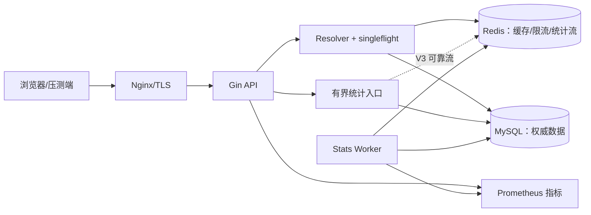
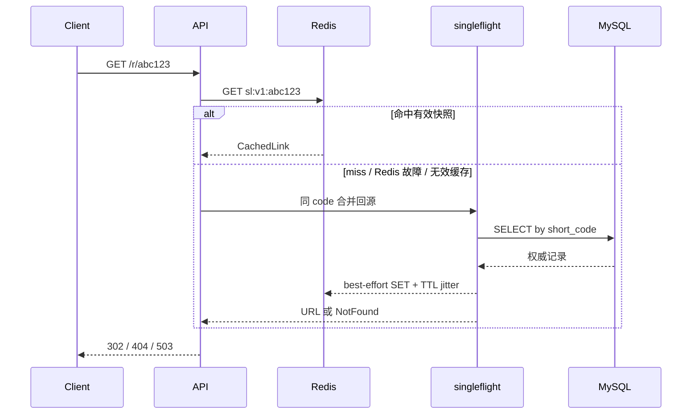
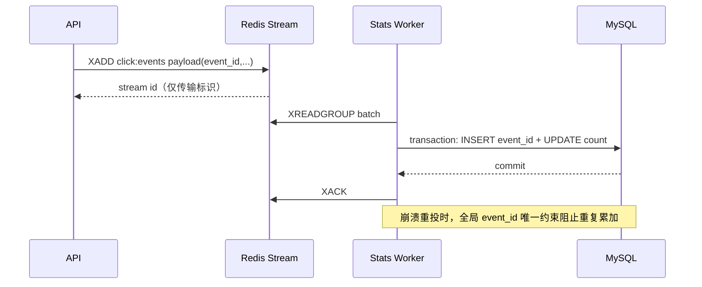

# 短链服务项目实战（下）：把 V1 升级成可证明的简历项目

<!-- 2026-07-14：重构读路径、缓存一致性、Redis 降级、原子限流、统计可靠性、可观测性与真实压测规范。 -->
<!-- 2026-07-26：按审查报告修订。问题修复（9 项）：CAS Lua 结构校验、EVALSHA/NOSCRIPT 降级说明、SKIP LOCKED 版本前提、hash tag 占位符说明、§4.2 关闭顺序段落调序、collector 容量校验、V2/V3 事件结构命名冲突（clickSample/ClickEvent）、第 14 章交叉引用。补齐小节：§0.4 环境前提、§2.7 go-redis 接入、§2.8 缓存层、§2.9 Resolver、§2.10 穿透/击穿/雪崩对照、§3.5 限流与中间件挂载顺序、§4.2 完整 collector、§5.2 指标代码、§6.3 测试工具箱、§7.5 组装与优雅关闭 main、§8.7 连接池调参与 k6/pprof 实操。按整套教程风格约定移除 FAQ/闭卷自测/费曼检验板块（其要点均已在正文对应小节覆盖）。全部 Go 清单与 §6.3 的缓存/限流单元测试在 Go 1.26.5 + go-redis v9.21 + Gin v1.12 + GORM v1.31 + client_golang v1.24 + miniredis v2.38 下编译并通过（含 -race）。 -->
<!-- 2026-07-27：全书去水化统一核查。通读全文确认：FAQ/闭卷自测/费曼检验/知识地图/学习时长/打卡表等充数板块在 2026-07-26 修订中已全部移除且无残留，本轮零删除、代码清单零改动；复核小节编号（0.1～11）连续、全部 § 交叉引用与「见第 N 节」指向有效，无死链接。 -->
<!-- 2026-07-27（对抗性复核）：对照原稿备份逐条核查被删 FAQ/自测条目，补回一处遗漏要点：§4.3 增补「先提交后 XACK」顺序不可颠倒的原因（先 ACK 后提交时 DB 失败会永久丢消息）及 stream id 不能当业务幂等键的解释。其余条目确认均已在正文覆盖；代码清单零改动。 -->

> **文件编码**：UTF-8。
> **定位**：在 [10 短链服务项目实战（上）](./10-短链服务项目实战上.md) 的完整 V1 上，完成 V2 性能与可靠性闭环及基础实测，再用 V3 的 pprof 优化、可靠流式统计和扩展故障演练拉开差距。
> **设计对照**：[系统设计 08 短链服务设计](../系统设计/08-短链服务设计.md)、[系统设计 02 限流熔断与降级](../系统设计/02-限流熔断与降级.md)。

---

## 0. 本章完成后，项目应该变成什么样

### 0.1 V2 的目标

V1 已保证业务正确；V2 解决五个工程问题：

1. 热门短链不能每次都查 MySQL；
2. Redis 故障不能让所有跳转直接 500；
3. 匿名接口必须原子限流，不能被并发绕过；
4. 点击统计不能为每个请求创建一个无界 goroutine；
5. “性能很好”必须由可复现压测和监控数据证明。

### 0.2 完整架构


```mermaid
flowchart LR
    U["浏览器/压测端"] --> N["Nginx/TLS"]
    N --> A["Gin API"]
    A --> SF["Resolver + singleflight"]
    SF --> R[("Redis：缓存/限流/统计流")]
    SF --> M[("MySQL：权威数据")]
    A --> S["有界统计入口"]
    S --> M
    S -. "V3 可靠流" .-> R
    W["Stats Worker"] --> R
    W --> M
    A --> P["Prometheus 指标"]
    W --> P
```

仍然保持“一个 API + 一个可选 worker”的小型架构。worker 可以先与 API 同进程运行，完成可靠流式统计后再拆成独立进程；这不等于拆微服务。

### 0.3 V2、V3 边界

| 阶段 | 必做 | 选做 |
|------|------|------|
| V2 | 302、Cache Aside、TTL 抖动、负缓存、`singleflight`、version + outbox 失效、Redis 降级、Lua 原子限流、有界批量统计、CI、Docker、指标、基础故障演练、一份可复现压测报告 | Grafana 看板可根据时间安排 |
| V3 | Redis Streams + 全局 `event_id` 幂等、pprof 优化前后对比、扩展故障演练 | 布隆过滤器、本地二级缓存、OpenTelemetry、热点隔离 |

要写“可靠统计”时必须完成 Redis Stream + 幂等消费；只完成内存队列时，应诚实写“近似点击统计”。

### 0.4 环境与版本前提

本章代码基线，开工前先对一遍：

| 依赖 | 最低版本 | 本章用到的对应特性 |
|------|----------|--------------------|
| Go | 1.22+ | `context.WithoutCancel`（1.21）、`math/rand/v2`、`range` 整数（1.22） |
| MySQL | **8.0+** | outbox worker 的 `SELECT ... FOR UPDATE SKIP LOCKED` 是 8.0 新语法，5.7 直接报语法错误 |
| Redis | 6.2+（建议 7.x） | `XAUTOCLAIM`（6.2）、Lua 脚本、Streams |
| Gin | v1.10+ | 中间件、`SetTrustedProxies` |
| GORM | v2（gorm.io/gorm） | `WithContext`、`Transaction` |
| go-redis | **v9** | `redis.NewScript` 自动降级、`errors.Is(err, redis.Nil)` |

本章的完整清单都假设 `go.mod` 的 module 名是 `shortlink`（与第 10 章目录一致）；如果你的 module 名不同，把 import 路径里的 `shortlink` 换成你的名字。V2 相比第 10 章新增的依赖，在项目根目录用 PowerShell 执行：

```powershell
go get github.com/redis/go-redis/v9
go get github.com/prometheus/client_golang/prometheus
go get golang.org/x/sync
go get golang.org/x/time                  # 本地应急令牌桶 rate.Limiter（§3.5）
go get github.com/google/uuid
go get github.com/alicebob/miniredis/v2   # 仅测试用（§6.3）
go get github.com/testcontainers/testcontainers-go/modules/mysql   # 可选：集成测试起真 MySQL（§6.3）
```

（`github.com/go-sql-driver/mysql` 在第 10 章已是直接依赖，§4.2 判定 duplicate key 会用到，无需再装。）

本章全部完整清单在 Go 1.26.5 + go-redis v9.21 + Gin v1.12 + GORM v1.31 + client_golang v1.24 + miniredis v2.38 下实际编译，§6.3 的缓存与限流单元测试直接可运行并通过 `-race`；testcontainers 集成测试还需要本机 Docker Desktop。这些库都保持向后兼容，满足上表最低版本即可。

命令行约定：不加说明的命令都在 **Windows PowerShell** 中执行；标注“服务器上”的命令在 Linux/WSL 中执行。特别注意：PowerShell 5.1 里 `curl` 是 `Invoke-WebRequest` 的别名，想用真正的 curl 必须写 `curl.exe`。

---

## 1. 302 跳转与状态语义

### 1.1 路由

单域名开发环境使用：

```http
GET /r/:code
```

生产使用独立短域名时，可以由 Nginx 把 `https://s.example.com/:code` 转发为应用内部 `/r/:code`。这样 API、健康检查、监控和短码空间不会互相抢路径。

### 1.2 为什么使用 302

| 状态 | 客户端缓存倾向 | 是否便于每次统计 | 本项目用途 |
|------|----------------|------------------|------------|
| 301 | 强，可能长期不再回源 | 否 | 不采用 |
| 302 | 临时跳转，通常回源 | 是 | 默认 |
| 307 | 与 302 类似，但严格保留原请求方法 | 本项目只有 GET，无额外收益 | 可了解 |

响应建议同时设置：

```http
Cache-Control: no-store
Referrer-Policy: no-referrer
Location: https://target.example/path
```

### 1.3 公开接口的状态规则

公开跳转只暴露“可跳转”或“不可跳转”：

- active 且未过期：302；
- 不存在、已删除、disabled、expired：统一 404；
- MySQL 暂时不可用且缓存也无法提供结果：503；
- 被限流：429，并带 `Retry-After`。

统一 404 可以减少短码枚举时的信息泄露。管理 API 仍会向所有者显示真实状态。

### 1.4 Handler 不再创建请求级 goroutine

先看核心逻辑（**片段**，属于 `internal/transport/http/handler/redirect.go`，完整可编译版本在本节末尾）。其中 `response`/`apperror`/`shortcode` 是第 10 章定义的包；`h.resolver` 是 §2.9 的 Resolver；`h.stats` 是 §4.2 的 ClickCollector；`h.metrics` 是 §5.2 的指标结构：

```go
func (h *RedirectHandler) Redirect(c *gin.Context) {
	code := c.Param("code")
	if !shortcode.IsValid(code) {
		response.WriteError(c, apperror.LinkNotFound())
		return
	}

	target, err := h.resolver.Resolve(c.Request.Context(), code)
	if err != nil {
		response.WriteError(c, err)
		return
	}

	// 非阻塞写入有界入口；不执行 go h.stats.Record(...)
	if ok := h.stats.TryRecord(code, time.Now().UTC()); !ok {
		h.metrics.ClickEvents.WithLabelValues("dropped").Inc()
	}

	c.Header("Cache-Control", "no-store")
	c.Header("Referrer-Policy", "no-referrer")
	c.Redirect(http.StatusFound, target)
}
```

`TryRecord` 的容量、丢失语义和可靠升级在第 4 节明确说明。

**完整可编译清单**（这个版本把指标改成构造时注入的 `onDrop` 回调，并用接口声明依赖，Handler 因此不需要 import metrics 包，单元测试也更容易注入假实现）：

```go
// internal/transport/http/handler/redirect.go
package handler

import (
	"context"
	"errors"
	"net/http"
	"time"

	"github.com/gin-gonic/gin"

	"shortlink/internal/domain"
)

// LinkResolver 由 §2.9 的 resolver.Resolver 实现。
type LinkResolver interface {
	Resolve(ctx context.Context, code string) (string, error)
}

// ClickRecorder 由 §4.2 的 stats.ClickCollector 实现。
type ClickRecorder interface {
	TryRecord(code string, at time.Time) bool
}

type RedirectHandler struct {
	resolver LinkResolver
	stats    ClickRecorder
	onDrop   func() // 丢弃计数（click_events_total{result="dropped"}）
}

func NewRedirectHandler(resolver LinkResolver, stats ClickRecorder, onDrop func()) *RedirectHandler {
	return &RedirectHandler{resolver: resolver, stats: stats, onDrop: onDrop}
}

// Redirect 与上面的片段逻辑一致。你的项目里应继续用第 10 章的
// response.WriteError/apperror 统一错误体；这里为了清单自包含直接写 JSON。
func (h *RedirectHandler) Redirect(c *gin.Context) {
	code := c.Param("code")
	if !isValidCode(code) {
		c.JSON(http.StatusNotFound, gin.H{"code": "LINK_NOT_FOUND", "message": "link not found"})
		return
	}

	target, err := h.resolver.Resolve(c.Request.Context(), code)
	switch {
	case errors.Is(err, domain.ErrLinkNotFound):
		// 不存在/已删除/disabled/expired 统一 404（§1.3）
		c.JSON(http.StatusNotFound, gin.H{"code": "LINK_NOT_FOUND", "message": "link not found"})
		return
	case err != nil:
		// 缓存与 DB 都无法给出结果
		c.JSON(http.StatusServiceUnavailable, gin.H{"code": "DEPENDENCY_UNAVAILABLE", "message": "service temporarily unavailable"})
		return
	}

	// 非阻塞写入有界入口；绝不 go h.stats.Record(...)（§4.1）
	if ok := h.stats.TryRecord(code, time.Now().UTC()); !ok && h.onDrop != nil {
		h.onDrop()
	}

	c.Header("Cache-Control", "no-store")
	c.Header("Referrer-Policy", "no-referrer")
	c.Redirect(http.StatusFound, target)
}

// isValidCode 与第 10 章 shortcode 包的校验保持一致（Base62、长度 4~32）。
// 项目中应直接复用 shortcode.IsValid。
func isValidCode(code string) bool {
	if len(code) < 4 || len(code) > 32 {
		return false
	}
	for _, ch := range code {
		switch {
		case '0' <= ch && ch <= '9', 'a' <= ch && ch <= 'z', 'A' <= ch && ch <= 'Z':
		default:
			return false
		}
	}
	return true
}
```

服务跑起来后（组装见 §7.5），在 PowerShell 里手动验证 302：

```powershell
# PowerShell 5.1 的 curl 是 Invoke-WebRequest 的别名，必须写 curl.exe。
# curl.exe 默认不跟随跳转，正适合观察 302 响应本身。
curl.exe -i http://127.0.0.1:8080/r/abc123
```

期望输出的第一行是 `HTTP/1.1 302 Found`，并带 `Location:`、`Cache-Control: no-store` 头；换一个不存在的短码应得到 404 的 JSON。

---

## 2. 可降级的 Cache Aside

### 2.1 Redis 缓存什么

不要只缓存一个 URL 字符串。缓存快照至少包括：

```go
type CachedLink struct {
	URL       string     `json:"url,omitempty"`
	Status    uint8      `json:"status"`
	ExpiresAt *time.Time `json:"expires_at,omitempty"`
	Version   uint64     `json:"version"`
	NotFound  bool       `json:"not_found,omitempty"`
}
```

Key 统一带 schema 版本：

```text
sl:v1:<short_code>        # 实际的 key 形如 sl:v1:abc123
```

这样以后调整 JSON 格式时可以切换 `sl:v2:`，不必让新代码误读旧缓存。

注意：`<short_code>`（以及很多资料里写的 `{short_code}`）只是**文档占位符**，实际拼 key 时不含尖括号或花括号。这里特意不用花括号记法，因为在 Redis Cluster 中 key 里的第一对花括号有特殊含义——**hash tag**：`{...}` 内的内容决定 key 被分到哪个 slot。如果照抄花括号，比如把所有限流 key 都拼成 `rl:v1:{redirect}:...`，同一路由的全部 key 会被强制路由到同一个分片，未来迁移 Cluster 时立刻变成热点。只有当你需要多个 key 落在同一分片上执行多 key 原子操作（如 Lua 同时操作两个 key）时，才应刻意使用 hash tag。

### 2.2 标准读路径


```mermaid
sequenceDiagram
    participant C as Client
    participant A as API
    participant R as Redis
    participant S as singleflight
    participant M as MySQL

    C->>A: GET /r/abc123
    A->>R: GET sl:v1:abc123
    alt 命中有效快照
        R-->>A: CachedLink
    else miss / Redis 故障 / 无效缓存
        A->>S: 同 code 合并回源
        S->>M: SELECT by short_code
        M-->>S: 权威记录
        S-->>R: best-effort SET + TTL jitter
        S-->>A: URL 或 NotFound
    end
    A-->>C: 302 / 404 / 503
```

关键规则：

1. Redis 命中后仍检查 status 和 `expires_at`；
2. Redis `Nil` 才是普通 miss，连接超时、协议错误等要计入 `cache_errors_total`；
3. **Redis 错误时直接回源 MySQL，不返回 500**；
4. MySQL 查询错误不能写负缓存，否则会把临时故障伪装成“不存在”；
5. 缓存 JSON 无法解析时删除坏 key、记录指标并回源；
6. 回填 Redis 失败不影响本次正确响应。

### 2.3 TTL、抖动与过期裁剪

| 数据 | 推荐起点 | 原因 |
|------|----------|------|
| 正缓存 | 6 小时 ± 20% 抖动 | 避免大量 key 同时过期；最终值需压测调整 |
| 负缓存 | 30～90 秒随机 | 防随机短码穿透，又不会长时间挡住刚创建的数据 |
| tombstone | 与正缓存同量级或更长 | 禁用/删除后快速拒绝旧请求 |

正缓存 TTL 必须裁剪到链接剩余寿命：

```text
actualTTL = min(baseTTL + jitter, expires_at - now)
```

若剩余寿命小于等于 0，直接返回 404，不写正缓存。TTL 数字只是初始配置，不是未经测量的“最佳值”。

### 2.4 用 `singleflight` 抑制热点回源

同一实例中，缓存刚失效时可能有数百个请求同时查 MySQL。使用 `golang.org/x/sync/singleflight` 按 code 合并。

`singleflight` 是官方扩展库提供的“请求合并”工具：多个 goroutine 用同一个 key 同时调用它时，只有第一个真正执行加载函数，其余全部等待并共享同一份结果。下面是 Resolver 的核心方法（**片段**，属于 `internal/resolver/resolver.go`；`LinkRepository`/`LinkCache` 接口、构造函数和 `resolveCached` 的定义见 §2.9 的完整清单，`cache.Get` 等的具体实现见 §2.8）：

```go
type Resolver struct {
	repo        LinkRepository
	cache       LinkCache
	metrics     *metrics.Metrics // §5.2 的指标结构
	group       singleflight.Group
	loadTimeout time.Duration // 从配置注入，并小于 Redirect 总 deadline
}

func (r *Resolver) Resolve(ctx context.Context, code string) (string, error) {
	item, hit, cacheErr := r.cache.Get(ctx, code)
	if cacheErr == nil && hit {
		return resolveCached(item, time.Now())
	}
	if cacheErr != nil {
		r.metrics.CacheErrors.Inc()
	}

	resultCh := r.group.DoChan(code, func() (any, error) {
		// 双重检查：等待前一个请求期间，缓存可能已经被填充。
		cacheCtx, cacheCancel := context.WithTimeout(context.WithoutCancel(ctx), 30*time.Millisecond)
		item, hit, cacheErr := r.cache.Get(cacheCtx, code)
		cacheCancel()
		if cacheErr == nil && hit {
			return resolveCached(item, time.Now())
		}
		if cacheErr != nil {
			r.metrics.CacheErrors.Inc()
		}

		loadCtx, cancel := context.WithTimeout(context.WithoutCancel(ctx), r.loadTimeout)
		defer cancel()

		link, err := r.repo.FindByCode(loadCtx, code)
		if errors.Is(err, domain.ErrLinkNotFound) {
			r.cache.SetNegative(loadCtx, code) // best effort
			return "", domain.ErrLinkNotFound
		}
		if err != nil {
			return "", fmt.Errorf("load link: %w", err)
		}
		if !link.CanRedirect(time.Now()) {
			r.cache.SetSnapshot(loadCtx, link) // 写 disabled/expired 快照
			return "", domain.ErrLinkNotFound
		}

		r.cache.SetSnapshot(loadCtx, link) // best effort
		return link.OriginalURL, nil
	})

	select {
	case result := <-resultCh:
		if result.Err != nil {
			return "", result.Err
		}
		return result.Val.(string), nil
	case <-ctx.Done():
		return "", ctx.Err()
	}
}
```

示例省略了 JSON 编解码和日志细节；`cache.Get` 的三个返回值分别表达快照、是否命中和 Redis 故障。`context.WithoutCancel` 需要 Go 1.21；它避免第一个请求取消后连带终止所有等待者，再用短超时限制回源。`DoChan + select` 让已经取消的等待者立即返回，而共享加载仍可为其他请求完成；`loadTimeout` 必须在构造函数中校验为正数。

`singleflight` 只合并**单实例**请求。多实例仍可能各回源一次；V2 不急着上分布式锁，先依靠 TTL 抖动、正确索引和数据库容量。只有真实压测证明仍有问题，才增加更复杂方案。

#### 先动手：亲眼看到 100 个并发只查一次库

在接入项目之前，用一个 60 行的独立程序确认 `singleflight` 的效果（**完整可编译清单**，只依赖 `golang.org/x/sync`）：

```go
// cmd/demo-singleflight/main.go
// 运行：go run ./cmd/demo-singleflight
// 预期输出：100 个并发请求，实际执行 DB 查询 1 次
package main

import (
	"context"
	"fmt"
	"sync"
	"sync/atomic"
	"time"

	"golang.org/x/sync/singleflight"
)

var dbQueries atomic.Int64

// slowDBLookup 模拟一次 50ms 的 MySQL 查询。
func slowDBLookup(code string) string {
	dbQueries.Add(1)
	time.Sleep(50 * time.Millisecond)
	return "https://example.com/target-of-" + code
}

func main() {
	var g singleflight.Group
	var wg sync.WaitGroup

	for i := 0; i < 100; i++ {
		wg.Add(1)
		go func() {
			defer wg.Done()
			// DoChan 返回一个 channel；同 key 的并发调用共享第一个函数的结果。
			ch := g.DoChan("abc123", func() (any, error) {
				return slowDBLookup("abc123"), nil
			})

			ctx, cancel := context.WithTimeout(context.Background(), time.Second)
			defer cancel()
			select {
			case res := <-ch:
				_ = res.Val // 真实代码里在这里使用查询结果
			case <-ctx.Done():
				// 等待者可以先走：共享的加载仍会为其他请求完成
			}
		}()
	}
	wg.Wait()
	fmt.Printf("100 个并发请求，实际执行 DB 查询 %d 次\n", dbQueries.Load())
}
```

在 PowerShell 中运行：

```powershell
go run ./cmd/demo-singleflight
```

100 个 goroutine 在同一个 50ms 窗口内涌入，`dbQueries` 却只加了 1——这正是缓存击穿场景（§2.10）需要的效果。这里用 `DoChan` 而不用更简单的 `Do`，是因为 `Do` 是阻塞调用：请求方即使自己的 `context` 已取消也只能干等；`DoChan + select` 让取消的等待者立即返回，而共享加载继续为其他请求服务。

### 2.5 写操作如何失效缓存

仅写一句“更新后 DEL”还不完整。存在竞态：

1. 读请求 miss，查到旧 DB 值；
2. 更新事务提交并 DEL；
3. 旧读请求随后把旧值 SET 回 Redis。

V2 推荐策略：

- 每次更新都令 DB `version + 1`；
- 创建/更新/禁用/删除事务同时写一条 `cache_outbox`；
- 提交后先 best-effort 发布最新快照或 tombstone；
- outbox worker 失败重试；
- Redis 通过 Lua 只接受 `incoming.version >= cached.version` 的快照，拒绝旧读回填覆盖新状态。

CAS 写入脚本的核心如下；负缓存使用 `version=0`，真实链接从 `version=1` 开始：

```lua
-- KEYS[1] = cache key, ARGV[1] = snapshot JSON, ARGV[2] = TTL milliseconds
local incoming = cjson.decode(ARGV[1])
local raw = redis.call("GET", KEYS[1])
if raw then
    local ok, current = pcall(cjson.decode, raw)
    -- 三种情况都算“损坏缓存”：JSON 非法；JSON 合法但不是对象（如 123/null/true）；
    -- 是对象但 version 缺失或不是数字。负缓存 version=0 是合法值，
    -- 所以必须显式判断 nil，不能用 or 短路（0 在 Lua 里是真值，但写成
    -- `local v = ok and tonumber(current.version) or nil` 这类惯用式时，
    -- 一旦以后有人把合法值改成 false/nil 参与运算就会踩坑，显式 if 最稳妥）。
    local cur_ver = nil
    if ok and type(current) == "table" then
        cur_ver = tonumber(current.version)
    end
    if cur_ver == nil then
        redis.call("DEL", KEYS[1])
        return -1
    elseif cur_ver > tonumber(incoming.version) then
        return 0
    end
end
redis.call("SET", KEYS[1], ARGV[1], "PX", ARGV[2])
return 1
```

为什么“结构校验”必须并入损坏处理？只用 `pcall` 保护 `cjson.decode` 是不够的：`decode` 成功不代表结果是我们期望的结构。假如缓存值被别的 bug 写成了 `123`（decode 得到 number，取 `current.version` 会抛 attempt to index a number value）、`null` 或 `true`（索引报错）、或者是缺少 `version` 字段的对象（`tonumber(nil)` 得 nil，`nil > number` 报 attempt to compare nil with number）——这些都会让脚本抛 Lua 运行时错误而不是走“损坏缓存”分支。后果是整条 SET 路径持续报错、outbox 反复重试也无法自愈，恰恰违背了引入 `pcall` 的初衷。上面的写法把“decode 失败、不是 table、version 不是数字”统一判定为损坏：`DEL` 后返回 `-1`，坏数据一次清除。

返回值约定：`1` 已写入，`0` 被更高 version 拒绝，`-1` 发现并删除了损坏缓存。本次遇到 `-1` 时不要立刻用可能已经过时的读快照覆盖；读路径可直接返回刚从 DB 得到的正确结果但跳过回填，outbox 则保留事件并重试。这样“修复毒缓存”不会破坏 version 防旧值覆盖的目标。

在 Go 里执行这段脚本不要手写 `EVALSHA`（脚本未加载或 Redis 重启后会得到 `NOSCRIPT` 错误），用 `redis.NewScript` 让客户端自动处理降级——机制讲解见 §2.7，完整封装见 §2.8 的 `casWrite`。

新增迁移：

```sql
CREATE TABLE cache_outbox (
    id             BIGINT UNSIGNED NOT NULL AUTO_INCREMENT,
    aggregate_id   BIGINT UNSIGNED NOT NULL,
    short_code     VARCHAR(32) CHARACTER SET ascii COLLATE ascii_bin NOT NULL,
    aggregate_ver  BIGINT UNSIGNED NOT NULL,
    event_type     VARCHAR(32) CHARACTER SET ascii COLLATE ascii_bin NOT NULL,
    payload        JSON NOT NULL,
    attempts       INT UNSIGNED NOT NULL DEFAULT 0,
    next_retry_at  DATETIME(3) NOT NULL DEFAULT CURRENT_TIMESTAMP(3),
    claimed_by     VARCHAR(64) CHARACTER SET ascii COLLATE ascii_bin NULL,
    claimed_until  DATETIME(3) NULL,
    processed_at   DATETIME(3) NULL,
    created_at     DATETIME(3) NOT NULL DEFAULT CURRENT_TIMESTAMP(3),
    PRIMARY KEY (id),
    UNIQUE KEY uk_cache_outbox_version (aggregate_id, aggregate_ver),
    KEY idx_cache_outbox_pending (processed_at, next_retry_at, claimed_until, id)
) ENGINE=InnoDB DEFAULT CHARSET=utf8mb4;
```

多 worker 的领取分两步：短事务用 `SELECT ... FOR UPDATE SKIP LOCKED` 选出未处理且租约已过期的事件，写入 `claimed_by/claimed_until` 后立即提交；随后才调用 Redis，不能拿着 DB 行锁等待网络。CAS 成功或发现缓存已有更高 version 后，worker 用 `WHERE claimed_by=?` 标记 processed；失败则增加 `attempts`、计算有上限的指数退避、清除租约。worker 崩溃后其他实例可在 `claimed_until` 到期后重新领取，超过阈值必须告警。

> **版本前提**：`SKIP LOCKED` 和 `NOWAIT` 都是 **MySQL 8.0** 新增语法，5.7 会直接报语法错误——这正是 §0.4 要求 MySQL 8.0+ 的原因之一。§8.2 压测报告模板里的 “MySQL version” 一栏记录的就是这类前提：换个版本，行为可能完全不同。

worker 的参考实现（**完整可编译清单**；`ApplyFunc` 在 §7.5 的 main 里注入为 §2.8 缓存层的 `ApplySnapshotJSON`）：

```go
// internal/outbox/worker.go
package outbox

import (
	"context"
	"errors"
	"time"

	"gorm.io/gorm"
)

// Event 对应 cache_outbox 表的一行（上文迁移）。
type Event struct {
	ID           uint64
	AggregateID  uint64
	ShortCode    string
	AggregateVer uint64
	EventType    string
	Payload      []byte // CachedLink 快照 JSON
	Attempts     uint32
}

// ApplyFunc 把事件应用到 Redis；由 main 注入
// linkCache.ApplySnapshotJSON（内部走上面的 CAS 脚本）。
type ApplyFunc func(ctx context.Context, ev Event) error

type Worker struct {
	db        *gorm.DB
	apply     ApplyFunc
	workerID  string                        // 实例标识，如 hostname-pid
	batchSize int                           // 每轮最多领取多少事件
	lease     time.Duration                 // 租约时长：worker 崩溃后事件多久可被他人重领
	interval  time.Duration                 // 轮询间隔
	onError   func(stage string, err error) // 日志/指标回调，可为 nil
}

func NewWorker(db *gorm.DB, apply ApplyFunc, workerID string,
	batchSize int, lease, interval time.Duration,
	onError func(stage string, err error)) (*Worker, error) {
	if db == nil || apply == nil || workerID == "" {
		return nil, errors.New("outbox: db, apply and workerID are required")
	}
	if batchSize <= 0 || lease <= 0 || interval <= 0 {
		return nil, errors.New("outbox: batchSize/lease/interval must be positive")
	}
	return &Worker{db: db, apply: apply, workerID: workerID,
		batchSize: batchSize, lease: lease, interval: interval, onError: onError}, nil
}

// Run 阻塞轮询直到 ctx 取消；由 main 放进 errgroup（§7.5）。
func (w *Worker) Run(ctx context.Context) {
	ticker := time.NewTicker(w.interval)
	defer ticker.Stop()
	for {
		select {
		case <-ctx.Done():
			return
		case <-ticker.C:
			w.processOnce(ctx)
		}
	}
}

func (w *Worker) processOnce(ctx context.Context) {
	events, err := w.claimBatch(ctx)
	if err != nil {
		w.report("claim", err)
		return
	}
	for _, ev := range events {
		// 每个事件独立短超时：一个 Redis 卡顿不应拖住整批。
		applyCtx, cancel := context.WithTimeout(ctx, 2*time.Second)
		err := w.apply(applyCtx, ev)
		cancel()
		if err != nil {
			w.report("apply", err)
			w.markFailed(ctx, ev)
			continue
		}
		w.markProcessed(ctx, ev)
	}
}

// claimBatch 是“两步领取”的第一步：短事务里 SELECT ... FOR UPDATE
// SKIP LOCKED 选出可处理事件并写租约，立即提交。需要 MySQL 8.0+。
func (w *Worker) claimBatch(ctx context.Context) ([]Event, error) {
	var events []Event
	err := w.db.WithContext(ctx).Transaction(func(tx *gorm.DB) error {
		if err := tx.Raw(`
			SELECT id, aggregate_id, short_code, aggregate_ver, event_type, payload, attempts
			FROM cache_outbox
			WHERE processed_at IS NULL
			  AND next_retry_at <= NOW(3)
			  AND (claimed_until IS NULL OR claimed_until < NOW(3))
			ORDER BY id
			LIMIT ?
			FOR UPDATE SKIP LOCKED`, w.batchSize).Scan(&events).Error; err != nil {
			return err
		}
		if len(events) == 0 {
			return nil
		}
		ids := make([]uint64, 0, len(events))
		for _, ev := range events {
			ids = append(ids, ev.ID)
		}
		return tx.Exec(
			`UPDATE cache_outbox
			 SET claimed_by = ?, claimed_until = NOW(3) + INTERVAL ? SECOND
			 WHERE id IN ?`,
			w.workerID, int(w.lease.Seconds()), ids,
		).Error
	})
	return events, err
}

// markProcessed 带 claimed_by 条件：租约已被他人抢走时不误标记。
func (w *Worker) markProcessed(ctx context.Context, ev Event) {
	err := w.db.WithContext(ctx).Exec(
		"UPDATE cache_outbox SET processed_at = NOW(3) WHERE id = ? AND claimed_by = ?",
		ev.ID, w.workerID,
	).Error
	if err != nil {
		w.report("mark_processed", err)
	}
}

// markFailed：attempts+1、有上限的指数退避、清除租约让其他实例可接手。
func (w *Worker) markFailed(ctx context.Context, ev Event) {
	shift := min(ev.Attempts, 8)
	backoff := time.Duration(1<<shift) * time.Second // 1s,2s,4s...封顶 256s
	err := w.db.WithContext(ctx).Exec(
		`UPDATE cache_outbox
		 SET attempts = attempts + 1,
		     next_retry_at = NOW(3) + INTERVAL ? SECOND,
		     claimed_by = NULL, claimed_until = NULL
		 WHERE id = ? AND claimed_by = ?`,
		int(backoff.Seconds()), ev.ID, w.workerID,
	).Error
	if err != nil {
		w.report("mark_failed", err)
	}
}

func (w *Worker) report(stage string, err error) {
	if w.onError != nil {
		w.onError(stage, err)
	}
}
```

三个值得注意的细节：`claimBatch` 的事务里**只有 SQL、没有 Redis 调用**——行锁的持有时间必须以毫秒计；`markFailed` 的位移量 `min(ev.Attempts, 8)` 防止 `attempts` 涨到几十次后 `1<<shift` 溢出；所有更新语句都带 `claimed_by = ?`，即使租约到期后被别的实例抢走也不会互相踩踏。

| 业务操作 | DB 提交后的缓存动作 |
|----------|----------------------|
| 创建 | 写 active 快照，替换可能存在的负缓存 |
| 更新 URL/过期时间 | 写更高 version 的新快照 |
| 禁用 | 写更高 version 的 disabled tombstone |
| 启用 | 写更高 version 的 active 快照 |
| 删除 | 写更高 version 的 deleted tombstone；不释放 code |

**边界必须写进 README**：MySQL 已提交但 Redis 和 outbox worker 同时不可用时，旧缓存可能在 outbox 恢复或 TTL 到期前继续生效。当前项目选择“跳转可用性优先 + 最终失效”。如果业务要求封禁立即生效，就必须让跳转额外查询强一致的撤销信息或在控制面不可用时拒绝服务，代价是更高延迟/更低可用性。

### 2.6 Redis 故障矩阵

| 功能 | Redis 故障时的策略 | 用户可见结果 |
|------|--------------------|--------------|
| 创建/管理链接 | 正确性依赖 MySQL；缓存写进入 outbox 重试 | 正常或因 MySQL 故障失败 |
| 跳转读取 | 短超时后回源 MySQL | 通常仍 302，延迟和 DB 压力上升 |
| 负缓存/`singleflight` | `singleflight` 仍在本实例有效 | 随机 code 会增加 DB 查询 |
| 限流 | 按接口采用本地后备或 fail-open/fail-closed | 见第 3 节 |
| 近似统计 | 队列满或 Redis 不可用时丢弃并计数 | 跳转正常，统计少记 |
| Stream 统计 | XADD 失败时按可用性策略丢弃并告警 | 已入流事件可靠，未入流事件可能少记 |

Redis 客户端必须设置较短连接/命令超时，并对错误日志采样；否则 Redis 故障时，回源逻辑本身会被长时间等待拖垮。超时与连接池的具体配置见下一节。

### 2.7 go-redis v9 客户端接入（完整代码）

前面反复要求“短超时”“区分 miss 与故障”，现在把客户端本身写出来。**完整可编译清单**：

```go
// internal/platform/redisx/client.go
// 包名用 redisx 而不是 redis：避免与库的导入名 redis 冲突。
package redisx

import (
	"context"
	"fmt"
	"time"

	"github.com/redis/go-redis/v9"
)

type Config struct {
	Addr     string
	Password string
	DB       int

	// 三个超时是“Redis 故障时整个服务卡多久”的上限，必须显式设置。
	DialTimeout  time.Duration // 建立 TCP 连接的超时
	ReadTimeout  time.Duration // 单条命令等待响应的超时
	WriteTimeout time.Duration // 单条命令写出的超时

	PoolSize     int // 本进程最多同时使用多少条连接
	MinIdleConns int // 启动时预热的常驻空闲连接数
}

func NewClient(cfg Config) (*redis.Client, error) {
	if cfg.Addr == "" {
		return nil, fmt.Errorf("redisx: addr is required")
	}
	setDefault := func(d *time.Duration, def time.Duration) {
		if *d <= 0 {
			*d = def
		}
	}
	// 默认值刻意偏短：跳转路径宁可快速失败回源 MySQL，也不要挂在 Redis 上。
	setDefault(&cfg.DialTimeout, 300*time.Millisecond)
	setDefault(&cfg.ReadTimeout, 200*time.Millisecond)
	setDefault(&cfg.WriteTimeout, 200*time.Millisecond)
	if cfg.PoolSize <= 0 {
		cfg.PoolSize = 20
	}

	rdb := redis.NewClient(&redis.Options{
		Addr:         cfg.Addr,
		Password:     cfg.Password,
		DB:           cfg.DB,
		DialTimeout:  cfg.DialTimeout,
		ReadTimeout:  cfg.ReadTimeout,
		WriteTimeout: cfg.WriteTimeout,
		PoolSize:     cfg.PoolSize,
		MinIdleConns: cfg.MinIdleConns,
	})

	// 启动时 ping 一次：配置错误要在部署时暴露，而不是等第一个用户请求。
	ctx, cancel := context.WithTimeout(context.Background(), 2*time.Second)
	defer cancel()
	if err := rdb.Ping(ctx).Err(); err != nil {
		_ = rdb.Close()
		return nil, fmt.Errorf("redisx: ping %s: %w", cfg.Addr, err)
	}
	return rdb, nil
}
```

参数怎么定：

| 参数 | 起点 | 为什么 |
|------|------|--------|
| `DialTimeout` | 300ms | Redis 与应用同机房时建连是毫秒级；给到秒级只会在故障时放大等待 |
| `ReadTimeout`/`WriteTimeout` | 200ms | 单条 GET/Lua 通常 <1ms；超过 200ms 基本可判定异常，尽快回源 |
| `PoolSize` | 20～50 | 上限 = 本进程并发 Redis 命令数；压测时观察 `pool timeout` 报错再调 |
| `MinIdleConns` | 10 | 避免流量突增时集中建连；`Ping` 预热后首批请求不吃建连延迟 |

两个必须掌握的惯用法：

**第一，用 `errors.Is(err, redis.Nil)` 区分 miss 与故障**。go-redis 在“key 不存在”时返回哨兵错误 `redis.Nil`——它是正常业务结果，不是故障（**片段**，完整版在 §2.8 的 `Get` 中）：

```go
raw, err := rdb.Get(ctx, key).Result()
switch {
case errors.Is(err, redis.Nil):
	// 普通 miss：不计错误指标，走回源逻辑
case err != nil:
	// 超时/连接被拒等真正的故障：计入 cache_errors_total，降级回源
default:
	// 命中，raw 是缓存值
}
```

初学者最常见的 bug 就是 `if err != nil { return err }` 把 miss 当成故障，Redis 一切正常却满屏错误日志。

**第二，用 `redis.NewScript` 执行 Lua，别手写 `EVALSHA`**。`EVALSHA` 只发送脚本的 SHA1，省带宽，但前提是脚本已缓存在 Redis 里；脚本从未加载、Redis 重启、主从切换后脚本缓存被清空时，它会返回 `NOSCRIPT` 错误。`redis.NewScript(lua)` 返回的对象在 `Run` 时先尝试 `EVALSHA`，收到 `NOSCRIPT` 自动改发 `EVAL`（全文提交，Redis 顺便重新缓存脚本），后续调用又恢复 `EVALSHA` 的低开销：

```go
var myScript = redis.NewScript(`return 1`) // 包级变量，进程内只创建一次

res, err := myScript.Run(ctx, rdb, []string{"some-key"}, "arg1").Int()
```

§2.5 的 CAS 脚本和 §3.2 的限流脚本都必须这样执行，否则第一次上线就会踩 `NOSCRIPT`。

### 2.8 缓存层完整实现

第 10 章只给了 SQL 表结构，没给 Go 领域模型；Resolver 又依赖 `domain.ErrLinkNotFound` 和 `link.CanRedirect`。先补上（**完整可编译清单**）：

```go
// internal/domain/link.go
package domain

import (
	"errors"
	"time"
)

// ErrLinkNotFound 是读路径的统一“不可跳转”领域错误：
// 不存在、已删除、disabled、expired 在公开接口上都映射为它（对外 404）。
var ErrLinkNotFound = errors.New("link not found")

const (
	StatusActive   uint8 = 1
	StatusDisabled uint8 = 2
)

// Link 对应 short_links 表的一行（省略了本章用不到的字段）。
type Link struct {
	ID          uint64
	UserID      uint64
	ShortCode   string
	OriginalURL string
	Status      uint8
	ExpiresAt   *time.Time // NULL 表示永不过期
	ClickCount  uint64
	Version     uint64 // 乐观锁版本，也是缓存 CAS 的依据
}

// CanRedirect 判断此刻能否 302：状态必须 active 且未过期。
func (l *Link) CanRedirect(now time.Time) bool {
	if l.Status != StatusActive {
		return false
	}
	if l.ExpiresAt != nil && !l.ExpiresAt.After(now) {
		return false
	}
	return true
}
```

然后是缓存层本体，把 §2.1～§2.3 和 §2.5 的全部规则落成代码（**完整可编译清单**）：

```go
// internal/cache/link_cache.go
package cache

import (
	"context"
	"encoding/json"
	"errors"
	"fmt"
	"math/rand/v2"
	"time"

	"github.com/redis/go-redis/v9"

	"shortlink/internal/domain"
)

// CachedLink 是写进 Redis 的快照结构（§2.1）。
type CachedLink struct {
	URL       string     `json:"url,omitempty"`
	Status    uint8      `json:"status"`
	ExpiresAt *time.Time `json:"expires_at,omitempty"`
	Version   uint64     `json:"version"`
	NotFound  bool       `json:"not_found,omitempty"`
}

const keyPrefix = "sl:v1:"

func cacheKey(code string) string { return keyPrefix + code }

// casSetScript 是 §2.5 的 version CAS 脚本（已含结构校验）。
// redis.NewScript 会先尝试 EVALSHA，收到 NOSCRIPT 时自动回退 EVAL（§2.7）。
var casSetScript = redis.NewScript(`
-- KEYS[1] = cache key, ARGV[1] = snapshot JSON, ARGV[2] = TTL milliseconds
local incoming = cjson.decode(ARGV[1])
local raw = redis.call("GET", KEYS[1])
if raw then
    local ok, current = pcall(cjson.decode, raw)
    local cur_ver = nil
    if ok and type(current) == "table" then
        cur_ver = tonumber(current.version)
    end
    if cur_ver == nil then
        redis.call("DEL", KEYS[1])
        return -1
    elseif cur_ver > tonumber(incoming.version) then
        return 0
    end
end
redis.call("SET", KEYS[1], ARGV[1], "PX", ARGV[2])
return 1
`)

type CacheConfig struct {
	BaseTTL     time.Duration // 正缓存基础 TTL，起点 6h
	JitterRatio float64       // 抖动比例，0.2 表示 ±20%
	NegMinTTL   time.Duration // 负缓存最短 TTL，起点 30s
	NegMaxTTL   time.Duration // 负缓存最长 TTL，起点 90s
}

// RedisLinkCache 实现 Resolver 依赖的 LinkCache 接口（§2.9）。
type RedisLinkCache struct {
	rdb     *redis.Client
	cfg     CacheConfig
	onError func(op string, err error) // 挂指标/采样日志；可为 nil
}

func NewRedisLinkCache(rdb *redis.Client, cfg CacheConfig, onError func(op string, err error)) (*RedisLinkCache, error) {
	if rdb == nil {
		return nil, errors.New("cache: redis client is required")
	}
	if cfg.BaseTTL <= 0 || cfg.NegMinTTL <= 0 || cfg.NegMaxTTL < cfg.NegMinTTL {
		return nil, errors.New("cache: invalid TTL configuration")
	}
	if cfg.JitterRatio < 0 || cfg.JitterRatio >= 1 {
		return nil, errors.New("cache: jitterRatio must be in [0, 1)")
	}
	return &RedisLinkCache{rdb: rdb, cfg: cfg, onError: onError}, nil
}

// Get 的三个返回值：快照、是否命中、Redis 故障。
// 必须区分 redis.Nil（普通 miss，err 返回 nil）与其他错误（依赖故障）。
func (c *RedisLinkCache) Get(ctx context.Context, code string) (CachedLink, bool, error) {
	raw, err := c.rdb.Get(ctx, cacheKey(code)).Result()
	if errors.Is(err, redis.Nil) {
		return CachedLink{}, false, nil // key 不存在：正常 miss
	}
	if err != nil {
		return CachedLink{}, false, fmt.Errorf("cache get: %w", err) // 超时/连接错误：故障
	}
	var item CachedLink
	if uerr := json.Unmarshal([]byte(raw), &item); uerr != nil {
		// 坏缓存：best-effort 删除坏 key，按 miss 回源（§2.2 规则 5）。
		if derr := c.rdb.Del(ctx, cacheKey(code)).Err(); derr != nil {
			c.report("del_corrupt", derr)
		}
		c.report("decode", uerr)
		return CachedLink{}, false, nil
	}
	return item, true, nil
}

// SetSnapshot 把权威 DB 记录写成缓存快照；不可跳转的链接写成 tombstone（无 URL）。
func (c *RedisLinkCache) SetSnapshot(ctx context.Context, link *domain.Link) error {
	snap := CachedLink{
		Status:    link.Status,
		ExpiresAt: link.ExpiresAt,
		Version:   link.Version,
	}
	if link.CanRedirect(time.Now().UTC()) {
		snap.URL = link.OriginalURL
	}
	return c.writeSnapshot(ctx, link.ShortCode, snap)
}

// SetNegative 写入“确认不存在”的负缓存；version=0 保证任何真实快照都能覆盖它。
func (c *RedisLinkCache) SetNegative(ctx context.Context, code string) error {
	return c.writeSnapshot(ctx, code, CachedLink{NotFound: true, Version: 0})
}

// ApplySnapshotJSON 供 outbox worker 使用：把事务里存下的快照 JSON 原样按 CAS 规则写入。
func (c *RedisLinkCache) ApplySnapshotJSON(ctx context.Context, code string, payload []byte) error {
	var snap CachedLink
	if err := json.Unmarshal(payload, &snap); err != nil {
		return fmt.Errorf("decode outbox payload: %w", err)
	}
	return c.writeSnapshot(ctx, code, snap)
}

func (c *RedisLinkCache) writeSnapshot(ctx context.Context, code string, snap CachedLink) error {
	var ttl time.Duration
	if snap.NotFound {
		ttl = c.negativeTTL()
	} else {
		ttl = c.positiveTTL(snap.ExpiresAt, time.Now().UTC())
		if ttl <= 0 {
			return nil // 剩余寿命耗尽：不写正缓存（§2.3）
		}
	}
	return c.casWrite(ctx, code, snap, ttl)
}

func (c *RedisLinkCache) casWrite(ctx context.Context, code string, snap CachedLink, ttl time.Duration) error {
	payload, err := json.Marshal(snap)
	if err != nil {
		return fmt.Errorf("marshal snapshot: %w", err)
	}
	res, err := casSetScript.Run(ctx, c.rdb, []string{cacheKey(code)}, string(payload), ttl.Milliseconds()).Int()
	if err != nil {
		c.report("cas_set", err)
		return fmt.Errorf("cache cas set: %w", err)
	}
	switch res {
	case 0:
		// 缓存里已有更高 version：本次是旧值，被拒绝是正确结果，不算错误。
	case -1:
		// 脚本发现并删除了损坏缓存；本轮不回填（§2.5 的约定），
		// 下一次读 miss 回源或 outbox 重试会写入正确快照。
	}
	return nil
}

// positiveTTL = min(baseTTL ± jitter, expires_at - now)，见 §2.3。
func (c *RedisLinkCache) positiveTTL(expiresAt *time.Time, now time.Time) time.Duration {
	factor := 1 + c.cfg.JitterRatio*(2*rand.Float64()-1) // [1-r, 1+r] 均匀分布
	ttl := time.Duration(float64(c.cfg.BaseTTL) * factor)
	if expiresAt != nil {
		if remain := expiresAt.Sub(now); remain < ttl {
			ttl = remain
		}
	}
	return ttl
}

func (c *RedisLinkCache) negativeTTL() time.Duration {
	span := c.cfg.NegMaxTTL - c.cfg.NegMinTTL
	if span <= 0 {
		return c.cfg.NegMinTTL
	}
	return c.cfg.NegMinTTL + rand.N(span) // rand.N 对 time.Duration 直接可用（Go 1.22+）
}

func (c *RedisLinkCache) report(op string, err error) {
	if c.onError != nil {
		c.onError(op, err)
	}
}
```

逐段拆解：

- **`Get` 的三分支**是 §2.2 规则 2 和规则 5 的代码化：`redis.Nil` → 干净 miss；其他 `err` → 故障（包装后上抛，由 Resolver 计指标并回源）；JSON 解析失败 → 删坏 key、当作 miss。三种情况的返回值形状不同，调用方不可能混淆。
- **`SetSnapshot` 对不可跳转的链接不写 URL**：disabled/expired 的快照就是 §2.5 表格里的 tombstone，读路径看到 `Status != active` 或 `URL == ""` 直接 404，不用再查 DB。
- **`writeSnapshot` 统一入口**：读路径回填（`SetSnapshot`/`SetNegative`）和 outbox worker 应用事件（`ApplySnapshotJSON`）最终都走同一段 CAS 逻辑，version 规则只实现一次。
- **`rand.N(span)`** 是 Go 1.22 `math/rand/v2` 的泛型函数，对任意整数类型可用，`time.Duration` 底层是 int64，可直接生成 `[0, span)` 的随机时长——这就是负缓存“30～90 秒随机”的实现。
- **构造函数校验所有参数**：`JitterRatio >= 1` 会让 TTL 可能为负，`NegMaxTTL < NegMinTTL` 会让 `rand.N` 拿到负数直接 panic。配置错误必须在启动时暴露，这与 §2.4 对 `loadTimeout` 的要求同一标准。

### 2.9 Resolver 完整清单

§2.4 只给了核心方法，这里是整个文件。相比 §2.4 的片段，只多了两处：`result.Shared` 计数（singleflight 告诉你本次结果是否与他人共享，正是 `link_singleflight_shared_total` 指标的数据来源）和 hit/miss 指标。**完整可编译清单**（`metrics.Metrics` 定义见 §5.2）：

```go
// internal/resolver/resolver.go
package resolver

import (
	"context"
	"errors"
	"fmt"
	"time"

	"golang.org/x/sync/singleflight"

	"shortlink/internal/cache"
	"shortlink/internal/domain"
	"shortlink/internal/metrics"
)

// LinkRepository 由 MySQL 仓储实现（见 §7.5 的 mysqlrepo.LinkRepo）。
type LinkRepository interface {
	FindByCode(ctx context.Context, code string) (*domain.Link, error)
}

// LinkCache 由 §2.8 的 RedisLinkCache 实现。
// Set 方法返回 error 但 Resolve 里以“语句调用”方式忽略——这是刻意的 best-effort：
// 回填失败不影响本次响应，错误已在 cache 内部计入指标。
type LinkCache interface {
	Get(ctx context.Context, code string) (cache.CachedLink, bool, error)
	SetSnapshot(ctx context.Context, link *domain.Link) error
	SetNegative(ctx context.Context, code string) error
}

type Resolver struct {
	repo        LinkRepository
	cache       LinkCache
	metrics     *metrics.Metrics
	group       singleflight.Group
	loadTimeout time.Duration
}

func New(repo LinkRepository, linkCache LinkCache, m *metrics.Metrics, loadTimeout time.Duration) (*Resolver, error) {
	if loadTimeout <= 0 {
		return nil, errors.New("resolver: loadTimeout must be positive")
	}
	return &Resolver{repo: repo, cache: linkCache, metrics: m, loadTimeout: loadTimeout}, nil
}

// Resolve 的算法与 §2.4 完全一致；只多了 Shared 与 hit/miss 计数。
func (r *Resolver) Resolve(ctx context.Context, code string) (string, error) {
	item, hit, cacheErr := r.cache.Get(ctx, code)
	if cacheErr == nil && hit {
		r.metrics.CacheRequests.WithLabelValues("hit").Inc()
		return resolveCached(item, time.Now().UTC())
	}
	if cacheErr != nil {
		r.metrics.CacheErrors.Inc()
	} else {
		r.metrics.CacheRequests.WithLabelValues("miss").Inc()
	}

	resultCh := r.group.DoChan(code, func() (any, error) {
		// 双重检查：排队等待期间，前一个请求可能已经填好缓存。
		cacheCtx, cacheCancel := context.WithTimeout(context.WithoutCancel(ctx), 30*time.Millisecond)
		item, hit, cacheErr := r.cache.Get(cacheCtx, code)
		cacheCancel()
		if cacheErr == nil && hit {
			return resolveCached(item, time.Now().UTC())
		}
		if cacheErr != nil {
			r.metrics.CacheErrors.Inc()
		}

		loadCtx, cancel := context.WithTimeout(context.WithoutCancel(ctx), r.loadTimeout)
		defer cancel()

		link, err := r.repo.FindByCode(loadCtx, code)
		if errors.Is(err, domain.ErrLinkNotFound) {
			r.cache.SetNegative(loadCtx, code) // best effort
			return "", domain.ErrLinkNotFound
		}
		if err != nil {
			return "", fmt.Errorf("load link: %w", err)
		}
		if !link.CanRedirect(time.Now().UTC()) {
			r.cache.SetSnapshot(loadCtx, link) // 写 disabled/expired tombstone
			return "", domain.ErrLinkNotFound
		}

		r.cache.SetSnapshot(loadCtx, link) // best effort
		return link.OriginalURL, nil
	})

	select {
	case result := <-resultCh:
		if result.Shared {
			r.metrics.SingleflightShared.Inc()
		}
		if result.Err != nil {
			return "", result.Err
		}
		return result.Val.(string), nil
	case <-ctx.Done():
		return "", ctx.Err()
	}
}

// resolveCached 把命中的快照翻译成跳转结果。
// 命中缓存仍要重新检查 status/expires_at：快照写入后链接可能已经过期。
func resolveCached(item cache.CachedLink, now time.Time) (string, error) {
	if item.NotFound || item.Status != domain.StatusActive || item.URL == "" {
		return "", domain.ErrLinkNotFound
	}
	if item.ExpiresAt != nil && !item.ExpiresAt.After(now) {
		return "", domain.ErrLinkNotFound
	}
	return item.URL, nil
}
```

### 2.10 面试术语对照：穿透、击穿、雪崩

本节做的事情在面试里有三个标准名词，概念你已经全部实现了，别在术语上对不上号：

| 面试术语 | 含义 | 本章的手段 | 位置 |
|----------|------|------------|------|
| 缓存**穿透**（penetration） | 请求的数据在缓存和 DB 里**都不存在**，每次都打到 DB（如随机短码攻击） | 负缓存（`SetNegative`，30～90s 随机 TTL）；进一步可加布隆过滤器（V3 选做） | §2.3、§2.8 |
| 缓存**击穿**（breakdown/hotspot invalid） | **某个热点 key** 过期瞬间，大量并发同时回源 | `singleflight` 合并单实例回源 + miss 后双重检查 | §2.4、§2.9 |
| 缓存**雪崩**（avalanche） | **大量 key 同时过期**或缓存整体故障，DB 被压垮 | TTL 抖动（±20%）分散过期时刻；Redis 故障时短超时回源 + 限流保护 DB | §2.3、§2.6 |

面试表述建议：不要只背定义，直接说“我在短链项目里用负缓存挡穿透、singleflight 挡击穿、TTL 抖动防雪崩，并且都有对应测试（§6.1/§6.3）”，再按追问展开实现细节和边界（singleflight 只管单实例、负缓存 TTL 不能过长）。这比背八股词条有说服力得多。

---

## 3. 原子限流

### 3.1 为什么原来的 `INCR` + `EXPIRE` 不够

把两个命令分开发送时，进程可能在 `INCR` 后、`EXPIRE` 前退出，留下永不过期的限流 key。使用 Lua 让计数与首次设置 TTL 在 Redis 内原子执行。

### 3.2 V2：Lua 固定窗口

```lua
-- KEYS[1] = rate-limit base key
-- ARGV[1] = window milliseconds, ARGV[2] = limit
local window_ms = tonumber(ARGV[1])
local limit = tonumber(ARGV[2])
if not window_ms or not limit or window_ms <= 0 or limit <= 0 then
    return redis.error_reply("invalid limiter configuration")
end

-- 使用 Redis TIME，避免多个 App 实例因本机时钟偏差落入不同窗口。
local t = redis.call("TIME")
local now_ms = tonumber(t[1]) * 1000 + math.floor(tonumber(t[2]) / 1000)
local window_id = math.floor(now_ms / window_ms)
local state = redis.call("HMGET", KEYS[1], "window", "count")

local current
if tonumber(state[1]) ~= window_id then
    current = 1
    redis.call("HSET", KEYS[1], "window", window_id, "count", current)
else
    current = redis.call("HINCRBY", KEYS[1], "count", 1)
end

local retry_after_ms = (window_id + 1) * window_ms - now_ms
redis.call("PEXPIRE", KEYS[1], window_ms * 2)
return {current, retry_after_ms, limit}
```

应用侧**不要手写 `EVALSHA`**：脚本从未加载、Redis 重启或主从切换导致脚本缓存被清空时，`EVALSHA` 会返回 `NOSCRIPT` 错误，限流会整体失败——教程通篇强调 Redis 故障降级，这条必然会遇到的运维路径同样要设防（第一次上线就会碰到）。正确做法是 §2.7 讲过的 `redis.NewScript(lua)` + `script.Run(ctx, rdb, keys, args...)`：内部先发 `EVALSHA`，收到 `NOSCRIPT` 自动回退 `EVAL` 并让 Redis 重新缓存脚本；若坚持手写，就必须捕获 `NOSCRIPT` 后执行 `SCRIPT LOAD` 或 `EVAL` 兜底。调用时传入窗口长度和 limit，根据返回的 `current` 判断是否超限，并检查返回数组长度/类型（完整中间件实现见 §3.5）。返回 429 时设置：

```http
Retry-After: <向上取整的剩余秒数>
X-RateLimit-Limit: 100
X-RateLimit-Remaining: 0
```

固定窗口仍有边界突发，但“算法局限”和“命令不原子”是两个问题。V2 先把原子性做对；V3 若压测或业务确实需要，再实现 Lua 令牌桶/滑动窗口。

### 3.3 Key 和真实客户端 IP

```text
rl:v1:<route>:<sha256(normalized_ip)>     # 实际 key 形如 rl:v1:redirect:9f86d081...
```

与 §2.1 相同，`<...>` 只是文档占位符，拼 key 时不含尖括号；尤其不要照抄成花括号写法——`{...}` 在 Redis Cluster 里是 hash tag，会把同一 route 的所有限流 key 压进同一个 slot，未来迁移 Cluster 时立刻变成热点分片。

- 不把完整 IP 长期写入业务日志和指标标签；
- Gin 只信任明确配置的 Nginx/负载均衡器地址，不能信任任意来源的 `X-Forwarded-For`；
- IPv4、IPv6 先规范化；
- route 标签必须是低基数模板，如 `redirect`、`login`，不能直接用短码。

### 3.4 Redis 故障时不能“一律放行”

| 接口 | 推荐降级策略 | 原因 |
|------|--------------|------|
| 公开跳转 | fail-open，并启用每实例本地令牌桶作为应急保护 | 优先保证链接可访问 |
| 登录/注册 | 本地更严格限流；风险场景可直接 503 | 防密码爆破和批量注册 |
| 创建短链 | 本地按用户 + IP 限流 | 已有 JWT，可限制滥用 |

本地限流只在单实例内有效，扩容后总额度会上升，所以它是 Redis 故障时的后备，不是分布式限流替代品。降级发生次数必须有指标和告警。

### 3.5 限流中间件与挂载顺序（完整代码）

§3.2 的脚本要真正生效，还差两层 Go 代码：执行脚本并解释返回值的 `Limiter`，以及挂在路由上的 Gin 中间件。这一节把它们连同 §5.1/§5.2 需要的 request_id、访问日志、指标中间件一起写完——它们与 `gin.Recovery()` 的先后关系是面试高频题，也是本章所有可观测性功能的落地点。

先是 Limiter 本体（**完整可编译清单**；本地应急令牌桶用 `golang.org/x/time/rate`，依赖已在 §0.4 安装）：

```go
// internal/ratelimit/limiter.go
package ratelimit

import (
	"context"
	"crypto/sha256"
	"encoding/hex"
	"errors"
	"fmt"
	"net/netip"
	"time"

	"github.com/redis/go-redis/v9"
	"golang.org/x/time/rate"
)

// fixedWindowScript 就是 §3.2 的固定窗口脚本；
// redis.NewScript 负责 EVALSHA→NOSCRIPT→EVAL 的自动降级（§2.7）。
var fixedWindowScript = redis.NewScript(`
-- KEYS[1] = rate-limit base key
-- ARGV[1] = window milliseconds, ARGV[2] = limit
local window_ms = tonumber(ARGV[1])
local limit = tonumber(ARGV[2])
if not window_ms or not limit or window_ms <= 0 or limit <= 0 then
    return redis.error_reply("invalid limiter configuration")
end
local t = redis.call("TIME")
local now_ms = tonumber(t[1]) * 1000 + math.floor(tonumber(t[2]) / 1000)
local window_id = math.floor(now_ms / window_ms)
local state = redis.call("HMGET", KEYS[1], "window", "count")
local current
if tonumber(state[1]) ~= window_id then
    current = 1
    redis.call("HSET", KEYS[1], "window", window_id, "count", current)
else
    current = redis.call("HINCRBY", KEYS[1], "count", 1)
end
local retry_after_ms = (window_id + 1) * window_ms - now_ms
redis.call("PEXPIRE", KEYS[1], window_ms * 2)
return {current, retry_after_ms, limit}
`)

// Decision 是一次限流判定的结果。
type Decision struct {
	Allowed    bool
	Remaining  int64
	RetryAfter time.Duration
	Degraded   bool // true：Redis 故障，本次结果来自本地后备策略（§3.4）
}

type Config struct {
	Window   time.Duration // 固定窗口长度
	Limit    int64         // 每窗口允许的请求数
	FailOpen bool          // Redis 故障时：公开跳转 true（放行），登录/注册 false（拒绝）

	// 本地应急令牌桶，仅在 FailOpen 且 Redis 故障时生效。
	// 它只保护单实例：扩容后总额度随实例数上升，是后备而非分布式限流替代（§3.4）。
	FallbackRPS   float64
	FallbackBurst int
}

type Limiter struct {
	rdb      *redis.Client
	cfg      Config
	fallback *rate.Limiter
}

func New(rdb *redis.Client, cfg Config) (*Limiter, error) {
	if rdb == nil {
		return nil, errors.New("ratelimit: redis client is required")
	}
	if cfg.Window <= 0 || cfg.Limit <= 0 {
		return nil, errors.New("ratelimit: window and limit must be positive")
	}
	var fb *rate.Limiter
	if cfg.FailOpen {
		if cfg.FallbackRPS <= 0 || cfg.FallbackBurst <= 0 {
			return nil, errors.New("ratelimit: fail-open requires a positive local fallback budget")
		}
		fb = rate.NewLimiter(rate.Limit(cfg.FallbackRPS), cfg.FallbackBurst)
	}
	return &Limiter{rdb: rdb, cfg: cfg, fallback: fb}, nil
}

func (l *Limiter) Limit() int64 { return l.cfg.Limit }

// Key 按 §3.3 规则拼 key：低基数路由模板 + 规范化 IP 的 sha256。
// 原始 IP 不进 Redis key，也不进日志和指标标签。
func Key(route, clientIP string) string {
	if addr, err := netip.ParseAddr(clientIP); err == nil {
		clientIP = addr.String() // IPv4/IPv6 规范化，如 ::ffff:1.2.3.4 → 1.2.3.4
	}
	sum := sha256.Sum256([]byte(clientIP))
	return "rl:v1:" + route + ":" + hex.EncodeToString(sum[:])
}

// Allow 执行一次原子判定。返回的 error 非 nil 表示 Redis 故障或返回异常，
// 此时 Decision 仍然有效（Degraded=true），错误值供调用方计指标、采样日志。
func (l *Limiter) Allow(ctx context.Context, key string) (Decision, error) {
	res, err := fixedWindowScript.Run(ctx, l.rdb, []string{key},
		l.cfg.Window.Milliseconds(), l.cfg.Limit).Slice()
	if err != nil {
		return l.degraded(fmt.Errorf("ratelimit: script: %w", err))
	}
	// 校验返回数组的长度与类型（§3.2）：脚本被误改时要立刻暴露，
	// 而不是 panic 或静默放行。
	if len(res) != 3 {
		return l.degraded(fmt.Errorf("ratelimit: unexpected reply %v", res))
	}
	current, ok1 := res[0].(int64)
	retryMs, ok2 := res[1].(int64)
	limitV, ok3 := res[2].(int64)
	if !ok1 || !ok2 || !ok3 {
		return l.degraded(fmt.Errorf("ratelimit: unexpected reply types %T/%T/%T", res[0], res[1], res[2]))
	}

	remaining := limitV - current
	if remaining < 0 {
		remaining = 0
	}
	return Decision{
		Allowed:    current <= limitV,
		Remaining:  remaining,
		RetryAfter: time.Duration(retryMs) * time.Millisecond,
	}, nil
}

func (l *Limiter) degraded(err error) (Decision, error) {
	d := Decision{Degraded: true}
	if l.cfg.FailOpen {
		d.Allowed = l.fallback.Allow()
	}
	return d, err
}
```

两个设计决定值得说明：`Allow` 同时返回 `Decision` 和 `error`——error 只代表“Redis 故障或脚本返回异常”，Decision 永远可用，调用方据此计 `degraded` 指标而不必自己再分类；fail-open 必须强制配本地桶，否则“放行”在 Redis 故障时就等于限流彻底消失，连应急保护都没有。

然后是四个中间件（**完整可编译清单**，同属 `internal/transport/http/middleware` 包）：

```go
// internal/transport/http/middleware/ratelimit.go
package middleware

import (
	"math"
	"net/http"
	"strconv"

	"github.com/gin-gonic/gin"

	"shortlink/internal/metrics"
	"shortlink/internal/ratelimit"
)

// RateLimit 生成挂在具体路由上的限流中间件。
// route 必须是低基数模板名（"redirect"/"login"），绝不能用短码（§3.3）。
func RateLimit(l *ratelimit.Limiter, route string, m *metrics.Metrics, onError func(err error)) gin.HandlerFunc {
	return func(c *gin.Context) {
		key := ratelimit.Key(route, c.ClientIP()) // ClientIP 受 SetTrustedProxies 约束（§3.3）
		d, err := l.Allow(c.Request.Context(), key)

		result := "allow"
		switch {
		case err != nil:
			result = "degraded" // Redis 故障：降级必须可观测（§3.4）
			if onError != nil {
				onError(err)
			}
		case !d.Allowed:
			result = "reject"
		}
		if m != nil {
			m.RateLimitDecisions.WithLabelValues(route, result).Inc()
		}

		if !d.Allowed {
			if d.Degraded {
				// fail-closed 接口（登录/注册）在 Redis 故障时直接拒绝服务（§3.4）
				c.AbortWithStatusJSON(http.StatusServiceUnavailable, gin.H{
					"code": "DEPENDENCY_UNAVAILABLE", "message": "service temporarily unavailable",
				})
				return
			}
			retrySec := int(math.Ceil(d.RetryAfter.Seconds())) // 向上取整的剩余秒数（§3.2）
			if retrySec < 1 {
				retrySec = 1
			}
			c.Header("Retry-After", strconv.Itoa(retrySec))
			c.Header("X-RateLimit-Limit", strconv.FormatInt(l.Limit(), 10))
			c.Header("X-RateLimit-Remaining", "0")
			c.AbortWithStatusJSON(http.StatusTooManyRequests, gin.H{
				"code": "RATE_LIMITED", "message": "too many requests",
			})
			return
		}

		if !d.Degraded { // 降级放行时 Remaining 无意义，不给误导性的头
			c.Header("X-RateLimit-Limit", strconv.FormatInt(l.Limit(), 10))
			c.Header("X-RateLimit-Remaining", strconv.FormatInt(d.Remaining, 10))
		}
		c.Next()
	}
}
```

```go
// internal/transport/http/middleware/requestid.go
package middleware

import (
	"github.com/gin-gonic/gin"
	"github.com/google/uuid"
)

const (
	RequestIDKey    = "request_id"
	RequestIDHeader = "X-Request-Id"
)

// RequestID 放在中间件链最外层：先有关联 ID，后面的日志/指标/错误响应才带得上。
func RequestID() gin.HandlerFunc {
	return func(c *gin.Context) {
		id := c.GetHeader(RequestIDHeader)
		// 透传上游网关的 ID 便于全链路检索；但只应信任可信代理链上的头，
		// 直接暴露公网时应无条件重新生成，防止客户端伪造 ID 污染日志。
		if id == "" || len(id) > 64 {
			id = uuid.NewString()
		}
		c.Set(RequestIDKey, id)
		c.Header(RequestIDHeader, id) // 回传客户端：用户报障时能直接提供 ID
		c.Next()
	}
}
```

```go
// internal/transport/http/middleware/accesslog.go
package middleware

import (
	"log/slog"
	"time"

	"github.com/gin-gonic/gin"
)

// AccessLog 输出 §5.1 要求的结构化请求日志。
// 两条红线：route 记模板不记真实 path（短码是高基数）；不打完整 IP 和原始 query。
func AccessLog(logger *slog.Logger) gin.HandlerFunc {
	return func(c *gin.Context) {
		start := time.Now()
		c.Next() // 先执行内层中间件与 Handler，返回后再记日志

		route := c.FullPath() // 路由模板，如 "/r/:code"；未匹配到路由时是空串
		if route == "" {
			route = "unmatched"
		}
		attrs := []slog.Attr{
			slog.String("request_id", c.GetString(RequestIDKey)),
			slog.String("method", c.Request.Method),
			slog.String("route", route),
			slog.Int("status", c.Writer.Status()),
			slog.Duration("latency", time.Since(start)),
		}
		if len(c.Errors) > 0 {
			attrs = append(attrs, slog.String("errors", c.Errors.String()))
		}
		level := slog.LevelInfo
		if c.Writer.Status() >= 500 {
			level = slog.LevelError
		}
		logger.LogAttrs(c.Request.Context(), level, "http_request", attrs...)
	}
}
```

```go
// internal/transport/http/middleware/httpmetrics.go
package middleware

import (
	"strconv"
	"time"

	"github.com/gin-gonic/gin"

	"shortlink/internal/metrics"
)

// HTTPMetrics 记录 §5.2 的 http_requests_total / http_request_duration_seconds。
// 必须注册在 gin.Recovery() 之前（外层），panic 被转成的 500 才会计入指标。
func HTTPMetrics(m *metrics.Metrics) gin.HandlerFunc {
	return func(c *gin.Context) {
		start := time.Now()
		c.Next()

		route := c.FullPath()
		if route == "" {
			route = "unmatched" // 高基数防线：乱扫产生的 404 path 全部归并成一个标签值
		}
		m.HTTPRequests.WithLabelValues(route, c.Request.Method, strconv.Itoa(c.Writer.Status())).Inc()
		m.HTTPDuration.WithLabelValues(route, c.Request.Method).Observe(time.Since(start).Seconds())
	}
}
```

**挂载顺序**。Gin 的中间件是洋葱模型：`Use` 得越早越靠外层；`c.Next()` 之后的代码要等内层全部执行完才运行。推荐顺序（§7.5 的 main 使用的正是它）：

```go
r := gin.New()
_ = r.SetTrustedProxies([]string{"127.0.0.1"}) // 只信任 Nginx；没有反向代理时传 nil
r.Use(middleware.RequestID())       // 1. 最外层：先有 request_id
r.Use(middleware.AccessLog(logger)) // 2. 日志：包住后面的所有层
r.Use(middleware.HTTPMetrics(m))    // 3. 指标：同样要看到 panic 转成的 500
r.Use(gin.Recovery())               // 4. 兜底：panic → 500
// 限流不全局 Use：只挂到需要的路由，策略随路由不同（§3.4）
r.GET("/r/:code", middleware.RateLimit(limiter, "redirect", m, nil), h.Redirect)
```

为什么是这个顺序：

- **RequestID 最先**：AccessLog 和错误响应都要用它，放后面就会出现“没有 ID 的日志”。
- **AccessLog/HTTPMetrics 必须在 Recovery 外层**：Handler panic 时，panic 沿调用栈向外传播，被 Recovery 捕获并写 500；控制流回到外层中间件 `c.Next()` 之后的代码，日志和指标依然能记录这个 500。如果反过来把日志放在 Recovery 内层，panic 会跳过日志中间件的后半段——panic 请求就从日志里消失了。`gin.Default()` 的 Logger 在前、Recovery 在后，同样是这个道理。
- **限流挂路由级而不是全局 `Use`**：不同接口降级策略不同（跳转 fail-open、登录 fail-closed，§3.4），而且 `/livez`、`/readyz`、`/metrics` 不应被限流；限流在 Recovery 内层，中间件自身有 bug panic 时也会被兜住。

---

## 4. 点击统计：先消灭无界 goroutine，再选择一致性

### 4.1 禁止的实现

```go
// 不要这样做：每个请求创建一个 goroutine，数量无上限，关机也无法可靠等待。
go stats.RecordClick(context.Background(), code)
```

高并发时它可能导致 goroutine、Redis 连接、内存和调度压力一起上涨；请求结束后也没有统一的背压、重试和关闭语义。

### 4.2 V2 基础版：有界内存队列（完整实现）

设计：Handler 非阻塞入队（§1.4 的 `TryRecord`）；应用启动时只创建固定数量 worker（初始 1～4 个，最终由压测决定），worker 在内存中按 code 合并，再用一个 MySQL 事务批量执行 `click_count = click_count + delta`。为让“提交结果未知后的重试”不重复累计，每批先生成稳定的 `batch_id`：

```sql
CREATE TABLE processed_click_batches (
    batch_id      CHAR(36) CHARACTER SET ascii COLLATE ascii_bin NOT NULL,
    processed_at  DATETIME(3) NOT NULL DEFAULT CURRENT_TIMESTAMP(3),
    PRIMARY KEY (batch_id),
    KEY idx_processed_click_batch_time (processed_at)
) ENGINE=InnoDB DEFAULT CHARSET=utf8mb4;
```

worker 在同一事务中先普通 `INSERT processed_click_batches(batch_id)`；只有首次插入成功才按 code 批量更新 `short_links.click_count`。若明确命中 duplicate key，说明该 batch 已提交，可跳过累加；其他 SQL 错误必须回滚，不能用宽泛 `INSERT IGNORE` 吞掉数据问题。DB 超时或返回结果不确定时，用**同一个** batch id 重试；若第一次其实已提交，唯一键会让重试跳过累加。

`processed_click_batches` 的清理周期必须长于 collector 的最大重试和故障恢复窗口；清得过早会让旧 batch 在人工重试时再次累计。清理任务本身要分批执行并监控表大小。

关闭顺序：

1. HTTP server 停止接收新请求；
2. 等待在途 Handler 完成；
3. collector 在限定时间内排空队列并 flush；
4. 超时后记录未处理数量，再关闭 MySQL。

collector 的参考实现（**完整可编译清单**。内部事件类型故意用**未导出**的 `clickSample`——§4.3 V3 的对外流事件叫 `ClickEvent`，字段完全不同，两者是**替换关系**；命名区分开，升级 V3 时保留本文件作 fallback 也不会发生类型重复声明的编译错误）：

```go
// internal/stats/collector.go
package stats

import (
	"context"
	"errors"
	"fmt"
	"time"

	gomysql "github.com/go-sql-driver/mysql"
	"github.com/google/uuid"
	"gorm.io/gorm"
)

// clickSample 是 V2 有界队列内部的事件结构，只在本包使用（未导出）。
// §4.3 的流事件 ClickEvent（含 event_id）是 V3 的对外结构，两者是替换关系，
// 不要把两版定义放进同一个包里。
type clickSample struct {
	code string
	at   time.Time
}

type CollectorConfig struct {
	Capacity      int           // 队列容量
	MaxBatch      int           // 单批最大事件数：攒够立即 flush
	FlushInterval time.Duration // 不满一批时的定时 flush
	FlushTimeout  time.Duration // 单次 flush（含重试）的时间预算
	DrainTimeout  time.Duration // 关闭时排空队列的 deadline（§7.3 第 3 步）
}

type ClickCollector struct {
	cfg     CollectorConfig
	db      *gorm.DB
	queue   chan clickSample
	onError func(stage string, err error)        // 采样日志/告警；可为 nil
	onFlush func(events int, took time.Duration) // 挂 accepted 计数与 flush 时长指标；可为 nil
}

func NewClickCollector(db *gorm.DB, cfg CollectorConfig,
	onError func(stage string, err error),
	onFlush func(events int, took time.Duration)) (*ClickCollector, error) {
	if db == nil {
		return nil, errors.New("stats: db is required")
	}
	// 与 §2.4 对 loadTimeout 的要求同一标准：配置错误必须在启动时暴露。
	// capacity=0 会得到无缓冲 channel——TryRecord 的 select+default 几乎
	// 总走 default，统计近乎全丢且无任何报错；负数则直接 panic。
	if cfg.Capacity <= 0 {
		return nil, errors.New("stats: capacity must be positive")
	}
	if cfg.MaxBatch <= 0 || cfg.FlushInterval <= 0 || cfg.FlushTimeout <= 0 || cfg.DrainTimeout <= 0 {
		return nil, errors.New("stats: maxBatch/flushInterval/flushTimeout/drainTimeout must be positive")
	}
	return &ClickCollector{
		cfg: cfg, db: db,
		queue:   make(chan clickSample, cfg.Capacity),
		onError: onError, onFlush: onFlush,
	}, nil
}

// TryRecord 非阻塞入队：队列满立即返回 false，由 Handler 计 drop 指标（§1.4）。
func (c *ClickCollector) TryRecord(code string, at time.Time) bool {
	select {
	case c.queue <- clickSample{code: code, at: at}:
		return true
	default:
		return false
	}
}

// Depth 返回当前排队深度，供 click_queue_depth 指标采样（§5.2、§7.5）。
func (c *ClickCollector) Depth() int { return len(c.queue) }

// Run 是 worker 主循环：攒批 + 定时 flush；ctx 取消后进入排空阶段再返回。
// 初始 worker 数 1～4 个由 main 决定：多次 g.Go(collector.Run) 即多 worker，
// flush 幂等（batch_id 唯一键），并发 flush 安全，只是批次更碎。
func (c *ClickCollector) Run(ctx context.Context) {
	ticker := time.NewTicker(c.cfg.FlushInterval)
	defer ticker.Stop()

	pending := make(map[string]uint64, c.cfg.MaxBatch) // 内存中按 code 合并
	count := 0
	flushNow := func() {
		if count == 0 {
			return
		}
		c.flush(pending, count)
		pending = make(map[string]uint64, c.cfg.MaxBatch)
		count = 0
	}

	for {
		select {
		case s := <-c.queue:
			pending[s.code]++
			count++
			if count >= c.cfg.MaxBatch {
				flushNow()
			}
		case <-ticker.C:
			flushNow()
		case <-ctx.Done():
			c.drain(pending, count)
			return
		}
	}
}

// drain 在 DrainTimeout 内尽量把队列剩余事件刷完；超时则如实记录丢弃数量——
// 这正是“近似统计”必须公开的边界，不要吞掉。
func (c *ClickCollector) drain(pending map[string]uint64, count int) {
	deadline := time.Now().Add(c.cfg.DrainTimeout)
	for {
		if time.Now().After(deadline) {
			dropped := count + len(c.queue)
			c.report("drain", fmt.Errorf("drain timeout, %d events dropped", dropped))
			return
		}
		select {
		case s := <-c.queue:
			pending[s.code]++
			count++
			if count >= c.cfg.MaxBatch {
				c.flush(pending, count)
				pending = make(map[string]uint64, c.cfg.MaxBatch)
				count = 0
			}
		default: // 队列已空
			if count > 0 {
				c.flush(pending, count)
			}
			return
		}
	}
}

// flush 把一批合并后的增量写入 MySQL。batch_id 在重试之间保持不变（幂等语义）。
func (c *ClickCollector) flush(pending map[string]uint64, events int) {
	start := time.Now()
	batchID := uuid.NewString() // 稳定 batch id：所有重试复用它，靠唯一键防重复累加

	// flush 在正常运行和排空阶段都必须能完成，所以不用（可能已取消的）run ctx，
	// 而是独立的超时预算。
	ctx, cancel := context.WithTimeout(context.Background(), c.cfg.FlushTimeout)
	defer cancel()

	var err error
	for attempt := 1; ; attempt++ {
		if err = c.applyBatch(ctx, batchID, pending); err == nil {
			if c.onFlush != nil {
				c.onFlush(events, time.Since(start))
			}
			return
		}
		if attempt >= 3 || ctx.Err() != nil {
			break
		}
		// 结果未知（超时/断连）也用同一个 batchID 重试：
		// 若上一次其实已提交，唯一键会让本次整批跳过累加。
		select {
		case <-ctx.Done():
		case <-time.After(time.Duration(attempt) * 200 * time.Millisecond):
		}
	}
	c.report("flush", fmt.Errorf("batch %s dropped after retries: %w", batchID, err))
}

// applyBatch 在一个事务里完成“batch 幂等 + 批量累加”。
func (c *ClickCollector) applyBatch(ctx context.Context, batchID string, pending map[string]uint64) error {
	return c.db.WithContext(ctx).Transaction(func(tx *gorm.DB) error {
		// 1. 普通 INSERT，不用 INSERT IGNORE：只有“该 batch 已提交过”这一种
		//    重复可以跳过，其他 SQL 错误必须回滚暴露。
		insert := tx.Exec("INSERT INTO processed_click_batches (batch_id) VALUES (?)", batchID)
		if insert.Error != nil {
			var me *gomysql.MySQLError
			if errors.As(insert.Error, &me) && me.Number == 1062 {
				return nil // duplicate key：上次重试其实已提交，整批安全跳过
			}
			return insert.Error
		}
		// 2. 首次插入成功才按 code 批量累加。
		for code, delta := range pending {
			if err := tx.Exec(
				"UPDATE short_links SET click_count = click_count + ? WHERE short_code = ?",
				delta, code,
			).Error; err != nil {
				return err
			}
		}
		return nil
	})
}

func (c *ClickCollector) report(stage string, err error) {
	if c.onError != nil {
		c.onError(stage, err)
	}
}
```

四个实现细节：

- **构造函数校验 `Capacity`**：这与 §2.4 要求 `loadTimeout` 必须为正是同一标准。`capacity=0` 的失败模式特别隐蔽——无缓冲 channel 让 `TryRecord` 几乎总走 `default`，统计静默全丢，没有任何报错。
- **`flush` 用独立超时而不是继承 run ctx**：排空阶段 run ctx 已经取消，继承它 flush 会立即失败，“关闭前排空”就成了空话。
- **duplicate key 判定用 `*mysql.MySQLError` 的 `Number == 1062`**（`github.com/go-sql-driver/mysql`）：第 10 章 §2.4 保持 `TranslateError: false` 正是为了这类精确判错。只有 1062 且撞在 `batch_id` 主键上这一种情况可以跳过，其他错误一律回滚暴露。
- **`drain` 超时如实上报丢弃数量**：宁可日志里出现 “37 events dropped”，也不要假装排空成功。

必须明确这个版本的语义：

- 队列满：事件丢失，`click_events_dropped_total` 增加；
- 进程崩溃：尚未进入 MySQL 事务的内存事件丢失；
- 事务结果未知但进程仍存活：相同 batch id 可安全重试；
- 进程在未提交事务后崩溃：该内存 batch 无持久副本，仍可能少记；
- 因此它只能叫 **近似统计**，不能声称 exactly-once。

这种边界对于“跳转可用性优先、统计允许少量误差”的练习项目是可以接受的，前提是监控和 README 诚实说明。

### 4.3 V3 默认增强：Redis Streams + 全局 `event_id` 幂等消费

V3 与 [14 分布式入门与高并发场景](./14-分布式入门与高并发场景.md)（其 §4.3 正是这条链路的展开讲解）默认采用 Redis Streams。每次真实点击在发布前生成全局 `event_id`（UUIDv7/ULID），同一事件的发布重试、pending 重领和 DLQ 重放都保持不变；Redis stream id 只用于传输层 ACK，不能充当业务幂等键。

```go
type ClickEvent struct {
	EventID      string    `json:"event_id"`
	SchemaVersion int      `json:"schema_version"`
	ShortCode    string    `json:"short_code"`
	OccurredAt   time.Time `json:"occurred_at"` // UTC
}
```

注意：这个 `ClickEvent` 与 §4.2 的内部类型 `clickSample` 是**替换**关系，不是并存——V3 的对外流事件带 `event_id` 和 schema 版本，V2 的内部样本只有 code 和时间。§4.2 特意把 V2 类型做成未导出、只在 `stats` 包内使用，就是为了做 V3 时（哪怕保留 V2 队列作 fallback）不会因为同名类型重复声明而编译失败。

可靠链路如下：


```mermaid
sequenceDiagram
    participant A as API
    participant R as Redis Stream
    participant W as Stats Worker
    participant M as MySQL

    A->>R: XADD click:events payload(event_id,...)
    R-->>A: stream id（仅传输标识）
    W->>R: XREADGROUP batch
    W->>M: transaction: INSERT event_id + UPDATE count
    M-->>W: commit
    W->>R: XACK
    Note over W,M: 崩溃重投时，全局 event_id 唯一约束阻止重复累加
```

新增表：

```sql
CREATE TABLE click_event_dedup (
    event_id     BINARY(16) NOT NULL,
    short_code   VARCHAR(32) CHARACTER SET ascii COLLATE ascii_bin NOT NULL,
    occurred_at  DATETIME(3) NOT NULL,
    processed_at DATETIME(3) NOT NULL DEFAULT CURRENT_TIMESTAMP(3),
    PRIMARY KEY (event_id),
    KEY idx_click_event_processed (processed_at),
    KEY idx_click_event_code_time (short_code, occurred_at)
) ENGINE=InnoDB DEFAULT CHARSET=utf8mb4;
```

`BINARY(16)` 要求应用把 UUIDv7/ULID 解析为固定 16 字节；若直接保存文本，应把字段明确改成 `CHAR(36)` UUID 或 `CHAR(26)` ULID。

worker 每批处理：

1. `XREADGROUP` 读取一批消息；
2. 开 MySQL 事务；
3. 对全局 `event_id` 执行普通 INSERT；duplicate key 视为已处理，其他错误回滚，只把首次插入成功的消息按 code 聚合；
4. `UPDATE short_links SET click_count = click_count + ?`；
5. 提交后 `XACK`；
6. worker 崩溃后用 `XAUTOCLAIM` 取回超时 pending 消息。

第 5 步的顺序不能颠倒：如果先 `XACK` 再提交事务，一旦 DB 提交失败，消息已被 broker 确认、不会再投递，这次点击就**永久丢失**；先提交后 `XACK`，崩溃最多让已入库的消息作为 pending 重投，而重投会撞上 `click_event_dedup` 的 `event_id` 唯一约束，只累计一次。这也是 stream id 不能当业务幂等键的原因——它只标识这一次传输，重投或人工重放时会变，`event_id` 才是跨投递稳定的身份。

临时错误使用有最大次数、总 deadline 和 jitter 的指数退避；超过上限的 poison message 写入 `click:events:dlq`，只有 DLQ 写入成功后才 ACK 原消息。DLQ 必须有 lag/数量告警、查看方式和修复后重放命令，不能把“进入 DLQ”当作处理完成。

这实现的是：**消息成功进入 Stream 之后，消费可重试且不会因重投重复累加**。全局 `event_id` 在更换 stream key、切换 broker 或人工重放时仍有效。它仍有必须公开的边界：

- API 的 `XADD` 超时或 Redis 故障时，为保证 302 可用，本项目允许丢弃并计数；
- Redis AOF/复制配置决定主机级故障时可能丢多少已确认消息；
- `MAXLEN` 太小会裁掉未消费消息，必须根据最大可容忍 worker 停机时间计算并监控 consumer lag；
- `click_event_dedup` 只能在消息已不可能重投后清理。

本地 compose 已为 Redis `/data` 挂载持久卷；真正把 Stream 称为“可靠”之前，还要记录 AOF 策略、持久卷、复制/备份和恢复演练。开发环境可以与缓存共用 Redis；正式展示可靠统计时应使用独立实例，或至少使用不会淘汰 Stream 的 `noeviction` 策略和容量告警。容器内开启 AOF 但没有持久卷，重建容器仍会丢掉整个 Stream。

如果改为“先进入有界内存队列，再批量 XADD”，吞吐可能更高，但进程崩溃会丢掉尚未入流的数据。选择哪种模式要由真实压测和统计精度目标决定，并在 ADR 中写清。

第 1 节 Handler 展示的是 V2 有界队列模式。切换到 V3 Stream 模式时，把 recorder 实现替换为带短超时的同步 `XADD`；`event_id` 在第一次 publish 前生成，任何重试都复用它。成功则返回，超时/故障则尝试有界本地 fallback——注意 fallback 队列存的必须是**完整的 `ClickEvent`（含 `event_id`）**，而不是 V2 的 `clickSample`：后台重放 `XADD` 时要复用原 `event_id`，否则重放一次就生成一个新 ID，幂等消费直接失效。fallback 满时增加 drop 指标并继续 302，仍然不能为请求单独启动 goroutine。

### 4.4 统计查询语义

`GET /api/v1/links/:id/stats` 必须做 JWT 和所有者校验。建议返回：

```json
{
  "code": "OK",
  "data": {
    "click_count": 1234,
    "as_of": "2026-07-14T08:30:00Z",
    "processing_lag_ms": 420
  }
}
```

`click_count` 表示 MySQL 已确认累计值，可能落后于刚发生的点击。不要用没有严格含义的 `max(redis, db)` 冒充精确值。

---

## 5. 可观测性与健康检查

### 5.1 结构化日志

每条请求日志至少包含：

- `request_id`、method、route template、status、latency；
- 认证后的 `user_id`（可哈希/脱敏）；
- 错误业务码和内部错误类型；
- cache result：hit/miss/degraded；
- 不记录 JWT、密码、完整原始 URL query 等敏感数据。

短码不能直接作为 Prometheus label，否则会制造高基数；排障时可进入采样日志。

### 5.2 Prometheus 指标

至少实现：

```text
http_requests_total{route,method,status}
http_request_duration_seconds{route,method}
link_cache_requests_total{result="hit|miss|negative|error"}
link_cache_fill_total{result}
link_singleflight_shared_total
rate_limit_decisions_total{route,result="allow|reject|degraded"}
click_events_total{result="accepted|dropped"}
click_queue_depth
click_stream_consumer_lag
click_flush_duration_seconds
db_query_duration_seconds{operation}
outbox_pending_events
```

指标名清单只是需求，还要用 `client_golang` 落成代码。这就是 §2.9 Resolver 依赖的 `metrics.Metrics`（**完整可编译清单**）：

```go
// internal/metrics/metrics.go
package metrics

import (
	"github.com/prometheus/client_golang/prometheus"
	"github.com/prometheus/client_golang/prometheus/promauto"
)

// Metrics 集中声明上面清单里的指标。构造时注入 Registerer：
// main 传 prometheus.NewRegistry()，测试也传自己的 Registry，
// 不用全局 DefaultRegisterer，避免多个测试互相污染或重复注册 panic。
type Metrics struct {
	HTTPRequests *prometheus.CounterVec   // http_requests_total{route,method,status}
	HTTPDuration *prometheus.HistogramVec // http_request_duration_seconds{route,method}

	CacheRequests      *prometheus.CounterVec // link_cache_requests_total{result}
	CacheErrors        prometheus.Counter     // = link_cache_requests_total{result="error"}
	CacheFill          *prometheus.CounterVec // link_cache_fill_total{result}
	SingleflightShared prometheus.Counter     // link_singleflight_shared_total

	RateLimitDecisions *prometheus.CounterVec // rate_limit_decisions_total{route,result}

	ClickEvents        *prometheus.CounterVec // click_events_total{result="accepted|dropped"}
	ClickFlushDuration prometheus.Histogram   // click_flush_duration_seconds

	OutboxPending prometheus.Gauge // outbox_pending_events（由采样 goroutine 定期 Set，§7.5）
}

func New(reg prometheus.Registerer) *Metrics {
	f := promauto.With(reg)

	cacheRequests := f.NewCounterVec(prometheus.CounterOpts{
		Name: "link_cache_requests_total",
		Help: "Cache lookups by result (hit/miss/error).",
	}, []string{"result"})

	return &Metrics{
		HTTPRequests: f.NewCounterVec(prometheus.CounterOpts{
			Name: "http_requests_total",
			Help: "HTTP requests by route template, method and status.",
		}, []string{"route", "method", "status"}),
		HTTPDuration: f.NewHistogramVec(prometheus.HistogramOpts{
			Name: "http_request_duration_seconds",
			Help: "HTTP request latency in seconds.",
			// 跳转路径的预期延迟是毫秒级，桶必须密集覆盖 1ms~100ms；
			// 桶选错 P99 就会失真，见下文的 bucket 设计规则。
			Buckets: []float64{0.001, 0.0025, 0.005, 0.01, 0.025, 0.05, 0.1, 0.25, 0.5, 1, 2.5},
		}, []string{"route", "method"}),
		CacheRequests: cacheRequests,
		// CacheErrors 就是 result="error" 的那条时间序列，预先绑定成 Counter：
		// Resolver 里写 m.CacheErrors.Inc()，比每次 WithLabelValues 更快也更直观。
		CacheErrors: cacheRequests.WithLabelValues("error"),
		CacheFill: f.NewCounterVec(prometheus.CounterOpts{
			Name: "link_cache_fill_total",
			Help: "Cache fill/heal operations by result (decode/del_corrupt/cas_set...).",
		}, []string{"result"}),
		SingleflightShared: f.NewCounter(prometheus.CounterOpts{
			Name: "link_singleflight_shared_total",
			Help: "Resolves that shared another caller's in-flight load.",
		}),
		RateLimitDecisions: f.NewCounterVec(prometheus.CounterOpts{
			Name: "rate_limit_decisions_total",
			Help: "Rate limit decisions by route and result (allow/reject/degraded).",
		}, []string{"route", "result"}),
		ClickEvents: f.NewCounterVec(prometheus.CounterOpts{
			Name: "click_events_total",
			Help: "Click events by result (accepted/dropped).",
		}, []string{"result"}),
		ClickFlushDuration: f.NewHistogram(prometheus.HistogramOpts{
			Name: "click_flush_duration_seconds",
			Help: "Time to flush one click batch into MySQL.",
			// flush 是后台批处理，默认桶（5ms~10s）正好覆盖它的量级。
			Buckets: prometheus.DefBuckets,
		}),
		OutboxPending: f.NewGauge(prometheus.GaugeOpts{
			Name: "outbox_pending_events",
			Help: "Unprocessed cache_outbox rows (sampled periodically).",
		}),
	}
}
```

清单里其余三个指标不放在这个结构里：`click_queue_depth` 用 `prometheus.NewGaugeFunc` 直接绑定 `collector.Depth`（§7.5，抓取时零成本）；`click_stream_consumer_lag` 属于 V3 的 stats worker；`db_query_duration_seconds` 建议用 GORM callback 或 `gorm.io/plugin/prometheus` 实现，避免在每个仓储方法里手工计时。

**histogram bucket 怎么设计**。Prometheus histogram 存的是**累积桶计数**，`histogram_quantile` 在桶边界之间做线性插值——分位数的精度完全由桶边界决定：

- 桶必须**夹住你的 SLO 和预期 P99**，并在目标值附近最密。跳转路径预期 P99 在几毫秒到几十毫秒，所以上面从 1ms 起步、25ms/50ms/100ms 密集分布；如果直接用 `DefBuckets`（5ms 起步、尾部 2.5s/5s/10s 很粗），P99 落在 100ms～2.5s 之间时会被插值到桶内任意位置，报出来的 P99 可能偏差数倍——这就是“bucket 选错 P99 失真”的确切含义。
- 首尾各留一两个“异常档”（0.5s/1s/2.5s），故障时才能看到延迟劣化的形状，而不是全部挤进 `+Inf`。
- 代价意识：每个桶是一条独立时间序列，总量 = 桶数 × 标签组合数。这也是 route 标签必须低基数（§5.1）的原因之一：11 个桶 × 几条路由 × 几个 method 没问题，11 个桶 × 上万个短码就是灾难。

### 5.3 健康检查

| Endpoint | 含义 | 判定 |
|----------|------|------|
| `/livez` | 进程是否存活 | 不访问外部依赖 |
| `/readyz` | 是否能承接核心流量 | MySQL 必须可用；Redis 故障返回 degraded 信息但可按部署策略保持 ready |
| `/metrics` | Prometheus 抓取 | 生产限制网络访问 |

Redis 是可降级依赖，因此“Redis ping 失败就让所有实例被负载均衡摘除”可能放大故障。readiness 策略要与降级设计一致。

### 5.4 pprof

只在内网或鉴权后开放 `/debug/pprof`——§7.5 的 main 把它单独绑在 `127.0.0.1:6060`，公网路由上根本不存在这个路径；具体采集命令与火焰图读法见 §8.7。压测优化必须保存：

- 优化前后的 CPU、heap profile；
- 对应 Git commit 和配置；
- 你观察到的热点、修改内容和回归测试；
- 相同环境下的复测结果。

---

## 6. 测试与故障演练

### 6.1 V2 必测场景

**缓存**：

- 首次 miss 查 DB，第二次 hit；
- 不存在短码写负缓存；
- Redis 停止后仍能由 MySQL 完成 302；
- 100 个同 code 并发 miss 时，本实例 DB 查询被 `singleflight` 合并；
- TTL 在配置抖动范围内，且不超过链接剩余寿命；
- URL 更新、禁用、删除后，旧缓存最终被高 version 快照/tombstone 替换；
- 旧 version 的延迟回填不能覆盖新 version。

**限流**：

- 高并发下允许数不超过规则定义的窗口上限；
- 第一次计数一定带 TTL；
- 429 有 `Retry-After`；
- 伪造 `X-Forwarded-For` 不能绕过可信代理规则；
- Redis 故障时按不同接口走预定降级策略。

**统计**：

- 内存队列满会丢弃而不是阻塞 302，drop 指标增加；
- 优雅关闭会在 deadline 内排空；
- 不存在任何“每请求一个 goroutine”的路径。

采用 Redis Stream 增强版时再额外验证：

- Stream 消息在 DB commit 前崩溃会重投；
- DB commit 后、XACK 前崩溃不会重复累加；
- 两条不同 stream id 但相同全局 `event_id` 的消息只累计一次；
- poison message 有限重试后进入 DLQ，修复重放仍复用原 `event_id`；
- worker 停止时 lag 告警，恢复后可追平。

### 6.2 故障演练表

| 注入故障 | 期望行为 | 必留证据 |
|----------|----------|----------|
| 停 Redis 2 分钟 | 已有/新短链回源 MySQL；延迟和 DB QPS 上升；限流降级指标出现 | 时间线、指标截图、恢复时间 |
| 停 stats worker | 跳转不受影响；stream lag 上升并告警 | lag 曲线、恢复追平截图 |
| MySQL 只读/断连 | 缓存命中仍可跳转；cache miss 和管理接口 503 | 错误率、日志、恢复结果 |
| 制造旧缓存回填 | CAS 拒绝低 version，禁用状态不被覆盖 | 集成测试日志 |
| 队列灌满 | API 不无限阻塞；drop 指标按预期上升 | 指标和测试结果 |

演练不是手动“看起来没挂”就结束，要写出假设、步骤、实际结果、差异和修复。

### 6.3 测试工具箱：miniredis、testcontainers 与时钟控制

§6.1 列了必测场景，这一节解决“怎么测”。三样工具各管一段：

| 工具 | 解决什么 | 特点 |
|------|----------|------|
| `github.com/alicebob/miniredis/v2` | 进程内假 Redis：测缓存、限流、故障降级 | 无需 Docker；支持本章用到的 Lua/cjson/`TIME`/TTL；能一行代码“关掉 Redis”或拨动时钟 |
| `testcontainers-go` | Docker 起真 MySQL：测事务、唯一键、`SKIP LOCKED` | 行为与生产一致；慢，用 build tag 与单测分离 |
| `mr.SetTime` / `mr.FastForward` | 时钟控制：测 TTL 抖动、负缓存过期、固定窗口翻转 | 拨的是 Redis 服务端时钟，不用真等 90 秒 |

先看缓存层的单元测试（**完整可运行清单**，覆盖 §6.1 缓存组的大部分场景）：

```go
// internal/cache/link_cache_test.go
package cache

import (
	"context"
	"encoding/json"
	"testing"
	"time"

	"github.com/alicebob/miniredis/v2"
	"github.com/redis/go-redis/v9"

	"shortlink/internal/domain"
)

// newTestCache 起一个进程内 Redis（miniredis），测试结束自动关闭。
func newTestCache(t *testing.T) (*RedisLinkCache, *miniredis.Miniredis) {
	t.Helper()
	mr := miniredis.RunT(t)
	rdb := redis.NewClient(&redis.Options{Addr: mr.Addr()})
	t.Cleanup(func() { _ = rdb.Close() })
	c, err := NewRedisLinkCache(rdb, CacheConfig{
		BaseTTL: 6 * time.Hour, JitterRatio: 0.2,
		NegMinTTL: 30 * time.Second, NegMaxTTL: 90 * time.Second,
	}, nil)
	if err != nil {
		t.Fatalf("NewRedisLinkCache: %v", err)
	}
	return c, mr
}

// §6.1 场景：Redis Nil 是干净 miss，连接失败是故障，二者不能混淆（§2.2 规则 2）。
func TestGetDistinguishesMissFromFailure(t *testing.T) {
	c, mr := newTestCache(t)
	ctx := context.Background()

	if _, hit, err := c.Get(ctx, "nope"); hit || err != nil {
		t.Fatalf("want clean miss, got hit=%v err=%v", hit, err)
	}

	mr.Close() // 模拟 Redis 故障：连接被拒必须以 error 形式暴露
	if _, _, err := c.Get(ctx, "nope"); err == nil {
		t.Fatal("want error when redis is down, got nil")
	}
}

// §6.1 场景：坏 JSON 按 miss 处理并删除坏 key（§2.2 规则 5）。
func TestCorruptCacheHealsToMiss(t *testing.T) {
	c, mr := newTestCache(t)
	ctx := context.Background()

	if err := mr.Set("sl:v1:abc123", "{not-json"); err != nil {
		t.Fatalf("seed: %v", err)
	}
	if _, hit, err := c.Get(ctx, "abc123"); hit || err != nil {
		t.Fatalf("corrupt cache should read as miss, got hit=%v err=%v", hit, err)
	}
	if mr.Exists("sl:v1:abc123") {
		t.Fatal("corrupt key should have been deleted")
	}
}

// §6.1 场景：TTL 在配置抖动范围内（±20%）。
func TestPositiveTTLWithinJitterRange(t *testing.T) {
	c, mr := newTestCache(t)
	ctx := context.Background()

	link := &domain.Link{ID: 1, ShortCode: "abc123", OriginalURL: "https://example.com/x",
		Status: domain.StatusActive, Version: 3}
	if err := c.SetSnapshot(ctx, link); err != nil {
		t.Fatalf("SetSnapshot: %v", err)
	}
	ttl := mr.TTL("sl:v1:abc123")
	lo := time.Duration(float64(6*time.Hour) * 0.8)
	hi := time.Duration(float64(6*time.Hour) * 1.2)
	if ttl < lo || ttl > hi {
		t.Fatalf("ttl %v outside jitter range [%v, %v]", ttl, lo, hi)
	}
}

// §6.1 场景：负缓存到期自动放行（FastForward 让“等 90 秒”变成一行代码）。
func TestNegativeCacheExpires(t *testing.T) {
	c, mr := newTestCache(t)
	ctx := context.Background()

	if err := c.SetNegative(ctx, "ghost1"); err != nil {
		t.Fatalf("SetNegative: %v", err)
	}
	if _, hit, _ := c.Get(ctx, "ghost1"); !hit {
		t.Fatal("negative cache should hit before expiry")
	}
	mr.FastForward(91 * time.Second) // 快进过最长负缓存 TTL
	if _, hit, _ := c.Get(ctx, "ghost1"); hit {
		t.Fatal("negative cache should have expired")
	}
}

// §6.1 场景：旧 version 的延迟回填不能覆盖新 version（CAS 脚本，§2.5）。
func TestCASRejectsStaleVersion(t *testing.T) {
	c, mr := newTestCache(t)
	ctx := context.Background()

	newer := &domain.Link{ID: 1, ShortCode: "abc123", OriginalURL: "https://example.com/new",
		Status: domain.StatusDisabled, Version: 5} // 禁用 tombstone
	if err := c.SetSnapshot(ctx, newer); err != nil {
		t.Fatalf("set v5: %v", err)
	}
	stale := &domain.Link{ID: 1, ShortCode: "abc123", OriginalURL: "https://example.com/old",
		Status: domain.StatusActive, Version: 4} // 模拟旧读请求的延迟回填
	if err := c.SetSnapshot(ctx, stale); err != nil {
		t.Fatalf("set v4: %v", err)
	}

	raw, err := mr.Get("sl:v1:abc123")
	if err != nil {
		t.Fatalf("get: %v", err)
	}
	var got CachedLink
	if err := json.Unmarshal([]byte(raw), &got); err != nil {
		t.Fatalf("unmarshal: %v", err)
	}
	if got.Version != 5 || got.URL != "" {
		t.Fatalf("stale write must be rejected, got version=%d url=%q", got.Version, got.URL)
	}
}

// §6.1 场景：损坏缓存被 CAS 脚本发现后 DEL 自愈（返回 -1 分支，§2.5）。
func TestCASHealsCorruptValue(t *testing.T) {
	c, mr := newTestCache(t)
	ctx := context.Background()

	// "123" 是合法 JSON 但不是对象：只保护 cjson.decode 的脚本会在这里抛错
	if err := mr.Set("sl:v1:abc123", "123"); err != nil {
		t.Fatalf("seed: %v", err)
	}
	link := &domain.Link{ID: 1, ShortCode: "abc123", OriginalURL: "https://example.com/x",
		Status: domain.StatusActive, Version: 2}
	if err := c.SetSnapshot(ctx, link); err != nil {
		t.Fatalf("SetSnapshot over corrupt value: %v", err)
	}
	// 约定：发现损坏时 DEL 并跳过本次回填（返回 -1），坏 key 已被清掉
	if mr.Exists("sl:v1:abc123") {
		t.Fatal("corrupt key should have been deleted by the CAS script")
	}
}
```

限流的测法一样，多一个技巧——`mr.SetTime` 直接拨动 Redis 的 `TIME`，固定窗口翻转不用真等一分钟（**完整可运行清单**）：

```go
// internal/ratelimit/limiter_test.go
package ratelimit

import (
	"context"
	"testing"
	"time"

	"github.com/alicebob/miniredis/v2"
	"github.com/redis/go-redis/v9"
)

func newTestLimiter(t *testing.T, cfg Config) (*Limiter, *miniredis.Miniredis) {
	t.Helper()
	mr := miniredis.RunT(t)
	rdb := redis.NewClient(&redis.Options{Addr: mr.Addr()})
	t.Cleanup(func() { _ = rdb.Close() })
	l, err := New(rdb, cfg)
	if err != nil {
		t.Fatalf("New: %v", err)
	}
	return l, mr
}

// §6.1 场景：窗口内允许数不超过 limit。
func TestFixedWindowLimit(t *testing.T) {
	l, mr := newTestLimiter(t, Config{Window: time.Minute, Limit: 3,
		FailOpen: true, FallbackRPS: 1, FallbackBurst: 1})
	mr.SetTime(time.Unix(1_700_000_000, 0)) // 固定 Redis TIME，窗口边界可预测

	key := Key("redirect", "203.0.113.9")
	allowed := 0
	for i := 0; i < 5; i++ {
		d, err := l.Allow(context.Background(), key)
		if err != nil {
			t.Fatalf("Allow #%d: %v", i, err)
		}
		if d.Allowed {
			allowed++
		}
	}
	if allowed != 3 {
		t.Fatalf("want 3 allowed, got %d", allowed)
	}
}

// §6.1 场景：进入下一个窗口后计数重置（SetTime 拨动 Redis 时钟）。
func TestWindowRolls(t *testing.T) {
	l, mr := newTestLimiter(t, Config{Window: time.Minute, Limit: 1,
		FailOpen: true, FallbackRPS: 1, FallbackBurst: 1})
	base := time.Unix(1_700_000_000, 0)
	mr.SetTime(base)

	key := Key("redirect", "203.0.113.9")
	if d, _ := l.Allow(context.Background(), key); !d.Allowed {
		t.Fatal("first request should pass")
	}
	if d, _ := l.Allow(context.Background(), key); d.Allowed {
		t.Fatal("second request in same window should be rejected")
	}

	mr.SetTime(base.Add(2 * time.Minute)) // 拨到下一个窗口
	if d, _ := l.Allow(context.Background(), key); !d.Allowed {
		t.Fatal("request in new window should pass")
	}
}

// §6.1 场景：Redis 故障时 fail-open 降级到本地令牌桶，且判定标记 Degraded。
func TestFailOpenFallsBackToLocalBucket(t *testing.T) {
	l, mr := newTestLimiter(t, Config{Window: time.Minute, Limit: 3,
		FailOpen: true, FallbackRPS: 100, FallbackBurst: 1})
	mr.Close() // 模拟 Redis 故障

	d, err := l.Allow(context.Background(), Key("redirect", "203.0.113.9"))
	if err == nil {
		t.Fatal("want degraded error, got nil")
	}
	if !d.Degraded || !d.Allowed {
		t.Fatalf("want degraded fail-open pass, got %+v", d)
	}
}
```

在 PowerShell 中运行（故障用例会打出几行 go-redis 的 “connection refused” 日志，那正是被测行为，不是测试出错）：

```powershell
go test ./internal/cache/ ./internal/ratelimit/ -v
go test -race ./internal/cache/ ./internal/ratelimit/
```

miniredis 拨的是 **Redis 服务端**时钟，覆盖 TTL 和固定窗口；如果要测**应用侧**的时间逻辑（比如 `expires_at` 裁剪），把 `time.Now` 提炼成结构体字段注入：`now func() time.Time`，生产构造传 `time.Now`，测试传返回固定时间的函数——和本章到处出现的 `onError` 回调注入是同一个思路：**不可控的外部输入都从构造函数进来**。

事务、唯一键、`SKIP LOCKED` 这类行为必须在真 MySQL 上验证，miniredis 帮不上忙。用 testcontainers-go 在测试里起一次性容器（**完整可运行清单**，注意 build tag 把慢测试与单测分离）：

```go
//go:build integration

// internal/stats/collector_integration_test.go
// 运行（需要本机 Docker Desktop）：go test -tags integration ./internal/stats/
package stats_test

import (
	"context"
	"testing"
	"time"

	tcmysql "github.com/testcontainers/testcontainers-go/modules/mysql"
	"gorm.io/driver/mysql"
	"gorm.io/gorm"

	"shortlink/internal/stats"
)

// §6.1 场景（统计）：collector 关闭时在 deadline 内排空；batch 幂等落库。
func TestCollectorFlushAgainstRealMySQL(t *testing.T) {
	ctx := context.Background()

	ctr, err := tcmysql.Run(ctx, "mysql:8.4",
		tcmysql.WithDatabase("shortlink"),
		tcmysql.WithUsername("shortlink"),
		tcmysql.WithPassword("test"),
	)
	if err != nil {
		t.Fatalf("start mysql container: %v", err)
	}
	t.Cleanup(func() { _ = ctr.Terminate(ctx) })

	dsn, err := ctr.ConnectionString(ctx, "parseTime=true")
	if err != nil {
		t.Fatalf("dsn: %v", err)
	}
	db, err := gorm.Open(mysql.Open(dsn), &gorm.Config{})
	if err != nil {
		t.Fatalf("open: %v", err)
	}

	// 最小 schema：真实项目应执行 migrations/ 目录里的完整迁移
	for _, ddl := range []string{
		`CREATE TABLE short_links (
			id BIGINT UNSIGNED AUTO_INCREMENT PRIMARY KEY,
			short_code VARCHAR(32) NOT NULL UNIQUE,
			click_count BIGINT UNSIGNED NOT NULL DEFAULT 0
		)`,
		`CREATE TABLE processed_click_batches (
			batch_id CHAR(36) NOT NULL PRIMARY KEY,
			processed_at DATETIME(3) NOT NULL DEFAULT CURRENT_TIMESTAMP(3)
		)`,
		`INSERT INTO short_links (short_code) VALUES ('abc123')`,
	} {
		if err := db.Exec(ddl).Error; err != nil {
			t.Fatalf("ddl: %v", err)
		}
	}

	collector, err := stats.NewClickCollector(db, stats.CollectorConfig{
		Capacity: 16, MaxBatch: 8,
		FlushInterval: 50 * time.Millisecond,
		FlushTimeout:  5 * time.Second,
		DrainTimeout:  2 * time.Second,
	}, nil, nil)
	if err != nil {
		t.Fatalf("collector: %v", err)
	}

	runCtx, stopRun := context.WithCancel(ctx)
	done := make(chan struct{})
	go func() { collector.Run(runCtx); close(done) }()

	for i := 0; i < 5; i++ {
		if !collector.TryRecord("abc123", time.Now().UTC()) {
			t.Fatal("queue unexpectedly full")
		}
	}
	stopRun() // 触发排空：关闭前必须 flush 完剩余事件（§7.3 第 3 步）
	<-done

	var got int64
	if err := db.Raw(
		"SELECT click_count FROM short_links WHERE short_code = ?", "abc123",
	).Scan(&got).Error; err != nil {
		t.Fatalf("query: %v", err)
	}
	if got != 5 {
		t.Fatalf("want click_count=5, got %d", got)
	}
}
```

要点：`//go:build integration` 让 `go test ./...` 默认跳过它，CI 里用 `go test -tags integration ./...` 单独跑；首次运行会拉取 `mysql:8.4` 镜像，比较慢是正常的；outbox worker 的 `SKIP LOCKED` 领取、`uk_cache_outbox_version` 冲突等场景照同样的模板补测即可。

---

## 7. CI、构建与部署

### 7.1 CI 最小门禁

每次提交至少执行：

```text
gofmt 检查
go vet ./...
go test ./...
go test -race ./...
空 MySQL 执行 migrations up
构建 API/worker 二进制
构建 Docker 镜像
```

集成测试可由 CI service container 或 Testcontainers 提供 MySQL/Redis。不要因为测试慢就长期跳过并发幂等、Redis 降级和迁移测试。

### 7.2 Docker 与运行身份

Dockerfile 使用多阶段构建：

- builder 固定 Go 大版本并下载依赖；
- `CGO_ENABLED=0`（依赖允许时）构建静态二进制；
- runtime 使用精简镜像和非 root 用户；
- 不把 `.env`、源码、Git 历史复制进运行镜像；
- API 与 worker 使用同一镜像、不同 command，避免两套构建产物漂移。

### 7.3 优雅关闭顺序

1. 收到 SIGTERM 后把实例标记为 not ready；
2. `http.Server.Shutdown` 停止接入并等待在途请求；
3. 停止 collector 接收，按 deadline 排空；
4. worker 完成当前事务，未 ACK 的 Stream 消息留给下次 reclaim；
5. 停止 outbox worker；
6. 最后关闭 Redis、MySQL 和日志 sink。

### 7.4 线上拓扑

简历项目部署一台云主机也可以，但要有：

- Nginx/云负载均衡终止 TLS；
- API 不直接暴露 MySQL/Redis 端口；
- 迁移作为独立发布步骤；
- 配置和密钥通过环境变量/secret 注入；
- 日志轮转、磁盘监控、备份和恢复说明；
- 域名、HTTPS 和可实际访问的演示地址（若成本允许）。

### 7.5 组装与优雅关闭：main 完整骨架

前面所有组件在这里接线。先补上 Resolver 依赖的 MySQL 仓储（**完整可编译清单**）：

```go
// internal/repo/mysqlrepo/link_repo.go
package mysqlrepo

import (
	"context"
	"errors"
	"fmt"
	"time"

	"gorm.io/gorm"

	"shortlink/internal/domain"
)

// linkRow 只取读路径需要的列；表结构以第 10 章 migrations 为准。
type linkRow struct {
	ID          uint64
	UserID      uint64
	ShortCode   string
	OriginalURL string
	Status      uint8
	ExpiresAt   *time.Time
	Version     uint64
}

type LinkRepo struct {
	db *gorm.DB
}

func New(db *gorm.DB) (*LinkRepo, error) {
	if db == nil {
		return nil, errors.New("mysqlrepo: db is required")
	}
	return &LinkRepo{db: db}, nil
}

// FindByCode 实现 Resolver 的 LinkRepository 接口（§2.9）。
// 软删除的行不返回：deleted_at 非空等价于“不存在”（§1.3 统一 404）。
func (r *LinkRepo) FindByCode(ctx context.Context, code string) (*domain.Link, error) {
	var row linkRow
	err := r.db.WithContext(ctx).
		Table("short_links").
		Select("id", "user_id", "short_code", "original_url", "status", "expires_at", "version").
		Where("short_code = ? AND deleted_at IS NULL", code).
		Take(&row).Error
	if errors.Is(err, gorm.ErrRecordNotFound) {
		return nil, domain.ErrLinkNotFound
	}
	if err != nil {
		return nil, fmt.Errorf("mysqlrepo: find by code: %w", err)
	}
	return &domain.Link{
		ID: row.ID, UserID: row.UserID, ShortCode: row.ShortCode,
		OriginalURL: row.OriginalURL, Status: row.Status,
		ExpiresAt: row.ExpiresAt, Version: row.Version,
	}, nil
}
```

然后是 main（**完整可编译清单**；`database.Open` 是第 10 章 §2.4 的清单。为聚焦本章内容只挂了跳转与运维路由，你的项目还要把第 10 章的 `/api/v1` 管理路由挂进来）：

```go
// cmd/api/main.go
package main

import (
	"context"
	"errors"
	"fmt"
	"log/slog"
	"net/http"
	"net/http/pprof"
	"os"
	"os/signal"
	"sync/atomic"
	"syscall"
	"time"

	"github.com/gin-gonic/gin"
	"github.com/prometheus/client_golang/prometheus"
	"github.com/prometheus/client_golang/prometheus/promhttp"
	"golang.org/x/sync/errgroup"

	"shortlink/internal/cache"
	"shortlink/internal/metrics"
	"shortlink/internal/outbox"
	"shortlink/internal/platform/database"
	"shortlink/internal/platform/redisx"
	"shortlink/internal/ratelimit"
	"shortlink/internal/repo/mysqlrepo"
	"shortlink/internal/resolver"
	"shortlink/internal/stats"
	"shortlink/internal/transport/http/handler"
	"shortlink/internal/transport/http/middleware"
)

func main() {
	logger := slog.New(slog.NewJSONHandler(os.Stdout, nil))
	slog.SetDefault(logger)
	if err := run(logger); err != nil {
		logger.Error("server exit", "err", err)
		os.Exit(1)
	}
}

func getenv(key, def string) string {
	if v := os.Getenv(key); v != "" {
		return v
	}
	return def
}

func run(logger *slog.Logger) error {
	// ---- 1. 根信号 context：Ctrl+C（本地调试）与 SIGTERM（Linux 容器）都触发优雅关闭 ----
	rootCtx, stop := signal.NotifyContext(context.Background(), os.Interrupt, syscall.SIGTERM)
	defer stop()

	// ---- 2. MySQL：复用第 10 章的 database.Open；连接池参数的调法见 §8.7 ----
	db, err := database.Open(getenv("SHORTLINK_MYSQL_DSN",
		"root:root@tcp(127.0.0.1:3306)/shortlink?parseTime=true&loc=UTC&charset=utf8mb4"))
	if err != nil {
		return fmt.Errorf("open mysql: %w", err)
	}
	sqlDB, err := db.DB()
	if err != nil {
		return fmt.Errorf("mysql pool: %w", err)
	}
	defer sqlDB.Close() // §7.3 第 6 步：依赖最后关（defer 后进先出）

	// ---- 3. Redis：§2.7 的短超时客户端 ----
	rdb, err := redisx.NewClient(redisx.Config{Addr: getenv("SHORTLINK_REDIS_ADDR", "127.0.0.1:6379")})
	if err != nil {
		return fmt.Errorf("open redis: %w", err)
	}
	defer func() { _ = rdb.Close() }()

	// ---- 4. 指标注册表（§5.2）----
	reg := prometheus.NewRegistry()
	m := metrics.New(reg)

	// ---- 5. 组装缓存、Resolver、统计 collector、outbox worker ----
	linkCache, err := cache.NewRedisLinkCache(rdb, cache.CacheConfig{
		BaseTTL: 6 * time.Hour, JitterRatio: 0.2,
		NegMinTTL: 30 * time.Second, NegMaxTTL: 90 * time.Second,
	}, func(op string, err error) {
		m.CacheFill.WithLabelValues(op).Inc() // decode / del_corrupt / cas_set
		logger.Warn("cache_error", "op", op, "err", err)
	})
	if err != nil {
		return err
	}

	repo, err := mysqlrepo.New(db)
	if err != nil {
		return err
	}
	res, err := resolver.New(repo, linkCache, m, 200*time.Millisecond)
	if err != nil {
		return err
	}

	collector, err := stats.NewClickCollector(db, stats.CollectorConfig{
		Capacity: 4096, MaxBatch: 512,
		FlushInterval: time.Second, FlushTimeout: 5 * time.Second, DrainTimeout: 5 * time.Second,
	}, func(stage string, err error) {
		logger.Warn("stats_error", "stage", stage, "err", err)
	}, func(events int, took time.Duration) {
		m.ClickEvents.WithLabelValues("accepted").Add(float64(events))
		m.ClickFlushDuration.Observe(took.Seconds())
	})
	if err != nil {
		return err
	}
	// click_queue_depth 用 GaugeFunc 直接读队列深度：抓取时零成本、永不漂移
	reg.MustRegister(prometheus.NewGaugeFunc(prometheus.GaugeOpts{
		Name: "click_queue_depth", Help: "Click events waiting in the bounded queue.",
	}, func() float64 { return float64(collector.Depth()) }))

	hostname, _ := os.Hostname()
	obWorker, err := outbox.NewWorker(db,
		func(ctx context.Context, ev outbox.Event) error {
			return linkCache.ApplySnapshotJSON(ctx, ev.ShortCode, ev.Payload)
		},
		fmt.Sprintf("%s-%d", hostname, os.Getpid()), // workerID：排障时能对应到实例
		100, 30*time.Second, time.Second,
		func(stage string, err error) { logger.Warn("outbox_error", "stage", stage, "err", err) },
	)
	if err != nil {
		return err
	}

	// ---- 6. 路由与中间件：挂载顺序的原理见 §3.5 ----
	ready := &atomic.Bool{}
	ready.Store(true)

	limiter, err := ratelimit.New(rdb, ratelimit.Config{
		Window: time.Minute, Limit: 600,
		FailOpen: true, FallbackRPS: 200, FallbackBurst: 100, // 公开跳转 fail-open（§3.4）
	})
	if err != nil {
		return err
	}

	h := handler.NewRedirectHandler(res, collector, func() {
		m.ClickEvents.WithLabelValues("dropped").Inc()
	})

	gin.SetMode(gin.ReleaseMode)
	r := gin.New()
	// 只信任本机 Nginx 写的 X-Forwarded-For；没有反向代理时传 nil（§3.3）
	if err := r.SetTrustedProxies([]string{"127.0.0.1"}); err != nil {
		return err
	}
	r.Use(middleware.RequestID())       // 最外层：先有 request_id
	r.Use(middleware.AccessLog(logger)) // 记录包括 5xx 在内的每个请求
	r.Use(middleware.HTTPMetrics(m))    // 指标也要覆盖 panic→500
	r.Use(gin.Recovery())               // 内层兜底：panic → 500，外层日志/指标仍能记到

	r.GET("/r/:code",
		middleware.RateLimit(limiter, "redirect", m, func(err error) {
			logger.Warn("ratelimit_degraded", "err", err)
		}),
		h.Redirect,
	)
	// 你的项目还要在这里挂第 10 章的 /api/v1 管理路由（JWT 中间件 + 各 handler）。

	r.GET("/livez", func(c *gin.Context) { c.String(http.StatusOK, "ok") }) // 不碰外部依赖（§5.3）
	r.GET("/readyz", func(c *gin.Context) {
		if !ready.Load() {
			c.JSON(http.StatusServiceUnavailable, gin.H{"status": "draining"})
			return
		}
		pingCtx, cancel := context.WithTimeout(c.Request.Context(), 500*time.Millisecond)
		defer cancel()
		if err := sqlDB.PingContext(pingCtx); err != nil { // MySQL 必须可用（§5.3）
			c.JSON(http.StatusServiceUnavailable, gin.H{"status": "mysql unavailable"})
			return
		}
		// Redis 是可降级依赖：故障只上报 degraded，不让实例被摘除（§5.3）
		degraded := rdb.Ping(pingCtx).Err() != nil
		c.JSON(http.StatusOK, gin.H{"status": "ok", "redis_degraded": degraded})
	})
	r.GET("/metrics", gin.WrapH(promhttp.HandlerFor(reg, promhttp.HandlerOpts{})))

	// ---- 7. http.Server 自身的防护配置：压测与故障演练前必须设置 ----
	srv := &http.Server{
		Addr:              getenv("SHORTLINK_ADDR", ":8080"),
		Handler:           r,
		ReadHeaderTimeout: 5 * time.Second,  // 防 Slowloris：拖着不发完请求头的连接
		ReadTimeout:       10 * time.Second, // 读整个请求（含 body）的上限
		WriteTimeout:      20 * time.Second, // 写响应的上限（含 Handler 执行时间）
		IdleTimeout:       60 * time.Second, // keep-alive 空闲连接回收
		MaxHeaderBytes:    64 << 10,         // 64KB 请求头上限，防超大头耗内存
	}

	// pprof 单独绑内网端口，绝不挂到公网路由上（§5.4、§8.7）
	adminMux := http.NewServeMux()
	adminMux.HandleFunc("/debug/pprof/", pprof.Index)
	adminMux.HandleFunc("/debug/pprof/cmdline", pprof.Cmdline)
	adminMux.HandleFunc("/debug/pprof/profile", pprof.Profile)
	adminMux.HandleFunc("/debug/pprof/symbol", pprof.Symbol)
	adminMux.HandleFunc("/debug/pprof/trace", pprof.Trace)
	adminSrv := &http.Server{
		Addr: "127.0.0.1:6060", Handler: adminMux,
		ReadHeaderTimeout: 5 * time.Second,
	}

	// ---- 8. errgroup 管理所有长活 goroutine ----
	g, gctx := errgroup.WithContext(rootCtx)

	// 后台组件用独立 context：它们必须等 HTTP 在途请求排空后才停（§7.3 顺序 3~5），
	// 不能和 HTTP server 一起被信号直接砍掉。
	bgCtx, stopBg := context.WithCancel(context.Background())
	defer stopBg()

	g.Go(func() error {
		logger.Info("api listening", "addr", srv.Addr)
		if err := srv.ListenAndServe(); err != nil && !errors.Is(err, http.ErrServerClosed) {
			return fmt.Errorf("http server: %w", err)
		}
		return nil
	})
	g.Go(func() error {
		if err := adminSrv.ListenAndServe(); err != nil && !errors.Is(err, http.ErrServerClosed) {
			return fmt.Errorf("admin server: %w", err)
		}
		return nil
	})
	g.Go(func() error { collector.Run(bgCtx); return nil }) // 多 worker 就再 g.Go 一次
	g.Go(func() error { obWorker.Run(bgCtx); return nil })

	// outbox_pending_events 采样：定期 COUNT，绝不在 /metrics 抓取时现查库
	g.Go(func() error {
		ticker := time.NewTicker(15 * time.Second)
		defer ticker.Stop()
		for {
			select {
			case <-bgCtx.Done():
				return nil
			case <-ticker.C:
				var pending int64
				countCtx, cancel := context.WithTimeout(bgCtx, 2*time.Second)
				err := db.WithContext(countCtx).Table("cache_outbox").
					Where("processed_at IS NULL").Count(&pending).Error
				cancel()
				if err == nil {
					m.OutboxPending.Set(float64(pending))
				}
			}
		}
	})

	// ---- 9. 关闭编排：把 §7.3 的六步顺序落成代码 ----
	g.Go(func() error {
		<-gctx.Done() // 信号触发，或任一组件返回了错误

		ready.Store(false) // 第 1 步：/readyz 变 503，负载均衡停发新流量

		shutCtx, cancel := context.WithTimeout(context.Background(), 15*time.Second)
		defer cancel()
		if err := srv.Shutdown(shutCtx); err != nil { // 第 2 步：停止接入 + 等在途请求
			logger.Warn("http_shutdown", "err", err)
		}
		_ = adminSrv.Shutdown(shutCtx)

		// 第 3~5 步：在途 Handler 已结束，现在才停 collector（DrainTimeout 内排空）
		// 和 outbox worker（完成当前轮次后返回）。
		stopBg()
		return nil
	})

	err = g.Wait() // 等全部 goroutine 退出；随后 defer 执行第 6 步（关 Redis/MySQL）
	logger.Info("server stopped")
	return err
}
```

三个最容易写错的点：

- **后台组件不能直接挂在信号 context 上**。收到 SIGTERM 时在途 Handler 还在 `TryRecord`、还在读缓存；如果 collector/outbox 与 HTTP server 同时被取消，第 2 步“等待在途请求”期间的点击就丢了。所以它们用独立的 `bgCtx`，由关闭编排 goroutine 在 `srv.Shutdown` **返回之后**才取消——这正是 §7.3 强调顺序的原因。
- **信号注册要同时给 `os.Interrupt` 和 `syscall.SIGTERM`**：前者对应本地 Ctrl+C（Windows/Linux 都有效），后者是 Linux 容器与 Kubernetes 停止 Pod 的默认信号；Windows 上不会收到 SIGTERM，但注册它不报错，同一份代码两边可用。
- **`http.Server` 的五个防护参数**要在压测和故障演练**之前**配好——否则慢客户端本身就是一种你从未演练过的故障：

| 参数 | 起点 | 防什么 |
|------|------|--------|
| `ReadHeaderTimeout` | 5s | Slowloris：客户端拖着不发完请求头，白占连接 |
| `ReadTimeout` | 10s | 慢速发送 body 的客户端 |
| `WriteTimeout` | 20s | 慢速读响应的客户端；也兜底 Handler 卡死 |
| `IdleTimeout` | 60s | keep-alive 空闲连接无限堆积 |
| `MaxHeaderBytes` | 64KB | 超大请求头放大内存占用 |

不设 `ReadHeaderTimeout` 时，Go 默认用 `ReadTimeout` 兜底；两者都不设，一个恶意客户端只要每 30 秒发一个字节就能永远占住连接。

跑起来验证（PowerShell）：

```powershell
go run ./cmd/api
# 另开一个终端：
curl.exe -i http://127.0.0.1:8080/livez
curl.exe -i http://127.0.0.1:8080/readyz
curl.exe -s http://127.0.0.1:8080/metrics | Select-String click_queue_depth
# 回到服务终端按 Ctrl+C：应看到 http server 先停、collector 排空日志、最后 "server stopped"
```

---

## 8. 真实压测：只能写测出来的数据

### 8.1 禁止把示例数字当成果

文档、教程或别人的 `Requests/sec` 都不能写进简历。即使同一台机器，不同 Go 版本、连接池、数据量、统计开关和压测端位置也会让结果完全不同。

正确表述必须能够回答：

- 哪个 commit？
- 什么机器和系统？
- 数据集多大？缓存命中率多少？
- 并发、持续时间、预热和重复次数？
- P95/P99、错误率、CPU、内存、GC、MySQL/Redis 指标是多少？
- 压测客户端是否先到瓶颈？

### 8.2 固定测试环境

每份报告记录：

```text
Date / Git commit:
CPU / cores / memory / OS:
Go version / GOMAXPROCS:
MySQL and Redis version/config:
API replicas and placement:
Load generator machine and network:
Dataset size / active-expired ratio:
DB pool / Redis pool / cache TTL:
Rate limit and stats mode:
```

发布构建，不用 IDE 的 debug 模式：

```bash
go build -trimpath -ldflags="-s -w" -o bin/shortlink-api ./cmd/api
```

### 8.3 测试矩阵

| 场景 | 目的 | 数据与配置 |
|------|------|------------|
| A：DB-only baseline | 建立无缓存基线 | Redis cache 关闭，统计模式固定 |
| B：单热点热缓存 | 测 Redis 命中上限与热点行为 | 一个有效 code，先预热 |
| C：混合流量 | 接近真实访问 | 至少数千 code，包含热点、长尾、404、expired |
| D：Redis 故障 | 验证降级 | 压测中途停止 Redis，观察恢复 |
| E：统计对比 | 衡量统计成本 | stats off / bounded queue / Stream，同条件 |
| F：管理写路径 | 验证幂等与 DB | 创建、更新、禁用混合，不能只压 302 |

每个稳定场景建议：预热至少 30 秒；正式持续至少 60 秒；重复至少 3 次，报告中位数并保留每次原始输出。最终时长应结合机器稳定性调整，而不是机械照抄。

### 8.4 工具命令

单热点 302（wrk 默认不会跟随 Location）：

```bash
wrk -t4 -c100 -d60s --latency http://127.0.0.1:8080/r/<real-code>
```

混合短码、阶段升压、阈值断言和错误率建议使用 k6（脚本样例见 §8.7）；固定到项目脚本中，而不是临时手点。压测时可为专用环境配置独立限流额度，但报告必须写明，不能悄悄关闭所有保护后声称是线上能力。

### 8.5 报告模板

所有单元都写清，未测就保留“待实测”，不要填看起来漂亮的数字。

| 场景 | 并发 | QPS | P50 | P95 | P99 | 错误率 | CPU | RSS | Cache hit | DB QPS |
|------|------|-----|-----|-----|-----|--------|-----|-----|-----------|--------|
| DB-only | 待实测 | 待实测 | 待实测 | 待实测 | 待实测 | 待实测 | 待实测 | 待实测 | 0% | 待实测 |
| Hot cache | 待实测 | 待实测 | 待实测 | 待实测 | 待实测 | 待实测 | 待实测 | 待实测 | 待实测 | 待实测 |
| Mixed | 待实测 | 待实测 | 待实测 | 待实测 | 待实测 | 待实测 | 待实测 | 待实测 | 待实测 | 待实测 |
| Redis outage | 待实测 | 待实测 | 待实测 | 待实测 | 待实测 | 待实测 | 待实测 | 待实测 | N/A | 待实测 |

原始文件建议保存：

```text
docs/benchmarks/2026-xx-xx/
├── environment.md
├── wrk-hot-cache.txt
├── k6-mixed.json
├── prometheus-before.png
├── prometheus-during.png
├── cpu-before.pprof
├── cpu-after.pprof
└── report.md
```

### 8.6 pprof 优化闭环

只做一轮真正有证据的优化，也比列十个名词强：

1. 用稳定负载获得 baseline；
2. 采 CPU/heap profile；
3. 找到一个可解释热点，例如 JSON 分配、日志同步、连接池等待；
4. 修改并补回归测试；
5. 相同环境复测；
6. 报告吞吐、P99、CPU/内存变化及副作用。

如果结果没有提升，也如实记录。这仍能证明你会做性能实验，而不是编数字。

### 8.7 连接池调参与 k6/pprof 实操

#### 8.7.1 MySQL/GORM 连接池：参数、症状与调法

§8.2 报告模板要求记录 “DB pool”，因为它直接决定压测形状。第 10 章 §2.4 已设置四个参数（`SetMaxOpenConns(25)`、`SetMaxIdleConns(25)`、`SetConnMaxLifetime(30m)`、`SetConnMaxIdleTime(5m)`），压测时按症状调：

| 压测症状 | 可能原因 | 怎么调/怎么确认 |
|----------|----------|------------------|
| P99 陡增但 API 和 MySQL 的 CPU 都不高 | `MaxOpenConns` 太小，请求在池里排队 | 看 `sqlDB.Stats().WaitCount/WaitDuration` 是否持续上涨；逐步加大并复测 |
| MySQL 报 `Too many connections` | 池上限 × 实例数超过 `max_connections` | `MaxOpenConns ≤ (max_connections − 运维预留) / 实例数` |
| 高峰期出现连接建立风暴 | `MaxIdleConns` 远小于 `MaxOpenConns`，高峰后连接被立刻扔掉、再高峰重建 | 两者设成接近的值（第 10 章直接取相等） |
| 压测数分钟后偶发 `invalid connection` | 中间设备回收了空闲 TCP，而连接寿命太长 | 缩短 `ConnMaxLifetime`/`ConnMaxIdleTime`，让连接主动换新 |

判断“池是不是瓶颈”不要靠猜，把池状态采样进日志（加到 §7.5 main 的采样 goroutine 里即可）：

```go
s := sqlDB.Stats()
logger.Info("db_pool",
	"in_use", s.InUse, "idle", s.Idle,
	"wait_count", s.WaitCount,          // 累计等待次数：持续增长 = 池太小
	"wait_duration", s.WaitDuration,    // 累计等待时长：除以 WaitCount 得平均排队时间
	"max_open", s.MaxOpenConnections)
```

Redis 连接池同理：`PoolSize` 不够时 go-redis 报 `pool timeout`，调法见 §2.7 的参数表。所有调整都要写进压测报告的配置栏——“调了什么、为什么、结果如何”正是 §8.6 优化闭环的素材。

#### 8.7.2 k6：混合流量、阶段升压与阈值断言

安装（PowerShell）：`winget install k6 --source winget`。脚本固定在仓库里：

```javascript
// bench/k6-mixed.js —— §8.3 场景 C：混合流量
import http from 'k6/http';
import { check } from 'k6';
import { SharedArray } from 'k6/data';

// 302/404/429 都是本服务的“正确行为”，不能按 k6 默认规则算失败，
// 否则 http_req_failed 全是噪音。
http.setResponseCallback(http.expectedStatuses(302, 404, 429));

// codes.json 形如 ["hot0001","tail0392","ghost404",...]，由造数脚本导出，
// 应包含热点、长尾、不存在、已过期四类短码（§8.3 场景 C 的要求）
const codes = new SharedArray('codes', () => JSON.parse(open('./codes.json')));

export const options = {
  stages: [
    { duration: '30s', target: 50 },  // 预热（§8.3：至少 30s）
    { duration: '60s', target: 200 }, // 阶段升压
    { duration: '60s', target: 400 },
    { duration: '30s', target: 0 },   // 收尾
  ],
  thresholds: {
    // 阈值断言：不满足时 k6 以非 0 退出码结束，可直接当 CI 门禁。
    // 数字是占位示例，必须换成你自己实测后定的目标。
    http_req_duration: ['p(95)<50', 'p(99)<200'], // 单位 ms
    http_req_failed: ['rate<0.01'],
  },
};

export default function () {
  const code = codes[Math.floor(Math.random() * codes.length)];
  // redirects: 0 —— 压测 302 本身，不跟随跳到目标站
  const res = http.get(`http://127.0.0.1:8080/r/${code}`, { redirects: 0 });
  check(res, { 'expected status': (r) => [302, 404, 429].includes(r.status) });
}
```

运行并保存原始输出（§8.5 要求留档）：

```powershell
k6 run bench/k6-mixed.js --summary-export docs/benchmarks/2026-xx-xx/k6-mixed.json
```

读结果时主要看：`http_req_duration` 的 p(95)/p(99)（对照服务端 §5.2 直方图，两边差距大通常说明压测端或网络先到瓶颈）、`http_req_failed`、每个 stage 的 RPS 是否还在线性增长——升压后 RPS 不增而延迟猛增，说明已到拐点，拐点前最后一档才是可写进报告的稳定吞吐。压测端和服务端最好不同机器；同机时必须在报告里写明（§8.2 的 Load generator 栏）。

#### 8.7.3 pprof：采集命令与火焰图读法

§7.5 已把 pprof 绑在 `127.0.0.1:6060`。采样必须在**压测稳定期内**进行，空载 profile 没有意义：

```powershell
# CPU：采样 30 秒后自动打开浏览器交互 UI（-http 起本地网页）
go tool pprof -http=:9999 "http://127.0.0.1:6060/debug/pprof/profile?seconds=30"

# 堆内存：默认 inuse_space（当前占用，找泄漏/常驻大户）
go tool pprof -http=:9999 "http://127.0.0.1:6060/debug/pprof/heap"

# 累计分配（找 GC 压力来源：谁在高频短命分配）
go tool pprof -http=:9999 -sample_index=alloc_space "http://127.0.0.1:6060/debug/pprof/heap"
```

网页 UI 里优先用 **Flame Graph** 视图（无需额外安装；Graph 视图需要 Graphviz）：横向宽度 = 采样占比，只关注宽的塔；从下往上是调用链，找到最宽路径里**自己包**的函数，那就是候选热点。命令行等价操作：`top` 看占比排序，`list 函数名` 看逐行开销。保存 profile 文件本体（`curl.exe -o cpu-before.pprof "http://127.0.0.1:6060/debug/pprof/profile?seconds=30"`）进 §8.5 的目录，优化后同条件再采一份，两份对比就是 §8.6 闭环里“前后证据”的实体。

---

## 9. V2/V3 最终验收

### 9.1 V2 简历门槛

- [ ] V1 全部验收项仍通过；
- [ ] 302 对 active/disabled/expired/deleted 的行为有测试；
- [ ] Cache Aside 有正缓存、负缓存、TTL 抖动和过期裁剪；
- [ ] Redis 故障会回源 MySQL，并有短超时、指标和故障测试；
- [ ] 热点 miss 使用 `singleflight`，明确其单实例边界；
- [ ] 更新、禁用、删除有 version 化缓存更新及可重试 outbox；
- [ ] 限流的计数与 TTL 由 Lua 原子执行，429 带 `Retry-After`；
- [ ] 点击统计没有每请求无界 goroutine；
- [ ] 近似队列或 Redis Stream 的丢失、重复、重试边界写进 README；
- [ ] CI、Docker、优雅关闭、`/livez`、`/readyz`、`/metrics` 已落地；
- [ ] 至少完成 Redis 故障和 worker 停止两项演练。
- [ ] 至少有一份基础真实压测报告，包含环境、脚本、原始输出、QPS、P95/P99、错误率与资源指标；没有实测就不写数字。

### 9.2 V3 加分项

- [ ] Redis Streams 消费组、全局 `event_id`、`XAUTOCLAIM`、有限重试/DLQ 和 MySQL 幂等消费完整验证；
- [ ] 扩展混合/故障压测，有原始报告和至少三次重复结果；
- [ ] 一次 pprof 优化前后对比；
- [ ] Prometheus + Grafana 看板和至少两条有效告警；
- [ ] 布隆过滤器仅在随机不存在 code 确实造成 DB 压力后再加入；
- [ ] 多实例部署验证本地限流、`singleflight` 和优雅滚动升级的边界；
- [ ] 有公开演示或录屏，并删除/脱敏所有密钥和个人数据。

### 9.3 不要为了关键词硬加

以下内容只有出现真实需求、并能测试其收益时才加入：Kubernetes、Kafka、gRPC、分库分表、多活、复杂 DDD。一个边界清楚、可复现、能故障降级的小系统，比“组件清单型项目”更有说服力。

---

## 10. README、ADR 与面试证据

### 10.1 README 最终结构

```text
1. 项目简介与演示地址
2. V1/V2/V3 功能范围
3. 架构图与关键请求时序图
4. 技术选型及未选方案
5. 数据模型、索引和迁移
6. API/OpenAPI
7. 本地启动、测试、部署
8. 缓存一致性与 Redis 降级
9. 限流与统计一致性边界
10. 可观测性和故障演练
11. 压测环境、原始报告和结论
12. 已知限制与后续计划
```

至少补充这些 ADR：

- 为什么自动码选择随机 Base62；
- 为什么幂等放 MySQL、去重需要显式开关；
- 为什么缓存使用 version + outbox，而不只写一句 DEL；
- 为什么跳转优先可用，统计允许在 Redis 完全不可用时少记；
- V2 有界近似队列的边界，以及 V3 升级 Redis Streams + 全局 `event_id` 的理由和压测依据。

### 10.2 简历描述模板

以下只是句式模板，`X` 必须替换成你亲自测得、能拿出报告的数据；没有数据就删掉数字部分。

```text
• 使用 Go/Gin + MySQL 构建短链服务，完成 JWT 用户体系、链接全生命周期、
  自定义短码、过期控制、乐观锁及基于 Idempotency-Key 的并发幂等创建。

• 为跳转读路径实现 Redis Cache Aside、TTL 抖动、负缓存和 singleflight，
  在 Redis 故障时回源 MySQL；通过 version 化快照与事务 outbox 收敛缓存失效竞态。

• 使用 Lua 实现原子固定窗口限流，并以有界队列/Redis Streams 解耦点击统计；
  通过全局 event_id 唯一约束实现消费幂等，避免消息重投造成重复累计，并明确发布失败时的丢失边界。

• 在【机器配置】上使用【工具与场景】完成可复现压测，实测【QPS/P99/错误率】，
  并通过 pprof 定位【真实瓶颈】，优化后【填真实对比结果】。
```

不能写：

- 未做多副本就写“高可用集群”；
- 只用了 Redis 就写“解决缓存雪崩、击穿、穿透”而没有对应实现和测试；
- 把教程示例 QPS 当成自己的结果；
- 内存 channel 队列却写“消息零丢失”；
- 没有容量测算就写“支持亿级数据”。

### 10.3 15 分钟项目讲解顺序

1. 1 分钟：业务问题和范围；
2. 2 分钟：架构、数据模型、完整 API；
3. 2 分钟：随机短码、自定义码、幂等与去重；
4. 3 分钟：跳转 Cache Aside、`singleflight`、失效竞态和 Redis 降级；
5. 2 分钟：Lua 限流与可信代理；
6. 2 分钟：统计一致性、重试和丢失边界；
7. 2 分钟：真实压测、pprof 和故障演练；
8. 1 分钟：已知限制和下一步。

面试官追问时，优先讲证据和取舍，不要只背组件定义。

---

## 11. 路线收官

Go 06～11 的最终成果不再是“会用 Gin、GORM、Redis 的短链 MVP”，而应是：

- 业务生命周期完整；
- 正确性由事务、唯一约束、幂等和权限测试支撑；
- 性能设计有缓存、限流和异步统计，但不隐瞒一致性边界；
- Redis 故障可以降级，后台任务有容量、重试与关闭语义；
- 所有性能结论来自自己的可复现压测与 pprof 证据。

达到第 9 节 V2 门槛后再整理简历；V3 只选择能做完、能测量、能讲清的加分项。
