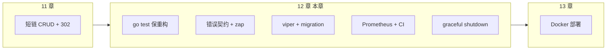

# 单元测试、日志与配置工程化

<!-- 修改说明: 2026-07-14 在原 EXPANSION-STANDARD 基础上补齐短链简历项目的错误契约、版本化迁移、Prometheus 指标、E2E/故障测试与 CI 门禁 -->

> **文件编码**：UTF-8。
> **技术栈版本**：Go 1.26.x（核心示例兼容较早版本）、`go test` 标准库、可选 `testify`、`uber-go/zap`、`spf13/viper`；依赖版本以项目 `go.mod` 为准。
> **关联章节**：
> - [11 短链服务项目实战（下）](./11-短链服务项目实战下.md)（本章工程化起点）
> - [系统设计 08 短链服务设计](../系统设计/08-短链服务设计.md)（302 跳转、统计异步化设计对照）
> - [Linux 11 日志分析与故障排查](../Linux/11-日志分析与故障排查.md)（线上 `journalctl` / 日志检索）
> - [16 Go 运行时、GC 与性能分析](./16-Go运行时内存GC与性能分析.md)（benchmark、pprof、trace 与逃逸分析）

---

## 0. 读前导读（零基础也能跟上）

### 0.1 用一句话弄懂本章

**一句话**：11 章短链能跑起来只是第一步；本章把项目变成**可测、可观测、可演进、可安全发布**的工程化骨架——测试保护重构，错误与日志能定位问题，版本化迁移管理表结构，Prometheus 量化运行状态，CI 阻止坏代码进入主分支。

**生活类比**：

| 概念 | 代码 | 生活类比 |
|------|------|----------|
| **单元测试** | `go test ./...` | 每道菜出锅前试咸淡，不用等整桌宴结束 |
| **Table-Driven Test** | `[]struct{...}` | 同一套检查清单，换不同食材批量验 |
| **Mock / Stub** | 接口 + fake 实现 | 排练时用塑料道具代替真库房 |
| **结构化日志** | `zap.String("code", code)` | 收银小票带条码，机器能搜、人能读 |
| **配置外置** | `viper` + yaml | 菜单价格写在墙上，换价不用拆厨房 |
| **版本化迁移** | `000001_init.up.sql` | 每次改造厨房都有施工图和版本号 |
| **指标监控** | Prometheus RED | 仪表盘持续显示客流、耗时和失败率 |
| **CI 门禁** | test/race/migration/E2E | 出厂检查没过，产品不能进入仓库 |
| **优雅停机** | `signal.Notify` + `Shutdown` | 打烊前先结完堂食单，再关灯 |

**为什么重要**：[11 章](./11-短链服务项目实战下.md) 的 `RedirectHandler` 改一行可能影响 302 统计；没有测试和日志，线上出问题只能「猜」。面试常问：**如何优雅关闭 HTTP 服务**、**为什么用 zap 不用 fmt.Println**。

### 0.2 你需要提前知道什么

| 术语 / 能力 | 零基础解释 | 真不会请先学 |
|-------------|------------|--------------|
| **interface** | 只约定方法签名，便于 Mock | Go 01～03 章 OOP |
| **`*testing.T`** | 测试运行器传入的「报告员」 | 本章 §2 |
| **context.Context** | 请求生命周期与取消 | Go 04 章 context |
| **HTTP Server** | `net/http` 或 Gin/Echo | 11 章短链 API |
| **环境变量** | 容器注入配置的常用方式 | 本章 §6 viper |

| 你现在的水平 | 建议动作 |
|--------------|----------|
| 刚完成 11 章短链 | ✅ 给 `ShortCodeService` 补 3 个表驱动测试 |
| 只会 `fmt.Println` 调试 | ✅ 重点 §4 错误与日志 + §7 Prometheus |
| 准备 Docker 部署 | 本章 + [13 章](./13-Docker与Linux部署Go服务.md) 连贯学 |

### 0.3 本章知识地图（学完后 ☐→☑）

- [ ] 写 Table-Driven 单元测试，`go test -v -cover` 通过
- [ ] 用接口隔离 DB/Redis，测试不连真中间件
- [ ] 可选：`testify/assert` 简化断言
- [ ] 配置 `zap` 开发/生产两套：Console vs JSON
- [ ] 用 `viper` 读 yaml + 环境变量覆盖
- [ ] 用 `golang-migrate` / `goose` 执行可追踪、可回滚的版本化 SQL
- [ ] 暴露 `/metrics`，掌握 RED 与短链业务指标的低基数标签规范
- [ ] 建立单元、集成、E2E、故障测试分层和 PR CI 门禁
- [ ] 实现 `SIGINT/SIGTERM` → `server.Shutdown(ctx)` 优雅停机
- [ ] 闭卷自测 ≥ 8/10

### 0.4 建议学习时长与节奏

| 阶段 | 内容 | 建议时长 |
|------|------|----------|
| 第 1 天 | §1～§3 testing 标准库 | 2 h |
| 第 2 天 | §4 错误契约 + zap 日志 | 2 h |
| 第 3 天 | §5 配置 + 版本化迁移 + §6 优雅停机 | 2.5 h |
| 第 4 天 | §7 指标、E2E/故障测试、CI + 自测 | 3 h |

### 0.5 学完本章你能做什么

1. 给短链核心领域逻辑写表驱动测试，并让 `go test -race ./...` 稳定通过。
2. 本地 `config.dev.yaml`、Docker `config.prod.yaml` 切换无需改代码。
3. 从空数据库执行全部 migration，再启动服务完成创建与跳转；旧版本升级也不靠手工改表。
4. 用 request ID 串起一次跳转日志，并从 `/metrics` 看到请求量、P95/P99、错误率、缓存命中和消息积压。
5. `docker stop` 时服务在 10s 内结完在途请求再退出（配合 13 章）。

---

## 本章与上一章的关系

[11 章短链项目（下）](./11-短链服务项目实战下.md) 你已实现 Gin/Echo 路由、`Redirect` 302、Redis 缓存与 MySQL 持久化——功能闭环完成。但「能跑」≠「敢改」：



| 11 章已有 | 12 章补齐 | 与 08 设计对照 |
|-----------|-----------|----------------|
| Handler 直调 Service | 接口 + 单元测试 | 跳转路径可回归 |
| `log.Printf` 零散输出 | 统一错误码 + zap 结构化字段 | 异步统计 MQ 消费可追踪 |
| 配置硬编码/手工改表 | viper 外置 + 版本化 migration | 环境与表结构可审计 |
| 只能手工点接口 | Prometheus + E2E + CI 门禁 | 延迟、错误、缓存、积压可量化 |
| `ListenAndServe` 阻塞 | Shutdown Drain | 滚动发布不丢 302 |

---

## 1. 为什么需要工程化闭环

| 痛点 | 无工程化 | 有工程化 |
|------|----------|----------|
| 改 Base62 算法 | 手工点 Postman | `go test` 秒级反馈 |
| 线上 502 | 只有「挂了」 | JSON 日志带 `code`、`latency` |
| 测试/生产配置混 | 误连生产 Redis | `APP_ENV=prod` 自动切文件 |
| 多人手工改表 | 环境表结构不一致 | migration 有版本、有记录、有审核 |
| 只看“服务没挂” | 慢请求和缓存雪崩发现太晚 | RED + 业务指标提前告警 |
| PR 看起来没问题 | 竞态或升级脚本上线才爆 | CI 自动跑 race、迁移、E2E |
| `kill -9` 部署 | 跳转中断、统计丢失 | 优雅停机排空连接 |

**术语（Observability 可观测性）**：通过日志、指标、链路追踪理解系统运行状态。
**生活类比**：餐厅后厨有出菜计时器、温度探针、订单流水号——不是等顾客投诉才知道糊了。
**本章用到的地方**：§4 错误与日志、§5 migration、§6 shutdown、§7 指标与质量门禁。

---

## 2. `testing` 标准库

### 2.1 最小测试文件约定

- 文件：`xxx_test.go`
- 函数：`func TestXxx(t *testing.T)`
- 包：同包测试 `package service`；黑盒测试 `package service_test`

```go
package shorturl

import "testing"

func TestBase62Encode(t *testing.T) {
    got := Base62Encode(125)
    want := "21" // 示例：依你的 charset 实现为准
    if got != want {
        t.Fatalf("Base62Encode(125) = %q, want %q", got, want)
    }
}
```

### 2.2 Table-Driven Test（表驱动测试）

Go 社区最常用模式——一组输入输出，循环断言：

```go
func TestBase62EncodeTable(t *testing.T) {
    tests := []struct {
        name  string
        input uint64
        want  string
    }{
        {"zero", 0, "0"},
        {"one", 1, "1"},
        {"62", 62, "10"},
        {"max_sample", 3843, "ZZ"}, // 当前字符表最后一位是 Z；以项目实际 alphabet 为准
    }
    for _, tt := range tests {
        t.Run(tt.name, func(t *testing.T) {
            if got := Base62Encode(tt.input); got != tt.want {
                t.Errorf("got %q, want %q", got, tt.want)
            }
        })
    }
}
```

| 行号/字段 | 含义 | 改错会怎样 |
|-----------|------|------------|
| `tests := []struct{...}` | 用例表 | 漏测边界值 |
| `t.Run(tt.name, ...)` | 子测试独立命名 | 失败时难定位哪行 |
| `t.Errorf` vs `t.Fatalf` | 继续 vs 立即终止 | 表驱动一般用 Errorf 跑完所有 case |

### 2.3 常用命令

`go test ./...` 全项目；`-v` 详细；`-cover` 覆盖率；`-race` 竞态；`-run TestBase62` 匹配运行。

### 2.4 测试替身：接口隔离

Service 依赖 `URLRepository` interface（`Save`/`FindByCode`），测试注入内存 fakeRepo，不连 MySQL。集成测试用 build tag `integration` 另起。

---

## 3. testify（可选）

`require.NoError` 前置条件；`assert.NotEmpty` 断言。`require` 失败立即终止，`assert` 失败继续跑完表驱动 case。

---

## 4. 错误契约与 zap 结构化日志

生产项目不能让 Repository、Service、Handler 各自随意返回字符串。推荐把错误分成三层：

```text
基础设施错误（MySQL/Redis/MQ）
        ↓ 使用 fmt.Errorf("find url: %w", err) 保留 cause
领域错误（ErrURLNotFound / ErrURLExpired / ErrURLDisabled）
        ↓ Handler 统一映射
HTTP 状态 + 稳定业务错误码 + 对用户安全的 message
```

### 4.1 领域错误与包装

```go
var (
    ErrURLNotFound = errors.New("short url not found")
    ErrURLExpired  = errors.New("short url expired")
    ErrURLDisabled = errors.New("short url disabled")
)

func (s *Service) Resolve(ctx context.Context, code string) (string, error) {
    url, err := s.repo.FindByCode(ctx, code)
    if err != nil {
        return "", fmt.Errorf("resolve code %q: %w", code, err)
    }
    return url, nil
}
```

- 判断错误用 `errors.Is/As`，不要比较 `err.Error()` 字符串。
- `%w` 保留根因；`%v` 只生成文本，后续无法判断错误类型。
- Repository 不认识 HTTP；Service 不返回 `gin.H`；Handler 不暴露 SQL、DSN、堆栈。

### 4.2 HTTP 错误响应只在边界映射一次

```json
{
  "code": "SHORT_URL_NOT_FOUND",
  "message": "short URL does not exist",
  "request_id": "01J..."
}
```

| 领域结果 | HTTP | 对外错误码 | 是否记录 Error 日志 |
|----------|------|------------|----------------------|
| 参数校验失败 | 400 | `INVALID_ARGUMENT` | 否，计数即可 |
| 未认证 / 无权限 | 401 / 403 | `UNAUTHORIZED` / `FORBIDDEN` | Warn（出现异常峰值时） |
| 短码不存在 | 404 | `SHORT_URL_NOT_FOUND` | 否，避免扫描流量刷屏 |
| 自定义短码冲突 | 409 | `SHORT_CODE_CONFLICT` | 否 |
| 限流 | 429 | `RATE_LIMITED` | 否，指标告警 |
| MySQL 等依赖超时 | 503 | `DEPENDENCY_UNAVAILABLE` | Error，保留 cause |
| 未知错误 | 500 | `INTERNAL_ERROR` | Error |

**原则**：预期内的业务失败不是服务故障。日志只记录一次，通常由最靠近请求边界、拥有 request ID 和业务字段的一层记录；底层负责包装，不要层层重复打印同一个错误。

### 4.3 日志字段与级别规范

| 级别 | 何时使用 | 短链示例 |
|------|----------|----------|
| Debug | 本地调试、默认生产关闭 | Base62 中间值 |
| Info | 状态变化或低频关键事件 | 服务启动、迁移版本、配置摘要（脱敏） |
| Warn | 可恢复、需要关注 | Redis 超时后降级到 MySQL、429 激增 |
| Error | 请求失败或后台任务最终失败 | MySQL 不可用、消息进入 DLQ |
| Panic/Fatal | 仅启动期无法继续 | 配置非法；业务请求中禁止使用 |

推荐公共字段：`request_id`、`route`、`method`、`status`、`latency_ms`、`error_code`；短链字段：`short_code`、`cache_result`、`event_id`。生产日志写 JSON 到 stdout，由 Docker/Loki/ELK 收集。

禁止记录：密码、Token、Cookie、完整 DSN、完整 IP、含敏感 query 的长 URL。确需分析时保存脱敏值或不可逆 hash，并定义保留周期。

### 4.4 为什么不用 fmt.Println

| fmt.Println | zap |
|-------------|-----|
| 无级别 | Debug/Info/Warn/Error |
| 难检索 | JSON 字段可 Loki/ELK 搜索 |
| 文本格式容易漂移 | 字段契约稳定，可做告警与统计 |
| 高频路径开销不可控 | 支持高性能编码与采样 |

### 4.5 初始化

dev 用 `NewDevelopmentConfig`（Console）；prod 用 `NewProductionConfig`（JSON stdout）。启动时校验日志级别；退出前调用 `Sync()`，但对 stdout/stderr 的 `invalid argument` 可按平台忽略。

### 4.6 在 Redirect Handler 中使用

Redirect 请求不建议每次都打成功 Info 日志，否则高 QPS 下日志成本可能比业务还高。更合适的策略是：

- 成功量、延迟、缓存命中放 Prometheus；日志只采样或在 Debug 输出。
- 失败打带 `request_id`、`short_code`、`error_code`、`latency_ms` 的结构化日志。
- Redis 降级只在状态切换或采样后记录 Warn，避免同一故障每秒打印数万行。
- 异步统计生产者与消费者都携带同一个 `event_id`，便于定位重复、重试和 DLQ。

---

## 5. viper 配置管理

### 5.1 配置文件示例 `config.yaml`

```yaml
server:
  addr: ":8080"
  shutdown_timeout: 10s
mysql:
  dsn: "user:pass@tcp(mysql:3306)/shorturl?parseTime=true"
redis:
  addr: "redis:6379"
  db: 0
log:
  level: info
  env: prod
```

### 5.2 加载

`viper.SetEnvPrefix("APP")` + `SetEnvKeyReplacer(strings.NewReplacer(".", "_"))` + `AutomaticEnv()`；`APP_MYSQL_DSN` 覆盖 `mysql.dsn`。Docker 13 章通过 secret 或环境变量注入。

配置加载后必须做显式校验：端口是否合法、超时是否大于 0、MySQL DSN 是否存在、生产环境是否误用了默认密码。日志只打印“加载来源和非敏感摘要”，不打印完整配置对象。

### 5.3 配置加载步骤表

| 步骤 | 你的动作 | 预期看到什么 | 若不对 |
|------|----------|--------------|--------|
| 1 | 创建 `config/config.dev.yaml` | 文件存在 | 检查路径 |
| 2 | `main` 启动时 `LoadConfig` | 打印 `Using config: ...` | ReadInConfig 报错→路径 |
| 3 | `export APP_SERVER_ADDR=:9090` | 监听 9090 | 前缀 APP_ 与 Replacer |
| 4 | 错误 DSN 启动 | 连接失败日志清晰 | zap 包装 mysql open err |

### 5.4 版本化数据库迁移：禁止生产靠 AutoMigrate

开发期 `AutoMigrate` 很方便，但它无法清楚表达数据回填、索引创建顺序和回滚策略。简历项目推荐选择一种工具并固定下来：`golang-migrate/migrate` 或 `pressly/goose`。

```text
migrations/
├── 000001_create_short_urls.up.sql
├── 000001_create_short_urls.down.sql
├── 000002_add_expire_and_status.up.sql
├── 000002_add_expire_and_status.down.sql
├── 000003_create_click_event_dedup.up.sql
└── 000003_create_click_event_dedup.down.sql
```

命名规则是“单调递增版本 + 动作”；已在共享环境执行过的文件**不允许原地修改**，发现遗漏就增加新版本。工具会维护 schema version 表，回答“这个环境现在执行到哪一版”。

```bash
# 示例：命令行工具的参数以你最终选择的 migrate/goose 为准
migrate -path ./migrations -database "$DATABASE_URL" version
migrate -path ./migrations -database "$DATABASE_URL" up
```

### 5.5 发布时的迁移流程

```text
备份/确认可恢复
   → CI 在空库执行 up
   → CI 从上一发布版本执行 up
   → 单独 migration job 执行一次
   → 检查 schema version
   → 启动新 App
   → readiness + E2E smoke test
```

- 不让多个 App 副本在启动时同时抢着迁移；迁移是独立、一次性的发布步骤。
- 使用 **Expand → Migrate Data → Contract**：先加兼容字段/表，再让新旧代码都能运行，最后一个发布周期后删除旧字段。
- 大表加索引要评估锁表时间，必要时使用在线 DDL；迁移设置超时并监控。
- `down` 不是万能回滚。删除列等破坏性操作可能无法恢复数据，生产回滚通常优先回滚镜像，并依赖向后兼容 schema。
- `force version` 只能在人工确认数据库真实状态后使用，不能作为“迁移失败就强行跳过”的脚本。

### 5.6 migration 最小验收

| 场景 | 必须验证 |
|------|----------|
| 全新环境 | 从空库 `up` 到最新版，服务能创建并跳转短链 |
| 版本升级 | 从上一发布版本数据升级，旧数据仍可读取 |
| 重复执行 | 再次 `up` 不重复建表、不破坏数据 |
| 失败恢复 | 脚本失败时能定位版本，按 runbook 修复而非删库重来 |
| 回滚演练 | 在可逆迁移上验证 `down`；破坏性迁移验证备份恢复 |

---

## 6. 优雅停机（Graceful Shutdown）

**术语（Graceful Shutdown）**：收到终止信号后，停止接收新请求，等待在途请求完成再退出。
**生活类比**：餐厅打烊——不再接新客，但要把已点的菜做完。
**为什么重要**：K8s/Docker 滚动更新先发 SIGTERM；直接 kill 会导致 302 中断、MQ 统计重复或丢失。

```go
// 要点：ListenAndServe 放 goroutine；Notify SIGTERM；Shutdown(ctx) 带超时
quit := make(chan os.Signal, 1)
signal.Notify(quit, syscall.SIGINT, syscall.SIGTERM)
<-quit
ctx, cancel := context.WithTimeout(context.Background(), cfg.Server.ShutdownTimeout)
defer cancel()
_ = srv.Shutdown(ctx)
```

| 行号 | 含义 | 改错会怎样 |
|------|------|------------|
| `signal.Notify` | 注册 SIGINT/SIGTERM | 收不到 Docker stop 信号 |
| `Shutdown(ctx)` | 关闭 listener + 等待 handler | 超时后强杀可能丢请求 |
| `WithTimeout` | 最长等待 10s | 无限等待导致部署卡住 |

**Gin 用法**：`srv := &http.Server{Handler: r}`，Gin 的 `r` 作为 Handler 同样适用。

---

## 7. 可观测性、E2E 与 CI 质量门禁

### 7.1 Prometheus：先做 RED，再做业务指标

RED 是 HTTP 服务最小观测面：

- **Rate**：每秒请求数。
- **Errors**：错误数/错误率。
- **Duration**：延迟分布，重点看 P95/P99，而不是只看平均值。

推荐指标名与标签：

| 指标 | 类型 | 低基数标签 | 回答的问题 |
|------|------|------------|------------|
| `http_requests_total` | Counter | `route,method,status` | 流量和错误率是否异常 |
| `http_request_duration_seconds` | Histogram | `route,method` | P95/P99 是否退化 |
| `http_in_flight_requests` | Gauge | `route` | 是否出现拥塞 |
| `shorturl_redirect_total` | Counter | `result,cache_result` | 跳转成功、过期、禁用、缓存命中情况 |
| `shorturl_create_total` | Counter | `result` | 创建成功、冲突、限流情况 |
| `click_event_total` | Counter | `stage,result` | publish/consume/retry/dlq 是否健康 |
| `click_consumer_lag` | Gauge | `consumer_group` | 点击统计是否积压 |

**标签红线**：不能把 `short_code`、`user_id`、IP、完整 URL、`request_id/event_id` 放进 Prometheus label。这些值近乎无限，会造成高基数和内存爆炸；单次定位放日志，聚合趋势放指标。

```go
var requestDuration = prometheus.NewHistogramVec(
    prometheus.HistogramOpts{
        Namespace: "shorturl",
        Name:      "http_request_duration_seconds",
        Help:      "HTTP request latency in seconds.",
        Buckets:   []float64{.005, .01, .025, .05, .1, .25, .5, 1},
    },
    []string{"route", "method"},
)
```

Gin 中间件在 `c.Next()` 后使用路由模板 `c.FullPath()`，不要用原始 URL（`/abc1`、`/abc2` 会制造新 label）。`/metrics` 使用 `promhttp.Handler()` 暴露，并在生产网络层限制访问。

常用 PromQL 思路：

```promql
# 某路由 P95
histogram_quantile(0.95,
  sum by (le, route) (rate(shorturl_http_request_duration_seconds_bucket[5m])))

# 5 分钟 5xx 比例
sum(rate(shorturl_http_requests_total{status=~"5.."}[5m]))
/
sum(rate(shorturl_http_requests_total[5m]))
```

告警应面向用户影响：持续 5 分钟错误率超阈值、P99 超 SLO、消费者积压持续增长。不要因一次瞬时尖峰半夜叫醒人；阈值必须由真实压测和运行基线校准。

### 7.2 测试分层

| 层级 | 是否连真实依赖 | 短链项目覆盖 | 运行位置 |
|------|----------------|--------------|----------|
| 单元测试 | 否 | Base62、过期/禁用判断、Service 分支 | 每次保存/PR |
| Handler/组件测试 | 否或 fake | JSON 契约、HTTP 状态、错误码 | PR |
| 集成测试 | Testcontainers 真 MySQL/Redis | Repository、缓存一致性、migration | PR |
| E2E | 完整 Compose | 创建→查询→302→统计最终落库 | PR 或主分支 |
| 故障测试 | 主动停依赖/注入超时 | Redis/MySQL/MQ 降级与恢复 | 主分支/发布前 |

E2E 不只验证“返回 200”：

1. 从空库执行 migration。
2. 创建带过期时间的短链，断言响应 schema。
3. 第一次跳转走 DB，第二次命中 Redis，均校验 `Location`。
4. 禁用后缓存失效，跳转返回约定状态。
5. 重复 `event_id` 被消费者处理时，PV 只增加一次。
6. 服务收到 SIGTERM 后不接新流量，并在超时内排空。

### 7.3 故障测试：验证你声称的降级能力

| 注入故障 | 预期行为 | 必查证据 |
|----------|----------|----------|
| 停 Redis | Redirect 回源 MySQL；不能把依赖失败误判成 404 | Warn 采样、cache error 指标、错误率 |
| 停 MySQL | 已缓存链接仍可跳转；cache miss 返回 503 | readiness、5xx、连接池指标 |
| 停 MQ/Stream | 跳转优先可用；统计按 14 章策略重试/降级 | publish error、fallback/drop、告警 |
| 注入慢 DB | context 超时生效，不无限卡住 goroutine | P99、timeout error、in-flight |
| 重复投递消息 | `event_id` 唯一约束阻止重复计数 | 去重表、PV 结果、ack 日志 |

测试结束必须自动恢复依赖并清理数据。故障测试不要直接连生产；本地/CI 用独立网络、独立数据库和可重复脚本。

### 7.4 PR 的 CI 门禁

建议按“快反馈在前、昂贵检查在后”排列：

```text
gofmt 检查
  → go vet / staticcheck
  → 单元与 Handler 测试
  → go test -race ./...
  → 生成 coverage
  → migration 空库/升级测试
  → MySQL + Redis 集成测试
  → Compose E2E
  → docker build
```

可直接执行的基础命令：

```bash
test -z "$(gofmt -l .)"
go vet ./...
go test -race -coverprofile=coverage.out ./...
go tool cover -func=coverage.out
```

- 核心 domain/service 包可设 75%～85% 的覆盖率门槛；不要为了全仓 100% 给生成代码写无意义测试。
- `staticcheck`、`govulncheck` 等工具在 CI 固定版本，避免“latest 今天突然破坏构建”。
- PR 必须通过所有 required checks 才能合并；主分支构建不可变的 commit-SHA 镜像，13 章再负责部署。
- 覆盖率下降、race、migration 失败、E2E 失败都应阻止合并，不能用“重跑直到绿”掩盖 flaky test。

### 7.5 与短链项目的工程化验收清单

| 模块 | 自动测试 | 日志关键字段 | 指标/配置 |
|------|----------|--------------|-----------|
| Base62 / 发号 | 边界、并发、唯一索引冲突 | `error_code` | 冲突数；`id.worker_id`（若使用雪花） |
| Create API | mock repo + 真 DB + 幂等 case | `request_id, user_id_hash` | `create_total{result}`、DB timeout |
| Redirect 302 | cache miss/hit、过期、禁用、依赖故障 | `request_id, short_code, cache_result` | RED、`redirect_total`、cache hit ratio |
| 统计投递/消费 | 重复、重试、DLQ、批量落库 | `event_id, stage, attempt` | publish/consume error、lag、DLQ |
| migration | 空库、上一版本升级、失败恢复 | `from_version,to_version` | `schema_version` |
| Shutdown | 在途请求、后台 worker drain | `shutdown_phase` | shutdown duration |

做到这里，项目展示的不再是“我会用几个库”，而是：有错误契约、有可观测证据、有自动化质量门禁，并且真的演练过依赖故障。

---

## 8. 分级练习

### L1 入门

1. 为 `strings.TrimSpace` 封装的小工具写 3 个表驱动测试。
2. 用 zap Development 模式打印一条带 `user_id` 的 Info 日志。

### L2 进阶

3. 给 11 章 `CreateShortURL` 写测试：mock repo 返回 `duplicate key` 时 Service 行为。
4. 增加两个 migration：初始化表、增加 `status/expires_at`；验证空库和旧版本升级。
5. viper：`config.dev.yaml` 与 `config.prod.yaml`，`-config` 命令行 flag 选择文件。

### L3 挑战

6. 实现 HTTP 中间件：生成 `request_id`，统一错误响应并写入 zap。
7. 接入 Prometheus RED + cache hit + consumer lag，验证不存在高基数 label。
8. 用 Testcontainers 起 MySQL/Redis；完成“创建→两次跳转→禁用”的 E2E。
9. 在 CI 中停 Redis，断言服务回源 MySQL且故障恢复后重新命中缓存。

---

## 9. 常见报错表

| 现象 | 可能原因 | 处理 |
|------|----------|------|
| `go test` 找不到测试 | 文件非 `_test.go` 或函数非 `Test` 前缀 | 改命名 |
| 测试访问真实 DB | 未 mock 接口 | 抽 interface |
| zap 无输出 | 级别过高 / 未 Sync | dev 用 DevelopmentConfig |
| viper 读不到 env | 前缀或 Replacer 错 | 打印 `v.AllSettings()` |
| migration 显示 dirty | SQL 执行到一半失败 | 停止发布，确认实际 schema 后修复；不要盲目 force |
| `/metrics` 内存持续涨 | label 放了 code/IP/URL | 只保留 route/result 等有限枚举 |
| CI 偶发失败 | 测试共享端口/全局状态/固定 sleep | 隔离资源、轮询 readiness、消除竞态 |
| E2E 把 Redis 故障当 404 | 把 cache error 当 cache miss | 区分 miss 与 dependency error，回源或 503 |
| Shutdown 超时 | handler 阻塞无 ctx | handler 传 `r.Context()` |
| 竞态 FAIL | 共享 map 无锁 | `-race` 定位 + mutex |

---

## 10. FAQ

**Q1：单元测试一定要 testify 吗？** 不必；标准库 + 表驱动是正统。

**Q2：集成 vs 单元比例？** 金字塔：单元多、集成 5～10 条关键路径。

**Q3：zap 还是 slog？** 团队统一即可；新项目可评估 Go 1.21+ slog。

**Q4：日志能打密码吗？** 绝不；DSN 打码，Token 只留前几位。

**Q5：viper 与 flag？** 并存：flag 选路径，viper 读内容。

**Q6：停机时 MQ 消费者？** 先停 HTTP → `consumer.Close()` → flush 日志。

**Q7：`-race` 何时跑？** CI 每次 PR；改并发代码后本地必跑。

**Q8：覆盖率 100%？** 否；覆盖 domain 核心与高发 bug 分支。

**Q9：对接 08 异步统计？** Redirect 打 `stat_enqueued`；消费者打 `stat_persisted`。

**Q10：Docker 注入配置？** compose `environment` 覆盖 viper（13 章）。

**Q11：`t.Parallel()` 何时用？** 纯 CPU 无共享状态时并行；有 DB/全局变量慎用。

**Q12：Handler 测试要不要起真 HTTP？** 用 `httptest.NewRecorder` + Gin `ServeHTTP` 即可。

**Q13：为什么生产不推荐每个实例启动时 AutoMigrate？** 多副本可能并发改表，且破坏性变化缺少审核、超时和回滚流程；应由单独 migration job 执行一次。

**Q14：Prometheus 为什么不能以 short code 为 label？** 每个 code 都会创建新时间序列，流量越大内存越高；具体 code 用日志查，指标只做聚合。

**Q15：Redis 挂了，健康检查应该立刻让 App 下线吗？** 若设计允许回源 MySQL，Redis 是软依赖，不应仅因它故障就 readiness 失败；要通过降级指标和告警处理。具体矩阵见 14 章。

**Q16：CI 覆盖率越高越好吗？** 不是。优先覆盖领域规则、错误分支、并发与历史 bug；覆盖率是门槛之一，不能替代有效断言和 E2E。

---

## 11. 闭卷自测

1. **概念** 表驱动测试相比多个独立 Test 函数有何优势？
2. **概念** 为什么底层错误要 `%w` 包装，并由 Handler 统一映射？
3. **概念** 版本化 migration 相比生产 AutoMigrate 的优势是什么？
4. **概念** Prometheus RED 分别是什么？
5. **概念** 为什么 `short_code/request_id` 不能做指标 label？
6. **概念** 优雅停机为什么必须设超时？
7. **动手** 写出 `go test -race` 和生成 coverage 的命令。
8. **动手** 写出注册 SIGTERM 并调用 `Shutdown` 的两行关键代码。
9. **综合** Redis 停止时，Redirect E2E 应断言哪些行为和证据？
10. **综合** 一次 PR 进入主分支前至少经过哪些 CI 门禁？

### 11.1 自测参考答案

1. 新增 case 只需增加一行数据；子测试名清晰；边界输入能复用同一断言逻辑。
2. `%w` 保留 cause，Service 不绑定 HTTP，Handler 可用 `errors.Is/As` 稳定映射且不泄漏内部细节。
3. migration 可审计、可重复、可测试升级路径；独立 job 避免多实例竞争，复杂 DDL 也能评审。
4. Rate、Errors、Duration。
5. 它们取值近乎无限，会产生高基数时间序列；具体请求放日志检索。
6. 防止 handler/worker 泄漏导致进程永不退出、部署卡死。
7. `go test -race -coverprofile=coverage.out ./...`；`go tool cover -func=coverage.out`。
8. `signal.Notify(quit, syscall.SIGTERM)`；`srv.Shutdown(ctx)`。
9. 应回源 MySQL且不误报 404；检查状态/Location、cache error 指标、采样 Warn、恢复后缓存重新可用。
10. 格式、静态检查、单元/竞态/覆盖率、migration、集成、E2E、镜像构建；具体按仓库 required checks 固化。

---

## 12. 费曼检验

请在不看资料的情况下，用 3 分钟向朋友解释本章核心。

**对照提纲**：

1. **测试 = 分层质检**：单元测规则、集成测真实存储、E2E 测完整链路、故障测试验证降级不是口号。
2. **错误与日志 = 故障档案**：错误分层包装、HTTP 只映射一次；日志携带 request/event ID，但不泄漏敏感数据。
3. **migration = 数据库版本历史**：每次改表都有新版本，CI 验证空库和升级，发布阶段只执行一次。
4. **指标 = 仪表盘**：RED 看服务，业务指标看缓存和消息；无限取值放日志，有限枚举才做 label。
5. **CI + 打烊**：门禁不通过不合并；SIGTERM 后停止接新请求、排空 HTTP/worker，再安全退出。

---

*本章已在 EXPANSION-STANDARD 基础上补齐短链简历项目的版本化迁移、Prometheus、E2E/故障测试和 CI 门禁。*

**EXPANSION-STANDARD 自检**：☑ §0 ☑ 步骤表 §5.3/§5.6/§7 ☑ 逐行读 §2.2/§6 ☑ FAQ≥12 §10 ☑ 闭卷 10 题 §11 ☑ 费曼 §12
