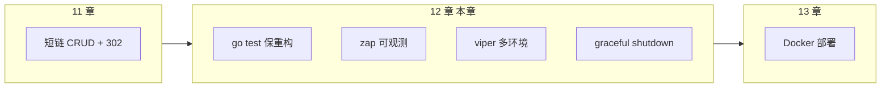

# 单元测试、日志与配置工程化

<!-- 修改说明: 2026-07-08 按 EXPANSION-STANDARD 扩充 §0、测试/日志/配置步骤表、逐行读、FAQ≥12、闭卷自测、费曼检验；承接 11 章短链项目 -->

> **文件编码**：UTF-8。  
> **技术栈版本**：Go 1.26.x（核心示例兼容较早版本）、`go test` 标准库、可选 `testify`、`uber-go/zap`、`spf13/viper`；依赖版本以项目 `go.mod` 为准。
> **关联章节**：
> - [11 短链服务项目实战（下）](./11-短链服务项目实战下.md)（本章工程化起点）
> - [系统设计 08 短链服务设计](../系统设计/08-短链服务设计.md)（302 跳转、统计异步化设计对照）
> - [Linux 11 日志分析与故障排查](../Linux/11-日志分析与故障排查.md)（线上 `journalctl` / 日志检索）
> - [16 Go 运行时、GC 与性能分析](./16-Go运行时内存GC与性能分析.md)（benchmark、pprof、trace 与逃逸分析）

---

## 0. 读前导读（零基础也能跟上）

### 0.1 用一句话弄懂本章

**一句话**：11 章短链能跑起来只是第一步；本章把项目变成**可测、可观测、可配置、可优雅下线**的生产级骨架——`go test` 保重构、`zap` 结构化日志、`viper` 多环境配置、`signal` 优雅停机。

**生活类比**：

| 概念 | 代码 | 生活类比 |
|------|------|----------|
| **单元测试** | `go test ./...` | 每道菜出锅前试咸淡，不用等整桌宴结束 |
| **Table-Driven Test** | `[]struct{...}` | 同一套检查清单，换不同食材批量验 |
| **Mock / Stub** | 接口 + fake 实现 | 排练时用塑料道具代替真库房 |
| **结构化日志** | `zap.String("code", code)` | 收银小票带条码，机器能搜、人能读 |
| **配置外置** | `viper` + yaml | 菜单价格写在墙上，换价不用拆厨房 |
| **优雅停机** | `signal.Notify` + `Shutdown` | 打烊前先结完堂食单，再关灯 |

**为什么重要**：[11 章](./11-短链服务项目实战下.md) 的 `RedirectHandler` 改一行可能影响 302 统计；没有测试和日志，线上出问题只能「猜」。面试常问：**如何优雅关闭 HTTP 服务**、**为什么用 zap 不用 fmt.Println**。

### 0.2 你需要提前知道什么

| 术语 / 能力 | 零基础解释 | 真不会请先学 |
|-------------|------------|--------------|
| **interface** | 只约定方法签名，便于 Mock | Go 01～03 章 OOP |
| **`*testing.T`** | 测试运行器传入的「报告员」 | 本章 §2 |
| **context.Context** | 请求生命周期与取消 | Go 04 章 context |
| **HTTP Server** | `net/http` 或 Gin/Echo | 11 章短链 API |
| **环境变量** | 容器注入配置的常用方式 | 本章 §6 viper |

| 你现在的水平 | 建议动作 |
|--------------|----------|
| 刚完成 11 章短链 | ✅ 给 `ShortCodeService` 补 3 个表驱动测试 |
| 只会 `fmt.Println` 调试 | ✅ 重点 §4 zap + §10 手把手 |
| 准备 Docker 部署 | 本章 + [13 章](./13-Docker与Linux部署Go服务.md) 连贯学 |

### 0.3 本章知识地图（学完后 ☐→☑）

- [ ] 写 Table-Driven 单元测试，`go test -v -cover` 通过
- [ ] 用接口隔离 DB/Redis，测试不连真中间件
- [ ] 可选：`testify/assert` 简化断言
- [ ] 配置 `zap` 开发/生产两套：Console vs JSON
- [ ] 用 `viper` 读 yaml + 环境变量覆盖
- [ ] 实现 `SIGINT/SIGTERM` → `server.Shutdown(ctx)` 优雅停机
- [ ] 闭卷自测 ≥ 8/10

### 0.4 建议学习时长与节奏

| 阶段 | 内容 | 建议时长 |
|------|------|----------|
| 第 1 天 | §1～§3 testing 标准库 | 2 h |
| 第 2 天 | §4 zap + §5 日志规范 | 1.5 h |
| 第 3 天 | §6 viper + §7 优雅停机 | 2 h |
| 第 4 天 | §10 手把手 + 练习 + 自测 | 2 h |

### 0.5 学完本章你能做什么

1. 给短链 `Base62Encode` / `CreateShortURL` 写表驱动测试，`coverage` ≥ 70%。
2. 本地 `config.dev.yaml`、Docker `config.prod.yaml` 切换无需改代码。
3. `docker stop` 时服务在 10s 内结完在途请求再退出（配合 13 章）。
4. 用 `grep trace_id` 在日志里串起一次跳转全链路（对照 [08 短链设计](../系统设计/08-短链服务设计.md) 统计异步）。

---

## 本章与上一章的关系

[11 章短链项目（下）](./11-短链服务项目实战下.md) 你已实现 Gin/Echo 路由、`Redirect` 302、Redis 缓存与 MySQL 持久化——功能闭环完成。但「能跑」≠「敢改」：



| 11 章已有 | 12 章补齐 | 与 08 设计对照 |
|-----------|-----------|----------------|
| Handler 直调 Service | 接口 + 单元测试 | 跳转路径可回归 |
| `log.Printf` 零散输出 | zap 结构化字段 | 异步统计 MQ 消费可追踪 |
| 配置硬编码 | viper 外置 | 分环境 Redis/MySQL 地址 |
| `ListenAndServe` 阻塞 | Shutdown Drain | 滚动发布不丢 302 |

---

## 1. 为什么需要工程化三件套

| 痛点 | 无工程化 | 有工程化 |
|------|----------|----------|
| 改 Base62 算法 | 手工点 Postman | `go test` 秒级反馈 |
| 线上 502 | 只有「挂了」 | JSON 日志带 `code`、`latency` |
| 测试/生产配置混 | 误连生产 Redis | `APP_ENV=prod` 自动切文件 |
| `kill -9` 部署 | 跳转中断、统计丢失 | 优雅停机排空连接 |

**术语（Observability 可观测性）**：通过日志、指标、链路追踪理解系统运行状态。  
**生活类比**：餐厅后厨有出菜计时器、温度探针、订单流水号——不是等顾客投诉才知道糊了。  
**本章用到的地方**：§4 zap、§7 shutdown。

---

## 2. `testing` 标准库

### 2.1 最小测试文件约定

- 文件：`xxx_test.go`
- 函数：`func TestXxx(t *testing.T)`
- 包：同包测试 `package service`；黑盒测试 `package service_test`

```go
package shorturl

import "testing"

func TestBase62Encode(t *testing.T) {
    got := Base62Encode(125)
    want := "21" // 示例：依你的 charset 实现为准
    if got != want {
        t.Fatalf("Base62Encode(125) = %q, want %q", got, want)
    }
}
```

### 2.2 Table-Driven Test（表驱动测试）

Go 社区最常用模式——一组输入输出，循环断言：

```go
func TestBase62EncodeTable(t *testing.T) {
    tests := []struct {
        name  string
        input uint64
        want  string
    }{
        {"zero", 0, "0"},
        {"one", 1, "1"},
        {"62", 62, "10"},
        {"max_sample", 3843, "zz"},
    }
    for _, tt := range tests {
        t.Run(tt.name, func(t *testing.T) {
            if got := Base62Encode(tt.input); got != tt.want {
                t.Errorf("got %q, want %q", got, tt.want)
            }
        })
    }
}
```

| 行号/字段 | 含义 | 改错会怎样 |
|-----------|------|------------|
| `tests := []struct{...}` | 用例表 | 漏测边界值 |
| `t.Run(tt.name, ...)` | 子测试独立命名 | 失败时难定位哪行 |
| `t.Errorf` vs `t.Fatalf` | 继续 vs 立即终止 | 表驱动一般用 Errorf 跑完所有 case |

### 2.4 常用命令

`go test ./...` 全项目；`-v` 详细；`-cover` 覆盖率；`-race` 竞态；`-run TestBase62` 匹配运行。

### 2.4 测试替身：接口隔离

Service 依赖 `URLRepository` interface（`Save`/`FindByCode`），测试注入内存 fakeRepo，不连 MySQL。集成测试用 build tag `integration` 另起。

---

## 3. testify（可选）

`require.NoError` 前置条件；`assert.NotEmpty` 断言。`require` 失败立即终止，`assert` 失败继续跑完表驱动 case。

---

## 4. zap 结构化日志

### 4.1 为什么不用 fmt.Println

| fmt.Println | zap |
|-------------|-----|
| 无级别 | Debug/Info/Warn/Error |
| 难检索 | JSON 字段可 ELK/Loki 搜 |
| 性能差（反射 fmt） | 零分配路径、采样 |

### 4.2 初始化

dev 用 `NewDevelopmentConfig`（彩色 Console）；prod 用 `NewProductionConfig`（JSON stdout）。`defer log.Sync()` 防缓冲丢失。

### 4.3 在 Handler 中使用

Redirect 成功打 `Info`：`code`、`latency`、`hit_cache`；失败打 `Warn` 含 `zap.Error(err)`。中间件注入 `trace_id` 贯穿全链路。

**日志规范建议**（对接 [08 短链设计](../系统设计/08-短链服务设计.md) 统计）：

- 跳转成功/失败分开级别
- 不打印完整长 URL 中的敏感 query（可 hash）
- 请求入口中间件注入 `trace_id`，全链路携带

---

## 5. viper 配置管理

### 5.1 配置文件示例 `config.yaml`

```yaml
server:
  addr: ":8080"
  shutdown_timeout: 10s
mysql:
  dsn: "user:pass@tcp(mysql:3306)/shorturl?parseTime=true"
redis:
  addr: "redis:6379"
  db: 0
log:
  level: info
  env: prod
```

### 5.2 加载

`viper.SetEnvPrefix("APP")` + `AutomaticEnv()`；`APP_MYSQL_DSN` 覆盖 yaml。Docker 13 章 compose `environment` 注入。

### 5.3 配置加载步骤表

| 步骤 | 你的动作 | 预期看到什么 | 若不对 |
|------|----------|--------------|--------|
| 1 | 创建 `config/config.dev.yaml` | 文件存在 | 检查路径 |
| 2 | `main` 启动时 `LoadConfig` | 打印 `Using config: ...` | ReadInConfig 报错→路径 |
| 3 | `export APP_SERVER_ADDR=:9090` | 监听 9090 | 前缀 APP_ 与 Replacer |
| 4 | 错误 DSN 启动 | 连接失败日志清晰 | zap 包装 mysql open err |

---

## 6. 优雅停机（Graceful Shutdown）

**术语（Graceful Shutdown）**：收到终止信号后，停止接收新请求，等待在途请求完成再退出。  
**生活类比**：餐厅打烊——不再接新客，但要把已点的菜做完。  
**为什么重要**：K8s/Docker 滚动更新先发 SIGTERM；直接 kill 会导致 302 中断、MQ 统计重复或丢失。

```go
// 要点：ListenAndServe 放 goroutine；Notify SIGTERM；Shutdown(ctx) 带超时
quit := make(chan os.Signal, 1)
signal.Notify(quit, syscall.SIGINT, syscall.SIGTERM)
<-quit
ctx, cancel := context.WithTimeout(context.Background(), cfg.Server.ShutdownTimeout)
defer cancel()
_ = srv.Shutdown(ctx)
```

| 行号 | 含义 | 改错会怎样 |
|------|------|------------|
| `signal.Notify` | 注册 SIGINT/SIGTERM | 收不到 Docker stop 信号 |
| `Shutdown(ctx)` | 关闭 listener + 等待 handler | 超时后强杀可能丢请求 |
| `WithTimeout` | 最长等待 10s | 无限等待导致部署卡住 |

**Gin 用法**：`srv := &http.Server{Handler: r}`，Gin 的 `r` 作为 Handler 同样适用。

---

## 7. 与短链项目的集成清单

对照 [11 章](./11-短链服务项目实战下.md) 与 [08 设计](../系统设计/08-短链服务设计.md)：

| 模块 | 测试建议 | 日志字段 | 配置项 |
|------|----------|----------|--------|
| Base62 / 发号 | 表驱动边界 | — | `id.worker_id` |
| Create API | mock repo | `code`, `latency` | `mysql.dsn` |
| Redirect 302 | mock cache+db | `code`, `hit_cache` | `redis.addr` |
| 统计投递 MQ | mock producer | `event`, `code` | `mq.url` |
| 布隆过滤器 | 存在/不存在 case | `bloom_hit` | `bloom.enabled` |

---

## 8. 分级练习

### L1 入门

1. 为 `strings.TrimSpace` 封装的小工具写 3 个表驱动测试。
2. 用 zap Development 模式打印一条带 `user_id` 的 Info 日志。

### L2 进阶

3. 给 11 章 `CreateShortURL` 写测试：mock repo 返回 `duplicate key` 时 Service 行为。
4. viper：`config.dev.yaml` 与 `config.prod.yaml`，`-config` 命令行 flag 选择文件。

### L3 挑战

5. 实现 HTTP 中间件：每个请求生成 `trace_id` 写入 context 与 zap 日志。
6. 集成测试（build tag `integration`）：testcontainers 起 MySQL，测一条真实 INSERT。

---

## 9. 常见报错表

| 现象 | 可能原因 | 处理 |
|------|----------|------|
| `go test` 找不到测试 | 文件非 `_test.go` 或函数非 `Test` 前缀 | 改命名 |
| 测试访问真实 DB | 未 mock 接口 | 抽 interface |
| zap 无输出 | 级别过高 / 未 Sync | dev 用 DevelopmentConfig |
| viper 读不到 env | 前缀或 Replacer 错 | 打印 `v.AllSettings()` |
| Shutdown 超时 | handler 阻塞无 ctx | handler 传 `r.Context()` |
| 竞态 FAIL | 共享 map 无锁 | `-race` 定位 + mutex |

---

## 10. FAQ

**Q1：单元测试一定要 testify 吗？** 不必；标准库 + 表驱动是正统。

**Q2：集成 vs 单元比例？** 金字塔：单元多、集成 5～10 条关键路径。

**Q3：zap 还是 slog？** 团队统一即可；新项目可评估 Go 1.21+ slog。

**Q4：日志能打密码吗？** 绝不；DSN 打码，Token 只留前几位。

**Q5：viper 与 flag？** 并存：flag 选路径，viper 读内容。

**Q6：停机时 MQ 消费者？** 先停 HTTP → `consumer.Close()` → flush 日志。

**Q7：`-race` 何时跑？** CI 每次 PR；改并发代码后本地必跑。

**Q8：覆盖率 100%？** 否；覆盖 domain 核心与高发 bug 分支。

**Q9：对接 08 异步统计？** Redirect 打 `stat_enqueued`；消费者打 `stat_persisted`。

**Q10：Docker 注入配置？** compose `environment` 覆盖 viper（13 章）。

**Q11：`t.Parallel()` 何时用？** 纯 CPU 无共享状态时并行；有 DB/全局变量慎用。

**Q12：Handler 测试要不要起真 HTTP？** 用 `httptest.NewRecorder` + Gin `ServeHTTP` 即可。

---

## 11. 闭卷自测

1. **概念** Go 测试文件命名与函数命名规则是什么？
2. **概念** 表驱动测试相比多个独立 Test 函数有何优势？
3. **概念** 结构化日志相比 Printf 的三大好处？
4. **概念** viper `AutomaticEnv` 解决什么问题？
5. **概念** 优雅停机为什么必须设超时？
6. **概念** `assert` 与 `require` 在 testify 中的区别？
7. **动手** 写一条 Table-Driven：`Base62Encode(0)` 期望 `"0"`。
8. **动手** 写出注册 SIGTERM 并调用 `Shutdown` 的两行关键代码。
9. **综合** 短链 Redirect 应打哪些 zap 字段支撑 08 章统计排查？
10. **综合** 如何用接口让 `ShortURLService` 测试不依赖 MySQL？

### 11.1 自测参考答案

1. `xxx_test.go`；`func TestXxx(t *testing.T)`。
2. 新增 case 只加一行 struct；子测试名清晰；易做边界批量覆盖。
3. 可级别过滤；JSON 可检索；性能更好。
4. 容器/云环境用环境变量覆盖 yaml，十二因子应用。
5. 防止 handler 泄漏导致进程永不退出，部署卡死。
6. assert 失败继续；require 失败立即终止当前测试。
7. 见 §2.2 示例。
8. `signal.Notify(quit, syscall.SIGTERM)`；`srv.Shutdown(ctx)`。
9. `code`, `latency`, `hit_cache`, `trace_id`, `ip`（可选）, `stat_enqueued`。
10. 定义 `URLRepository` interface，测试注入 fakeRepo/map 内存实现。

---

## 12. 费曼检验

请在不看资料的情况下，用 3 分钟向朋友解释本章核心。

**对照提纲**：

1. **测试 = 试咸淡**：改短链算法先跑 `go test`，接口假替身避免真 MySQL。
2. **日志 = 带条码的小票**：zap 用字段而不是整句字符串，方便搜 `code=abc123`。
3. **配置 = 墙上菜单**：viper 把 DSN、端口拿出代码；Docker 用环境变量改菜单不用重新编译。
4. **打烊 = 优雅停机**：SIGTERM 后不接新 302，等正在跳转的请求完成再退出。

---

*本章已按 EXPANSION-STANDARD 扩充（§0+步骤表+逐行读+FAQ+闭卷自测+费曼）。*

**EXPANSION-STANDARD 自检**：☑ §0 ☑ 步骤表 §5.3/§7 ☑ 逐行读 §2.2/§6 ☑ FAQ≥12 §10 ☑ 闭卷 10 题 §11 ☑ 费曼 §12
