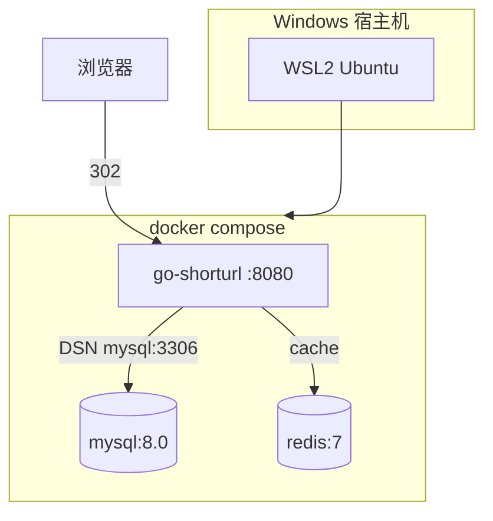

# Docker 与 Linux 部署 Go 服务

<!-- 修改说明: 2026-07-08 按 EXPANSION-STANDARD 扩充 §0、Dockerfile/compose 步骤表、逐行读、FAQ≥12、闭卷自测、费曼检验；交叉引用 Linux 12 章 -->

> **文件编码**：UTF-8。  
> **技术栈版本**：Go 1.22+、Docker Engine 26.x、Compose v2、MySQL 8.0、Redis 7。  
> **关联章节**：
> - [12 单元测试日志与配置工程化](./12-单元测试日志与配置工程化.md)（viper 配置、优雅停机）
> - [11 短链服务项目实战（下）](./11-短链服务项目实战下.md)（待部署的 Go 短链服务）
> - [Linux 12 Docker 容器基础](../Linux/12-Docker容器基础.md)（镜像/容器/volume 系统讲解）
> - [系统设计 08 短链服务设计](../系统设计/08-短链服务设计.md)（MySQL+Redis+302 架构对照）

---

## 0. 读前导读（零基础也能跟上）

### 0.1 用一句话弄懂本章

**一句话**：把 11 章短链 Go 服务打成 **多阶段 Docker 镜像**，用 **docker-compose 一键起 MySQL+Redis+App**，在 **WSL2 / VMware Ubuntu** 上 `curl` 302 跳转成功——环境「我电脑能跑你服务器也能跑」。

**生活类比**：

| 概念 | 类比 |
|------|------|
| **多阶段构建** | 大厨房做菜（编译），上菜只端盘子（最小运行时镜像） |
| **scratch / alpine 运行时** | 外带盒只要饭，不要整套厨具 |
| **compose 服务名** | 套餐里每道菜有代号，App 喊 `mysql` 不用记 IP |
| **healthcheck** | 上菜前试温度，MySQL 没熟 App 先等着 |
| **WSL2** | Windows 里开一间 Linux 小厨房跑 Docker |

**术语（Multi-stage Build）**：一个 Dockerfile 里多个 `FROM`，前一阶段编译，后一阶段只 COPY 二进制。  
**为什么重要**：Go 编译产物单文件，镜像可 < 30MB；比 [Linux 12 章](../Linux/12-Docker容器基础.md) Java jar 镜像更轻，但 compose 编排思路一致。

### 0.2 你需要提前知道什么

| 水平 | 建议 |
|------|------|
| 未装 Docker | 先 [Linux 12 §2](../Linux/12-Docker容器基础.md) 安装 Engine |
| Windows 纯宿主机 | 装 **Docker Desktop + WSL2** 后端 |
| 只会 `go run .` | 先 [12 章 viper](./12-单元测试日志与配置工程化.md) 外置 DSN |
| 短链业务不懂 | 回 [11 章](./11-短链服务项目实战下.md) + [08 设计](../系统设计/08-短链服务设计.md) |

### 0.3 本章知识地图（☐→☑）

- [ ] 写 Go **多阶段 Dockerfile**，`docker build` 成功
- [ ] compose 起 **mysql + redis + app**，healthcheck 通过
- [ ] App 用 `mysql:3306` / `redis:6379` 服务名连接
- [ ] WSL 内访问 `localhost:8080` 短链跳转 302
- [ ] 理解 volume 持久化 MySQL 数据
- [ ] `docker compose logs` 排查启动失败
- [ ] 闭卷自测 ≥ 8/10

### 0.4 建议学习时长

| 阶段 | 时间 |
|------|------|
| §1～§3 多阶段 Dockerfile | 1.5 h |
| §4～§6 compose 三件套 | 2 h |
| §7 WSL 部署 | 1 h |
| FAQ + 自测 + 练习 | 1 h |

### 0.5 学完你能做什么

1. 在 WSL 执行 `docker compose up -d`，浏览器访问短链 `http://localhost:8080/abc` 得到 302。
2. 解释 **为什么不能** 在容器里写 `127.0.0.1:3306` 连 MySQL。
3. 对照 [Linux 12 §7](../Linux/12-Docker容器基础.md) 说出与本章 compose yaml 的三处异同。
4. 镜像推送到阿里云 ACR / Docker Hub（练习可选）。

---

## 本章与上一章的关系

[12 章](./12-单元测试日志与配置工程化.md) 你已用 viper 外置 `mysql.dsn`、`redis.addr`，并实现 `Shutdown` 优雅停机——代码具备「可部署」形态。[11 章](./11-短链服务项目实战下.md) 的短链服务是本章部署对象。



| 12 章 | 13 章本章 | Linux 12 章 |
|-------|-----------|-------------|
| viper 读 yaml | compose `environment` 注入 | 通用 Docker 概念 |
| zap 日志到 stdout | `docker compose logs app` | `docker logs` |
| graceful shutdown | `docker stop` 10s 内退出 | 容器生命周期 |
| — | **Go 多阶段镜像** | Spring Boot jar 镜像示例 |

**与 [08 短链设计](../系统设计/08-短链服务设计.md) 对照**：设计里的 Redis 缓存层、MySQL 持久化、302 跳转——compose 三件套正是其最小可运行拓扑。

---

## 1. Go 服务部署前要检查什么

| 检查项 | 命令/位置 | 说明 |
|--------|-----------|------|
| 配置外置 | 12 章 viper | 禁止镜像内写死密码 |
| 监听地址 | `:8080` 非 `127.0.0.1` | 容器外要能访问 |
| CGO | 尽量 `CGO_ENABLED=0` | 静态链接，alpine 可跑 |
| 健康检查 | `/healthz` 返回 200 | compose healthcheck 用 |
| 迁移 | SQL 或 goose | MySQL 首次启动建表 |

---

## 2. 多阶段 Dockerfile

### 2.1 推荐模板

```dockerfile
# syntax=docker/dockerfile:1

FROM golang:1.22-alpine AS builder
WORKDIR /src
RUN apk add --no-cache git ca-certificates
COPY go.mod go.sum ./
RUN go mod download
COPY . .
RUN CGO_ENABLED=0 GOOS=linux GOARCH=amd64 go build -ldflags="-s -w" -o /out/shorturl ./cmd/shorturl

FROM alpine:3.20
RUN apk add --no-cache ca-certificates tzdata
ENV TZ=Asia/Shanghai
WORKDIR /app
COPY --from=builder /out/shorturl .
COPY config/config.prod.yaml ./config.yaml
EXPOSE 8080
USER nobody
ENTRYPOINT ["./shorturl", "-config", "config.yaml"]
```

### 2.2 Dockerfile 逐行读

| 行号/指令 | 含义 | 改错会怎样 |
|-----------|------|------------|
| `golang:1.22-alpine AS builder` | 编译阶段，带完整工具链 | 版本与 go.mod 不一致可能编译失败 |
| `go mod download` 在 COPY 源码前 | 利用层缓存加速 rebuild | 先 COPY . 会导致改一行全量下载 |
| `CGO_ENABLED=0` | 纯 Go 静态二进制 | 依赖 CGO 的库会 link 失败 |
| `-ldflags="-s -w"` |  strip 符号减小体积 | 不影响运行，调试稍难 |
| `alpine:3.20` 运行时 | 最小镜像 ~10MB 级 | scratch 更小但无时区包 |
| `USER nobody` | 非 root 运行 | 安全；写文件需 volume 权限 |
| `ENTRYPOINT` + `-config` | 启动参数固定 | CMD 可被 compose 覆盖 |

### 2.3 构建

```bash
docker build -t shorturl:1.0 .
docker compose up -d --build
```

---

## 3. docker-compose 全栈编排

### 3.1 `docker-compose.yml`

```yaml
services:
  mysql:
    image: mysql:8.0
    environment:
      MYSQL_ROOT_PASSWORD: root
      MYSQL_DATABASE: shorturl
    volumes:
      - mysql_data:/var/lib/mysql
      - ./deploy/init.sql:/docker-entrypoint-initdb.d/init.sql:ro
    ports:
      - "3306:3306"
    healthcheck:
      test: ["CMD", "mysqladmin", "ping", "-h", "localhost", "-uroot", "-proot"]
      interval: 5s
      timeout: 3s
      retries: 10

  redis:
    image: redis:7-alpine
    ports:
      - "6379:6379"
    healthcheck:
      test: ["CMD", "redis-cli", "ping"]
      interval: 5s
      timeout: 3s
      retries: 5

  app:
    build: .
    ports:
      - "8080:8080"
    environment:
      APP_MYSQL_DSN: "root:root@tcp(mysql:3306)/shorturl?parseTime=true&charset=utf8mb4"
      APP_REDIS_ADDR: "redis:6379"
      APP_LOG_ENV: "prod"
    depends_on:
      mysql:
        condition: service_healthy
      redis:
        condition: service_healthy
    restart: unless-stopped

volumes:
  mysql_data:
```

### 3.2 compose 逐行读（对照 Linux 12 §7）

| 字段 | 含义 | 常见错误 |
|------|------|----------|
| `mysql:3306` 主机名 | Docker 内置 DNS 解析服务名 | 写 127.0.0.1 连到 app 自己 |
| `depends_on.condition: service_healthy` | 等 MySQL ping 通再起 app | 仅 depends_on 可能 app 先 crash |
| `volumes mysql_data` | 删容器不丢库 | 无 volume 重启数据清空 |
| `init.sql` 挂载 | 首次初始化表结构 | 路径错则表不存在 |
| `restart: unless-stopped` | 宿主机重启后自动拉起 | — |

### 3.3 启动步骤表

| 步骤 | 你的动作 | 预期看到什么 | 若不对 |
|------|----------|--------------|--------|
| 1 | `docker compose build` | Successfully tagged | Dockerfile 语法错误→§10 |
| 2 | `docker compose up -d` | 3 containers Started | 看 `compose ps` |
| 3 | `docker compose ps` | mysql/redis healthy | unhealthy→logs |
| 4 | `curl localhost:8080/healthz` | 200 OK | app logs 查 DSN |
| 5 | POST 创建短链 | 返回 short code | 表未建→init.sql |
| 6 | `curl -I localhost:8080/{code}` | `302 Found` | 对照 08 章 302 设计 |

---

## 4. 配置与 12 章 viper 衔接

compose 注入的环境变量应被 12 章 `LoadConfig` 读取：

```yaml
# config.prod.yaml 占位符可被 env 覆盖
mysql:
  dsn: "root:root@tcp(mysql:3306)/shorturl?parseTime=true"
redis:
  addr: "redis:6379"
```

**短链专项**（[08 设计](../系统设计/08-短链服务设计.md)）：

- Redis：缓存 `code → longURL`
- MySQL：`url_mapping` 表持久化
- 302：`Location` 头指向长链；统计可异步写 MQ（compose 可加 rabbitmq 服务扩展）

---

## 5. WSL2 部署流程

### 5.1 环境准备

| 步骤 | 动作 | 预期 |
|------|------|------|
| 1 | Windows 启用 WSL2 + 装 Ubuntu | `wsl -l -v` 显示 VERSION 2 |
| 2 | Docker Desktop → Settings → WSL integration | Ubuntu 勾选 |
| 3 | WSL 内 `docker --version` | 26.x |
| 4 | 项目放在 `/mnt/f/study/...` 或 `~/projects` | 建议 Linux 文件系统性能更好 |

### 5.2 在 WSL 中部署短链

```bash
cd /mnt/f/study/后端学习/Go/shorturl   # 11 章项目路径示例
docker compose up -d --build
docker compose logs -f app
curl -s -o /dev/null -w "%{http_code}" http://127.0.0.1:8080/healthz
```

Windows 浏览器访问 `http://localhost:8080`——Docker Desktop 会转发端口。

### 5.3 WSL 与 VMware 对照

| 维度 | WSL2 | VMware Ubuntu（Linux 12） |
|------|------|---------------------------|
| 场景 | Windows 日常开发 | 纯 Linux 练习/考试 |
| Docker | Desktop 集成 | 原生 apt 装 Engine |
| 文件路径 | `/mnt/f/...` 略慢 | 本地 ext4 |
| 网络 | localhost 直通 | 需端口转发或桥接 |

详细安装见 [Linux 12 §2](../Linux/12-Docker容器基础.md)。

---

## 6. 分级练习

### L1

1. 修改 Dockerfile 运行时阶段为 `distroless/static`，验证能否启动。
2. `docker compose exec mysql mysql -uroot -proot -e "SHOW TABLES" shorturl`

### L2

3. 为 app 增加 `/metrics` 占位路由，compose 加 healthcheck 访问它。
4. 去掉 `ports: 3306:3306`，仅 app 内网访问 mysql——理解网络隔离。

### L3

5. 增加 nginx 服务反代 app，对外 80→app:8080（参考 Linux 13）。
6. 编写 GitHub Actions：`go test` → `docker build` → push 镜像。

---

## 7. 常见报错表

| 现象 | 原因 | 处理 |
|------|------|------|
| `connection refused mysql` | app 先于 mysql 起 | healthcheck + depends_on |
| `Access denied` | 密码与 DSN 不一致 | 对齐 env 与 yaml |
| `no such file init.sql` | 挂载路径错 | 相对 compose 文件路径 |
| WSL 下 build 极慢 | 项目在 `/mnt/c` | 移到 `~/` |
| `exec format error` | arm/amd 架构不匹配 | buildx `--platform` |
| 302 变 404 | Redis/DB 无映射 | 查创建 API 是否成功 |

---

## 8. FAQ

**Q1：Go 一定要用多阶段吗？**  
单阶段 `FROM golang` 也能跑，但镜像 800MB+；多阶段是 Go 部署最佳实践。

**Q2：能否用 scratch 代替 alpine？**  
可以，需静态编译且自行处理 CA 证书；alpine 更省心。

**Q3：compose 里 app 为什么要 build 不只用镜像？**  
开发迭代方便；生产 CI 应 push 到 registry，compose 用 `image: registry/shorturl:tag`。

**Q4：Windows 不用 WSL 能跑吗？**  
Docker Desktop 默认 WSL2 后端；Hyper-V 模式亦可，但文档以 WSL 为主。

**Q5：短链 302 如何测？**  
`curl -I` 看 `HTTP/1.1 302` 和 `Location:` 头——与 [08 章](../系统设计/08-短链服务设计.md) 一致。

**Q6：数据卷存在哪？**  
WSL：`/var/lib/docker/volumes/`；Windows Desktop 在 WSL 虚拟磁盘内。

**Q7：如何重置 MySQL 数据？**  
`docker compose down -v` 删 volume（**数据清空**）。

**Q8：app 如何热更新代码？**  
开发可用 `air` 本地跑；容器部署需 rebuild 镜像。

**Q9：与 Java Spring Boot 镜像差异？**  
Go 单二进制无 JVM；启动秒级；内存占用通常更低。

**Q10：compose 能写 3 个 app 副本吗？**  
可以 `deploy.replicas`（Swarm）或 K8s；初学单副本即可。

**Q11：healthcheck 失败 app 一直 waiting？**  
`docker compose logs mysql` 看初始化是否完成。

**Q12：生产 DSN 密码？** 勿提交 git；`.env` + 云密钥管理。

---

## 9. 闭卷自测

1. **概念** 多阶段 Docker 构建的核心收益是什么？
2. **概念** compose 网络里 app 应用什么主机名连接 MySQL？
3. **概念** `depends_on` 与 `healthcheck` 如何配合？
4. **概念** `CGO_ENABLED=0` 对部署有何意义？
5. **概念** WSL2 与 VMware 跑 Docker 的主要区别？
6. **概念** 为何 Go 容器监听 `:8080` 而非 `127.0.0.1:8080`？
7. **动手** 写出 compose 中 Redis healthcheck 的 test 数组。
8. **动手** 写出 docker build 打 tag `shorturl:1.0` 的命令。
9. **综合** 对照 08 短链设计，compose 三件套各承担什么角色？
10. **综合** `docker stop` 与 12 章 graceful shutdown 如何协同？

### 9.1 自测参考答案

1. 编译环境与运行时分离，最终镜像小、无编译器、攻击面小。
2. 服务名 `mysql`（同 compose service key）。
3. depends_on 等 healthy 再起依赖方，避免连不上 DB。
4. 静态链接，可在 alpine/scratch 运行无 glibc 依赖。
5. WSL 与 Windows 集成；VMware 是完整 Linux VM，安装路径见 Linux 12。
6. 127.0.0.1 仅容器内环回，端口映射无法从宿主机访问。
7. `["CMD", "redis-cli", "ping"]`
8. `docker build -t shorturl:1.0 .`
9. MySQL 持久映射；Redis 读缓存；App 302 跳转与 API。
10. stop 发 SIGTERM，app 应 Shutdown 排空 HTTP 再退出；超时 Docker 发 SIGKILL。

---

## 10. 费曼检验

**对照提纲**：

1. **多阶段 = 厨房做菜上菜分离**：builder 阶段 gcc/go build，最终镜像只带一个 `shorturl` 二进制。
2. **compose = 套餐**：MySQL、Redis、App 各一个容器，App 喊 `mysql` 就像喊同桌名字。
3. **WSL = Windows 里的 Linux 灶**：Docker Desktop 把端口转到 localhost，浏览器能测 302。
4. **302 跳转**：短链 App 返回 Location 长 URL——部署成功后用 curl 验证，设计见 08 章。

---

*本章已按 EXPANSION-STANDARD 扩充。*

**EXPANSION-STANDARD 自检**：☑ §0 ☑ 步骤表 §3.3/§5.1 ☑ 逐行读 §2.2/§3.2 ☑ FAQ≥12 §8 ☑ 闭卷 10 题 §9 ☑ 费曼 §10
