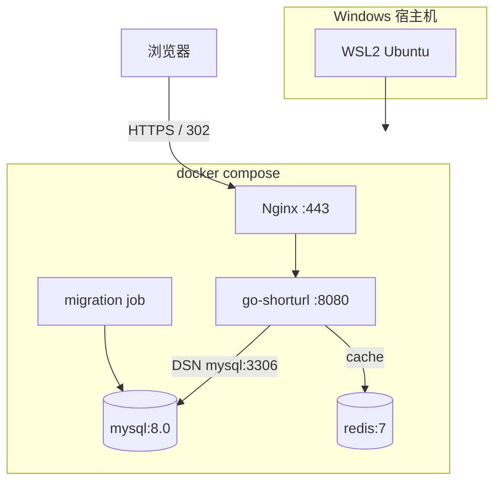

# Docker 与 Linux 部署 Go 服务

<!-- 修改说明: 2026-07-14 在原 EXPANSION-STANDARD 基础上补齐短链项目的健康探针、资源与秘密管理、版本化迁移、Nginx HTTPS、CI/CD、回滚和运行期恢复 -->

> **文件编码**：UTF-8。
> **技术栈版本**：Go 1.26.x、Compose v2、MySQL 8、Redis 7、Nginx stable；镜像小版本应由 Dependabot/Renovate 提示升级，并经过 CI、E2E 与回滚演练验证。
> **关联章节**：
> - [12 单元测试日志与配置工程化](./12-单元测试日志与配置工程化.md)（viper 配置、优雅停机）
> - [11 短链服务项目实战（下）](./11-短链服务项目实战下.md)（待部署的 Go 短链服务）
> - [Linux 12 Docker 容器基础](../Linux/12-Docker容器基础.md)（镜像/容器/volume 系统讲解）
> - [系统设计 08 短链服务设计](../系统设计/08-短链服务设计.md)（MySQL+Redis+302 架构对照）

---

## 0. 读前导读（零基础也能跟上）

### 0.1 用一句话弄懂本章

**一句话**：本章不止把短链“塞进 Docker”，而是完成一条可重复发布链路：不可变镜像、秘密注入、独立迁移、存活/就绪探针、资源边界、Nginx HTTPS、自动化部署、冒烟检查与可操作的回滚方案。

**生活类比**：

| 概念 | 类比 |
|------|------|
| **多阶段构建** | 大厨房做菜（编译），上菜只端盘子（最小运行时镜像） |
| **scratch / alpine 运行时** | 外带盒只要饭，不要整套厨具 |
| **compose 服务名** | 套餐里每道菜有代号，App 喊 `mysql` 不用记 IP |
| **liveness / readiness** | 人还醒着 vs 厨房已备好、可以接客 |
| **资源限制** | 每桌限定座位和用电，不能挤垮整家店 |
| **secret** | 密码锁进保险箱，不能印在菜单和镜像里 |
| **migration job** | 开店前由一支施工队升级厨房，不能所有服务一起砸墙 |
| **回滚** | 新菜出问题立刻切回上一份已验证菜单 |
| **WSL2** | Windows 里开一间 Linux 小厨房跑 Docker |

**术语（Multi-stage Build）**：一个 Dockerfile 里多个 `FROM`，前一阶段编译，后一阶段只 COPY 二进制。
**为什么重要**：Go 编译产物单文件，镜像可 < 30MB；比 [Linux 12 章](../Linux/12-Docker容器基础.md) Java jar 镜像更轻，但 compose 编排思路一致。

### 0.2 你需要提前知道什么

| 水平 | 建议 |
|------|------|
| 未装 Docker | 先 [Linux 12 §2](../Linux/12-Docker容器基础.md) 安装 Engine |
| Windows 纯宿主机 | 装 **Docker Desktop + WSL2** 后端 |
| 只会 `go run .` | 先 [12 章 viper](./12-单元测试日志与配置工程化.md) 外置 DSN |
| 短链业务不懂 | 回 [11 章](./11-短链服务项目实战下.md) + [08 设计](../系统设计/08-短链服务设计.md) |

### 0.3 本章知识地图（☐→☑）

- [ ] 写 Go **多阶段 Dockerfile**，`docker build` 成功
- [ ] compose 起 **mysql + redis + app**，healthcheck 通过
- [ ] App 用 `mysql:3306` / `redis:6379` 服务名连接
- [ ] 正确区分 `/livez` 与 `/readyz`，依赖故障时行为符合降级矩阵
- [ ] 给 App/MySQL/Redis 设置 CPU、内存、PID、文件句柄边界
- [ ] 密码不进 Git、镜像、Compose 明文和日志
- [ ] migration 独立执行且可验证 schema version
- [ ] Nginx 终止 HTTPS，HTTP 自动跳转，证书可续期
- [ ] GitHub Actions 以 commit SHA 构建镜像，并在冒烟失败时停止发布
- [ ] 能把镜像回滚到上一版本并恢复 MySQL/Redis 常见故障
- [ ] WSL 内访问 `localhost:8080` 短链跳转 302
- [ ] 理解 volume 持久化 MySQL 数据
- [ ] `docker compose logs` 排查启动失败
- [ ] 闭卷自测 ≥ 8/10

### 0.4 建议学习时长

| 阶段 | 时间 |
|------|------|
| §1～§3 多阶段 Dockerfile | 1.5 h |
| §3～§4 Compose、探针、资源、secret、migration | 3 h |
| §5 WSL/VPS 部署 | 1 h |
| §6 HTTPS、CI/CD、回滚与恢复 | 3 h |
| FAQ + 自测 + 练习 | 1.5 h |

### 0.5 学完你能做什么

1. 用一个版本化命令完成“拉镜像→迁移→启动→readiness→创建/跳转冒烟”。
2. 解释为什么 `/livez` 不查 MySQL，而 `/readyz` 只检查真正阻止服务工作的硬依赖。
3. 证明镜像以非 root、只读文件系统和资源上限运行，密码不在 `docker inspect` 中暴露。
4. 用 Nginx + Let's Encrypt 对外提供 HTTPS，并能在新版本失败时切回上一 commit-SHA 镜像。

---

## 本章与上一章的关系

[12 章](./12-单元测试日志与配置工程化.md) 你已用 viper 外置 `mysql.dsn`、`redis.addr`，并实现 `Shutdown` 优雅停机——代码具备「可部署」形态。[11 章](./11-短链服务项目实战下.md) 的短链服务是本章部署对象。



| 12 章 | 13 章本章 | Linux 12 章 |
|-------|-----------|-------------|
| viper 读 yaml | compose `environment` 注入 | 通用 Docker 概念 |
| zap 日志到 stdout | `docker compose logs app` | `docker logs` |
| graceful shutdown | `docker stop` 10s 内退出 | 容器生命周期 |
| migration + Prometheus | 独立迁移、探针与发布验证 | 运行期排障 |
| — | **Go 多阶段镜像 + HTTPS + 回滚** | 通用镜像/网络/volume 概念 |

**与 [08 短链设计](../系统设计/08-短链服务设计.md) 对照**：设计里的 Redis 缓存层、MySQL 持久化、302 跳转——compose 三件套正是其最小可运行拓扑。

---

## 1. Go 服务部署前要检查什么

| 检查项 | 命令/位置 | 说明 |
|--------|-----------|------|
| 配置外置 | 12 章 viper | 禁止镜像内写死密码 |
| 监听地址 | `:8080` 非 `127.0.0.1` | 容器外要能访问 |
| CGO | 尽量 `CGO_ENABLED=0` | 静态链接，alpine 可跑 |
| 存活探针 | `/livez` 只判断进程能否服务 | 不能因 MySQL 暂停就重启风暴 |
| 就绪探针 | `/readyz` 判断硬依赖、schema | 未准备好时不接新流量 |
| 指标 | `/metrics` 仅内网可访问 | 部署后验证 RED、资源和依赖状态 |
| 迁移 | `migrate`/`goose` 独立 job | 禁止靠 `init.sql` 或多副本 AutoMigrate |
| 停机 | HTTP、producer、consumer 分阶段 drain | `stop_grace_period` 大于应用超时 |
| 安全 | 非 root、只读根目录、secret 注入 | 镜像与 Compose 不含密码 |
| 恢复 | 备份已验证、上一镜像 tag 可用 | 发布失败能恢复而不是现场改容器 |

---

## 2. 多阶段 Dockerfile

### 2.1 推荐模板

```dockerfile
# syntax=docker/dockerfile:1

FROM golang:1.26-alpine AS builder
ARG TARGETOS
ARG TARGETARCH
ARG VERSION=dev
ARG COMMIT=unknown
WORKDIR /src
RUN apk add --no-cache git ca-certificates
COPY go.mod go.sum ./
RUN --mount=type=cache,target=/go/pkg/mod go mod download && go mod verify
COPY . .
RUN --mount=type=cache,target=/root/.cache/go-build \
    CGO_ENABLED=0 GOOS=${TARGETOS:-linux} GOARCH=${TARGETARCH:-amd64} \
    go build -trimpath \
    -ldflags="-s -w -X main.version=${VERSION} -X main.commit=${COMMIT}" \
    -o /out/shorturl ./cmd/shorturl

FROM alpine:3.22
RUN apk add --no-cache ca-certificates tzdata
RUN addgroup -S app && adduser -S -G app app
ENV TZ=Asia/Shanghai
WORKDIR /app
COPY --from=builder /out/shorturl /app/shorturl
EXPOSE 8080
USER app
ENTRYPOINT ["/app/shorturl"]
```

镜像内只放二进制、证书和时区；**不要 COPY 生产配置、`.env`、TLS 私钥或数据库密码**。非敏感默认值可编进程序，环境差异和 secret 在运行时注入。

上例假设 `main` 包定义了可被 `-X` 注入的 `var version = "dev"`、`var commit = "unknown"`；若变量位于 `internal/buildinfo`，把 ldflags 中的完整 import path 改成真实路径。

### 2.2 Dockerfile 逐行读

| 行号/指令 | 含义 | 改错会怎样 |
|-----------|------|------------|
| `golang:1.26-alpine AS builder` | 编译阶段，带完整工具链 | builder 版本低于 go.mod 要求会编译失败 |
| `go mod download` 在 COPY 源码前 | 利用层缓存加速 rebuild | 先 COPY . 会导致改一行全量下载 |
| `TARGETOS/TARGETARCH` | 兼容 buildx 多架构 | 固定 amd64 会在 ARM 主机 `exec format error` |
| `go mod verify` | 校验模块缓存内容 | 依赖损坏更早失败 |
| `-trimpath` + build metadata | 去本机路径并暴露版本/commit | 线上无法确认二进制来源 |
| `CGO_ENABLED=0` | 纯 Go 静态二进制 | 依赖 CGO 的库会 link 失败 |
| 受支持的 Alpine | 小型运行时 | 生产再以 digest 锁定，定期升级补丁 |
| `USER app` | 非 root 运行 | 安全；需要写文件时显式挂载并授权 |
| 不 COPY 配置/secret | 镜像可跨环境复用 | 密码会进入镜像历史，删除文件也不安全 |

### 2.3 构建

```bash
docker build \
  --build-arg VERSION=1.0.0 \
  --build-arg COMMIT="$(git rev-parse HEAD)" \
  -t shorturl:1.0.0 .
docker compose up -d --build
```

正式发布使用 `registry.example.com/shorturl:<commit-sha>` 或镜像 digest，禁止只推可变的 `latest`。`/version` 或启动日志输出 `version/commit/build_time`，故障时能立刻确认运行的是哪一版。

---

## 3. docker-compose 全栈编排

### 3.1 `docker-compose.yml`

```yaml
name: shorturl

services:
  mysql:
    image: mysql:8.0
    environment:
      MYSQL_DATABASE: shorturl
      MYSQL_USER: shorturl_app
      MYSQL_PASSWORD_FILE: /run/secrets/mysql_app_password
      MYSQL_ROOT_PASSWORD_FILE: /run/secrets/mysql_root_password
    secrets:
      - mysql_app_password
      - mysql_root_password
    volumes:
      - mysql_data:/var/lib/mysql
    expose:
      - "3306"
    healthcheck:
      test: ["CMD-SHELL", "MYSQL_PWD=\"$$(cat /run/secrets/mysql_root_password)\" mysqladmin ping -h 127.0.0.1 -uroot --silent"]
      interval: 5s
      timeout: 3s
      retries: 10
      start_period: 20s
    mem_limit: 768m
    cpus: 1.0
    pids_limit: 200
    restart: unless-stopped

  redis:
    image: redis:7-alpine
    # 这是可重建的 Cache 实例；Streams/INCR 发号不能放在这个淘汰域
    command: ["redis-server", "--save", "", "--appendonly", "no", "--maxmemory", "192mb", "--maxmemory-policy", "allkeys-lru"]
    expose:
      - "6379"
    healthcheck:
      test: ["CMD", "redis-cli", "ping"]
      interval: 5s
      timeout: 3s
      retries: 5
    mem_limit: 256m
    cpus: 0.50
    pids_limit: 100
    restart: unless-stopped

  migrate:
    image: ghcr.io/your-name/shorturl:${IMAGE_TAG:?set IMAGE_TAG}
    command: ["migrate", "up"]
    environment:
      APP_MYSQL_DSN_FILE: /run/secrets/mysql_dsn
    secrets:
      - mysql_dsn
    depends_on:
      mysql:
        condition: service_healthy
    restart: "no"

  app:
    image: ghcr.io/your-name/shorturl:${IMAGE_TAG:?set IMAGE_TAG}
    ports:
      - "127.0.0.1:8080:8080" # 本地验证；生产由 Nginx 访问，可改 expose
    environment:
      APP_MYSQL_DSN_FILE: /run/secrets/mysql_dsn
      APP_REDIS_ADDR: "redis:6379"
      APP_LOG_ENV: "prod"
      APP_SERVER_ADDR: ":8080"
    secrets:
      - mysql_dsn
    depends_on:
      mysql:
        condition: service_healthy
      # Redis 是可降级缓存，不作为 App 启动硬门槛；客户端需自行短超时、重连和降级。
    healthcheck:
      test: ["CMD", "wget", "-qO-", "http://127.0.0.1:8080/readyz"]
      interval: 10s
      timeout: 2s
      retries: 3
      start_period: 10s
    read_only: true
    tmpfs:
      - /tmp:size=32m,noexec,nosuid
    cap_drop:
      - ALL
    security_opt:
      - no-new-privileges:true
    mem_limit: 256m
    cpus: 1.0
    pids_limit: 150
    ulimits:
      nofile:
        soft: 65535
        hard: 65535
    stop_grace_period: 15s
    restart: unless-stopped

volumes:
  mysql_data:

secrets:
  mysql_app_password:
    file: ./deploy/secrets/mysql_app_password.txt
  mysql_root_password:
    file: ./deploy/secrets/mysql_root_password.txt
  mysql_dsn:
    file: ./deploy/secrets/mysql_dsn.txt
```

本地可以用 `compose.override.yaml` 把 `app.image` 改为 `build: .`。生产 Compose 只引用 CI 已推送的不可变镜像；`${IMAGE_TAG:?set IMAGE_TAG}` 能阻止忘记指定版本时误拉 `latest`。

上面的资源值是练习起点，不是通用最优值。压测时观察容器 CPU/内存、Go heap/GC、连接池和 P99，再调整；资源边界的意义是故障隔离，而不是把数字写得越小越高级。

这里的 `redis` 明确是可重建的缓存实例。14 章选择 Redis Streams 后，应新增独立 `redis-events`（`noeviction`、AOF、独立 volume/告警）或改用 RabbitMQ；若短码使用 Redis `INCR` 发号，计数器同样要放在持久化、不可淘汰的实例。不要让缓存的 LRU 策略删除事件或重置发号状态。

### 3.2 compose 逐行读（对照 Linux 12 §7）

| 字段 | 含义 | 常见错误 |
|------|------|----------|
| `mysql:3306` 主机名 | Docker 内置 DNS 解析服务名 | 写 127.0.0.1 连到 app 自己 |
| `depends_on.condition` | 首次启动只等待硬依赖 MySQL healthy | Redis 作为软依赖并行启动；运行期断线仍要由客户端重连/降级 |
| `volumes mysql_data` | 删容器不丢库 | 无 volume 重启数据清空 |
| `migrate` 一次性服务 | 表结构变化可审计、失败会阻止 App 启动 | 不要所有 App 自启动迁移 |
| `*_FILE` + secrets | secret 以只读文件注入 | 应用必须实现读取文件；Compose secret 本身不等于云 KMS |
| `read_only/cap_drop` | 缩小容器攻击面 | 应用写临时文件需显式 tmpfs |
| `mem_limit/cpus/pids_limit` | 防单容器吃光宿主机 | 过小会 OOM/限速，需压测校准 |
| `stop_grace_period` | 给 12 章 graceful shutdown 留时间 | 应大于应用 shutdown timeout |
| `restart: unless-stopped` | 宿主机重启后自动拉起 | — |

### 3.3 启动步骤表

| 步骤 | 你的动作 | 预期看到什么 | 若不对 |
|------|----------|--------------|--------|
| 1 | 生成 `deploy/secrets/*`，加入 `.gitignore` | 文件权限仅部署用户可读 | 禁止提交真实 secret |
| 2 | `IMAGE_TAG=<sha> docker compose pull` | 拉到指定不可变镜像 | tag 不存在→检查 CI/registry |
| 3 | `IMAGE_TAG=<sha> docker compose run --rm migrate` | exit 0，schema version 最新 | 失败立即停止发布 |
| 4 | `IMAGE_TAG=<sha> docker compose up -d app redis mysql` | 容器启动 | 看 `compose ps` |
| 5 | `curl -f localhost:8080/livez` 与 `/readyz` | 都返回 200 | 按 §3.4 区分进程/依赖问题 |
| 6 | POST 创建 + `curl -I /{code}` | 返回 short code 与 `302 Location` | 查看 request ID 日志和指标 |

### 3.4 `/livez` 与 `/readyz` 不能混成一个 `/healthz`

| 端点 | 回答的问题 | 应检查 | 不应检查 |
|------|------------|--------|----------|
| `/livez` | 进程是否还活着、HTTP loop 是否响应 | 进程内部状态、是否卡死 | MySQL/Redis/MQ 网络 |
| `/readyz` | 当前实例是否应该接收新请求 | 配置已加载、migration 版本、硬依赖 MySQL（按业务定义） | 可降级的 Redis/MQ 不应一刀切 |

Redis 缓存不可用时，若 Redirect 能回源 MySQL，Redis 属于**软依赖**：实例仍可 ready，但要打降级指标并告警。MySQL 不可用时，缓存命中的 Redirect 也许还能工作，但 Create 与 cache miss 无法正确服务；是否整体摘流量必须按 14 章的降级矩阵和实际路由拆分决定。

探针响应应快速、有超时、无敏感信息，例如：

```json
{"status":"ready","version":"1.0.0","checks":{"schema":"ok","mysql":"ok"}}
```

不要在 `/livez` 执行复杂 SQL，也不要因短暂依赖抖动反复重启 App。`depends_on` 只解决首次启动顺序，不能替代应用连接重试、context timeout、熔断和运行期恢复。

### 3.5 资源边界与 Go 运行时

- 容器内存限制与 Go GC 联动：可配置 `GOMEMLIMIT` 为容器限制的约 80%～90%，给线程栈、mmap、网络缓冲留余量；最终数值用压测验证。
- `GOMAXPROCS` 应感知 CPU quota；新 Go 版本会持续改善容器感知，也可评估 `automaxprocs`，不要盲目设成宿主机核数。
- MySQL `SetMaxOpenConns` 要与数据库 `max_connections`、App 副本数一起计算。例如数据库允许 200，4 个副本不能各开 100。
- 所有后台 worker 使用固定并发和有界队列；禁止“每次点击起一个无限制 goroutine”。
- OOMKilled、CPU throttling、文件句柄耗尽都要有指标/告警，发生后先保留证据再重启。

---

## 4. 配置、秘密与版本化迁移

### 4.1 配置优先级

推荐固定并写进 README：代码内安全默认值 `<` 非敏感 yaml `<` 环境变量 `<` `*_FILE` secret。启动后校验最终配置，但日志只输出脱敏摘要。

```yaml
server:
  addr: ":8080"
  read_timeout: 2s
  shutdown_timeout: 10s
redis:
  addr: "redis:6379"
  dial_timeout: 100ms
mysql:
  max_open_conns: 30
  max_idle_conns: 10
```

DSN、JWT 密钥、第三方 Token、TLS 私钥不出现在这个文件。实现统一 helper：若 `APP_MYSQL_DSN_FILE` 存在，则读取文件、去掉末尾换行并覆盖普通值；读取失败应在启动期明确报错。

### 4.2 secret 的层级与边界

| 环境 | 可接受方案 | 注意事项 |
|------|------------|----------|
| 本地个人开发 | `.env.local` / `deploy/secrets/*` | 必须 `.gitignore`，提供 `.example` 模板 |
| CI | GitHub Actions Secrets / OIDC | secret 不写 job 输出，不传给不受信任 PR |
| 单机 VPS Compose | root/部署用户只读文件挂载 | Compose `secrets.file` 只是安全挂载，不负责加密存储 |
| 云生产 | 云 Secret Manager/KMS + 短期凭证 | 优先工作负载身份，避免长期 Access Key |

可用以下检查防止意外泄漏：Git 历史 secret scanner、镜像层扫描、`docker history`、日志脱敏测试。若 secret 已提交，**仅删除文件不够**：必须立即轮换凭证，再处理 Git 历史。

### 4.3 migration 是发布步骤，不是容器启动副作用

12 章已定义 migration 文件与 Expand/Contract 原则。本章执行顺序固定为：

```text
数据库备份/恢复点
 → 拉取 commit-SHA 镜像
 → 单独运行 migrate up
 → 核对 schema version
 → 启动新 App
 → 等待 readiness
 → 创建+跳转+统计 smoke test
```

`migrate` 服务应与 App 使用同一个镜像版本，避免代码与迁移不匹配。多个主机部署时只允许一个发布 job 执行 migration；失败就停止发布，保留日志和当前 version。不要自动执行破坏性 `down`，代码回滚依赖 schema 向后兼容；数据恢复依赖已演练的备份。

### 4.4 短链运行期依赖分类

- MySQL：短链映射事实来源，通常是硬依赖。
- Redis：缓存和限流；是否硬依赖取决于具体路由，Redirect 可设计为回源降级。
- Redis Streams/RabbitMQ：点击统计异步链路；优先保证跳转可用，但必须暴露失败/积压/DLQ 指标。
- Prometheus：拉取指标的观测端，不应成为业务请求依赖。

依赖分类直接决定 readiness、超时、重试、告警与回滚行为，不能简单写成“任意 ping 失败就不健康”。

---

## 5. WSL2 / 单机 Linux 部署流程

### 5.1 环境准备

| 步骤 | 动作 | 预期 |
|------|------|------|
| 1 | Windows 启用 WSL2 + 装 Ubuntu | `wsl -l -v` 显示 VERSION 2 |
| 2 | Docker Desktop → Settings → WSL integration | Ubuntu 勾选 |
| 3 | WSL 内 `docker --version` | 26.x |
| 4 | 项目放在 `/mnt/f/study/...` 或 `~/projects` | 建议 Linux 文件系统性能更好 |

### 5.2 在 WSL 中部署短链

```bash
cd /mnt/f/study/后端学习/Go/shorturl   # 11 章项目路径示例
export IMAGE_TAG=<commit-sha>
docker compose pull
docker compose run --rm migrate
docker compose up -d
docker compose ps
docker compose logs -f app
curl -fsS http://127.0.0.1:8080/livez
curl -fsS http://127.0.0.1:8080/readyz
```

Windows 浏览器访问 `http://localhost:8080`——Docker Desktop 会转发端口。

真实 VPS 还应完成：仅开放 22/80/443、防火墙与 SSH key、自动安全更新、磁盘/证书/备份告警、NTP 时钟同步。MySQL/Redis 不发布到公网；App 8080 只让同机 Nginx 或内部网络访问。

### 5.3 WSL 与 VMware 对照

| 维度 | WSL2 | VMware Ubuntu（Linux 12） |
|------|------|---------------------------|
| 场景 | Windows 日常开发 | 纯 Linux 练习/考试 |
| Docker | Desktop 集成 | 原生 apt 装 Engine |
| 文件路径 | `/mnt/f/...` 略慢 | 本地 ext4 |
| 网络 | localhost 直通 | 需端口转发或桥接 |

详细安装见 [Linux 12 §2](../Linux/12-Docker容器基础.md)。

---

## 6. HTTPS、自动化发布与恢复

### 6.1 Nginx 只负责明确的边界职责

Nginx 在这个项目中承担 TLS 终止、HTTP→HTTPS、反向代理、请求体限制和入口限流；业务鉴权、短链状态判断仍由 Go 完成。

```nginx
limit_req_zone $binary_remote_addr zone=create_api:10m rate=5r/s;

upstream shorturl_app {
    server app:8080;
    keepalive 32;
}

server {
    listen 80;
    server_name s.example.com;

    location /.well-known/acme-challenge/ {
        root /var/www/certbot;
    }

    location / {
        return 301 https://$host$request_uri;
    }
}

server {
    listen 443 ssl;
    http2 on;
    server_name s.example.com;

    ssl_certificate     /etc/letsencrypt/live/s.example.com/fullchain.pem;
    ssl_certificate_key /etc/letsencrypt/live/s.example.com/privkey.pem;
    ssl_protocols TLSv1.2 TLSv1.3;

    client_max_body_size 1m;

    location /api/v1/links {
        limit_req zone=create_api burst=10 nodelay;
        proxy_pass http://shorturl_app;
        proxy_connect_timeout 1s;
        proxy_read_timeout 3s;
        proxy_set_header Host $host;
        proxy_set_header X-Request-ID $request_id;
        proxy_set_header X-Real-IP $remote_addr;
        proxy_set_header X-Forwarded-For $proxy_add_x_forwarded_for;
        proxy_set_header X-Forwarded-Proto $scheme;
    }

    location / {
        proxy_pass http://shorturl_app;
        proxy_connect_timeout 1s;
        proxy_read_timeout 2s;
        proxy_set_header Host $host;
        proxy_set_header X-Request-ID $request_id;
        proxy_set_header X-Real-IP $remote_addr;
        proxy_set_header X-Forwarded-For $proxy_add_x_forwarded_for;
        proxy_set_header X-Forwarded-Proto $scheme;
    }

    location /metrics {
        deny all;
    }
}
```

生产中用 Let's Encrypt/Certbot 或云证书服务签发证书，先运行 `certbot renew --dry-run` 验证续期，再让 timer 定期执行并 reload Nginx。私钥只读挂载、禁止进入镜像与 Git。确认代理后的 302 `Location`、真实 scheme、request ID 都正确；不要把 `/metrics`、pprof、MySQL、Redis 暴露公网。

### 6.2 GitHub Actions：构建一次，按 SHA 部署同一个产物

```yaml
name: ci-cd

on:
  pull_request:
  push:
    branches: [main]

permissions:
  contents: read
  packages: write

jobs:
  verify:
    runs-on: ubuntu-latest
    steps:
      - uses: actions/checkout@v4
      - uses: actions/setup-go@v5
        with:
          go-version-file: go.mod
          cache: true
      - run: test -z "$(gofmt -l .)"
      - run: go vet ./...
      - run: go test -race -coverprofile=coverage.out ./...
      - run: ./scripts/test-migrations.sh
      - run: ./scripts/e2e.sh

  image:
    if: github.event_name == 'push'
    needs: verify
    runs-on: ubuntu-latest
    steps:
      - uses: actions/checkout@v4
      - uses: docker/setup-buildx-action@v3
      - uses: docker/login-action@v3
        with:
          registry: ghcr.io
          username: ${{ github.actor }}
          password: ${{ secrets.GITHUB_TOKEN }}
      - uses: docker/build-push-action@v6
        with:
          context: .
          push: true
          tags: ghcr.io/your-name/shorturl:sha-${{ github.sha }}
          build-args: |
            VERSION=sha-${{ github.sha }}
            COMMIT=${{ github.sha }}

  deploy:
    if: github.event_name == 'push'
    needs: image
    runs-on: ubuntu-latest
    environment: production
    concurrency:
      group: production-deploy
      cancel-in-progress: false
    steps:
      - name: Configure SSH
        env:
          DEPLOY_KEY: ${{ secrets.DEPLOY_SSH_KEY }}
          KNOWN_HOSTS: ${{ secrets.DEPLOY_KNOWN_HOSTS }}
        run: |
          install -d -m 700 ~/.ssh
          printf '%s' "$DEPLOY_KEY" > ~/.ssh/id_ed25519
          printf '%s' "$KNOWN_HOSTS" > ~/.ssh/known_hosts
          chmod 600 ~/.ssh/id_ed25519 ~/.ssh/known_hosts
      - name: Deploy immutable image
        env:
          DEPLOY_HOST: ${{ secrets.DEPLOY_HOST }}
        run: |
          ssh deploy@"$DEPLOY_HOST" \
            "cd /srv/shorturl && IMAGE_TAG=sha-${{ github.sha }} ./scripts/deploy.sh"
```

真实仓库要把第三方 Action 固定到审计过的 commit SHA，并为生产部署使用 GitHub Environment 审批、最小权限 secret/OIDC 与 `concurrency`，防止两个发布同时执行。PR 只验证，不允许来自 fork 的不受信任代码读取生产 secret。

部署 job 的顺序必须清楚可见：

```text
记录当前镜像 digest
 → pull 新 SHA 镜像
 → backup/restore point
 → migrate up
 → compose up -d
 → 等待 /readyz（有总超时）
 → 创建 + 302 + 统计 smoke
 → 标记 release 成功
```

### 6.3 回滚策略：应用与数据库分开考虑

应用回滚：把 `IMAGE_TAG` 改回上一已验证 SHA，执行 `docker compose up -d app`，等待 readiness，再跑 smoke。不要进入容器手改二进制，也不要重新构建一个“看起来一样”的镜像。

数据库回滚：优先采用 Expand/Contract，使上一版 App 仍兼容新 schema。发布失败时通常**只回滚应用，不自动 down migration**。删除列、改类型等破坏性操作必须延后一个发布周期；真正的数据损坏依赖备份恢复，而不是指望一条 `down.sql` 魔法还原。

单机 Compose 可以接受短暂重启；若确实需要近零停机，可在同一台机器运行 blue/green 两组 App，让 Nginx 健康检查后切 upstream。先把单机发布、回滚和监控做好，不必为了简历直接上 Kubernetes。

### 6.4 运行期恢复 Runbook

| 现象 | 先保留证据 | 恢复动作 | 后续修复 |
|------|------------|----------|----------|
| App readiness 失败 | version、日志、容器状态、依赖耗时 | 停止继续发布；必要时回上一 SHA | 修正配置/迁移/依赖，不在容器内热改 |
| Redis 不可用 | cache error、命中率、MySQL QPS | 启动/切换 Redis；App 按 14 章回源 | 检查内存淘汰、AOF、连接和容量 |
| MySQL 不可用 | 连接数、慢查询、磁盘、错误码 | 限制写入/摘除未就绪实例，恢复 DB | 恢复演练、索引/连接池/磁盘告警 |
| migration 失败 | migration version、完整 SQL 错误、schema 实际状态 | 停止新 App，按 runbook 修复后重跑 | CI 增加该升级路径测试 |
| 磁盘接近满 | `df`、Docker/DB/日志占用 | 先停止增长、扩容或清理可重建数据 | 日志轮转、volume 与容量告警 |
| 证书将过期 | certbot 日志、DNS/80 可达性 | 修复续期并 reload Nginx | 30/14/7 天分级告警、定期 dry-run |
| 点击队列积压 | lag、消费错误、DLQ、DB P99 | 暂停非关键任务、扩消费者/恢复 DB | 批量写、幂等热点与容量评估 |

MySQL 备份必须做**恢复演练**：有备份文件不等于能恢复。Redis 若只做缓存可以重建；若 14 章用 Redis Streams 承载未消费点击事件，它就不再是“随时可删的纯缓存”，需要 AOF、备份和故障切换策略。

### 6.5 简历项目应保留的部署证据

- 公开 README：架构图、配置模板、migration、启动/回滚命令、故障矩阵。
- CI 记录：race、migration、E2E、镜像构建均为 required checks。
- 一个真实 HTTPS 演示域名（可在简历投递期保持可用）。
- Grafana/Prometheus 截图或可复现 dashboard，显示真实压测而非编造数字。
- 一次 Redis 故障、一次错误版本回滚的演练记录：现象、指标、决策、恢复时间和改进项。

---

## 7. 分级练习

### L1

1. 用 commit SHA 构建镜像，验证 `/version` 与启动日志能显示同一个 commit。
2. 检查容器用户、只读根目录和 capabilities；证明 App 不能向 `/app` 随意写文件。
3. 分别停止 Redis 与 MySQL，观察 `/livez`、`/readyz` 是否符合依赖分类。

### L2

4. 用 `*_FILE` 加载 DSN，确认 Git、镜像历史、`docker inspect` 和日志都没有明文密码。
5. 在空库与上一 migration 版本分别执行升级，然后完成创建+302 smoke。
6. 给 App 施加内存/CPU 限制，压测并记录 OOM、throttling、P99 与 GC 的关系。

### L3

7. 配置 Nginx + Let's Encrypt HTTPS，并验证自动续期 dry-run。
8. 编写 GitHub Actions：质量门禁→构建 SHA 镜像→迁移→部署→smoke。
9. 故意发布一个 readiness 失败版本，按 runbook 回滚到上一镜像并记录恢复时间。

---

## 8. 常见报错表

| 现象 | 原因 | 处理 |
|------|------|------|
| `connection refused mysql` | app 先于 mysql 起 | healthcheck + depends_on |
| `Access denied` | 密码与 DSN 不一致 | 对齐 env 与 yaml |
| `APP_MYSQL_DSN_FILE` 读取失败 | secret 未挂载/权限错误/末尾换行未处理 | 检查 `/run/secrets`、权限和 TrimSpace |
| migration service exit 1 | SQL、权限或当前 version 不匹配 | 停止发布，查 version/schema，禁止盲目 force |
| App live 但不 ready | schema/硬依赖未就绪 | 查 `/readyz` checks、migration 与 MySQL |
| Redis 故障触发重启风暴 | `/livez` 错误检查了软依赖 | liveness 只查进程；Redis 走降级和告警 |
| 容器 OOMKilled | limit 过低、泄漏、无 GOMEMLIMIT | 保留指标/heap，校准限制并修复根因 |
| WSL 下 build 极慢 | 项目在 `/mnt/c` | 移到 `~/` |
| `exec format error` | arm/amd 架构不匹配 | buildx `--platform` |
| HTTPS 正常但跳转成 http | 未传/信任 `X-Forwarded-Proto` | Nginx 设置 header，App 配 trusted proxies |
| 证书续期失败 | 80 端口/DNS/challenge 路径错误 | `certbot renew --dry-run` 定位并告警 |
| 302 变 404 | short code 真不存在，或把 Redis/DB error 误当 miss | 查业务错误码；依赖故障应降级/503，不能缓存假 404 |

---

## 9. FAQ

**Q1：Go 一定要用多阶段吗？**
单阶段 `FROM golang` 也能跑，但镜像 800MB+；多阶段是 Go 部署最佳实践。

**Q2：能否用 scratch 代替 alpine？**
可以，需静态编译且自行处理 CA 证书；alpine 更省心。

**Q3：Compose 里 App 该写 build 还是 image？**
本地 override 可 `build: .`；生产只用 CI 推送的 commit-SHA 镜像，保证测试和部署的是同一产物。

**Q4：Windows 不用 WSL 能跑吗？**
Docker Desktop 默认 WSL2 后端；Hyper-V 模式亦可，但文档以 WSL 为主。

**Q5：短链 302 如何测？**
`curl -I` 看 `HTTP/1.1 302` 和 `Location:` 头——与 [08 章](../系统设计/08-短链服务设计.md) 一致。

**Q6：数据卷存在哪？**
WSL：`/var/lib/docker/volumes/`；Windows Desktop 在 WSL 虚拟磁盘内。

**Q7：如何重置 MySQL 数据？**
仅在确认是本地一次性环境时才可 `docker compose down -v`（**永久清空数据**）；生产依靠 migration、备份与恢复流程，绝不以删 volume 修问题。

**Q8：app 如何热更新代码？**
开发可用 `air` 本地跑；容器部署需 rebuild 镜像。

**Q9：与 Java Spring Boot 镜像差异？**
Go 单二进制无 JVM；启动秒级；内存占用通常更低。

**Q10：简历项目需要为了多副本直接上 Kubernetes 吗？**
不需要。先把单机 Compose 的探针、资源、迁移、HTTPS、监控和回滚做扎实；需要近零停机时可先做双 App + Nginx blue/green。

**Q11：healthcheck 失败 App 一直 waiting？**
查看 `docker compose ps`、migration exit code、`/readyz` 具体 checks 和依赖日志；不要只加大 retries 掩盖根因。

**Q12：生产 DSN 密码放哪里？** 本地用 gitignore 的 secret 文件；VPS 用严格权限文件挂载；云环境优先 Secret Manager/KMS。无论哪种都要支持轮换和日志脱敏。

**Q13：为什么 liveness 不能 ping MySQL？** 数据库抖动时所有 App 会被同时重启，造成重启风暴；进程活着与实例能否接流量是两个问题。

**Q14：migration 失败能自动执行 down 吗？** 不应。先停止发布、确认 schema 和数据；破坏性变化可能不可逆，自动 down 会扩大损失。

**Q15：为什么镜像 tag 要用 commit SHA？** SHA 不可变且能从线上二进制追溯到代码、CI 和变更；`latest` 会漂移，无法可靠回滚。

**Q16：资源限制设得越小越好吗？** 不是。过小会频繁 GC、CPU throttle 或 OOM；应通过压测与监控确定容量，同时留出安全余量。

---

## 10. 闭卷自测

1. **概念** 多阶段 Docker 构建的核心收益是什么？
2. **概念** `/livez` 与 `/readyz` 分别检查什么？
3. **概念** 为什么生产 migration 要独立执行一次？
4. **概念** secret 已提交到 Git 后为什么只删除文件不够？
5. **概念** commit-SHA 镜像相比 `latest` 的收益是什么？
6. **概念** `stop_grace_period` 与应用 shutdown timeout 应是什么关系？
7. **动手** 写出部署新版本的六步顺序。
8. **动手** 写出 Nginx 反代时至少三个必须传递的 header。
9. **综合** 新版本 readiness 失败时如何回滚应用？数据库如何处理？
10. **综合** Redis 和 MySQL 分别故障时，探针与短链路由应如何表现？

### 10.1 自测参考答案

1. 编译环境与运行时分离，最终镜像小、无编译器、攻击面小。
2. live 只确认进程/HTTP loop；ready 决定能否接流量，检查配置、schema 与业务硬依赖。
3. 防多副本竞争；失败可阻止发布，版本与日志可审计。
4. secret 仍存在历史、缓存和已拉取副本中；必须先轮换，再清理历史。
5. 可追溯、不可变，能确认线上版本并一键切回上一已验证产物。
6. 容器 grace period 应略大于应用 shutdown timeout，给应用排空和退出留余量。
7. 记录旧 digest→拉新镜像→备份/恢复点→migration→启动/readiness→业务 smoke。
8. `Host`、`X-Request-ID`、`X-Forwarded-Proto`，通常还包括受信任代理下的真实 IP 链。
9. 把 IMAGE_TAG 切回上一 SHA 并重建 App、等 ready、跑 smoke；schema 应向后兼容，不自动 down，数据损坏走备份恢复。
10. Redis 软故障可回源并维持 ready、同时告警；MySQL 故障时创建/cache miss 不能伪装 404，应 503 或摘流量，缓存命中能否继续按降级矩阵定义。

---

## 11. 费曼检验

**对照提纲**：

1. **镜像 = 封好的产品**：多阶段、非 root、无 secret，并用 commit SHA 标出唯一批次。
2. **探针 = 活着与能接客分开**：live 不查外部依赖；ready 按硬/软依赖与降级能力决定是否接流量。
3. **发布 = 有顺序的施工**：备份、单独 migration、启动、ready、smoke；任何一步失败都停止扩散。
4. **HTTPS 与资源 = 边界保护**：Nginx 管 TLS/入口，容器限制 CPU/内存/PID，内部存储不暴露公网。
5. **回滚 = 切回已验证产物**：应用回上一 SHA，数据库依赖兼容 migration 和备份恢复，不在线上手改容器。

---

*本章已在 EXPANSION-STANDARD 基础上补齐可真实部署、验证和恢复的短链项目发布链路。*

**EXPANSION-STANDARD 自检**：☑ §0 ☑ 步骤表 §3.3/§4.3/§6.4 ☑ 逐行读 §2.2/§3.2 ☑ FAQ≥12 §9 ☑ 闭卷 10 题 §10 ☑ 费曼 §11
