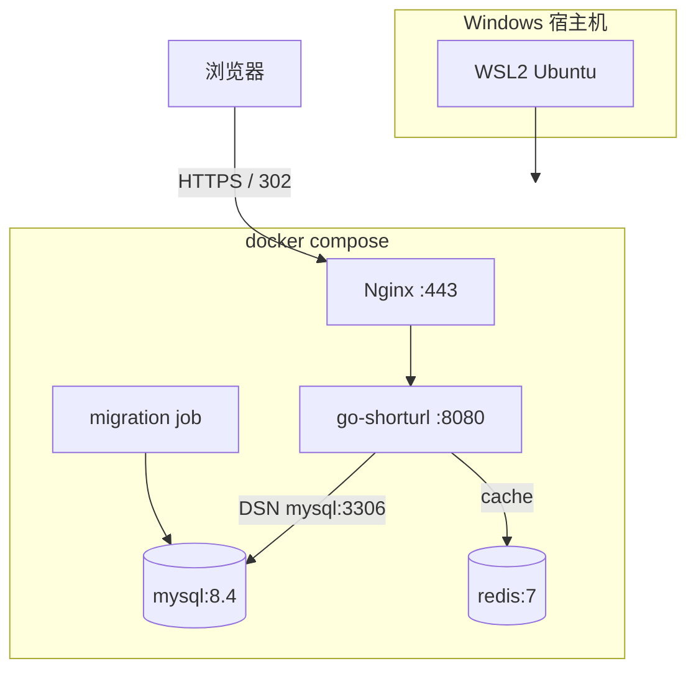

# Docker 与 Linux 部署 Go 服务

<!-- 修改说明: 2026-07-14 在原 EXPANSION-STANDARD 基础上补齐短链项目的健康探针、资源与秘密管理、版本化迁移、Nginx HTTPS、CI/CD、回滚和运行期恢复 -->
<!-- 修改说明: 2026-07-26 按审查报告修复 18 项问题：go build 双 cache mount、新增 .dockerignore/§2.4、Docker 与 K8s 探针语义对照、migrate 加 profiles、secret 文件 uid 权限、GOMAXPROCS Go1.25+ 原生容器感知、Nginx keepalive 前提与容器化 nginx/certbot、新增 §4.5 Go 配套代码完整可编译清单（已实测编译）、新增 §6.3 部署脚本与 §6.5 备份恢复、mysql:8.4、IMAGE_TAG 统一 sha- 前缀、补日志轮转/distroless/trivy/buildx/系统自启等缺失知识点，并为 Windows PowerShell 学习者补齐命令行约定 -->
<!-- 修改说明: 2026-07-26 二次复核：逐条核对审查报告 18 项问题与 10 个缺失知识点，确认均已落实；§4.5 deploy-demo 以 Go 1.26.5 + golang-migrate v4.19.1 + go-sql-driver v1.10.0 重新实测 go vet/go build 通过；修正 §3.3 中 .example 模板复制发生在 chown 之后需 sudo 的权限细节 -->
<!-- 修改说明: 2026-07-27 去模板化精简：删除知识地图/建议学习时长/学完你能做什么/闭卷自测与参考答案/费曼检验/EXPANSION-STANDARD 尾注等仪式性板块；「本章与上一章的关系」删除，其架构图与部署对象说明并入 §0.1；FAQ 板块拆解——7 条有增量的技术要点（单阶段镜像体积、Hyper-V 后端、volume 存储位置、down -v 风险、热更新与 air、Go/Java 镜像差异、--wait 卡住排查）并入对应正文小节，其余条目经核对为正文已有同等深度表述后删除；原 §0.6 命令行约定重编号为 §0.3 并修正全文交叉引用；全部代码块原样保留 -->
<!-- 修改说明: 2026-07-27 精简复核：对照精简前备份逐项核验——FAQ 18 条中 7 条并入正文、其余 11 条正文均有同等深度表述，自测答案无正文缺失要点，全部 § 交叉引用可达且代码块与备份逐字节一致；修正一处沿袭自旧版的练习编号错引（§3.5 的 GOMEMLIMIT 压测应指 L2 练习 7，原误写练习 6） -->

> **文件编码**：UTF-8。
> **技术栈版本**：Go 1.26.x、Compose v2、MySQL 8.4 LTS、Redis 7、Nginx stable；镜像小版本应由 Dependabot/Renovate 提示升级，并经过 CI、E2E 与回滚演练验证。
> **关联章节**：
> - [12 单元测试日志与配置工程化](./12-单元测试日志与配置工程化.md)（viper 配置、优雅停机）
> - [11 短链服务项目实战（下）](./11-短链服务项目实战下.md)（待部署的 Go 短链服务）
> - [Linux 07 Docker 与 Compose](../Linux/07-Docker与Compose.md)（镜像/容器/volume 系统讲解）
> - [系统设计 08 短链服务设计](../系统设计/08-短链服务设计.md)（MySQL+Redis+302 架构对照）

---

## 0. 读前导读（零基础也能跟上）

### 0.1 用一句话弄懂本章

**一句话**：本章不止把短链“塞进 Docker”，而是完成一条可重复发布链路：不可变镜像、秘密注入、独立迁移、存活/就绪探针、资源边界、Nginx HTTPS、自动化部署、冒烟检查与可操作的回滚方案。

**生活类比**：

| 概念 | 类比 |
|------|------|
| **多阶段构建** | 大厨房做菜（编译），上菜只端盘子（最小运行时镜像） |
| **scratch / alpine 运行时** | 外带盒只要饭，不要整套厨具 |
| **`.dockerignore`** | 打包行李前的排除清单：脏衣服（secrets）绝不进箱子 |
| **compose 服务名** | 套餐里每道菜有代号，App 喊 `mysql` 不用记 IP |
| **liveness / readiness** | 人还醒着 vs 厨房已备好、可以接客 |
| **资源限制** | 每桌限定座位和用电，不能挤垮整家店 |
| **secret** | 密码锁进保险箱，不能印在菜单和镜像里 |
| **migration job** | 开店前由一支施工队升级厨房，不能所有服务一起砸墙 |
| **回滚** | 新菜出问题立刻切回上一份已验证菜单 |
| **WSL2** | Windows 里开一间 Linux 小厨房跑 Docker |

**术语（Multi-stage Build）**：一个 Dockerfile 里多个 `FROM`，前一阶段编译，后一阶段只 COPY 二进制。
**为什么重要**：Go 编译产物单文件，镜像可 < 30MB；比 [Linux 07 章](../Linux/07-Docker与Compose.md) Java jar 镜像更轻（无 JVM，启动秒级，内存占用通常更低），但 compose 编排思路一致。

**部署对象与整体拓扑**：[11 章](./11-短链服务项目实战下.md) 的短链服务是本章部署对象；[12 章](./12-单元测试日志与配置工程化.md) 已用 viper 外置 `mysql.dsn`、`redis.addr` 并实现 `Shutdown` 优雅停机——代码具备「可部署」形态。[08 短链设计](../系统设计/08-短链服务设计.md) 里的 Redis 缓存层、MySQL 持久化与 302 跳转，落到本章就是下图 compose 三件套的最小可运行拓扑：


```mermaid
flowchart TB
    subgraph win [Windows 宿主机]
        WSL[WSL2 Ubuntu]
    end
    subgraph compose [docker compose]
        Nginx[Nginx :443]
        Migrate[migration job]
        App[go-shorturl :8080]
        MySQL[(mysql:8.4)]
        Redis[(redis:7)]
    end
    WSL --> compose
    Nginx --> App
    Migrate --> MySQL
    App -->|DSN mysql:3306| MySQL
    App -->|cache| Redis
    Browser[浏览器] -->|HTTPS / 302| Nginx
```

图中 Nginx 画在 compose 内——对应的 `nginx`/`certbot` 服务在 §6.1 追加进 §3.1 的 compose 文件；§3 阶段你先只跑 mysql + redis + app 三件套。

### 0.2 你需要提前知道什么

| 水平 | 建议 |
|------|------|
| 未装 Docker | 先看 [Linux 07 章](../Linux/07-Docker与Compose.md) 的安装小节装好 Engine |
| Windows 纯宿主机 | 装 **Docker Desktop + WSL2** 后端 |
| 只会 `go run .` | 先 [12 章 viper](./12-单元测试日志与配置工程化.md) 外置 DSN |
| 短链业务不懂 | 回 [11 章](./11-短链服务项目实战下.md) + [08 设计](../系统设计/08-短链服务设计.md) |

### 0.3 Windows 学习者的命令行约定（本章通用，务必先读）

本章是“部署”章，大部分命令天然运行在 Linux 里。约定如下：

1. **默认执行环境**：代码块标注 `bash` 的命令，默认在 **WSL Ubuntu 终端**（或服务器 SSH）里执行；标注 `powershell` 的在 Windows PowerShell 里执行；正文标注“**服务器上**”的命令（`systemctl`、`crontab`、`chown` 等）只在 Linux 侧有意义。
2. **环境变量语法不同**：bash 可以写 `IMAGE_TAG=xxx docker compose ...`（临时变量前缀）或 `export IMAGE_TAG=xxx`；PowerShell **没有**前缀语法，必须写：

   ```powershell
   $env:IMAGE_TAG = "sha-abc1234"; docker compose up -d
   ```

3. **curl 是坑**：PowerShell 5.1 里 `curl` 是 `Invoke-WebRequest` 的别名，参数完全不兼容。在 PowerShell 里请用 Windows 10+ 自带的 `curl.exe`，或用 `Invoke-RestMethod`：

   ```powershell
   curl.exe -fsS http://127.0.0.1:8080/readyz
   curl.exe -I  http://127.0.0.1:8080/abc123     # 看 302 与 Location 头
   Invoke-RestMethod http://127.0.0.1:8080/readyz # 等价：直接把 JSON 解析成对象
   ```

4. **换行续行符不同**：bash 用 `\`，PowerShell 用反引号 `` ` ``。抄多行 bash 命令到 PowerShell 时，最稳妥是合并成一行。
5. Docker Desktop 装好后，`docker`/`docker compose` 命令本身在 PowerShell 和 WSL 里都能用（连的是同一个 Docker 引擎），差别只在上面这些 shell 语法。

---

## 1. Go 服务部署前要检查什么

| 检查项 | 命令/位置 | 说明 |
|--------|-----------|------|
| 配置外置 | 12 章 viper | 禁止镜像内写死密码 |
| 监听地址 | `:8080` 非 `127.0.0.1` | 容器外要能访问 |
| CGO | 尽量 `CGO_ENABLED=0` | 静态链接，alpine 可跑 |
| 构建上下文 | `.dockerignore` 排除 `.git`、secrets、`.env` | `COPY . .` 只复制干净内容（§2.4） |
| 应用侧配套 | `*_FILE` 读取、探针、`migrate up`/`healthcheck` 子命令 | Go 完整实现见 §4.5 |
| 存活探针 | `/livez` 只判断进程能否服务 | 不查 MySQL/Redis（语义见 §3.4） |
| 就绪探针 | `/readyz` 判断硬依赖、schema | 未准备好时不应放量 |
| 指标 | `/metrics` 仅内网可访问 | 部署后验证 RED、资源和依赖状态 |
| 迁移 | `migrate`/`goose` 独立 job | 禁止靠 `init.sql` 或多副本 AutoMigrate |
| 停机 | HTTP、producer、consumer 分阶段 drain | `stop_grace_period` 大于应用超时 |
| 安全 | 非 root、只读根目录、secret 注入 | 镜像与 Compose 不含密码 |
| 恢复 | 备份已验证、上一镜像 tag 可用 | 发布失败能恢复而不是现场改容器 |

---

## 2. 多阶段 Dockerfile

先回答一个常见疑问：Go 一定要用多阶段构建吗？单阶段 `FROM golang` 也能把服务跑起来，但完整编译工具链会一起进生产镜像（800MB+）；多阶段构建让运行时镜像只含静态二进制与必要证书，体积压到 30MB 以内、攻击面也小得多——这是 Go 部署的最佳实践，没有理由不用。

### 2.1 推荐模板

先补一个新概念：**BuildKit cache mount**。`RUN --mount=type=cache,target=某目录` 表示“在执行这一条 `RUN` 期间，把一块可跨构建复用的缓存目录挂到这个路径上”。它有两个关键性质：

1. 缓存内容**不进镜像层**——所以不会撑大镜像，也不会泄漏到 `docker history`；
2. 缓存**只在挂了它的那条 `RUN` 里可见**——这正是最容易踩的坑：如果 `go mod download` 在挂了 `/go/pkg/mod` 的 RUN 里下载依赖，而 `go build` 那条 RUN **没有**挂同一个目录，那么编译时模块缓存目录是空的，Go 会把全部依赖**重新下载一遍**，前一步完全白做。因此下面模板里 `go build` 同时挂了**两个**缓存。

```dockerfile
# syntax=docker/dockerfile:1

FROM golang:1.26-alpine AS builder
ARG TARGETOS
ARG TARGETARCH
ARG VERSION=dev
ARG COMMIT=unknown
WORKDIR /src
RUN apk add --no-cache git ca-certificates
COPY go.mod go.sum ./
RUN --mount=type=cache,target=/go/pkg/mod go mod download && go mod verify
COPY . .
# 这条 RUN 必须同时挂两个缓存：
#   /go/pkg/mod           模块缓存（上一步下载的依赖在这里，不挂 = 重新全量下载）
#   /root/.cache/go-build 编译对象缓存（改一行代码只重编受影响的包）
RUN --mount=type=cache,target=/go/pkg/mod \
    --mount=type=cache,target=/root/.cache/go-build \
    CGO_ENABLED=0 GOOS=${TARGETOS:-linux} GOARCH=${TARGETARCH:-amd64} \
    go build -trimpath \
    -ldflags="-s -w -X main.version=${VERSION} -X main.commit=${COMMIT}" \
    -o /out/shorturl ./cmd/shorturl

FROM alpine:3.22
RUN apk add --no-cache ca-certificates tzdata
# 固定 uid/gid=10001：宿主机给 secret 文件授权时要用同一个数字（见 §3.3 步骤 1 详解）
RUN addgroup -S -g 10001 app && adduser -S -u 10001 -G app app
ENV TZ=Asia/Shanghai
WORKDIR /app
COPY --from=builder /out/shorturl /app/shorturl
EXPOSE 8080
USER app
ENTRYPOINT ["/app/shorturl"]
```

镜像内只放二进制、证书和时区；**不要 COPY 生产配置、`.env`、TLS 私钥或数据库密码**。非敏感默认值可编进程序，环境差异和 secret 在运行时注入。注意：光在文字上要求“不 COPY 密码”是不够的——`COPY . .` 会把整个构建上下文都复制进 builder 阶段，所以还必须写 `.dockerignore`（§2.4），两者配合才闭环。

上例假设 `main` 包定义了可被 `-X` 注入的 `var version = "dev"`、`var commit = "unknown"`（§4.5 的完整清单里就有这两个变量）；若变量位于 `internal/buildinfo`，把 ldflags 中的完整 import path 改成真实路径。

### 2.2 Dockerfile 逐行读

| 行号/指令 | 含义 | 改错会怎样 |
|-----------|------|------------|
| `golang:1.26-alpine AS builder` | 编译阶段，带完整工具链 | builder 版本低于 go.mod 要求会编译失败 |
| `go mod download` 在 COPY 源码前 | 只要 go.mod/go.sum 没变，这一层命中缓存 | 先 COPY . 会导致改一行代码就重新走下载层 |
| **go build 挂双 cache mount** | 模块缓存 + 编译缓存都复用 | 少挂 `/go/pkg/mod` → 每次构建全量重下依赖，网络抖动直接构建失败 |
| `TARGETOS/TARGETARCH` | 兼容 buildx 多架构（§2.6） | 固定 amd64 会在 ARM 主机 `exec format error` |
| `go mod verify` | 校验模块缓存内容 | 依赖损坏更早失败 |
| `-trimpath` + build metadata | 去本机路径并暴露版本/commit | 线上无法确认二进制来源 |
| `CGO_ENABLED=0` | 纯 Go 静态二进制 | 依赖 CGO 的库会 link 失败 |
| 受支持的 Alpine | 小型运行时（其他选择见 §2.5） | 生产再以 digest 锁定，定期升级补丁 |
| `adduser -u 10001` 固定 uid | secret 文件按 uid 授权可预期 | 不固定 uid，宿主机 chown 数字对不上，读 secret 报 permission denied |
| `USER app` | 非 root 运行 | 安全；需要写文件时显式挂载并授权 |
| 不 COPY 配置/secret + `.dockerignore` | 镜像可跨环境复用 | 密码会进入镜像历史，删除文件也不安全 |

### 2.3 构建

```bash
# WSL 或 PowerShell 均可执行（$(git rev-parse ...) 两种 shell 都支持）
docker build --build-arg VERSION=dev --build-arg COMMIT=$(git rev-parse --short HEAD) -t shorturl:dev .
```

想用 compose 一键“边构建边起全栈”，需要先有 §3.1 的 compose 文件和文末的本地 override（`build: .`），届时命令是：

```bash
# bash（WSL）
IMAGE_TAG=dev docker compose up -d --build
```

```powershell
# PowerShell
$env:IMAGE_TAG = "dev"; docker compose up -d --build
```

正式发布使用 `registry.example.com/shorturl:sha-<commit>` 或镜像 digest，禁止只推可变的 `latest`（tag 前缀与 §6.2 CI 保持一致）。`/version` 或启动日志输出 `version/commit/build_time`，故障时能立刻确认运行的是哪一版——`/version` 端点实现见 §4.5。

顺带澄清「热更新」：容器部署没有改代码即生效一说——开发期在本地用 `go run .`（或 air 之类热重载工具）快速迭代；部署产物有任何改动都必须重新构建镜像、按新 tag 发布，这正是不可变镜像的含义（§2.1 的缓存设计让增量构建只需数秒，成本可接受）。

### 2.4 `.dockerignore`：构建上下文的“gitignore”（必须写）

**为什么必须有**：`docker build .` 的最后那个 `.` 叫**构建上下文**——Docker 会先把这个目录（除被 `.dockerignore` 排除的部分）整个打包发给构建引擎，`COPY . .` 复制的就是它。关键在于：**`.gitignore` 只管 Git，完全不影响构建上下文**。本章 secrets 就放在项目目录 `./deploy/secrets/` 下，只写 `.gitignore` 的话，`COPY . .` 仍会把明文密码复制进 builder 阶段镜像层（`docker history`、构建缓存导出都可能暴露）。这是真实的泄漏路径，不是理论风险。

```text
# 文件：.dockerignore（与 Dockerfile 同级）
.git
.gitignore
deploy/secrets/
.env
.env.*
*.pem
*.key
compose.override.yaml
coverage.out
backup/
```

**验证 secrets 真的没进镜像**（构建后立刻做一次，也是 L1 练习 4）：

```bash
# 只构建到 builder 阶段并进去看：deploy/secrets 应该根本不存在
docker build --target builder -t shorturl:ctx-check .
docker run --rm shorturl:ctx-check ls /src/deploy/secrets
# 期望输出：ls: /src/deploy/secrets: No such file or directory
```

（`--target builder` 是多阶段构建的调试技巧：只构建到指定阶段为止，便于检查中间产物。）

### 2.5 运行时镜像三选一与镜像扫描

| 运行时基础镜像 | 大小 | 自带 | 适合 | 代价 |
|----------------|------|------|------|------|
| `alpine:3.22`（本章默认） | ~8MB | shell、apk、CA 证书可装 | 需要进容器排障、装诊断工具 | 攻击面略大于下两者 |
| `gcr.io/distroless/static-debian12:nonroot` | ~2MB | CA 证书、tzdata、nonroot 用户（uid 65532），**无 shell** | 追求最小攻击面的生产镜像 | 不能 `docker exec` 进去敲命令；healthcheck 不能用 wget |
| `scratch` | 0 | 什么都没有 | 极致最小 | CA 证书、时区、非 root 用户全要自己解决 |

distroless 版第二阶段（**片段**：替换 §2.1 模板的第二个 `FROM` 块，第一阶段不变）：

```dockerfile
# 片段：§2.1 的运行时阶段换成 distroless
FROM gcr.io/distroless/static-debian12:nonroot
COPY --from=builder /out/shorturl /app/shorturl
EXPOSE 8080
USER nonroot
ENTRYPOINT ["/app/shorturl"]
```

注意三点：① 无 shell 意味着 compose healthcheck 不能写 `wget`/`sh -c`——本章 §4.5 给二进制实现了 `healthcheck` 子命令，`test: ["CMD", "/app/shorturl", "healthcheck"]` 在 distroless 里照样能用；② nonroot 的 uid 是 **65532**，宿主机 secret 文件要 `chown 65532` 而不是 10001；③ 国内拉取 `gcr.io` 可能需要镜像代理。

**镜像漏洞扫描**（trivy，容器方式免安装，WSL 或 PowerShell 均可执行；特意写成一行——bash 的 `\` 续行在 PowerShell 里是语法错误，见 §0.3 第 4 条）：

```bash
docker run --rm -v /var/run/docker.sock:/var/run/docker.sock aquasec/trivy:latest image --severity HIGH,CRITICAL shorturl:dev
```

输出会列出基础镜像与依赖的 CVE。把它加进 CI（或至少每次升级基础镜像时手动跑），HIGH/CRITICAL 不清零不发布——这就是 §4.2 里“镜像层扫描”的具体动作。

### 2.6 多架构构建（buildx）

§8 报错表里的 `exec format error` 就是架构不匹配：比如在 M 系 Mac（ARM）上构建的镜像拉到 x86 VPS 上跑。解决工具是 buildx：

```bash
# 一次性：创建支持多平台的 builder 并启用
docker buildx create --name multi --use

# 同时构建 amd64 + arm64 并推送（多架构清单必须 --push，不能只留在本地）
docker buildx build \
  --platform linux/amd64,linux/arm64 \
  --build-arg VERSION=sha-abc1234 --build-arg COMMIT=abc1234 \
  -t ghcr.io/your-name/shorturl:sha-abc1234 \
  --push .

# 只想本地验证单一架构时用 --load
docker buildx build --platform linux/amd64 -t shorturl:dev --load .
```

§2.1 模板里的 `ARG TARGETOS`/`ARG TARGETARCH` 由 buildx 按目标平台自动注入，`go build` 据此交叉编译——这就是那两个 ARG 存在的意义。

---

## 3. docker-compose 全栈编排

> 本节 compose 假设你的二进制已支持三件事：读取 `*_FILE` secret、`migrate up` 子命令、`healthcheck` 子命令。**它们的 Go 实现完整清单在 §4.5**，可以先跳过去把代码看懂（甚至先在 Windows 上跑通 deploy-demo），再回来跟做本节。

### 3.1 `docker-compose.yml`

```yaml
name: shorturl

# YAML 锚点（&名字 定义、*名字 引用）：日志配置写一遍，四个服务共用。
# json-file 是默认日志驱动，但默认**不限制大小**——单机跑几个月，
# 日志就可能撑爆磁盘，必须显式轮转（详见 §3.6）。
x-default-logging: &default-logging
  driver: json-file
  options:
    max-size: "10m"
    max-file: "3"

services:
  mysql:
    image: mysql:8.4
    environment:
      MYSQL_DATABASE: shorturl
      MYSQL_USER: shorturl_app
      MYSQL_PASSWORD_FILE: /run/secrets/mysql_app_password
      MYSQL_ROOT_PASSWORD_FILE: /run/secrets/mysql_root_password
    secrets:
      - mysql_app_password
      - mysql_root_password
    volumes:
      - mysql_data:/var/lib/mysql
    networks:
      - backend
    healthcheck:
      test: ["CMD-SHELL", "MYSQL_PWD=\"$$(cat /run/secrets/mysql_root_password)\" mysqladmin ping -h 127.0.0.1 -uroot --silent"]
      interval: 5s
      timeout: 3s
      retries: 10
      start_period: 20s
    mem_limit: 768m
    cpus: 1.0
    pids_limit: 200
    restart: unless-stopped
    logging: *default-logging

  redis:
    image: redis:7-alpine
    # 这是可重建的 Cache 实例；Streams/INCR 发号不能放在这个淘汰域（§4.4）
    command: ["redis-server", "--save", "", "--appendonly", "no", "--maxmemory", "192mb", "--maxmemory-policy", "allkeys-lru"]
    networks:
      - backend
    healthcheck:
      test: ["CMD", "redis-cli", "ping"]
      interval: 5s
      timeout: 3s
      retries: 5
    mem_limit: 256m
    cpus: 0.50
    pids_limit: 100
    restart: unless-stopped
    logging: *default-logging

  migrate:
    image: ghcr.io/your-name/shorturl:${IMAGE_TAG:?set IMAGE_TAG}
    # ENTRYPOINT 是 /app/shorturl，拼上 command 即执行 `/app/shorturl migrate up`
    # ——这个子命令的 Go 实现见 §4.5
    command: ["migrate", "up"]
    # profiles：裸 `docker compose up -d` 不会启动它；
    # 只有 `docker compose --profile ops run --rm migrate` 才执行。
    # 这样迁移永远是显式的发布步骤，而不是启动副作用。
    profiles: ["ops"]
    environment:
      APP_MYSQL_DSN_FILE: /run/secrets/mysql_dsn
    secrets:
      - mysql_dsn
    networks:
      - backend
    depends_on:
      mysql:
        condition: service_healthy
    restart: "no"
    logging: *default-logging

  app:
    image: ghcr.io/your-name/shorturl:${IMAGE_TAG:?set IMAGE_TAG}
    ports:
      - "127.0.0.1:8080:8080" # 本地验证用；生产流量走 §6.1 的 nginx
    environment:
      APP_MYSQL_DSN_FILE: /run/secrets/mysql_dsn
      APP_REDIS_ADDR: "redis:6379"
      APP_LOG_ENV: "prod"
      APP_SERVER_ADDR: ":8080"
      # mem_limit=256m 的 85% 左右，给线程栈/网络缓冲留余量；
      # 这是练习起点，压测后校准（§3.5）
      GOMEMLIMIT: "220MiB"
    secrets:
      - mysql_dsn
    networks:
      - frontend
      - backend
    depends_on:
      mysql:
        condition: service_healthy
      # Redis 是可降级缓存，不作为 App 启动硬门槛；
      # 客户端需自行短超时、重连和降级（§3.4 最小决策、§4.4）。
    healthcheck:
      # 直接执行二进制的 healthcheck 子命令（实现见 §4.5）：
      # 它对本机 /readyz 发一次带超时的 GET，非 200 则 exit 1。
      # alpine 里也可写 ["CMD", "wget", "-qO-", "http://127.0.0.1:8080/readyz"]，
      # 但子命令写法换 distroless（§2.5）也能用。
      test: ["CMD", "/app/shorturl", "healthcheck"]
      interval: 10s
      timeout: 3s
      retries: 3
      start_period: 10s
    read_only: true
    tmpfs:
      - /tmp:size=32m,noexec,nosuid
    cap_drop:
      - ALL
    security_opt:
      - no-new-privileges:true
    mem_limit: 256m
    cpus: 1.0
    pids_limit: 150
    ulimits:
      nofile:
        soft: 65535
        hard: 65535
    stop_grace_period: 15s
    restart: unless-stopped
    logging: *default-logging

networks:
  frontend: {}        # nginx ↔ app（§6.1 的 nginx 服务会加入这个网络）
  backend:
    internal: true    # mysql/redis 只活在内网：既出不了公网，公网也进不来

volumes:
  mysql_data:

secrets:
  mysql_app_password:
    file: ./deploy/secrets/mysql_app_password.txt
  mysql_root_password:
    file: ./deploy/secrets/mysql_root_password.txt
  mysql_dsn:
    file: ./deploy/secrets/mysql_dsn.txt
```

**本地开发 override**：compose 会自动加载同目录的 `compose.override.yaml`。把它提交到仓库（本地与 CI 用），生产部署脚本用 `COMPOSE_FILE=docker-compose.yml` 只加载主文件（见 §6.3 deploy.sh），两边互不干扰：

```yaml
# 文件：compose.override.yaml —— 本地/CI 用；生产脚本会显式忽略它
services:
  app:
    build: .
    image: ghcr.io/your-name/shorturl:${IMAGE_TAG:-dev}
  migrate:
    build: .
    image: ghcr.io/your-name/shorturl:${IMAGE_TAG:-dev}
```

生产 Compose 只引用 CI 已推送的不可变镜像；`${IMAGE_TAG:?set IMAGE_TAG}` 能阻止忘记指定版本时误拉 `latest`。

**为什么是 `mysql:8.4`**：MySQL 8.0 的延长支持已于 2026 年 4 月结束，当前教学与生产默认版本应是 8.4 LTS。对本项目最相关的差异是 8.4 默认禁用了旧的 `mysql_native_password` 认证插件——但 go-sql-driver/mysql 早已原生支持默认的 `caching_sha2_password`，所以应用侧 DSN 无需任何改动，基本无感。

上面的资源值是练习起点，不是通用最优值。压测时观察容器 CPU/内存、Go heap/GC、连接池和 P99，再调整；资源边界的意义是故障隔离，而不是把数字写得越小越高级。

这里的 `redis` 明确是可重建的缓存实例。14 章选择 Redis Streams 后，应新增独立 `redis-events`（`noeviction`、AOF、独立 volume/告警）或改用 RabbitMQ；若短码使用 Redis `INCR` 发号，计数器同样要放在持久化、不可淘汰的实例。不要让缓存的 LRU 策略删除事件或重置发号状态。

### 3.2 compose 逐行读（对照 Linux 07 章 Compose 小节）

| 字段 | 含义 | 常见错误 |
|------|------|----------|
| `mysql:3306` 主机名 | Docker 内置 DNS 解析服务名（同一网络内可达任意监听端口，无需 `expose`） | 写 127.0.0.1 连到 app 自己 |
| `networks` + `internal: true` | backend 是纯内网：mysql/redis 与公网双向隔离 | 忘记给 app 同时挂 frontend，nginx 就连不上它 |
| `depends_on.condition` | 首次启动只等待硬依赖 MySQL healthy | Redis 作为软依赖并行启动；运行期断线仍要由客户端重连/降级 |
| `volumes mysql_data` | 删容器不丢库 | 无 volume 重启数据清空 |
| `migrate` + `profiles: ["ops"]` | 一次性发布步骤，裸 `up -d` 不会误触发；执行顺序由 §6.3 deploy.sh 保证 | 想让 Compose 强制顺序：去掉 profiles，给 app 加 `depends_on: migrate: condition: service_completed_successfully`（两种方案二选一，不可混用） |
| `*_FILE` + secrets | secret 以只读文件注入 | 应用必须实现读取文件（§4.5）；Compose secret 本身不等于云 KMS |
| `logging` 锚点 | json-file 轮转，防日志吃满磁盘 | 不配置 = 无上限（§3.6） |
| `read_only/cap_drop` | 缩小容器攻击面 | 应用写临时文件需显式 tmpfs |
| `mem_limit/cpus/pids_limit` + `GOMEMLIMIT` | 防单容器吃光宿主机；GC 联动见 §3.5 | 过小会 OOM/限速，需压测校准 |
| `stop_grace_period` | 给 12 章 graceful shutdown 留时间 | 应大于应用 shutdown timeout |
| `restart: unless-stopped` | 宿主机重启后自动拉起（前提：dockerd 开机自启，见 §5.2） | — |

**volume 数据存在哪、怎么重置**：named volume（如 `mysql_data`）不在项目目录下，而在 Docker 管理的目录里——WSL/Linux 是 `/var/lib/docker/volumes/`，Windows Docker Desktop 则在 WSL 虚拟磁盘内。想清空本地练习数据，仅在确认是一次性环境时才可 `docker compose down -v`——它会**永久删除**所有 volume（MySQL 数据一并清空）；生产环境绝不以删 volume 的方式修问题，schema 问题走 migration，数据问题走备份与恢复流程（§6.5）。

### 3.3 启动步骤表

| 步骤 | 你的动作 | 预期看到什么 | 若不对 |
|------|----------|--------------|--------|
| 1 | 生成 `deploy/secrets/*`（详见下方“步骤 1 详解”），`.gitignore` 与 `.dockerignore` 都已排除 | 权限、属主符合详解要求 | 禁止提交真实 secret |
| 2 | `export IMAGE_TAG=sha-<commit>` 后 `docker compose --profile ops pull` | 拉到指定不可变镜像 | `manifest unknown` → 检查 sha- 前缀与 CI 是否推送（§8） |
| 3 | `docker compose --profile ops run --rm migrate` | exit 0，日志打印 schema version | 失败立即停止发布 |
| 4 | `docker compose up -d --wait --wait-timeout 60` | 命令阻塞到全部 healthy 才返回 0（migrate 有 profile，不会被再次拉起） | 超时返回非 0，看 `compose ps` 与日志 |
| 5 | `curl -fsS localhost:8080/livez` 与 `/readyz`（PowerShell 用 `curl.exe`，§0.3） | 都返回 200 | 按 §3.4 区分进程/依赖问题 |
| 6 | POST 创建 + `curl -I localhost:8080/{code}` | 返回 short code 与 `302 Location` | 查看 request ID 日志和指标 |

`--wait` 是“脚本化等 readiness”的现成实现：`up -d --wait` 会一直等到所有带 healthcheck 的服务变 healthy（或到 `--wait-timeout` 超时并返回非零），§6.3 的 deploy.sh 靠它把“等待 /readyz、有总超时”变成一行命令。

**步骤 1 详解：生成 secret 文件（含一个必踩的 uid 坑）**

Compose 的 file secret 本质是把宿主机文件**只读 bind mount** 到容器 `/run/secrets/<名字>`，并且**保留宿主机文件的属主（uid）和权限**。而 §2.1 的 Dockerfile 用 `USER app`（uid=10001）运行——如果 secret 文件是 `root:root 600`，容器里 uid 10001 的进程读它就是 `permission denied`，服务直接起不来。所以不同 secret 要按“容器里谁来读”分别授权：

```bash
# 服务器上 / WSL（bash）。注意：项目要放在 Linux 文件系统（如 ~/projects），
# /mnt/c、/mnt/f 下 chown/chmod 默认不生效（§5.1）。
mkdir -p deploy/secrets && chmod 700 deploy/secrets

# 示例口令仅供本地练习；真实环境用 openssl rand -base64 24 生成。
# 密码里避免 @ : / 等字符——它们会破坏 DSN 解析（或需 URL 转义）。
printf '%s' 'App_Pass_123'  > deploy/secrets/mysql_app_password.txt
printf '%s' 'Root_Pass_456' > deploy/secrets/mysql_root_password.txt
printf '%s' 'shorturl_app:App_Pass_123@tcp(mysql:3306)/shorturl?parseTime=true' \
  > deploy/secrets/mysql_dsn.txt

# ① 两个 MySQL 密码文件：mysql 官方镜像的 entrypoint 以 root 读取后再降权
#    → root:root 600 即可
sudo chown root:root deploy/secrets/mysql_app_password.txt deploy/secrets/mysql_root_password.txt
sudo chmod 600       deploy/secrets/mysql_app_password.txt deploy/secrets/mysql_root_password.txt

# ② DSN 文件：由 app/migrate 容器里 uid=10001 的进程读取
#    → 属主必须是 10001（数字与 Dockerfile 的 adduser -u 10001 对应）
sudo chown 10001:10001 deploy/secrets/mysql_dsn.txt
sudo chmod 400         deploy/secrets/mysql_dsn.txt
```

两个细节：`printf '%s'` 不带换行，配合 §4.5 loadSecret 的 `TrimSpace` 双保险；DSN 里的密码必须和 `mysql_app_password.txt` 完全一致，否则报 `Access denied`（§8）。

最后，给每个 secret 提交一份 `.example` 模板（占位口令，内容不敏感，可进 Git）：

```bash
# 注意要用 sudo：上面已把三个 .txt 分别 chown 成 root/10001 且 chmod 600/400，
# 部署用户直接 cp 会 permission denied；模板内容不敏感，放开为当前用户可读的 644
for f in mysql_app_password mysql_root_password mysql_dsn; do
  sudo cp "deploy/secrets/$f.txt" "deploy/secrets/$f.txt.example"   # 练习环境内容相同即可
  sudo chown "$(id -u):$(id -g)" "deploy/secrets/$f.txt.example"
  sudo chmod 644 "deploy/secrets/$f.txt.example"
done
git add -f deploy/secrets/*.example    # -f：.gitignore 排除了整个目录，模板显式加回
```

模板的用途：CI 和新同事的机器上没有真实 secret 文件，但 compose 的 `secrets.file` 引用的文件必须存在——§6.3 的 e2e 脚本会自动用 `.example` 生成本地文件，练习/CI 用占位口令即可跑通全栈。

### 3.4 `/livez` 与 `/readyz` 不能混成一个 `/healthz`

| 端点 | 回答的问题 | 应检查 | 不应检查 |
|------|------------|--------|----------|
| `/livez` | 进程是否还活着、HTTP loop 是否响应 | 进程内部状态、是否卡死 | MySQL/Redis/MQ 网络 |
| `/readyz` | 当前实例是否应该接收新请求 | 配置已加载、migration 版本、硬依赖 MySQL | 可降级的 Redis/MQ 不应一刀切 |

（两个 handler 的完整 Go 实现见 §4.5。）

**先分清两套语义——Docker healthcheck ≠ Kubernetes 探针**。这是面试高频混淆点，也直接决定你排障时去看什么：

| 行为 | Docker/Compose healthcheck | Kubernetes 探针 |
|------|----------------------------|------------------|
| 检查失败后 | 只把容器状态标为 `unhealthy`，**别的什么都不做** | livenessProbe 失败 → **重启容器** |
| 摘流量 | **不会**。Nginx/上游照常转发 | readinessProbe 失败 → 从 Service 端点摘除 |
| 谁消费状态 | `depends_on: service_healthy`、`up -d --wait`、`docker ps` 展示 | kubelet + Service/EndpointSlice |
| 自动重启 | 仅进程**退出**时按 `restart:` 策略拉起 | liveness 连续失败即杀掉重建 |

对应到本章：compose 里真正被自动调用的只有 `/readyz`（通过 healthcheck 子命令）；`/livez` 此刻**没有任何组件自动访问**，它是给手工排障、未来迁移 K8s 或接外部负载均衡准备的。所以“Redis 抖动 → liveness 探针误查软依赖 → 全体实例重启风暴”是 **K8s 场景**的事故（§8 报错表已注明前提）；在纯 Compose 下 unhealthy 不会自愈，需要配告警（或 autoheal 类组件）+ 人工/脚本处理。但两个端点的**设计原则**在两套环境通用，现在分清楚，上 K8s 时零改造。

**本章的最小降级决策**（先给可执行结论，14 章的完整降级矩阵是它的细化）：

1. `/readyz` 只检查两件事：MySQL 可连（带超时的 Ping）+ schema version 存在且不 dirty；
2. Redis 故障**不影响** ready：打降级日志/指标并告警，Redirect 回源 MySQL；
3. MySQL 故障时，Create 与 cache miss 的 Redirect 返回 **503**（绝不能伪装 404），`/readyz` 返回 503。

探针响应应快速、有超时、无敏感信息，例如：

```json
{"status":"ready","version":"1.0.0","checks":{"mysql":"ok","schema":"ok(version=1)"}}
```

不要在探针里执行复杂 SQL，也不要把依赖错误细节（含地址、密码的 error 字符串）原样回显。`depends_on` 只解决首次启动顺序，不能替代应用连接重试、context timeout、熔断和运行期恢复。

### 3.5 资源边界与 Go 运行时

- **GOMEMLIMIT 与容器内存限制联动**：设为容器限制的约 80%～90%（§3.1 里 `mem_limit: 256m` 配 `GOMEMLIMIT: 220MiB`），给线程栈、mmap、网络缓冲留余量；逼近上限时 GC 会更积极，避免直接被 OOMKill。最终数值用压测验证（L2 练习 7）。
- **GOMAXPROCS：Go ≥ 1.25 已原生容器感知**。Go 1.25 起 runtime 默认读取 cgroup 的 CPU 带宽配额来设置 GOMAXPROCS（配额向上取整，下限为 2，且不超过机器核数），并在运行期动态感知配额变化。因此本章的 Go 1.26 **不需要** `uber-go/automaxprocs`——该库只服务仍在维护的 Go ≤ 1.24 项目（它自己的 README 也这么说）。面试常问“容器里 GOMAXPROCS 为什么不该等于宿主机核数”：超出 CPU quota 的并行线程只会被 throttle，白白增加调度与 GC 开销。
- **动手验证**（完整清单，两分钟做完）：

  ```go
  // 文件：maxprocs/main.go —— 验证容器 CPU 配额感知
  package main

  import (
      "fmt"
      "runtime"
  )

  func main() {
      fmt.Println("NumCPU     =", runtime.NumCPU())
      fmt.Println("GOMAXPROCS =", runtime.GOMAXPROCS(0)) // 传 0 = 只读不改
  }
  ```

  ```bash
  # WSL 或 PowerShell（借 golang 镜像运行，不用写 Dockerfile）
  # 注意写 ${PWD} 而不是 $PWD：PowerShell 里 "$PWD:" 的冒号会被当成
  # 作用域限定符（类似 $env:）直接报错；${PWD} 在 bash 和 PowerShell 都合法
  cd maxprocs
  docker run --rm --cpus 1.0 -v "${PWD}:/src" -w /src golang:1.26-alpine go run .
  # 期望：NumCPU 显示宿主机核数；GOMAXPROCS = 2（quota=1 向上取整后受下限 2 约束）
  docker run --rm --cpus 4 -v "${PWD}:/src" -w /src golang:1.26-alpine go run .
  # 期望：GOMAXPROCS = 4
  ```

- MySQL `SetMaxOpenConns` 要与数据库 `max_connections`、App 副本数一起计算。例如数据库允许 200，4 个副本不能各开 100。
- 所有后台 worker 使用固定并发和有界队列；禁止“每次点击起一个无限制 goroutine”。
- OOMKilled、CPU throttling、文件句柄耗尽都要有指标/告警，发生后先保留证据再重启。

### 3.6 容器日志轮转与磁盘治理

**为什么单列一节**：单机 VPS 最高频的“三个月后事故”就是磁盘被容器日志和无人清理的旧镜像撑满。json-file 驱动默认**不限大小**，App 每一行 stdout 都会永久追加在宿主机文件里。

§3.1 已用 YAML 锚点给每个服务配了 `max-size: "10m"` + `max-file: "3"`（单容器日志封顶 30MB，滚动覆盖）。日常巡查与清理命令：

```bash
# 服务器上：日志文件在哪、有多大
docker inspect --format '{{.LogPath}}' shorturl-app-1
sudo du -sh /var/lib/docker/containers/*/ | sort -h | tail -n 5

# 磁盘占用分布：镜像 / 容器 / volume / 构建缓存各占多少
docker system df

# 温和清理：只删悬空镜像（没有 tag、没有容器引用）
docker image prune -f

# 构建缓存清理：保留最近 5GB
docker builder prune -f --keep-storage 5GB
```

**清理前必须想一件事**：§6.4 的回滚依赖“上一 SHA 镜像还在”。`docker system prune -a` 这类激进命令会把未运行版本的镜像一并删掉——清理之前确认 registry 里能重新拉到旧版本，或本地保留最近 N 个发布 tag。

---

## 4. 配置、秘密与版本化迁移

### 4.1 配置优先级

推荐固定并写进 README：代码内安全默认值 `<` 非敏感 yaml `<` 环境变量 `<` `*_FILE` secret。启动后校验最终配置，但日志只输出脱敏摘要。

```yaml
server:
  addr: ":8080"
  read_timeout: 2s
  shutdown_timeout: 10s
redis:
  addr: "redis:6379"
  dial_timeout: 100ms
mysql:
  max_open_conns: 30
  max_idle_conns: 10
```

DSN、JWT 密钥、第三方 Token、TLS 私钥不出现在这个文件。实现统一 helper：若 `APP_MYSQL_DSN_FILE` 存在，则读取文件、去掉末尾换行并覆盖普通值；读取失败应在启动期明确报错——这个 helper 的完整实现就是 §4.5 的 `loadSecret` 函数（`os.ReadFile` + `strings.TrimSpace` + 启动期 `log.Fatalf`）。

### 4.2 secret 的层级与边界

| 环境 | 可接受方案 | 注意事项 |
|------|------------|----------|
| 本地个人开发 | `.env.local` / `deploy/secrets/*` | 必须同时进 `.gitignore` **和** `.dockerignore`（§2.4），提供 `.example` 模板 |
| CI | GitHub Actions Secrets / OIDC | secret 不写 job 输出，不传给不受信任 PR |
| 单机 VPS Compose | 部署用户只读文件挂载 | 属主 uid 要与容器内用户匹配（§3.3 步骤 1 详解）；Compose `secrets.file` 只是安全挂载，不负责加密存储 |
| 云生产 | 云 Secret Manager/KMS + 短期凭证 | 优先工作负载身份，避免长期 Access Key |

可用以下检查防止意外泄漏：Git 历史 secret scanner、镜像层扫描（trivy 用法见 §2.5）、`docker history`、日志脱敏测试。若 secret 已提交，**仅删除文件不够**：必须立即轮换凭证，再处理 Git 历史。

### 4.3 migration 是发布步骤，不是容器启动副作用

12 章已定义 migration 文件与 Expand/Contract 原则。本章执行顺序固定为：

```text
数据库备份/恢复点（§6.5）
 → 拉取 commit-SHA 镜像
 → 单独运行 docker compose --profile ops run --rm migrate
 → 核对 schema version
 → 启动新 App
 → 等待 readiness（up -d --wait）
 → 创建+跳转+统计 smoke test（§6.3 smoke.sh）
```

`migrate` 服务应与 App 使用同一个镜像版本，避免代码与迁移不匹配。多个主机部署时只允许一个发布 job 执行 migration；失败就停止发布，保留日志和当前 version。不要自动执行破坏性 `down`，代码回滚依赖 schema 向后兼容；数据恢复依赖已演练的备份。

### 4.4 短链运行期依赖分类

- MySQL：短链映射事实来源，硬依赖——本章 `/readyz` 只把它（和 schema version）作为就绪条件（§3.4 最小决策）。
- Redis：缓存和限流；Redirect 设计为回源降级，故障时保持 ready、打指标并告警。
- Redis Streams/RabbitMQ：点击统计异步链路；优先保证跳转可用，但必须暴露失败/积压/DLQ 指标。
- Prometheus：拉取指标的观测端，不应成为业务请求依赖。

依赖分类直接决定 readiness、超时、重试、告警与回滚行为，不能简单写成“任意 ping 失败就不健康”。14 章会把这套分类细化为完整的降级矩阵；在那之前，按 §3.4 的最小决策执行即可。

### 4.5 Go 侧配套代码：完整可编译清单（deploy-demo）

前面 compose 假设了三件应用侧能力：① `*_FILE` secret 读取；② `/livez` `/readyz` `/version` 端点；③ `migrate up` 与 `healthcheck` 子命令。这里给出一个**可独立编译、独立运行**的最小工程 deploy-demo（本节代码已在 Go 1.26 实测编译通过），先单独跑通，再按文末说明合并进 11 章短链项目。

**项目结构**：

```text
deploy-demo/
├── go.mod
├── main.go
└── migrations/
    ├── 0001_create_links.up.sql
    └── 0001_create_links.down.sql
```

**创建工程**（PowerShell，Windows 本机即可，无需 WSL）：

```powershell
mkdir deploy-demo; cd deploy-demo; mkdir migrations
go mod init deploy-demo
$env:GOPROXY = "https://goproxy.cn,direct"   # 国内加速，仅当前会话生效
go get github.com/golang-migrate/migrate/v4@v4.19.1
go get github.com/go-sql-driver/mysql@v1.10.0
```

**迁移文件**（golang-migrate 的命名约定：`<序号>_<描述>.up.sql` 升级、`.down.sql` 回退，序号决定执行顺序）：

```sql
-- 文件：migrations/0001_create_links.up.sql
CREATE TABLE IF NOT EXISTS links (
    id BIGINT UNSIGNED AUTO_INCREMENT PRIMARY KEY,
    code VARCHAR(16) NOT NULL,
    long_url VARCHAR(2048) NOT NULL,
    created_at DATETIME(3) NOT NULL DEFAULT CURRENT_TIMESTAMP(3),
    UNIQUE KEY uk_code (code)
) ENGINE=InnoDB DEFAULT CHARSET=utf8mb4;
```

```sql
-- 文件：migrations/0001_create_links.down.sql
DROP TABLE IF EXISTS links;
```

**主程序**（完整清单，可直接整文件复制）：

```go
// 文件：deploy-demo/main.go
package main

import (
	"context"
	"database/sql"
	"embed"
	"encoding/json"
	"errors"
	"fmt"
	"log"
	"net/http"
	"os"
	"os/signal"
	"strings"
	"syscall"
	"time"

	"github.com/golang-migrate/migrate/v4"
	_ "github.com/golang-migrate/migrate/v4/database/mysql"
	"github.com/golang-migrate/migrate/v4/source/iofs"

	_ "github.com/go-sql-driver/mysql"
)

//go:embed migrations/*.sql
var migrationsFS embed.FS

var (
	version = "dev"
	commit  = "unknown"
)

func loadSecret(name string) (string, error) {
	if path := os.Getenv(name + "_FILE"); path != "" {
		b, err := os.ReadFile(path)
		if err != nil {
			return "", fmt.Errorf("读取 secret 文件 %s 失败: %w", path, err)
		}
		return strings.TrimSpace(string(b)), nil
	}
	if v := os.Getenv(name); v != "" {
		return v, nil
	}
	return "", fmt.Errorf("环境变量 %s_FILE 与 %s 都未设置", name, name)
}

func runMigrate(dsn string) error {
	src, err := iofs.New(migrationsFS, "migrations")
	if err != nil {
		return fmt.Errorf("加载内嵌迁移文件: %w", err)
	}
	m, err := migrate.NewWithSourceInstance("iofs", src, "mysql://"+dsn)
	if err != nil {
		return fmt.Errorf("连接迁移目标库: %w", err)
	}
	defer m.Close()

	if err := m.Up(); err != nil && !errors.Is(err, migrate.ErrNoChange) {
		return fmt.Errorf("migrate up: %w", err)
	}
	v, dirty, err := m.Version()
	if err != nil {
		return fmt.Errorf("读取 schema version: %w", err)
	}
	log.Printf("migrate 完成 version=%d dirty=%v", v, dirty)
	return nil
}

type probeResponse struct {
	Status  string            `json:"status"`
	Version string            `json:"version"`
	Checks  map[string]string `json:"checks,omitempty"`
}

func writeJSON(w http.ResponseWriter, code int, v any) {
	w.Header().Set("Content-Type", "application/json")
	w.WriteHeader(code)
	_ = json.NewEncoder(w).Encode(v)
}

func livezHandler(w http.ResponseWriter, _ *http.Request) {
	writeJSON(w, http.StatusOK, probeResponse{Status: "alive", Version: version})
}

func readyzHandler(db *sql.DB) http.HandlerFunc {
	return func(w http.ResponseWriter, r *http.Request) {
		ctx, cancel := context.WithTimeout(r.Context(), 800*time.Millisecond)
		defer cancel()

		checks := map[string]string{}
		ready := true

		if err := db.PingContext(ctx); err != nil {
			checks["mysql"] = "unreachable"
			ready = false
		} else {
			checks["mysql"] = "ok"
			var v int64
			var dirty bool
			err := db.QueryRowContext(ctx,
				"SELECT version, dirty FROM schema_migrations LIMIT 1").Scan(&v, &dirty)
			switch {
			case err != nil:
				checks["schema"] = "missing"
				ready = false
			case dirty:
				checks["schema"] = "dirty"
				ready = false
			default:
				checks["schema"] = fmt.Sprintf("ok(version=%d)", v)
			}
		}

		status, code := "ready", http.StatusOK
		if !ready {
			status, code = "not_ready", http.StatusServiceUnavailable
		}
		writeJSON(w, code, probeResponse{Status: status, Version: version, Checks: checks})
	}
}

func runHealthcheck() error {
	client := &http.Client{Timeout: 2 * time.Second}
	resp, err := client.Get("http://127.0.0.1:8080/readyz")
	if err != nil {
		return err
	}
	defer resp.Body.Close()
	if resp.StatusCode != http.StatusOK {
		return fmt.Errorf("/readyz 返回 %d", resp.StatusCode)
	}
	return nil
}

func main() {
	log.Printf("shorturl version=%s commit=%s", version, commit)

	if len(os.Args) >= 2 && os.Args[1] == "healthcheck" {
		if err := runHealthcheck(); err != nil {
			log.Fatalf("healthcheck: %v", err)
		}
		return
	}

	dsn, err := loadSecret("APP_MYSQL_DSN")
	if err != nil {
		log.Fatalf("启动失败: %v", err)
	}

	if len(os.Args) >= 3 && os.Args[1] == "migrate" && os.Args[2] == "up" {
		if err := runMigrate(dsn); err != nil {
			log.Fatalf("migrate 失败: %v", err)
		}
		return
	}

	db, err := sql.Open("mysql", dsn)
	if err != nil {
		log.Fatalf("解析 DSN 失败: %v", err)
	}
	db.SetMaxOpenConns(30)
	db.SetMaxIdleConns(10)
	db.SetConnMaxLifetime(30 * time.Minute)

	addr := os.Getenv("APP_SERVER_ADDR")
	if addr == "" {
		addr = ":8080"
	}

	mux := http.NewServeMux()
	mux.HandleFunc("GET /livez", livezHandler)
	mux.Handle("GET /readyz", readyzHandler(db))
	mux.HandleFunc("GET /version", func(w http.ResponseWriter, _ *http.Request) {
		writeJSON(w, http.StatusOK, map[string]string{"version": version, "commit": commit})
	})
	// 真实项目：这里挂 11 章的 Gin 路由（创建短链、302 跳转），见文末合并说明

	srv := &http.Server{Addr: addr, Handler: mux, ReadHeaderTimeout: 2 * time.Second}

	ctx, stop := signal.NotifyContext(context.Background(), syscall.SIGINT, syscall.SIGTERM)
	defer stop()

	go func() {
		if err := srv.ListenAndServe(); err != nil && !errors.Is(err, http.ErrServerClosed) {
			log.Fatalf("HTTP server: %v", err)
		}
	}()
	log.Printf("listening on %s", addr)

	<-ctx.Done()
	shutdownCtx, cancel := context.WithTimeout(context.Background(), 10*time.Second)
	defer cancel()
	if err := srv.Shutdown(shutdownCtx); err != nil {
		log.Printf("shutdown: %v", err)
	}
	log.Println("bye")
}
```

**逐段讲解（先讲为什么，再讲怎么做）**：

1. **`//go:embed migrations/*.sql`**：编译期把迁移 SQL 打进二进制。这样“代码 + 与之匹配的迁移”永远是同一个镜像（§4.3 的要求），不存在“镜像是新代码、迁移文件还是旧的”这种错位。`embed` 是标准库，`migrationsFS` 的类型 `embed.FS` 实现了 `fs.FS` 接口，后面 `iofs.New` 正是吃这个接口。
2. **`version/commit` 包级变量**：§2.1 Dockerfile 的 `-ldflags "-X main.version=..."` 在**链接期**改写这两个变量的初始值——所以它们必须是包级 `var` 字符串，不能是 const。
3. **`loadSecret`**：实现 §4.1 的优先级——先查 `<名字>_FILE`（compose secrets 注入的文件路径），读到就 `TrimSpace`（编辑器几乎必然留下末尾换行，带进 DSN 会连库失败且极难排查）；否则退回普通环境变量；都没有就返回错误，`main` 里 `log.Fatalf` **启动期立刻失败**——配置错误要在部署那一刻暴露，而不是半夜第一个请求进来才炸。
4. **`runMigrate`**：`iofs.New` 把内嵌文件包装成 migration 源；`migrate.NewWithSourceInstance("iofs", src, "mysql://"+dsn)` 里的 URL 就是 `mysql://` 前缀 + go-sql-driver 的 DSN。golang-migrate 会自动维护 `schema_migrations(version, dirty)` 表：`version` 是当前已应用的迁移序号，`dirty=true` 表示上次迁移中途失败、需要人工介入。`m.Up()` 把库升到最新，**已是最新时返回 `ErrNoChange`，这不是错误**，所以用 `errors.Is` 放行。若单个迁移文件里有多条 SQL 语句，DSN 需追加 `multiStatements=true`。
5. **`readyzHandler`**：闭包工厂——外层拿 `*sql.DB`，返回真正的 handler，避免全局变量。内部三个设计点：(a) 800ms 的 `context.WithTimeout`，探针必须快速返回，不能被坏依赖拖死；(b) MySQL 探活失败只回 `"unreachable"`，**不回显 err 原文**（error 字符串可能含内网地址等敏感信息，§3.4 的要求）；(c) 查 `schema_migrations` 确认迁移已执行且不 dirty——这正是“App 与 schema 版本匹配才算就绪”的落地。
6. **`runHealthcheck`**：给 §3.1 compose 的 `test: ["CMD", "/app/shorturl", "healthcheck"]` 用：对本机 `/readyz` 发一次 2s 超时的 GET，非 200 则退出码非 0（`log.Fatalf` 内部 `os.Exit(1)`），Docker 据此判定 unhealthy。好处是不依赖容器里有 wget/curl/shell，distroless（§2.5）下照用。
7. **`main` 的子命令分发**：`os.Args` 手工判断——`healthcheck` 在读 DSN 之前（它不需要数据库），`migrate up` 在读 DSN 之后。两个子命令都是“干完就 return”，不启动 HTTP 服务。项目大了可换 cobra，但部署链路只需要这两个分支，标准库足够。
8. **路由与优雅停机**：`mux.HandleFunc("GET /livez", ...)` 用了 Go 1.22+ 的方法匹配路由（所以 go.mod 至少 1.22）。`signal.NotifyContext` 监听 SIGTERM——`docker stop` 先发 SIGTERM，`stop_grace_period`（§3.1 设 15s）内没退才 SIGKILL；这里 `Shutdown` 超时 10s < 15s，正好满足 §3.2 的“grace period 大于应用 shutdown timeout”。

**在 Windows 上完整跑一遍**（PowerShell，Docker Desktop 运行中即可）：

```powershell
# 1) 起一个一次性 MySQL
docker run -d --name demo-mysql -p 3306:3306 `
  -e MYSQL_ROOT_PASSWORD=root123 -e MYSQL_DATABASE=shorturl mysql:8.4

# 2) 等它就绪（反复执行，直到输出 mysqld is alive）
docker exec demo-mysql mysqladmin ping -uroot -proot123 --silent

# 3) 迁移 + 启动（本地没有 *_FILE，loadSecret 会退回普通环境变量）
$env:APP_MYSQL_DSN = "root:root123@tcp(127.0.0.1:3306)/shorturl?parseTime=true"
go run . migrate up      # 期望：migrate 完成 version=1 dirty=false
go run .                 # 期望：listening on :8080
```

另开一个 PowerShell 窗口验证：

```powershell
curl.exe -fsS http://127.0.0.1:8080/livez     # {"status":"alive","version":"dev"}
curl.exe -fsS http://127.0.0.1:8080/readyz    # "mysql":"ok","schema":"ok(version=1)"
curl.exe -fsS http://127.0.0.1:8080/version   # {"commit":"unknown","version":"dev"}

# 软故障实验：停掉 MySQL，观察两个探针的分化
docker stop demo-mysql
curl.exe -fsS http://127.0.0.1:8080/livez     # 仍 200——进程活着
curl.exe -i   http://127.0.0.1:8080/readyz    # 503，"mysql":"unreachable"

# 清理
docker rm -f demo-mysql
```

**合并进 11 章短链项目**：`loadSecret` 放 `internal/config`；探针用 `gin.WrapF` 适配进 Gin（`gin.WrapF` 把 `http.HandlerFunc` 包装成 `gin.HandlerFunc`）：`r.GET("/readyz", gin.WrapF(readyzHandler(sqlDB)))`；GORM 项目用 `sqlDB, _ := gormDB.DB()` 取出底层 `*sql.DB`；`migrations/` 目录放在 `cmd/shorturl` 同级并保持 `//go:embed` 相对路径；子命令分支放 `main` 最前面。

---

## 5. WSL2 / 单机 Linux 部署流程

### 5.1 环境准备

| 步骤 | 动作 | 预期 |
|------|------|------|
| 1 | Windows 启用 WSL2 + 装 Ubuntu | `wsl -l -v` 显示 VERSION 2 |
| 2 | Docker Desktop → Settings → WSL integration | Ubuntu 勾选 |
| 3 | WSL 内 `docker --version` | 输出 `Docker version 2x.x`；能跑通 `docker run hello-world` 即可，不必纠结具体大版本 |
| 4 | 项目放在 `~/projects` 等 Linux 文件系统 | `/mnt/f/...` 也能用但 IO 慢，且 chmod/chown 默认不生效（§3.3 需要） |

不想用 WSL 也能跑：Docker Desktop 默认 WSL2 后端，也可切 Hyper-V 模式（功能等价，本章文档以 WSL 为主）；§4.5 的 deploy-demo 在纯 PowerShell 下即可完整跑通，无需进 WSL。

### 5.2 在 WSL 中部署短链

```bash
# WSL Ubuntu 终端（bash）
cd ~/projects/shorturl                        # 11 章项目
export IMAGE_TAG=sha-$(git rev-parse HEAD)    # 与 §6.2 CI 推送的 tag 前缀一致
docker compose --profile ops pull
docker compose --profile ops run --rm migrate
docker compose up -d --wait --wait-timeout 60
docker compose ps
docker compose logs -f app
curl -fsS http://127.0.0.1:8080/livez
curl -fsS http://127.0.0.1:8080/readyz
```

Windows 浏览器访问 `http://localhost:8080`——Docker Desktop 会转发端口；在 PowerShell 里验证则用 `curl.exe`（§0.3）。

真实 VPS 还应完成：仅开放 22/80/443、防火墙与 SSH key、自动安全更新、磁盘/证书/备份告警、NTP 时钟同步。MySQL/Redis 不发布到公网（§3.1 的 `backend internal: true` 已从网络层保证）；App 8080 只让同 compose 的 Nginx 或内部网络访问。

另外一个容易漏的前提：`restart: unless-stopped` 只负责“dockerd 起来之后拉起容器”，**dockerd 自己开机自启**要在系统层确认：

```bash
# 服务器上
sudo systemctl enable --now docker
systemctl is-enabled docker    # 期望输出 enabled
```

（WSL/Docker Desktop 环境无需此步，Desktop 随 Windows 启动。）

### 5.3 WSL 与 VMware 对照

| 维度 | WSL2 | VMware Ubuntu（Linux 07 章） |
|------|------|------------------------------|
| 场景 | Windows 日常开发 | 纯 Linux 练习/考试 |
| Docker | Desktop 集成 | 原生 apt 装 Engine |
| 文件路径 | `/mnt/f/...` 略慢 | 本地 ext4 |
| 网络 | localhost 直通 | 需端口转发或桥接 |

详细安装见 [Linux 07 章《Docker 与 Compose》](../Linux/07-Docker与Compose.md)。

---

## 6. HTTPS、自动化发布与恢复

### 6.1 Nginx 只负责明确的边界职责

Nginx 在这个项目中承担 TLS 终止、HTTP→HTTPS、反向代理、请求体限制和入口限流；业务鉴权、短链状态判断仍由 Go 完成。

**部署形态先说清楚（二选一）**：本章选择**容器化 Nginx**——nginx 作为 compose 服务加入 §3.1 的文件，与 app 同处 `frontend` 网络，所以 upstream 里能直接写服务名 `app:8080`；这与 §0.1 的架构图一致。若你把 Nginx 用 `apt install nginx` 装在宿主机（也是合法方案），则它不在容器网络里，upstream 必须改成 `127.0.0.1:8080`（走 app 发布到宿主机的端口），certbot 也相应装在宿主机——本节其余内容按容器化路径展开。

```nginx
# 文件：deploy/nginx/shorturl.conf —— 将挂载到 nginx 容器的 /etc/nginx/conf.d/default.conf
limit_req_zone $binary_remote_addr zone=create_api:10m rate=5r/s;

upstream shorturl_app {
    server app:8080;   # 容器化 nginx 与 app 同网络可解析服务名；宿主机 Nginx 则改 127.0.0.1:8080
    keepalive 32;
}

server {
    listen 80;
    server_name s.example.com;

    location /.well-known/acme-challenge/ {
        root /var/www/certbot;
    }

    location / {
        return 301 https://$host$request_uri;
    }
}

server {
    listen 443 ssl;
    http2 on;
    server_name s.example.com;

    ssl_certificate     /etc/letsencrypt/live/s.example.com/fullchain.pem;
    ssl_certificate_key /etc/letsencrypt/live/s.example.com/privkey.pem;
    ssl_protocols TLSv1.2 TLSv1.3;

    client_max_body_size 1m;

    location /api/v1/links {
        limit_req zone=create_api burst=10 nodelay;
        proxy_pass http://shorturl_app;
        # 让 upstream 的 keepalive 32 真正生效的两个前提：
        # HTTP/1.1 + 清空 Connection 头。少这两行 = 每个请求新建 TCP 连接。
        # （proxy_set_header 的继承是"全有或全无"：本 location 已设置了别的
        #  header，Connection 就必须也写在这里，放 server 级不会被继承进来。）
        proxy_http_version 1.1;
        proxy_set_header Connection "";
        proxy_connect_timeout 1s;
        proxy_read_timeout 3s;
        proxy_set_header Host $host;
        proxy_set_header X-Request-ID $request_id;
        proxy_set_header X-Real-IP $remote_addr;
        proxy_set_header X-Forwarded-For $proxy_add_x_forwarded_for;
        proxy_set_header X-Forwarded-Proto $scheme;
    }

    location / {
        proxy_pass http://shorturl_app;
        proxy_http_version 1.1;
        proxy_set_header Connection "";
        proxy_connect_timeout 1s;
        proxy_read_timeout 2s;
        proxy_set_header Host $host;
        proxy_set_header X-Request-ID $request_id;
        proxy_set_header X-Real-IP $remote_addr;
        proxy_set_header X-Forwarded-For $proxy_add_x_forwarded_for;
        proxy_set_header X-Forwarded-Proto $scheme;
    }

    location /metrics {
        deny all;
    }
}
```

**compose 增补**（**片段**：追加到 §3.1 `docker-compose.yml` 的 `services:` 与 `volumes:` 下；`*default-logging` 锚点已在该文件定义）：

```yaml
# 片段：追加到 §3.1 的 services: 下
  nginx:
    image: nginx:stable-alpine
    ports:
      - "80:80"
      - "443:443"
    volumes:
      - ./deploy/nginx/shorturl.conf:/etc/nginx/conf.d/default.conf:ro
      - letsencrypt:/etc/letsencrypt:ro        # 证书：nginx 只读
      - certbot_www:/var/www/certbot:ro        # ACME 校验文件：nginx 只读提供下载
    networks:
      - frontend
    depends_on:
      app:
        condition: service_healthy
    restart: unless-stopped
    logging: *default-logging

  certbot:
    image: certbot/certbot
    profiles: ["ops"]        # 只在手动签发/续期时运行，平时不常驻
    volumes:
      - letsencrypt:/etc/letsencrypt
      - certbot_www:/var/www/certbot

# 片段：追加到 §3.1 的 volumes: 下
  letsencrypt:
  certbot_www:
```

**首次签发有个先有鸡还是先有蛋的问题**：443 的 server 块引用了证书文件，而证书还没签——nginx 会因文件不存在启动失败。标准做法是“先 80 后 443”：

```bash
# 服务器上；前提：域名已解析到本机公网 IP，防火墙放行 80/443，
# 已 export IMAGE_TAG=sha-<commit>，且已按 §3.3 生成 secrets 并跑过一次 migrate——
# nginx depends_on app 的 healthy，而 /readyz 要求 schema 已迁移：
# 全新机器上跳过 migrate 直接 up nginx，app 永远不 healthy，nginx 起不来
# 1) 临时把 conf 里 443 的整个 server 块注释掉，只留 80，先把 nginx 起起来
docker compose up -d nginx

# 2) 首次签发（webroot 模式：certbot 把校验文件写进共享 volume，
#    nginx 通过 /.well-known/acme-challenge/ 提供给 Let's Encrypt 访问）
docker compose --profile ops run --rm certbot certonly --webroot \
  -w /var/www/certbot -d s.example.com \
  --email you@example.com --agree-tos --no-eff-email

# 3) 恢复 443 server 块，重载配置
docker compose exec nginx nginx -s reload

# 4) 验证 90 天后的自动续期不会翻车
docker compose --profile ops run --rm certbot renew --dry-run
```

**自动续期**（服务器上 `crontab -e`；证书剩 30 天内 renew 才会真正续，所以每天跑是安全的）：

```text
0 3 * * * cd /srv/shorturl && export COMPOSE_FILE=docker-compose.yml IMAGE_TAG=$(cat .deployed_tag) && docker compose --profile ops run --rm certbot renew --quiet && docker compose exec -T nginx nginx -s reload
```

注意 cron 里必须 `export IMAGE_TAG`：compose 每次执行都要解析整份 `docker-compose.yml`，`${IMAGE_TAG:?set IMAGE_TAG}` 在解析阶段就会求值——哪怕 certbot/nginx 根本用不到 app 镜像。cron 环境没有这个变量，直接跑会报 `set IMAGE_TAG`。取 deploy.sh 记录的 `.deployed_tag`（§6.3）正好是当前在跑的版本；`COMPOSE_FILE` 同 deploy.sh，跳过本地 override。

私钥只存在于 `letsencrypt` volume，nginx 只读挂载，不进镜像与 Git。上线后确认：代理后的 302 `Location`、真实 scheme（`X-Forwarded-Proto`）、request ID 都正确；不要把 `/metrics`、pprof、MySQL、Redis 暴露公网。

### 6.2 GitHub Actions：构建一次，按 SHA 部署同一个产物

```yaml
name: ci-cd

on:
  pull_request:
  push:
    branches: [main]

permissions:
  contents: read
  packages: write

jobs:
  verify:
    runs-on: ubuntu-latest
    steps:
      - uses: actions/checkout@v4
      - uses: actions/setup-go@v5
        with:
          go-version-file: go.mod
          cache: true
      - run: test -z "$(gofmt -l .)"
      - run: go vet ./...
      - run: go test -race -coverprofile=coverage.out ./...
      - run: ./scripts/test-migrations.sh   # 参考实现见 §6.3
      - run: ./scripts/e2e.sh               # 参考实现见 §6.3

  image:
    if: github.event_name == 'push'
    needs: verify
    runs-on: ubuntu-latest
    steps:
      - uses: actions/checkout@v4
      - uses: docker/setup-buildx-action@v3
      - uses: docker/login-action@v3
        with:
          registry: ghcr.io
          username: ${{ github.actor }}
          password: ${{ secrets.GITHUB_TOKEN }}
      - uses: docker/build-push-action@v6
        with:
          context: .
          push: true
          tags: ghcr.io/your-name/shorturl:sha-${{ github.sha }}
          # GitHub Actions 每次跑在全新机器上，本地 BuildKit 缓存不存在；
          # type=gha 把层缓存存进 Actions Cache，跨次构建复用——
          # 没有这两行，§2.1 的缓存设计在 CI 里完全失效，每次全量重建。
          cache-from: type=gha
          cache-to: type=gha,mode=max
          build-args: |
            VERSION=sha-${{ github.sha }}
            COMMIT=${{ github.sha }}

  deploy:
    if: github.event_name == 'push'
    needs: image
    runs-on: ubuntu-latest
    environment: production
    concurrency:
      group: production-deploy
      cancel-in-progress: false
    steps:
      - name: Configure SSH
        env:
          DEPLOY_KEY: ${{ secrets.DEPLOY_SSH_KEY }}
          KNOWN_HOSTS: ${{ secrets.DEPLOY_KNOWN_HOSTS }}
        run: |
          install -d -m 700 ~/.ssh
          # 注意 '%s\n'：OpenSSH 私钥文件末尾必须有换行，否则报 invalid format；
          # 粘贴进 GitHub Secret 时末尾换行常被裁掉，这里显式补上（多一个无害）。
          printf '%s\n' "$DEPLOY_KEY" > ~/.ssh/id_ed25519
          printf '%s\n' "$KNOWN_HOSTS" > ~/.ssh/known_hosts
          chmod 600 ~/.ssh/id_ed25519 ~/.ssh/known_hosts
      - name: Deploy immutable image
        env:
          DEPLOY_HOST: ${{ secrets.DEPLOY_HOST }}
        run: |
          ssh deploy@"$DEPLOY_HOST" \
            "cd /srv/shorturl && IMAGE_TAG=sha-${{ github.sha }} ./scripts/deploy.sh"
```

真实仓库要把第三方 Action 固定到审计过的 commit SHA，并为生产部署使用 GitHub Environment 审批、最小权限 secret/OIDC 与 `concurrency`，防止两个发布同时执行。PR 只验证，不允许来自 fork 的不受信任代码读取生产 secret。

部署 job 的顺序必须清楚可见（`deploy.sh` 的实现在 §6.3，一步一步对应）：

```text
记录当前镜像 tag（回滚凭据）
 → pull 新 SHA 镜像
 → backup/restore point
 → migrate up
 → compose up -d --wait（等 readiness，有总超时）
 → 创建 + 302 smoke
 → 标记 release 成功
```

### 6.3 部署与冒烟脚本参考实现

CI 与部署链路里被引用的四个脚本，参考实现如下（都放在项目 `scripts/` 下；提交前 `chmod +x scripts/*.sh`；deploy.sh 还会调用的 `backup.sh` 在 §6.5 给出）。先解释三个共同点：`set -euo pipefail` 让“任何一步失败/未定义变量/管道中段失败”都立刻以非零码退出——这正是“冒烟失败时停止发布”的机制；`${VAR:?消息}` 在变量缺失时报错退出；`COMPOSE_FILE=docker-compose.yml` 让生产脚本只加载主文件、忽略本地 override（§3.1）。

```bash
#!/usr/bin/env bash
# 文件：scripts/deploy.sh —— 在部署机（服务器/WSL）项目根目录执行
set -euo pipefail

: "${IMAGE_TAG:?用法: IMAGE_TAG=sha-<commit> ./scripts/deploy.sh}"

# 只加载主文件，忽略本地开发用的 compose.override.yaml
export COMPOSE_FILE=docker-compose.yml

STATE_FILE=".deployed_tag"
prev_tag="(none)"
[ -f "$STATE_FILE" ] && prev_tag="$(cat "$STATE_FILE")"
echo "==> 已部署: $prev_tag → 即将部署: $IMAGE_TAG"
echo "==> 回滚方法: COMPOSE_FILE=docker-compose.yml IMAGE_TAG=$prev_tag docker compose up -d --wait app && ./scripts/smoke.sh"

echo "==> 1/5 拉取不可变镜像"
docker compose --profile ops pull

echo "==> 2/5 数据库备份（恢复点，见 §6.5）"
./scripts/backup.sh

echo "==> 3/5 执行 migration（独立步骤，失败即中止发布）"
docker compose --profile ops run --rm migrate

echo "==> 4/5 启动并等待全部 healthy（等价于轮询 /readyz，总超时 60s）"
docker compose up -d --wait --wait-timeout 60

echo "==> 5/5 业务冒烟：创建短链 + 302 跳转"
./scripts/smoke.sh

echo "$IMAGE_TAG" > "$STATE_FILE"
echo "==> 部署成功: $IMAGE_TAG"
```

```bash
#!/usr/bin/env bash
# 文件：scripts/smoke.sh —— 创建一条短链并验证 302（API 路径/字段名以你 11 章的实现为准）
set -euo pipefail

BASE="${SMOKE_BASE_URL:-http://127.0.0.1:8080}"

curl -fsS "$BASE/readyz" > /dev/null

resp=$(curl -fsS -X POST "$BASE/api/v1/links" \
  -H 'Content-Type: application/json' \
  -d '{"long_url":"https://example.com/smoke"}')

# 从 {"code":"abc123",...} 里抠出短码（避免依赖 jq）
code=$(echo "$resp" | grep -oE '"code" *: *"[^"]+"' | head -n1 | sed -E 's/.*"([^"]+)"$/\1/')
[ -n "$code" ] || { echo "冒烟失败：响应里没有 code 字段: $resp"; exit 1; }

status=$(curl -s -o /dev/null -w '%{http_code}' "$BASE/$code")
[ "$status" = "302" ] || { echo "冒烟失败：GET /$code 返回 $status，期望 302"; exit 1; }

echo "smoke ok: code=$code"
```

```bash
#!/usr/bin/env bash
# 文件：scripts/e2e.sh —— CI（或本地）起全栈跑冒烟；用 override 本地构建镜像
set -euo pipefail

# CI/新机器上没有真实 secret：用 .example 模板生成占位文件（§3.3 步骤 1 详解）
for f in mysql_app_password mysql_root_password mysql_dsn; do
  [ -f "deploy/secrets/$f.txt" ] || cp "deploy/secrets/$f.txt.example" "deploy/secrets/$f.txt"
done

export IMAGE_TAG=e2e
trap 'docker compose --profile ops down -v --remove-orphans' EXIT   # 无论成败都清理

docker compose --profile ops build
docker compose up -d --wait --wait-timeout 120 mysql redis
docker compose --profile ops run --rm migrate
docker compose up -d --wait --wait-timeout 60 app
./scripts/smoke.sh
echo "e2e ok"
```

```bash
#!/usr/bin/env bash
# 文件：scripts/test-migrations.sh —— 验证迁移在空库可执行，且重复执行幂等
set -euo pipefail

for f in mysql_app_password mysql_root_password mysql_dsn; do
  [ -f "deploy/secrets/$f.txt" ] || cp "deploy/secrets/$f.txt.example" "deploy/secrets/$f.txt"
done

export IMAGE_TAG=e2e
trap 'docker compose --profile ops down -v' EXIT

docker compose --profile ops build
docker compose up -d --wait --wait-timeout 120 mysql
docker compose --profile ops run --rm migrate   # 空库 → 最新
docker compose --profile ops run --rm migrate   # 再跑一次：应打印 version 且 exit 0
echo "migrations ok"
```

注意 CI 的 `verify` job 在 e2e 里用的是本地构建的 `e2e` tag（override 提供 `build: .`），而 `image` job 推送的才是正式 `sha-` 镜像——“测试的产物”和“部署的产物”由同一份 Dockerfile 构建，配方一致。

### 6.4 回滚策略：应用与数据库分开考虑

应用回滚：把 `IMAGE_TAG` 改回上一已验证 SHA（deploy.sh 已把它记录在 `.deployed_tag`，且每次发布开头都会打印回滚命令），重新启动并验证：

```bash
# 服务器上（新开的 shell 里没有 deploy.sh 导出的变量，两个 export 都要重新给）
export COMPOSE_FILE=docker-compose.yml   # 与 deploy.sh 一致：只加载主文件，忽略仓库里的本地 override
export IMAGE_TAG=sha-<上一个已验证的 commit>
docker compose up -d --wait app
./scripts/smoke.sh
```

不要进入容器手改二进制，也不要重新构建一个“看起来一样”的镜像。

数据库回滚：优先采用 Expand/Contract，使上一版 App 仍兼容新 schema。发布失败时通常**只回滚应用，不自动 down migration**。删除列、改类型等破坏性操作必须延后一个发布周期；真正的数据损坏依赖备份恢复（§6.5），而不是指望一条 `down.sql` 魔法还原。

单机 Compose 可以接受短暂重启；若确实需要近零停机，可在同一台机器运行 blue/green 两组 App，让 Nginx 健康检查后切 upstream。先把单机发布、回滚和监控做好，不必为了简历直接上 Kubernetes。

### 6.5 MySQL 备份与恢复演练（可执行版）

原则一句话：**有备份文件不等于能恢复，恢复必须演练过**。下面是单机 Compose 的最小可执行方案。

**备份脚本**（deploy.sh 每次发布前调用；`--single-transaction` 让 InnoDB 在一致性快照里导出，不锁表）：

```bash
#!/usr/bin/env bash
# 文件：scripts/backup.sh —— 服务器上执行
set -euo pipefail
export COMPOSE_FILE=docker-compose.yml
# compose 解析整份文件时就会对 ${IMAGE_TAG:?} 求值，exec 虽然用不到 app 镜像也必须给值；
# 从 cron 单独运行时环境里没有它，用 deploy.sh 记录的当前部署 tag 兜底
export IMAGE_TAG="${IMAGE_TAG:-$(cat .deployed_tag 2>/dev/null || echo unused)}"

mkdir -p backup
# -T：禁用伪终端，否则输出会被终端控制字符污染，无法通过管道落盘
docker compose exec -T mysql sh -c \
  'MYSQL_PWD="$(cat /run/secrets/mysql_root_password)" mysqldump -uroot --single-transaction shorturl' \
  | gzip > "backup/shorturl-$(date +%F-%H%M%S).sql.gz"

ls -lh backup | tail -n 3
```

**定时备份**（服务器上 `crontab -e`，每天 2 点）：

```text
0 2 * * * cd /srv/shorturl && ./scripts/backup.sh >> /var/log/shorturl-backup.log 2>&1
```

**恢复演练**（恢复到一次性容器验证，不碰生产库；建议每月一次并记录耗时）：

```bash
# 服务器上 / WSL
docker run -d --name restore-test -e MYSQL_ROOT_PASSWORD=test123 mysql:8.4
until docker exec restore-test mysqladmin ping -uroot -ptest123 --silent; do sleep 2; done

docker exec restore-test mysql -uroot -ptest123 -e 'CREATE DATABASE shorturl'
gunzip -c backup/shorturl-<日期>.sql.gz | docker exec -i restore-test mysql -uroot -ptest123 shorturl
docker exec restore-test mysql -uroot -ptest123 -e 'SELECT COUNT(*) FROM shorturl.links'
# ↑ 行数应与备份时刻的生产数据一致——这一步才证明"备份可用"

docker rm -f restore-test
```

备份纪律：备份文件同步一份到**异机/对象存储**（机器整体故障时本机备份同归于尽）；`backup/` 目录进 `.gitignore` 和 `.dockerignore`；保留最近 N 天 + 每月归档；把“备份成功且非空”接入告警。Redis 若只做缓存可以重建；若 14 章用 Redis Streams 承载未消费点击事件，它就不再是“随时可删的纯缓存”，需要 AOF、备份和故障切换策略。

### 6.6 运行期恢复 Runbook

| 现象 | 先保留证据 | 恢复动作 | 后续修复 |
|------|------------|----------|----------|
| App readiness 失败 | version、日志、容器状态、依赖耗时 | 停止继续发布；必要时回上一 SHA（§6.4） | 修正配置/迁移/依赖，不在容器内热改 |
| Redis 不可用 | cache error、命中率、MySQL QPS | 启动/切换 Redis；App 按 §3.4 最小决策回源（14 章细化） | 检查内存淘汰、AOF、连接和容量 |
| MySQL 不可用 | 连接数、慢查询、磁盘、错误码 | 限制写入/停止放量，恢复 DB（必要时按 §6.5 恢复备份） | 恢复演练、索引/连接池/磁盘告警 |
| migration 失败 | migration version、完整 SQL 错误、schema 实际状态 | 停止新 App，按 runbook 修复后重跑 | CI 增加该升级路径测试（§6.3 test-migrations.sh） |
| 磁盘接近满 | `df`、Docker/DB/日志占用（§3.6 命令） | 先停止增长、扩容或清理可重建数据 | 日志轮转、volume 与容量告警 |
| 证书将过期 | certbot 日志、DNS/80 可达性 | 修复续期并 reload Nginx（§6.1） | 30/14/7 天分级告警、定期 dry-run |
| 点击队列积压 | lag、消费错误、DLQ、DB P99 | 暂停非关键任务、扩消费者/恢复 DB | 批量写、幂等热点与容量评估 |

MySQL 备份必须做**恢复演练**（§6.5 已给出完整命令），演练记录本身就是简历素材（§6.7）。

### 6.7 简历项目应保留的部署证据

- 公开 README：架构图、配置模板、migration、启动/回滚命令、故障矩阵。
- CI 记录：race、migration、E2E、镜像构建均为 required checks。
- 一个真实 HTTPS 演示域名（可在简历投递期保持可用）。
- Grafana/Prometheus 截图或可复现 dashboard，显示真实压测而非编造数字。
- 一次 Redis 故障、一次错误版本回滚的演练记录：现象、指标、决策、恢复时间和改进项。

---

## 7. 分级练习

### L1

1. 用 commit SHA 构建镜像（§2.3），验证 `/version` 端点（§4.5）与启动日志显示同一个 commit。
2. 检查容器用户、只读根目录和 capabilities；证明 App 不能向 `/app` 随意写文件。
3. 分别停止 Redis 与 MySQL，观察 `/livez`、`/readyz` 是否符合 §3.4 的最小降级决策（§4.5 文末的软故障实验是单机版预演）。
4. 按 §2.4 用 `--target builder` 验证 `deploy/secrets/` 没进构建上下文；再故意删掉 `.dockerignore` 里那一行重新构建，观察差异后改回来。

### L2

5. 用 `*_FILE` 加载 DSN（§3.3 步骤 1 + §4.5 loadSecret），确认 Git、镜像历史、`docker inspect` 和日志都没有明文密码。
6. 在空库与上一 migration 版本分别执行升级（参考 §6.3 test-migrations.sh），然后完成创建+302 smoke。
7. 给 App 施加内存/CPU 限制，分别在设置与不设置 `GOMEMLIMIT`（§3.1/§3.5）时压测，记录 OOM、throttling、P99 与 GC 的关系。

### L3

8. 按 §6.1 配置容器化 Nginx + Let's Encrypt HTTPS（先 80 后 443 的 bootstrap 流程），并验证 `renew --dry-run`。
9. 按 §6.2/§6.3 编写 GitHub Actions 与四个脚本：质量门禁→构建 SHA 镜像→迁移→部署→smoke。
10. 故意发布一个 readiness 失败版本（例如把 DSN 指向错误主机），观察 `up -d --wait` 超时失败，按 §6.4 回滚到上一镜像并记录恢复时间。

---

## 8. 常见报错表

| 现象 | 原因 | 处理 |
|------|------|------|
| `connection refused mysql` | app 先于 mysql 起 | healthcheck + depends_on |
| `Access denied` | DSN 里的密码与 `mysql_app_password.txt` 不一致 | 对齐 §3.3 步骤 1 的两处口令 |
| `permission denied` 读 `/run/secrets/*` | 宿主机 secret 文件属主 uid 与容器内用户（10001）不一致 | §3.3 步骤 1 详解：`chown 10001` + `chmod 400`；distroless 则是 65532 |
| `APP_MYSQL_DSN_FILE` 读取失败 | secret 未挂载/权限错误/末尾换行未处理 | 检查 `/run/secrets`、权限和 TrimSpace（§4.5） |
| `manifest unknown` 拉镜像失败 | `IMAGE_TAG` 少了 `sha-` 前缀，或 CI 尚未推送该 commit | 统一 §6.2 的 tag 格式 `sha-<commit>`；查 registry 里 tag 是否存在 |
| migration service exit 1 | SQL、权限或当前 version 不匹配 | 停止发布，查 version/schema，禁止盲目 force |
| App live 但不 ready | schema/硬依赖未就绪 | 查 `/readyz` checks、migration 与 MySQL |
| `up -d --wait` 卡住直到超时 | 某服务 healthcheck 始终不过 | `docker compose ps` 定位 unhealthy 的服务，依次查 migration exit code、`/readyz` 具体 checks 和依赖日志；不要只加大 retries 掩盖根因 |
| （K8s 场景）Redis 故障触发重启风暴 | livenessProbe 错误检查了软依赖 | liveness 只查进程；注意纯 Compose 不会因 unhealthy 重启，语义对照见 §3.4 |
| 容器 OOMKilled | limit 过低、泄漏、无 GOMEMLIMIT | 保留指标/heap，校准限制并修复根因（§3.5） |
| 磁盘被容器日志撑满 | json-file 默认不限大小 | §3.1 logging `max-size/max-file` + §3.6 巡查清理 |
| WSL 下 build 极慢 | 项目在 `/mnt/c` | 移到 `~/`（§5.1） |
| `exec format error` | arm/amd 架构不匹配 | buildx `--platform`（§2.6 有完整命令） |
| HTTPS 正常但跳转成 http | 未传/信任 `X-Forwarded-Proto` | Nginx 设置 header，App 配 trusted proxies |
| 证书续期失败 | 80 端口/DNS/challenge 路径错误 | `certbot renew --dry-run` 定位并告警（§6.1） |
| 302 变 404 | short code 真不存在，或把 Redis/DB error 误当 miss | 查业务错误码；依赖故障应降级/503，不能缓存假 404 |
