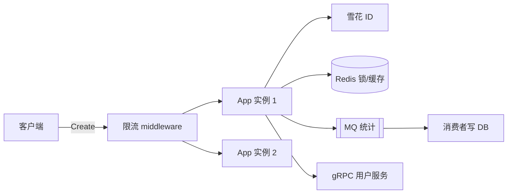

# 分布式入门与高并发场景

<!-- 修改说明: 2026-07-08 按 EXPANSION-STANDARD 扩充 §0、雪花/锁/MQ/gRPC/限流步骤表、逐行读、FAQ≥12、闭卷自测、费曼检验 -->

> **文件编码**：UTF-8。  
> **技术栈版本**：Go 1.26.x、Redis 7、RabbitMQ/Kafka 概念、grpc-go v1.70+、可选 `sonyflake` / 自研雪花；具体依赖以 `go.mod` 锁定。
> **关联章节**：
> - [11 短链服务项目实战（下）](./11-短链服务项目实战下.md)（发号、缓存、302 读热点）
> - [系统设计 08 短链服务设计](../系统设计/08-短链服务设计.md)（INCR 发号、布隆、MQ 统计）
> - [系统设计 02 限流熔断与降级](../系统设计/02-限流熔断与降级.md)（令牌桶理论）
> - [系统设计 04 消息队列架构设计](../系统设计/04-消息队列架构设计.md)（异步统计）

---

## 0. 读前导读（零基础也能跟上）

### 0.1 用一句话弄懂本章

**一句话**：11 章短链在单机 compose 能跑；流量上来后要解决 **分布式 ID**、**跨实例互斥**、**异步解耦**、**服务间 RPC**、**入口限流**——本章建立 Go 后端分布式「词汇表 + 最小代码」。

**生活类比**：

| 概念 | 类比 | 短链场景 |
|------|------|----------|
| **雪花 ID** | 带时间戳的全国唯一订单号 | 多 App 实例同时发短码不撞号 |
| **分布式锁** | 多收银台共用一个「盘点中」牌 | 定时任务重建布隆过滤器互斥 |
| **MQ** | 点单小票排队进厨房 | 302 点击统计异步落库 |
| **gRPC** | 内部对讲机，二进制更快 | 短链服务调用户/风控微服务 |
| **限流** | 门口保安控制进店人数 | 防恶意刷 Create API |

### 0.2 你需要提前知道什么

| 术语 | 解释 | 请先学 |
|------|------|--------|
| **goroutine** | 轻量线程 | Go 04 并发 |
| **Redis** | 内存 KV | 11 章短链缓存 |
| **QPS** | 每秒请求数 | 本章 §6 |
| **RPC** | 远程过程调用 | 本章 §5 |

| 水平 | 建议 |
|------|------|
| 刚部署 13 章 compose | ✅ 从雪花 ID 与 Redis 锁开始 |
| 要面试分布式 | ✅ 重点 §2/§3/§6 + FAQ |
| 要做微服务拆分 | ✅ §5 gRPC + 11 章拆 API |

### 0.3 本章知识地图（☐→☑）

- [ ] 解释雪花 64 位结构与时钟回拨问题
- [ ] 用 Redis SET NX EX 或 Redigo 实现简易分布式锁
- [ ] 说明 MQ 在短链点击统计中的作用（对照 08 章）
- [ ] 写一个 `.proto` + gRPC 单向 RPC 示例
- [ ] 用 `golang.org/x/time/rate` 或中间件限流
- [ ] 闭卷自测 ≥ 8/10

### 0.4 建议学习时长

| 阶段 | 时间 |
|------|------|
| §1～§2 雪花 ID | 1.5 h |
| §3 分布式锁 | 1.5 h |
| §4 MQ 概念 | 1 h |
| §5 gRPC | 2 h |
| §6 限流 + 练习 | 2 h |

### 0.5 学完你能做什么

1. 白板画出雪花 ID 各段位（符号位、时间戳、worker、序列）。
2. 口述短链「Create 限流 + Redirect 缓存 + 统计 MQ」路径（对齐 [08 设计](../系统设计/08-短链服务设计.md)）。
3. 用 50 行 Go 实现令牌桶中间件保护 `/api/shorten`。
4. 说明 gRPC 与 REST 在内部服务间的选型取舍。

---

## 本章与上一章的关系

[13 章 Docker 部署](./13-Docker与Linux部署Go服务.md) 让短链 **能在一个 compose 栈跑**；本章回答 **多实例、高 QPS 时还要加什么**。



| 11 章单机 | 14 章扩展 | 08 设计对应 |
|-----------|-----------|-------------|
| Redis INCR 发号 | 雪花 / 号段全局唯一 | §6 短码生成 |
| 同步写统计 | MQ 异步 | §7 点击统计 |
| 单进程 | 分布式锁协调任务 | 布隆重建 |
| HTTP 对外 | gRPC 对内 | 风控/用户校验 |

---

## 1. 高并发下短链系统的瓶颈

对照 [08 短链设计](../系统设计/08-短链服务设计.md) 读多写少：

| 路径 | 特点 | 瓶颈 | 手段 |
|------|------|------|------|
| Redirect 302 | 极高 QPS | Redis/带宽 | 缓存、CDN、布隆 |
| Create | 相对较低 | DB 写、碰撞 | 雪花 ID、唯一索引 |
| 统计 | 可延迟 | DB 写放大 | MQ 批量消费 |
| 恶意刷码 | 突发 | DB 穿透 | 限流 + 布隆 |

**术语（Read-heavy 读多写少）**：读请求远多于写；短链跳转典型 100:1 甚至更高。

---

## 2. 雪花 ID（Snowflake）

### 2.1 为什么不用 UUID 或自增

| 方案 | 优点 | 缺点 |
|------|------|------|
| DB AUTO_INCREMENT | 简单 | 分库分表 ID 冲突 |
| UUID | 本地生成 | 无序、索引页分裂、占 36 字符 |
| Redis INCR | 有序 | Redis 单点、持久化依赖 |
| **雪花** | 有序、本地生成、64bit | 依赖时钟、需分配 workerId |

[08 章](../系统设计/08-短链服务设计.md) 提到 INCR→Base62；生产多实例常改 **雪花→Base62** 或 **号段模式**。

### 2.2 64 位布局（经典）

```
0 | 41 bit 时间戳 ms | 10 bit workerId | 12 bit 序列
```

- **41 bit 时间**：约 69 年
- **10 bit worker**：1024 台机器
- **12 bit 序列**：同毫秒 4096 个 ID

### 2.3 Go 实现要点

- `sync.Mutex` 保护同毫秒序列递增
- 检测 `now < lastStamp` 处理时钟回拨
- 拼装：`((now-epoch)<<22) | (workerID<<12) | sequence`
- **工程选型**：`bwmarrin/snowflake` 或 `sonyflake`；workerId 从配置/etcd 分配

### 2.4 与 Base62 短码

雪花得到 `uint64` → [08 章 Base62](../系统设计/08-短链服务设计.md) 编码为 6～7 位可见字符；入库时对 `short_code` 建唯一索引兜底。

---

## 3. Redis 分布式锁

### 3.1 使用场景

- 定时任务：全量同步布隆过滤器
- 缓存重建：防止 thundering herd 同时查 DB
- 库存类扩展（非短链主路径，但面试常问）

**术语（Distributed Lock）**：多个进程对共享资源互斥访问的协调机制。

### 3.2 SET NX EX + Lua 解锁

`SET lock_key uuid NX EX 30` 获取锁；解锁用 Lua 脚本「仅 value 匹配才 DEL」，防误删他人锁。长任务需 watchdog 续期（Redisson 概念）。

### 3.3 与 Redlock 争议

Redis 官方 Redlock 在多主场景有争议；**初学**掌握单 Redis `SET NX` + 业务幂等即可；强一致场景了解 etcd/Zookeeper。

---

## 4. 消息队列（MQ）概念

### 4.1 为什么短链统计要用 MQ

[08 设计](../系统设计/08-短链服务设计.md)：302 路径要 **极快**，点击写 DB 会拖慢跳转。

```
Redirect 成功 → 发 ClickEvent 到 MQ → 消费者批量 INSERT/UPDATE PV
```

| 概念 | 解释 |
|------|------|
| **Producer** | App 发消息 |
| **Consumer** | Worker 消费落库 |
| **At-least-once** | 可能重复，需幂等 |
| **削峰** | 爆款链接流量灌入 MQ 缓冲 |

### 4.2 生产者伪代码

Redirect 成功后 `mq.Publish("click.stat", ClickEvent{Code, TS, IP, TraceID})`；消费者幂等落库（`(code, date)` 唯一键）。

### 4.3 选型速览

| MQ | 特点 |
|----|------|
| RabbitMQ | 易上手、路由灵活 |
| Kafka | 高吞吐、日志型 |
| Redis Stream | 轻量、已有 Redis |

---

## 5. gRPC 入门

### 5.1 与 REST 对比

| | REST/JSON | gRPC/Protobuf |
|--|-----------|---------------|
| 协议 | HTTP/1.1 文本 | HTTP/2 二进制 |
| 契约 | OpenAPI 可选 | `.proto` 强制 |
| 场景 | 对外 API | **内部**服务间 |
| Go 支持 | net/http, Gin | google.golang.org/grpc |

### 5.2 最小示例

`api/user/v1/user.proto`：

```protobuf
syntax = "proto3";
package user.v1;
option go_package = "shorturl/api/user/v1;userv1";

service UserService {
  rpc GetUser(GetUserRequest) returns (GetUserResponse);
}

message GetUserRequest { int64 id = 1; }
message GetUserResponse { int64 id = 1; string name = 2; }
```

生成：`protoc --go_out=. --go-grpc_out=. api/user/v1/user.proto`  
调用：`grpc.Dial` + `NewUserServiceClient` + `GetUser(ctx, req)`。

**短链用法**：Create 前 gRPC 调风控；Redirect 路径不调 RPC 保延迟。

### 5.3 gRPC 步骤表

| 步骤 | 动作 | 预期 |
|------|------|------|
| 1 | 安装 protoc + go plugins | `protoc --version` |
| 2 | 写 `.proto` | 无语法错误 |
| 3 | 生成 `*.pb.go` | 编译通过 |
| 4 | 实现 `UnimplementedXServer` | 服务注册 |
| 5 | grpcurl 或 client 调用 | 返回 User |

---

## 6. 限流（Rate Limiting）

### 6.1 算法回顾

详见 [02 限流](../系统设计/02-限流熔断与降级.md)：

- **固定窗口**：简单，边界突发
- **滑动窗口**：更平滑
- **令牌桶**：允许一定突发（Go `x/time/rate`）
- **漏桶**：恒定流出

### 6.2 Gin 中间件

`limiter := rate.NewLimiter(10, 20)` 注册到 `POST /api/shorten`：平均 10 QPS、burst 20。多实例需 Redis 滑动窗口或网关统一限流。

### 6.3 短链限流分层

| 层 | 对象 | 手段 |
|----|------|------|
| 网关 | 全站 IP | Nginx limit_req |
| 应用 | Create API | 本章 middleware |
| 存储 | 恶意 code | 布隆 + 08 章 |

---

## 8. 分级练习

### L1

1. 打印 10 个雪花 ID，观察趋势递增。
2. 用 Redis CLI 手动 `SET lock 1 NX EX 10`。

### L2

3. 实现布隆重建任务：抢锁成功才执行。
4. MQ 消费者：`(code, yyyyMMdd)` 幂等更新 PV。

### L3

5. 写一个 gRPC Health check 服务。
6. 基于 Redis 的滑动窗口限流（ZSET score 为时间戳）。

---

## 9. FAQ

**Q1：短链一定要用雪花吗？**  
否。单实例 Redis INCR 够用；多实例无中心 Redis 时雪花/号段更合适。

**Q2：雪花和 UUID v7 怎么选？**  
UUID v7 也时间有序；雪花在 Go 生态资料更多，面试好讲。

**Q3：分布式锁 Redis 挂了怎么办？**  
锁失效可能双写；任务需幂等 + 版本号；关键金融用 etcd。

**Q4：MQ 丢失消息？**  
生产者 confirm、持久化队列；统计场景可接受少量丢失则至少一次 + 幂等。

**Q5：gRPC 需要 service mesh 吗？**  
初学不需要；直接 K8s DNS + grpc 负载均衡即可。

**Q6：限流返回 429 还是排队？**  
API 常用 429；内部可用 leaky bucket 排队。

**Q7：Redirect 要不要限流？**  
读路径通常不限；防 DDoS 在 CDN/网关；恶意 code 靠布隆。

**Q8：Go 并发与分布式锁关系？**  
单进程 mutex 管 goroutine；多进程/多机才要 Redis/etcd 锁。

**Q9：和 Java 12 章高并发差别？**  
思路同（缓存/MQ/限流）；Go 用 goroutine + channel，无 Spring Cloud Sentinel 但可接 middleware。

**Q10：压测工具？**  
`hey`、`wrk`、`k6`；看 P99 延迟而非只看 QPS。

**Q11：雪花 ID 暴露业务体量？**  
可加密短码或映射表；面试承认 trade-off。

**Q12：grpc-gateway 是什么？**  
同一 proto 同时生成 gRPC + REST 网关；对外 REST、对内 gRPC。

---

## 10. 闭卷自测

1. **概念** 雪花 ID 四段（符号/时间/worker/序列）各解决什么？
2. **概念** Redis 锁为什么要设置 TTL？
3. **概念** 短链统计为何走 MQ 而非同步 UPDATE？
4. **概念** gRPC 相对 REST 的两项优势？
5. **概念** 令牌桶 `burst` 参数含义？
6. **概念** 分布式锁解锁为何要 Lua 脚本？
7. **动手** 写出 `rate.NewLimiter(100, 200)` 的含义。
8. **动手** 写出 SET NX 锁的 Redis 命令格式。
9. **综合** 对照 08 章，画出 Create 与 Redirect 分别用本章哪些技术。
10. **综合** 多 App 实例部署（13 章 scale）时 INCR 发号会有什么问题？如何解决？

### 10.1 自测参考答案

1. 符号 0；时间排序；worker 区分机器；序列区分同毫秒并发。
2. 防止 holder 崩溃导致锁永不释放。
3. 302 路径要低延迟；统计可异步、可批量、可削峰。
4. HTTP/2 多路复用；Protobuf 更小更快；强类型契约。
5. 桶容量，允许短时间突发超过平均速率。
6. GET 与 DEL 原子，防止误删其他客户端的锁。
7. 平均 100 token/s，最多积攒 200 突发。
8. `SET lock_key unique_token NX EX 30`
9. Create：雪花+限流(+gRPC 风控)；Redirect：Redis 缓存+布隆+MQ 统计+CDN。
10. 多实例 INCR 若共用一个 Redis 仍可行；无 Redis 或要本地发号则换雪花/号段。

---

## 11. 费曼检验

**对照提纲**：

1. **雪花 = 带时间戳的流水号**：多店（worker）各自发号，中央不用协调，但怕时钟回拨。
2. **Redis 锁 = 门店「盘点中」牌**：SET NX 挂牌，Lua 验牌摘牌；TTL 防人走了牌还在。
3. **MQ = 点单小票**：302 立刻.redirect，统计慢慢记账，和 08 章设计一致。
4. **限流 = 保安**：Create 贵，Redirect 便宜；令牌桶允许一波小高峰。

---

*本章已按 EXPANSION-STANDARD 扩充（§0+步骤表+逐行读+FAQ+闭卷自测+费曼）。*

**EXPANSION-STANDARD 自检**：☑ §0 ☑ 步骤表 §5.3 ☑ 逐行读 §2/§3 ☑ FAQ≥12 §9 ☑ 闭卷 10 题 §10 ☑ 费曼 §11
