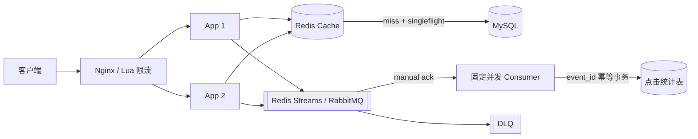

# 短链高并发、可靠消息与降级设计

<!-- 修改说明: 2026-07-14 将泛分布式词汇表收束为短链简历项目可落地的缓存、可靠点击统计、Lua 原子限流、超时/重试/熔断、过载保护、降级矩阵与真实压测 -->

> **文件编码**：UTF-8。
> **技术栈版本**：Go 1.26.x、Redis 7（Cache + Streams 可选）、RabbitMQ 4.x（替代方案）、MySQL 8、Prometheus；具体依赖以项目 `go.mod` 与镜像 digest 锁定。
> **关联章节**：
> - [11 短链服务项目实战（下）](./11-短链服务项目实战下.md)（发号、缓存、302 读热点）
> - [系统设计 08 短链服务设计](../系统设计/08-短链服务设计.md)（INCR 发号、布隆、MQ 统计）
> - [系统设计 02 限流熔断与降级](../系统设计/02-限流熔断与降级.md)（令牌桶理论）
> - [系统设计 04 消息队列架构设计](../系统设计/04-消息队列架构设计.md)（异步统计）

---

## 0. 读前导读（零基础也能跟上）

### 0.1 用一句话弄懂本章

**一句话**：短链的高并发不是堆 gRPC、Kubernetes 和“分布式”名词，而是让 Redirect 热路径在依赖变慢、消息重复、流量突发时仍然**快、可控、可恢复、可证明**。

**生活类比**：

| 概念 | 类比 | 短链场景 |
|------|------|----------|
| **Cache Aside + singleflight** | 热菜提前备好，同一道临时缺货只派一人去仓库 | Redis miss 时防 DB 被并发击穿 |
| **可靠消息** | 小票交到厨房后要签收，失败进入待处理箱 | 点击事件确认、重试、DLQ |
| **event_id 幂等** | 同一张小票复印两份，也只记一笔账 | at-least-once 不重复增加 PV |
| **Lua 原子限流** | 保安在同一本账上一次完成查额度和扣额度 | 多 App 实例共享限流状态 |
| **超时/熔断** | 供应商迟迟不接电话就暂停拨打 | 防慢依赖拖垮 goroutine 与连接池 |
| **过载保护** | 店满就停止接新单 | 有界队列、并发上限、429/503 |

### 0.2 你需要提前知道什么

| 术语 | 解释 | 请先学 |
|------|------|--------|
| **goroutine** | 轻量线程 | Go 04 并发 |
| **Redis** | 内存 KV | 11 章短链缓存 |
| **QPS** | 每秒请求数 | 本章 §6 |
| **幂等** | 同一操作重复执行，最终结果仍等同一次 | 本章 §4 |
| **P95/P99** | 95%/99% 请求不超过的延迟 | 本章 §8 |

| 水平 | 建议 |
|------|------|
| 刚部署 13 章 Compose | ✅ 先做 §3 缓存热路径与 §4 可靠统计 |
| 要准备后端面试 | ✅ 重点 §4～§7，能画确认/重试/幂等链路 |
| 想“再加点高级技术” | 先做 §8 压测和故障演练；没有证据不要扩栈 |

### 0.3 本章知识地图（☐→☑）

- [ ] 用 Cache Aside、TTL jitter、negative cache、singleflight 保护 Redirect 热路径
- [ ] 设计带 `event_id/schema_version` 的点击事件契约
- [ ] 说清 Redis Streams 或 RabbitMQ 的 publish/ack/retry/DLQ 全链路
- [ ] 用数据库唯一约束与事务保证重复消息不重复计数
- [ ] 用 Redis Lua 实现多实例原子令牌桶，并定义 Redis 故障策略
- [ ] 给 Redis/MySQL/MQ 设置 deadline、有限重试、熔断与并发上限
- [ ] 写出硬/软依赖降级矩阵，避免故障时误返回 404
- [ ] 用真实压测记录 QPS、P95/P99、错误率、缓存命中率和 consumer lag
- [ ] 闭卷自测 ≥ 8/10

### 0.4 建议学习时长

| 阶段 | 时间 |
|------|------|
| §1～§3 瓶颈与缓存热路径 | 2 h |
| §4 可靠点击统计 | 3 h |
| §5 Lua 原子限流 | 2 h |
| §6～§7 韧性、过载与降级矩阵 | 2.5 h |
| §8 压测/故障演练 + 练习 | 2 h |

### 0.5 学完你能做什么

1. 白板画出 Redirect 的缓存、回源、singleflight、事件投递和降级路径。
2. 演示重复投递同一个 `event_id`，最终点击数只增加一次。
3. 停掉消费者再恢复，解释 pending、claim、retry 和 DLQ 如何工作。
4. 用 Lua 限流保护 Create API，并在两个 App 实例下证明总额度不会翻倍。
5. 展示一次 Redis/MySQL/MQ 故障演练和真实 Prometheus/压测数据。

---

## 本章与上一章的关系

[13 章 Docker 部署](./13-Docker与Linux部署Go服务.md) 让短链可以重复发布与恢复；本章回答：**流量和故障上来后，怎样保护最重要的 Redirect 路径，并让统计最终可信**。



| 11 章单机 | 14 章扩展 | 08 设计对应 |
|-----------|-----------|-------------|
| Redis Cache Aside | TTL jitter + negative cache + singleflight | 读热点与击穿保护 |
| 简单异步统计 | confirm/ack + retry + DLQ + `event_id` 幂等 | 点击最终一致 |
| 单机 limiter | Redis Lua 原子限流 | 多实例共享额度 |
| 依赖失败直接报错 | deadline/熔断/过载保护/降级矩阵 | 故障不级联 |

> **范围声明**：本项目先保持“一个 API 服务 + 一个统计 worker”。除非真实需求要求拆服务，否则不为了简历硬加 gRPC、Kubernetes、Service Mesh 或分布式事务。把一个可靠闭环做深，比堆五个只会启动的组件更有说服力。

---

## 1. 高并发下短链系统的瓶颈

对照 [08 短链设计](../系统设计/08-短链服务设计.md) 读多写少：

| 路径 | 关键目标 | 先看什么证据 | 优先手段 |
|------|----------|--------------|----------|
| Redirect 302 | 低 P99、高可用 | cache hit、Redis/DB P99、5xx | Cache Aside、singleflight、超时、降级 |
| Create | 正确、可控 | 429/冲突、DB 写延迟 | 唯一索引、幂等 key、Lua 限流 |
| 点击统计 | 不拖慢跳转、最终不重计 | publish error、lag、retry、DLQ | 可靠消息、批量消费、event_id 幂等 |
| 无效短码扫描 | 不打穿 DB | not-found QPS、DB miss | negative cache；布隆按证据选做 |
| 依赖抖动 | 不级联 | timeout、in-flight、pool wait | deadline、有限重试、熔断、bulkhead |

**术语（Read-heavy 读多写少）**：读请求通常多于写；不同产品可能约 10:1～100:1，必须用真实日创建量和日跳转量估算，不能固定背一个比例。

优化顺序固定为：**定义 SLO → 建立指标 → 压测复现 → 找瓶颈 → 只改一个变量 → 对比前后**。没有真实测量时，雪花 ID、布隆过滤器、分片和微服务都只是猜测。

---

## 2. 先做正确的复杂度选择

### 2.1 短码发号：唯一索引永远是最后防线

| 方案 | 适用阶段 | 主要取舍 |
|------|----------|----------|
| DB 自增 ID → Base62 | 单库、写入不高 | 最简单，但短码可推测业务量 |
| Redis `INCR` → Base62 | 已依赖 Redis、需要全局递增 | 中心 Redis 成为发号依赖 |
| 随机 7～10 位短码 | 不想暴露顺序 | 必须靠唯一索引冲突重试 |
| Snowflake → Base62 | 多节点本地高吞吐发号 | worker ID、时钟回拨、可预测性更复杂 |

对本项目，Redis `INCR` 或随机短码都足够做出优秀版本。无论选择什么，都给 `short_code` 建唯一索引，并对冲突做有限重试。只有压测证明发号器是瓶颈，才引入 Snowflake/号段；引入后要回答 worker ID 如何唯一、时钟回拨怎样处理、容量上限是多少。

### 2.2 分布式锁只用于低频协调任务

合适场景：只有一个实例执行的归档、全量同步、定期清理。基本做法是 `SET key token NX PX ttl`，释放时用 Lua 比较 token 后再删除；任务本身仍需幂等，因为锁可能过期或网络分区。

不合适场景：每次 Redirect cache miss 都抢一个分布式锁。热路径优先使用进程内 `singleflight` 合并同实例请求，再依靠 Redis 缓存、TTL jitter 和 DB 并发上限保护后端。分布式锁会增加一次网络往返，还会把锁服务变成新瓶颈。

---

## 3. Redirect 缓存热路径

### 3.1 Cache Aside 的正确分支

```text
GET cache(code)
├─ hit：解析状态/过期时间 → 302 或明确业务结果
├─ miss(redis.Nil)：singleflight → 查 MySQL → 回填缓存
└─ Redis error：记录降级指标 → 受控回源 MySQL

MySQL 查询
├─ found：回填正缓存 → 302
├─ truly not found：写短 TTL negative cache → 404
└─ timeout/error：503；绝不能伪装成 404
```

Go Redis 客户端中，“key 不存在”和“Redis 调用失败”必须分开判断。MySQL 同理：`sql.ErrNoRows` 才是业务不存在，连接超时/连接池耗尽是依赖故障。

### 3.2 四个必须一起做的保护

1. **TTL jitter**：基础 TTL 上随机增加约 10%～20%，避免大量 key 同一秒过期。
2. **negative cache**：只缓存经过 DB 确认的不存在，TTL 通常 30s～2min；依赖故障不能写 negative。
3. **singleflight**：按 short code 合并同一实例并发回源；函数内部仍要二次查缓存，防别的实例已回填。
4. **DB bulkhead**：给回源设置独立并发上限和短 deadline，额度满时快速 503，不能无限堆 goroutine。

### 3.3 更新、禁用与缓存一致性

- 先提交 MySQL 事务，再删除 Redis key；删除失败进入可重试的失效任务并告警。
- 不把“先删缓存再写 DB”当默认，否则并发读可能把旧值重新写回。
- 禁用/过期是业务状态，可在缓存 value 中一起保存，避免每次再查 DB。
- 缓存 TTL 是最终兜底，不能代替主动失效。
- 热 key 只有在压测证明单 Redis 节点/网络成为瓶颈后，才考虑本地 L1 或 CDN；它们会增加一致性成本。

### 3.4 布隆过滤器不是默认必选

布隆能快速拒绝“肯定不存在”的 code，但有误判、重建和一致性成本。先用 negative cache + 限流；只有无效短码扫描确实导致大量 DB miss 时再加。布隆不可用时应绕过继续查缓存/DB，不能因此把真实短码判成 404。

---

## 4. 可靠点击统计：确认、重试、DLQ、幂等

### 4.1 先定义事件契约

```go
type ClickEvent struct {
    EventID      string    `json:"event_id"`      // 每次真实点击生成一次，重试时保持不变
    SchemaVersion int      `json:"schema_version"`
    ShortCode    string    `json:"short_code"`
    OccurredAt   time.Time `json:"occurred_at"`   // UTC
    RequestID    string    `json:"request_id"`
    IPHash       string    `json:"ip_hash,omitempty"`
    UAHash       string    `json:"ua_hash,omitempty"`
}
```

- `event_id` 可用 UUIDv7/ULID；它标识“这次点击”，消费者重试不能重新生成。
- `schema_version` 支持消费者兼容新旧消息；新增字段优先保持向后兼容。
- IP/User-Agent 按统计需求最小化收集、hash/截断并规定保留期，不把完整隐私数据到处复制。
- 事件序列化、最大大小、必填字段、时区都写进测试。

### 4.2 接受现实：at-least-once + 幂等

| 语义 | 结果 | 本项目选择 |
|------|------|------------|
| at-most-once | 最多一次，失败可能丢 | 不适合需要可信统计 |
| at-least-once | 不轻易丢，但可能重复 | ✅ broker 确认 + consumer ack + `event_id` 幂等 |
| exactly-once | 跨 broker/DB 的绝对一次成本很高 | 不宣称；实现“效果上的一次” |

生产者收到 broker 确认，只代表消息已被 broker 接受；消费者只有在数据库事务提交后才 ack。任何“先 ack 再写 DB”都会在进程崩溃时永久丢统计。

### 4.3 Redis Streams 方案（项目默认推荐）

项目本来已有 Redis，Streams 能用较少组件完成可靠消费：

```text
XADD click:events * payload <json>
XREADGROUP GROUP click-workers worker-1 COUNT 100 BLOCK 2000 STREAMS click:events >
处理并提交 MySQL
XACK click:events click-workers <stream-id>
```

初始化一次 consumer group：

```bash
XGROUP CREATE click:events click-workers 0 MKSTREAM
```

`0` 表示消费 group 创建前已经存在的 backlog；若明确只处理创建后的新消息才使用 `$`。生产部署应先创建 group，再开放 Producer 流量。

完整消费循环：

1. Producer 在 Redirect 已解析成功后，以很短 deadline 执行 `XADD`。
2. Consumer 固定并发、批量 `XREADGROUP`，消息进入 PEL（Pending Entries List）。
3. 在一个 MySQL 事务中完成 `event_id` 去重与 PV 聚合。
4. `COMMIT` 成功后 `XACK`；进程若在 commit 后、ack 前崩溃，消息会重投，但幂等会拦住重复计数。
5. 定时检查 `XPENDING`，用 `XAUTOCLAIM` 领取超过 idle timeout 的遗留消息。
6. 对临时错误做指数退避；维护有限 `attempt`。超过上限时 `XADD click:events:dlq`，写入原消息、原 stream ID、最后错误和次数；只有 DLQ 写入成功后才 ack 原消息，DLQ 也失败则保留 pending 并告警。
7. DLQ 必须有告警、查看工具和人工/修复后重放命令；“进入 DLQ”不是处理完成。

Streams 没有替你自动完成可靠重试策略。可以用带 TTL 的 retry metadata 记录 delivery attempt；绝不能失败后立刻无限 claim，形成 CPU/DB 重试风暴。

若 Streams 与缓存共用一个 `allkeys-lru` Redis，队列消息可能被淘汰。简历项目若把统计可靠性当亮点，应给 Streams 独立 Redis 实例/至少独立淘汰策略（`noeviction`）、AOF 和容量告警。Stream retention 必须覆盖“最大可容忍消费者中断时间”，不能在 pending 尚未处理时激进 trim。

### 4.4 `event_id` 幂等必须和聚合在同一事务

```sql
CREATE TABLE click_event_dedup (
    event_id     BINARY(16) PRIMARY KEY,
    short_code   VARCHAR(16) NOT NULL,
    occurred_at  DATETIME(3) NOT NULL,
    processed_at DATETIME(3) NOT NULL
);

CREATE TABLE link_daily_stats (
    short_code VARCHAR(16) NOT NULL,
    stat_date  DATE NOT NULL,
    pv         BIGINT UNSIGNED NOT NULL DEFAULT 0,
    PRIMARY KEY (short_code, stat_date)
);
```

`BINARY(16)` 要求应用把 UUIDv7/ULID 解析成固定 16 字节再写入；若直接保存文本，应明确改为 `CHAR(36)` UUID 或 `CHAR(26)` ULID，不能把字符串字节无说明地塞进该字段。

消费者事务伪代码：

```text
BEGIN
INSERT click_event_dedup(event_id, ...)
if duplicate event_id:
    COMMIT                # 已处理过，不再增加 PV
else if other error:
    ROLLBACK              # 不 ack，按策略重试
else:
    INSERT link_daily_stats(..., pv=1)
    ON DUPLICATE KEY UPDATE pv = pv + 1
    COMMIT
ACK broker message
```

唯一约束是并发下真正可靠的防线，不能只靠“先 SELECT 再 INSERT”。推荐捕获明确的 duplicate-key 错误，而不是用会吞掉其他数据问题的宽泛 `INSERT IGNORE`。dedup 数据要保留至少超过 broker 最大重投/重放窗口；清理过早会让旧消息再次计数。批量消费可以减少 DB 往返，但 ack 只能发生在对应批次事务提交以后。

### 4.5 RabbitMQ 替代方案

如果希望专门练消息中间件，可用 RabbitMQ 替换 Streams，但只需深入实现一种：

- durable exchange + durable queue，消息设置 persistent。
- Producer 开启 publisher confirm；未 confirm 的消息按幂等策略有限重发。
- Consumer 使用 manual ack，数据库 commit 后 `Ack`。
- 临时错误不要直接 `Nack(requeue=true)` 无限热循环；使用 1s/10s/60s 多级 retry queue（TTL + dead-letter exchange）。
- attempt 超限路由到 DLQ；DLQ 告警和重放仍依赖同一个 `event_id`。
- 连接恢复后重新声明 exchange/queue/binding/consumer，并监控 unacked、ready、redelivered。

| 选择 | 优点 | 代价 |
|------|------|------|
| Redis Streams | 组件少、consumer group/Pending 直观 | 运维和内存策略必须与缓存隔离 |
| RabbitMQ | confirm、routing、DLX 语义成熟 | 新增 broker 运维与连接管理 |

Kafka 更适合大规模事件流与长期日志，不是本项目成为简历亮点的必要条件。

### 4.6 Redirect 与统计可靠性的明确取舍

点击统计通常是软依赖，默认策略可以是：`XADD/Publish` 最多等待 5～10ms；失败仍返回 302，同时增加 `publish_error`，尝试进入**有界**本地 fallback，队列满则记录 `dropped_total` 并立即告警。

这不是“绝不丢消息”。若业务要求点击一条都不能丢，需要本地磁盘 WAL、独立采集代理或更复杂的 durable outbox 设计，并接受额外延迟/运维成本。简历中必须如实写清统计 SLO，不能把 at-least-once 说成绝对 exactly-once。

### 4.7 必须监控的消息指标

- Producer：publish success/error/timeout、confirm latency、fallback queue length、dropped total。
- Consumer：consume success/error、batch duration、retry、pending/unacked、consumer lag。
- DLQ：当前数量、进入速率、最老消息年龄。
- DB：幂等冲突数、批量写耗时、聚合失败数。

---

## 5. Redis Lua 原子限流

单机 `x/time/rate` 只限制当前进程；两个 App 实例会得到两份额度。Redis Lua 把“读状态→补 token→判断→扣 token→写回”放在一次原子执行中。

### 5.1 令牌桶脚本

```lua
-- KEYS[1]: limiter key
-- ARGV[1]: rate, tokens per second
-- ARGV[2]: burst capacity
-- ARGV[3]: request cost
local rate  = tonumber(ARGV[1])
local burst = tonumber(ARGV[2])
local cost  = tonumber(ARGV[3])

local t = redis.call('TIME')
local now_ms = t[1] * 1000 + math.floor(t[2] / 1000)
local state = redis.call('HMGET', KEYS[1], 'tokens', 'ts')
local tokens = tonumber(state[1])
local last_ms = tonumber(state[2])

if tokens == nil then tokens = burst end
if last_ms == nil then last_ms = now_ms end

local elapsed = math.max(0, now_ms - last_ms)
tokens = math.min(burst, tokens + elapsed * rate / 1000)

local allowed = 0
local retry_after_ms = 0
if tokens >= cost then
    tokens = tokens - cost
    allowed = 1
else
    retry_after_ms = math.ceil((cost - tokens) * 1000 / rate)
end

redis.call('HSET', KEYS[1], 'tokens', tokens, 'ts', now_ms)
local ttl_ms = math.max(1000, math.ceil(burst / rate * 2000))
redis.call('PEXPIRE', KEYS[1], ttl_ms)

return {allowed, math.floor(tokens), retry_after_ms}
```

Go 调用脚本前必须校验 `rate > 0`、`burst > 0`、`cost > 0` 且 `cost <= burst`，否则会出现除零或永远无法通过的配置错误；脚本返回值长度和类型也要检查后再使用。

脚本首次 `SCRIPT LOAD`，正常调用 `EVALSHA`；遇到 `NOSCRIPT` 再 reload。集成测试必须覆盖首次请求、突发耗尽、token 恢复、并发两个 App 和 key 自动过期。

### 5.2 限流 key 与策略

| 路由 | 建议维度 | 失败响应 | Redis 故障策略 |
|------|----------|----------|----------------|
| Create | `user_id` + IP 双层 | 429 + `Retry-After` | 已认证用户走更严格本地 limiter；高风险匿名请求可 fail-closed |
| 管理 API | user/tenant | 429 | 本地严格限制或暂时拒绝 |
| Redirect | 边缘全站/IP 防护，不按热门 code 限 | 429/403 由 Nginx/CDN | App 通常 fail-open，优先可用 |
| 无效 code 扫描 | IP + negative cache | 429 | 边缘限制，不能拖垮 DB |

限流阈值是配置，不是拍脑袋常量。根据真实流量分布、用户配额和压测容量设定；返回 remaining/retry-after header，并用 `rate_limited_total{route,reason}` 观察误伤。

---

## 6. 超时、重试、熔断与过载保护

### 6.1 先分配总 deadline，再分给依赖

以下只是本地起点，最终以真实网络和 SLO 调整：

| 路径 | 总预算 | 子调用预算示例 | 超时结果 |
|------|--------|----------------|----------|
| Redirect | 100～150ms | Redis 10ms；MySQL 回源 50～80ms；publish 5～10ms | cache miss 依赖失败返回 503，不误报 404 |
| Create | 500～800ms | 校验/限流 20ms；DB 300ms；缓存失效 20ms | 保证幂等后返回明确 503/409 |
| Consumer batch | 1～3s | DB 事务占主要预算 | 不 ack，进入有限重试 |

Handler 的 `context` 是父 deadline；下游 timeout 必须更短并预留编码/响应时间。禁止使用无 timeout 的默认 HTTP client、无上限 DB 操作或后台 `context.Background()` 逃逸请求生命周期。

### 6.2 重试只给“短暂且幂等”的错误

- 可考虑重试：连接重置、短暂超时、broker confirm 未知；使用指数退避 + full jitter，通常最多 1～2 次且不超过总 deadline。
- 不重试：参数错误、404、唯一键冲突、权限失败、明确容量不足。
- 写操作没有 idempotency key 时不自动重试；Create API 可用客户端 idempotency key + DB 唯一约束。
- 同一实例立即重试 Redis/MySQL 往往只会放大故障；优先快速降级或熔断。
- 设置全局 retry budget，例如重试流量不超过正常流量的一个小比例，防所有调用一起“自我 DDoS”。

### 6.3 熔断器不是错误吞掉器

熔断按 closed → open → half-open 工作：连续失败/慢调用达到阈值后 open，短时间快速失败；冷却后只放少量 probe，成功再关闭。按依赖和操作拆 breaker，例如 Redis GET 与 MySQL Resolve 分开；记录 state change、rejected 和 half-open result。

熔断后必须有替代行为：Redis breaker open → 受控回源；MySQL breaker open → cache miss 503；MQ breaker open → 有界 fallback/统计丢弃告警。没有降级动作的“熔断”只是换一种报错。

### 6.4 过载保护与 bulkhead

- HTTP Server 设置 read/header/write/idle timeout 和最大请求体。
- MySQL/Redis 连接池有上限，等待连接也受 context 控制。
- DB 回源、Create、Consumer 分别用独立 semaphore/worker pool，互不吃光资源。
- 所有 channel/queue 有容量；满了明确 drop、429 或 503，不能无限扩容内存。
- 禁止每次点击 `go func(){...}`；使用固定 worker 消费有界 channel。
- consumer lag 很大时优先批量写和扩固定 worker，不能无限起 goroutine 把 MySQL 打死。
- 内存/CPU/连接池接近红线时，优先拒绝 Create/管理请求，保留 Redirect cache hit 的资源。

---

## 7. 短链降级矩阵

降级要在故障发生前写好并测试，不能线上临时决定：

| 故障 | Redirect | Create/管理 | 统计 | readiness/告警 |
|------|----------|-------------|------|----------------|
| Redis Cache 不可用 | singleflight + 有界回源 MySQL | DB 仍可写；缓存失效稍后重试 | 若 Streams 同实例也失败，走 publish fallback | Redis 为软依赖时保持 ready；告警 cache error、DB QPS |
| MySQL 不可用/变慢 | cache hit 继续；cache miss 返回 503，绝不 404 | 503，禁止假成功 | consumer 不 ack，退避重试 | 通常 not ready；告警 pool wait/P99/5xx |
| MQ/Streams publish 失败 | 短 deadline 后仍 302 | 不影响核心创建 | 有界 fallback；满则 drop + 高优告警 | 保持 ready；监控 publish error/drop |
| Consumer 全停 | 302 不受影响 | 不受影响 | lag/pending 增长，恢复后 claim | lag/oldest age 告警，不重启 API |
| Lua limiter Redis 失败 | 依赖边缘防护，App 可 fail-open | 严格本地 limiter 或高风险 fail-closed | — | 单独 limiter 告警 |
| 布隆不可用 | 绕过布隆继续缓存/DB | — | — | 保持 ready，监控 DB miss |
| 资源接近上限 | 优先保 cache hit，限制回源并发 | 429/503 早拒绝 | 降低/固定消费并发 | saturation 告警，禁止无限排队 |
| Prometheus/Loki 不可用 | 业务不依赖观测系统 | 不受影响 | 不受影响 | 观测链路独立告警 |

恢复也会制造流量尖峰：Redis 恢复后用 TTL jitter，breaker half-open 只放少量 probe，consumer 逐步提高批量/并发。不要让所有实例、所有重试在同一秒恢复。

---

## 8. 压测、故障演练与简历证据

### 8.1 至少跑四组场景

1. **Warm Redirect**：热门 code 已缓存，测纯热路径。
2. **Cold/Mixed Redirect**：一定比例 cache miss，观察 MySQL QPS 与 singleflight。
3. **Create**：带 Lua limiter、唯一冲突和幂等 key。
4. **统计链路**：Consumer 正常、停止 2 分钟、恢复追平、重复消息和 poison message。

再分别注入 Redis delay/down、MySQL delay/down、MQ down，验证 §7 的状态码、探针、指标和恢复行为。压测工具可用 k6/vegeta/wrk；脚本、数据准备、机器规格和命令必须进仓库，别人才能复现。

### 8.2 不能只报 QPS

| 类别 | 必记录 |
|------|--------|
| 客户体验 | QPS、P50/P95/P99、错误率、429/503 |
| Cache/DB | hit ratio、Redis/DB P99、回源 QPS、pool wait |
| Go/容器 | CPU、RSS/heap、GC pause、goroutine、CPU throttle/OOM |
| 消息 | publish latency/error、consumer lag、pending、retry、DLQ、追平时间 |
| 环境 | CPU/内存、Docker limit、网络、数据量、并发、持续时间 |

平均延迟会掩盖长尾，短暂 10 秒峰值也不能代表稳定容量。每组至少 warm-up，再持续足够时间观察 GC、连接池和 lag；修改一个变量后与 baseline 对比。

### 8.3 简历描述只写真实测得的数据

可以写成：

> 为短链 Redirect 实现 Cache Aside、singleflight 与 TTL jitter；接入 Redis Streams consumer group，通过 `event_id` 唯一约束实现重复投递幂等，并完成 Redis/MySQL 故障演练。使用 k6 在“某硬件/某数据量/某持续时间”下测得真实 QPS、P99 与缓存命中率，优化前后数据见仓库报告。

不能先写“10 万 QPS、99.99% 可用”，再补一个跑不出来的截图。真实的 3k、8k 或 20k QPS 并不丢人；能解释瓶颈、改进和边界更重要。

---

## 9. 项目范围：做深，不堆栈

### 必做（形成闭环）

- Redis Cache Aside + negative cache + TTL jitter + singleflight。
- Redis Streams **或** RabbitMQ 二选一，完成确认、manual ack、有限重试、DLQ。
- `event_id` 数据库唯一约束 + 同事务聚合。
- Redis Lua 多实例限流及 Redis 故障 fallback。
- deadline、连接池、固定 worker、有界队列、熔断/降级指标。
- E2E、故障演练、真实压测报告。

### 有证据再选做

- 布隆过滤器：无效 code 已经打穿 DB。
- Snowflake/号段：当前发号器已成瓶颈或有真实多节点需求。
- 本地 L1/CDN：Redis 热 key/网络已成瓶颈，且能处理失效一致性。
- RabbitMQ：如果默认已做 Streams，只在想深入 broker 且时间充足时替换，不重复堆两套。

### 当前不做

- 为一个 API + worker 强拆微服务。
- 仅为出现关键词而加 gRPC、Kubernetes、Service Mesh、分布式事务、Redlock。
- 没有容量数据就做分库分表、Kafka 集群和多地域容灾。

面试时能说出“为什么现在不做”，本身就是工程判断力。

---

## 10. 分级练习

### L1

1. 给 Resolve 写表驱动测试：cache hit、miss、Redis error、DB not found、DB timeout，确认只有真正不存在返回 404。
2. 定义 `ClickEvent` JSON contract，验证重试序列化后 `event_id` 不变。
3. 在 Redis 执行 §5 Lua：耗尽 burst、等待恢复、检查 `Retry-After`。

### L2

4. 创建 Streams consumer group，实现 `XREADGROUP → DB transaction → XACK`。
5. 在 commit 后、ack 前杀掉 Consumer；恢复后确认消息重投但 PV 不重复。
6. 制造一条永久失败消息，验证有限 retry、进入 DLQ、告警和修复后重放。
7. 启动两个 App 实例并发请求同一个 limiter key，证明共享额度没有翻倍。

### L3

8. 停 Redis、MySQL、Streams consumer，逐项验证 §7 降级矩阵和 12 章指标。
9. 写 k6 场景比较：无 singleflight vs 有 singleflight 的 DB 回源 QPS/P99。
10. 输出一份可复现报告：环境、脚本、数据量、QPS/P99/error/lag、瓶颈、优化前后和未解决问题。

---

## 11. FAQ

**Q1：Redis Streams 和 RabbitMQ 要都做吗？**
不用。选一个完成 publish、ack、retry、DLQ、幂等和监控；两个都浅尝辄止反而削弱项目。

**Q2：有 broker ack 就是 exactly-once 吗？**
不是。commit 后 ack 前崩溃会重投；依靠 `event_id` 唯一约束实现“效果上的一次”。

**Q3：为什么必须 DB commit 后再 ack？**
先 ack 后崩溃会永久丢消息；commit 后再 ack 最多导致重投，幂等可处理。

**Q4：`event_id` 能直接用 Redis stream ID 吗？**
不推荐。业务 event ID 在 publish 前生成，切 broker、重试或重放仍保持不变；stream ID 是传输层标识。

**Q5：失败消息为什么不能一直 requeue？**
永久错误会形成热循环，耗尽 CPU/DB；必须退避、限制次数，最终 DLQ 并告警。

**Q6：DLQ 里的消息算处理完成了吗？**
不算。DLQ 是隔离区，需要告警、诊断、修复、可审计重放和最终处置。

**Q7：Streams 能和缓存共用 Redis 吗？**
开发可共用；要宣称可靠统计时应隔离实例/淘汰策略。`allkeys-lru` 可能淘汰 Stream，队列要 noeviction、AOF 和容量告警。

**Q8：singleflight 能保护多个 App 实例吗？**
只能合并当前进程请求。Redis 缓存是跨实例共享层；DB bulkhead 是最后保护，不要为每次读增加分布式锁。

**Q9：Redis error 为什么不能按 cache miss 处理并写 negative？**
依赖故障不代表短码不存在；写 negative 会把真实链接错误缓存成 404。

**Q10：Limiter Redis 挂了应该 fail-open 还是 fail-closed？**
按路由风险定义：Redirect 通常 fail-open 并依赖边缘防护；匿名高成本 Create 可 fail-closed，普通已认证流量可走严格本地 fallback。

**Q11：熔断和重试是否矛盾？**
不矛盾，但重试必须少且有 budget；breaker open 后停止继续打故障依赖，走明确降级。

**Q12：为什么本项目不加 gRPC/Kubernetes？**
当前只有 API + worker，HTTP/Compose 已满足需求；先把可靠性和数据做深。真实出现独立团队、扩缩容或部署复杂度时再选型。

**Q13：短链一定要 Snowflake 吗？**
不需要。Redis INCR、DB ID 或随机码都可；唯一索引兜底。只有发号成为真实瓶颈时才承担 worker ID 和时钟复杂度。

**Q14：布隆过滤器一定能提升性能吗？**
不一定。它主要减少大量无效 code 的 DB miss；正常流量下可能只增加重建和一致性成本。

**Q15：consumer lag 上升就无限加消费者吗？**
不能。先看瓶颈是 broker、DB 事务、热点行还是 poison message；消费者过多会把压力转移并压垮 MySQL。

**Q16：点击统计允许少量丢失还算可靠吗？**
可靠性是明确 SLO 和可观测取舍。统计优先不影响跳转，可以声明允许极少量故障窗口丢失；若要求零丢失，就必须引入 durable WAL 等更高成本设计。

---

## 12. 闭卷自测

1. **概念** Redis error 与 cache miss 为什么必须区分？
2. **概念** at-least-once 为什么必然要求消费者幂等？
3. **概念** commit 后、ack 前崩溃会发生什么？为什么不会重复计数？
4. **概念** Redis Streams 的 Pending、`XAUTOCLAIM`、DLQ 分别解决什么？
5. **概念** Lua 限流相比 Go 进程内 limiter 的关键收益是什么？
6. **概念** 哪些错误可以重试？重试必须受哪些边界约束？
7. **动手** 写出 `event_id` 幂等事务的三步顺序。
8. **动手** 写出 Redirect 的四项过载保护。
9. **综合** Redis、MySQL、MQ 分别故障时，Redirect 应如何降级？
10. **综合** 一份可信的短链压测报告至少要包含哪些数据和环境信息？

### 12.1 自测参考答案

1. miss 表示不存在该 key，可以回源；error 表示依赖故障，不能据此返回/缓存 404。
2. broker 在 ack 丢失、进程崩溃等情况下会重投；幂等让重复消息的业务效果仍为一次。
3. 消息会留在 pending 并被重领；`event_id` 已写入唯一表，第二次 INSERT 命中 duplicate key，消费者识别为已处理并直接提交，不再增加 PV。
4. Pending 保存未 ack 消息；`XAUTOCLAIM` 接管死亡消费者遗留；DLQ 隔离超过重试上限的 poison message。
5. 多实例共享同一状态，判断与扣 token 在 Redis 一次原子执行，不会超发两份额度。
6. 仅短暂、幂等错误；受总 deadline、最大次数、指数退避+jitter 和 retry budget 限制。
7. BEGIN→普通 `INSERT event_id`；duplicate key 直接视为已处理，只有新事件才聚合 PV→COMMIT；成功后 ack。
8. 短 deadline、singleflight、DB 回源 semaphore/连接池上限、有界队列/快速 503（以及缓存降级）。
9. Redis down 受控回源；MySQL down 时 cache hit 可继续、miss 503；MQ down 时短等待后仍 302，fallback/drop 必须有指标和告警。
10. 工具脚本、硬件/容器限制、数据量/命中率/并发/持续时间、QPS、P95/P99、错误率、CPU/内存/GC、DB/Cache、consumer lag/DLQ，以及优化前后对比。

---

## 13. 费曼检验

**对照提纲**：

1. **缓存 = 热路径保护**：hit 直接跳，miss 合并回源，error 是故障不能冒充不存在。
2. **消息 = 要签收的小票**：broker 收到、消费者 commit、最后 ack；pending 可接管，失败有限重试后 DLQ。
3. **幂等 = 重复小票只记一次**：event ID 唯一约束与 PV 更新在同一事务，重投也不重复计数。
4. **Lua limiter = 共用额度账本**：多个 App 在 Redis 一次原子查扣；故障时按路由 fail-open/closed。
5. **韧性 = 慢了就止损**：deadline、有限重试、熔断、bulkhead、有界队列，优先保 Redirect。
6. **性能 = 用数据说话**：报告 P99、错误、缓存、DB、资源与消息 lag，不堆未经验证的技术名词。

---

*本章已在 EXPANSION-STANDARD 基础上收束为短链项目真正可落地的高并发与可靠性闭环。*

**EXPANSION-STANDARD 自检**：☑ §0 ☑ 步骤表 §3/§4/§7 ☑ 逐行读 §4.3/§5.1 ☑ FAQ≥12 §11 ☑ 闭卷 10 题 §12 ☑ 费曼 §13
