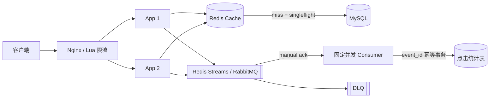

# 短链高并发、可靠消息与降级设计

<!-- 修改说明: 2026-07-14 将泛分布式词汇表收束为短链简历项目可落地的缓存、可靠点击统计、Lua 原子限流、超时/重试/熔断、过载保护、降级矩阵与真实压测 -->
<!-- 修改说明: 2026-07-26 按审查报告修订：补齐四条主线的完整可编译 Go 清单（§3.6 singleflight、§4.5 go-redis v9 生产者/消费者含幂等事务与优雅关闭、§5.2 redis.NewScript + Gin 限流中间件）；新增 §1.2 CAP/BASE 理论最小集、§3.3 穿透/击穿/雪崩术语映射、§3.7 singleflight 坑、§4.6 热点行聚合、§4.7 Outbox、§6.5 连接池参数、§7.1 Redis 高可用；重试判定改用 PEL delivery counter；修正 §0.2 QPS 引用、§3.4 缓存双写残余竞态、§5.1 补 NewScript 自动回退说明、§6.1 后台任务改为 context.WithoutCancel 指导、Redis 7/8 版本与许可证说明；原重复小节号已重排为 §4.9/§4.10、§5.3。同日复核：§3.6/§4.5（event、producer、consumer）/§5.2 四份完整清单与 §4.6 批量聚合片段已用 Go 1.26 实际编译通过；修正知识地图自测计数（§12 共 10 题，目标恢复为 ≥8/10） -->
<!-- 修改说明: 2026-07-27 去水化精简：删除 §0.3 知识地图、§0.4 建议学习时长、§0.5 学完你能做什么、§0.2 读者水平对照表、§11 FAQ、§12 闭卷自测（含参考答案）、§13 费曼检验与 EXPANSION-STANDARD 自检尾注；「本章与上一章的关系」导航块中的架构图、11↔14 对照表与范围声明迁入 §1 开头；FAQ 中正文缺失的 4 条技术点并入正文（Q4 stream ID 与 event_id 之别→§4.1、Q8 singleflight 单实例边界→§3.6、Q11 熔断与重试关系→§6.3、Q15 consumer lag 诊断顺序→§4.6），其余 FAQ/自测条目经逐条比对确认正文已有同等深度表述后删除；全部代码清单与技术讲解未做任何改动 -->

> **文件编码**：UTF-8。
> **技术栈版本**：Go 1.26.x、Redis 7.x/8.x（本章用到的 Streams/`XAUTOCLAIM`/Lua 在两个大版本行为一致）、RabbitMQ 4.x（替代方案）、MySQL 8、Prometheus；Go 库：go-redis v9、Gin v1.10+、`golang.org/x/sync`、google/uuid v1.6+。具体依赖以项目 `go.mod` 与镜像 digest 锁定。
> **版本小注**：Redis 8.0（2025 年 5 月 GA）起许可证改为 AGPLv3/RSALv2/SSPLv1 三选一；社区另有 Linux 基金会维护的 BSD 分支 **Valkey**（从 Redis 7.2 分叉）。本章代码在 Redis 7/8 与 Valkey 上都能跑——面试可能问到这次许可证变更，知道即可。
> **关联章节**：
> - [11 短链服务项目实战（下）](./11-短链服务项目实战下.md)（发号、缓存、302 读热点）
> - [系统设计 08 短链服务设计](../系统设计/08-短链服务设计.md)（INCR 发号、布隆、MQ 统计）
> - [系统设计 02 限流熔断与降级](../系统设计/02-限流熔断与降级.md)（令牌桶理论）
> - [系统设计 04 消息队列架构设计](../系统设计/04-消息队列架构设计.md)（异步统计）

---

## 0. 读前导读（零基础也能跟上）

### 0.1 用一句话弄懂本章

**一句话**：短链的高并发不是堆 gRPC、Kubernetes 和“分布式”名词，而是让 Redirect 热路径在依赖变慢、消息重复、流量突发时仍然**快、可控、可恢复、可证明**。

**生活类比**：

| 概念 | 类比 | 短链场景 |
|------|------|----------|
| **Cache Aside + singleflight** | 热菜提前备好，同一道临时缺货只派一人去仓库 | Redis miss 时防 DB 被并发击穿 |
| **可靠消息** | 小票交到厨房后要签收，失败进入待处理箱 | 点击事件确认、重试、DLQ |
| **event_id 幂等** | 同一张小票复印两份，也只记一笔账 | at-least-once 不重复增加 PV |
| **Lua 原子限流** | 保安在同一本账上一次完成查额度和扣额度 | 多 App 实例共享限流状态 |
| **超时/熔断** | 供应商迟迟不接电话就暂停拨打 | 防慢依赖拖垮 goroutine 与连接池 |
| **过载保护** | 店满就停止接新单 | 有界队列、并发上限、429/503 |

> **关于章名**：文件名里的「分布式入门」不会铺开讲全部理论——本章 §1.2 给出**分布式理论最小集**（CAP、BASE、最终一致性，足够面试开场），完整推导见《系统设计》篇与 [15 章面试专题](./15-Go面试专题与知识点总表.md)。本章主体是把这些理论落在短链项目的高并发实践上。

### 0.2 你需要提前知道什么

| 术语 | 解释 | 请先学 |
|------|------|--------|
| **goroutine** | 轻量线程 | Go 04 并发 |
| **Redis** | 内存 KV | 11 章短链缓存 |
| **QPS** | 每秒请求数 | 本章 §8 |
| **幂等** | 同一操作重复执行，最终结果仍等同一次 | 本章 §4 |
| **P95/P99** | 95%/99% 请求不超过的延迟 | 本章 §8 |
| **CAP/BASE** | 分布式系统里一致性与可用性的取舍理论 | 本章 §1.2 |
| **缓存穿透/击穿/雪崩** | 三类经典缓存故障模式 | 本章 §3.3 |

---

## 1. 高并发下短链系统的瓶颈

[13 章 Docker 部署](./13-Docker与Linux部署Go服务.md) 让短链可以重复发布与恢复；本章回答：**流量和故障上来后，怎样保护最重要的 Redirect 路径，并让统计最终可信**。先看全景架构，后面每个小节都落在这张图的某条边上：


```mermaid
flowchart LR
    Client[客户端] --> Gateway[Nginx / Lua 限流]
    Gateway --> App1[App 1]
    Gateway --> App2[App 2]
    App1 --> Redis[(Redis Cache)]
    App2 --> Redis
    Redis -->|miss + singleflight| MySQL[(MySQL)]
    App1 --> Stream[[Redis Streams / RabbitMQ]]
    App2 --> Stream
    Stream -->|manual ack| Worker[固定并发 Consumer]
    Worker -->|event_id 幂等事务| Stats[(点击统计表)]
    Stream --> DLQ[[DLQ]]
```

| 11 章单机 | 14 章扩展 | 08 设计对应 |
|-----------|-----------|-------------|
| Redis Cache Aside | TTL jitter + negative cache + singleflight | 读热点与击穿保护 |
| 简单异步统计 | confirm/ack + retry + DLQ + `event_id` 幂等 | 点击最终一致 |
| 单机 limiter | Redis Lua 原子限流 | 多实例共享额度 |
| 依赖失败直接报错 | deadline/熔断/过载保护/降级矩阵 | 故障不级联 |

> **范围声明**：本项目先保持“一个 API 服务 + 一个统计 worker”。除非真实需求要求拆服务，否则不为了简历硬加 gRPC、Kubernetes、Service Mesh 或分布式事务。把一个可靠闭环做深，比堆五个只会启动的组件更有说服力。

### 1.1 两条路径与三类瓶颈：先看证据再动手

对照 [08 短链设计](../系统设计/08-短链服务设计.md) 读多写少：

| 路径 | 关键目标 | 先看什么证据 | 优先手段 |
|------|----------|--------------|----------|
| Redirect 302 | 低 P99、高可用 | cache hit、Redis/DB P99、5xx | Cache Aside、singleflight、超时、降级 |
| Create | 正确、可控 | 429/冲突、DB 写延迟 | 唯一索引、幂等 key、Lua 限流 |
| 点击统计 | 不拖慢跳转、最终不重计 | publish error、lag、retry、DLQ | 可靠消息、批量消费、event_id 幂等 |
| 无效短码扫描 | 不打穿 DB | not-found QPS、DB miss | negative cache；布隆按证据选做 |
| 依赖抖动 | 不级联 | timeout、in-flight、pool wait | deadline、有限重试、熔断、bulkhead |

**术语（Read-heavy 读多写少）**：读请求通常多于写；不同产品可能约 10:1～100:1，必须用真实日创建量和日跳转量估算，不能固定背一个比例。

优化顺序固定为：**定义 SLO → 建立指标 → 压测复现 → 找瓶颈 → 只改一个变量 → 对比前后**。没有真实测量时，雪花 ID、布隆过滤器、分片和微服务都只是猜测。

### 1.2 分布式入门最小理论集：CAP、BASE 与最终一致性

我们的部署其实已经是一个小型分布式系统：两个 App 实例、一个 Redis、一个 MySQL、一个统计 worker——它们**通过网络协作，而网络会丢包、会延迟、会断开**。分布式理论回答的核心问题就一个：网络不可靠时，数据怎么办？

**CAP 定理**：对一个「有副本的数据系统」，以下三者最多同时满足两个——

| 字母 | 含义 | 通俗解释 |
|------|------|----------|
| **C**onsistency（一致性） | 每次读都能读到最新写入（线性一致） | 所有副本表现得像同一份数据 |
| **A**vailability（可用性） | 每个请求都能得到非错误响应 | 永远有答案，但可能是旧答案 |
| **P**artition tolerance（分区容忍） | 网络断成两半时系统仍能工作 | 网络故障是常态，不是选项 |

三个关键理解，比背定义重要：

1. **P 不是可选项**。网络分区一定会发生，所以真实的选择只有「分区发生时，保 C 还是保 A」：保 C 就拒绝部分请求（宁可报错也不给旧数据），保 A 就返回可能过期的数据。
2. **CAP 讨论的是“同一份数据”，不是给整个系统贴标签**。同一个系统里不同数据可以做不同选择：短链的「短码 → URL 读取」为了可用性接受缓存里的短暂旧值（偏 A）；「创建短链」必须写进 MySQL 唯一索引才算成功，宁可 503 也不能让两个用户拿到同一短码（偏 C）。
3. **没有分区时，取舍变成“延迟 vs 一致性”**（这是 CAP 的著名扩展 PACELC 的观点）：想每次读都强一致，就要付出跨节点确认的延迟；我们给 Redirect 加缓存，正是拿一致性窗口换延迟。

**BASE**：与强一致事务（ACID）相对的一组工程取向——**B**asically **A**vailable（基本可用，允许降级）、**S**oft state（允许存在中间状态）、**E**ventually consistent（最终一致：停止写入后，各副本最终收敛到相同值）。本章的点击统计就是教科书式的最终一致：跳转瞬间 PV 不会立刻 +1，事件经过 Streams、消费者、幂等事务后「最终」正确——我们用这一点换来了 302 热路径不被统计拖慢。

**常见一致性级别**（从强到弱，面试够用）：

| 级别 | 保证 | 短链对应 |
|------|------|----------|
| 线性一致（强一致） | 读永远看到最新写 | MySQL 单机内的读写 |
| 读己之写 | 自己写完自己能读到 | 用户创建短链后立刻访问必须能跳转（靠先写 DB、缓存按需回填实现） |
| 单调读 | 不会读到比上次更旧的值 | 同一用户看到的统计数不回退 |
| 最终一致 | 停止写入后副本最终收敛 | 点击 PV 统计、缓存 TTL 窗口 |

把这张表说清，再把本章的实践（缓存窗口 §3、at-least-once + 幂等 §4、降级矩阵 §7）对号入座，「分布式入门」的面试开场就够用了；复制协议、共识算法（Raft）、分布式事务的展开见《系统设计》篇与 15 章。

---

## 2. 先做正确的复杂度选择

### 2.1 短码发号：唯一索引永远是最后防线

| 方案 | 适用阶段 | 主要取舍 |
|------|----------|----------|
| DB 自增 ID → Base62 | 单库、写入不高 | 最简单，但短码可推测业务量 |
| Redis `INCR` → Base62 | 已依赖 Redis、需要全局递增 | 中心 Redis 成为发号依赖 |
| 随机 7～10 位短码 | 不想暴露顺序 | 必须靠唯一索引冲突重试 |
| Snowflake → Base62 | 多节点本地高吞吐发号 | worker ID、时钟回拨、可预测性更复杂 |

对本项目，Redis `INCR` 或随机短码都足够做出优秀版本。无论选择什么，都给 `short_code` 建唯一索引，并对冲突做有限重试。只有压测证明发号器是瓶颈，才引入 Snowflake/号段；引入后要回答 worker ID 如何唯一、时钟回拨怎样处理、容量上限是多少。

### 2.2 分布式锁只用于低频协调任务

合适场景：只有一个实例执行的归档、全量同步、定期清理。基本做法是 `SET key token NX PX ttl`，释放时用 Lua 比较 token 后再删除；任务本身仍需幂等，因为锁可能过期或网络分区。

不合适场景：每次 Redirect cache miss 都抢一个分布式锁。热路径优先使用进程内 `singleflight` 合并同实例请求，再依靠 Redis 缓存、TTL jitter 和 DB 并发上限保护后端。分布式锁会增加一次网络往返，还会把锁服务变成新瓶颈。

---

## 3. Redirect 缓存热路径

### 3.1 Cache Aside 的正确分支

```text
GET cache(code)
├─ hit：解析状态/过期时间 → 302 或明确业务结果
├─ miss(redis.Nil)：singleflight → 查 MySQL → 回填缓存
└─ Redis error：记录降级指标 → 受控回源 MySQL

MySQL 查询
├─ found：回填正缓存 → 302
├─ truly not found：写短 TTL negative cache → 404
└─ timeout/error：503；绝不能伪装成 404
```

Go Redis 客户端中，“key 不存在”和“Redis 调用失败”必须分开判断。go-redis v9 用哨兵错误 `redis.Nil` 表示“key 不存在”，要用 `errors.Is` 判断：

```go
// 片段：区分 cache miss 与 Redis 故障（go-redis v9；完整热路径骨架见 §3.6）
val, err := rdb.Get(ctx, "link:"+code).Result()
switch {
case err == nil:
	// hit：解析状态后 302
case errors.Is(err, redis.Nil):
	// miss：走 singleflight 回源（§3.6）
default:
	// Redis 故障：记录降级指标，受控回源或 503（§7）
}
```

MySQL 同理：`sql.ErrNoRows` 才是业务不存在，连接超时/连接池耗尽是依赖故障。

### 3.2 四个必须一起做的保护

1. **TTL jitter**：基础 TTL 上随机增加约 10%～20%，避免大量 key 同一秒过期。
2. **negative cache**：只缓存经过 DB 确认的不存在，TTL 通常 30s～2min；依赖故障不能写 negative。
3. **singleflight**：按 short code 合并同一实例并发回源；函数内部仍要二次查缓存，防别的实例已回填。
4. **DB bulkhead**：给回源设置独立并发上限和短 deadline，额度满时快速 503，不能无限堆 goroutine。

### 3.3 缓存穿透、击穿、雪崩：把手段和面试术语对上号

§3.2 的四个保护其实就是三道高频面试题的答案，只是还没点名。面试官几乎必问这三个词，务必能互相翻译：

| 面试术语 | 是什么 | 本章对应手段 |
|----------|--------|--------------|
| **缓存穿透**（penetration） | 请求的 key **在缓存和 DB 里都不存在**（如恶意扫描随机短码），每次都打到 DB | negative cache（§3.2）+ 入参格式校验 + IP 限流（§5.3）；量大再上布隆过滤器（§3.5） |
| **缓存击穿**（breakdown，热 key 失效） | **某个热点 key 恰好过期**，一瞬间的大量并发全部回源同一条数据 | singleflight 合并回源（§3.6）；也可用“逻辑过期”——value 里存过期时间、后台异步刷新 |
| **缓存雪崩**（avalanche） | **大量 key 同时过期**或 Redis 整体不可用，回源洪峰压垮 DB | TTL jitter 打散过期时间（§3.2）；Redis 故障时靠熔断 + 有界回源 + 降级矩阵（§6/§7）；更进一步是 Redis 高可用（§7.1） |

记法：**穿透是“根本没有”，击穿是“一个热点刚过期”，雪崩是“一大片同时没了”**。回答时先给定义、再给自己项目里的具体手段，比背概念清单有说服力得多。

### 3.4 更新、禁用与缓存一致性

- 先提交 MySQL 事务，再删除 Redis key；删除失败进入可重试的失效任务并告警。
- 不把“先删缓存再写 DB”当默认，否则并发读可能把旧值重新写回。
- 禁用/过期是业务状态，可在缓存 value 中一起保存，避免每次再查 DB。
- 缓存 TTL 是最终兜底，不能代替主动失效。
- 热 key 只有在压测证明单 Redis 节点/网络成为瓶颈后，才考虑本地 L1 或 CDN；它们会增加一致性成本。

**“先写库再删缓存”仍有一个残余竞态**，面试常追问“这样就绝对一致了吗”——答案是否。时序如下：

```text
时刻 1  请求 A 读缓存 miss，去 DB 读到旧值 v1
时刻 2  请求 B 更新 DB 为 v2，随后删除缓存（此刻缓存本来就是空的，删了个寂寞）
时刻 3  请求 A 才把手里的旧值 v1 回填进缓存
结果    缓存里驻留 v1，直到 TTL 到期
```

这个窗口要求“读恰好 miss，且回填动作恰好晚于写库+删缓存”，概率低但真实存在。缓解手段按成本从低到高：

1. **较短的 TTL**：把不一致窗口的上限压到分钟级。本项目采用这条——短链的 URL 更新极少，TTL 兜底可接受，这就是上面“TTL 是最终兜底”兜的那个竞态。
2. **延迟双删**：写库删缓存后，延迟几百毫秒再删一次，覆盖“慢读回填”的窗口；延迟取多长只能估计，是它的固有缺点。
3. **订阅 binlog 失效**（如 Canal/Debezium）：由 DB 变更日志驱动缓存失效，一致性最好，但引入一整套新组件，本项目现阶段不做。

面试标准答法：“先写库再删缓存 + TTL 兜底”覆盖绝大多数场景；能说出上面的竞态时序和三级缓解，就超过多数候选人了。

### 3.5 布隆过滤器不是默认必选

布隆能快速拒绝“肯定不存在”的 code，但有误判、重建和一致性成本。先用 negative cache + 限流；只有无效短码扫描确实导致大量 DB miss 时再加。布隆不可用时应绕过继续查缓存/DB，不能因此把真实短码判成 404。

### 3.6 动手：singleflight 合并回源（完整可编译清单）

**singleflight 是什么**：`golang.org/x/sync/singleflight` 提供一个 `Group` 类型，对同一个 key 的并发调用只真正执行一次函数，其余调用等待并共享同一份结果。它就是防击穿（§3.3）的标准工具。

下面的 demo 不需要 Redis/MySQL，用 `time.Sleep` 模拟慢查询，直接就能跑——先把机制看明白，再替换成真实依赖。

新开一个目录（PowerShell）：

```powershell
mkdir sfdemo; cd sfdemo
go mod init sfdemo
# 国内网络可先设代理（仅当前窗口生效）：$env:GOPROXY = "https://goproxy.cn,direct"
go get golang.org/x/sync@latest
```

**文件 `sfdemo/main.go`（完整清单，运行：`go run .`）**：

```go
// sfdemo/main.go —— 演示 singleflight 如何把 50 个并发回源合并成 1 次查库
package main

import (
	"context"
	"errors"
	"fmt"
	"sync"
	"sync/atomic"
	"time"

	"golang.org/x/sync/singleflight"
)

// dbCalls 统计真正打到“数据库”的次数
var dbCalls atomic.Int64

// slowDBLookup 模拟一次 100ms 的 MySQL 查询
func slowDBLookup(code string) (string, error) {
	dbCalls.Add(1)
	time.Sleep(100 * time.Millisecond)
	if code == "abc123" {
		return "https://example.com/landing", nil
	}
	return "", errors.New("not found")
}

// 用进程内 map 模拟缓存（真实项目里这一层是 Redis）
var (
	mu    sync.RWMutex
	cache = map[string]string{}
)

func cacheGet(code string) (string, bool) {
	mu.RLock()
	defer mu.RUnlock()
	v, ok := cache[code]
	return v, ok
}

func cacheSet(code, url string) {
	mu.Lock()
	defer mu.Unlock()
	cache[code] = url
}

var group singleflight.Group

// resolve 是 Redirect 热路径的骨架：先查缓存，miss 再经 singleflight 回源
func resolve(ctx context.Context, code string) (string, error) {
	if v, ok := cacheGet(code); ok {
		return v, nil // cache hit：最常见的分支
	}
	v, err, shared := group.Do(code, func() (any, error) {
		// 第二次查缓存：排队等待期间，可能别的 goroutine 已经回填过
		if v, ok := cacheGet(code); ok {
			return v, nil
		}
		u, err := slowDBLookup(code)
		if err != nil {
			return "", err
		}
		cacheSet(code, u) // 回填缓存，后续请求直接 hit
		return u, nil
	})
	_ = shared // shared=true 表示这次结果被多个等待者共享
	if err != nil {
		return "", err
	}
	return v.(string), nil
}

func main() {
	var wg sync.WaitGroup
	for i := 0; i < 50; i++ {
		wg.Add(1)
		go func() {
			defer wg.Done()
			if _, err := resolve(context.Background(), "abc123"); err != nil {
				fmt.Println("error:", err)
			}
		}()
	}
	wg.Wait()
	fmt.Printf("50 个并发请求，实际查库次数 = %d\n", dbCalls.Load())
}
```

预期输出：

```text
50 个并发请求，实际查库次数 = 1
```

逐段讲解：

- `group.Do(code, fn)`：以 short code 为 key。同一时刻只有第一个进来的 goroutine 真正执行 `fn`，其余 49 个阻塞等待并直接共享返回值——这就是“50 并发只查 1 次库”。
- **函数内部第二次查缓存**：`Do` 的回调开头先重查一遍缓存。原因是排队等待开始前，可能上一轮 `Do` 刚把值回填（多实例部署时也可能是别的实例回填了 Redis），不重查会白打一次 DB。这正是 §3.2 第 3 条的代码形态。
- **singleflight 只合并本进程内的并发**：两个 App 实例各持有各自的 `Group`，同一热点 code 在最坏情况下仍会各回源一次。跨实例的合并靠共享的 Redis 缓存层完成（谁先回填、其他实例直接 hit），DB 侧再用 bulkhead（§6.4）兜底——不要为此给每次 cache miss 加分布式锁，那会增加一次网络往返并把锁服务变成新瓶颈（§2.2）。
- 换成真实项目时：`cacheGet/cacheSet` 换成 §3.1 片段里的 go-redis 调用，`slowDBLookup` 换成带 deadline + bulkhead（§6.4）的 MySQL 查询，`resolve` 挂进 Gin 的 Redirect handler。结构完全一致。

### 3.7 singleflight 的四个已知坑（面试常问）

推荐它不等于它没有坑，以下四条都在真实事故和面试里反复出现：

1. **`Do` 不响应 context 取消**：调用方的 ctx 超时了，`Do` 里的函数照跑，调用方也只能干等。需要“调用方可以先走”的语义时用 `DoChan` + `select`：

```go
// 片段：属于 Redirect handler，给回源等待加上调用方超时
ch := group.DoChan(code, func() (any, error) {
	// 回源函数内部用脱离请求取消的 ctx（§6.1 会讲 WithoutCancel），
	// 这样即使当前请求放弃等待，回源完成后仍会回填缓存
	return queryDB(context.WithoutCancel(ctx), code)
})
select {
case res := <-ch:
	if res.Err != nil {
		return "", res.Err
	}
	return res.Val.(string), nil
case <-ctx.Done():
	return "", ctx.Err() // 当前请求先返回 503，后台回源继续
}
```

2. **一次失败，全员失败**：`fn` 返回的 error 会广播给本轮所有等待者，一次偶发超时会放大成几十个请求同时 5xx。缓解：错误结果绝不写入缓存；对可重试错误让调用方带退避重试。
3. **一个慢调用挡住整批**：本轮 `fn` 没返回前，后来者只能等。若第一个调用恰好命中慢查询，所有人一起慢——这也是必须给 DB 查询设 deadline（§6.1）的原因之一。
4. **`Forget(key)` 的用途**：在途调用结束前，同 key 的新请求默认都挂在这一轮上。`Forget(key)` 把 key 从在途表移除，让下一个请求立刻发起新调用而不是共享旧的在途结果——典型用法：已知数据刚被更新，不想让后来者拿到正在返回的旧值。

---

## 4. 可靠点击统计：确认、重试、DLQ、幂等

### 4.1 先定义事件契约

下面是事件结构的骨架（片段：完整可编译版本连同用 UUIDv7 生成 `event_id` 的构造函数，见 §4.5 的 `event/event.go`）：

```go
type ClickEvent struct {
    EventID      string    `json:"event_id"`      // 每次真实点击生成一次，重试时保持不变
    SchemaVersion int      `json:"schema_version"`
    ShortCode    string    `json:"short_code"`
    OccurredAt   time.Time `json:"occurred_at"`   // UTC
    RequestID    string    `json:"request_id"`
    IPHash       string    `json:"ip_hash,omitempty"`
    UAHash       string    `json:"ua_hash,omitempty"`
}
```

- `event_id` 可用 UUIDv7/ULID；它标识“这次点击”，消费者重试不能重新生成。
- `event_id` 不能用 broker 的传输层标识（如 Redis stream ID）代替：业务 event ID 在 publish 前生成，切换 broker、重发、DLQ 重放时都保持不变；stream ID 标识的是“这次投递”，重发一次就换一个，拿它做幂等键会让同一次点击被计多次。
- `schema_version` 支持消费者兼容新旧消息；新增字段优先保持向后兼容。
- IP/User-Agent 按统计需求最小化收集、hash/截断并规定保留期，不把完整隐私数据到处复制。
- 事件序列化、最大大小、必填字段、时区都写进测试。

### 4.2 接受现实：at-least-once + 幂等

| 语义 | 结果 | 本项目选择 |
|------|------|------------|
| at-most-once | 最多一次，失败可能丢 | 不适合需要可信统计 |
| at-least-once | 不轻易丢，但可能重复 | ✅ broker 确认 + consumer ack + `event_id` 幂等 |
| exactly-once | 跨 broker/DB 的绝对一次成本很高 | 不宣称；实现“效果上的一次” |

生产者收到 broker 确认，只代表消息已被 broker 接受；消费者只有在数据库事务提交后才 ack。任何“先 ack 再写 DB”都会在进程崩溃时永久丢统计。

### 4.3 Redis Streams 方案（项目默认推荐）

项目本来已有 Redis，Streams 能用较少组件完成可靠消费：

```text
XADD click:events * payload <json>
XREADGROUP GROUP click-workers worker-1 COUNT 100 BLOCK 2000 STREAMS click:events >
处理并提交 MySQL
XACK click:events click-workers <stream-id>
```

初始化一次 consumer group：

```bash
XGROUP CREATE click:events click-workers 0 MKSTREAM
```

`0` 表示消费 group 创建前已经存在的 backlog；若明确只处理创建后的新消息才使用 `$`。生产部署应先创建 group，再开放 Producer 流量。

完整消费循环：

1. Producer 在 Redirect 已解析成功后，以很短 deadline 执行 `XADD`。
2. Consumer 固定并发、批量 `XREADGROUP`，消息进入 PEL（Pending Entries List）。
3. 在一个 MySQL 事务中完成 `event_id` 去重与 PV 聚合。
4. `COMMIT` 成功后 `XACK`；进程若在 commit 后、ack 前崩溃，消息会重投，但幂等会拦住重复计数。
5. 定时检查 `XPENDING`，用 `XAUTOCLAIM` 领取超过 idle timeout 的遗留消息。
6. 对临时错误做退避重试（§4.5 的实现用 `XAUTOCLAIM` 的 min-idle 时间形成天然的重试间隔）；重试次数直接读 PEL 自带的 delivery counter。超过上限时 `XADD click:events:dlq`，写入原消息、原 stream ID、最后错误和次数；只有 DLQ 写入成功后才 ack 原消息，DLQ 也失败则保留 pending 并告警。
7. DLQ 必须有告警、查看工具和人工/修复后重放命令；“进入 DLQ”不是处理完成。

判断“这条消息重试过几次”**不需要自己造轮子**：PEL 里每条 pending 消息自带 delivery counter，`XPENDING`（扩展形式）能读到它，且消息每次被 `XCLAIM`/`XAUTOCLAIM` 重新领取时自动加一（`JUSTID` 变体除外，它不递增）。用 delivery counter 判断超限入 DLQ，正是 Redis 官方文档推荐的 poison message 检测方式；只有“进 DLQ 后重放还要保留完整 attempt 历史”这类特殊需求，才值得再补一套自定义 metadata。另一条纪律是：绝不能失败后立刻无限 claim，形成 CPU/DB 重试风暴——重领必须设 min-idle 间隔（实现见 §4.5）。

若 Streams 与缓存共用一个 `allkeys-lru` Redis，队列消息可能被淘汰。简历项目若把统计可靠性当亮点，应给 Streams 独立 Redis 实例/至少独立淘汰策略（`noeviction`）、AOF 和容量告警。Stream retention 必须覆盖“最大可容忍消费者中断时间”，不能在 pending 尚未处理时激进 trim。

### 4.4 `event_id` 幂等必须和聚合在同一事务

```sql
CREATE TABLE click_event_dedup (
    event_id     CHAR(36)    PRIMARY KEY,
    short_code   VARCHAR(16) NOT NULL,
    occurred_at  DATETIME(3) NOT NULL,
    processed_at DATETIME(3) NOT NULL
);

CREATE TABLE link_daily_stats (
    short_code VARCHAR(16) NOT NULL,
    stat_date  DATE NOT NULL,
    pv         BIGINT UNSIGNED NOT NULL DEFAULT 0,
    PRIMARY KEY (short_code, stat_date)
);
```

教学版用 `CHAR(36)` 直接保存 UUID 文本（如 `0197c3f2-1a2b-7cde-...`），好调试、和 §4.5 的 Go 代码一一对应。生产可优化为 `BINARY(16)`（省一半空间、索引更小），但必须把 UUIDv7/ULID 解析成固定 16 字节再写入，不能把字符串字节无说明地塞进该字段；用 ULID 文本则相应改 `CHAR(26)`。

消费者事务伪代码：

```text
BEGIN
INSERT click_event_dedup(event_id, ...)
if duplicate event_id:
    COMMIT                # 已处理过，不再增加 PV
else if other error:
    ROLLBACK              # 不 ack，按策略重试
else:
    INSERT link_daily_stats(..., pv=1)
    ON DUPLICATE KEY UPDATE pv = pv + 1
    COMMIT
ACK broker message
```

唯一约束是并发下真正可靠的防线，不能只靠“先 SELECT 再 INSERT”。推荐捕获明确的 duplicate-key 错误，而不是用会吞掉其他数据问题的宽泛 `INSERT IGNORE`。dedup 数据要保留至少超过 broker 最大重投/重放窗口；清理过早会让旧消息再次计数。批量消费可以减少 DB 往返，但 ack 只能发生在对应批次事务提交以后。

Go 里“duplicate event_id”这个分支怎么判断？捕获 MySQL 驱动的具体错误码（1062 = `ER_DUP_ENTRY`），而不是做字符串匹配：

```go
// 片段：applyEvent 中捕获重复键错误（完整函数见 §4.5 的 consumer/main.go）
var me *mysql.MySQLError
if errors.As(err, &me) && me.Number == 1062 { // 1062 = ER_DUP_ENTRY
	return tx.Commit() // 已处理过：按成功提交，不再加 PV
}
```

### 4.5 动手：go-redis v9 生产者与消费者（完整可编译清单）

这一节把 §4.1～§4.4 的全部概念落成能跑的代码：一个模块、三个 Go 文件、一个建表脚本。目录结构：

```text
clickpipe/
├── go.mod
├── schema.sql          # 建表脚本（§4.4 的两张表）
├── event/
│   └── event.go        # 事件契约（§4.1 完整版）
├── producer/
│   └── main.go         # XADD 投递（含重复投递演示）
└── consumer/
    └── main.go         # XAutoClaim + XReadGroup + 幂等事务 + XAck + DLQ + 优雅关闭
```

#### 4.5.1 准备环境（Windows PowerShell）

需要本机有 Redis 和 MySQL。如果 13 章的 Compose 还在跑（端口 6379/3306），直接复用并跳过 `docker run`；否则用 Docker Desktop 单独起两个：

```powershell
docker run -d --name lab-redis -p 6379:6379 redis:7
docker run -d --name lab-mysql -p 3306:3306 -e MYSQL_ROOT_PASSWORD=root -e MYSQL_DATABASE=shortlink mysql:8
```

初始化模块与依赖（版本号是本教程实测编译通过的版本）：

```powershell
mkdir clickpipe; cd clickpipe
go mod init clickpipe
# 国内网络可先设代理（仅当前窗口生效）：$env:GOPROXY = "https://goproxy.cn,direct"
go get github.com/redis/go-redis/v9@latest   # 实测 v9.21.0
go get github.com/go-sql-driver/mysql@latest # 实测 v1.10.0
go get github.com/google/uuid@v1.6.0         # NewV7 需要 v1.4.0+，此处固定实测版本
```

把下面内容存成 `clickpipe/schema.sql`：

```sql
CREATE TABLE IF NOT EXISTS click_event_dedup (
    event_id     CHAR(36)    PRIMARY KEY,
    short_code   VARCHAR(16) NOT NULL,
    occurred_at  DATETIME(3) NOT NULL,
    processed_at DATETIME(3) NOT NULL
);

CREATE TABLE IF NOT EXISTS link_daily_stats (
    short_code VARCHAR(16) NOT NULL,
    stat_date  DATE NOT NULL,
    pv         BIGINT UNSIGNED NOT NULL DEFAULT 0,
    PRIMARY KEY (short_code, stat_date)
);
```

导入（PowerShell 管道可以直接喂给容器里的 mysql 客户端；MySQL 容器刚启动要等十几秒初始化完成，容器名按你的实际名称调整）：

```powershell
Get-Content .\schema.sql | docker exec -i lab-mysql mysql -uroot -proot shortlink
```

#### 4.5.2 事件包 `event/event.go`

```go
// event/event.go —— 点击事件契约（§4.1 的完整版）
package event

import (
	"time"

	"github.com/google/uuid"
)

const SchemaVersion = 1

type ClickEvent struct {
	EventID       string    `json:"event_id"`       // 每次真实点击生成一次，重试时保持不变
	SchemaVersion int       `json:"schema_version"` // 消费者据此兼容新旧消息
	ShortCode     string    `json:"short_code"`
	OccurredAt    time.Time `json:"occurred_at"` // 统一 UTC
	RequestID     string    `json:"request_id"`
	IPHash        string    `json:"ip_hash,omitempty"`
	UAHash        string    `json:"ua_hash,omitempty"`
}

// New 在“真实点击发生的那一刻”生成事件；
// 之后无论重试多少次投递，都必须复用同一个返回值（event_id 不变）。
func New(shortCode, requestID string) (ClickEvent, error) {
	id, err := uuid.NewV7() // UUIDv7：时间有序，利于按时间排查问题
	if err != nil {
		return ClickEvent{}, err
	}
	return ClickEvent{
		EventID:       id.String(),
		SchemaVersion: SchemaVersion,
		ShortCode:     shortCode,
		OccurredAt:    time.Now().UTC(),
		RequestID:     requestID,
	}, nil
}
```

要点：`New` 只在点击发生时调用一次，这实现了 §4.1 的第一条规则“重试不能重新生成 `event_id`”——重试是重发同一个 `ClickEvent` 值，而不是再 `New` 一个。

#### 4.5.3 生产者 `producer/main.go`

```go
// producer/main.go —— 模拟 Redirect 热路径里的事件投递：
// 发 5 个不同事件，再故意重复投递第 1 个，验证消费端幂等
package main

import (
	"context"
	"encoding/json"
	"fmt"
	"log"
	"time"

	"github.com/redis/go-redis/v9"

	"clickpipe/event"
)

const streamKey = "click:events"

func main() {
	rdb := redis.NewClient(&redis.Options{Addr: "127.0.0.1:6379"})
	defer rdb.Close()
	ctx := context.Background()

	var first event.ClickEvent
	for i := 0; i < 5; i++ {
		ev, err := event.New("abc123", fmt.Sprintf("req-%03d", i))
		if err != nil {
			log.Fatal(err)
		}
		if i == 0 {
			first = ev
		}
		if err := publish(ctx, rdb, ev); err != nil {
			// 真实项目：这里只计数并走有界 fallback，绝不影响 302（§4.9）
			log.Printf("publish failed: %v", err)
			continue
		}
		log.Printf("published %s", ev.EventID)
	}

	// 模拟 at-least-once 的重复投递：同一个 event_id 再发一次
	if err := publish(ctx, rdb, first); err != nil {
		log.Printf("publish dup failed: %v", err)
	} else {
		log.Printf("published DUPLICATE %s（消费端应跳过计数）", first.EventID)
	}
}

// publish 用很短的 deadline 执行 XADD：统计是软依赖，不能拖慢跳转。
// 生产里通常 5~10ms；demo 放宽到 50ms，容忍首次建连的开销。
func publish(ctx context.Context, rdb *redis.Client, ev event.ClickEvent) error {
	payload, err := json.Marshal(ev)
	if err != nil {
		return err
	}
	ctx, cancel := context.WithTimeout(ctx, 50*time.Millisecond)
	defer cancel()
	return rdb.XAdd(ctx, &redis.XAddArgs{
		Stream: streamKey,
		MaxLen: 100_000, // 近似修剪防无限增长；必须能覆盖最大可容忍的消费中断（§4.3）
		Approx: true,
		Values: map[string]any{"payload": payload},
	}).Err()
}
```

对应 §4.3 的第 1 步：`XADD` 带短 deadline，失败只记录不阻塞；`MaxLen + Approx` 就是 `XADD ... MAXLEN ~ 100000` 的 Go 写法。

#### 4.5.4 消费者 `consumer/main.go`

这是本章最重要的一份代码，§4.3 完整消费循环的 1～7 步全部在里面。先贴全文，紧接着逐段讲解：

```go
// consumer/main.go —— 可靠消费循环：
// XAutoClaim 接管遗留 + XReadGroup 拉新 + 幂等事务 + XAck + DLQ + 优雅关闭
package main

import (
	"context"
	"database/sql"
	"encoding/json"
	"errors"
	"log"
	"os"
	"os/signal"
	"strings"
	"syscall"
	"time"

	"github.com/go-sql-driver/mysql"
	"github.com/redis/go-redis/v9"

	"clickpipe/event"
)

const (
	streamKey   = "click:events"
	dlqKey      = "click:events:dlq"
	groupName   = "click-workers"
	consumerID  = "worker-1"
	batchSize   = 100
	minIdle     = 30 * time.Second // pending 空闲超过这个时间才会被接管重试
	maxDelivery = 5                // 投递满 5 次仍失败 → DLQ
)

func main() {
	// Ctrl+C（Windows 上是 os.Interrupt）或 docker stop 的 SIGTERM（Linux）都会取消 ctx
	ctx, stop := signal.NotifyContext(context.Background(), os.Interrupt, syscall.SIGTERM)
	defer stop()

	rdb := redis.NewClient(&redis.Options{Addr: "127.0.0.1:6379"})
	defer rdb.Close()

	db, err := sql.Open("mysql",
		"root:root@tcp(127.0.0.1:3306)/shortlink?parseTime=true&loc=UTC")
	if err != nil {
		log.Fatal(err)
	}
	defer db.Close()
	db.SetMaxOpenConns(10)
	db.SetMaxIdleConns(10)
	db.SetConnMaxLifetime(30 * time.Minute)

	// 幂等地创建 consumer group：重复创建报 BUSYGROUP，忽略即可
	err = rdb.XGroupCreateMkStream(ctx, streamKey, groupName, "0").Err()
	if err != nil && !strings.Contains(err.Error(), "BUSYGROUP") {
		log.Fatalf("create group: %v", err)
	}

	log.Println("consumer started, press Ctrl+C to stop")
	for {
		if ctx.Err() != nil { // 收到退出信号：不再拉新消息，直接退出
			log.Println("shutdown: stop fetching, exit")
			return
		}

		// 第 1 步：接管空闲超过 minIdle 的 pending 消息（内含 DLQ 判定）
		msgs := claimStale(ctx, rdb)

		// 第 2 步：读新消息；BLOCK 2s，空闲时不烧 CPU
		streams, err := rdb.XReadGroup(ctx, &redis.XReadGroupArgs{
			Group:    groupName,
			Consumer: consumerID,
			Streams:  []string{streamKey, ">"},
			Count:    batchSize,
			Block:    2 * time.Second,
		}).Result()
		switch {
		case err == nil:
			for _, s := range streams {
				msgs = append(msgs, s.Messages...)
			}
		case errors.Is(err, redis.Nil): // BLOCK 超时且没有新消息：正常，不是错误
		case ctx.Err() != nil: // 信号打断了阻塞读：回到循环顶部退出
			continue
		default:
			log.Printf("XREADGROUP error: %v", err)
			time.Sleep(time.Second) // 退避，避免 Redis 故障时热循环
			continue
		}

		handleBatch(ctx, rdb, db, msgs)
	}
}

// handleBatch 逐条处理并 ack。批次一旦拉下来就要处理完再退出，
// 所以内部用 context.WithoutCancel 脱离信号取消，另配独立超时（§6.1）。
func handleBatch(sigCtx context.Context, rdb *redis.Client, db *sql.DB, msgs []redis.XMessage) {
	if len(msgs) == 0 {
		return
	}
	ctx, cancel := context.WithTimeout(context.WithoutCancel(sigCtx), 30*time.Second)
	defer cancel()

	for _, m := range msgs {
		if err := handleOne(ctx, db, m); err != nil {
			log.Printf("handle %s failed: %v（不 ack，留在 pending 等待重投）", m.ID, err)
			continue
		}
		if err := rdb.XAck(ctx, streamKey, groupName, m.ID).Err(); err != nil {
			log.Printf("XACK %s failed: %v（重投会被幂等拦住）", m.ID, err)
		}
	}
}

func handleOne(ctx context.Context, db *sql.DB, m redis.XMessage) error {
	raw, ok := m.Values["payload"].(string) // go-redis 把 stream 字段值读成 string
	if !ok {
		return errors.New("message has no payload field")
	}
	var ev event.ClickEvent
	if err := json.Unmarshal([]byte(raw), &ev); err != nil {
		return err // 坏消息会一直失败，最终由 claimStale 送进 DLQ
	}
	return applyEvent(ctx, db, ev)
}

// applyEvent 在一个事务里完成 event_id 去重与 PV 聚合（§4.4）。
// 重复消息表现为 dedup 表主键冲突（MySQL 错误码 1062），按“已处理”提交。
func applyEvent(ctx context.Context, db *sql.DB, ev event.ClickEvent) error {
	tx, err := db.BeginTx(ctx, nil)
	if err != nil {
		return err
	}
	defer tx.Rollback() // Commit 成功后再调用只返回 ErrTxDone，无害

	_, err = tx.ExecContext(ctx,
		`INSERT INTO click_event_dedup (event_id, short_code, occurred_at, processed_at)
		 VALUES (?, ?, ?, UTC_TIMESTAMP(3))`,
		ev.EventID, ev.ShortCode, ev.OccurredAt)
	if err != nil {
		var me *mysql.MySQLError
		if errors.As(err, &me) && me.Number == 1062 { // 1062 = ER_DUP_ENTRY
			log.Printf("duplicate event_id=%s，跳过计数", ev.EventID)
			return tx.Commit() // 已处理过：按成功提交，不再加 PV
		}
		return err
	}

	_, err = tx.ExecContext(ctx,
		`INSERT INTO link_daily_stats (short_code, stat_date, pv)
		 VALUES (?, DATE(?), 1)
		 ON DUPLICATE KEY UPDATE pv = pv + 1`,
		ev.ShortCode, ev.OccurredAt)
	if err != nil {
		return err
	}
	return tx.Commit()
}

// claimStale 用 XAUTOCLAIM 接管空闲超过 minIdle 的 pending 消息。
// PEL 每条消息自带 delivery counter（被 XCLAIM/XAUTOCLAIM 重领时自增），
// 超过 maxDelivery 的消息移入 DLQ（§4.3）。
func claimStale(ctx context.Context, rdb *redis.Client) []redis.XMessage {
	msgs, _, err := rdb.XAutoClaim(ctx, &redis.XAutoClaimArgs{
		Stream:   streamKey,
		Group:    groupName,
		Consumer: consumerID,
		MinIdle:  minIdle,
		Start:    "0-0",
		Count:    batchSize,
	}).Result()
	if err != nil {
		if ctx.Err() == nil && !errors.Is(err, redis.Nil) {
			log.Printf("XAUTOCLAIM error: %v", err)
		}
		return nil
	}
	if len(msgs) == 0 {
		return nil
	}

	// 读取投递次数。教学从简：一次 XPENDING 全量读；
	// 生产可加 Idle 过滤、分页，或把次数缓存在处理侧。
	pending, err := rdb.XPendingExt(ctx, &redis.XPendingExtArgs{
		Stream: streamKey,
		Group:  groupName,
		Start:  "-",
		End:    "+",
		Count:  int64(len(msgs)),
	}).Result()
	if err != nil {
		log.Printf("XPENDING error: %v", err)
		return msgs
	}
	deliveries := make(map[string]int64, len(pending))
	for _, p := range pending {
		deliveries[p.ID] = p.RetryCount
	}

	keep := msgs[:0]
	for _, m := range msgs {
		if deliveries[m.ID] >= maxDelivery {
			moveToDLQ(ctx, rdb, m, deliveries[m.ID])
			continue
		}
		keep = append(keep, m)
	}
	return keep
}

// moveToDLQ：只有 DLQ 写入成功才 ack 原消息；写失败则保留 pending 并告警。
func moveToDLQ(ctx context.Context, rdb *redis.Client, m redis.XMessage, attempts int64) {
	err := rdb.XAdd(ctx, &redis.XAddArgs{
		Stream: dlqKey,
		Values: map[string]any{
			"payload":    m.Values["payload"],
			"origin_id":  m.ID,
			"attempts":   attempts,
			"last_error": "exceeded max delivery",
		},
	}).Err()
	if err != nil {
		log.Printf("DLQ write failed for %s: %v（保留 pending，必须告警）", m.ID, err)
		return
	}
	if err := rdb.XAck(ctx, streamKey, groupName, m.ID).Err(); err != nil {
		log.Printf("XACK after DLQ failed for %s: %v", m.ID, err)
		return
	}
	log.Printf("message %s → DLQ（已投递 %d 次），记得配告警", m.ID, attempts)
}
```

#### 4.5.5 逐段讲解：消费循环与优雅关闭

**信号与优雅关闭**：

- `signal.NotifyContext` 把“收到退出信号”变成“ctx 被取消”。Windows 下 Ctrl+C 触发 `os.Interrupt`；Linux/容器里 `docker stop` 先发 `SIGTERM`，宽限期（默认 10s，见 13 章）后才 `SIGKILL`。
- 优雅关闭的顺序是固定的三步：**停止拉取新消息 → 处理完已拉取的批次并 ack → 退出**。代码上：信号取消 ctx → 阻塞中的 `XReadGroup` 立刻报错返回 → 循环顶部检测 `ctx.Err()` 退出；而**已拉取的批次**在 `handleBatch` 里用 `context.WithoutCancel(sigCtx)` 脱离信号取消、另配 30s 独立超时——批次是我们欠 broker 的债，必须处理完或明确留在 pending，不能做一半被取消。
- 隐含约束：`批次处理时间上限（30s）` 必须小于 `docker stop` 宽限期，否则会被 SIGKILL 硬杀。不满足就调大 `docker stop -t` / Compose 的 `stop_grace_period`。不做优雅关闭的后果：每次发布都有一批消息做到一半被杀，全部留在 pending 等 30 秒重投，幂等虽然兜底，但重投风暴和 lag 尖峰是自己制造的。

**消费主循环**（对应 §4.3 的 2～5 步）：

- `XGroupCreateMkStream(..., "0")`：`0` 消费建组前的 backlog（§4.3 讲过 `0` 与 `$` 的区别）；重复建组报 `BUSYGROUP` 按成功处理，这让消费者可以随意重启。
- `XReadGroup` 的 `>` 表示“只要没投给过本组的新消息”；`Block: 2s` 让空闲时挂起而不是空转。**`redis.Nil` 在这里表示“BLOCK 到期且没有新消息”**，是正常情况不是错误——和 §3.1 的 GET 语义一脉相承。
- 失败的消息**不 ack**，它会留在 PEL；`claimStale` 每轮先用 `XAutoClaim` 领取空闲超过 30s 的消息——这个 `minIdle` 就是天然的重试间隔，避免了 §4.3 警告的“失败后立刻无限 claim”。
- delivery counter 从 `XPendingExt` 的 `RetryCount` 字段读出，投递满 `maxDelivery` 次直接走 `moveToDLQ`：先写 DLQ、成功才 ack 原消息，写失败则保留 pending 并打日志（生产要接告警）。
- `applyEvent` 就是 §4.4 的事务伪代码的直译：普通 `INSERT` 撞唯一键 → `errors.As` 断言出 `*mysql.MySQLError` 且 `Number == 1062` → 视为已处理提交。MySQL 里单条语句的 duplicate-key 错误不会毒化整个事务，`tx.Commit()` 仍然安全（PostgreSQL 不是这样，换库要改写法）。

#### 4.5.6 跑起来验证

```powershell
# 终端 1：先启动消费者（符合 §4.3“先建组，再放 Producer 流量”）
cd clickpipe
go run ./consumer

# 终端 2：投递 5 个事件 + 1 个重复事件
cd clickpipe
go run ./producer
```

消费者日志应出现 5 次正常处理和一行 `duplicate event_id=...，跳过计数`。查库确认（PV 是 5 不是 6，幂等生效）：

```powershell
docker exec -it lab-mysql mysql -uroot -proot shortlink -e "SELECT short_code, stat_date, pv FROM link_daily_stats; SELECT COUNT(*) AS dedup_rows FROM click_event_dedup;"
```

**实验 A（对应练习 5）——“commit 后、ack 前崩溃”**：把 `handleBatch` 里执行 `XAck` 的整个 `if` 块（三行）暂时注释掉重新运行，再跑一次 producer。消息全部处理但没有 ack，约 30 秒后被 `claimStale` 重新领取、重新处理——日志出现一串 `duplicate event_id`，PV 不变。这就是 §4.2“commit 后 ack 前崩溃最多导致重投”的可复现演示。看完记得把注释恢复。

**实验 B（对应练习 6）——poison message 进 DLQ**：注入一条非法 JSON：

```powershell
docker exec -it lab-redis redis-cli XADD click:events '*' payload not-json
```

观察：立即失败一次留在 pending → 每隔约 30s 被重领再失败 → 投递满 5 次进入 DLQ（全程约两分半）。查看 DLQ 内容：

```powershell
docker exec -it lab-redis redis-cli XRANGE click:events:dlq - +
```

**实验 C——优雅关闭**：消费者运行中按 Ctrl+C，应看到 `shutdown: stop fetching, exit` 而不是残留半批消息。

### 4.6 MySQL 热点行：先内存聚合，再批量更新

§4.5 的消费者对每条消息各开一个事务，教学上最清晰，但藏着一个真实瓶颈：**热门短码的 `link_daily_stats` 是同一行**。`pv = pv + 1` 需要行锁，100 条消息全点同一个 code 时，就是 100 次串行的行锁排队——消费吞吐被“单行写入速度”封顶。这时加消费者反而更糟：更多消费者抢同一行锁。由此得出一条通用纪律：**consumer lag 上升时不能反射式地加消费者**——先诊断瓶颈到底在 broker、DB 事务、热点行还是 poison message；若是热点行或 DB 事务瓶颈，加消费者只会把压力转移到 MySQL 并压垮它。

缓解思路：**一批消息先在内存里合并成 `(short_code, stat_date) → 增量` 的 map，每组只 UPDATE 一次**。100 条同码消息从 100 次行锁变成 1 次。dedup 插入仍逐条做（每个 `event_id` 都要留痕），但它们主键互不相同，没有热点。

```go
// 片段：consumer/main.go 的批量聚合变体，替换“逐条 applyEvent + 逐条 ack”
// 调用方式：整批消息先收集 []event.ClickEvent，成功后再对整批逐条 XACK
type statKey struct {
	Code string
	Date string // "2026-07-26"
}

func applyBatch(ctx context.Context, db *sql.DB, evs []event.ClickEvent) error {
	tx, err := db.BeginTx(ctx, nil)
	if err != nil {
		return err
	}
	defer tx.Rollback()

	agg := make(map[statKey]int64)
	for _, ev := range evs {
		_, err := tx.ExecContext(ctx,
			`INSERT INTO click_event_dedup (event_id, short_code, occurred_at, processed_at)
			 VALUES (?, ?, ?, UTC_TIMESTAMP(3))`,
			ev.EventID, ev.ShortCode, ev.OccurredAt)
		if err != nil {
			var me *mysql.MySQLError
			if errors.As(err, &me) && me.Number == 1062 {
				continue // 重复事件：不计入本批增量
			}
			return err // 其他错误：整批回滚，整批不 ack
		}
		k := statKey{Code: ev.ShortCode, Date: ev.OccurredAt.UTC().Format("2006-01-02")}
		agg[k]++
	}
	for k, n := range agg {
		if _, err := tx.ExecContext(ctx,
			`INSERT INTO link_daily_stats (short_code, stat_date, pv)
			 VALUES (?, ?, ?) AS new
			 ON DUPLICATE KEY UPDATE pv = pv + new.pv`,
			k.Code, k.Date, n); err != nil {
			return err
		}
	}
	return tx.Commit() // 只有走到这里，调用方才能对整批消息逐条 XACK
}
```

三个注意点：

1. **整批一个事务，整批一起 ack**：任何一条失败就整批回滚、整批不 ack，重投后靠 dedup 幂等排重；不能出现“聚合写成功了一半”的中间状态。这正是 §4.4 结尾“ack 只能发生在对应批次事务提交以后”的代码含义。
2. `AS new ... pv + new.pv` 是 MySQL 8.0.19+ 的行别名写法；旧写法 `VALUES(pv)` 仍可用但已被标记废弃。
3. 聚合把“每事件一次往返”变成“每批常数次往返”，这就是 §6.4 说的「consumer lag 大时优先批量写」的具体形态；再往上才是按 code 分片多 worker 等更重的手段。

### 4.7 事务性 Outbox（本地消息表）：什么时候需要

面试高频追问：“**业务写库和发消息，怎么保证要么都发生、要么都不发生？**”本章 Redirect 场景的答案是“不保证，也不需要”（§4.9 会讲取舍）；但你必须知道标准解法——**事务性 Outbox**（transactional outbox，也叫本地消息表）。

问题成因：DB 和 broker 是两个系统，没有跨系统的事务。“先写库再 `XADD`”可能库写成功、`XADD` 失败（消息丢了）；“先 `XADD` 再写库”可能消息发了、库回滚（广播了一个不存在的事实）。

Outbox 的做法：**把“要发的消息”作为一行数据，和业务写入放进同一个 DB 事务**：

```sql
CREATE TABLE outbox (
    id           BIGINT UNSIGNED AUTO_INCREMENT PRIMARY KEY,
    event_id     CHAR(36)    NOT NULL UNIQUE,
    payload      JSON        NOT NULL,
    created_at   DATETIME(3) NOT NULL,
    published_at DATETIME(3) NULL      -- NULL = 待投递
);
```

```text
事务内：INSERT 业务数据 + INSERT outbox 行 → COMMIT（原子：要么都有，要么都没有）
后台投递器（relay）循环：
    SELECT 未投递的 outbox 行 → XADD/Publish → 标记 published_at
    投递本身仍是 at-least-once（标记失败会重发）→ 下游依旧靠 event_id 幂等
```

两种方案对比：

| 方案 | 保证 | 成本 | 适用 |
|------|------|------|------|
| 302 后 best-effort `XADD`（本章默认） | 短暂故障窗口可能丢少量事件，`dropped_total` 可观测 | 几乎为零，不拖慢热路径 | 点击统计这类允许极小误差的软数据 |
| 同事务 Outbox + 后台投递 | 业务写成功 ⇒ 消息终将发出（不丢） | 每次业务写多一次 INSERT；要维护投递器、清理已投递行 | 订单创建、支付结果等“一条都不能丢”的硬事件 |

对本项目：**点击事件不走 Outbox**——为了统计给 302 热路径加一次 MySQL 写入，本末倒置；但如果给「创建短链」加上“创建成功后通知计费/审核”这类硬事件，Outbox 就是正确工具。面试时按“数据重要性分级选方案”来回答，比无条件背 Outbox 更加分。展开见《系统设计 04 消息队列架构设计》。

### 4.8 RabbitMQ 替代方案

如果希望专门练消息中间件，可用 RabbitMQ 替换 Streams，但只需深入实现一种：

- durable exchange + durable queue，消息设置 persistent。
- Producer 开启 publisher confirm；未 confirm 的消息按幂等策略有限重发。
- Consumer 使用 manual ack，数据库 commit 后 `Ack`。
- 临时错误不要直接 `Nack(requeue=true)` 无限热循环；使用 1s/10s/60s 多级 retry queue（TTL + dead-letter exchange）。
- attempt 超限路由到 DLQ；DLQ 告警和重放仍依赖同一个 `event_id`。
- 连接恢复后重新声明 exchange/queue/binding/consumer，并监控 unacked、ready、redelivered。

| 选择 | 优点 | 代价 |
|------|------|------|
| Redis Streams | 组件少、consumer group/Pending 直观 | 运维和内存策略必须与缓存隔离 |
| RabbitMQ | confirm、routing、DLX 语义成熟 | 新增 broker 运维与连接管理 |

Kafka 更适合大规模事件流与长期日志，不是本项目成为简历亮点的必要条件。

### 4.9 Redirect 与统计可靠性的明确取舍

点击统计通常是软依赖，默认策略可以是：`XADD/Publish` 最多等待 5～10ms；失败仍返回 302，同时增加 `publish_error`，尝试进入**有界**本地 fallback，队列满则记录 `dropped_total` 并立即告警。

这不是“绝不丢消息”。若业务要求点击一条都不能丢，需要本地磁盘 WAL、独立采集代理或更复杂的 durable outbox 设计，并接受额外延迟/运维成本。简历中必须如实写清统计 SLO，不能把 at-least-once 说成绝对 exactly-once。

### 4.10 必须监控的消息指标

- Producer：publish success/error/timeout、confirm latency、fallback queue length、dropped total。
- Consumer：consume success/error、batch duration、retry、pending/unacked、consumer lag。
- DLQ：当前数量、进入速率、最老消息年龄。
- DB：幂等冲突数、批量写耗时、聚合失败数。

---

## 5. Redis Lua 原子限流

单机 `x/time/rate` 只限制当前进程；两个 App 实例会得到两份额度。Redis Lua 把“读状态→补 token→判断→扣 token→写回”放在一次原子执行中。

### 5.1 令牌桶脚本

```lua
-- KEYS[1]: limiter key
-- ARGV[1]: rate, tokens per second
-- ARGV[2]: burst capacity
-- ARGV[3]: request cost
local rate  = tonumber(ARGV[1])
local burst = tonumber(ARGV[2])
local cost  = tonumber(ARGV[3])

local t = redis.call('TIME')
local now_ms = t[1] * 1000 + math.floor(t[2] / 1000)
local state = redis.call('HMGET', KEYS[1], 'tokens', 'ts')
local tokens = tonumber(state[1])
local last_ms = tonumber(state[2])

if tokens == nil then tokens = burst end
if last_ms == nil then last_ms = now_ms end

local elapsed = math.max(0, now_ms - last_ms)
tokens = math.min(burst, tokens + elapsed * rate / 1000)

local allowed = 0
local retry_after_ms = 0
if tokens >= cost then
    tokens = tokens - cost
    allowed = 1
else
    retry_after_ms = math.ceil((cost - tokens) * 1000 / rate)
end

redis.call('HSET', KEYS[1], 'tokens', tokens, 'ts', now_ms)
local ttl_ms = math.max(1000, math.ceil(burst / rate * 2000))
redis.call('PEXPIRE', KEYS[1], ttl_ms)

return {allowed, math.floor(tokens), retry_after_ms}
```

Go 调用脚本前必须校验 `rate > 0`、`burst > 0`、`cost > 0` 且 `cost <= burst`，否则会出现除零或永远无法通过的配置错误；脚本返回值长度和类型也要检查后再使用。

协议层的原理流程是：脚本首次 `SCRIPT LOAD`，正常调用 `EVALSHA`；遇到 `NOSCRIPT` 再 reload。**但 go-redis v9 中不需要手写这套**：`redis.NewScript(src)` 之后调用 `script.Run(ctx, rdb, keys, args...)` 即可，客户端会先尝试 `EVALSHA`、收到 `NOSCRIPT` 时自动回退 `EVAL` 并缓存 SHA——手动流程只作原理理解，自己实现反而容易漏掉回退分支（§5.2 的中间件就用 `NewScript`）。集成测试必须覆盖首次请求、突发耗尽、token 恢复、并发两个 App 和 key 自动过期。

### 5.2 动手：redis.NewScript + Gin 限流中间件（完整可编译清单）

这一节把 §5.1 的脚本装进真正的 HTTP 服务：`redis.NewScript` 封装调用、Go 侧参数校验、Gin 中间件返回 429 + `Retry-After`，以及 Redis 故障时按路由选择 fail-open/fail-closed。做完它，§10 练习 7「两实例共享限流」就有了现成的验证载体。

新开一个目录（PowerShell）：

```powershell
mkdir luarate; cd luarate
go mod init luarate
# 国内网络可先设代理（仅当前窗口生效）：$env:GOPROXY = "https://goproxy.cn,direct"
go get github.com/gin-gonic/gin@latest     # 实测 v1.12.0
go get github.com/redis/go-redis/v9@latest # 实测 v9.21.0
```

Redis 复用 §4.5.1 起的 `lab-redis`（或 13 章 Compose 的 6379 端口）。

**文件 `luarate/main.go`（完整清单，运行：`go run .`）**：

```go
// luarate/main.go —— §5.1 令牌桶脚本的 Go 侧落地：
// redis.NewScript 封装 + 参数校验 + Gin 限流中间件 + Redis 故障策略
package main

import (
	"context"
	"fmt"
	"log"
	"net/http"
	"os"
	"strconv"
	"time"

	"github.com/gin-gonic/gin"
	"github.com/redis/go-redis/v9"
)

// tokenBucketSrc 就是 §5.1 的脚本原文。
// redis.NewScript 会先尝试 EVALSHA，收到 NOSCRIPT 时自动回退 EVAL 并缓存 SHA，
// §5.1 讲的手动加载流程不需要自己写。
const tokenBucketSrc = `
local rate  = tonumber(ARGV[1])
local burst = tonumber(ARGV[2])
local cost  = tonumber(ARGV[3])

local t = redis.call('TIME')
local now_ms = t[1] * 1000 + math.floor(t[2] / 1000)
local state = redis.call('HMGET', KEYS[1], 'tokens', 'ts')
local tokens = tonumber(state[1])
local last_ms = tonumber(state[2])

if tokens == nil then tokens = burst end
if last_ms == nil then last_ms = now_ms end

local elapsed = math.max(0, now_ms - last_ms)
tokens = math.min(burst, tokens + elapsed * rate / 1000)

local allowed = 0
local retry_after_ms = 0
if tokens >= cost then
    tokens = tokens - cost
    allowed = 1
else
    retry_after_ms = math.ceil((cost - tokens) * 1000 / rate)
end

redis.call('HSET', KEYS[1], 'tokens', tokens, 'ts', now_ms)
local ttl_ms = math.max(1000, math.ceil(burst / rate * 2000))
redis.call('PEXPIRE', KEYS[1], ttl_ms)

return {allowed, math.floor(tokens), retry_after_ms}
`

var tokenBucket = redis.NewScript(tokenBucketSrc)

// Limit 是一条路由的限流配置；来源应是配置文件而非硬编码（§5.3）
type Limit struct {
	Rate  float64 // 每秒补充的 token 数
	Burst int     // 桶容量（允许的突发量）
	Cost  int     // 本次请求消耗的 token 数
}

func (l Limit) validate() error {
	if l.Rate <= 0 || l.Burst <= 0 || l.Cost <= 0 || l.Cost > l.Burst {
		return fmt.Errorf("invalid limit config: %+v", l)
	}
	return nil
}

// Allow 在 Redis 里原子完成“查额度 + 扣额度”，多实例共享同一个 key 的额度。
func Allow(ctx context.Context, rdb *redis.Client, key string, l Limit) (allowed bool, remaining int64, retryAfter time.Duration, err error) {
	if err := l.validate(); err != nil {
		return false, 0, 0, err // 配置错误必须暴露，不能带病放行
	}
	res, err := tokenBucket.Run(ctx, rdb, []string{key}, l.Rate, l.Burst, l.Cost).Slice()
	if err != nil {
		return false, 0, 0, err // Redis 故障：交给调用方按路由策略降级
	}
	if len(res) != 3 { // §5.1 要求：返回值长度和类型检查后再用
		return false, 0, 0, fmt.Errorf("unexpected script reply: %v", res)
	}
	ok, ok1 := res[0].(int64)
	rem, ok2 := res[1].(int64)
	retryMs, ok3 := res[2].(int64)
	if !ok1 || !ok2 || !ok3 {
		return false, 0, 0, fmt.Errorf("unexpected script reply types: %#v", res)
	}
	return ok == 1, rem, time.Duration(retryMs) * time.Millisecond, nil
}

// RateLimit 是 Gin 中间件：按维度 keyFn 限流；failOpen 决定 Redis 故障时放行还是拒绝（§5.3）。
func RateLimit(rdb *redis.Client, l Limit, keyFn func(*gin.Context) string, failOpen bool) gin.HandlerFunc {
	return func(c *gin.Context) {
		// 限流判定是热路径上的子调用：deadline 必须很短（§6.1）
		ctx, cancel := context.WithTimeout(c.Request.Context(), 20*time.Millisecond)
		defer cancel()

		allowed, remaining, retryAfter, err := Allow(ctx, rdb, keyFn(c), l)
		if err != nil {
			// Redis 故障 ≠ 超限。记录降级指标后按路由风险选择（§7 降级矩阵）
			log.Printf("limiter degraded: %v", err)
			if failOpen {
				c.Next() // Redirect 这类高可用路由：放行，靠边缘防护兜底
				return
			}
			// 高风险写路由 fail-closed：明确 503，而不是伪装成 429
			c.AbortWithStatusJSON(http.StatusServiceUnavailable,
				gin.H{"error": "rate limiter unavailable"})
			return
		}
		c.Header("X-RateLimit-Remaining", strconv.FormatInt(remaining, 10))
		if !allowed {
			sec := int((retryAfter + time.Second - 1) / time.Second) // 向上取整到秒
			if sec < 1 {
				sec = 1
			}
			c.Header("Retry-After", strconv.Itoa(sec))
			c.AbortWithStatusJSON(http.StatusTooManyRequests, gin.H{"error": "rate limited"})
			return
		}
		c.Next()
	}
}

func main() {
	rdb := redis.NewClient(&redis.Options{Addr: "127.0.0.1:6379"})
	defer rdb.Close()

	// 演示配置：每秒补 1 个 token，桶容量 5 —— 真实阈值来自配置与压测（§5.3）
	limit := Limit{Rate: 1, Burst: 5, Cost: 1}

	r := gin.Default()
	// Create 属于匿名高成本写路由：failOpen=false（§5.3 表）
	r.POST("/api/links", RateLimit(rdb, limit, func(c *gin.Context) string {
		return "rl:create:ip:" + c.ClientIP() // 演示用 IP 维度；已认证用户应换 user_id
	}, false), func(c *gin.Context) {
		c.JSON(http.StatusCreated, gin.H{"short_code": "demo123"})
	})

	addr := ":8080"
	if p := os.Getenv("PORT"); p != "" {
		addr = ":" + p // 支持起第二个实例验证共享额度
	}
	log.Printf("listening on %s", addr)
	if err := r.Run(addr); err != nil {
		log.Fatal(err)
	}
}
```

**跑起来验证（对应练习 7：两实例共享额度不翻倍）**：

```powershell
# 终端 1：实例 A（8080）
cd luarate
go run .

# 终端 2：实例 B（8081）—— 同一份代码、同一个 Redis
cd luarate
$env:PORT = "8081"; go run .

# 终端 3：向两个实例交替发 8 个请求
foreach ($i in 1..8) {
  $port = 8080 + ($i % 2)
  curl.exe -s -o NUL -w "%{http_code} " -X POST "http://127.0.0.1:$port/api/links"
}
```

预期输出约为 `201 201 201 201 201 429 429 429`：**两个实例合计**只放行 burst=5 个，额度没有因为实例翻倍而翻倍——这就是 §5 开头说的“单机 `x/time/rate` 会得到两份额度”问题的解。若循环耗时超过 1 秒可能多放行 1 个，那是令牌桶按 `Rate` 正常补充，不是 bug。被拒的响应带 `Retry-After` 秒数，等待后重试即可通过。

逐段讲解：

- `tokenBucket.Run(...)`：`NewScript` 内部完成 EVALSHA/NOSCRIPT 回退；`.Slice()` 把 Lua 返回的 `{allowed, tokens, retry_after_ms}` 数组取成 `[]interface{}`，长度与类型都检查后才使用（对应 §5.1 的校验要求）。
- `validate()` 在每次调用前执行：`rate/burst/cost` 非法时直接报错，宁可让配置错误在联调时炸出来，也不能带病上线出现除零或永远拒绝。
- `failOpen` 参数就是 §5.3 表格“Redis 故障策略”的代码形态：本例 Create 选 fail-closed（503）；若挂在 Redirect 上则传 `true`，故障时放行、依赖边缘防护。
- 模拟故障：`docker stop lab-redis` 后再请求，会看到 503 与 `limiter degraded` 日志——限流器故障没有被伪装成 429 或放行，`docker start lab-redis` 后自动恢复。

### 5.3 限流 key 与策略

| 路由 | 建议维度 | 失败响应 | Redis 故障策略 |
|------|----------|----------|----------------|
| Create | `user_id` + IP 双层 | 429 + `Retry-After` | 已认证用户走更严格本地 limiter；高风险匿名请求可 fail-closed |
| 管理 API | user/tenant | 429 | 本地严格限制或暂时拒绝 |
| Redirect | 边缘全站/IP 防护，不按热门 code 限 | 429/403 由 Nginx/CDN | App 通常 fail-open，优先可用 |
| 无效 code 扫描 | IP + negative cache | 429 | 边缘限制，不能拖垮 DB |

限流阈值是配置，不是拍脑袋常量。根据真实流量分布、用户配额和压测容量设定；返回 remaining/retry-after header，并用 `rate_limited_total{route,reason}` 观察误伤。

---

## 6. 超时、重试、熔断与过载保护

### 6.1 先分配总 deadline，再分给依赖

以下只是本地起点，最终以真实网络和 SLO 调整：

| 路径 | 总预算 | 子调用预算示例 | 超时结果 |
|------|--------|----------------|----------|
| Redirect | 100～150ms | Redis 10ms；MySQL 回源 50～80ms；publish 5～10ms | cache miss 依赖失败返回 503，不误报 404 |
| Create | 500～800ms | 校验/限流 20ms；DB 300ms；缓存失效 20ms | 保证幂等后返回明确 503/409 |
| Consumer batch | 1～3s | DB 事务占主要预算 | 不 ack，进入有限重试 |

Handler 的 `context` 是父 deadline；请求内的子调用必须派生自请求 context，timeout 必须更短并预留编码/响应时间。禁止使用无 timeout 的默认 HTTP client 和无上限的 DB 操作。

后台任务要单独说清楚，不能一刀切“禁止逃逸请求生命周期”——本章自己就有必须在响应后继续跑的任务：§3.4 的缓存失效重试、§4.9 的 fallback 队列冲刷、§4.5 的“已拉取批次必须处理完”。它们如果直接挂在请求 context 上，请求一结束就被取消，做到一半反而制造脏状态。正确做法是：

- **不要**裸用 `context.Background()`：它丢掉 trace/请求元数据，而且往往顺手忘了加超时，变成真正危险的“无超时、无边界逃逸”。
- 用 Go 1.21+ 的 `context.WithoutCancel(ctx)`：保留父 context 携带的值（trace ID 等），仅脱离取消联动；再**自行加独立超时与并发上限**（§3.7 的 `DoChan` 回源、§4.5 `handleBatch` 的 30s 超时都是这个写法）。
- 真正要禁止的是“无超时、无边界地逃逸”：任何后台任务都必须有自己的 deadline、有界队列或 semaphore，否则故障时会积累出一片孤儿 goroutine。

### 6.2 重试只给“短暂且幂等”的错误

- 可考虑重试：连接重置、短暂超时、broker confirm 未知；使用指数退避 + full jitter，通常最多 1～2 次且不超过总 deadline。
- 不重试：参数错误、404、唯一键冲突、权限失败、明确容量不足。
- 写操作没有 idempotency key 时不自动重试；Create API 可用客户端 idempotency key + DB 唯一约束。
- 同一实例立即重试 Redis/MySQL 往往只会放大故障；优先快速降级或熔断。
- 设置全局 retry budget，例如重试流量不超过正常流量的一个小比例，防所有调用一起“自我 DDoS”。

### 6.3 熔断器不是错误吞掉器

熔断按 closed → open → half-open 工作：连续失败/慢调用达到阈值后 open，短时间快速失败；冷却后只放少量 probe，成功再关闭。按依赖和操作拆 breaker，例如 Redis GET 与 MySQL Resolve 分开；记录 state change、rejected 和 half-open result。

熔断后必须有替代行为：Redis breaker open → 受控回源；MySQL breaker open → cache miss 503；MQ breaker open → 有界 fallback/统计丢弃告警。没有降级动作的“熔断”只是换一种报错。

熔断和重试并不矛盾，而是分工不同：重试针对**短暂**抖动，且受最大次数与 retry budget 约束（§6.2）；当失败持续发生时，熔断负责叫停所有重试、直接走降级——而不是让 budget 内剩余的重试继续打一个已确认故障的依赖。

### 6.4 过载保护与 bulkhead

- HTTP Server 设置 read/header/write/idle timeout 和最大请求体。
- MySQL/Redis 连接池有上限，等待连接也受 context 控制。
- DB 回源、Create、Consumer 分别用独立 semaphore/worker pool，互不吃光资源。
- 所有 channel/queue 有容量；满了明确 drop、429 或 503，不能无限扩容内存。
- 禁止每次点击 `go func(){...}`；使用固定 worker 消费有界 channel。
- consumer lag 很大时优先批量写和扩固定 worker，不能无限起 goroutine 把 MySQL 打死。
- 内存/CPU/连接池接近红线时，优先拒绝 Create/管理请求，保留 Redirect cache hit 的资源。

### 6.5 连接池参数：过载保护落地的第一步

“连接池有上限”不是默认成立的——`database/sql` 的 `MaxOpenConns` **默认为 0（不限制）**，`MaxIdleConns` 默认只有 2。不显式设置，§6.4 的过载保护第一条就是空话：流量一冲，Go 侧会无限开连接把 MySQL 的 `max_connections` 打满。

App 启动时的推荐配置（数值是本项目起点，压测后按证据调整）：

```go
// 片段：App 初始化处的连接池配置（import "database/sql"、"time"、go-redis v9）
db.SetMaxOpenConns(30)                  // 本实例最多同时占用的 MySQL 连接
db.SetMaxIdleConns(30)                  // 与 MaxOpen 取齐，避免高频建连/断连抖动
db.SetConnMaxLifetime(30 * time.Minute) // 必须小于 MySQL wait_timeout 与中间层空闲断连时间

rdb := redis.NewClient(&redis.Options{
	Addr:         "127.0.0.1:6379",
	PoolSize:     20,                     // 默认 10×GOMAXPROCS，云容器里往往偏大，显式收敛
	MinIdleConns: 5,                      // 预热少量连接，避免冷启动抖动
	PoolTimeout:  100 * time.Millisecond, // 等连接也要有边界：拿不到连接快速失败并计数
	DialTimeout:  100 * time.Millisecond,
	ReadTimeout:  50 * time.Millisecond,  // 连接层兜底上限；单次调用仍以 §6.1 更短的 per-call deadline 为准
	WriteTimeout: 50 * time.Millisecond,
})
```

数值不是背出来的，推导方法只有三步：

1. **按 Little 定律估在用连接数**：`所需连接 ≈ 目标 QPS × 单次平均耗时`。例如回源 500 QPS × 平均 20ms ≈ 10 个在用连接；`MaxOpenConns` 给 2～3 倍余量即 20～30。
2. **全局账要平**：`所有 App 实例的 MaxOpenConns 之和 + worker 的连接 < MySQL max_connections`（默认 151），还要给运维工具留余量。§4.5.4 的消费者设 10，两 App 实例各 30，合计 70，账是平的。
3. **上限调大不是优化**：连接远超 DB 核数只会把排队从 Go 侧挪到 MySQL 侧，P99 反而更差。压测观察 `pool wait`（`sql.DBStats.WaitCount/WaitDuration`、go-redis `PoolStats.Timeouts`）：等待多是池太小或查询太慢，先查慢 SQL 再谈扩池。

`PoolTimeout`/等待时间必须短于调用方 deadline（§6.1），否则“等连接”会吃光整个请求预算——拿不到连接就快速 503，这正是 bulkhead 语义在连接池层的体现。

---

## 7. 短链降级矩阵

降级要在故障发生前写好并测试，不能线上临时决定：

| 故障 | Redirect | Create/管理 | 统计 | readiness/告警 |
|------|----------|-------------|------|----------------|
| Redis Cache 不可用 | singleflight + 有界回源 MySQL | DB 仍可写；缓存失效稍后重试 | 若 Streams 同实例也失败，走 publish fallback | Redis 为软依赖时保持 ready；告警 cache error、DB QPS |
| MySQL 不可用/变慢 | cache hit 继续；cache miss 返回 503，绝不 404 | 503，禁止假成功 | consumer 不 ack，退避重试 | 通常 not ready；告警 pool wait/P99/5xx |
| MQ/Streams publish 失败 | 短 deadline 后仍 302 | 不影响核心创建 | 有界 fallback；满则 drop + 高优告警 | 保持 ready；监控 publish error/drop |
| Consumer 全停 | 302 不受影响 | 不受影响 | lag/pending 增长，恢复后 claim | lag/oldest age 告警，不重启 API |
| Lua limiter Redis 失败 | 依赖边缘防护，App 可 fail-open | 严格本地 limiter 或高风险 fail-closed | — | 单独 limiter 告警 |
| 布隆不可用 | 绕过布隆继续缓存/DB | — | — | 保持 ready，监控 DB miss |
| 资源接近上限 | 优先保 cache hit，限制回源并发 | 429/503 早拒绝 | 降低/固定消费并发 | saturation 告警，禁止无限排队 |
| Prometheus/Loki 不可用 | 业务不依赖观测系统 | 不受影响 | 不受影响 | 观测链路独立告警 |

恢复也会制造流量尖峰：Redis 恢复后用 TTL jitter，breaker half-open 只放少量 probe，consumer 逐步提高批量/并发。不要让所有实例、所有重试在同一秒恢复。

### 7.1 另一个视角：让 Redis 本身更可靠（主从 / Sentinel / Cluster）

降级矩阵回答的是“Redis 挂了业务怎么办”；面试官常接着问另一半：“**能不能让 Redis 少挂？**”本项目里 Redis 同时承担缓存、Streams 队列和限流状态，是事实上的单点，必须知道三种高可用形态的选型边界（详细搭建不在本章范围）：

| 形态 | 是什么 | 解决什么 | 不解决什么 |
|------|--------|----------|-----------|
| **主从复制**（replication） | 一主多从，**异步**复制 | 数据多一份副本、从库可分担读 | 主挂了不会自动切换，需人工介入；异步意味着切主可能丢最近几毫秒的写 |
| **Sentinel**（哨兵） | 独立哨兵进程监控主从、投票选主 | **自动故障转移**，客户端自动发现新主 | 不扩写容量（仍单主写入）；切换窗口内写会失败；异步复制的丢写风险仍在 |
| **Cluster** | 数据按 16384 个 slot 分片到多个主节点 | 写吞吐与容量水平扩展 | 运维复杂度大增；多 key 命令/Lua 要求所有 KEYS 落在同一 slot（需 hash tag） |

对本项目的三个落点：

1. **选型顺序**：单实例 + AOF → 主从 + Sentinel → Cluster，每一步都要有容量或可用性证据。教学环境单实例配合 §7 降级矩阵已足够；若把“可靠点击统计”写进简历，性价比最高的一步是给 Streams 所在实例配 AOF + 一主一从 + Sentinel（§4.3 提过的独立实例），而不是直接上 Cluster。
2. **代码几乎不用改**：go-redis v9 用 `redis.NewFailoverClient(&redis.FailoverOptions{...})` 接 Sentinel、`redis.NewClusterClient(...)` 接 Cluster，返回的客户端接口与本章代码一致。本章限流脚本只用一个 key，Cluster 下也能跑；若将来脚本要操作多个 key，必须用 `{...}` hash tag 保证同 slot。
3. **高可用不等于不丢**：Sentinel 切主时异步复制未同步的写会丢——限流计数丢了自动重建（桶重新装满，短暂多放行），Streams 消息丢了则违背“可靠统计”承诺。所以 §4.3 的结论仍成立：把统计当亮点，就给 Streams 实例更强的持久化与告警，并把这个丢失窗口如实写进 SLO，而不是宣称绝对不丢。

---

## 8. 压测、故障演练与简历证据

### 8.1 至少跑四组场景

1. **Warm Redirect**：热门 code 已缓存，测纯热路径。
2. **Cold/Mixed Redirect**：一定比例 cache miss，观察 MySQL QPS 与 singleflight。
3. **Create**：带 Lua limiter、唯一冲突和幂等 key。
4. **统计链路**：Consumer 正常、停止 2 分钟、恢复追平、重复消息和 poison message。

再分别注入 Redis delay/down、MySQL delay/down、MQ down，验证 §7 的状态码、探针、指标和恢复行为。压测工具可用 k6/vegeta/wrk；脚本、数据准备、机器规格和命令必须进仓库，别人才能复现。

### 8.2 不能只报 QPS

| 类别 | 必记录 |
|------|--------|
| 客户体验 | QPS、P50/P95/P99、错误率、429/503 |
| Cache/DB | hit ratio、Redis/DB P99、回源 QPS、pool wait |
| Go/容器 | CPU、RSS/heap、GC pause、goroutine、CPU throttle/OOM |
| 消息 | publish latency/error、consumer lag、pending、retry、DLQ、追平时间 |
| 环境 | CPU/内存、Docker limit、网络、数据量、并发、持续时间 |

平均延迟会掩盖长尾，短暂 10 秒峰值也不能代表稳定容量。每组至少 warm-up，再持续足够时间观察 GC、连接池和 lag；修改一个变量后与 baseline 对比。

### 8.3 简历描述只写真实测得的数据

可以写成：

> 为短链 Redirect 实现 Cache Aside、singleflight 与 TTL jitter；接入 Redis Streams consumer group，通过 `event_id` 唯一约束实现重复投递幂等，并完成 Redis/MySQL 故障演练。使用 k6 在“某硬件/某数据量/某持续时间”下测得真实 QPS、P99 与缓存命中率，优化前后数据见仓库报告。

不能先写“10 万 QPS、99.99% 可用”，再补一个跑不出来的截图。真实的 3k、8k 或 20k QPS 并不丢人；能解释瓶颈、改进和边界更重要。

---

## 9. 项目范围：做深，不堆栈

### 必做（形成闭环）

- Redis Cache Aside + negative cache + TTL jitter + singleflight。
- Redis Streams **或** RabbitMQ 二选一，完成确认、manual ack、有限重试、DLQ。
- `event_id` 数据库唯一约束 + 同事务聚合。
- Redis Lua 多实例限流及 Redis 故障 fallback。
- deadline、连接池、固定 worker、有界队列、熔断/降级指标。
- E2E、故障演练、真实压测报告。

### 有证据再选做

- 布隆过滤器：无效 code 已经打穿 DB。
- Snowflake/号段：当前发号器已成瓶颈或有真实多节点需求。
- 本地 L1/CDN：Redis 热 key/网络已成瓶颈，且能处理失效一致性。
- RabbitMQ：如果默认已做 Streams，只在想深入 broker 且时间充足时替换，不重复堆两套。

### 当前不做

- 为一个 API + worker 强拆微服务。
- 仅为出现关键词而加 gRPC、Kubernetes、Service Mesh、分布式事务、Redlock。
- 没有容量数据就做分库分表、Kafka 集群和多地域容灾。

面试时能说出“为什么现在不做”，本身就是工程判断力。

---

## 10. 分级练习

### L1

1. 给 Resolve 写表驱动测试：cache hit、miss、Redis error、DB not found、DB timeout，确认只有真正不存在返回 404。
2. 定义 `ClickEvent` JSON contract，验证重试序列化后 `event_id` 不变。
3. 在 Redis 执行 §5 Lua：耗尽 burst、等待恢复、检查 `Retry-After`。

### L2

4. 创建 Streams consumer group，实现 `XREADGROUP → DB transaction → XACK`。
5. 在 commit 后、ack 前杀掉 Consumer；恢复后确认消息重投但 PV 不重复。
6. 制造一条永久失败消息，验证有限 retry、进入 DLQ、告警和修复后重放。
7. 启动两个 App 实例并发请求同一个 limiter key，证明共享额度没有翻倍。

### L3

8. 停 Redis、MySQL、Streams consumer，逐项验证 §7 降级矩阵和 12 章指标。
9. 写 k6 场景比较：无 singleflight vs 有 singleflight 的 DB 回源 QPS/P99。
10. 输出一份可复现报告：环境、脚本、数据量、QPS/P99/error/lag、瓶颈、优化前后和未解决问题。
