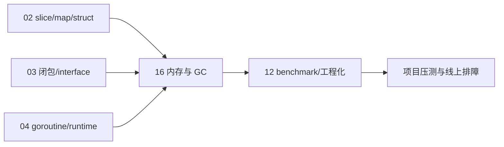
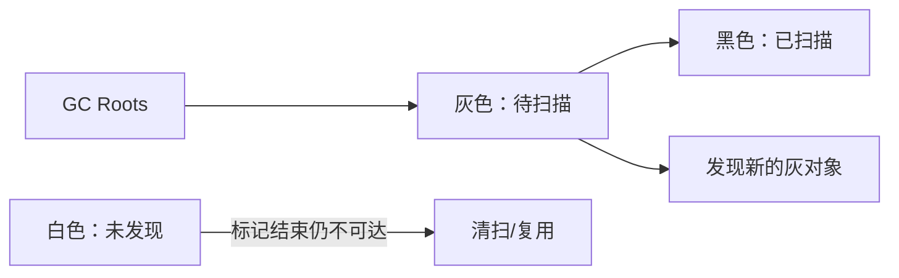

# Go 运行时、内存、GC 与性能分析

> **文件编码**：UTF-8。  
> **定位**：补齐 Go 后端面试与生产排障中最容易“只会背名词”的部分：栈/堆、逃逸分析、内存分配、GC、内存保留、benchmark、pprof 与 trace。  
> **本机基线**：Go 1.26.5；本章讲解以稳定语义为主，runtime 私有结构可能随版本变化。  
> **项目要求**：短链项目中的 QPS、P95/P99、缓存收益与“优化百分比”只能来自本章定义的可复现实验，不能使用教程示例数字。
> **前置**：[02 复合类型](./02-Go基础语法与复合类型.md)、[03 函数接口](./03-Go函数接口与错误处理.md)、[04 并发](./04-Go并发编程goroutine与channel.md)、[12 工程化](./12-单元测试日志与配置工程化.md)。

---

## 0. 读前导读

### 0.1 一句话理解本章

Go 的内存优化不是“看到指针就怕堆、看到 GC 就调参数”，而是先理解**对象为什么存活、谁在引用它、分配发生在哪里**，再用 benchmark 和 profile 找证据。

### 0.2 生活类比

| 概念 | 类比 |
|------|------|
| goroutine 栈 | 每个员工随身的小工作台，可按需扩展 |
| 堆 | 全公司共享仓库，生命周期不容易由单个函数判断 |
| 逃逸分析 | 编译器判断物品离开工位后是否还会被使用 |
| GC | 定期清点仓库，把再也找不到主人的物品回收 |
| pprof | 仓库监控：谁占空间、谁耗 CPU、谁在等待 |
| benchmark | 在相同条件下反复计时，而不是凭感觉说更快 |

### 0.3 知识地图

- [ ] 解释 Go 为什么允许返回局部变量地址
- [ ] 会用 `-gcflags=-m=2` 查看逃逸原因
- [ ] 区分“分配次数多”和“存活对象多”
- [ ] 口述并发三色标记、写屏障和短暂停顿的关系
- [ ] 解释 `GOGC` 与 `GOMEMLIMIT` 分别控制什么
- [ ] 会读 CPU、heap、allocs、goroutine、mutex/block profile
- [ ] 会写 `-benchmem` benchmark，并避免常见测量错误
- [ ] 能按“测量 → 假设 → 修改 → 对比 → 回归”完成一次优化
- [ ] 能为短链热/冷缓存、依赖故障和长稳负载生成可复现报告

### 0.4 建议时长

| 阶段 | 内容 | 时间 |
|------|------|------|
| 第一遍 | §1～§5，建立运行时心智模型 | 3 h |
| 动手 | 逃逸分析 + benchmark + pprof | 3 h |
| 面试复述 | FAQ + 闭卷自测 | 1.5 h |

### 0.5 学完可验证成果

1. 对一个小程序执行 `go build -gcflags="all=-m=2" .`，指出至少 3 个逃逸位置及原因。
2. 写一个 benchmark，对比“每次新建 buffer”和“复用 buffer”的 `ns/op`、`B/op`、`allocs/op`。
3. 采集 30 秒 CPU profile，用 `top` 和火焰图定位热点函数。
4. 采集 heap profile，区分 `inuse_space` 与 `alloc_space`。
5. 用 3 分钟讲清：Go GC 为什么需要写屏障，为什么仍有短暂 STW。

---

## 本章与前后章节的关系



- 02 章说明“值长什么样”，本章解释这些值如何分配和存活。
- 03 章的闭包、interface、reflect 可能影响逃逸和分配。
- 04 章的 goroutine、调度与同步决定 CPU、阻塞和 goroutine profile。
- 12 章负责测试与工程化，本章补齐性能测量工具。

---

## 1. 栈与堆：不要用 C/C++ 的手工生命周期套 Go

### 1.1 goroutine 栈

每个 goroutine 有自己的栈，用于保存函数参数、局部变量、返回地址等。栈初始较小，并可按需要增长；具体初始大小和增长策略属于 runtime 实现细节。

栈上分配通常很快：调整栈指针即可；函数返回后整段空间自然复用，不需要单独回收每个对象。

### 1.2 堆

当编译器无法证明一个值只在当前调用范围内使用，或对象不适合放在栈上时，会让它分配到堆。堆对象由 GC 根据可达性回收。

```go
func NewUser() *User {
	u := User{Name: "alice"}
	return &u
}
```

Go 允许安全返回局部变量地址，因为编译器和 runtime 会保证该对象在仍被引用时继续存活。不要说“局部变量一定在栈上”；**放栈还是放堆由编译器决定**。

### 1.3 堆分配不是 bug

错误目标：“让所有对象都不逃逸。”

正确目标：减少热点路径中**没有业务价值的分配**，同时保持代码清晰和正确。数据库查询结果、缓存对象、返回给调用方的长期对象本来就可能需要堆生命周期。

优化前先问：

1. 该函数是否真的在热点路径？
2. 分配是否造成明显 GC/延迟压力？
3. 改写后是否可读、可测试、收益稳定？

---

## 2. 逃逸分析

### 2.1 编译器在判断什么

逃逸分析判断一个变量的引用是否可能超出当前栈帧安全存活范围。常见触发因素包括：

- 返回局部变量指针或把它存入更长生命周期对象
- 闭包捕获外部变量
- 值通过 interface、reflect 或未知调用路径传递，编译器难以证明生命周期
- 对象过大，不适合放入当前栈
- goroutine 异步使用当前函数中的变量

这些只是常见现象，不是永远不变的硬规则。内联、编译器版本和调用上下文都可能改变结果。

### 2.2 查看编译器结论

```powershell
go build -gcflags="all=-m=2" .
```

输出常见关键词：

| 输出 | 含义 |
|------|------|
| `can inline` | 函数可能被内联到调用方 |
| `moved to heap` | 变量被放到堆 |
| `escapes to heap` | 某个值沿数据流逃逸 |
| `does not escape` | 编译器证明该参数不会逃逸 |
| `leaking param` | 参数引用流向返回值或更长生命周期位置 |

输出会很多，可先聚焦自己包的文件路径，不要逐行优化标准库。

### 2.3 动手例子

```go
package main

import "fmt"

type User struct {
	Name string
}

func value() User {
	return User{Name: "value"}
}

func pointer() *User {
	u := User{Name: "pointer"}
	return &u
}

func closure() func() string {
	name := "closure"
	return func() string { return name }
}

func main() {
	fmt.Println(value(), pointer(), closure()())
}
```

执行分析后，不要只数 `moved to heap`。继续写 benchmark，观察这些分配在真实调用中是否存在、占比多大；内联可能让某些看似逃逸的代码在最终调用点不逃逸。

### 2.4 常见误区

- `new(T)` 不代表一定在堆，`var t T` 也不代表一定在栈。
- 返回指针不必然更快；它减少大对象拷贝，但可能增加间接访问、堆分配和 GC 成本。
- 把值改成全局变量会让生命周期更长，通常不是优化。
- 为避免一次小分配引入复杂对象池，可能得不偿失。

---

## 3. 内存分配器的高层结构

> 本节用于解释 profile 现象，不要求背 runtime 源码字段；实现可能随版本调整。

Go 会把内存按不同大小等级管理。可以用三层缓存理解：

| 层次 | 作用 |
|------|------|
| 每 P 的本地缓存（常称 mcache） | 小对象分配尽量走本地路径，降低锁竞争 |
| 中央空闲列表（常称 mcentral） | 给各 P 补充某一 size class 的 span |
| 全局页堆（常称 mheap） | 管理更大范围的页和 span，必要时向 OS 申请内存 |

### 3.1 size class 与内部碎片

小对象通常按 size class 分配。例如请求 33 字节，实际占用的槽位可能大于 33 字节。对象越多，字段布局和对象大小对内存的影响越明显。

这解释了为什么：

- `unsafe.Sizeof` 只告诉你值本身大小，不等于进程实际新增内存。
- 大量相近小对象可能比“字段大小相加”占用更多。
- profile 中应看实际 `B/op` 和 heap，而不是只做纸面计算。

### 3.2 已回收不等于 RSS 立刻下降

GC 确认对象不可达后，内存可以被 runtime 复用；runtime 何时把空闲页归还 OS 是另一件事。因此：

- heap 中存活对象下降，进程 RSS 不一定同步下降。
- 判断泄漏不能只看任务管理器的一次 RSS 快照。
- 应结合 `/memory/classes/*` 指标、heap profile 和一段时间趋势分析。

---

## 4. Go GC：并发标记清扫

### 4.1 可达性，而不是“引用计数”

GC 从根对象出发遍历指针图。根包括 goroutine 栈、全局变量和 runtime 持有的引用等。能从根到达的对象继续存活，无法到达的对象可被回收。

### 4.2 三色标记

| 颜色 | 含义 |
|------|------|
| 白色 | 尚未确认可达；标记结束仍白色则可回收 |
| 灰色 | 已发现，但它引用的对象还没全部扫描 |
| 黑色 | 自己和直接引用已经扫描完成 |

概念流程：根先变灰；不断取灰对象扫描其引用，把新发现对象变灰，当前对象变黑；灰对象为空时标记完成。



### 4.3 为什么需要写屏障

应用 goroutine 与 GC 大部分标记工作并发执行。标记期间，业务代码仍会修改指针；如果黑对象突然指向一个尚未标记的白对象，而 GC 不知道这次变化，就可能误回收仍在使用的对象。

写屏障在关键指针写入时协助 GC 维护标记不变量。代价是标记阶段部分写操作会多一点开销，但换来更短的全局停顿。

### 4.4 为什么仍有 STW

Go GC 不是完全无停顿。开始标记、结束标记等阶段仍需要短暂 Stop-The-World 来切换状态、扫描必要根或完成一致性工作。目标是把大部分工作并发化并控制停顿，而不是宣称“零 STW”。

### 4.5 清扫与内存归还

标记结束后，不可达对象占用的空间进入清扫和复用流程。后台 scavenger 还会在合适时机把部分空闲物理页归还 OS。对象回收、runtime 可复用、OS RSS 下降是三个不同层次。

---

## 5. `GOGC` 与 `GOMEMLIMIT`

### 5.1 GOGC：用 CPU 换内存

`GOGC` 控制相对上次存活堆规模的下一次 GC 目标。默认通常为 100；值更小会更频繁 GC、通常省内存但多耗 CPU；值更大则相反。runtime 还会考虑栈、全局根等因素，不能简单理解成严格“堆翻倍就 GC”。

```powershell
$env:GOGC = "50"
go run .
```

代码中可用：

```go
old := debug.SetGCPercent(100)
_ = old
```

### 5.2 GOMEMLIMIT：软内存上限

Go 1.19+ 提供 `GOMEMLIMIT`，用于给 runtime 管理的内存设置软上限：

```powershell
$env:GOMEMLIMIT = "512MiB"
go run .
```

代码中可用 `debug.SetMemoryLimit`。它不是操作系统级硬限制，也不完整包含 cgo、mmap 文件和其他进程外部内存。容器内通常应让 `GOMEMLIMIT` 低于容器 memory limit，给非 Go 堆、线程栈、内核缓冲和峰值留余量。

### 5.3 两者如何配合

- 平时由 GOGC 决定合适的 GC 节奏。
- 接近 GOMEMLIMIT 时，runtime 会更积极回收以尽量守住软限制。
- limit 设得过低且程序工作集本来就大，会出现 GC 频繁但内存降不下来的 thrashing，吞吐和延迟都会恶化。

调参前先用 heap profile 判断是“真实存活对象太多”还是“短命分配过多”。参数不能修复仍被全局 map、goroutine 或缓存引用的对象。

---

## 6. 常见内存保留与泄漏形态

Go 有 GC，但仍会发生“业务已经不用，程序却仍可达”的逻辑泄漏。

### 6.1 小 slice / substring 持有大对象

```go
func keepPrefix(data []byte) []byte {
	return bytes.Clone(data[:1024])
}

func keepName(line string) string {
	name := line[:16]
	return strings.Clone(name)
}
```

是否需要 clone 要看原对象大小和新值存活时间；短生命周期场景盲目 clone 反而多一次分配。

### 6.2 无上限 map/cache

只添加不淘汰的全局 map 是最常见泄漏之一。缓存必须考虑：容量上限、TTL、淘汰策略、监控，以及 key 是否由用户无限制造。

### 6.3 goroutine 泄漏

被 channel、锁、网络读或永不结束的重试阻塞的 goroutine，会连带保留它栈上引用的对象。观察：

```powershell
go tool pprof http://localhost:6060/debug/pprof/goroutine
```

重点看相同调用栈数量是否随请求持续增长。

### 6.4 timer、ticker 与取消函数

高频创建 timer 会产生分配和调度成本；长期 ticker 应在不用时 `Stop`。派生 context 后调用 cancel，可尽早解除父子引用和释放 timer 资源。

### 6.5 `sync.Pool` 不是业务缓存

`sync.Pool` 适合跨请求复用临时对象以降低分配；GC 可以随时清空池内对象，因此不能依赖它保存连接、用户会话或必须存在的数据。

放回池前应重置对象，避免把上个请求的敏感数据带到下个请求：

```go
var buffers = sync.Pool{
	New: func() any { return new(bytes.Buffer) },
}

b := buffers.Get().(*bytes.Buffer)
b.Reset()
defer func() {
	b.Reset()
	buffers.Put(b)
}()
```

---

## 7. Benchmark：先把测量写对

### 7.1 最小基准测试

```go
func BenchmarkEncode(b *testing.B) {
	input := []byte("hello go backend")
	b.ReportAllocs()
	b.ResetTimer()

	for i := 0; i < b.N; i++ {
		_ = base64.StdEncoding.EncodeToString(input)
	}
}
```

运行：

```powershell
go test -run=^$ -bench=BenchmarkEncode -benchmem -count=5 ./...
```

| 指标 | 含义 |
|------|------|
| `ns/op` | 每次操作平均耗时 |
| `B/op` | 每次操作平均分配字节 |
| `allocs/op` | 每次操作平均分配次数 |

### 7.2 避免编译器把工作优化掉

```go
var sink string

func BenchmarkBuild(b *testing.B) {
	for i := 0; i < b.N; i++ {
		sink = buildValue()
	}
}
```

如果结果完全未使用，编译器可能消除部分计算。也不要把测试数据准备、日志、磁盘 IO 意外算进目标函数耗时；必要时使用 `b.StopTimer/StartTimer`。

### 7.3 比较而不是看单次数字

保存修改前后结果，再用统计工具比较。至少 `-count=5`，关闭明显后台负载，并在同一机器、同一 Go 版本上运行。微基准的提升不保证真实 HTTP 服务吞吐等比例提升，最终仍要做场景压测。

---

## 8. pprof：不同 profile 回答不同问题

### 8.1 各 profile 的问题意识

| profile | 主要回答 |
|---------|----------|
| CPU | CPU 时间主要花在哪些调用栈 |
| heap / `inuse_space` | 当前仍存活的堆内存由谁持有 |
| allocs / `alloc_space` | 历史累计分配压力来自哪里 |
| goroutine | goroutine 都阻塞/运行在哪些调用栈 |
| mutex | 因锁竞争损失的时间集中在哪里 |
| block | channel、锁等阻塞等待集中在哪里 |

### 8.2 在 HTTP 服务中开启

```go
import (
	"log"
	"net/http"
	_ "net/http/pprof"
)

func startDebugServer() {
	go func() {
		// 只监听本机或内部管理网络，不要直接暴露公网。
		if err := http.ListenAndServe("127.0.0.1:6060", nil); err != nil {
			log.Printf("pprof server: %v", err)
		}
	}()
}
```

Mutex 和 block profile 默认采样可能未开启，可在诊断期间设置：

```go
runtime.SetMutexProfileFraction(5) // 约每 5 次竞争事件采样一次；返回旧值
runtime.SetBlockProfileRate(1)     // 记录阻塞事件；诊断后可设回 0
```

更高采样率会增加观测开销，生产中应短时间开启并评估影响。

生产中建议把 debug server 与业务端口分离，并通过网络策略、鉴权或临时端口转发保护。pprof 可能暴露路径、参数片段和运行状态。

### 8.3 采集与查看

```powershell
# 采集 30 秒 CPU
go tool pprof -seconds=30 http://127.0.0.1:6060/debug/pprof/profile

# 当前存活堆
go tool pprof http://127.0.0.1:6060/debug/pprof/heap

# goroutine 阻塞栈
go tool pprof http://127.0.0.1:6060/debug/pprof/goroutine
```

进入交互界面后常用：

```text
top
top -cum
list FunctionName
web
```

- `flat`：函数自身消耗，不含子调用。
- `cum`：函数加上它调用的下游累计消耗。
- CPU 热点先看 flat 和调用路径；入口函数 flat 低但 cum 高很正常。

### 8.4 heap 的 inuse 与 allocs

- `inuse_space` 高：当前仍有大量存活对象，重点查缓存、全局引用、goroutine、长生命周期切片。
- `alloc_space` 高但 inuse 不高：对象短命、分配频繁，重点查热点路径临时对象和编码转换。

不要只看“哪一行 new 了对象”，还要沿 `top -cum` 和调用图判断为什么它被频繁调用、为什么对象仍存活。

---

## 9. runtime trace：时间线上发生了什么

pprof 聚合“总共花在哪里”，trace 更擅长回答“某一段时间调度、网络、GC、goroutine 阻塞如何交错”。

测试生成 trace：

```powershell
go test -run TestScenario -trace trace.out ./...
go tool trace trace.out
```

适合排查：

- goroutine 长时间不可运行或频繁切换
- GC 与延迟尖峰是否同一时间发生
- 网络轮询、系统调用、调度延迟
- 并发 pipeline 哪个阶段形成背压

trace 数据量大且有观测开销，应短时间、针对性采集。

---

## 10. 一次正确的性能优化流程


短链项目示例：

1. 指标：跳转接口 P99、QPS、`allocs/op`、Redis 命中率。
2. 基线：固定数据集、并发数、机器、Go 版本，运行 3～5 轮。
3. profile：CPU 显示 JSON 日志编码占比高，allocs 显示每请求重复创建 buffer。
4. 假设：减少重复编码或安全复用 buffer 能降低分配和 P99。
5. 修改：只改日志编码路径。
6. 对比：确认吞吐/延迟改善，并运行 `go test -race ./...`。
7. 记录：README 写环境、命令、原始数据，不能只写“性能提升 300%”。

### 10.1 短链项目的压测矩阵

只压一个热短码并得到高 QPS，不足以证明系统整体可靠。至少覆盖下面场景：

| 场景 | 数据准备 | 主要观察 |
|------|----------|----------|
| 热缓存跳转 | 预先把固定 code 写入 Redis | 纯跳转热路径 QPS、P95/P99、CPU |
| 冷缓存回源 | 压测前清理目标 key，或使用足够大的随机 code 数据集 | DB QPS、回填耗时、`singleflight` 是否生效 |
| 不存在短码 | 请求随机无效 code | 负缓存/布隆命中、404 延迟、DB 是否被打穿 |
| Redis 故障 | 停 Redis 或阻断连接 | 回源 MySQL、错误率、恢复时间、是否出现请求堆积 |
| 统计通道拥塞 | 降低消费者速度或限制队列容量 | Redirect 是否被拖慢、丢弃/降级计数、队列积压 |
| 长稳负载 | 固定负载运行 10～30 分钟 | RSS、goroutine、连接池、GC 与错误率趋势 |

压测固定并记录：

```text
CPU/内存/操作系统、Go 版本、构建参数
MySQL/Redis 版本与容器资源限制
数据集大小、热 key 比例、连接数、线程数、持续时间
是否开启日志/限流/统计、是否预热、是否跟随 302
每轮原始命令和至少 3 次结果
```

### 10.2 短链性能报告模板

```markdown
## 实验：Redis 缓存对 Redirect 的影响

- 环境：CPU / 内存 / Go / MySQL / Redis
- 版本：Git commit
- 数据：100 万映射，20% 热点；并发 20/50/100
- 命令：见 bench/redirect_hot.ps1 或 bench/redirect_hot.sh

| 版本/场景 | QPS | P50 | P95 | P99 | Error | CPU | RSS | Cache Hit |
|-----------|-----|-----|-----|-----|-------|-----|-----|-----------|
| 基线      | 实测 | 实测 | 实测 | 实测 | 实测 | 实测 | 实测 | 实测 |
| 优化后    | 实测 | 实测 | 实测 | 实测 | 实测 | 实测 | 实测 | 实测 |

- profile 证据：文件路径或截图
- 假设：为什么认为该热点值得改
- 改动：只描述本轮主要变量
- 结论：收益、代价、是否保留
```

**口径规则**：

1. 冷缓存不能只在第一次请求时算“冷”，随后所有请求已经变热；应显式清理 key 或使用足够大的随机数据集。
2. 若压测时关闭限流、日志或统计，报告必须写明；不能把精简模式数字冒充完整生产配置。
3. 比较前后只能改一个主要变量，并保持数据、容器资源和压测参数一致。
4. `wrk` 默认测到短链服务返回 302 的性能；若客户端跟随跳转，目标网站延迟会污染结果。
5. 除 QPS 外必须报告错误率和尾延迟；吞吐提高但 P99/错误率恶化不一定是优化。

### 10.3 从 profile 到简历证据

一次合格的项目优化记录至少包含：

```text
症状：P99 抖动 / CPU 高 / RSS 持续增长 / goroutine 增长
证据：对应 pprof/trace/指标
根因：具体调用路径或未退出 goroutine，而不是“Go GC 不行”
修复：有边界的改动
验证：单测 + -race + 同条件压测
代价：内存、复杂度、一致性或可观测性的变化
```

面试时只讲这类完成闭环的优化；“加了 Redis 所以性能高”不算性能分析。

---

## 11. 常见报错与排查

| 现象 | 常见原因 | 下一步 |
|------|----------|--------|
| RSS 一直涨 | 缓存无上限、goroutine 泄漏、runtime 尚未归还 OS | heap + goroutine profile，观察趋势 |
| GC 次数很多 | 短命分配高、GOGC/limit 太低 | allocs profile + `-benchmem` |
| GC 后 heap 仍高 | 对象仍可达 | 看 `inuse_space` 调用图和全局引用 |
| CPU profile 几乎空 | 采样时没有真实负载 | 压测期间采集 20～30 秒 |
| profile 看不到锁竞争 | 未启用对应采样或竞争很低 | 设置 mutex/block profile rate 后复现 |
| benchmark 波动大 | 后台负载、样本少、包含 IO | `-count=5`，隔离环境，拆微基准 |
| 优化后更快但结果错误 | 消除了必要工作或出现竞态 | 校验输出、单测、`-race` |
| 设置 GOMEMLIMIT 后 CPU 飙升 | limit 低于实际工作集 | profile 存活堆，增加余量或降低工作集 |
| `go tool pprof` 连不上 | debug server 未启或仅容器内监听 | 查端口、网络、监听地址 |
| goroutine profile 相同栈持续增长 | 某退出路径缺取消/关闭 | 查 channel、ctx、网络超时 |

---

## 12. FAQ

### Q1：返回局部变量指针安全吗？

安全。编译器保证对象生命周期；是否堆分配看逃逸分析，不由“局部变量”四个字决定。

### Q2：堆一定比栈慢吗？

堆分配和后续 GC 通常成本更高，但一次堆分配未必是瓶颈。先测热点和分配规模。

### Q3：GC 会不会扫描所有内存？

GC 从根追踪可达对象，并利用分配器元数据区分含指针对象等；不要简单理解为每次逐字节扫描整个进程地址空间。

### Q4：Go GC 是引用计数吗？

不是。它基于可达性标记与清扫，因此可以回收不可达的循环引用。

### Q5：调低 GOGC 就一定省内存吗？

通常会让 GC 更频繁并降低堆目标，但若大量对象仍存活，收益有限且 CPU 成本可能明显上升。

### Q6：GOMEMLIMIT 能代替容器 memory limit 吗？

不能。它是 runtime 的软目标；容器限制是 OS/cgroup 的硬边界，两者应配合并留余量。

### Q7：为什么 heap profile 和任务管理器数字不同？

heap profile关注 Go 堆对象；RSS 还包含栈、runtime 元数据、映射、共享库、尚未归还 OS 的页等。

### Q8：什么时候用 sync.Pool？

profile 证明临时对象分配是热点，且对象可安全重置复用时。不要把它当可靠缓存。

### Q9：CPU profile 的 flat 和 cum 怎么看？

flat 看函数自身，cum 看包含下游的累计路径。入口函数常 cum 高、flat 低。

### Q10：allocs 高但 heap 不高是泄漏吗？

不一定。更可能是大量短命对象；它们能回收，但会增加分配和 GC 压力。

### Q11：是否应该手工调用 `runtime.GC()`？

常规服务不应该。它会强制一轮 GC，可能制造延迟尖峰；只在明确的批处理阶段或实验中评估。

### Q12：性能优化优先看什么？

先看用户指标和真实热点：延迟、吞吐、错误率、CPU、内存。不要从改语法或套对象池开始。

---

## 13. 闭卷自测

1. 为什么 Go 可以返回局部变量地址？
2. `new(T)` 是否意味着一定在堆？
3. 如何查看逃逸分析？
4. 闭包为什么可能让变量逃逸？
5. 三色标记中灰色表示什么？
6. 并发标记为什么需要写屏障？
7. Go GC 是否完全没有 STW？
8. `GOGC` 与 `GOMEMLIMIT` 的职责区别？
9. heap 的 `inuse_space` 与 `alloc_space` 分别回答什么？
10. goroutine profile 数量持续上涨通常先查什么？
11. benchmark 为什么要防止结果被编译器消除？
12. 一次完整性能优化流程的五个关键动作是什么？

<details>
<summary>参考答案</summary>

1. 编译器/runtime 保证仍被引用对象的生命周期，必要时分配到堆。
2. 不一定，最终位置由逃逸分析和编译优化决定。
3. `go build -gcflags="all=-m=2" .`。
4. 外层函数返回后闭包仍可能使用被捕获变量。
5. 已确认可达，但它的引用还没扫描完。
6. 业务并发修改指针图，屏障帮助维护标记正确性，避免漏标活对象。
7. 不是；开始/结束标记等仍有短暂 STW。
8. GOGC 控制相对增长和 GC 节奏；GOMEMLIMIT 给 runtime 内存软上限。
9. 当前存活内存；历史累计分配压力。
10. 相同阻塞栈、channel 收发、ctx 取消、网络超时和锁等待。
11. 否则测到的可能不是完整目标工作，结果虚假偏快。
12. 定义指标、建立基线、profile、提出假设并修改、对比验证与回归。

</details>

---

## 14. 分级练习

### L1 基础

1. 写 `returnValue()`、`returnPointer()`、闭包三个函数，执行逃逸分析并记录结果。
2. 为字符串拼接写 `+`、`strings.Builder` 两种 benchmark，比较 `B/op`。
3. 开启 pprof，在无负载和有负载时分别采集 CPU profile，观察区别。

### L2 进阶

4. 制造小 slice 持有 100MB 数组的问题，用 heap profile 验证，再用 clone 修复。
5. 写一个不退出的 goroutine 泄漏 demo，每秒创建 10 个，使用 goroutine profile 定位。
6. 给短链 Base62 编码写 `-benchmem` 基准，尝试减少一次不必要分配。

### L3 项目

7. 对短链跳转接口压测并采集 CPU/heap/goroutine profile。
8. 在 README 记录机器、Go 版本、数据量、并发数、命令和原始结果。
9. 只基于 profile 选择一个热点优化，完成前后对比和正确性回归。
10. 完成热缓存、冷缓存、无效短码、Redis 故障、统计拥塞五组测试，并保存脚本与原始报告。

---

## 15. 学完标准

- [ ] 不看资料讲清栈、堆与逃逸分析的关系
- [ ] 能解释三色标记、写屏障、STW，而不是只背名词
- [ ] 会选择正确的 pprof 类型回答 CPU、存活堆、分配、阻塞问题
- [ ] 独立完成一次 benchmark + profile + 优化对比
- [ ] 项目压测包含环境、数据、P95/P99、错误率和至少三轮原始结果
- [ ] 能说明 Redis/统计通道故障时性能与正确性如何变化
- [ ] 知道 runtime 实现细节与语言保证的边界
- [ ] 闭卷自测 ≥ 10/12

---

## 16. 章节衔接

| 前置 | 本章 | 应用 |
|------|------|------|
| [02 slice/map/struct](./02-Go基础语法与复合类型.md) | 内存布局与保留 | 短链缓存/批量查询 |
| [03 闭包/interface](./03-Go函数接口与错误处理.md) | 逃逸与反射成本 | Gin/GORM/JSON |
| [04 goroutine](./04-Go并发编程goroutine与channel.md) | goroutine/阻塞 profile | 泄漏与延迟排障 |
| [12 工程化](./12-单元测试日志与配置工程化.md) | benchmark/pprof/trace | 压测与简历数据 |

**下一步**：给短链项目建立可复现压测基线，再采集 profile；没有 profile 证据时，不做“为了优化而优化”。

---

*文档版本：v1.0 · 2026-07-10 · 路径：`F:\study\后端学习\Go\16-Go运行时内存GC与性能分析.md`*
