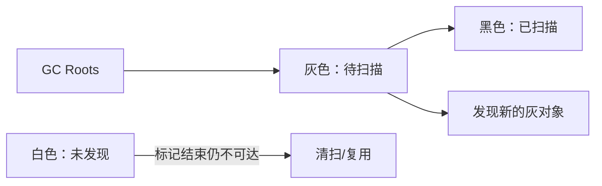

# Go 运行时、内存、GC 与性能分析

<!-- 修改说明：2026-07-27 去水化精简：删除知识地图、建议时长、学完可验证成果、本章与前后章节关系图、FAQ、闭卷自测、学完标准、章节衔接等模板板块；FAQ 中正文没有的 7 个技术要点（GC 非引用计数可回收循环引用、GC 不逐字节扫描地址空间、RSS 的组成、调低 GOGC 不一定省内存、sync.Pool 使用前提、runtime.GC() 会制造延迟尖峰、allocs 高但 inuse 不高属短命分配而非泄漏）已并入对应正文小节（§4.1、§3.2、§5.1、§6.5、§4.6、§8.4）；正文讲解与全部代码清单未改动；小节编号重排（原 §0.6→§0.3，原 §14 分级练习→§12）并修正全部内部交叉引用；文件头修订说明中指向已删自测板块的表述已同步清理。 -->

> **文件编码**：UTF-8。  
> **定位**：补齐 Go 后端面试与生产排障中最容易“只会背名词”的部分：栈/堆、逃逸分析、内存分配、GC、内存保留、benchmark、pprof 与 trace。  
> **本机基线**：Go 1.26.5；本章讲解以稳定语义为主，runtime 私有结构可能随版本变化。  
> **修订说明**：2026-07-26 v1.1 按审查报告修订：修复多包 trace 采集命令、benchmark 升级为 Go 1.24+ 的 `b.Loop` 写法、补齐火焰图入口 `-http`；新增栈扩容、字段对齐、GC 触发时机、标记辅助、混合写屏障、gctrace、runtime/metrics、benchstat、goleak、PGO 等小节。2026-07-26 v1.2 复核补遗：新增 §6.7 weak 指针与 `runtime.AddCleanup` 拓展（本机 Go 1.26.5 实测），逃逸分析命令与 §2.2 的由浅入深口径统一，文末版本号同步。所有完整清单均在本机 Go 1.26.5 实测编译运行通过。  
> **项目要求**：短链项目中的 QPS、P95/P99、缓存收益与“优化百分比”只能来自本章定义的可复现实验，不能使用教程示例数字。
> **前置**：[02 复合类型](./02-Go基础语法与复合类型.md)、[03 函数接口](./03-Go函数接口与错误处理.md)、[04 并发](./04-Go并发编程goroutine与channel.md)、[12 工程化](./12-单元测试日志与配置工程化.md)。

---

## 0. 读前导读

### 0.1 一句话理解本章

Go 的内存优化不是“看到指针就怕堆、看到 GC 就调参数”，而是先理解**对象为什么存活、谁在引用它、分配发生在哪里**，再用 benchmark 和 profile 找证据。

### 0.2 生活类比

| 概念 | 类比 |
|------|------|
| goroutine 栈 | 每个员工随身的小工作台，可按需扩展 |
| 堆 | 全公司共享仓库，生命周期不容易由单个函数判断 |
| 逃逸分析 | 编译器判断物品离开工位后是否还会被使用 |
| GC | 定期清点仓库，把再也找不到主人的物品回收 |
| pprof | 仓库监控：谁占空间、谁耗 CPU、谁在等待 |
| benchmark | 在相同条件下反复计时，而不是凭感觉说更快 |

### 0.3 动手环境：本章实验模块（先做这一步）

本章所有「完整清单」都放在同一个实验模块里，先把它建好（PowerShell）：

```powershell
mkdir F:\code\go-runtime-lab
cd F:\code\go-runtime-lab
go mod init runtimelab
```

之后每个清单会标注**文件路径**（相对这个模块根目录）和**运行命令**。例如文件路径写 `escape/main.go`，指的就是 `F:\code\go-runtime-lab\escape\main.go`；每个子目录是一个独立的 `main` 包（或测试包），互不干扰。标注「片段」的代码块则不能单独编译，它属于某个完整清单文件或你的项目代码，归属会写在旁边。

用到第三方工具的小节（§3.3 fieldalignment、§6.6 goleak、§7.4 benchstat）都会给出确切的安装命令；如果拉取超时，先给**当前会话**设置国内代理（只影响本窗口，不改全局配置）：

```powershell
$env:GOPROXY = "https://goproxy.cn,direct"
```

> **PowerShell 5.1 大坑预警（本机实测）**：值里带点号、且不加引号的 `-flag=value.ext` 形式参数，PowerShell 会把它从点号处拆成两个参数再传给 go。例如 `go test -trace=trace.out ./tracelab` 会莫名报 `cannot use -trace flag with multiple packages`，看起来像包路径写错了，其实是 `-trace=trace.out` 被拆成了 `-trace=trace` 和 `.out`。**解决办法：给整个 flag 加引号**，写成 `'-trace=trace.out'`。本章命令凡是 flag 值里带点号的都已按此加引号；你自己写命令时也要记住这条。

---

## 1. 栈与堆：不要用 C/C++ 的手工生命周期套 Go

### 1.1 goroutine 栈

每个 goroutine 有自己的栈，用于保存函数参数、局部变量、返回地址等。栈初始较小，并可按需要增长；具体初始大小和增长策略属于 runtime 实现细节。

栈上分配通常很快：调整栈指针即可；函数返回后整段空间自然复用，不需要单独回收每个对象。

### 1.2 堆

当编译器无法证明一个值只在当前调用范围内使用，或对象不适合放在栈上时，会让它分配到堆。堆对象由 GC 根据可达性回收。

```go
func NewUser() *User {
	u := User{Name: "alice"}
	return &u
}
```

Go 允许安全返回局部变量地址，因为编译器和 runtime 会保证该对象在仍被引用时继续存活。不要说“局部变量一定在栈上”；**放栈还是放堆由编译器决定**。

### 1.3 堆分配不是 bug

错误目标：“让所有对象都不逃逸。”

正确目标：减少热点路径中**没有业务价值的分配**，同时保持代码清晰和正确。数据库查询结果、缓存对象、返回给调用方的长期对象本来就可能需要堆生命周期。

优化前先问：

1. 该函数是否真的在热点路径？
2. 分配是否造成明显 GC/延迟压力？
3. 改写后是否可读、可测试、收益稳定？

### 1.4 goroutine 栈是怎么扩容的（面试高频）

> 新概念：**连续栈（contiguous stack）**——goroutine 的栈是一整块连续内存，不够用时整体换一块更大的，而不是在旧栈后面链一段新内存。

goroutine 栈初始只有几 KiB（当前实现约 2 KiB，Go 1.19 起还会按历史平均用量自适应初始大小；具体数字属于实现细节）。扩容流程可以概括为四步：

1. 编译器在多数函数入口插入一小段检查代码：剩余栈空间不够本函数使用，就调用 runtime 的 `morestack`。
2. runtime 分配一块更大的新栈（通常按倍数增长）。
3. 把旧栈内容整体拷贝到新栈。
4. **重写所有指向旧栈的指针**，让它们指向新栈中的对应位置，然后从中断处继续执行。

第 4 步是 C/C++ 做不到的：Go 编译器为每个栈帧记录了精确的指针位置信息（GC 扫描栈依赖的也是同一套信息），所以 runtime 能安全地给栈“搬家”。由此得到两个直接结论：

- 起几十万个 goroutine 是可行的：每个初始栈很小、按需增长，用不到就不占。
- 栈上变量的地址可能随扩容变化，但语言保证你感知不到——所有引用都会被同步重写；这也呼应 §1.1 说的“不要用 C/C++ 的手工生命周期思维套 Go”。

面试一句话收尾：“Go 用连续栈 + 函数入口的 morestack 检查 + 栈拷贝时精确重写指针来实现扩容，初始栈只有约 2 KiB，所以 goroutine 很便宜。”

---

## 2. 逃逸分析

### 2.1 编译器在判断什么

逃逸分析判断一个变量的引用是否可能超出当前栈帧安全存活范围。常见触发因素包括：

- 返回局部变量指针或把它存入更长生命周期对象
- 闭包捕获外部变量
- 值通过 interface、reflect 或未知调用路径传递，编译器难以证明生命周期
- 对象过大，不适合放入当前栈
- goroutine 异步使用当前函数中的变量

这些只是常见现象，不是永远不变的硬规则。内联、编译器版本和调用上下文都可能改变结果。

### 2.2 查看编译器结论：由浅入深三步走

第一步用最温和的 `-m`（单层结论，只分析你列出的包，最易读）：

```powershell
go build -gcflags=-m ./...
```

能看懂 `-m` 之后，再升级到 `-m=2`，它会额外打印逃逸的推导链路和内联决策：

```powershell
go build "-gcflags=-m=2" ./...
```

`all=` 前缀会把标准库和全部依赖也重新编译并打印分析，输出动辄上万行，只在需要追踪跨包数据流时才用：

```powershell
go build "-gcflags=all=-m=2" .
```

输出常见关键词：

| 输出 | 含义 |
|------|------|
| `can inline` | 函数可能被内联到调用方 |
| `moved to heap` | 变量被放到堆 |
| `escapes to heap` | 某个值沿数据流逃逸 |
| `does not escape` | 编译器证明该参数不会逃逸 |
| `leaking param` | 参数引用流向返回值或更长生命周期位置 |

输出会很多，可先聚焦自己包的文件路径，不要逐行优化标准库。

### 2.3 动手例子（完整清单）

**文件**：`escape/main.go` · **运行**：`go build -gcflags=-m ./escape`

```go
package main

import "fmt"

type User struct {
	Name string
}

func value() User {
	return User{Name: "value"}
}

func pointer() *User {
	u := User{Name: "pointer"}
	return &u
}

func closure() func() string {
	name := "closure"
	return func() string { return name }
}

func main() {
	fmt.Println(value(), pointer(), closure()())
}
```

本机（Go 1.26.5）输出节选与逐行解读：

```text
escape/main.go:13:6: can inline pointer          // pointer 函数本身可被内联
escape/main.go:14:2: moved to heap: u            // pointer 里的 u 放到堆：它的地址被返回了
escape/main.go:20:9: func literal escapes to heap // closure 返回的匿名函数对象逃逸
escape/main.go:24:43: "closure" escapes to heap  // 被闭包捕获的字符串跟着一起逃逸
escape/main.go:24:19: ~r0 escapes to heap        // value() 的返回值在调用点逃逸（见下第 2 条）
```

三个值得记住的现象：

1. `pointer()` 的 `u` 逃逸，对应 §2.1 第一条触发因素：返回了局部变量指针。
2. `value()` 按值返回、函数本身不逃逸，但**把返回值传给 `fmt.Println` 时**，值要装进 `any`（interface）参数，于是在调用点仍然逃逸了——逃逸分析看的是完整数据流，不只看函数定义。
3. 输出里大量 `can inline` / `inlining call to` 说明内联在起作用：**内联可能让某些看似逃逸的代码在最终调用点不逃逸**，所以结论要结合调用上下文看，不同 Go 版本结果也可能不同。

执行分析后，不要只数 `moved to heap`。继续写 benchmark（§7），观察这些分配在真实调用中是否存在、占比多大。

### 2.4 常见误区

- `new(T)` 不代表一定在堆，`var t T` 也不代表一定在栈。
- 返回指针不必然更快；它减少大对象拷贝，但可能增加间接访问、堆分配和 GC 成本。
- 把值改成全局变量会让生命周期更长，通常不是优化。
- 为避免一次小分配引入复杂对象池，可能得不偿失。

---

## 3. 内存分配器的高层结构

> 本节用于解释 profile 现象，不要求背 runtime 源码字段；实现可能随版本调整。

Go 会把内存按不同大小等级管理。可以用三层缓存理解：

| 层次 | 作用 |
|------|------|
| 每 P 的本地缓存（常称 mcache） | 小对象分配尽量走本地路径，降低锁竞争 |
| 中央空闲列表（常称 mcentral） | 给各 P 补充某一 size class 的 span |
| 全局页堆（常称 mheap） | 管理更大范围的页和 span，必要时向 OS 申请内存 |

### 3.1 size class 与内部碎片

小对象通常按 size class 分配。例如请求 33 字节，实际占用的槽位可能大于 33 字节。对象越多，字段布局和对象大小对内存的影响越明显。

这解释了为什么：

- `unsafe.Sizeof` 只告诉你值本身大小，不等于进程实际新增内存。
- 大量相近小对象可能比“字段大小相加”占用更多。
- profile 中应看实际 `B/op` 和 heap，而不是只做纸面计算。

### 3.2 已回收不等于 RSS 立刻下降

GC 确认对象不可达后，内存可以被 runtime 复用；runtime 何时把空闲页归还 OS 是另一件事。因此：

- heap 中存活对象下降，进程 RSS 不一定同步下降。
- 判断泄漏不能只看任务管理器的一次 RSS 快照。
- 应结合 `/memory/classes/*` 指标（用代码怎么读见 §5.4）、heap profile 和一段时间趋势分析。

heap profile 与任务管理器数字对不上也是同一原因：heap profile 只统计 Go 堆对象，而 RSS 还包含 goroutine 栈、runtime 元数据、内存映射、共享库以及尚未归还 OS 的空闲页——两者口径不同，数字不同是正常的。

### 3.3 struct 字段对齐：声明顺序影响大小

> 新概念：**对齐（alignment）**——CPU 按自然边界访问内存最快，编译器会在字段之间插入填充字节（padding），保证每个字段落在自己要求的对齐边界上（如 int64 要求 8 字节对齐）。

同样一组字段，声明顺序不同，struct 大小可以不同：

**文件**：`align/main.go` · **运行**：`go run ./align`

```go
package main

import (
	"fmt"
	"unsafe"
)

type Bad struct {
	a bool  // 1 字节，后补 7 字节 padding
	b int64 // 8 字节，必须 8 字节对齐
	c bool  // 1 字节，结尾再补 7 字节
}

type Good struct {
	b int64 // 8 字节
	a bool  // 1 字节
	c bool  // 1 字节，结尾补 6 字节
}

func main() {
	fmt.Println("Bad :", unsafe.Sizeof(Bad{}), "字节, 对齐", unsafe.Alignof(Bad{}))
	fmt.Println("Good:", unsafe.Sizeof(Good{}), "字节, 对齐", unsafe.Alignof(Good{}))
}
```

本机（amd64）输出：

```text
Bad : 24 字节, 对齐 8
Good: 16 字节, 对齐 8
```

`Bad` 的布局是 `a(1) + 填充(7) + b(8) + c(1) + 填充(7) = 24`；把 8 字节的 `b` 放最前后，两个 bool 挤在一起，只需 `8 + 1 + 1 + 填充(6) = 16`。单个对象省 8 字节不起眼，但如果这是切片里的一百万个元素，就是 8 MB 的差距——这正是 §3.1 说“字段布局影响内存”的落地版本。

不必手工排查，官方分析器可以代劳（安装命令见 §0.3 的代理设置）：

```powershell
go install golang.org/x/tools/go/analysis/passes/fieldalignment/cmd/fieldalignment@latest
fieldalignment ./align
```

本机输出：

```text
align\main.go:8:10: struct of size 24 could be 16
```

两条使用纪律：

1. 只对**数量巨大或处于热点路径**的 struct 做字段重排；普通业务结构体优先保持“按语义分组”的可读顺序。
2. 重排会打乱字段的逻辑分组，动手前先确认有 heap profile 或 benchmark 证据支撑。

---

## 4. Go GC：并发标记清扫

### 4.1 可达性，而不是“引用计数”

GC 从根对象出发遍历指针图。根包括 goroutine 栈、全局变量和 runtime 持有的引用等。能从根到达的对象继续存活，无法到达的对象可被回收。

两个常见误解要在这里澄清：

- **Go GC 不是引用计数**。它基于可达性做标记清扫，所以互相引用、但整体已从根不可达的循环引用照样能被回收——这是引用计数方案做不到的。
- **GC 不会逐字节扫描整个进程地址空间**。它只沿指针图追踪，并利用分配器的元数据区分对象是否含指针——不含指针的对象（比如 `[]byte` 的底层字节数组）本身不需要再向内扫描。

### 4.2 三色标记

| 颜色 | 含义 |
|------|------|
| 白色 | 尚未确认可达；标记结束仍白色则可回收 |
| 灰色 | 已发现，但它引用的对象还没全部扫描 |
| 黑色 | 自己和直接引用已经扫描完成 |

概念流程：根先变灰；不断取灰对象扫描其引用，把新发现对象变灰，当前对象变黑；灰对象为空时标记完成。


```mermaid
flowchart LR
    Root[GC Roots] --> Gray[灰色：待扫描]
    Gray --> Black[黑色：已扫描]
    Gray --> More[发现新的灰对象]
    White[白色：未发现] -->|标记结束仍不可达| Sweep[清扫/复用]
```

### 4.3 为什么需要写屏障

应用 goroutine 与 GC 大部分标记工作并发执行。标记期间，业务代码仍会修改指针；如果黑对象突然指向一个尚未标记的白对象，而 GC 不知道这次变化，就可能误回收仍在使用的对象。

写屏障在关键指针写入时协助 GC 维护标记不变量。代价是标记阶段部分写操作会多一点开销，但换来更短的全局停顿。

面试中常被追问屏障的“名字”，这里把术语补齐（理解思路即可，不必背实现细节）：

- **三色不变式**：并发标记的正确性条件。**强不变式**要求“黑对象绝不直接指向白对象”；**弱不变式**允许黑指白，但要求该白对象仍能从某个灰对象出发到达。两者都被破坏且 GC 不知情时，才会漏标活对象。
- **Dijkstra 插入屏障**：执行 `*slot = ptr` 时，把**新指向的对象** `ptr` 标灰——防止黑对象指向一个没人记录的白对象。
- **Yuasa 删除屏障**：覆盖 `*slot = ptr` 之前，把 **slot 原来指向的对象**标灰——防止一个对象的最后一条引用被“搬进”黑色区域后，原路径断掉导致漏标。
- **混合写屏障（Go 1.8+）**：同时吸收上面两种思路，并配合“标记期间新分配对象直接标黑、栈上指针写不加屏障”等策略，使标记结束后**不再需要 STW 重扫各 goroutine 栈**——这是 Go 把停顿压到亚毫秒级的关键一步。

一句话版本：“Go 1.8 起用混合写屏障（Dijkstra 插入 + Yuasa 删除），维持三色不变式、免去栈重扫，把 STW 缩到毫秒以下。”

### 4.4 为什么仍有 STW

Go GC 不是完全无停顿。开始标记、结束标记等阶段仍需要短暂 Stop-The-World 来切换状态、扫描必要根或完成一致性工作。目标是把大部分工作并发化并控制停顿，而不是宣称“零 STW”。

### 4.5 清扫与内存归还

标记结束后，不可达对象占用的空间进入清扫和复用流程。后台 scavenger 还会在合适时机把部分空闲物理页归还 OS。对象回收、runtime 可复用、OS RSS 下降是三个不同层次。

### 4.6 GC 什么时候触发（面试常问）

一轮 GC 可能由四种事件触发，按常见程度排序：

1. **堆增长达到 pacer 目标**：最主要的方式。每轮 GC 结束时，runtime 根据本轮存活堆和 `GOGC`（§5.1）算出下一次触发的目标堆大小；后续分配把堆推到目标附近，就开始新一轮。pacer（步调器）还会有意提前一点启动并发标记，避免“标记还没做完、堆已经超标”。
2. **两分钟兜底**：超过约 2 分钟没有发生过 GC 时，runtime 的后台监控线程（sysmon）会强制发起一轮，保证空闲服务也能及时清理垃圾、推进内存归还。
3. **手动 `runtime.GC()`**：阻塞到一轮完整 GC 结束。常规服务不要调用——强制发起的整轮 GC 可能制造延迟尖峰；只在明确的批处理边界或实验中使用——§6.1 的演示程序就是这么用的。
4. **接近 `GOMEMLIMIT`**（§5.2）：runtime 为守住软上限而提前、加频 GC。

### 4.7 标记辅助：为什么“GC 期间业务会变慢”

> 新概念：**标记辅助（mark assist）**——并发标记期间，正在分配内存的 goroutine 会被要求“顺手帮 GC 干一段标记工作”；分配越猛的 goroutine，被拉去帮忙越多。

并发标记有个天然矛盾：GC 一边标记，业务一边继续疯狂分配；如果分配速度超过标记速度，标记永远追不上。Go 的解法是让“制造垃圾的人参与打扫”：标记期间每个 goroutine 有分配预算，超出预算就必须先执行一段标记任务，才能继续分配。

这直接解释了两个线上现象：

- **GC 期间 P99 上升**：变慢的不只是 GC 后台线程，业务 goroutine 自己在还“分配债”。
- **分配越多的接口在 GC 期间越慢**：标记辅助按分配量摊派，热点分配路径受影响最大。

所以“减少热点路径的无谓分配”（§1.3）不仅省内存，还能减少 GC 期间被摊派的辅助标记时间——这就是 §11 表中“GC 次数多”与“延迟尖峰”之间的因果链。

### 4.8 亲眼看 GC：`GODEBUG=gctrace=1`

不装任何工具，一个环境变量就能让 runtime 把每轮 GC 的概况打印到 stderr。先写一个制造分配压力的小程序：

**文件**：`gctrace/main.go` · **运行**：见下方（先 build 再运行）

```go
package main

import (
	"fmt"
	"runtime"
)

func main() {
	total := 0
	for i := 0; i < 50; i++ {
		buf := make([]byte, 10<<20) // 每轮分配 10 MiB 短命对象
		total += len(buf)
	}
	var ms runtime.MemStats
	runtime.ReadMemStats(&ms)
	fmt.Printf("累计分配约 %d MiB，GC 运行了 %d 次\n", total>>20, ms.NumGC)
}
```

注意运行方式：**先编译成 exe，再设环境变量运行**。如果直接 `go run`，`GODEBUG` 会同时作用于编译器（它自己也是 Go 程序），输出会混进编译器自己的 GC 日志：

```powershell
go build -o gctrace_demo.exe ./gctrace
$env:GODEBUG = "gctrace=1"
.\gctrace_demo.exe
Remove-Item env:GODEBUG   # 用完立刻取消，避免影响后续命令
```

本机输出节选（Go 1.26.5，14 核）：

```text
gc 3 @0.003s 5%: 0+0.51+0 ms clock, 0+0.51/1.5/0+0 ms cpu, 30->30->0 MB, 30 MB goal, 0 MB stacks, 0 MB globals, 14 P
```

逐字段解读：

| 字段 | 含义 |
|------|------|
| `gc 3` | 程序启动以来第 3 轮 GC |
| `@0.003s` | 发生在启动后 0.003 秒 |
| `5%` | 启动以来 GC 占用的 CPU 比例 |
| `0+0.51+0 ms clock` | 三段墙钟耗时：**STW 标记开始 + 并发标记 + STW 标记结束**——首尾两段就是 §4.4 说的短暂停顿 |
| `0+0.51/1.5/0+0 ms cpu` | 对应各阶段的 CPU 耗时，其中中间三个数依次是标记辅助（§4.7）/后台标记/空闲标记 |
| `30->30->0 MB` | 标记开始时堆 → 标记结束时堆 → **本轮标记出的存活堆**；第三个数持续增长往往意味着泄漏 |
| `30 MB goal` | 下一轮的目标堆大小（pacer 按 GOGC 算出，§4.6） |
| `14 P` | 参与的处理器数（GOMAXPROCS） |

两个立刻能做的实验：运行前把 `$env:GOGC = "50"` 或 `"400"` 一并设置，观察 GC 次数和 goal 的变化——这是 §5.1 最直观的验证方式。线上排障时，gctrace 也是判断“GC 是否频繁、存活堆是否持续增长”的最快手段（服务器上等价写法：`GODEBUG=gctrace=1 ./app 2> gc.log`）。

### 4.9 拓展：Green Tea GC（知道存在即可）

Go 1.25 以实验特性引入了新一代 **Green Tea GC**（构建时加 `GOEXPERIMENT=greenteagc` 开启），核心思路是按内存页成批扫描小对象、提升标记阶段的缓存局部性，官方基准中标记开销可明显降低；后续版本可能逐步默认启用，请以 release notes 为准。学习本章不需要研究它——三色标记/写屏障/STW 的语义模型不变——但面试聊到“Go GC 的演进方向”时，能提一句“Green Tea 优化的正是 §4.7 里标记阶段的扫描成本”，是不错的加分项。

---

## 5. `GOGC` 与 `GOMEMLIMIT`

### 5.1 GOGC：用 CPU 换内存

`GOGC` 控制相对上次存活堆规模的下一次 GC 目标。默认通常为 100；值更小会更频繁 GC、通常省内存但多耗 CPU；值更大则相反。runtime 还会考虑栈、全局根等因素，不能简单理解成严格“堆翻倍就 GC”。

注意：调低 GOGC 不保证省内存。GC 只能回收不可达对象，如果堆里大部分对象本来就存活（被缓存、全局 map 等引用），调低 GOGC 收益有限，CPU 成本却会明显上升——判断顺序见 §5.3。

```powershell
$env:GOGC = "50"
go run .
```

代码中可用（「片段」，放函数体内，需 `import "runtime/debug"`）：

```go
old := debug.SetGCPercent(100) // 返回旧值，便于之后恢复
_ = old
```

### 5.2 GOMEMLIMIT：软内存上限

Go 1.19+ 提供 `GOMEMLIMIT`，用于给 runtime 管理的内存设置软上限：

```powershell
$env:GOMEMLIMIT = "512MiB"
go run .
```

代码中可用 `debug.SetMemoryLimit`。它不是操作系统级硬限制，也不完整包含 cgo、mmap 文件和其他进程外部内存。容器内通常应让 `GOMEMLIMIT` 低于容器 memory limit，给非 Go 堆、线程栈、内核缓冲和峰值留余量。

### 5.3 两者如何配合

- 平时由 GOGC 决定合适的 GC 节奏。
- 接近 GOMEMLIMIT 时，runtime 会更积极回收以尽量守住软限制。
- limit 设得过低且程序工作集本来就大，会出现 GC 频繁但内存降不下来的 thrashing，吞吐和延迟都会恶化。

调参前先用 heap profile 判断是“真实存活对象太多”还是“短命分配过多”。参数不能修复仍被全局 map、goroutine 或缓存引用的对象。

### 5.4 用代码读 runtime 内存指标

§3.2 提到的 `/memory/classes/*` 指标从哪里来？标准库有两套读法，写个程序把它们都跑一遍。

**文件**：`memstats/main.go` · **运行**：`go run ./memstats`

```go
package main

import (
	"fmt"
	"runtime"
	"runtime/metrics"
)

func main() {
	// 制造一些分配，让数字不为零
	data := make([][]byte, 0, 256)
	for i := 0; i < 256; i++ {
		data = append(data, make([]byte, 64<<10))
	}

	// 方式一：runtime.ReadMemStats（老 API，信息全，读取时有短暂全局停顿）
	var ms runtime.MemStats
	runtime.ReadMemStats(&ms)
	fmt.Printf("HeapAlloc  = %6d KiB  // 当前存活堆对象占用\n", ms.HeapAlloc>>10)
	fmt.Printf("HeapSys    = %6d KiB  // 向 OS 申请的堆内存\n", ms.HeapSys>>10)
	fmt.Printf("TotalAlloc = %6d KiB  // 历史累计分配，只增不减\n", ms.TotalAlloc>>10)
	fmt.Printf("NumGC      = %6d      // GC 已运行次数\n", ms.NumGC)

	// 方式二：runtime/metrics（Go 1.16+，按指标名读取，开销更低）
	samples := []metrics.Sample{
		{Name: "/memory/classes/heap/objects:bytes"},
		{Name: "/memory/classes/total:bytes"},
		{Name: "/gc/cycles/total:gc-cycles"},
	}
	metrics.Read(samples)
	for _, s := range samples {
		fmt.Printf("%-38s = %d\n", s.Name, s.Value.Uint64())
	}

	runtime.KeepAlive(data) // 强制 data 活到这一行，读数前不被 GC 回收（该 API 详见 §6.1）
}
```

本机输出示例（具体数字因机器与版本而异）：

```text
HeapAlloc  =  16691 KiB  // 当前存活堆对象占用
HeapSys    =  20192 KiB  // 向 OS 申请的堆内存
TotalAlloc =  16693 KiB  // 历史累计分配，只增不减
NumGC      =      3      // GC 已运行次数
/memory/classes/heap/objects:bytes     = 17092304
/memory/classes/total:bytes            = 24006656
/gc/cycles/total:gc-cycles             = 3
```

两套 API 怎么选：

- `runtime.ReadMemStats`：老牌、一次给全量字段，但读取时会短暂停顿整个程序，不要放在高频路径里轮询。
- `runtime/metrics`（Go 1.16+）：按名字取指标、开销低、指标命名与官方文档和监控生态一致，新代码优先用它；`metrics.All()` 可列出当前版本支持的全部指标名。

生产监控的闭环：Prometheus 官方客户端 `client_golang` 内置的 Go collector，底层读的就是这些 runtime 指标，会把 `go_memstats_*`、`go_gc_*` 系列自动暴露到 `/metrics`（项目里接入过 Prometheus 的话，你其实已经在用它了）。也就是说，Grafana 上的 Go 内存曲线、§3.2 说的“看一段时间趋势”，数据源头就是本节这两个 API。

---

## 6. 常见内存保留与泄漏形态

Go 有 GC，但仍会发生“业务已经不用，程序却仍可达”的逻辑泄漏。

### 6.1 小 slice / substring 持有大对象

先复习 02 章的机制：slice 是「指针 + len + cap」三元组，**子切片和原切片共享同一个底层数组**；string 的子串同样共享底层字节。而 GC 的回收单位是整个底层数组——只要还有一个小切片指着它，整块内存就都算“可达”。

问题代码长这样（「片段」，完整可运行验证在下面的清单里）：

```go
// bad：只想留 16 字节的“头部”，却让整个大数组无法回收
func bad(data []byte) []byte {
	return data[:16] // 返回值存活期间，data 的整个底层数组都不可回收
}

func badName(line string) string {
	return line[:16] // 子串同样共享底层字节数组
}
```

用一个完整程序亲眼验证。其中两个辅助 API 先解释：`runtime.GC()` 强制跑一轮 GC（仅实验用，常规服务不要调，见 §4.6）；`runtime.KeepAlive(x)` 强制变量 `x` 活到这一行——没有它，编译器可能发现 `x` 后面没人读，提前判它死亡，实验就测不出“拖住内存”的效果了（本机实测确实如此）。

**文件**：`retain/main.go` · **运行**：`go run ./retain`

```go
package main

import (
	"bytes"
	"fmt"
	"runtime"
)

// bad：返回的 16 字节小切片仍指向 100 MiB 的底层数组。
// 只要返回值活着，整块 100 MiB 都无法回收。
func bad() []byte {
	data := make([]byte, 100<<20) // 100 MiB
	data[0] = 'A'
	return data[:16]
}

// good：clone 出真正的 16 字节新数组，
// 原 100 MiB 在函数返回后即不可达，可被 GC 回收。
func good() []byte {
	data := make([]byte, 100<<20)
	data[0] = 'A'
	return bytes.Clone(data[:16])
}

// heapMiB 强制一轮 GC 后读取当前存活堆大小。
// 仅实验用：常规服务不要手动调 runtime.GC()。
func heapMiB() uint64 {
	runtime.GC()
	var ms runtime.MemStats
	runtime.ReadMemStats(&ms)
	return ms.HeapAlloc >> 20
}

func main() {
	head := bad()
	fmt.Printf("bad  返回后存活堆 ≈ %d MiB（16 字节切片拖住了 100 MiB）\n", heapMiB())
	runtime.KeepAlive(head) // 强制 head 活到这一行，否则编译器可能提前判它死亡

	// 此后 head 不再被引用，100 MiB 变为不可达
	fmt.Printf("head 死亡后存活堆 ≈ %d MiB\n", heapMiB())

	head2 := good()
	fmt.Printf("good 返回后存活堆 ≈ %d MiB（只留下 16 字节副本）\n", heapMiB())
	runtime.KeepAlive(head2)
}
```

本机输出：

```text
bad  返回后存活堆 ≈ 100 MiB（16 字节切片拖住了 100 MiB）
head 死亡后存活堆 ≈ 0 MiB
good 返回后存活堆 ≈ 0 MiB（只留下 16 字节副本）
```

修复手段就是 clone 出真正的小数组，切断与大数组的联系（「片段」，用于你的业务代码）：

```go
// Go 1.20+ 提供 bytes.Clone / strings.Clone；更早版本用 append([]byte(nil), s...) 等手工拷贝
func keepPrefix(data []byte) []byte {
	return bytes.Clone(data[:1024]) // 调用方需保证 data 至少 1024 字节，否则切片越界 panic
}

func keepName(line string) string {
	return strings.Clone(line[:16]) // 同理：len(line) >= 16 才不会 panic
}
```

两条判断纪律：

1. 是否需要 clone，要看**原对象大小**和**新值存活时间**：大数组 + 长期存活的小头部（如放进缓存、全局 map），必须 clone；短生命周期场景盲目 clone 反而多一次分配。
2. 示例里的 `data[:1024]`、`line[:16]` 在原数据不够长时会直接越界 panic——写这类代码要先校验长度。

### 6.2 无上限 map/cache

只添加不淘汰的全局 map 是最常见泄漏之一。缓存必须考虑：容量上限、TTL、淘汰策略、监控，以及 key 是否由用户无限制造。

### 6.3 goroutine 泄漏

被 channel、锁、网络读或永不结束的重试阻塞的 goroutine，会连带保留它栈上引用的对象。观察（debug 服务的开法见 §8.2）：

```powershell
go tool pprof http://127.0.0.1:6060/debug/pprof/goroutine
```

重点看相同调用栈数量是否随请求持续增长。更直接的两招：浏览器打开 `?debug=1` / `?debug=2` 文本视图逐个看 goroutine 状态与阻塞时长（§8.5）；用 goleak 在单测阶段就把泄漏拦下（§6.6）。

### 6.4 timer、ticker 与取消函数

高频创建 timer 会产生分配和调度成本；长期 ticker 应在不用时 `Stop`。派生 context 后调用 cancel，可尽早解除父子引用和释放 timer 资源。

### 6.5 `sync.Pool` 不是业务缓存

`sync.Pool` 适合跨请求复用临时对象以降低分配；GC 可以随时清空池内对象，因此不能依赖它保存连接、用户会话或必须存在的数据。引入它的前提是：profile 已经证明临时对象分配是热点，且对象可以安全重置后复用——没有测量就预防性套池，往往得不偿失（§2.4）。

使用时必须重置对象，避免把上个请求的敏感数据带到下个请求。完整可运行示例：

**文件**：`pool/main.go` · **运行**：`go run ./pool`

```go
package main

import (
	"bytes"
	"fmt"
	"sync"
)

var buffers = sync.Pool{
	// 池为空时如何造一个新对象
	New: func() any { return new(bytes.Buffer) },
}

func handle(name string) string {
	b := buffers.Get().(*bytes.Buffer)
	b.Reset()            // 拿到就重置：不信任池里对象的旧状态
	defer buffers.Put(b) // 用完放回池里，供后续请求复用

	b.WriteString("hello, ")
	b.WriteString(name)
	return b.String()
}

func main() {
	fmt.Println(handle("alice"))
	fmt.Println(handle("bob"))
}
```

三个要点：

1. `Get()` 返回 `any`，需要类型断言 `.(*bytes.Buffer)` 拿回具体类型。
2. `Reset()` 放在 Get 之后或 Put 之前**择一即可**；示例选 Get 后——不管对象来自池还是 `New`，拿到即干净。
3. `defer buffers.Put(b)` 保证函数任何一条返回路径都会归还对象；注意归还后不能再使用 `b`。

### 6.6 用 goleak 在单测里拦截 goroutine 泄漏

> 第三方库：Uber 开源的 `go.uber.org/goleak`（本节实测 v1.3.0）。它在测试结束时快照所有 goroutine，发现“不该还活着的”就让测试失败——把 §6.3 的排查从“线上看 profile”提前到“提交前跑单测”。

在实验模块根目录安装（网络慢先按 §0.3 设代理）：

```powershell
go get go.uber.org/goleak
```

**文件**：`leaklab/leak_test.go` · **运行**：`go test -run TestFixed ./leaklab`（先跑能通过的这个）

```go
package leaklab

import (
	"testing"
	"time"

	"go.uber.org/goleak"
)

// leakyStart 启动一个永远无法退出的 goroutine：
// 它阻塞在一个没有任何人会发送的 channel 上。
func leakyStart() {
	ch := make(chan int)
	go func() {
		<-ch // 永远等不到数据
	}()
}

// fixedStart 提供 stop 通道作为退出路径。
func fixedStart(stop chan struct{}) {
	ch := make(chan int)
	go func() {
		select {
		case <-ch:
		case <-stop: // 收到停止信号即退出
		}
	}()
}

// 这个测试会失败：goleak 检测到 leakyStart 留下的 goroutine。
func TestLeaky(t *testing.T) {
	defer goleak.VerifyNone(t)
	leakyStart()
	time.Sleep(10 * time.Millisecond)
}

// 这个测试通过：close(stop) 之后 goroutine 正常退出。
func TestFixed(t *testing.T) {
	defer goleak.VerifyNone(t)
	stop := make(chan struct{})
	fixedStart(stop)
	close(stop)
	time.Sleep(10 * time.Millisecond)
}
```

再运行泄漏用例，看 goleak 怎么报告：

```powershell
go test -run TestLeaky -v ./leaklab
```

本机输出节选：

```text
--- FAIL: TestLeaky (0.45s)
    leak_test.go:35: found unexpected goroutines:
        [Goroutine 8 in state chan receive, with runtimelab/leaklab.leakyStart.func1 on top of the stack:
        ...
        created by runtimelab/leaklab.leakyStart in goroutine 7
```

报告直接给出泄漏 goroutine 的**状态**（`chan receive`）、**栈顶函数**和**创建位置**，比对着 pprof 猜快得多。

一个必须知道的坑（本机实测）：如果直接 `go test ./leaklab` 把两个用例一起跑，**TestFixed 也会失败**——TestLeaky 泄漏的 goroutine 到 TestFixed 结束时还活着，被后者的 `VerifyNone` 一并抓到。泄漏是进程级的，会污染同包后续所有用例；所以要么先修掉泄漏，要么用 `-run` 单独运行来定位。工程上更常用的姿势是在包级 `TestMain` 里统一断言：

```go
// 「片段」放入被测包的任意 _test.go 文件即可（一个包只能有一个 TestMain）
func TestMain(m *testing.M) {
	goleak.VerifyTestMain(m)
}
```

短链项目建议：给 service 层测试包加上 `VerifyTestMain`，任何一次提交引入的 goroutine 泄漏都会在 CI 直接爆红——面试讲这个细节，比一句“我会用 pprof”有说服力。

### 6.7 拓展（可选）：weak 指针与 `runtime.AddCleanup`（Go 1.24+）

§6.2 说过“只添加不淘汰的缓存”是泄漏重灾区，根源在于：普通指针本身就是可达性引用——缓存拿着指针，对象就永远活着。Go 1.24 标准库为“想缓存、但不想因此阻止回收”的场景补了两块积木：

- **`weak` 包**：`weak.Make(obj)` 生成弱指针 `weak.Pointer[T]`，它**不计入可达性**；对象还活着时 `Value()` 返回 `*T`，对象被 GC 回收后 `Value()` 返回 nil。典型用法是 `map[key]weak.Pointer[V]` 式缓存：对象只剩缓存引用时照样能被回收，下次 `Value()` 拿到 nil 再重建即可。
- **`runtime.AddCleanup(obj, cleanup, arg)`**：对象变得不可达并被回收后，runtime 另起 goroutine 调用 `cleanup(arg)`。它是老 API `runtime.SetFinalizer` 的官方替代品：没有“对象复活”语义（finalizer 会让对象至少多活一轮 GC 才真正回收）、同一对象可以挂多个清理函数、循环引用也能回收。硬纪律只有一条：**cleanup 函数和 arg 都不能引用 obj 本身**，否则 obj 永远可达，清理永远不会发生。

**文件**：`weaklab/main.go` · **运行**：`go run ./weaklab`

```go
package main

import (
	"fmt"
	"runtime"
	"time"
	"weak"
)

type bigBuf struct {
	data []byte
}

func main() {
	obj := &bigBuf{data: make([]byte, 10<<20)} // 10 MiB

	// 弱指针：可以拿到 obj，但不阻止 obj 被 GC 回收
	wp := weak.Make(obj)

	// AddCleanup：obj 被回收后，runtime 另起 goroutine 调用清理函数。
	// 纪律：清理函数与其参数都不能引用 obj 本身，否则 obj 永远可达、永远不会被回收。
	cleaned := make(chan struct{})
	runtime.AddCleanup(obj, func(_ int) { close(cleaned) }, 0)

	fmt.Println("回收前 wp.Value() == nil ?", wp.Value() == nil) // false：对象还活着

	obj = nil    // 丢掉最后一个强引用
	runtime.GC() // 实验用：强制一轮 GC（常规服务不要调，§4.6）

	fmt.Println("回收后 wp.Value() == nil ?", wp.Value() == nil) // true：弱指针已被清空

	select {
	case <-cleaned:
		fmt.Println("cleanup 已执行")
	case <-time.After(time.Second):
		fmt.Println("cleanup 尚未执行（清理是异步的，不保证紧跟 GC）")
	}
}
```

本机输出（Go 1.26.5 实测）：

```text
回收前 wp.Value() == nil ? false
回收后 wp.Value() == nil ? true
cleanup 已执行
```

两点边界认识：弱指针缓存不是免费午餐——对象何时被回收由 runtime 决定，命中率不可控，生产缓存仍应优先用 §6.2 的容量上限 + TTL 方案；cleanup 异步执行且不保证在程序退出前运行，“关闭文件/连接”这类必须发生的释放逻辑绝不能依赖它（该 `defer Close` 就 `defer Close`）。存量代码里见到 `SetFinalizer` 能看懂即可，新代码一律用 `AddCleanup`。

---

## 7. Benchmark：先把测量写对

### 7.1 推荐写法：`for b.Loop()`（Go 1.24+）

本节到 §7.3 的代码同属一个文件。**文件**：`benchlab/encode_bench_test.go` · **运行**：

```powershell
go test -run '^$' -bench 'BenchmarkEncode$' -benchmem -count 5 ./benchlab
```

（`-run '^$'` 是“不跑任何单元测试、只跑基准”的固定搭配——`^$` 是匹配空串的正则，没有测试名能匹配它；给正则加单引号是防止 PowerShell 转义。`'BenchmarkEncode$'` 末尾的 `$` 表示精确到名字结尾，避免把 §7.2 的 `BenchmarkEncodeLegacy` 也选进来。）

```go
package benchlab

import (
	"encoding/base64"
	"strconv"
	"strings"
	"testing"
)

// 被测函数：把字节切片编码成 base64 字符串
func encode(input []byte) string {
	return base64.StdEncoding.EncodeToString(input)
}

// Go 1.24+ 推荐写法
func BenchmarkEncode(b *testing.B) {
	input := []byte("hello go backend")
	b.ReportAllocs()
	for b.Loop() {
		encode(input)
	}
}
```

`for b.Loop()` 一行解决了旧写法的两大坑：

1. **计时**：循环之前的准备代码（如构造 `input`）自动排除在计时外，多数场景不再需要 `b.ResetTimer()`。
2. **防死代码消除**：`b.Loop` 在语义上保证循环体内的函数调用与其结果不会被编译器优化删除，所以直接写 `encode(input)`、不接收返回值也是安全的。

本机结果示例：

```text
BenchmarkEncode-14    63237774    19.73 ns/op    24 B/op    1 allocs/op
```

| 指标 | 含义 |
|------|------|
| `-14` 后缀 | 运行时的 GOMAXPROCS |
| 第一个大数字 | 框架自动决定的总执行次数 |
| `ns/op` | 每次操作平均耗时 |
| `B/op` | 每次操作平均分配字节 |
| `allocs/op` | 每次操作平均分配次数 |

### 7.2 旧写法 `b.N` 与死代码消除（存量代码与面试仍常见）

Go 1.23 及更早只能手写 `b.N` 循环；开源项目和面试题里它仍随处可见，必须能读会写：

```go
// 「片段」属于 benchlab/encode_bench_test.go
var sink string // 包级 sink：结果写到这里，编译器无法证明没人用它

func BenchmarkEncodeLegacy(b *testing.B) {
	input := []byte("hello go backend")
	b.ReportAllocs()
	b.ResetTimer() // 排除上面准备代码的耗时
	for i := 0; i < b.N; i++ {
		sink = encode(input)
	}
}
```

旧写法的两条纪律，正是 `b.Loop` 替你自动化掉的东西：

1. **必须让结果“流出去”**：如果结果完全未使用，编译器可能把无副作用的计算整体删除，测出虚假的极快数字。把结果写入包级变量（sink 模式）是标准解法。顺带澄清一个易混点：写 `_ = encode(input)` 属于显式丢弃，编译器只有在证明该调用完全无副作用时才敢删掉它——多数标准库调用它证明不了，所以往往“碰巧没被删”，但这是运气不是保证，旧写法不要依赖 `_ =`。
2. **别把准备工作算进计时**：数据构造、日志、磁盘 IO 都要放在 `ResetTimer()` 之前，或用 `b.StopTimer()/b.StartTimer()` 圈出来。

### 7.3 子基准与常用 flag：一条命令对比多组实现

`b.Run` 可以在一个基准函数里跑多组“实现 × 规模”的组合，天然适合表驱动风格（12 章表驱动测试的基准版）：

```go
// 「片段」属于 benchlab/encode_bench_test.go
func concatPlus(parts []string) string {
	s := ""
	for _, p := range parts {
		s += p // 每次 += 都分配新字符串并拷贝旧内容
	}
	return s
}

func concatBuilder(parts []string) string {
	var sb strings.Builder
	for _, p := range parts {
		sb.WriteString(p) // 内部按需扩容，分配次数少得多
	}
	return sb.String()
}

func BenchmarkConcat(b *testing.B) {
	for _, n := range []int{10, 100, 1000} {
		parts := make([]string, n)
		for i := range parts {
			parts[i] = "abc"
		}
		b.Run("plus/n="+strconv.Itoa(n), func(b *testing.B) {
			b.ReportAllocs()
			for b.Loop() {
				concatPlus(parts)
			}
		})
		b.Run("builder/n="+strconv.Itoa(n), func(b *testing.B) {
			b.ReportAllocs()
			for b.Loop() {
				concatBuilder(parts)
			}
		})
	}
}
```

运行与本机结果节选：

```powershell
go test -run '^$' -bench BenchmarkConcat -benchmem ./benchlab
```

```text
BenchmarkConcat/plus/n=100-14        125912    10546 ns/op   15992 B/op    99 allocs/op
BenchmarkConcat/builder/n=100-14    1000000     1091 ns/op    1016 B/op     7 allocs/op
BenchmarkConcat/plus/n=1000-14         1531   787983 ns/op  1602945 B/op   999 allocs/op
BenchmarkConcat/builder/n=1000-14    143756     8493 ns/op    8440 B/op    11 allocs/op
```

结论一目了然：`+=` 拼接的耗时与分配随规模近似平方级恶化，`strings.Builder` 接近线性——这也是 §12 练习 2 的示范。

常用 flag 速查（可自由组合）：

| flag | 作用 | 示例 |
|------|------|------|
| `-bench` | 按正则选择基准 | `-bench 'BenchmarkEncode$'` |
| `-benchmem` | 报告 `B/op` 与 `allocs/op` | 建议永远带上 |
| `-count` | 整轮重复次数，供统计比较 | `-count 10` |
| `-benchtime` | 每轮目标时长或固定次数 | `-benchtime 3s`、`-benchtime 100x` |
| `-cpu` | 用不同 GOMAXPROCS 各跑一遍 | `-cpu 1,4,8`（并发数据结构必测） |
| `-run '^$'` | 跳过单元测试 | 固定搭配 |

### 7.4 比较要用 benchstat，不要肉眼看单次数字

同一台机器连跑两次 benchmark，数字常有百分之几的抖动；“19.7ns vs 19.4ns”这种差距靠肉眼无法判断是优化还是噪声。官方统计工具 benchstat 用多轮样本做显著性检验：

```powershell
go install golang.org/x/perf/cmd/benchstat@latest
```

工作流（PowerShell；**必须用 `Out-File -Encoding ascii` 保存结果**——PowerShell 5.1 的 `>` 重定向默认写出 UTF-16 编码文件，benchstat 解析不了，本机实测踩过）：

```powershell
# 修改前：至少 10 轮
go test -run '^$' -bench 'BenchmarkEncode$' -benchmem -count 10 ./benchlab | Out-File -Encoding ascii old.txt
# ……修改代码……
go test -run '^$' -bench 'BenchmarkEncode$' -benchmem -count 10 ./benchlab | Out-File -Encoding ascii new.txt
benchstat old.txt new.txt
```

benchstat 输出的读法：

- 每行给出两版的均值与波动幅度（如 `19.73n ± 2%`），最后一列是变化百分比。
- **p 值 < 0.05 才认为差异显著**；显示 `~` 说明两版在统计上没有差别，这次“优化”不成立，不能写进报告。
- `±` 很大（比如超过 30%）说明环境不稳定：关掉后台程序、笔记本接上电源、必要时增大 `-count` 重测。

其余纪律不变：同一机器、同一 Go 版本、关闭明显后台负载；微基准的提升不保证真实 HTTP 服务吞吐等比例提升，最终仍要做场景压测（§10.1）。

---

## 8. pprof：不同 profile 回答不同问题

### 8.1 各 profile 的问题意识

| profile | 主要回答 |
|---------|----------|
| CPU | CPU 时间主要花在哪些调用栈 |
| heap / `inuse_space` | 当前仍存活的堆内存由谁持有 |
| allocs / `alloc_space` | 历史累计分配压力来自哪里 |
| goroutine | goroutine 都阻塞/运行在哪些调用栈 |
| mutex | 因锁竞争损失的时间集中在哪里 |
| block | channel、锁等阻塞等待集中在哪里 |

### 8.2 在 HTTP 服务中开启（注意 DefaultServeMux 陷阱）

最常见的教程写法是匿名导入（「片段」，能用但有陷阱，生产推荐下面的完整清单）：

```go
import _ "net/http/pprof"

// 然后在启动代码里：
go func() {
	// 只监听本机或内部管理网络，不要直接暴露公网。
	log.Println(http.ListenAndServe("127.0.0.1:6060", nil))
}()
```

陷阱在于：匿名导入 `net/http/pprof` 时，它的 `init` 函数会把调试路由注册到**全局默认路由器 `http.DefaultServeMux`** 上；而 `ListenAndServe` 第二个参数传 `nil` 用的也是它。如果你的业务端口恰好也在用默认 mux（`http.HandleFunc(...)` + `ListenAndServe(":8080", nil)` 的写法），**pprof 就会同时暴露在业务端口上**，公网用户能直接访问 `/debug/pprof/`。

安全做法：debug 端口自建独立 mux 手动注册 pprof 路由，业务端口也自建 mux，两边互不沾染。

**文件**：`pprofdemo/main.go` · **运行**：`go run ./pprofdemo`（§8.3、§8.5、§9.2 的采集实验都用它当靶子）

```go
package main

import (
	"fmt"
	"log"
	"net/http"
	"net/http/pprof"
	"strings"
	"time"
)

// busyWork 制造持续的 CPU 与分配负载，让 profile 里有东西可看。
func busyWork() {
	go func() {
		for {
			var sb strings.Builder
			for i := 0; i < 1000; i++ {
				sb.WriteString("x")
			}
			_ = sb.String()
			time.Sleep(time.Millisecond)
		}
	}()
}

// newDebugMux 自建一个只含 pprof 路由的 mux，
// 避免匿名导入 net/http/pprof 把调试路由挂进业务端口。
func newDebugMux() *http.ServeMux {
	mux := http.NewServeMux()
	mux.HandleFunc("/debug/pprof/", pprof.Index) // heap/goroutine/allocs 等命名 profile 都从这里进
	mux.HandleFunc("/debug/pprof/cmdline", pprof.Cmdline)
	mux.HandleFunc("/debug/pprof/profile", pprof.Profile)
	mux.HandleFunc("/debug/pprof/symbol", pprof.Symbol)
	mux.HandleFunc("/debug/pprof/trace", pprof.Trace)
	return mux
}

func main() {
	busyWork()

	// debug 端口：只监听本机 6060，用独立 mux
	go func() {
		log.Println("pprof on http://127.0.0.1:6060/debug/pprof/")
		if err := http.ListenAndServe("127.0.0.1:6060", newDebugMux()); err != nil {
			log.Printf("pprof server: %v", err)
		}
	}()

	// 业务端口：8080，自建 mux，不含任何 debug 路由
	biz := http.NewServeMux()
	biz.HandleFunc("/hello", func(w http.ResponseWriter, r *http.Request) {
		fmt.Fprintln(w, "hello")
	})
	log.Println("biz on http://127.0.0.1:8080/hello")
	log.Fatal(http.ListenAndServe("127.0.0.1:8080", biz))
}
```

验证隔离是否生效（另开一个 PowerShell 窗口；本机实测）：

```powershell
curl.exe -s "http://127.0.0.1:8080/debug/pprof/"   # 业务端口 → 404 page not found，隔离成功
curl.exe -s "http://127.0.0.1:8080/hello"          # → hello
```

> 为什么写 `curl.exe` 而不是 `curl`：PowerShell 5.1 里 `curl` 是 `Invoke-WebRequest` 的别名，参数完全不同；加 `.exe` 才是调用 Windows 10/11 自带的真 curl。

Mutex 和 block profile 默认采样未开启，诊断期间可在 main 里加（「片段」，需 `import "runtime"`）：

```go
runtime.SetMutexProfileFraction(5) // 约每 5 次竞争事件采样一次；返回旧值
runtime.SetBlockProfileRate(1)     // 记录阻塞事件；诊断后可设回 0
```

更高采样率会增加观测开销，生产中应短时间开启并评估影响；同时通过网络策略、鉴权或临时端口转发保护 debug 端口——pprof 可能暴露路径、参数片段和运行状态。

### 8.3 采集与查看：首选 `-http` 交互式 UI（含火焰图）

**推荐入口**：`-http` 参数会在本地启动一个 Web UI 并自动打开浏览器，左上角 VIEW 菜单里有 Top / Graph / **Flame Graph（火焰图）** / Source 四种视图，**不需要安装任何额外软件**：

```powershell
# 采集 30 秒 CPU 并直接打开 Web UI（采集期间保持压测/请求负载，否则采不到东西）
go tool pprof '-http=:8081' "http://127.0.0.1:6060/debug/pprof/profile?seconds=30"

# 当前存活堆
go tool pprof '-http=:8081' http://127.0.0.1:6060/debug/pprof/heap

# 全部 goroutine 栈快照（排查泄漏/阻塞；注意：不是只有“阻塞栈”，运行中的也在里面）
go tool pprof '-http=:8081' http://127.0.0.1:6060/debug/pprof/goroutine
```

火焰图读法三句话：横向宽度 = 该函数（含其下游）占采样的比例，越宽越值得看；纵向是调用栈深度，上层调用下层；找“又宽又靠近底部的平顶”——那就是真正烧 CPU 的函数。

线上排障更常用“先存文件、拿回本地分析”的两段式（现场只负责采集）：

```powershell
# Windows 本机用自带 curl.exe（服务器上等价命令：curl -o cpu.pprof 'http://127.0.0.1:6060/debug/pprof/profile?seconds=30'）
curl.exe -s -o cpu.pprof "http://127.0.0.1:6060/debug/pprof/profile?seconds=30"
go tool pprof '-http=:8081' cpu.pprof
```

不带 `-http` 直接 `go tool pprof <目标>` 会进入命令行交互模式，仍然值得会用：

```text
top        # 按 flat 排序
top -cum   # 按累计排序
list FunctionName   # 逐行显示某函数的耗时
web        # 生成调用图 SVG——注意：需要另装 Graphviz（见下）
```

- `flat`：函数自身消耗，不含子调用。
- `cum`：函数加上它调用的下游累计消耗。
- CPU 热点先看 flat 和调用路径；入口函数 flat 低但 cum 高很正常。
- `web` 命令生成的是**调用图**而不是火焰图，且依赖本机安装 Graphviz（Windows 可用 `winget install Graphviz.Graphviz`，装完重开终端；未安装会报 `failed to execute dot`）。装不装随意——`-http` 的 Web UI 已覆盖它的全部能力，本章后续一律用 `-http`。

### 8.4 heap 的 inuse 与 allocs

- `inuse_space` 高：当前仍有大量存活对象，重点查缓存、全局引用、goroutine、长生命周期切片。
- `alloc_space` 高但 inuse 不高：对象短命、分配频繁，重点查热点路径临时对象和编码转换。注意这种形态**不是泄漏**——对象都能被正常回收——但高分配率会推高 GC 频率和标记辅助成本（§4.7），仍值得治理。

不要只看“哪一行 new 了对象”，还要沿 `top -cum` 和调用图判断为什么它被频繁调用、为什么对象仍存活。

### 8.5 不装工具也能看：`?debug=1` / `?debug=2` 文本视图

pprof 的各端点加上 `debug` 查询参数后返回人类可读文本，浏览器直接打开即可。排查 goroutine 泄漏时，它往往比 `go tool pprof` 更直观：

- `http://127.0.0.1:6060/debug/pprof/goroutine?debug=1`：按**相同调用栈聚合**并计数（形如 `goroutine profile: total 5`，下面每组栈前是数量）——泄漏的典型特征是某一组栈的计数随请求持续上涨。
- `http://127.0.0.1:6060/debug/pprof/goroutine?debug=2`：列出**每一个** goroutine 的完整栈、当前状态（如 `chan receive`、`IO wait`）和已阻塞时长（如 `10 minutes`）——用来确认“卡在哪一行、卡了多久”。
- `http://127.0.0.1:6060/debug/pprof/heap?debug=1`：文本版堆采样，末尾附一段 MemStats 数值（字段含义对应 §5.4）。

实操顺序建议：先 `debug=1` 看哪组栈在涨，再 `debug=2` 找到具体阻塞行，最后回到代码补上取消/超时路径（04 章 context），并按 §6.6 用 goleak 写回归测试。

---

## 9. runtime trace：时间线上发生了什么

pprof 聚合“总共花在哪里”，trace 更擅长回答“某一段时间调度、网络、GC、goroutine 阻塞如何交错”。

### 9.1 从测试生成 trace

**文件**：`tracelab/scenario_test.go` · **运行**：见代码后的命令

```go
package tracelab

import (
	"sync"
	"testing"
)

// TestScenario 模拟一个有并发与分配的场景，用来生成 trace。
func TestScenario(t *testing.T) {
	var wg sync.WaitGroup
	for i := 0; i < 8; i++ {
		wg.Add(1)
		go func() {
			defer wg.Done()
			buf := make([]byte, 0, 1024)
			for j := 0; j < 100_000; j++ {
				buf = append(buf, byte(j))
				if len(buf) > 4096 {
					buf = buf[:0]
				}
			}
		}()
	}
	wg.Wait()
}
```

```powershell
go test -run TestScenario '-trace=trace.out' ./tracelab
go tool trace trace.out    # 自动打开浏览器时间线
```

两个必须知道的限制（都在本机实测复现过）：

1. **profile/trace 类 flag 只能作用于单个包**。`-trace`（同类的还有 `-cpuprofile`、`-memprofile`、`-blockprofile`、`-mutexprofile`）配 `./...` 时，只要模块里有超过一个含测试的包，就会直接报错 `cannot use -trace flag with multiple packages`。这与 §7.1 的 `-bench ... ./benchlab`（`-bench` 本身允许多包）不同——所以命令里必须写具体包路径，如 `./tracelab` 或短链项目里的 `./internal/handler`。
2. **PowerShell 必须给 `-trace=trace.out` 加引号**（§0.3 的点号拆参坑）：不加引号时 PowerShell 把它拆成 `-trace=trace` 和 `.out` 两个参数，go 误以为你给了多个包，报的居然也是 `cannot use -trace flag with multiple packages`，极具迷惑性。

### 9.2 从线上服务采集 trace

排障时更常见的姿势是从运行中的服务在线采集——§8.2 清单里的 debug 端口已经注册了 `/debug/pprof/trace`：

```powershell
# 采集 5 秒执行 trace（服务器上等价命令：curl -o trace.out 'http://127.0.0.1:6060/debug/pprof/trace?seconds=5'）
curl.exe -s -o trace.out "http://127.0.0.1:6060/debug/pprof/trace?seconds=5"
go tool trace trace.out
```

适合排查：

- goroutine 长时间不可运行或频繁切换
- GC 与延迟尖峰是否同一时间发生（结合 §4.7 标记辅助理解）
- 网络轮询、系统调用、调度延迟
- 并发 pipeline 哪个阶段形成背压

trace 数据量大且有观测开销，应短时间、针对性采集。

> 版本拓展：Go 1.25 的 `runtime/trace` 新增 **FlightRecorder（飞行记录器）**——在内存环形缓冲里持续记录最近几秒的 trace，程序检测到异常（比如某个请求超时）时调用 `WriteTo` 把“事发前几秒”写入文件。它解决了“延迟尖峰转瞬即逝、来不及手动开 trace”的老大难问题；本章不展开，知道有这个工具、需要时查官方 `runtime/trace` 文档即可。

---

## 10. 一次正确的性能优化流程


```mermaid
flowchart LR
    A[定义指标与场景] --> B[建立可复现基线]
    B --> C[profile 找热点]
    C --> D[提出可证伪假设]
    D --> E[只改一个主要变量]
    E --> F[benchmark/压测对比]
    F --> G[正确性与回归测试]
    G -->|收益稳定| H[记录结论]
    G -->|无收益| C
```

短链项目示例：

1. 指标：跳转接口 P99、QPS、`allocs/op`、Redis 命中率。
2. 基线：固定数据集、并发数、机器、Go 版本，运行 3～5 轮。
3. profile：CPU 显示 JSON 日志编码占比高，allocs 显示每请求重复创建 buffer。
4. 假设：减少重复编码或安全复用 buffer 能降低分配和 P99。
5. 修改：只改日志编码路径。
6. 对比：确认吞吐/延迟改善，并运行 `go test -race ./...`。
7. 记录：README 写环境、命令、原始数据，不能只写“性能提升 300%”。

### 10.1 短链项目的压测矩阵

只压一个热短码并得到高 QPS，不足以证明系统整体可靠。至少覆盖下面场景：

| 场景 | 数据准备 | 主要观察 |
|------|----------|----------|
| 热缓存跳转 | 预先把固定 code 写入 Redis | 纯跳转热路径 QPS、P95/P99、CPU |
| 冷缓存回源 | 压测前清理目标 key，或使用足够大的随机 code 数据集 | DB QPS、回填耗时、`singleflight` 是否生效 |
| 不存在短码 | 请求随机无效 code | 负缓存/布隆命中、404 延迟、DB 是否被打穿 |
| Redis 故障 | 停 Redis 或阻断连接 | 回源 MySQL、错误率、恢复时间、是否出现请求堆积 |
| 统计通道拥塞 | 降低消费者速度或限制队列容量 | Redirect 是否被拖慢、丢弃/降级计数、队列积压 |
| 长稳负载 | 固定负载运行 10～30 分钟 | RSS、goroutine、连接池、GC 与错误率趋势 |

压测固定并记录：

```text
CPU/内存/操作系统、Go 版本、构建参数
MySQL/Redis 版本与容器资源限制
数据集大小、热 key 比例、连接数、线程数、持续时间
是否开启日志/限流/统计、是否预热、是否跟随 302
每轮原始命令和至少 3 次结果
```

### 10.2 短链性能报告模板

```markdown
## 实验：Redis 缓存对 Redirect 的影响

- 环境：CPU / 内存 / Go / MySQL / Redis
- 版本：Git commit
- 数据：100 万映射，20% 热点；并发 20/50/100
- 命令：见 bench/redirect_hot.ps1 或 bench/redirect_hot.sh

| 版本/场景 | QPS | P50 | P95 | P99 | Error | CPU | RSS | Cache Hit |
|-----------|-----|-----|-----|-----|-------|-----|-----|-----------|
| 基线      | 实测 | 实测 | 实测 | 实测 | 实测 | 实测 | 实测 | 实测 |
| 优化后    | 实测 | 实测 | 实测 | 实测 | 实测 | 实测 | 实测 | 实测 |

- profile 证据：文件路径或截图
- 假设：为什么认为该热点值得改
- 改动：只描述本轮主要变量
- 结论：收益、代价、是否保留
```

**口径规则**：

1. 冷缓存不能只在第一次请求时算“冷”，随后所有请求已经变热；应显式清理 key 或使用足够大的随机数据集。
2. 若压测时关闭限流、日志或统计，报告必须写明；不能把精简模式数字冒充完整生产配置。
3. 比较前后只能改一个主要变量，并保持数据、容器资源和压测参数一致。
4. `wrk` 默认测到短链服务返回 302 的性能；若客户端跟随跳转，目标网站延迟会污染结果。
5. 除 QPS 外必须报告错误率和尾延迟；吞吐提高但 P99/错误率恶化不一定是优化。

### 10.3 从 profile 到简历证据

一次合格的项目优化记录至少包含：

```text
症状：P99 抖动 / CPU 高 / RSS 持续增长 / goroutine 增长
证据：对应 pprof/trace/指标
根因：具体调用路径或未退出 goroutine，而不是“Go GC 不行”
修复：有边界的改动
验证：单测 + -race + 同条件压测
代价：内存、复杂度、一致性或可观测性的变化
```

面试时只讲这类完成闭环的优化；“加了 Redis 所以性能高”不算性能分析。

### 10.4 进阶：把 profile 喂给编译器——PGO

> 新概念：**PGO（Profile-Guided Optimization，按 profile 引导的优化）**，Go 1.21 起正式可用。把生产/压测期采集的 CPU profile 交给编译器，它会按真实热点做更激进的内联等优化。官方数据是典型服务提升约 2%～7% CPU——不惊人，但几乎零改动成本，且与本章“一切优化以 profile 为证据”的方法论天然一致。

工作流只有三步（以 §8.2 的 `pprofdemo` 为例，替换成你的项目 main 包同理）：

```powershell
# 1. 在有代表性负载（压测或生产）期间采集 CPU profile
curl.exe -s -o cpu.pprof "http://127.0.0.1:6060/debug/pprof/profile?seconds=30"

# 2. 命名为 default.pgo，放在 main 包所在目录
Copy-Item cpu.pprof .\pprofdemo\default.pgo

# 3. 正常构建：go build 发现 default.pgo 会自动启用 PGO
go build -o app_pgo.exe ./pprofdemo
```

验证是否生效——查看二进制内嵌的构建信息（本机实测输出含 `build -pgo=...default.pgo` 一行）：

```powershell
go version -m .\app_pgo.exe | Select-String "pgo"
```

使用纪律：

1. profile 必须**有代表性**：拿玩具负载采的 profile 会让编译器优化错方向。用 §10.1 压测矩阵里最接近生产的场景采集。
2. `default.pgo` 应提交进 Git 仓库，CI 构建自动带上；临时关闭用 `go build -pgo=off`。
3. 收益要按本节流程验证：PGO 前后各压测一轮、benchstat/压测数据说话，别在简历上只写“用了 PGO 所以快”。

---

## 11. 常见报错与排查

| 现象 | 常见原因 | 下一步 |
|------|----------|--------|
| RSS 一直涨 | 缓存无上限、goroutine 泄漏、runtime 尚未归还 OS | heap + goroutine profile，观察趋势 |
| GC 次数很多 | 短命分配高、GOGC/limit 太低 | allocs profile + `-benchmem` |
| GC 后 heap 仍高 | 对象仍可达 | 看 `inuse_space` 调用图和全局引用 |
| CPU profile 几乎空 | 采样时没有真实负载 | 压测期间采集 20～30 秒 |
| profile 看不到锁竞争 | 未启用对应采样或竞争很低 | 设置 mutex/block profile rate 后复现 |
| benchmark 波动大 | 后台负载、样本少、包含 IO | `-count=5`，隔离环境，拆微基准 |
| 优化后更快但结果错误 | 消除了必要工作或出现竞态 | 校验输出、单测、`-race` |
| 设置 GOMEMLIMIT 后 CPU 飙升 | limit 低于实际工作集 | profile 存活堆，增加余量或降低工作集 |
| `go tool pprof` 连不上 | debug server 未启或仅容器内监听 | 查端口、网络、监听地址 |
| goroutine profile 相同栈持续增长 | 某退出路径缺取消/关闭 | 查 channel、ctx、网络超时（§8.5、§6.6） |
| `cannot use -trace flag with multiple packages` | trace/profile 类 flag 配了多包；或 PowerShell 把带点号参数拆开 | 指定单个包路径；给 `'-trace=trace.out'` 加引号（§9.1） |
| `web` 命令报 `failed to execute dot` | 未安装 Graphviz | 改用 `-http=:8081` Web UI，或安装 Graphviz（§8.3） |
| benchstat 读文件报错/输出乱码 | PowerShell `>` 重定向默认 UTF-16 编码 | 用 `Out-File -Encoding ascii` 保存（§7.4） |
| goleak 在“没泄漏”的用例上失败 | 同包先前用例泄漏的 goroutine 尚存活 | 先修先前泄漏，或 `-run` 单独运行定位（§6.6） |
| GC 期间接口 P99 明显上升 | 标记辅助向高分配 goroutine 摊派标记工作 | 降低热点路径分配；用 gctrace + allocs profile 取证（§4.7、§4.8） |

---

## 12. 分级练习

### L1 基础

1. 写 `returnValue()`、`returnPointer()`、闭包三个函数，执行逃逸分析并记录结果。
2. 为字符串拼接写 `+`、`strings.Builder` 两种 benchmark，比较 `B/op`。
3. 开启 pprof，在无负载和有负载时分别采集 CPU profile，观察区别。

### L2 进阶

4. 制造小 slice 持有 100MB 数组的问题，用 heap profile 验证，再用 clone 修复。
5. 写一个不退出的 goroutine 泄漏 demo，每秒创建 10 个，使用 goroutine profile 定位。
6. 给短链 Base62 编码写 `-benchmem` 基准，尝试减少一次不必要分配。

### L3 项目

7. 对短链跳转接口压测并采集 CPU/heap/goroutine profile。
8. 在 README 记录机器、Go 版本、数据量、并发数、命令和原始结果。
9. 只基于 profile 选择一个热点优化，完成前后对比和正确性回归。
10. 完成热缓存、冷缓存、无效短码、Redis 故障、统计拥塞五组测试，并保存脚本与原始报告。

*文档版本：v1.2 · 2026-07-26 · 路径：`F:\study\后端学习\Go\16-Go运行时内存GC与性能分析.md`*
