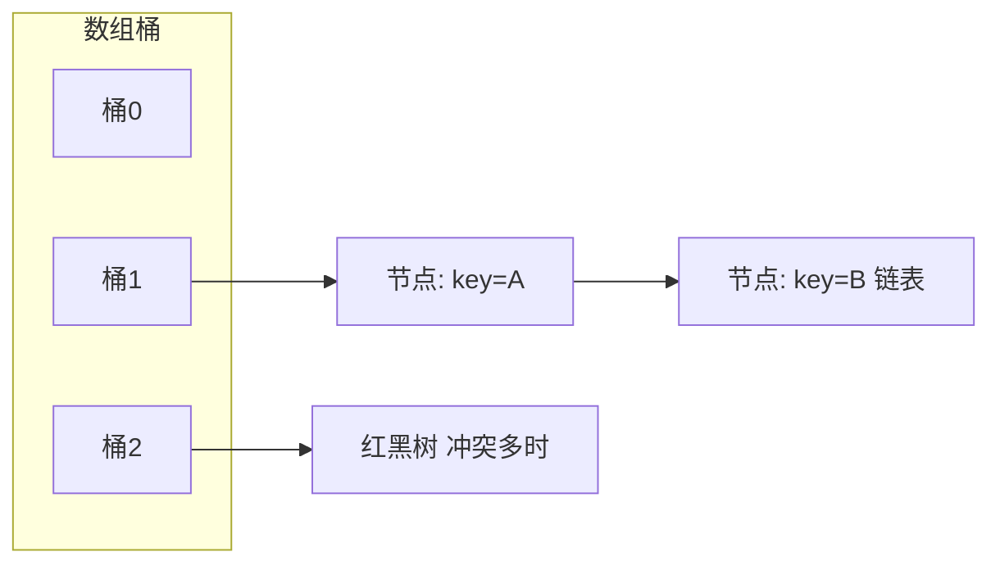

# Java 常用类、集合与泛型

<!-- 修改说明: 新增本章与上一章的关系 -->

## 本章与上一章的关系

01 章你学会了写 Java 类和基本语法——但后端项目里几乎不会用原生数组存业务数据，而是用 **String、ArrayList、HashMap** 这些标准库。

这一章就是「Java 日常开发工具箱」：字符串怎么处理、集合怎么选、泛型 `<T>` 是什么、金额为什么用 BigDecimal。02 章练熟后，03 章学并发时你会理解「为什么 HashMap 不能多线程直接用」，04 章写 Spring Boot 接口时返回 `List<UserVO>` 也不会陌生。

---

## 1. 为什么这部分很重要

在真实后端开发里，绝大多数业务代码都绕不开这些内容：

- 字符串处理
- 时间处理
- 金额处理
- 集合操作
- Map 存储
- 参数封装

如果这些你不熟，写项目会非常吃力，面试也很容易被问住。

## 2. 常用类

### 2.1 String

```java
String s = "hello";
System.out.println(s.length());
System.out.println(s.substring(1, 4));
System.out.println(s.replace("l", "x"));
System.out.println(s.startsWith("he"));
```

常见场景：

- 用户名处理
- 路径拼接
- 参数解析
- 文本校验

重点：

- 字符串不可变
- 频繁拼接不要一直用 `+`

### 2.2 StringBuilder

```java
StringBuilder sb = new StringBuilder();
sb.append("订单");
sb.append("-");
sb.append(1001);
System.out.println(sb.toString());
```

适合场景：

- 循环里拼接字符串
- 动态构造日志内容
- 拼接 SQL 片段时做演示

### 2.3 BigDecimal

金额计算必须重点掌握这个类。

```java
import java.math.BigDecimal;

BigDecimal price = new BigDecimal("99.90");
BigDecimal count = new BigDecimal("2");
BigDecimal total = price.multiply(count);
System.out.println(total);
```

为什么不用 `double`：

- `double` 有精度问题
- 金额计算不能容忍误差

常见用法：

```java
BigDecimal a = new BigDecimal("10.50");
BigDecimal b = new BigDecimal("3.20");
System.out.println(a.add(b));
System.out.println(a.subtract(b));
System.out.println(a.multiply(b));
System.out.println(a.divide(b, 2, BigDecimal.ROUND_HALF_UP));
```

### 2.4 时间类

现在更推荐使用 Java 8 的时间 API。

```java
import java.time.LocalDate;
import java.time.LocalDateTime;
import java.time.format.DateTimeFormatter;

LocalDateTime now = LocalDateTime.now();
System.out.println(now);

DateTimeFormatter formatter = DateTimeFormatter.ofPattern("yyyy-MM-dd HH:mm:ss");
System.out.println(now.format(formatter));
```

常见场景：

- 订单创建时间
- 用户注册时间
- 统计某个时间范围数据

## 3. 包装类和自动装箱

Java 基本类型有对应的包装类：

- `int` -> `Integer`
- `long` -> `Long`
- `double` -> `Double`
- `boolean` -> `Boolean`

```java
Integer a = 10;
int b = a;
```

这个过程分别叫：

- 自动装箱
- 自动拆箱

## 4. 集合框架总览

你先建立一个大图景：

- `List`：有序、可重复
- `Set`：无序、不可重复
- `Map`：键值对

最常用实现类：

- `ArrayList`
- `LinkedList`
- `HashSet`
- `HashMap`
- `TreeMap`

## 5. List

### 5.1 ArrayList

底层是动态数组。

```java
import java.util.ArrayList;
import java.util.List;

List<String> list = new ArrayList<>();
list.add("Java");
list.add("MySQL");
list.add("Redis");
System.out.println(list.get(0));
System.out.println(list.size());
```

特点：

- 查询快
- 末尾追加快
- 中间插入和删除相对慢

常见场景：

- 接收数据库查询结果列表
- 返回接口数据列表

### 5.2 LinkedList

底层是链表结构。

```java
import java.util.LinkedList;

LinkedList<String> list = new LinkedList<>();
list.add("A");
list.addFirst("B");
list.addLast("C");
System.out.println(list);
```

特点：

- 某些插入删除场景更方便
- 随机访问慢

实际业务里，`ArrayList` 用得比 `LinkedList` 多得多。

## 6. Set

Set 的特点是元素不能重复。

```java
import java.util.HashSet;
import java.util.Set;

Set<String> skills = new HashSet<>();
skills.add("Java");
skills.add("Redis");
skills.add("Java");
System.out.println(skills);
```

常见场景：

- 去重
- 用户标签
- 权限集合

## 7. Map

Map 是后端非常高频的结构。

```java
import java.util.HashMap;
import java.util.Map;

Map<String, Object> user = new HashMap<>();
user.put("id", 1L);
user.put("name", "张三");
user.put("age", 18);
System.out.println(user.get("name"));
```

常见场景：

- 缓存一组属性
- 临时存放查询结果
- 统计计数

## 8. HashMap 重点讲解

### 8.1 为什么重要

`HashMap` 是面试高频，也是项目高频。

### 8.2 底层结构

你现阶段先掌握这句话：

`HashMap` 底层是数组 + 链表 + 红黑树。

含义：

- 不同 key 通过 hash 算法定位桶位置
- 冲突时会挂到同一个桶里
- 冲突很多时会转换成红黑树提高效率

### 8.3 常见操作

```java
Map<String, Integer> map = new HashMap<>();
map.put("apple", 3);
map.put("banana", 5);
map.put("apple", 10);

System.out.println(map.get("apple"));
System.out.println(map.containsKey("banana"));
System.out.println(map.remove("banana"));
```

### 8.4 为什么说它线程不安全

多个线程同时修改 `HashMap` 可能出现数据不一致甚至结构问题。

<!-- 修改说明: 补充 HashMap 线程不安全的深入解释与真实案例 -->

#### 为什么 HashMap 线程不安全？

**结论**：`HashMap` 非线程安全——多线程并发 `put` 时可能丢数据、形成环链（JDK7）或结构错乱，必须换 `ConcurrentHashMap` 或加锁。

**底层原理**：

`HashMap` 的 `put` 不是原子操作，大致分三步：算 hash → 定位桶 → 插入节点。两个线程同时 put 到同一个桶，可能互相覆盖；更严重时，JDK7 扩容 rehash 过程中多线程操作可能让链表形成**环形引用**，导致 `get` 时 CPU 100% 死循环。JDK8 改用尾插法减少了环链概率，但并发 put 仍可能丢 entry。

**真实案例（模拟）**：

某统计服务用静态 `HashMap` 缓存用户点击次数，QPS 不高但多线程并发更新。压测发现计数永远对不上——10 个线程各加 1000 次，结果只有 7000 多。换成 `ConcurrentHashMap` 后计数准确。教训：**任何可能被多线程访问的 Map，默认用 ConcurrentHashMap**。

#### HashMap 结构简图



并发场景下应优先考虑：

- `ConcurrentHashMap`
- 或者通过同步机制保护

## 9. 遍历集合

### 9.1 遍历 List

```java
for (String item : list) {
    System.out.println(item);
}
```

### 9.2 遍历 Map

```java
for (Map.Entry<String, Object> entry : user.entrySet()) {
    System.out.println(entry.getKey() + ":" + entry.getValue());
}
```

## 10. 泛型

泛型的作用是让代码更安全、更清晰。

```java
List<String> names = new ArrayList<>();
names.add("Tom");
```

如果不用泛型：

- 容易混入错误类型
- 取值时还要强转

### 10.1 泛型类

```java
class Box<T> {
    private T value;

    public void setValue(T value) {
        this.value = value;
    }

    public T getValue() {
        return value;
    }
}
```

### 10.2 泛型方法

```java
public static <T> void printArray(T[] arr) {
    for (T item : arr) {
        System.out.println(item);
    }
}
```

## 11. Lambda 和 Stream 基础

现代 Java 项目经常会看到这些写法。

### 11.1 Lambda

```java
List<String> names = new ArrayList<>();
names.add("Tom");
names.add("Jerry");

names.forEach(name -> System.out.println(name));
```

### 11.2 Stream

```java
List<Integer> nums = List.of(1, 2, 3, 4, 5);
List<Integer> result = nums.stream()
        .filter(n -> n > 2)
        .map(n -> n * 2)
        .toList();
System.out.println(result);
```

常见用途：

- 过滤数据
- 转换数据
- 聚合统计

但是注意：

- 初学阶段先保证可读性
- 不是所有场景都必须用 Stream

## 12. 实体类、DTO、VO

后端项目中经常会把对象分层。

### 12.1 Entity

通常和数据库表对应。

### 12.2 DTO

用于接收入参或服务间传输。

### 12.3 VO

用于返回给前端的对象。

为什么要分开：

- 更清晰
- 更安全
- 避免把数据库字段直接暴露给前端

## 13. 初学者高频坑

### 13.1 用 `double` 算钱

不行，金额用 `BigDecimal`。

### 13.2 不知道 List 和 Set 的区别

你要明确：

- `List` 允许重复
- `Set` 不允许重复

### 13.3 `HashMap` 乱用在并发场景

多线程场景下先停一下，考虑线程安全问题。

### 13.4 集合判空不做处理

空集合和 `null` 不是一回事，项目里要注意返回值设计。

## 14. 这一章的练习建议

建议你自己完成：

1. 用 `ArrayList` 存 10 个学生对象并遍历
2. 用 `HashMap` 存一个用户信息
3. 用 `HashSet` 对一组标签去重
4. 用 `BigDecimal` 计算订单总价
5. 用 `LocalDateTime` 输出当前时间
6. 用 Stream 过滤出大于某个分数的学生

## 15. 学完标准

你如果能做到这些，就说明这份内容基本掌握了：

- 能区分 `List`、`Set`、`Map`
- 会用 `ArrayList` 和 `HashMap`
- 知道 `HashMap` 为什么重要
- 知道泛型的作用
- 会用 `BigDecimal` 和 Java 8 时间类
- 能看懂项目里常见的集合和对象写法

## 16. Object 常用方法

除了前面提到的集合和工具类，你还需要熟悉对象本身的几个基础方法：

- `toString`
- `equals`
- `hashCode`

### 16.1 equals 为什么重要

比如你在集合里判断两个对象是否相等，如果不重写 `equals`，往往比较的是引用而不是业务含义。

### 16.2 hashCode 为什么重要

在 `HashMap` 和 `HashSet` 中，`hashCode` 会影响桶定位和查找效率。

## 17. ArrayList 底层细节

你至少要知道：

- 底层是数组
- 容量不够时会扩容
- 扩容会带来复制开销

这就是为什么：

- `ArrayList` 适合读多写少
- 数据量很大时要关注扩容成本

## 18. HashSet 底层理解

`HashSet` 本质上可以理解为基于 `HashMap` 实现的去重集合。

也就是说：

- 元素为什么不能重复
- 实际上依赖于 `hashCode` 和 `equals`

## 19. TreeMap 和 TreeSet

如果你需要排序能力，可以了解：

- `TreeMap`
- `TreeSet`

特点：

- 默认按自然顺序排序
- 底层通常和红黑树相关

常见场景：

- 需要自动排序的 key 集合
- 需要按顺序输出数据

## 20. Iterator 和遍历删除问题

初学者常见错误是：遍历集合时直接删除元素。

错误示例：

```java
for (String item : list) {
    if ("a".equals(item)) {
        list.remove(item);
    }
}
```

更安全的思路是使用迭代器：

```java
import java.util.Iterator;

Iterator<String> iterator = list.iterator();
while (iterator.hasNext()) {
    String item = iterator.next();
    if ("a".equals(item)) {
        iterator.remove();
    }
}
```

## 21. Collections 工具类

Java 里有一个很常用的工具类：

- `Collections`

例如：

```java
import java.util.Collections;

Collections.sort(list);
Collections.reverse(list);
Collections.shuffle(list);
```

## 22. 泛型通配符

这部分很多初学者会觉得抽象，但你只需要先掌握基本语义。

### 22.1 `? extends T`

表示上界，适合“读”。

### 22.2 `? super T`

表示下界，适合“写”。

你现在不必死记硬背，可以先记一个经验：

- 上界更偏向取数据
- 下界更偏向放数据

## 23. Optional

`Optional` 用来表达“这个值可能为空”。

```java
import java.util.Optional;

Optional<String> name = Optional.ofNullable(null);
System.out.println(name.orElse("默认值"));
```

作用：

- 让空值处理更明确

但注意：

- 不要为了用而用
- 项目里核心还是先把空值边界处理清楚

## 24. Stream 常见操作

除了 `filter` 和 `map`，你还要逐渐熟悉：

- `sorted`
- `distinct`
- `collect`
- `count`
- `anyMatch`

```java
List<String> result = names.stream()
        .filter(name -> name.length() > 3)
        .distinct()
        .sorted()
        .toList();
```

## 25. Collectors 基础

有些场景需要把流收集成不同结构。

```java
import java.util.stream.Collectors;

Map<Integer, List<String>> groupMap = names.stream()
        .collect(Collectors.groupingBy(String::length));
```

常见用途：

- 分组统计
- 转 Map
- 转 Set

## 26. 不可变集合

Java 里有些集合不允许修改。

```java
List<String> list = List.of("A", "B");
```

这类集合：

- 不能新增
- 不能删除

你在接手别人代码时看到这种写法要能认出来。

## 27. 项目中集合的高频场景

### 27.1 查询结果列表

一般是 `List<VO>`

### 27.2 权限集合

一般可能是 `Set<String>`

### 27.3 临时属性封装

一般可能是 `Map<String, Object>`

### 27.4 统计计数

常见是 `Map<String, Integer>` 或 `Map<Long, Long>`

## 28. Comparable 和 Comparator

当你需要排序对象时，经常会用到这两个接口。

### Comparable

让类自己定义默认比较规则。

```java
class User implements Comparable<User> {
    private Integer age;

    @Override
    public int compareTo(User other) {
        return this.age - other.age;
    }
}
```

### Comparator

在外部定义比较规则，更灵活。

```java
list.sort((a, b) -> a.getAge() - b.getAge());
```

## 29. Queue 和 Deque

除了 `List`、`Set`、`Map`，你还要认识：

- `Queue`
- `Deque`

### Queue

更偏队列语义。

### Deque

双端队列，可以两边进出。

常见实现：

- `LinkedList`
- `ArrayDeque`

## 30. ArrayDeque 基础认知

如果你要实现：

- 栈
- 队列

很多时候 `ArrayDeque` 比 `Stack` 更推荐。

原因通常是：

- 设计更现代
- 性能更合适

## 31. Map 常见便捷方法

你后面写业务代码会很常看到这些方法：

- `getOrDefault`
- `putIfAbsent`
- `computeIfAbsent`

### 示例

```java
Map<String, Integer> countMap = new HashMap<>();
countMap.put("java", 1);
int count = countMap.getOrDefault("redis", 0);
```

## 32. 类型擦除基础认知

泛型在编译后并不会完整保留具体类型信息，这就是类型擦除的基础理解。

你现在先知道这个结论即可：

- 泛型主要在编译期帮助做类型检查

## 33. 方法引用

方法引用是 Lambda 的一种简化写法。

```java
names.forEach(System.out::println);
```

常见形式：

- 对象实例方法引用
- 类静态方法引用
- 构造器引用

## 34. 函数式接口基础认知

Lambda 往往配合函数式接口使用。

函数式接口可以简单理解为：

- 只有一个抽象方法的接口

常见例子：

- `Runnable`
- `Comparator`

## 35. 集合的时间复杂度基础认知

你不需要死背所有复杂度，但要知道大致方向：

- `ArrayList` 按下标访问快
- `LinkedList` 随机访问慢
- `HashMap` 平均查找快
- `TreeMap` 带排序但通常慢于哈希结构

这会帮助你在业务里更合理地选集合。

## 36. Java 集合学习中最容易混的点

### `ArrayList` vs `LinkedList`

### `HashMap` vs `TreeMap`

### `List` vs `Set`

### `HashSet` 元素去重原理

### 泛型到底解决什么问题

建议你把这些点单独做成笔记。

---

## 37. 集合选型速查表

| 需求 | 推荐 | 避免 |
|------|------|------|
| 随机访问、尾部增删 | `ArrayList` | 频繁头插用 LinkedList |
| 去重、判存在 | `HashSet` | 需要有序用 `TreeSet` |
| 键值映射 | `HashMap` | 需要排序用 `TreeMap` |
| 线程安全 Map | `ConcurrentHashMap` | 不要用 `Hashtable` |
| 队列、栈 | `ArrayDeque` | `Stack` 类已过时 |
| 字符串拼接循环 | `StringBuilder` | `+` 在循环里 |

---

## 38. Stream API 入门（后端常用）

```java
List<User> users = userService.list();

// 过滤成年用户
List<User> adults = users.stream()
    .filter(u -> u.getAge() >= 18)
    .collect(Collectors.toList());

// 提取姓名列表
List<String> names = users.stream()
    .map(User::getName)
    .collect(Collectors.toList());

// 按部门分组
Map<String, List<User>> byDept = users.stream()
    .collect(Collectors.groupingBy(User::getDept));
```

**注意**：Stream 适合集合内存处理；数据库侧过滤优先写 SQL。

---

## 39. 学完标准

- 熟练 `ArrayList` / `HashMap` / `HashSet` 增删改查
- 理解 `hashCode` 与 `equals` 对 Hash 集合的影响
- 会使用泛型，看懂 `List<String>` 意义
- 会用 `StringBuilder`、`BigDecimal` 处理金额
- 了解 `ConcurrentHashMap` 与 `synchronized` 集合区别
- 能用 Stream 做简单 filter/map/collect

---

## 40. 分级练习

**基础**：用 `HashMap` 统计字符串中每个字符出现次数  
**进阶**：用 `TreeMap` 实现排行榜（分数 → 姓名列表）  
**挑战**：手写简易 LRU 缓存思路（`LinkedHashMap` accessOrder）

<!-- 修改说明: 新增分级练习参考答案 -->

### 参考答案

#### 基础：HashMap 统计字符出现次数

```java
import java.util.HashMap;
import java.util.Map;

public class CharCounter {

    public static Map<Character, Integer> count(String text) {
        Map<Character, Integer> map = new HashMap<>();
        for (char c : text.toCharArray()) {
            map.put(c, map.getOrDefault(c, 0) + 1);
        }
        return map;
    }

    public static void main(String[] args) {
        Map<Character, Integer> result = count("hello");
        System.out.println(result);
        // 预期输出：{h=1, e=1, l=2, o=1}
    }
}
```

#### 进阶：TreeMap 排行榜

```java
import java.util.*;

public class Leaderboard {

    // 分数 → 该分数的所有玩家（降序遍历）
    private final TreeMap<Integer, List<String>> board = new TreeMap<>(Collections.reverseOrder());

    public void addScore(String player, int score) {
        board.computeIfAbsent(score, k -> new ArrayList<>()).add(player);
    }

    public void printTop(int n) {
        int count = 0;
        for (Map.Entry<Integer, List<String>> entry : board.entrySet()) {
            for (String player : entry.getValue()) {
                System.out.println(player + " : " + entry.getKey());
                if (++count >= n) return;
            }
        }
    }

    public static void main(String[] args) {
        Leaderboard lb = new Leaderboard();
        lb.addScore("Alice", 950);
        lb.addScore("Bob", 880);
        lb.addScore("Carol", 950);
        lb.printTop(3);
        // 预期：Alice 950, Carol 950, Bob 880
    }
}
```

#### 挑战：LinkedHashMap 实现简易 LRU

```java
import java.util.LinkedHashMap;
import java.util.Map;

public class SimpleLRUCache<K, V> extends LinkedHashMap<K, V> {

    private final int capacity;

    public SimpleLRUCache(int capacity) {
        super(capacity, 0.75f, true);  // accessOrder=true：访问后移到末尾
        this.capacity = capacity;
    }

    @Override
    protected boolean removeEldestEntry(Map.Entry<K, V> eldest) {
        return size() > capacity;  // 超出容量时移除最久未访问的
    }

    public static void main(String[] args) {
        SimpleLRUCache<Integer, String> cache = new SimpleLRUCache<>(3);
        cache.put(1, "A");
        cache.put(2, "B");
        cache.put(3, "C");
        cache.get(1);       // 访问 1，1 变成最近使用
        cache.put(4, "D");  // 容量满，淘汰最久未用的 2
        System.out.println(cache);  // 预期：{3=C, 1=A, 4=D}，不含 2
    }
}
```

---

<!-- 修改说明: 新增常见报错与排查 -->

## 40.1 常见报错与排查

| 报错信息（关键词） | 可能原因 | 解决方案 |
|-------------------|---------|---------|
| `ConcurrentModificationException` | 遍历时修改了集合（for-each 里 remove） | 用 Iterator 的 `remove()`；或改用 CopyOnWriteArrayList |
| `ClassCastException` | 泛型擦除后强转错误 | 声明时用 `List<String>` 而不是 raw type |
| `UnsupportedOperationException` | 对 `Arrays.asList` 返回的列表 add/remove | `new ArrayList<>(Arrays.asList(...))` 包一层 |
| `NullPointerException` on `map.get` | key 为 null 时部分 Map 允许，但 `getOrDefault` 用法不对 | 检查 key；`ConcurrentHashMap` 不允许 null key |
| `NumberFormatException` | `Integer.parseInt("abc")` | 先校验字符串是否为数字 |
| `ArithmeticException: Non-terminating decimal` | BigDecimal 除法没指定精度 | `divide(a, 2, RoundingMode.HALF_UP)` |

---

## 41. FAQ

**Q：`HashMap` 线程安全吗？**  
否，并发用 `ConcurrentHashMap`。

**Q：为什么重写 `equals` 要重写 `hashCode`？**  
Hash 结构先按 hashCode 定位桶，equals 不等则逻辑错误。

**Q：`Arrays.asList` 能 add 吗？**  
返回固定大小列表，add/remove 抛异常；需 `new ArrayList<>(Arrays.asList(...))`。

---

<!-- 修改说明: 新增下一章预告 -->

## 下一章预告

这一章你把 String、集合、泛型、Stream 都过了一遍——日常写业务代码够用了。但后端服务通常是**多线程**的：Tomcat 每个请求一个线程，线程池异步执行任务，多个线程同时改同一个 `HashMap` 就会出问题。

下一章（03 Java 并发编程与 JVM）会讲线程池、synchronized、volatile、JVM 内存结构。你会彻底理解 02 章说的「HashMap 线程不安全」到底怎么回事，以及为什么 04 章 Spring Boot 里可以放心把 `@Service` 做成单例。

---

*下一章：03 Java 并发编程与 JVM*
