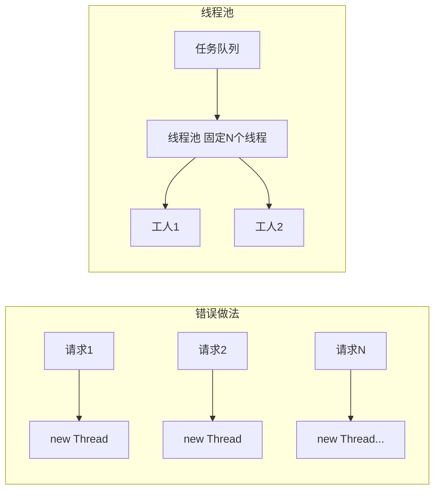

# Java 并发编程与 JVM

<!-- 修改说明: 新增本章与上一章的关系 -->

## 本章与上一章的关系

02 章你学了 `HashMap`、`ArrayList`——它们在线程安全上都有坑。真实后端里，Spring Boot 每个 HTTP 请求由一个线程处理，线程池异步发通知、定时任务也在跑，**多线程是默认场景**。

这一章帮你搞懂：为什么用线程池而不是 `new Thread`、synchronized 和 volatile 区别在哪、JVM 内存怎么划分、OOM 怎么排查。03 章和 04 章 Spring Boot 直接衔接——你会理解为什么 `@Service` 可以做成单例、为什么 ThreadLocal 在线程池里必须 `remove()`。

---

## 1. 为什么一定要学这一份

后端岗位面试里，Java 并发和 JVM 几乎一定会问。

项目里虽然你不一定天天手写复杂并发框架，但这些问题经常出现：

- 为什么异步任务不能乱开线程
- 为什么要用线程池
- 为什么会有线程安全问题
- 为什么服务会内存溢出
- 为什么会频繁 Full GC

## 2. 进程和线程

### 2.1 进程

进程可以理解为一个正在运行的程序实例。

### 2.2 线程

线程是进程内部的执行单元。

一个 Java 服务通常是一个进程，里面会有多个线程，比如：

- 主线程
- GC 线程
- 业务线程
- 数据库连接线程

## 3. 线程的创建方式

### 3.1 继承 Thread

```java
class MyThread extends Thread {
    @Override
    public void run() {
        System.out.println("线程执行");
    }
}
```

### 3.2 实现 Runnable

```java
class MyTask implements Runnable {
    @Override
    public void run() {
        System.out.println("执行任务");
    }
}
```

### 3.3 实际开发更推荐什么

实际开发一般不推荐你频繁手动创建线程，而是优先用线程池。

## 4. 线程安全问题

多个线程同时修改共享变量，就可能出现线程安全问题。

```java
class Counter {
    int count = 0;

    public void add() {
        count++;
    }
}
```

如果很多线程同时执行 `count++`，最终结果可能不正确。

## 5. synchronized

这是最基础的同步方式。

```java
class Counter {
    int count = 0;

    public synchronized void add() {
        count++;
    }
}
```

作用：

- 同一时刻只允许一个线程进入这段临界区代码

### 5.1 什么时候用

- 共享变量修改
- 简单同步控制

### 5.2 缺点

- 竞争激烈时可能影响性能

## 6. volatile

`volatile` 主要保证变量的可见性。

```java
class FlagDemo {
    volatile boolean running = true;
}
```

你现阶段先记住：

- 它能让一个线程修改后的值对其他线程立即可见
- 它不能保证复合操作的原子性

比如：

- `count++` 依然不是线程安全的

## 7. Lock

除了 `synchronized`，Java 还提供了更灵活的锁。

```java
import java.util.concurrent.locks.ReentrantLock;

ReentrantLock lock = new ReentrantLock();
lock.lock();
try {
    System.out.println("执行业务逻辑");
} finally {
    lock.unlock();
}
```

常见优点：

- 更灵活
- 可以手动控制加锁和释放
- 支持更多高级能力

## 8. 线程池

### 8.1 为什么不能乱创建线程

频繁创建和销毁线程有开销，而且线程太多会：

- 占用内存
- 增加上下文切换
- 影响系统稳定性

<!-- 修改说明: 补充为什么用线程池而不是 new Thread 的深入解释 -->

#### 为什么用线程池，而不是 new Thread？

**结论**：`new Thread()` 每次创建新线程有开销，无限创建会导致线程爆炸和 OOM；线程池复用线程、限制并发数、统一管理任务队列。

**底层原理**：

创建一个线程需要向 OS 申请栈空间（默认约 1MB）、内核态切换、JVM 线程对象初始化。如果每个异步任务都 `new Thread().start()`，1000 个并发请求就是 1000 个线程 ≈ 1GB 栈内存，加上上下文切换 CPU 飙高。线程池预先创建核心线程，任务提交到队列，线程复用执行多个任务，用完不销毁；队列满时按拒绝策略处理，系统可控。

**真实案例（模拟）**：

某接口每收到请求就 `new Thread` 发邮件，压测 500 并发时出现 `java.lang.OutOfMemoryError: unable to create new native thread`，服务僵死。改为固定大小线程池（核心 10、队列 200）后，邮件异步发送正常，峰值 CPU 从 95% 降到 40%。



---

### 8.2 什么是线程池

线程池提前创建好一批线程，任务来了就交给线程池执行。

### 8.3 基本用法

```java
import java.util.concurrent.ExecutorService;
import java.util.concurrent.Executors;

ExecutorService pool = Executors.newFixedThreadPool(5);
pool.submit(() -> System.out.println("执行异步任务"));
pool.shutdown();
```

### 8.4 更推荐的写法

面试里常说不要直接用 `Executors` 创建线程池，而是自己配置 `ThreadPoolExecutor`。

```java
import java.util.concurrent.*;

ThreadPoolExecutor executor = new ThreadPoolExecutor(
        2,
        4,
        60,
        TimeUnit.SECONDS,
        new ArrayBlockingQueue<>(100),
        Executors.defaultThreadFactory(),
        new ThreadPoolExecutor.AbortPolicy()
);
```

### 8.5 核心参数解释

- 核心线程数
- 最大线程数
- 空闲线程存活时间
- 阻塞队列
- 线程工厂
- 拒绝策略

### 8.6 拒绝策略

当线程池忙不过来时，常见处理方式有：

- 直接抛异常
- 让调用线程自己执行
- 丢弃任务

## 9. 并发工具类

### 9.1 CountDownLatch

适合等待多个任务执行完成。

```java
import java.util.concurrent.CountDownLatch;

CountDownLatch latch = new CountDownLatch(2);
new Thread(() -> {
    System.out.println("任务1完成");
    latch.countDown();
}).start();

new Thread(() -> {
    System.out.println("任务2完成");
    latch.countDown();
}).start();

latch.await();
System.out.println("全部完成");
```

### 9.2 ThreadLocal

每个线程保留自己的变量副本。

常见场景：

- 保存用户上下文
- 保存请求链路信息

注意：

- 用完要及时清理，尤其在线程池场景

## 10. JVM 内存结构

你至少要建立这张图：

- 程序计数器
- 虚拟机栈
- 本地方法栈
- 堆
- 方法区

### 10.1 堆

对象大多数都在堆上分配。

### 10.2 栈

方法调用时的局部变量、方法参数等通常在栈帧中。

### 10.3 方法区

放类信息、常量等内容。

## 11. 对象的创建和回收

### 11.1 对象如何创建

当你执行 `new User()` 时，JVM 会：

1. 检查类是否加载
2. 在堆上分配内存
3. 初始化对象
4. 返回引用

### 11.2 垃圾回收基本认知

JVM 会自动回收不再被使用的对象。

核心问题是：

- 如何判断对象已经“没用了”

主流思路是：

- 可达性分析

## 12. 新生代和老年代

你可以先简单理解：

- 新生代：新创建对象主要在这里
- 老年代：生命周期更长的对象会进入这里

如果老年代压力太大，可能触发更重的 GC。

## 13. GC 基础

### 13.1 Minor GC

通常发生在新生代。

### 13.2 Full GC

更重，通常影响更大。

面试里你要知道：

- Full GC 频繁通常不是好事

## 14. 类加载机制

类加载的大致过程：

1. 加载
2. 验证
3. 准备
4. 解析
5. 初始化

## 15. 双亲委派模型

你先记住它解决的问题：

- 避免类重复加载
- 保证核心类库安全

面试里常见问法：

- 什么是双亲委派
- 为什么要有双亲委派

## 16. 常见面试表达思路

### 16.1 线程池为什么重要

可以这样表达：

线程池通过复用线程减少频繁创建和销毁线程的开销，同时还能限制并发数量、统一管理异步任务，提高系统稳定性。

### 16.2 volatile 能保证什么

可以这样表达：

`volatile` 主要保证变量的可见性和一定程度上的有序性，但不能保证像 `count++` 这种复合操作的原子性。

### 16.3 JVM 为什么要分堆和栈

可以这样表达：

堆适合存放对象，便于统一回收；栈适合方法调用和局部变量管理，速度快、生命周期清晰。

## 17. 这一章的练习建议

建议你自己完成：

1. 写一个计数器线程安全 demo
2. 写一个线程池执行异步任务 demo
3. 写一个 `CountDownLatch` demo
4. 画一张 JVM 内存结构图
5. 总结 10 个并发和 JVM 基础题

## 18. 学完标准

如果你能做到下面这些，就说明这一章过关了：

- 能区分进程和线程
- 知道线程安全问题是怎么来的
- 知道 `synchronized`、`volatile`、线程池的作用
- 知道 JVM 内存结构的大图景
- 能说清 GC、类加载、双亲委派的基础含义

## 19. CAS

并发编程里经常会提到 CAS。

它可以理解为：

- 比较并交换

核心思想是：

1. 先读取一个旧值
2. 比较旧值有没有变化
3. 没变化就更新

很多原子类底层都和这个思路相关，比如：

- `AtomicInteger`

## 20. AtomicInteger

```java
import java.util.concurrent.atomic.AtomicInteger;

AtomicInteger count = new AtomicInteger(0);
count.incrementAndGet();
System.out.println(count.get());
```

它适合：

- 简单计数
- 高并发场景下替代普通整型自增

## 21. 死锁

死锁就是多个线程互相等待对方释放资源，结果谁都继续不下去。

### 常见示意

- 线程 A 持有锁 1，等待锁 2
- 线程 B 持有锁 2，等待锁 1

### 避免思路

- 固定加锁顺序
- 缩短持锁时间
- 尽量减少嵌套锁

## 22. ReentrantLock 和 synchronized 的区别

你面试时经常会被问到这个问题。

可以先这样回答：

- `synchronized` 使用更简单
- `ReentrantLock` 更灵活
- `ReentrantLock` 支持更丰富的锁控制能力

## 23. 线程池参数怎么理解更实际

### 核心线程数

默认长期保留的线程数量。

### 最大线程数

高峰时最多能扩到多少线程。

### 队列容量

新任务来不及执行时先排队。

### 拒绝策略

队列满、线程也满之后怎么办。

## 24. ThreadLocal 常见风险

`ThreadLocal` 很方便，但也有风险。

在使用线程池时，如果不及时清理：

- 旧数据可能污染下一个请求
- 还可能造成内存泄漏风险

所以一个常见原则是：

- 用完及时 `remove`

## 25. JVM 中的常见异常

### 25.1 StackOverflowError

通常和递归太深有关。

### 25.2 OutOfMemoryError

常见情况包括：

- 堆内存不够
- 元空间问题
- 直接内存问题

## 26. 什么时候会内存泄漏

Java 有 GC，但并不代表绝不会内存泄漏。

常见原因：

- 长生命周期对象持有短生命周期对象引用
- 集合不断放数据却不清理
- ThreadLocal 未清理
- 缓存设计不当

## 27. JVM 排查的基础思路

如果一个 Java 服务越来越慢或频繁异常，可以先想：

1. 是 CPU 高还是内存高
2. 是否频繁 GC
3. 是否线程阻塞
4. 是否有死循环或死锁

## 28. 这一章的进一步知识点清单

后面你还可以继续深入这些内容：

- AQS
- `ConcurrentHashMap`
- `ForkJoinPool`
- `CompletableFuture`
- G1 垃圾回收器
- JVM 参数调优
- 类加载器隔离

## 29. 线程的生命周期

Java 线程不是只有“运行”和“结束”两个状态。

你最好知道这些状态：

- `NEW`
- `RUNNABLE`
- `BLOCKED`
- `WAITING`
- `TIMED_WAITING`
- `TERMINATED`

### 怎么理解

- `NEW`：线程对象刚创建，还没 `start`
- `RUNNABLE`：可运行，可能正在运行，也可能等 CPU
- `BLOCKED`：在等锁
- `WAITING`：无限等待
- `TIMED_WAITING`：限时等待，比如 `sleep`
- `TERMINATED`：执行结束

面试里很可能会问：

- `sleep` 和 `wait` 的区别
- `BLOCKED` 和 `WAITING` 的区别

## 30. sleep、wait、join 的区别

### sleep

- `Thread` 的静态方法
- 让当前线程休眠一段时间
- 不会释放锁

### wait

- `Object` 的方法
- 必须在同步块里使用
- 会释放当前对象监视器

### join

- 让当前线程等待另一个线程执行完

```java
Thread t = new Thread(() -> {
    System.out.println("子线程执行");
});
t.start();
t.join();
System.out.println("主线程继续");
```

## 31. synchronized 锁的几种形态

### 31.1 修饰实例方法

锁的是当前对象。

```java
public synchronized void add() {
    count++;
}
```

### 31.2 修饰静态方法

锁的是类对象。

```java
public static synchronized void test() {
}
```

### 31.3 修饰代码块

可以更精准地控制锁范围。

```java
synchronized (this) {
    count++;
}
```

为什么要缩小锁范围：

- 减少无意义竞争
- 提升并发性能

## 32. 可见性、原子性、有序性

并发里很多问题可以归到这三个词。

### 可见性

一个线程修改了变量，另一个线程能不能及时看到。

### 原子性

一个操作会不会被打断。

### 有序性

程序执行顺序是否可能因为编译器或 CPU 优化而变化。

你现在可以先这样记：

- `volatile` 主要解决可见性和部分有序性
- `synchronized` 可以同时保障可见性和原子性

## 33. Java 内存模型 JMM 基础认知

JMM 不是 JVM 内存结构图，它更偏并发语义。

它解决的是：

- 多线程之间变量可见性
- 指令重排序
- 线程如何与主内存交互

你现在不必死磕完整定义，但要知道：

- 并发问题不是单纯“代码顺序执行”那么简单

## 34. happens-before 基础理解

这是并发底层规则里很重要的概念。

简单理解：

- 如果 A happens-before B，就说明 A 的结果对 B 可见，并且 A 的执行顺序先于 B

你不一定现在就背定义，但要知道它存在，是并发可见性分析的重要基础。

## 35. ConcurrentHashMap 基础认知

并发场景里，普通 `HashMap` 可能出问题，所以常用：

- `ConcurrentHashMap`

它的核心价值：

- 支持更高并发下的安全访问
- 比 `Hashtable` 粗暴同步更高效

常见场景：

- 本地缓存
- 并发统计
- 多线程共享字典

## 36. CopyOnWriteArrayList 基础认知

这个集合适合：

- 读多写少

它的大致思路是：

- 写的时候复制一份数组

优点：

- 读线程几乎不受锁影响

缺点：

- 写开销大

## 37. 阻塞队列 BlockingQueue

并发编程和线程池里经常会碰到队列。

常见实现：

- `ArrayBlockingQueue`
- `LinkedBlockingQueue`

用途：

- 生产者消费者模型
- 线程池任务排队

## 38. Future 和 CompletableFuture

### Future

表示异步结果，但使用起来不够灵活。

### CompletableFuture

更现代，适合：

- 异步编排
- 多任务组合

示例：

```java
import java.util.concurrent.CompletableFuture;

CompletableFuture<String> future = CompletableFuture.supplyAsync(() -> "hello");
System.out.println(future.join());
```

你以后做：

- 异步查询组合
- 并行调用多个接口

会很常见。

## 39. 线程池参数怎么估

面试里如果被问“线程池参数怎么设置”，不要只背概念。

你可以从这些角度答：

- 任务是 CPU 密集还是 IO 密集
- 机器核心数多少
- 响应时间要求
- 队列能承受多少堆积
- 拒绝策略怎么选

一个常见基础思路：

- CPU 密集：线程数不要太多
- IO 密集：线程数可以适度多一些

## 40. Executors 为什么不推荐直接用

常见原因：

- 某些工厂方法可能创建无界队列
- 某些工厂方法可能创建过多线程
- 不利于精确控制资源

所以项目中更推荐：

- 显式使用 `ThreadPoolExecutor`

## 41. JVM 垃圾回收器基础认知

你至少应该认识这些名字：

- Serial
- Parallel
- CMS
- G1

当前阶段最重要的是知道：

- G1 在现代服务端场景里很常见
- 不同回收器关注点不同

## 42. Full GC 为什么危险

因为它通常比 Minor GC 更重，可能导致：

- 停顿时间更长
- 服务响应抖动

如果线上频繁 Full GC，通常意味着：

- 内存配置不合理
- 对象创建过多
- 内存泄漏

## 43. 常见 JVM 参数基础认知

你会逐渐看到这些参数：

- `-Xms`
- `-Xmx`
- `-Xmn`

简单理解：

- `-Xms`：初始堆大小
- `-Xmx`：最大堆大小
- `-Xmn`：新生代大小

现在不必追求调优高手级别，但要能认出来。

## 44. JVM 排查常见工具名

你后面可能会接触：

- `jps`
- `jstack`
- `jmap`
- `jstat`

你现在先知道它们大致对应：

- 看 Java 进程
- 看线程栈
- 看内存
- 看 GC 状态

## 45. 这一章的高频知识点总清单

建议你把下面这些都整理成自己的笔记：

- 进程和线程
- 线程创建方式
- 线程生命周期
- 线程安全问题
- `synchronized`
- `volatile`
- `Lock`
- 线程池
- CAS
- 原子类
- `ThreadLocal`
- 死锁
- JVM 内存结构
- 类加载
- 双亲委派
- GC
- Full GC 问题

---

## 46. 线程池完整示例（企业最常用）

```java
import java.util.concurrent.*;

public class ThreadPoolDemo {
    public static void main(String[] args) {
        ThreadPoolExecutor pool = new ThreadPoolExecutor(
            2,                      // 核心线程数
            5,                      // 最大线程数
            60, TimeUnit.SECONDS,   // 空闲线程存活时间
            new LinkedBlockingQueue<>(100),  // 任务队列
            new ThreadPoolExecutor.CallerRunsPolicy()  // 拒绝策略：调用者执行
        );

        for (int i = 0; i < 10; i++) {
            int taskId = i;
            pool.execute(() -> System.out.println(
                Thread.currentThread().getName() + " 执行任务 " + taskId));
        }
        pool.shutdown();
    }
}
```

### 七大参数记忆

| 参数 | 含义 |
|------|------|
| corePoolSize | 常驻工人数量 |
| maximumPoolSize | 最多工人 |
| keepAliveTime | 多余工人空闲多久解雇 |
| workQueue | 任务排队区 |
| threadFactory | 线程怎么创建 |
| handler | 队列满了怎么办 |

**面试**：「我们项目用线程池处理异步通知，核心线程数按 CPU 核数配置，队列用有界队列防 OOM。」

---

## 47. `synchronized` vs `Lock` vs `volatile`

| 机制 | 作用 | 场景 |
|------|------|------|
| `synchronized` | 互斥 + 可见性 | 方法/代码块加锁 |
| `ReentrantLock` | 可中断、可 tryLock、公平锁 | 需要灵活锁 |
| `volatile` | 保证可见性、禁止指令重排 | 状态标志位，不保证复合操作原子性 |

```java
// volatile 不能保证 count++ 原子性，仍需 synchronized 或 AtomicInteger
private volatile boolean running = true;  // 适合开关标志
```

---

## 48. 原子类示例

```java
AtomicInteger counter = new AtomicInteger(0);
counter.incrementAndGet();  // 线程安全自增

// CAS 思想：比较并交换，失败则重试
```

---

## 49. ThreadLocal 使用与泄漏提醒

```java
private static final ThreadLocal<UserContext> CTX = new ThreadLocal<>();

public static void set(UserContext user) { CTX.set(user); }
public static UserContext get() { return CTX.get(); }
public static void remove() { CTX.remove(); }  // 线程池场景必须 remove！
```

**泄漏原因**：线程池复用线程，上次请求的 ThreadLocal 没清，下次请求读到脏数据。

---

## 50. 死锁排查四要素（面试）

1. 互斥 2. 占有且等待 3. 不可剥夺 4. 循环等待

**避免**：固定加锁顺序；使用 `tryLock` 超时；锁粒度尽量小。

`jstack <pid>` 可看到 `Found one Java-level deadlock`。

---

## 51. JVM 内存结构速记图

```text
┌─────────────────────────────────────┐
│  堆 Heap（对象实例、数组）            │
│  ├─ 新生代 Eden + S0 + S1           │
│  └─ 老年代 Old                       │
├─────────────────────────────────────┤
│  栈 Stack（每线程：局部变量、方法帧）  │
├─────────────────────────────────────┤
│  方法区/元空间（类信息、常量）         │
└─────────────────────────────────────┘
```

**OOM 常见**：

- `Java heap space`：对象太多 / 泄漏
- `Metaspace`：类加载过多
- 栈溢出：递归太深

---

## 52. 学完标准

- 能创建线程并用线程池提交任务，说出核心参数含义
- 理解 `synchronized`、`volatile`、原子类适用场景
- 知道 ThreadLocal 用途与 `remove` 必要性
- 能画 JVM 内存简图，说出堆栈分工
- 听说过 GC、Full GC、jstack 排查

---

## 53. 分级练习

**基础**：用 3 个线程打印 1~100  
**进阶**：线程安全计数器（`AtomicInteger` vs `synchronized` 对比）  
**挑战**：模拟转账死锁，再用 `jstack` 或日志分析

<!-- 修改说明: 新增分级练习参考答案 -->

### 参考答案

#### 基础：3 个线程打印 1~100

```java
import java.util.concurrent.CountDownLatch;
import java.util.concurrent.ExecutorService;
import java.util.concurrent.Executors;
import java.util.concurrent.atomic.AtomicInteger;

public class PrintDemo {

    private static final AtomicInteger counter = new AtomicInteger(0);
    private static final int MAX = 100;
    private static final int THREAD_COUNT = 3;

    public static void main(String[] args) throws InterruptedException {
        ExecutorService pool = Executors.newFixedThreadPool(THREAD_COUNT);
        CountDownLatch latch = new CountDownLatch(THREAD_COUNT);

        for (int i = 0; i < THREAD_COUNT; i++) {
            pool.submit(() -> {
                try {
                    while (true) {
                        int num = counter.incrementAndGet();
                        if (num > MAX) break;
                        System.out.println(Thread.currentThread().getName() + " -> " + num);
                    }
                } finally {
                    latch.countDown();
                }
            });
        }
        latch.await();
        pool.shutdown();
    }
}
```

#### 进阶：AtomicInteger vs synchronized 计数

```java
import java.util.concurrent.atomic.AtomicInteger;

public class CounterCompare {

    private int syncCount = 0;
    private final AtomicInteger atomicCount = new AtomicInteger(0);

    public synchronized void syncIncrement() {
        syncCount++;
    }

    public void atomicIncrement() {
        atomicCount.incrementAndGet();
    }

    public static void main(String[] args) throws InterruptedException {
        CounterCompare c = new CounterCompare();
        Thread[] threads = new Thread[100];
        for (int i = 0; i < 100; i++) {
            threads[i] = new Thread(() -> {
                for (int j = 0; j < 1000; j++) {
                    c.syncIncrement();
                    c.atomicIncrement();
                }
            });
            threads[i].start();
        }
        for (Thread t : threads) t.join();
        System.out.println("synchronized: " + c.syncCount);   // 预期 100000
        System.out.println("AtomicInteger: " + c.atomicCount.get());  // 预期 100000
    }
}
```

#### 挑战：转账死锁 + jstack 排查

```java
public class DeadlockDemo {

    private static final Object lockA = new Object();
    private static final Object lockB = new Object();

    public static void main(String[] args) {
        Thread t1 = new Thread(() -> {
            synchronized (lockA) {
                sleep(100);
                synchronized (lockB) {
                    System.out.println("t1 完成");
                }
            }
        }, "Thread-1");

        Thread t2 = new Thread(() -> {
            synchronized (lockB) {
                sleep(100);
                synchronized (lockA) {
                    System.out.println("t2 完成");
                }
            }
        }, "Thread-2");

        t1.start();
        t2.start();
    }

    private static void sleep(long ms) {
        try { Thread.sleep(ms); } catch (InterruptedException e) { Thread.currentThread().interrupt(); }
    }
}
```

**jstack 排查步骤**：

```bash
# 1. 找到 Java 进程 PID（IDEA Run 窗口或任务管理器）
jps
# 预期输出：
# 12345 DeadlockDemo

# 2. 导出线程栈
jstack 12345
# 预期输出包含：
# Found one Java-level deadlock:
# ...
# Thread-1 waiting for lockB held by Thread-2
# Thread-2 waiting for lockA held by Thread-1
```

**修复**：统一加锁顺序——两个线程都先锁 A 再锁 B。

---

<!-- 修改说明: 新增常见报错与排查 -->

## 53.1 常见报错与排查

| 报错信息（关键词） | 可能原因 | 解决方案 |
|-------------------|---------|---------|
| `RejectedExecutionException` | 线程池队列满且拒绝策略为 Abort | 增大队列/线程数；或换 CallerRunsPolicy |
| `OutOfMemoryError: unable to create new native thread` | 线程创建过多 | 改用线程池；限制并发 |
| `IllegalMonitorStateException` | 未持有锁就 `unlock()` | 检查 Lock 使用是否在 finally 中正确配对 |
| 程序卡住无输出 | 死锁 | `jstack <pid>` 查 deadlock |
| `Java heap space` | 堆内存不足 / 对象泄漏 | 增大 `-Xmx`；排查未释放的大集合 |
| ThreadLocal 读到脏数据 | 线程池复用线程未 `remove()` | `finally { threadLocal.remove(); }` |

---

## 54. FAQ

**Q：并发要学到多深？**  
实习/初级：线程池 + `synchronized` + 内存模型概念；高级再深入 AQS。

**Q：为什么用线程池不用 new Thread？**  
复用线程、控制数量、统一管理，避免线程爆炸。

---

<!-- 修改说明: 新增下一章预告 -->

## 下一章预告

这一章你理解了多线程、线程池和 JVM 内存——知道后端服务不是单线程跑的。接下来要进入真正的 **Web 后端开发** 了。

下一章（04 Spring Boot 核心开发）会用 Spring Boot 帮你快速搭 HTTP 服务：写 Controller 接请求、Service 写业务、统一返回 JSON。Tomcat 内嵌、依赖注入、参数校验都打包好了——你 01～03 学的 Java 基础，终于要用来写对外接口了。

---

*下一章：04 Spring Boot 核心开发*
