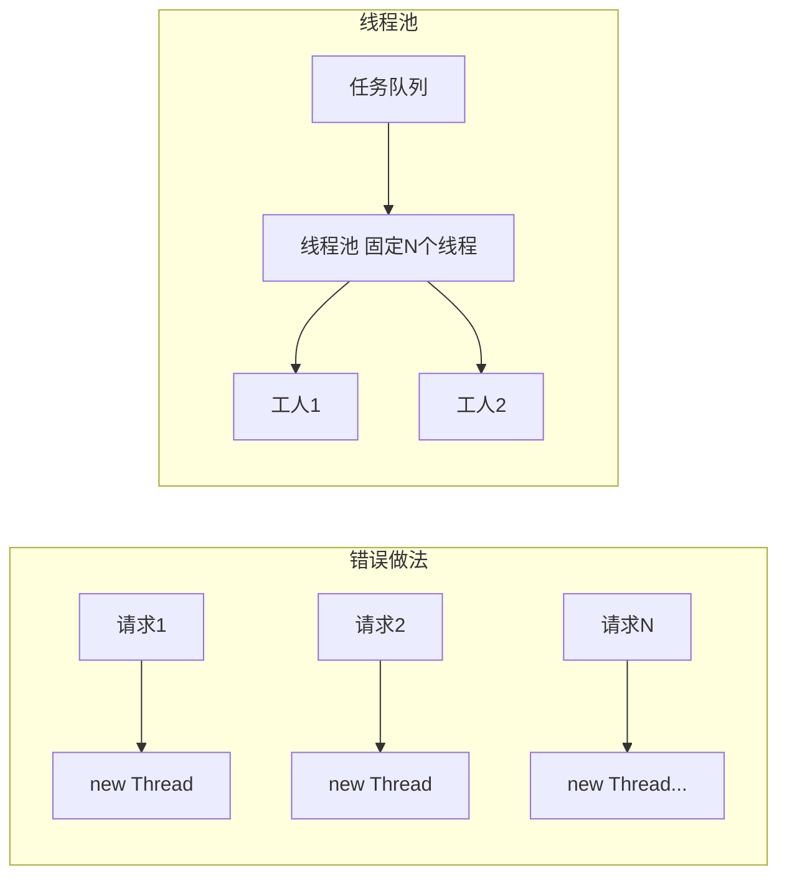

# Java 并发编程与 JVM

<!-- 修改说明: 新增本章与上一章的关系 -->

## 本章与上一章的关系

02 章你学了 `HashMap`、`ArrayList`——它们在线程安全上都有坑。真实后端里，Spring Boot 每个 HTTP 请求由一个线程处理，线程池异步发通知、定时任务也在跑，**多线程是默认场景**。

这一章帮你搞懂：为什么用线程池而不是 `new Thread`、synchronized 和 volatile 区别在哪、JVM 内存怎么划分、OOM 怎么排查。03 章和 04 章 Spring Boot 直接衔接——你会理解为什么 `@Service` 可以做成单例、为什么 ThreadLocal 在线程池里必须 `remove()`。

---

## 0. 读前导读（零基础也能跟上）

### 0.1 用一句话弄懂本章

后端服务不是一个人干活——**Tomcat 每个请求由一个线程（工人）处理**；多个工人同时改同一份数据会出乱子，需要 synchronized / 线程池 / 原子类来协调；**JVM（工厂）** 负责在堆上造对象、在栈上跑方法、用 GC 回收垃圾。

### 0.2 你需要提前知道什么（真不会就先跳到哪一章）

| 你已会 | 可以直接学本章 |
|--------|----------------|
| 02 章：`HashMap`、`ArrayList`、知道 HashMap 线程不安全 | ✅ 本章 |
| 01 章：类、方法、基本语法 | 建议先补 02 章再学 |
| 完全没学过多线程概念 | 先读 §0.1 和 §2，再往下 |

**关联章节**：02 章 HashMap 线程不安全 → 本章 §35 ConcurrentHashMap；04 章 Spring Boot 单例 Bean → 本章线程安全。

### 0.3 本章知识地图（学完后应能勾选全部 ☐→☑）

- ☐ 能区分进程和线程，理解「线程 = 工人」比喻
- ☐ 能说出线程安全问题的来源（共享变量 + 并发修改）
- ☐ 知道 `synchronized`、`volatile`、Lock 各自解决什么问题
- ☐ 会用 `ThreadPoolExecutor` 提交任务，说出七大参数
- ☐ 理解为什么用线程池而不是 `new Thread`
- ☐ 知道 ThreadLocal 用途及线程池里必须 `remove()`
- ☐ 能画 JVM 内存简图（堆、栈、方法区/元空间）
- ☐ 知道 Minor GC / Full GC 的基本含义
- ☐ 听说过双亲委派、CAS、死锁四要素
- ☐ 能用 `jstack` 排查死锁

### 0.4 建议学习时长与节奏

| 阶段 | 内容 | 建议时长 |
|------|------|----------|
| 第 1 天 | §2～§8 线程基础 + synchronized + 线程池 | 3 小时 |
| 第 2 天 | §9～§10 ThreadLocal + JVM 内存结构 | 2 小时 |
| 第 3 天 | §19～§38 原子类、死锁、ConcurrentHashMap | 2～3 小时 |
| 复盘 | 闭卷自测 + 费曼检验 + 跑 ThreadPoolDemo | 1 小时 |

**节奏建议**：ThreadPoolDemo 和 DeadlockDemo 必须在本地运行一遍；有条件练习 `jps` + `jstack`。

### 0.5 学完本章你能做什么（可验证的具体动作）

1. 写一个线程安全计数器（`AtomicInteger` 或 `synchronized`）
2. 用 `ThreadPoolExecutor` 提交 10 个任务并 `shutdown`
3. 画出 JVM 堆/栈/方法区简图并口述各自存什么
4. 解释「为什么 Spring `@Service` 单例在多线程下通常安全」（无共享可变状态）
5. 运行 DeadlockDemo，用 `jstack` 看到 `Found one Java-level deadlock`

---

## 1. 为什么一定要学这一份

后端岗位面试里，Java 并发和 JVM 几乎一定会问。

项目里虽然你不一定天天手写复杂并发框架，但这些问题经常出现：

- 为什么异步任务不能乱开线程
- 为什么要用线程池
- 为什么会有线程安全问题
- 为什么服务会内存溢出
- 为什么会频繁 Full GC

## 2. 进程和线程

### 2.1 进程

**进程（Process）**：操作系统分配资源的基本单位，一个运行中的程序实例。
**生活类比**：**一整座工厂**——有独立的地皮（内存空间）、水电（系统资源）；工厂倒闭不影响隔壁工厂。
**为什么重要**：理解「一个 Spring Boot 应用 = 一个 JVM 进程」；排查问题时 `jps` 列出的就是进程。
**本章用到的地方**：§2.1、§27 JVM 排查

进程可以理解为一个正在运行的程序实例。

### 2.2 线程

**线程（Thread）**：进程内的执行单元，共享进程资源，独立调度。
**生活类比**：**工人**——一个工厂（进程）里有多名工人同时干活；每个工人有自己的工作台（栈），但共用仓库（堆）；工人之间抢同一份物料就要排队（加锁）。
**为什么重要**：Spring Boot 每个 HTTP 请求由一个线程处理；异步任务、定时任务也跑在线程上。
**本章用到的地方**：§2、§4 线程安全、§8 线程池

线程是进程内部的执行单元。

一个 Java 服务通常是一个进程，里面会有多个线程，比如：

- 主线程
- GC 线程
- 业务线程
- 数据库连接线程

## 3. 线程的创建方式

### 3.1 继承 Thread

```java
class MyThread extends Thread {
    @Override
    public void run() {
        System.out.println("线程执行");
    }
}
```

### 3.2 实现 Runnable

```java
class MyTask implements Runnable {
    @Override
    public void run() {
        System.out.println("执行任务");
    }
}
```

### 3.3 实际开发更推荐什么

实际开发一般不推荐你频繁手动创建线程，而是优先用线程池。

## 4. 线程安全问题

多个线程同时修改共享变量，就可能出现线程安全问题。

```java
class Counter {
    int count = 0;

    public void add() {
        count++;
    }
}
```

如果很多线程同时执行 `count++`，最终结果可能不正确。

## 5. synchronized

**synchronized（内置锁）**：JVM 提供的互斥同步关键字，同一时刻只有一个线程进入临界区。
**生活类比**：**单人卫生间门锁**——一个人进去锁门，其他人必须在外面等；出来才轮到下一个。
**为什么重要**：保护共享变量（如 count++）的最简单手段；Spring 单例 Bean 内共享可变状态时需要考虑。
**本章用到的地方**：§5、§31 锁形态、§47 对比表

这是最基础的同步方式。

```java
class Counter {
    int count = 0;

    public synchronized void add() {
        count++;
    }
}
```

作用：

- 同一时刻只允许一个线程进入这段临界区代码

### 5.1 什么时候用

- 共享变量修改
- 简单同步控制

### 5.2 缺点

- 竞争激烈时可能影响性能

## 6. volatile

**volatile（可见性关键字）**：保证变量修改后立即刷新到主内存，其他线程读取时拿到最新值。
**生活类比**：**车间广播**——工人 A 改了开关状态，广播一响所有工人都看到最新状态；但不保证「读-改-写」一整条流水线不被打断。
**为什么重要**：适合 boolean 开关、状态标志；不能替代 synchronized 做复合运算。
**本章用到的地方**：§6、§32 三要素、§47 对比表

`volatile` 主要保证变量的可见性。

```java
class FlagDemo {
    volatile boolean running = true;
}
```

你现阶段先记住：

- 它能让一个线程修改后的值对其他线程立即可见
- 它不能保证复合操作的原子性

比如：

- `count++` 依然不是线程安全的

## 7. Lock

除了 `synchronized`，Java 还提供了更灵活的锁。

```java
import java.util.concurrent.locks.ReentrantLock;

ReentrantLock lock = new ReentrantLock();
lock.lock();
try {
    System.out.println("执行业务逻辑");
} finally {
    lock.unlock();
}
```

常见优点：

- 更灵活
- 可以手动控制加锁和释放
- 支持更多高级能力

## 8. 线程池

**线程池（Thread Pool）**：预先创建并复用一组工作线程，任务提交到队列由空闲线程执行。
**生活类比**：**固定编制的工人班组**——不是来一个活雇一个人，而是 5 个工人轮流从任务箱取活干；活太多先排队，队满按规则拒绝或 caller 自己干。
**为什么重要**：后端异步通知、并行查询、定时任务都依赖线程池；乱 new Thread 是线上 OOM 常见原因。
**本章用到的地方**：§8、§46 ThreadPoolDemo、§53.1 报错表

### 8.1 为什么不能乱创建线程

频繁创建和销毁线程有开销，而且线程太多会：

- 占用内存
- 增加上下文切换
- 影响系统稳定性

<!-- 修改说明: 补充为什么用线程池而不是 new Thread 的深入解释 -->

#### 为什么用线程池，而不是 new Thread？

**结论**：`new Thread()` 每次创建新线程有开销，无限创建会导致线程爆炸和 OOM；线程池复用线程、限制并发数、统一管理任务队列。

**底层原理**：

创建一个线程需要向 OS 申请栈空间（默认约 1MB）、内核态切换、JVM 线程对象初始化。如果每个异步任务都 `new Thread().start()`，1000 个并发请求就是 1000 个线程 ≈ 1GB 栈内存，加上上下文切换 CPU 飙高。线程池预先创建核心线程，任务提交到队列，线程复用执行多个任务，用完不销毁；队列满时按拒绝策略处理，系统可控。

**真实案例（模拟）**：

某接口每收到请求就 `new Thread` 发邮件，压测 500 并发时出现 `java.lang.OutOfMemoryError: unable to create new native thread`，服务僵死。改为固定大小线程池（核心 10、队列 200）后，邮件异步发送正常，峰值 CPU 从 95% 降到 40%。



---

### 8.2 什么是线程池

线程池提前创建好一批线程，任务来了就交给线程池执行。

### 8.3 基本用法

```java
import java.util.concurrent.ExecutorService;
import java.util.concurrent.Executors;

ExecutorService pool = Executors.newFixedThreadPool(5);
pool.submit(() -> System.out.println("执行异步任务"));
pool.shutdown();
```

### 8.4 更推荐的写法

面试里常说不要直接用 `Executors` 创建线程池，而是自己配置 `ThreadPoolExecutor`。

```java
import java.util.concurrent.*;

ThreadPoolExecutor executor = new ThreadPoolExecutor(
        2,
        4,
        60,
        TimeUnit.SECONDS,
        new ArrayBlockingQueue<>(100),
        Executors.defaultThreadFactory(),
        new ThreadPoolExecutor.AbortPolicy()
);
```

### 8.5 核心参数解释

- 核心线程数
- 最大线程数
- 空闲线程存活时间
- 阻塞队列
- 线程工厂
- 拒绝策略

### 8.6 拒绝策略

当线程池忙不过来时，常见处理方式有：

- 直接抛异常
- 让调用线程自己执行
- 丢弃任务

## 9. 并发工具类

### 9.1 CountDownLatch

**CountDownLatch（倒计时门闩）**：一个或多个线程等待其他线程完成指定次数的 countDown。
**生活类比**：**等齐 3 位同学到齐再发车**——主线程 await 阻塞，每个子任务完成 countDown 一次，减到 0 才继续。
**为什么重要**：单元测试等待异步完成、并行任务汇总、启动预热等多线程协调场景。
**本章用到的地方**：§9.1、§53 分级练习 PrintDemo

适合等待多个任务执行完成。

```java
import java.util.concurrent.CountDownLatch;

CountDownLatch latch = new CountDownLatch(2);
new Thread(() -> {
    System.out.println("任务1完成");
    latch.countDown();
}).start();

new Thread(() -> {
    System.out.println("任务2完成");
    latch.countDown();
}).start();

latch.await();
System.out.println("全部完成");
```

### 9.2 ThreadLocal

**ThreadLocal（线程本地变量）**：每个线程持有自己的变量副本，线程之间互不干扰。
**生活类比**：**每个工人的私人抽屉**——工人 A 的抽屉里放用户上下文，工人 B 看不到；换班（线程池复用）前必须清空抽屉。
**为什么重要**：保存请求级用户 ID、TraceId；在线程池环境必须 remove 否则脏数据和泄漏。
**本章用到的地方**：§9.2、§24 风险、§49 示例

每个线程保留自己的变量副本。

常见场景：

- 保存用户上下文
- 保存请求链路信息

注意：

- 用完要及时清理，尤其在线程池场景

## 10. JVM 内存结构

**JVM（Java Virtual Machine）**：运行 Java 字节码的虚拟机，管理内存、GC、类加载。
**生活类比**：**工厂**——堆是仓库（放对象），栈是工人工作台（放局部变量和方法调用），方法区/元空间是图纸库（放类定义）；GC 是清洁工定期回收没人用的货。
**为什么重要**：OOM、StackOverflow、内存泄漏排查都依赖这张图；面试几乎必问。
**本章用到的地方**：§10～§13、§51 速记图

你至少要建立这张图：

- 程序计数器
- 虚拟机栈
- 本地方法栈
- 堆
- 方法区

### 10.1 堆

对象大多数都在堆上分配。

### 10.2 栈

方法调用时的局部变量、方法参数等通常在栈帧中。

### 10.3 方法区

放类信息、常量等内容。

## 11. 对象的创建和回收

### 11.1 对象如何创建

当你执行 `new User()` 时，JVM 会：

1. 检查类是否加载
2. 在堆上分配内存
3. 初始化对象
4. 返回引用

### 11.2 垃圾回收基本认知

JVM 会自动回收不再被使用的对象。

核心问题是：

- 如何判断对象已经“没用了”

主流思路是：

- 可达性分析

## 12. 新生代和老年代

你可以先简单理解：

- 新生代：新创建对象主要在这里
- 老年代：生命周期更长的对象会进入这里

如果老年代压力太大，可能触发更重的 GC。

## 13. GC 基础

**GC（Garbage Collection，垃圾回收）**：JVM 自动识别并回收不再被引用的对象，释放堆内存。
**生活类比**：**工厂清洁工**——仓库（堆）里没人要的货（无引用对象）定期清走；清得太猛（Full GC）全厂要停工一阵。
**为什么重要**：内存泄漏、频繁 Full GC 导致接口卡顿，排查 OOM 必须理解 GC 基本概念。
**本章用到的地方**：§13～§14、§42 Full GC

### 13.1 Minor GC

通常发生在新生代。

### 13.2 Full GC

更重，通常影响更大。

面试里你要知道：

- Full GC 频繁通常不是好事

## 14. 类加载机制

类加载的大致过程：

1. 加载
2. 验证
3. 准备
4. 解析
5. 初始化

## 15. 双亲委派模型

你先记住它解决的问题：

- 避免类重复加载
- 保证核心类库安全

面试里常见问法：

- 什么是双亲委派
- 为什么要有双亲委派

## 16. 常见面试表达思路

### 16.1 线程池为什么重要

可以这样表达：

线程池通过复用线程减少频繁创建和销毁线程的开销，同时还能限制并发数量、统一管理异步任务，提高系统稳定性。

### 16.2 volatile 能保证什么

可以这样表达：

`volatile` 主要保证变量的可见性和一定程度上的有序性，但不能保证像 `count++` 这种复合操作的原子性。

### 16.3 JVM 为什么要分堆和栈

可以这样表达：

堆适合存放对象，便于统一回收；栈适合方法调用和局部变量管理，速度快、生命周期清晰。

## 17. 这一章的练习建议

建议你自己完成：

1. 写一个计数器线程安全 demo
2. 写一个线程池执行异步任务 demo
3. 写一个 `CountDownLatch` demo
4. 画一张 JVM 内存结构图
5. 总结 10 个并发和 JVM 基础题

## 18. 学完标准

如果你能做到下面这些，就说明这一章过关了：

- 能区分进程和线程
- 知道线程安全问题是怎么来的
- 知道 `synchronized`、`volatile`、线程池的作用
- 知道 JVM 内存结构的大图景
- 能说清 GC、类加载、双亲委派的基础含义

## 19. CAS

并发编程里经常会提到 CAS。

它可以理解为：

- 比较并交换

核心思想是：

1. 先读取一个旧值
2. 比较旧值有没有变化
3. 没变化就更新

很多原子类底层都和这个思路相关，比如：

- `AtomicInteger`

## 20. AtomicInteger

**AtomicInteger（原子整型）**：基于 CAS 的线程安全整型，自增等操作无需 synchronized。
**生活类比**：**带自动计数器的投票箱**——多人同时投票，内部机制保证每人只计一票、总数不错。
**为什么重要**：高并发计数器、限流器、PrintDemo 协调多线程打印顺序。
**本章用到的地方**：§20、§48 示例、§53 练习

```java
import java.util.concurrent.atomic.AtomicInteger;

AtomicInteger count = new AtomicInteger(0);
count.incrementAndGet();
System.out.println(count.get());
```

它适合：

- 简单计数
- 高并发场景下替代普通整型自增

## 21. 死锁

**死锁（Deadlock）**：两个及以上线程互相持有对方需要的锁，永久等待。
**生活类比**：**窄路会车**——A 占左半边等 B 退，B 占右半边等 A 退，谁也动不了。
**为什么重要**：线上「程序卡死无响应」的常见原因之一；`jstack` 可直接看到 deadlock 块。
**本章用到的地方**：§21、§50 四要素、§53 DeadlockDemo

死锁就是多个线程互相等待对方释放资源，结果谁都继续不下去。

### 常见示意

- 线程 A 持有锁 1，等待锁 2
- 线程 B 持有锁 2，等待锁 1

### 避免思路

- 固定加锁顺序
- 缩短持锁时间
- 尽量减少嵌套锁

## 22. ReentrantLock 和 synchronized 的区别

你面试时经常会被问到这个问题。

可以先这样回答：

- `synchronized` 使用更简单
- `ReentrantLock` 更灵活
- `ReentrantLock` 支持更丰富的锁控制能力

## 23. 线程池参数怎么理解更实际

### 核心线程数

默认长期保留的线程数量。

### 最大线程数

高峰时最多能扩到多少线程。

### 队列容量

新任务来不及执行时先排队。

### 拒绝策略

队列满、线程也满之后怎么办。

## 24. ThreadLocal 常见风险

`ThreadLocal` 很方便，但也有风险。

在使用线程池时，如果不及时清理：

- 旧数据可能污染下一个请求
- 还可能造成内存泄漏风险

所以一个常见原则是：

- 用完及时 `remove`

## 25. JVM 中的常见异常

### 25.1 StackOverflowError

通常和递归太深有关。

### 25.2 OutOfMemoryError

常见情况包括：

- 堆内存不够
- 元空间问题
- 直接内存问题

## 26. 什么时候会内存泄漏

Java 有 GC，但并不代表绝不会内存泄漏。

常见原因：

- 长生命周期对象持有短生命周期对象引用
- 集合不断放数据却不清理
- ThreadLocal 未清理
- 缓存设计不当

## 27. JVM 排查的基础思路

如果一个 Java 服务越来越慢或频繁异常，可以先想：

1. 是 CPU 高还是内存高
2. 是否频繁 GC
3. 是否线程阻塞
4. 是否有死循环或死锁

## 28. 这一章的进一步知识点清单

后面你还可以继续深入这些内容：

- AQS
- `ConcurrentHashMap`
- `ForkJoinPool`
- `CompletableFuture`
- G1 垃圾回收器
- JVM 参数调优
- 类加载器隔离

## 29. 线程的生命周期

Java 线程不是只有“运行”和“结束”两个状态。

你最好知道这些状态：

- `NEW`
- `RUNNABLE`
- `BLOCKED`
- `WAITING`
- `TIMED_WAITING`
- `TERMINATED`

### 怎么理解

- `NEW`：线程对象刚创建，还没 `start`
- `RUNNABLE`：可运行，可能正在运行，也可能等 CPU
- `BLOCKED`：在等锁
- `WAITING`：无限等待
- `TIMED_WAITING`：限时等待，比如 `sleep`
- `TERMINATED`：执行结束

面试里很可能会问：

- `sleep` 和 `wait` 的区别
- `BLOCKED` 和 `WAITING` 的区别

## 30. sleep、wait、join 的区别

### sleep

- `Thread` 的静态方法
- 让当前线程休眠一段时间
- 不会释放锁

### wait

- `Object` 的方法
- 必须在同步块里使用
- 会释放当前对象监视器

### join

- 让当前线程等待另一个线程执行完

```java
Thread t = new Thread(() -> {
    System.out.println("子线程执行");
});
t.start();
t.join();
System.out.println("主线程继续");
```

## 31. synchronized 锁的几种形态

### 31.1 修饰实例方法

锁的是当前对象。

```java
public synchronized void add() {
    count++;
}
```

### 31.2 修饰静态方法

锁的是类对象。

```java
public static synchronized void test() {
}
```

### 31.3 修饰代码块

可以更精准地控制锁范围。

```java
synchronized (this) {
    count++;
}
```

为什么要缩小锁范围：

- 减少无意义竞争
- 提升并发性能

## 32. 可见性、原子性、有序性

并发里很多问题可以归到这三个词。

### 可见性

一个线程修改了变量，另一个线程能不能及时看到。

### 原子性

一个操作会不会被打断。

### 有序性

程序执行顺序是否可能因为编译器或 CPU 优化而变化。

你现在可以先这样记：

- `volatile` 主要解决可见性和部分有序性
- `synchronized` 可以同时保障可见性和原子性

## 33. Java 内存模型 JMM 基础认知

JMM 不是 JVM 内存结构图，它更偏并发语义。

它解决的是：

- 多线程之间变量可见性
- 指令重排序
- 线程如何与主内存交互

你现在不必死磕完整定义，但要知道：

- 并发问题不是单纯“代码顺序执行”那么简单

## 34. happens-before 基础理解

这是并发底层规则里很重要的概念。

简单理解：

- 如果 A happens-before B，就说明 A 的结果对 B 可见，并且 A 的执行顺序先于 B

你不一定现在就背定义，但要知道它存在，是并发可见性分析的重要基础。

## 35. ConcurrentHashMap 基础认知

**ConcurrentHashMap（并发哈希映射）**：线程安全的 HashMap 替代，分段或 CAS 降低锁粒度。
**生活类比**：**分柜台的字典**——不是整个字典只允许一人查（Hashtable），而是多个柜台可同时查不同区域。
**为什么重要**：02 章 HashMap 线程不安全的直接解法；本地缓存、并发计数高频使用。
**本章用到的地方**：§35、§52 学完标准

并发场景里，普通 `HashMap` 可能出问题，所以常用：

- `ConcurrentHashMap`

它的核心价值：

- 支持更高并发下的安全访问
- 比 `Hashtable` 粗暴同步更高效

常见场景：

- 本地缓存
- 并发统计
- 多线程共享字典

## 36. CopyOnWriteArrayList 基础认知

这个集合适合：

- 读多写少

它的大致思路是：

- 写的时候复制一份数组

优点：

- 读线程几乎不受锁影响

缺点：

- 写开销大

## 37. 阻塞队列 BlockingQueue

并发编程和线程池里经常会碰到队列。

常见实现：

- `ArrayBlockingQueue`
- `LinkedBlockingQueue`

用途：

- 生产者消费者模型
- 线程池任务排队

## 38. Future 和 CompletableFuture

### Future

表示异步结果，但使用起来不够灵活。

### CompletableFuture

更现代，适合：

- 异步编排
- 多任务组合

示例：

```java
import java.util.concurrent.CompletableFuture;

CompletableFuture<String> future = CompletableFuture.supplyAsync(() -> "hello");
System.out.println(future.join());
```

你以后做：

- 异步查询组合
- 并行调用多个接口

会很常见。

## 39. 线程池参数怎么估

面试里如果被问“线程池参数怎么设置”，不要只背概念。

你可以从这些角度答：

- 任务是 CPU 密集还是 IO 密集
- 机器核心数多少
- 响应时间要求
- 队列能承受多少堆积
- 拒绝策略怎么选

一个常见基础思路：

- CPU 密集：线程数不要太多
- IO 密集：线程数可以适度多一些

## 40. Executors 为什么不推荐直接用

常见原因：

- 某些工厂方法可能创建无界队列
- 某些工厂方法可能创建过多线程
- 不利于精确控制资源

所以项目中更推荐：

- 显式使用 `ThreadPoolExecutor`

## 41. JVM 垃圾回收器基础认知

你至少应该认识这些名字：

- Serial
- Parallel
- CMS
- G1

当前阶段最重要的是知道：

- G1 在现代服务端场景里很常见
- 不同回收器关注点不同

## 42. Full GC 为什么危险

因为它通常比 Minor GC 更重，可能导致：

- 停顿时间更长
- 服务响应抖动

如果线上频繁 Full GC，通常意味着：

- 内存配置不合理
- 对象创建过多
- 内存泄漏

## 43. 常见 JVM 参数基础认知

你会逐渐看到这些参数：

- `-Xms`
- `-Xmx`
- `-Xmn`

简单理解：

- `-Xms`：初始堆大小
- `-Xmx`：最大堆大小
- `-Xmn`：新生代大小

现在不必追求调优高手级别，但要能认出来。

## 44. JVM 排查常见工具名

你后面可能会接触：

- `jps`
- `jstack`
- `jmap`
- `jstat`

你现在先知道它们大致对应：

- 看 Java 进程
- 看线程栈
- 看内存
- 看 GC 状态

## 45. 这一章的高频知识点总清单

建议你把下面这些都整理成自己的笔记：

- 进程和线程
- 线程创建方式
- 线程生命周期
- 线程安全问题
- `synchronized`
- `volatile`
- `Lock`
- 线程池
- CAS
- 原子类
- `ThreadLocal`
- 死锁
- JVM 内存结构
- 类加载
- 双亲委派
- GC
- Full GC 问题

---

## 46. 线程池完整示例（企业最常用）

### 46.1 手把手：运行 ThreadPoolDemo

| 步骤 | 你的动作 | 预期看到什么 | 若不对 |
|------|----------|--------------|--------|
| 1 | 新建 `ThreadPoolDemo.java`，复制下方代码 | 编译通过 | 检查 `import java.util.concurrent.*` |
| 2 | 运行 `main` | 控制台打印 10 行「pool-x-thread-y 执行任务 z」 | 若 0 输出，检查是否忘了 `execute` |
| 3 | 观察线程名 | 形如 `pool-1-thread-1` | 说明线程被复用，不是 10 个新线程 |
| 4 | 注释掉 `pool.shutdown()` 再运行 | JVM 可能不退出（线程池存活） | 生产环境必须 shutdown |
| 5 | 把队列改成 `new ArrayBlockingQueue<>(2)`，提交 20 任务 | 触发拒绝策略或 CallerRuns | 见 §53.1 报错表 |

```java
import java.util.concurrent.*;

public class ThreadPoolDemo {
    public static void main(String[] args) {
        ThreadPoolExecutor pool = new ThreadPoolExecutor(
            2,                      // 核心线程数
            5,                      // 最大线程数
            60, TimeUnit.SECONDS,   // 空闲线程存活时间
            new LinkedBlockingQueue<>(100),  // 任务队列
            new ThreadPoolExecutor.CallerRunsPolicy()  // 拒绝策略：调用者执行
        );

        for (int i = 0; i < 10; i++) {
            int taskId = i;
            pool.execute(() -> System.out.println(
                Thread.currentThread().getName() + " 执行任务 " + taskId));
        }
        pool.shutdown();
    }
}
```

**逐行读 `main` 方法**：

| 行号/代码 | 含义 | 改错会怎样 |
|-----------|------|------------|
| `new ThreadPoolExecutor(2, 5, 60, SECONDS, ...)` | 核心 2 线程，最多扩到 5，空闲 60s 回收 | 核心>最大会抛 IllegalArgumentException |
| `new LinkedBlockingQueue<>(100)` | 有界队列，最多排 100 个待执行任务 | 无界队列可能 OOM |
| `CallerRunsPolicy()` | 队列满时由调用者线程自己跑任务 | 换成 AbortPolicy 会直接抛异常 |
| `pool.execute(() -> ...)` | 提交任务到线程池 | 用 `submit` 可拿 Future 返回值 |
| `Thread.currentThread().getName()` | 打印当前执行线程名 | 可观察线程复用 |
| `pool.shutdown()` | 优雅关闭，不再接新任务 | 不调用则 JVM 可能挂起 |

### 七大参数记忆

| 参数 | 含义 |
|------|------|
| corePoolSize | 常驻工人数量 |
| maximumPoolSize | 最多工人 |
| keepAliveTime | 多余工人空闲多久解雇 |
| workQueue | 任务排队区 |
| threadFactory | 线程怎么创建 |
| handler | 队列满了怎么办 |

**面试**：「我们项目用线程池处理异步通知，核心线程数按 CPU 核数配置，队列用有界队列防 OOM。」

---

## 47. `synchronized` vs `Lock` vs `volatile`

| 机制 | 作用 | 场景 |
|------|------|------|
| `synchronized` | 互斥 + 可见性 | 方法/代码块加锁 |
| `ReentrantLock` | 可中断、可 tryLock、公平锁 | 需要灵活锁 |
| `volatile` | 保证可见性、禁止指令重排 | 状态标志位，不保证复合操作原子性 |

```java
// volatile 不能保证 count++ 原子性，仍需 synchronized 或 AtomicInteger
private volatile boolean running = true;  // 适合开关标志
```

---

## 48. 原子类示例

```java
AtomicInteger counter = new AtomicInteger(0);
counter.incrementAndGet();  // 线程安全自增

// CAS 思想：比较并交换，失败则重试
```

---

## 49. ThreadLocal 使用与泄漏提醒

```java
private static final ThreadLocal<UserContext> CTX = new ThreadLocal<>();

public static void set(UserContext user) { CTX.set(user); }
public static UserContext get() { return CTX.get(); }
public static void remove() { CTX.remove(); }  // 线程池场景必须 remove！
```

**泄漏原因**：线程池复用线程，上次请求的 ThreadLocal 没清，下次请求读到脏数据。

---

## 50. 死锁排查四要素（面试）

1. 互斥 2. 占有且等待 3. 不可剥夺 4. 循环等待

**避免**：固定加锁顺序；使用 `tryLock` 超时；锁粒度尽量小。

`jstack <pid>` 可看到 `Found one Java-level deadlock`。

---

## 51. JVM 内存结构速记图

```text
┌─────────────────────────────────────┐
│  堆 Heap（对象实例、数组）            │
│  ├─ 新生代 Eden + S0 + S1           │
│  └─ 老年代 Old                       │
├─────────────────────────────────────┤
│  栈 Stack（每线程：局部变量、方法帧）  │
├─────────────────────────────────────┤
│  方法区/元空间（类信息、常量）         │
└─────────────────────────────────────┘
```

**OOM 常见**：

- `Java heap space`：对象太多 / 泄漏
- `Metaspace`：类加载过多
- 栈溢出：递归太深

---

## 52. 学完标准

- 能创建线程并用线程池提交任务，说出核心参数含义
- 理解 `synchronized`、`volatile`、原子类适用场景
- 知道 ThreadLocal 用途与 `remove` 必要性
- 能画 JVM 内存简图，说出堆栈分工
- 听说过 GC、Full GC、jstack 排查

---

## 53. 分级练习

**基础**：用 3 个线程打印 1~100  
**进阶**：线程安全计数器（`AtomicInteger` vs `synchronized` 对比）  
**挑战**：模拟转账死锁，再用 `jstack` 或日志分析

<!-- 修改说明: 新增分级练习参考答案 -->

### 参考答案

#### 基础：3 个线程打印 1~100

```java
import java.util.concurrent.CountDownLatch;
import java.util.concurrent.ExecutorService;
import java.util.concurrent.Executors;
import java.util.concurrent.atomic.AtomicInteger;

public class PrintDemo {

    private static final AtomicInteger counter = new AtomicInteger(0);
    private static final int MAX = 100;
    private static final int THREAD_COUNT = 3;

    public static void main(String[] args) throws InterruptedException {
        ExecutorService pool = Executors.newFixedThreadPool(THREAD_COUNT);
        CountDownLatch latch = new CountDownLatch(THREAD_COUNT);

        for (int i = 0; i < THREAD_COUNT; i++) {
            pool.submit(() -> {
                try {
                    while (true) {
                        int num = counter.incrementAndGet();
                        if (num > MAX) break;
                        System.out.println(Thread.currentThread().getName() + " -> " + num);
                    }
                } finally {
                    latch.countDown();
                }
            });
        }
        latch.await();
        pool.shutdown();
    }
}
```

#### 进阶：AtomicInteger vs synchronized 计数

```java
import java.util.concurrent.atomic.AtomicInteger;

public class CounterCompare {

    private int syncCount = 0;
    private final AtomicInteger atomicCount = new AtomicInteger(0);

    public synchronized void syncIncrement() {
        syncCount++;
    }

    public void atomicIncrement() {
        atomicCount.incrementAndGet();
    }

    public static void main(String[] args) throws InterruptedException {
        CounterCompare c = new CounterCompare();
        Thread[] threads = new Thread[100];
        for (int i = 0; i < 100; i++) {
            threads[i] = new Thread(() -> {
                for (int j = 0; j < 1000; j++) {
                    c.syncIncrement();
                    c.atomicIncrement();
                }
            });
            threads[i].start();
        }
        for (Thread t : threads) t.join();
        System.out.println("synchronized: " + c.syncCount);   // 预期 100000
        System.out.println("AtomicInteger: " + c.atomicCount.get());  // 预期 100000
    }
}
```

**逐行读 `CounterCompare.main` 压测逻辑**：

| 行号/代码 | 含义 | 改错会怎样 |
|-----------|------|------------|
| `new Thread[100]` | 开 100 个线程并发压测 | 线程过多本地机器可能卡顿 |
| 每线程循环 1000 次 `syncIncrement` | synchronized 保护 count++ | 去掉 synchronized 结果小于 100000 |
| 每线程循环 1000 次 `atomicIncrement` | CAS 原子自增 | AtomicInteger 无需额外锁 |
| `t.join()` | 主线程等所有子线程结束 | 不 join 可能先打印错误结果 |
| 预期两者都 100000 | 验证两种同步方式正确 | 任一不对说明同步失效 |

#### 挑战：转账死锁 + jstack 排查

```java
public class DeadlockDemo {

    private static final Object lockA = new Object();
    private static final Object lockB = new Object();

    public static void main(String[] args) {
        Thread t1 = new Thread(() -> {
            synchronized (lockA) {
                sleep(100);
                synchronized (lockB) {
                    System.out.println("t1 完成");
                }
            }
        }, "Thread-1");

        Thread t2 = new Thread(() -> {
            synchronized (lockB) {
                sleep(100);
                synchronized (lockA) {
                    System.out.println("t2 完成");
                }
            }
        }, "Thread-2");

        t1.start();
        t2.start();
    }

    private static void sleep(long ms) {
        try { Thread.sleep(ms); } catch (InterruptedException e) { Thread.currentThread().interrupt(); }
    }
}
```

**jstack 排查步骤**：

```bash
# 1. 找到 Java 进程 PID（IDEA Run 窗口或任务管理器）
jps
# 预期输出：
# 12345 DeadlockDemo

# 2. 导出线程栈
jstack 12345
# 预期输出包含：
# Found one Java-level deadlock:
# ...
# Thread-1 waiting for lockB held by Thread-2
# Thread-2 waiting for lockA held by Thread-1
```

**修复**：统一加锁顺序——两个线程都先锁 A 再锁 B。

### 53.2 手把手：用 jstack 排查死锁

| 步骤 | 你的动作 | 预期看到什么 | 若不对 |
|------|----------|--------------|--------|
| 1 | 运行 `DeadlockDemo`，程序挂起无输出 | 控制台停住 | 若很快结束，加长 sleep 时间 |
| 2 | 另开终端执行 `jps` | 列出 `DeadlockDemo` 的 PID | 无 jps 则装 JDK 并配 PATH |
| 3 | `jstack <pid>` 导出线程栈 | 大量线程状态 | 替换为实际 PID |
| 4 | 搜索 `deadlock` 关键词 | `Found one Java-level deadlock` | 无则检查是否真的互锁 |
| 5 | 读 deadlock 段落 | Thread-1 等 lockB，Thread-2 等 lockA | 对照代码加锁顺序 |
| 6 | 改代码：两线程都先 synchronized(lockA) 再 lockB | 程序正常打印 t1/t2 完成 | 验证固定顺序可破死锁 |

---

<!-- 修改说明: 新增常见报错与排查 -->

## 53.1 常见报错与排查

| 报错信息（关键词） | 可能原因 | 解决方案 |
|-------------------|---------|---------|
| `RejectedExecutionException` | 线程池队列满且拒绝策略为 Abort | 增大队列/线程数；或换 CallerRunsPolicy |
| `OutOfMemoryError: unable to create new native thread` | 线程创建过多 | 改用线程池；限制并发 |
| `IllegalMonitorStateException` | 未持有锁就 `unlock()` | 检查 Lock 使用是否在 finally 中正确配对 |
| 程序卡住无输出 | 死锁 | `jstack <pid>` 查 deadlock |
| `Java heap space` | 堆内存不足 / 对象泄漏 | 增大 `-Xmx`；排查未释放的大集合 |
| ThreadLocal 读到脏数据 | 线程池复用线程未 `remove()` | `finally { threadLocal.remove(); }` |

---

## 54. FAQ

**Q1：并发要学到多深？**  
实习/初级：线程池 + `synchronized` + JVM 内存图 + ThreadLocal 风险；高级再深入 AQS、JUC 源码。

**Q2：为什么用线程池不用 new Thread？**  
复用线程降低创建销毁开销；限制最大线程数防 OOM；统一队列和拒绝策略，系统可控。

**Q3：`synchronized` 和 `ReentrantLock` 怎么选？**  
简单互斥用 `synchronized`；需要 tryLock、公平锁、可中断等待用 `ReentrantLock`。

**Q4：`volatile` 能保证 `count++` 线程安全吗？**  
不能。`count++` 是读-改-写三步，volatile 只保证可见性；用 `AtomicInteger` 或 synchronized。

**Q5：ThreadLocal 为什么在线程池里必须 remove？**  
线程池复用线程，上次请求的 ThreadLocal 没清会污染下次请求，还可能内存泄漏。

**Q6：堆和栈分别存什么？**  
堆：对象实例、数组；栈：局部变量、方法参数、方法调用帧（每线程独立）。

**Q7：Full GC 频繁说明什么？**  
老年代压力大——可能内存不够、对象创建过多、或内存泄漏；需看 GC 日志和堆 dump。

**Q8：什么是死锁？怎么避免？**  
多线程互相等对方锁；固定加锁顺序、缩短持锁时间、tryLock 超时。

**Q9：为什么 `@Service` 单例通常线程安全？**  
单例本身没问题；危险的是单例里有**共享可变成员变量**。无状态 Service（只注入依赖、方法用局部变量）通常安全。

**Q10：`sleep` 和 `wait` 区别？**  
`sleep` 是 Thread 静态方法，不释放锁；`wait` 是 Object 方法，需在 synchronized 块内，会释放监视器。

**Q11：CAS 是什么？**  
Compare-And-Swap：比较内存值与期望值，相等才更新；`AtomicInteger` 底层基于 CAS 重试。

**Q12：双亲委派是什么？**  
类加载先委派父加载器；保证 `java.lang.String` 等核心类不被应用类覆盖，保安全。

---

## 55. 闭卷自测

1. **概念** 进程和线程的区别？一个 Java 后端进程里通常有哪些线程？
2. **概念** 线程安全三要素（可见性、原子性、有序性）各指什么？
3. **概念** 线程池七大参数中，`corePoolSize` 和 `maximumPoolSize` 区别？
4. **概念** JVM 堆、栈、方法区/元空间各存什么？
5. **概念** Minor GC 和 Full GC 哪个影响更大？为什么？
6. **概念** 为什么 02 章说 HashMap 线程不安全？应换什么？
7. **动手** 写一行：`AtomicInteger count = new AtomicInteger(0);` 并自增 1。
8. **动手** 写出 ThreadPoolExecutor 构造器的前 5 个参数含义（中文即可）。
9. **综合** 接口每请求 new Thread 发邮件会有什么问题？如何改？
10. **综合** 用户上下文放 ThreadLocal，Filter 里 set、Controller 里 get，应在哪 remove？为什么？

### 55.1 自测参考答案

1. 进程是程序实例，线程是进程内执行单元；典型有 main、GC、Tomcat 业务线程、连接池线程等。
2. 可见性：一改他见；原子性：操作不可分割；有序性：指令重排不影响语义（需 happens-before 保障）。
3. core 是常驻线程数；maximum 是高峰最多扩到的线程数；任务多时先排队，队列满才扩到 max。
4. 堆：对象；栈：局部变量/方法帧；方法区/元空间：类元数据、常量等。
5. Full GC 更重，停顿更长，易导致接口 RT 抖动。
6. 多线程 put 可能丢数据/结构错乱；用 `ConcurrentHashMap` 或加锁。
7. `count.incrementAndGet();` 或 `count.addAndGet(1);`
8. 核心线程数、最大线程数、空闲存活时间、时间单位、任务队列。
9. 线程爆炸、native thread OOM、CPU 飙高；改用有界线程池 + 队列。
10. 在 Filter 的 `finally` 或拦截器 afterCompletion 里 `remove()`；线程池复用线程，否则脏数据和泄漏。

---

## 56. 费曼检验

请在不看资料的情况下，用 3 分钟向朋友解释本章核心。

**对照提纲**：

1. **工人比喻**：后端每个请求是一个工人（线程）在处理；多个工人同时改同一个计数器会乱，要加锁或用原子类。
2. **线程池比喻**：不要来一个任务雇一个工人（new Thread），而是固定一组工人轮流干活（线程池），任务多了先排队。
3. **工厂比喻**：JVM 工厂里，堆是仓库放对象，栈是工人工作台，GC 是清洁工；对象没人引用就被回收，堆满了就 OOM。

---

## 57. 本章核心速记卡

| 概念 | 一句话 | 类比 |
|------|--------|------|
| 线程 | 进程内执行单元 | 工人 |
| synchronized | 互斥锁 | 卫生间门锁 |
| volatile | 可见性，不保证复合原子 | 车间广播 |
| 线程池 | 复用固定数量线程 | 固定工人班组 |
| ThreadLocal | 每线程独立副本 | 私人抽屉 |
| JVM 堆 | 放对象 | 工厂仓库 |
| JVM 栈 | 放局部变量/方法帧 | 工人工作台 |
| ConcurrentHashMap | 线程安全 Map | 分柜台字典 |

**排查口诀**：卡死→jstack 看死锁；OOM heap→查泄漏/调 -Xmx；计数错→HashMap 换 ConcurrentHashMap 或加锁；ThreadLocal 脏数据→finally remove。

---

<!-- 修改说明: 新增下一章预告 -->

## 面试深挖补充：大厂常问的并发与 JVM 底层原理

前面 §1～§57 把并发和 JVM 的"广度"铺开了，但面试官真正深挖的是几个**底层原理**：锁为什么能既安全又快？线程池到底是什么顺序把任务塞进去？ConcurrentHashMap 到底怎么做到线程安全还快？GC 到底怎么停得又少又短？这一节把这些问题一次讲透，看完你能在面试白板上画出原理图。

> 这节不是新知识，而是给 §5/§19/§31/§35/§41/§15 等"基础认知"小节补上"底层为什么"。建议和前面相关小节对照着读。

### A. synchronized 的锁升级（面试超高频）

**一句话**：synchronized 不是一开始就"重"，JVM 会根据竞争程度把锁从**无锁 → 偏向锁 → 轻量级锁 → 重量级锁**逐级升级，能轻就轻，竞争激烈才上重型锁。

**为什么要有升级**：大多数 synchronized 代码块实际竞争很小甚至没有竞争（比如一个对象大部分时间只被一个线程访问）。如果每次都上重量级锁（操作系统互斥量、线程挂起），太浪费。于是 HotSpot 用对象头里的 **Mark Word** 记录当前锁状态，按需升级。

**四种状态（对象头 Mark Word 记录）**：

| 状态 | 适用场景 | 实现 | 性能 |
|------|----------|------|------|
| 无锁 | 刚 new 出来 | Mark Word 存对象 hashCode | - |
| 偏向锁 | 只有一个线程进入 | Mark Word 记录该线程 ID，下次该线程进入直接比对 ID 即可，几乎无开销 | 最高 |
| 轻量级锁 | 两个线程交替进入，无真正并发竞争 | 线程栈帧建 Lock Record，CAS 把 Mark Word 复制过去，自旋等待 | 中（自旋消耗 CPU） |
| 重量级锁 | 多线程真正并发竞争 | Mark Word 指向 monitor（ObjectMonitor），未抢到的线程挂起（park） | 低（线程阻塞、上下文切换） |

**升级过程**：
1. 线程 A 第一次进入同步块：对象从无锁→偏向锁，Mark Word 记下线程 A 的 ID。
2. 线程 B 也想进入：发现偏向的不是自己，触发**偏向锁撤销**，升级为轻量级锁，B 开始自旋（CAS）。
3. 自旋超过阈值（自适应自旋）还没拿到：升级为重量级锁，没抢到的线程进入 monitor 等待队列被挂起。

**注意只能升级、不能降级**（GC 时可能批量撤销偏向锁）。

**重要演进（面试加分点）**：
- 偏向锁在 **JDK 6** 引入，优化"单线程反复进入同步块"的场景。
- 但现代应用多线程竞争更普遍，偏向锁带来的"撤销/重偏向"开销反而成为负担。
- **JEP 374：JDK 15 起废弃偏向锁，JDK 18 移除**。所以新版本 synchronized 实际是"无锁 → 轻量级锁 → 重量级锁"三级。

**面试标准答法**：
> synchronized 利用对象头 Mark Word 实现锁升级：从偏向锁（单线程）→ 轻量级锁（自旋 CAS）→ 重量级锁（OS 互斥量）。JDK 6 引入偏向锁优化，但 JDK 15 起因维护成本和现代应用竞争更普遍而废弃，JDK 18 移除。竞争激烈时升级为重量级锁，线程挂起进入 monitor 等待队列。

---

### B. AQS：ReentrantLock/Semaphore/CountDownLatch 的共同底座

**一句话**：AQS（AbstractQueuedSynchronizer）是 J.U.C 大部分同步工具的底层框架——用一个 volatile int `state` 表示同步状态，用一个 CLH 变体的**双向等待队列**管理抢不到锁的线程。

**为什么面试爱问**：你用的 `ReentrantLock`、`Semaphore`、`CountDownLatch`、`ReentrantReadWriteLock`、`ThreadPoolExecutor` 里的 `Worker` 都是基于 AQS 实现的。理解 AQS，这些工具的原理就全通了。

**两个核心**：
1. **state（volatile int）**：不同子类赋予不同含义。
   - ReentrantLock：state 表示锁被重入了几次（0 未持有，2 重入了一次）。
   - Semaphore：state 表示剩余许可数。
   - CountDownLatch：state 表示还剩多少个计数。
2. **CLH 变体双向队列**：抢不到锁的线程被包装成 Node 入队，每个 Node 记录前驱/后继和等待状态。线程在前驱被释放后被唤醒。

**模板方法模式**：AQS 把"排队/阻塞/唤醒"这种通用逻辑固化在父类（`acquire`/`release`），把"怎么判断能拿到锁"留给子类实现（`tryAcquire`/`tryRelease`）。所以 ReentrantLock 的公平/非公平，差别只在 `tryAcquire` 里"要不要先检查队列有没有人"。

**ReentrantLock 非公平锁的 tryAcquire 大致流程**：
1. CAS 把 state 从 0 改成 1；成功则把当前线程设为持有者，返回 true。
2. 若 state≠0 但持有者就是自己：state+1（重入），返回 true。
3. 否则返回 false，AQS 框架会把这个线程入队、挂起。

**公平锁的区别**：第 1 步前先 `hasQueuedPredecessors()` 检查队列里有没有人在等，有就不抢，老老实实排队。

**非公平为什么更常见**：线程刚醒来还要走"入队→挂起→被唤醒"的话开销大；非公平允许新来的线程直接 CAS 抢一次，抢到了就省去排队开销，吞吐量更高。代价是队列里的线程可能"饿死"（但实际很难持续饿死）。

**面试标准答法**：
> AQS 用 volatile int state 表示同步状态、CLH 变体双向队列管理等待线程，采用模板方法：acquire/release 负责排队和阻塞，tryAcquire/tryRelease 由子类定义获取规则。ReentrantLock 的 state 是重入次数，Semaphore 是许可数，CountDownLatch 是计数。公平与非公平的区别就在 tryAcquire 是否先检查队列。

---

### C. 线程池执行流程的精确时序（面试易错点）

**一句话**：任务到来后，线程池的顺序是**核心线程 → 队列 → 非核心线程 → 拒绝策略**，**不是**"核心 → 非核心 → 队列"。这个顺序面试经常考，很多人答反。

**精确流程（`ThreadPoolExecutor.execute`）**：
1. 若当前线程数 < `corePoolSize`：直接创建一个**核心线程**跑这个任务。
2. 若达到 corePoolSize：把任务丢进**工作队列**（`workQueue`）。
3. 若队列满了（是有界队列才会满）：才创建**非核心线程**，直到 `maximumPoolSize`。
4. 若已达 maximumPoolSize 且队列也满：触发**拒绝策略**（`RejectedExecutionHandler`）。

**为什么是这个顺序（设计哲学）**：核心线程是常驻保底的"基本盘"；队列是缓冲峰值压力的"蓄水池"，比创建销毁线程便宜；非核心线程是压力超过蓄水池容量后才开的"救火队"；都扛不住就拒绝，保护系统不被拖垮。所以**队列优先于非核心线程**，符合"用便宜的资源优先"原则。

**这个顺序导致的两个面试坑**：
- `Executors.newFixedThreadPool`：core=max=固定值，队列是**无界** `LinkedBlockingQueue`——队列永远不会满，所以**永远不创建非核心线程，也永远不触发拒绝策略**，OOM 风险来自队列堆积。
- `Executors.newCachedThreadPool`：core=0，队列是**不存元素的** `SynchronousQueue`——任务一来直接进第 3 步创非核心线程，max=Integer.MAX_VALUE，**线程数可能爆**，OOM 风险来自线程过多。

这正是 §40 "Executors 为什么不推荐直接用"的底层原因：两种 OOM 风险都来自这个执行顺序 + 无界配置的组合。

**面试标准答法**：
> 任务先由核心线程处理；核心满则入队列；队列满才创建非核心线程到 max；max 满则拒绝。所以队列优先于非核心线程。newFixedThreadPool 用无界队列，积压任务导致 OOM；newCachedThreadPool 用 SynchronousQueue 不存元素、max 为 Integer.MAX_VALUE，线程数失控导致 OOM。生产用 ThreadPoolExecutor 显式指定有界队列和拒绝策略。

---

### D. CAS 的 ABA 问题与版本号解法

**一句话**：CAS 只比"值是不是还是 A"，但如果值从 A→B→A，CAS 会以为没变过、操作成功，这在带语义的场景（比如栈、账户）可能出错。解法是加版本号，变成"值+版本"一起 CAS。

**ABA 是怎么发生的**：
1. 线程 1 读到值 A，准备 CAS(A→C)。
2. 线程 2 把值改成 B，又改回 A。
3. 线程 1 的 CAS 比较：还是 A？是。改成 C，成功。
4. 但中间其实发生过 A→B→A 的变化，线程 1 完全没察觉。

**为什么大多数计数器场景不在乎**：`AtomicInteger` 做计数，只关心"当前值是多少"，中间被改过又改回无所谓。但在**链表/栈**这种"指针被改但改回原值"会破坏结构的场景，ABA 会造成严重 bug（比如无锁栈的 pop 操作，A 节点被弹出又压回，CAS 还以为栈顶没变，结果操作到已经被改的结构上）。

**解法**：`AtomicStampedReference`——给值配一个 stamp（版本号），每次更新 stamp+1，CAS 时同时比较值和 stamp。`AtomicMarkableReference` 是简化版（boolean 标记）。

**面试标准答法**：
> CAS 的 ABA 问题指值从 A→B→A 时 CAS 仍判定未变。计数器场景一般无影响，但链表/栈等结构会出错。J.U.C 提供 AtomicStampedReference 用版本号配合值一起 CAS 来解决，AtomicMarkableReference 用布尔标记是简化版。

---

### E. ConcurrentHashMap：JDK 7 vs JDK 8 实现差异（高频）

**一句话**：JDK 7 用**分段锁**（Segment，每个段一把 ReentrantLock），JDK 8 改成**数组 + CAS + synchronized 锁单个桶头** + 链表/红黑树，锁粒度更细、并发度更高。

**JDK 7 实现（Segment 分段锁）**：
- 顶层是 `Segment[]`（默认 16 段），每个 Segment 是一个小的 HashMap（`HashEntry[]`），并继承 ReentrantLock。
- put 时先定位 Segment，再对该 Segment 加锁，只锁一个段，其它段可并发。
- 并发度 = Segment 数量（默认 16），扩容是每个 Segment 内部独立扩。
- 缺点：段是预先固定的，并发度不可动态扩展；Segment 本身有额外内存开销。

**JDK 8 实现（桶级锁 + CAS + 红黑树）**：
- 抛弃 Segment，顶层是 `Node[]`（懒初始化，第一次 put 才建数组）。
- put 时：
  1. 桶为空：用 **CAS** 直接放入，无锁。
  2. 桶非空：用 **synchronized 锁住桶头节点**，往链表/树里加。锁粒度从"段"细化到"桶"，并发度等于桶数。
  3. 链表长度 ≥ 8 且数组长度 ≥ 64：链表转**红黑树**（退化阈值 6），把最坏 O(n) 查找降到 O(log n)。
- size 用 `LongAdder` 思想：用 baseCount + 多个 CounterCell 分散计数，减少计数竞争。
- 扩容支持**多线程协助迁移**：每个线程认领一段区间迁移桶，迁移完用 ForwardingNode 标记。

**为什么 JDK 8 这么改**：
1. 锁粒度从段（16）降到桶（成千上万），并发度大幅提升。
2. 去掉 Segment 层，内存更省。
3. CAS 处理空桶，无竞争时完全无锁。
4. 红黑树解决哈希冲突严重时退化为长链表的性能问题。

**面试常追问**：
- "为什么不用 ReentrantLock 而用 synchronized？"——JDK 6 后 synchronized 经过锁升级优化，在锁单个节点这种场景性能足够，且 synchronized 是 JVM 内置的，内存占用比 ReentrantLock 小（每个 Node 不用额外持有一个 AQS 对象）。
- "size 为什么不准？"——size 是估算值（baseCount + CounterCell 求和），并发下统计瞬间可能不一致，但够用。需要精确用 `mappingCount()`。

**面试标准答法**：
> JDK 7 的 ConcurrentHashMap 用 Segment 分段锁（默认 16 段，每段一把 ReentrantLock），并发度受段数限制。JDK 8 抛弃 Segment，改成 Node 数组 + CAS（空桶无锁）+ synchronized 锁桶头，锁粒度细化到桶，链表长度≥8 且数组≥64 转红黑树。size 用 LongAdder 思想分散计数。这样并发度更高、内存更省、冲突时性能更好。

---

### F. G1 与 ZGC：现代 GC 回收器原理与选型

**一句话**：G1 把堆切成大小相等的 Region，按"垃圾最多"的 Region 优先回收（Garbage First），把停顿控制在目标内；ZGC 用染色指针 + 读屏障做到**并发整理、停顿 <10ms**，适合超大堆低延迟场景。

**G1 关键设计**：
- **Region 分区**：堆被切成 1～32MB 的 Region（2 的幂），每个 Region 动态充当 Eden / Survivor / Old / **Humongous**（大对象，占多个连续 Region）。
- **停顿预测模型**：用户设 `-XX:MaxGCPauseMillis=200`，G1 根据历史每个 Region 回收耗时预测，挑选能在目标时间内回收的 Region 集合（CSet），优先回收垃圾最多的——这就是 "Garbage First"。
- **Remembered Set（RSet）**：每个 Region 记录"谁引用了我"，避免全堆扫描就能找到跨 Region 引用。
- **GC 类型**：Young GC（只回收年轻代 Region，会 Stop The World）、Mixed GC（年轻代 + 部分老年代 Region，G1 主要回收动作）、Full GC（兜底，单线程串行，要尽量避免，出现通常意味着回收跟不上分配）。
- **触发 Full GC 的常见原因**：Mixed GC 跟不上、大对象分配过多撑爆、晋升失败、内存泄漏。

**G1 vs CMS**：CMS 用标记-清除会产生碎片，G1 用复制/整理无碎片且停顿可控。JDK 9 起 G1 成为默认回收器，CMS 在 JDK 9 废弃、JDK 14 移除。

**ZGC 关键设计（JDK 11 实验、JDK 15 产品级、JDK 16 并发栈扫描）**：
- **染色指针（Colored Pointers）**：在 64 位指针的高位塞入 GC 元信息（Marked0/Marked1/Remapped/Finalizable），用指针本身记录对象状态，无需额外内存。
- **读屏障（Load Barrier）**：线程从堆读引用时，JVM 插入一段代码检查指针颜色，若对象在迁移中则修正指针。这让**对象整理可以和应用线程并发进行**——这是 ZGC 停顿极低的根本。
- **停顿 <10ms 且不随堆增大而增长**：8MB～16TB 堆都基本恒定。
- 适合：超大堆 + 对延迟极敏感（金融交易、实时服务）。代价：吞吐量略低于 G1、CPU 开销略大。

**选型速查**：

| 场景 | 推荐 | 理由 |
|------|------|------|
| 通用服务端、堆 <8G | G1 | JDK 9+ 默认，停顿可控，调优简单 |
| 超大堆（数十 G～TB）、低延迟敏感 | ZGC | 停顿 <10ms 不随堆增长 |
| 极致吞吐、能接受较长停顿 | Parallel | 关注吞吐不关注延迟的批处理 |
| 老项目兼容 | 视情况 | CMS 已移除 |

**面试标准答法**：
> G1 把堆切成 Region，按垃圾最多优先回收（Garbage First），用 MaxGCPauseMillis 控停顿、RSet 避免全堆扫，JDK 9 起为默认。ZGC 用染色指针在 64 位指针高位存 GC 状态、读屏障在并发整理时修正指针，做到停顿 <10ms 且不随堆增大而增长，适合超大堆低延迟场景。CMS 因碎片和并发标记问题已废弃。

---

### G. 打破双亲委派：SPI、Tomcat 与热部署

**一句话**：双亲委派模型规定"先委派父加载器加载，父加载不到才自己加载"，保证了核心类安全和唯一；但 JDBC、Tomcat 这类场景**必须**打破它，方法是用"线程上下文类加载器"或"自定义类加载器先加载"。

**双亲委派的标准流程**：类加载请求来到 ClassLoader A，A 不自己加载，先 `parent.loadClass()` 一路向上到 BootstrapClassLoader；父加载器都加载不了，A 才自己 `findClass` 加载。

**为什么默认要委派**：
- 安全：防止用户写一个 `java.lang.String` 替换核心类（Bootstrap 加载核心 String，用户写的根本轮不到加载）。
- 唯一：同一个类只会被加载一次（同一个 ClassLoader + 同一类名 = 同一个 Class）。

**为什么有时必须打破**：

**场景 1：SPI（JDBC DriverManager）**
- 接口 `java.sql.Driver` 在 JDK 核心（BootstrapClassLoader 加载）。
- 实现 `com.mysql.cj.jdbc.Driver` 在用户 classpath（ApplicationClassLoader 加载）。
- 核心类加载器看不见用户 classpath 的类（父加载器看不到子加载器的类）。
- 解法：`DriverManager` 用 **线程上下文类加载器**（Thread Context ClassLoader，默认是 ApplicationClassLoader）去 `Class.forName` 加载实现——这是父加载器"借"子加载器的能力，打破委派。

**场景 2：Tomcat（每个 webapp 独立类隔离）**
- 一个 Tomcat 跑多个 webapp，两个 webapp 都用了不同版本的 Spring，必须隔离。
- Tomcat 的 `WebappClassLoader` **先自己找**（webapp 的 WEB-INF/classes、WEB-INF/lib），找不到再委派父——和标准委派**顺序反过来**。
- 这样 webapp 内的类优先用自己的，互不污染。只有 `java.*` 等 JDK 核心仍委派 Bootstrap（不能让用户覆盖）。

**场景 3：热部署 / OSGi**
- 修改类后想不重启就生效，靠自定义 ClassLoader 重新加载新版本类——同一个类被不同 ClassLoader 加载就是不同 Class 对象，所以"新旧两个版本"可以并存。OSGi 用网状类加载模型实现模块热替换。

**面试标准答法**：
> 双亲委派要求先委派父加载器，保证核心类安全和唯一。但 SPI 场景（JDBC Driver 接口在核心、实现在 classpath）父加载器看不到子加载器的类，DriverManager 用线程上下文类加载器反向加载实现来打破。Tomcat 用 WebappClassLoader 先自己加载再委派父，实现 webapp 隔离。热部署/OSGi 用自定义 ClassLoader 重新加载实现类替换。打破的本质都是"让父加载器能用到子加载器"或"子优先于父"。

---

### H. 这几个深挖点的关联

把这些点串起来看：
- **A 锁升级 + B AQS**：synchronized 走 JVM 内置锁升级，J.U.C 走 AQS——两条路殊途同归，都是"减少阻塞、按竞争程度调节开销"。
- **C 线程池时序 + D CAS ABA**：线程池用 Worker（AQS）控制线程状态，CAS 保证任务入队/出队原子性；ABA 提醒你 CAS 不是万能。
- **E CHM + A 锁升级**：CHM 在 JDK 8 用 synchronized 锁桶头，正是因为锁升级让 synchronized 在低竞争桶上很轻量。
- **F G1/ZGC + §42 Full GC 危险**：理解 G1 Mixed GC 跟不上会退化成 Full GC，才能解释"为什么频繁 Full GC 危险"。
- **G 打破双亲委派 + §15 双亲委派**：先理解委派的好处，再理解为什么某些场景必须打破，才算完整掌握类加载。

---

### I. 面试自检（这节看完应能答）

- [ ] synchronized 锁升级四态？为什么 JDK 15 废弃偏向锁？
- [ ] AQS 的 state 和 CLH 队列分别管什么？ReentrantLock 公平/非公平差在哪？
- [ ] 线程池执行顺序是 core→queue→max→reject 还是 core→max→queue→reject？为什么？
- [ ] CAS 的 ABA 怎么产生？哪个类解决它？
- [ ] ConcurrentHashMap JDK 7 和 8 实现差在哪？为什么用 synchronized 而不是 ReentrantLock？
- [ ] G1 的 Region 和 Garbage First 是什么意思？ZGC 凭什么停顿 <10ms？
- [ ] 举两个打破双亲委派的例子，分别怎么打破的？

---

## 下一章预告

这一章你理解了多线程、线程池和 JVM 内存——知道后端服务不是单线程跑的。接下来要进入真正的 **Web 后端开发** 了。

下一章（04 Spring Boot 核心开发）会用 Spring Boot 帮你快速搭 HTTP 服务：写 Controller 接请求、Service 写业务、统一返回 JSON。Tomcat 内嵌、依赖注入、参数校验都打包好了——你 01～03 学的 Java 基础，终于要用来写对外接口了。

---

*下一章：04 Spring Boot 核心开发*
