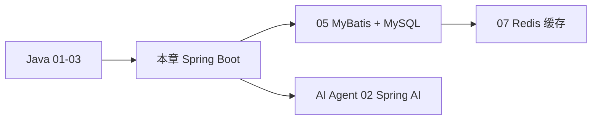
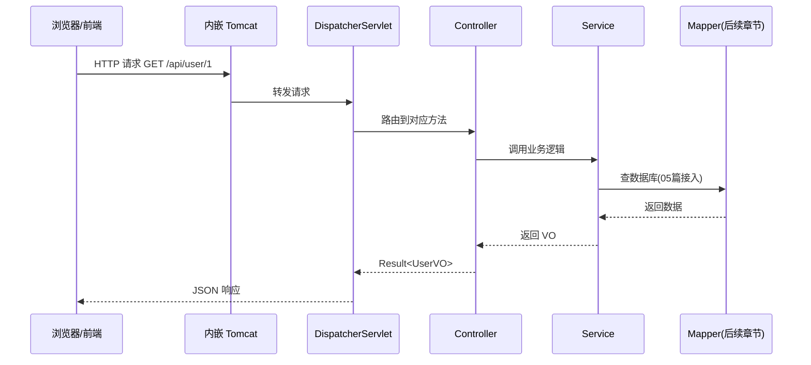
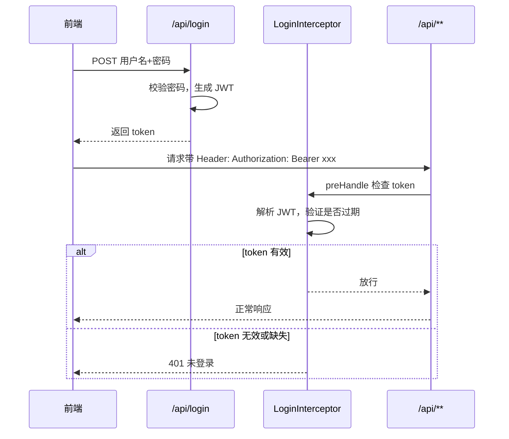

# Spring Boot 核心开发

<!-- 修改说明: 2026-06-30 按 EXPANSION-STANDARD 扩充读前导读、FAQ、自测、费曼检验 -->

## 0. 读前导读（零基础也能跟上）

> **读者假设**：你已学完 Java 01（语法与面向对象）、02（集合与泛型）、03（并发与 JVM），**还没写过 Web 后端**。本章从「写 main 方法」过渡到「对外提供 HTTP 接口」。

### 0.1 用一句话弄懂本章

**一句话**：Spring Boot 帮你把 Tomcat、依赖管理、配置都打包好，你按 **Controller → Service → Mapper** 三层分工写业务，浏览器或前端就能通过 URL 调你的 Java 代码。

**生活类比——餐厅分工（Spring MVC）**：

| 角色 | 代码层 | 餐厅里干什么 |
|------|--------|--------------|
| **顾客** | 浏览器 / 前端 App | 点菜、等上菜 |
| **服务员** | **Controller** | 接单、报菜名、把菜端给顾客；**不写菜怎么做** |
| **厨师** | **Service** | 按菜谱加工、算价格、校验库存；**核心业务在这里** |
| **库房管理员** | **Mapper**（05 章接入） | 去仓库（MySQL）取原料、登记出入库 |
| **传菜窗口** | **DispatcherServlet** | 把顾客点的菜分给对应服务员（路由） |
| **统一餐盘样式** | **Result\<T\>** | 每道菜都用同一种盘子装，前端好辨认 |

顾客（前端）只跟服务员（Controller）说话；服务员把订单交给厨师（Service）；厨师需要数据时喊库房（Mapper）去仓库（MySQL）拿。——这就是后端最常用的 **分层架构**。

**为什么重要**：真实公司项目几乎都是这种结构；面试必问「各层职责」；后面 MyBatis、Redis、MQ 都挂在这套骨架上。

**本章用到的地方**：§2.1 手把手 demo、§3～§7 接口与校验、§56 启动流程。

---

### 0.2 你需要提前知道什么（真不会就先跳到哪一章）

| 你现在的水平 | 建议动作 |
|--------------|----------|
| 不会 Java 基础语法 | 先学 [01 Java 基础语法与面向对象](./01-Java基础语法与面向对象.md) |
| 不会 List、Map、泛型 | 先学 [02 常用类集合与泛型](./02-Java常用类集合与泛型.md) |
| 不懂线程、不知道 JVM 是啥 | 先学 [03 并发与 JVM](./03-Java并发编程与JVM.md) 前半（接口与类够用即可） |
| 已会 01～03，想写接口 | **从本章 §2.1 手把手跟做** |
| 已跑通 demo，想接数据库 | 学完本章后接 [05 MyBatis](./05-MyBatis事务与接口工程化.md) |

**最低门槛**：会用 IDEA 打开项目；知道 `public class`、方法、对象；能复制粘贴运行；知道 HTTP 就是「浏览器访问一个网址」。

---

### 0.3 本章知识地图（学完后应能勾选全部 ☐→☑）

- [ ] 用「餐厅分工」口述 Controller / Service / Mapper 各干什么
- [ ] 在 IDEA 用 Spring Initializr 创建 JDK 17 项目并启动成功
- [ ] 写出带 `@RestController` + `@GetMapping` 的接口并在浏览器看到 JSON
- [ ] 区分 `@RequestParam`、`@PathVariable`、`@RequestBody` 三种入参
- [ ] 用 `@Valid` + `@NotBlank` 做参数校验，失败时返回统一错误信息
- [ ] 实现 `Result<T>` 统一返回 + `@RestControllerAdvice` 全局异常处理
- [ ] 用**构造器注入**把 Service 注入 Controller（不用字段 `@Autowired`）
- [ ] 读懂 Spring MVC 请求从 Tomcat 到 Controller 的流程图
- [ ] 配置 `application.yml` 改端口、会用多环境 profile
- [ ] 能口述 Spring Boot 启动的 7 个关键步骤
- [ ] 完成用户 CRUD 接口（增删查 + 校验 + 统一返回）
- [ ] 闭卷自测 10 题正确 ≥ 8 题

---

### 0.4 建议学习时长与节奏

| 阶段 | 建议时间 | 做什么 |
|------|----------|--------|
| 通读 §0 + 本章关系 + MVC 图 | 30 分钟 | 建立餐厅分工心智模型 |
| 跟做 §2.1 手把手 | 2～3 小时 | 从零建 demo，**每步都启动验证** |
| 精读 §3～§10 | 2 小时 | 注解、校验、统一返回、依赖注入 |
| 进阶 §22～§34、§56～§57 | 1～2 小时 | 配置、Bean、启动原理、多环境 |
| 自测 + FAQ + 费曼 | 45 分钟 | 闭卷自测 + 向朋友口述 3 分钟 |

**节奏建议**：不要一次看完 58 节。跑通 §2.1 demo 后再往后翻；每学 3 个新注解就写一个小接口验证。

---

### 0.5 学完本章你能做什么（可验证的具体动作）

1. **创建** `demo` 项目，`mvn spring-boot:run` 或 IDEA 启动，控制台出现 `Started DemoApplication`。
2. **调用** `curl http://localhost:8080/api/users` 得到 `{"code":0,...}` 格式 JSON。
3. **提交** 空用户名 POST，得到 `{"code":1,"message":"用户名不能为空"}`。
4. **画出** 从浏览器到 Controller 到 Service 的请求链路（可对照 § 开头 Mermaid 图）。
5. **解释** 为什么业务逻辑写在 Service 而不是 Controller（换服务员不影响菜谱）。
6. **切换** `spring.profiles.active` 在 dev/prod 配置间切换端口或日志级别。

---

### 0.6 本章注解首次出现速查（生活类比版）

> 下面按 **§2.1 手把手** 里第一次出现的顺序排列。后面章节再遇到时，回查本表即可。

| 注解 | 一句话 | 生活类比 |
|------|--------|----------|
| **@SpringBootApplication** | 标记启动类，一键开启 Spring Boot + 自动配置 + 组件扫描 | 餐厅开业按钮：通电、招人、开门营业 |
| **@RestController** | 标记「对外接 HTTP 请求」的类，返回值自动变 JSON | 前台服务员站位牌：「这里接单」 |
| **@RequestMapping("/api/users")** | 给整个 Controller 加 URL 前缀 | 服务员负责「/users 这一桌区」 |
| **@GetMapping** | 处理 HTTP GET（查询） | 顾客说「我看看菜单」 |
| **@PostMapping** | 处理 HTTP POST（新增） | 顾客说「我要下单」 |
| **@DeleteMapping** | 处理 HTTP DELETE（删除） | 顾客说「这道菜退掉」 |
| **@PathVariable** | 从 URL 路径里取参数，如 `/users/{id}` 的 `id` | 桌号牌上的数字「3 号桌」 |
| **@RequestBody** | 从请求体 JSON 解析成 Java 对象 | 顾客写在订单纸上的明细 |
| **@RequestParam** | 从 URL 查询串取参数，如 `?page=1` | 顾客口头补充「少辣」 |
| **@Valid** | 触发 DTO 上的校验规则 | 服务员检查订单是否漏填手机号 |
| **@NotBlank** | 字符串不能为 null 且不能全是空格 | 「姓名」一栏不能空着 |
| **@Min** | 数字不能小于指定值 | 年龄不能填 0 岁 |
| **@Service** | 标记业务逻辑层，交给 Spring 容器管理 | 厨师岗位编制 |
| **@RestControllerAdvice** | 全局异常处理，统一捕获所有 Controller 抛出的错 | 餐厅经理：任何桌出纠纷都来我这处理 |
| **@ExceptionHandler** | 指定处理哪一类异常 | 经理的「退换菜流程」「投诉流程」分工 |
| **@Autowired**（构造器） | 让 Spring 自动把依赖对象传进来 | 新服务员上岗时餐厅自动分配对应厨师 |

**术语（依赖注入 Dependency Injection）**：你不用 `new UserService()`，Spring 容器在启动时创建好对象并「注入」到 Controller 构造函数。
**生活类比**：餐厅排班系统自动把今晚的厨师派给对应档口，不用服务员自己去人才市场招聘。
**为什么重要**：解耦、方便单元测试、统一管理对象生命周期。
**本章用到的地方**：§2.1 第七～八步、§7。

---

### 0.7 学习路径示意



---

## 本章与上一章的关系

上一章（03）你学的是 Java 并发和 JVM——线程池、锁、内存模型这些，都是**在 JVM 里跑 Java 代码**时要懂的基础。但真实后端工作不是写 `main` 方法就完事了：你要对外提供 HTTP 接口，让前端或 App 来调用。

这一章就是转折点：**从"写 Java 程序"进入"写 Web 后端服务"**。Spring Boot 帮你把 Tomcat、依赖注入、配置这些脏活累活都打包好了，你只需要专注写 Controller、Service 和业务逻辑。学完这章，你就能启动一个项目、写 REST 接口、做参数校验和统一返回——这是后面接 MyBatis、MySQL、Redis 的前置条件。

### Spring MVC 请求处理流程

下面这张图帮你建立整体认知：浏览器发一个请求，在 Spring Boot 里大致会走这条链路。



---

## 1. Spring Boot 到底是干什么的

Spring Boot 是用来快速搭建 Java Web 应用的框架。

它帮你解决了这些事情：

- 项目依赖管理
- Web 服务启动
- 自动配置
- 常见组件整合

你不用从零拼一套复杂的 Spring 配置，而是能更快开始写业务代码。

## 2. 一个 Spring Boot 项目最基础的结构

通常会有这些包：

- `controller`
- `service`
- `mapper`
- `entity`
- `dto`
- `vo`
- `common`

### 各层职责

#### controller

接收请求、返回响应。

#### service

写业务逻辑。

#### mapper

负责数据库访问。

#### entity

通常对应数据库表结构。

#### dto

接收入参或传输数据。

#### vo

返回给前端的数据对象。

---

<!-- 修改说明: 新增完整可运行示例项目（手把手实操） -->

## 2.1 手把手：从零创建第一个 Spring Boot 项目

光看书里的代码片段不够，下面是一套**完整能跑起来**的示例。照着做，30 分钟内你就能在浏览器里看到 JSON 响应。

### 总览步骤表

| 步骤 | 你的动作 | 预期看到什么 | 若不对 |
|------|----------|--------------|--------|
| 1 | IDEA 用 Spring Initializr 建项目，勾选 Web + Validation | 右下角 Maven 下载完成，无红错 | 检查 JDK 是否 17+；换国内 Maven 镜像 |
| 2 | 创建 controller/service/dto/vo/common 包 | 项目树与下方目录结构一致 | 右键包 → New → Package |
| 3 | 确认 `pom.xml` 含 web、validation 依赖 | `mvn dependency:tree` 无报错 | 对照 § 第三步 XML |
| 4 | 新建 `Result.java` 统一返回 | 编译通过 | 检查包名 `com.example.demo.common` |
| 5 | 新建 `UserDTO`、`UserVO` | 编译通过 | DTO 带校验注解，VO 只用于返回 |
| 6 | 新建 `UserService`（内存 List） | `@Service` 无波浪线 | 确认类上有 `@Service` |
| 7 | 新建 `UserController` | 构造器注入 `UserService` | 不要 `new UserService()` |
| 8 | 新建 `GlobalExceptionHandler` | 编译通过 | 类上 `@RestControllerAdvice` |
| 9 | 配置 `application.yml` 端口 8080 | 文件在 `resources/` 下 | 缩进用空格，不要用 Tab |
| 10 | 运行 `DemoApplication` | 控制台 `Started DemoApplication` | 见下方 FAQ Q3 端口占用 |
| 11 | curl POST 新增用户 | `{"code":0,"data":{"id":1,...}}` | 检查 URL、Content-Type、JSON 格式 |
| 12 | curl GET 查询 + 空名校验 | 查到用户；空名返回 code=1 | 对照 § 第十二步预期输出 |

### 第一步：在 IDEA 里创建项目

1. 打开 IDEA → **File → New → Project**
2. 左侧选 **Spring Initializr**，JDK 选 **17**（或 21）
3. 点 Next，Group 填 `com.example`，Artifact 填 `demo`，Package name 保持 `com.example.demo`
4. 再点 Next，Dependencies 勾选：
   - **Spring Web**
   - **Validation**
   - **Lombok**（可选，后面代码会用到）
5. 点 Create，等 Maven 下载依赖（右下角进度条跑完）

> 如果你更习惯命令行，也可以去 [start.spring.io](https://start.spring.io) 生成项目 zip，解压后用 IDEA 打开。

### 第二步：确认项目目录结构

创建完成后，你的项目应该长这样：

```text
demo/
├── pom.xml
└── src/
    ├── main/
    │   ├── java/com/example/demo/
    │   │   ├── DemoApplication.java          ← 启动类
    │   │   ├── controller/
    │   │   │   └── UserController.java
    │   │   ├── service/
    │   │   │   └── UserService.java
    │   │   ├── dto/
    │   │   │   └── UserDTO.java
    │   │   ├── vo/
    │   │   │   └── UserVO.java
    │   │   └── common/
    │   │       ├── Result.java
    │   │       └── GlobalExceptionHandler.java
    │   └── resources/
    │       └── application.yml
    └── test/
        └── java/com/example/demo/
            └── DemoApplicationTests.java
```

在 IDEA 里：右键 `com.example.demo` 包 → **New → Package**，依次创建 `controller`、`service`、`dto`、`vo`、`common` 包。

### 第三步：完整的 pom.xml

IDEA 自动生成的大差不差，确认包含这些依赖即可：

```xml
<?xml version="1.0" encoding="UTF-8"?>
<project xmlns="http://maven.apache.org/POM/4.0.0"
         xmlns:xsi="http://www.w3.org/2001/XMLSchema-instance"
         xsi:schemaLocation="http://maven.apache.org/POM/4.0.0 https://maven.apache.org/xsd/maven-4.0.0.xsd">
    <modelVersion>4.0.0</modelVersion>

    <parent>
        <groupId>org.springframework.boot</groupId>
        <artifactId>spring-boot-starter-parent</artifactId>
        <version>3.2.5</version>
        <relativePath/>
    </parent>

    <groupId>com.example</groupId>
    <artifactId>demo</artifactId>
    <version>0.0.1-SNAPSHOT</version>
    <name>demo</name>

    <properties>
        <java.version>17</java.version>
    </properties>

    <dependencies>
        <dependency>
            <groupId>org.springframework.boot</groupId>
            <artifactId>spring-boot-starter-web</artifactId>
        </dependency>
        <dependency>
            <groupId>org.springframework.boot</groupId>
            <artifactId>spring-boot-starter-validation</artifactId>
        </dependency>
        <dependency>
            <groupId>org.projectlombok</groupId>
            <artifactId>lombok</artifactId>
            <optional>true</optional>
        </dependency>
        <dependency>
            <groupId>org.springframework.boot</groupId>
            <artifactId>spring-boot-starter-test</artifactId>
            <scope>test</scope>
        </dependency>
    </dependencies>

    <build>
        <plugins>
            <plugin>
                <groupId>org.springframework.boot</groupId>
                <artifactId>spring-boot-maven-plugin</artifactId>
            </plugin>
        </plugins>
    </build>
</project>
```

### 第四步：启动类（IDEA 已自动生成）

```java
package com.example.demo;

import org.springframework.boot.SpringApplication;
import org.springframework.boot.autoconfigure.SpringBootApplication;

@SpringBootApplication
public class DemoApplication {
    public static void main(String[] args) {
        SpringApplication.run(DemoApplication.class, args);
    }
}
```

**启动类逐行读**：

| 行号/代码 | 含义 | 改错会怎样 |
|-----------|------|------------|
| `@SpringBootApplication` | 组合注解：配置 + 自动装配 + 扫描本包及子包 | 贴错类上则组件扫不到 |
| `SpringApplication.run(...)` | 启动内嵌 Tomcat、刷新 Spring 容器 | 类名写错则扫描范围错误 |
| `main(String[] args)` | JVM 入口，与 01 章相同 | 无 main 无法运行 |

### 第五步：统一返回结构 Result.java

在 `common` 包下新建 `Result.java`：

```java
package com.example.demo.common;

public class Result<T> {
    private Integer code;
    private String message;
    private T data;

    public static <T> Result<T> success(T data) {
        Result<T> r = new Result<>();
        r.code = 0;
        r.message = "success";
        r.data = data;
        return r;
    }

    public static <T> Result<T> fail(String message) {
        Result<T> r = new Result<>();
        r.code = 1;
        r.message = message;
        return r;
    }

    public Integer getCode() { return code; }
    public String getMessage() { return message; }
    public T getData() { return data; }
}
```

### 第六步：DTO 和 VO

`dto/UserDTO.java`：

```java
package com.example.demo.dto;

import jakarta.validation.constraints.Min;
import jakarta.validation.constraints.NotBlank;

public class UserDTO {
    @NotBlank(message = "用户名不能为空")
    private String name;

    @Min(value = 1, message = "年龄必须大于0")
    private Integer age;

    public String getName() { return name; }
    public void setName(String name) { this.name = name; }
    public Integer getAge() { return age; }
    public void setAge(Integer age) { this.age = age; }
}
```

`vo/UserVO.java`：

```java
package com.example.demo.vo;

public class UserVO {
    private Long id;
    private String name;
    private Integer age;

    public UserVO() {}
    public UserVO(Long id, String name, Integer age) {
        this.id = id;
        this.name = name;
        this.age = age;
    }

    public Long getId() { return id; }
    public void setId(Long id) { this.id = id; }
    public String getName() { return name; }
    public void setName(String name) { this.name = name; }
    public Integer getAge() { return age; }
    public void setAge(Integer age) { this.age = age; }
}
```

### 第七步：Service 层（先用内存 List 模拟数据库）

`service/UserService.java`：

```java
package com.example.demo.service;

import com.example.demo.dto.UserDTO;
import com.example.demo.vo.UserVO;
import org.springframework.stereotype.Service;

import java.util.ArrayList;
import java.util.List;
import java.util.concurrent.atomic.AtomicLong;

@Service
public class UserService {

    private final List<UserVO> users = new ArrayList<>();
    private final AtomicLong idGenerator = new AtomicLong(1);

    public UserVO create(UserDTO dto) {
        UserVO vo = new UserVO(idGenerator.getAndIncrement(), dto.getName(), dto.getAge());
        users.add(vo);
        return vo;
    }

    public UserVO findById(Long id) {
        return users.stream()
                .filter(u -> u.getId().equals(id))
                .findFirst()
                .orElse(null);
    }

    public List<UserVO> findAll() {
        return new ArrayList<>(users);
    }

    public boolean deleteById(Long id) {
        return users.removeIf(u -> u.getId().equals(id));
    }
}
```

### 第八步：Controller 层

`controller/UserController.java`：

```java
package com.example.demo.controller;

import com.example.demo.common.Result;
import com.example.demo.dto.UserDTO;
import com.example.demo.service.UserService;
import com.example.demo.vo.UserVO;
import jakarta.validation.Valid;
import org.springframework.web.bind.annotation.*;

import java.util.List;

@RestController
@RequestMapping("/api/users")
public class UserController {

    private final UserService userService;

    public UserController(UserService userService) {
        this.userService = userService;
    }

    @PostMapping
    public Result<UserVO> create(@Valid @RequestBody UserDTO dto) {
        return Result.success(userService.create(dto));
    }

    @GetMapping("/{id}")
    public Result<UserVO> getById(@PathVariable Long id) {
        UserVO vo = userService.findById(id);
        if (vo == null) {
            return Result.fail("用户不存在");
        }
        return Result.success(vo);
    }

    @GetMapping
    public Result<List<UserVO>> list() {
        return Result.success(userService.findAll());
    }

    @DeleteMapping("/{id}")
    public Result<String> delete(@PathVariable Long id) {
        boolean ok = userService.deleteById(id);
        return ok ? Result.success("删除成功") : Result.fail("用户不存在");
    }
}
```

**UserController 逐行读**（>10 行示例对照 EXPANSION-STANDARD）：

| 行号/代码 | 含义 | 改错会怎样 |
|-----------|------|------------|
| `@RestController` | 声明这是返回 JSON 的 HTTP 入口类 | 写成普通 class，Spring 不路由请求 |
| `@RequestMapping("/api/users")` | 本类所有接口 URL 前缀 | 漏写则路径变成根路径，易与其它接口冲突 |
| `private final UserService userService` | 依赖的业务层，final 构造器注入 | 若 `new UserService()`，Spring 事务等能力失效 |
| `UserController(UserService userService)` | 构造器注入，启动时 Spring 自动传入 | 无参构造 + 字段注入，不利于测试 |
| `@PostMapping` | HTTP POST，用于创建资源 | 用 GET 创建违反 REST 语义且不安全 |
| `@Valid @RequestBody UserDTO dto` | 从 JSON 体解析并触发校验 | 漏 `@Valid` 则空名也能入库 |
| `@GetMapping("/{id}")` | GET + 路径变量 id | 写成 `@RequestParam` 则 URL 形态不对 |
| `@PathVariable Long id` | 绑定 `/api/users/1` 中的 `1` | 类型不匹配抛 400 |
| `Result.fail("用户不存在")` | 业务失败仍 HTTP 200，靠 code 区分 | 直接抛异常未处理则返回 500 堆栈 |

### 第九步：全局异常处理

`common/GlobalExceptionHandler.java`：

```java
package com.example.demo.common;

import org.springframework.web.bind.MethodArgumentNotValidException;
import org.springframework.web.bind.annotation.ExceptionHandler;
import org.springframework.web.bind.annotation.RestControllerAdvice;

@RestControllerAdvice
public class GlobalExceptionHandler {

    @ExceptionHandler(MethodArgumentNotValidException.class)
    public Result<String> handleValidException(MethodArgumentNotValidException e) {
        String msg = e.getBindingResult().getFieldError().getDefaultMessage();
        return Result.fail(msg);
    }

    @ExceptionHandler(Exception.class)
    public Result<String> handleException(Exception e) {
        return Result.fail("系统异常：" + e.getMessage());
    }
}
```

**GlobalExceptionHandler 逐行读**：

| 行号/代码 | 含义 | 改错会怎样 |
|-----------|------|------------|
| `@RestControllerAdvice` | 全局拦截所有 `@RestController` 抛出的异常 | 漏写则校验失败返回默认 400 HTML |
| `@ExceptionHandler(MethodArgumentNotValidException.class)` | 专门处理 `@Valid` 校验失败 | 捕获类型不对则进不了此方法 |
| `getFieldError().getDefaultMessage()` | 取第一条字段错误，如「用户名不能为空」 | 多字段错误时只返回第一个 |
| `@ExceptionHandler(Exception.class)` | 兜底其它未预料异常 | 生产环境应避免把堆栈直接给前端 |

### 第十步：配置文件

`resources/application.yml`：

```yaml
server:
  port: 8080

spring:
  application:
    name: demo
```

### 第十一步：运行项目

1. 找到 `DemoApplication.java`
2. 右键 → **Run 'DemoApplication'**（或点左侧绿色三角）
3. 控制台出现以下内容，说明启动成功：

```bash
# 预期输出（关键行）：
  .   ____          _            __ _ _
 /\\ / ___'_ __ _ _(_)_ __  __ _ \ \ \ \
( ( )\___ | '_ | '_| | '_ \/ _` | \ \ \ \
 \\/  ___)| |_)| | | | | || (_| |  ) ) ) )
  '  |____| .__|_| |_|_| |_\__, | / / / /
 =========|_|==============|___/=/_/_/_/
 :: Spring Boot ::                (v3.2.5)

...
Started DemoApplication in 2.xxx seconds (process running for 3.xxx)
```

### 第十二步：用浏览器或 curl 测试

**新增用户**：

```bash
curl -X POST http://localhost:8080/api/users \
  -H "Content-Type: application/json" \
  -d "{\"name\":\"张三\",\"age\":20}"
# 预期输出：
# {"code":0,"message":"success","data":{"id":1,"name":"张三","age":20}}
```

**查询用户**：

```bash
curl http://localhost:8080/api/users/1
# 预期输出：
# {"code":0,"message":"success","data":{"id":1,"name":"张三","age":20}}
```

**参数校验失败**（用户名为空）：

```bash
curl -X POST http://localhost:8080/api/users \
  -H "Content-Type: application/json" \
  -d "{\"name\":\"\",\"age\":20}"
# 预期输出：
# {"code":1,"message":"用户名不能为空","data":null}
```

到这里，你已经完成了一个**分层清晰、能增删查**的 Spring Boot 小项目。05 篇会把这个项目接上 MySQL，把内存 List 换成真正的数据库。

---

## 3. 第一个接口

```java
import org.springframework.web.bind.annotation.GetMapping;
import org.springframework.web.bind.annotation.RestController;

@RestController
public class HelloController {

    @GetMapping("/hello")
    public String hello() {
        return "hello spring boot";
    }
}
```

### 代码解释

- `@RestController`：表示这是一个返回 JSON 或文本的控制器
- `@GetMapping("/hello")`：表示 GET 请求访问 `/hello`

## 4. 常见请求方式

### 4.1 GET

适合查数据。

### 4.2 POST

适合新增或复杂提交。

### 4.3 PUT

适合更新。

### 4.4 DELETE

适合删除。

## 5. 参数接收

### 5.1 接收普通参数

```java
@GetMapping("/user")
public String getUser(@RequestParam Long id) {
    return "user id = " + id;
}
```

### 5.2 接收路径参数

```java
@GetMapping("/user/{id}")
public String getUserById(@PathVariable Long id) {
    return "user id = " + id;
}
```

### 5.3 接收 JSON 请求体

```java
@PostMapping("/user")
public String addUser(@RequestBody UserDTO dto) {
    return dto.getName();
}
```

```java
public class UserDTO {
    private String name;
    private Integer age;

    public String getName() {
        return name;
    }

    public void setName(String name) {
        this.name = name;
    }

    public Integer getAge() {
        return age;
    }

    public void setAge(Integer age) {
        this.age = age;
    }
}
```

## 6. 统一返回结构

真实项目里，不建议接口有的返回字符串、有的返回对象、有的返回数组，最好统一。

```java
public class Result<T> {
    private Integer code;
    private String message;
    private T data;

    public static <T> Result<T> success(T data) {
        Result<T> r = new Result<>();
        r.code = 0;
        r.message = "success";
        r.data = data;
        return r;
    }

    public static <T> Result<T> fail(String message) {
        Result<T> r = new Result<>();
        r.code = 1;
        r.message = message;
        return r;
    }

    public Integer getCode() {
        return code;
    }

    public String getMessage() {
        return message;
    }

    public T getData() {
        return data;
    }
}
```

接口里：

```java
@GetMapping("/user/{id}")
public Result<UserVO> getUser(@PathVariable Long id) {
    UserVO vo = new UserVO();
    return Result.success(vo);
}
```

## 7. 依赖注入

Spring 最重要的思想之一就是把对象交给容器管理。

```java
import org.springframework.stereotype.Service;

@Service
public class UserService {
    public String findNameById(Long id) {
        return "张三";
    }
}
```

```java
import org.springframework.web.bind.annotation.*;

@RestController
public class UserController {

    private final UserService userService;

    public UserController(UserService userService) {
        this.userService = userService;
    }

    @GetMapping("/name/{id}")
    public String getName(@PathVariable Long id) {
        return userService.findNameById(id);
    }
}
```

为什么推荐构造器注入：

- 更清晰
- 更利于测试
- 更容易发现依赖问题

## 8. 配置文件

Spring Boot 常用 `application.yml`。

```yaml
server:
  port: 8080

spring:
  datasource:
    url: jdbc:mysql://localhost:3306/study_db?useUnicode=true&characterEncoding=utf8&serverTimezone=Asia/Shanghai
    username: root
    password: 123456
```

## 9. 参数校验

接口入参不能全靠前端保证，后端必须校验。

```java
import jakarta.validation.constraints.Min;
import jakarta.validation.constraints.NotBlank;

public class RegisterDTO {
    @NotBlank(message = "用户名不能为空")
    private String username;

    @Min(value = 18, message = "年龄不能小于18")
    private Integer age;

    public String getUsername() {
        return username;
    }

    public void setUsername(String username) {
        this.username = username;
    }

    public Integer getAge() {
        return age;
    }

    public void setAge(Integer age) {
        this.age = age;
    }
}
```

```java
@PostMapping("/register")
public Result<String> register(@Valid @RequestBody RegisterDTO dto) {
    return Result.success("注册成功");
}
```

## 10. 全局异常处理

不要每个接口都自己 `try-catch` 一遍。

```java
import org.springframework.web.bind.MethodArgumentNotValidException;
import org.springframework.web.bind.annotation.ExceptionHandler;
import org.springframework.web.bind.annotation.RestControllerAdvice;

@RestControllerAdvice
public class GlobalExceptionHandler {

    @ExceptionHandler(MethodArgumentNotValidException.class)
    public Result<String> handleValidException(MethodArgumentNotValidException e) {
        String msg = e.getBindingResult().getFieldError().getDefaultMessage();
        return Result.fail(msg);
    }

    @ExceptionHandler(Exception.class)
    public Result<String> handleException(Exception e) {
        return Result.fail("系统异常：" + e.getMessage());
    }
}
```

## 11. 日志

不要在项目里到处写 `System.out.println`。

应该使用日志框架：

```java
import lombok.extern.slf4j.Slf4j;
import org.springframework.web.bind.annotation.GetMapping;
import org.springframework.web.bind.annotation.RestController;

@Slf4j
@RestController
public class LogController {

    @GetMapping("/log")
    public String logDemo() {
        log.info("进入 logDemo");
        return "ok";
    }
}
```

常见日志级别：

- `debug`
- `info`
- `warn`
- `error`

## 12. 登录接口的基本写法思路

一个最基本的登录流程大致是：

1. 接收用户名密码
2. 校验参数
3. 查询数据库
4. 比较密码
5. 登录成功后生成 token
6. 返回给前端

你后面学 JWT 时会更完整。

## 13. 分页接口的思路

后端常见需求不是“查全部”，而是“分页查”。

```java
@GetMapping("/users")
public Result<List<UserVO>> pageUsers(
        @RequestParam Integer pageNum,
        @RequestParam Integer pageSize) {
    return Result.success(List.of());
}
```

后面结合 MyBatis 和 MySQL 时，要真正让分页落地。

## 14. 文件上传基础

很多项目会有图片上传、头像上传。

```java
import org.springframework.web.bind.annotation.*;
import org.springframework.web.multipart.MultipartFile;

@PostMapping("/upload")
public Result<String> upload(@RequestParam("file") MultipartFile file) {
    String fileName = file.getOriginalFilename();
    return Result.success(fileName);
}
```

## 15. 常见开发规范

### 15.1 controller 不写复杂业务

业务逻辑尽量放到 `service`。

### 15.2 不要直接把数据库实体原样返回前端

应该组装成 `VO`。

### 15.3 接口要做参数校验

不要信任外部输入。

### 15.4 要有统一异常处理

这样代码更整洁。

## 16. 一套简单的模块示例

比如用户模块：

- `UserController`
- `UserService`
- `UserMapper`
- `User`
- `UserDTO`
- `UserVO`

这套结构非常常见，你后面做项目会反复遇到。

## 17. 这一章的练习建议

建议你自己做：

1. 写一个 `hello` 接口
2. 写一个新增用户接口
3. 写一个查询用户详情接口
4. 加统一返回结构
5. 加参数校验
6. 加全局异常处理
7. 加日志

## 18. 学完标准

如果你能做到这些，就说明你已经进入可做项目的阶段：

- 能启动一个 Spring Boot 项目
- 能写基础接口
- 能接收入参并返回 JSON
- 能做参数校验和异常处理
- 知道项目基本分层该怎么写

## 19. IOC 的更细理解

IOC 可以理解为：

- 对象不再由你自己到处 `new`
- 而是交给 Spring 容器统一管理

它带来的好处：

- 解耦
- 更好测试
- 更方便扩展

## 20. AOP 的典型场景

AOP 不只是面试概念，在项目里很常见。

常见用途：

- 打日志
- 权限校验
- 事务控制
- 接口耗时统计

你现在至少要知道：

- AOP 是把横切逻辑从业务逻辑里抽出来

## 21. Bean 的生命周期基础认知

一个 Bean 大致会经历：

1. 实例化
2. 属性注入
3. 初始化
4. 使用
5. 销毁

你现在不必深挖源码，但要知道 Spring 管理对象不是“凭空生效”的。

## 22. 配置注入

除了在 `application.yml` 里写配置，你还要知道怎么读取。

### 22.1 `@Value`

```java
@Value("${server.port}")
private String port;
```

### 22.2 `@ConfigurationProperties`

适合读取一组配置。

```java
@ConfigurationProperties(prefix = "user")
public class UserProperties {
    private String defaultName;
}
```

## 23. 多环境配置

真实项目通常会有：

- 开发环境
- 测试环境
- 生产环境

Spring Boot 里常用：

- `application-dev.yml`
- `application-test.yml`
- `application-prod.yml`

这能帮助你避免把所有环境配置写死在一起。

## 24. 过滤器、拦截器、AOP 的区别

这是后端面试中很常见的比较题。

### 过滤器 Filter

更靠近 Servlet 层。

### 拦截器 Interceptor

更常用于 Spring MVC 请求拦截。

### AOP

更适合在方法层做横切逻辑。

## 25. 拦截器基础示例

```java
import org.springframework.stereotype.Component;
import org.springframework.web.servlet.HandlerInterceptor;

import jakarta.servlet.http.HttpServletRequest;
import jakarta.servlet.http.HttpServletResponse;

@Component
public class LoginInterceptor implements HandlerInterceptor {
    @Override
    public boolean preHandle(HttpServletRequest request, HttpServletResponse response, Object handler) {
        return true;
    }
}
```

适用场景：

- 登录校验
- token 检查
- 请求日志

## 26. 跨域基础认知

当前后端分离时，经常会遇到跨域问题。

你要知道：

- 这不是 Spring Boot 独有问题
- 本质和浏览器安全策略有关

常见处理方式：

- `@CrossOrigin`
- 全局跨域配置
- Nginx 代理转发

## 27. 自动配置的基础认知

Spring Boot 最大的便利之一就是自动配置。

你现在先这样理解：

- 你引入某些 starter
- Spring Boot 会按条件帮你准备常见 Bean

这就是为什么它比传统 Spring 更省配置。

## 28. 常用 starter

你后面会经常看到这些依赖：

- `spring-boot-starter-web`
- `spring-boot-starter-validation`
- `spring-boot-starter-test`
- `mybatis-spring-boot-starter`
- `spring-boot-starter-data-redis`

## 29. API 文档工具基础认知

项目开发时很常见的工具有：

- Swagger
- Knife4j

价值：

- 自动生成接口文档
- 方便前后端联调

## 30. Spring Boot 这一章的进阶知识点

后面你还可以继续学习：

- 自定义注解
- 自定义 starter
- 条件装配
- 事件机制
- 异步任务
- 定时任务

## 31. Spring MVC 请求处理流程

你最好知道一个请求进来后大致会经历什么。本章开头的 Mermaid 时序图就是完整版，这里再用文字过一遍：

1. 请求进入内嵌 Tomcat
2. `DispatcherServlet` 接收并转发
3. 根据 URL 和方法找到对应的 Controller 方法
4. 解析参数（`@RequestParam`、`@PathVariable`、`@RequestBody`）
5. 调用 Service 执行业务
6. 返回结果，Jackson 自动序列化成 JSON

这会帮助你理解：

- 为什么参数能自动绑定
- 为什么异常能统一处理
- 为什么拦截器能生效

## 32. `@Controller` 和 `@RestController`

### `@Controller`

更适合传统页面返回。

### `@RestController`

本质上相当于：

- `@Controller` + `@ResponseBody`

它更适合后端接口开发。

## 33. 常见注解梳理

你后面会不断看到这些注解：

- `@Component`
- `@Service`
- `@Repository`
- `@RestController`
- `@Configuration`
- `@Bean`

### 怎么理解

- `@Component`：最通用组件
- `@Service`：业务层
- `@Repository`：持久层语义
- `@Configuration`：配置类
- `@Bean`：手动注册 Bean

## 34. `@Bean` 和 `@Component` 的区别

### `@Component`

更多用于类上，让 Spring 自动扫描。

### `@Bean`

更多用于配置类方法里，适合手动创建第三方对象。

```java
import org.springframework.context.annotation.Bean;
import org.springframework.context.annotation.Configuration;

@Configuration
public class AppConfig {
    @Bean
    public UserService userService() {
        return new UserService();
    }
}
```

## 35. Bean 作用域 scope

常见作用域你至少要知道：

- singleton
- prototype

### singleton

默认单例，一个容器里通常只有一个实例。

### prototype

每次获取都新建一个对象。

大多数业务 Bean 默认单例就够了。

## 36. 配置类和条件装配基础

Spring Boot 很多自动配置本质上是“满足条件才装配”。

你现在先知道这类思路：

- 有某个类存在时才生效
- 有某个配置项时才生效
- 没有某个 Bean 时才生效

这会帮助你以后理解自动配置为什么有时生效、有时不生效。

## 37. 统一响应、统一异常、统一日志为什么重要

这三件事是“项目像不像工程”的关键区别。

### 统一响应

前后端联调清晰。

### 统一异常

不让代码里到处充满重复 `try-catch`。

### 统一日志

方便排查线上问题。

## 38. 参数绑定的细节

你要逐渐区分这些场景：

- URL 查询参数：`@RequestParam`
- 路径变量：`@PathVariable`
- JSON 请求体：`@RequestBody`
- 表单上传：`MultipartFile`

如果这一层不清晰，接口经常会调不通。

## 39. JSON 序列化基础认知

Spring Boot 能直接返回对象给前端，是因为：

- 框架会自动把对象序列化成 JSON

所以你要注意：

- 返回对象字段设计
- 时间格式
- 不要把敏感字段直接暴露出去

## 40. DTO、VO、Entity 再细一点的理解

### DTO

重点是“接请求”和“传输”。

### VO

重点是“给前端看”。

### Entity

重点是“和数据库对应”。

为什么不能偷懒只用一个类：

- 字段职责不同
- 容易暴露内部信息
- 后面会越来越乱

## 41. 文件上传补充细节

做上传时你还要注意：

- 文件大小限制
- 文件类型校验
- 保存路径设计
- 文件名冲突

更真实一点的项目还会考虑：

- 上传到对象存储
- 图片访问路径

## 42. Spring Boot 中的测试基础认知

你后面会看到：

- `@SpringBootTest`

它适合做：

- 集成测试
- 启动 Spring 容器后测试

你现在至少要知道：

- 测试不是可有可无
- 核心逻辑尽量要有验证

## 43. 定时任务基础认知

项目里经常会有定时逻辑，比如：

- 自动取消超时订单
- 每天统计数据

Spring Boot 里常见基础方案是：

- `@Scheduled`

## 44. 异步任务基础认知

有些任务不想阻塞主线程，可以异步执行。

常见方式：

- `@Async`
- 线程池
- MQ

注意：

- 真正重要的异步业务，通常 MQ 更稳

## 45. Spring Boot 这一章的高频知识点总清单

建议你整理这些点：

- IOC
- AOP
- 自动配置
- 常见注解
- `@Bean`
- `@Configuration`
- 请求处理流程
- 参数绑定
- 参数校验
- 全局异常处理
- 拦截器
- 统一响应
- 配置注入
- 多环境配置
- 定时任务
- 异步任务

---

## 46. 统一响应体 Result 模板

```java
@Data
public class Result<T> {
    private int code;
    private String message;
    private T data;

    public static <T> Result<T> ok(T data) {
        Result<T> r = new Result<>();
        r.code = 200;
        r.message = "success";
        r.data = data;
        return r;
    }

    public static <T> Result<T> fail(String msg) {
        Result<T> r = new Result<>();
        r.code = 500;
        r.message = msg;
        return r;
    }
}
```

与前端约定：`code === 200` 为成功，便于 `fetch` 后统一判断。

---

## 47. 跨域 CORS 配置（联调必备）

```java
@Configuration
public class CorsConfig implements WebMvcConfigurer {
    @Override
    public void addCorsMappings(CorsRegistry registry) {
        registry.addMapping("/api/**")
            .allowedOriginPatterns("*")
            .allowedMethods("GET", "POST", "PUT", "DELETE")
            .allowedHeaders("*")
            .allowCredentials(true);
    }
}
```

生产环境应把 `*` 换成具体前端域名。

---

## 48. 学完标准

- 能新建 Spring Boot 项目并分层 packages
- 会写 GET/POST REST 接口，使用 DTO + `@Valid`
- 会配置全局异常、统一 Result、拦截器鉴权入门
- 理解 IOC/AOP，能解释 `@Autowired` 注入
- 能配置 CORS 与前端联调

---

## 49. 分级练习

**基础**：CRUD 用户接口（内存 List 即可）  
**进阶**：接 MySQL + MyBatis（见 05 篇）  
**挑战**：JWT 登录 + 拦截器保护 `/api/**` 除登录外接口

<!-- 修改说明: 新增分级练习参考答案 -->

### 参考答案

#### 基础：CRUD 用户接口

上面 **2.1 节**的完整项目就是基础练习的标准答案。核心要点：

- `UserController` 提供 POST/GET/DELETE 四个接口
- `UserService` 用 `ArrayList` 存数据，`AtomicLong` 生成自增 ID
- `Result<T>` 统一返回，`@Valid` + `GlobalExceptionHandler` 处理校验失败

如果你已经跟着 2.1 做了一遍，基础练习就算完成了。

#### 进阶：接 MySQL + MyBatis

这一步在 05 篇详细展开，这里先给思路：

1. `pom.xml` 加 `mybatis-spring-boot-starter` 和 `mysql-connector-j`
2. `application.yml` 配置数据源（06 篇会教你怎么 Docker 起 MySQL）
3. 把 `UserService` 里的 `ArrayList` 换成 `UserMapper` 调用
4. 建 `user` 表，写 `UserMapper.xml` 或注解 SQL

#### 挑战：JWT 登录 + 拦截器（思路级参考）

**整体流程**：



**关键步骤**：

1. 引入依赖 `jjwt-api`、`jjwt-impl`、`jjwt-jackson`（0.12.x 版本）
2. 写 `LoginController`：接收用户名密码 → 查库比对 → 用密钥签发 JWT → 返回 token
3. 写 `LoginInterceptor`：从 Header 取 `Authorization`，解析 JWT，失败则返回 401
4. 写 `WebMvcConfig`：注册拦截器，排除 `/api/login` 和 `/api/register`

**LoginController 核心代码**：

```java
@PostMapping("/api/login")
public Result<Map<String, String>> login(@RequestBody LoginDTO dto) {
    UserVO user = userService.findByUsername(dto.getUsername());
    if (user == null || !passwordMatches(dto.getPassword(), user.getPassword())) {
        return Result.fail("用户名或密码错误");
    }
    String token = jwtUtil.generateToken(user.getId());
    return Result.success(Map.of("token", token));
}
```

**拦截器核心逻辑**：

```java
@Override
public boolean preHandle(HttpServletRequest request, HttpServletResponse response, Object handler) {
    String header = request.getHeader("Authorization");
    if (header == null || !header.startsWith("Bearer ")) {
        response.setStatus(401);
        return false;
    }
    String token = header.substring(7);
    if (!jwtUtil.validate(token)) {
        response.setStatus(401);
        return false;
    }
    return true;
}
```

**WebMvcConfig 注册拦截器**：

```java
@Configuration
public class WebMvcConfig implements WebMvcConfigurer {
    private final LoginInterceptor loginInterceptor;

    public WebMvcConfig(LoginInterceptor loginInterceptor) {
        this.loginInterceptor = loginInterceptor;
    }

    @Override
    public void addInterceptors(InterceptorRegistry registry) {
        registry.addInterceptor(loginInterceptor)
                .addPathPatterns("/api/**")
                .excludePathPatterns("/api/login", "/api/register");
    }
}
```

---

<!-- 修改说明: 新增常见报错与排查 -->

## 49.1 常见报错与排查

| 报错信息（关键词） | 可能原因 | 解决方案 |
|-------------------|---------|---------|
| `Port 8080 was already in use` | 8080 端口被占用（可能是上次没关干净） | 改 `application.yml` 里 `server.port` 为 8081；或在任务管理器里杀掉占用 8080 的 Java 进程 |
| `Whitelabel Error Page` + 404 | 请求路径或 HTTP 方法不对 | 检查 URL 是否多了/少了前缀；GET 接口不要用 POST 调；看 Controller 上 `@RequestMapping` 和 `@GetMapping` 拼起来的完整路径 |
| `Required request body is missing` | POST 没带 JSON 请求体 | 确认 Header 有 `Content-Type: application/json`，Body 里写了 JSON |
| `Failed to bind properties` / 参数为 null | 字段名对不上 | JSON 字段名要和 DTO 属性名一致（或用 `@JsonProperty`）；GET 参数用 `@RequestParam` 而不是 `@RequestBody` |
| `No qualifying bean of type 'XxxService'` | Service 没加 `@Service`，或包扫描不到 | 确认启动类 `@SpringBootApplication` 所在包是根包，子包里的 `@Service` 才能被扫描到 |
| `java: invalid source release: 17` | 本机 JDK 版本低于 17 | IDEA → File → Project Structure → SDK 选 JDK 17+；pom.xml 里 `java.version` 改成你本机有的版本 |

---

## 51. RESTful API 设计规范

### 51.1 URL 命名规范

```text
✅ 推荐：
GET    /api/users          # 查用户列表
GET    /api/users/{id}     # 查单个用户
POST   /api/users          # 新增用户
PUT    /api/users/{id}     # 全量更新用户
PATCH  /api/users/{id}     # 部分更新用户
DELETE /api/users/{id}     # 删除用户

❌ 不推荐：
GET /api/getUsers          # 不要在 URL 里写动词
POST /api/user/create      # 用 HTTP 方法表达动作，不写 URL
GET /api/users?id=1&action=delete  # 用 DELETE 方法
POST /api/users/delete     # 同上
```

### 51.2 统一响应格式

```json
{
  "code": 200,
  "message": "success",
  "data": { "id": 1, "name": "张三" }
}
```

```json
{
  "code": 400,
  "message": "用户名不能为空",
  "data": null
}
```

### 51.3 HTTP 状态码使用建议

| 状态码 | 何时使用 |
|--------|----------|
| 200 | 请求成功 |
| 201 | 创建成功（POST 创建资源后返回） |
| 204 | 操作成功但无需返回内容（DELETE） |
| 400 | 请求参数不合法（业务校验失败） |
| 401 | 未登录或 token 过期 |
| 403 | 已登录但无权限 |
| 404 | 资源不存在 |
| 409 | 数据冲突（如重复提交） |
| 500 | 服务器内部错误 |

---

## 52. 参数校验最佳实践

### 52.1 基础校验注解

```java
import jakarta.validation.constraints.*;

public class CreateUserDTO {

    @NotBlank(message = "用户名不能为空")
    @Size(min = 2, max = 20, message = "用户名需 2-20 个字符")
    private String username;

    @NotBlank(message = "密码不能为空")
    @Size(min = 6, max = 32, message = "密码需 6-32 个字符")
    private String password;

    @Email(message = "邮箱格式不正确")
    private String email;

    @Pattern(regexp = "1[3-9]\\d{9}", message = "手机号格式不正确")
    private String phone;

    @Min(value = 1, message = "年龄最小为 1")
    @Max(value = 120, message = "年龄最大为 120")
    private Integer age;
}
```

Controller 中启用校验：

```java
@PostMapping("/api/users")
public Result<Void> create(@Valid @RequestBody CreateUserDTO dto) {
    userService.create(dto);
    return Result.success();
}
```

### 52.2 校验异常统一处理

```java
@RestControllerAdvice
public class GlobalExceptionHandler {

    @ExceptionHandler(MethodArgumentNotValidException.class)
    public Result<Void> handleValidation(MethodArgumentNotValidException e) {
        String msg = e.getBindingResult().getFieldErrors().stream()
                .map(FieldError::getDefaultMessage)
                .collect(Collectors.joining("; "));
        return Result.fail(msg);
    }
}
```

---

## 53. 跨域配置（CORS）

前端和后端部署在不同端口/域名时，需要后端开启 CORS：

```java
@Configuration
public class CorsConfig implements WebMvcConfigurer {

    @Override
    public void addCorsMappings(CorsRegistry registry) {
        registry.addMapping("/api/**")           // 允许跨域的路径
                .allowedOriginPatterns("*")       // 允许的来源（生产环境改具体域名）
                .allowedMethods("GET", "POST", "PUT", "DELETE", "OPTIONS")
                .allowedHeaders("*")
                .allowCredentials(true)           // 是否允许携带 Cookie
                .maxAge(3600);                    // 预检请求缓存时间
    }
}
```

> ⚠️ 生产环境 `.allowedOrigins("https://yourdomain.com")` 不要用 `*`，不安全。

---

## 54. 定时任务（@Scheduled）

后端常有定时任务需求：清理过期订单、统计数据、发送日报。

```java
@Configuration
@EnableScheduling
public class ScheduleConfig {
}

@Component
public class OrderSchedule {

    // 每分钟执行一次
    @Scheduled(cron = "0 */1 * * * ?")
    public void closeExpiredOrders() {
        System.out.println("清理过期订单...");
    }

    // 固定间隔（上次执行完后等 10 秒）
    @Scheduled(fixedDelay = 10000)
    public void statsDaily() {
        System.out.println("统计日报数据...");
    }
}
```

### Cron 表达式速记

```
秒 分 时 日 月 星期
0  0  9  *  *  ?    每天 9:00 执行
0  */30 *  *  *  ?  每 30 分钟
0  0  2  *  *  MON  每周一凌晨 2 点
```

---

## 55. 统一异常处理最佳实践

```java
// 自定义业务异常
public class BusinessException extends RuntimeException {
    private final int code;

    public BusinessException(String message) {
        this(400, message);
    }

    public BusinessException(int code, String message) {
        super(message);
        this.code = code;
    }

    public int getCode() { return code; }
}

// 全局处理
@RestControllerAdvice
public class GlobalExceptionHandler {

    // 业务异常
    @ExceptionHandler(BusinessException.class)
    public Result<Void> handleBusiness(BusinessException e) {
        return Result.fail(e.getCode(), e.getMessage());
    }

    // 参数校验异常
    @ExceptionHandler(MethodArgumentNotValidException.class)
    public Result<Void> handleValid(MethodArgumentNotValidException e) {
        String msg = e.getBindingResult().getFieldErrors()
                .stream().map(f -> f.getDefaultMessage())
                .collect(Collectors.joining("; "));
        return Result.fail(msg);
    }

    // 兜底：未知异常
    @ExceptionHandler(Exception.class)
    public Result<Void> handleUnknown(Exception e) {
        log.error("未知异常", e);  // 记录完整堆栈
        return Result.fail("服务器内部错误");
    }
}
```

---

## 56. Spring Boot 启动过程简述

面试中常问"Spring Boot 是怎么启动的"，你可以这样说：

```
1. main() → SpringApplication.run()
2. 创建 ApplicationContext（Spring 容器）
3. 根据依赖自动推断应用类型（Web/非 Web）
4. 扫描启动类所在包及其子包下的所有组件
5. 自动配置（@EnableAutoConfiguration）：按 classpath 有的依赖自动装配
6. 启动内嵌 Tomcat（默认端口 8080）
7. 发布就绪事件，等待请求
```

### 自动配置原理（简化版）

```
@SpringBootApplication
  ├── @SpringBootConfiguration
  ├── @EnableAutoConfiguration  ← 核心
  │     └── @Import(AutoConfigurationImportSelector.class)
  │           读取 META-INF/spring/org.springframework.boot.autoconfigure.AutoConfiguration.imports
  │           按条件（@ConditionalOnClass、@ConditionalOnMissingBean）选择性加载
  └── @ComponentScan  ← 扫描当前包及子包
```

---

## 57. 多环境配置（application-{profile}.yml）

```text
src/main/resources/
├── application.yml           # 公共配置
├── application-dev.yml       # 开发环境
└── application-prod.yml      # 生产环境
```

`application.yml`（公共部分）：
```yaml
spring:
  profiles:
    active: dev  # 默认激活 dev

server:
  port: 8080
```

`application-dev.yml`：
```yaml
spring:
  datasource:
    url: jdbc:mysql://localhost:3306/study_dev
    username: root
    password: 123456

logging:
  level:
    com.example: debug   # 开发环境打印详细日志
```

`application-prod.yml`：
```yaml
spring:
  datasource:
    url: jdbc:mysql://prod-db:3306/study
    username: ${DB_USER}        # 从环境变量读取
    password: ${DB_PASSWORD}

logging:
  level:
    com.example: info    # 生产环境只打关键日志
```

激活方式：
```bash
java -jar demo.jar --spring.profiles.active=prod
```

---

## 58. 学完标准（扩充版）

- [ ] IDEA 创建 Spring Boot 项目，了解各层职责（Controller/Service/Mapper）
- [ ] 会写 `@RestController` + `@GetMapping`/`@PostMapping`，理解 RESTful 设计
- [ ] 会用 `@Valid` + `@NotBlank`/`@Size` 做参数校验
- [ ] 理解统一响应格式和全局异常处理
- [ ] 知道 `@Autowired` 和构造器注入的区别（推荐后者）
- [ ] 了解 CORS 配置
- [ ] 会用 `@Scheduled` 写简单定时任务
- [ ] 知道多环境配置怎么切换
- [ ] 能口述 Spring Boot 启动过程和自动配置原理
- [ ] 完成用户 CRUD 接口（含校验 + 统一返回 + 异常处理）

---

## 59. 常见困惑 FAQ

### Q1：Controller 和 Service 到底怎么分工？

**A**：**Controller = 服务员，Service = 厨师**。Controller 只负责接 HTTP 参数、调 Service、把结果包进 `Result` 返回；业务规则（能不能删、怎么算价）全在 Service。违反这条会导致 Controller 臃肿、难测试。

### Q2：`@RestController` 和 `@Controller` 有什么区别？

**A**：`@RestController` = `@Controller` + `@ResponseBody`，返回值自动转 JSON。`@Controller` 传统用于返回 HTML 页面（Thymeleaf）。REST API 项目用 `@RestController`。

### Q3：启动报错 `Port 8080 was already in use` 怎么办？

**A**：本机已有程序占用 8080。改 `application.yml` 的 `server.port: 8081`，或关掉占用进程。Windows：`netstat -ano | findstr 8080` 查 PID 后任务管理器结束。

### Q4：`@RequestParam` 和 `@PathVariable` 什么时候用哪个？

**A**：**路径的一部分**用 `@PathVariable`（`/users/{id}`）；**可选过滤、分页**用 `@RequestParam`（`/users?page=1&size=10`）。RESTful 风格里「定位资源」多用 Path，「查询条件」多用 Param。

### Q5：为什么推荐构造器注入而不是 `@Autowired` 字段注入？

**A**：构造器注入让依赖 `final` 不可变、单元测试时可直接 `new Controller(mockService)`、启动时若缺 Bean 立刻失败。字段注入隐藏依赖、不利测试，新项目避免使用。

### Q6：`@Valid` 校验失败为什么没进我的 try-catch？

**A**：校验失败抛的是 `MethodArgumentNotValidException`，在进 Controller 方法体**之前**就被框架拦截。需要 `@RestControllerAdvice` + `@ExceptionHandler` 统一处理（§2.1 第九步）。

### Q7：DTO 和 VO 能不能合并成一个类？

**A**：小 demo 可以偷懒，真实项目**不要合并**。DTO 接收入参（可有校验注解、密码字段）；VO 返回给前端（隐藏密码、脱敏）。职责不同，合并会导致「密码不小心返回给前端」等事故。

### Q8：`Result` 的 `code` 用 0 表示成功是标准吗？

**A**：没有全球统一标准，但国内很多团队用 `0` 或 `200` 表示成功。关键是**全项目统一**；前端只认一种约定。与 HTTP 状态码（200/404/500）是两层概念。

### Q9：Spring Boot 和 Spring Framework 什么关系？

**A**：Spring Framework 是核心（IoC、AOP、MVC）；Spring Boot 是「快速启动套装」，内嵌 Tomcat、自动配置、starter 依赖。你写的 `@RestController` 属于 Spring MVC，Boot 帮你省去 XML 配置。

### Q10：为什么我的 Mapper 接口 Spring 找不到 Bean？

**A**：本章 demo **还没接 MyBatis**，没有 Mapper 是正常的。05 章加 `@MapperScan` 后才会扫描 Mapper。现在 Service 用内存 List 模拟数据库。

### Q11：`application.yml` 和 `application.properties` 能同时用吗？

**A**：可以，但**同一配置项不要两处都写**，后者加载规则有优先级，容易晕。团队选一种格式统一用；本路线推荐 yml（层次清晰）。

### Q12：启动类必须叫 `XxxApplication` 吗？

**A**：不必须，但 `@SpringBootApplication` 必须贴在启动类上。`main` 里 `SpringApplication.run(启动类.class, args)` 会扫描**启动类所在包及其子包**下的组件；启动类别放太浅的包，否则扫不到你的 Controller。

### Q13：Maven 下载依赖一直卡住怎么办？

**A**：检查网络与镜像。可在 `~/.m2/settings.xml` 配置阿里云镜像；IDEA 里 **Reload Maven Project**。仍失败时删除本地仓库中对应 artifact 目录后重试。依赖未下完时 `@RestController` 等会整片标红，**先解决 Maven 再写代码**。

---

## 60. 闭卷自测

> 先遮住答案，逐题口述或默写。

### 概念题（6 道）

1. 用餐厅类比说出 Controller、Service、Mapper 各负责什么；顾客对应谁？
2. `@GetMapping` 和 `@PostMapping` 分别对应 HTTP 哪种语义？DELETE 呢？
3. `@PathVariable` 和 `@RequestBody` 分别从请求的哪个部分取值？
4. 为什么需要 `Result<T>` 统一返回？不用会有什么问题？
5. `@RestControllerAdvice` 解决什么问题？和单个 Controller 里 try-catch 比有何优势？
6. Spring Boot 启动时 `@SpringBootApplication` 隐含哪三个核心能力（说出关键词即可）？

### 动手题（2 道）

7. 写一段 `UserController` 片段：`GET /api/users/{id}`，路径变量 `id`，返回 `Result<UserVO>`，注入 `UserService`。
8. 写 `UserDTO` 两个字段的校验：`name` 非空，`age` 最小 1；并写出 Controller 方法签名如何触发校验。

### 综合题（2 道）

9. 用户 POST 创建用户，姓名为空。描述请求经过哪些层、最终返回什么 JSON 结构（不必写完整代码）。
10. 对比「所有逻辑写在一个 main 方法」与「Controller + Service 分层」在团队协作、测试、接数据库三方面的差异。

### 自测参考答案

1. Controller=服务员接单返回；Service=厨师业务；Mapper=库房访问 MySQL；顾客=浏览器/前端。
2. GET 查询；POST 新增；DELETE 删除资源。
3. PathVariable 从 URL 路径；RequestBody 从请求体 JSON。
4. 前端统一解析 code/message/data；否则有的返回字符串有的返回对象，前端难以维护。
5. 全局捕获校验异常、系统异常，统一 JSON 格式；避免每个接口重复 try-catch。
6. 配置类、自动配置（EnableAutoConfiguration）、组件扫描（ComponentScan）。
7. 示例：`@GetMapping("/{id}") public Result<UserVO> get(@PathVariable Long id) { ... }`，构造器注入 `UserService`。
8. `@NotBlank` on name，`@Min(1)` on age；`create(@Valid @RequestBody UserDTO dto)`。
9. DispatcherServlet → Controller → `@Valid` 失败 → `MethodArgumentNotValidException` → `GlobalExceptionHandler` → `{"code":1,"message":"用户名不能为空",...}`。
10. 分层便于多人改不同层、Service 可单测 mock Mapper、接 DB 只改 Mapper 层不影响 Controller 接口契约。

---

## 61. 费曼检验

**任务**：请在不看资料的情况下，用 **3 分钟** 向没学过编程的朋友解释「Spring Boot 后端接口是怎么工作的」。

**对照提纲**（说完后自检是否覆盖）：

1. **问题**：前端不能跑在你电脑上的 Java 里，需要通过网络（HTTP）访问 → 需要 Web 服务器（内嵌 Tomcat）+ 分层代码。
2. **分工**：服务员（Controller）接单 → 厨师（Service）做菜 → 库房（Mapper，下章）去仓库（MySQL）拿料；每道菜用统一盘子（Result）端出去。
3. **启动**：一个带 `@SpringBootApplication` 的 main 方法，Spring 自动帮你招人（创建 Bean）、开门（8080 端口监听）。

若朋友能复述「三层 + HTTP + 统一返回」，本章核心已掌握。

---

## 62. 本章与后续章节衔接速查

| 本章学会 | 05 章怎么用 | 07 章怎么用 | AI Agent 路线怎么用 |
|----------|-------------|-------------|----------------------|
| Controller 接 HTTP | 接口不变，换 Service 实现 | 商品查询接口加缓存层 | Spring AI 的 ChatController 同样分层 |
| Service 写业务 | 注入 Mapper 替代 List | `ProductCacheService` 包在 Service 外或内 | Tool 调用、RAG 检索放 Service |
| `Result` 统一返回 | 分页、事务异常同样包装 | 缓存命中与否对外 JSON 一致 | 流式 SSE 前也常用 Result 包错误 |
| 全局异常处理 | SQL 异常、重复键映射友好信息 | Redis 连接失败可降级提示 | LLM 超时/401 友好返回 |
| `application.yml` | 配 datasource | 配 `spring.data.redis` | 配 `spring.ai.openai.*` |

**动手验收清单**（扩充版学完可打勾）：

- [ ] 不看文档画出 MVC 餐厅分工图
- [ ] 10 分钟内从零建项目并 curl 通 CRUD
- [ ] 向他人解释 `@Valid` 失败为何走 GlobalExceptionHandler
- [ ] 闭卷自测 ≥8/10

---

<!-- 修改说明: 新增下一章预告 -->

## 下一章预告

这一章你学会了用 Spring Boot 写 REST 接口、分层架构、统一返回和异常处理——但数据还存在内存里，重启就丢了。

下一章（05 MyBatis 事务与接口工程化）要做的事很具体：

- 把 `UserService` 里的 `ArrayList` 换成 **MyBatis + MySQL**，数据真正持久化
- 学会写 Mapper、XML/注解 SQL、分页查询
- 理解 **事务**：为什么"创建订单 + 扣库存"必须要么全成功要么全失败
- 搞懂 **`#{}` 和 `${}` 的区别**——这直接关系到 SQL 注入安全

简单说：04 章是"能写接口"，05 章是"接口能连上数据库"。这两章连起来，你就有了后端开发的主干骨架。

---

*下一章：05 MyBatis 事务与接口工程化*
