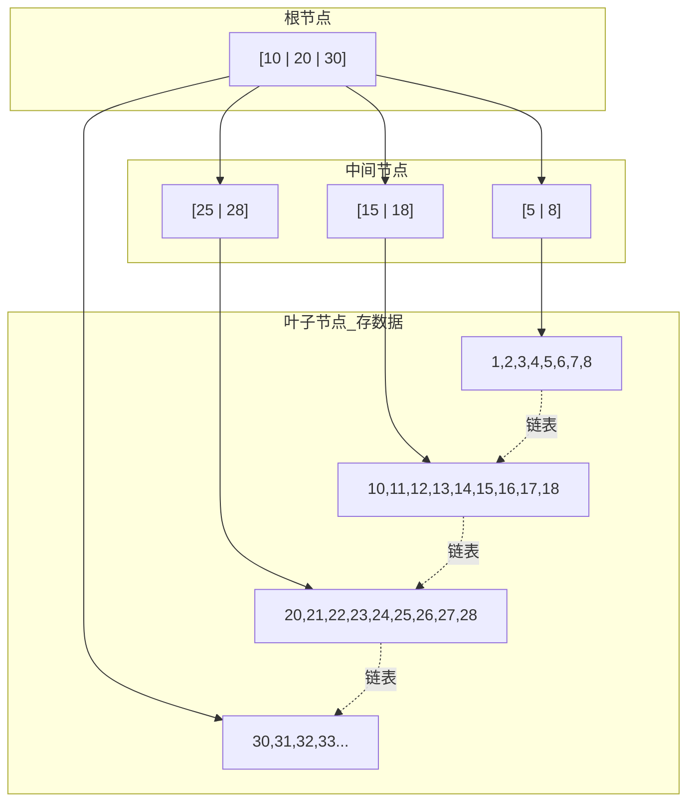

# MySQL 基础、索引与事务

<!-- 修改说明: 新增本章与上一章的关系 -->

## 本章与上一章的关系

05 章你学会了用 MyBatis 写 SQL、连 MySQL——但有个尴尬的情况：SQL 写对了，查询却慢到超时；或者金额字段用了 `double`，用户余额莫名其妙少了 0.01 元。这些问题根源都在 **MySQL 本身**：表怎么设计、索引怎么建、事务怎么隔离。

这一章从数据库底层补全认知。你会用 Docker 快速起一个 MySQL 环境（不用再折腾本地安装），学会设计电商三表、看懂 EXPLAIN 执行计划、理解 B+ 树索引为什么能让查询快 100 倍。05 章是"怎么写 SQL"，这一章是"SQL 在数据库里怎么跑"。

---

## 1. MySQL 在后端里的位置

MySQL 是 Java 后端最重要的数据库之一。

你做的很多核心业务最终都要落到 MySQL：

- 用户数据
- 订单数据
- 商品数据
- 支付记录
- 库存信息

所以你学习 MySQL，不能只停留在“会写 `select * from user`”，而要逐步理解：

- 表怎么设计
- SQL 怎么写
- 索引怎么建
- 事务怎么保证一致性

## 2. 数据库、表、行、列

你先把这几个概念吃透：

- 数据库：一组相关数据的集合
- 表：存储某类数据的结构
- 行：一条记录
- 列：一个字段

例如用户表可能有：

- `id`
- `username`
- `phone`
- `status`
- `create_time`

## 3. 建表基础

```sql
create table user (
    id bigint primary key auto_increment,
    username varchar(64) not null,
    phone varchar(20),
    age int,
    status tinyint not null default 1,
    create_time datetime not null default current_timestamp,
    update_time datetime not null default current_timestamp on update current_timestamp
);
```

### 字段说明

- `bigint`：适合主键
- `varchar`：适合变长字符串
- `tinyint`：适合状态值
- `datetime`：适合记录时间

## 4. 常见数据类型怎么选

### 4.1 整数

- `tinyint`
- `int`
- `bigint`

主键常用 `bigint`，因为扩展余地大。

### 4.2 字符串

- `char`
- `varchar`
- `text`

一般业务字段优先考虑 `varchar`。

### 4.3 金额

用：

- `decimal(10,2)`

不要用：

- `float`
- `double`

<!-- 修改说明: 补充 BigDecimal/decimal 的深入解释与真实案例 -->

### 为什么金额用 DECIMAL，而不用 double/float？

**结论**：`float` 和 `double` 是二进制浮点数，很多十进制小数（如 0.1）无法精确表示，累加后会出现精度丢失。

**底层原理**：

计算机用二进制存储浮点数。十进制的 `0.1` 在二进制里是无限循环小数，存储时被截断。单次误差很小，但金融场景里"加加减减"累积起来，就会出现 `0.1 + 0.2 != 0.3` 的经典问题：

```java
System.out.println(0.1 + 0.2);  // 输出 0.30000000000000004
```

MySQL 的 `DECIMAL(10,2)` 是以 **字符串方式存储精确十进制数**，做加减乘除按十进制规则计算，不会有二进制截断误差。

**真实案例（模拟）**：

某支付系统早期用 `DOUBLE` 存用户余额。用户 A 连续充值 0.1 元 10 次，系统显示余额 0.9999999999999999 元；用户 B 提现 100.00 元，实际扣了 99.99999999999999 元，财务对账每天差几分钱，月底对不上账，排查两周才发现是字段类型问题。迁移到 `DECIMAL(10,2)` 后问题解决。

**Java 侧对应**：数据库用 `DECIMAL`，Java 代码用 `BigDecimal`，不要用 `double` 做金额运算。

---

## 4.1 手把手：Docker 启动 MySQL

05 章项目需要 MySQL，这里教你用 Docker 一键启动，比本地安装省心。

### 前提

电脑已安装 [Docker Desktop](https://www.docker.com/products/docker-desktop/)。

### 启动命令

```bash
docker run -d \
  --name study-mysql \
  -p 3306:3306 \
  -e MYSQL_ROOT_PASSWORD=123456 \
  -e MYSQL_DATABASE=study_db \
  mysql:8.0
```

Windows PowerShell 单行写法：

```powershell
docker run -d --name study-mysql -p 3306:3306 -e MYSQL_ROOT_PASSWORD=123456 -e MYSQL_DATABASE=study_db mysql:8.0
```

```bash
# 预期输出（一行容器 ID）：
# a1b2c3d4e5f6...
```

### 验证 MySQL 是否启动成功

```bash
docker ps
# 预期输出：
# CONTAINER ID   IMAGE       STATUS          PORTS                    NAMES
# a1b2c3d4e5f6   mysql:8.0   Up 30 seconds   0.0.0.0:3306->3306/tcp   study-mysql
```

### 进入 MySQL 执行 SQL

```bash
docker exec -it study-mysql mysql -uroot -p123456
# 预期输出：
# mysql>

# 在 mysql> 提示符下：
mysql> SHOW DATABASES;
# 预期输出包含 study_db

mysql> USE study_db;
mysql> SHOW TABLES;
# 预期输出：Empty set（刚建库还没有表）
```

### 导入 05/06 章建表 SQL

把下面 SQL 保存为 `init.sql`，然后：

```bash
docker exec -i study-mysql mysql -uroot -p123456 study_db < init.sql
# 预期输出：无报错

docker exec -it study-mysql mysql -uroot -p123456 -e "USE study_db; SHOW TABLES;"
# 预期输出：
# +--------------------+
# | Tables_in_study_db |
# +--------------------+
# | user               |
# | product            |
# | order              |
# +--------------------+
```

### 常见 Docker 启动失败

```bash
docker run ...
# 失败输出示例：
# docker: Error response from daemon: driver failed programming external connectivity
# Bind for 0.0.0.0:3306 failed: port is already allocated.
```

说明 3306 端口被占用（可能本地已装 MySQL）。解决：停掉本地 MySQL 服务，或把 `-p 3306:3306` 改成 `-p 3307:3306`，同时改 `application.yml` 里的端口。

---

## 5. 基础 CRUD

### 5.1 插入

```sql
insert into user(username, phone, age)
values ('zhangsan', '13800000000', 18);
```

### 5.2 查询

```sql
select id, username, age
from user
where age >= 18;
```

### 5.3 更新

```sql
update user
set age = 20
where id = 1;
```

### 5.4 删除

```sql
delete from user
where id = 1;
```

## 6. 条件查询

```sql
select *
from user
where status = 1
  and age >= 18;
```

### 常见条件

- `=`
- `>`
- `<`
- `>=`
- `<=`
- `in`
- `between`
- `like`
- `is null`

## 7. 排序与分页

### 7.1 排序

```sql
select *
from user
order by create_time desc;
```

### 7.2 分页

```sql
select *
from user
limit 0, 10;
```

其中：

- `0` 是偏移量
- `10` 是取多少条

## 8. 聚合查询

### 8.1 count

```sql
select count(*)
from user;
```

### 8.2 分组

```sql
select status, count(*)
from user
group by status;
```

### 8.3 having

```sql
select status, count(*) as total
from user
group by status
having total > 5;
```

## 9. 多表查询

比如订单表和用户表联查：

```sql
select o.id, o.total_amount, u.username
from orders o
left join user u on o.user_id = u.id;
```

### join 的核心理解

- `inner join`：两边都匹配才返回
- `left join`：左边都返回，右边没有就补 `null`

## 10. 表设计思路

### 10.1 用户表

核心字段通常有：

- 用户 ID
- 用户名
- 手机号
- 密码
- 状态
- 创建时间

### 10.2 商品表

核心字段通常有：

- 商品 ID
- 标题
- 价格
- 库存
- 状态

### 10.3 订单表

核心字段通常有：

- 订单 ID
- 用户 ID
- 订单金额
- 订单状态
- 支付状态
- 创建时间

### 10.4 表设计原则

- 一张表描述一个核心实体
- 字段命名统一
- 状态字段明确
- 不要过早过度设计

## 11. 索引

### 11.1 为什么需要索引

索引是帮助数据库快速定位数据的数据结构。

没有索引时，数据库可能需要全表扫描。

### 11.2 常见索引类型

- 主键索引
- 唯一索引
- 普通索引
- 联合索引

### 11.3 建索引示例

```sql
create index idx_user_phone on user(phone);
```

联合索引：

```sql
create index idx_user_status_age on user(status, age);
```

## 12. B+ 树的基础理解

MySQL InnoDB 的常见索引底层是 B+ 树。

<!-- 修改说明: 新增 B+ 树 Mermaid 结构简图 -->

### B+ 树三层结构简图



你现在先理解这几个优点：

- 适合磁盘 IO：每个节点大小约 16KB，一次 IO 读一整页
- 层级低：百万级数据通常 3~4 层，最多 3~4 次磁盘 IO
- 支持范围查询：叶子节点通过链表相连，`WHERE age BETWEEN 18 AND 25` 顺着链表扫即可

对比 B 树：B+ 树非叶子节点只存索引键不存数据，单页能放更多键，树更矮，IO 更少。

---

如果你建了索引：

```sql
create index idx_user_status_age on user(status, age);
```

那么这些查询更容易用到索引：

```sql
where status = 1
where status = 1 and age = 18
```

但如果只按 `age` 查，可能就用不上这个联合索引。

这就是最左前缀原则的基础理解。

## 14. 覆盖索引和回表

### 覆盖索引

查询所需字段都在索引里，不需要再去主表取数据。

### 回表

先通过二级索引找到主键，再根据主键回主表取完整数据。

面试里经常会问这两个概念。

## 15. 事务

### 15.1 什么是事务

事务是一组操作，要么都成功，要么都失败。

例如下单：

1. 写订单
2. 扣库存
3. 扣余额

这三个动作要尽量保持一致。

### 15.2 ACID

- 原子性
- 一致性
- 隔离性
- 持久性

这是事务最基础的四个特性。

## 16. 隔离级别

常见四种：

- 读未提交
- 读已提交
- 可重复读
- 串行化

MySQL InnoDB 默认一般是：

- 可重复读

## 17. 并发读问题

### 17.1 脏读

读到了别人还没提交的数据。

### 17.2 不可重复读

同一事务里，两次读取同一行数据结果不同。

### 17.3 幻读

同一事务里，两次范围查询返回的记录数不同。

## 18. 锁

### 18.1 行锁

锁住某一行记录。

### 18.2 表锁

锁住整张表。

### 18.3 共享锁和排他锁

- 共享锁偏读
- 排他锁偏写

## 19. `explain`

这是分析 SQL 性能的重要工具。

```sql
explain select * from user where phone = '13800000000';
```

你至少要学会观察：

- 是否用了索引
- 扫描行数多不多
- 查询类型好不好

## 20. 慢 SQL 优化思路

可以按这个顺序排查：

1. SQL 写法是否合理
2. 是否缺索引
3. 索引是否失效
4. 是否查了不必要的字段
5. 是否联表过多

## 21. 初学者常见错误

### 21.1 到处 `select *`

这会增加不必要的数据传输。

### 21.2 没有 where 就 update/delete

非常危险。

### 21.3 给每个字段都建索引

索引不是越多越好，写入也有成本。

### 21.4 一个表堆太多不相关字段

会影响维护和扩展。

## 22. 这一章练习建议

你最好自己建表并练这些内容：

1. 用户表
2. 商品表
3. 订单表
4. 分页查询
5. 条件查询
6. 分组统计
7. 联表查询
8. 加索引并看 `explain`

## 23. 学完标准

如果你能做到下面这些，就说明这一章已经比较扎实：

- 能自己设计基础业务表
- 能写常见 SQL
- 知道索引为什么重要
- 知道事务和隔离级别的基础含义
- 能分析简单慢 SQL 的问题方向

## 24. 数据库设计范式基础认知

你会在面试里经常听到：

- 第一范式
- 第二范式
- 第三范式

你现在先把它理解成：

- 避免字段设计混乱
- 避免不必要的数据冗余
- 提高数据一致性

但同时要知道：

- 真正业务设计不是死背范式
- 有时会为了性能做适度反规范化

## 25. 唯一约束和普通索引

### 唯一约束

保证字段值不能重复。

适合：

- 手机号
- 用户名
- 订单号

### 普通索引

主要为了加速查询。

## 26. 索引失效常见场景

这是面试高频。

常见情况包括：

- 对索引列做函数操作
- 对索引列做运算
- 联合索引不满足最左前缀
- 模糊查询前面加 `%`
- 类型隐式转换

## 27. MVCC 的基础理解

MVCC 是多版本并发控制。

它的核心价值是：

- 提升并发读写性能
- 让部分读操作不用直接加重锁

你现在先不必深挖实现细节，但要知道它和事务隔离有关系。

## 28. 死锁基础认知

事务并发时可能发生死锁。

常见原因：

- 两个事务访问资源顺序不一致

避免思路：

- 固定访问顺序
- 缩短事务
- 尽快提交

## 29. 大分页问题

当你这样查：

```sql
select * from user limit 100000, 10;
```

性能可能会变差。

因为数据库要先跳过大量数据。

基础优化方向：

- 通过主键范围分页
- 记录上次最后一条 ID

## 30. 慢查询日志基础认知

MySQL 支持慢查询日志。

它的价值是：

- 帮你发现执行慢的 SQL
- 帮助定位性能瓶颈

## 31. 主从复制和读写分离基础认知

这属于进阶，但你最好先知道：

- 主库负责写
- 从库负责复制和部分读请求

用途：

- 提升读能力
- 增强可用性

## 32. 数据库这一章的进一步知识点

后面你还可以继续学习：

- Binlog
- Undo Log
- Redo Log
- Buffer Pool
- 分库分表
- 数据库中间件

## 33. SQL 执行顺序

很多人会写 SQL，但不清楚逻辑执行顺序。

一个典型查询语句，大致理解顺序是：

1. `from`
2. `where`
3. `group by`
4. `having`
5. `select`
6. `order by`
7. `limit`

这对你理解：

- 为什么某些别名不能直接在某些位置用
- 为什么聚合和过滤顺序不同

很有帮助。

## 34. where 和 having 的区别

### where

在分组前过滤原始数据。

### having

在分组后过滤聚合结果。

示例：

```sql
select status, count(*) as total
from user
where age >= 18
group by status
having total > 5;
```

## 35. 子查询基础认知

子查询就是在一个 SQL 中嵌套另一个 SQL。

例如：

```sql
select *
from user
where id in (
    select user_id from orders where total_amount > 100
);
```

子查询很常见，但要注意：

- 写得太复杂可能影响性能

## 36. `count(*)`、`count(1)`、`count(字段)`

你至少要知道：

- `count(*)`：统计总行数
- `count(字段)`：只统计该字段非空的行

面试里有时会问这些差异，但当前阶段你先把使用语义理解清楚更重要。

## 37. 聚簇索引和二级索引

在 InnoDB 里，这是高频概念。

### 聚簇索引

通常就是主键索引。

它的叶子节点存的是整行数据。

### 二级索引

叶子节点通常存的是主键值。

所以通过二级索引查完整行时，可能还要：

- 回表

## 38. 临时表和排序开销基础认知

当 SQL 写得不合理时，可能会出现：

- Using temporary
- Using filesort

你现在不一定要精通这些执行计划细节，但要知道：

- 排序和分组有额外成本

## 39. Redo Log、Undo Log、Binlog 基础认知

这是数据库底层高频概念。

### Redo Log

偏向保障持久性。

### Undo Log

偏向支持回滚和 MVCC。

### Binlog

偏向记录变更操作，常用于复制和恢复。

当前阶段你先知道三者职责不同即可。

## 40. Buffer Pool 基础认知

MySQL 不会每次都直接从磁盘处理数据页，它会用内存做缓存。

Buffer Pool 的价值可以简单理解为：

- 提高数据页访问效率

## 41. 行锁什么时候可能失效成更大范围锁

你要知道一个经验：

- 想用行锁，前提通常是命中了合适索引

如果索引没走好，锁范围可能变大，性能会受影响。

## 42. `select *` 为什么不推荐

除了“多查了没用字段”，还有这些问题：

- 增加网络传输
- 可能影响覆盖索引机会
- 可维护性差

## 43. 订单表索引设计示例

例如订单表常见查询：

- 按用户查订单列表
- 按订单号查详情
- 按状态和时间查订单

可能会考虑：

- 订单号唯一索引
- 用户 ID 普通索引
- 状态 + 创建时间联合索引

为什么索引设计必须结合查询场景：

- 索引不是抽象题，是业务题

## 44. 数据库字段设计常见坑

### 状态字段语义混乱

后面维护非常痛苦。

### 时间字段不统一

排查问题很难受。

### 金额用浮点数

容易有精度问题。

### 主键风格不统一

项目结构会变乱。

## 45. 这一章的高频知识点总清单

建议整理这些点：

- 基本 SQL
- join
- group by
- having
- 分页
- 表设计
- 索引类型
- 联合索引
- 最左前缀
- 覆盖索引
- 回表
- 索引失效
- 事务 ACID
- 隔离级别
- 脏读、不可重复读、幻读
- 行锁、表锁
- MVCC
- explain

---

## 46. 电商表设计示例

```sql
CREATE TABLE `user` (
  `id` BIGINT PRIMARY KEY AUTO_INCREMENT,
  `username` VARCHAR(64) NOT NULL,
  `password` VARCHAR(128) NOT NULL COMMENT 'BCrypt',
  `create_time` DATETIME NOT NULL DEFAULT CURRENT_TIMESTAMP,
  UNIQUE KEY `uk_username` (`username`)
) ENGINE=InnoDB DEFAULT CHARSET=utf8mb4;

CREATE TABLE `product` (
  `id` BIGINT PRIMARY KEY AUTO_INCREMENT,
  `name` VARCHAR(128) NOT NULL,
  `price` DECIMAL(10,2) NOT NULL,
  `stock` INT NOT NULL DEFAULT 0,
  `status` TINYINT NOT NULL DEFAULT 1 COMMENT '1上架 0下架',
  KEY `idx_status` (`status`)
) ENGINE=InnoDB DEFAULT CHARSET=utf8mb4;

CREATE TABLE `order` (
  `id` BIGINT PRIMARY KEY AUTO_INCREMENT,
  `order_no` VARCHAR(32) NOT NULL,
  `user_id` BIGINT NOT NULL,
  `total_amount` DECIMAL(10,2) NOT NULL,
  `status` TINYINT NOT NULL COMMENT '0待付 1已付 2关闭',
  `create_time` DATETIME NOT NULL DEFAULT CURRENT_TIMESTAMP,
  UNIQUE KEY `uk_order_no` (`order_no`),
  KEY `idx_user_status_time` (`user_id`, `status`, `create_time`)
) ENGINE=InnoDB DEFAULT CHARSET=utf8mb4;
```

**字段规范**：金额 `DECIMAL`；时间 `DATETIME`；状态用 `TINYINT` 并注释语义。

---

## 47. EXPLAIN 实战解读

```sql
EXPLAIN SELECT * FROM `order`
WHERE user_id = 1 AND status = 0
ORDER BY create_time DESC
LIMIT 10;
```

| 列 | 关注点 |
|----|--------|
| type | `ALL` 全表扫（差）→ `range` → `ref` → `const`（好） |
| key | 实际用到的索引 |
| rows | 预估扫描行数，越小越好 |
| Extra | `Using filesort` / `Using temporary` 需优化 |

**最左前缀**：索引 `(user_id, status, create_time)` 可支持 `user_id`、`user_id+status` 查询；单独 `status` 用不上该索引。

---

## 48. 索引失效常见场景

1. 对索引列使用函数：`WHERE YEAR(create_time) = 2024`
2. 隐式类型转换：`WHERE phone = 13800138000`（phone 是 varchar）
3. 左模糊：`LIKE '%abc'`
4. OR 一侧无索引
5. 联合索引跳过最左列

---

## 49. 事务隔离级别速记

| 级别 | 脏读 | 不可重复读 | 幻读 |
|------|------|------------|------|
| READ UNCOMMITTED | 可能 | 可能 | 可能 |
| READ COMMITTED | 否 | 可能 | 可能 |
| REPEATABLE READ（MySQL 默认） | 否 | 否 | 理论上可能，InnoDB 用 MVCC+间隙锁缓解 |
| SERIALIZABLE | 否 | 否 | 否 |

初学：**知道默认 RR，业务用 `@Transactional` 保证原子性即可**。

---

## 50. 慢 SQL 优化步骤

1. 开启慢查询日志，定位 SQL
2. `EXPLAIN` 看 type、key、rows
3. 补/改索引（结合 WHERE、ORDER BY）
4. 避免 `SELECT *`，只查需要的列（利于覆盖索引）
5. 分页深翻页改游标或延迟关联

---

## 51. 学完标准

- 能写多表 JOIN、分组统计、分页 SQL
- 能设计带合理索引的表，金额不用 float
- 会用 EXPLAIN 判断索引是否生效
- 能口述 ACID、隔离级别、脏读幻读
- 能写防超卖 `UPDATE ... WHERE stock >= ?`

---

## 52. 分级练习

**基础**：建 user/product/order 三表，插入测试数据  
**进阶**：写「用户订单列表」SQL 并 EXPLAIN 优化  
**挑战**：模拟没有索引的慢查询，加联合索引后对比 rows

<!-- 修改说明: 新增分级练习参考答案 -->

### 参考答案

#### 基础：三表设计与测试数据

46 节的建表 SQL 就是标准答案。插入测试数据：

```sql
INSERT INTO user (username, password) VALUES
('zhangsan', '$2a$10$xxx'), ('lisi', '$2a$10$yyy');

INSERT INTO product (name, price, stock) VALUES
('Java 编程思想', 99.00, 100),
('Spring Boot 实战', 79.00, 50);

INSERT INTO `order` (order_no, user_id, total_amount, status) VALUES
('ORD20250101001', 1, 99.00, 1),
('ORD20250101002', 1, 79.00, 0),
('ORD20250102001', 2, 99.00, 1);
```

验证：

```sql
SELECT COUNT(*) FROM user;    -- 预期：2
SELECT COUNT(*) FROM product; -- 预期：2
SELECT COUNT(*) FROM `order`; -- 预期：3
```

#### 进阶：用户订单列表 SQL + EXPLAIN 优化

**需求**：查用户 ID=1 的已支付订单，按时间倒序，分页 10 条。

**第一版（可能全表扫）**：

```sql
SELECT o.id, o.order_no, o.total_amount, o.status, o.create_time
FROM `order` o
WHERE o.user_id = 1 AND o.status = 1
ORDER BY o.create_time DESC
LIMIT 10;
```

**EXPLAIN**：

```sql
EXPLAIN SELECT o.id, o.order_no, o.total_amount, o.status, o.create_time
FROM `order` o
WHERE o.user_id = 1 AND o.status = 1
ORDER BY o.create_time DESC
LIMIT 10;
# 预期输出（有 idx_user_status_time 索引时）：
# type: ref
# key: idx_user_status_time
# rows: 较小数值
```

如果没有索引，`type` 可能是 `ALL`，`rows` 等于全表行数。加上 46 节的 `idx_user_status_time` 联合索引后，`rows` 应显著下降。

#### 挑战：慢查询对比

**无索引时**（先 DROP INDEX）：

```sql
ALTER TABLE `order` DROP INDEX idx_user_status_time;

EXPLAIN SELECT * FROM `order` WHERE user_id = 1;
# 预期：type=ALL, rows=全表行数
```

**加回索引后**：

```sql
CREATE INDEX idx_user_status_time ON `order`(user_id, status, create_time);

EXPLAIN SELECT * FROM `order` WHERE user_id = 1;
# 预期：type=ref, key=idx_user_status_time, rows=该用户的订单数
```

截图或记录两次 `rows` 对比，就是这次挑战的交付物。

---

<!-- 修改说明: 新增常见报错与排查 -->

## 52.1 常见报错与排查

| 报错信息（关键词） | 可能原因 | 解决方案 |
|-------------------|---------|---------|
| `Access denied for user` | 用户名或密码错 | 检查连接参数；Docker 容器用 `-e MYSQL_ROOT_PASSWORD` 设的密码 |
| `Unknown column 'xxx' in 'field list'` | 字段名拼错或表结构不一致 | `DESC table_name` 看实际字段 |
| `Duplicate entry 'xxx' for key 'uk_xxx'` | 违反唯一约束 | 检查是否重复插入；业务上先查再插 |
| `Lock wait timeout exceeded` | 事务持锁太久，别的会话在等 | 缩短事务；检查是否有未提交的大事务 |
| `You have an error in your SQL syntax` | SQL 语法错误 | 注意 MySQL 8 保留字：`order` 表名需反引号 `` `order` `` |
| `Data too long for column` | 插入字符串超长 | 加大 `VARCHAR` 长度或截断输入 |

---

## 54. 索引设计实战指南

### 54.1 联合索引的最左前缀原则

```sql
-- 联合索引 (a, b, c)
CREATE INDEX idx_abc ON t(a, b, c);

-- 以下查询能用上索引：
WHERE a = 1;                    -- ✅ 走 a
WHERE a = 1 AND b = 2;          -- ✅ 走 a,b
WHERE a = 1 AND b = 2 AND c = 3;-- ✅ 走全部
WHERE a = 1 AND c = 3;          -- ⚠️ 只走 a（b 断了就不能往下了）

-- 以下查询用不上索引：
WHERE b = 2;                    -- ❌ 没从 a 开始
WHERE c = 3;                    -- ❌ 没从 a 开始
WHERE b = 2 AND c = 3;          -- ❌ 没从 a 开始
```

### 54.2 索引设计检查清单

- [ ] WHERE 条件里的等值字段放在联合索引最前面
- [ ] ORDER BY 的字段可以接在 WHERE 字段后面，避免 filesort
- [ ] 区分度高的字段放前面（如 `user_id` > `status`）
- [ ] 每个表主键必备，一般用 `BIGINT AUTO_INCREMENT`
- [ ] 唯一约束用 `UNIQUE INDEX`（防重复 + 加速查找）
- [ ] 不要给每个字段单独建索引（索引占空间、拖慢写入）

---

## 55. EXPLAIN 结果解读速查

```sql
EXPLAIN SELECT * FROM `order` WHERE user_id = 1 ORDER BY create_time DESC LIMIT 10;
```

| 字段 | 含义 | 期望值 |
|------|------|--------|
| `type` | 访问类型（性能排序） | `const` > `eq_ref` > `ref` > `range` > `index` > `ALL` |
| `key` | 实际使用的索引 | 不为 NULL（NULL 表示全表扫） |
| `rows` | 预估扫描行数 | 越小越好 |
| `Extra` | 额外信息 | 避免 `Using filesort`、`Using temporary` |
| `possible_keys` | 候选索引 | 和 `key` 对比，差距大说明缺索引 |

**type 速记**：
- `ALL`：全表扫描（最差，必须优化）
- `index`：全索引扫描（也只是好一点）  
- `range`：索引范围扫描（`>` `<` `BETWEEN` `IN`）
- `ref`：非唯一索引查找（常用）
- `eq_ref`：唯一索引关联查找（JOIN 用）
- `const`：主键/唯一索引等值查询（最优）

---

## 56. 事务隔离级别详解

| 隔离级别 | 脏读 | 不可重复读 | 幻读 | 默认 |
|----------|:--:|:--:|:--:|------|
| READ UNCOMMITTED | ✅ | ✅ | ✅ | — |
| READ COMMITTED | ❌ | ✅ | ✅ | Oracle/PostgreSQL |
| REPEATABLE READ | ❌ | ❌ | ✅（InnoDB 通过间隙锁防住了） | **MySQL 默认** |
| SERIALIZABLE | ❌ | ❌ | ❌ | 最严格但性能最差 |

```sql
-- 查看当前隔离级别
SELECT @@transaction_isolation;

-- 设置隔离级别
SET SESSION TRANSACTION ISOLATION LEVEL READ COMMITTED;
```

---

## 57. MySQL 锁机制

| 锁类型 | 粒度 | 加锁方式 | 场景 |
|--------|------|----------|------|
| 表锁 | 整张表 | `LOCK TABLES` / MyISAM 默认 | 备份、DDL |
| 行锁 | 单行 | InnoDB 通过索引加锁 | `UPDATE ... WHERE id = 1` |
| 间隙锁 (Gap Lock) | 索引间隙 | RR 级别下自动 | 防幻读 |
| 临键锁 (Next-Key Lock) | 行 + 间隙 | RR 级别默认 | 行锁 + 间隙锁组合 |
| 意向锁 | 表级信号 | 自动 | 行锁前声明意向 |
| 乐观锁 | 逻辑锁 | `WHERE version = ?` | 用户手动实现 |
| 悲观锁 | 物理锁 | `SELECT ... FOR UPDATE` | 需要事务中强一致 |

```sql
-- 悲观锁示例：锁定某行直到事务结束
START TRANSACTION;
SELECT stock FROM product WHERE id = 1 FOR UPDATE;
UPDATE product SET stock = stock - 1 WHERE id = 1;
COMMIT;
```

---

## 58. 连接池配置（HikariCP）

Spring Boot 2+ 默认使用 HikariCP，核心参数：

```yaml
spring:
  datasource:
    hikari:
      maximum-pool-size: 20       # 最大连接数（默认 10）
      minimum-idle: 5             # 最小空闲连接
      idle-timeout: 300000        # 空闲超时（5分钟）
      connection-timeout: 30000   # 获取连接超时（30秒）
      max-lifetime: 1800000       # 连接最大生命周期（30分钟）
```

**问题排查**：应用日志出现 `Connection is not available` → 连接池耗尽，增大 `maximum-pool-size` 或检查是否有未释放的连接。

---

## 59. Binlog 与主从复制

Binlog 是 MySQL 的操作日志，用途：
1. **主从复制**：Master 写 Binlog → Slave 拉取并重放
2. **数据恢复**：备份 + Binlog 可恢复到任意时间点
3. **CDC（Change Data Capture）**：Canal/Debezium 监听 Binlog 同步到 Redis/ES/MQ

### 三种格式

| 格式 | 记录方式 | 特点 |
|------|----------|------|
| STATEMENT | SQL 语句 | 省空间，但 `NOW()` 等函数可能不一致 |
| ROW（推荐） | 每行变化 | 精准，空间稍大，主从一致性好 |
| MIXED | 混合 | 默认 STATEMENT，必要时切 ROW |

---

## 60. 学完标准（扩充版）

- [ ] 会建表、选对字段类型（金额 `DECIMAL` 不用 `FLOAT`）
- [ ] 理解联合索引的最左前缀和索引失效场景
- [ ] 会用 EXPLAIN 分析 SQL，看懂 `type`/`key`/`rows`
- [ ] 能口述 B+ 树索引原理、ACID、四种隔离级别
- [ ] 知道行锁/间隙锁/乐观锁/悲观锁的区别和应用场景
- [ ] 会用 `FOR UPDATE` 悲观锁、`version` 字段乐观锁
- [ ] 了解 HikariCP 核心参数和连接池耗尽排查
- [ ] 知道 Binlog 三种格式和主从复制基本概念
- [ ] 能完成"防超卖"场景的 SQL 实现（`UPDATE ... WHERE stock >= ?`）

---

<!-- 修改说明: 新增下一章预告 -->

## 下一章预告

MySQL 能持久化存储，但磁盘 IO 是瓶颈——商品详情页每次查库，高峰期数据库可能扛不住。下一章（07 Redis 核心原理与缓存实战）引入 **缓存层**：

- Redis 为什么比 MySQL 快那么多（内存 + 单线程 + IO 多路复用）
- **Cache Aside** 模式：读时先查缓存、写时先更库再删缓存
- 用 Redis 做商品详情缓存、ZSet 排行榜、SETNX 分布式锁

06 章解决"数据怎么存、怎么查快"，07 章解决"热点数据怎么扛高并发"——这是后端性能优化的第一道防线。

---

*下一章：07 Redis 核心原理与缓存实战*
