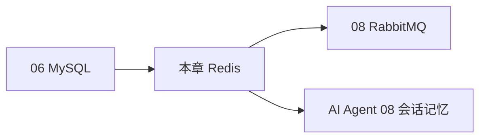
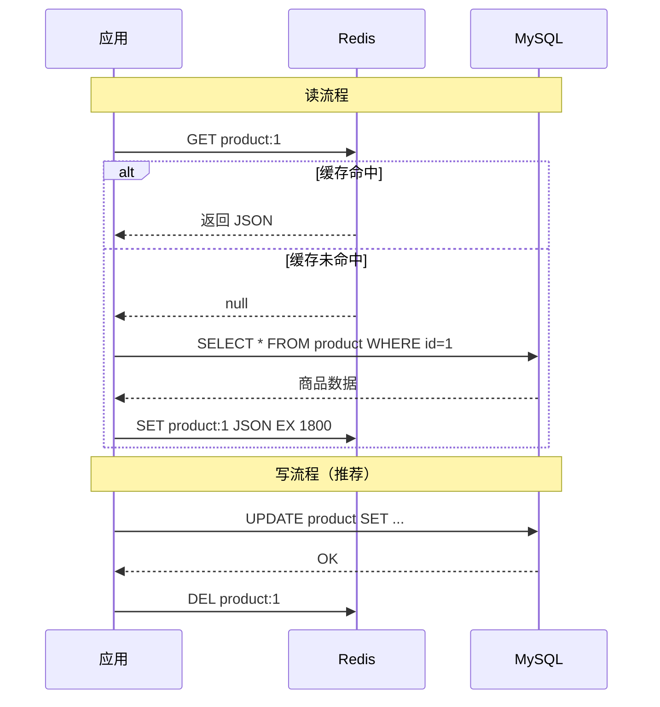
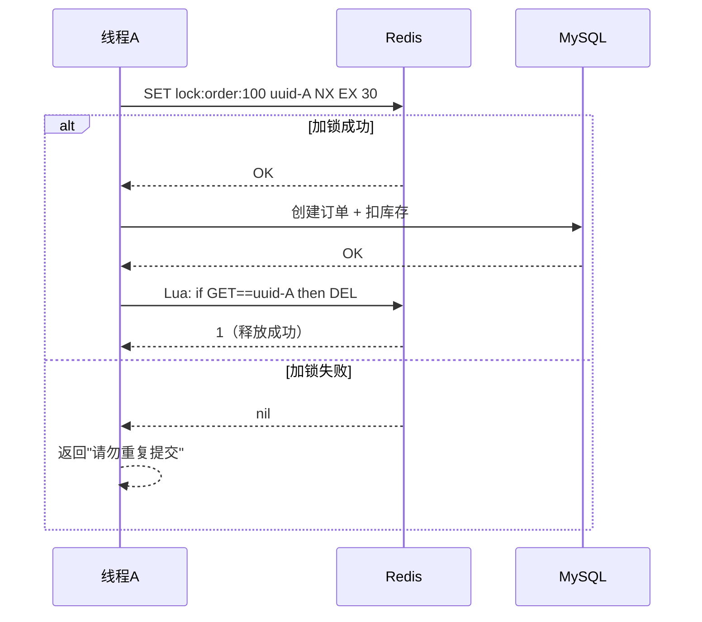

# Redis 核心原理与缓存实战

<!-- 修改说明: 2026-06-30 按 EXPANSION-STANDARD 扩充读前导读、FAQ、自测、费曼检验 -->

## 0. 读前导读（零基础也能跟上）

> **读者假设**：你已学完 Java 04（Spring Boot 分层接口）、05（MyBatis + MySQL）、06（索引与事务）。本章在「数据能可靠存进 MySQL」之上，解决 **读太慢、数据库扛不住** 的问题。

### 0.1 用一句话弄懂本章

**一句话**：把经常被查的热点数据复制一份放在 **Redis 内存**里，读的时候先翻抽屉（缓存），没有再跑去大仓库（MySQL）取货，取完顺手在抽屉里放一份备用。

**生活类比——办公桌抽屉 vs 仓库（MySQL）**：

| 对比 | Redis（抽屉） | MySQL（仓库） |
|------|---------------|---------------|
| **位置** | 手边，伸手就拿 | 楼下库房，要走一段路 |
| **速度** | 微秒级，极快 | 毫秒级，还要排队开票 |
| **容量** | 小，只放常用几样 | 大，全部货品档案 |
| **断电** | 默认数据可能丢（可配持久化） | 数据落盘，可靠保存 |
| **适合** | 商品详情、验证码、排行榜、锁 | 订单、用户主数据、账务 |

你每天写代码查 **用户昵称** 一百次——没必要跑一百次仓库；第一次从 MySQL 拿来后塞进 Redis「抽屉」，后面 99 次直接伸手拿。这就是 **缓存（Cache）**。

**术语（Cache Aside）**：应用自己管缓存——读时先 Redis 后 MySQL，写时先更 MySQL 再删 Redis。
**生活类比**：抽屉里的便签是复印件；仓库改了正式档案后，把抽屉里旧便签撕掉，下次有人要再复印新的。
**为什么重要**：高并发系统标配；面试必问穿透/击穿/雪崩；Agent 路线里会话记忆也会用到 Redis（AI Agent 08 章）。
**本章用到的地方**：§5 Cache Aside、§2.1 ProductCacheService。

---

### 0.2 你需要提前知道什么（真不会就先跳到哪一章）

| 你现在的水平 | 建议动作 |
|--------------|----------|
| 没学过 Spring Boot 分层 | 先完成 [04 Spring Boot](./04-SpringBoot核心开发.md) §2.1 demo |
| 不会连 MySQL、不会写 Mapper | 先学 [05 MyBatis](./05-MyBatis事务与接口工程化.md) |
| 不懂索引、事务 | 先学 [06 MySQL](./06-MySQL基础索引与事务.md) 前半 |
| 已会 04～06，商品查询走 MySQL | **从 §2.1 Docker 起 Redis 跟做** |
| 已跑通缓存 demo | 精读 §9 穿透/击穿/雪崩 + §11 分布式锁 |

**最低门槛**：会 Docker 跑容器（或本机装 Redis）；知道 JSON 字符串；理解「先查快的，没有再查慢的」。

---

### 0.3 本章知识地图（学完后应能勾选全部 ☐→☑）

- [ ] 用「抽屉 vs 仓库」解释 Redis 与 MySQL 的分工
- [ ] Docker 启动 Redis 并用 redis-cli 做 SET/GET/INCR
- [ ] 说出五种数据结构（String/Hash/List/Set/ZSet）各适合什么场景
- [ ] 在 Spring Boot 里配置 `spring.data.redis` 并注入 `StringRedisTemplate`
- [ ] 手写 Cache Aside 读路径：GET → miss → SELECT → SET + TTL
- [ ] 手写写路径：UPDATE MySQL → DEL 缓存（不是 UPDATE 缓存）
- [ ] 解释穿透、击穿、雪崩的区别与至少一种对策
- [ ] 用 SETNX + EX 实现基础分布式锁，知道为什么要唯一 value + Lua 释放
- [ ] 知道 key 命名规范、必须设 TTL 的原因
- [ ] 了解 RDB/AOF、主从/哨兵/Cluster 的基本定位
- [ ] 闭卷自测 10 题正确 ≥ 8 题

---

### 0.4 建议学习时长与节奏

| 阶段 | 建议时间 | 做什么 |
|------|----------|--------|
| 通读 §0 + 抽屉类比 | 25 分钟 | 建立缓存心智模型 |
| 跟做 §2.1 redis-cli + Spring 接入 | 2 小时 | Docker、五种结构、ProductCacheService |
| 精读 §5～§9 | 2 小时 | Cache Aside、一致性、三大问题 |
| 进阶 §11～§13、§48～§49 | 1.5 小时 | 分布式锁、持久化、集群认知 |
| 自测 + FAQ + 费曼 | 45 分钟 | 闭卷 + 口述 |

**节奏建议**：先 redis-cli 手工 SET/GET 建立直觉，再写 Java 代码；每学一种数据结构就在 cli 里敲 5 条命令。

---

### 0.5 学完本章你能做什么（可验证的具体动作）

1. **启动** `docker run ... redis:7`，`redis-cli PING` 返回 `PONG`。
2. **实现** 商品详情接口：第二次查询日志或断点显示走 Redis。
3. **演示** 缓存穿透：查不存在的 id，说明为何会打穿到 MySQL。
4. **配置** 所有缓存 key 带 TTL（如 30 分钟 + 随机偏移）。
5. **用** `SET lock:xxx uuid NX EX 30` 模拟两个终端只有一个能加锁成功。
6. **口述** 为什么更新数据库后要 **删缓存** 而不是 **改缓存**。

---

### 0.6 本章核心术语预览

| 术语（English） | 一句话 | 生活类比 |
|-----------------|--------|----------|
| **缓存（Cache）** | 把热点数据放更快介质里副本一份 | 办公桌抽屉里的复印件 |
| **TTL（Time To Live）** | key 过期秒数 | 便签上写「本周五失效」 |
| **Cache Aside** | 应用代码自己管读写缓存 | 你自己决定何时翻抽屉、何时去仓库 |
| **缓存穿透** | 查不存在的数据，缓存和 DB 都没有 | 有人非要仓库里没有的货号，每次都白跑仓库 |
| **缓存击穿** | 单个热点 key 过期，并发打穿 DB | 爆款便签刚好过期，一百人同时涌向仓库 |
| **缓存雪崩** | 大量 key 同时过期 | 全公司抽屉便签同一天到期，仓库瞬间挤爆 |
| **分布式锁** | 多机环境下互斥执行 | 仓库大门一把钥匙，谁拿到谁进货 |

---

### 0.7 学习路径示意



---

## 本章与上一章的关系

06 章你把 MySQL 表设计、索引、事务都搞明白了——数据能可靠存储、查询也能优化。但有个现实问题：商品详情页每秒被访问 1 万次，每次都查 MySQL，数据库很快扛不住。

Redis 就是来解决这个的：**把热点数据放内存里，读速度从毫秒级降到微秒级**。这一章你会学五种数据结构、Cache Aside 缓存模式、穿透/击穿/雪崩对策，以及用 SETNX 做分布式锁。06 章是"数据怎么存"，07 章是"热点数据怎么扛并发"。

---

## 1. Redis 在后端项目里是干什么的

Redis 最常见的作用不是“代替数据库”，而是：

- 做缓存
- 做计数器
- 做验证码
- 做排行榜
- 做分布式锁基础能力
- 做限流

它最大的特点是快，因为主要基于内存。

## 2. 为什么 Redis 很重要

因为只会写数据库接口的后端，通常还不够强。

如果你想让系统：

- 响应更快
- 扛住更多请求
- 减少数据库压力

就会很自然地接触 Redis。

<!-- 修改说明: 补充 Redis 为什么快的深入解释 -->

### 为什么 Redis 这么快？

**结论**：Redis 把数据放内存、单线程避免锁竞争、IO 多路复用让单线程也能处理大量并发连接——三者叠加，单机 QPS 可达十万级。

**底层原理**：

1. **纯内存操作**：MySQL 查数据要走磁盘 IO（即使有 Buffer Pool 缓存，miss 时仍要读盘），Redis 数据全在内存，一次 `GET` 只需微秒级。
2. **单线程模型**：Redis 6.0 前核心命令处理是单线程，避免了多线程的上下文切换和锁竞争。有人觉得单线程慢，实际上 CPU 不是 Redis 瓶颈，内存和网络才是——单线程 + IO 多路复用（epoll）让一条线程监听成千上万个连接，哪个有数据就处理哪个。
3. **高效数据结构**：String 用 SDS、ZSet 用跳表，都是为速度优化的专用结构，不是通用 HashMap 能比的。

**真实案例（模拟）**：

某电商大促，商品详情接口直接查 MySQL，QPS 到 3000 时数据库 CPU 飙到 90%，接口 RT 从 50ms 涨到 800ms。接入 Redis 缓存后，95% 请求命中缓存（RT < 5ms），MySQL QPS 降到 200，数据库 CPU 回到 30%，页面不再卡顿。

---

## 2.1 手把手：Docker 启动 Redis + redis-cli 练习

### 总览步骤表

| 步骤 | 你的动作 | 预期看到什么 | 若不对 |
|------|----------|--------------|--------|
| 1 | `docker run -d --name study-redis -p 6379:6379 redis:7` | 返回容器 ID 长串 | Docker Desktop 是否启动；端口 6379 是否被占 |
| 2 | `docker ps` | STATUS 为 Up，PORTS 映射 6379 | `docker logs study-redis` 查报错 |
| 3 | `docker exec -it study-redis redis-cli` | 提示符 `127.0.0.1:6379>` | 容器名是否拼错 |
| 4 | `SET name zhangsan` / `GET name` | OK / `"zhangsan"` | 是否在 cli 内执行 |
| 5 | `INCR page_view` / `EXPIRE` / `TTL` | 计数递增；TTL 倒计时 | 键名是否一致 |
| 6 | ZSet `ZADD` + `ZREVRANGE` 排行榜 | 按分数降序列表 | 分数是数字，成员是字符串 |
| 7 | `SET lock:... uuid NX EX 30` 两次 | 第一次 OK，第二次 nil | 理解 NX=仅不存在时设置 |
| 8 | pom 加 `spring-boot-starter-data-redis` | Maven 无红错 | 05 章 demo 项目是否已能编译 |
| 9 | yml 配置 `spring.data.redis.host/port` | 启动无连接拒绝 | Redis 容器是否在跑 |
| 10 | 新建 `ProductCacheService` 并调用 | 第二次查 id 走 Redis | 见 FAQ Q4 JSON 序列化 |

### Docker 启动 Redis

```powershell
docker run -d --name study-redis -p 6379:6379 redis:7
```

```bash
# 预期输出：
# c1d2e3f4a5b6...

docker ps
# 预期输出：
# CONTAINER ID   IMAGE     STATUS         PORTS                    NAMES
# c1d2e3f4a5b6   redis:7   Up 10 seconds  0.0.0.0:6379->6379/tcp   study-redis
```

### redis-cli 基础操作（带预期输出）

```bash
docker exec -it study-redis redis-cli
```

**String 操作**：

```bash
127.0.0.1:6379> SET name zhangsan
# 预期输出：OK

127.0.0.1:6379> GET name
# 预期输出："zhangsan"

127.0.0.1:6379> INCR page_view
# 预期输出：(integer) 1

127.0.0.1:6379> EXPIRE name 60
# 预期输出：(integer) 1

127.0.0.1:6379> TTL name
# 预期输出：(integer) 58  （剩余秒数，会递减）
```

**ZSet 排行榜**：

```bash
127.0.0.1:6379> ZADD rank 100 user1
# 预期输出：(integer) 1

127.0.0.1:6379> ZADD rank 90 user2
# 预期输出：(integer) 1

127.0.0.1:6379> ZADD rank 95 user3
# 预期输出：(integer) 1

127.0.0.1:6379> ZREVRANGE rank 0 9 WITHSCORES
# 预期输出：
# 1) "user1"
# 2) "100"
# 3) "user3"
# 4) "95"
# 5) "user2"
# 6) "90"
```

**ZSet 排行榜步骤表**：

| 步骤 | 命令 | 预期 | 若不对 |
|------|------|------|--------|
| 1 | `ZADD rank 100 user1` | 新增 1 个成员 | 分数必须是数字 |
| 2 | `ZADD rank 90 user2` | 再增成员 | 同成员再次 ZADD 会更新分数 |
| 3 | `ZREVRANGE rank 0 9 WITHSCORES` | 按分数从高到低 | 用 `ZRANGE` 则是升序 |

**SETNX 分布式锁**

```bash
127.0.0.1:6379> SET lock:order:1 uuid-abc NX EX 30
# 预期输出：OK

127.0.0.1:6379> SET lock:order:1 uuid-xyz NX EX 30
# 预期输出：(nil)  ← 锁已被占用，加锁失败

127.0.0.1:6379> DEL lock:order:1
# 预期输出：(integer) 1  ← 释放锁
```

**redis-cli 命令步骤表（String + 锁）**：

| 步骤 | 命令 | 预期输出 | 若不对 |
|------|------|----------|--------|
| 1 | `SET name zhangsan` | `OK` | 是否在 `redis-cli` 内 |
| 2 | `GET name` | `"zhangsan"` | 键名拼写 |
| 3 | `INCR page_view` | `(integer) 1` | 键不存在时 INCR 从 0 开始 |
| 4 | `EXPIRE name 60` | `(integer) 1` | key 不存在返回 0 |
| 5 | `TTL name` | 正整数递减 | `-1` 表示未设过期 |
| 6 | `SET lock:order:1 uuid NX EX 30` | 第一次 `OK` | 无 NX 则覆盖他人锁 |
| 7 | 同 key 再 SET NX | `(nil)` | 说明锁被占用，符合预期 |
| 8 | `DEL lock:order:1` | `(integer) 1` | 生产应用 Lua 校验 value 再删 |

### Spring Boot 接入 Redis（完整步骤）

在 05 章 demo 项目基础上：

**pom.xml 追加**：

```xml
<dependency>
    <groupId>org.springframework.boot</groupId>
    <artifactId>spring-boot-starter-data-redis</artifactId>
</dependency>
```

**application.yml 追加**：

```yaml
spring:
  data:
    redis:
      host: localhost
      port: 6379
```

**ProductCacheService.java**（完整可运行）：

```java
package com.example.demo.service;

import com.example.demo.entity.Product;
import com.example.demo.mapper.ProductMapper;
import com.fasterxml.jackson.core.JsonProcessingException;
import com.fasterxml.jackson.databind.ObjectMapper;
import org.springframework.data.redis.core.StringRedisTemplate;
import org.springframework.stereotype.Service;

import java.time.Duration;

@Service
public class ProductCacheService {

    private static final String KEY_PREFIX = "product:";
    private final StringRedisTemplate redis;
    private final ProductMapper productMapper;
    private final ObjectMapper objectMapper = new ObjectMapper();

    public ProductCacheService(StringRedisTemplate redis, ProductMapper productMapper) {
        this.redis = redis;
        this.productMapper = productMapper;
    }

    public Product getById(Long id) {
        String key = KEY_PREFIX + id;
        String cache = redis.opsForValue().get(key);
        if (cache != null) {
            try {
                return objectMapper.readValue(cache, Product.class);
            } catch (JsonProcessingException e) {
                redis.delete(key);
            }
        }
        Product db = productMapper.selectById(id);
        if (db != null) {
            try {
                redis.opsForValue().set(key, objectMapper.writeValueAsString(db),
                        Duration.ofMinutes(30));
            } catch (JsonProcessingException ignored) {}
        }
        return db;
    }

    public void evict(Long id) {
        redis.delete(KEY_PREFIX + id);
    }
}
```

启动项目后，第一次查商品走 MySQL 并写入缓存，第二次查直接走 Redis。

**ProductCacheService 逐行读**：

| 行号/代码 | 含义 | 改错会怎样 |
|-----------|------|------------|
| `KEY_PREFIX = "product:"` | 统一 key 前缀，避免与其它业务冲突 | 裸用 id 作 key，易覆盖别的数据 |
| `StringRedisTemplate redis` | Spring 封装的 Redis 字符串操作 | 未配 yml 则启动连不上 6379 |
| `String key = KEY_PREFIX + id` | 拼出 `product:1001` | 漏前缀，运维无法按模式排查 |
| `redis.opsForValue().get(key)` | Cache Aside 第一步：先翻抽屉 | 顺序反了先查 DB 则失去缓存意义 |
| `if (cache != null) return parse` | 命中则直接返回，不调 MySQL | 不判 null 会 NPE |
| `catch JsonProcessingException` + `delete` | 反序列化失败说明脏数据，删 key | 不删则永远 parse 失败 |
| `productMapper.selectById(id)` | 未命中，去仓库（MySQL）取 | 05 章 Mapper 未配则报错 |
| `set(key, json, Duration.ofMinutes(30))` | 复印进抽屉并设 30 分钟 TTL | 不设 TTL 可能内存涨满、脏数据常驻 |
| `evict(Long id)` | 更新商品后删缓存（写路径配套） | 只更 DB 不删缓存，用户看到旧价 |

---

## 3. Redis 五种最核心数据结构

## 3.1 String

最基础，也最常用。

常见场景：

- 缓存一个 JSON 字符串
- 存验证码
- 做计数器

命令：

```bash
set name zhangsan
get name
incr page_view
expire name 60
```

## 3.2 Hash

适合存对象。

```bash
hset user:1 name zhangsan age 18
hget user:1 name
hgetall user:1
```

常见场景：

- 用户信息缓存
- 商品信息缓存

## 3.3 List

有序、可重复。

```bash
lpush queue task1
rpush queue task2
lpop queue
```

常见场景：

- 简单队列
- 最新消息列表

## 3.4 Set

无序、不可重复。

```bash
sadd tags java mysql redis
smembers tags
sismember tags java
```

常见场景：

- 去重
- 标签集合
- 共同好友

## 3.5 ZSet

有序集合，每个元素有分数。

```bash
zadd rank 100 user1
zadd rank 90 user2
zrevrange rank 0 9 withscores
```

常见场景：

- 排行榜
- 热搜榜
- 延时任务基础结构

## 4. Spring Boot 连接 Redis

代码里常见这样使用：

```java
import org.springframework.data.redis.core.StringRedisTemplate;
import org.springframework.stereotype.Service;

@Service
public class RedisDemoService {

    private final StringRedisTemplate stringRedisTemplate;

    public RedisDemoService(StringRedisTemplate stringRedisTemplate) {
        this.stringRedisTemplate = stringRedisTemplate;
    }

    public void saveCode(String phone, String code) {
        stringRedisTemplate.opsForValue().set("code:" + phone, code);
    }
}
```

## 5. 缓存的基本思路

最常见模式是 Cache Aside。

<!-- 修改说明: 新增 Cache Aside 读写流程 Mermaid 图 -->

### Cache Aside 读写流程



### 读取流程

1. 先查 Redis
2. Redis 没命中再查 MySQL
3. 把 MySQL 结果写回 Redis

### 为什么这么做

- 热点数据读得更快
- 数据库压力会下降

### Cache Aside 操作步骤表

| 场景 | 步骤 | 你的动作（代码层） | 预期效果 | 若不对 |
|------|------|-------------------|----------|--------|
| **读-命中** | 1 | `GET product:{id}` | 返回 JSON，不调 MySQL | 检查 key 是否写对前缀 |
| **读-未命中** | 2 | `SELECT` from MySQL | 拿到最新数据 | Mapper/SQL 是否正确 |
| **读-回填** | 3 | `SET key json EX ttl` | 下次读走 Redis | 忘记 SET 则每次都打 DB |
| **写-更新** | 4 | `UPDATE` MySQL | 仓库正式档案已改 | 事务是否提交 |
| **写-失效** | 5 | `DEL product:{id}` | 撕掉抽屉旧复印件 | 只 UPDATE 缓存易脏读 |
| **防雪崩** | 6 | TTL = 基础值 + random | 过期时间分散 | 全部 30min 整点失效 |

## 6. 商品详情缓存示例

```java
public UserVO getUser(Long id) {
    String key = "user:" + id;
    String cache = stringRedisTemplate.opsForValue().get(key);
    if (cache != null) {
        return JSON.parseObject(cache, UserVO.class);
    }

    User user = userMapper.selectById(id);
    if (user == null) {
        return null;
    }

    UserVO vo = convert(user);
    stringRedisTemplate.opsForValue().set(
            key,
            JSON.toJSONString(vo),
            Duration.ofMinutes(30)
    );
    return vo;
}
```

### 这段逻辑你要理解什么

- 先缓存后数据库不是常见读流程
- 常见读流程是先缓存，后数据库

## 7. 为什么缓存必须设置过期时间

如果永久不过期：

- 容易脏数据
- 容易占满内存

所以一般要设置合理过期时间。

<!-- 修改说明: 补充为什么缓存要设过期时间 -->

### 为什么缓存必须设置过期时间？

**结论**：不设 TTL 的缓存是定时炸弹——内存会被撑爆，脏数据会永久存在，出问题时没法自动恢复。

**底层原理**：

Redis 内存有限（通常几 GB 到几十 GB），而业务数据是无限的。没有过期时间的 key 只增不减，最终触发内存淘汰策略（可能随机删掉重要 key）或直接 OOM。另外，数据库更新后如果缓存没过期，用户会一直看到旧数据——TTL 是"最差情况下多久自动纠正"的保底机制。

**真实案例（模拟）**：

某系统把用户信息缓存到 Redis 但忘了设 TTL，运行 3 个月后 Redis 内存从 2GB 涨到 14GB，触发 `allkeys-lru` 淘汰，把热点商品缓存随机删掉，数据库瞬间被打满，全站响应超时 20 分钟。修复：所有缓存 key 统一设 TTL（30 分钟 + 随机 0~300 秒防雪崩）。

---

## 8. 缓存和数据库一致性

这是 Redis 面试里的大重点。

### 常见更新思路

1. 更新数据库
2. 删除缓存

为什么不是先删缓存再更新数据库：

- 中间可能有并发请求把旧值重新写回缓存

### 你现在先掌握的结论

大多数业务里，追求的是：

- 尽量保证一致
- 最终一致

不是绝对强一致。

<!-- 修改说明: 补充为什么更新 DB 后删缓存而不是更新缓存 -->

### 为什么更新数据库后要删缓存，而不是更新缓存？

**结论**：删缓存比更新缓存更安全——并发场景下"更新缓存"容易把旧值写回去，"删缓存"最多让下次读多查一次库。

**底层原理**：

考虑这个并发时序（更新缓存方案）：

1. 线程 A 更新 DB，商品名改为"新版"
2. 线程 B 读缓存 miss，从 DB 读到旧值"旧版"
3. 线程 A 更新缓存为"新版"
4. 线程 B 把读到的旧值"旧版"写回缓存 ← **脏数据产生**

如果改成"先更新 DB，再删缓存"：

1. 线程 A 更新 DB 为"新版"，删缓存
2. 线程 B 读缓存 miss，从 DB 读到"新版"，写回缓存 ← 正确

极端情况下删缓存后、下次读之前，可能有另一个线程把旧值写回——但窗口比"更新缓存"方案小得多，且可以通过延迟双删进一步优化。所以业界默认推荐 **Cache Aside 写路径：先更 DB → 再删缓存**。

**真实案例（模拟）**：

某商品改价后，运营用"更新缓存"方案同步价格，大促期间并发极高，部分用户仍看到旧价下单，造成亏损。改为"删缓存"后，最坏情况是少数用户第一次刷新看到旧价（缓存 miss 重建前），但不会出现旧价长期驻留缓存的问题。

---

### 9.1 缓存穿透

查一个数据库和缓存里都不存在的数据。

后果：

- 请求直接打到数据库

常见解决方案：

- 缓存空值
- 布隆过滤器

### 9.2 缓存击穿

某个热点 key 突然失效，大量请求打到数据库。

常见解决方案：

- 互斥锁
- 逻辑过期
- 热点数据提前续期

### 9.3 缓存雪崩

大量 key 同一时间过期。

常见解决方案：

- 过期时间加随机值
- 限流降级
- 多级缓存

## 10. Redis 持久化

Redis 虽然主要在内存里，但也支持持久化。

### 10.1 RDB

定时快照。

特点：

- 文件较小
- 恢复较快
- 可能丢失最近一段时间数据

### 10.2 AOF

把写命令追加记录下来。

特点：

- 数据更安全
- 文件更大

## 11. 分布式锁基础方案

Redis 常见基础实现：

```bash
set lock:order:1 unique_value nx ex 30
```

<!-- 修改说明: 新增 SETNX 加锁解锁流程 Mermaid 图 -->

### SETNX 加锁解锁流程



含义：

- `nx`：不存在时才设置
- `ex 30`：30 秒后过期

### 需要注意的问题

- 锁过期
- 误删别人锁
- 业务执行太久

### 基础正确释放思路

- value 用唯一值
- 释放锁前先判断是不是自己加的
- 更严谨时用 Lua 脚本保证原子性

## 12. 限流

Redis 很适合做基础限流。

### 计数器限流思路

```bash
incr rate_limit:user:1
expire rate_limit:user:1 60
```

表示：

- 在 60 秒内计数
- 超过某个次数就拒绝

## 13. 主从、哨兵、集群

你现在先掌握基础认知：

### 主从复制

主节点写，从节点复制数据，常用于读扩展和高可用基础。

### 哨兵

用于监控 Redis 节点，并在主节点故障时做自动切换。

### 集群

用于更大规模的数据分片和横向扩展。

## 14. 项目里最值得落地的 Redis 功能

建议你在项目里至少做这几个：

1. 商品详情缓存
2. 手机验证码缓存
3. 阅读量或点赞数计数
4. 排行榜
5. 防重复提交或基础锁

## 15. 常见误区

### 15.1 什么都缓存

缓存也有成本，不是所有数据都值得缓存。

### 15.2 不设置过期时间

容易导致脏数据和内存问题。

### 15.3 缓存更新逻辑混乱

要统一更新策略。

### 15.4 只会背概念，不会落地

真正加分的是：

- 你能把 Redis 用到项目里
- 你能讲出为什么这么设计

## 16. 这一章的练习建议

建议你自己实现：

1. 商品详情缓存接口
2. 验证码存储和校验
3. 点赞数计数器
4. 一个排行榜
5. 模拟缓存击穿并解释处理思路

## 17. 学完标准

如果你能做到下面这些，这一章就比较扎实：

- 知道五种核心数据结构怎么用
- 会写基础缓存逻辑
- 知道缓存一致性的常见思路
- 知道穿透、击穿、雪崩的含义和解决方向
- 知道分布式锁的基础实现方式

## 18. Key 设计规范

Redis 在项目里不要随便命名 key。

建议风格统一，比如：

- `user:1`
- `product:1001`
- `sms:code:13800000000`

好处：

- 更容易维护
- 更容易排查问题
- 更不容易冲突

## 19. 大 key 和热 key

### 大 key

单个 key 存的数据太大。

风险：

- 操作慢
- 网络传输慢
- 影响 Redis 性能

### 热 key

访问特别频繁的 key。

风险：

- 可能让单点压力过大

## 20. 序列化基础认知

Java 项目里把对象放进 Redis 时，经常涉及序列化。

常见思路：

- 存 JSON
- 用框架默认序列化方式

你现阶段更推荐先理解：

- 存 JSON 可读性更好
- 调试更方便

## 21. Lua 脚本

Redis 支持 Lua 脚本。

它的价值是：

- 把多个命令打包成一个原子操作

典型场景：

- 分布式锁释放
- 秒杀扣库存基础逻辑

## 22. Pipeline

Pipeline 可以减少多次网络往返开销。

适合场景：

- 批量执行很多 Redis 命令

你现在知道它是“批量发命令提效率”的思路就够了。

## 23. Bitmap、HyperLogLog、Geo、Stream 基础认知

虽然初学时不必深挖，但这些名字你最好见过。

### Bitmap

适合：

- 签到
- 在线状态统计

### HyperLogLog

适合：

- UV 近似统计

### Geo

适合：

- 附近的人
- 附近门店

### Stream

适合：

- 更像消息流的处理场景

## 24. Redis 和本地缓存

很多系统不只有 Redis 一层缓存，还可能有本地缓存。

你先知道这个概念即可：

- 本地缓存更快
- Redis 更适合共享缓存

## 25. Redis 常见问题排查方向

如果 Redis 表现异常，可以先想：

1. 内存是否快满了
2. 是否存在大 key
3. 是否存在热 key
4. 是否有过多慢命令

## 26. Redis 这一章的进一步知识点

后面你还可以继续学习：

- 主从复制细节
- 哨兵选主
- Cluster 分片
- Redisson
- 布隆过滤器
- 秒杀系统设计

## 27. 常见过期淘汰策略

Redis 中经常会提到两类东西：

- 过期键删除
- 内存淘汰策略

你至少要知道：

- key 到时间了不代表一定瞬间删除
- Redis 会通过一定机制处理过期 key

## 28. 内存淘汰策略基础认知

当 Redis 内存不够时，可能根据策略淘汰数据。

你现在先认识这些常见名字即可：

- `noeviction`
- `allkeys-lru`
- `volatile-lru`

最常见的面试理解方式：

- Redis 内存不是无限的
- 缓存设计必须考虑淘汰

## 29. StringRedisTemplate 和 RedisTemplate

Spring Boot 中你后面常会看到这两个类。

### StringRedisTemplate

更适合字符串场景。

### RedisTemplate

更通用，可以操作更丰富对象。

初学阶段通常从 `StringRedisTemplate` 更容易理解。

## 30. Redis 存对象的常见方式

常见有两种思路：

### 存 JSON 字符串

优点：

- 好理解
- 好排查

### 存 Hash

优点：

- 可以按字段读写

你做项目时可以根据场景选：

- 简单直接：JSON
- 需要部分字段更新：Hash

## 31. 布隆过滤器基础认知

在缓存穿透场景里经常会被提到。

它的价值是：

- 快速判断某个值“大概率不存在”

特点：

- 有误判率
- 但没有漏判不存在的情况

你现在先知道它是缓存穿透的高级优化手段即可。

## 32. 逻辑过期基础认知

这是处理热点 key 的常见思路之一。

简单理解：

- 业务上记录一个逻辑过期时间
- 即使物理上没删，也根据逻辑时间判断是否该重建缓存

它的价值：

- 降低热点 key 失效瞬间的冲击

## 33. Lua 释放分布式锁的基础示意

你至少要能看懂这种逻辑：

```lua
if redis.call("get", KEYS[1]) == ARGV[1] then
    return redis.call("del", KEYS[1])
else
    return 0
end
```

它想解决的问题是：

- 防止误删别人的锁

## 34. 秒杀场景里 Redis 的作用

秒杀系统是 Redis 高频场景题。

Redis 常见作用：

- 预扣库存
- 限流
- 防重复下单
- 缓冲流量

你现在不一定要会完整系统设计，但至少要知道 Redis 为什么适合这类场景。

## 35. Redis 和数据库双写为什么复杂

复杂的原因不是“会不会写代码”，而是：

- 并发顺序会导致脏数据
- 更新失败和重试会让状态更复杂

所以缓存一致性从来不是一句“更新数据库再删缓存”就结束了，它背后是并发问题。

## 36. Redis 慢查询和性能风险基础认知

一些风险操作要有意识：

- 大量 key 扫描
- 大 key 操作
- 非必要全量命令

你要养成一种意识：

- Redis 虽然快，但也不是随便用都不会出问题

## 37. Redis 使用中的工程习惯

建议你逐步形成这些习惯：

- key 命名统一
- TTL 策略清晰
- 重要缓存有降级方案
- 缓存 miss 时有兜底逻辑
- 不要把 Redis 当万能数据库

## 38. 这一章的高频知识点总清单

建议整理这些点：

- 五种核心数据结构
- 使用场景
- Cache Aside
- 过期时间
- 缓存一致性
- 穿透、击穿、雪崩
- RDB、AOF
- 内存淘汰
- 大 key、热 key
- 分布式锁
- 布隆过滤器
- Lua
- 限流
- 排行榜

---

## 39. Redis 命令速查（后端常用）

```bash
SET product:1 "json..." EX 1800
GET product:1
SETNX lock:order:1001 uuid EX 30

HSET user:1 name "Tom"
ZADD rank:score 95 "playerA"
ZREVRANGE rank:score 0 9 WITHSCORES
```

---

## 40. Java 整合 Redis（Spring Data Redis）

```java
@Service
@RequiredArgsConstructor
public class ProductCacheService {
    private final StringRedisTemplate redis;
    private static final String KEY = "product:";

    public Product getById(Long id) {
        String cache = redis.opsForValue().get(KEY + id);
        if (cache != null) return JSON.parseObject(cache, Product.class);
        Product db = productMapper.selectById(id);
        if (db != null) {
            redis.opsForValue().set(KEY + id, JSON.toJSONString(db), 30, TimeUnit.MINUTES);
        }
        return db;
    }

    public void evict(Long id) { redis.delete(KEY + id); }
}
```

更新：**先更 DB → 再删缓存**。

---

## 41. 分布式锁要点

`SET key value NX EX 30` + Lua 脚本释放，防止误删他人锁。业务时间须小于 TTL。

---

## 42. 三大缓存问题对策

| 问题 | 方案 |
|------|------|
| 穿透 | 布隆过滤器 / 缓存空值短 TTL |
| 击穿 | 互斥锁重建 / 逻辑过期 |
| 雪崩 | TTL 随机、集群、降级 |

---

## 43. 学完标准

- 五大数据结构及场景；Java 读写缓存
- Cache Aside；穿透/击穿/雪崩对策
- 分布式锁基本思路

---

## 44. 分级练习

**基础**：redis-cli 练 ZSet 排行榜  
**进阶**：商品详情缓存 + 更新删缓存  
**挑战**：SETNX 锁包裹下单 30 秒

<!-- 修改说明: 新增分级练习参考答案 -->

### 参考答案

#### 基础：ZSet 排行榜

2.1 节的 redis-cli 命令就是答案。完整练习：

```bash
docker exec -it study-redis redis-cli
ZADD game:rank 1500 player1
ZADD game:rank 2300 player2
ZADD game:rank 1800 player3
ZREVRANGE game:rank 0 2 WITHSCORES
# 预期：player2(2300) > player3(1800) > player1(1500)
```

#### 进阶：商品详情缓存 + 更新删缓存

2.1 节的 `ProductCacheService` 就是读缓存的标准实现。更新时：

```java
@Transactional(rollbackFor = Exception.class)
public void updateProduct(Product product) {
    productMapper.updateById(product);
    productCacheService.evict(product.getId());  // 先更 DB，再删缓存
}
```

验证：更新商品价格 → 调 GET 接口 → 应返回新价格（缓存 miss 后重建）。

#### 挑战：SETNX 锁包裹下单

```java
@Service
public class OrderLockService {

    private final StringRedisTemplate redis;

    public OrderLockService(StringRedisTemplate redis) {
        this.redis = redis;
    }

    public boolean tryLock(String orderNo, String uuid) {
        Boolean ok = redis.opsForValue()
                .setIfAbsent("lock:order:" + orderNo, uuid, Duration.ofSeconds(30));
        return Boolean.TRUE.equals(ok);
    }

    public void unlock(String orderNo, String uuid) {
        String key = "lock:order:" + orderNo;
        String script = """
            if redis.call('get', KEYS[1]) == ARGV[1] then
                return redis.call('del', KEYS[1])
            else
                return 0
            end
            """;
        redis.execute(new DefaultRedisScript<>(script, Long.class),
                List.of(key), uuid);
    }
}
```

在 `createOrder` 开头：

```java
String uuid = UUID.randomUUID().toString();
if (!orderLockService.tryLock(orderNo, uuid)) {
    throw new RuntimeException("请勿重复提交");
}
try {
    // 创建订单逻辑...
} finally {
    orderLockService.unlock(orderNo, uuid);
}
```

---

<!-- 修改说明: 新增常见报错与排查 -->

## 44.1 常见报错与排查

| 报错信息（关键词） | 可能原因 | 解决方案 |
|-------------------|---------|---------|
| `Connection refused: localhost:6379` | Redis 没启动 | `docker start study-redis` 或重新 run |
| `NOAUTH Authentication required` | Redis 设了密码但客户端没配 | `application.yml` 加 `password:`；或 docker 不加 `--requirepass` |
| `OOM command not allowed when used memory > maxmemory` | Redis 内存满了 | 设 TTL；清理无用 key；调大 `maxmemory` |
| `WRONGTYPE Operation against a key` | 对 String key 用了 Hash 命令 | 检查 key 类型：`TYPE key`；删错 key 重建 |
| 缓存一直返回旧数据 | 更新后没删缓存 | 确认写路径有 `evict()`；检查是否有多处写缓存逻辑不一致 |
| `Lock wait` / 重复下单 | SETNX 未生效或锁过期太短 | 确认 `setIfAbsent` 返回值判断；业务时间 < TTL |

---

## 45. 缓存一致性方案对比

### 方案一：Cache Aside（最常用）

```
读：先读缓存 → 命中返回 → 未命中查 DB → 写缓存 → 返回
写：先更新 DB → 再删除缓存（不是更新缓存！）
```

**为什么删缓存而不是更新？** 更新缓存需要额外查一次 DB、多一次写 Redis；且并发写可能覆盖出旧值。

### 方案二：Read/Write Through

缓存层代理 DB，业务代码只和缓存交互。缓存负责同步到 DB。

### 方案三：Write Behind（异步回写）

写缓存后异步批量刷到 DB。吞吐高但有丢数据风险。

### 延迟双删（Cache Aside 加强版）

```java
// 写操作：避免极端并发下的短暂不一致
productMapper.updateById(product);  // 1. 先更新 DB
redis.delete(key);                   // 2. 立即删缓存
Thread.sleep(200);                   // 3. 延迟一会
redis.delete(key);                   // 4. 再删一次（兜底）
```

---

## 46. 布隆过滤器（Bloom Filter）

解决"缓存穿透"的最强方案：大量请求查询不存在的 key，每次都穿到 DB。

```java
// Guava 实现
import com.google.common.hash.BloomFilter;
import com.google.common.hash.Funnels;

BloomFilter<Long> filter = BloomFilter.create(
    Funnels.longFunnel(),
    1_000_000,  // 预期元素数量
    0.01        // 误判率（1%）
);

// 初始化：把所有商品 ID 加入布隆过滤器
productIds.forEach(filter::put);

// 查询时先过布隆过滤器
if (!filter.mightContain(productId)) {
    return null;  // 肯定不存在，直接返回，不打 DB
}
```

**注意**：布隆过滤器说"不是"就一定不是；说"可能是"还需要查 DB 确认。

---

## 47. Redis 分布式锁深入（Redisson）

### 47.1 为什么不用 `SETNX + DEL`

```java
// ❌ 裸 SETNX 有两大问题：
// 1. 锁没设过期 → 万一 unlock 没执行，死锁
// 2. DEL 可能误删别人的锁 → A 超时，锁被 B 拿到，A 完成任务后把 B 的锁删了
```

### 47.2 Redisson 一行搞定

```java
// 引入依赖
// <dependency>
//   <groupId>org.redisson</groupId>
//   <artifactId>redisson-spring-boot-starter</artifactId>
// </dependency>

@Autowired
private RedissonClient redissonClient;

public void doBusiness(String orderNo) {
    RLock lock = redissonClient.getLock("lock:order:" + orderNo);
    try {
        // 尝试加锁，最多等 10 秒，锁 30 秒后自动释放
        if (lock.tryLock(10, 30, TimeUnit.SECONDS)) {
            // 执行业务
        }
    } catch (InterruptedException e) {
        Thread.currentThread().interrupt();
    } finally {
        if (lock.isHeldByCurrentThread()) {
            lock.unlock();
        }
    }
}
```

Redisson 内部用 Lua 脚本保证原子性，通过 Watch Dog 自动续期（默认每 10 秒续一次），防止业务还没跑完锁就过期。

---

## 48. Redis 持久化：RDB vs AOF

| | RDB | AOF |
|----|-----|-----|
| 原理 | 定时全量快照（二进制） | 记录每条写命令（文本） |
| 文件大小 | 小 | 大 |
| 恢复速度 | 快 | 慢（需要重放命令） |
| 数据安全 | 可能丢最后一次快照后的数据 | 更安全（每秒 fsync） |
| 生产建议 | 配合 AOF 使用 | `appendfsync everysec` |

---

## 49. Redis Cluster 基础

单机 Redis 有内存上限和单点故障问题，集群方案：

```yaml
# Redis Cluster：自动分片（16384 个 slot 分布在不同节点）
# 最低 3 主 3 从
# 节点间用 gossip 协议通信
# 客户端：MOVED / ASK 重定向
```

你现阶段先知道：
- **主从**：读写分离，但故障需手动切换
- **哨兵（Sentinel）**：自动故障转移，但仍是单主写
- **Cluster**：多主多从，数据分片，适合大数据量

---

## 50. 学完标准（扩充版）

- [ ] 会用五种数据结构（String/Hash/List/Set/ZSet）解决业务场景
- [ ] 理解 Cache Aside 模式，能写出完整的读写缓存 + 更新删缓存逻辑
- [ ] 知道缓存穿透/击穿/雪崩的成因和对策
- [ ] 会用 Redisson 实现生产级分布式锁（Watch Dog 自动续期）
- [ ] 知道布隆过滤器解决穿透的原理
- [ ] 了解 RDB/AOF 的区别和 `appendfsync` 配置
- [ ] 知道 Redis Cluster 和哨兵的基本区别
- [ ] 能说出 Lua 脚本保证原子性的价值

---

## 51. 常见困惑 FAQ

### Q1：Redis 能代替 MySQL 吗？

**A**：**不能**。Redis 是内存为主、容量有限，适合缓存/计数/锁；MySQL 负责持久化、复杂查询、事务。正确姿势是 **MySQL 存真相，Redis 存热点副本**（抽屉 vs 仓库）。

### Q2：缓存和数据库数据不一致怎么办？

**A**：大多数业务接受 **最终一致**。写路径推荐：先更新 MySQL → 再 **删除** Redis key（不是改 Redis）。设 TTL 作为保底；极端场景用延迟双删。见 §8。

### Q3：为什么删缓存而不是更新缓存？

**A**：并发下「读旧值写回缓存」比「删缓存」更容易产生长期脏数据。删缓存最坏是多查一次库；更新缓存可能把旧值盖回去。见 §8 时序分析。

### Q4：`ProductCacheService` 里为什么要 `ObjectMapper` 转 JSON？

**A**：`StringRedisTemplate` 存的是字符串。Java 对象要 `writeValueAsString` 再 SET；GET 后 `readValue` 转回 `Product`。也可用 Hash 结构字段存，但 JSON 字符串最简单。

### Q5：穿透、击穿、雪崩怎么快速区分？

**A**：**穿透**=查不存在的数据（恶意或 bug）；**击穿**=**一个**热点 key 过期瞬间；**雪崩**=**大量** key **同时**过期或 Redis 宕机。对策各不相同，见 §9。

### Q6：缓存空值（null）会不会浪费内存？

**A**：会占一点，但能挡住穿透。给空值也设 **较短 TTL**（如 60 秒）；或用布隆过滤器在 Redis 前挡一层「一定不存在」。

### Q7：分布式锁用 `SETNX` 够了为什么还要 Redisson？

**A**：裸 SETNX 有 **锁过期业务未完成**、**误删别人锁** 问题。Redisson 用 Lua 原子释放 + Watch Dog 续期，生产更稳。见 §47。

### Q8：Redis 单线程为什么还这么快？

**A**：瓶颈常在内存和网络 IO，不在 CPU 算力。单线程避免锁竞争；配合 IO 多路复用一条线程处理海量连接。见 §2「为什么 Redis 这么快」。

### Q9：key 怎么命名才不乱？

**A**：统一前缀 + 业务含义：`product:1001`、`sms:code:13800138000`。用冒号分层，**禁止** `key1` 这种无语义命名。见 §18。

### Q10：TTL 设多长合适？

**A**：看业务容忍的脏数据时间：商品详情 30 分钟常见；验证码 5 分钟；热点活动可更短 + 逻辑过期。加 **随机 0～300 秒** 防雪崩。

### Q11：Spring Boot 连不上 Redis `Connection refused`？

**A**：检查 Docker 是否 `Up`、端口是否 `6379:6379`、yml 里 `host: localhost`（容器在宿主机时）。WSL2 有时要用 Docker 网桥 IP。

### Q12：Redis 挂了系统还能用吗？

**A**：应 **降级**：缓存 miss 时直接查 MySQL，接口变慢但不全挂。同时告警修 Redis；重要数据不能只活在内存里。

### Q13：String 和 Hash 存对象怎么选？

**A**：**String + JSON** 适合整对象读写、与前端字段一致；**Hash** 适合只改一两个字段（`HSET user:1 age 19`）而不反序列化整个 JSON。初学用 String+JSON 最简单；字段频繁局部更新再考虑 Hash。

---

## 52. 闭卷自测

> 先遮住答案，逐题口述或默写。

### 概念题（6 道）

1. 用「抽屉 vs 仓库」说明 Redis 和 MySQL 各自适合什么数据。
2. Cache Aside **读路径**三步是什么？**写路径**推荐两步是什么？
3. 穿透、击穿、雪崩各是什么？各举一个对策。
4. 为什么缓存 key 必须设 TTL？不设会怎样？
5. `SET key value NX EX 30` 里 NX 和 EX 分别什么意思？
6. 更新 DB 后「删缓存」比「更新缓存」更安全的原因（说一个并发场景即可）。

### 动手题（2 道）

7. 写出 redis-cli 三条命令：设置 `name`、自增 `view_count`、给 `name` 设 60 秒过期。
8. 伪代码：`getById(Long id)` 先查 `product:{id}`，miss 则 `selectById` 并 `set` JSON，TTL 30 分钟。

### 综合题（2 道）

9. 商品详情 QPS 1 万，95% 命中 Redis 后 MySQL QPS 大概多少？若命中率降到 0 会怎样？
10. 两个订单服务实例同时扣库存，如何用 Redis 锁保证同一 `orderNo` 只处理一次？释放锁要注意什么？

### 自测参考答案

1. Redis=手边热点快读；MySQL=全量持久化、事务、复杂查询。
2. 读：GET → miss 查 MySQL → SET+TTL；写：UPDATE MySQL → DEL key。
3. 穿透=不存在数据→空值/布隆；击穿=热点过期→互斥锁/逻辑过期；雪崩=批量过期→随机 TTL/限流。
4. 防内存撑爆、防脏数据永久存在；触发淘汰或 OOM。
5. NX=仅 key 不存在时设置（加锁）；EX=过期秒数（防死锁）。
6. 线程 B 读旧值写回可把新值覆盖；删缓存则下次读从 DB 拿新值。
7. `SET name zhangsan`；`INCR view_count`；`EXPIRE name 60`。
8. `get(key)` if not null return parse; `db=mapper.selectById(id)`; if db!=null `set(key, json, 30min)`; return db。
9. 约 500（5%×10000）；MySQL 扛满可能宕机，RT 暴涨。
10. `SET lock:order:{no} uuid NX EX 30`；释放前 Lua 判断 value 是否自己的 uuid 再 DEL。

---

## 53. 费曼检验

**任务**：请在不看资料的情况下，用 **3 分钟** 向没学过编程的朋友解释「为什么后端要加 Redis」。

**对照提纲**（说完后自检是否覆盖）：

1. **问题**：仓库（MySQL）远、人多时要排队 → 商品详情被狂点，数据库受不了。
2. **办法**：在手边抽屉（Redis）放复印件；先看抽屉，没有再跑仓库，并复印一份进抽屉；复印件有过期日期（TTL）。
3. **注意**：仓库改了正式档案要撕掉旧复印件（删缓存）；不是 Redis 代替仓库，而是减轻仓库压力。

若朋友能复述「先抽屉后仓库 + 要过期 + 更新要撕复印件」，本章核心已掌握。

---

## 54. 三大缓存问题对策速查表

| 问题 | 典型症状 | 根因（一句话） | 推荐对策 | 本章位置 |
|------|----------|----------------|----------|----------|
| **穿透** | 查 id=-1，DB 也无，每次都打到 MySQL | 缓存和 DB 都没有的 key | 缓存空值（短 TTL）/ 布隆过滤器 | §9.1 |
| **击穿** | 爆款商品缓存刚好过期，瞬间 DB CPU 100% | 单个热点 key 失效 + 高并发 | 互斥锁重建 / 逻辑过期不删 key | §9.2 |
| **雪崩** | 整点大量接口变慢，Redis/MySQL 同时告急 | 大量 key 同时过期或 Redis 宕机 | TTL 加随机 / 限流降级 / 多级缓存 | §9.3 |

**与「抽屉类比」的对应**：

- 穿透 = 有人反复要**仓库根本没有的货号**，每次都白跑仓库。
- 击穿 = **一本爆款手册**过期瞬间，一百人同时冲去仓库复印。
- 雪崩 = **全公司抽屉便签同一天到期**，仓库大门被挤爆。

**Agent 路线提示**：AI 多轮会话历史放 Redis 时，同样要设 TTL、防 key 暴涨；详见 AI Agent 08 章。

**本章验收打勾**（与 §0.3 知识地图对照）：

- [ ] 能不看文档用抽屉/仓库比喻讲清 Redis 定位
- [ ] redis-cli 与 Java 双路径都跑通过商品缓存
- [ ] 能白板画出 Cache Aside 读写箭头
- [ ] FAQ + 闭卷自测 ≥8/10

---

<!-- 修改说明: 新增下一章预告 -->

## 面试深挖补充：Redis 底层结构与高可用原理

前面 §1～§54 把 Redis 的"用法和工程套路"铺开了，但面试官深挖的是几个**底层原理**：五种数据结构底层到底长什么样？单线程为什么快、6.0 多线程改了什么？key 过期了到底什么时候被删？哨兵怎么选主、Cluster 槽位怎么分？RedLock 为什么有争议、Redisson 看门狗怎么续期？这一节把这些问题一次讲透。

> 这节是给 §2/§3/§10/§11/§13/§27/§28/§47 等"基础认知"小节补上"底层为什么"，建议对照着读。

### A. 五种数据结构的底层实现（高频）

**一句话**：Redis 对外是 5 种数据结构，但底层是**多种编码**按数据规模自动切换——小数据用紧凑结构省内存，大数据用高效结构保性能。面试常问"ZSet 底层是什么""Hash 什么时候从 ziplist 变 hashtable"。

**String 底层：SDS（Simple Dynamic String）**
- 不是 C 的 char[]，而是 `len + alloc/free + flags + buf[]`。
- 三个关键能力：
  1. **O(1) 取长度**：len 字段直接读，不像 C 要遍历到 `\0`。
  2. **二进制安全**：用 len 判断结尾而不是 `\0`，所以能存图片、序列化字节等含 `\0` 的数据。
  3. **空间预分配 + 惰性释放**：append 时按"需要的 2 倍"预分配，减少频繁 realloc；缩短时不立即释放，留作下次 append 用。
- 三种编码：int（整数，如 `INCR` 计数）、embstr（短字符串 ≤44 字节，RedisObject 和 SDS 内存连续，一次 malloc）、raw（长字符串，RedisObject 和 SDS 分开 malloc）。

**Hash / ZSet 底层：listpack / hashtable（Hash）、listpack / skiplist+dict（ZSet）**
- 数据少时都用 **listpack**（Redis 7.0 前是 ziplist）：一段连续紧凑内存，省内存但查找 O(n)。
- 超过阈值（`hash-max-listpack-entries`/`zset-max-listpack-entries` 默认 128，或单个元素超 64 字节）就转：
  - Hash → **hashtable**（标准哈希表，渐进式 rehash）。
  - ZSet → **skiplist + dict** 双结构。

**为什么 ziplist 换成 listpack（Redis 7.0）**：ziplist 每个entry 记录前一个 entry 的长度，导致"连锁更新"——前面 entry 长度变了，后面所有 entry 的长度字段都要改，最坏 O(n²)。listpack 改成只记自己长度，消除连锁更新。

**ZSet 的 skiplist + dict 为什么是双结构**：
- **dict**（字典）：member → score，O(1) 查单个元素的分数（`ZSCORE`）。
- **skiplist**（跳表）：按 score 排序，O(log n) 范围查询（`ZRANGE`/`ZRANGEBYSCORE`）。
- 两个结构共享同一份 member/score 数据（不是存两份），各管一类操作。单用 dict 没法范围查，单用 skiplist 查单元素 O(log n) 不够快——双结构互补。

**跳表原理（一句话）**：多层链表，最底层是完整链表，上层每隔几个节点抽一次。查找时从最高层往右走、走不动就下降，类似二分但用链表实现，O(log n)。比红黑树优势：实现简单、范围查询友好（底层链表天然有序）、并发友好（局部加锁容易）。

**List 底层：quicklist**
- 双向链表，每个节点是一个 listpack（7.0 前是 ziplist）。兼顾链表的插入效率和 listpack 的内存紧凑。
- `list-max-listpack-size` 控制每个节点 listpack 的大小。

**Set 底层：intset / hashtable**
- 全是整数且数量 ≤512（`set-max-intpack-entries`）：用 **intset**（有序整数数组，二分查找）。
- 否则：**hashtable**。

**编码查看命令**：`OBJECT ENCODING key` 能看到当前 key 的底层编码，面试演示常用。

**面试标准答法**：
> Redis 5 种数据结构底层按规模自动切换编码。String 用 SDS（O(1) 长度、二进制安全、预分配），有 int/embstr/raw 三种。Hash/ZSet 小数据用 listpack（7.0 前是 ziplist，listpack 消除连锁更新），超阈值转 hashtable / skiplist+dict。ZSet 用 skiplist 做范围查询、dict 做 O(1) 单点查分，共享数据互补。List 用 quicklist（链表套 listpack）。Set 全整数用 intset 否则 hashtable。用 OBJECT ENCODING 查看当前编码。

---

### B. 单线程模型与 6.0 多线程 IO（高频）

**一句话**：Redis 的"单线程"指的是**命令执行**单线程，不是整个 Redis 只有一个线程；6.0 引入多线程只用于**网络读写**，命令执行仍单线程，所以不存在命令执行层面的并发安全问题。

**为什么命令执行要单线程**：
1. 命令都在内存操作，CPU 不是瓶颈，内存和网络才是。
2. 单线程避免锁竞争和上下文切换，逻辑简单不会出并发 bug。
3. 配合 IO 多路复用（epoll），一个线程监听成千上万个连接，哪个就绪处理哪个。

**6.0 之前的事件循环**：单线程跑一个事件循环——`epoll_wait` 拿到就绪连接 → 读 socket 解析命令 → 执行命令（操作内存） → 写回 socket。读、执行、写都在一个线程。

**6.0 为什么要加多线程 IO**：单线程处理网络读写时，当 QPS 极高、单条命令短但网络包多时，**网络 IO 本身成为瓶颈**（读写 socket 占用大量 CPU，挤压命令执行时间）。所以把"读 socket""写 socket"这两个纯 IO 操作交给多个 IO 线程并行，命令执行仍单线程串行。

**6.0 多线程 IO 的工作方式**：
1. 主线程收到就绪连接，把**读 socket** 任务分发给多个 IO 线程并行读取。
2. IO 线程读完把数据放回，主线程**串行解析并执行命令**（这一步仍单线程）。
3. 主线程把**写 socket** 任务分发给多个 IO 线程并行回写。

**关键配置**：
- `io-threads 4`：开 4 个 IO 线程（建议 CPU 核数的一半，纯 IO 不耗 CPU）。
- `io-threads-do-reads yes`：读也用多线程（默认只写用）。

**注意**：6.0 多线程只对 IO 生效，命令执行、持久化（RDB/AOF）的子进程/线程是另一回事。开多线程 IO 不是默认开的，需要显式配置，且对小流量场景没收益。

**面试标准答法**：
> Redis 单线程指命令执行单线程，配合 epoll IO 多路复用，因内存操作 CPU 不是瓶颈、单线程无锁简单。6.0 引入多线程仅用于网络读写（io-threads），缓解高 QPS 下网络 IO 瓶颈，命令执行仍单线程所以不破坏并发安全。默认不开启，需显式配置，小流量无收益。

---

### C. 过期 key 删除策略 + 内存淘汰策略（易混点）

**一句话**：过期删除解决"key 到期了怎么从 Redis 里清掉"（惰性 + 定期）；内存淘汰解决"内存满了怎么办"（按策略驱逐部分 key）。这是两套独立机制，面试常被搞混。

**过期 key 删除（针对设了 TTL 的 key）**：
1. **惰性删除**：访问 key 时检查是否过期，过期才删。优点只在访问时开销，缺点是没人访问的过期 key 会一直占内存。
2. **定期删除**：Redis 每隔一段时间（`hz` 配置，默认 10 次/秒）随机抽一批设了 TTL 的 key 检查，删掉过期的；如果过期比例超过 25%，立刻再抽一批，循环到比例降下来或时间用完。
- 两者配合：定期删主动清一批，惰性删兜底访问时再查，保证过期 key 不会大量堆积。

**内存淘汰（针对内存达 `maxmemory` 上限时）**：
当上面两套还不够、内存仍超 maxmemory，触发淘汰策略（`maxmemory-policy`）：

| 策略 | 范围 | 算法 |
|------|------|------|
| `noeviction` | 不淘汰 | 写直接报错（默认，适合当纯缓存不能丢数据的场景慎用） |
| `allkeys-lru` | 所有 key | 近似 LRU（淘汰最久未用） |
| `allkeys-lfu` | 所有 key | LFU（淘汰访问频率最低，Redis 4.0+） |
| `allkeys-random` | 所有 key | 随机 |
| `volatile-lru` | 设了 TTL 的 | 近似 LRU |
| `volatile-lfu` | 设了 TTL 的 | LFU |
| `volatile-random` | 设了 TTL 的 | 随机 |
| `volatile-ttl` | 设了 TTL 的 | 优先删快过期的 |

**两个细节**：
- Redis 的 LRU 是**近似 LRU**：不维护全局链表（太贵），而是淘汰时随机采样 `maxmemory-samples`（默认 5）个 key 选最久未用的；采样数越大越准但越慢。
- LFU 用 **Morris 计数器**：用少量 bit 近似记录访问频率，访问越频繁计数越大，且会随时间衰减，能反映"近期频率"而非"历史总量"。

**缓存场景常用 `allkeys-lru`**：所有 key 都可能被淘汰、淘汰最久未用的，命中率好。如果缓存数据访问有明显热点用 `allkeys-lfu` 更好。

**面试标准答法**：
> 过期删除针对设 TTL 的 key，惰性删除访问时检查 + 定期删除后台抽样清理，配合使用。内存淘汰针对内存达 maxmemory 时，8 种策略：noeviction 不淘汰、allkeys/volatile × lru/lfu/random/ttl。LRU 是近似 LRU（采样 maxmemory-samples），LFU 用 Morris 计数器记近期频率。缓存常用 allkeys-lru。

---

### D. 哨兵选举与 Cluster 槽位（高可用深挖）

**一句话**：哨兵（Sentinel）和集群（Cluster）是 Redis 两套不同的高可用方案——哨兵管"主从谁当主"（主从架构 + 哨兵监控选主），Cluster 管"数据分片 + 节点间自治故障转移"（每个节点分摊一部分槽）。

**哨兵（Sentinel）机制**：
- **角色**：独立进程，监控主从，主挂了自动选一个从升为主，并通知客户端切。
- **主观下线（SDOWN）**：单个 sentinel ping 主超时，自己判定主挂（可能误判，比如网络抖动）。
- **客观下线（ODOWN）**：达到 `quorum` 个 sentinel 都报告主观下线，才确认主真挂。
- **leader 选举（Raft）**：sentinel 之间用 Raft 协议选出一个 leader sentinel 来执行故障转移。
- **选新主**：leader 从从库里挑：先过滤不健康的，再按优先级 → 复制偏移量最大（数据最新）→ runid 最小，挑出最优从库升为主，其它从库改指向新主。

**Cluster 机制**：
- **分片**：Cluster 有 **16384 个槽**（slot），分配到各 master 节点。key 用 `CRC16(key) mod 16384` 算出槽号，槽号落在哪个节点就去哪个节点。
- **为什么是 16384**：作者 antirez 解释——16384=2^14，够用且压缩位图省带宽（节点间用心跳包交换"我负责哪些槽"的位图，16384bit=2KB，再大没意义；且 16384 时 CRC16 高位其实用不到，是经过考量的）。
- **Gossip 协议**：节点间用 Gossip 互相 Ping/Pong 传播集群状态（谁在线、谁负责哪些槽），最终一致。
- **MOVED 重定向**：客户端连错节点（key 不在该节点槽范围），节点返回 MOVED 让客户端转向正确节点，客户端可缓存槽→节点映射。
- **故障转移（集群内自治）**：master 被多数节点判定下线后，它的 replica 之间选一个升为主并接管槽，不需要 sentinel。和哨兵的区别：Cluster 故障转移是节点间自治完成的。
- **节点通信**：每个 master 配 replica 做高可用；推荐至少 3 主 3 从（6 节点）保证多数派。

**两者怎么选**：
- 数据量小、只需主从高可用：**哨兵**。
- 数据量大单机放不下、要水平分片：**Cluster**。
- 不能混用：Cluster 自带高可用，不需要再上哨兵。

**面试标准答法**：
> 哨兵是独立进程监控主从，主观下线（单哨兵判定）→客观下线（quorum 个同意）→Raft 选 leader 哨兵→按优先级/复制偏移量/runid 选新主。Cluster 把 16384 槽分到各 master，key 用 CRC16 mod 16384 定位，节点间用 Gossip 通信，客户端连错节点返回 MOVED 重定向，master 挂了 replica 间自治选主，至少 3 主 3 从。数据小用哨兵，数据大要分片用 Cluster。

---

### E. RedLock 争议与 Redisson 看门狗（分布式锁深挖）

**一句话**：`SETNX + EX` 是单实例分布式锁的基线；RedLock 是 Redis 作者提的多实例方案但被 Martin Kleppmann 质疑；Redisson 的看门狗机制解决"业务没执行完锁就过期"的问题。

**单实例锁的局限**：`SET key uuid NX EX 30` 加锁，Lua 脚本比对 uuid 再 DEL 解锁。问题是：Redis 主挂了，主从同步有延迟，锁可能没同步到从就主挂、从升主后锁丢失——另一个客户端能拿到同一把锁。

**RedLock 算法（antirez 提出）**：
- 部署 N（通常 5）个**独立** Redis 实例（不是主从、不是 Cluster）。
- 客户端记录开始时间 T1，依次向 N 个实例 `SET NX EX` 加锁。
- 满足两个条件算加锁成功：(1) ≥ 过半（N/2+1，即 3）个实例加锁成功；(2) 总耗时 < 锁的 TTL（说明锁还有效）。
- 解锁时向所有实例发 DEL（即使是没加上的）。
- 续期：起后台线程在锁快过期时向过半实例续期。

**Martin Kleppmann 的质疑（《How to do distributed locking》）**：
1. **GC 暂停/进程暂停**：客户端拿到锁后被 GC Stop The World 暂停 1 分钟，锁过期，另一个客户端拿到锁，暂停结束后两个客户端都以为持有锁——RedLock 无法防御。
2. **时钟漂移**：各 Redis 实例机器时间不同步会导致 TTL 计算不准，依赖时钟的方案在分布式系统里脆弱。
- Kleppmann 主张：要正确性强的分布式锁用 **fencing token**（每次加锁返回单调递增 token，资源端拒绝旧 token 的请求）或用 **ZooKeeper/etcd**（基于共识算法，不依赖时钟）。
- antirez 回应：Redis 锁适合"效率型"锁（防重复计算，偶尔失效可接受），不适合"正确性型"锁（失效会导致数据损坏）。

**实践结论**：
- 大多数业务（防重复提交、限频、缓存防击穿）用单实例 `SET NX EX` + Lua 解锁足够，失效概率低且后果可接受。
- 要更稳：用 Redisson（单实例锁 + 看门狗），或上 ZooKeeper/etcd。
- RedLock 因争议和复杂度，实际生产用得不多，但面试要能讲清争议双方观点。

**Redisson 看门狗机制**：
- `lock()` 不传 leaseTime 时启用看门狗：默认锁 30s，后台线程每隔 10s（1/3 TTL）检查持锁线程还活着就续期到 30s，业务执行多久锁就续多久，避免业务没完锁先过期。
- `lock(leaseTime, unit)` 指定了 leaseTime 时**不启用看门狗**，锁到点自动释放。
- 看门狗依赖客户端进程存活，客户端崩溃后看门狗也死，锁会在 TTL 后释放——符合预期（避免死锁）。
- Redisson 还提供可重入锁（state 计数）、公平锁、读写锁、信号量，都基于 Redis + Lua 实现。

**面试标准答法**：
> 单实例 SET NX EX 锁有主从切换丢锁风险。RedLock 用 5 个独立实例过半加锁，但被 Kleppmann 质疑：GC 暂停和时钟漂移会让锁失效，主张用 fencing token 或 ZooKeeper/etcd。antirez 回应 Redis 锁适合效率型不适合正确性型。生产多用 Redisson 单实例锁 + 看门狗：不传 leaseTime 时看门狗每 1/3 TTL 续期，避免业务没完锁过期；传 leaseTime 则不启用。RedLock 因争议生产用得少。

---

### F. AOF 重写与混合持久化（持久化深挖）

**一句话**：AOF 重写把"对同一 key 的大量写命令"压缩成"当前状态的少量命令"，解决 AOF 膨胀；混合持久化（4.0+）让 AOF 重写时先以 RDB 存当前快照再追加增量，兼顾 RDB 的恢复速度和 AOF 的数据完整。

**AOF 重写为什么需要**：AOF 是追加写命令，比如对一个计数器 `INCR` 1000 次，AOF 存了 1000 条命令，但当前状态只是一条 `SET counter 1000`。文件越来越大、恢复时重放越来越慢。重写就是根据当前内存状态生成等价的最小 AOF。

**AOF 重写流程**：
1. 主进程 `fork` 一个子进程做重写（fork 时 COW 保证子进程看到的是那一刻的内存快照）。
2. 子进程遍历内存，把每个 key 的当前值转成一条命令写入新 AOF 文件。
3. 重写期间主进程还在处理新命令——这些新命令同时写入**AOF 缓冲区**（给旧 AOF）和**AOF 重写缓冲区**（给新 AOF）。
4. 子进程写完新 AOF，主进程把重写缓冲区的增量追加到新 AOF，然后原子替换旧 AOF。

**触发重写条件**：`auto-aof-rewrite-percentage 100`（AOF 文件比上次重写后大了 100%）和 `auto-aof-rewrite-min-size 64mb`（AOF 至少 64MB 才考虑重写），两个都满足才触发。

**三种 AOF 同步策略（appendfsync）**：
- `always`：每条命令都 fsync，最安全但最慢（基本不用）。
- `everysec`：每秒 fsync 一次，最多丢 1 秒数据（**默认，推荐**）。
- `no`：让 OS 决定 fsync 时机，快但可能丢较多。

**混合持久化（4.0+，5.0 默认开启 `aof-use-rdb-preamble yes`）**：
- AOF 重写时，新 AOF 文件**前半段以 RDB 二进制格式写当前内存快照**，**后半段以 AOF 命令格式追加重写期间的增量命令**。
- 重启恢复：先加载 RDB 部分（快，几秒），再重放 AOF 增量部分（少，快）——比纯 AOF 重放快得多，比纯 RDB 多保留了重写期间的增量数据。
- 兼顾了 RDB 的"恢复快"和 AOF 的"数据全"。

**RDB vs AOF 怎么选**：
- 只求备份、能接受丢几分钟数据：纯 RDB。
- 不能丢数据、要求秒级恢复：混合持久化（5.0 默认），生产首选。
- 极致安全（不能丢任何数据）但接受性能损失：AOF everysec（但混合持久化已基本取代纯 AOF）。

**面试标准答法**：
> AOF 重写根据当前内存状态生成最小 AOF，解决文件膨胀。fork 子进程遍历内存写新 AOF，重写期间新命令同时写旧 AOF 缓冲和重写缓冲，完成后追加替换。触发条件 auto-aof-rewrite-percentage 和 min-size。appendfsync 默认 everysec 最多丢 1 秒。混合持久化 4.0+ 引入、5.0 默认开，重写时前半段 RDB 快照后半段 AOF 增量，恢复先加载 RDB 再重放少量 AOF，兼顾速度和完整性，生产首选。

---

### G. 这几个深挖点的关联

- **A 数据结构底层 + B 单线程**：正是因为数据结构高效（SDS、跳表），单线程执行命令才够快；6.0 多线程 IO 不改命令执行，所以底层结构仍是单线程在用。
- **C 过期删除 + 淘汰 + D 高可用**：过期删除和淘汰是单实例内的内存管理；哨兵/Cluster 是多实例的高可用——面试常分开问，但都属于"Redis 怎么稳定服务"。
- **E RedLock + D Cluster**：Cluster 自带故障转移的分布式锁（基于单 master 槽位）和 RedLock（独立实例过半）是两种思路，Cluster 锁仍是单实例语义，RedLock 想更强但有争议。
- **F 混合持久化 + A 数据结构**：混合持久化的 RDB 段就是把当前内存（含 SDS/跳表/listpack 等结构）序列化，AOF 段是增量命令。

---

### H. 面试自检（这节看完应能答）

- [ ] ZSet 底层为什么是 skiplist + dict 双结构？跳表比红黑树好在哪？
- [ ] Redis 单线程指什么？6.0 多线程 IO 改了哪一步、没改哪一步？
- [ ] 过期删除和内存淘汰是同一件事吗？分别有哪几种？
- [ ] 哨兵的主观下线和客观下线区别？leader 选举用什么协议？
- [ ] Cluster 为什么是 16384 槽？key 怎么定位到节点？MOVED 是什么？
- [ ] RedLock 算法步骤？Kleppmann 提了哪两个质疑？
- [ ] Redisson 看门狗什么时候启用、什么时候不启用？
- [ ] AOF 重写期间的新命令怎么保证不丢？混合持久化恢复时先加载哪段？

---

## 下一章预告

到这一步，你的系统已经是：Spring Boot 接口 + MySQL 持久化 + Redis 缓存——能扛一定并发了。但还有一类场景：下单成功后要发邮件、记日志、同步搜索索引，这些"附属操作"不应该阻塞用户等响应。

下一章（08 RabbitMQ 与消息队列实战）引入 **异步解耦**：

- 生产者发消息、消费者异步处理，接口 RT 从 2 秒降到 200 毫秒
- 学会 Docker 起 RabbitMQ、Spring AMQP 发送消费
- 理解消息丢失、重复消费、顺序消息怎么应对

Redis 解决"读快"，MQ 解决"写后异步"——合在一起，你的后端架构就完整了。

---

*下一章：08 RabbitMQ 与消息队列实战*
